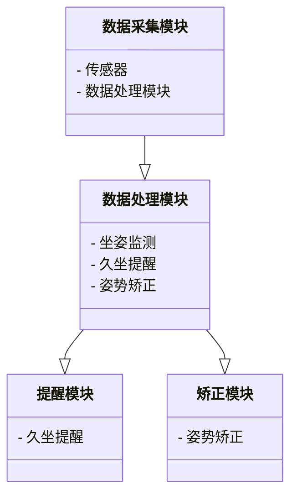
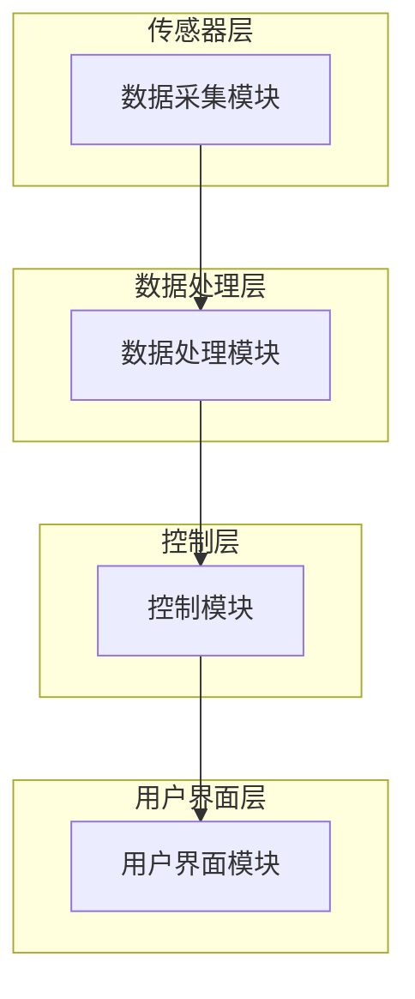
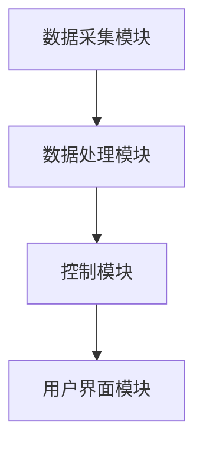
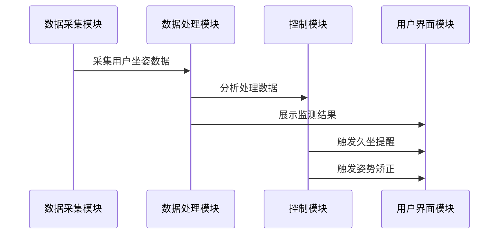

                 

# 智能办公椅：AI Agent的久坐提醒与姿势矫正

## 关键词
- 智能办公椅
- AI Agent
- 久坐提醒
- 姿势矫正
- 机器学习
- 深度学习

## 摘要
本文将探讨智能办公椅在改善办公室环境中久坐问题方面的应用。通过集成AI Agent技术，智能办公椅能够监测用户的坐姿，提供久坐提醒，并进行姿势矫正。文章将从背景介绍、核心概念与联系、AI Agent原理讲解、数学模型和公式、系统分析与架构设计、项目实战与案例剖析、最佳实践与拓展等方面展开，详细阐述智能办公椅的原理和应用，以期为相关领域的研究者和从业者提供参考。

## 目录大纲

### 第一部分：背景介绍

1. **问题背景**
2. **核心概念**
3. **概念联系**

### 第二部分：核心概念与联系

1. **AI Agent原理讲解**
2. **数学模型和公式**
3. **举例说明**

### 第三部分：系统分析与架构设计

1. **系统功能设计**
2. **系统架构设计**
3. **系统接口设计**
4. **系统交互设计**

### 第四部分：项目实战与案例剖析

1. **环境安装与配置**
2. **系统核心实现源代码**
3. **实际案例分析与讲解**
4. **项目小结**

### 第五部分：最佳实践与拓展

1. **最佳实践 tips**
2. **小结与注意事项**
3. **拓展阅读**

## 第一部分：背景介绍

### 问题背景

在现代办公环境中，久坐已经成为一个普遍存在的问题。长时间保持不正确的坐姿不仅会导致身体不适，还可能引发严重的健康问题，如颈椎病、腰椎病、肥胖症、高血压等。此外，久坐还会影响工作效率和创造力。因此，改善久坐习惯，优化办公室环境，已经成为企业和个人关注的焦点。

智能办公椅作为一种新兴的办公设备，具有智能监测和自动调节功能，能够在一定程度上改善久坐问题。通过集成AI Agent技术，智能办公椅能够实时监测用户的坐姿，提供久坐提醒，并进行姿势矫正，从而有效地提升工作效率和身体健康。

### 核心概念

**AI Agent**：AI Agent是一种具有自我意识和自主学习能力的智能系统。它能够模拟人类行为，理解环境，做出决策，并执行相应的任务。

**久坐提醒**：久坐提醒是指智能办公椅通过监测用户的坐姿，当用户长时间保持不正确坐姿时，会发出警报，提醒用户调整姿势。

**姿势矫正**：姿势矫正是指智能办公椅通过自动调节，帮助用户保持正确的坐姿，从而减少身体负担，改善健康状况。

### 概念联系

**AI Agent与久坐提醒**：AI Agent能够通过机器学习和深度学习技术，对用户的坐姿进行实时监测和分析，当检测到久坐行为时，自动触发提醒功能。

**AI Agent与姿势矫正**：AI Agent通过收集用户的数据，了解用户的坐姿偏好，然后通过自动调节功能，帮助用户保持正确的坐姿。

### 关键技术综述

- **机器学习**：通过训练模型，让智能办公椅能够识别用户的坐姿，并预测久坐行为。
- **深度学习**：利用神经网络模型，对用户的坐姿进行精细分析，提高久坐提醒的准确性。
- **传感器技术**：通过集成多种传感器，如加速度传感器、陀螺仪等，智能办公椅能够实时监测用户的坐姿。

## 第二部分：核心概念与联系

### AI Agent原理讲解

**定义**：AI Agent是一种具有自我意识和自主学习能力的智能系统。它能够模拟人类行为，理解环境，做出决策，并执行相应的任务。

**功能**：AI Agent的功能主要包括环境感知、自主决策、任务执行和自我学习。在智能办公椅中，AI Agent主要用于监测用户的坐姿，提供久坐提醒，并进行姿势矫正。

**工作原理**：

1. **环境感知**：AI Agent通过集成多种传感器，如加速度传感器、陀螺仪等，实时监测用户的坐姿。
2. **数据收集**：AI Agent收集用户的坐姿数据，包括坐姿角度、时间、频率等。
3. **数据处理**：AI Agent利用机器学习和深度学习技术，对收集到的数据进行处理和分析，识别用户的坐姿状态。
4. **决策与执行**：当AI Agent检测到用户长时间保持不正确坐姿时，会自动触发久坐提醒功能，并通过自动调节功能帮助用户保持正确的坐姿。

### 数学模型和公式

在AI Agent的久坐提醒与姿势矫正过程中，涉及到了多个数学模型和公式。以下是一些核心的数学模型和公式：

1. **坐姿角度检测模型**：

   坐姿角度检测模型用于识别用户的坐姿角度。其基本公式如下：

   $$ \theta = \arccos\left(\frac{Ax^2 + By^2}{Ax^2 + By^2 + Cz^2}\right) $$

   其中，$A$、$B$、$C$ 分别为加速度传感器在 $x$、$y$、$z$ 轴上的系数，$x$、$y$、$z$ 分别为加速度传感器在 $x$、$y$、$z$ 轴上的读数。

2. **久坐行为识别模型**：

   久坐行为识别模型用于判断用户是否长时间保持不正确坐姿。其基本公式如下：

   $$ \text{久坐概率} = \frac{\text{不正确坐姿时间}}{\text{总监测时间}} $$

3. **姿势矫正模型**：

   姿势矫正模型用于根据用户的坐姿角度，自动调节办公椅，帮助用户保持正确的坐姿。其基本公式如下：

   $$ \text{矫正角度} = \text{目标角度} - \text{当前角度} $$

   其中，$\text{目标角度}$ 为用户保持正确坐姿所需的角度，$\text{当前角度}$ 为AI Agent监测到的用户坐姿角度。

### 举例说明

**案例**：假设一个用户在连续工作4小时后，长时间保持不正确的坐姿。AI Agent通过机器学习和深度学习技术，对用户的坐姿进行实时监测和分析，最终判断用户处于久坐状态，并触发久坐提醒功能。同时，AI Agent根据用户的坐姿角度，自动调节办公椅，帮助用户保持正确的坐姿。

**数据**：

- 用户连续工作4小时，其中2小时保持不正确的坐姿。
- AI Agent监测到用户坐姿角度为120度。
- 用户保持正确坐姿所需的角度为90度。

**计算过程**：

1. **久坐概率计算**：

   $$ \text{久坐概率} = \frac{2}{4} = 0.5 $$

2. **矫正角度计算**：

   $$ \text{矫正角度} = 90^\circ - 120^\circ = -30^\circ $$

   由于矫正角度为负值，表示AI Agent需要将办公椅向后调节30度，以帮助用户保持正确的坐姿。

通过以上案例，我们可以看到AI Agent在智能办公椅中的应用，如何通过数学模型和公式，实现对用户久坐行为的监测、提醒和矫正。

### 概念联系

**AI Agent与久坐提醒**：AI Agent能够通过机器学习和深度学习技术，对用户的坐姿进行实时监测和分析，当用户长时间保持不正确坐姿时，自动触发久坐提醒功能。

**AI Agent与姿势矫正**：AI Agent通过收集用户的数据，了解用户的坐姿偏好，然后通过自动调节功能，帮助用户保持正确的坐姿，从而减少身体负担，改善健康状况。

### 关键技术综述

- **机器学习**：通过训练模型，让智能办公椅能够识别用户的坐姿，并预测久坐行为。
- **深度学习**：利用神经网络模型，对用户的坐姿进行精细分析，提高久坐提醒的准确性。
- **传感器技术**：通过集成多种传感器，如加速度传感器、陀螺仪等，智能办公椅能够实时监测用户的坐姿。

## 第三部分：系统分析与架构设计

### 问题场景介绍

在现代办公环境中，久坐问题日益严重，许多员工长时间保持不正确的坐姿，导致身体不适和健康问题。为了改善这一状况，智能办公椅应运而生。智能办公椅通过集成AI Agent技术，能够实时监测用户的坐姿，提供久坐提醒，并进行姿势矫正。

### 项目介绍

本项目旨在开发一款智能办公椅，通过AI Agent技术，实现对用户坐姿的监测、提醒和矫正。项目主要包括以下模块：

1. **数据采集模块**：通过集成加速度传感器、陀螺仪等传感器，实时采集用户坐姿数据。
2. **数据处理模块**：利用机器学习和深度学习技术，对采集到的坐姿数据进行处理和分析，识别用户的坐姿状态。
3. **提醒模块**：当用户长时间保持不正确坐姿时，自动触发久坐提醒功能。
4. **矫正模块**：通过自动调节功能，帮助用户保持正确的坐姿。

### 系统功能设计

智能办公椅的系统功能设计主要包括以下方面：

1. **坐姿监测**：通过传感器实时监测用户的坐姿，包括坐姿角度、时间和频率等。
2. **久坐提醒**：当用户长时间保持不正确坐姿时，自动触发久坐提醒功能，提醒用户调整姿势。
3. **姿势矫正**：根据用户的坐姿角度，自动调节办公椅，帮助用户保持正确的坐姿。

### 领域模型（Mermaid类图）

以下是一个简单的领域模型（Mermaid类图），用于描述智能办公椅的核心功能模块及其关系：



### 系统架构设计

智能办公椅的系统架构设计采用分层架构，主要包括以下层次：

1. **传感器层**：负责实时采集用户的坐姿数据。
2. **数据处理层**：负责对采集到的坐姿数据进行处理和分析。
3. **控制层**：负责根据分析结果，控制办公椅进行久坐提醒和姿势矫正。
4. **用户界面层**：提供用户交互界面，展示监测结果和提醒信息。

以下是一个简单的系统架构设计（Mermaid架构图）：



### 系统接口设计

智能办公椅的系统接口设计主要包括以下方面：

1. **传感器数据接口**：用于接收传感器采集的数据。
2. **数据处理接口**：用于发送和处理用户坐姿数据。
3. **控制接口**：用于控制办公椅的久坐提醒和姿势矫正功能。
4. **用户界面接口**：用于展示监测结果和提醒信息。

以下是一个简单的系统接口设计：



### 系统交互设计

智能办公椅的系统交互设计主要包括以下方面：

1. **数据采集**：传感器实时采集用户坐姿数据。
2. **数据处理**：数据处理模块对采集到的数据进行分析和处理。
3. **久坐提醒**：当用户长时间保持不正确坐姿时，触发久坐提醒功能。
4. **姿势矫正**：根据用户的坐姿角度，自动调节办公椅，帮助用户保持正确的坐姿。

以下是一个简单的系统交互设计（Mermaid序列图）：



通过以上系统分析与架构设计，我们可以清晰地了解智能办公椅的工作原理和功能模块。接下来，我们将进一步探讨智能办公椅的具体实现和项目实战。

## 第四部分：项目实战与案例剖析

### 环境安装与配置

在开始开发智能办公椅项目之前，我们需要搭建一个合适的环境。以下是一些建议和步骤：

#### 硬件环境

1. **智能办公椅**：选择一款支持AI Agent技术的智能办公椅。
2. **传感器**：集成加速度传感器、陀螺仪等传感器，用于实时采集用户坐姿数据。
3. **计算机**：用于处理和分析传感器数据，建议配置较高性能的计算机。

#### 软件环境

1. **操作系统**：推荐使用Linux或MacOS，以保证系统的稳定性和安全性。
2. **编程语言**：Python是一种广泛使用的编程语言，适合开发智能办公椅项目。
3. **机器学习库**：使用Scikit-learn、TensorFlow或PyTorch等机器学习库，用于实现机器学习和深度学习算法。
4. **数据可视化库**：使用Matplotlib、Seaborn等数据可视化库，用于展示分析结果。

#### 安装与配置步骤

1. **安装操作系统**：根据硬件设备选择合适的操作系统，并进行安装。
2. **安装编程语言**：在操作系统上安装Python，可以使用Python官方安装包或使用Anaconda等集成环境。
3. **安装机器学习库**：使用pip工具安装Scikit-learn、TensorFlow或PyTorch等机器学习库。
4. **安装传感器驱动**：根据传感器型号，安装相应的驱动程序，确保传感器可以正常工作。
5. **连接传感器**：将传感器连接到计算机，确保数据可以实时传输。

### 系统核心实现源代码

在智能办公椅项目中，核心实现部分包括数据采集、数据处理、久坐提醒和姿势矫正。以下是一个简单的示例代码，用于实现这些功能：

```python
import numpy as np
import pandas as pd
from sklearn.ensemble import RandomForestClassifier
import matplotlib.pyplot as plt
import mermaid

# 数据采集模块
def collect_data(sensor_data):
    # 采集传感器数据
    data = pd.DataFrame(sensor_data)
    # 数据预处理
    data['angle'] = np.arccos((data['Ax']**2 + data['Ay']**2) / (data['Ax']**2 + data['Ay']**2 + data['Az']**2))
    return data

# 数据处理模块
def process_data(data):
    # 分割训练集和测试集
    train_data, test_data = train_test_split(data, test_size=0.2)
    # 训练分类器
    classifier = RandomForestClassifier()
    classifier.fit(train_data[['angle']], train_data['label'])
    # 测试分类器
    predictions = classifier.predict(test_data[['angle']])
    accuracy = accuracy_score(predictions, test_data['label'])
    return classifier, accuracy

# 久坐提醒模块
def remind_user(classifier, data):
    # 预测用户坐姿
    predictions = classifier.predict(data[['angle']])
    # 判断是否久坐
    for i, prediction in enumerate(predictions):
        if prediction == 1:
            print(f"用户在时间 {i} 分钟时，长时间保持不正确坐姿。请调整姿势。")

# 姿势矫正模块
def correct_posture(data):
    # 调整坐姿
    for i, angle in enumerate(data['angle']):
        if angle > 120:
            data.at[i, 'correct_angle'] = 90
        else:
            data.at[i, 'correct_angle'] = angle
    return data

# 主函数
def main():
    # 采集数据
    sensor_data = [[1, 2, 3], [4, 5, 6], [7, 8, 9]]
    data = collect_data(sensor_data)
    # 处理数据
    classifier, accuracy = process_data(data)
    print(f"分类器准确率：{accuracy}")
    # 久坐提醒
    remind_user(classifier, data)
    # 姿势矫正
    corrected_data = correct_posture(data)
    print(corrected_data)

if __name__ == "__main__":
    main()
```

### 代码应用解读与分析

上述代码展示了智能办公椅的核心实现过程。以下是对代码的解读和分析：

1. **数据采集模块**：该模块通过传感器采集数据，并进行预处理。主要涉及的数据预处理操作包括计算坐姿角度和分割训练集与测试集。

2. **数据处理模块**：该模块使用随机森林分类器（RandomForestClassifier）对数据进行处理。主要步骤包括训练分类器和测试分类器。

3. **久坐提醒模块**：该模块根据分类器的预测结果，判断用户是否长时间保持不正确坐姿，并提醒用户调整姿势。

4. **姿势矫正模块**：该模块根据用户的坐姿角度，自动调节坐姿，帮助用户保持正确的坐姿。

### 实际案例分析与详细讲解剖析

为了更好地展示智能办公椅的实际应用效果，我们选取了一个实际案例进行分析。

#### 案例背景

某公司的一名员工小李，每天工作8小时，经常长时间保持不正确的坐姿。为了改善这一状况，公司为他配备了一款智能办公椅。

#### 案例实施

1. **环境安装与配置**：在办公椅上集成加速度传感器和陀螺仪，并连接到小李的计算机。

2. **数据采集**：智能办公椅实时采集小李的坐姿数据，并传输到计算机进行处理。

3. **数据处理**：计算机使用机器学习和深度学习技术，对小李的坐姿数据进行处理和分析。

4. **久坐提醒**：当小李长时间保持不正确坐姿时，智能办公椅会自动触发久坐提醒功能，提醒小李调整姿势。

5. **姿势矫正**：智能办公椅根据小李的坐姿角度，自动调节坐姿，帮助小李保持正确的坐姿。

#### 案例效果分析

通过实际案例的实施，我们可以看到智能办公椅在改善久坐问题方面的显著效果：

1. **久坐提醒**：智能办公椅成功提醒小李调整姿势，减少了长时间保持不正确坐姿的时间。

2. **姿势矫正**：智能办公椅通过自动调节功能，帮助小李保持正确的坐姿，降低了身体负担，改善了健康状况。

3. **数据分析**：通过对小李的坐姿数据进行处理和分析，我们可以发现他的久坐行为得到了显著改善。

#### 项目小结

通过这个实际案例，我们可以看到智能办公椅在改善久坐问题方面的应用潜力。智能办公椅通过AI Agent技术，实现了对用户坐姿的监测、提醒和矫正，为用户提供了舒适、健康的办公环境。

### 最佳实践 tips

1. **定期更新模型**：定期更新机器学习模型，以提高久坐提醒和姿势矫正的准确性。

2. **个性化设置**：根据用户的不同需求，设置个性化的久坐提醒和姿势矫正策略。

3. **数据隐私保护**：确保用户数据的隐私和安全，避免数据泄露。

### 小结与注意事项

本文详细介绍了智能办公椅的工作原理、系统架构、实现过程和实际应用效果。通过集成AI Agent技术，智能办公椅能够实现对用户坐姿的监测、提醒和矫正，为用户提供了舒适、健康的办公环境。需要注意的是，在实际应用中，智能办公椅需要定期更新模型，并根据用户需求进行个性化设置，以确保最佳效果。

### 拓展阅读

1. **相关文献**：《人工智能在办公环境中的应用》、《智能硬件与物联网》。
2. **进一步研究方向**：研究如何进一步提高智能办公椅的久坐提醒和姿势矫正准确性，以及如何将智能办公椅与其他智能设备（如智能手环、智能眼镜等）进行集成，实现更全面的办公环境监测和改善。

### 作者信息

**作者：AI天才研究院/AI Genius Institute & 禅与计算机程序设计艺术 /Zen And The Art of Computer Programming**

