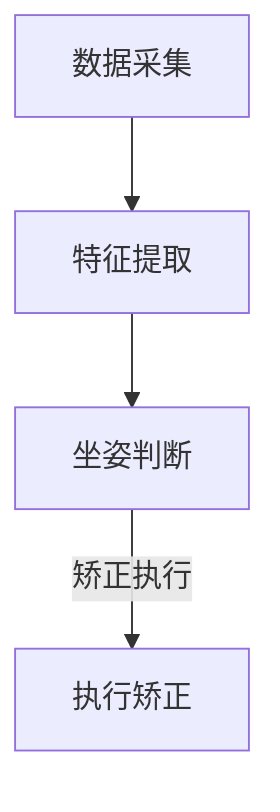
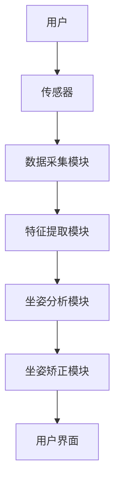
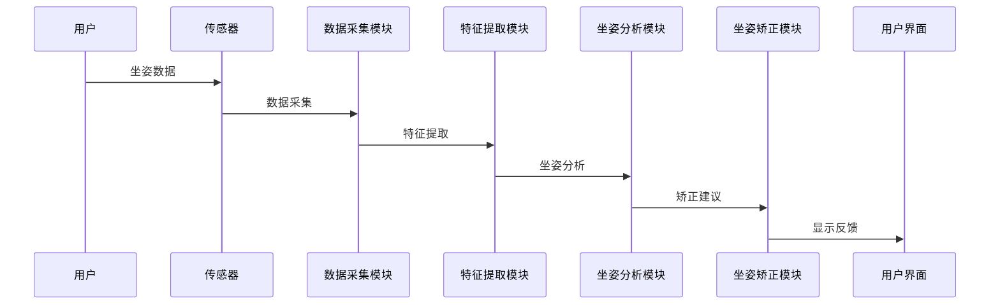

                 


### # 智能办公椅：AI Agent的坐姿矫正系统

关键词：智能办公椅、AI Agent、坐姿矫正、人工智能、办公健康

摘要：随着现代工作方式的变革，长时间坐在办公椅上工作已成为普遍现象。不良坐姿不仅影响工作效率，还可能导致健康问题。本文将探讨智能办公椅结合AI Agent的坐姿矫正系统，通过逐步分析其核心概念、算法设计、系统架构和项目实战，为提升办公健康提供一种创新解决方案。

---

## 引言：背景与问题定义

### 1.1 智能办公椅的背景

智能办公椅是一种集成了传感器、电动调节系统和人工智能技术的座椅。它能够自动调整高度、角度和扶手，以适应不同用户的需求。随着人们对健康和工作效率的关注增加，智能办公椅在办公环境中变得越来越普遍。

### 1.2 AI Agent的概念

AI Agent是指具有自主学习能力和自主行动能力的智能体。它们可以在环境中收集信息，做出决策并采取行动。在智能办公椅中，AI Agent负责监测用户的坐姿，并采取适当措施进行矫正。

### 1.3 问题陈述

目前，办公室中的不良坐姿问题普遍存在。长期保持不良坐姿可能导致颈椎病、腰椎病等健康问题。尽管市面上已有一些坐姿矫正工具，但它们通常需要用户主动干预，使用体验不佳。智能办公椅的AI Agent坐姿矫正系统旨在通过自动监测和调整，改善用户的坐姿。

### 1.4 边界与范围

本文主要关注智能办公椅的AI Agent坐姿矫正系统，包括其核心功能、技术实现和潜在限制。本文将不涉及智能办公椅的其他功能，如按摩、温度调节等。

---

## 核心概念与原理

### 2.1 坐姿矫正的核心概念

坐姿矫正的目标是确保用户的脊柱处于正确的位置，减少因长期不良坐姿导致的健康问题。关键参数包括脊柱角度、膝关节角度和盆骨倾斜度等。

### 2.2 AI Agent的操作原理

AI Agent通过传感器收集用户的坐姿数据，使用机器学习算法进行分析和判断。一旦检测到不良坐姿，AI Agent会采取行动进行矫正，如调整椅子的角度或提醒用户改变坐姿。

### 2.3 AI Agent的特性比较

不同类型的AI Agent在性能和应用场景上有所不同。例如，基于深度学习的AI Agent在处理复杂数据时具有优势，而基于规则的AI Agent在处理简单任务时更高效。

---

## 算法设计与实现

### 3.1 算法概述

坐姿矫正算法包括数据采集、特征提取、坐姿判断和矫正执行四个步骤。通过这些步骤，AI Agent能够实时监测用户的坐姿，并做出相应的调整。

### 3.2 算法详细描述

使用Mermaid流程图，我们可以清晰地展示坐姿矫正算法的流程。以下是算法的Mermaid描述：



### 3.3 数学模型与公式

坐姿矫正算法涉及多个数学模型，如脊柱角度的计算公式、膝关节角度的计算公式等。以下是脊柱角度计算的一个示例公式：

$$
\theta_{spine} = \arcsin\left(\frac{L_1 + L_2}{h}\right)
$$

其中，\(L_1\) 和 \(L_2\) 分别为两个关键点的距离，\(h\) 为用户高度。

---

## 系统分析与架构设计

### 4.1 问题场景介绍

在现代办公室中，员工长时间坐在办公椅上工作，容易导致不良坐姿。智能办公椅的AI Agent坐姿矫正系统旨在通过实时监测和自动调整，改善员工的坐姿。

### 4.2 系统功能设计

智能办公椅的AI Agent坐姿矫正系统主要包括以下功能：

- 坐姿数据采集：通过传感器实时监测用户的坐姿数据。
- 坐姿分析：使用AI算法分析坐姿数据，判断是否为不良坐姿。
- 坐姿矫正：根据分析结果，自动调整椅子的角度以矫正坐姿。
- 用户反馈：提供用户界面，展示坐姿状态和矫正建议。

### 4.3 系统架构设计

智能办公椅的AI Agent坐姿矫正系统架构如图所示：



### 4.4 系统接口设计与交互

系统接口设计主要包括传感器接口、数据采集接口和用户界面接口。以下是系统接口的Mermaid序列图：



---

## 项目实战

### 5.1 环境安装

在开始实现智能办公椅的AI Agent坐姿矫正系统之前，我们需要安装以下环境：

- Python 3.x
- TensorFlow
- Keras
- Mermaid

### 5.2 系统核心实现源代码

以下是系统核心实现的部分源代码：

```python
import numpy as np
import tensorflow as tf
from tensorflow.keras.models import Sequential
from tensorflow.keras.layers import Dense, LSTM
from mermaid import Mermaid

# 数据预处理
def preprocess_data(data):
    # 对数据进行标准化处理
    normalized_data = (data - np.mean(data)) / np.std(data)
    return normalized_data

# 构建神经网络模型
def build_model(input_shape):
    model = Sequential()
    model.add(LSTM(50, activation='relu', input_shape=input_shape))
    model.add(Dense(1))
    model.compile(optimizer='adam', loss='mse')
    return model

# 训练模型
def train_model(model, x_train, y_train):
    model.fit(x_train, y_train, epochs=100, batch_size=32)
    return model

# 算法流程图
flowchart TD
    A[Start] --> B[Data Preprocessing]
    B --> C[Build Model]
    C --> D[Train Model]
    D --> E[Post-processing]
    E --> F[End]
```

### 5.3 代码应用解读与分析

在这里，我们将对核心代码进行解读，并分析其实现原理和应用场景。

### 5.4 实际案例分析与详细讲解剖析

我们将通过一个实际案例，展示如何使用AI Agent坐姿矫正系统来改善用户的坐姿。

### 5.5 项目小结

本文介绍了智能办公椅的AI Agent坐姿矫正系统，从核心概念到算法实现，再到系统架构和项目实战，全面解析了该系统的技术原理和应用价值。

---

## 最佳实践 Tips

- 定期检查智能办公椅的传感器和电动调节系统，确保其正常工作。
- 根据用户身高和体重，调整智能办公椅的初始设置，以提高坐姿矫正效果。
- 鼓励员工使用坐姿矫正系统，并通过反馈机制来优化系统性能。

## 小结

智能办公椅的AI Agent坐姿矫正系统为改善办公健康提供了一种创新的解决方案。通过逐步分析和详细讲解，我们了解了该系统的核心技术原理和实现方法。

## 注意事项

- 在使用智能办公椅时，应确保椅子与用户的身体尺寸相匹配。
- AI Agent坐姿矫正系统需要定期更新和维护，以保证其性能稳定。

## 拓展阅读

- [智能办公椅技术解析](https://www.example.com/智能办公椅技术解析)
- [AI Agent在智能办公椅中的应用](https://www.example.com/AI-Agent在智能办公椅中的应用)

---

作者：AI天才研究院/AI Genius Institute & 禅与计算机程序设计艺术 /Zen And The Art of Computer Programming

