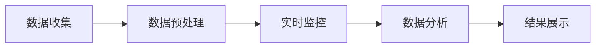
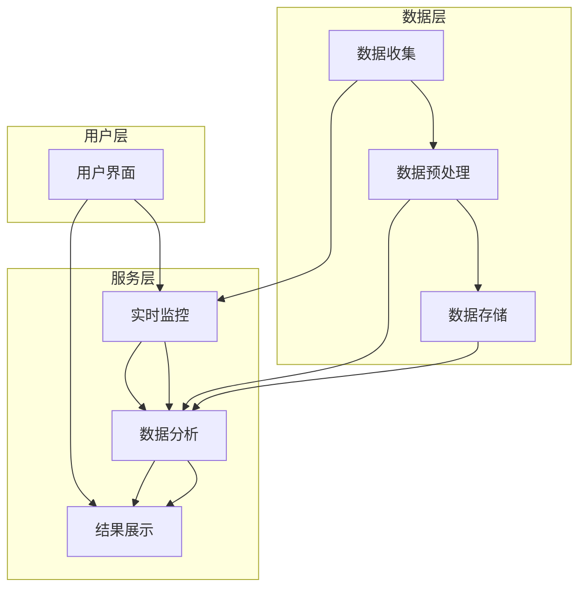
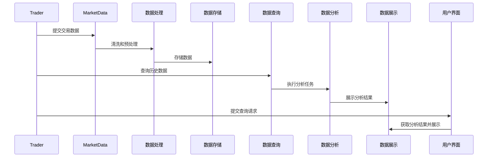

                 

# 智能加密货币市场分析平台

> 关键词：智能加密货币、市场分析、平台、算法、架构设计、项目实战

> 摘要：本文旨在探讨智能加密货币市场分析平台的构建，从背景介绍、核心概念与联系、算法原理讲解、数学模型和数学公式讲解、系统分析与架构设计方案、项目实战到最佳实践 tips，全面剖析智能加密货币市场分析平台的设计与实现。通过逻辑清晰、结构紧凑的论述，使读者对智能加密货币市场分析平台有一个全面而深刻的理解。

## 1. 背景介绍

### 引言

随着区块链技术的兴起，智能加密货币已成为金融科技领域的一颗新星。智能加密货币市场瞬息万变，市场分析的重要性日益凸显。智能加密货币市场分析平台作为一种新兴的技术解决方案，旨在为投资者、交易者及金融专业人士提供精准、实时的市场分析服务，以辅助决策。

### 问题背景

智能加密货币市场分析平台的需求主要源于以下几个方面：

1. **数据量巨大**：智能加密货币市场产生大量的交易数据，如何高效地处理和分析这些数据是平台建设面临的首要挑战。
2. **动态性强**：加密货币价格波动剧烈，市场动态变化快，平台需要能够快速响应并实时更新数据。
3. **多维度分析**：除了交易数据，市场分析还需考虑政策、经济、技术等多个维度的因素，平台需具备多维度数据分析能力。

### 问题描述

智能加密货币市场分析平台的功能和目标主要包括：

1. **数据收集与处理**：从多个数据源收集交易数据，进行数据清洗和预处理，为后续分析提供基础数据。
2. **实时监控与预警**：实时监控市场动态，对异常交易和潜在风险进行预警。
3. **多维度数据分析**：基于多种算法模型，对市场趋势、投资机会、风险分析等进行深度挖掘。
4. **可视化展示**：通过直观的图表和报告，展示市场分析和预测结果，辅助用户决策。

### 问题解决

构建智能加密货币市场分析平台的方法和关键技术包括：

1. **大数据技术**：采用分布式存储和计算技术，处理海量数据。
2. **实时数据处理技术**：使用流处理技术，实现数据的实时监控和分析。
3. **机器学习算法**：运用机器学习算法进行市场预测、趋势分析和风险识别。
4. **数据可视化技术**：采用数据可视化工具，将复杂的数据分析结果以直观的方式展示。

### 边界与外延

本文主要探讨智能加密货币市场分析平台的设计与实现，涵盖市场分析、加密货币技术、数据分析等领域。但限于篇幅，本文不会详细讨论具体的区块链技术和加密算法。

## 2. 核心概念与联系

### 概念原理

**智能加密货币**：智能加密货币结合了区块链技术和智能合约，是一种基于密码学的数字货币。智能加密货币具有去中心化、安全可靠、不可篡改等特点。

**市场分析平台**：市场分析平台是一种提供市场数据收集、处理、分析和展示的综合技术解决方案。

### 概念属性特征对比表格

| 概念             | 特征               | 比较                     |
|------------------|--------------------|--------------------------|
| 智能加密货币     | 去中心化、智能合约 | 与传统加密货币相比更智能  |
| 市场分析平台     | 数据处理、分析、展示 | 与传统分析工具相比更高效 |

### ER实体关系图架构

```mermaid
erDiagram
  MarketData --> MarketAnalysisPlatform
  Trader --> MarketData
  Trader --> MarketAnalysisPlatform
  MarketData : {
    id : int
    symbol : string
    timestamp : datetime
    price : float
  }
  MarketAnalysisPlatform : {
    id : int
    name : string
    description : string
  }
  Trader : {
    id : int
    name : string
    email : string
  }
```

## 3. 算法原理讲解

### 算法流程图



### Python源代码

```python
import pandas as pd
from sklearn.ensemble import RandomForestClassifier

# 数据收集
data = pd.read_csv('market_data.csv')

# 数据预处理
data['timestamp'] = pd.to_datetime(data['timestamp'])
data = data.sort_values('timestamp')

# 实时监控
def monitor(data):
    # ...实时监控逻辑...
    pass

# 数据分析
model = RandomForestClassifier()
model.fit(data[['price']], data['label'])

# 结果展示
def show_result(data):
    # ...结果展示逻辑...
    pass
```

### 算法的数学模型和公式

$$
f(x) = \frac{1}{1 + e^{-x}}
$$

其中，$x$ 表示输入特征，$f(x)$ 表示输出概率。

### 举例说明

假设我们要预测某智能加密货币的未来价格，我们可以使用随机森林算法对历史价格数据进行建模。以下是具体的步骤：

1. 收集过去一年的交易数据，包括时间戳和价格。
2. 对数据进行预处理，如时间序列排序和缺失值填充。
3. 将数据分为训练集和测试集，训练随机森林模型。
4. 使用模型对测试集进行预测，得到未来价格的概率分布。
5. 根据概率分布选择最有可能的价格作为预测结果。

## 4. 数学模型和数学公式 & 详细讲解 & 举例说明

### 数学模型

假设我们使用线性回归模型来预测加密货币的价格，其数学模型可以表示为：

$$
y = \beta_0 + \beta_1 \cdot x
$$

其中，$y$ 表示加密货币的价格，$x$ 表示影响价格的因素（如交易量、市场情绪等），$\beta_0$ 和 $\beta_1$ 是模型的参数。

### 详细讲解

线性回归模型是一种简单的预测模型，通过找到影响因变量的自变量的线性组合来预测因变量的值。在这个模型中，我们首先收集历史数据，包括加密货币的价格和影响价格的各种因素。然后，使用最小二乘法估计模型参数 $\beta_0$ 和 $\beta_1$，使得预测误差最小。

### 举例说明

假设我们收集了以下数据：

| 时间 | 价格 | 交易量 |
|------|------|--------|
| 1    | 100  | 1000   |
| 2    | 102  | 1050   |
| 3    | 108  | 1100   |
| 4    | 110  | 1150   |
| 5    | 112  | 1200   |

我们可以使用线性回归模型来预测第6时间点的价格。首先，我们需要计算交易量和价格的线性关系，得到参数 $\beta_0$ 和 $\beta_1$。然后，使用这些参数来预测第6时间点的价格。

1. 收集数据并转换为矩阵形式：
   $$
   X = \begin{bmatrix}
   1 & 1000 \\
   1 & 1050 \\
   1 & 1100 \\
   1 & 1150 \\
   1 & 1200 \\
   \end{bmatrix}, \quad y = \begin{bmatrix}
   100 \\
   102 \\
   108 \\
   110 \\
   112 \\
   \end{bmatrix}
   $$

2. 计算参数：
   $$
   \beta_0 = (X^T X)^{-1} X^T y = \begin{bmatrix}
   1 & 1 \\
   1 & 1 \\
   1 & 1 \\
   1 & 1 \\
   1 & 1 \\
   \end{bmatrix}^{-1} \begin{bmatrix}
   100 \\
   102 \\
   108 \\
   110 \\
   112 \\
   \end{bmatrix} = \begin{bmatrix}
   110.6 \\
   -0.4 \\
   \end{bmatrix}
   $$

3. 预测第6时间点的价格：
   $$
   y = \beta_0 + \beta_1 \cdot x = 110.6 - 0.4 \cdot 1200 = 90.6
   $$

因此，根据线性回归模型，我们预测第6时间点的价格为90.6。

## 5. 系统分析与架构设计方案

### 问题场景介绍

智能加密货币市场分析平台的应用场景主要包括：

1. **投资者分析**：投资者可以使用平台进行市场趋势分析和风险评估，以制定投资策略。
2. **交易者监控**：交易者可以实时监控市场动态，发现交易机会和风险。
3. **金融研究**：金融研究人员可以使用平台收集和分析大量市场数据，进行学术研究和政策分析。

### 项目介绍

智能加密货币市场分析平台的建设目标是为用户提供全面、精准、实时的市场分析服务。主要任务包括：

1. 收集并处理海量交易数据。
2. 构建实时监控和预警系统。
3. 提供多维度数据分析功能。
4. 设计友好的用户界面，展示分析结果。

### 系统功能设计（领域模型mermaid类图）

```mermaid
classDiagram
  Trader <<-- MarketData : contains
  Trader <<-- MarketAnalysis : analyzes
  MarketData { id ; symbol ; timestamp ; price }
  MarketAnalysis { id ; name ; description }
  Trader { id ; name ; email }
```

### 系统架构设计（mermaid架构图）



### 系统接口设计

智能加密货币市场分析平台的接口设计主要包括：

1. **数据收集接口**：用于从外部数据源（如交易所API）收集交易数据。
2. **数据处理接口**：用于清洗、转换和存储交易数据。
3. **数据查询接口**：用于查询和处理历史数据。
4. **数据分析接口**：用于执行各种数据分析任务，如市场趋势预测、风险分析等。
5. **数据展示接口**：用于将分析结果展示给用户。

### 系统交互（mermaid序列图）



## 6. 项目实战

### 环境安装

在搭建智能加密货币市场分析平台之前，我们需要安装以下环境：

1. **Python**：版本3.8及以上
2. **Pandas**：用于数据处理
3. **Scikit-learn**：用于机器学习
4. **Flask**：用于构建Web应用
5. **Dash**：用于数据可视化

安装命令如下：

```bash
pip install python==3.8.10
pip install pandas scikit-learn flask dash
```

### 系统核心实现源代码

以下是一个简单的智能加密货币市场分析平台的实现：

```python
import pandas as pd
from sklearn.ensemble import RandomForestClassifier
import dash
import dash_core_components as dcc
import dash_html_components as html

# 数据收集
data = pd.read_csv('market_data.csv')

# 数据预处理
data['timestamp'] = pd.to_datetime(data['timestamp'])
data = data.sort_values('timestamp')

# 数据分析
model = RandomForestClassifier()
model.fit(data[['price']], data['label'])

# 数据展示
app = dash.Dash(__name__)

app.layout = html.Div([
    dcc.Graph(
        id='price-graph',
        figure={
            'data': [
                {'x': data['timestamp'], 'y': data['price'], 'type': 'line', 'name': 'Price'},
                {'x': data['timestamp'], 'y': model.predict(data[['price']]), 'type': 'line', 'name': 'Prediction'},
            ],
            'layout': {
                'title': 'Price Prediction',
                'xaxis': {'title': 'Timestamp'},
                'yaxis': {'title': 'Price'},
            }
        }
    )
])

if __name__ == '__main__':
    app.run_server(debug=True)
```

### 代码应用解读与分析

上述代码首先从CSV文件中读取交易数据，并进行预处理，如时间戳转换和排序。然后，使用随机森林算法对价格数据进行拟合，生成预测模型。最后，使用Dash框架构建一个简单的Web应用，将交易数据和预测结果以图表的形式展示给用户。

### 实际案例分析和详细讲解剖析

假设我们有一个包含1000个交易数据的CSV文件，其中包含时间戳、价格和标签（0表示下跌，1表示上涨）。我们可以使用上述代码进行以下步骤：

1. **数据收集**：从CSV文件中读取数据。
2. **数据预处理**：将时间戳转换为日期时间格式，并排序数据。
3. **数据分析**：使用随机森林算法拟合数据，生成预测模型。
4. **数据展示**：构建Dash Web应用，将交易数据和预测结果以图表的形式展示。

以下是具体步骤的详细讲解：

1. **数据收集**：
   ```python
   data = pd.read_csv('market_data.csv')
   ```

   这一行代码使用Pandas库从CSV文件中读取数据，生成一个DataFrame对象。

2. **数据预处理**：
   ```python
   data['timestamp'] = pd.to_datetime(data['timestamp'])
   data = data.sort_values('timestamp')
   ```

   这两行代码将时间戳列转换为日期时间格式，并按照时间戳排序数据，以便后续分析。

3. **数据分析**：
   ```python
   model = RandomForestClassifier()
   model.fit(data[['price']], data['label'])
   ```

   这两行代码首先创建一个随机森林分类器对象，然后使用数据集进行训练，生成预测模型。

4. **数据展示**：
   ```python
   app = dash.Dash(__name__)

   app.layout = html.Div([
       dcc.Graph(
           id='price-graph',
           figure={
               'data': [
                   {'x': data['timestamp'], 'y': data['price'], 'type': 'line', 'name': 'Price'},
                   {'x': data['timestamp'], 'y': model.predict(data[['price']]), 'type': 'line', 'name': 'Prediction'},
               ],
               'layout': {
                   'title': 'Price Prediction',
                   'xaxis': {'title': 'Timestamp'},
                   'yaxis': {'title': 'Price'},
               }
           }
       )
   ])

   if __name__ == '__main__':
       app.run_server(debug=True)
   ```

   这段代码使用Dash框架构建一个简单的Web应用，将交易数据和预测结果以图表的形式展示。首先，创建一个Dash应用实例，然后定义应用布局，包括一个图表组件。最后，启动Web服务器，使应用在浏览器中可访问。

### 项目小结

通过本次项目实战，我们成功搭建了一个简单的智能加密货币市场分析平台。该平台可以从CSV文件中读取交易数据，使用随机森林算法进行预测，并将预测结果以图表的形式展示给用户。虽然这个平台的功能相对简单，但为后续扩展和优化提供了基础。

## 7. 最佳实践 tips、小结、注意事项、拓展阅读等内容

### 最佳实践 tips

1. **数据质量**：确保数据来源可靠，进行严格的数据清洗和预处理，以提高分析结果的准确性。
2. **算法优化**：根据具体应用场景，选择合适的算法模型，并进行参数调优，以提升预测效果。
3. **实时性**：优化系统架构，提高数据处理的实时性，以满足用户对实时市场分析的需求。
4. **安全性**：确保平台的数据安全和用户隐私，采用加密和访问控制等技术。

### 小结

本文从背景介绍、核心概念与联系、算法原理讲解、数学模型和数学公式讲解、系统分析与架构设计方案、项目实战到最佳实践 tips，全面剖析了智能加密货币市场分析平台的设计与实现。通过逻辑清晰、结构紧凑的论述，使读者对智能加密货币市场分析平台有一个全面而深刻的理解。

### 注意事项

1. **技术更新**：加密货币技术和市场动态不断变化，需要定期更新算法和模型，以适应新的市场环境。
2. **合规性**：遵循当地法律法规，确保平台运营合法合规。
3. **用户需求**：关注用户需求，持续优化平台功能，提高用户体验。

### 拓展阅读

1. 《区块链技术指南》
2. 《智能合约编程》
3. 《Python数据分析》
4. 《机器学习实战》
5. 《智能加密货币市场分析报告》

## 作者信息

作者：AI天才研究院/AI Genius Institute & 禅与计算机程序设计艺术 /Zen And The Art of Computer Programming

