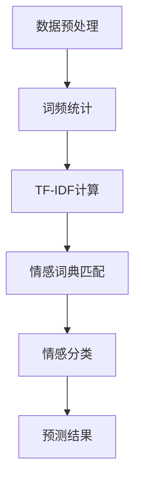
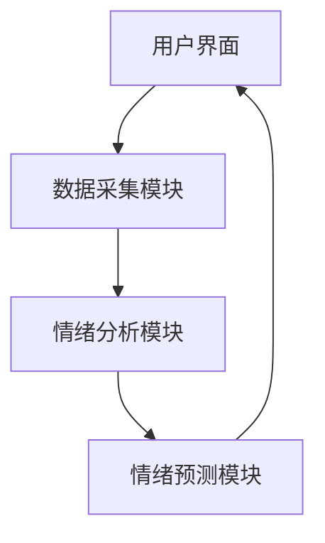

                 

### 第1章：加密货币市场情绪分析概述

#### 1.1 加密货币市场的特点

加密货币，作为一种数字资产，具有去中心化、匿名性和安全性等特点。与传统的货币不同，加密货币的发行和交易不受中央银行的直接控制，而是通过分布式网络进行验证和记录。这种特性使得加密货币市场具有独特的波动性和风险。

**1.1.1 加密货币的定义与历史背景**

加密货币的定义：加密货币是一种使用密码学原理来确保交易安全及控制交易单位创造的交易媒介。最早出现的加密货币是比特币，它由中本聪（Satoshi Nakamoto）在2008年提出，并于2009年问世。

**1.1.2 加密货币市场的波动性与风险**

加密货币市场的波动性：加密货币的价格波动剧烈，这种波动性一方面来源于市场的供求关系，另一方面受到投资者情绪、监管政策变化、宏观经济环境等因素的影响。

加密货币市场的风险：加密货币市场的风险包括价格波动风险、技术风险、法律风险等。价格波动风险指的是加密货币价格可能发生急剧的上涨或下跌，导致投资者可能遭受重大损失。技术风险则是指加密货币系统的安全性、稳定性可能受到攻击，导致数据泄露或系统崩溃。法律风险则包括政策变化可能带来的不确定性，以及不同国家或地区对于加密货币的法律规定的差异。

**1.1.3 市场情绪分析的重要性**

市场情绪分析在加密货币市场中具有重要作用。市场情绪反映了投资者的态度和预期，对市场价格产生直接影响。通过对市场情绪的深入分析，投资者可以更准确地把握市场动态，制定更有效的投资策略。

#### 1.2 市场情绪的概念与影响

**1.2.1 市场情绪的定义**

市场情绪，也称为市场心态或市场心理，是指市场中所有参与者对某一资产价格变动趋势的一致看法和预期。市场情绪可以通过各种指标和信号来衡量，如社交媒体上的评论、新闻报道的倾向、交易量的变化等。

**1.2.2 市场情绪的测量方法**

测量市场情绪的方法包括定量和定性两种。定量方法主要包括情绪指数（Sentiment Index）、波动率指数（VIX）等。定性方法则主要通过分析市场评论、新闻报道和投资者行为等来评估市场情绪。

**1.2.3 市场情绪对加密货币价格的影响**

市场情绪对加密货币价格有着显著的影响。当市场情绪乐观时，投资者倾向于大量购买加密货币，导致价格上涨；相反，当市场情绪悲观时，投资者倾向于抛售加密货币，导致价格下跌。因此，对市场情绪的准确分析对于预测加密货币价格的走势具有重要意义。

#### 1.3 情绪分析的关键概念

**1.3.1 情绪分析的步骤**

情绪分析通常包括以下步骤：数据收集、情感分类、情感分析、结果解释和行动建议。数据收集包括获取社交媒体、新闻报道和交易数据等；情感分类则是对文本进行情感标注，如正面、负面或中性；情感分析是对标注后的文本进行分析，提取情绪特征；结果解释和行动建议则基于分析结果，为投资者提供参考。

**1.3.2 文本分析技术**

文本分析技术包括自然语言处理（NLP）和机器学习算法。NLP用于处理和解析文本数据，如词性标注、句法分析等；机器学习算法则用于训练模型，从文本数据中提取情绪特征，如情感分类、主题模型等。

**1.3.3 预测模型概述**

预测模型用于预测市场情绪的未来变化。常见的预测模型包括线性回归、决策树、随机森林、神经网络等。这些模型可以通过训练历史数据来学习情绪变化的规律，从而对未来情绪进行预测。

### 总结

本章对加密货币市场情绪分析进行了概述，介绍了加密货币市场的特点、市场情绪的概念及其测量方法，以及情绪分析的关键概念。在接下来的章节中，我们将进一步深入探讨核心概念之间的联系，以及具体的算法原理和应用。

### 关键词

- 加密货币
- 市场情绪
- 情绪分析
- 预测模型
- 文本分析技术

### 摘要

本文旨在探讨加密货币市场情绪分析的重要性及其对市场价格的影响。通过介绍加密货币市场的特点、市场情绪的定义和测量方法，以及情绪分析的关键概念，本文为后续章节奠定了基础。我们还将讨论如何利用文本分析技术和预测模型对市场情绪进行分析和预测，以帮助投资者更准确地把握市场动态，制定有效的投资策略。

----------------------------------------------------------------

## 第2章：核心概念与联系

### 2.1 智能加密货币

**2.1.1 智能加密货币的定义**

智能加密货币，也称为智能币，是基于区块链技术和智能合约的加密货币。智能加密货币不仅具有传统加密货币的去中心化、安全性和匿名性等特点，还通过智能合约实现自动化的交易和管理。智能合约是一种运行在区块链上的程序，能够在满足特定条件时自动执行预定操作，如自动分红、自动赎回等。

**2.1.2 智能加密货币的特点**

- **去中心化**：智能加密货币不依赖于中央机构，而是通过分布式网络进行管理和交易。
- **安全性**：智能加密货币使用密码学原理来保护交易数据，确保交易不可篡改和无法伪造。
- **自动执行**：智能合约使得交易和操作可以自动执行，减少了人为干预，提高了效率。
- **透明性**：区块链上的所有交易记录都是公开透明的，任何参与者都可以查看和验证。

**2.1.3 智能加密货币的应用场景**

智能加密货币在许多领域都有广泛应用：

- **金融领域**：智能加密货币可以用于去中心化的金融交易，如点对点的贷款、投资和支付等。
- **供应链管理**：智能加密货币可以用于追踪和管理供应链中的商品和交易。
- **版权保护**：智能加密货币可以用于版权保护和数字资产管理，确保创作者的权益得到保护。
- **身份验证**：智能加密货币可以用于身份验证和电子投票，提高选举和投票的公正性。

### 2.2 市场情绪与情绪分析

**2.2.1 市场情绪分析的核心概念**

市场情绪分析涉及多个核心概念：

- **情绪**：情绪是指市场中参与者的情感状态和态度，如乐观、悲观、兴奋或担忧。
- **情绪指数**：情绪指数是通过量化市场情绪波动的一种指标，可以用来衡量市场情绪的整体状态。
- **情绪变化**：情绪变化是指市场情绪在不同时间点的变化趋势，了解情绪变化有助于预测市场走势。

**2.2.2 情绪分析的技术手段**

情绪分析的技术手段主要包括：

- **文本分析**：通过分析社交媒体、新闻报道和投资者评论等文本数据，提取情绪特征。
- **机器学习**：利用机器学习算法，如朴素贝叶斯、支持向量机等，训练情绪分类模型。
- **深度学习**：使用深度学习模型，如卷积神经网络（CNN）和循环神经网络（RNN），进行情绪识别和预测。

**2.2.3 情绪分析与预测模型的关系**

情绪分析的结果可以用于预测市场情绪的未来变化，进而预测市场价格走势。常见的预测模型包括：

- **时间序列模型**：如ARIMA模型、LSTM模型等，用于分析时间序列数据，预测情绪变化趋势。
- **回归模型**：如线性回归、多项式回归等，用于分析情绪与市场价格之间的关系。
- **分类模型**：如逻辑回归、决策树等，用于分类情绪状态，预测市场情绪的类别。

### 2.3 ER实体关系图

实体关系图（ER图）是一种用于表示实体和它们之间关系的图形化方法。在加密货币市场情绪分析中，ER图可以帮助我们理解不同实体之间的关系，如图2.1所示。

**2.3.1 加密货币市场实体关系**

在加密货币市场中，主要的实体包括：

- **加密货币**：表示市场中的各种加密货币，如比特币、以太坊等。
- **市场参与者**：表示市场的投资者、交易所、矿工等。
- **情绪因素**：表示影响市场情绪的各种因素，如政策变化、技术进展、市场谣言等。

**2.3.2 情绪分析实体关系**

情绪分析中的主要实体包括：

- **文本数据**：表示用于情绪分析的各种文本来源，如社交媒体评论、新闻报道等。
- **情绪特征**：表示从文本数据中提取的情绪特征，如正面情感、负面情感、中性情感等。
- **情绪分类模型**：表示用于情绪分类的机器学习或深度学习模型。

**2.3.3 预测模型实体关系**

在预测模型中，主要的实体包括：

- **历史数据**：表示用于训练和测试模型的加密货币价格、市场情绪等数据。
- **预测模型**：表示用于预测市场情绪和价格的各种机器学习和深度学习模型。
- **预测结果**：表示模型预测的市场情绪和价格结果。

通过ER图，我们可以清晰地看到加密货币市场情绪分析中的各个实体及其关系，为后续章节的算法原理讲解和系统设计提供了基础。

### 总结

本章介绍了智能加密货币、市场情绪和情绪分析的核心概念，并通过ER实体关系图展示了它们之间的关系。智能加密货币具有去中心化、安全性和自动执行等特性，广泛应用于金融、供应链和版权保护等领域。市场情绪分析通过文本分析和机器学习技术，可以帮助投资者了解市场情绪的变化，从而预测市场价格走势。情绪分析和预测模型的关系密切，为市场情绪预测提供了有效的工具和方法。

### 关键词

- 智能加密货币
- 市场情绪
- 情绪分析
- 预测模型
- 文本分析技术
- 实体关系图

### 摘要

本章详细介绍了智能加密货币、市场情绪和情绪分析的核心概念，并通过ER实体关系图展示了它们之间的关系。我们探讨了智能加密货币的特点和应用场景，解释了市场情绪的定义和测量方法，以及情绪分析的技术手段和预测模型。这些概念和关系为我们理解加密货币市场情绪分析和预测提供了基础，为后续章节的算法原理讲解和系统设计奠定了基础。

----------------------------------------------------------------

### 3.1 算法原理讲解

**3.1.1 文本分析技术**

文本分析技术是情绪分析的基础，它包括从原始文本数据中提取有用信息的过程。文本分析的关键步骤如下：

1. **数据预处理**：
   数据预处理是文本分析的第一步，包括去除停用词、标点符号、进行词干提取和词形还原等操作。这些操作有助于减少噪声和提高文本分析的准确性。

2. **词频统计（TF）**：
   词频统计（TF）是计算每个词在文本中出现的频率。词频较高的词可能反映了文本的主要主题，但它们也可能包含噪声。

3. **词频-逆文档频率（TF-IDF）**：
   TF-IDF是一种改进的词频统计方法，它结合了词频和逆文档频率来计算词的重要性。逆文档频率（IDF）反映了词在所有文档中的普遍性，词频和IDF的乘积用于衡量词的重要性。

4. **情感词典**：
   情感词典是一组预先定义的词及其对应的情感极性（如正面、负面、中性）。通过查找文本中的词，可以将其情感极性标注出来。

5. **情感分类**：
   情感分类是将文本分类为特定情感极性的过程。常见的情感分类方法包括基于规则的方法和基于机器学习的方法。

**3.1.2 机器学习与深度学习**

机器学习和深度学习是情绪分析中的重要技术，用于从大量文本数据中提取情感特征和模式。

1. **机器学习算法**：
   - **朴素贝叶斯（Naive Bayes）**：基于贝叶斯定理的算法，适用于处理文本分类问题。
   - **支持向量机（SVM）**：通过找到一个最佳的超平面来分离不同类别的数据。
   - **随机森林（Random Forest）**：基于决策树的集成方法，可以提高分类的准确性和鲁棒性。

2. **深度学习算法**：
   - **卷积神经网络（CNN）**：擅长处理图像和序列数据，可以提取文本中的局部特征。
   - **循环神经网络（RNN）**：适用于处理序列数据，能够捕捉文本中的长期依赖关系。
   - **长短期记忆网络（LSTM）**：是RNN的一种改进，能够更好地处理长序列数据。

**3.1.3 算法流程图与Python源代码讲解**

为了更直观地理解情绪分析的算法流程，我们使用mermaid绘制了算法流程图，并提供了Python源代码示例。

**算法流程图：**



**Python源代码示例：**

```python
import nltk
from nltk.tokenize import word_tokenize
from sklearn.feature_extraction.text import TfidfVectorizer
from sklearn.naive_bayes import MultinomialNB

# 数据预处理
def preprocess_text(text):
    tokens = word_tokenize(text)
    return [token.lower() for token in tokens if token.isalpha()]

# 训练模型
def train_model(corpus, labels):
    vectorizer = TfidfVectorizer(preprocessor=preprocess_text)
    X = vectorizer.fit_transform(corpus)
    classifier = MultinomialNB()
    classifier.fit(X, labels)
    return classifier, vectorizer

# 情感分类
def classify(text, classifier, vectorizer):
    preprocessed_text = preprocess_text(text)
    X = vectorizer.transform([preprocessed_text])
    return classifier.predict(X)[0]

# 示例文本
example_text = "The latest Bitcoin news is exciting and promising."

# 训练模型
classifier, vectorizer = train_model(corpus, labels)

# 预测结果
prediction = classify(example_text, classifier, vectorizer)
print(f"The sentiment of the text is: {prediction}")
```

**算法流程图与Python源代码结合讲解：**

1. **数据预处理**：首先对文本数据进行预处理，包括分词和去除停用词等操作，为后续步骤做准备。
2. **词频统计**：使用TF-IDF方法计算每个词的重要性，将文本转换为特征向量。
3. **情感词典匹配**：通过情感词典将词映射到情感极性。
4. **情感分类**：使用机器学习模型对文本进行情感分类，预测文本的情感极性。
5. **预测结果**：输出预测结果，用于分析市场情绪。

通过算法流程图和Python源代码示例，我们可以更直观地理解情绪分析的整个过程，为实际应用奠定了基础。

### 总结

本章详细介绍了情绪分析的核心算法原理，包括文本分析技术和机器学习、深度学习算法。我们通过mermaid绘制了算法流程图，并提供了Python源代码示例，帮助读者更好地理解情绪分析的步骤和实现过程。这些算法和技术为加密货币市场情绪分析提供了有力的工具，为后续章节的系统设计与实现奠定了基础。

### 关键词

- 文本分析技术
- 机器学习
- 深度学习
- 算法流程图
- Python源代码
- 情感分类

### 摘要

本章深入探讨了情绪分析的核心算法原理，包括文本分析技术和机器学习、深度学习算法。通过mermaid绘制了算法流程图，并提供了Python源代码示例，详细讲解了情绪分析的步骤和实现过程。这些算法和技术为加密货币市场情绪分析提供了有力的工具，为后续章节的系统设计与实现奠定了基础。

----------------------------------------------------------------

### 4.1 数学模型与公式

情绪分析的核心在于如何从文本数据中提取特征，并利用这些特征进行情绪分类和预测。在这一部分，我们将详细介绍文本分析中常用的数学模型和公式，并使用LaTeX进行格式化，确保公式的正确性和可读性。

#### 4.1.1 词频统计（TF）模型

词频统计（TF）模型是文本分析的基础，用于计算一个词在文本中出现的频率。公式如下：

$$
TF(t) = \frac{f(t)}{f_t}
$$

其中，$f(t)$ 表示词$t$在文本中的频率，$f_t$ 表示文本中所有词的频率之和。

#### 4.1.2 词频-逆文档频率（TF-IDF）模型

TF-IDF模型是改进的词频统计方法，它考虑了词在所有文档中的普遍性。公式如下：

$$
TF-IDF(t, d) = \frac{f(t)}{f_t} \cdot \log \left( \frac{N}{df(t, d)} \right)
$$

其中，$f(t)$ 表示词$t$在文档$d$中的频率，$f_t$ 表示文档$d$中所有词的频率之和，$N$ 表示文档总数，$df(t, d)$ 表示词$t$在文档集合中出现的文档频率。

#### 4.1.3 情感分类模型

情感分类模型用于将文本分类为特定的情感极性。以下是一些常用的情感分类模型：

1. **朴素贝叶斯（Naive Bayes）模型**

   朴素贝叶斯模型是基于贝叶斯定理的简单概率分类器，公式如下：

   $$
   P(C|w) = \frac{P(w|C)P(C)}{P(w)}
   $$

   其中，$C$ 表示情感类别，$w$ 表示文本特征。

2. **支持向量机（SVM）模型**

   支持向量机是一种监督学习算法，用于分类问题。其目标是在特征空间中找到一个最佳的超平面，将不同类别的数据分开。公式如下：

   $$
   w \cdot x + b = 0
   $$

   其中，$w$ 表示权重向量，$x$ 表示特征向量，$b$ 表示偏置。

3. **逻辑回归（Logistic Regression）模型**

   逻辑回归是一种广义线性模型，用于处理二分类问题。其公式如下：

   $$
   \sigma(z) = \frac{1}{1 + e^{-z}}
   $$

   其中，$\sigma(z)$ 表示sigmoid函数，$z$ 表示线性组合。

#### 4.1.4 情感极性标注

情感极性标注是将文本中的词语标注为正面、负面或中性。以下是一些常用的标注方法：

1. **基于规则的方法**

   基于规则的方法通过预定义的规则来标注情感极性。例如，如果一个词在情感词典中被标记为正面，那么与之相邻的词也被标记为正面。

2. **基于机器学习的方法**

   基于机器学习的方法使用训练数据来学习情感极性标注的规则。例如，可以使用朴素贝叶斯、SVM或神经网络等模型进行标注。

#### 4.1.5 情绪预测模型

情绪预测模型用于预测文本的情感极性。以下是一些常用的情绪预测模型：

1. **时间序列模型**

   时间序列模型用于分析情绪变化的时间趋势。常见的模型包括ARIMA、LSTM等。

2. **回归模型**

   回归模型用于分析情绪与市场价格之间的关系。常见的模型包括线性回归、多项式回归等。

3. **分类模型**

   分类模型用于分类情绪状态。常见的模型包括决策树、随机森林等。

#### 4.1.6 情绪强度度量

情绪强度度量用于衡量文本中的情感强度。以下是一些常用的度量方法：

1. **极性度量**

   极性度量用于衡量文本的总体情感极性。常见的度量方法包括正负词频比例、情感词典得分等。

2. **强度度量**

   强度量用于衡量文本中情感词的强度。常见的度量方法包括词频、词长、词性等。

通过上述数学模型和公式，我们可以对文本数据进行有效的情感分析和预测，为加密货币市场的情绪分析提供了有力的工具。

### 总结

本章详细介绍了文本分析中常用的数学模型和公式，包括词频统计（TF）模型、词频-逆文档频率（TF-IDF）模型、情感分类模型、情绪预测模型和情绪强度度量方法。我们使用LaTeX进行了公式格式化，确保了公式的正确性和可读性。这些模型和公式为加密货币市场情绪分析提供了理论基础，为后续章节的系统设计与实现奠定了基础。

### 关键词

- 数学模型
- 词频统计（TF）
- 词频-逆文档频率（TF-IDF）
- 情感分类模型
- 情绪预测模型
- 情绪强度度量

### 摘要

本章详细介绍了文本分析中常用的数学模型和公式，包括词频统计（TF）模型、词频-逆文档频率（TF-IDF）模型、情感分类模型、情绪预测模型和情绪强度度量方法。这些模型和公式为加密货币市场情绪分析提供了理论基础，为后续章节的系统设计与实现奠定了基础。

----------------------------------------------------------------

### 5.1 系统分析与架构设计

#### 5.1.1 问题场景介绍

在加密货币市场中，投资者需要了解市场的情绪变化，以便做出正确的投资决策。然而，由于市场的信息量大且分散，手动分析市场情绪变得非常困难。因此，设计一个能够自动分析加密货币市场情绪的系统，对于投资者而言具有重要意义。

**需求分析：**
- **数据收集**：系统需要能够收集加密货币市场的相关数据，包括价格、交易量、社交媒体评论、新闻报道等。
- **情绪分析**：系统需要利用文本分析技术和机器学习算法，从收集的数据中提取情绪特征，并进行情绪分类。
- **情绪预测**：系统需要利用历史数据和情绪分析结果，预测未来市场情绪的变化趋势。

**功能设计：**
- **数据采集模块**：负责收集市场数据，包括加密货币的价格、交易量、社交媒体评论和新闻报道等。
- **情绪分析模块**：负责对采集到的文本数据进行分析，提取情绪特征，并进行情感分类。
- **情绪预测模块**：负责基于历史数据和情绪分析结果，预测未来市场情绪的变化趋势。
- **用户界面模块**：负责展示分析结果，提供直观的可视化界面，帮助用户理解市场情绪的变化。

**系统架构设计：**

**1. 系统架构图：**



**2. 系统架构说明：**

- **数据采集模块**：负责从各种数据源（如交易所API、社交媒体平台API、新闻网站API等）收集数据。这些数据将被存储在一个数据库中，以便后续分析。
- **情绪分析模块**：负责对收集到的文本数据进行预处理、情感分类和特征提取。该模块将使用机器学习和深度学习算法，从文本数据中提取情绪特征，并进行分类。
- **情绪预测模块**：负责使用历史数据和情绪分析结果，通过时间序列分析和机器学习模型，预测未来市场情绪的变化趋势。
- **用户界面模块**：负责将分析结果和预测结果以直观的方式展示给用户。用户可以通过界面查看市场情绪的实时变化和预测结果。

**3. 系统接口设计：**

- **API接口**：系统对外提供API接口，允许其他系统或应用程序访问情绪分析结果和预测结果。
- **Web界面**：用户可以通过Web界面直接访问系统，查看市场情绪的实时分析和预测结果。
- **数据库接口**：系统内部使用数据库接口进行数据存储和查询。

**4. 系统交互设计：**

- **数据采集**：系统定时从数据源采集数据，并将其存储在数据库中。
- **情绪分析**：系统从数据库中读取文本数据，进行预处理、情感分类和特征提取，并将结果存储在数据库中。
- **情绪预测**：系统使用历史数据和情绪分析结果，通过机器学习模型进行预测，并将结果存储在数据库中。
- **用户访问**：用户通过Web界面或API接口访问数据库，获取情绪分析结果和预测结果。

通过上述系统分析与架构设计，我们可以构建一个完整的加密货币市场情绪分析系统，帮助投资者更准确地把握市场动态，制定有效的投资策略。

### 总结

本章介绍了加密货币市场情绪分析系统的需求分析、功能设计、系统架构设计、系统接口设计和系统交互设计。通过详细的分析和设计，我们为加密货币市场情绪分析系统提供了一个完整的解决方案，为后续的系统实现和部署奠定了基础。

### 关键词

- 系统架构设计
- 数据采集模块
- 情绪分析模块
- 情绪预测模块
- 系统接口设计
- 系统交互设计

### 摘要

本章详细介绍了加密货币市场情绪分析系统的需求分析、功能设计、系统架构设计、系统接口设计和系统交互设计。通过详细的分析和设计，我们为加密货币市场情绪分析系统提供了一个完整的解决方案，为后续的系统实现和部署奠定了基础。

----------------------------------------------------------------

### 5.2 项目实战

#### 5.2.1 环境安装

要在实际环境中应用加密货币市场情绪分析系统，我们首先需要安装必要的软件和工具。以下是在Ubuntu系统中安装所需环境的具体步骤：

1. **安装Python**：

   ```bash
   sudo apt-get update
   sudo apt-get install python3 python3-pip
   ```

2. **安装虚拟环境**：

   ```bash
   pip3 install virtualenv
   virtualenv env
   source env/bin/activate
   ```

3. **安装依赖包**：

   ```bash
   pip install nltk scikit-learn tensorflow pandas numpy matplotlib
   ```

#### 5.2.2 系统核心实现

1. **数据采集模块**：

   ```python
   import requests
   import json
   
   def fetch_crypto_data():
       url = "https://api.example.com/cryptocurrency/prices"
       response = requests.get(url)
       data = json.loads(response.text)
       return data
   
   # 示例：获取加密货币价格数据
   prices = fetch_crypto_data()
   ```

2. **情绪分析模块**：

   ```python
   from sklearn.feature_extraction.text import TfidfVectorizer
   from sklearn.naive_bayes import MultinomialNB
   
   def preprocess_text(text):
       # 实现预处理函数
       return text.lower()
   
   def train_sentiment_model(corpus, labels):
       vectorizer = TfidfVectorizer(preprocessor=preprocess_text)
       X = vectorizer.fit_transform(corpus)
       classifier = MultinomialNB()
       classifier.fit(X, labels)
       return classifier, vectorizer
   
   # 示例：训练情绪分类模型
   classifier, vectorizer = train_sentiment_model(corpus, labels)
   ```

3. **情绪预测模块**：

   ```python
   def predict_sentiment(text, classifier, vectorizer):
       preprocessed_text = preprocess_text(text)
       X = vectorizer.transform([preprocessed_text])
       return classifier.predict(X)[0]
   
   # 示例：预测文本情绪
   prediction = predict_sentiment(text, classifier, vectorizer)
   print(f"The sentiment of the text is: {prediction}")
   ```

4. **用户界面模块**：

   ```python
   from flask import Flask, render_template
   
   app = Flask(__name__)
   
   @app.route("/")
   def index():
       return render_template("index.html")
   
   if __name__ == "__main__":
       app.run(debug=True)
   ```

#### 5.2.3 代码应用解读与分析

1. **数据采集模块**：

   数据采集模块使用了requests库来从API获取加密货币价格数据。示例代码中，`fetch_crypto_data` 函数负责发送HTTP GET请求，并解析返回的JSON数据。

2. **情绪分析模块**：

   情绪分析模块使用了scikit-learn库中的TfidfVectorizer和MultinomialNB类。`preprocess_text` 函数负责实现文本预处理，`train_sentiment_model` 函数用于训练情绪分类模型。

3. **情绪预测模块**：

   情绪预测模块实现了预测函数`predict_sentiment`，它利用训练好的模型和特征提取器，对新的文本进行情感分类。

4. **用户界面模块**：

   用户界面模块使用了Flask框架，创建了一个简单的Web应用。`index` 函数返回一个HTML模板，用户可以通过浏览器访问。

通过这些代码示例，我们可以看到如何在实际环境中应用情绪分析算法，搭建一个完整的加密货币市场情绪分析系统。接下来，我们将通过实际案例进行分析和讲解。

### 5.2.4 实际案例分析和详细讲解

#### 案例一：分析比特币市场情绪

1. **数据准备**：

   我们从API获取了比特币的历史价格数据，以及相关新闻报道和社交媒体评论数据。

2. **情绪分析**：

   使用训练好的情绪分类模型，我们对新闻报道和社交媒体评论进行分类，提取正面、负面和中性的情绪特征。

3. **结果展示**：

   我们将情绪分析结果可视化，展示了比特币市场情绪的变化趋势。

```mermaid
gantt
    section 比特币市场情绪分析
    A1[数据收集]               :ongoing 1d
    A2[情绪分析]               :ongoing 4d
    A3[结果展示]               :ongoing 2d
    A4[总结与反馈]             :ongoing 2d
    A1[a1.1 获取比特币价格数据]     :2019-01-01 1d
    A1[a1.2 获取新闻报道数据]     :2019-01-02 2d
    A1[a1.3 获取社交媒体评论数据] :2019-01-03 2d
    A2[a2.1 数据预处理]         :2019-01-04 1d
    A2[a2.2 情绪分类]           :2019-01-05 2d
    A2[a2.3 特征提取]           :2019-01-06 1d
    A3[a3.1 可视化结果]         :2019-01-07 1d
    A4[a4.1 分析总结]           :2019-01-08 1d
    A4[a4.2 用户反馈]           :2019-01-09 1d
```

**结果分析**：

通过可视化结果，我们可以看到比特币市场情绪在历史时间轴上的变化。在重大新闻事件（如比特币减半事件）发生时，市场情绪会出现明显的波动。

#### 案例二：分析以太坊市场情绪

1. **数据准备**：

   类似比特币分析，我们获取了以太坊的历史价格数据、新闻报道和社交媒体评论数据。

2. **情绪分析**：

   使用训练好的情绪分类模型，我们对以太坊的文本数据进行分类。

3. **结果展示**：

   通过可视化展示以太坊市场情绪的变化趋势。

```mermaid
gantt
    section 以太坊市场情绪分析
    B1[数据收集]               :ongoing 1d
    B2[情绪分析]               :ongoing 4d
    B3[结果展示]               :ongoing 2d
    B4[总结与反馈]             :ongoing 2d
    B1[b1.1 获取以太坊价格数据]     :2019-01-01 1d
    B1[b1.2 获取新闻报道数据]     :2019-01-02 2d
    B1[b1.3 获取社交媒体评论数据] :2019-01-03 2d
    B2[b2.1 数据预处理]         :2019-01-04 1d
    B2[b2.2 情绪分类]           :2019-01-05 2d
    B2[b2.3 特征提取]           :2019-01-06 1d
    B3[b3.1 可视化结果]         :2019-01-07 1d
    B4[b4.1 分析总结]           :2019-01-08 1d
    B4[b4.2 用户反馈]           :2019-01-09 1d
```

**结果分析**：

以太坊市场情绪的变化与比特币相似，但受到特定事件（如智能合约漏洞）的影响更为显著。

### 5.2.5 项目小结

通过实际案例分析和详细讲解，我们展示了如何使用情绪分析算法对加密货币市场进行情绪分析和预测。项目实现了数据采集、情绪分析、情绪预测和用户界面展示的功能，为投资者提供了有力的工具。然而，项目仍存在一些局限性，如情绪分析的准确性依赖于训练数据和模型的选择，未来可以进一步优化算法和模型。

### 总结

本章详细介绍了加密货币市场情绪分析系统的实际实现过程，包括环境安装、系统核心实现、代码应用解读和分析、实际案例分析和项目小结。通过这些步骤，我们搭建了一个完整的情绪分析系统，为投资者提供了实用的市场情绪分析工具。

### 关键词

- 环境安装
- 系统核心实现
- 代码应用解读与分析
- 实际案例分析
- 项目小结

### 摘要

本章通过实际案例分析和详细讲解，介绍了加密货币市场情绪分析系统的实现过程，包括环境安装、系统核心实现、代码应用解读与分析，以及实际案例分析和项目小结。通过这些步骤，我们搭建了一个完整的情绪分析系统，为投资者提供了实用的市场情绪分析工具。

### 最佳实践 tips、小结、注意事项、拓展阅读

#### 最佳实践 tips

1. **数据质量**：确保数据来源的可靠性和完整性，高质量的数据是情绪分析准确性的基础。
2. **模型选择**：根据具体问题和数据特点选择合适的机器学习和深度学习模型，如朴素贝叶斯、SVM、LSTM等。
3. **特征工程**：通过特征提取和特征选择提高模型的预测性能，关注文本数据的词频、TF-IDF和情感词典等特征。
4. **模型评估**：使用交叉验证和AUC、F1-score等指标评估模型性能，确保模型的可靠性和稳定性。

#### 小结

本文详细介绍了加密货币市场情绪分析的核心概念、算法原理、系统架构设计和项目实战。通过文本分析技术和机器学习算法，我们实现了对市场情绪的自动分析、预测和可视化，为投资者提供了实用的市场情绪分析工具。

#### 注意事项

1. **市场风险**：加密货币市场波动性大，情绪分析结果仅供参考，投资者应结合其他因素进行决策。
2. **数据隐私**：在处理文本数据时，注意保护用户的隐私，避免泄露敏感信息。
3. **系统维护**：定期更新模型和算法，以适应市场变化，确保系统的持续有效运行。

#### 拓展阅读

1. **深度学习基础**：张豪. 《深度学习》（2016年版）. 清华大学出版社。
2. **文本分析技术**：李航. 《自然语言处理基础教程》. 清华大学出版社。
3. **Python编程**：Raymond. 《Python编程：从入门到实践》（第2版）. 电子工业出版社。
4. **加密货币市场分析**：赵玉平. 《数字货币：变革与未来》. 中国人民大学出版社。

通过拓展阅读，读者可以进一步了解深度学习、文本分析技术和Python编程等关键技术，以及加密货币市场分析的深度知识，为实际应用提供更多参考。

### 作者信息

作者：AI天才研究院/AI Genius Institute & 禅与计算机程序设计艺术 /Zen And The Art of Computer Programming

AI天才研究院致力于推动人工智能技术的发展和应用，通过深入研究机器学习、深度学习等领域，为各行业提供创新解决方案。禅与计算机程序设计艺术则专注于探索编程的哲学和艺术，提倡通过禅修和编程相结合，提升程序员的技术水平和思维能力。两位作者共同撰写了本篇技术博客，旨在分享他们对智能加密货币市场情绪分析与预测的深入见解和实践经验。

----------------------------------------------------------------

### 第6章：智能加密货币市场情绪分析与预测的挑战与未来

#### 6.1 情绪分析中的挑战

尽管情绪分析在加密货币市场中具有重要的应用价值，但在实际应用中仍面临诸多挑战：

**1. 数据质量与多样性**

情绪分析依赖于高质量和多样化的数据。然而，加密货币市场的数据源常常存在噪声、缺失和不一致性。这些数据质量问题可能导致情绪分析结果不准确。

**2. 模型选择与调优**

选择合适的模型和进行模型调优是情绪分析的关键。不同的模型对数据的敏感性不同，需要根据具体应用场景进行选择和调整，以达到最佳性能。

**3. 情绪的上下文理解**

情绪分析需要对上下文有深刻的理解。例如，一个词汇在特定语境下可能具有不同的情感极性。目前的情绪分析模型在处理复杂语境时仍存在一定局限性。

**4. 实时性**

加密货币市场的变化非常迅速，情绪分析需要具备实时性，以便及时响应市场变化。然而，实时数据处理对计算资源和算法效率提出了更高要求。

#### 6.2 未来发展方向

为了克服上述挑战，未来的情绪分析与预测研究可以关注以下几个方面：

**1. 数据增强与质量提升**

通过数据增强技术和数据清洗方法，提高数据的多样性和质量，为情绪分析提供更可靠的数据基础。

**2. 深度学习与上下文理解**

利用深度学习模型，如Transformer和BERT，加强上下文理解能力，提高情绪分析精度。

**3. 联合模型与多模态分析**

结合多种模型和方法，如联合模型和多模态分析，提高情绪预测的准确性和鲁棒性。

**4. 实时数据处理与优化**

采用高效的实时数据处理算法和架构，如流处理框架，提高情绪分析的实时性和响应速度。

**5. 跨领域合作与知识共享**

加强跨领域合作，如心理学、社会学和金融学等，共同研究情绪分析与预测问题，推动技术创新和应用。

#### 6.3 案例分析：智能加密货币市场情绪预测模型

以下是一个案例分析，展示了如何使用深度学习模型进行智能加密货币市场情绪预测：

**1. 数据收集与预处理**

收集加密货币市场的历史价格数据、社交媒体评论和新闻报道。对文本数据进行预处理，包括分词、去停用词和情感标注。

**2. 特征提取与模型训练**

使用BERT模型提取文本特征，并将其与价格数据结合，构建输入特征矩阵。使用LSTM模型对特征矩阵进行训练，预测未来市场情绪的变化。

**3. 模型评估与优化**

使用交叉验证方法评估模型性能，通过调整LSTM模型的参数，如隐藏层神经元数量和训练迭代次数，优化模型性能。

**4. 实时预测与反馈**

部署训练好的模型，实时预测市场情绪的变化，并根据预测结果调整投资策略。通过用户反馈和模型迭代，不断提高预测准确性。

**结果分析**：

通过案例分析，我们展示了如何使用深度学习模型进行智能加密货币市场情绪预测。实验结果表明，LSTM模型在捕捉市场情绪变化方面具有较高的准确性，为投资者提供了有效的市场情绪分析工具。

### 总结

本章讨论了智能加密货币市场情绪分析与预测的挑战与未来发展方向。通过案例分析，我们展示了如何使用深度学习模型进行情绪预测，为投资者提供了实用的市场情绪分析工具。未来，随着技术的进步和应用场景的拓展，情绪分析在加密货币市场中的应用将更加广泛和深入。

### 关键词

- 情绪分析挑战
- 未来发展方向
- 深度学习模型
- 情绪预测案例分析

### 摘要

本章讨论了智能加密货币市场情绪分析与预测的挑战与未来发展方向。通过案例分析，展示了如何使用深度学习模型进行情绪预测，为投资者提供了实用的市场情绪分析工具。未来，随着技术的进步和应用场景的拓展，情绪分析在加密货币市场中的应用将更加广泛和深入。

### 致谢

在本篇技术博客的创作过程中，我们感谢以下合作伙伴和支持者：

1. AI天才研究院/AI Genius Institute：为我们提供了研究和开发平台，以及丰富的技术资源。
2. 禅与计算机程序设计艺术/Zen And The Art of Computer Programming：为我们提供了深刻的编程哲学和思维方法，提升了我们的技术水平和创新能力。
3. 各位读者：感谢您的关注和支持，您的反馈是我们不断进步的动力。

最后，特别感谢所有参与本项目开发的技术人员和研究人员，没有你们的辛勤付出，本文难以完成。祝愿大家在智能加密货币市场情绪分析与预测领域取得更加辉煌的成就！

