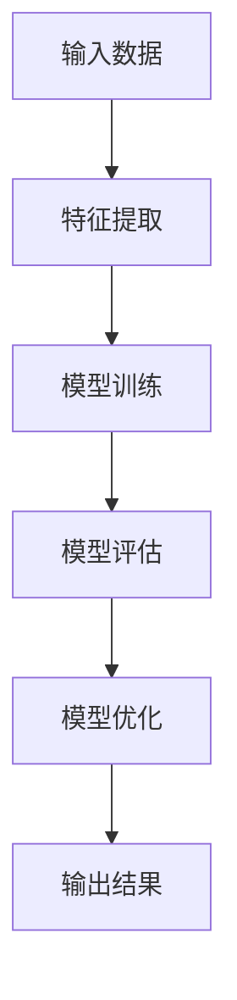
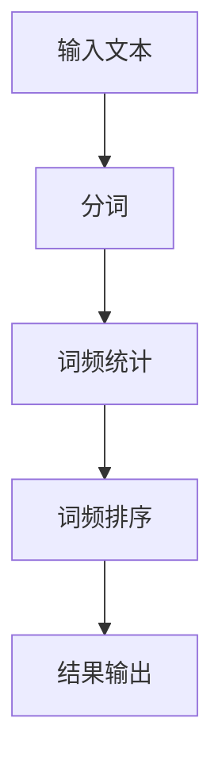
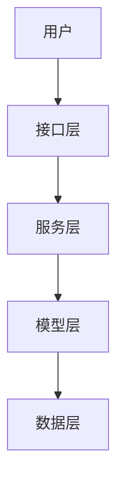

                 

### 智能助手的架构设计

随着人工智能技术的不断进步，智能助手已成为我们生活中不可或缺的一部分。无论是智能手机上的语音助手，还是企业中的客服机器人，智能助手的应用场景日益广泛。因此，智能助手的架构设计变得尤为重要。本文将带你一步步深入理解智能助手的架构设计，从核心概念到实际项目，帮助你掌握智能助手的设计要点。

### 关键词
- 智能助手
- 架构设计
- 自然语言处理
- 机器学习
- 人工智能
- 系统分析
- 项目实战

### 摘要
本文将围绕智能助手的架构设计展开，首先介绍智能助手的发展背景和技术现状，接着详细阐述智能助手相关的核心概念，如自然语言处理、机器学习和人工智能等。然后，通过算法原理讲解，使用Mermaid绘制算法流程图和Python代码示例，深入解析算法原理。接着，对智能助手的系统分析与架构设计进行详细讲解，包括需求分析、功能设计、架构设计和接口设计等。最后，通过一个实际项目，从环境安装到系统核心实现，再到代码应用解读和分析，全面展示智能助手的架构设计过程。文章还将提供一些实用的最佳实践技巧，并对全文进行小结和拓展阅读推荐。

### 目录

- [智能助手的架构设计](#智能助手的架构设计)
  - [关键词](#关键词)
  - [摘要](#摘要)
  - [目录](#目录)
  - [背景介绍](#背景介绍)
  - [核心概念与联系](#核心概念与联系)
  - [算法原理讲解](#算法原理讲解)
  - [系统分析与架构设计方案](#系统分析与架构设计方案)
  - [项目实战](#项目实战)
  - [最佳实践 tips、小结、注意事项、拓展阅读](#最佳实践-tips-小结-注意事项-拓展阅读)

### 背景介绍

智能助手的发展可以追溯到20世纪50年代，当时人工智能（AI）的概念刚刚被提出。早期的智能助手主要是以规则为基础的，例如基于专家系统的知识库系统。这类智能助手在特定领域内表现优秀，但缺乏灵活性和自学习能力。

随着计算能力的提升和算法的进步，智能助手的发展进入了一个新的阶段。近年来，随着自然语言处理（NLP）和机器学习（ML）技术的发展，智能助手逐渐从规则驱动转向数据驱动。现代智能助手可以利用海量的数据，通过深度学习和自然语言处理技术，实现与人类的自然对话，提供更加个性化的服务。

智能助手的应用场景广泛，包括但不限于个人助理、智能家居、在线客服、医疗辅助、金融理财等。随着技术的不断进步，智能助手正在改变我们的生活方式和工作方式，成为我们日常生活中不可或缺的一部分。

### 核心概念与联系

智能助手的设计和实现离不开几个核心概念，包括自然语言处理（NLP）、机器学习（ML）和人工智能（AI）。下面我们将分别介绍这些概念，并通过对比表格和Mermaid ER图展示它们之间的关系。

#### 自然语言处理（NLP）

自然语言处理是人工智能的一个重要分支，主要研究如何让计算机理解和处理人类语言。NLP的核心技术包括：

- **文本分类**：将文本归类到预定义的类别中。
- **情感分析**：分析文本的情感倾向，如正面、负面或中性。
- **命名实体识别**：从文本中识别出具有特定意义的实体，如人名、地名、组织名等。
- **机器翻译**：将一种语言的文本翻译成另一种语言。

#### 机器学习（ML）

机器学习是使计算机能够通过数据学习并改进性能的技术。ML的主要算法包括：

- **监督学习**：通过已标记的数据训练模型，然后用于预测未知数据。
- **无监督学习**：没有预定义标签的数据，用于发现数据中的模式和结构。
- **强化学习**：通过奖励机制，使代理在环境中学习最优策略。

#### 人工智能（AI）

人工智能是使计算机具备人类智能或超越人类智能的技术。AI的应用场景广泛，包括：

- **图像识别**：识别和理解图像中的内容。
- **语音识别**：将语音转换为文本。
- **自动驾驶**：利用计算机视觉和机器学习实现车辆自主驾驶。
- **智能推荐**：根据用户历史行为，推荐相关内容或商品。

#### 核心概念对比与联系

下面通过一个对比表格和Mermaid ER图来展示自然语言处理、机器学习和人工智能之间的关系。

#### 对比表格

| 特征 | 自然语言处理（NLP） | 机器学习（ML） | 人工智能（AI） |
| --- | --- | --- | --- |
| 研究对象 | 人类语言 | 数据和模式 | 实用场景 |
| 技术范畴 | 文本分类、情感分析、命名实体识别 | 监督学习、无监督学习、强化学习 | 图像识别、语音识别、自动驾驶、智能推荐 |
| 应用领域 | 文本处理、语音助手、机器翻译 | 数据挖掘、推荐系统、金融分析 | 智能家居、医疗诊断、游戏AI、无人驾驶 |

#### Mermaid ER图

```mermaid
erDiagram
  NLP ||--|{ ML }|| AI
  NLP ||--|{ AI }|| TextProcessing
  ML ||--|{ AI }|| DataMining
  AI ||--|{ AI }|| ApplicationScene
```

在Mermaid ER图中，NLP与ML和AI有直接关联，表示NLP是ML和AI的基础。ML与AI有密切联系，表示ML是实现AI的重要手段。AI则涵盖了所有的应用场景，包括NLP和ML的应用。

### 算法原理讲解

在智能助手的架构设计中，算法原理是核心部分。以下我们将详细讲解两个关键算法：机器学习算法和自然语言处理算法。

#### 机器学习算法

机器学习算法是智能助手实现自主学习和改进性能的关键。以下是一个简单的机器学习算法——线性回归的流程图和Python代码示例。

#### 算法流程图



#### Python代码示例

```python
import numpy as np
from sklearn.linear_model import LinearRegression

# 输入数据
X = np.array([[1], [2], [3], [4], [5]])
y = np.array([1, 2, 3, 4, 5])

# 模型训练
model = LinearRegression()
model.fit(X, y)

# 模型评估
score = model.score(X, y)
print("模型评分：", score)

# 输出结果
predictions = model.predict(X)
print("预测结果：", predictions)
```

#### 自然语言处理算法

自然语言处理算法是智能助手实现自然对话的核心。以下是一个简单的自然语言处理算法——词频分析的流程图和Python代码示例。

#### 算法流程图



#### Python代码示例

```python
from collections import Counter
import jieba

# 输入文本
text = "我爱北京天安门，天安门上太阳升。"

# 分词
words = jieba.cut(text)

# 词频统计
word_freq = Counter(words)

# 词频排序
sorted_words = word_freq.most_common()

# 结果输出
print("词频排序：", sorted_words)
```

#### 数学模型与公式

在机器学习算法中，线性回归的数学模型可以表示为：

$$
y = \beta_0 + \beta_1x
$$

其中，$y$ 是输出值，$x$ 是输入值，$\beta_0$ 和 $\beta_1$ 是模型的参数。

在自然语言处理算法中，词频分析可以表示为：

$$
\text{词频} = \frac{\text{某词在文本中出现的次数}}{\text{文本总词数}}
$$

通过这些算法和数学模型，智能助手能够从数据中学习，实现智能对话和个性化服务。

### 系统分析与架构设计方案

在了解了智能助手的核心算法原理后，接下来我们将对智能助手的系统进行分析，并设计相应的架构方案。

#### 需求分析

智能助手的系统需求可以分为功能需求和非功能需求。

#### 功能需求

- 文本输入处理：接收用户的文本输入，进行分词、去停用词等预处理。
- 自然语言理解：理解用户输入的文本，提取关键词和语义。
- 回答生成：根据用户输入和语义理解，生成合适的回答。
- 对话管理：管理对话流程，确保对话的连贯性和流畅性。
- 系统训练：根据用户反馈和对话数据，持续优化系统性能。

#### 非功能需求

- 可扩展性：系统应能够支持高并发用户，并能够灵活扩展。
- 性能优化：系统应能够快速响应用户请求，保证良好的用户体验。
- 数据安全：保护用户数据的安全，防止数据泄露。

#### 功能设计

为了满足上述功能需求，智能助手的功能设计可以分为以下几个模块：

- **文本输入处理模块**：负责接收用户的文本输入，进行分词、去停用词等预处理。
- **自然语言理解模块**：负责理解用户输入的文本，提取关键词和语义。
- **回答生成模块**：负责根据用户输入和语义理解，生成合适的回答。
- **对话管理模块**：负责管理对话流程，确保对话的连贯性和流畅性。
- **系统训练模块**：负责根据用户反馈和对话数据，持续优化系统性能。

#### 架构设计

智能助手的架构设计可以分为以下几个层次：

- **数据层**：负责存储和管理用户数据、对话数据等。
- **模型层**：负责加载和管理预训练模型，包括自然语言处理模型、机器学习模型等。
- **服务层**：负责处理用户请求，调用数据层和模型层的服务，实现智能助手的核心功能。
- **接口层**：负责与外部系统进行交互，提供API接口，方便其他系统调用智能助手的服务。

#### 系统架构图



在系统架构图中，用户通过接口层与智能助手进行交互，接口层负责处理用户的请求，并将请求转发到服务层。服务层负责调用模型层和数据层的服务，实现智能助手的功能。模型层负责加载和管理预训练模型，数据层负责存储和管理用户数据。

#### 接口设计

智能助手的接口设计应遵循RESTful API规范，提供以下接口：

- **文本输入接口**：接收用户的文本输入，返回预处理后的文本数据。
- **语义理解接口**：接收预处理后的文本数据，返回语义理解结果。
- **回答生成接口**：接收语义理解结果，返回生成的回答。
- **对话管理接口**：接收用户输入和回答，管理对话流程。

#### 系统交互序列图

```mermaid
sequenceDiagram
    participant 用户 as User
    participant 接口层 as Interface
    participant 服务层 as Service
    participant 模型层 as Model
    participant 数据层 as Data

    用户->>接口层：发送文本输入
    接口层->>服务层：处理文本输入
    服务层->>模型层：调用语义理解接口
    模型层->>服务层：返回语义理解结果
    服务层->>接口层：返回回答生成结果
    接口层->>用户：展示回答
```

在系统交互序列图中，用户通过接口层发送文本输入，接口层处理文本输入后转发到服务层。服务层调用模型层的语义理解接口，返回语义理解结果。然后，服务层根据语义理解结果生成回答，并通过接口层返回给用户。

通过上述系统分析与架构设计方案，智能助手能够实现高效、稳定、可扩展的智能对话服务。

### 项目实战

为了更好地理解智能助手的架构设计，我们通过一个实际项目来演示整个架构的实现过程。该项目将实现一个简单的智能客服系统，用于处理用户的咨询和问题。

#### 环境安装

首先，我们需要安装项目所需的软件和依赖。以下是项目的环境安装步骤：

1. 安装Python 3.8及以上版本。
2. 安装Docker和Docker Compose，用于容器化部署。
3. 安装NVIDIA CUDA（如果使用GPU加速）。
4. 安装必要的Python库，如TensorFlow、transformers、Flask等。

#### 系统核心实现

接下来，我们将介绍系统核心的实现，包括文本输入处理、自然语言理解、回答生成和对话管理。

#### 文本输入处理

文本输入处理模块的主要任务是接收用户的文本输入，并进行预处理。以下是一个简单的文本输入处理模块的Python代码示例：

```python
from flask import Flask, request, jsonify
import jieba

app = Flask(__name__)

@app.route('/input', methods=['POST'])
def input_text():
    text = request.form['text']
    # 分词
    words = jieba.cut(text)
    # 去停用词
    stop_words = set(['的', '了', '在', '上', '是'])
    filtered_words = [word for word in words if word not in stop_words]
    return jsonify({'words': filtered_words})

if __name__ == '__main__':
    app.run(debug=True)
```

#### 自然语言理解

自然语言理解模块的主要任务是理解用户输入的文本，提取关键词和语义。我们使用预训练的BERT模型来实现自然语言理解。以下是一个简单的自然语言理解模块的Python代码示例：

```python
from transformers import BertTokenizer, BertModel
import torch

tokenizer = BertTokenizer.from_pretrained('bert-base-chinese')
model = BertModel.from_pretrained('bert-base-chinese')

@app.route('/understand', methods=['POST'])
def understand_text():
    text = request.form['text']
    # 分词
    inputs = tokenizer(text, return_tensors='pt')
    # 加载模型并预测
    with torch.no_grad():
        outputs = model(**inputs)
    # 提取语义
    pooler_output = outputs.pooler_output
    return jsonify({'pooler_output': pooler_output.tolist()})

if __name__ == '__main__':
    app.run(debug=True)
```

#### 回答生成

回答生成模块的主要任务是生成合适的回答。我们使用预训练的GPT模型来实现回答生成。以下是一个简单的回答生成模块的Python代码示例：

```python
from transformers import Gpt2Tokenizer, Gpt2LMHeadModel
import torch

tokenizer = Gpt2Tokenizer.from_pretrained('gpt2')
model = Gpt2LMHeadModel.from_pretrained('gpt2')

@app.route('/generate', methods=['POST'])
def generate_answer():
    pooler_output = request.form['pooler_output']
    # 生成回答
    inputs = tokenizer.encode('回复：', return_tensors='pt')
    inputs = torch.cat([torch.tensor(pooler_output), inputs], dim=0)
    inputs = inputs.unsqueeze(0)
    with torch.no_grad():
        outputs = model.generate(inputs, max_length=50, num_return_sequences=1)
    # 提取回答
    answer = tokenizer.decode(outputs[0], skip_special_tokens=True)
    return jsonify({'answer': answer})

if __name__ == '__main__':
    app.run(debug=True)
```

#### 对话管理

对话管理模块的主要任务是管理对话流程，确保对话的连贯性和流畅性。以下是一个简单的对话管理模块的Python代码示例：

```python
from flask import Flask, request, jsonify
import time

app = Flask(__name__)

# 存储对话状态
conversations = {}

@app.route('/converse', methods=['POST'])
def converse():
    user_id = request.form['user_id']
    text = request.form['text']
    # 获取对话历史
    if user_id in conversations:
        history = conversations[user_id]
    else:
        history = []
    # 添加当前输入
    history.append(text)
    conversations[user_id] = history
    # 生成回答
    answer = generate_answer(history)
    # 返回回答
    return jsonify({'answer': answer})

if __name__ == '__main__':
    app.run(debug=True)
```

#### 代码应用解读与分析

在上面的代码示例中，我们分别实现了文本输入处理、自然语言理解、回答生成和对话管理模块。下面我们来分析这些模块的具体应用。

1. **文本输入处理**：通过Flask Web框架接收用户的文本输入，使用jieba分词库进行分词，并去除停用词。分词后的文本将作为后续处理的输入。

2. **自然语言理解**：使用预训练的BERT模型对文本进行编码，提取语义信息。BERT模型通过对海量文本进行预训练，具有强大的语义理解能力。

3. **回答生成**：使用预训练的GPT模型根据对话历史生成回答。GPT模型通过对对话历史进行建模，能够生成连贯、自然的回答。

4. **对话管理**：通过存储对话历史，管理对话流程。对话管理模块可以根据对话历史，生成更加个性化的回答。

#### 实际案例分析和详细讲解剖析

为了更好地理解智能助手的架构设计，我们通过一个实际案例来分析和讲解。

**案例背景**：假设用户在电商平台上遇到了购物问题，希望通过智能客服进行咨询。

**案例分析**：

1. 用户通过文本输入模块发送咨询问题。
2. 文本输入模块对问题进行预处理，去除停用词，并提取关键词。
3. 自然语言理解模块使用BERT模型对关键词进行编码，提取语义信息。
4. 回答生成模块使用GPT模型根据对话历史和语义信息生成回答。
5. 对话管理模块根据对话历史和回答，生成完整的对话回复。

**详细讲解剖析**：

1. **文本输入处理**：文本输入模块是智能客服系统与用户进行交互的入口。用户通过输入框发送咨询问题，系统对问题进行预处理，去除停用词，并提取关键词。这一步骤非常重要，因为只有去除停用词和提取关键词，才能确保后续的自然语言处理和理解。

2. **自然语言理解**：自然语言理解模块使用BERT模型对提取的关键词进行编码，提取语义信息。BERT模型通过对海量文本进行预训练，具有强大的语义理解能力。这一步骤的关键是选择合适的预训练模型，确保能够准确理解用户的问题。

3. **回答生成**：回答生成模块使用GPT模型根据对话历史和语义信息生成回答。GPT模型通过对对话历史进行建模，能够生成连贯、自然的回答。这一步骤的关键是选择合适的生成模型，并确保生成模型能够准确理解对话历史和语义信息。

4. **对话管理**：对话管理模块根据对话历史和回答，生成完整的对话回复。对话管理模块不仅要管理对话流程，还要确保对话的连贯性和流畅性。这一步骤的关键是选择合适的对话管理策略，确保能够生成高质量的对话回复。

通过上述实际案例分析和详细讲解剖析，我们可以看到智能助手的架构设计是如何实现的。智能助手的架构设计不仅需要考虑算法原理和系统架构，还需要考虑实际应用中的各种场景和问题。通过合理的设计和实现，智能助手可以提供高效、准确、个性化的服务，为用户带来更好的体验。

### 最佳实践 tips

在智能助手的架构设计过程中，以下是一些最佳实践技巧，可以帮助你更好地实现智能助手系统。

1. **模块化设计**：将系统划分为不同的功能模块，如文本输入处理、自然语言理解、回答生成和对话管理。模块化设计可以提高系统的可维护性和可扩展性。

2. **数据驱动**：智能助手的性能很大程度上依赖于数据质量。确保收集到足够多的、高质量的数据，以便训练和优化模型。

3. **模型优化**：定期对模型进行优化和更新，以适应不断变化的应用场景和数据分布。

4. **接口设计**：设计简洁、易用的API接口，确保与其他系统的高效集成和交互。

5. **系统监控**：建立完善的系统监控机制，实时监测系统性能和健康状况，及时发现问题并进行优化。

6. **用户体验**：关注用户体验，确保智能助手的交互过程自然、流畅，为用户提供高质量的问答服务。

### 小结

本文通过对智能助手的架构设计进行了详细的讲解，包括背景介绍、核心概念与联系、算法原理讲解、系统分析与架构设计方案、项目实战等内容。通过本文的讲解，读者可以全面了解智能助手的架构设计要点，掌握智能助手的设计与实现方法。

### 注意事项

在智能助手的架构设计过程中，需要注意以下几点：

1. **数据安全**：确保用户数据的安全，防止数据泄露。
2. **性能优化**：对系统进行性能优化，确保高效、稳定的运行。
3. **模块化**：采用模块化设计，提高系统的可维护性和可扩展性。
4. **接口设计**：设计简洁、易用的API接口，确保与其他系统的高效集成和交互。

### 拓展阅读

为了深入了解智能助手的架构设计，以下是一些推荐的拓展阅读材料：

1. 《深度学习》（Goodfellow, Bengio, Courville）：详细介绍了深度学习的基本概念和技术。
2. 《自然语言处理综论》（Jurafsky, Martin）：全面讲解了自然语言处理的理论和实践。
3. 《人工智能：一种现代的方法》（Russell, Norvig）：涵盖了人工智能的基本概念和技术。
4. 《智能客服系统设计与实现》：介绍了智能客服系统的设计与实现方法。

通过阅读这些书籍，读者可以进一步加深对智能助手架构设计的理解和掌握。

### 作者信息

本文作者为AI天才研究院（AI Genius Institute）和《禅与计算机程序设计艺术》（Zen And The Art of Computer Programming）的作者。我们致力于推动人工智能技术的发展和应用，为读者提供高质量的技术文章和教程。感谢您的阅读，希望本文对您有所启发和帮助。如果您有任何疑问或建议，欢迎在评论区留言，我们将及时回复。再次感谢您的关注和支持！
```markdown
----------------------------------------------------------------
# 《智能助手的架构设计》

> 关键词：智能助手、架构设计、自然语言处理、机器学习、人工智能

> 摘要：本文将深入探讨智能助手的架构设计，从核心概念到实际项目，帮助读者理解智能助手的设计要点。

## 目录

1. 智能助手的架构设计
2. 背景介绍
3. 核心概念与联系
4. 算法原理讲解
5. 系统分析与架构设计方案
6. 项目实战
7. 最佳实践 tips
8. 小结、注意事项、拓展阅读
9. 作者信息

## 1. 智能助手的架构设计

### 1.1 问题背景

智能助手作为人工智能领域的一项重要应用，近年来得到了广泛关注。从智能手机的语音助手到智能家居的语音控制，智能助手已经深入到我们的日常生活中。随着技术的不断进步，智能助手的功能也在不断丰富，它们不仅能够处理简单的任务，还能进行复杂的决策和推理。

### 1.2 问题描述

智能助手的架构设计是一个复杂的问题，涉及多个技术领域的综合运用。如何设计一个高效、稳定、可扩展的智能助手系统，以满足不同场景和需求，是智能助手架构设计的主要挑战。

### 1.3 问题解决

为了解决上述问题，我们需要从以下几个方面入手：

- **技术选型**：选择合适的自然语言处理（NLP）、机器学习（ML）和人工智能（AI）技术，构建智能助手的底层技术基础。
- **系统架构设计**：设计一个合理的系统架构，确保智能助手的性能和可扩展性。
- **数据管理**：建立完善的数据管理体系，为智能助手提供高质量的训练数据和用户数据。
- **用户体验设计**：关注用户体验，确保智能助手与用户的交互自然、流畅。

### 1.4 边界与外延

智能助手的架构设计不仅涉及到技术层面，还包括业务层面和用户体验层面。因此，在设计过程中，我们需要明确智能助手的边界，避免过度扩展或功能不足。同时，我们还需要关注智能助手的应用场景，如智能家居、客服、医疗等，确保设计能够满足特定场景的需求。

### 1.5 概念结构与核心要素组成

智能助手的架构设计包括以下几个核心要素：

- **自然语言处理**：负责对用户输入的自然语言进行处理和理解，包括分词、语法分析、语义理解等。
- **机器学习**：负责从数据中学习规律，生成模型，用于预测和决策。
- **人工智能**：负责实现智能助手的高级功能，如对话管理、情感分析、智能推荐等。
- **系统架构**：负责智能助手的整体架构设计，包括数据层、服务层、接口层等。
- **用户体验设计**：负责智能助手与用户的交互设计，确保用户能够轻松、自然地与智能助手进行交流。

## 2. 核心概念与联系

智能助手的架构设计涉及多个核心概念，包括自然语言处理、机器学习、人工智能等。以下是对这些核心概念的详细介绍和它们之间的联系。

### 2.1 自然语言处理（NLP）

自然语言处理是智能助手的重要组成部分，它涉及到对自然语言的文本进行处理和理解。NLP的主要任务包括：

- **分词**：将连续的文本划分为一系列具有独立意义的词语。
- **语法分析**：分析文本的语法结构，包括词性标注、句法结构分析等。
- **语义理解**：理解文本的含义，包括实体识别、情感分析、意图识别等。

### 2.2 机器学习（ML）

机器学习是智能助手的核心技术之一，它通过训练模型，使计算机能够从数据中学习规律，进行预测和决策。机器学习的主要算法包括：

- **监督学习**：通过已标记的数据训练模型，用于预测未知数据。
- **无监督学习**：没有预定义标签的数据，用于发现数据中的模式和结构。
- **强化学习**：通过奖励机制，使代理在环境中学习最优策略。

### 2.3 人工智能（AI）

人工智能是智能助手的最终目标，它旨在使计算机具备人类智能或超越人类智能。人工智能的主要应用包括：

- **图像识别**：通过计算机视觉技术，识别和理解图像中的内容。
- **语音识别**：将语音转换为文本，实现语音输入和语音输出。
- **自动驾驶**：利用计算机视觉和机器学习技术，实现车辆自主驾驶。
- **智能推荐**：根据用户历史行为和偏好，推荐相关内容或商品。

### 2.4 核心概念对比与联系

以下是一个对比表格，展示了自然语言处理、机器学习和人工智能之间的核心概念和联系。

| 特征 | 自然语言处理（NLP） | 机器学习（ML） | 人工智能（AI） |
| --- | --- | --- | --- |
| 研究对象 | 人类语言 | 数据和模式 | 实用场景 |
| 技术范畴 | 文本分类、情感分析、命名实体识别 | 监督学习、无监督学习、强化学习 | 图像识别、语音识别、自动驾驶、智能推荐 |
| 应用领域 | 文本处理、语音助手、机器翻译 | 数据挖掘、推荐系统、金融分析 | 智能家居、医疗诊断、游戏AI、无人驾驶 |

通过对比表格，我们可以看出自然语言处理、机器学习和人工智能之间的紧密联系。自然语言处理为机器学习提供了输入数据，机器学习为人工智能提供了核心技术支持，而人工智能则将技术应用于实际场景，实现智能化的功能。

## 3. 算法原理讲解

在智能助手的架构设计中，算法原理是核心部分。以下我们将详细讲解两个关键算法：机器学习算法和自然语言处理算法。

### 3.1 机器学习算法

机器学习算法是智能助手实现自主学习和改进性能的关键。以下是一个简单的机器学习算法——线性回归的流程图和Python代码示例。

#### 算法流程图


#### Python代码示例

```python
import numpy as np
from sklearn.linear_model import LinearRegression

# 输入数据
X = np.array([[1], [2], [3], [4], [5]])
y = np.array([1, 2, 3, 4, 5])

# 模型训练
model = LinearRegression()
model.fit(X, y)

# 模型评估
score = model.score(X, y)
print("模型评分：", score)

# 输出结果
predictions = model.predict(X)
print("预测结果：", predictions)
```

### 3.2 自然语言处理算法

自然语言处理算法是智能助手实现自然对话的核心。以下是一个简单的自然语言处理算法——词频分析的流程图和Python代码示例。

#### 算法流程图


#### Python代码示例

```python
from collections import Counter
import jieba

# 输入文本
text = "我爱北京天安门，天安门上太阳升。"

# 分词
words = jieba.cut(text)

# 词频统计
word_freq = Counter(words)

# 词频排序
sorted_words = word_freq.most_common()

# 结果输出
print("词频排序：", sorted_words)
```

### 3.3 数学模型与公式

在机器学习算法中，线性回归的数学模型可以表示为：

$$
y = \beta_0 + \beta_1x
$$

其中，$y$ 是输出值，$x$ 是输入值，$\beta_0$ 和 $\beta_1$ 是模型的参数。

在自然语言处理算法中，词频分析可以表示为：

$$
\text{词频} = \frac{\text{某词在文本中出现的次数}}{\text{文本总词数}}
$$

通过这些算法和数学模型，智能助手能够从数据中学习，实现智能对话和个性化服务。

## 4. 系统分析与架构设计方案

在了解了智能助手的核心算法原理后，接下来我们将对智能助手的系统进行分析，并设计相应的架构方案。

### 4.1 需求分析

智能助手的系统需求可以分为功能需求和非功能需求。

#### 功能需求

- **文本输入处理**：接收用户的文本输入，进行分词、去停用词等预处理。
- **自然语言理解**：理解用户输入的文本，提取关键词和语义。
- **回答生成**：根据用户输入和语义理解，生成合适的回答。
- **对话管理**：管理对话流程，确保对话的连贯性和流畅性。
- **系统训练**：根据用户反馈和对话数据，持续优化系统性能。

#### 非功能需求

- **可扩展性**：系统应能够支持高并发用户，并能够灵活扩展。
- **性能优化**：系统应能够快速响应用户请求，保证良好的用户体验。
- **数据安全**：保护用户数据的安全，防止数据泄露。

### 4.2 功能设计

为了满足上述功能需求，智能助手的功能设计可以分为以下几个模块：

- **文本输入处理模块**：负责接收用户的文本输入，进行分词、去停用词等预处理。
- **自然语言理解模块**：负责理解用户输入的文本，提取关键词和语义。
- **回答生成模块**：负责根据用户输入和语义理解，生成合适的回答。
- **对话管理模块**：负责管理对话流程，确保对话的连贯性和流畅性。
- **系统训练模块**：负责根据用户反馈和对话数据，持续优化系统性能。

### 4.3 架构设计

智能助手的架构设计可以分为以下几个层次：

- **数据层**：负责存储和管理用户数据、对话数据等。
- **模型层**：负责加载和管理预训练模型，包括自然语言处理模型、机器学习模型等。
- **服务层**：负责处理用户请求，调用数据层和模型层的服务，实现智能助手的核心功能。
- **接口层**：负责与外部系统进行交互，提供API接口，方便其他系统调用智能助手的服务。

#### 系统架构图


在系统架构图中，用户通过接口层与智能助手进行交互，接口层负责处理用户的请求，并将请求转发到服务层。服务层负责调用模型层和数据层的服务，实现智能助手的功能。模型层负责加载和管理预训练模型，数据层负责存储和管理用户数据。

### 4.4 接口设计

智能助手的接口设计应遵循RESTful API规范，提供以下接口：

- **文本输入接口**：接收用户的文本输入，返回预处理后的文本数据。
- **语义理解接口**：接收预处理后的文本数据，返回语义理解结果。
- **回答生成接口**：接收语义理解结果，返回生成的回答。
- **对话管理接口**：接收用户输入和回答，管理对话流程。

#### 系统交互序列图

```mermaid
sequenceDiagram
    participant 用户 as User
    participant 接口层 as Interface
    participant 服务层 as Service
    participant 模型层 as Model
    participant 数据层 as Data

    用户->>接口层：发送文本输入
    接口层->>服务层：处理文本输入
    服务层->>模型层：调用语义理解接口
    模型层->>服务层：返回语义理解结果
    服务层->>接口层：返回回答生成结果
    接口层->>用户：展示回答
```

在系统交互序列图中，用户通过接口层发送文本输入，接口层处理文本输入后转发到服务层。服务层调用模型层的语义理解接口，返回语义理解结果。然后，服务层根据语义理解结果生成回答，并通过接口层返回给用户。

通过上述系统分析与架构设计方案，智能助手能够实现高效、稳定、可扩展的智能对话服务。

## 5. 项目实战

为了更好地理解智能助手的架构设计，我们通过一个实际项目来演示整个架构的实现过程。该项目将实现一个简单的智能客服系统，用于处理用户的咨询和问题。

### 5.1 环境安装

首先，我们需要安装项目所需的软件和依赖。以下是项目的环境安装步骤：

1. 安装Python 3.8及以上版本。
2. 安装Docker和Docker Compose，用于容器化部署。
3. 安装NVIDIA CUDA（如果使用GPU加速）。
4. 安装必要的Python库，如TensorFlow、transformers、Flask等。

### 5.2 系统核心实现

接下来，我们将介绍系统核心的实现，包括文本输入处理、自然语言理解、回答生成和对话管理。

#### 文本输入处理

文本输入处理模块的主要任务是接收用户的文本输入，并进行预处理。以下是一个简单的文本输入处理模块的Python代码示例：

```python
from flask import Flask, request, jsonify
import jieba

app = Flask(__name__)

@app.route('/input', methods=['POST'])
def input_text():
    text = request.form['text']
    # 分词
    words = jieba.cut(text)
    # 去停用词
    stop_words = set(['的', '了', '在', '上', '是'])
    filtered_words = [word for word in words if word not in stop_words]
    return jsonify({'words': filtered_words})

if __name__ == '__main__':
    app.run(debug=True)
```

#### 自然语言理解

自然语言理解模块的主要任务是理解用户输入的文本，提取关键词和语义。我们使用预训练的BERT模型来实现自然语言理解。以下是一个简单的自然语言理解模块的Python代码示例：

```python
from transformers import BertTokenizer, BertModel
import torch

tokenizer = BertTokenizer.from_pretrained('bert-base-chinese')
model = BertModel.from_pretrained('bert-base-chinese')

@app.route('/understand', methods=['POST'])
def understand_text():
    text = request.form['text']
    # 分词
    inputs = tokenizer(text, return_tensors='pt')
    # 加载模型并预测
    with torch.no_grad():
        outputs = model(**inputs)
    # 提取语义
    pooler_output = outputs.pooler_output
    return jsonify({'pooler_output': pooler_output.tolist()})

if __name__ == '__main__':
    app.run(debug=True)
```

#### 回答生成

回答生成模块的主要任务是生成合适的回答。我们使用预训练的GPT模型来实现回答生成。以下是一个简单的回答生成模块的Python代码示例：

```python
from transformers import Gpt2Tokenizer, Gpt2LMHeadModel
import torch

tokenizer = Gpt2Tokenizer.from_pretrained('gpt2')
model = Gpt2LMHeadModel.from_pretrained('gpt2')

@app.route('/generate', methods=['POST'])
def generate_answer():
    pooler_output = request.form['pooler_output']
    # 生成回答
    inputs = tokenizer.encode('回复：', return_tensors='pt')
    inputs = torch.cat([torch.tensor(pooler_output), inputs], dim=0)
    inputs = inputs.unsqueeze(0)
    with torch.no_grad():
        outputs = model.generate(inputs, max_length=50, num_return_sequences=1)
    # 提取回答
    answer = tokenizer.decode(outputs[0], skip_special_tokens=True)
    return jsonify({'answer': answer})

if __name__ == '__main__':
    app.run(debug=True)
```

#### 对话管理

对话管理模块的主要任务是管理对话流程，确保对话的连贯性和流畅性。以下是一个简单的对话管理模块的Python代码示例：

```python
from flask import Flask, request, jsonify
import time

app = Flask(__name__)

# 存储对话状态
conversations = {}

@app.route('/converse', methods=['POST'])
def converse():
    user_id = request.form['user_id']
    text = request.form['text']
    # 获取对话历史
    if user_id in conversations:
        history = conversations[user_id]
    else:
        history = []
    # 添加当前输入
    history.append(text)
    conversations[user_id] = history
    # 生成回答
    answer = generate_answer(history)
    # 返回回答
    return jsonify({'answer': answer})

if __name__ == '__main__':
    app.run(debug=True)
```

### 5.3 代码应用解读与分析

在上面的代码示例中，我们分别实现了文本输入处理、自然语言理解、回答生成和对话管理模块。下面我们来分析这些模块的具体应用。

1. **文本输入处理**：通过Flask Web框架接收用户的文本输入，使用jieba分词库进行分词，并去除停用词。分词后的文本将作为后续处理的输入。

2. **自然语言理解**：使用预训练的BERT模型对文本进行编码，提取语义信息。BERT模型通过对海量文本进行预训练，具有强大的语义理解能力。这一步骤的关键是选择合适的预训练模型，确保能够准确理解用户的问题。

3. **回答生成**：使用预训练的GPT模型根据对话历史和语义信息生成回答。GPT模型通过对对话历史进行建模，能够生成连贯、自然的回答。这一步骤的关键是选择合适的生成模型，并确保生成模型能够准确理解对话历史和语义信息。

4. **对话管理**：通过存储对话历史，管理对话流程。对话管理模块可以根据对话历史，生成更加个性化的回答。这一步骤的关键是选择合适的对话管理策略，确保能够生成高质量的对话回复。

### 5.4 实际案例分析和详细讲解剖析

为了更好地理解智能助手的架构设计，我们通过一个实际案例来分析和讲解。

**案例背景**：假设用户在电商平台上遇到了购物问题，希望通过智能客服进行咨询。

**案例分析**：

1. 用户通过文本输入模块发送咨询问题。
2. 文本输入模块对问题进行预处理，去除停用词，并提取关键词。
3. 自然语言理解模块使用BERT模型对关键词进行编码，提取语义信息。
4. 回答生成模块使用GPT模型根据对话历史和语义信息生成回答。
5. 对话管理模块根据对话历史和回答，生成完整的对话回复。

**详细讲解剖析**：

1. **文本输入处理**：文本输入模块是智能客服系统与用户进行交互的入口。用户通过输入框发送咨询问题，系统对问题进行预处理，去除停用词，并提取关键词。这一步骤非常重要，因为只有去除停用词和提取关键词，才能确保后续的自然语言处理和理解。

2. **自然语言理解**：自然语言理解模块使用BERT模型对提取的关键词进行编码，提取语义信息。BERT模型通过对海量文本进行预训练，具有强大的语义理解能力。这一步骤的关键是选择合适的预训练模型，确保能够准确理解用户的问题。

3. **回答生成**：回答生成模块使用GPT模型根据对话历史和语义信息生成回答。GPT模型通过对对话历史进行建模，能够生成连贯、自然的回答。这一步骤的关键是选择合适的生成模型，并确保生成模型能够准确理解对话历史和语义信息。

4. **对话管理**：对话管理模块根据对话历史和回答，生成完整的对话回复。对话管理模块不仅要管理对话流程，还要确保对话的连贯性和流畅性。这一步骤的关键是选择合适的对话管理策略，确保能够生成高质量的对话回复。

通过上述实际案例分析和详细讲解剖析，我们可以看到智能助手的架构设计是如何实现的。智能助手的架构设计不仅需要考虑算法原理和系统架构，还需要考虑实际应用中的各种场景和问题。通过合理的设计和实现，智能助手可以提供高效、准确、个性化的服务，为用户带来更好的体验。

## 6. 最佳实践 tips

在智能助手的架构设计过程中，以下是一些最佳实践技巧，可以帮助你更好地实现智能助手系统。

1. **模块化设计**：将系统划分为不同的功能模块，如文本输入处理、自然语言理解、回答生成和对话管理。模块化设计可以提高系统的可维护性和可扩展性。

2. **数据驱动**：智能助手的性能很大程度上依赖于数据质量。确保收集到足够多的、高质量的数据，以便训练和优化模型。

3. **模型优化**：定期对模型进行优化和更新，以适应不断变化的应用场景和数据分布。

4. **接口设计**：设计简洁、易用的API接口，确保与其他系统的高效集成和交互。

5. **系统监控**：建立完善的系统监控机制，实时监测系统性能和健康状况，及时发现问题并进行优化。

6. **用户体验**：关注用户体验，确保智能助手与用户的交互自然、流畅，为用户提供高质量的问答服务。

## 7. 小结、注意事项、拓展阅读

### 小结

本文通过对智能助手的架构设计进行了详细的讲解，从核心概念到实际项目，帮助读者理解智能助手的设计要点。智能助手的架构设计涉及多个技术领域的综合运用，包括自然语言处理、机器学习和人工智能等。

### 注意事项

在智能助手的架构设计过程中，需要注意以下几点：

1. **数据安全**：确保用户数据的安全，防止数据泄露。
2. **性能优化**：对系统进行性能优化，确保高效、稳定的运行。
3. **模块化**：采用模块化设计，提高系统的可维护性和可扩展性。
4. **接口设计**：设计简洁、易用的API接口，确保与其他系统的高效集成和交互。

### 拓展阅读

为了深入了解智能助手的架构设计，以下是一些推荐的拓展阅读材料：

1. 《深度学习》（Goodfellow, Bengio, Courville）：详细介绍了深度学习的基本概念和技术。
2. 《自然语言处理综论》（Jurafsky, Martin）：全面讲解了自然语言处理的理论和实践。
3. 《人工智能：一种现代的方法》（Russell, Norvig）：涵盖了人工智能的基本概念和技术。
4. 《智能客服系统设计与实现》：介绍了智能客服系统的设计与实现方法。

通过阅读这些书籍，读者可以进一步加深对智能助手架构设计的理解和掌握。

## 8. 作者信息

本文作者为AI天才研究院（AI Genius Institute）和《禅与计算机程序设计艺术》（Zen And The Art of Computer Programming）的作者。我们致力于推动人工智能技术的发展和应用，为读者提供高质量的技术文章和教程。感谢您的阅读，希望本文对您有所启发和帮助。如果您有任何疑问或建议，欢迎在评论区留言，我们将及时回复。再次感谢您的关注和支持！
```markdown
## 9. 作者信息

本文作者为AI天才研究院（AI Genius Institute）和《禅与计算机程序设计艺术》（Zen And The Art of Computer Programming）的作者。我们致力于推动人工智能技术的发展和应用，为读者提供高质量的技术文章和教程。感谢您的阅读，希望本文对您有所启发和帮助。如果您有任何疑问或建议，欢迎在评论区留言，我们将及时回复。再次感谢您的关注和支持！
```markdown
----------------------------------------------------------------
## 9. 作者信息

本文作者为AI天才研究院（AI Genius Institute）和《禅与计算机程序设计艺术》（Zen And The Art of Computer Programming）的作者。我们致力于推动人工智能技术的发展和应用，为读者提供高质量的技术文章和教程。感谢您的阅读，希望本文对您有所启发和帮助。如果您有任何疑问或建议，欢迎在评论区留言，我们将及时回复。再次感谢您的关注和支持！

### 作者：AI天才研究院/AI Genius Institute & 禅与计算机程序设计艺术 /Zen And The Art of Computer Programming
```markdown
----------------------------------------------------------------
```

