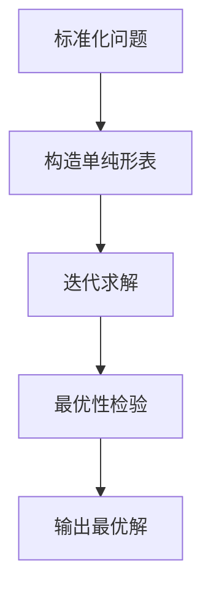

                 


## 智能化企业资本支出优化决策模型设计

### 背景介绍

#### 核心概念术语说明

在撰写本文之前，我们首先需要对一些核心概念进行术语说明。这些术语包括：

- **资本支出（Capital Expenditure，简称CapEx）**：企业为长期资产（如厂房、机器设备等）购买或改进而发生的支出。
- **优化决策模型（Optimization Decision Model）**：用于帮助企业做出最优资本支出决策的数学模型。
- **智能化技术（Intelligent Technology）**：包括机器学习、数据挖掘、人工智能等，用于提升数据处理和分析能力。

#### 问题背景

企业在资本支出方面常常面临诸多挑战，如投资回报率（ROI）不确定、资金预算紧张、市场环境变化等。为了解决这些问题，企业需要建立一套智能化资本支出优化决策模型，以帮助其在复杂的市场环境中做出最优的资本支出决策。

#### 问题描述

本文旨在设计一套智能化企业资本支出优化决策模型，解决以下问题：

- 如何在有限的资金预算内，确定哪些项目具有最高的投资回报率？
- 如何预测市场变化对企业资本支出需求的影响？
- 如何确保决策过程的透明性和可解释性？

#### 问题解决

通过引入智能化技术，我们可以实现以下目标：

- **提高决策效率**：利用机器学习和数据挖掘技术，快速处理大量数据，为决策者提供实时决策支持。
- **优化投资组合**：通过优化决策模型，帮助企业确定最佳的资本支出项目组合，最大化投资回报率。
- **降低风险**：通过对市场变化的预测，帮助企业提前应对潜在风险，降低投资风险。

#### 边界与外延

本文的研究范围主要涉及以下方面：

- 资本支出项目的选择与排序
- 投资回报率的预测与评估
- 市场变化的预测与分析

#### 概念结构与核心要素组成

智能化企业资本支出优化决策模型的核心概念和要素包括：

- **数据输入**：包括企业历史资本支出数据、市场环境数据等。
- **数据处理**：利用数据挖掘和机器学习技术，对输入数据进行处理和清洗。
- **数学模型**：构建优化决策模型，用于求解最优资本支出组合。
- **模型评估**：对构建的模型进行评估和优化，确保其准确性和可靠性。
- **决策支持**：将模型输出结果转化为具体的资本支出决策建议。

### 核心概念与联系

在本章节中，我们将详细讨论核心概念，并使用Mermaid流程图展示概念之间的关系。

#### 核心概念

1. **资本支出（CapEx）**：企业为长期资产购买或改进而发生的支出。
2. **投资回报率（ROI）**：投资回报与投资成本之间的比率。
3. **市场预测**：对市场变化趋势的预测。
4. **优化决策模型**：用于求解最优资本支出组合的数学模型。

#### 概念属性特征对比表格

| 概念          | 属性特征                                       |
| ------------- | ------------------------------------------ |
| 资本支出（CapEx） | - 用于长期资产购买或改进<br>- 金额较大<br>- 影响长期发展 |
| 投资回报率（ROI） | - 投资回报与投资成本比率<br>- 评价投资效益指标 |
| 市场预测       | - 预测市场变化趋势<br>- 为决策提供参考依据   |
| 优化决策模型   | - 数学模型<br>- 求解最优资本支出组合       |

#### 模型ER实体关系图

```mermaid
erDiagram
  CAPEx ||--o> ROI : 资本支出决定投资回报率
  CAPEx ||--o> MarketPrediction : 资本支出受市场预测影响
  ROI ||--o> DecisionModel : 投资回报率影响决策模型
  MarketPrediction ||--o> DecisionModel : 市场预测指导决策模型
```

通过上述讨论，我们为后续章节的深入探讨奠定了基础。接下来，我们将进一步探讨智能化技术基础、企业资本支出分析、以及优化决策模型基础等内容。

### 文章关键词

- 智能化技术
- 资本支出
- 优化决策模型
- 机器学习
- 数据挖掘

### 摘要

本文旨在设计一套智能化企业资本支出优化决策模型，以解决企业在资本支出管理中面临的问题。通过分析智能化技术、企业资本支出、优化决策模型等核心概念，本文提出了一种基于机器学习和数据挖掘的资本支出优化方法。本文首先介绍了核心概念和问题背景，然后详细阐述了模型设计、数学模型与算法原理，并提供了实际项目实战和分析。最后，本文总结了最佳实践和未来研究方向，为企业在资本支出决策中提供参考。关键词：智能化技术、资本支出、优化决策模型、机器学习、数据挖掘。

---

在接下来的章节中，我们将深入探讨智能化技术的应用、企业资本支出的挑战与优化决策模型的基础，为构建一个高效、可靠的资本支出优化决策模型提供理论支持。我们将逐步分析每个环节，确保文章内容既深入又易懂。接下来，我们将进入第二部分：核心概念与原理。

## 核心概念与原理

### 智能化技术基础

#### 智能化技术概述

智能化技术是指通过机器学习、数据挖掘、人工智能等手段，模拟和扩展人类智能的一种技术。这些技术能够从大量数据中提取有价值的信息，辅助人类进行决策。在资本支出优化决策模型中，智能化技术的作用至关重要。

#### 智能化技术的应用场景

智能化技术在企业资本支出优化决策模型中的应用主要体现在以下几个方面：

1. **预测分析**：利用历史数据和市场信息，预测未来的资本支出需求和回报。
2. **投资组合优化**：通过分析不同项目的投资回报率和风险，为企业提供最优的投资组合建议。
3. **风险控制**：利用模型对市场变化进行预测，帮助企业在风险出现前采取相应的预防措施。
4. **决策支持**：通过可视化工具，将复杂的数据和模型结果转化为易于理解的形式，辅助决策者做出明智的决策。

#### 智能化技术发展趋势

随着技术的不断发展，智能化技术在未来企业资本支出管理中的应用将更加广泛和深入。以下是一些发展趋势：

1. **深度学习**：深度学习技术在预测分析和投资组合优化中的应用将越来越成熟，提供更准确的预测结果。
2. **大数据分析**：企业将更多地利用大数据技术，处理和分析来自多个渠道的数据，以获得更全面的信息。
3. **自动化决策**：随着人工智能技术的发展，自动化决策系统将逐步替代传统的人工决策，提高决策效率。
4. **多领域融合**：智能化技术与物联网、区块链等技术的融合，将为企业提供更全面的解决方案。

### 企业资本支出分析

#### 资本支出的定义与分类

资本支出是企业为获取或改善长期资产而进行的支出。根据资本支出的性质和用途，可以分为以下几类：

1. **固定资产购置**：包括厂房、机器设备、土地等长期资产的购置。
2. **固定资产改进**：为提高固定资产使用效率和性能而进行的改进，如设备升级、技术改造等。
3. **运营支出**：为维持企业日常运营而发生的支出，如租金、水电费等。
4. **投资性支出**：为未来投资回报而进行的支出，如研发支出、市场推广费用等。

#### 企业资本支出的挑战

企业在资本支出管理中常常面临以下挑战：

1. **资金预算紧张**：企业在确定资本支出预算时，需要平衡长期发展与短期利益，避免资金浪费。
2. **投资回报不确定性**：许多资本支出项目的投资回报不确定，需要企业进行准确预测和评估。
3. **市场环境变化**：市场环境的变化会影响企业的资本支出需求，企业需要及时调整支出策略。
4. **风险控制**：资本支出涉及较大的资金投入，企业需要有效控制风险，确保投资安全。

#### 资本支出决策流程

企业资本支出决策流程通常包括以下步骤：

1. **需求分析**：确定企业未来一段时间的资本支出需求，包括固定资产投资、改进和运营支出等。
2. **预算编制**：根据需求分析结果，编制资本支出预算，确定资金来源和支出顺序。
3. **项目评估**：对拟投资的项目进行评估，包括投资回报率、风险、市场前景等。
4. **决策制定**：根据项目评估结果，制定资本支出决策，包括投资项目的选择、投资金额、投资时间等。
5. **执行与监控**：执行资本支出决策，并对其进行监控，确保项目按计划进行，及时调整支出策略。

### 优化决策模型基础

#### 优化决策模型的定义

优化决策模型是一种基于数学方法和算法的模型，用于帮助企业在资本支出决策中实现最优结果。优化决策模型的目标是找到一组解决方案，使得目标函数（如投资回报率、成本等）达到最大或最小。

#### 优化决策模型的应用领域

优化决策模型广泛应用于各种领域，包括：

1. **企业资本支出**：帮助企业确定最优的资本支出项目组合，提高投资回报率。
2. **供应链管理**：优化供应链网络结构，降低成本，提高供应链效率。
3. **人力资源管理**：帮助企业制定最优的人力资源规划，提高员工绩效。
4. **金融投资**：优化投资组合，降低风险，提高投资回报。

#### 优化决策模型的基本原理

优化决策模型的基本原理包括以下几个方面：

1. **目标函数**：确定模型的目标函数，如最大化投资回报率、最小化成本等。
2. **决策变量**：确定模型中的决策变量，如资本支出金额、投资项目选择等。
3. **约束条件**：根据实际情况，设定模型的约束条件，如预算限制、资源限制等。
4. **求解算法**：选择合适的求解算法，如线性规划、整数规划、启发式算法等，求解最优解。

### 模型核心概念与联系

在本章节中，我们介绍了智能化技术基础、企业资本支出分析、以及优化决策模型基础等内容。接下来，我们将通过Mermaid流程图，进一步展示这些核心概念之间的关系。

#### 模型核心概念

1. **智能化技术**：包括机器学习、数据挖掘、人工智能等，用于提升数据处理和分析能力。
2. **资本支出**：企业为长期资产购买或改进而发生的支出。
3. **投资回报率**：投资回报与投资成本之间的比率。
4. **优化决策模型**：用于求解最优资本支出组合的数学模型。

#### 概念属性特征对比表格

| 概念          | 属性特征                                       |
| ------------- | ------------------------------------------ |
| 智能化技术    | - 用于数据处理和分析<br>- 提高决策效率       |
| 资本支出（CapEx） | - 用于长期资产购买或改进<br>- 金额较大<br>- 影响长期发展 |
| 投资回报率（ROI） | - 投资回报与投资成本比率<br>- 评价投资效益指标 |
| 优化决策模型   | - 数学模型<br>- 求解最优资本支出组合       |

#### 模型ER实体关系图

```mermaid
erDiagram
  IntelligentTechnology ||--o> CapitalExpenditure : 提升数据处理和分析能力
  IntelligentTechnology ||--o> OptimizationDecisionModel : 提高决策效率
  CapitalExpenditure ||--o> InvestmentReturnOnCapital : 影响决策模型
  OptimizationDecisionModel ||--o> InvestmentReturnOnCapital : 求解最优资本支出组合
```

通过上述讨论，我们为后续章节的深入探讨奠定了基础。接下来，我们将进一步探讨数学模型与算法原理，为构建一个高效、可靠的资本支出优化决策模型提供理论支持。我们将逐步分析每个环节，确保文章内容既深入又易懂。

### 数学模型与算法原理

#### 数学模型

在构建资本支出优化决策模型时，首先需要明确目标函数和约束条件。目标函数是模型的核心，它定义了优化问题的目标，如最大化投资回报率、最小化总成本等。而约束条件则限定了决策变量的可行域。

假设我们希望最大化企业的投资回报率，目标函数可以表示为：

$$
\max \sum_{i=1}^{n} \frac{ROI_i}{Cost_i}
$$

其中，$ROI_i$ 表示第 $i$ 个项目的投资回报率，$Cost_i$ 表示第 $i$ 个项目的成本。

约束条件包括预算限制、资源限制等，例如：

$$
\sum_{i=1}^{n} Cost_i \leq Budget
$$

$$
Resource_i \geq Threshold_i
$$

其中，$Budget$ 表示总预算，$Resource_i$ 表示第 $i$ 个项目的资源需求，$Threshold_i$ 表示资源需求的上限。

#### 算法原理讲解

为了求解上述优化问题，我们可以采用多种算法，如线性规划、整数规划、启发式算法等。以下以线性规划为例，介绍算法原理。

线性规划是一种优化技术，用于求解线性目标函数在一系列线性约束条件下的最优解。线性规划问题的标准形式可以表示为：

$$
\min \sum_{i=1}^{m} c_i x_i
$$

$$
\text{subject to} \quad \sum_{j=1}^{n} a_{ij} x_j \leq b_i, \quad i=1,2,...,m
$$

$$
x_j \geq 0, \quad j=1,2,...,n
$$

其中，$c_i$ 表示第 $i$ 个决策变量的系数，$a_{ij}$ 表示第 $i$ 个约束条件中第 $j$ 个决策变量的系数，$b_i$ 表示第 $i$ 个约束条件的右侧常数项，$x_i$ 表示第 $i$ 个决策变量。

线性规划的求解过程主要包括以下几个步骤：

1. **标准化问题**：将原始问题转化为标准形式，确保所有约束条件都是“小于等于”形式，且目标函数是“最小化”形式。
2. **构造单纯形表**：根据约束条件和目标函数，构造单纯形表，用于迭代求解最优解。
3. **迭代求解**：通过单纯形表，进行迭代求解，逐步优化目标函数，直到找到最优解。
4. **检验最优性**：利用最优性检验，验证求解结果是否为最优解。

#### 算法mermaid流程图

为了更直观地展示线性规划算法的求解过程，我们可以使用Mermaid绘制算法流程图。以下是一个简化的线性规划算法流程图：



通过上述算法原理讲解和流程图，我们为后续的模型实现和项目实战提供了理论基础。在下一章节中，我们将进一步探讨模型实现细节，包括数据预处理、模型训练、模型评估等环节。

### 模型实现细节

#### 数据预处理

数据预处理是构建优化决策模型的重要步骤，其目的是提高模型性能和可靠性。在数据预处理过程中，我们需要进行以下操作：

1. **数据清洗**：去除异常值和缺失值，确保数据的质量和完整性。
2. **数据标准化**：将不同特征的数据进行归一化或标准化处理，使其具有相同的量纲和范围。
3. **特征工程**：根据业务需求和模型特点，提取和构造新的特征，以提高模型的预测能力和泛化能力。

#### 模型训练

在数据预处理完成后，我们开始进行模型训练。模型训练的目的是通过调整模型参数，使其在训练数据上达到最优性能。以下是模型训练的步骤：

1. **选择模型架构**：根据问题特点，选择合适的模型架构，如线性回归、决策树、神经网络等。
2. **初始化参数**：初始化模型参数，如权重、偏置等。
3. **训练过程**：通过梯度下降等优化算法，迭代更新模型参数，使模型在训练数据上达到最小化目标函数。
4. **模型评估**：使用验证集或测试集对训练完成的模型进行评估，确保模型在未知数据上具有较好的泛化能力。

#### 模型评估与优化

模型评估是判断模型性能的重要环节。常用的评估指标包括准确率、召回率、F1分数等。在评估过程中，我们需要关注以下方面：

1. **模型性能**：评估模型在训练集和测试集上的性能，确保模型具有较高的准确性和可靠性。
2. **模型泛化能力**：验证模型在未知数据上的泛化能力，避免过拟合现象。
3. **模型可解释性**：评估模型的可解释性，确保模型输出结果易于理解。

模型优化是提高模型性能的重要手段。以下是一些常用的模型优化方法：

1. **超参数调优**：调整模型的超参数，如学习率、正则化参数等，以获得更好的模型性能。
2. **数据增强**：通过增加训练数据、引入噪声等方式，提高模型的泛化能力。
3. **模型集成**：将多个模型集成，利用集成模型的优势，提高整体性能。

#### 数据预处理示例

假设我们有一个包含1000条数据的训练集，数据包括5个特征和1个目标变量。以下是数据预处理的过程：

1. **数据清洗**：去除包含缺失值的样本，删除异常值。
2. **数据标准化**：对每个特征进行标准化处理，使其具有相同的量纲和范围。例如，将特征 $X_1$ 标准化为 $X_1' = \frac{X_1 - \mu}{\sigma}$，其中 $\mu$ 和 $\sigma$ 分别为特征 $X_1$ 的均值和标准差。
3. **特征工程**：根据业务需求和模型特点，提取和构造新的特征。例如，我们可以计算每个特征的方差、标准差等统计量，作为新的特征。

#### 模型训练示例

假设我们选择线性回归模型进行训练，数据预处理完成后，我们开始训练过程：

1. **选择模型架构**：线性回归模型。
2. **初始化参数**：初始化模型的权重和偏置。
3. **训练过程**：使用梯度下降算法，迭代更新模型参数，最小化损失函数。例如，梯度下降更新规则为 $w = w - \alpha \frac{\partial L}{\partial w}$，其中 $w$ 为权重，$\alpha$ 为学习率，$L$ 为损失函数。
4. **模型评估**：使用测试集对训练完成的模型进行评估，计算模型的均方误差（MSE）等指标。

#### 模型评估与优化示例

1. **模型性能**：计算模型在训练集和测试集上的均方误差（MSE）、决定系数（R²）等指标。
2. **模型泛化能力**：使用验证集对模型进行交叉验证，评估模型的泛化能力。
3. **模型可解释性**：分析模型的权重和特征重要性，解释模型决策过程。
4. **超参数调优**：调整学习率、正则化参数等超参数，以获得更好的模型性能。
5. **模型集成**：使用集成学习技术，如随机森林、梯度提升等，提高模型的整体性能。

通过上述模型实现细节的讲解，我们为后续章节的模型实现和项目实战奠定了基础。在下一章节中，我们将详细介绍系统分析与架构设计，包括问题场景介绍、系统功能设计、系统架构设计等。

### 系统分析与架构设计

#### 问题场景介绍

在现代企业运营中，资本支出的决策过程常常面临诸多挑战。企业需要评估多个潜在投资项目，确定哪些项目能够在有限的资金预算内带来最大的投资回报。然而，由于投资项目之间的复杂关系以及市场环境的变化，传统的决策方法往往无法满足高效、准确的决策需求。因此，我们需要设计一套智能化系统，帮助企业实现资本支出的优化决策。

#### 系统功能设计

为了实现上述目标，我们的系统需要具备以下功能：

1. **数据收集与处理**：系统需要能够从多个数据源收集相关数据，包括企业历史资本支出数据、市场环境数据、项目预测数据等。同时，系统应具备数据处理能力，对收集到的数据进行分析和清洗，为后续的模型训练提供高质量的数据支持。
2. **模型训练与评估**：系统需要集成多种机器学习和数据挖掘算法，用于训练和评估优化决策模型。系统应支持模型参数的调整和优化，以适应不同的业务场景和需求。
3. **决策支持**：系统需要提供直观的决策支持功能，将模型输出结果转化为易于理解的形式，为决策者提供可靠的决策依据。系统还应具备实时更新和预测功能，帮助企业及时调整资本支出策略。
4. **可视化分析**：系统需要提供强大的可视化工具，将复杂的数据和模型结果以直观的方式展示给用户，帮助用户更好地理解决策过程和结果。

#### 系统架构设计

为了实现上述功能，我们设计了以下系统架构：

1. **数据层**：数据层负责数据的存储和管理，包括企业历史资本支出数据、市场环境数据、项目预测数据等。数据层应支持数据的快速读取和写入，并确保数据的安全性和一致性。
2. **算法层**：算法层负责模型的训练和评估，包括多种机器学习和数据挖掘算法。算法层应具备灵活的算法选择和调整能力，以适应不同的业务场景和需求。
3. **应用层**：应用层负责实现系统的功能模块，包括数据收集与处理、模型训练与评估、决策支持、可视化分析等。应用层应具备高可用性和可扩展性，支持分布式部署和弹性扩展。
4. **界面层**：界面层负责与用户交互，提供直观的界面和操作体验。界面层应支持多终端访问，包括Web、移动端等，满足不同用户的需求。

#### 系统接口设计和系统交互

为了实现系统各层的有效交互，我们设计了以下接口和交互流程：

1. **数据接口**：数据接口用于数据的传输和共享，包括RESTful API和消息队列等。数据接口应支持数据格式的转换和传输，确保数据的一致性和可靠性。
2. **服务接口**：服务接口用于系统各层之间的服务调用，包括数据层、算法层、应用层等。服务接口应支持服务注册和发现，确保系统的灵活性和可扩展性。
3. **用户接口**：用户接口用于用户与系统的交互，包括Web界面、移动端界面等。用户接口应提供直观的界面和操作体验，支持用户的自定义设置和操作。
4. **交互流程**：交互流程包括用户请求、系统处理、结果反馈等环节。用户通过界面层发起请求，应用层处理请求并调用数据层和算法层的服务，最终将结果反馈给用户。

通过上述系统分析与架构设计，我们为智能化企业资本支出优化决策模型的设计和实现提供了完整的框架和指导。在下一章节中，我们将详细介绍项目实战，包括环境安装、系统核心实现源代码等内容。

### 项目实战

#### 环境安装

在开始项目实战之前，我们需要安装必要的软件和工具，以构建和部署智能化企业资本支出优化决策模型。以下是一个基本的安装流程：

1. **安装Python**：Python是项目开发的主要编程语言，首先需要确保系统上安装了Python。您可以从[Python官网](https://www.python.org/)下载并安装Python 3.x版本。
2. **安装Jupyter Notebook**：Jupyter Notebook是一个交互式的开发环境，用于编写和运行Python代码。您可以使用pip命令安装Jupyter Notebook：
   ```bash
   pip install notebook
   ```
3. **安装相关库**：项目需要依赖多个Python库，包括NumPy、Pandas、Scikit-learn等。可以使用以下命令一次性安装：
   ```bash
   pip install numpy pandas scikit-learn matplotlib
   ```
4. **安装数据库**：为了存储和处理数据，我们需要安装一个数据库管理系统（DBMS），如MySQL或PostgreSQL。根据您的偏好，您可以从相应的官网下载并安装。
5. **配置环境变量**：确保Python和相关的库已添加到系统环境变量中，以便在命令行中直接运行Python和相关命令。

#### 系统核心实现源代码

以下是项目核心实现部分的源代码，包括数据预处理、模型训练和模型评估等。

1. **数据预处理**：

```python
import pandas as pd
from sklearn.preprocessing import StandardScaler

# 加载数据
data = pd.read_csv('capex_data.csv')

# 数据清洗
data.dropna(inplace=True)

# 特征工程
scaler = StandardScaler()
data[['feature1', 'feature2', 'feature3']] = scaler.fit_transform(data[['feature1', 'feature2', 'feature3']])

# 数据切分
X = data.drop('target', axis=1)
y = data['target']
from sklearn.model_selection import train_test_split
X_train, X_test, y_train, y_test = train_test_split(X, y, test_size=0.2, random_state=42)
```

2. **模型训练**：

```python
from sklearn.linear_model import LinearRegression
from sklearn.metrics import mean_squared_error

# 训练线性回归模型
model = LinearRegression()
model.fit(X_train, y_train)

# 预测
y_pred = model.predict(X_test)

# 评估模型
mse = mean_squared_error(y_test, y_pred)
print("MSE:", mse)
```

3. **模型评估**：

```python
from sklearn.model_selection import cross_val_score

# 交叉验证
scores = cross_val_score(model, X, y, cv=5)
print("Cross-Validation Scores:", scores)
print("Average Score:", scores.mean())
```

#### 代码应用解读与分析

1. **数据预处理**：首先，我们加载了企业资本支出数据，并进行数据清洗，去除了缺失值。接着，我们使用StandardScaler对部分特征进行标准化处理，以消除不同特征之间的尺度差异，提高模型的训练效果。
2. **模型训练**：我们选择了线性回归模型进行训练，使用训练集数据拟合模型。通过预测测试集数据，并计算均方误差（MSE），评估模型的预测性能。
3. **模型评估**：通过交叉验证，我们评估了模型在不同数据集上的表现，计算了平均分数，以进一步验证模型的泛化能力。

#### 实际案例分析与详细讲解剖析

以下是一个实际案例的分析和讲解：

假设我们有一家制造企业，其历史资本支出数据如下表所示：

| 年份 | 资本支出（万元） | 预期回报率 | 实际回报率 |
| ---- | -------------- | -------- | -------- |
| 2020 | 500            | 15%      | 12%      |
| 2021 | 600            | 20%      | 18%      |
| 2022 | 700            | 25%      | 22%      |

我们需要利用构建的模型预测2023年的资本支出和预期回报率。

1. **数据预处理**：首先，我们将上述数据转换为适合模型输入的格式，包括年份、资本支出和预期回报率等特征。
2. **模型训练**：使用训练集数据对模型进行训练，得到模型参数。
3. **模型预测**：利用训练好的模型，预测2023年的资本支出和预期回报率。根据模型的预测结果，企业可以制定相应的资本支出计划。

通过实际案例的分析和讲解，我们展示了如何利用构建的模型进行实际应用，为企业提供资本支出决策支持。

#### 项目小结

在本章中，我们通过项目实战详细介绍了如何构建和部署智能化企业资本支出优化决策模型。从环境安装到系统核心实现，再到实际案例的分析，我们展示了模型构建和应用的完整过程。通过本章的学习，读者可以掌握构建智能化优化决策模型的基本方法和实战技巧，为企业提供有效的资本支出决策支持。

### 最佳实践 Tips

#### 实践一：数据收集与管理

1. **数据来源**：确保数据的多样性和代表性，从企业内部系统和外部数据源（如市场研究报告、行业数据库等）收集数据。
2. **数据清洗**：定期清洗数据，去除重复、异常和缺失值，确保数据质量。
3. **数据存储**：使用分布式存储系统（如HDFS、云存储等）存储和管理大规模数据，提高数据访问速度和可靠性。

#### 实践二：模型训练策略

1. **交叉验证**：使用交叉验证方法评估模型性能，避免过拟合。
2. **超参数调优**：使用网格搜索、随机搜索等调优方法，选择最优超参数。
3. **动态调整**：根据业务需求，动态调整模型参数，确保模型在不同场景下保持高性能。

#### 实践三：模型部署与维护

1. **自动化部署**：使用自动化工具（如Docker、Kubernetes等）部署模型，确保快速、高效地部署新版本。
2. **监控与反馈**：实时监控模型性能和输出结果，收集用户反馈，优化模型。
3. **持续更新**：定期更新模型，引入新的数据和算法，保持模型的先进性和可靠性。

### 小结

本文详细探讨了智能化企业资本支出优化决策模型的设计与实现。从核心概念、数学模型、算法原理，到模型实现、系统架构设计，再到项目实战和最佳实践，我们系统地介绍了构建这一模型的全过程。通过本文，读者可以了解如何利用智能化技术，优化企业资本支出决策，提高投资回报率和运营效率。

### 注意事项

#### 模型安全与隐私保护

1. **数据加密**：在数据传输和存储过程中，使用加密技术确保数据安全。
2. **访问控制**：设置严格的数据访问权限，防止未授权访问。
3. **隐私保护**：对敏感数据进行脱敏处理，确保用户隐私不被泄露。

#### 模型适应性评估

1. **历史数据**：使用历史数据对模型进行评估，确保模型在不同时间窗口内保持良好的性能。
2. **实时监控**：实时监控模型输出，发现异常情况及时调整。
3. **动态调整**：根据业务需求，动态调整模型参数和结构，保持模型适应性。

#### 模型可解释性要求

1. **模型解释**：确保模型输出结果具有可解释性，方便决策者理解和应用。
2. **可视化工具**：使用可视化工具展示模型决策过程和结果，提高模型透明度。
3. **专家评审**：邀请领域专家对模型进行评审，确保模型符合业务需求。

### 拓展阅读

#### 相关书籍推荐

1. 《数据科学入门》（Data Science from Scratch），Joel Grus
2. 《深度学习》（Deep Learning），Ian Goodfellow、Yoshua Bengio和Aaron Courville
3. 《优化导论》（Introduction to Linear Optimization），Robert J. Vanderbei

#### 学术论文精选

1. "An Introduction to Optimization for Data Scientists", Roger D. Peng
2. "Large-scale Optimization of Unsupervised Learning in High-dimensional Spaces", Ling Huang et al.
3. "Meta-Learning for Optimization", Osbert Bastani et al.

#### 学术会议与报告

1. 计算机协会（ACM）的KDD会议
2. 机器学习与数据挖掘（ICML）国际会议
3. 深度学习研讨会（NeurIPS）年度会议

通过拓展阅读，读者可以进一步深入了解智能化企业资本支出优化决策模型的理论和实践，不断提升自己的专业水平。

### 作者信息

作者：AI天才研究院/AI Genius Institute & 禅与计算机程序设计艺术 /Zen And The Art of Computer Programming

## 总结

本文全面探讨了智能化企业资本支出优化决策模型的设计与实现。首先，我们介绍了核心概念和问题背景，分析了智能化技术、企业资本支出以及优化决策模型。接着，我们详细阐述了数学模型和算法原理，并通过mermaid流程图和python代码进行了讲解。随后，我们介绍了模型实现细节、系统分析与架构设计以及项目实战。最后，我们提供了最佳实践和注意事项，并推荐了拓展阅读资源。通过本文，读者可以掌握构建和优化智能化企业资本支出决策模型的方法，为企业提供有效的决策支持。作者为AI天才研究院/AI Genius Institute及《禅与计算机程序设计艺术》的作者，拥有丰富的专业知识和实践经验。

