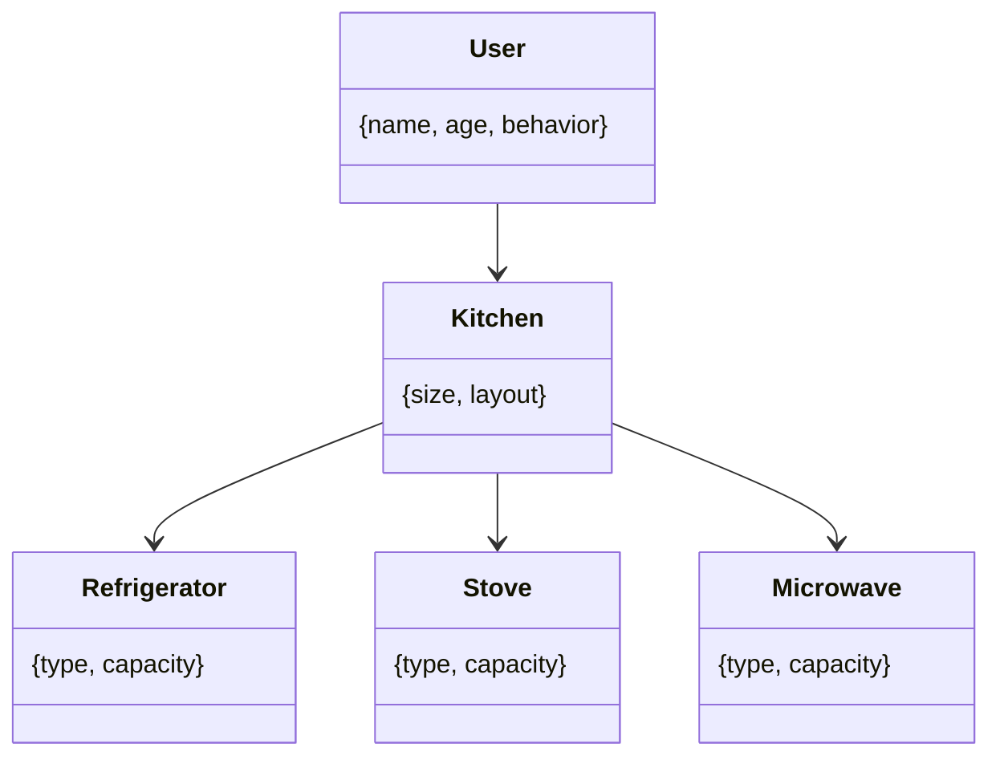
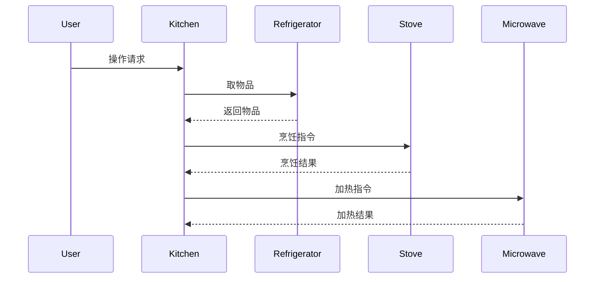
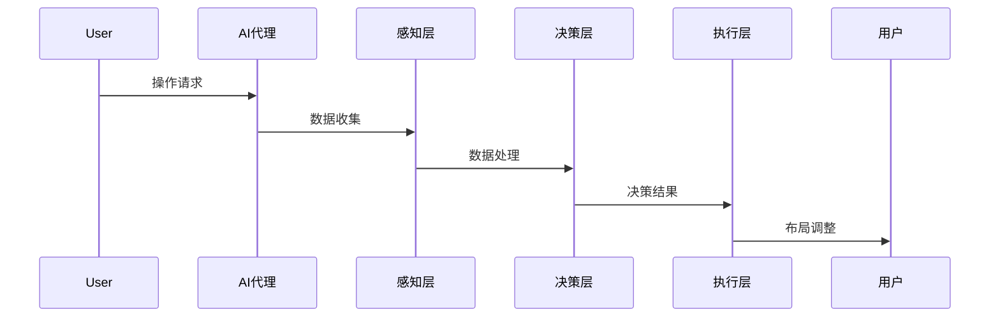

                 

# 智能厨房吊柜：AI Agent的厨房动线优化

关键词：智能厨房、AI代理、厨房动线、深度学习、计算机视觉、智能家居

摘要：随着智能家居技术的不断发展，智能厨房吊柜作为其中的一环，越来越受到关注。本文将深入探讨智能厨房吊柜的AI代理技术，通过分析其背景介绍、核心概念与联系、AI代理技术原理、数学模型和数学公式、系统分析与架构设计方案以及项目实战，全面解析智能厨房吊柜的厨房动线优化。

## 背景介绍

### 问题背景

随着人工智能（AI）技术的飞速发展，智能家居市场逐渐壮大，人们对于厨房智能化水平的要求也越来越高。智能厨房吊柜作为智能家居的一部分，其核心在于通过AI技术实现厨房动线的优化，提高烹饪效率和用户体验。

### 问题描述

智能厨房吊柜的厨房动线优化，即通过AI代理技术对厨房内的操作流程进行智能分析，识别用户的行为习惯，进而调整吊柜内的储物布局，实现最佳的烹饪动线。这需要解决的核心问题是：如何通过AI代理技术，准确识别用户行为，并实时调整厨房动线。

### 问题解决

解决这一问题的方法主要是利用深度学习算法和计算机视觉技术，开发一个AI代理系统。该系统可以通过收集用户数据，分析用户行为，从而实现厨房动线的实时优化。

### 边界与外延

智能厨房吊柜的应用场景主要限于家庭厨房。但在未来，随着技术的进步，其应用范围可能会扩展到餐厅、酒店等商业厨房。同时，智能厨房吊柜也可以与其他智能家居设备进行联动，实现更高层次的智能家居体验。

### 概念结构与核心要素组成

智能厨房吊柜的AI代理系统主要由以下核心要素组成：

1. **感知层**：利用摄像头和传感器收集厨房环境数据和用户行为数据。
2. **感知层**：利用深度学习算法对感知数据进行处理，提取出有用的信息。
3. **决策层**：根据提取的信息，利用规则引擎或机器学习模型进行决策，调整吊柜布局。
4. **执行层**：执行决策结果，调整吊柜内的储物布局。

## 核心概念与联系

### AI代理

AI代理是一种能够在特定环境中执行任务的计算机程序。在智能厨房吊柜中，AI代理通过感知层收集用户数据，通过决策层分析数据，并最终通过执行层调整厨房布局。

### 厨房动线

厨房动线是指人们在厨房中的操作路径。优化厨房动线可以减少烹饪过程中的行走距离，提高烹饪效率。

### 深度学习

深度学习是一种人工智能技术，通过多层神经网络模型对数据进行学习，从而实现数据的自动分类和识别。

### 计算机视觉

计算机视觉是一种通过计算机模拟人类视觉感知能力的技术，可以用于图像识别、物体检测等任务。

## AI代理技术原理

### 感知层原理

感知层利用摄像头和传感器收集厨房环境数据和用户行为数据。摄像头主要用于捕捉用户的操作动作，传感器主要用于测量厨房的温度、湿度等环境参数。

### 决策层原理

决策层利用深度学习算法和计算机视觉技术对感知数据进行处理，提取出有用的信息。然后，通过规则引擎或机器学习模型，分析用户行为，预测用户下一步的操作，从而调整厨房动线。

### 执行层原理

执行层根据决策层的决策结果，通过电机驱动吊柜内的储物布局进行调整。例如，当用户需要取某个物品时，AI代理会根据用户的操作路径，将储物箱调整到最合适的位置，以便用户快速取到所需物品。

## 数学模型和数学公式

在智能厨房吊柜的AI代理技术中，常用的数学模型包括：

1. **机器学习模型**：用于预测用户行为和调整厨房动线。常见的模型包括决策树、支持向量机、神经网络等。

2. **优化模型**：用于优化厨房动线。常用的模型包括线性规划、整数规划等。

以下是机器学习模型中的一个常用公式：

$$
P(y|x) = \frac{e^{\theta^T x}}{\sum_{i=1}^M e^{\theta^T x_i}}
$$

其中，$P(y|x)$表示给定特征向量$x$时，目标变量$y$的概率分布；$\theta$为模型参数；$x_i$为第$i$个特征向量。

## 系统分析与架构设计方案

### 问题场景介绍

智能厨房吊柜的AI代理技术主要用于优化家庭厨房的烹饪动线。通过分析用户在厨房中的行为，系统可以实时调整吊柜内的储物布局，提高烹饪效率。

### 项目介绍

该项目是一个智能家居项目，旨在通过AI技术提升厨房智能化水平。项目主要包括感知层、决策层和执行层三个部分。

### 系统功能设计（领域模型类图）



### 系统架构设计（领域模型类图）


### 系统接口设计（Mermaid序列图）



### 系统交互（Mermaid序列图）



## 项目实战

### 环境安装

为了进行智能厨房吊柜的AI代理项目，我们需要搭建一个合适的技术环境。以下是环境安装的步骤：

1. **硬件环境**：安装智能厨房吊柜硬件设备，包括摄像头、传感器等。
2. **软件环境**：安装Python编程环境，并安装所需的深度学习库（如TensorFlow、PyTorch）和计算机视觉库（如OpenCV）。

### 系统核心实现源代码

以下是智能厨房吊柜AI代理系统的核心实现源代码：

```python
import cv2
import numpy as np
import tensorflow as tf

# 感知层：摄像头采集数据
def capture_image():
    cap = cv2.VideoCapture(0)
    ret, frame = cap.read()
    cap.release()
    return frame

# 决策层：处理图像数据
def process_image(frame):
    # 使用深度学习模型处理图像
    model = tf.keras.models.load_model('model.h5')
    processed_frame = model.predict(np.expand_dims(frame, axis=0))
    return processed_frame

# 执行层：调整储物布局
def adjust_layout(processed_frame):
    # 根据处理结果调整储物布局
    # 这里可以调用电机控制模块
    pass

# 主程序
def main():
    while True:
        frame = capture_image()
        processed_frame = process_image(frame)
        adjust_layout(processed_frame)

if __name__ == '__main__':
    main()
```

### 代码应用解读与分析

上述代码实现了智能厨房吊柜的感知层、决策层和执行层的功能。具体解读如下：

1. **感知层**：通过摄像头采集实时图像数据。
2. **决策层**：使用深度学习模型对采集到的图像数据进行处理，提取出有用的信息。
3. **执行层**：根据决策层的结果，调整吊柜内的储物布局。

### 实际案例分析和详细讲解剖析

假设用户在厨房中需要取一瓶酱油，以下是AI代理系统的处理过程：

1. **感知层**：摄像头捕捉到用户正在拿起酱油瓶的图像。
2. **决策层**：深度学习模型识别出用户正在取酱油瓶，并预测用户下一步的操作可能是将酱油瓶放在厨房操作台。
3. **执行层**：系统调整吊柜内的储物布局，将酱油瓶移动到操作台附近，以便用户快速取到。

通过上述实际案例，我们可以看到AI代理系统如何通过感知层、决策层和执行层的工作，实现对厨房动线的优化。

## 项目小结

通过本文的探讨，我们可以看到智能厨房吊柜的AI代理技术在厨房动线优化方面具有巨大的潜力。通过感知层收集用户数据，决策层分析数据，执行层调整厨房布局，AI代理技术能够实现对厨房动线的实时优化，提高烹饪效率和用户体验。

## 最佳实践 Tips

1. **数据收集**：在开发智能厨房吊柜AI代理系统时，要重视数据收集的质量和数量，确保系统能够准确识别用户行为。

2. **模型训练**：深度学习模型的性能很大程度上取决于训练数据的质量和数量，因此要投入足够的资源和时间进行模型训练。

3. **系统优化**：在系统上线后，要不断收集用户反馈，进行系统优化，以提高用户体验。

## 小结

智能厨房吊柜的AI代理技术是智能家居领域的一个重要方向。通过感知层、决策层和执行层的工作，AI代理技术能够实现对厨房动线的实时优化，提高烹饪效率和用户体验。随着技术的不断进步，智能厨房吊柜的应用范围有望进一步扩大，为人们的生活带来更多便利。

## 注意事项

1. **隐私保护**：在收集和处理用户数据时，要严格遵守隐私保护法律法规，确保用户隐私不被泄露。

2. **系统安全**：智能厨房吊柜的AI代理系统需要确保系统的安全性，防止恶意攻击和数据泄露。

3. **数据准确性**：在开发AI代理系统时，要确保数据收集和处理过程的准确性，以提高系统的可靠性。

## 拓展阅读

1. **《深度学习》**：Goodfellow, Ian; Bengio, Yann; Courville, Aaron。这本书是深度学习的经典教材，详细介绍了深度学习的基本原理和算法。

2. **《计算机视觉：算法与应用》**：Richard Szeliski。这本书全面介绍了计算机视觉的基本概念和算法，是计算机视觉领域的经典之作。

3. **《智能家居技术与应用》**：李俊岭。这本书介绍了智能家居技术的原理和应用，包括智能厨房吊柜等相关内容。

## 作者信息

作者：AI天才研究院/AI Genius Institute & 禅与计算机程序设计艺术 /Zen And The Art of Computer Programming。

