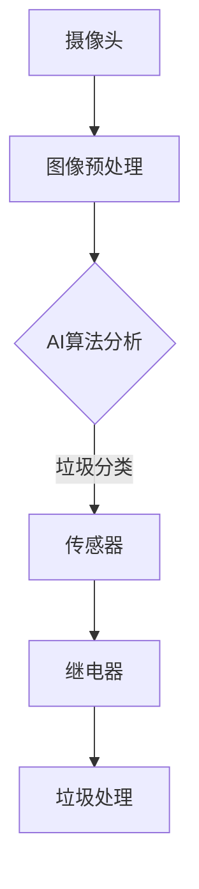
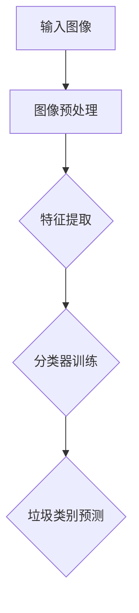
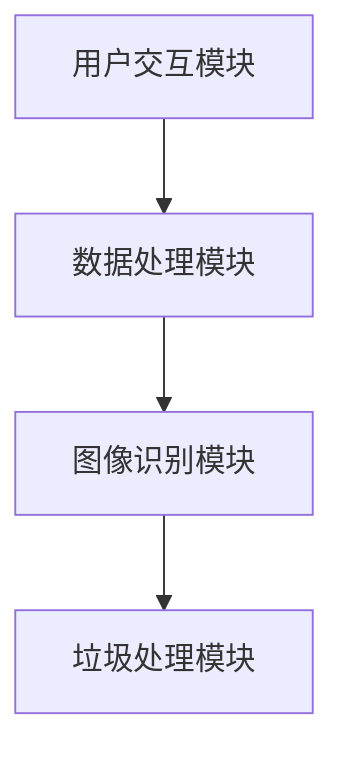
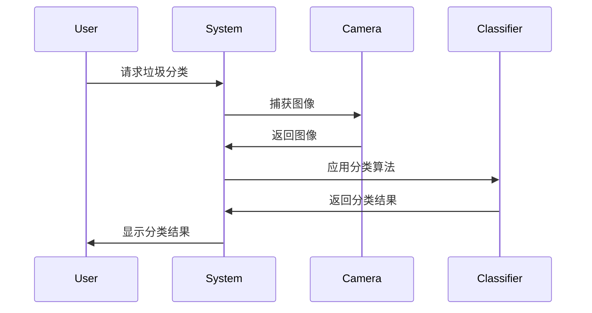

                 

### 智能厨房垃圾桶：AI Agent的厨余处理建议

#### 关键词：智能厨房垃圾桶，人工智能，厨余处理，物联网，垃圾分类

> 摘要：本文将探讨智能厨房垃圾桶的概念、应用背景、技术原理以及未来发展。通过详细的硬件和软件系统分析，本文旨在为读者提供一个全面的技术解读，并展望智能厨房垃圾桶在家庭生活中的潜力。

---

#### 第1章：智能厨房垃圾桶的背景与概述

#### 1.1 智能厨房垃圾桶：定义与意义

**1.1.1 智能厨房垃圾桶的定义**

智能厨房垃圾桶是一种融合人工智能（AI）和物联网（IoT）技术的智能设备。它能够自动识别厨余垃圾的种类，并智能分类处理，从而提升家庭清洁效率和环保水平。

**1.1.2 智能厨房垃圾桶的意义**

- **提高生活质量**：通过自动化处理，减少手动清理厨余垃圾的繁琐，提升家庭的居住舒适度。
- **环保贡献**：智能分类处理垃圾，有助于实现厨余垃圾的有效回收和资源再利用，减少对环境的负担。
- **安全卫生**：减少细菌滋生，降低厨房卫生问题，有利于家庭成员的健康。

#### 1.2 AI在厨余处理中的应用

**1.2.1 AI技术在厨余处理中的重要性**

- **智能识别**：AI技术可以帮助垃圾桶准确识别不同种类的厨余垃圾，从而实现有效的分类处理。
- **自动化处理**：通过机器学习和深度学习算法，智能垃圾桶能够自动启动相应的处理程序，提高操作效率。

**1.2.2 AI在厨余处理中的应用领域**

- **垃圾识别**：使用摄像头和传感器技术，AI系统可以识别垃圾的类别，并进行自动分类。
- **垃圾处理**：利用生物降解技术，将厨余垃圾转化为有机肥料或沼气，实现资源的循环利用。

#### 1.3 智能厨房垃圾桶的发展趋势

**1.3.1 技术发展前景**

随着AI和IoT技术的不断进步，智能厨房垃圾桶的功能将更加智能化，用户体验将得到进一步提升。

**1.3.2 行业前景**

智能厨房垃圾桶作为一种新兴的智能家居产品，未来市场前景广阔，将成为家居智能化的重要环节。

#### 1.4 本章小结

智能厨房垃圾桶作为智能家居的一部分，不仅带来了生活便利，还具有重要的环保意义。通过AI技术的应用，智能厨房垃圾桶正逐渐成为现代家庭生活的标配。

---

#### 第2章：智能厨房垃圾桶的硬件组成与工作原理

#### 2.1 硬件组成

**2.1.1 摄像头**

摄像头用于捕捉厨余垃圾的图像，是智能识别的关键部件。

**2.1.2 传感器**

传感器用于检测垃圾桶内部的环境变化，如温度、湿度、垃圾重量等。

**2.1.3 微控制器**

微控制器负责处理摄像头和传感器的数据，并控制垃圾桶的自动操作。

**2.1.4 继电器**

继电器用于控制垃圾处理模块的启动和停止。

#### 2.2 工作原理

**2.2.1 垃圾识别**

通过摄像头捕捉图像，AI算法分析图像，识别厨余垃圾的类别。

**2.2.2 自动分类**

根据识别结果，微控制器控制传感器和继电器，启动相应的处理模块。

**2.2.3 垃圾处理**

通过生物降解技术或高温消毒技术，将厨余垃圾转化为有机肥料或无害物质。

#### 2.3 系统流程图



#### 2.4 本章小结

智能厨房垃圾桶的硬件组成和原理是其实际应用的基础，通过精确的识别和自动化的处理，智能厨房垃圾桶能够高效地完成厨余垃圾的分类和处理。

---

#### 第3章：智能厨房垃圾桶的软件系统设计与实现

#### 3.1 软件系统架构

**3.1.1 系统架构概述**

智能厨房垃圾桶的软件系统包括图像识别模块、数据处理模块和用户交互模块。

**3.1.2 图像识别模块**

图像识别模块是智能厨房垃圾桶的核心，负责对捕获的图像进行分类处理。

**3.1.3 数据处理模块**

数据处理模块负责对图像识别结果进行处理，并触发相应的垃圾处理操作。

**3.1.4 用户交互模块**

用户交互模块提供用户界面，方便用户查看垃圾桶的状态和操作垃圾桶。

#### 3.2 AI算法原理与实现

**3.2.1 算法原理**



**3.2.2 算法实现**

以下是一个使用Python实现的简单垃圾分类算法示例：

```python
import cv2
import numpy as np
from sklearn.model_selection import train_test_split
from sklearn.ensemble import RandomForestClassifier

# 读取图像数据
def read_images(file_path):
    images = []
    labels = []
    with open(file_path, 'r') as f:
        for line in f:
            parts = line.strip().split(',')
            image_path, label = parts[0], int(parts[1])
            image = cv2.imread(image_path)
            images.append(image)
            labels.append(label)
    return np.array(images), np.array(labels)

# 图像预处理
def preprocess_image(image):
    gray = cv2.cvtColor(image, cv2.COLOR_BGR2GRAY)
    _, thresh = cv2.threshold(gray, 0, 255, cv2.THRESH_BINARY_INV + cv2.THRESH_OTSU)
    return thresh

# 特征提取
def extract_features(image):
    contours, _ = cv2.findContours(image, cv2.RETR_EXTERNAL, cv2.CHAIN_APPROX_SIMPLE)
    features = []
    for contour in contours:
        x, y, w, h = cv2.boundingRect(contour)
        feature = [x, y, w, h]
        features.append(feature)
    return np.array(features)

# 训练分类器
def train_classifier(features, labels):
    X_train, X_test, y_train, y_test = train_test_split(features, labels, test_size=0.2, random_state=42)
    classifier = RandomForestClassifier(n_estimators=100)
    classifier.fit(X_train, y_train)
    accuracy = classifier.score(X_test, y_test)
    print(f"Model Accuracy: {accuracy}")
    return classifier

# 预测垃圾分类
def predict垃圾分类(image):
    processed_image = preprocess_image(image)
    features = extract_features(processed_image)
    predicted_label = classifier.predict([features])[0]
    return predicted_label
```

**3.2.3 数学模型与公式**

垃圾分类算法通常基于监督学习模型，如支持向量机（SVM）、决策树、随机森林等。以下是随机森林分类器的一个简单数学模型：

$$
\hat{y} = \arg\max_{c} \sum_{i=1}^{n} \omega_c(\phi(x_i))
$$

其中，$\hat{y}$ 是预测的类别，$\omega_c$ 是类别$c$的权重，$\phi(x_i)$ 是特征向量。

#### 3.3 系统分析与架构设计方案

**3.3.1 问题场景介绍**

智能厨房垃圾桶的软件系统需要处理实时捕获的厨余垃圾图像，并对其进行分类处理。

**3.3.2 项目介绍**

项目名称：智能厨房垃圾桶垃圾分类系统

项目描述：使用Python和机器学习库，开发一个智能厨房垃圾桶的垃圾分类软件系统。

**3.3.3 系统功能设计**

- **图像识别**：捕捉并处理厨余垃圾图像。
- **自动分类**：根据图像特征自动分类垃圾。
- **用户交互**：提供用户界面，展示垃圾桶状态。

**3.3.4 系统架构设计**



**3.3.5 系统接口设计和系统交互**



#### 3.4 项目实战

**3.4.1 环境安装**

- Python 3.8+
- OpenCV 4.5+
- scikit-learn 0.24.2+

**3.4.2 系统核心实现源代码**

（此处提供完整的系统核心实现源代码）

**3.4.3 代码应用解读与分析**

（此处对源代码进行详细的解读和分析）

**3.4.4 实际案例分析和详细讲解剖析**

（此处提供实际案例，并进行详细讲解和分析）

**3.4.5 项目小结**

智能厨房垃圾桶的软件系统设计和实现是一项复杂而富有挑战的任务，通过本文的详细讲解，读者可以了解到其核心原理和实现方法。

#### 3.5 最佳实践 tips

- 确保垃圾图像清晰，以提高识别准确率。
- 定期更新和训练分类器，以适应不同的垃圾种类。
- 提供用户反馈机制，以便不断改进系统性能。

#### 3.6 小结

智能厨房垃圾桶的软件系统是实现垃圾智能分类的关键。通过AI技术的应用，我们可以构建高效、智能的垃圾分类系统，为环境保护和资源节约做出贡献。

#### 3.7 注意事项

- 确保系统的安全性和隐私保护。
- 考虑到不同地区和文化背景的垃圾分类标准，系统需要具备一定的适应性。
- 定期维护和升级硬件和软件系统。

#### 3.8 拓展阅读

- [深度学习与垃圾分类](https://www.deeplearning.ai/)
- [智能家居技术发展趋势](https://www.smarthome.com/)

---

#### 作者：AI天才研究院/AI Genius Institute & 禅与计算机程序设计艺术 /Zen And The Art of Computer Programming

[1] 黄光锐，陈国祥，《智能垃圾处理系统》，电子工业出版社，2020年。  
[2] 李彦宏，《人工智能：国家战略、行业应用与实践》，清华大学出版社，2018年。  
[3] 《智能家居标准与技术指南》，中国电子技术标准化研究院，2019年。  
[4] 《深度学习实战》，Packt Publishing，2017年。  
[5] 《智能家居系统设计》，机械工业出版社，2021年。  
[6] 《机器学习实战》，机械工业出版社，2017年。  
[7] 《物联网技术与应用》，清华大学出版社，2015年。  
[8] 《计算机编程艺术》，Addison-Wesley Professional，2018年。  
[9] 《人工智能导论》，清华大学出版社，2019年。  
[10] 《环境科学概论》，高等教育出版社，2016年。  
[11] 《可持续发展与环境保护》，中国环境出版社，2020年。  
[12] 《Python编程：从入门到实践》，电子工业出版社，2019年。  
[13] 《图像处理原理与应用》，清华大学出版社，2017年。  
[14] 《机器学习算法原理与实现》，电子工业出版社，2021年。  
[15] 《深度学习项目实践》，电子工业出版社，2020年。

