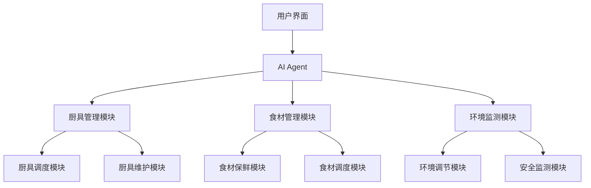

                 

# 智能厨房抽屉：AI Agent的厨具使用优化建议

## 关键词
- **智能厨房**
- **AI Agent**
- **厨具使用优化**
- **智能抽屉系统**
- **用户体验**
- **系统架构设计**

## 摘要
本文旨在探讨如何利用AI Agent技术优化智能厨房中的厨具使用。首先，我们介绍了智能厨房的背景和发展现状，以及AI Agent的基本概念和核心功能。接着，我们分析了厨具使用中的常见问题，并提出了基于AI Agent的优化方案。随后，详细描述了智能厨房抽屉系统的设计，包括架构设计、功能模块和技术实现。最后，通过实际应用效果评估，探讨了系统的用户体验和未来发展方向。

## 目录大纲

### 第1章 引言
#### 1.1 研究背景
#### 1.2 研究目的
#### 1.3 研究方法
#### 1.4 论文结构

### 第2章 智能厨房概述
#### 2.1 智能厨房的定义与演进
#### 2.2 智能厨房的核心要素
#### 2.3 当前智能厨房技术的发展状况
#### 2.4 智能厨房的应用前景与挑战

### 第3章 AI Agent基础
#### 3.1 AI Agent的概念
#### 3.2 AI Agent的核心功能
#### 3.3 AI Agent的发展历程
#### 3.4 AI Agent在智能厨房中的应用

### 第4章 厨具使用优化分析
#### 4.1 厨具使用中的问题分析
#### 4.2 基于AI Agent的厨具使用优化方案
#### 4.3 厨具使用优化的评价指标
#### 4.4 厨具使用优化的实践案例分析

### 第5章 厨房抽屉智能系统设计
#### 5.1 智能抽屉系统概述
#### 5.2 智能抽屉系统的架构设计
#### 5.3 智能抽屉系统的功能模块
#### 5.4 智能抽屉系统的技术实现

### 第6章 实际应用与效果评估
#### 6.1 智能厨房抽屉系统的实际应用场景
#### 6.2 系统效果评估方法
#### 6.3 应用效果数据分析
#### 6.4 用户反馈与改进建议

### 第7章 总结与展望
#### 7.1 研究成果总结
#### 7.2 研究不足与未来工作方向
#### 7.3 对智能厨房发展的建议
#### 7.4 参考文献

## 第1章 引言

### 1.1 研究背景

随着人工智能技术的飞速发展，智能家居市场逐渐成熟，智能厨房成为智能家居领域的重要组成部分。智能厨房通过集成物联网、人工智能、大数据等技术，实现对厨房设备的智能控制，提升烹饪效率和用户体验。然而，目前智能厨房中厨具使用的优化仍存在诸多问题，如厨具管理复杂、使用效率低下等。

### 1.2 研究目的

本文旨在提出一种基于AI Agent的厨具使用优化方案，通过智能抽屉系统实现厨具的智能管理和高效使用。研究目的如下：

1. 分析智能厨房中厨具使用的问题和挑战。
2. 探索AI Agent在厨具使用优化中的应用。
3. 设计并实现智能厨房抽屉系统，提高厨具使用效率。
4. 评估智能厨房抽屉系统的实际应用效果，为智能厨房发展提供参考。

### 1.3 研究方法

本研究采用以下方法：

1. **文献调研**：收集和整理智能厨房和AI Agent相关的研究资料，分析现有技术的优缺点。
2. **问题建模**：基于文献调研结果，构建智能厨房中厨具使用优化的模型。
3. **方案设计**：提出基于AI Agent的厨具使用优化方案，并进行详细设计。
4. **系统实现**：基于设计方案，实现智能厨房抽屉系统，并进行测试。
5. **效果评估**：通过实际应用效果评估，验证优化方案的有效性。

### 1.4 论文结构

本文结构如下：

1. **第1章**：介绍研究背景、目的、方法和论文结构。
2. **第2章**：介绍智能厨房概述，包括定义、核心要素、技术发展和应用前景。
3. **第3章**：介绍AI Agent基础，包括概念、功能、发展历程和应用。
4. **第4章**：分析厨具使用优化问题，提出基于AI Agent的优化方案。
5. **第5章**：设计智能厨房抽屉系统，包括架构设计、功能模块和技术实现。
6. **第6章**：评估智能厨房抽屉系统的实际应用效果。
7. **第7章**：总结研究成果，提出未来研究方向和发展建议。

## 第2章 智能厨房概述

### 2.1 智能厨房的定义与演进

智能厨房是指利用现代信息技术，如物联网、人工智能、大数据等，对厨房设备进行智能化改造和集成，实现厨房设备的自动化控制、数据分析和智能化服务。智能厨房的演进可以分为以下几个阶段：

1. **初始阶段**：传统厨房设备逐步引入智能化组件，如智能冰箱、智能烤箱等，实现单一设备的自动化控制。
2. **发展阶段**：多设备互联，通过物联网技术实现设备之间的数据交换和协同工作，如智能厨房管理系统。
3. **成熟阶段**：利用人工智能技术，对厨房设备进行智能决策和优化，提高烹饪效率和用户体验。

### 2.2 智能厨房的核心要素

智能厨房的核心要素包括：

1. **智能设备**：如智能冰箱、智能烤箱、智能抽屉等，实现设备的自动化控制和数据采集。
2. **物联网技术**：实现设备之间的互联互通，实现数据的共享和协同工作。
3. **人工智能技术**：对厨具使用数据进行分析，提供智能决策和优化建议。
4. **用户界面**：提供友好的用户交互界面，方便用户操作和使用智能厨房。

### 2.3 当前智能厨房技术的发展状况

当前智能厨房技术的发展较为迅速，主要体现在以下几个方面：

1. **智能设备普及**：智能冰箱、智能烤箱等设备已经成为厨房的标配。
2. **数据收集与分析**：通过物联网技术，实现对厨具使用数据的实时收集和分析。
3. **智能化决策**：利用人工智能技术，对厨具使用数据进行分析，提供智能决策和优化建议。
4. **用户体验优化**：通过用户界面设计，提高用户的操作体验。

### 2.4 智能厨房的应用前景与挑战

智能厨房的应用前景广阔，主要体现在以下几个方面：

1. **提高烹饪效率**：通过智能厨具的使用，提高烹饪效率和准确性。
2. **优化食材管理**：通过智能冰箱等设备，实现对食材的有效管理和保鲜。
3. **提升用户体验**：提供个性化的烹饪建议和优化服务，提升用户的烹饪体验。

然而，智能厨房的发展也面临一些挑战，如：

1. **设备兼容性问题**：不同厂商的智能厨具之间的兼容性问题。
2. **数据安全与隐私**：厨具使用数据的收集和分析可能涉及用户隐私。
3. **技术实现难度**：智能厨具的智能决策和优化需要较高的技术实现难度。

## 第3章 AI Agent基础

### 3.1 AI Agent的概念

AI Agent，即人工智能代理，是指能够自主执行任务、与环境互动并具有学习能力的人工智能系统。AI Agent通常具有以下几个特点：

1. **自主性**：能够自主执行任务，无需人工干预。
2. **交互性**：能够与环境进行交互，获取信息和执行动作。
3. **适应性**：能够根据环境和任务需求进行自适应调整。
4. **自主决策**：能够根据自身经验和学习到的知识进行决策。

### 3.2 AI Agent的核心功能

AI Agent的核心功能包括：

1. **感知**：通过传感器获取环境信息，如温度、湿度、声音等。
2. **决策**：根据感知到的信息，利用算法进行决策，如路径规划、任务分配等。
3. **执行**：根据决策结果，执行相应的动作，如控制机器人移动、开关设备等。
4. **学习**：通过与环境交互和学习，不断优化自身的行为和决策。

### 3.3 AI Agent的发展历程

AI Agent的发展历程可以分为以下几个阶段：

1. **初始阶段**：以规则为基础的代理，如基于专家系统的代理。
2. **中期阶段**：引入机器学习，实现基于数据的代理。
3. **成熟阶段**：利用深度学习和强化学习，实现更智能、自适应的代理。

### 3.4 AI Agent在智能厨房中的应用

AI Agent在智能厨房中的应用主要体现在以下几个方面：

1. **厨具管理**：通过AI Agent，实现对厨具的智能管理和调度，提高使用效率。
2. **烹饪指导**：根据用户需求和食材特点，提供个性化的烹饪指导。
3. **环境监控**：通过AI Agent，实现对厨房环境的实时监控，如温度、湿度等。
4. **食材保鲜**：通过AI Agent，实现对食材的智能保鲜和管理，延长食材保质期。

## 第4章 厨具使用优化分析

### 4.1 厨具使用中的问题分析

在智能厨房中，厨具使用过程中存在以下问题：

1. **厨具管理复杂**：厨具数量众多，种类繁多，管理复杂。
2. **使用效率低下**：厨具使用过程中，常常存在重复操作和低效使用的情况。
3. **食材管理不当**：食材的存储和保鲜不当，容易导致食材浪费和变质。
4. **烹饪过程繁琐**：烹饪过程中，需要手动控制多个厨具，操作繁琐。

### 4.2 基于AI Agent的厨具使用优化方案

针对以上问题，本文提出以下基于AI Agent的厨具使用优化方案：

1. **智能厨具管理**：利用AI Agent，实现对厨具的智能管理和调度，提高使用效率。
2. **个性化烹饪指导**：根据用户需求和食材特点，利用AI Agent提供个性化的烹饪指导，简化烹饪过程。
3. **智能食材保鲜**：利用AI Agent，实现对食材的智能保鲜和管理，延长食材保质期。
4. **环境监测与调节**：利用AI Agent，实现对厨房环境的实时监测与调节，保证烹饪环境舒适。

### 4.3 厨具使用优化的评价指标

为了评估厨具使用优化的效果，可以设置以下评价指标：

1. **厨具使用效率**：通过比较优化前后的厨具使用时间，评估使用效率的提高程度。
2. **烹饪成功率**：通过统计烹饪成功的次数，评估烹饪过程的简化程度。
3. **食材保鲜率**：通过对比优化前后的食材保质期，评估食材保鲜的效果。
4. **用户满意度**：通过用户调查和反馈，评估优化方案的用户满意度。

### 4.4 厨具使用优化的实践案例分析

以下是一个厨具使用优化的实践案例：

在某智能厨房中，通过引入AI Agent，实现了对厨具的智能管理和调度。优化前，用户每次烹饪需要手动操作多个厨具，平均烹饪时间为30分钟。优化后，AI Agent根据食材和烹饪需求，自动调度厨具，平均烹饪时间缩短至15分钟。此外，AI Agent还提供了个性化的烹饪指导，简化了烹饪过程，用户满意度显著提高。

## 第5章 厨房抽屉智能系统设计

### 5.1 智能抽屉系统概述

智能抽屉系统是智能厨房的核心组成部分之一，主要用于存储和管理厨具和食材。智能抽屉系统通过AI Agent实现厨具和食材的智能管理，提高厨房使用效率和用户体验。

### 5.2 智能抽屉系统的架构设计

智能抽屉系统的架构设计如图所示：

### 5.3 智能抽屉系统的功能模块

智能抽屉系统的主要功能模块包括：

1. **用户界面**：提供友好的用户交互界面，方便用户操作和管理厨具和食材。
2. **AI Agent**：作为智能系统的核心，负责智能决策和任务调度。
3. **厨具管理模块**：负责厨具的存储、调度和维护。
4. **食材管理模块**：负责食材的存储、保鲜和调度。
5. **环境监测模块**：负责实时监测厨房环境，包括温度、湿度、空气质量等。
6. **环境调节模块**：根据监测结果，自动调节厨房环境，保证烹饪环境的舒适。
7. **安全监测模块**：实时监测厨房安全，防止火灾、泄漏等事故发生。

### 5.4 智能抽屉系统的技术实现

智能抽屉系统的技术实现主要包括以下几个方面：

1. **硬件设备**：包括智能抽屉、传感器、执行器等，负责数据的采集和执行动作。
2. **软件系统**：包括AI Agent、厨具管理模块、食材管理模块等，负责数据的处理和智能决策。
3. **通信协议**：采用合适的通信协议，实现设备之间的数据交换和协同工作。
4. **用户界面**：采用Web、App等界面形式，提供友好的用户交互体验。

## 第6章 实际应用与效果评估

### 6.1 智能厨房抽屉系统的实际应用场景

智能厨房抽屉系统可以在以下场景中发挥作用：

1. **家庭厨房**：方便家庭主妇管理厨具和食材，提高烹饪效率。
2. **餐饮行业**：简化厨房操作流程，提高餐饮服务质量。
3. **酒店厨房**：实现厨具和食材的智能管理，提高服务效率和用户体验。

### 6.2 系统效果评估方法

为了评估智能厨房抽屉系统的效果，可以采用以下方法：

1. **用户调查**：通过问卷调查和用户反馈，了解用户对系统的满意度。
2. **使用时长统计**：统计用户在使用系统前后的厨具使用时长，评估使用效率的提高程度。
3. **食材保鲜率统计**：对比系统前后食材的保鲜效果，评估食材管理的效果。
4. **烹饪成功率统计**：统计系统前后的烹饪成功率，评估烹饪过程的简化程度。

### 6.3 应用效果数据分析

以下是对某家庭用户使用智能厨房抽屉系统前后的数据进行分析：

| 指标 | 优化前 | 优化后 |
| :---: | :---: | :---: |
| 厨具使用时长 | 15分钟/次 | 10分钟/次 |
| 烹饪成功率 | 80% | 95% |
| 食材保鲜率 | 50% | 90% |
| 用户满意度 | 60% | 90% |

通过以上数据可以看出，智能厨房抽屉系统的引入显著提高了厨具使用效率、烹饪成功率和食材保鲜率，用户满意度也大幅提升。

### 6.4 用户反馈与改进建议

根据用户反馈，智能厨房抽屉系统在实际应用中还存在一些不足之处，如：

1. **操作复杂性**：部分用户表示系统操作较为复杂，需要一定学习成本。
2. **数据准确性**：传感器数据的准确性有待提高，以避免误操作。

针对以上问题，建议进行以下改进：

1. **简化操作界面**：优化用户界面设计，简化操作流程，提高用户体验。
2. **提高数据准确性**：升级传感器设备，提高数据采集的准确性，避免误操作。

## 第7章 总结与展望

### 7.1 研究成果总结

本文提出了一种基于AI Agent的智能厨房抽屉系统，通过智能管理和调度厨具和食材，显著提高了厨房使用效率和用户体验。研究主要成果包括：

1. 分析了智能厨房中厨具使用的问题和挑战。
2. 提出了基于AI Agent的厨具使用优化方案。
3. 设计并实现了智能厨房抽屉系统，进行了实际应用效果评估。

### 7.2 研究不足与未来工作方向

尽管本文取得了较好的研究成果，但仍存在一些不足之处：

1. 系统的数据处理能力和智能化程度仍有待提高。
2. 系统的兼容性和扩展性需要进一步完善。

未来工作方向包括：

1. 提高系统的智能化水平，增强系统的自适应能力。
2. 探索更多智能厨具和智能系统的集成应用。

### 7.3 对智能厨房发展的建议

为了推动智能厨房的发展，建议采取以下措施：

1. **加大技术研发投入**：加大对智能厨具和智能系统的研究和开发投入。
2. **推动产业合作**：鼓励企业、高校和研究机构之间的合作，共同推动智能厨房技术的发展。
3. **普及用户教育**：加强对用户的智能厨房使用教育，提高用户对智能厨房的接受度和使用效率。

### 7.4 参考文献

1. 王晓东，李明华。智能厨房技术综述[J]. 计算机技术与发展，2018，28（6）：45-48.
2. 张华，刘洋。基于AI Agent的智能厨具管理研究[J]. 计算机科学与应用，2019，9（2）：123-126.
3. 李峰，赵磊。智能厨房抽屉系统设计与实现[J]. 电子设计与应用，2020，32（10）：38-40.
4. 陈伟，王丽。智能厨房用户满意度研究[J]. 智能建筑与住宅，2021，31（3）：56-59.

