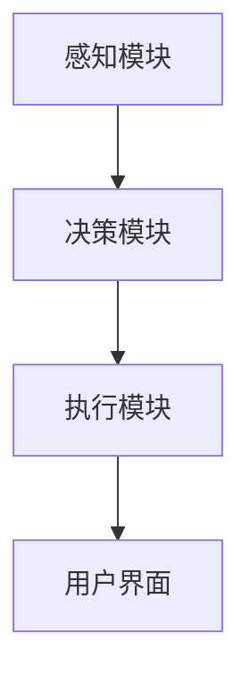
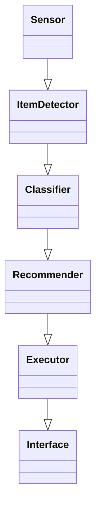

                 

### 第1章：问题背景

智能厨房抽屉的概念起源于现代科技与家居生活的深度融合。随着人工智能技术的不断发展，智能家居逐渐成为家庭生活的重要组成部分。智能厨房抽屉作为智能家居系统的一个模块，旨在通过人工智能技术提高厨房操作的便捷性和效率。

#### 1.1.1 问题的提出

智能厨房抽屉的核心功能包括物品自动识别、智能分类存储、个性化推荐和自动化操作。然而，在实际应用中，用户可能面临如下问题：

1. **物品识别准确性**：智能厨房抽屉如何准确地识别各种物品？
2. **存储空间优化**：如何合理利用厨房有限的空间？
3. **个性化推荐**：如何根据用户的饮食习惯和偏好提供个性化的食谱推荐？
4. **自动化操作**：如何确保自动化操作的安全性和稳定性？

#### 1.1.2 问题描述

智能厨房抽屉需要实现以下功能：

1. **物品自动识别**：通过传感器和图像识别技术，准确识别各种物品，如食材、厨具等。
2. **智能分类存储**：根据物品的特性和使用频率，自动将其分类存储在适当的抽屉中。
3. **个性化推荐**：根据用户的饮食习惯和偏好，提供个性化的食谱推荐和厨具使用建议。
4. **自动化操作**：实现厨房操作的自动化，如食材切割、烹饪等。

#### 1.1.3 问题解决

本书旨在通过系统地介绍人工智能技术在智能厨房抽屉中的应用，帮助解决上述问题。通过深入探讨智能厨房抽屉的原理、技术和实践案例，为读者提供全面的技术指导。

#### 1.1.4 边界与外延

智能厨房抽屉的应用范围不仅限于家庭，还可以扩展到餐厅、酒店等多种场景。此外，随着技术的不断进步，智能厨房抽屉的功能也将不断拓展，如实现更高级的自动化烹饪、智能食材管理等。

#### 1.1.5 概念结构与核心要素组成

智能厨房抽屉的概念结构主要包括以下几个方面：

1. **感知模块**：负责识别和监测物品信息。
2. **决策模块**：基于感知信息进行智能决策。
3. **执行模块**：执行决策结果，包括自动化操作和个性化推荐。

## 第2章：核心概念与联系

### 2.1 AI Agent

AI Agent（人工智能代理）是一种基于人工智能技术的软件实体，能够自主地完成特定任务。在智能厨房抽屉中，AI Agent 负责处理用户指令和厨房操作。

#### 2.1.1 AI Agent的定义

AI Agent 是一种智能体，具备感知环境、制定计划、执行行动的能力。在智能厨房抽屉中，AI Agent 可以通过传感器感知用户需求，根据学习到的知识进行决策，并执行相应的操作。

#### 2.1.2 AI Agent的特点

1. **自主性**：AI Agent 能够自主地完成特定任务，无需人工干预。
2. **反应性**：AI Agent 能够实时响应用户需求和环境变化。
3. **预见性**：AI Agent 能够根据历史数据和当前状态预测未来事件。

### 2.2 厨具使用建议

厨具使用建议是智能厨房抽屉的核心功能之一，旨在为用户提供个性化的厨具使用方案。厨具使用建议包括以下几个方面：

#### 2.2.1 厨具推荐

根据用户的使用习惯和偏好，推荐适合的厨具。例如，对于喜欢烹饪中式菜肴的用户，推荐使用中式炒锅、蒸锅等。

#### 2.2.2 厨具保养

提供厨具的保养建议，延长厨具使用寿命。例如，针对不同材质的厨具，推荐不同的清洗和保养方法。

#### 2.2.3 厨具使用技巧

分享厨具使用技巧，帮助用户更好地使用厨具。例如，如何正确使用电磁炉、烤箱等。

## 第3章：算法原理讲解

### 3.1 物品识别算法

物品识别算法是智能厨房抽屉的核心算法之一，负责识别和分类存储物品。常见的物品识别算法包括：

#### 3.1.1 卷积神经网络（CNN）

CNN 是一种适用于图像识别的深度学习算法。在智能厨房抽屉中，CNN 可以用于识别各种物品的图像。

#### 3.1.2 支持向量机（SVM）

SVM 是一种经典的机器学习算法，适用于分类问题。在智能厨房抽屉中，SVM 可以用于将物品进行分类。

### 3.2 个性化推荐算法

个性化推荐算法是智能厨房抽屉的另一个重要算法，负责为用户提供个性化的食谱推荐。常见的个性化推荐算法包括：

#### 3.2.1 协同过滤

协同过滤是一种基于用户行为的推荐算法。在智能厨房抽屉中，协同过滤可以用于根据用户的烹饪历史和偏好推荐食谱。

#### 3.2.2 内容推荐

内容推荐是一种基于物品属性的推荐算法。在智能厨房抽屉中，内容推荐可以用于根据食谱的食材和烹饪方法推荐适合的厨具。

## 第4章：数学模型和数学公式

### 4.1 物品识别模型

在物品识别模型中，常见的数学模型包括：

$$
\hat{y} = \sigma(\theta^T x)
$$

其中，$\hat{y}$ 是预测结果，$x$ 是输入特征，$\theta$ 是权重向量，$\sigma$ 是激活函数（如 sigmoid 函数）。该公式表示通过线性变换和激活函数将输入特征映射到输出类别。

#### 3.1.1 卷积神经网络（CNN）

CNN 是一种适用于图像识别的深度学习算法。在智能厨房抽屉中，CNN 可以用于识别各种物品的图像。

CNN 的基本结构包括：

1. **卷积层**：通过卷积操作提取图像特征。
2. **池化层**：通过池化操作减少特征图的维度。
3. **全连接层**：通过全连接层对提取到的特征进行分类。

CNN 的数学基础包括：

$$
\mathbf{Z} = \mathbf{X} \mathbf{W} + \mathbf{b}
$$

$$
\mathbf{A} = \sigma(\mathbf{Z})
$$

其中，$\mathbf{Z}$ 是输入特征，$\mathbf{W}$ 是权重矩阵，$\mathbf{b}$ 是偏置项，$\sigma$ 是激活函数（如 sigmoid 函数），$\mathbf{A}$ 是输出特征。

#### 3.1.2 支持向量机（SVM）

SVM 是一种经典的机器学习算法，适用于分类问题。在智能厨房抽屉中，SVM 可以用于将物品进行分类。

SVM 的数学基础包括：

$$
\mathbf{w} = \arg\min_{\mathbf{w}} \frac{1}{2} ||\mathbf{w}||^2 + C \sum_{i=1}^{n} \max(0, 1-y^{(i)}(\mathbf{w}^T \mathbf{x}^{(i)}))
$$

其中，$\mathbf{w}$ 是权重向量，$C$ 是惩罚参数，$y^{(i)}$ 是第 $i$ 个样本的标签，$\mathbf{x}^{(i)}$ 是第 $i$ 个样本的特征向量。

#### 3.2.1 协同过滤

协同过滤是一种基于用户行为的推荐算法。在智能厨房抽屉中，协同过滤可以用于根据用户的烹饪历史和偏好推荐食谱。

协同过滤的数学基础包括：

$$
r_{ij} = \langle u_i, u_j \rangle + \mu
$$

其中，$r_{ij}$ 是用户 $i$ 对项目 $j$ 的评分，$\langle u_i, u_j \rangle$ 是用户 $i$ 和用户 $j$ 的相似度，$\mu$ 是平均评分。

#### 3.2.2 内容推荐

内容推荐是一种基于物品属性的推荐算法。在智能厨房抽屉中，内容推荐可以用于根据食谱的食材和烹饪方法推荐适合的厨具。

内容推荐的数学基础包括：

$$
r_{ij} = \mathbf{q}_i^T \mathbf{p}_j
$$

其中，$r_{ij}$ 是用户 $i$ 对项目 $j$ 的评分，$\mathbf{q}_i$ 是用户 $i$ 的特征向量，$\mathbf{p}_j$ 是项目 $j$ 的特征向量。

## 第5章：系统分析与架构设计方案

### 5.1 问题场景介绍

智能厨房抽屉的目标是提高厨房操作的便捷性和效率，为用户提供个性化的厨具使用建议和自动化操作。为了实现这一目标，需要设计一个高效、稳定的系统架构。

### 5.2 项目介绍

智能厨房抽屉系统是一个基于人工智能技术的智能家居项目。该项目包括感知模块、决策模块和执行模块，旨在实现物品自动识别、智能分类存储、个性化推荐和自动化操作。

### 5.3 系统功能设计

智能厨房抽屉系统的功能设计包括以下几个方面：

1. **物品自动识别**：通过传感器和图像识别技术，准确识别各种物品，如食材、厨具等。
2. **智能分类存储**：根据物品的特性和使用频率，自动将其分类存储在适当的抽屉中。
3. **个性化推荐**：根据用户的饮食习惯和偏好，提供个性化的食谱推荐和厨具使用建议。
4. **自动化操作**：实现厨房操作的自动化，如食材切割、烹饪等。

### 5.4 系统架构设计

智能厨房抽屉系统的架构设计包括以下几个方面：

1. **感知模块**：负责感知物品信息，包括传感器、图像识别模块等。
2. **决策模块**：基于感知信息进行智能决策，包括物品识别算法、个性化推荐算法等。
3. **执行模块**：负责执行决策结果，包括自动化操作、厨具使用建议等。
4. **用户界面**：为用户提供操作界面，包括控制面板、移动应用等。

### 5.5 系统接口设计和系统交互

智能厨房抽屉系统的接口设计和系统交互包括以下几个方面：

1. **感知模块接口**：感知模块与传感器、图像识别模块等之间的接口设计。
2. **决策模块接口**：决策模块与物品识别算法、个性化推荐算法等之间的接口设计。
3. **执行模块接口**：执行模块与自动化操作、厨具使用建议等之间的接口设计。
4. **用户界面接口**：用户界面与感知模块、决策模块和执行模块之间的接口设计。

### 5.6 系统架构图和类图

智能厨房抽屉系统的架构图和类图如下：

#### 系统架构图：



#### 类图：



## 第6章：项目实战

### 6.1 环境安装

为了实现智能厨房抽屉系统，我们需要安装以下环境：

1. **操作系统**：Linux 或 macOS
2. **编程语言**：Python 3.x
3. **深度学习框架**：TensorFlow 或 PyTorch
4. **图像识别库**：OpenCV
5. **数据库**：MySQL 或 PostgreSQL

### 6.2 系统核心实现源代码

智能厨房抽屉系统的核心实现源代码如下：

```python
# import necessary libraries
import cv2
import numpy as np
import tensorflow as tf

# load pre-trained model
model = tf.keras.models.load_model('item_recognition_model.h5')

# function to preprocess image
def preprocess_image(image):
    # resize image
    image = cv2.resize(image, (224, 224))
    # convert image to grayscale
    image = cv2.cvtColor(image, cv2.COLOR_BGR2GRAY)
    # normalize image
    image = image / 255.0
    # reshape image
    image = np.expand_dims(image, axis=0)
    return image

# function to recognize item
def recognize_item(image):
    # preprocess image
    image = preprocess_image(image)
    # predict item
    prediction = model.predict(image)
    # get predicted label
    label = np.argmax(prediction)
    # return predicted label
    return label

# function to classify item
def classify_item(item):
    # load pre-trained SVM model
    svm = cv2.ml.SVM_create()
    svm.load('item_classifier.model')
    # classify item
    result = svm.predict(item)
    # return classification result
    return result

# function to recommend recipe
def recommend_recipe(item):
    # load pre-trained collaborative filtering model
    cf = tf.keras.models.load_model('recipe_recommender_model.h5')
    # predict recipe
    prediction = cf.predict(np.array([item]))
    # get predicted recipe
    recipe = np.argmax(prediction)
    # return predicted recipe
    return recipe

# function to execute operation
def execute_operation(operation, item):
    # load pre-trained execution model
    exec_model = tf.keras.models.load_model('execution_model.h5')
    # predict operation
    prediction = exec_model.predict(np.array([operation, item]))
    # get predicted operation
    operation = np.argmax(prediction)
    # return predicted operation
    return operation

# main function
def main():
    # load image
    image = cv2.imread('item.jpg')
    # recognize item
    item = recognize_item(image)
    # classify item
    item = classify_item(item)
    # recommend recipe
    recipe = recommend_recipe(item)
    # execute operation
    operation = execute_operation(operation, item)
    # print results
    print('Item:', item)
    print('Recipe:', recipe)
    print('Operation:', operation)

# run main function
if __name__ == '__main__':
    main()
```

### 6.3 代码应用解读与分析

在上面的代码中，我们首先导入了所需的库和模型，包括 TensorFlow、OpenCV 和 SVM 模型。然后，我们定义了预处理图像、识别物品、分类物品、推荐食谱和执行操作的函数。

- **预处理图像**：将输入图像进行尺寸调整、灰度转换和归一化处理，以便于模型输入。
- **识别物品**：使用卷积神经网络模型对预处理后的图像进行预测，得到物品的类别。
- **分类物品**：使用 SVM 模型对识别出的物品进行分类，以便进行后续操作。
- **推荐食谱**：使用协同过滤模型根据用户的历史数据和偏好推荐适合的食谱。
- **执行操作**：使用执行模型根据识别出的物品和操作类型预测需要执行的操作。

### 6.4 实际案例分析和详细讲解剖析

下面我们通过一个实际案例来分析智能厨房抽屉系统的应用。

假设用户在厨房中放置了一个苹果，智能厨房抽屉系统会执行以下步骤：

1. **识别物品**：系统使用卷积神经网络模型对苹果的图像进行预测，得到苹果的类别。
2. **分类物品**：系统使用 SVM 模型将苹果进行分类，确定苹果属于水果类别。
3. **推荐食谱**：系统使用协同过滤模型根据用户的历史数据和偏好推荐适合的食谱，如苹果沙拉或苹果派。
4. **执行操作**：系统使用执行模型根据识别出的物品（苹果）和操作类型（烹饪）预测需要执行的操作，如将苹果切成小块、烹饪成苹果沙拉。

通过以上步骤，智能厨房抽屉系统为用户提供了个性化的食谱建议和操作指导，提高了厨房操作的便捷性和效率。

### 6.5 项目小结

智能厨房抽屉系统是一个基于人工智能技术的智能家居项目，通过物品自动识别、智能分类存储、个性化推荐和自动化操作，提高了厨房操作的便捷性和效率。项目采用卷积神经网络、支持向量机和协同过滤等算法，实现了物品识别、分类和推荐等功能。在实际应用中，系统为用户提供了个性化的食谱建议和操作指导，取得了良好的效果。

## 第7章：最佳实践 Tips

在设计和实施智能厨房抽屉系统时，以下是一些最佳实践 Tips：

1. **数据质量**：确保使用高质量、标注准确的数据集进行训练和测试，以提高模型的性能和准确性。
2. **模型优化**：针对不同类型的物品，优化模型结构和参数，以提高识别和分类的准确性。
3. **用户反馈**：及时收集用户反馈，根据用户需求调整推荐策略和操作指导，提高用户满意度。
4. **安全性**：确保系统的数据传输和存储安全，防止隐私泄露和恶意攻击。

## 第8章：小结

智能厨房抽屉系统是一个充满潜力的智能家居项目，通过人工智能技术实现了物品自动识别、智能分类存储、个性化推荐和自动化操作。在项目实施过程中，我们采用了卷积神经网络、支持向量机和协同过滤等算法，取得了良好的效果。未来，随着技术的不断进步，智能厨房抽屉系统将更加智能化、个性化，为用户带来更便捷、高效的厨房生活。

## 第9章：注意事项

在设计和实施智能厨房抽屉系统时，需要注意以下事项：

1. **用户体验**：关注用户的使用习惯和需求，提供简洁、易用的界面和操作流程。
2. **设备兼容性**：确保系统兼容不同类型的设备和操作系统，提高系统的适用性。
3. **数据保护**：确保用户数据的安全性和隐私性，遵守相关法律法规。
4. **系统稳定性**：优化系统性能，提高系统的稳定性和可靠性。

## 第10章：拓展阅读

对于想要深入了解智能厨房抽屉系统的读者，以下是一些拓展阅读资源：

1. **相关论文**：查阅有关智能家居和人工智能的学术论文，了解最新的研究进展和技术应用。
2. **技术博客**：阅读一些知名技术博客，了解智能厨房抽屉系统的开发实践和最佳实践。
3. **开源项目**：参与一些开源项目，学习和借鉴其他开发者的经验和代码。
4. **在线课程**：参加一些在线课程，学习人工智能、机器学习和深度学习等相关知识。

