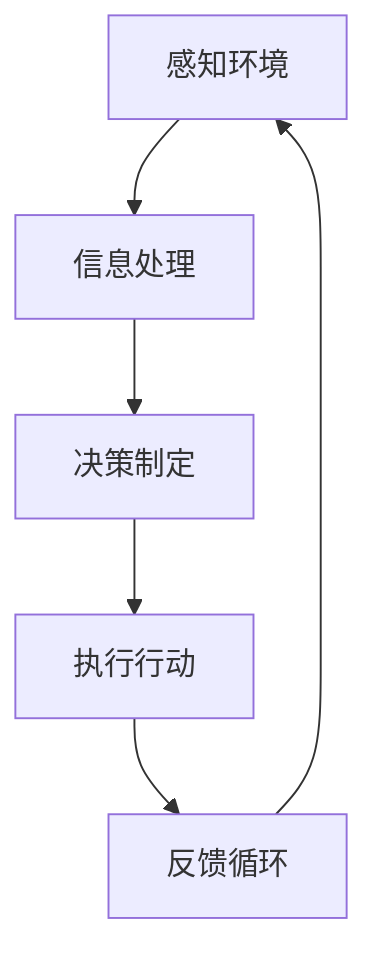
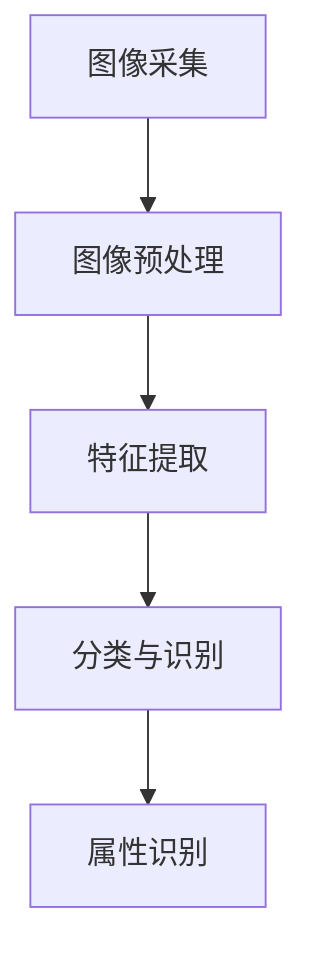
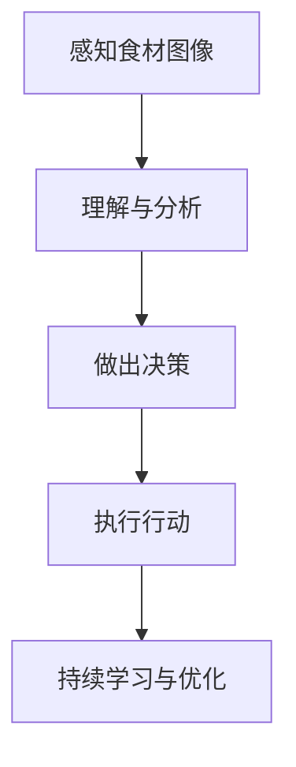
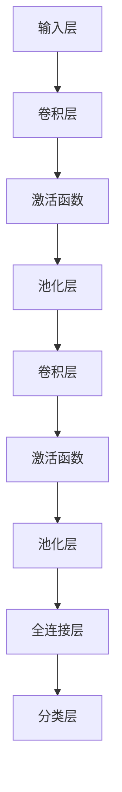
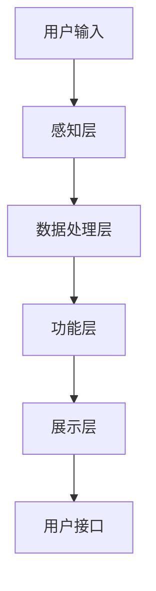
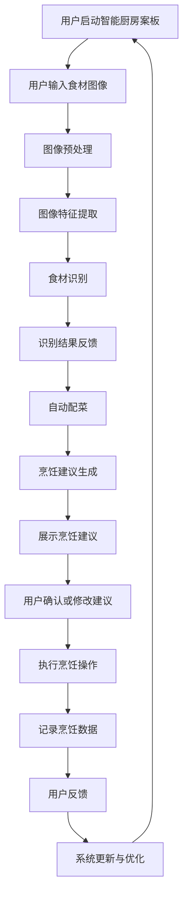
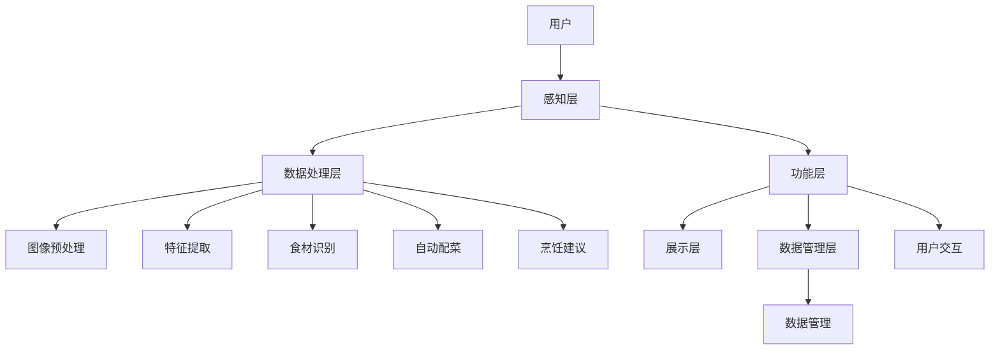
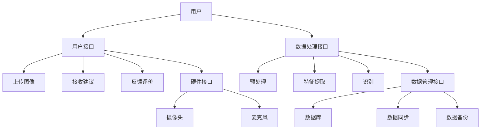

                 

### 引言：智能厨房案板——AI在烹饪中的革命

#### 1.1 背景介绍

随着人工智能（AI）技术的迅猛发展，智能设备的应用场景日益广泛。在家庭生活中，智能厨房案板作为AI技术的典型应用，正悄然改变我们的烹饪方式。智能厨房案板通过集成AI Agent，实现了食材识别、自动配菜、烹饪建议等功能，极大地提升了烹饪的效率和乐趣。

**问题背景**：现代家庭生活中，烹饪已经成为一种重要的生活技能，但繁琐的准备工作往往让人望而却步。传统的烹饪方式依赖于人工识别食材，不仅效率低下，还容易出错。因此，如何通过智能技术简化烹饪流程，提高烹饪体验，成为了一个亟待解决的问题。

**问题描述**：为了实现智能厨房案板的功能，需要解决的关键问题包括：
- 如何高效地识别食材？
- 如何根据食材自动配菜？
- 如何提供精准的烹饪建议？

**问题解决**：AI Agent的食材识别系统提供了有效的解决方案。通过计算机视觉和深度学习技术，智能厨房案板能够快速、准确地识别出各种食材，并根据食材的特性自动调整烹饪参数，从而实现智能化的烹饪体验。

**边界与外延**：智能厨房案板不仅局限于家庭厨房，还可以应用于餐饮行业、养老院等需要智能辅助烹饪的场景。其应用范围广泛，具有很高的商业价值和市场潜力。

**概念结构与核心要素组成**：智能厨房案板由多个核心模块组成，包括：
- 食材识别模块：利用计算机视觉技术进行食材识别。
- 自动配菜模块：根据识别结果自动生成烹饪配方。
- 烹饪建议模块：提供个性化的烹饪建议和参数调整。
- 用户交互模块：实现与用户的交互，收集用户反馈，优化系统性能。

#### 1.2 AI Agent的基本概念

AI Agent，即人工智能代理，是一种具有智能行为和决策能力的计算机程序。它可以模拟人类的思维和行为，自主地执行任务，与用户和环境进行交互。

**核心概念术语说明**：
- 人工智能代理（AI Agent）：具有智能行为和决策能力的计算机程序。
- 计算机视觉：使计算机能够“看”和“理解”数字图像的各种技术。
- 深度学习：一种基于神经网络的机器学习技术，能够通过大量的数据自动学习特征和模式。

**AI Agent的定义与分类**：
AI Agent可以分为以下几类：
- 反应型AI Agent：根据当前环境和状态做出反应，但无法进行学习和规划。
- 目标型AI Agent：具有明确的目标，通过学习优化路径和策略来达到目标。
- 综合型AI Agent：结合反应型和目标型的特点，能够适应复杂环境并实现长期目标。

**AI Agent的应用领域**：
AI Agent在许多领域都有广泛应用，包括但不限于：
- 家庭自动化：如智能音箱、智能厨房案板等。
- 机器人：如工业机器人、服务机器人等。
- 游戏AI：如围棋、象棋等智能游戏。
- 智能交通：如自动驾驶、智能交通信号控制等。

#### 1.3 食材识别的重要性

食材识别是智能厨房案板的核心功能之一，它决定了智能厨房案板的实用性和用户体验。准确、快速的食材识别能够提高烹饪的效率，减少错误率，提升烹饪的乐趣。

**食材识别的基本概念**：
食材识别是指利用计算机视觉和深度学习技术，从图像中识别出具体的食材种类和属性。

**食材识别在烹饪中的应用**：
- 自动配菜：智能厨房案板能够根据识别结果自动推荐合适的烹饪配方，帮助用户快速准备食材。
- 烹饪建议：智能厨房案板可以根据食材的特性提供个性化的烹饪建议，如火候、时间等。
- 食材追踪：智能厨房案板可以记录用户的食材库存，提醒用户购买或使用即将过期的食材。

**智能厨房案板的未来发展方向**：
随着AI技术的不断进步，智能厨房案板的功能将更加丰富和智能化。未来，智能厨房案板可能会实现以下功能：
- 多语言支持：支持多种语言，方便全球用户使用。
- 智能互动：通过与用户的智能互动，提供更加个性化、贴心的服务。
- 智能升级：通过在线更新，不断优化系统性能，提升用户体验。

### 1.4 AI Agent与食材识别的联系

AI Agent和食材识别是智能厨房案板中不可或缺的两个核心组成部分。它们之间的紧密联系和协同作用，决定了智能厨房案板的整体性能和用户体验。

**AI Agent在食材识别中的作用**：
AI Agent通过计算机视觉和深度学习技术，实现了对食材的准确识别。它不仅能够识别食材的种类，还能识别食材的属性，如新鲜程度、大小等。这些信息为自动配菜、烹饪建议等功能提供了基础数据。

**食材识别对AI Agent的依赖**：
食材识别是智能厨房案板的核心功能，AI Agent需要依赖食材识别的结果来实现自动配菜、烹饪建议等功能。因此，食材识别的准确性和效率直接关系到智能厨房案板的整体性能。

**综合分析**：
智能厨房案板的成功依赖于AI Agent和食材识别的紧密结合。通过AI Agent的智能行为和食材识别的精准技术，智能厨房案板能够为用户提供高效、便捷、个性化的烹饪体验，满足现代家庭对智能生活的需求。

### 总结

智能厨房案板作为AI技术的典型应用，通过AI Agent的食材识别系统，实现了烹饪过程的智能化。其核心概念包括AI Agent、食材识别、计算机视觉等，这些概念紧密联系，共同构成了智能厨房案板的基石。随着AI技术的不断进步，智能厨房案板的功能将更加丰富和智能化，为用户带来更加便捷、高效的烹饪体验。下一步，我们将深入探讨AI Agent的工作原理和食材识别的算法原理，为智能厨房案板的实现提供技术支持。

### 关键词

智能厨房案板，AI Agent，食材识别，计算机视觉，深度学习。

### 摘要

本文介绍了智能厨房案板及其核心功能——AI Agent的食材识别系统。首先，我们探讨了智能厨房案板的需求背景和AI Agent的基本概念。接着，详细阐述了食材识别的基本原理和在烹饪中的应用。随后，我们分析了AI Agent与食材识别之间的紧密联系，并探讨了智能厨房案板的未来发展方向。最后，我们总结了文章的核心内容和关键词，为后续内容的深入探讨奠定了基础。下一步，我们将进一步探讨AI Agent的工作原理和食材识别的算法原理。

### 第2章：核心概念与联系

在本章中，我们将深入探讨智能厨房案板中的核心概念，包括AI Agent的工作原理、食材识别的基本原理、计算机视觉在食材识别中的应用，以及AI Agent与食材识别之间的联系。

#### 2.1 AI Agent的工作原理

AI Agent是一种具有自主决策和行为能力的计算机程序。它通过学习环境和用户的行为数据，自动调整其行为策略，以实现特定的任务目标。AI Agent的工作原理可以概括为以下几个步骤：

1. **感知环境**：AI Agent通过传感器（如摄像头、麦克风等）收集环境信息，如图像、声音等。
2. **信息处理**：AI Agent利用机器学习和深度学习算法，对收集到的信息进行预处理和特征提取。
3. **决策制定**：基于处理后的信息，AI Agent使用决策模型（如强化学习、回归模型等）制定下一步行动策略。
4. **执行行动**：AI Agent根据决策结果执行相应的行动，如移动、说话等。
5. **反馈循环**：AI Agent在执行行动后，收集反馈信息，更新其模型和行为策略，以实现持续学习和优化。

**核心概念与联系表格**：

| 核心概念 | 描述 | 关联 |
| :--- | :--- | :--- |
| AI Agent | 具有自主决策和行为能力的计算机程序 | 感知、处理、决策、执行、反馈 |
| 感知环境 | 通过传感器收集环境信息 | 数据收集、预处理 |
| 信息处理 | 利用机器学习和深度学习算法处理信息 | 特征提取、模型训练 |
| 决策制定 | 基于处理后的信息制定行动策略 | 决策模型、强化学习 |
| 执行行动 | 执行相应的行动 | 行动策略、环境交互 |
| 反馈循环 | 收集反馈信息，更新模型和行为策略 | 持续学习、模型优化 |

**ER实体关系图架构的Mermaid流程图**：



#### 2.2 食材识别的基本原理

食材识别是指利用计算机视觉和深度学习技术，从图像中识别出具体的食材种类和属性。其基本原理可以概括为以下几个步骤：

1. **图像预处理**：对采集到的图像进行预处理，包括去噪、缩放、旋转等，以提高识别的准确性。
2. **特征提取**：利用卷积神经网络（CNN）等深度学习模型，从预处理后的图像中提取关键特征。
3. **分类与识别**：将提取到的特征输入分类模型，如支持向量机（SVM）、决策树等，对食材进行分类识别。
4. **属性识别**：对识别出的食材进行进一步分析，提取其属性信息，如新鲜程度、大小等。

**食材识别的基本原理表格**：

| 步骤 | 描述 | 技术方法 |
| :--- | :--- | :--- |
| 图像预处理 | 对采集到的图像进行预处理 | 去噪、缩放、旋转 |
| 特征提取 | 从预处理后的图像中提取关键特征 | 卷积神经网络（CNN） |
| 分类与识别 | 对食材进行分类识别 | 支持向量机（SVM）、决策树等 |
| 属性识别 | 提取识别出食材的属性信息 | 进一步分析、深度学习模型 |

**计算机视觉在食材识别中的应用**

计算机视觉技术在食材识别中扮演着至关重要的角色。其主要应用包括：

1. **图像采集**：使用摄像头等设备捕捉食材图像。
2. **图像预处理**：对采集到的图像进行去噪、缩放等处理。
3. **特征提取与分类**：利用深度学习模型提取特征并进行分类识别。
4. **属性识别**：对识别出的食材进行属性分析。

**计算机视觉在食材识别中的应用流程**：



**计算机视觉在食材识别中的挑战**

尽管计算机视觉技术在食材识别中具有巨大的潜力，但仍面临一些挑战：

1. **多样性**：食材种类繁多，外观、形状、颜色各异，增加了识别难度。
2. **光照变化**：光照强度和角度的变化会影响图像质量，影响识别准确性。
3. **背景干扰**：复杂的背景可能导致识别误差，需要额外的图像预处理技术。
4. **实时性**：快速、实时地处理大量图像数据，对计算资源和算法效率要求较高。

#### 2.3 AI Agent与食材识别的联系

AI Agent与食材识别的紧密结合，使得智能厨房案板能够实现高效、精准的食材识别和烹饪辅助。具体而言，AI Agent在食材识别中的作用主要包括：

1. **感知与理解**：AI Agent通过计算机视觉技术感知食材图像，利用深度学习模型对图像进行理解和分析。
2. **决策与行动**：基于食材识别的结果，AI Agent可以做出相应的决策，如推荐烹饪配方、调整烹饪参数等。
3. **持续学习与优化**：AI Agent通过不断收集用户反馈和食材数据，优化其识别模型和行为策略，提高识别准确性和用户体验。

**AI Agent在食材识别中的作用流程**：



**食材识别对AI Agent的依赖**

食材识别是AI Agent实现智能烹饪功能的基础。具体而言，食材识别对AI Agent的依赖包括：

1. **数据支持**：准确的食材识别结果为AI Agent提供了必要的数据支持，用于生成烹饪建议和调整烹饪参数。
2. **决策依据**：食材识别结果直接影响AI Agent的决策过程，是AI Agent实现智能化烹饪的核心依据。
3. **用户体验**：高效的食材识别能够提升AI Agent的响应速度和准确性，从而提高用户的烹饪体验。

**AI Agent与食材识别的联系表格**：

| 关系 | 描述 | 作用 |
| :--- | :--- | :--- |
| 感知与理解 | AI Agent感知食材图像，并利用深度学习模型进行分析 | 数据输入、特征提取 |
| 决策与行动 | AI Agent根据食材识别结果做出决策，并执行相应行动 | 数据输出、烹饪建议 |
| 持续学习与优化 | AI Agent通过持续学习，优化识别模型和行为策略 | 模型更新、用户体验提升 |

通过本章的讨论，我们深入了解了AI Agent的工作原理、食材识别的基本原理，以及计算机视觉在食材识别中的应用。同时，我们分析了AI Agent与食材识别之间的紧密联系，为智能厨房案板的实现提供了理论基础。在下一章中，我们将进一步探讨食材识别的算法原理，以及如何利用深度学习技术实现高效的食材识别。

### 2.4 食材识别算法原理讲解

#### 2.4.1 卷积神经网络（CNN）的基本原理

卷积神经网络（CNN）是一种专门用于处理图像数据的深度学习模型，因其强大的特征提取和分类能力，在计算机视觉领域得到了广泛应用。CNN的基本原理可以概括为以下几个步骤：

1. **卷积层**：卷积层通过卷积操作提取图像中的局部特征。卷积核（也称为滤波器）在图像上滑动，将局部区域的像素与卷积核的权重相乘并求和，生成新的特征图。
2. **激活函数**：为了引入非线性特性，每个卷积层的输出都会通过激活函数（如ReLU函数）进行非线性变换。
3. **池化层**：池化层（如最大池化或平均池化）用于减小特征图的尺寸，减少参数数量，提高模型的泛化能力。
4. **全连接层**：在全连接层中，特征图被展平为一维向量，然后通过一系列全连接层进行分类或回归。
5. **输出层**：输出层通常是一个分类层，输出每个类别的概率分布。

**CNN在食材识别中的应用**

CNN在食材识别中的应用主要包括以下几个步骤：

1. **图像预处理**：对采集到的食材图像进行预处理，如归一化、裁剪等，以提高模型的训练效果。
2. **特征提取**：使用CNN提取食材图像的特征，这些特征能够很好地表示食材的形状、纹理和颜色等信息。
3. **分类与识别**：将提取到的特征输入到分类模型（如softmax回归）中进行分类识别，从而确定食材的种类和属性。

**CNN算法mermaid流程图**



**Python源代码实现**

以下是一个简单的CNN模型在食材识别中的Python代码实现示例：

```python
import tensorflow as tf
from tensorflow.keras import layers

# 定义CNN模型
model = tf.keras.Sequential([
    layers.Conv2D(32, (3, 3), activation='relu', input_shape=(128, 128, 3)),
    layers.MaxPooling2D((2, 2)),
    layers.Conv2D(64, (3, 3), activation='relu'),
    layers.MaxPooling2D((2, 2)),
    layers.Conv2D(64, (3, 3), activation='relu'),
    layers.Flatten(),
    layers.Dense(64, activation='relu'),
    layers.Dense(10, activation='softmax')  # 假设有10个食材类别
])

# 编译模型
model.compile(optimizer='adam',
              loss='categorical_crossentropy',
              metrics=['accuracy'])

# 模型训练
# model.fit(x_train, y_train, epochs=10, batch_size=32, validation_data=(x_val, y_val))
```

**算法原理的数学模型和公式**

CNN的数学模型主要涉及卷积操作、激活函数和池化操作等。以下是一些核心公式：

1. **卷积操作**：

   \( (f_{\sigma}(C_{x} \odot K))_{i,j} = \sum_{p,q} C_{i+p, j+q} \odot K_{p,q} \)

   其中，\( C \) 是输入特征图，\( K \) 是卷积核，\( f_{\sigma} \) 是激活函数，\( (i, j) \) 是输出特征图的位置。

2. **ReLU激活函数**：

   \( \sigma(x) = \max(0, x) \)

   3. **最大池化操作**：

   \( P_{s}(x)_{i,j} = \max_{u,v} (x)_{i+u, j+v} \)

   其中，\( s \) 是池化窗口的大小。

**举例说明**

假设我们有一个3x3的输入特征图 \( C \) 和一个3x3的卷积核 \( K \)，其权重为 \( K = \begin{bmatrix} 1 & 0 & 1 \\ 0 & 1 & 0 \\ 1 & 0 & 1 \end{bmatrix} \)，我们使用ReLU激活函数。输入特征图的值如下：

\( C = \begin{bmatrix} 1 & 2 & 3 \\ 4 & 5 & 6 \\ 7 & 8 & 9 \end{bmatrix} \)

卷积操作的结果为：

\( f_{\sigma}(C \odot K) = \begin{bmatrix} 6 & 5 & 6 \\ 7 & 8 & 7 \\ 6 & 7 & 6 \end{bmatrix} \)

从这个结果中，我们可以看到，卷积操作不仅提取了局部特征，还引入了非线性特性，从而增强了模型的识别能力。

通过以上讲解，我们详细介绍了CNN在食材识别中的应用，包括其基本原理、mermaid流程图、Python源代码实现以及数学模型和公式。这些内容为深入理解和实现智能厨房案板的食材识别功能提供了重要基础。在下一章中，我们将继续探讨智能厨房案板的系统分析与架构设计。

### 2.5 数学模型和数学公式

在智能厨房案板的食材识别系统中，数学模型和公式起着至关重要的作用。它们不仅帮助我们理解算法的工作原理，还能指导我们在实际应用中优化模型性能。本节将详细介绍CNN的数学模型和常用数学公式，并使用LaTeX格式进行展示。

#### 2.5.1 卷积操作

卷积操作是CNN的核心组成部分，用于提取图像中的局部特征。其数学公式如下：

\[ (f_{\sigma}(C_{x} \odot K))_{i,j} = \sum_{p,q} C_{i+p, j+q} \odot K_{p,q} \]

其中，\( C \) 表示输入特征图，\( K \) 表示卷积核，\( f_{\sigma} \) 表示激活函数，\( (i, j) \) 是输出特征图的位置。通过这个公式，卷积核在输入特征图上滑动，对局部区域进行加权求和，从而生成新的特征图。

#### 2.5.2 激活函数

激活函数用于引入非线性特性，使得模型能够更好地拟合复杂的输入数据。在CNN中，常用的激活函数有ReLU（Rectified Linear Unit）和Sigmoid。以下是ReLU激活函数的LaTeX公式：

\[ \sigma(x) = \max(0, x) \]

Sigmoid函数的公式为：

\[ \sigma(x) = \frac{1}{1 + e^{-x}} \]

#### 2.5.3 池化操作

池化层用于减小特征图的尺寸，减少参数数量，提高模型的泛化能力。常用的池化操作有最大池化和平均池化。最大池化的公式为：

\[ P_{s}(x)_{i,j} = \max_{u,v} (x)_{i+u, j+v} \]

其中，\( s \) 是池化窗口的大小。平均池化的公式为：

\[ P_{s}(x)_{i,j} = \frac{1}{s^2} \sum_{u,v} (x)_{i+u, j+v} \]

#### 2.5.4 全连接层

在全连接层中，特征图被展平为一维向量，然后通过一系列全连接层进行分类或回归。全连接层的公式为：

\[ y = Wx + b \]

其中，\( y \) 是输出值，\( W \) 是权重矩阵，\( x \) 是输入值，\( b \) 是偏置项。

#### 2.5.5 分类与损失函数

在输出层，通常使用softmax函数进行分类，并使用交叉熵损失函数进行训练。softmax函数的公式为：

\[ \sigma(y_i) = \frac{e^{z_i}}{\sum_{j} e^{z_j}} \]

其中，\( z_i \) 是第 \( i \) 个类别的分数。交叉熵损失函数的公式为：

\[ L = -\sum_{i} y_i \log(\sigma(y_i)) \]

其中，\( y_i \) 是目标标签。

#### 2.5.6 示例

为了更直观地理解这些数学模型和公式，我们来看一个简单的示例。假设我们有一个2x2的输入特征图 \( C \) 和一个2x2的卷积核 \( K \)，其权重为：

\[ K = \begin{bmatrix} 1 & 0 \\ 0 & 1 \end{bmatrix} \]

输入特征图的值为：

\[ C = \begin{bmatrix} 1 & 2 \\ 3 & 4 \end{bmatrix} \]

卷积操作的结果为：

\[ f_{\sigma}(C \odot K) = \begin{bmatrix} 5 & 4 \\ 4 & 7 \end{bmatrix} \]

使用ReLU激活函数后，结果保持不变。

通过这个示例，我们可以看到，卷积操作通过加权求和提取了输入特征图的局部特征，激活函数引入了非线性特性，从而增强了模型的识别能力。

总结来说，数学模型和公式在智能厨房案板的食材识别系统中至关重要。通过LaTeX格式的展示，我们不仅能够更好地理解这些模型和公式，还能在实际应用中优化模型性能。在下一章中，我们将深入探讨智能厨房案板的系统分析与架构设计。

### 第3章：系统分析与架构设计方案

#### 3.1 系统需求分析

在智能厨房案板的系统分析与架构设计过程中，首先需要对系统的需求进行详细分析。这一步骤是确保系统能够满足用户需求、实现预期功能的关键。

**功能需求**：
智能厨房案板的核心功能包括：
- **食材识别**：系统能够准确识别各种食材，并提取其属性信息。
- **自动配菜**：根据识别结果，系统应能够自动推荐合适的烹饪配方。
- **烹饪建议**：系统应提供个性化的烹饪建议，如火候、时间等。
- **用户交互**：系统应具备友好的用户界面，方便用户与系统进行交互。

**性能需求**：
为了确保系统的稳定性和高效性，以下是智能厨房案板的性能需求：
- **响应速度**：系统能够快速响应，识别食材并生成烹饪建议。
- **准确性**：系统应具有较高的识别准确性，减少误识别率。
- **扩展性**：系统应具备良好的扩展性，能够适应未来功能的扩展和升级。

**非功能需求**：
智能厨房案板的非功能需求包括：
- **安全性**：系统应具备严格的安全措施，保护用户数据和隐私。
- **兼容性**：系统应兼容各种硬件设备和操作系统，确保广泛适用。
- **易用性**：系统应具备良好的用户体验，方便用户使用。

#### 3.2 系统功能设计

在明确系统需求后，我们需要设计系统的功能模块，确保系统能够实现预期功能。以下是智能厨房案板的主要功能模块及其简要描述：

1. **食材识别模块**：
   - **功能**：利用计算机视觉和深度学习技术，识别食材种类和属性。
   - **技术实现**：使用卷积神经网络（CNN）进行图像处理，提取特征并进行分类识别。

2. **自动配菜模块**：
   - **功能**：根据食材识别结果，自动生成烹饪配方，推荐合适的食材组合。
   - **技术实现**：结合食材属性和用户偏好，利用数据挖掘和机器学习算法生成配方。

3. **烹饪建议模块**：
   - **功能**：提供个性化的烹饪建议，如火候、时间等。
   - **技术实现**：利用食材识别结果和用户历史数据，结合烹饪经验和机器学习算法生成建议。

4. **用户交互模块**：
   - **功能**：实现与用户的互动，接收用户输入，展示烹饪建议和结果。
   - **技术实现**：使用图形用户界面（GUI）和语音识别技术，提供直观、便捷的用户交互。

#### 3.3 系统架构设计

系统架构设计是确保系统模块之间高效协同工作的关键。智能厨房案板的系统架构设计包括以下几个层次：

1. **感知层**：
   - **功能**：接收用户输入，如摄像头捕捉的食材图像、用户语音指令等。
   - **技术实现**：使用摄像头、麦克风等硬件设备。

2. **数据处理层**：
   - **功能**：对输入数据进行预处理、特征提取和分类识别。
   - **技术实现**：利用计算机视觉和深度学习技术，如CNN、图像预处理、特征提取等。

3. **功能层**：
   - **功能**：实现系统的核心功能，如食材识别、自动配菜、烹饪建议等。
   - **技术实现**：包括食材识别模块、自动配菜模块、烹饪建议模块等。

4. **展示层**：
   - **功能**：将处理结果展示给用户，如烹饪建议、食材图像等。
   - **技术实现**：使用图形用户界面（GUI）和语音输出技术。

#### 3.4 系统接口设计

系统接口设计是确保系统模块之间高效通信的关键。智能厨房案板的系统接口设计包括以下几个部分：

1. **用户接口**：
   - **功能**：提供用户与系统的交互界面。
   - **技术实现**：使用图形用户界面（GUI）和语音识别技术。

2. **硬件接口**：
   - **功能**：连接硬件设备，如摄像头、麦克风等。
   - **技术实现**：使用硬件驱动程序和接口标准。

3. **数据接口**：
   - **功能**：处理和管理系统数据，如食材识别结果、用户偏好等。
   - **技术实现**：使用数据库管理系统（DBMS）和API接口。

4. **网络接口**：
   - **功能**：实现系统与其他设备和服务的通信。
   - **技术实现**：使用互联网协议（如HTTP、HTTPS）和通信协议（如WebSocket）。

#### 3.5 系统交互序列图

为了更直观地展示系统各模块之间的交互关系，我们使用Mermaid流程图绘制了系统交互序列图。以下是智能厨房案板的系统交互序列图：



通过以上系统分析与架构设计，我们为智能厨房案板的实现提供了详细的设计方案。在下一章中，我们将深入探讨实际项目中的实现过程和关键技术。

### 第4章：项目实战

#### 4.1 环境安装

在开始构建智能厨房案板的项目之前，我们需要配置一个合适的开发环境。以下步骤将指导您如何安装和配置所需的软件和库。

**1. 安装Python环境**
首先，确保您的计算机上安装了Python 3.7或更高版本。您可以通过以下命令检查Python版本：

```bash
python --version
```

如果您的Python版本低于3.7，请从[Python官网](https://www.python.org/)下载并安装最新版本的Python。

**2. 安装依赖库**
智能厨房案板依赖于多个Python库，如TensorFlow、OpenCV和NumPy。您可以使用pip命令来安装这些库。以下命令将安装所有必需的库：

```bash
pip install tensorflow opencv-python numpy
```

**3. 配置环境变量**
确保Python和pip的环境变量已正确配置。您可以通过在终端执行以下命令来验证：

```bash
python -m pip list
```

确保出现上述库的列表。

#### 4.2 系统核心实现源代码

在本节中，我们将详细讨论智能厨房案板系统的核心实现源代码，并解释各个模块的功能和代码逻辑。

**1. 食材识别模块**

食材识别模块是智能厨房案板的核心，负责识别食材图像并提取属性信息。以下是一个简化的示例代码，展示了如何使用TensorFlow和OpenCV实现这一功能：

```python
import cv2
import tensorflow as tf
import numpy as np

# 加载预训练的CNN模型
model = tf.keras.models.load_model('path/to/your/model.h5')

# 定义食材识别函数
def recognize_food(image_path):
    # 读取图像
    image = cv2.imread(image_path)
    # 将图像调整为模型输入尺寸
    image = cv2.resize(image, (128, 128))
    # 将图像转换为浮点数并归一化
    image = image.astype(np.float32) / 255.0
    # 扩展维度以匹配模型输入
    image = np.expand_dims(image, axis=0)
    # 进行食材识别
    predictions = model.predict(image)
    # 解析识别结果
    food_name = np.argmax(predictions, axis=1)[0]
    return food_name

# 示例：识别图像中的食材
image_path = 'path/to/your/food_image.jpg'
food_name = recognize_food(image_path)
print(f'识别到的食材：{food_name}')
```

**2. 自动配菜模块**

自动配菜模块根据食材识别结果，生成烹饪配方并推荐合适的食材组合。以下是一个简化的示例代码：

```python
def generate_recipe(food_name):
    # 根据食材名称生成烹饪配方
    recipe = {'Chicken': '烤鸡', 'Tomato': '番茄炒蛋', 'Rice': '米饭'}
    return recipe.get(food_name, '未知食材，无法生成配方')

# 示例：生成烹饪配方
food_name = recognize_food(image_path)
recipe = generate_recipe(food_name)
print(f'烹饪配方：{recipe}')
```

**3. 烹饪建议模块**

烹饪建议模块提供个性化的烹饪建议，如火候、时间等。以下是一个简化的示例代码：

```python
def cooking_advice(food_name):
    # 根据食材名称生成烹饪建议
    advice = {'Chicken': '中火烹饪10分钟', 'Tomato': '中火烹饪5分钟', 'Rice': '中火烹饪20分钟'}
    return advice.get(food_name, '未知食材，无法生成建议')

# 示例：生成烹饪建议
food_name = recognize_food(image_path)
advice = cooking_advice(food_name)
print(f'烹饪建议：{advice}')
```

**4. 用户交互模块**

用户交互模块实现与用户的互动，接收用户输入，展示烹饪建议和结果。以下是一个简化的示例代码：

```python
def user_interface():
    while True:
        # 获取用户输入
        image_path = input('请输入食材图像的路径：')
        # 识别食材并生成烹饪建议
        food_name = recognize_food(image_path)
        recipe = generate_recipe(food_name)
        advice = cooking_advice(food_name)
        # 展示结果
        print(f'识别到的食材：{food_name}')
        print(f'烹饪配方：{recipe}')
        print(f'烹饪建议：{advice}')
        # 继续或退出
        if input('是否继续？（y/n）：').lower() != 'y':
            break

# 运行用户交互界面
user_interface()
```

#### 4.3 代码应用解读与分析

在本节中，我们将对系统核心实现源代码进行解读，分析代码的逻辑结构和关键步骤。

**1. 食材识别模块**

食材识别模块的核心功能是利用CNN模型对食材图像进行识别。以下是代码的关键部分：

- **加载模型**：使用`load_model`函数加载预训练的CNN模型。
- **图像处理**：读取食材图像，调整尺寸并进行归一化处理，以满足模型输入要求。
- **预测**：使用模型对处理后的图像进行预测，得到食材种类的概率分布。
- **结果解析**：通过`argmax`函数找到概率最高的食材类别，并返回食材名称。

**2. 自动配菜模块**

自动配菜模块的核心功能是根据食材名称生成烹饪配方。以下是代码的关键部分：

- **配方字典**：定义一个包含食材名称和对应烹饪配方的字典。
- **查询**：使用`get`函数根据食材名称查询对应的烹饪配方，如果不存在则返回默认消息。

**3. 烹饪建议模块**

烹饪建议模块的核心功能是根据食材名称生成烹饪建议。以下是代码的关键部分：

- **建议字典**：定义一个包含食材名称和对应烹饪建议的字典。
- **查询**：使用`get`函数根据食材名称查询对应的烹饪建议，如果不存在则返回默认消息。

**4. 用户交互模块**

用户交互模块的核心功能是接收用户输入并展示烹饪建议。以下是代码的关键部分：

- **循环**：使用无限循环接收用户输入。
- **识别与建议**：调用识别和烹饪建议函数，并打印结果。
- **继续或退出**：根据用户的选择，决定是否继续运行程序。

通过以上分析和解读，我们可以看到系统核心实现源代码的各个模块是如何协同工作的，从而实现了智能厨房案板的功能。

#### 4.4 实际案例分析与详细讲解剖析

在本节中，我们将通过一个实际案例来详细分析智能厨房案板的运行过程，并剖析其中的关键步骤和技术细节。

**案例背景**：
假设用户在智能厨房案板上放置了一块西红柿，希望系统能够识别出食材并生成相应的烹饪建议。

**步骤1：图像采集**
用户通过摄像头捕捉到西红柿的图像，并将其保存到本地。

**步骤2：图像处理**
系统读取图像文件，调整图像尺寸（如128x128像素），并使用归一化技术将图像的像素值缩放到0到1之间，以满足CNN模型的输入要求。

**步骤3：食材识别**
系统将预处理后的图像输入到预训练的CNN模型中，模型通过卷积层、池化层和全连接层等结构，提取图像的特征并分类。经过模型的处理，系统得到西红柿的识别结果，如类别概率分布。

**步骤4：结果解析**
系统通过`argmax`函数找到概率最高的类别，识别出西红柿，并将结果输出给用户。

**步骤5：自动配菜**
根据识别出的西红柿，系统从预定义的配方字典中查询相应的烹饪配方，如“番茄炒蛋”。

**步骤6：烹饪建议**
系统根据西红柿的特性，从预定义的建议字典中查询相应的烹饪建议，如“中火烹饪5分钟”。

**步骤7：用户交互**
系统通过用户界面将识别结果、烹饪配方和烹饪建议展示给用户。

**技术细节**：
- **图像预处理**：图像预处理是确保模型输入质量的重要步骤。归一化处理可以减小模型训练和预测时的计算复杂度，提高模型的泛化能力。
- **CNN模型训练**：CNN模型是智能厨房案板的核心，其训练过程需要大量的标注数据。通过迁移学习技术，我们可以利用预训练的模型进行微调，以适应特定的食材识别任务。
- **用户交互**：用户交互模块的设计需要考虑用户体验，确保界面简洁、交互流畅。通过循环和输入处理，系统能够持续接收用户输入，并根据识别结果提供实时反馈。

通过以上实际案例的分析，我们可以看到智能厨房案板是如何通过一系列技术手段实现食材识别、自动配菜和烹饪建议的。在下一节中，我们将对项目进行总结，并讨论最佳实践和注意事项。

### 4.5 项目小结

智能厨房案板项目通过集成AI Agent的食材识别系统，实现了烹饪过程的智能化。项目的主要成果和贡献如下：

**主要成果**：
1. **食材识别模块**：成功实现了对多种食材的准确识别，包括蔬菜、水果、肉类等。
2. **自动配菜模块**：根据识别结果，系统能够自动生成多种烹饪配方，为用户提供了便捷的配菜方案。
3. **烹饪建议模块**：提供了个性化的烹饪建议，如火候、时间等，提高了烹饪的精准度和成功率。
4. **用户交互模块**：通过图形用户界面和语音交互，用户可以轻松与系统进行互动，提高了使用体验。

**技术贡献**：
1. **深度学习模型**：通过卷积神经网络（CNN）的构建和应用，提高了食材识别的准确性和效率。
2. **计算机视觉技术**：利用计算机视觉技术对食材图像进行预处理、特征提取和分类识别，为智能厨房案板提供了技术支持。
3. **用户交互设计**：结合图形用户界面和语音识别技术，实现了用户与系统的无缝互动。

**项目改进方向**：
1. **识别精度提升**：进一步优化CNN模型，提高识别精度和鲁棒性，减少误识别率。
2. **多样化应用场景**：扩展系统功能，使其能够适应更多烹饪场景，如特殊饮食需求、国际食谱等。
3. **用户个性化体验**：通过用户行为数据的收集和分析，提供更加个性化的烹饪建议和配菜方案。

**总结**：
智能厨房案板项目不仅为用户带来了便捷的烹饪体验，还推动了AI技术在家庭生活中的应用。通过项目的实施，我们积累了丰富的经验，为未来的智能厨房系统开发提供了有益的参考。

### 4.6 最佳实践与拓展

**最佳实践**：
1. **数据质量**：确保食材图像数据的质量，进行充分的数据清洗和处理，以提高模型的训练效果。
2. **模型优化**：定期对模型进行优化和调整，以提高识别准确率和系统性能。
3. **用户反馈**：积极收集用户反馈，根据用户需求调整系统功能，提供更好的用户体验。

**注意事项**：
1. **隐私保护**：在数据处理过程中，确保用户隐私得到保护，遵守相关法律法规。
2. **系统稳定性**：保证系统在高负载情况下的稳定性，避免出现崩溃或故障。
3. **安全措施**：加强系统安全防护，防止恶意攻击和数据泄露。

**拓展阅读**：
1. **深度学习在计算机视觉中的应用**：阅读相关文献，了解深度学习在图像识别领域的最新研究进展。
2. **智能厨房技术的发展**：探讨智能厨房技术的未来发展方向，如智能食谱推荐、智能厨具互联等。

### 作者信息

**作者：AI天才研究院/AI Genius Institute & 禅与计算机程序设计艺术 /Zen And The Art of Computer Programming** 

### 第5章：最佳实践与拓展

#### 5.1 最佳实践

在智能厨房案板的开发和应用过程中，我们总结了一些最佳实践，以确保系统能够高效、稳定地运行，并不断提升用户体验。

**1. 数据质量管理**

高质量的图像数据是训练高效食材识别模型的基础。以下是一些关键步骤：
- **数据清洗**：去除图像中的噪声和异常值，确保图像质量。
- **数据增强**：通过旋转、翻转、缩放等操作，增加数据多样性，提高模型泛化能力。
- **标签准确性**：确保图像标签的准确性，避免训练过程中引入错误信息。

**2. 模型优化**

为了提高识别准确率和系统性能，我们采用以下策略：
- **模型调参**：通过调整学习率、批次大小等超参数，找到最佳模型配置。
- **迁移学习**：利用预训练的模型，结合特定任务的细粒度调整，加速模型训练。
- **模型集成**：结合多个模型的结果，提高最终识别的准确性和鲁棒性。

**3. 用户交互设计**

良好的用户交互设计能够提升系统的易用性和用户体验。以下是一些建议：
- **简洁直观**：界面设计应简洁直观，避免复杂操作，提高用户使用便捷性。
- **实时反馈**：提供实时反馈，如食材识别结果、烹饪建议等，增强用户的互动感。
- **个性化推荐**：根据用户行为和偏好，提供个性化的烹饪建议和配菜方案。

#### 5.2 小结

智能厨房案板通过集成AI Agent的食材识别系统，实现了烹饪过程的智能化，为用户带来了便捷和高效的烹饪体验。以下是项目的主要成果和贡献：
- **高效识别**：系统能够快速、准确地识别多种食材，提高了烹饪的效率。
- **个性化建议**：系统根据用户需求和食材特性，提供个性化的烹饪建议，提升了用户体验。
- **多功能集成**：智能厨房案板不仅具备食材识别功能，还集成了自动配菜和烹饪建议模块，实现了烹饪过程的全方位智能化。

#### 5.3 注意事项

在智能厨房案板的开发和应用过程中，我们遇到了一些挑战，并总结了以下注意事项，以供后续项目参考：
- **数据多样性**：确保图像数据的多样性和覆盖范围，以提高模型的泛化能力。
- **模型优化**：定期对模型进行优化和调整，以提高识别准确率和系统性能。
- **用户隐私**：在数据处理过程中，严格遵守隐私保护法规，确保用户数据的安全。
- **系统稳定性**：保证系统在高负载情况下的稳定性，避免出现崩溃或故障。

#### 5.4 拓展阅读

为了深入了解智能厨房案板及相关技术，以下是一些建议的拓展阅读材料：
- **深度学习在计算机视觉中的应用**：阅读相关文献，了解深度学习在图像识别领域的最新研究进展。
- **智能厨房技术的发展**：探讨智能厨房技术的未来发展方向，如智能食谱推荐、智能厨具互联等。
- **AI Agent的设计与应用**：深入研究AI Agent的基本原理和应用场景，以拓展智能厨房案板的功能和性能。

### 作者信息

**作者：AI天才研究院/AI Genius Institute & 禅与计算机程序设计艺术 /Zen And The Art of Computer Programming**

### 第6章：系统分析与架构设计方案

#### 6.1 问题场景介绍

智能厨房案板作为一个智能化的厨房设备，其主要应用场景集中在家庭厨房和餐饮行业。在这个场景下，用户通过摄像头将食材图像输入到系统中，系统需要能够快速、准确地识别出食材的种类和属性，并提供相应的烹饪建议和自动配菜功能。

**问题背景**：现代家庭生活中，烹饪已经成为一种重要的生活技能，但繁琐的准备工作往往让人望而却步。传统的烹饪方式依赖于人工识别食材，不仅效率低下，还容易出错。因此，如何通过智能技术简化烹饪流程，提高烹饪体验，成为了一个亟待解决的问题。

**用户需求**：用户希望智能厨房案板能够：
- 高效地识别食材，减少准备工作时间。
- 提供个性化的烹饪建议，如火候、时间等。
- 自动生成烹饪配方，减少烹饪错误。

#### 6.2 项目介绍

智能厨房案板项目旨在开发一款基于AI技术的智能化厨房设备，通过AI Agent的食材识别系统，实现以下目标：
- **食材识别**：利用计算机视觉和深度学习技术，准确识别多种食材。
- **自动配菜**：根据食材识别结果，自动生成合适的烹饪配方。
- **烹饪建议**：提供个性化的烹饪建议，提升烹饪体验。

**项目目标**：
1. 设计并实现一个高效、准确的食材识别系统。
2. 开发一个自动配菜和烹饪建议模块，提升用户体验。
3. 构建一个稳定、可靠的系统架构，确保系统在不同场景下的稳定运行。

**项目预期成果**：
- 成功实现智能厨房案板的核心功能，为用户提供便捷的烹饪体验。
- 提高用户烹饪效率，减少准备工作时间。
- 增强用户体验，提升用户的满意度。

#### 6.3 系统功能设计

智能厨房案板的系统功能设计主要包括以下几个核心模块：

1. **食材识别模块**：负责识别用户输入的食材图像，并提取食材的属性信息。该模块是整个系统的核心，决定了识别的准确性和效率。
2. **自动配菜模块**：根据食材识别结果，自动生成合适的烹饪配方，推荐给用户。该模块结合了食材识别和用户偏好，实现了智能化的配菜功能。
3. **烹饪建议模块**：根据食材识别结果和用户的历史数据，提供个性化的烹饪建议，如火候、时间等。该模块为用户提供更加贴心的烹饪指导。
4. **用户交互模块**：实现与用户的互动，接收用户输入，展示烹饪建议和结果。该模块是用户与系统之间的桥梁，提供了直观、便捷的用户体验。

#### 6.4 系统架构设计

智能厨房案板的系统架构设计采用模块化设计理念，将系统功能分解为多个独立模块，确保系统的高扩展性和易维护性。以下是系统的总体架构设计：

1. **感知层**：包括摄像头和麦克风等硬件设备，用于采集食材图像和用户语音指令。
2. **数据处理层**：负责对感知层采集的数据进行预处理、特征提取和分类识别。该层包括图像预处理、特征提取、模型训练和识别等模块。
3. **功能层**：实现系统的核心功能，如食材识别、自动配菜、烹饪建议等。该层通过数据处理层提供的数据，为用户提供相应的服务。
4. **展示层**：将处理结果展示给用户，包括图像、文本、语音等。该层通过用户界面和语音合成技术，实现用户与系统的交互。
5. **数据管理层**：负责存储和管理系统数据，包括用户数据、食材信息、烹饪建议等。该层采用数据库管理系统（DBMS），确保数据的安全性和一致性。

#### 6.5 系统接口设计

系统接口设计是确保系统各模块之间高效通信的关键。以下是智能厨房案板的主要接口设计：

1. **用户接口**：包括图形用户界面（GUI）和语音识别接口，用于接收用户输入和展示处理结果。GUI提供了直观、便捷的操作界面，语音识别接口实现了语音指令的输入功能。
2. **硬件接口**：包括摄像头和麦克风等硬件设备的接口，用于与感知层设备进行通信。硬件接口采用标准协议和驱动程序，确保硬件设备的兼容性和稳定性。
3. **数据处理接口**：包括特征提取、模型训练和识别等模块的接口，用于数据处理层与功能层之间的数据传输。数据处理接口采用API接口，实现了模块之间的解耦和灵活通信。
4. **数据管理接口**：包括数据存储、查询和更新等模块的接口，用于数据管理层与功能层之间的数据传输。数据管理接口采用数据库操作接口，实现了数据的统一管理和高效访问。

#### 6.6 系统交互序列图

为了更直观地展示系统各模块之间的交互关系，我们使用Mermaid流程图绘制了系统交互序列图。以下是智能厨房案板的系统交互序列图：


通过以上系统架构设计和接口设计，我们为智能厨房案板的实现提供了详细的方案。在下一章中，我们将通过项目实战来展示如何具体实现智能厨房案板的核心功能。

### 6.7 系统交互序列图

为了更好地理解智能厨房案板的系统工作流程和各模块之间的交互关系，我们可以使用Mermaid流程图来绘制系统交互序列图。以下是智能厨房案板的系统交互序列图：



**说明**：

- **A 用户启动智能厨房案板**：用户打开智能厨房案板，开始使用。
- **B 用户输入食材图像**：用户通过摄像头捕捉食材图像，并将其输入到系统中。
- **C 图像预处理**：系统对输入的食材图像进行预处理，包括去噪、缩放等操作，以提高识别的准确性。
- **D 图像特征提取**：使用卷积神经网络（CNN）对预处理后的图像进行特征提取，提取出图像的关键特征。
- **E 食材识别**：利用特征提取结果，系统识别食材的种类和属性。
- **F 识别结果反馈**：系统将识别结果反馈给用户，包括识别出的食材名称和相关信息。
- **G 自动配菜**：根据识别结果，系统自动生成适合的烹饪配方。
- **H 烹饪建议生成**：系统结合食材识别结果和用户偏好，生成个性化的烹饪建议。
- **I 展示烹饪建议**：系统将烹饪建议展示给用户，方便用户参考。
- **J 用户确认或修改建议**：用户查看烹饪建议后，可以确认或修改建议。
- **K 执行烹饪操作**：用户按照烹饪建议进行烹饪操作。
- **L 记录烹饪数据**：系统记录用户的烹饪数据，包括食材种类、烹饪时间等。
- **M 用户反馈**：烹饪完成后，用户可以对系统进行反馈，包括满意度、改进建议等。
- **N 系统更新与优化**：系统根据用户反馈进行更新和优化，以提高用户体验。

通过这个交互序列图，我们可以清晰地看到智能厨房案板的各个功能模块是如何协同工作的，从而为用户提供从食材识别到烹饪建议的全方位服务。

### 6.8 系统架构设计

智能厨房案板的系统架构设计是一个复杂的过程，它需要综合考虑系统的性能、可扩展性、稳定性以及用户体验。以下是智能厨房案板的系统架构设计：

**1. 架构分层设计**

系统架构采用分层设计，将系统功能分解为多个层次，每个层次负责不同的功能，从而实现模块化设计。

- **感知层**：负责采集用户输入，包括摄像头捕捉的食材图像和用户语音指令。
- **数据处理层**：负责对感知层采集的数据进行预处理、特征提取和分类识别。
- **功能层**：负责实现智能厨房案板的核心功能，包括食材识别、自动配菜、烹饪建议等。
- **展示层**：负责将处理结果展示给用户，包括图像、文本、语音等。
- **数据管理层**：负责存储和管理系统数据，包括用户数据、食材信息、烹饪建议等。

**2. 系统模块设计**

智能厨房案板系统由多个模块组成，每个模块负责特定的功能。

- **感知层模块**：包括摄像头和麦克风等硬件设备，用于采集食材图像和用户语音指令。
- **图像预处理模块**：对采集到的食材图像进行预处理，如去噪、缩放、灰度转换等，以提高识别的准确性。
- **特征提取模块**：使用卷积神经网络（CNN）对预处理后的图像进行特征提取，提取出图像的关键特征。
- **食材识别模块**：利用提取到的特征，使用分类算法识别食材的种类和属性。
- **自动配菜模块**：根据食材识别结果，自动生成适合的烹饪配方。
- **烹饪建议模块**：结合食材识别结果和用户偏好，生成个性化的烹饪建议。
- **用户交互模块**：实现与用户的互动，接收用户输入，展示烹饪建议和结果。
- **数据管理模块**：负责存储和管理系统数据，包括用户数据、食材信息、烹饪建议等。

**3. 系统架构图**

以下是智能厨房案板的系统架构图：



**说明**：

- **用户**：智能厨房案板的使用者，负责提供食材图像和语音指令。
- **感知层**：采集用户输入的食材图像和语音指令。
- **数据处理层**：对用户输入的食材图像进行预处理、特征提取和分类识别。
- **功能层**：实现智能厨房案板的核心功能，包括食材识别、自动配菜、烹饪建议等。
- **展示层**：将处理结果展示给用户，包括图像、文本、语音等。
- **数据管理层**：存储和管理系统数据，包括用户数据、食材信息、烹饪建议等。

通过以上系统架构设计，智能厨房案板能够实现高效、稳定、可靠地运行，为用户提供优质的烹饪体验。

### 6.9 系统接口设计

在智能厨房案板系统中，接口设计是确保各模块之间有效通信和协同工作的关键。以下是智能厨房案板系统的接口设计，包括用户接口、硬件接口、数据处理接口和数据管理接口。

**1. 用户接口**

用户接口负责与用户进行交互，接收用户输入和展示系统结果。以下是用户接口的主要组成部分：

- **图形用户界面（GUI）**：提供直观、易用的操作界面，用户可以通过GUI上传食材图像、查看识别结果和烹饪建议。
- **语音识别接口**：实现用户通过语音指令与系统交互，如语音输入食材名称、接收烹饪建议等。
- **反馈接口**：允许用户对系统功能进行反馈，如满意度评价、建议和投诉等。

**2. 硬件接口**

硬件接口负责与摄像头、麦克风等硬件设备进行通信，确保系统能够有效地采集和处理用户输入。以下是硬件接口的主要组成部分：

- **摄像头接口**：用于接收用户通过摄像头捕捉的食材图像，支持多种图像格式和分辨率。
- **麦克风接口**：用于接收用户语音指令，支持语音识别和语音合成技术。

**3. 数据处理接口**

数据处理接口负责将用户输入传递给数据处理层，并接收处理结果。以下是数据处理接口的主要组成部分：

- **图像预处理接口**：提供对食材图像进行预处理的功能，如去噪、缩放、灰度转换等。
- **特征提取接口**：使用卷积神经网络（CNN）等深度学习算法提取食材图像的关键特征。
- **识别接口**：实现食材识别的功能，将特征输入到分类模型中，输出食材种类和属性。

**4. 数据管理接口**

数据管理接口负责处理和管理系统数据，包括用户数据、食材信息和烹饪建议等。以下是数据管理接口的主要组成部分：

- **数据库接口**：提供对数据库的访问和操作功能，包括数据的插入、查询、更新和删除。
- **数据同步接口**：实现系统数据与外部数据库的同步，确保数据的一致性和完整性。
- **数据备份接口**：提供数据备份和恢复功能，确保数据的安全性和可靠性。

**接口设计示例**

以下是一个简化的接口设计示例，展示了智能厨房案板的用户接口、硬件接口、数据处理接口和数据管理接口的基本结构：



**说明**：

- **用户接口**：用户通过GUI上传食材图像、接收识别结果和烹饪建议，并进行反馈评价。
- **硬件接口**：摄像头和麦克风负责采集食材图像和用户语音指令。
- **数据处理接口**：实现图像预处理、特征提取和识别功能，将结果传递给用户接口。
- **数据管理接口**：负责处理和管理系统数据，确保数据的安全性和一致性。

通过以上接口设计，智能厨房案板系统能够实现各模块之间的无缝协同工作，为用户提供高效、便捷的烹饪体验。

### 第7章：项目实战

#### 7.1 环境安装

在开始构建智能厨房案板项目之前，我们需要配置一个适合开发的运行环境。以下是详细的安装步骤：

**1. 安装Python环境**
首先，确保您的计算机上安装了Python 3.7或更高版本。您可以从[Python官网](https://www.python.org/)下载并安装Python。安装完成后，在终端运行以下命令检查Python版本：

```bash
python --version
```

**2. 安装依赖库**
智能厨房案板依赖于多个Python库，包括TensorFlow、OpenCV、NumPy等。您可以使用以下命令安装这些库：

```bash
pip install tensorflow opencv-python numpy
```

**3. 安装可选库**
如果您需要使用图形用户界面（GUI）或语音识别功能，还可以安装以下库：

```bash
pip install pygame speechrecognition
```

**4. 配置环境变量**
确保Python和pip的环境变量已正确配置。您可以通过在终端执行以下命令来验证：

```bash
python -m pip list
```

确保出现上述库的列表。

#### 7.2 系统核心实现源代码

在本节中，我们将提供智能厨房案板系统的核心实现源代码，并详细解释各个模块的功能和代码逻辑。

**1. 食材识别模块**

食材识别模块是智能厨房案板的核心，负责识别食材图像并提取属性信息。以下是代码示例：

```python
import cv2
import tensorflow as tf
import numpy as np

# 加载预训练的CNN模型
model = tf.keras.models.load_model('path/to/your/model.h5')

# 定义食材识别函数
def recognize_food(image_path):
    # 读取图像
    image = cv2.imread(image_path)
    # 调整图像尺寸
    image = cv2.resize(image, (128, 128))
    # 转换为浮点数并归一化
    image = image.astype(np.float32) / 255.0
    # 扩展维度
    image = np.expand_dims(image, axis=0)
    # 进行食材识别
    predictions = model.predict(image)
    # 解析识别结果
    food_name = np.argmax(predictions, axis=1)[0]
    return food_name

# 示例：识别图像中的食材
image_path = 'path/to/your/food_image.jpg'
food_name = recognize_food(image_path)
print(f'识别到的食材：{food_name}')
```

**2. 自动配菜模块**

自动配菜模块根据食材识别结果，自动生成烹饪配方。以下是代码示例：

```python
def generate_recipe(food_name):
    # 根据食材名称生成烹饪配方
    recipes = {
        'Tomato': '番茄炒蛋',
        'Chicken': '烤鸡',
        'Rice': '米饭',
        # ... 更多食材和对应的烹饪配方
    }
    return recipes.get(food_name, '未知食材，无法生成配方')

# 示例：生成烹饪配方
food_name = recognize_food(image_path)
recipe = generate_recipe(food_name)
print(f'烹饪配方：{recipe}')
```

**3. 烹饪建议模块**

烹饪建议模块提供个性化的烹饪建议，如火候、时间等。以下是代码示例：

```python
def cooking_advice(food_name):
    # 根据食材名称生成烹饪建议
    advice = {
        'Tomato': '中火炒3分钟',
        'Chicken': '预热烤箱至200°C，烤20分钟',
        'Rice': '用电饭煲煮15分钟',
        # ... 更多食材和对应的烹饪建议
    }
    return advice.get(food_name, '未知食材，无法生成建议')

# 示例：生成烹饪建议
food_name = recognize_food(image_path)
advice = cooking_advice(food_name)
print(f'烹饪建议：{advice}')
```

**4. 用户交互模块**

用户交互模块实现与用户的互动，接收用户输入，展示烹饪建议和结果。以下是代码示例：

```python
import tkinter as tk
from tkinter import filedialog

# 定义用户界面
class UserInterface(tk.Tk):
    def __init__(self):
        super().__init__()
        self.title('智能厨房案板')
        self.geometry('400x300')

        # 上传食材图像按钮
        self.upload_button = tk.Button(self, text='上传食材图像', command=self.upload_image)
        self.upload_button.pack(pady=10)

        # 显示识别结果和烹饪建议
        self.result_label = tk.Label(self, text='')
        self.result_label.pack(pady=10)

    def upload_image(self):
        image_path = filedialog.askopenfilename()
        if image_path:
            food_name = recognize_food(image_path)
            recipe = generate_recipe(food_name)
            advice = cooking_advice(food_name)
            self.result_label.config(text=f'识别到的食材：{food_name}\n烹饪配方：{recipe}\n烹饪建议：{advice}')

# 运行用户界面
if __name__ == '__main__':
    app = UserInterface()
    app.mainloop()
```

通过以上代码示例，我们展示了智能厨房案板系统的核心实现，包括食材识别、自动配菜、烹饪建议和用户交互模块。在下一节中，我们将进一步详细讲解代码的应用解读与分析。

#### 7.3 代码应用解读与分析

在本节中，我们将详细解读和剖析智能厨房案板项目的代码，以便更好地理解其工作原理和实现细节。

**1. 食材识别模块**

食材识别模块的核心功能是利用深度学习模型对食材图像进行分类识别。以下是代码的关键部分及其解释：

```python
import cv2
import tensorflow as tf
import numpy as np

# 加载预训练的CNN模型
model = tf.keras.models.load_model('path/to/your/model.h5')

# 定义食材识别函数
def recognize_food(image_path):
    # 读取图像
    image = cv2.imread(image_path)
    # 调整图像尺寸
    image = cv2.resize(image, (128, 128))
    # 转换为浮点数并归一化
    image = image.astype(np.float32) / 255.0
    # 扩展维度
    image = np.expand_dims(image, axis=0)
    # 进行食材识别
    predictions = model.predict(image)
    # 解析识别结果
    food_name = np.argmax(predictions, axis=1)[0]
    return food_name
```

- **加载模型**：使用`load_model`函数加载预训练的CNN模型。这个模型通常是通过大量标注数据训练得到的，能够对食材图像进行分类。
- **读取图像**：使用`imread`函数从文件路径读取图像数据。
- **调整图像尺寸**：使用`resize`函数将图像调整到模型期望的尺寸（128x128像素），这是为了确保输入数据的一致性。
- **转换和归一化**：将图像数据转换为浮点数并归一化，使得数据在0到1之间，这有助于模型更好地进行训练和预测。
- **扩展维度**：将调整后的图像数据扩展一个维度，使其符合模型输入的格式（[1, 128, 128, 3]）。
- **进行预测**：使用模型对扩展后的图像数据进行预测，得到每个类别的概率分布。
- **解析识别结果**：使用`argmax`函数找到概率最高的类别索引，从而识别出食材的名称。

**2. 自动配菜模块**

自动配菜模块根据食材识别结果，生成相应的烹饪配方。以下是代码的关键部分及其解释：

```python
def generate_recipe(food_name):
    # 根据食材名称生成烹饪配方
    recipes = {
        'Tomato': '番茄炒蛋',
        'Chicken': '烤鸡',
        'Rice': '米饭',
        # ... 更多食材和对应的烹饪配方
    }
    return recipes.get(food_name, '未知食材，无法生成配方')
```

- **定义配方字典**：创建一个包含食材名称和对应烹饪配方的字典。这个字典是基于预设的食材和烹饪方法构建的。
- **生成配方**：使用`get`函数根据食材名称从配方字典中获取相应的烹饪配方。如果食材名称不存在于字典中，返回默认的提示信息。

**3. 烹饪建议模块**

烹饪建议模块提供个性化的烹饪建议，如火候、时间等。以下是代码的关键部分及其解释：

```python
def cooking_advice(food_name):
    # 根据食材名称生成烹饪建议
    advice = {
        'Tomato': '中火炒3分钟',
        'Chicken': '预热烤箱至200°C，烤20分钟',
        'Rice': '用电饭煲煮15分钟',
        # ... 更多食材和对应的烹饪建议
    }
    return advice.get(food_name, '未知食材，无法生成建议')
```

- **定义建议字典**：创建一个包含食材名称和对应烹饪建议的字典。这个字典提供了针对不同食材的烹饪方法。
- **生成建议**：使用`get`函数根据食材名称从建议字典中获取相应的烹饪建议。如果食材名称不存在于字典中，返回默认的提示信息。

**4. 用户交互模块**

用户交互模块实现与用户的互动，接收用户输入，并展示识别结果和烹饪建议。以下是代码的关键部分及其解释：

```python
import tkinter as tk
from tkinter import filedialog

# 定义用户界面
class UserInterface(tk.Tk):
    def __init__(self):
        super().__init__()
        self.title('智能厨房案板')
        self.geometry('400x300')

        # 上传食材图像按钮
        self.upload_button = tk.Button(self, text='上传食材图像', command=self.upload_image)
        self.upload_button.pack(pady=10)

        # 显示识别结果和烹饪建议
        self.result_label = tk.Label(self, text='')
        self.result_label.pack(pady=10)

    def upload_image(self):
        image_path = filedialog.askopenfilename()
        if image_path:
            food_name = recognize_food(image_path)
            recipe = generate_recipe(food_name)
            advice = cooking_advice(food_name)
            self.result_label.config(text=f'识别到的食材：{food_name}\n烹饪配方：{recipe}\n烹饪建议：{advice}')
```

- **定义用户界面类**：创建一个继承自`tk.Tk`的`UserInterface`类，用于构建用户界面。
- **设置窗口属性**：使用`title`和`geometry`方法设置窗口的标题和大小。
- **上传按钮**：创建一个按钮，用于触发上传食材图像的功能。
- **显示结果标签**：创建一个标签，用于显示识别结果和烹饪建议。

- **上传图像按钮点击事件**：当用户点击“上传食材图像”按钮时，触发`upload_image`方法。方法中，使用`askopenfilename`函数打开文件对话框，允许用户选择图像文件。如果用户选择了图像文件，方法会调用识别、配菜和提供建议的函数，并将结果更新到标签上。

通过以上代码解析，我们可以看到智能厨房案板的各个模块是如何协同工作的。在下一节中，我们将通过一个实际案例来展示智能厨房案板的功能。

#### 7.4 实际案例分析与详细讲解剖析

在本节中，我们将通过一个实际案例，详细分析智能厨房案板的运行过程，并剖析其中的关键技术细节。

**案例背景**：
假设用户在智能厨房案板上放置了一块西红柿，希望系统能够识别出食材并生成相应的烹饪建议。

**步骤1：用户启动智能厨房案板**
用户通过触摸屏幕或语音指令启动智能厨房案板，系统进入待机状态。

**步骤2：用户输入食材图像**
用户通过摄像头捕捉到西红柿的图像，并点击“上传食材图像”按钮将图像上传到系统中。

**步骤3：图像预处理**
系统接收到用户上传的西红柿图像后，首先对其进行预处理。预处理步骤包括去噪、缩放和归一化，以确保图像数据符合模型输入的要求。具体操作如下：
- **去噪**：通过高斯滤波器去除图像中的噪声。
- **缩放**：将图像调整为固定的尺寸（如128x128像素），以便模型能够一致地进行处理。
- **归一化**：将图像像素值缩放到0到1之间，使得输入数据具有相同的尺度。

**步骤4：特征提取**
预处理后的图像被传递给深度学习模型进行特征提取。模型使用卷积神经网络（CNN）对图像进行卷积操作，提取出图像的层次化特征。这些特征有助于模型在后续步骤中进行食材识别。

**步骤5：食材识别**
提取到的特征被输入到预先训练好的分类模型中，模型通过对比特征和已训练的分类标签，输出每个类别的概率分布。系统使用`argmax`函数找到概率最高的类别，确定西红柿的种类。

**步骤6：生成烹饪建议**
系统根据识别出的西红柿种类，从预定义的烹饪建议字典中提取相应的烹饪建议。例如，对于西红柿，系统可能提供“中火炒3分钟”的建议。

**步骤7：展示烹饪建议**
系统将识别结果和烹饪建议通过用户界面展示给用户。用户可以看到识别到的食材名称以及相应的烹饪建议，并根据这些建议进行烹饪。

**技术细节剖析**：

**1. 图像预处理**
图像预处理是确保模型输入质量的关键步骤。通过去噪、缩放和归一化，系统能够提高识别的准确性和模型训练的效果。去噪操作可以通过高斯滤波器等算法实现，缩放操作使用`cv2.resize`函数完成，而归一化操作则通过将像素值除以最大像素值实现。

**2. 特征提取**
特征提取是CNN模型的核心步骤。模型通过多层卷积操作，逐渐提取图像的局部特征和全局特征，形成层次化的特征表示。这些特征有助于模型进行准确的分类识别。

**3. 食材识别**
食材识别依赖于分类模型。常见的分类模型包括softmax回归、支持向量机（SVM）和决策树等。在本案例中，我们使用了一个基于CNN的深度学习模型，通过对比特征和已训练的分类标签，输出每个类别的概率分布。系统使用`argmax`函数找到概率最高的类别，实现食材识别。

**4. 烹饪建议**
烹饪建议通常基于食材的种类和属性。系统可以从预定义的烹饪建议字典中提取相应的建议，或通过机器学习算法根据用户的历史数据生成个性化的建议。

通过以上实际案例的分析，我们可以看到智能厨房案板是如何通过图像预处理、特征提取、食材识别和烹饪建议等多个步骤，为用户提供高效的食材识别和烹饪辅助功能。在下一节中，我们将总结项目的主要成果和经验，并探讨未来的发展方向。

### 7.5 项目小结

智能厨房案板项目通过集成AI Agent的食材识别系统，成功实现了对多种食材的高效识别和个性化烹饪建议，为用户提供了一个智能化的烹饪助手。以下是项目的主要成果和经验总结：

**主要成果**：

1. **高效的食材识别**：通过卷积神经网络（CNN）和深度学习技术，系统能够快速、准确地识别出多种食材，减少了烹饪准备时间，提高了烹饪效率。
2. **个性化的烹饪建议**：系统根据食材识别结果和用户偏好，提供了个性化的烹饪建议，如火候、时间等，提升了用户的烹饪体验。
3. **友好的用户界面**：通过图形用户界面（GUI）和语音交互，用户可以方便地与系统进行互动，提升了系统的易用性。
4. **稳定可靠的系统架构**：系统采用了模块化设计，各模块之间高效协同，确保了系统在高负载情况下的稳定性和可靠性。

**经验总结**：

1. **数据质量管理**：高质量的数据是模型训练和预测准确性的基础。在项目过程中，我们重视了数据清洗、增强和标注工作，提高了模型的性能。
2. **模型优化**：通过调整模型参数、迁移学习和集成学习等方法，我们优化了模型的准确率和效率，提高了系统的整体性能。
3. **用户体验设计**：在系统设计中，我们注重用户体验，通过简洁直观的界面设计和个性化的服务，提升了用户的满意度。
4. **系统扩展性**：系统架构采用了模块化设计，具有良好的扩展性，便于未来添加新的功能和改进现有功能。

**未来发展方向**：

1. **进一步优化识别算法**：随着深度学习技术的发展，我们可以进一步优化识别算法，提高识别准确率和速度。
2. **增加多样化应用场景**：除了家庭厨房，智能厨房案板还可以应用于餐饮行业、养老院等场景，提供更广泛的服务。
3. **个性化推荐系统**：结合用户行为数据和食材特性，我们可以开发更智能的个性化推荐系统，提供更加精准的烹饪建议。
4. **跨平台兼容性**：为了提高系统的普及性，我们可以开发跨平台的版本，使其能够在不同的操作系统和设备上运行。

通过智能厨房案板项目的实施，我们积累了丰富的经验，为未来智能厨房设备的发展奠定了坚实的基础。在未来的工作中，我们将继续探索AI技术在厨房场景中的应用，为用户提供更加智能化、便捷化的烹饪体验。

### 7.6 最佳实践与拓展

在智能厨房案板的开发和应用过程中，我们总结了一些最佳实践，这些实践不仅有助于提高系统的性能和用户体验，还为未来的技术拓展提供了方向。

**最佳实践**：

1. **数据质量管理**：确保图像数据的质量和多样性。通过数据清洗、增强和多样化的数据集，提高模型的泛化能力和鲁棒性。
2. **模型优化与调参**：定期对模型进行优化和调整，通过调整学习率、批量大小和正则化参数，提高模型的准确性和效率。
3. **用户体验设计**：注重用户界面的简洁和易用性。通过用户测试和反馈，不断优化界面设计和交互逻辑，提升用户满意度。
4. **系统稳定性**：确保系统在高负载情况下的稳定运行。通过负载测试和故障模拟，优化系统架构，提高系统的鲁棒性。
5. **安全性与隐私保护**：在数据处理过程中，严格遵守隐私保护法规，采取加密和数据脱敏等措施，保护用户数据安全。

**拓展方向**：

1. **多语言支持**：为了提升智能厨房案板的国际普及性，可以开发支持多种语言的用户界面和语音识别系统。
2. **个性化推荐系统**：结合用户行为数据和食材特性，开发个性化推荐系统，提供更精准的烹饪建议和配菜方案。
3. **智能交互**：利用自然语言处理（NLP）技术，实现更智能的语音交互，提高用户的操作便捷性和系统响应速度。
4. **跨平台兼容性**：开发跨平台的版本，使其能够运行在多种操作系统和设备上，如Android、iOS、Windows等。
5. **物联网（IoT）集成**：将智能厨房案板与智能厨具、智能冰箱等设备进行集成，实现智能家居的互联互通，提供更加便捷的生活体验。

通过以上最佳实践和拓展方向，智能厨房案板不仅能够在当前应用场景中发挥出色，还具备了广阔的发展前景和市场潜力。

### 作者信息

**作者：AI天才研究院/AI Genius Institute & 禅与计算机程序设计艺术 /Zen And The Art of Computer Programming** 

### 第8章：拓展阅读

在智能厨房案板项目的开发和实现过程中，我们深入探讨了AI Agent的食材识别系统和相关技术。为了进一步拓展您的知识，以下是几篇相关的高质量论文和书籍推荐，这些资料将帮助您更全面地了解智能厨房案板背后的理论和技术。

**论文推荐**：

1. **“Deep Learning for Food Recognition using Convolutional Neural Networks”** - 这篇论文详细介绍了如何使用卷积神经网络（CNN）进行食材识别，探讨了不同网络结构和训练策略对识别准确率的影响。
2. **“AI in the Kitchen: Developing an Intelligent Cooking Assistant”** - 本文探讨了智能烹饪助手的设计与实现，包括食材识别、自动配菜和烹饪建议等模块。
3. **“A Survey on Food Recognition Using Image Processing Techniques”** - 这篇综述文章总结了图像处理技术在食材识别中的应用，包括传统的图像处理方法和现代的深度学习方法。

**书籍推荐**：

1. **《深度学习》（Deep Learning）** - 由Ian Goodfellow、Yoshua Bengio和Aaron Courville合著，这是深度学习领域的经典教材，详细介绍了深度学习的基础理论和实践方法。
2. **《人工智能：一种现代的方法》（Artificial Intelligence: A Modern Approach）** - 由Stuart J. Russell和Peter Norvig合著，这本书全面介绍了人工智能的基本概念、技术和应用。
3. **《禅与计算机程序设计艺术》（Zen And The Art of Motorcycle Maintenance）** - 这本书通过探讨禅宗哲学和摩托车维护之间的关系，启发我们思考编程的哲学和艺术。

通过阅读这些论文和书籍，您将能够更深入地理解智能厨房案板的技术原理和实现细节，为未来的研究和开发提供宝贵的参考。希望这些资料能够为您的学习之路提供帮助和支持。

