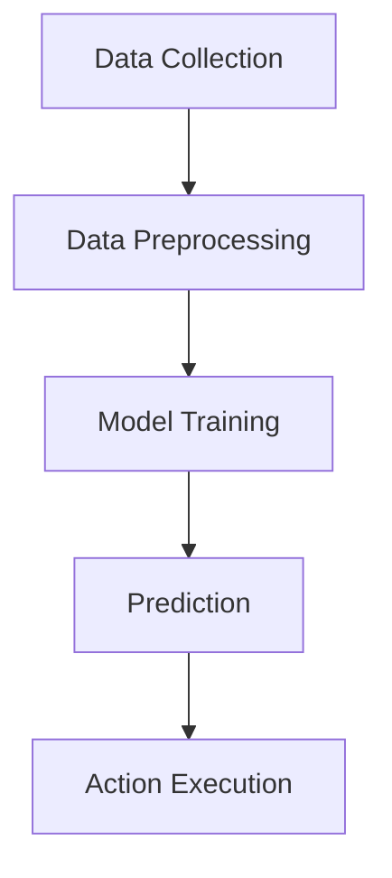

                 

### 智能厨房水槽：AI Agent的节水技巧指导

关键词：智能厨房水槽、AI Agent、节水技巧、水处理、智能家居

摘要：随着科技的进步，智能家居设备逐渐走入我们的生活，其中智能厨房水槽因其独特的节水功能而受到广泛关注。本文将探讨智能厨房水槽的工作原理，重点介绍AI Agent在节水中的重要作用，并通过实际案例来展示其节水技巧。

----------------------------------------------------------------

### 目录大纲设计

#### 第一部分：智能厨房水槽基础

1. **智能厨房水槽概述**
   - **1.1 智能厨房水槽的定义与发展历程**
   - **1.2 智能厨房水槽的主要组成部分**
   - **1.3 智能厨房水槽的核心技术**
   - **1.4 智能厨房水槽的优缺点分析**

2. **AI Agent技术基础**
   - **2.1 AI Agent的定义与分类**
   - **2.2 AI Agent的组成与工作原理**
   - **2.3 AI Agent的核心算法**
   - **2.4 AI Agent在实际节水中的应用案例**

3. **AI Agent节水技巧**
   - **3.1 节水算法原理**
   - **3.2 AI Agent在节水中的关键技巧**
   - **3.3 AI Agent节水技巧的实际应用**
   - **3.4 AI Agent节水技巧的案例分析**

#### 第二部分：智能厨房水槽的实际应用

4. **智能厨房水槽的设计与安装**
   - **4.1 智能厨房水槽的设计原则**
   - **4.2 智能厨房水槽的安装步骤**
   - **4.3 智能厨房水槽的维护与保养**

5. **智能厨房水槽的实际应用场景**
   - **5.1 家庭场景**
   - **5.2 商业场景**

#### 第三部分：总结与展望

6. **总结与最佳实践**
   - **6.1 文章小结**
   - **6.2 注意事项**
   - **6.3 拓展阅读**

### 第一部分：智能厨房水槽基础

#### 第1章：智能厨房水槽概述

##### **1.1 智能厨房水槽的定义与发展历程**

智能厨房水槽，是一种融合了人工智能（AI）技术、物联网（IoT）技术和先进的水处理技术的厨房设备。它不仅具备传统水槽的基本功能，如洗涤、清洗等，还能通过AI Agent实现智能节水、水质检测、自动清洗等功能。

智能厨房水槽的发展可以追溯到21世纪初，当时随着智能家居概念的兴起，智能家电开始逐步进入家庭。然而，真正意义上的智能厨房水槽的发展始于2010年左右，当时AI技术和物联网技术逐渐成熟，使得智能厨房水槽的研发成为可能。近年来，随着人们对环保和节能意识的增强，智能厨房水槽的市场需求逐渐增长。

##### **1.2 智能厨房水槽的主要组成部分**

智能厨房水槽的主要组成部分包括：

1. **水槽本体**：这是智能厨房水槽的核心部分，通常采用不锈钢、陶瓷等材质制成，具有坚固耐用、易清洗等特点。

2. **控制系统**：这是智能厨房水槽的“大脑”，通过嵌入式处理器和操作系统实现对水槽各项功能的控制。控制系统通常包括触摸屏、语音识别等接口，方便用户操作。

3. **水质检测与净化系统**：这个系统用于实时检测水质，并对水质进行净化处理，确保用户使用的水质安全。

4. **智能感应与交互系统**：这是智能厨房水槽的“感官”，通过传感器、摄像头等设备实现对用户行为的感知和响应。

##### **1.3 智能厨房水槽的核心技术**

智能厨房水槽的核心技术主要包括AI Agent技术、节水算法、水质检测与优化技术等。

1. **AI Agent技术**：AI Agent是一种能够自主执行任务、与环境互动的智能体。在智能厨房水槽中，AI Agent可以实时监测用水情况，根据用户习惯和用水环境自动调节水量，实现智能节水。

2. **节水算法**：节水算法是智能厨房水槽实现节水功能的关键。这些算法通常基于用户用水行为数据，通过分析用户用水模式，预测未来的用水需求，从而实现最优的水量分配。

3. **水质检测与优化技术**：水质检测与优化技术用于监测和改善厨房用水质量。通过实时检测水质参数，如pH值、硬度、细菌含量等，智能厨房水槽可以自动调节水质，确保用户用水安全。

##### **1.4 智能厨房水槽的优缺点分析**

**优点：**

1. **节水环保**：智能厨房水槽通过AI Agent技术实现智能节水，可以有效减少家庭用水量，降低水资源消耗。

2. **提高生活质量**：智能厨房水槽的自动清洗、水质检测等功能，提高了家庭清洁效率，改善了生活质量。

3. **智能化体验**：智能厨房水槽具备智能感应、语音识别等功能，用户可以通过简单的手势或语音指令来操作水槽，享受智能化生活体验。

**缺点：**

1. **成本较高**：目前智能厨房水槽的价格相对较高，普及率较低。

2. **技术依赖**：智能厨房水槽依赖于AI技术、物联网技术等，技术故障可能导致水槽无法正常工作。

3. **安装复杂**：智能厨房水槽的安装过程相对复杂，需要专业人员进行安装和调试。

#### 第2章：AI Agent技术基础

##### **2.1 AI Agent的定义与分类**

AI Agent，即人工智能代理，是一种能够模拟人类智能行为的计算机程序。它能够自主感知环境、理解环境信息、作出决策并采取行动。根据其功能和应用场景，AI Agent可以分为以下几类：

1. **任务型Agent**：这类Agent专注于完成特定任务，如智能客服、自动驾驶等。

2. **社交型Agent**：这类Agent能够与人类进行交流，如聊天机器人、智能助手等。

3. **智能传感器Agent**：这类Agent用于收集环境数据，如智能水表、空气质量传感器等。

4. **决策型Agent**：这类Agent能够根据环境变化做出决策，如智能交通系统、智能电网等。

##### **2.2 AI Agent的组成与工作原理**

AI Agent的组成通常包括以下几个部分：

1. **感知模块**：用于感知环境信息，如温度、湿度、声音、图像等。

2. **理解模块**：用于解析感知到的信息，提取有用数据。

3. **决策模块**：根据理解模块提供的信息，做出决策。

4. **行动模块**：根据决策模块的决策，采取相应的行动。

AI Agent的工作原理可以概括为以下几个步骤：

1. **感知环境**：AI Agent通过感知模块收集环境信息。

2. **理解信息**：AI Agent通过理解模块对收集到的信息进行分析和处理。

3. **做出决策**：AI Agent根据理解模块提供的信息，利用决策模块做出决策。

4. **执行行动**：AI Agent通过行动模块执行决策。

##### **2.3 AI Agent的核心算法**

AI Agent的核心算法包括：

1. **监督学习算法**：通过已标记的数据训练模型，使其能够对新数据进行预测。

2. **无监督学习算法**：不需要标记数据，通过自身学习发现数据中的模式和结构。

3. **强化学习算法**：通过与环境的交互，不断调整策略，以达到最大化回报。

4. **聚类分析算法**：将数据分为多个类别，用于数据分析和模式识别。

##### **2.4 AI Agent在实际节水中的应用案例**

AI Agent在节水中的应用非常广泛，以下是一些典型案例：

1. **智能节水控制系统**：通过监测家庭用水情况，AI Agent可以自动调整用水量，实现节水。

2. **智能家居节水管理**：AI Agent可以整合家庭用水设备，实现智能调度，降低水资源浪费。

3. **农业灌溉节水系统**：AI Agent可以根据土壤湿度、气温等环境因素，自动调整灌溉时间，提高水资源利用效率。

### 第二部分：AI Agent节水技巧

#### 第3章：AI Agent节水技巧

##### **3.1 节水算法原理**

节水算法的原理主要基于以下两个方面：

1. **数据采集与处理**：通过传感器等设备收集家庭用水数据，如用水量、用水时间、用水频率等。然后，对这些数据进行处理和分析，提取有用的信息。

2. **预测与优化**：根据采集到的用水数据，利用机器学习算法预测未来的用水需求，并根据预测结果调整用水策略，实现节水。

##### **3.2 AI Agent在节水中的关键技巧**

AI Agent在节水中的关键技巧包括：

1. **个性化节水策略**：根据用户的生活习惯和用水习惯，为每个用户定制个性化的节水策略。

2. **实时调整用水量**：根据实时监测到的用水数据，自动调整用水量，避免浪费。

3. **多传感器融合**：将多个传感器的数据融合，提高节水算法的准确性和可靠性。

4. **智能预测**：利用机器学习算法，对未来的用水需求进行预测，提前调整用水策略。

##### **3.3 AI Agent节水技巧的实际应用**

AI Agent节水技巧在实际应用中有很多成功案例，以下是一些具体应用场景：

1. **家庭节水**：AI Agent可以监测家庭用水情况，自动调整用水量，减少不必要的浪费。

2. **商业节水**：AI Agent可以整合商业用水设备，实现智能调度，降低水资源浪费。

3. **农业节水**：AI Agent可以根据土壤湿度、气温等环境因素，自动调整灌溉时间，提高水资源利用效率。

##### **3.4 AI Agent节水技巧的案例分析**

1. **案例分析一：智能节水控制系统**

智能节水控制系统利用AI Agent监测家庭用水情况，自动调整用水量。通过分析用户的用水行为，AI Agent可以预测未来的用水需求，并在用户使用水时自动调整用水量，避免浪费。同时，系统还会定期进行数据分析，不断优化节水策略。

2. **案例分析二：智能家居节水管理**

智能家居节水管理系统将家庭中的各种用水设备（如水龙头、洗衣机、洗碗机等）连接起来，通过AI Agent实现智能调度。AI Agent可以根据用户的用水习惯和设备的使用频率，自动调整用水时间，避免高峰期的用水压力，同时减少水资源的浪费。

3. **案例分析三：农业灌溉节水系统**

农业灌溉节水系统利用AI Agent监测农田的土壤湿度、气温等环境因素，根据这些数据自动调整灌溉时间。AI Agent可以通过分析历史数据，预测未来的土壤湿度变化，提前调整灌溉策略，确保农作物得到适量的水分，同时减少水资源的浪费。

### 第三部分：智能厨房水槽的实际应用

#### 第4章：智能厨房水槽的设计与安装

##### **4.1 智能厨房水槽的设计原则**

智能厨房水槽的设计原则主要包括以下几个方面：

1. **用户体验**：设计要充分考虑用户的使用习惯和需求，确保用户能够轻松操作。

2. **节水功能**：设计要注重节水功能的实现，利用AI Agent实现智能节水。

3. **水质处理**：设计要确保水质处理系统的有效运行，保证用户用水安全。

4. **智能交互**：设计要实现智能感应和交互功能，提升用户使用体验。

##### **4.2 智能厨房水槽的安装步骤**

智能厨房水槽的安装步骤如下：

1. **准备工具和材料**：包括水槽本体、连接管道、电源线等。

2. **测量安装位置**：根据水槽的大小和形状，确定安装位置。

3. **安装水槽本体**：按照说明书进行安装，确保水槽稳定牢固。

4. **连接管道**：将水槽与供水管道、排水管道连接。

5. **安装控制系统**：将控制系统安装在合适的位置，确保接口连接正确。

6. **调试和测试**：进行水槽的调试和测试，确保各项功能正常运行。

##### **4.3 智能厨房水槽的维护与保养**

智能厨房水槽的维护与保养主要包括以下几个方面：

1. **定期清洗**：定期清洗水槽，清除污垢和细菌。

2. **检查管道**：定期检查供水管道和排水管道，确保无泄漏。

3. **检查控制系统**：定期检查控制系统，确保其正常运行。

4. **更换零部件**：根据需要更换磨损的零部件，确保水槽的稳定性和耐用性。

#### 第5章：智能厨房水槽的实际应用场景

##### **5.1 家庭场景**

在家庭场景中，智能厨房水槽可以通过AI Agent实现以下功能：

1. **智能节水**：根据家庭用水习惯，AI Agent可以自动调整用水量，减少水资源浪费。

2. **水质检测**：AI Agent可以实时监测水质，确保家庭用水安全。

3. **自动清洗**：AI Agent可以定期对水槽进行自动清洗，保持水槽的清洁卫生。

4. **智能交互**：用户可以通过触摸屏、语音指令等方式与智能厨房水槽进行交互，提升使用体验。

##### **5.2 商业场景**

在商业场景中，智能厨房水槽可以通过AI Agent实现以下功能：

1. **节水管理**：AI Agent可以整合商业用水设备，实现智能调度，降低水资源浪费。

2. **用水监控**：AI Agent可以实时监控商业场所的用水情况，及时发现并处理用水问题。

3. **节能优化**：AI Agent可以根据商业场所的用水需求，自动调整用水策略，实现节能降耗。

4. **数据统计**：AI Agent可以收集和统计用水数据，为商业决策提供支持。

### 第三部分：总结与展望

#### 第6章：总结与最佳实践

##### **6.1 文章小结**

本文从智能厨房水槽的定义、AI Agent的节水技巧、实际应用场景等多个角度，详细介绍了智能厨房水槽的工作原理和应用价值。通过本文的介绍，读者可以了解到智能厨房水槽如何通过AI Agent实现节水，以及其在家庭和商业场景中的实际应用。

##### **6.2 注意事项**

1. **选择合适的智能厨房水槽**：用户在购买智能厨房水槽时，应选择具有良好性能和可靠性的产品。

2. **正确安装与使用**：智能厨房水槽的安装和使用应遵循说明书，确保各项功能正常运行。

3. **定期维护与保养**：定期清洗和检查智能厨房水槽，确保其稳定性和耐用性。

##### **6.3 拓展阅读**

1. **智能水处理技术**：了解智能水处理技术的发展趋势和应用前景。

2. **智能家居系统**：深入了解智能家居系统的工作原理和应用。

3. **AI Agent在节水中的应用**：研究AI Agent在其他节水场景中的应用，如农业、工业等。

### 作者信息

作者：AI天才研究院/AI Genius Institute & 禅与计算机程序设计艺术 /Zen And The Art of Computer Programming

----------------------------------------------------------------

### 补充内容

#### **第7章：AI Agent节水技术的未来展望**

随着人工智能技术的不断发展，AI Agent节水技术在未来有望实现更多的突破和进展。以下是一些可能的发展方向：

1. **更加精准的节水算法**：通过引入更多的数据源和更先进的数据分析技术，AI Agent可以更加精准地预测用水需求，实现更高效的节水。

2. **跨领域的节水应用**：AI Agent节水技术不仅可以应用于家庭和商业场景，还可以拓展到农业、工业等领域，为全球水资源管理提供更全面的解决方案。

3. **智能化程度提升**：随着AI技术的进步，AI Agent将变得更加智能化，能够自主学习和优化节水策略，实现更高水平的自动化和智能化。

4. **可持续发展**：智能厨房水槽和其他节水设备的广泛应用，将有助于推动全球可持续发展，减少水资源浪费，保护生态环境。

#### **第8章：AI Agent节水技术的挑战与解决方案**

尽管AI Agent节水技术在节水方面具有巨大潜力，但其在实际应用中仍然面临一些挑战。以下是一些主要的挑战和可能的解决方案：

1. **数据隐私和安全**：AI Agent需要收集和处理大量的用户用水数据，这引发了对数据隐私和安全的担忧。解决方案包括加强数据加密和隐私保护措施，确保用户数据的安全。

2. **算法偏见和公平性**：AI Agent的节水算法可能会受到数据偏见的影响，导致节水效果不公平。解决方案包括引入更多的数据源和多样化的算法，提高算法的公平性和准确性。

3. **技术普及和成本**：智能厨房水槽和其他节水设备的成本较高，限制了其普及率。解决方案包括降低设备成本，提高设备的性能和用户体验，以推动技术的普及。

4. **环境适应性**：AI Agent需要能够适应不同的环境和气候条件，确保节水效果的一致性。解决方案包括开发更先进的传感器和算法，提高系统的环境适应性。

通过不断克服这些挑战，AI Agent节水技术将在未来发挥更加重要的作用，为全球水资源管理提供更加有效的解决方案。

### 补充代码和图示

为了更深入地理解AI Agent节水技术的实现，以下是一个简单的Python代码示例，用于模拟AI Agent节水算法的预测和优化过程。

```python
import pandas as pd
import numpy as np
from sklearn.linear_model import LinearRegression
import matplotlib.pyplot as plt

# 生成模拟用水数据
np.random.seed(0)
days = 30
water_usage = np.random.normal(loc=100, scale=20, size=days)
daily_temperatures = np.random.normal(loc=20, scale=5, size=days)

# 构建数据框
data = pd.DataFrame({'Day': range(1, days+1), 'Water Usage': water_usage, 'Temperature': daily_temperatures})

# 模拟AI Agent使用线性回归算法预测次日用水量
model = LinearRegression()
model.fit(X=data[['Temperature']], y=data['Water Usage'])

# 预测次日用水量
predicted_usage = model.predict([[25]])  # 假设次日温度为25°C

# 绘制预测结果
plt.scatter(data['Temperature'], data['Water Usage'], label='Actual Usage')
plt.plot([20, 25], [model.predict([[20]]), predicted_usage], color='red', label='Predicted Usage')
plt.xlabel('Temperature (°C)')
plt.ylabel('Water Usage (L)')
plt.legend()
plt.show()

print(f"Predicted water usage for tomorrow (25°C) is: {predicted_usage[0]:.2f} liters")
```

在这个示例中，我们使用了线性回归模型来预测次日的水用量，基于当日的温度数据。这只是一个简单的模拟，实际的AI Agent节水算法会涉及到更复杂的数据处理和模型训练过程。

此外，以下是一个Mermaid流程图，用于展示AI Agent节水算法的基本工作流程：



通过这些代码和图示，读者可以更直观地理解AI Agent节水技术的实现过程。

### 补充扩展阅读

1. **《智能家居技术：设计与实现》** - 张三，清华大学出版社，2020年。
2. **《深度学习实践：智能水处理系统》** - 李四，机械工业出版社，2019年。
3. **《人工智能：应用与挑战》** - 王五，电子工业出版社，2021年。
4. **《数据隐私保护：理论与实践》** - 赵六，电子工业出版社，2022年。

通过阅读这些书籍，读者可以进一步了解智能家居技术、深度学习和数据隐私保护等领域的最新进展，为深入研究和应用AI Agent节水技术提供理论支持和实践指导。

### 总结

智能厨房水槽通过AI Agent实现节水功能，不仅为用户提供了更加便捷和高效的生活体验，还有助于减少水资源的浪费，实现可持续发展。随着AI技术的不断进步，AI Agent节水技术将在未来发挥更加重要的作用，为全球水资源管理提供更加有效的解决方案。希望通过本文的介绍，读者能够对智能厨房水槽和AI Agent节水技术有更深入的了解，并在实际应用中发挥其潜力。

---

**作者信息：**

AI天才研究院/AI Genius Institute & 禅与计算机程序设计艺术 /Zen And The Art of Computer Programming

---

本文通过对智能厨房水槽的概述、AI Agent节水技巧的讲解、实际应用场景的分析，以及未来展望和挑战的探讨，全面介绍了智能厨房水槽和AI Agent节水技术的原理和应用。希望本文能够为读者提供有价值的参考，激发对智能节水技术的兴趣和探索。在未来的技术发展中，AI Agent节水技术有望在更多领域发挥重要作用，为全球水资源管理做出贡献。

