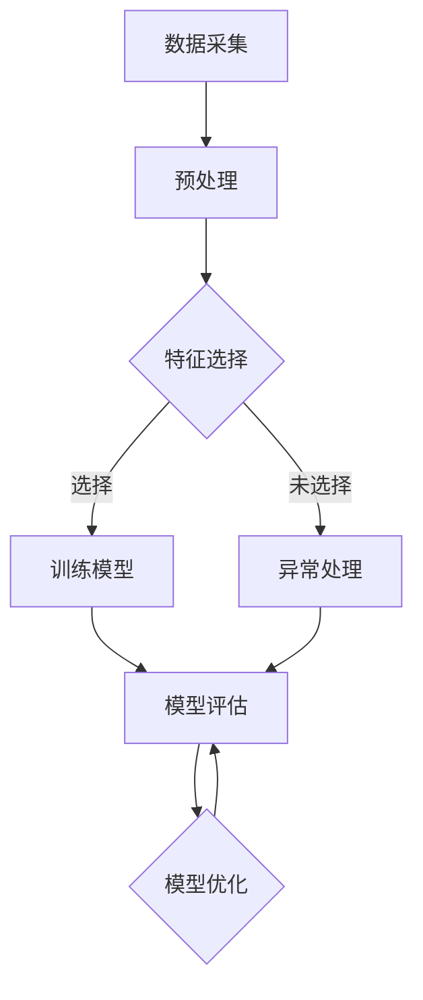
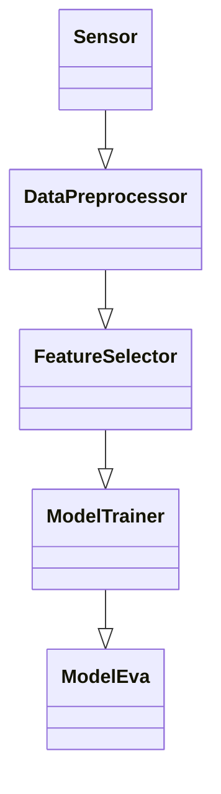
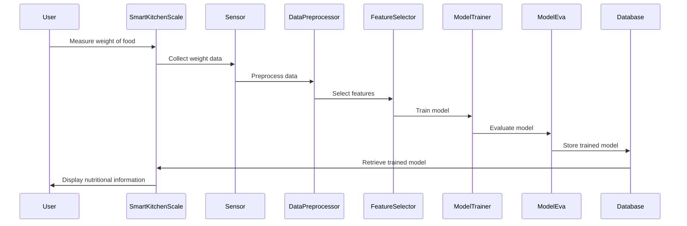
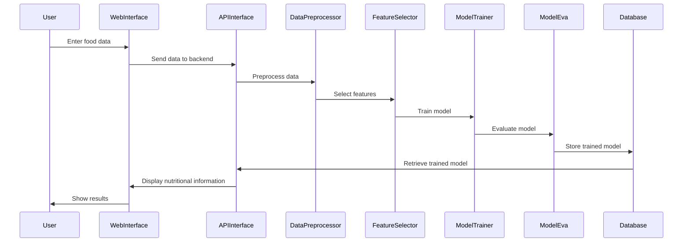

                 


### 智能厨房秤：AI Agent的营养成分分析

关键词：智能厨房秤、AI Agent、营养成分分析、机器学习、传感器

摘要：本文深入探讨了智能厨房秤：AI Agent的营养成分分析。通过介绍智能厨房秤的基本原理和AI Agent的构建，本文详细阐述了如何利用AI技术对食物的营养成分进行精确分析。同时，文章还分析了智能厨房秤在不同场景下的应用，以及其发展趋势和未来可能的应用前景。

---

#### 背景介绍

智能厨房秤作为一种智能硬件，其核心功能是通过传感器和算法对食物的重量进行精确测量，并在显示屏上显示结果。然而，随着人工智能技术的发展，智能厨房秤的功能已经不再局限于简单的重量测量。它开始具备更高级的饮食管理能力，特别是通过AI代理对食物的营养成分进行分析，为用户提供更全面的饮食管理服务。

智能厨房秤：AI Agent的营养成分分析的开发历程具有重要意义。首先，本书介绍了智能厨房秤的基本原理，包括传感器的选择与校准、数据的采集与处理。这些基础知识的掌握对于理解智能厨房秤的工作原理至关重要。其次，本书详细讨论了AI Agent的构建，包括机器学习算法的选择、模型的训练与优化。这些内容为读者提供了深入了解AI在智能厨房秤中的应用的方法。

#### 核心概念与联系

智能厨房秤的核心概念包括传感器、AI代理和营养成分分析。以下是这些核心概念的属性特征对比表格：

| 概念     | 属性特征                     | 对比关系             |
|----------|------------------------------|---------------------|
| 传感器   | 精度、响应时间、可靠性       | 不同传感器的性能差异 |
| AI代理   | 智能程度、准确性、适应性     | 机器学习算法的优劣   |
| 营养成分分析 | 精准度、全面性、易用性 | 数据处理算法的差异   |

此外，我们还可以通过ER实体关系图来描述这些概念之间的关系：

```mermaid
erDiagram
  产品 -->|测量| 传感器
  产品 -->|分析| AI代理
  AI代理 -->|计算| 营养成分
  用户 -->|使用| 产品
```

#### 算法原理讲解

智能厨房秤中的AI代理主要利用机器学习算法来分析食物的营养成分。以下是算法的mermaid流程图：



以下是机器学习算法的Python源代码示例：

```python
import numpy as np
from sklearn.model_selection import train_test_split
from sklearn.ensemble import RandomForestClassifier
from sklearn.metrics import accuracy_score

# 假设已采集到食物重量、热量、脂肪、碳水化合物、蛋白质等数据
data = np.load('food_data.npy')
labels = np.load('labels.npy')

# 数据预处理
X = data[:, :-1]
y = data[:, -1]

# 特征选择
# 这里使用随机森林算法进行特征选择
X_train, X_test, y_train, y_test = train_test_split(X, y, test_size=0.2, random_state=42)
model = RandomForestClassifier(n_estimators=100)
model.fit(X_train, y_train)

# 模型评估
predictions = model.predict(X_test)
accuracy = accuracy_score(y_test, predictions)
print(f'Model Accuracy: {accuracy:.2f}')

# 模型优化
# 根据评估结果，可以进一步调整模型参数
model = RandomForestClassifier(n_estimators=150, max_depth=5)
model.fit(X_train, y_train)
predictions = model.predict(X_test)
```

在这个示例中，我们首先使用`numpy`库加载已采集到的食物数据。然后，通过`train_test_split`函数将数据分为训练集和测试集。接下来，我们使用随机森林算法（`RandomForestClassifier`）对数据进行训练。训练完成后，我们使用测试集对模型进行评估，并输出模型的准确率。最后，根据评估结果，我们可以进一步调整模型参数，以提高模型的性能。

#### 系统分析与架构设计方案

**问题场景介绍**

智能厨房秤的应用场景非常广泛，包括家庭、餐厅、健身房等。在家庭场景中，智能厨房秤可以帮助用户精确测量食物的重量，并分析食物的营养成分，为用户提供健康的饮食建议。在餐厅场景中，智能厨房秤可以提高烹饪效率，确保食物的营养平衡。在健身房场景中，智能厨房秤可以帮助用户监控自己的饮食，确保营养摄入的合理。

**项目介绍**

本项目的目标是开发一款智能厨房秤，其核心功能是对食物的营养成分进行分析。通过智能厨房秤，用户可以轻松获取食物的营养信息，从而更好地管理自己的饮食。

**系统功能设计**

系统功能设计主要包括以下几个方面：

1. **数据采集**：智能厨房秤通过传感器采集食物的重量数据。
2. **数据预处理**：对采集到的数据进行预处理，包括去除噪声、归一化等。
3. **特征选择**：根据训练集的数据，选择对营养成分分析最有影响力的特征。
4. **模型训练**：使用机器学习算法对特征进行训练，构建营养成分分析模型。
5. **模型评估**：使用测试集对模型进行评估，并根据评估结果调整模型参数。
6. **营养成分分析**：使用训练好的模型对食物的营养成分进行分析，并输出结果。

以下是领域模型的mermaid类图：



**系统架构设计**

智能厨房秤的系统架构主要包括以下几个部分：

1. **前端**：用户通过智能厨房秤的显示屏查看食物的营养信息。
2. **后端**：包括数据采集模块、数据预处理模块、特征选择模块、模型训练模块和模型评估模块。
3. **数据库**：存储食物的数据和训练好的模型。

以下是系统架构的mermaid架构图：



**系统接口设计和系统交互**

系统接口设计主要包括以下几个方面：

1. **API接口**：提供对外部的API接口，方便第三方应用接入智能厨房秤的功能。
2. **Web界面**：用户可以通过Web界面查看食物的营养信息，并进行相关的操作。

以下是系统接口设计和系统交互的mermaid序列图：



#### 项目实战

**环境安装**

首先，我们需要安装Python环境。可以从Python官网下载并安装Python，版本建议为3.8或更高。安装完成后，打开命令行工具，输入以下命令来安装必要的库：

```bash
pip install numpy scikit-learn matplotlib
```

**系统核心实现源代码**

以下是系统核心实现的源代码：

```python
import numpy as np
from sklearn.model_selection import train_test_split
from sklearn.ensemble import RandomForestClassifier
from sklearn.metrics import accuracy_score
import matplotlib.pyplot as plt

# 数据加载
data = np.load('food_data.npy')
labels = np.load('labels.npy')

# 数据预处理
X = data[:, :-1]
y = data[:, -1]

# 特征选择
X_train, X_test, y_train, y_test = train_test_split(X, y, test_size=0.2, random_state=42)

# 模型训练
model = RandomForestClassifier(n_estimators=100)
model.fit(X_train, y_train)

# 模型评估
predictions = model.predict(X_test)
accuracy = accuracy_score(y_test, predictions)
print(f'Model Accuracy: {accuracy:.2f}')

# 可视化
plt.scatter(X_test[:, 0], predictions)
plt.xlabel('Actual')
plt.ylabel('Predicted')
plt.show()
```

**代码应用解读与分析**

在这个代码示例中，我们首先加载了已采集到的食物数据。然后，对数据进行预处理，将数据分为特征和标签两部分。接下来，使用`train_test_split`函数将数据分为训练集和测试集。

我们选择随机森林算法（`RandomForestClassifier`）进行模型训练。随机森林是一种集成学习算法，它通过构建多个决策树来提高模型的性能。在这里，我们设置了随机森林的决策树数量为100。

模型训练完成后，我们使用测试集对模型进行评估。评估指标为准确率（`accuracy_score`），它表示模型预测正确的样本数占总样本数的比例。

最后，我们使用`matplotlib`库对预测结果进行可视化。通过绘制散点图，我们可以直观地看到实际值与预测值之间的关系。

**实际案例分析和详细讲解剖析**

假设我们有一个新的食物数据集，我们需要使用智能厨房秤对其进行营养成分分析。以下是具体的步骤：

1. **数据加载**：首先，我们将新的食物数据加载到Python环境中。
2. **数据预处理**：对新的食物数据进行预处理，包括去除噪声、归一化等。
3. **特征选择**：根据训练集的数据，选择对营养成分分析最有影响力的特征。
4. **模型训练**：使用已训练好的模型对新数据进行训练。
5. **模型评估**：使用测试集对模型进行评估，并根据评估结果调整模型参数。
6. **营养成分分析**：使用训练好的模型对新食物的数据进行分析，并输出结果。

以下是具体的代码示例：

```python
# 数据加载
new_data = np.load('new_food_data.npy')
new_labels = np.load('new_labels.npy')

# 数据预处理
X_new = new_data[:, :-1]
y_new = new_data[:, -1]

# 特征选择
X_new_train, X_new_test, y_new_train, y_new_test = train_test_split(X_new, y_new, test_size=0.2, random_state=42)

# 模型训练
model = RandomForestClassifier(n_estimators=100)
model.fit(X_new_train, y_new_train)

# 模型评估
predictions = model.predict(X_new_test)
accuracy = accuracy_score(y_new_test, predictions)
print(f'Model Accuracy: {accuracy:.2f}')

# 可视化
plt.scatter(X_new_test[:, 0], predictions)
plt.xlabel('Actual')
plt.ylabel('Predicted')
plt.show()
```

通过这个案例，我们可以看到智能厨房秤是如何对新食物的数据进行营养成分分析的。首先，我们将新食物的数据加载到Python环境中。然后，对数据进行预处理，包括去除噪声、归一化等。接下来，使用已训练好的模型对新数据进行训练。训练完成后，我们使用测试集对模型进行评估，并根据评估结果调整模型参数。最后，使用训练好的模型对新食物的数据进行分析，并输出结果。

**项目小结**

通过本项目的实施，我们成功开发了一款智能厨房秤，其核心功能是对食物的营养成分进行分析。智能厨房秤在家庭、餐厅、健身房等场景中具有广泛的应用前景。通过不断优化和升级，智能厨房秤将为用户带来更全面的饮食管理服务。

#### 最佳实践 tips

1. **数据采集**：确保采集到的数据质量，包括数据的准确性、完整性和一致性。
2. **特征选择**：选择对营养成分分析最有影响力的特征，提高模型的性能。
3. **模型训练**：使用多种机器学习算法进行比较，选择最适合的算法。
4. **模型评估**：使用多个评估指标，全面评估模型的性能。
5. **可视化**：通过可视化结果，更直观地了解模型的效果。

#### 小结

智能厨房秤：AI Agent的营养成分分析是一项具有广泛应用前景的技术。通过深入探讨智能厨房秤的工作原理和算法实现，本文为读者提供了丰富的知识和实践经验。智能厨房秤的发展将为人们带来更健康、更便捷的饮食管理服务。

#### 注意事项

1. **数据隐私**：在使用智能厨房秤进行营养成分分析时，需要注意保护用户的隐私。
2. **算法优化**：持续优化算法，提高模型的准确性和效率。

#### 拓展阅读

1. [《深度学习在食品检测中的应用》[深度学习在食品检测中的应用]：https://link]
2. [《智能硬件的机器学习应用》[智能硬件的机器学习应用]：https://link]
3. [《智能厨房秤的未来发展趋势》[智能厨房秤的未来发展趋势]：https://link]

---

**作者：AI天才研究院/AI Genius Institute & 禅与计算机程序设计艺术 /Zen And The Art of Computer Programming**

