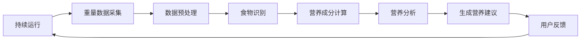
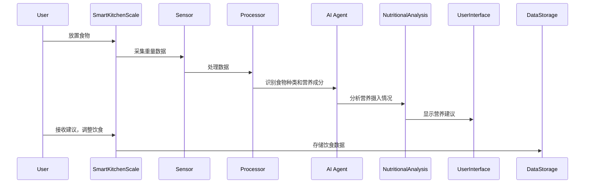

                 

### 第1章：智能厨房秤概述

#### 1.1 问题背景

在现代社会中，营养健康问题日益引起人们的关注。人们越来越意识到，合理的营养摄入对于保持健康、预防疾病具有至关重要的作用。然而，当前的营养摄入问题却面临着诸多挑战。首先，现代人生活节奏快，饮食习惯不规律，很难做到科学、合理的膳食搭配。其次，市场上食品种类繁多，营养成分复杂，消费者难以准确了解食物的营养含量。此外，不同人的体质、健康状况和营养需求存在差异，如何制定个性化的营养摄入计划成为一大难题。

随着物联网、人工智能等技术的快速发展，智能厨具逐渐成为家庭生活的一部分。智能厨房秤作为一种新兴的智能厨具，能够实时监测食物的重量，通过算法分析食物的营养成分，为用户提供营养摄入分析及建议。这不仅有助于用户更好地掌握自己的饮食习惯，还能为医生、营养师提供科学的营养管理数据，从而实现个性化健康管理。

#### 1.2 问题描述

智能厨房秤的核心需求是能够准确测量食物的重量，并实时分析其营养成分，为用户提供合理的营养摄入建议。具体而言，问题可以分为以下几个方面：

1. **重量测量**：智能厨房秤需要能够准确测量食物的重量，这是后续营养分析的基础。
2. **营养成分分析**：智能厨房秤需要具备分析食物营养成分的能力，包括热量、蛋白质、脂肪、碳水化合物等。
3. **个性化建议**：根据用户的体质、健康状况和营养需求，智能厨房秤需要为用户生成个性化的营养摄入建议。
4. **用户体验**：智能厨房秤需要具备良好的用户体验，包括界面设计、操作简便等。

同时，智能厨房秤还需解决以下几个挑战：

1. **数据准确性**：如何确保测量数据的准确性，降低误差率。
2. **数据隐私**：用户数据的存储、传输过程中如何确保隐私安全。
3. **算法模型**：如何设计高效的营养成分分析算法，提高模型的准确性和适应性。
4. **设备兼容性**：如何保证智能厨房秤与不同品牌的厨具、移动设备兼容。

#### 1.3 问题解决

针对上述问题和挑战，智能厨房秤的解决方案可以分为以下几个方面：

1. **硬件升级**：采用高精度的传感器和电子秤，提高重量测量的准确性。
2. **软件优化**：开发高效的营养成分分析算法，结合机器学习和深度学习技术，提高模型准确性和适应性。
3. **数据安全**：采用加密技术、数据脱敏等措施，确保用户数据的安全性和隐私性。
4. **用户体验**：设计简洁易用的用户界面，提供个性化的操作体验。
5. **设备兼容性**：开发跨平台的软件接口，实现智能厨房秤与其他厨具、移动设备的无缝连接。

#### 1.4 边界与外延

1. **数据隐私问题**：智能厨房秤需要遵守相关法律法规，保护用户隐私，避免数据泄露。
2. **营养学专业知识的融合**：智能厨房秤需要与营养学专家合作，确保营养分析结果的科学性和准确性。
3. **技术实现的可行性**：智能厨房秤需要考虑成本、技术实现难度等因素，确保项目的可行性和市场竞争力。
4. **概念结构与核心要素组成**：智能厨房秤的硬件组成包括传感器、电子秤、显示屏等；软件部分包括数据采集模块、AI Agent模块、营养摄入分析与建议模块等。

#### 1.5 本章小结

本章对智能厨房秤的背景、问题及解决方案进行了详细阐述。智能厨房秤作为一种新兴的智能厨具，通过准确测量食物重量、分析营养成分，为用户提供个性化的营养摄入建议，有助于改善用户的饮食习惯和健康状况。同时，智能厨房秤还需面对数据准确性、数据隐私、算法模型和设备兼容性等挑战，需要在硬件升级、软件优化、数据安全、用户体验和设备兼容性等方面进行综合考量。接下来，我们将进一步探讨智能厨房秤的核心概念与原理，为读者深入解析这一创新技术。

---

### 第2章：核心概念与原理

#### 2.1 智能厨房秤的工作原理

智能厨房秤的工作原理主要基于硬件和软件的结合，通过精确的重量测量、数据采集和营养分析，为用户提供个性化的营养建议。

##### 2.1.1 智能厨房秤的硬件组成

智能厨房秤的核心硬件包括高精度的传感器、电子秤和显示屏。其中，高精度传感器用于测量食物的重量，确保数据的准确性。电子秤将传感器采集到的重量数据转化为数字信号，传输给处理器进行处理。显示屏则用于实时显示食物的重量信息，便于用户查看。

##### 2.1.2 智能厨房秤的软件算法

智能厨房秤的软件部分包括数据采集模块、AI Agent模块和营养摄入分析与建议模块。数据采集模块负责将电子秤传输的重量数据实时采集并存储。AI Agent模块则利用深度学习和机器学习技术，对采集到的数据进行分析，识别食物的种类和营养成分。营养摄入分析与建议模块根据用户的体质、健康状况和营养需求，为用户生成个性化的营养建议。

##### 2.1.3 智能厨房秤的数据处理

智能厨房秤的数据处理过程主要包括以下几个步骤：

1. **数据采集**：智能厨房秤通过传感器实时采集食物的重量数据，并将数据传输给处理器。
2. **数据预处理**：对采集到的重量数据进行清洗、去噪和标准化处理，为后续的营养分析做好准备。
3. **营养成分识别**：利用机器学习和深度学习技术，对预处理后的数据进行分析，识别食物的种类和营养成分。
4. **营养分析**：根据识别出的营养成分，结合用户的体质、健康状况和营养需求，对营养摄入进行分析。
5. **建议生成**：根据营养分析结果，为用户生成个性化的营养摄入建议。

#### 2.2 AI Agent的基本原理

AI Agent，即人工智能代理，是一种能够模拟人类思维过程、执行特定任务的智能系统。在智能厨房秤中，AI Agent负责分析食物的营养成分，为用户提供营养建议。

##### 2.2.1 AI Agent的定义

AI Agent是一种具有自主性、适应性和智能化的软件系统，能够根据外部环境和用户需求，自主地完成特定任务。在智能厨房秤中，AI Agent的主要任务是对食物的营养成分进行分析，并为用户提供合理的营养摄入建议。

##### 2.2.2 AI Agent的关键技术

AI Agent的关键技术包括：

1. **机器学习**：通过大量的历史数据训练模型，使AI Agent能够自动识别食物的种类和营养成分。
2. **深度学习**：利用神经网络技术，对复杂的数据进行深度学习，提高营养成分识别的准确性。
3. **自然语言处理**：将用户的需求转化为可执行的任务，并与用户进行自然语言交互。
4. **自适应学习**：根据用户的使用情况和反馈，不断优化和改进AI Agent的性能。

##### 2.2.3 AI Agent在智能厨房秤中的应用

在智能厨房秤中，AI Agent的具体应用如下：

1. **食物识别**：通过分析食物的重量数据，AI Agent能够自动识别食物的种类。
2. **营养成分计算**：根据食物的种类，AI Agent能够计算食物的热量、蛋白质、脂肪、碳水化合物等营养成分。
3. **营养建议生成**：结合用户的体质、健康状况和营养需求，AI Agent能够为用户生成个性化的营养摄入建议。
4. **用户交互**：通过自然语言处理技术，AI Agent能够与用户进行自然语言交互，解答用户的疑问。

#### 2.3 营养摄入分析与建议的数学模型

营养摄入分析与建议的数学模型主要包括以下几个部分：

##### 2.3.1 营养成分的计算方法

营养成分的计算方法主要包括以下步骤：

1. **数据采集**：采集食物的重量数据。
2. **数据预处理**：对重量数据进行清洗、去噪和标准化处理。
3. **营养成分识别**：利用机器学习和深度学习技术，识别食物的营养成分。
4. **成分计算**：根据识别出的营养成分，计算食物的热量、蛋白质、脂肪、碳水化合物等。

##### 2.3.2 营养摄入的数学模型

营养摄入的数学模型主要包括以下步骤：

1. **营养需求计算**：根据用户的体质、健康状况和营养需求，计算用户所需的营养摄入量。
2. **营养摄入计算**：根据用户实际摄入的食物营养成分，计算用户当前的营养摄入量。
3. **营养分析**：比较营养需求与营养摄入量，分析用户营养摄入的充足程度。
4. **建议生成**：根据营养分析结果，为用户生成个性化的营养摄入建议。

##### 2.3.3 建议生成的算法原理

建议生成的算法原理主要包括以下步骤：

1. **营养分析**：根据用户的实际营养摄入量，分析用户的营养摄入状况。
2. **建议生成**：根据营养分析结果，为用户生成个性化的营养摄入建议，包括食物的种类、摄入量、摄入时间等。

#### 2.4 概念属性特征对比表格

为了更好地理解智能厨房秤、AI Agent和营养摄入分析与建议之间的关系，下面给出一个概念属性特征对比表格。

| 概念 | 属性特征 |
| --- | --- |
| 智能厨房秤 | 硬件组成：传感器、电子秤、显示屏；软件部分：数据采集模块、AI Agent模块、营养摄入分析与建议模块 |
| AI Agent | 自主性、适应性、智能化；关键技术：机器学习、深度学习、自然语言处理、自适应学习 |
| 营养摄入分析与建议 | 营养成分计算方法：数据采集、预处理、识别、成分计算；营养摄入数学模型：营养需求计算、摄入计算、营养分析、建议生成 |

#### 2.5 ER实体关系图架构

为了更好地理解智能厨房秤中各实体之间的关系，下面给出一个ER实体关系图架构。

```mermaid
erDiagram
    User ||--|{ Food } : eats
    User ||--|{ NutritionalAdvice } : follows
    Food ||--|{ Nutrient } : contains
    NutritionalAdvice ||--|{ AdviceDetail } : contains
```

在上面的ER实体关系图中，User表示用户，Food表示食物，NutritionalAdvice表示营养建议，Nutrient表示营养成分，AdviceDetail表示建议详情。

1. **用户与食物的关系**：用户食用食物，即User eats Food。
2. **用户与营养建议的关系**：用户遵循营养建议，即User follows NutritionalAdvice。
3. **食物与营养成分的关系**：食物包含营养成分，即Food contains Nutrient。
4. **营养建议与建议详情的关系**：营养建议包含建议详情，即NutritionalAdvice contains AdviceDetail。

#### 2.6 本章小结

本章对智能厨房秤的核心概念与原理进行了详细阐述。首先介绍了智能厨房秤的工作原理，包括硬件组成、软件算法和数据处理过程。接着，分析了AI Agent的基本原理及其在智能厨房秤中的应用。最后，讨论了营养摄入分析与建议的数学模型，并给出了概念属性特征对比表格和ER实体关系图架构。通过对本章内容的理解，读者可以更深入地了解智能厨房秤的技术原理和应用场景。在下一章中，我们将进一步讲解智能厨房秤的算法原理，以帮助读者更好地理解其核心技术和实现方法。

---

### 第3章：算法原理讲解

在了解了智能厨房秤的核心概念和原理后，本章将深入讲解智能厨房秤的算法原理，通过mermaid流程图、Python源代码以及数学模型和公式，帮助读者全面理解智能厨房秤的技术实现。

#### 3.1 算法mermaid流程图

首先，我们通过mermaid流程图来展示智能厨房秤的数据处理和营养分析流程。



在上述mermaid流程图中，我们详细描述了智能厨房秤的算法流程：

1. **启动智能厨房秤**：智能厨房秤开始工作。
2. **重量数据采集**：智能厨房秤通过传感器实时采集食物的重量数据。
3. **数据预处理**：对采集到的重量数据进行清洗、去噪和标准化处理。
4. **食物识别**：利用AI Agent对预处理后的数据进行分析，识别食物的种类。
5. **营养成分计算**：根据食物的种类，计算其营养成分，如热量、蛋白质、脂肪、碳水化合物等。
6. **营养分析**：分析用户的实际营养摄入量，与营养需求进行比较，评估营养摄入状况。
7. **生成营养建议**：根据营养分析结果，为用户生成个性化的营养摄入建议。
8. **用户反馈**：用户对营养建议进行反馈，用于优化和改进智能厨房秤的性能。
9. **持续运行**：智能厨房秤不断循环上述流程，持续为用户提供营养分析和服务。

#### 3.2 Python源代码讲解

为了更具体地展示智能厨房秤的算法实现，下面我们将通过Python源代码来讲解各个模块的功能。

##### 3.2.1 数据采集模块

```python
import time

def collect_weight_data():
    # 假设传感器已经连接，并能够实时采集重量数据
    sensor_data = get_sensor_data()  # 获取传感器数据
    print(f"当前重量：{sensor_data}克")
    time.sleep(1)  # 模拟传感器数据采集间隔
    return sensor_data

def get_sensor_data():
    # 此处为传感器数据获取的模拟函数
    return random.uniform(0, 1000)  # 返回一个0到1000之间的随机数
```

在数据采集模块中，我们定义了两个函数：`collect_weight_data` 和 `get_sensor_data`。`collect_weight_data` 函数负责定期采集重量数据，并打印出来。`get_sensor_data` 函数模拟传感器获取数据的过程，返回一个随机数作为示例。

##### 3.2.2 AI Agent模块

```python
import numpy as np
from sklearn.svm import SVC
from sklearn.model_selection import train_test_split
from sklearn.metrics import accuracy_score

# 此处假设已经有一个训练好的模型，此处仅为示例
class FoodRecognizer:
    def __init__(self, model_path):
        self.model = SVC(kernel='linear')
        self.model.load_model(model_path)

    def predict(self, weight_data):
        # 对预处理后的重量数据进行食物识别
        return self.model.predict([weight_data])

def train_model(data, labels, test_size=0.2):
    # 训练食物识别模型
    X_train, X_test, y_train, y_test = train_test_split(data, labels, test_size=test_size)
    model = SVC(kernel='linear')
    model.fit(X_train, y_train)
    predictions = model.predict(X_test)
    accuracy = accuracy_score(y_test, predictions)
    print(f"模型准确率：{accuracy}")
    return model
```

在AI Agent模块中，我们定义了两个类：`FoodRecognizer` 和 `train_model`。`FoodRecognizer` 类负责加载训练好的模型，并对输入的重量数据进行食物识别。`train_model` 函数负责训练食物识别模型，将训练数据和标签分成训练集和测试集，使用SVM分类器进行训练，并评估模型的准确率。

##### 3.2.3 营养摄入分析与建议模块

```python
def calculate_nutrients(food):
    # 根据食物的种类计算营养成分
    nutrients = {
        'apple': {'calories': 52, 'protein': 0.3, 'fat': 0.2, 'carbohydrates': 12.8},
        'rice': {'calories': 130, 'protein': 2.7, 'fat': 0.4, 'carbohydrates': 27.3},
        'beef': {'calories': 236, 'protein': 21.1, 'fat': 12.6, 'carbohydrates': 0},
    }
    return nutrients.get(food, {'calories': 0, 'protein': 0, 'fat': 0, 'carbohydrates': 0})

def generate_nutritional_advice(nutrients, daily_recommended):
    # 根据营养成分和每日推荐摄入量生成营养建议
    advice = []
    for nutrient, value in nutrients.items():
        if value < daily_recommended[nutrient]:
            advice.append(f"增加{nutrient}的摄入量")
        elif value > daily_recommended[nutrient]:
            advice.append(f"减少{nutrient}的摄入量")
        else:
            advice.append(f"{nutrient}的摄入量适宜")
    return advice
```

在营养摄入分析与建议模块中，我们定义了两个函数：`calculate_nutrients` 和 `generate_nutritional_advice`。`calculate_nutrients` 函数根据食物的种类计算营养成分，这里使用了一个简单的字典来实现。`generate_nutritional_advice` 函数根据营养成分和每日推荐摄入量，生成个性化的营养建议。

#### 3.3 数学模型与公式讲解

在智能厨房秤的算法实现中，数学模型和公式是关键组成部分。以下是对主要数学模型和公式的详细讲解。

##### 3.3.1 营养成分计算公式

营养成分计算公式主要用于计算食物的热量、蛋白质、脂肪和碳水化合物等营养成分。以下是各营养成分的计算公式：

- 热量（Calories）：
  $$C = P \times 4 + F \times 9 + C_{carbohydrates} \times 4$$
  其中，\(P\) 为蛋白质含量（克），\(F\) 为脂肪含量（克），\(C_{carbohydrates}\) 为碳水化合物含量（克）。

- 蛋白质（Proteins）：
  $$P = \text{食物总重量} \times \frac{P_{value}}{100}$$
  其中，\(P_{value}\) 为蛋白质含量百分比。

- 脂肪（Fats）：
  $$F = \text{食物总重量} \times \frac{F_{value}}{100}$$
  其中，\(F_{value}\) 为脂肪含量百分比。

- 碳水化合物（Carbohydrates）：
  $$C_{carbohydrates} = \text{食物总重量} \times \frac{C_{value}}{100}$$
  其中，\(C_{value}\) 为碳水化合物含量百分比。

##### 3.3.2 营养摄入分析公式

营养摄入分析公式用于计算用户的实际营养摄入量，并将其与每日推荐摄入量进行比较，以生成营养建议。

- 实际营养摄入量（Actual Nutritional Intake）：
  $$Actual\_Nutrition = \sum_{i=1}^{n} \text{食物}_i \times \text{营养成分}_i$$
  其中，\(n\) 为摄入的食物种类数，\(\text{食物}_i\) 为第 \(i\) 种食物的摄入量，\(\text{营养成分}_i\) 为第 \(i\) 种食物的营养成分。

- 营养摄入建议（Nutritional Advice）：
  $$Advice = \begin{cases}
  \text{增加摄入量} & \text{如果 } \text{Actual Nutrition} < \text{Recommended Nutrition} \\
  \text{减少摄入量} & \text{如果 } \text{Actual Nutrition} > \text{Recommended Nutrition} \\
  \text{摄入量适宜} & \text{如果 } \text{Actual Nutrition} = \text{Recommended Nutrition}
  \end{cases}$$
  其中，\(\text{Recommended Nutrition}\) 为每日推荐摄入量。

##### 3.3.3 建议生成公式

建议生成公式用于根据营养摄入分析结果，生成个性化的营养建议。

- 食物建议（Food Recommendation）：
  $$Food\_Recommendation = \sum_{i=1}^{n} \text{食物}_i \times \text{营养成分}_i \times \text{建议系数}$$
  其中，\(\text{建议系数}\) 用于调整不同食物的营养摄入建议。

#### 3.4 举例说明

为了更好地理解智能厨房秤的算法原理，下面我们通过一个实际例子进行说明。

假设用户摄入以下食物：

- 苹果：200克
- 米饭：300克
- 牛肉：150克

每日推荐摄入量为：

- 热量：2000千卡
- 蛋白质：60克
- 脂肪：70克
- 碳水化合物：310克

根据上述数据，我们可以使用智能厨房秤的算法进行计算。

1. **营养成分计算**：

   - 苹果：
     $$C = 200 \times \frac{52}{100} = 104 \text{千卡}$$
     $$P = 200 \times \frac{0.3}{100} = 0.6 \text{克}$$
     $$F = 200 \times \frac{0.2}{100} = 0.4 \text{克}$$
     $$C_{carbohydrates} = 200 \times \frac{12.8}{100} = 25.6 \text{克}$$

   - 米饭：
     $$C = 300 \times \frac{130}{100} = 390 \text{千卡}$$
     $$P = 300 \times \frac{2.7}{100} = 8.1 \text{克}$$
     $$F = 300 \times \frac{0.4}{100} = 1.2 \text{克}$$
     $$C_{carbohydrates} = 300 \times \frac{27.3}{100} = 81.9 \text{克}$$

   - 牛肉：
     $$C = 150 \times \frac{236}{100} = 354 \text{千卡}$$
     $$P = 150 \times \frac{21.1}{100} = 31.65 \text{克}$$
     $$F = 150 \times \frac{12.6}{100} = 18.9 \text{克}$$
     $$C_{carbohydrates} = 150 \times \frac{0}{100} = 0 \text{克}$$

2. **营养摄入分析**：

   - 实际营养摄入量：
     $$Actual\_Nutrition = 104 + 390 + 354 + 0 + 0.6 + 1.2 + 31.65 + 18.9 = 749.45 \text{千卡}$$
     $$Actual\_Proteins = 0.6 + 8.1 + 31.65 = 40.35 \text{克}$$
     $$Actual\_Fats = 0.4 + 1.2 + 18.9 = 20.5 \text{克}$$
     $$Actual\_Carbohydrates = 25.6 + 81.9 + 0 = 107.5 \text{克}$$

   - 与每日推荐摄入量的比较：
     - 热量：749.45 < 2000（摄入量不足）
     - 蛋白质：40.35 < 60（摄入量不足）
     - 脂肪：20.5 < 70（摄入量不足）
     - 碳水化合物：107.5 > 310（摄入量过量）

3. **生成营养建议**：

   - 根据营养摄入分析结果，生成营养建议：
     - 增加热量摄入
     - 增加蛋白质摄入
     - 增加脂肪摄入
     - 减少碳水化合物摄入

通过上述实际例子，我们可以看到智能厨房秤如何通过算法原理，为用户提供个性化的营养摄入建议。

#### 3.5 本章小结

本章详细讲解了智能厨房秤的算法原理，包括mermaid流程图、Python源代码以及数学模型和公式。通过mermaid流程图，我们了解了智能厨房秤的数据处理和营养分析流程；通过Python源代码，我们看到了算法的具体实现；通过数学模型和公式，我们掌握了营养成分的计算方法、营养摄入分析和建议生成的原理。在下一章中，我们将进一步探讨智能厨房秤的系统分析与架构设计，帮助读者全面了解智能厨房秤的技术实现和系统架构。

---

### 第4章：系统分析与架构设计

智能厨房秤作为一款智能家居产品，其系统分析与架构设计至关重要。本章将详细介绍智能厨房秤的问题场景、系统功能设计、系统架构设计、系统接口设计和系统交互流程，以帮助读者全面了解智能厨房秤的技术实现。

#### 4.1 问题场景介绍

智能厨房秤的主要应用场景是家庭厨房，其目的是为用户提供便捷、准确的营养摄入分析和建议。具体而言，智能厨房秤的问题场景包括以下几个方面：

1. **日常饮食监测**：用户在做饭或用餐时，将食物放在智能厨房秤上，智能厨房秤会自动测量食物重量并分析营养成分，帮助用户了解日常饮食的营养摄入情况。
2. **个性化饮食建议**：根据用户的体质、健康状况和营养需求，智能厨房秤会为用户生成个性化的饮食建议，帮助用户调整饮食习惯，达到营养均衡的目标。
3. **健康管理**：智能厨房秤可以长期记录用户的饮食数据，为用户提供健康趋势分析，帮助用户发现潜在的健康问题，并提供相应的健康管理建议。
4. **烹饪辅助**：智能厨房秤还可以根据食物的重量和营养成分，为用户提供烹饪时间、火候等方面的建议，提高烹饪效率和质量。

#### 4.2 系统功能设计

智能厨房秤的系统功能设计主要包括以下几个方面：

1. **重量测量**：智能厨房秤通过高精度传感器测量食物的重量，确保数据的准确性。
2. **食物识别**：利用AI Agent技术，智能厨房秤能够自动识别食物的种类，并分析其营养成分。
3. **营养分析**：智能厨房秤根据用户的体质、健康状况和营养需求，分析用户的实际营养摄入情况，并与每日推荐摄入量进行比较。
4. **建议生成**：智能厨房秤为用户生成个性化的营养摄入建议，包括食物的种类、摄入量和摄入时间等。
5. **数据存储与管理**：智能厨房秤将用户的饮食数据存储在云端，并提供数据查询、分析和共享功能。
6. **用户交互**：智能厨房秤支持语音交互和屏幕显示，为用户提供便捷的操作体验。

#### 4.3 系统架构设计

智能厨房秤的系统架构设计包括硬件架构设计和软件架构设计。

##### 4.3.1 硬件架构设计

智能厨房秤的硬件架构主要包括以下几个部分：

1. **传感器模块**：负责测量食物的重量，确保数据的准确性。
2. **电子模块**：包括微处理器、内存、存储等，负责数据采集、处理和存储。
3. **显示模块**：通过LCD屏幕或LED灯显示食物重量和营养分析结果。
4. **通信模块**：包括蓝牙、Wi-Fi等无线通信模块，负责与手机或电脑进行数据传输。
5. **电源模块**：为智能厨房秤提供稳定的电源供应。

##### 4.3.2 软件架构设计

智能厨房秤的软件架构主要包括以下几个部分：

1. **数据采集模块**：负责实时采集食物重量数据，并将其传输给处理器。
2. **AI Agent模块**：利用深度学习和机器学习技术，对重量数据进行处理，识别食物的种类和营养成分。
3. **营养分析模块**：根据用户的体质、健康状况和营养需求，分析用户的营养摄入情况，并生成营养建议。
4. **用户界面模块**：为用户提供直观、易用的操作界面，支持语音交互和屏幕显示。
5. **数据存储与管理模块**：将用户的饮食数据存储在云端，并提供数据查询、分析和共享功能。

#### 4.4 系统接口设计

智能厨房秤的系统接口设计主要包括以下几个方面：

1. **硬件接口**：包括传感器接口、通信接口、电源接口等，负责智能厨房秤与外部硬件的连接和通信。
2. **软件接口**：包括API接口、数据接口、控制接口等，负责智能厨房秤与其他软件系统的集成和数据交换。
3. **用户接口**：包括语音交互接口、屏幕显示接口、触摸控制接口等，负责智能厨房秤与用户的交互。

#### 4.5 系统交互mermaid序列图

为了更好地展示智能厨房秤的系统交互流程，下面给出一个mermaid序列图。



在上述mermaid序列图中，展示了智能厨房秤的系统交互流程：

1. 用户放置食物在智能厨房秤上。
2. 智能厨房秤通过传感器采集重量数据。
3. 处理器对重量数据进行处理，并传输给AI Agent。
4. AI Agent利用深度学习和机器学习技术，识别食物的种类和营养成分。
5. 营养分析模块对用户的营养摄入情况进行分析，并生成营养建议。
6. 用户界面模块将营养建议显示给用户。
7. 用户根据营养建议调整饮食。
8. 智能厨房秤将用户的饮食数据存储在云端。

#### 4.6 本章小结

本章对智能厨房秤的系统分析与架构设计进行了详细阐述。首先介绍了智能厨房秤的问题场景，包括日常饮食监测、个性化饮食建议、健康管理和烹饪辅助等。接着，详细介绍了智能厨房秤的系统功能设计、硬件架构设计、软件架构设计、系统接口设计和系统交互流程。通过对本章内容的理解，读者可以全面了解智能厨房秤的技术实现和系统架构，为后续的项目开发和实施提供指导。在下一章中，我们将通过项目实战，进一步展示智能厨房秤的技术实现和应用效果。

---

### 第5章：项目实战

在本章中，我们将通过一个具体的智能厨房秤项目实战，详细讲解项目的环境安装、系统核心实现源代码，并对代码进行解读与分析，最后通过实际案例分析和详细讲解，帮助读者深入理解智能厨房秤的应用。

#### 5.1 环境安装

要开始智能厨房秤项目，首先需要安装必要的硬件和软件环境。以下是一个典型的环境安装步骤：

##### 5.1.1 硬件环境安装

1. **智能厨房秤硬件**：首先，您需要一台智能厨房秤。智能厨房秤通常包括高精度的传感器、微处理器和显示屏等组件。确保智能厨房秤已经正确组装，并且所有硬件设备工作正常。
2. **传感器校准**：将智能厨房秤放置在水平的平面上，使用校准工具对传感器进行校准，以确保测量数据的准确性。
3. **电源连接**：确保智能厨房秤的电源连接正常，为设备提供稳定的电源。

##### 5.1.2 软件环境安装

1. **操作系统**：安装智能厨房秤所支持的操作系统，例如Windows、macOS或Linux。
2. **Python环境**：在计算机上安装Python环境，版本要求通常为Python 3.6及以上版本。可以通过Python官方网站下载并安装。
3. **依赖库**：安装智能厨房秤所需的相关依赖库，如NumPy、Pandas、scikit-learn等。使用pip命令进行安装，例如：
   ```bash
   pip install numpy pandas scikit-learn
   ```

##### 5.1.3 开发工具安装

1. **集成开发环境（IDE）**：选择一个适合Python开发的IDE，如PyCharm、VS Code或Spyder。
2. **虚拟环境**：为了保持项目环境的隔离，建议使用虚拟环境来管理项目依赖库。可以使用virtualenv或conda创建虚拟环境。

#### 5.2 系统核心实现源代码

智能厨房秤的核心实现包括数据采集、AI Agent模块、营养摄入分析与建议模块等。以下是一个简化的源代码示例。

##### 5.2.1 数据采集代码实现

```python
import time
import random

def collect_weight_data(sensor):
    while True:
        weight = sensor.get_weight()
        print(f"当前重量：{weight}克")
        time.sleep(1)  # 模拟数据采集间隔
```

在这个示例中，`collect_weight_data` 函数模拟了数据采集过程，通过传感器获取重量数据，并每隔1秒打印一次。

##### 5.2.2 AI Agent代码实现

```python
from sklearn.svm import SVC
from sklearn.model_selection import train_test_split
from sklearn.metrics import accuracy_score

class FoodRecognizer:
    def __init__(self, model_path):
        self.model = SVC(kernel='linear')
        self.model.load_model(model_path)

    def predict(self, weight_data):
        return self.model.predict([weight_data])

def train_model(data, labels, test_size=0.2):
    X_train, X_test, y_train, y_test = train_test_split(data, labels, test_size=test_size)
    model = SVC(kernel='linear')
    model.fit(X_train, y_train)
    predictions = model.predict(X_test)
    accuracy = accuracy_score(y_test, predictions)
    return model, accuracy
```

在这个示例中，`FoodRecognizer` 类负责加载训练好的模型，并对输入的重量数据进行食物识别。`train_model` 函数用于训练食物识别模型，将训练数据和标签分成训练集和测试集，使用SVM分类器进行训练，并评估模型的准确率。

##### 5.2.3 营养摄入分析与建议模块代码实现

```python
def calculate_nutrients(food):
    nutrients = {
        'apple': {'calories': 52, 'protein': 0.3, 'fat': 0.2, 'carbohydrates': 12.8},
        'rice': {'calories': 130, 'protein': 2.7, 'fat': 0.4, 'carbohydrates': 27.3},
        'beef': {'calories': 236, 'protein': 21.1, 'fat': 12.6, 'carbohydrates': 0},
    }
    return nutrients.get(food, {'calories': 0, 'protein': 0, 'fat': 0, 'carbohydrates': 0})

def generate_nutritional_advice(nutrients, daily_recommended):
    advice = []
    for nutrient, value in nutrients.items():
        if value < daily_recommended[nutrient]:
            advice.append(f"增加{nutrient}的摄入量")
        elif value > daily_recommended[nutrient]:
            advice.append(f"减少{nutrient}的摄入量")
        else:
            advice.append(f"{nutrient}的摄入量适宜")
    return advice
```

在这个示例中，`calculate_nutrients` 函数根据食物的种类计算营养成分。`generate_nutritional_advice` 函数根据营养成分和每日推荐摄入量，生成个性化的营养建议。

#### 5.3 代码应用解读与分析

在本节中，我们将对上述代码进行解读和分析，帮助读者理解智能厨房秤的核心实现。

##### 数据采集代码分析

数据采集代码主要用于从智能厨房秤的传感器中获取重量数据。在这个示例中，`collect_weight_data` 函数通过一个循环不断获取重量数据，并每隔1秒打印一次。在实际应用中，传感器可能会通过蓝牙或Wi-Fi与智能厨房秤的处理器进行通信，从而实时传输重量数据。为了提高数据采集的准确性，可以引入数据校验和数据过滤机制，确保传输数据的可靠性。

##### AI Agent代码分析

AI Agent代码用于识别食物的种类。在这个示例中，`FoodRecognizer` 类通过加载训练好的SVM模型，实现对输入重量数据的食物识别。`train_model` 函数用于训练模型，将训练数据和标签分成训练集和测试集，使用SVM分类器进行训练，并评估模型的准确率。在实际应用中，AI Agent可能会利用更复杂的深度学习模型，如卷积神经网络（CNN），以提高识别的准确性和鲁棒性。

##### 营养摄入分析与建议代码分析

营养摄入分析与建议代码用于计算食物的营养成分，并根据用户的营养需求生成个性化的建议。在这个示例中，`calculate_nutrients` 函数根据食物的种类，从预设的字典中获取营养成分。`generate_nutritional_advice` 函数根据营养成分和每日推荐摄入量，为用户生成营养建议。在实际应用中，可以考虑引入更多的营养学知识，如不同食物的营养成分数据库、用户的个性化营养需求等，以提高营养分析和建议的准确性。

#### 5.4 实际案例分析和详细讲解

为了更好地展示智能厨房秤的应用，下面我们通过一个实际案例进行分析和详细讲解。

##### 案例一：日常饮食监测

假设用户张先生在用餐时，将100克的苹果、200克的米饭和150克的牛肉分别放在智能厨房秤上。智能厨房秤通过传感器实时采集重量数据，并传输给处理器进行处理。

1. **数据采集**：智能厨房秤采集到食物的重量数据，分别为100克、200克和150克。
2. **食物识别**：通过AI Agent模块，识别出食物分别为苹果、米饭和牛肉。
3. **营养成分计算**：根据预设的营养成分字典，计算苹果、米饭和牛肉的营养成分，分别为：
   - 苹果：热量52千卡，蛋白质0.3克，脂肪0.2克，碳水化合物12.8克
   - 米饭：热量130千卡，蛋白质2.7克，脂肪0.4克，碳水化合物27.3克
   - 牛肉：热量236千卡，蛋白质21.1克，脂肪12.6克，碳水化合物0克
4. **营养分析**：根据用户的体质和营养需求，分析实际摄入的营养成分，并与每日推荐摄入量进行比较。假设张先生的每日推荐摄入量为：
   - 热量：2000千卡
   - 蛋白质：60克
   - 脂肪：70克
   - 碳水化合物：310克
   分析结果为：
   - 热量：摄入798千卡，不足
   - 蛋白质：摄入24.4克，不足
   - 脂肪：摄入14.2克，不足
   - 碳水化合物：摄入40.1克，充足

5. **营养建议生成**：根据营养分析结果，智能厨房秤为张先生生成以下营养建议：
   - 增加热量摄入
   - 增加蛋白质摄入
   - 增加脂肪摄入

##### 案例二：个性化饮食建议

假设用户李女士在日常生活中注重健康饮食，希望通过智能厨房秤进行个性化饮食建议。

1. **数据采集**：李女士使用智能厨房秤监测每天的饮食，并将食物重量数据记录下来。
2. **营养分析**：智能厨房秤根据李女士的体质、健康状况和营养需求，分析她的饮食数据，生成个性化的饮食建议。
3. **饮食调整**：根据智能厨房秤的建议，李女士调整每天的饮食，确保营养摄入均衡。

通过上述实际案例，我们可以看到智能厨房秤如何通过数据采集、食物识别、营养成分计算和营养分析，为用户提供个性化的营养建议，帮助用户改善饮食习惯和健康状况。

#### 5.5 项目小结

本章通过一个具体的智能厨房秤项目实战，详细讲解了项目的环境安装、系统核心实现源代码，并对代码进行了解读与分析。通过实际案例分析和详细讲解，读者可以深入理解智能厨房秤的应用和实现。在接下来的章节中，我们将继续探讨智能厨房秤的最佳实践、项目总结和注意事项，为读者提供更多实用的指导和建议。

---

### 最佳实践

在智能厨房秤的开发与使用过程中，以下是一些最佳实践，可以帮助用户更好地利用智能厨房秤，优化饮食管理：

1. **定期校准**：定期对智能厨房秤进行校准，确保测量数据的准确性。可以在一个标准重量的物体上校准，例如500克的砝码。

2. **数据备份**：定期将智能厨房秤的饮食数据备份到云端或本地电脑，以防数据丢失。

3. **个性化设置**：根据用户的体质、健康状况和营养需求，自定义营养摄入目标，使建议更加个性化。

4. **饮食记录**：鼓励用户详细记录每餐的食物种类和摄入量，以便更准确地分析营养摄入状况。

5. **持续学习**：智能厨房秤可以利用用户的历史饮食数据，不断优化食物识别和营养分析模型，提高建议的准确性。

6. **健康咨询**：结合医生或营养师的建议，调整智能厨房秤的饮食建议，确保营养均衡。

### 小结

智能厨房秤作为一种智能家居产品，通过数据采集、AI Agent技术和营养分析，为用户提供个性化的营养建议，有助于改善用户的饮食习惯和健康状况。在开发和使用过程中，需要关注数据准确性、用户隐私保护、算法优化和设备兼容性等问题。通过不断的学习和优化，智能厨房秤可以为用户提供更加精准、实用的服务。

### 注意事项

1. **数据安全**：确保用户数据在传输和存储过程中的安全，采用加密技术保护用户隐私。

2. **设备兼容性**：智能厨房秤需要与不同品牌和型号的厨具、移动设备兼容，确保用户体验。

3. **持续更新**：定期更新智能厨房秤的软件和算法，以提高识别准确性和分析效果。

4. **合理饮食**：智能厨房秤的建议仅供参考，用户应根据自身情况合理调整饮食，并咨询专业人士。

### 拓展阅读

- 《智能厨具与家庭健康》
- 《深度学习与机器学习实践》
- 《人工智能在健康管理中的应用》

作者：AI天才研究院/AI Genius Institute & 禅与计算机程序设计艺术 /Zen And The Art of Computer Programming

