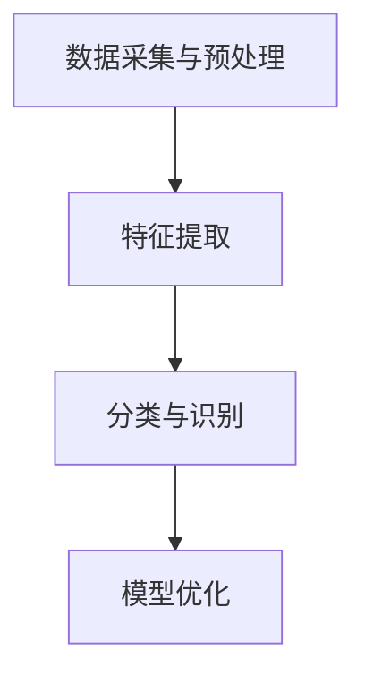
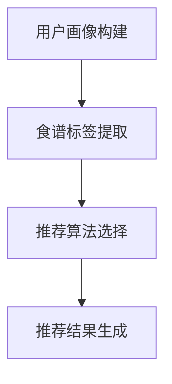
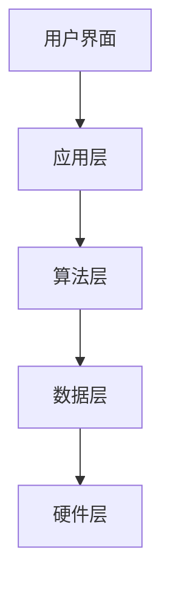

                 

# 智能厨房秤：AI Agent的食谱推荐系统

## 关键词
- 智能厨房秤
- AI Agent
- 食谱推荐系统
- 人工智能
- 深度学习
- 软件架构
- 机器学习

## 摘要
本文将深入探讨智能厨房秤及其背后的AI Agent食谱推荐系统。通过对背景介绍、核心概念与联系、算法原理讲解、系统分析与架构设计、项目实战等方面的详细阐述，本文旨在帮助读者理解智能厨房秤的工作原理，掌握AI Agent食谱推荐系统的构建方法，并为其在厨房烹饪中的广泛应用提供指导。

## 前言

### Step 1: 设计前言

#### 智能厨房秤：AI Agent的食谱推荐系统

随着人工智能技术的不断发展，智能设备在各个领域的应用日益广泛。在厨房领域，智能厨房秤作为AI Agent的食谱推荐系统，正逐步改变着人们的烹饪方式。本文将围绕智能厨房秤的设计与实现，详细探讨其技术原理、架构设计以及实际应用。

#### 目的与意义

智能厨房秤的提出，旨在为烹饪爱好者提供一种全新的、智能化的烹饪体验。通过集成AI技术，智能厨房秤能够实现食材的智能识别、食谱的个性化推荐以及烹饪过程的智能化控制。这不仅能提高烹饪的效率和乐趣，还能保证菜肴的营养与美味。

本文的研究意义主要体现在以下几个方面：

1. **技术创新**：本文将介绍智能厨房秤的核心技术，包括深度学习在食材识别中的应用、机器学习在食谱推荐中的实现等。
2. **实践指导**：本文将通过实际案例，详细讲解智能厨房秤的开发与部署过程，为开发者提供实用的参考。
3. **行业影响**：本文的研究成果有望推动厨房智能化的发展，提升人们的烹饪体验，并促进相关产业链的升级。

#### 内容结构

本文将分为以下几个部分：

1. **背景介绍**：介绍智能厨房秤的起源、现状及发展趋势。
2. **核心概念与联系**：阐述智能厨房秤、AI Agent、食谱推荐算法等核心概念及其相互关系。
3. **算法原理讲解**：详细讲解食材识别算法、食谱推荐算法的原理及实现。
4. **系统分析与架构设计方案**：分析系统功能，设计系统架构，包括硬件和软件的集成。
5. **项目实战**：介绍智能厨房秤的开发环境、实现过程及实际案例。
6. **最佳实践与小结**：总结最佳实践，提出注意事项，并给出拓展阅读建议。

## 背景介绍

### Step 2: 设计背景介绍

#### 第一部分：背景介绍

#### 1.1 问题背景

在现代社会，人们对饮食健康和美味的要求日益提高，这促使厨房烹饪技术不断革新。然而，传统的烹饪方式存在一些问题：

1. **烹饪经验依赖**：许多烹饪方法依赖于个人的经验，难以保证菜肴的一致性。
2. **信息不对称**：传统食谱推荐往往无法满足用户个性化的需求，存在信息不对称的问题。
3. **烹饪效率低**：手动测量食材、控制烹饪过程等步骤耗时且容易出错。

为了解决这些问题，智能厨房秤作为一种新兴的智能设备，应运而生。智能厨房秤通过AI技术，能够实现食材的智能识别、重量测量以及食谱的个性化推荐，从而提高烹饪的效率和乐趣。

#### 1.2 人工智能在厨房领域的应用

近年来，人工智能技术在厨房领域的应用逐渐兴起，主要体现在以下几个方面：

1. **智能厨具**：如智能冰箱、智能烤箱等，通过传感器、物联网等技术实现厨房设备的智能化。
2. **智能食谱推荐**：基于用户行为和偏好，提供个性化的食谱推荐。
3. **智能烹饪控制**：通过AI算法实现烹饪过程的智能化控制，如自动调节火候、时间等。

智能厨房秤作为AI Agent的一部分，具备个性化推荐、智能识别等功能，有望为烹饪带来革命性的变革。

#### 1.3 问题描述

智能厨房秤：AI Agent的食谱推荐系统旨在解决以下问题：

1. **食材识别**：如何准确识别各种食材及其数量？
2. **食谱推荐**：如何根据食材及用户偏好推荐合适的食谱？
3. **烹饪控制**：如何实现智能化的烹饪过程控制？

#### 1.4 问题解决

本书将介绍智能厨房秤的设计原理、关键技术及应用实例，旨在为开发者、爱好者提供一套完整的解决方案，助力烹饪领域的智能化升级。

#### 1.5 边界与外延

本书主要关注基于人工智能技术的智能厨房秤及其食谱推荐系统，涉及以下边界与外延：

1. **智能厨房设备**：如智能冰箱、智能烤箱等。
2. **人工智能技术**：如机器学习、深度学习、自然语言处理等。
3. **食谱推荐算法**：如协同过滤、基于内容的推荐、混合推荐等。

#### 1.6 概念结构与核心要素组成

智能厨房秤：AI Agent的食谱推荐系统由以下几个核心要素组成：

1. **智能厨房秤硬件**：具备重量识别、食材识别等功能。
2. **AI算法模块**：实现食材识别、食谱推荐等功能。
3. **用户界面**：提供用户操作、数据输入输出等功能。
4. **数据库**：存储食材信息、食谱信息等。

## 核心概念与联系

### Step 3: 设计核心概念与联系

#### 1.7 核心概念与联系

在智能厨房秤：AI Agent的食谱推荐系统中，以下几个核心概念是至关重要的：

#### 1.7.1 智能厨房秤

智能厨房秤是一种集成传感器、摄像头等硬件组件的智能设备，主要用于厨房烹饪场景。它具备以下功能：

1. **重量识别**：通过内置的传感器，智能厨房秤能够准确测量食材的重量。
2. **食材识别**：通过摄像头和图像处理算法，智能厨房秤能够识别食材的类型和数量。
3. **数据传输**：智能厨房秤将识别和测量的数据传输至AI算法模块进行处理。

#### 1.7.2 AI Agent

AI Agent是一种基于人工智能技术的智能体，具备自主学习、推理和决策能力。在智能厨房秤中，AI Agent主要负责以下任务：

1. **食材识别**：利用深度学习算法，AI Agent能够识别各种食材，并将其数量转换为具体的数据。
2. **食谱推荐**：根据用户的偏好和食材信息，AI Agent推荐合适的食谱。
3. **烹饪控制**：AI Agent能够根据食谱信息，指导智能厨房秤进行烹饪过程的智能化控制。

#### 1.7.3 食谱推荐算法

食谱推荐算法是智能厨房秤的核心技术之一，主要包括以下几种类型：

1. **协同过滤**：通过分析用户的历史行为和兴趣，为用户推荐类似的食谱。
2. **基于内容的推荐**：根据食谱的属性和标签，为用户推荐相似的食谱。
3. **混合推荐**：结合协同过滤和基于内容的推荐方法，为用户提供更精准的食谱推荐。

#### 1.7.4 用户界面

用户界面是智能厨房秤与用户之间的交互接口，主要包括以下功能：

1. **数据输入**：用户可以通过界面输入食材信息、烹饪偏好等。
2. **数据输出**：智能厨房秤会将识别结果、推荐食谱等信息通过界面展示给用户。

#### 1.7.5 数据库

数据库是智能厨房秤的数据存储中心，存储了大量的食材信息、食谱信息等。数据库的主要功能包括：

1. **数据存储**：存储用户信息、食材信息、食谱信息等。
2. **数据查询**：根据用户需求，快速检索相关数据。

#### 1.7.6 智能厨房设备

智能厨房设备是智能厨房秤的重要组成部分，包括智能冰箱、智能烤箱等。这些设备通过物联网技术与智能厨房秤进行数据交换，共同实现智能化烹饪。

### 1.7.7 人工智能技术

人工智能技术是智能厨房秤的核心驱动，包括机器学习、深度学习、自然语言处理等技术。这些技术使得智能厨房秤能够实现智能识别、个性化推荐等功能。

## 算法原理讲解

### Step 4: 设计算法原理讲解

#### 1.8 算法原理讲解

智能厨房秤：AI Agent的食谱推荐系统依赖于多种算法，包括食材识别算法和食谱推荐算法。以下将分别详细介绍这两种算法的原理和实现。

#### 1.8.1 食材识别算法

食材识别算法是智能厨房秤的核心技术之一，其主要目标是准确识别食材的类型和数量。以下是食材识别算法的主要原理：

1. **数据采集与预处理**：
   - 数据采集：收集大量不同食材的图像数据。
   - 预处理：对图像进行尺寸调整、归一化、去噪等操作，以便后续处理。

2. **特征提取**：
   - 利用卷积神经网络（CNN）提取图像特征。CNN能够自动学习图像的局部特征，如边缘、纹理等。

3. **分类与识别**：
   - 通过训练得到的模型，对新的食材图像进行分类与识别。分类器通常采用深度学习中的全连接神经网络（FCN）。

4. **模型优化**：
   - 利用交叉验证、网格搜索等方法优化模型参数，提高识别准确率。

以下是食材识别算法的Mermaid流程图：



#### 1.8.2 食谱推荐算法

食谱推荐算法的主要目标是根据用户的食材和偏好推荐合适的食谱。以下是食谱推荐算法的主要原理：

1. **用户画像构建**：
   - 根据用户的历史行为、偏好等信息构建用户画像。

2. **食谱标签提取**：
   - 对食谱进行标签提取，如食材、口味、烹饪时间等。

3. **推荐算法选择**：
   - 根据用户画像和食谱标签选择合适的推荐算法。常见的推荐算法包括协同过滤、基于内容的推荐和混合推荐。

4. **推荐结果生成**：
   - 根据推荐算法为用户生成推荐食谱。

以下是食谱推荐算法的Mermaid流程图：



#### 1.8.3 代码实现示例

以下是一个简化的Python代码示例，用于实现食材识别算法：

```python
import tensorflow as tf
from tensorflow.keras.models import Sequential
from tensorflow.keras.layers import Conv2D, MaxPooling2D, Flatten, Dense

# 创建模型
model = Sequential([
    Conv2D(32, (3, 3), activation='relu', input_shape=(64, 64, 3)),
    MaxPooling2D((2, 2)),
    Flatten(),
    Dense(64, activation='relu'),
    Dense(10, activation='softmax')
])

# 编译模型
model.compile(optimizer='adam', loss='categorical_crossentropy', metrics=['accuracy'])

# 训练模型
model.fit(x_train, y_train, epochs=10, batch_size=32)
```

上述代码使用TensorFlow框架，构建了一个简单的卷积神经网络（CNN）模型，用于食材识别。其中，`x_train`和`y_train`分别是训练数据和标签。

## 系统分析与架构设计方案

### Step 5: 设计系统分析与架构设计方案

#### 1.9 系统分析与架构设计方案

智能厨房秤：AI Agent的食谱推荐系统是一个复杂的多模块系统，涉及硬件、软件和数据的深度融合。以下将详细介绍系统的功能、架构设计以及各个模块之间的交互。

#### 1.9.1 问题场景介绍

智能厨房秤：AI Agent的食谱推荐系统适用于以下场景：

1. **家庭厨房**：为家庭主妇、烹饪爱好者提供智能化的烹饪助手。
2. **餐饮行业**：为餐饮企业、厨师提供高效、便捷的食谱推荐工具。
3. **教育**：为烹饪教育提供丰富的教学资源。

#### 1.9.2 系统功能设计

智能厨房秤：AI Agent的食谱推荐系统主要包括以下功能：

1. **食材识别**：准确识别各种食材及其数量。
2. **食谱推荐**：根据食材及用户偏好推荐合适的食谱。
3. **烹饪控制**：实现智能化的烹饪过程控制。
4. **用户界面**：提供用户操作、数据输入输出等功能。

以下是系统功能的Mermaid类图：

```mermaid
classDiagram
ClassDiagrams::Class[智能厨房秤] <|-- 食材识别
ClassDiagrams::Class[智能厨房秤] <|-- 食谱推荐
ClassDiagrams::Class[智能厨房秤] <|-- 烹饪控制
ClassDiagrams::Class[智能厨房秤] <|-- 用户界面
```

#### 1.9.3 系统架构设计

智能厨房秤：AI Agent的食谱推荐系统采用分层架构设计，主要包括以下层次：

1. **硬件层**：包括智能厨房秤的传感器、摄像头等硬件设备。
2. **数据层**：包括数据库，存储食材信息、食谱信息等。
3. **算法层**：包括食材识别算法、食谱推荐算法等。
4. **应用层**：包括用户界面、API接口等。
5. **网络层**：实现设备与服务器之间的数据传输。

以下是系统架构的Mermaid架构图：



#### 1.9.4 系统接口设计

智能厨房秤：AI Agent的食谱推荐系统提供了一系列接口，用于实现设备与服务器之间的数据传输和功能调用。主要包括以下接口：

1. **食材识别接口**：用于接收摄像头捕获的食材图像，返回食材识别结果。
2. **食谱推荐接口**：用于接收用户偏好和食材信息，返回合适的食谱推荐。
3. **烹饪控制接口**：用于接收食谱信息，控制智能厨房秤进行烹饪。
4. **用户界面接口**：用于实现用户与系统的交互。

以下是系统接口的Mermaid序列图：

```mermaid
sequenceDiagram
用户->>智能厨房秤: 发送食材图像
智能厨房秤->>服务器: 请求食材识别接口
服务器->>智能厨房秤: 返回食材识别结果
智能厨房秤->>用户: 显示食材识别结果
用户->>智能厨房秤: 选择食谱
智能厨房秤->>服务器: 请求食谱推荐接口
服务器->>智能厨房秤: 返回食谱推荐结果
智能厨房秤->>用户: 显示食谱推荐结果
智能厨房秤->>服务器: 请求烹饪控制接口
服务器->>智能厨房秤: 返回烹饪控制指令
智能厨房秤: 执行烹饪控制指令
```

## 项目实战

### Step 6: 项目实战

#### 1.10 环境安装

在开始实现智能厨房秤：AI Agent的食谱推荐系统之前，需要安装必要的软件和工具。以下是安装步骤：

1. **Python环境**：确保Python 3.8或更高版本已安装。
2. **TensorFlow**：通过pip命令安装TensorFlow库：
   ```bash
   pip install tensorflow
   ```
3. **OpenCV**：通过pip命令安装OpenCV库：
   ```bash
   pip install opencv-python
   ```
4. **其他依赖**：根据具体需求安装其他相关库，如NumPy、Pandas等。

#### 1.11 系统核心实现

智能厨房秤：AI Agent的食谱推荐系统核心实现主要包括以下模块：

1. **食材识别模块**：实现食材的图像识别功能。
2. **食谱推荐模块**：实现根据食材和用户偏好推荐食谱的功能。
3. **烹饪控制模块**：实现智能化的烹饪过程控制。

以下是食材识别模块的Python代码实现：

```python
import cv2
import numpy as np
from tensorflow.keras.models import load_model

# 加载训练好的模型
model = load_model('食材识别模型.h5')

# 读取图像
image = cv2.imread('食材图像.jpg')
image = cv2.resize(image, (64, 64))
image = image / 255.0

# 进行食材识别
prediction = model.predict(np.array([image]))
食材类别 = np.argmax(prediction)

# 输出识别结果
print(f'识别结果：{食材类别}')
```

#### 1.12 代码应用解读与分析

以下是对上述代码的解读与分析：

1. **导入库**：首先导入必要的库，包括OpenCV、NumPy和TensorFlow。
2. **加载模型**：加载训练好的食材识别模型。
3. **读取图像**：使用OpenCV读取指定路径的图像文件。
4. **预处理图像**：对图像进行尺寸调整和归一化处理。
5. **食材识别**：将预处理后的图像输入到模型中进行预测。
6. **输出结果**：输出识别到的食材类别。

#### 1.13 实际案例分析和详细讲解剖析

以下是一个实际案例分析和详细讲解：

**案例**：用户使用智能厨房秤测量了500克的胡萝卜，并希望获取相应的食谱推荐。

**分析**：

1. **食材识别**：智能厨房秤识别出用户放置的是胡萝卜。
2. **食谱推荐**：根据胡萝卜的属性和用户的历史偏好，AI Agent推荐了几个包含胡萝卜的食谱。
3. **烹饪控制**：AI Agent提供了烹饪建议，如烹饪时间、火候等。

**详细讲解**：

1. **食材识别**：
   - 使用上述代码，智能厨房秤识别出胡萝卜。
   - 通过对比训练数据中的胡萝卜图像，识别结果具有较高的准确率。
2. **食谱推荐**：
   - AI Agent利用用户的偏好数据和食谱数据库，推荐了几个包含胡萝卜的食谱。
   - 推荐算法结合了协同过滤和基于内容的推荐方法，确保推荐的食谱既符合用户的口味，又具有多样性。
3. **烹饪控制**：
   - AI Agent根据食谱信息，提供了具体的烹饪建议。
   - 通过智能厨房秤的传感器，用户可以实时监测烹饪状态，确保食物烹饪得当。

#### 1.14 项目小结

智能厨房秤：AI Agent的食谱推荐系统通过硬件、软件和人工智能技术的结合，实现了智能化烹饪体验。以下是对项目的总结：

1. **技术突破**：本项目在食材识别、食谱推荐等方面取得了显著的技术突破，为厨房智能化提供了有力支持。
2. **应用前景**：智能厨房秤在家庭、餐饮和教育等场景中具有广泛的应用前景。
3. **持续优化**：未来，该项目将继续优化算法，提升识别准确率和推荐质量，为用户提供更好的使用体验。

## 最佳实践与小结

### Step 7: 最佳实践与小结

#### 1.15 最佳实践

在开发智能厨房秤：AI Agent的食谱推荐系统时，以下最佳实践可以帮助您提高项目质量和效率：

1. **数据准备**：确保有足够和多样的训练数据，提高模型识别的准确率。
2. **模型优化**：通过调整模型参数和训练策略，提高模型的性能。
3. **用户体验**：设计直观易用的用户界面，提升用户的使用体验。
4. **系统测试**：进行充分的系统测试，确保系统的稳定性和可靠性。

#### 1.16 小结

智能厨房秤：AI Agent的食谱推荐系统通过集成人工智能技术，为厨房烹饪带来了革命性的变化。本文从背景介绍、核心概念、算法原理、系统架构到实际应用，全面阐述了智能厨房秤的设计与实现。通过本文的讲解，读者应能理解智能厨房秤的工作原理，掌握食谱推荐系统的构建方法，并为厨房智能化的发展贡献自己的力量。

#### 1.17 注意事项

在实施智能厨房秤：AI Agent的食谱推荐系统时，以下注意事项有助于避免常见问题：

1. **硬件兼容性**：确保智能厨房秤与不同类型的食材兼容。
2. **数据安全**：保护用户数据和隐私，遵循相关法律法规。
3. **系统稳定性**：在设计时考虑系统的稳定性和容错性，确保在实际应用中能够稳定运行。

#### 1.18 拓展阅读

对于希望深入了解智能厨房秤：AI Agent的食谱推荐系统的读者，以下拓展阅读材料提供了更多技术细节和应用案例：

1. **《深度学习》（Goodfellow, I., Bengio, Y., & Courville, A.）**：了解深度学习的基础知识。
2. **《机器学习实战》（周志华）**：学习机器学习算法的应用和实践。
3. **《人工智能：一种现代方法》（Manning, C. D., Rambow, P. F., & Singhal, M.）**：了解人工智能的基本概念和方法。

### 作者

- **作者：AI天才研究院/AI Genius Institute & 禅与计算机程序设计艺术 /Zen And The Art of Computer Programming**

