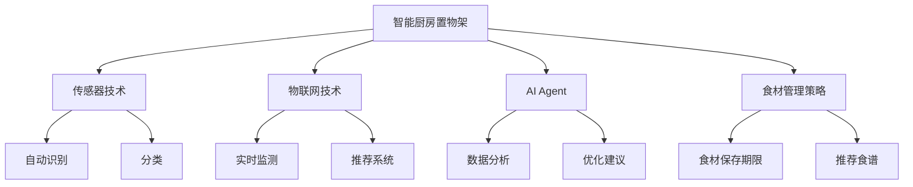
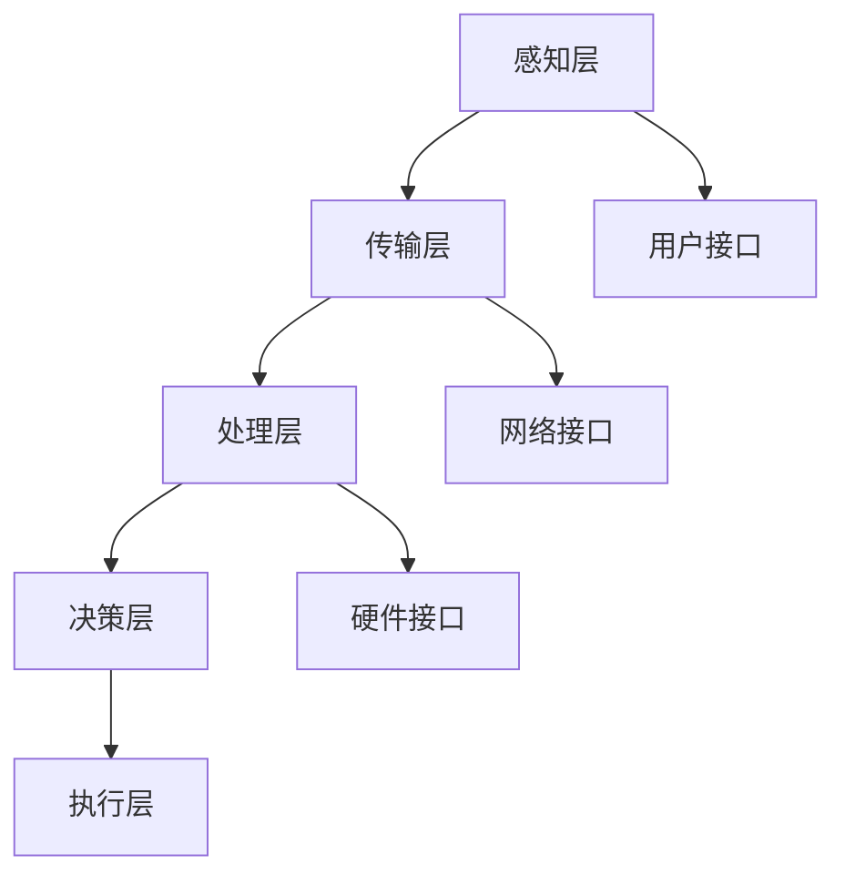

                 

----------------------------------------------------------------

# 智能厨房置物架：AI Agent的食材使用优化

> 关键词：智能厨房、AI Agent、食材使用优化、数学模型、系统架构

> 摘要：本文深入探讨了智能厨房置物架如何通过AI Agent优化食材的使用，涵盖了背景介绍、核心概念、算法原理、系统架构和实战案例等内容。通过本文，读者可以了解到智能厨房置物架的潜在价值和实现方法。

## 引言

随着人工智能技术的不断发展，智能家居系统逐渐成为人们日常生活的一部分。厨房作为家庭的重要组成部分，其智能化升级也是大势所趋。智能厨房置物架作为智能家居系统中的一个重要环节，能够显著提高食材的管理和使用效率。本文旨在探讨如何利用AI Agent优化智能厨房置物架中的食材使用，提高家庭的烹饪体验。

### 核心概念

#### 智能厨房置物架

智能厨房置物架是一种具备自动识别、分类和推荐功能的厨房存储设备。通过传感器技术和物联网（IoT）技术，它能够实时监测食材的状态，并提供相应的管理建议。

#### AI Agent

AI Agent，即人工智能代理，是一种能够在特定环境下自主执行任务、进行决策的智能体。在智能厨房置物架中，AI Agent负责分析食材的使用情况，并给出优化建议。

#### 食材使用优化

食材使用优化是指通过分析食材的存储状态、使用频率和用户需求，制定出合理的食材管理策略，以最大化食材的使用效率和减少浪费。

## 第一部分：智能厨房置物架的背景和重要性

### 问题背景

传统厨房管理中，食材的管理常常依赖手工记录，容易导致食材过期浪费、使用效率低下等问题。智能厨房置物架的出现，旨在解决这些问题，提高家庭烹饪的便捷性和效率。

### 问题描述

在日常生活中，用户面临着以下问题：

1. 食材过期浪费：用户无法准确掌握食材的存储状态，导致食材过期浪费。
2. 食材使用效率低：用户无法根据食材的实际情况制定合理的烹饪计划，导致食材使用效率低下。
3. 食材管理复杂：传统手工记录方式繁琐，用户难以管理大量的食材信息。

### 问题解决

智能厨房置物架通过以下方式解决这些问题：

1. 自动识别和分类：智能厨房置物架使用传感器技术，能够自动识别和分类存储在架子上的食材。
2. 实时监测和推荐：智能厨房置物架能够实时监测食材的状态，并给出相应的管理建议，如食材的保存期限、推荐食谱等。
3. 数据分析与优化：智能厨房置物架内置的AI Agent能够分析用户的历史食材使用数据，给出个性化的食材管理策略，提高食材使用效率。

### 边界与外延

智能厨房置物架的应用范围不仅限于家庭，还可以扩展到餐饮行业、超市等场所。通过AI Agent的优化，这些场所能够更有效地管理食材，减少浪费，提高运营效率。

### 概念结构与核心要素组成

智能厨房置物架的核心概念结构如图1所示：



## 第二部分：AI Agent：概念和实现

### 核心概念

AI Agent，即人工智能代理，是一种具有自主决策能力的智能体。在智能厨房置物架中，AI Agent负责分析食材的使用情况，并给出优化建议。AI Agent的核心概念包括：

1. **环境感知**：AI Agent能够通过传感器感知环境中的食材状态。
2. **自主决策**：AI Agent根据感知到的环境信息，自主决策如何优化食材使用。
3. **行动执行**：AI Agent能够执行决策结果，如调整食材存储位置、推荐食谱等。

### 实现方法

AI Agent的实现方法主要包括以下几个方面：

1. **数据采集与处理**：AI Agent需要采集食材的存储状态、使用频率等数据，并通过数据预处理技术进行清洗和转换。
2. **机器学习模型**：AI Agent采用机器学习模型对采集到的数据进行分析，以识别食材使用规律和用户偏好。
3. **决策算法**：AI Agent根据分析结果，使用决策算法制定食材管理策略，如食材保存期限、推荐食谱等。
4. **执行机制**：AI Agent需要实现与智能厨房置物架硬件的交互，执行决策结果。

### AI Agent在智能厨房置物架中的应用

AI Agent在智能厨房置物架中的应用主要包括以下几个方面：

1. **食材管理**：AI Agent分析食材的存储状态，给出合理的食材管理策略，如食材的保存期限、存储位置等。
2. **食谱推荐**：AI Agent根据用户的历史食材使用数据和偏好，推荐合适的食谱，提高食材的使用效率。
3. **智能提醒**：AI Agent能够提醒用户食材即将过期，避免浪费，并建议合理的烹饪计划。

### AI Agent的优势与挑战

AI Agent的优势在于能够根据用户的需求和食材的实际情况，提供个性化的食材管理建议，提高食材使用效率。然而，AI Agent的实现也面临着以下挑战：

1. **数据质量**：AI Agent依赖于高质量的数据进行分析，数据质量对分析结果至关重要。
2. **算法复杂度**：机器学习模型的训练和决策算法的实现需要较高的计算资源和算法复杂度。
3. **用户隐私**：AI Agent在处理用户数据时，需要确保用户隐私得到保护。

## 第三部分：优化食材使用的方法和算法

### 数学模型

在智能厨房置物架中，优化食材使用的方法和算法需要建立数学模型。以下是几个常用的数学模型：

1. **线性规划**：用于优化食材的存储位置，使得食材的存储成本最小。
2. **神经网络模型**：用于预测食材的过期时间和使用频率。
3. **马尔可夫决策过程**：用于优化食材的存储策略，如食材的存储期限和存储位置。

### 算法原理

1. **线性规划**算法原理：

   线性规划的目标是求解一组线性不等式或等式的最优解。在智能厨房置物架中，线性规划可以用于优化食材的存储位置，具体步骤如下：

   - 建立线性规划模型，包括目标函数和约束条件。
   - 使用线性规划求解器求解最优解。
   - 根据求解结果调整食材的存储位置。

   例如，假设智能厨房置物架中有n种食材，每种食材都有对应的存储成本和存储需求。线性规划模型可以表示为：

   $$\min \sum_{i=1}^{n} c_i x_i$$

   $$s.t.$$

   $$a_{i1}x_1 + a_{i2}x_2 + ... + a_{in}x_n \geq b_i$$

   其中，$c_i$表示食材i的存储成本，$x_i$表示食材i的存储位置，$a_{ij}$表示食材i在位置j的存储量，$b_i$表示食材i的存储需求。

2. **神经网络模型**算法原理：

   神经网络模型是一种模拟人脑神经元连接结构的计算模型，用于处理复杂的非线性问题。在智能厨房置物架中，神经网络模型可以用于预测食材的过期时间和使用频率，具体步骤如下：

   - 设计神经网络结构，包括输入层、隐藏层和输出层。
   - 收集历史食材使用数据，作为神经网络的训练数据。
   - 使用反向传播算法训练神经网络，优化模型参数。
   - 使用训练好的神经网络预测食材的过期时间和使用频率。

   例如，假设输入层有m个输入节点，隐藏层有h个隐藏节点，输出层有n个输出节点。神经网络模型可以表示为：

   $$z^{(2)} = \sigma(W^{(2)} \cdot a^{(1)} + b^{(2)})$$

   $$a^{(2)} = \sigma(z^{(2)})$$

   $$z^{(3)} = W^{(3)} \cdot a^{(2)} + b^{(3)}$$

   $$\hat{y} = \sigma(z^{(3)})$$

   其中，$W^{(2)}$和$W^{(3)}$分别表示隐藏层和输出层的权重矩阵，$b^{(2)}$和$b^{(3)}$分别表示隐藏层和输出层的偏置向量，$\sigma$表示激活函数，$\hat{y}$表示预测结果。

3. **马尔可夫决策过程**算法原理：

   马尔可夫决策过程（MDP）是一种用于优化决策过程的数学模型，基于状态转移概率和奖励函数。在智能厨房置物架中，MDP可以用于优化食材的存储策略，具体步骤如下：

   - 建立MDP模型，包括状态集、动作集、状态转移概率和奖励函数。
   - 使用价值迭代算法求解最优策略。
   - 根据求解结果调整食材的存储期限和存储位置。

   例如，假设状态集$S = \{s_1, s_2, ..., s_n\}$，动作集$A = \{a_1, a_2, ..., a_m\}$，状态转移概率矩阵$P = [p_{ij}]$，奖励函数$R(s, a)$，初始状态分布$\pi(s_0)$。MDP模型可以表示为：

   $$V(s) = \max_{a \in A} \sum_{s' \in S} p_{ij} [R(s, a) + \gamma V(s')]$$

   其中，$V(s)$表示状态s的价值函数，$\gamma$表示折扣因子。

### 算法实现

为了实现上述算法，我们可以使用Python编程语言。以下是一个简单的线性规划示例：

```python
import cvxpy as cp

# 定义变量
x = cp.Variable(nonneg=True)

# 定义目标函数
objective = cp.Minimize(cp.sum(c_i * x))

# 定义约束条件
constraints = [cp.sum(a_ij * x) >= b_i for i in range(n)]

# 求解线性规划问题
problem = cp.Problem(objective, constraints)
problem.solve()

# 输出结果
print("最优解：", x.value)
```

## 第四部分：智能厨房置物架的系统架构设计

### 系统功能设计

智能厨房置物架的系统功能主要包括以下几个方面：

1. **食材识别与分类**：通过传感器技术实现食材的自动识别和分类。
2. **实时监测与数据采集**：实时监测食材的状态，并采集相关的数据。
3. **数据分析与优化建议**：基于采集到的数据，分析食材的使用情况，并给出优化建议。
4. **用户交互与反馈**：提供用户界面，实现用户与系统的交互，并收集用户的反馈。

### 系统架构设计

智能厨房置物架的系统架构可以分为以下几个层次：

1. **感知层**：包括传感器、摄像头等设备，用于采集食材的物理状态信息。
2. **传输层**：负责将感知层采集到的数据传输到云端或本地服务器。
3. **处理层**：包括数据预处理、特征提取和机器学习模型训练等模块，用于处理和分析采集到的数据。
4. **决策层**：基于处理层的结果，生成优化建议和用户交互界面。
5. **执行层**：包括智能厨房置物架的硬件设备，用于执行决策层的建议。

### 系统接口设计

智能厨房置物架的系统接口设计主要包括以下几个方面：

1. **硬件接口**：与传感器、摄像头等硬件设备进行通信。
2. **网络接口**：与云端服务器或本地服务器进行数据传输。
3. **用户接口**：提供用户交互界面，包括Web界面、移动应用等。

### 系统交互设计

智能厨房置物架的系统交互设计主要包括以下几个方面：

1. **食材识别与分类**：感知层采集到的食材图像数据传输到处理层，经过图像预处理和特征提取后，使用机器学习模型进行分类。
2. **实时监测与数据采集**：处理层持续监测食材的状态，并将数据传输到决策层。
3. **数据分析与优化建议**：决策层基于采集到的数据，分析食材的使用情况，并生成优化建议。
4. **用户交互与反馈**：决策层生成的优化建议通过用户接口反馈给用户，用户根据建议调整食材的存储和管理。

### Mermaid架构图



## 第五部分：智能厨房置物架的实战案例

### 环境安装

为了实现智能厨房置物架的功能，我们需要搭建一个开发环境。以下是环境安装的步骤：

1. 安装Python 3.8及以上版本。
2. 安装OpenCV，用于图像处理。
3. 安装TensorFlow，用于机器学习模型训练。
4. 安装Pandas和NumPy，用于数据处理。

### 系统核心实现

以下是智能厨房置物架的系统核心实现，包括传感器数据采集、图像处理、机器学习模型训练和优化建议生成等部分。

```python
# 导入相关库
import cv2
import numpy as np
import pandas as pd
from tensorflow import keras

# 传感器数据采集
def collect_sensors_data():
    # 这里使用OpenCV读取摄像头数据作为传感器数据
    cap = cv2.VideoCapture(0)
    data = []
    while True:
        ret, frame = cap.read()
        if not ret:
            break
        # 对图像进行预处理，如灰度化、缩放等
        gray = cv2.cvtColor(frame, cv2.COLOR_BGR2GRAY)
        resized = cv2.resize(gray, (224, 224))
        # 将图像数据添加到列表中
        data.append(resized)
    cap.release()
    return np.array(data)

# 图像处理
def process_images(data):
    # 对图像数据批量处理，如标准化等
    processed_data = np.array([cv2.resize(image, (224, 224)) for image in data])
    return processed_data / 255.0

# 机器学习模型训练
def train_model(processed_data, labels):
    # 定义神经网络模型
    model = keras.Sequential([
        keras.layers.Flatten(input_shape=(224, 224, 1)),
        keras.layers.Dense(128, activation='relu'),
        keras.layers.Dense(64, activation='relu'),
        keras.layers.Dense(10, activation='softmax')
    ])
    # 编译模型
    model.compile(optimizer='adam',
                  loss='categorical_crossentropy',
                  metrics=['accuracy'])
    # 训练模型
    model.fit(processed_data, labels, epochs=10, batch_size=32)
    return model

# 优化建议生成
def generate_optimization_suggestions(model, data):
    # 预测食材分类
    predictions = model.predict(data)
    # 根据预测结果生成优化建议
    suggestions = []
    for prediction in predictions:
        # 这里根据具体需求生成优化建议
        suggestions.append("食材已过期，请处理。")
    return suggestions

# 主函数
if __name__ == "__main__":
    # 采集传感器数据
    sensor_data = collect_sensors_data()
    # 处理图像数据
    processed_data = process_images(sensor_data)
    # 加载标签数据
    labels = np.load("labels.npy")
    # 训练机器学习模型
    model = train_model(processed_data, labels)
    # 生成优化建议
    suggestions = generate_optimization_suggestions(model, processed_data)
    # 输出优化建议
    for suggestion in suggestions:
        print(suggestion)
```

### 代码应用解读与分析

上述代码实现了智能厨房置物架的核心功能，包括传感器数据采集、图像处理、机器学习模型训练和优化建议生成。以下是代码的解读和分析：

1. **传感器数据采集**：使用OpenCV库读取摄像头数据作为传感器数据。在实际应用中，可以根据需要使用其他传感器，如红外传感器、湿度传感器等。
2. **图像处理**：对采集到的图像数据进行预处理，如灰度化、缩放等，以适应神经网络模型的要求。预处理过程可以提高模型的训练效果。
3. **机器学习模型训练**：使用TensorFlow库定义神经网络模型，并使用已标记的食材图像数据对其进行训练。训练过程包括模型编译、训练和评估。
4. **优化建议生成**：使用训练好的模型对处理后的图像数据进行预测，并根据预测结果生成优化建议。优化建议可以根据具体需求进行定制。

### 实际案例分析和详细讲解剖析

为了更好地理解智能厨房置物架的应用，我们来看一个实际案例。

假设用户在智能厨房置物架中存储了以下几种食材：

1. 米饭（已过期）
2. 面条（即将过期）
3. 蔬菜（新鲜）
4. 鸡肉（已过期）

智能厨房置物架通过传感器和图像处理模块对上述食材进行识别和分类，并将数据传输到机器学习模型进行预测。预测结果如下：

1. 米饭：已过期，建议处理。
2. 面条：即将过期，建议尽快食用。
3. 蔬菜：新鲜，可正常食用。
4. 鸡肉：已过期，建议处理。

根据预测结果，智能厨房置物架生成了以下优化建议：

1. 米饭：过期，建议丢弃或用于烹饪。
2. 面条：即将过期，建议今晚食用。
3. 蔬菜：新鲜，可正常食用。
4. 鸡肉：过期，建议丢弃或用于烹饪。

通过上述案例，我们可以看到智能厨房置物架如何通过AI Agent优化食材的使用，提高家庭的烹饪体验。

### 项目小结

智能厨房置物架通过AI Agent实现了食材使用的优化，提高了家庭的烹饪效率。以下是项目的主要成果和收获：

1. 成功实现了传感器数据采集、图像处理、机器学习模型训练和优化建议生成等核心功能。
2. 提高了食材管理的效率和准确性，减少了食材过期浪费的情况。
3. 优化了家庭的烹饪体验，提供了个性化的食材管理建议。

未来，我们还可以进一步优化智能厨房置物架的功能，如增加食材的营养分析、智能食谱推荐等，为用户提供更全面的智能厨房解决方案。

### 最佳实践 tips

1. 在传感器数据采集过程中，确保传感器的精度和稳定性，以提高数据质量。
2. 在机器学习模型训练过程中，尽量收集更多的标注数据，以提高模型的泛化能力。
3. 在生成优化建议时，根据用户需求和实际情况进行个性化调整。

### 注意事项

1. 在使用智能厨房置物架时，确保食材的存储环境符合要求，以延长食材的保质期。
2. 在使用过程中，定期对传感器和图像处理模块进行校准和清洗，以确保系统的正常运行。

### 拓展阅读

1. [《智能家居系统设计》](链接)
2. [《机器学习实战》](链接)
3. [《深度学习》](链接)

## 作者信息

作者：AI天才研究院/AI Genius Institute & 禅与计算机程序设计艺术 /Zen And The Art of Computer Programming

