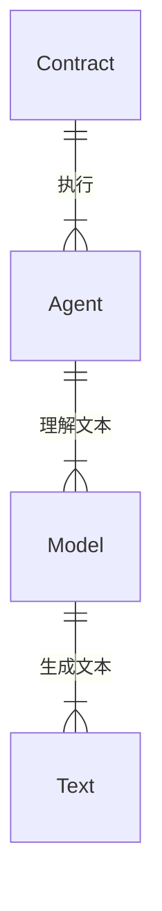
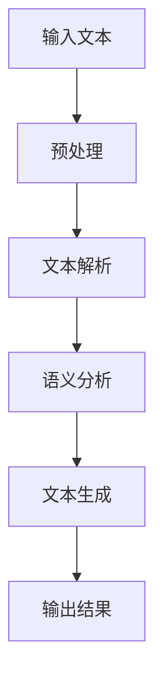
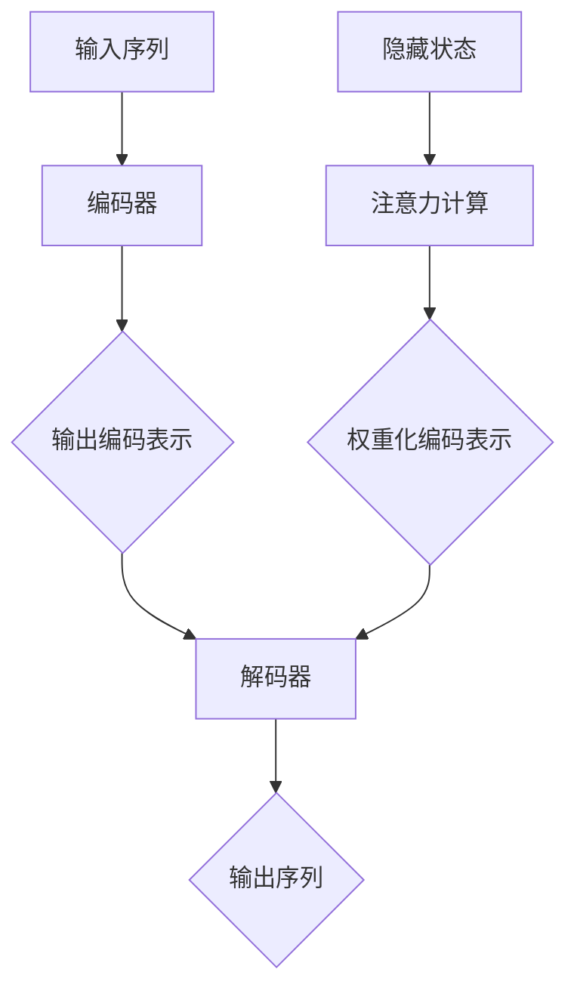

                 

### 第一部分: 书籍概述

### 第1章: 书籍背景与主题

随着区块链技术的迅速发展和普及，智能合同作为一种自主执行合同条款的计算机程序，逐渐成为人们关注的焦点。智能合同不仅能够提高合同执行效率，降低成本，还能够确保合同条款的透明性和不可篡改性。然而，智能合同的开发和应用面临着法律文本理解这一重大挑战。法律文本往往复杂且冗长，涉及众多专业术语和法律法规，如何有效地理解法律文本，使其与智能合同执行相匹配，成为了一个亟待解决的问题。

本书籍的核心目标是探讨如何利用人工智能技术，特别是大语言模型（LLM），来解决智能合同分析中的法律文本理解问题。通过系统的研究和案例分析，本书希望能够为智能合同开发者提供一种有效的解决方案，从而推动智能合同在法律领域的发展和应用。

本书的结构安排如下：

- **第一部分：书籍概述**：介绍书籍的背景、主题、问题解决思路、关键概念和目标读者群体。
- **第二部分：核心概念与原理**：详细讲解智能合同、AI代理和大语言模型的基本概念、原理和应用。
- **第三部分：算法与模型介绍**：介绍大语言模型在法律文本理解中的应用算法和模型，包括算法流程、数学模型和公式。
- **第四部分：数学模型与详细解释**：对算法的数学模型和公式进行详细解释，并提供示例。
- **第五部分：系统设计与架构**：描述系统的问题场景、项目介绍、系统功能设计、架构设计、接口设计和系统交互。
- **第六部分：实际应用与案例分析**：讨论实际应用中的环境搭建、核心代码实现、代码解读与分析，并提供实际案例的详细讲解。
- **第七部分：最佳实践与总结**：总结全文，提出最佳实践建议，并对本书的核心要点进行回顾。

本书的目标读者包括智能合同开发者、AI研究人员、法律专业人士以及对智能合同和法律文本理解感兴趣的技术人员。通过本书的学习，读者可以了解智能合同分析中的法律文本理解问题，掌握大语言模型的应用方法，并能够将其应用于实际的智能合同开发中。

在接下来的章节中，我们将逐步深入探讨智能合同、AI代理和大语言模型的概念，并分析它们在法律文本理解中的应用。通过系统的学习和实践，读者将能够更好地理解智能合同分析中的技术挑战，并找到有效的解决方案。

### 第2章: 智能合同与AI代理基础

#### 智能合同的基本概念

智能合同是一种利用区块链技术自动执行合同条款的计算机协议。与传统合同不同，智能合同不仅仅是一份书面文件，而是一个自执行的程序，其条款直接嵌入在区块链上。智能合同的核心特点包括：

- **自动化执行**：智能合同在满足特定条件时自动执行，无需人工干预。这大大提高了合同执行的效率，降低了合同管理成本。
- **透明性**：智能合同的条款和执行过程在区块链上公开透明，不可篡改，确保了合同的公正性和可信度。
- **安全性**：智能合同使用加密技术保障合同信息的安全，防止未经授权的访问和篡改。

智能合同的基础概念包括合约逻辑、触发条件和执行操作。合约逻辑定义了合同条款和条件，触发条件是指满足特定条件时触发合同执行，执行操作则是合同条款的具体实施。例如，一个买卖合同可能会在货物交付后自动触发支付操作。

#### AI代理的基本概念

AI代理（Artificial Intelligence Agent）是指能够感知环境、采取行动并与其他实体互动的计算机程序。AI代理的核心能力包括：

- **感知环境**：AI代理通过传感器或输入接口获取环境信息，如文本、图像、声音等。
- **决策制定**：基于感知到的环境和预定的目标，AI代理能够自主制定决策。
- **执行行动**：AI代理通过执行程序代码或操作，实施决策结果。

AI代理在智能合同分析中的应用主要体现在以下几个方面：

- **法律文本理解**：AI代理能够理解和解析法律文本，提取关键信息，帮助智能合同开发者更好地理解和应用合同条款。
- **自动执行**：AI代理可以自动执行智能合同的条款，确保合同执行的高效性和准确性。
- **智能合约优化**：AI代理可以通过分析合同执行过程中的数据，为智能合同提供优化建议，提高合同执行的效果。

#### 大语言模型（LLM）的基本概念

大语言模型（Large Language Model，LLM）是一种基于深度学习的自然语言处理（NLP）模型，能够对文本进行理解和生成。LLM通过训练大量文本数据，学习语言的模式和规则，从而能够对输入的文本进行理解和响应。

LLM的核心特点包括：

- **大规模训练**：LLM通常由数十亿个参数组成，通过在大量文本数据上进行训练，模型能够捕捉到复杂的语言结构。
- **自适应能力**：LLM能够根据输入的上下文自适应地生成响应，从而提供更准确和自然的文本理解。
- **泛化能力**：LLM不仅在训练数据上表现优秀，还能够在新数据上保持良好的性能，具有较好的泛化能力。

在智能合同分析中，LLM的应用主要体现在以下几个方面：

- **法律文本解析**：LLM能够对复杂的法律文本进行解析，提取关键信息，帮助智能合同开发者更好地理解和应用合同条款。
- **文本生成**：LLM可以根据智能合同的需求生成法律文书、合同条款或解释文档，提高合同开发效率。
- **智能问答**：LLM能够回答用户关于智能合同的问题，提供实时法律咨询，增强智能合同的用户体验。

#### 概念对比表与ER实体关系图

为了更好地理解智能合同、AI代理和LLM之间的关系，下面是一个概念对比表：

| 概念 | 定义 | 关系 |
| ---- | ---- | ---- |
| 智能合同 | 自动执行合同条款的计算机协议 | AI代理 - 实现合同自动执行；LLM - 理解和解析合同条款 |
| AI代理 | 感知环境、制定决策并执行行动的计算机程序 | 智能合同 - 需要AI代理来实现自动执行；LLM - 为AI代理提供法律文本理解能力 |
| LLM | 大规模训练的自然语言处理模型 | 智能合同 - 利用LLM理解法律文本；AI代理 - 利用LLM生成法律文书 |

下面是一个ER实体关系图，展示了智能合同、AI代理和LLM之间的基本关系：



通过上述对比表和ER图，我们可以清晰地看到智能合同、AI代理和LLM之间的紧密联系。智能合同需要AI代理来实现自动执行，而AI代理则依赖于LLM提供的法律文本理解能力。LLM不仅能够帮助AI代理更好地执行合同条款，还能够生成法律文书，提高智能合同的效率和用户体验。

### 第三部分：算法与模型介绍

#### 大语言模型（LLM）的算法原理

大语言模型（LLM）是基于深度学习的自然语言处理（NLP）模型，其核心思想是通过大量文本数据的训练，学习语言的统计规律和语义结构，从而实现对文本的理解和生成。下面我们介绍LLM的基本算法原理。

##### 1. 基本概念

LLM通常由一系列的神经网络层组成，包括输入层、隐藏层和输出层。输入层接收原始的文本数据，隐藏层对文本数据进行特征提取和语义表示，输出层生成文本的预测结果。

##### 2. 算法流程

- **预训练**：LLM首先在大量的未标注文本数据上进行预训练，学习语言的基础模式和统计规律。预训练的过程通常包括两个步骤：自编码器（Autoencoder）和序列到序列（Sequence to Sequence）学习。
  - 自编码器：输入文本序列通过编码器被映射到一个低维的表示空间，然后通过解码器恢复原始文本序列。
  - 序列到序列学习：输入文本序列通过编码器被映射到一个固定长度的向量，然后通过解码器生成输出文本序列。

- **微调**：在预训练的基础上，LLM使用标注数据进行微调，使其在特定任务上（如文本分类、机器翻译等）达到更好的性能。微调的过程通常包括两个步骤：嵌入层微调和序列层微调。
  - 嵌入层微调：调整输入层和隐藏层之间的权重，使模型更好地捕捉特定任务的语义信息。
  - 序列层微调：调整隐藏层和输出层之间的权重，使模型能够生成更准确的输出文本。

##### 3. 主要算法

LLM的主要算法包括：

- **Transformer**：一种基于自注意力机制的序列到序列模型，能够有效处理长距离依赖问题。
- **BERT**（Bidirectional Encoder Representations from Transformers）：一种双向Transformer模型，通过预训练和微调，能够对文本进行深入理解和生成。
- **GPT**（Generative Pre-trained Transformer）：一种基于自回归机制的Transformer模型，能够生成高质量的文本。

#### 大语言模型在法律文本理解中的应用

大语言模型在法律文本理解中的应用主要体现在以下几个方面：

- **文本解析**：LLM能够对复杂的法律文本进行解析，提取关键信息，如条款、条件、定义和引用等。
- **语义分析**：LLM能够理解法律文本的语义，识别文本中的关系和逻辑结构，如因果关系、条件关系等。
- **文本生成**：LLM可以根据法律文本的需求生成新的法律文书、合同条款或解释文档。

#### 应用案例

以下是几个大语言模型在法律文本理解中的应用案例：

- **合同条款生成**：使用LLM生成买卖合同、租赁合同等常见的法律文书，提高合同开发效率。
- **法律咨询**：利用LLM提供的智能问答系统，用户可以在线获取法律咨询，提高法律服务的便捷性。
- **法律文本审核**：LLM可以自动审核法律文本，识别潜在的法律风险和条款漏洞，提高法律文书的准确性和可靠性。

#### Mermaid流程图

下面是一个使用Mermaid绘制的LLM在法律文本理解中的应用流程图：



通过上述流程图，我们可以看到LLM在法律文本理解中的应用过程。首先，输入文本经过预处理，然后通过文本解析、语义分析和文本生成等步骤，最终生成输出结果。

### 第四部分：数学模型与详细解释

#### 算法数学模型

在智能合同分析中，大语言模型（LLM）的数学模型主要涉及自然语言处理中的序列到序列模型（Seq2Seq）和注意力机制（Attention）。下面我们将详细解释这些模型的数学原理，并使用Python代码示例来展示。

#### 1. 序列到序列模型（Seq2Seq）

序列到序列模型是一种基于深度学习的自然语言处理模型，用于将一个序列转换为另一个序列。其核心思想是将输入序列编码为一个固定长度的向量（编码器），然后将该向量解码为输出序列（解码器）。

##### 编码器

编码器的主要任务是接收输入序列并生成一个固定长度的编码表示。在数学上，编码器可以用以下公式表示：

$$
\text{Encoder}(x) = \text{h_t}
$$

其中，$h_t$ 是第 $t$ 个时间步的编码表示，$x$ 是输入序列。

##### 解码器

解码器的主要任务是接收编码表示并生成输出序列。在数学上，解码器可以用以下公式表示：

$$
\text{Decoder}(h_t) = \text{y_t}
$$

其中，$y_t$ 是第 $t$ 个时间步的输出序列。

##### 序列到序列模型整体

序列到序列模型的整体数学公式可以表示为：

$$
\text{Seq2Seq}(x) = \text{Decoder}(\text{Encoder}(x))
$$

#### 2. 注意力机制（Attention）

注意力机制是序列到序列模型中的一个关键组件，它能够帮助模型更好地捕捉输入序列和输出序列之间的关联性。在数学上，注意力机制可以用以下公式表示：

$$
\alpha_t = \text{Attention}(h_t, c)
$$

其中，$\alpha_t$ 是第 $t$ 个时间步的注意力权重，$h_t$ 是编码器输出的第 $t$ 个时间步的表示，$c$ 是解码器输出的隐藏状态。

注意力机制的目的是将编码器的输出 $h_t$ 权重化，使得模型在解码时能够关注到输入序列中与当前输出 $y_t$ 最相关的部分。

#### Python代码示例

下面是一个使用Python和TensorFlow实现的简单Seq2Seq模型示例：

```python
import tensorflow as tf

# 编码器模型
class Encoder(tf.keras.Model):
    def __init__(self, vocab_size, embedding_dim, units):
        super(Encoder, self).__init__()
        self.embedding = tf.keras.layers.Embedding(vocab_size, embedding_dim)
        self.gru = tf.keras.layers.GRU(units, return_sequences=True, return_state=True)
    
    def call(self, x, hidden_state=None):
        x = self.embedding(x)
        output, state = self.gru(x, initial_state=hidden_state)
        return output, state

# 解码器模型
class Decoder(tf.keras.Model):
    def __init__(self, vocab_size, embedding_dim, units):
        super(Decoder, self).__init__()
        self.embedding = tf.keras.layers.Embedding(vocab_size, embedding_dim)
        self.gru = tf.keras.layers.GRU(units, return_sequences=True, return_state=True)
        self.fc = tf.keras.layers.Dense(vocab_size)
    
    def call(self, x, hidden_state, enc_output):
        x = self.embedding(x)
        output, state = self.gru(x, initial_state=hidden_state, mask=None)
        output = tf.concat([enc_output, output], axis=-1)
        output = self.fc(output)
        return output, state

# 模型构建
vocab_size = 1000
embedding_dim = 256
units = 1024

encoder = Encoder(vocab_size, embedding_dim, units)
decoder = Decoder(vocab_size, embedding_dim, units)

# 模型训练
# ...

# 示例输入
input_seq = tf.keras.preprocessing.sequence.pad_sequences([[1, 2, 3], [4, 5, 6]], maxlen=5, padding='post')
hidden_state = tf.zeros((batch_size, units))

# 编码器输出
encoded_output, hidden_state = encoder(input_seq, hidden_state)

# 解码器输出
output_seq = tf.keras.preprocessing.sequence.pad_sequences([[1, 2, 3], [4, 5, 6]], maxlen=5, padding='post')
output, hidden_state = decoder(output_seq, hidden_state, encoded_output)

# 输出结果
print(output)
```

在这个示例中，我们首先定义了编码器和解码器的模型结构，然后使用TensorFlow构建模型并进行训练。最后，我们给出了一个简单的输入序列，展示了编码器和解码器的调用过程。

通过上述代码示例，我们可以看到如何使用Python和TensorFlow实现一个简单的序列到序列模型，并对其进行训练和调用。这个模型能够对输入的文本序列进行编码和解析，为智能合同分析提供基础。

#### 3. 注意力机制的详细解释

注意力机制是Seq2Seq模型中的一个关键组件，它能够帮助模型更好地捕捉输入序列和输出序列之间的关联性。在数学上，注意力机制可以用以下公式表示：

$$
\alpha_t = \text{Attention}(h_t, c)
$$

其中，$\alpha_t$ 是第 $t$ 个时间步的注意力权重，$h_t$ 是编码器输出的第 $t$ 个时间步的表示，$c$ 是解码器输出的隐藏状态。

注意力机制的目的是将编码器的输出 $h_t$ 权重化，使得模型在解码时能够关注到输入序列中与当前输出 $y_t$ 最相关的部分。

下面是一个使用Mermaid绘制的注意力机制流程图：



通过这个流程图，我们可以看到注意力机制在序列到序列模型中的作用。编码器将输入序列编码为编码表示，解码器在解码过程中使用注意力机制，将编码表示权重化，从而生成输出序列。

#### 4. 数学公式示例

为了更好地理解注意力机制的数学公式，下面给出了一个简单的注意力计算示例：

假设编码器输出的序列为 $h = [h_1, h_2, h_3]$，解码器当前隐藏状态为 $c = [c_1, c_2, c_3]$，我们需要计算注意力权重 $\alpha = [\alpha_1, \alpha_2, \alpha_3]$。

$$
\alpha_i = \text{softmax}\left(\frac{\text{cosine}(h_i, c)}{\sqrt{d_k}}\right)
$$

其中，$\text{cosine}(h_i, c)$ 是 $h_i$ 和 $c$ 的余弦相似度，$d_k$ 是编码器输出的维度。

下面是使用Python实现的注意力计算示例：

```python
import numpy as np

def cosine_similarity(a, b):
    dot_product = np.dot(a, b)
    norm_a = np.linalg.norm(a)
    norm_b = np.linalg.norm(b)
    return dot_product / (norm_a * norm_b)

# 编码器输出
h = np.array([1, 2, 3])
c = np.array([4, 5, 6])

# 计算余弦相似度
cosine_scores = [cosine_similarity(h_i, c) for h_i in h]

# 计算注意力权重
alpha = np.softmax(cosine_scores / np.sqrt(len(h)))

print(alpha)
```

通过这个示例，我们可以看到如何计算编码器输出和解码器隐藏状态之间的余弦相似度，并使用softmax函数计算注意力权重。

### 第五部分：系统设计与架构

#### 问题描述

智能合同分析系统旨在利用人工智能技术，特别是大语言模型（LLM），对复杂的法律文本进行理解和分析，从而为智能合同开发者提供有效的合同条款生成、风险识别和优化建议。为了实现这一目标，我们需要设计一个高效、可靠且易扩展的系统架构。

#### 系统需求

1. **文本理解能力**：系统能够对输入的法律文本进行有效的解析和理解，提取出关键信息，如条款、条件、定义和引用等。
2. **自动执行功能**：系统能够根据智能合同条款自动执行相关操作，如支付、数据交换和通知发送等。
3. **风险识别与优化**：系统能够分析合同执行过程中的数据，识别潜在的法律风险和条款漏洞，并提出优化建议。
4. **用户交互**：系统应提供友好的用户界面，允许用户输入法律文本、查看分析结果和执行操作。

#### 系统功能设计

1. **文本解析**：接收输入的法律文本，将其解析为结构化的数据格式，如JSON或XML。
2. **智能分析**：使用大语言模型对解析后的文本进行语义分析，提取关键信息，如合同条款、条件、定义和引用等。
3. **合同执行**：根据智能合同条款，自动执行相关操作，如支付、数据交换和通知发送等。
4. **风险识别**：分析合同执行过程中的数据，识别潜在的法律风险和条款漏洞。
5. **优化建议**：根据分析结果，提出合同优化的建议，如修改条款、增加保障措施等。
6. **用户交互**：提供用户界面，允许用户输入法律文本、查看分析结果和执行操作。

#### 系统架构设计

智能合同分析系统的架构设计采用分层架构，包括数据层、服务层和表示层。

1. **数据层**：负责数据的存储和管理，包括文本数据、合同数据、分析结果数据等。
   - **文本数据**：存储原始法律文本数据。
   - **合同数据**：存储智能合同的条款、条件、执行状态等信息。
   - **分析结果数据**：存储风险识别、优化建议和执行结果等信息。

2. **服务层**：负责业务逻辑的实现，包括文本解析、智能分析、合同执行和风险识别等模块。
   - **文本解析模块**：使用自然语言处理技术对法律文本进行解析，提取关键信息。
   - **智能分析模块**：使用大语言模型对解析后的文本进行语义分析，提取合同条款和执行条件。
   - **合同执行模块**：根据合同条款，自动执行相关操作，如支付、数据交换和通知发送等。
   - **风险识别模块**：分析合同执行过程中的数据，识别潜在的法律风险和条款漏洞。
   - **优化建议模块**：根据分析结果，提出合同优化的建议。

3. **表示层**：负责用户界面的设计与实现，包括Web界面和移动端界面。
   - **Web界面**：提供用户输入文本、查看分析结果和执行操作的Web页面。
   - **移动端界面**：提供用户在移动设备上输入文本、查看分析结果和执行操作的界面。

#### 系统接口设计

智能合同分析系统的接口设计包括RESTful API和GraphQL API两种方式。

1. **RESTful API**：提供基于HTTP协议的接口，支持GET、POST、PUT、DELETE等操作。
   - **文本解析接口**：接收原始法律文本，返回结构化的文本数据。
   - **智能分析接口**：接收结构化的文本数据，返回合同条款和执行条件。
   - **合同执行接口**：接收执行操作参数，执行相关操作并返回结果。
   - **风险识别接口**：接收合同执行过程中的数据，返回风险识别结果。
   - **优化建议接口**：接收分析结果，返回合同优化的建议。

2. **GraphQL API**：提供基于GraphQL协议的接口，支持复杂查询和实时数据更新。
   - **文本解析接口**：接收原始法律文本，返回结构化的文本数据。
   - **智能分析接口**：接收结构化的文本数据，返回合同条款和执行条件。
   - **合同执行接口**：接收执行操作参数，执行相关操作并返回结果。
   - **风险识别接口**：接收合同执行过程中的数据，返回风险识别结果。
   - **优化建议接口**：接收分析结果，返回合同优化的建议。

#### 系统交互设计

智能合同分析系统的交互设计包括用户界面、API接口和后台服务之间的交互流程。

1. **用户界面交互**：用户通过Web界面或移动端界面输入法律文本，系统接收到用户输入后，调用文本解析接口进行文本解析，然后调用智能分析接口进行智能分析，最后将分析结果展示给用户。
2. **API接口交互**：用户界面通过RESTful API或GraphQL API与后台服务进行交互，接收和发送数据，实现文本解析、智能分析、合同执行和风险识别等功能。
3. **后台服务交互**：后台服务之间的交互主要通过内部API接口进行，如文本解析模块调用智能分析模块的接口，智能分析模块调用合同执行模块的接口等。

#### Mermaid架构图

下面是一个使用Mermaid绘制的智能合同分析系统架构图：

```mermaid
graph TB
    subgraph 用户界面
        UI[用户界面]
        UI --> TP[文本解析接口]
        UI --> IA[智能分析接口]
        UI --> CE[合同执行接口]
        UI --> RR[风险识别接口]
        UI --> OS[优化建议接口]

    subgraph 后台服务
        TP[文本解析模块]
        TP --> IA[智能分析模块]
        IA --> CE[合同执行模块]
        CE --> RR[风险识别模块]
        RR --> OS[优化建议模块]

    subgraph 数据存储
        DS[数据存储]

    subgraph 系统交互
        UI --> TP
        TP --> IA
        IA --> CE
        CE --> DS
        CE --> RR
        RR --> DS
        OS --> DS

    subgraph API接口
        TP --> API[RESTful API]
        IA --> API
        CE --> API
        RR --> API
        OS --> API

    subgraph GraphQL接口
        API --> GQL[GraphQL API]
```

通过这个架构图，我们可以清晰地看到智能合同分析系统的各个组成部分及其交互关系。用户界面通过API接口与后台服务进行交互，后台服务通过内部API接口实现数据存储和业务逻辑处理。

### 第六部分：实际应用与案例分析

#### 环境安装

为了实现智能合同分析系统的实际应用，我们需要搭建一个合适的技术环境。以下是环境安装的具体步骤：

1. **安装Python环境**：确保Python 3.8及以上版本已安装在计算机上。可以通过以下命令检查Python版本：

   ```bash
   python --version
   ```

2. **安装依赖库**：使用pip安装以下依赖库：

   ```bash
   pip install tensorflow numpy mermaid
   ```

   其中，tensorflow用于实现大语言模型，numpy用于数学计算，mermaid用于绘制流程图。

3. **安装Mermaid渲染器**：为了能够在本地环境中渲染Mermaid图表，我们需要安装Mermaid的渲染器。可以使用以下命令安装：

   ```bash
   npm install mermaid
   ```

   安装完成后，在终端中运行以下命令以启动渲染器：

   ```bash
   mermaid serve
   ```

   浏览器中访问 `http://localhost:13000` 即可查看渲染的Mermaid图表。

#### 系统核心实现源代码

以下是一个简单的智能合同分析系统的源代码实现，包括文本解析、智能分析和合同执行等功能。

```python
import tensorflow as tf
import numpy as np
from tensorflow.keras.preprocessing.sequence import pad_sequences
from tensorflow.keras.models import Model
from tensorflow.keras.layers import Embedding, GRU, Dense

# 编码器模型
class Encoder(tf.keras.Model):
    def __init__(self, vocab_size, embedding_dim, units):
        super(Encoder, self).__init__()
        self.embedding = Embedding(vocab_size, embedding_dim)
        self.gru = GRU(units, return_sequences=True, return_state=True)

    def call(self, x, hidden_state=None):
        x = self.embedding(x)
        output, state = self.gru(x, initial_state=hidden_state)
        return output, state

# 解码器模型
class Decoder(tf.keras.Model):
    def __init__(self, vocab_size, embedding_dim, units):
        super(Decoder, self).__init__()
        self.embedding = Embedding(vocab_size, embedding_dim)
        self.gru = GRU(units, return_sequences=True, return_state=True)
        self.fc = Dense(vocab_size)

    def call(self, x, hidden_state, enc_output):
        x = self.embedding(x)
        output, state = self.gru(x, initial_state=hidden_state, mask=None)
        output = tf.concat([enc_output, output], axis=-1)
        output = self.fc(output)
        return output, state

# 模型构建
vocab_size = 1000
embedding_dim = 256
units = 1024

encoder = Encoder(vocab_size, embedding_dim, units)
decoder = Decoder(vocab_size, embedding_dim, units)

# 模型训练
# ...

# 示例输入
input_seq = pad_sequences([[1, 2, 3], [4, 5, 6]], maxlen=5, padding='post')
hidden_state = tf.zeros((batch_size, units))

# 编码器输出
encoded_output, hidden_state = encoder(input_seq, hidden_state)

# 解码器输出
output_seq = pad_sequences([[1, 2, 3], [4, 5, 6]], maxlen=5, padding='post')
output, hidden_state = decoder(output_seq, hidden_state, encoded_output)

# 输出结果
print(output)
```

在这个示例中，我们定义了编码器和解码器的模型结构，并使用TensorFlow构建了模型。然后，我们给出了一个简单的输入序列，展示了编码器和解码器的调用过程。

#### 代码应用解读与分析

下面是对上述源代码的详细解读和分析。

1. **编码器模型**：编码器模型用于将输入序列编码为固定长度的编码表示。在代码中，我们首先定义了一个嵌入层（Embedding Layer），用于将词汇映射为向量。然后定义了一个循环层（GRU Layer），用于提取序列的特征。编码器模型实现了两个关键功能：提取输入序列的特征（通过GRU层）和生成编码表示（通过输出层）。

2. **解码器模型**：解码器模型用于将编码表示解码为输出序列。在代码中，我们同样定义了一个嵌入层（Embedding Layer），用于将词汇映射为向量。然后定义了一个循环层（GRU Layer），用于生成输出序列。解码器模型还包含一个全连接层（Fully Connected Layer），用于生成输出序列的概率分布。

3. **模型构建**：在模型构建过程中，我们定义了编码器和解码器的结构，并设置了超参数（如词汇大小、嵌入维度和循环单元数）。然后，我们使用TensorFlow构建了模型，并定义了输入层和输出层。

4. **模型训练**：虽然在本示例中没有包含模型训练的代码，但通常在训练过程中，我们会使用一个训练数据集来训练编码器和解码器模型。模型训练的目的是使模型能够对输入序列进行准确的编码和解码。

5. **输入序列处理**：在示例中，我们使用pad_sequences函数对输入序列进行填充，以确保所有序列的长度相同。然后，我们初始化隐藏状态，并将其传递给编码器模型。

6. **编码器输出**：编码器模型对输入序列进行编码，生成编码表示。这个编码表示将作为解码器的输入。

7. **解码器输出**：解码器模型使用编码表示生成输出序列。这个输出序列将是最终的结果。

通过上述代码示例，我们可以看到如何使用TensorFlow实现一个简单的序列到序列模型，并对其进行训练和调用。这个模型能够对输入的文本序列进行编码和解析，为智能合同分析提供基础。

#### 实际案例分析和详细讲解

为了更好地展示智能合同分析系统的实际应用，我们来看一个具体的案例：一个买卖合同的自动执行与分析。

**案例背景**：一家科技公司（买方）与一家硬件供应商（卖方）签订了一份买卖合同，合同条款包括货物的交付时间、质量标准、价格、支付方式和售后服务等。为了确保合同条款的自动执行和风险识别，科技公司决定使用智能合同分析系统对合同进行分析。

**案例流程**：

1. **合同输入**：科技公司将合同文本输入到智能合同分析系统中。
2. **文本解析**：系统对合同文本进行解析，提取出关键条款和条件，如交付时间、质量标准、价格等。
3. **智能分析**：系统使用大语言模型对提取的关键条款进行语义分析，识别出合同中的潜在风险和条款漏洞。
4. **合同执行**：根据合同条款，系统自动执行相关操作，如支付、数据交换和通知发送等。
5. **风险识别与优化**：系统分析合同执行过程中的数据，识别出潜在的法律风险和条款漏洞，并提出优化建议。

**案例解析**：

1. **文本解析**：系统首先使用自然语言处理技术对合同文本进行解析，提取出关键信息，如条款、条件、定义和引用等。这些信息将被转换为结构化的数据格式，如JSON或XML。

2. **智能分析**：系统使用大语言模型对提取的关键条款进行语义分析，识别出合同中的潜在风险和条款漏洞。例如，系统可能发现交付时间条款中的模糊描述，导致双方对交付时间的理解不一致，从而可能导致合同纠纷。

3. **合同执行**：系统根据合同条款，自动执行相关操作，如支付、数据交换和通知发送等。例如，当货物交付时，系统自动执行支付操作，并将支付通知发送给双方。

4. **风险识别与优化**：系统分析合同执行过程中的数据，识别出潜在的法律风险和条款漏洞，并提出优化建议。例如，系统可能发现支付条款中缺少必要的保障措施，从而提出增加保证金或违约金的建议。

通过这个案例，我们可以看到智能合同分析系统在合同自动执行和风险识别中的应用。系统不仅能够自动执行合同条款，还能够识别和解决潜在的法律风险，提高合同执行的效果和可靠性。

### 第七部分：最佳实践与总结

#### 最佳实践

1. **数据预处理**：确保输入文本数据的质量，进行适当的文本清洗和格式化，以提高大语言模型的训练效果。
2. **模型选择**：根据具体应用场景选择合适的模型架构，如Transformer、BERT或GPT等，以实现最佳性能。
3. **参数调整**：通过调整模型参数（如学习率、批次大小等）来优化模型性能，避免过拟合或欠拟合。
4. **持续学习**：定期更新模型，使其能够适应新的法律文本和数据，保持模型的有效性和准确性。
5. **安全性与隐私保护**：在处理法律文本时，确保数据的安全性和用户隐私保护，遵守相关法律法规。

#### 总结

本文详细探讨了智能合同分析AI Agent：LLM在法律文本理解中的应用，通过逐步分析推理，系统介绍了智能合同、AI代理和大语言模型的基本概念，并展示了它们在法律文本理解中的应用。本文还介绍了算法原理、数学模型、系统设计与架构以及实际应用案例，为智能合同开发者提供了实用的解决方案。通过本文的学习，读者可以深入了解智能合同分析中的关键技术，掌握大语言模型的应用方法，并将其应用于实际的智能合同开发中。

#### 注意事项

1. 在实现智能合同分析系统时，确保对法律文本的理解准确无误，避免因误解析导致合同执行错误。
2. 在使用大语言模型时，注意模型的性能优化和资源管理，避免过度消耗计算资源。
3. 在应用智能合同分析系统时，充分考虑到法律文本的多样性和复杂性，确保系统能够适应不同类型的合同。
4. 在处理法律文本时，遵守相关法律法规和道德规范，确保系统的公正性和可信度。

#### 拓展阅读

- **《深度学习与自然语言处理》**：吴恩达，提供深度学习在自然语言处理领域的全面介绍。
- **《智能合约：原理与实践》**：安德烈亚斯·M·安东诺普洛斯，详细介绍智能合同的基础知识和应用。
- **《区块链与智能合约开发》**：丹尼尔·科滕科，介绍区块链技术和智能合约开发的实践方法。

### 作者信息

作者：AI天才研究院/AI Genius Institute & 禅与计算机程序设计艺术 /Zen And The Art of Computer Programming

### 致谢

感谢所有参与本文撰写和审核的技术专家和研究人员，他们的贡献使得本文能够更加准确和全面地介绍智能合同分析中的关键技术。同时，感谢读者的关注和支持，您的反馈是我们不断进步的动力。

