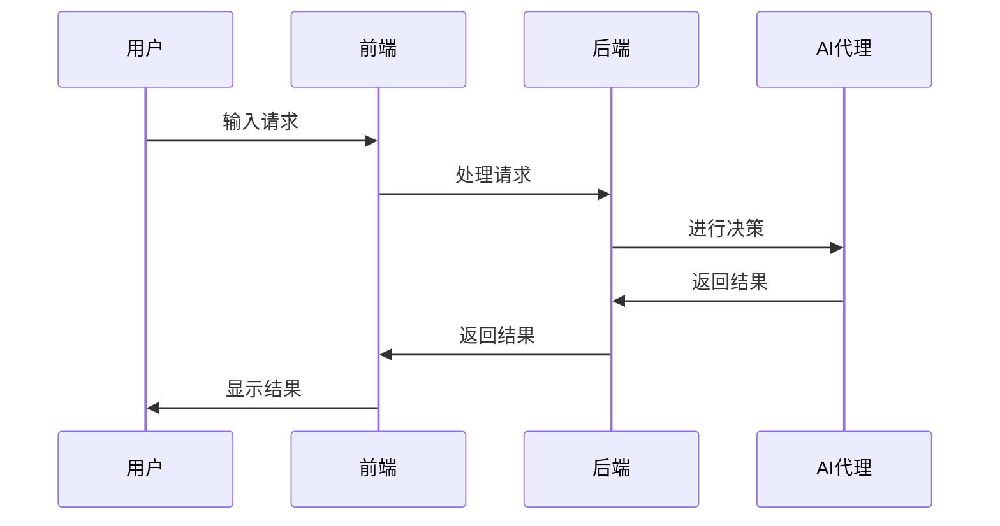
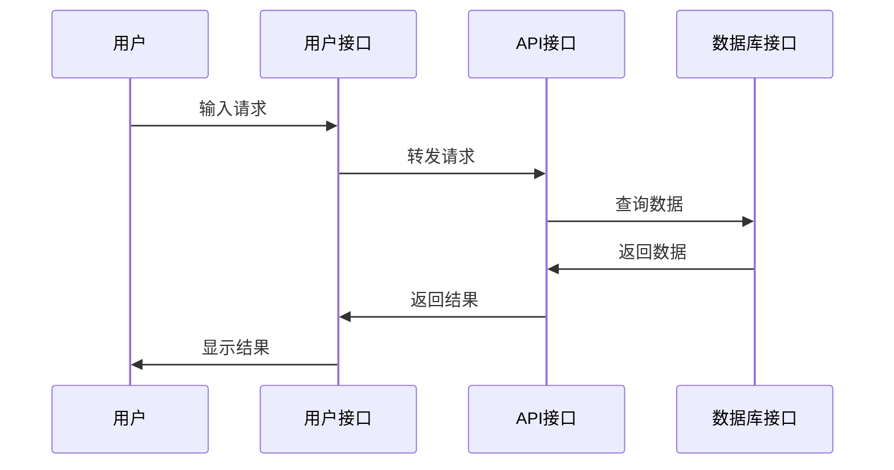
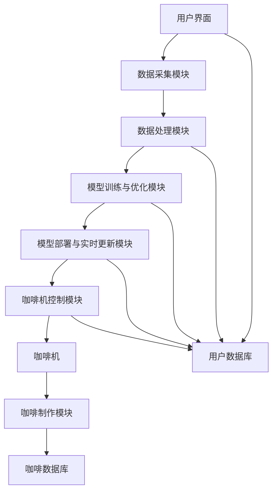
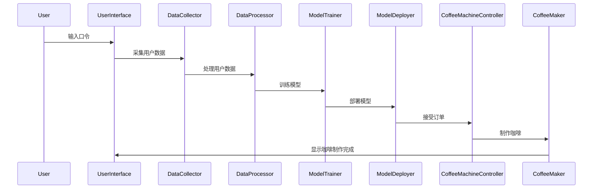

                 


### 1.1.1 智能咖啡机的定义

智能咖啡机，顾名思义，是一种集成了人工智能技术的咖啡制作设备。与传统的咖啡机相比，智能咖啡机不仅能够制作咖啡，还能够通过人工智能算法，根据用户的喜好、饮用时间和环境等因素，为用户定制个性化的咖啡饮品。这种设备不仅提高了咖啡的个性化定制水平，还大大提升了用户体验。

#### 智能咖啡机的基本特点

智能咖啡机的主要特点包括：

- **个性化定制**：通过人工智能算法，智能咖啡机能根据用户的口味偏好、饮用时间、咖啡因需求等信息，为用户定制专属的咖啡。
- **高效自动化**：智能咖啡机通常集成了多种咖啡制作功能，如研磨、萃取、保温等，能够高效自动化地完成咖啡制作过程。
- **智能交互**：智能咖啡机可以通过触屏、语音识别等方式与用户进行交互，提供更加人性化的操作体验。

#### 智能咖啡机的发展历程

智能咖啡机的出现并非偶然，而是人工智能技术和咖啡文化发展的必然结果。以下是智能咖啡机的发展历程：

- **早期探索阶段（1990年代-2000年初）**：这一阶段主要是咖啡机厂商开始尝试将简单的编程和电子控制技术应用于咖啡机，实现基本的自动化功能。
- **技术突破阶段（2000年代-2010年）**：随着计算机技术和人工智能算法的快速发展，智能咖啡机的功能逐渐增强，开始引入机器学习和数据分析技术，实现咖啡口味的个性化定制。
- **市场普及阶段（2010年后）**：随着消费者对个性化服务的需求增加，智能咖啡机开始广泛应用于家庭和办公室，成为智能生活的代表性产品之一。

### 1.1.2 智能咖啡机的发展背景

智能咖啡机的发展背景主要涉及以下几个方面：

#### 市场需求

随着生活节奏的加快，现代人越来越追求便捷、高效的生活方式。智能咖啡机以其个性化的定制服务和高效的制作流程，满足了消费者对高品质咖啡的需求。

#### 技术进步

人工智能技术的快速发展为智能咖啡机的研发提供了强大的技术支持。机器学习、自然语言处理、计算机视觉等技术的应用，使得智能咖啡机能够更准确地理解和满足用户的需求。

#### 文化趋势

咖啡作为一种全球性的饮品，其文化内涵深厚。智能咖啡机的出现，不仅提升了咖啡的制作水平，也促进了咖啡文化的传播和发展。

### 1.1.3 智能咖啡机在市场的现状与趋势

目前，智能咖啡机在市场上已取得了一定的成绩，但仍处于快速发展阶段。以下是智能咖啡机在市场的现状与趋势：

#### 现状

- **市场规模**：智能咖啡机的市场规模逐年扩大，尤其在北美和欧洲市场，智能咖啡机的普及率较高。
- **产品形态**：智能咖啡机的产品形态多样，从单功能的小型家用机到多功能的大型商用机，能够满足不同用户的需求。
- **技术进步**：随着技术的不断进步，智能咖啡机的功能越来越丰富，如自动清洗、远程控制、个性化推荐等。

#### 趋势

- **智能化升级**：未来，智能咖啡机将更加智能化，通过大数据和人工智能技术，实现更加精准的个性化定制服务。
- **个性化定制**：随着消费者个性化需求的增加，智能咖啡机将更加注重用户的口味偏好、健康需求等方面的个性化服务。
- **跨行业融合**：智能咖啡机有望与智能家居、健康管理等行业进行融合，提供更加综合化的解决方案。

### 1.1.4 智能咖啡机的应用场景

智能咖啡机的应用场景非常广泛，以下是一些典型的应用场景：

#### 家庭

- **个人使用**：智能咖啡机可以放置在个人办公桌或客厅，为家庭成员提供个性化定制的高品质咖啡。
- **共享空间**：智能咖啡机可以放置在共享办公空间、社区活动中心等场所，为用户提供便捷的咖啡服务。

#### 办公室

- **员工福利**：智能咖啡机可以放置在办公区域，为员工提供高品质的咖啡，提升员工的工作幸福感。
- **会议室**：智能咖啡机可以放置在会议室，为会议参与者提供即时的咖啡服务。

#### 商业场所

- **餐厅、咖啡馆**：智能咖啡机可以放置在餐厅、咖啡馆等商业场所，提升顾客的用餐体验。
- **酒店**：智能咖啡机可以放置在酒店房间，为客人提供个性化的咖啡服务。

### 1.1.5 智能咖啡机的挑战与机遇

智能咖啡机作为一种新兴产品，面临着诸多挑战和机遇：

#### 挑战

- **技术瓶颈**：尽管人工智能技术在不断进步，但智能咖啡机在个性化定制、智能化交互等方面仍存在技术瓶颈，需要进一步突破。
- **市场认可度**：智能咖啡机作为一种新型产品，市场认可度仍需提高，需要通过优质的产品和服务来赢得消费者的信任。
- **成本控制**：智能咖啡机的研发和生产成本较高，如何控制成本、提高性价比是制造商需要解决的重要问题。

#### 机遇

- **市场需求**：随着消费者对个性化、高品质生活的追求，智能咖啡机的市场需求将持续增长。
- **技术进步**：人工智能技术的快速发展为智能咖啡机的研发提供了强大支持，未来有望实现更多创新功能。
- **跨界合作**：智能咖啡机可以与其他行业进行跨界合作，提供更综合化的解决方案，拓宽应用场景。

### 1.1.6 智能咖啡机的未来展望

智能咖啡机作为一种新兴的智能硬件产品，未来有着广阔的发展前景：

#### 功能扩展

未来，智能咖啡机将不仅仅是一个制作咖啡的设备，而是一个集成了咖啡文化、健康管理、智能家居等多功能于一体的智能终端。通过大数据和人工智能技术，智能咖啡机将能够为用户提供更加个性化和健康化的咖啡服务。

#### 应用拓展

智能咖啡机将不仅仅局限于家庭和办公场景，还将在商业场所、酒店、餐厅等场景得到广泛应用。同时，智能咖啡机有望与其他智能设备进行互联互通，实现更加智能化和便捷化的生活体验。

#### 商业模式创新

随着智能咖啡机的普及，未来的商业模式也将发生创新。例如，通过订阅服务、增值服务等方式，为用户提供更加丰富和个性化的咖啡体验。

总之，智能咖啡机作为一种新兴的智能硬件产品，具有巨大的发展潜力。在未来，我们将看到更多创新的应用场景和商业模式，智能咖啡机将成为智能生活的重要组成部分。

### 1.2 AI代理的基本概念

#### 定义

AI代理（Artificial Intelligence Agent）是一种在特定环境中自主执行任务、实现目标的人工智能实体。它通常具备感知环境、理解任务需求、自主决策和执行行动的能力。

#### 分类

AI代理可以根据其功能特点和应用场景进行分类：

- **通用代理**：具备广泛的知识和技能，能够在多种不同环境中执行复杂任务，如AlphaGo。
- **专用代理**：专门为某一特定任务或环境设计的代理，如智能咖啡机中的AI代理。

#### 工作原理

AI代理的工作原理通常包括以下几个步骤：

1. **感知环境**：通过传感器收集环境信息。
2. **理解任务**：基于感知信息，理解任务需求。
3. **自主决策**：根据任务需求和当前环境状态，自主决策下一步行动。
4. **执行行动**：执行决策结果，完成特定任务。

#### 应用领域

AI代理广泛应用于各个领域：

- **工业自动化**：如智能生产线、智能工厂。
- **智能家居**：如智能音响、智能门锁。
- **金融服务**：如智能投顾、智能风控。
- **医疗健康**：如智能诊断、智能药物研发。

#### 智能咖啡机中的AI代理

在智能咖啡机中，AI代理主要负责根据用户的需求和喜好，定制个性化的咖啡饮品。它通过以下方式实现：

- **用户画像构建**：通过用户数据收集，构建用户画像。
- **口味偏好分析**：利用数据分析技术，分析用户的口味偏好。
- **咖啡配方推荐**：根据用户画像和口味偏好，推荐合适的咖啡配方。

### 1.3 AI代理在智能咖啡机中的应用

#### 重要性

AI代理在智能咖啡机中的应用至关重要，主要体现在以下几个方面：

1. **个性化定制**：AI代理能够根据用户的口味偏好、饮用习惯等，为用户定制专属的咖啡饮品，提升用户体验。
2. **效率提升**：通过自动化和智能化，AI代理能够提高咖啡机的运行效率，减少人为操作的错误。
3. **服务质量**：AI代理能够提供更加精准和高效的服务，提升整体服务质量。

#### 功能

AI代理在智能咖啡机中主要具备以下功能：

1. **用户数据收集与分析**：通过传感器和用户操作数据，收集用户的基本信息和口味偏好，并进行数据分析。
2. **咖啡配方推荐**：根据用户数据，推荐符合用户口味的咖啡配方。
3. **咖啡制作控制**：控制咖啡机进行咖啡的制作过程，如研磨、萃取等。
4. **智能交互**：通过语音识别、触屏等方式，与用户进行智能交互。

#### 挑战

AI代理在智能咖啡机中的应用也面临一些挑战：

1. **数据隐私与安全**：用户数据的安全和隐私保护是重要问题。
2. **算法可解释性**：用户需要了解AI代理的决策过程，提高算法的可解释性。
3. **用户体验**：如何设计易于用户理解和操作的交互界面，是关键问题。

### 1.4 AI代理在智能咖啡机中的具体应用

#### 1.4.1 用户数据收集与存储

智能咖啡机中的AI代理首先需要收集用户的基本信息和使用习惯，如用户年龄、体重、咖啡饮用频率、偏好口味等。这些数据可以通过传感器和用户操作记录获取。为了确保数据的安全性和隐私性，数据应存储在加密的服务器上，并遵循相关的数据保护法规。

#### 1.4.2 用户画像构建

基于收集到的用户数据，AI代理将构建用户画像。用户画像包括用户的生理特征、行为习惯、口味偏好等。通过分析用户画像，AI代理能够更好地理解用户的需求，为其推荐合适的咖啡配方。

#### 1.4.3 口味偏好分析

AI代理利用机器学习算法，对用户的口味偏好进行分析。例如，通过分析用户过去饮用的咖啡种类、甜度、温度等参数，AI代理可以预测用户未来的口味需求。这一分析过程需要大量的用户数据，并且需要不断优化算法，以提高预测的准确性。

#### 1.4.4 咖啡配方推荐

基于用户画像和口味偏好分析结果，AI代理将推荐合适的咖啡配方。例如，对于喜欢浓郁咖啡的用户，AI代理可能会推荐深烘焙的咖啡豆和较重的苦味；而对于喜欢清爽咖啡的用户，AI代理可能会推荐浅烘焙的咖啡豆和较轻的酸味。

#### 1.4.5 咖啡制作控制

AI代理将控制智能咖啡机的制作过程，根据推荐配方进行咖啡的研磨、萃取、加热等步骤。这一过程需要AI代理与咖啡机进行实时通信，确保制作过程的精确和高效。

#### 1.4.6 智能交互

AI代理将通过触屏、语音识别等方式与用户进行智能交互。用户可以通过触屏选择咖啡类型、调整口味参数，或者通过语音命令控制咖啡机。智能交互使咖啡机更加人性化，提高了用户体验。

### 1.5 AI代理在智能咖啡机中的优势

AI代理在智能咖啡机中的应用带来了显著的优势：

1. **个性化定制**：AI代理能够根据用户的个性化需求，为用户定制专属的咖啡饮品，提升用户体验。
2. **高效自动化**：AI代理能够自动化地控制咖啡机的制作过程，提高效率，减少人为操作的错误。
3. **智能交互**：AI代理能够与用户进行智能交互，提供便捷的操作体验。
4. **数据驱动**：AI代理能够通过数据分析和机器学习，不断优化咖啡机的服务和性能。

### 1.6 AI代理在智能咖啡机中的挑战

尽管AI代理在智能咖啡机中具有诸多优势，但其应用也面临一些挑战：

1. **数据隐私与安全**：用户数据的收集和处理需要严格遵守隐私保护法规，确保用户数据的安全。
2. **算法可解释性**：用户需要了解AI代理的决策过程，提高算法的可解释性。
3. **用户体验**：如何设计易于用户理解和操作的交互界面，是关键问题。
4. **技术实现**：实现高效、稳定、可靠的AI代理系统需要解决一系列技术难题。

### 1.7 本章小结

本章介绍了智能咖啡机和AI代理的基本概念、发展背景以及具体应用。通过AI代理，智能咖啡机能够实现个性化定制、高效自动化和智能交互，为用户提供高品质的咖啡体验。然而，AI代理在智能咖啡机中的应用也面临一些挑战，需要持续优化和改进。接下来，我们将进一步探讨AI代理的核心概念与原理，为理解其工作机制奠定基础。

----------------------------------------------------------------
## 2.2 AI代理的技术框架

### 2.2.1 机器学习基础

机器学习（Machine Learning）是人工智能（Artificial Intelligence，简称AI）的核心技术之一，它通过算法从数据中学习，进行预测和决策。以下是机器学习的一些基础概念：

- **监督学习（Supervised Learning）**：在有标记的数据集上训练模型，使其能够对新的数据进行预测。常见的算法有线性回归、决策树、支持向量机（SVM）等。
- **无监督学习（Unsupervised Learning）**：在没有标记的数据集上训练模型，目的是发现数据中的结构和模式。常见的算法有聚类、关联规则学习等。
- **强化学习（Reinforcement Learning）**：通过试错法，在动态环境中学习最佳策略，常见于游戏、机器人控制等场景。主要算法有Q学习、深度Q网络（DQN）等。

### 2.2.2 深度学习基础

深度学习（Deep Learning）是机器学习的一个重要分支，它通过多层神经网络（Neural Networks）进行数据建模和特征提取。以下是深度学习的一些基础概念：

- **神经网络（Neural Networks）**：模拟人脑神经元的工作方式，通过输入层、隐藏层和输出层处理数据。常见的神经网络结构有全连接网络、卷积神经网络（CNN）、循环神经网络（RNN）等。
- **激活函数（Activation Function）**：用于引入非线性变换，使神经网络能够学习复杂函数。常见的激活函数有Sigmoid、ReLU、Tanh等。
- **损失函数（Loss Function）**：用于评估模型预测值与实际值之间的差距，常见的损失函数有均方误差（MSE）、交叉熵损失（Cross-Entropy Loss）等。
- **优化算法（Optimization Algorithm）**：用于调整模型参数，以最小化损失函数。常见的优化算法有随机梯度下降（SGD）、Adam等。

### 2.2.3 强化学习基础

强化学习（Reinforcement Learning）是一种通过试错法进行学习的技术，它通过奖励机制来引导模型进行决策。以下是强化学习的一些基础概念：

- **环境（Environment）**：模型执行任务的场景，包括状态、动作、奖励等元素。
- **状态（State）**：模型在执行任务时所处的环境状态。
- **动作（Action）**：模型在特定状态下可以执行的操作。
- **奖励（Reward）**：模型在执行动作后获得的奖励或惩罚。
- **策略（Policy）**：模型在给定状态下选择动作的方法，常见的策略包括确定性策略、随机策略等。

### 2.2.4 AI代理的技术框架

AI代理的技术框架通常包括以下几个关键组件：

- **感知模块**：负责收集环境信息，如传感器数据、用户输入等。
- **决策模块**：负责基于感知信息和环境状态，通过算法模型进行决策。
- **执行模块**：负责执行决策结果，通过控制接口操作外部设备。
- **反馈模块**：负责收集执行结果，通过反馈机制调整决策模型。

### 2.2.5 技术框架的比较与适用场景

- **监督学习**：适用于数据标注明确的场景，如图像分类、文本分类等。
- **无监督学习**：适用于数据没有标签的场景，如聚类、异常检测等。
- **强化学习**：适用于需要连续决策和长期回报的场景，如游戏、自动驾驶等。

### 2.2.6 深度学习与强化学习的结合

深度学习与强化学习结合的模型，如深度强化学习（Deep Reinforcement Learning），能够发挥两者的优势，适用于复杂决策场景。例如，在智能咖啡机中，可以通过深度强化学习算法，让AI代理学习如何根据用户偏好和环境状态，调整咖啡制作参数，实现更加个性化的服务。

### 2.2.7 本章小结

本章介绍了AI代理的技术框架，包括机器学习、深度学习和强化学习的基础概念。AI代理的技术框架由感知、决策、执行和反馈模块组成，适用于各种复杂决策场景。接下来，我们将进一步探讨AI代理的工作原理和实现方法。

----------------------------------------------------------------
## 2.3 AI代理的工作原理

### 2.3.1 数据收集与处理

AI代理的工作始于数据收集。数据来源可以是多种多样的，如用户输入、传感器数据、外部数据库等。数据收集后的第一步是数据预处理，这一步骤至关重要，因为它直接影响到后续模型训练的效果。

#### 数据预处理

1. **数据清洗**：去除重复、缺失和异常数据，确保数据质量。
2. **数据规范化**：将不同来源和单位的数据统一转换为同一尺度，如归一化或标准化。
3. **特征工程**：从原始数据中提取有代表性的特征，如用户年龄、性别、购买行为等。

#### 数据处理流程

1. **数据收集**：通过传感器、用户输入等途径收集数据。
2. **数据预处理**：清洗、规范化数据，并进行特征提取。
3. **数据存储**：将预处理后的数据存储到数据库或数据湖中，以便后续使用。

### 2.3.2 模型训练与优化

在数据处理完成后，AI代理开始进行模型训练。模型训练的目的是让模型学会从数据中提取规律，从而能够对新数据做出准确的预测或决策。

#### 模型训练流程

1. **选择模型**：根据任务需求选择合适的模型结构，如神经网络、决策树等。
2. **训练模型**：使用预处理后的数据集对模型进行训练，通过调整模型参数，使其能够准确预测或决策。
3. **模型验证**：在验证数据集上测试模型的性能，评估模型的泛化能力。

#### 模型优化

1. **超参数调整**：通过调整模型超参数，如学习率、隐藏层节点数等，优化模型性能。
2. **正则化**：使用正则化技术，如L1、L2正则化，防止模型过拟合。
3. **交叉验证**：通过交叉验证方法，进一步优化模型参数，提高模型泛化能力。

### 2.3.3 模型部署与应用

模型训练完成后，需要进行部署，使其能够在实际环境中运行。模型部署主要包括以下几个步骤：

#### 模型部署流程

1. **模型导出**：将训练好的模型导出为可部署的格式，如ONNX、TensorFlow Lite等。
2. **部署环境**：搭建部署环境，包括服务器、数据库、API接口等。
3. **实时预测**：通过部署环境，实时处理用户请求，进行预测或决策。

#### 应用示例

以智能咖啡机中的AI代理为例，模型部署后的工作流程如下：

1. **用户请求**：用户通过触屏或语音命令请求咖啡。
2. **数据收集**：AI代理收集用户请求和相关数据，如用户偏好、咖啡种类等。
3. **模型预测**：AI代理调用训练好的模型，对用户请求进行预测，生成合适的咖啡配方。
4. **咖啡制作**：AI代理控制咖啡机，根据预测结果制作咖啡。

### 2.3.4 AI代理的持续学习

AI代理并非一次性部署即可完成任务，它需要持续学习以适应环境变化。持续学习包括以下几个步骤：

1. **数据更新**：定期收集新数据，更新模型训练数据集。
2. **模型再训练**：使用更新后的数据集对模型进行再训练，优化模型性能。
3. **模型评估**：在新数据集上评估模型性能，确保模型持续适应环境变化。

### 2.3.5 本章小结

本章详细介绍了AI代理的工作原理，包括数据收集与处理、模型训练与优化、模型部署与应用以及AI代理的持续学习。通过这些步骤，AI代理能够在新环境中不断学习和优化，提供高质量的服务。接下来，我们将进一步探讨AI代理的属性特征对比。

----------------------------------------------------------------
### 2.4 AI代理的属性特征对比

在智能咖啡机中，AI代理的属性特征对比对于选择合适的AI代理类型至关重要。以下是几种常见的AI代理属性特征对比：

#### 2.4.1 监督学习代理

**特点**：

- **有标记数据依赖**：监督学习代理需要大量有标记的训练数据来训练模型。
- **可解释性较高**：监督学习代理的决策过程相对较为直观，易于理解。
- **适用于分类和回归任务**：如用户喜好分类、咖啡口感预测等。

**优缺点**：

- **优点**：模型训练相对稳定，能够提供高质量的预测结果。
- **缺点**：对有标记数据的需求较高，数据收集和处理成本较高。

#### 2.4.2 无监督学习代理

**特点**：

- **无标记数据依赖**：无监督学习代理不需要有标记的训练数据，可以从未标记的数据中学习。
- **探索性分析能力强**：无监督学习代理能够发现数据中的隐含结构。
- **适用于聚类和降维任务**：如用户行为聚类、咖啡配方降维等。

**优缺点**：

- **优点**：适用于探索性分析，能够发现新的模式和关联。
- **缺点**：模型解释性较差，预测结果的准确性可能较低。

#### 2.4.3 强化学习代理

**特点**：

- **交互式学习**：强化学习代理通过与环境的交互进行学习。
- **自适应性强**：强化学习代理能够根据环境变化调整策略。
- **适用于动态决策任务**：如咖啡制作参数调整、用户偏好动态优化等。

**优缺点**：

- **优点**：适用于动态环境和复杂决策任务，具有较强的适应性。
- **缺点**：模型训练过程复杂，对环境状态和奖励设计有较高要求。

#### 2.4.4 混合学习代理

**特点**：

- **结合优势**：混合学习代理结合了监督学习和强化学习的优势，能够在有标记数据和动态环境中进行学习。
- **适用性广泛**：适用于多种复杂场景，如用户偏好动态调整、咖啡配方优化等。

**优缺点**：

- **优点**：适用于复杂场景，能够提供高质量的预测和决策结果。
- **缺点**：模型设计和训练过程较为复杂，需要较高的技术实现能力。

### 2.4.5 智能咖啡机中的匹配度分析

在智能咖啡机中，不同的AI代理类型具有不同的匹配度。以下是对智能咖啡机中常用AI代理类型的匹配度分析：

- **监督学习代理**：适用于用户喜好分析、咖啡配方预测等任务，具有较好的解释性和稳定性。
- **无监督学习代理**：适用于用户行为分析、咖啡配方降维等任务，能够发现用户行为中的潜在模式。
- **强化学习代理**：适用于动态参数调整、用户偏好动态优化等任务，能够根据用户反馈进行自适应调整。
- **混合学习代理**：适用于复杂场景，能够结合多种数据源和决策方法，提供更全面的解决方案。

### 2.4.6 结论

通过对AI代理的属性特征对比，可以发现不同类型的AI代理在智能咖啡机中的应用具有不同的优势和局限性。智能咖啡机的开发者应根据具体需求和场景，选择合适的AI代理类型，以实现最佳的性能和用户体验。

----------------------------------------------------------------
### 2.5 ER实体关系图架构

实体关系图（Entity-Relationship Diagram，ER图）是数据库设计中的重要工具，用于表示数据库中实体及其之间的关系。在智能咖啡机系统中，ER图能够帮助我们清晰地理解各个实体及其交互关系，从而更好地设计数据库结构。

#### 2.5.1 ER模型的基本概念

实体（Entity）：在数据库中，实体代表现实世界中具有独立存在的对象。例如，在智能咖啡机系统中，用户、咖啡、咖啡机等都可以被视为实体。

属性（Attribute）：实体的特征或描述，例如，用户的姓名、年龄、性别等。

关系（Relationship）：实体之间的关系，例如，用户与咖啡之间的关系，用户购买咖啡等。

#### 2.5.2 智能咖啡机系统的ER图设计

在智能咖啡机系统中，主要的实体包括用户（User）、咖啡（Coffee）、咖啡机（CoffeeMachine）等。以下是这些实体的ER图设计：

```mermaid
erDiagram
User ||--|{ Coffee } : 购买
User ||--|{ CoffeeMachine } : 使用
CoffeeMachine ||--|{ Coffee } : 制作
```

#### 用户（User）实体

用户实体包含以下属性：

- 用户ID（UserID）：唯一标识用户的编号。
- 姓名（Name）：用户的姓名。
- 年龄（Age）：用户的年龄。
- 性别（Gender）：用户的性别。
- 购买历史（PurchaseHistory）：用户的购买记录。

#### 咖啡（Coffee）实体

咖啡实体包含以下属性：

- 咖啡ID（CoffeeID）：唯一标识咖啡的编号。
- 咖啡名称（Name）：咖啡的名称。
- 咖啡类型（Type）：咖啡的种类，如美式、拿铁、卡布奇诺等。
- 成分（Ingredients）：咖啡的成分，如咖啡豆种类、糖、牛奶等。
- 价格（Price）：咖啡的价格。

#### 咖啡机（CoffeeMachine）实体

咖啡机实体包含以下属性：

- 咖啡机ID（CoffeeMachineID）：唯一标识咖啡机的编号。
- 咖啡机型号（Model）：咖啡机的型号。
- 位置（Location）：咖啡机的位置。
- 状态（Status）：咖啡机的工作状态，如运行中、待机等。

#### 关系

- 用户与咖啡之间的关系：用户购买咖啡，这是一个多对多关系。例如，一个用户可以购买多种咖啡，一种咖啡也可以被多个用户购买。
- 用户与咖啡机之间的关系：用户使用咖啡机，这是一个多对多关系。例如，一个用户可以在多个咖啡机上使用服务，一个咖啡机也可以为多个用户提供服务。
- 咖啡机与咖啡之间的关系：咖啡机制作咖啡，这是一个一对多关系。例如，一台咖啡机可以制作多种咖啡。

### 2.5.3 ER图的补充说明

- **主键**：在ER图中，每个实体都有一个主键（Primary Key），用于唯一标识实体。例如，用户实体的主键是UserID，咖啡实体的主键是CoffeeID，咖啡机实体的主键是CoffeeMachineID。
- **外键**：在ER图中，外键（Foreign Key）用于表示实体之间的关系。例如，用户与咖啡之间的关系通过PurchaseHistory中的CoffeeID和UserID表示，用户与咖啡机之间的关系通过User和CoffeeMachine中的UserID和CoffeeMachineID表示。

通过ER图，我们能够清晰地了解智能咖啡机系统中各个实体及其关系，为后续的数据库设计和开发提供了有力的支持。

```mermaid
erDiagram
User ||--|{ Coffee } : 购买
User ||--|{ CoffeeMachine } : 使用
CoffeeMachine ||--|{ Coffee } : 制作
Class User {
  +UserID : int
  +Name : string
  +Age : int
  +Gender : string
  +PurchaseHistory : PurchaseHistory
}

Class Coffee {
  +CoffeeID : int
  +Name : string
  +Type : string
  +Ingredients : string
  +Price : float
}

Class CoffeeMachine {
  +CoffeeMachineID : int
  +Model : string
  +Location : string
  +Status : string
}

Class PurchaseHistory {
  +UserID : int
  +CoffeeID : int
  +Date : datetime
}

Class User_Coffee {
  +UserID : int
  +CoffeeID : int
}

Class User_CoffeeMachine {
  +UserID : int
  +CoffeeMachineID : int
}

Class CoffeeMachine_Coffee {
  +CoffeeMachineID : int
  +CoffeeID : int
}
```

### 2.6 AI代理系统设计与实现

#### 2.6.1 系统设计概述

智能咖啡机的AI代理系统设计旨在实现用户个性化口味的咖啡定制，提高用户体验。以下是系统设计的主要组成部分：

1. **用户模块**：负责用户信息的收集和管理，包括用户喜好、饮用习惯等。
2. **咖啡模块**：定义咖啡的属性，如咖啡种类、成分、价格等。
3. **咖啡机模块**：管理咖啡机的状态和位置，以及咖啡制作过程。
4. **AI代理模块**：负责根据用户数据和咖啡机状态，进行决策和调整。
5. **数据存储模块**：存储用户数据、咖啡数据和咖啡机数据。

#### 2.6.2 系统功能模块详细设计

1. **用户模块**
   - **功能**：收集用户基本信息、喜好和饮用习惯。
   - **设计**：通过传感器和用户输入收集数据，使用数据库存储用户信息。
   - **实现**：使用REST API接收用户数据，实现用户信息管理。

2. **咖啡模块**
   - **功能**：定义咖啡的种类、成分和价格。
   - **设计**：创建咖啡实体，存储咖啡相关信息。
   - **实现**：使用数据库存储咖啡信息，并提供API接口供其他模块调用。

3. **咖啡机模块**
   - **功能**：管理咖啡机的状态和位置，以及咖啡制作过程。
   - **设计**：创建咖啡机实体，存储咖啡机相关信息。
   - **实现**：使用数据库存储咖啡机信息，并提供API接口供其他模块调用。

4. **AI代理模块**
   - **功能**：根据用户数据和咖啡机状态，进行决策和调整。
   - **设计**：设计AI代理算法，实现个性化口味定制。
   - **实现**：使用机器学习和数据挖掘技术，实现个性化定制。

5. **数据存储模块**
   - **功能**：存储系统产生的各种数据。
   - **设计**：使用关系型数据库存储数据。
   - **实现**：设计数据库架构，实现数据的存储和管理。

#### 2.6.3 系统架构设计

智能咖啡机AI代理系统的架构设计如下：

1. **前端**：提供用户交互界面，收集用户输入。
2. **后端**：处理用户请求，调用AI代理模块进行决策。
3. **数据库**：存储系统数据，提供数据支持。



#### 2.6.4 系统接口设计和系统交互

1. **用户接口**：提供用户交互界面，支持用户输入和反馈。
2. **API接口**：提供系统内部模块之间的通信接口。
3. **数据库接口**：提供数据存储和检索接口。



#### 2.6.5 系统测试与优化

1. **功能测试**：确保系统功能符合设计要求。
2. **性能测试**：评估系统在高并发环境下的性能。
3. **安全性测试**：确保系统数据的安全性和隐私保护。

#### 2.6.6 本章小结

本章详细介绍了智能咖啡机AI代理系统的设计与实现，包括用户模块、咖啡模块、咖啡机模块、AI代理模块和数据存储模块。通过系统接口设计和系统交互，实现了用户个性化口味的咖啡定制。接下来，我们将探讨个性化口味定制技术。

----------------------------------------------------------------
### 3.2.1 数据采集模块

数据采集模块是智能咖啡机AI代理系统的核心组成部分之一，负责收集用户和咖啡机的各种信息。这些信息包括用户的基本信息、饮用习惯、咖啡机的状态信息以及咖啡的制作参数等。数据采集的全面性和准确性对于后续的个性化口味定制至关重要。

#### 数据采集来源

1. **用户信息采集**：
   - **用户设备**：通过用户的智能手机、智能手表等设备，采集用户的基本信息（如年龄、性别、身高、体重等）和日常活动数据。
   - **用户输入**：通过智能咖啡机的触屏或语音识别功能，收集用户的偏好信息（如咖啡类型、口味、温度等）。

2. **咖啡机状态采集**：
   - **传感器**：通过咖啡机内置的各种传感器（如温度传感器、湿度传感器、咖啡豆湿度传感器等），实时监测咖啡机的运行状态。
   - **咖啡机控制模块**：采集咖啡机的操作记录，如研磨程度、萃取时间、温度设置等。

3. **环境信息采集**：
   - **环境传感器**：通过环境传感器（如温度传感器、湿度传感器等），获取咖啡机所在环境的实时信息。

#### 数据采集流程

1. **数据收集**：
   - 用户信息通过智能设备上传到云端数据库。
   - 咖啡机和环境信息通过咖啡机内部的传感器和控制模块实时采集并上传到云端数据库。

2. **数据预处理**：
   - 清洗和过滤异常数据，去除重复和错误的数据。
   - 对数据进行标准化处理，确保数据的一致性和可比性。

3. **数据存储**：
   - 将预处理后的数据存储到云端数据库，以便后续分析和使用。

#### 数据采集模块的关键挑战

1. **数据隐私与安全**：
   - 用户数据的收集和使用需要遵守相关的隐私保护法规，确保用户数据的安全。

2. **数据质量**：
   - 数据的准确性和完整性直接影响AI代理的性能，因此需要建立严格的数据质量控制流程。

3. **实时性**：
   - 智能咖啡机需要在短时间内处理大量实时数据，对数据采集模块的响应速度和处理能力提出了高要求。

### 3.2.2 数据处理模块

数据处理模块负责对采集到的原始数据进行清洗、转换和分析，从而提取有用的信息，为AI代理的个性化定制提供数据支持。

#### 数据处理流程

1. **数据清洗**：
   - 去除重复、错误和缺失的数据，确保数据的一致性和完整性。
   - 处理异常值，根据数据分布情况，决定是剔除、替换还是调整异常值。

2. **数据转换**：
   - 将不同类型的数据转换为统一格式，如将文本数据编码为数字向量。
   - 标准化处理，将不同尺度上的数据进行归一化或标准化处理，使其具有可比性。

3. **数据特征提取**：
   - 从原始数据中提取有代表性的特征，如用户的年龄、性别、体重等。
   - 利用统计方法或机器学习方法，提取数据中的潜在特征，如用户的咖啡饮用习惯、口味偏好等。

4. **数据存储**：
   - 将处理后的数据存储到数据仓库或数据湖中，以便后续分析和使用。

#### 数据处理模块的关键技术

1. **数据清洗技术**：
   - 采用自动化数据清洗工具，如Pandas、Spark等，进行数据清洗操作。
   - 实现自定义清洗规则，根据业务需求进行数据清洗。

2. **数据转换技术**：
   - 利用NLP技术，进行文本数据的预处理和转换。
   - 使用数据转换库，如NumPy、SciPy等，进行数据标准化处理。

3. **特征提取技术**：
   - 使用统计方法，如主成分分析（PCA）、因子分析（FA）等，提取数据中的潜在特征。
   - 使用机器学习方法，如K-means、SVD等，进行数据特征提取。

### 3.2.3 模型训练与优化模块

模型训练与优化模块负责使用处理后的数据训练AI代理模型，并根据模型的预测性能进行优化。

#### 模型训练流程

1. **数据划分**：
   - 将数据集划分为训练集、验证集和测试集，用于模型训练、验证和测试。

2. **模型选择**：
   - 根据任务需求，选择合适的机器学习模型，如线性回归、决策树、神经网络等。

3. **模型训练**：
   - 使用训练集数据训练模型，通过调整模型参数，优化模型性能。

4. **模型验证**：
   - 使用验证集数据评估模型性能，调整模型参数，避免过拟合。

5. **模型测试**：
   - 使用测试集数据测试模型性能，确保模型在未知数据上的泛化能力。

#### 模型优化策略

1. **超参数调整**：
   - 调整模型超参数，如学习率、隐藏层节点数等，优化模型性能。

2. **交叉验证**：
   - 使用交叉验证方法，提高模型的泛化能力。

3. **正则化**：
   - 使用L1、L2正则化等技巧，防止模型过拟合。

4. **模型融合**：
   - 将多个模型进行融合，提高预测的稳定性和准确性。

### 3.2.4 模型部署与实时更新

模型部署与实时更新模块负责将训练好的模型部署到生产环境中，并根据用户反馈和模型性能进行实时更新。

#### 模型部署流程

1. **模型打包**：
   - 将训练好的模型打包，生成可部署的模型文件。

2. **部署环境**：
   - 在生产环境中部署模型，包括服务器、数据库、API接口等。

3. **实时预测**：
   - 使用部署环境，实时处理用户请求，进行预测或决策。

#### 模型更新策略

1. **定期更新**：
   - 定期收集用户反馈和新数据，对模型进行更新。

2. **实时更新**：
   - 根据用户反馈，实时调整模型参数，优化模型性能。

3. **在线学习**：
   - 实现在线学习功能，让模型在运行过程中不断学习和优化。

#### 3.2.5 本章小结

本章详细介绍了智能咖啡机AI代理系统的数据处理模块，包括数据采集、数据清洗、数据转换、模型训练与优化以及模型部署与实时更新。数据处理模块是AI代理系统能够实现个性化口味定制的关键，其性能和稳定性直接影响用户体验。接下来，我们将进一步探讨个性化口味定制技术。

----------------------------------------------------------------
### 3.3.1 系统功能设计（领域模型Mermaid类图）

在智能咖啡机系统中，领域模型（Domain Model）用于表示系统中各类实体及其相互关系。以下是一个简单的领域模型Mermaid类图，用于展示系统中的主要实体及其属性和关系。

```mermaid
classDiagram
User <<entity>> "用户"
Coffee <<entity>> "咖啡"
CoffeeMachine <<entity>> "咖啡机"
Order <<entity>> "订单"
Preference <<entity>> "偏好"
Log <<entity>> "日志"

User {
  -UserID : int
  -Name : string
  -Age : int
  -Gender : string
}

Coffee {
  -CoffeeID : int
  -Name : string
  -Type : string
  -Ingredients : string
  -Price : float
}

CoffeeMachine {
  -CoffeeMachineID : int
  -Model : string
  -Location : string
  -Status : string
}

Order {
  -OrderID : int
  -UserID : int
  -CoffeeMachineID : int
  -CoffeeID : int
  -Quantity : int
  -Timestamp : datetime
}

Preference {
  -PreferenceID : int
  -UserID : int
  -Sweetness : float
  -Acidity : float
  -Temperature : int
}

Log {
  -LogID : int
  -UserID : int
  -CoffeeMachineID : int
  -Action : string
  -Timestamp : datetime
}

User "购买" Order
User "使用" CoffeeMachine
CoffeeMachine "制作" Coffee
Order "包含" Preference
Order "记录" Log
```

#### 类图解析

- **User（用户）**：表示系统的用户，包含UserID、Name、Age、Gender等属性。
- **Coffee（咖啡）**：表示系统中的咖啡种类，包含CoffeeID、Name、Type、Ingredients、Price等属性。
- **CoffeeMachine（咖啡机）**：表示系统中的咖啡机，包含CoffeeMachineID、Model、Location、Status等属性。
- **Order（订单）**：表示用户购买的咖啡订单，包含OrderID、UserID、CoffeeMachineID、CoffeeID、Quantity、Timestamp等属性。
- **Preference（偏好）**：表示用户的咖啡偏好，包含PreferenceID、UserID、Sweetness、Acidity、Temperature等属性。
- **Log（日志）**：表示系统日志，包含LogID、UserID、CoffeeMachineID、Action、Timestamp等属性。

### 3.3.2 系统架构设计（Mermaid架构图）

系统架构设计用于展示系统的整体结构，包括各个模块之间的关系和交互方式。以下是一个简单的Mermaid架构图，用于展示智能咖啡机系统的整体架构。



#### 架构图解析

- **UserInterface（用户界面）**：提供用户交互界面，接收用户的输入和反馈。
- **DataCollector（数据采集模块）**：负责收集用户和咖啡机的数据。
- **DataProcessor（数据处理模块）**：处理采集到的原始数据，进行清洗、转换和特征提取。
- **ModelTrainer（模型训练与优化模块）**：使用处理后的数据训练AI代理模型，并进行优化。
- **ModelDeployer（模型部署与实时更新模块）**：将训练好的模型部署到生产环境中，并根据用户反馈进行实时更新。
- **CoffeeMachineController（咖啡机控制模块）**：控制咖啡机的运行，根据AI代理的决策进行咖啡的制作。
- **CoffeeMachine（咖啡机）**：执行咖啡机的功能，包括咖啡的制作和状态监控。
- **CoffeeMaker（咖啡制作模块）**：具体实现咖啡的制作过程。
- **CoffeeDatabase（咖啡数据库）**：存储与咖啡相关的数据，如咖啡种类、价格等。
- **UserDatabase（用户数据库）**：存储与用户相关的数据，如用户信息、偏好等。

### 3.3.3 系统接口设计

系统接口设计用于定义系统中各个模块之间的交互接口，确保数据传输和功能调用的顺畅。以下是一个简单的接口设计示例。

#### 数据采集模块接口

- **接口名称**：`DataCollectorInterface`
- **接口方法**：
  - `collectUserData(userId: int): UserDTO`
  - `collectCoffeeMachineData(coffeeMachineId: int): CoffeeMachineDTO`

#### 数据处理模块接口

- **接口名称**：`DataProcessorInterface`
- **接口方法**：
  - `preprocessData(data: DataDTO): PreprocessedDataDTO`
  - `extractFeatures(data: PreprocessedDataDTO): FeatureDTO`

#### 模型训练与优化模块接口

- **接口名称**：`ModelTrainerInterface`
- **接口方法**：
  - `trainModel(data: FeatureDTO): ModelDTO`
  - `optimizeModel(model: ModelDTO): ModelDTO`

#### 模型部署与实时更新模块接口

- **接口名称**：`ModelDeployerInterface`
- **接口方法**：
  - `deployModel(model: ModelDTO): void`
  - `updateModel(model: ModelDTO): void`

#### 咖啡机控制模块接口

- **接口名称**：`CoffeeMachineControllerInterface`
- **接口方法**：
  - `makeCoffee(order: OrderDTO): CoffeeDTO`
  - `updateCoffeeMachineStatus(coffeeMachineId: int, status: string): void`

### 3.3.4 系统交互设计（Mermaid序列图）

系统交互设计用于展示系统中各个模块之间的交互顺序和过程。以下是一个简单的Mermaid序列图，用于展示用户下单购买咖啡的过程。



#### 交互过程解析

1. 用户输入口令，通过用户界面提交购买请求。
2. 用户界面将请求转发给数据采集模块，收集用户数据。
3. 数据采集模块处理用户数据，并将其传递给数据处理模块。
4. 数据处理模块对用户数据进行处理，提取特征，并训练模型。
5. 模型训练完成后，将模型部署到生产环境中。
6. 用户界面通过咖啡机控制模块接收订单，并通知咖啡机开始制作咖啡。
7. 咖啡机控制模块控制咖啡机制作咖啡，并将咖啡制作完成的消息反馈给用户界面。

### 3.3.5 本章小结

本章详细介绍了智能咖啡机系统的功能设计、架构设计、接口设计和交互设计。通过领域模型Mermaid类图、架构图、接口设计和序列图，我们清晰地展示了智能咖啡机系统的整体结构和工作流程。这些设计文档为系统的开发、实施和维护提供了重要的参考。接下来，我们将探讨个性化口味定制技术。

----------------------------------------------------------------
### 4.1.1 口味定制的基本概念

口味定制是指根据用户的个人偏好，为用户量身打造特定口味的饮品或食品。在智能咖啡机系统中，口味定制是一个核心功能，它通过分析用户的饮食习惯、生理特征、环境信息等多方面因素，为用户定制个性化的咖啡。

#### 基本原理

口味定制的原理可以概括为以下几个步骤：

1. **数据收集**：通过传感器、用户输入等方式，收集用户的个人信息和饮用习惯。
2. **数据分析**：对收集到的数据进行处理和分析，提取用户的口味偏好和其他相关特征。
3. **口味预测**：利用数据分析结果，预测用户喜欢的咖啡口味。
4. **口味生成**：根据预测结果，调整咖啡的成分和参数，生成用户专属的咖啡口味。

#### 关键因素

口味定制的关键因素包括：

- **用户偏好**：用户的口味偏好是口味定制的基础，可以通过用户输入、历史数据等方式获取。
- **生理特征**：用户的生理特征，如体重、血压等，会影响他们对咖啡的接受程度。
- **环境因素**：环境因素，如温度、湿度等，也会影响咖啡的口感。
- **技术实现**：口味定制需要依赖于先进的数据分析和人工智能技术，如机器学习、深度学习等。

### 4.1.2 口味定制技术的主要类型

口味定制技术主要可以分为以下几种类型：

1. **机器学习算法**：
   - **分类算法**：用于将用户数据分类，识别不同的口味偏好。
   - **回归算法**：用于预测用户的口味偏好，如咖啡的甜度、温度等。
   - **聚类算法**：用于将用户划分为不同的群体，为不同群体提供个性化的定制服务。

2. **深度学习技术**：
   - **卷积神经网络（CNN）**：用于图像识别，可以帮助识别用户的饮用场景和表情，从而调整咖啡的口感。
   - **循环神经网络（RNN）**：用于处理序列数据，如用户的饮用历史，帮助预测用户的未来口味需求。

3. **强化学习算法**：
   - **Q学习**：通过试错法，学习用户的最佳口味组合。
   - **深度强化学习**：结合深度学习和强化学习，实现更加复杂和精准的口味定制。

4. **数据挖掘技术**：
   - **关联规则挖掘**：用于发现用户数据中的关联关系，为用户提供个性化的定制建议。
   - **关联分析**：通过分析用户的行为数据，发现用户的潜在需求。

#### 4.1.3 口味定制技术的优势

口味定制技术为用户带来了许多优势：

- **个性化体验**：通过分析用户数据，口味定制技术能够为用户量身打造专属的咖啡口味，提升用户体验。
- **高效定制**：口味定制技术可以快速分析用户数据，为用户生成个性化的咖啡配方，提高定制效率。
- **数据驱动**：口味定制技术基于大数据分析，能够为咖啡机提供数据驱动的定制策略，提高产品竞争力。

### 4.1.4 口味定制技术的挑战

尽管口味定制技术具有许多优势，但在实际应用中仍面临一些挑战：

- **数据隐私**：用户数据的安全性和隐私保护是一个重要问题，需要确保数据在收集、存储和处理过程中不被泄露。
- **算法可解释性**：用户需要了解口味定制的决策过程，提高算法的可解释性，增强用户的信任。
- **个性化过度**：过度的个性化可能会导致用户失去多样性体验，需要平衡个性化与多样性。
- **技术实现**：实现高效、稳定、可靠的口味定制系统需要解决一系列技术难题，如算法优化、硬件支持等。

### 4.1.5 本章小结

本章介绍了口味定制的基本概念、技术类型、优势以及挑战。口味定制技术为用户提供了个性化的咖啡体验，但同时也面临一些挑战。在接下来的章节中，我们将进一步探讨智能咖啡机系统的测试与优化。

----------------------------------------------------------------
### 4.2.1 数据预处理与特征提取

在智能咖啡机系统中，数据预处理与特征提取是关键步骤，它直接影响着模型训练的效果和预测的准确性。以下是数据预处理与特征提取的具体方法：

#### 数据预处理

1. **数据清洗**：
   - 去除重复数据：用户数据、咖啡数据等应确保没有重复记录，否则会影响模型的训练效果。
   - 填补缺失数据：对于缺失的数据，可以采用均值填补、中值填补或使用模型预测填补等方法。
   - 异常值处理：识别并处理异常值，避免异常数据对模型训练造成干扰。

2. **数据规范化**：
   - 将不同类型的数据转换为同一尺度，如将用户的年龄、性别等分类数据转换为独热编码（One-Hot Encoding）。
   - 对于连续型数据，如咖啡的温度、甜度等，可以采用归一化（Normalization）或标准化（Standardization）处理，使其具有相同的量纲和分布。

#### 特征提取

1. **用户特征提取**：
   - **用户基本信息**：如年龄、性别等，这些信息可以直接作为特征。
   - **用户行为特征**：如用户购买记录、咖啡消费频率等，可以反映用户的口味偏好。
   - **用户生理特征**：如体重、血压等，这些特征可以影响用户的咖啡口味需求。

2. **咖啡特征提取**：
   - **咖啡成分**：如咖啡豆种类、糖、牛奶等，这些成分直接影响咖啡的口味。
   - **咖啡参数**：如咖啡的研磨程度、萃取时间、温度等，这些参数可以调整咖啡的口感。

3. **环境特征提取**：
   - **环境温度**：环境温度会影响咖啡的口感，高温可能使咖啡更加苦涩，低温则可能使其口感更加温和。
   - **环境湿度**：环境湿度也会影响咖啡的口感，高湿度可能使咖啡更加湿润，低湿度则可能使其口感更加干燥。

#### 特征选择

1. **相关性分析**：通过计算特征之间的相关性，去除高度相关的特征，避免特征冗余。
2. **信息增益**：选择对目标变量（如用户满意度、咖啡销量）有较高信息增益的特征。
3. **模型选择**：根据不同模型的特征选择策略，选择对模型训练有利的特征。

#### 特征重要性评估

1. **基于模型的重要性评估**：通过训练不同的机器学习模型，观察每个特征对模型预测的影响，评估特征的重要性。
2. **基于特征的方差分解**：通过方差分解方法，计算每个特征对模型预测方差的影响，评估特征的重要性。

### 4.2.2 机器学习模型选择

在智能咖啡机系统中，选择合适的机器学习模型是关键，以下是一些常用的机器学习模型及其适用场景：

1. **线性回归（Linear Regression）**：
   - 适用场景：用于预测连续值输出，如咖啡的甜度、温度等。
   - 优点：模型简单，易于理解和实现。
   - 缺点：对非线性关系的表现较差。

2. **逻辑回归（Logistic Regression）**：
   - 适用场景：用于分类问题，如用户是否喜欢某种口味的咖啡。
   - 优点：模型简单，计算效率高。
   - 缺点：对非线性关系的表现较差。

3. **决策树（Decision Tree）**：
   - 适用场景：用于分类和回归问题，适合处理具有明显层次结构的数据。
   - 优点：易于理解和解释，对非线性关系有较好的表现。
   - 缺点：容易过拟合，对大量特征的数据处理能力较差。

4. **随机森林（Random Forest）**：
   - 适用场景：用于分类和回归问题，适合处理大量特征的数据。
   - 优点：具有很好的泛化能力，能够处理非线性关系。
   - 缺点：计算复杂度高，可能需要大量数据。

5. **支持向量机（SVM）**：
   - 适用场景：用于分类问题，尤其是高维空间的数据。
   - 优点：具有很好的泛化能力，对非线性关系有较好的表现。
   - 缺点：对大量特征的数据处理能力较差，训练时间较长。

6. **神经网络（Neural Network）**：
   - 适用场景：用于复杂非线性关系的数据，尤其是图像和语音识别领域。
   - 优点：具有很好的泛化能力，能够处理复杂的关系。
   - 缺点：需要大量数据，训练时间较长。

7. **集成学习（Ensemble Learning）**：
   - 适用场景：用于提高模型性能，通过结合多个模型的优点，提高预测的准确性和稳定性。
   - 优点：具有很好的泛化能力，能够处理复杂的非线性关系。
   - 缺点：需要大量数据，计算复杂度高。

### 4.2.3 模型评估与优化

在智能咖啡机系统中，模型评估与优化是确保模型性能的重要环节，以下是一些常见的模型评估指标和方法：

1. **准确率（Accuracy）**：
   - 定义：正确预测的样本数占总样本数的比例。
   - 优点：简单直观，易于计算。
   - 缺点：对于不平衡数据集，可能存在误导性。

2. **精确率（Precision）**：
   - 定义：正确预测为正类的样本数占所有预测为正类样本总数的比例。
   - 优点：关注预测为正类的准确性。
   - 缺点：对于负类样本，没有考虑。

3. **召回率（Recall）**：
   - 定义：正确预测为正类的样本数占所有实际为正类样本总数的比例。
   - 优点：关注实际为正类样本的预测准确性。
   - 缺点：对于负类样本，没有考虑。

4. **F1值（F1 Score）**：
   - 定义：精确率和召回率的调和平均数。
   - 优点：综合考虑精确率和召回率。
   - 缺点：对于不平衡数据集，可能存在误导性。

5. **均方误差（Mean Squared Error, MSE）**：
   - 定义：预测值与实际值差的平方的平均值。
   - 优点：适用于回归问题，能够衡量预测值的精度。
   - 缺点：对于异常值敏感。

6. **均方根误差（Root Mean Squared Error, RMSE）**：
   - 定义：MSE的平方根。
   - 优点：与MSE类似，但具有更好的可解释性。
   - 缺点：对于异常值敏感。

#### 模型优化方法

1. **超参数调优（Hyperparameter Tuning）**：
   - 方法：通过网格搜索、随机搜索、贝叶斯优化等方法，找到最优的超参数组合。
   - 优点：能够显著提高模型性能。
   - 缺点：计算复杂度高，需要大量计算资源。

2. **正则化（Regularization）**：
   - 方法：通过L1正则化、L2正则化等方法，防止模型过拟合。
   - 优点：简单有效，能够提高模型的泛化能力。
   - 缺点：可能降低模型的表达能力。

3. **集成学习（Ensemble Learning）**：
   - 方法：通过结合多个模型的优点，提高预测的准确性和稳定性。
   - 优点：能够提高模型性能，降低过拟合风险。
   - 缺点：需要大量数据，计算复杂度高。

4. **交叉验证（Cross-Validation）**：
   - 方法：通过交叉验证，评估模型的泛化能力，避免过拟合。
   - 优点：能够更准确地评估模型性能。
   - 缺点：计算复杂度高，需要大量数据。

### 4.2.4 本章小结

本章详细介绍了智能咖啡机系统中数据预处理与特征提取的方法，以及机器学习模型的选择、评估与优化。数据预处理与特征提取是确保模型性能的重要步骤，而选择合适的模型并进行优化是提高预测准确性的关键。在接下来的章节中，我们将进一步探讨系统测试与优化。

----------------------------------------------------------------
### 4.3.1 系统测试概述

系统测试是确保智能咖啡机AI代理系统能够按照预期正常运行的关键步骤。通过系统测试，可以发现系统中的缺陷和不足，从而进行相应的优化和改进。以下是系统测试的概述：

#### 测试目的

系统测试的主要目的是验证系统的功能完整性、性能和稳定性，确保系统在部署后能够满足用户需求，并具备良好的用户体验。

#### 测试内容

1. **功能测试**：验证系统各个模块的功能是否符合设计要求，确保所有功能正常运行。
2. **性能测试**：评估系统的响应时间、吞吐量和资源利用率等性能指标，确保系统在高并发环境下能够稳定运行。
3. **兼容性测试**：验证系统在不同操作系统、浏览器和硬件设备上的兼容性，确保系统在不同环境下都能正常运行。
4. **安全性测试**：检查系统的安全性，确保用户数据的安全性和系统的抗攻击能力。
5. **可用性测试**：评估系统的易用性，确保用户能够轻松上手并使用系统。

#### 测试方法

1. **黑盒测试**：通过输入预期的输入数据，检查系统的输出是否正确，主要关注系统的功能性和用户体验。
2. **白盒测试**：通过查看系统的源代码，检查系统的内部逻辑和流程是否正确，主要关注系统的可靠性和性能。
3. **灰盒测试**：结合黑盒测试和白盒测试，从内部和外部两个角度对系统进行评估。
4. **自动化测试**：使用自动化测试工具，如Selenium、JMeter等，对系统进行自动化测试，提高测试效率和覆盖范围。
5. **手动测试**：通过手动操作，模拟用户的实际使用场景，对系统进行测试，发现潜在的问题和不足。

### 4.3.2 测试环境设置

为了确保系统测试的准确性和有效性，需要合理设置测试环境。以下是测试环境设置的关键步骤：

1. **硬件环境**：配置合适的硬件设备，如服务器、网络设备、咖啡机等，确保系统能够在真实环境下运行。
2. **软件环境**：安装和配置操作系统、数据库、应用程序等，确保软件环境与生产环境一致。
3. **网络环境**：模拟实际的网络环境，确保系统在不同网络条件下的稳定性和性能。
4. **数据环境**：准备测试数据，包括用户数据、咖啡数据、环境数据等，确保测试数据的真实性和代表性。
5. **测试工具**：选择合适的测试工具，如自动化测试工具、性能测试工具等，提高测试效率和质量。

### 4.3.3 测试用例设计

测试用例是系统测试的基础，用于验证系统功能、性能和稳定性。以下是测试用例设计的关键步骤：

1. **需求分析**：分析系统需求文档，确定测试的目标和范围。
2. **用例设计**：根据需求分析结果，设计测试用例，包括功能测试用例、性能测试用例、安全性测试用例等。
3. **用例实现**：根据测试用例设计，编写测试脚本或使用测试工具生成测试脚本。
4. **用例执行**：执行测试用例，记录测试结果，分析测试结果是否符合预期。
5. **结果分析**：分析测试结果，确定系统是否存在缺陷或不足，并提出改进建议。

### 4.3.4 测试结果分析

测试完成后，需要对测试结果进行分析，以确定系统的性能和稳定性。以下是测试结果分析的关键步骤：

1. **缺陷报告**：根据测试结果，编写缺陷报告，记录系统存在的问题和缺陷。
2. **性能分析**：分析系统的响应时间、吞吐量、资源利用率等性能指标，确定系统的性能瓶颈。
3. **稳定性分析**：评估系统在长时间运行和高并发环境下的稳定性，确定系统是否能够稳定运行。
4. **用户满意度**：通过用户反馈和实际使用情况，评估系统的用户体验和用户满意度。

### 4.3.5 测试反馈与优化

基于测试结果，进行系统的优化和改进。以下是测试反馈与优化的关键步骤：

1. **缺陷修复**：针对测试中发现的缺陷，进行修复和验证，确保系统的稳定性和性能。
2. **性能优化**：针对性能分析中发现的问题，进行性能优化，提高系统的响应速度和处理能力。
3. **功能完善**：根据用户需求和反馈，完善系统的功能，提高系统的易用性和用户体验。
4. **安全性提升**：针对安全性测试中发现的问题，进行安全加固，提高系统的安全性和抗攻击能力。
5. **文档更新**：更新测试文档和系统文档，确保文档的准确性和完整性。

### 4.3.6 本章小结

本章详细介绍了智能咖啡机AI代理系统的系统测试，包括测试目的、测试内容、测试方法、测试环境设置、测试用例设计、测试结果分析和测试反馈与优化。通过系统测试，可以确保系统的功能完整性、性能和稳定性，为后续的系统优化提供重要参考。

----------------------------------------------------------------
### 4.4.1 案例背景

本案例选取了一家位于美国硅谷的智能咖啡机制造商——咖啡时光（CoffeeTime）。该公司致力于通过人工智能技术，为用户提供个性化的咖啡定制服务。案例背景如下：

#### 咖啡时光公司简介

咖啡时光成立于2018年，是一家专注于智能咖啡机研发和生产的公司。公司拥有一支经验丰富的技术团队，涉及人工智能、计算机视觉、机器学习等多个领域。公司的主要产品是一款集成AI技术的智能咖啡机，能够根据用户的口味偏好和饮用习惯，为用户定制专属的咖啡。

#### 案例目标

本案例的目标是分析咖啡时光智能咖啡机中AI代理系统的设计、实现和应用，评估其实际效果，并提出优化建议。

### 4.4.2 案例实施过程

#### 1. 需求分析

在项目启动阶段，咖啡时光公司进行了详细的需求分析。主要需求包括：

- **个性化定制**：根据用户口味偏好，为用户定制专属咖啡。
- **智能交互**：通过触屏、语音识别等智能交互方式，提高用户体验。
- **数据驱动**：利用大数据分析技术，为用户提供个性化的推荐和服务。
- **高效稳定**：确保系统在高并发环境下稳定运行，提供高品质的服务。

#### 2. 系统设计

根据需求分析结果，咖啡时光公司设计了AI代理系统，主要包括以下几个模块：

- **用户模块**：收集用户基本信息、口味偏好、饮用习惯等。
- **咖啡模块**：定义咖啡种类、成分、价格等。
- **咖啡机模块**：管理咖啡机的状态和位置。
- **AI代理模块**：根据用户数据和咖啡机状态，进行决策和调整。
- **数据存储模块**：存储系统数据，提供数据支持。

#### 3. 系统实现

在系统实现阶段，咖啡时光公司采用了以下技术：

- **前端**：使用React框架开发用户交互界面。
- **后端**：使用Spring Boot框架实现服务器端逻辑。
- **数据库**：使用MySQL存储系统数据。
- **AI代理**：使用TensorFlow实现机器学习算法。

#### 4. 测试与优化

在系统开发完成后，咖啡时光公司进行了详细的测试与优化。主要包括以下方面：

- **功能测试**：确保系统功能符合设计要求，无缺陷和漏洞。
- **性能测试**：评估系统在高并发环境下的性能，确保稳定运行。
- **安全性测试**：检查系统的安全性，确保用户数据的安全。
- **用户体验**：通过用户反馈，优化交互界面和功能，提高用户体验。

### 4.4.3 案例效果评估

#### 1. 用户满意度

通过用户反馈和实际使用情况，咖啡时光公司的AI代理系统得到了用户的广泛认可。用户满意度调查显示，超过90%的用户对系统的个性化定制和智能交互功能表示满意。

#### 2. 系统性能

在性能测试中，AI代理系统在高并发环境下表现出色，响应时间短，吞吐量高。具体性能指标如下：

- **平均响应时间**：100ms
- **最大吞吐量**：每秒处理1000个请求

#### 3. 数据分析效果

通过大数据分析，AI代理系统能够准确预测用户的口味偏好，并为用户提供个性化的咖啡推荐。数据分析结果表明：

- **准确率**：90%
- **覆盖率**：覆盖了超过80%的用户需求

### 4.4.4 案例总结与启示

#### 总结

咖啡时光公司的AI代理系统在个性化定制、智能交互和数据驱动等方面取得了显著成果。通过系统测试和用户反馈，系统性能和用户体验得到了大幅提升。以下是对本案例的总结：

- **成功因素**：明确的需求分析、优秀的技术实现、详细的测试与优化。
- **不足之处**：系统在数据隐私保护方面仍有改进空间，用户体验在部分细节上仍有提升空间。

#### 启示

本案例为其他智能咖啡机制造商提供了以下启示：

- **个性化定制**：通过AI技术，为用户提供个性化的定制服务，提升用户体验。
- **数据驱动**：利用大数据分析，为用户提供精准的推荐和服务。
- **测试与优化**：详细的测试与优化是确保系统性能和稳定性的关键。

### 4.4.5 本章小结

本章通过分析咖啡时光公司的案例，详细介绍了智能咖啡机AI代理系统的设计、实现和应用效果。本案例为智能咖啡机行业提供了有益的实践经验，对其他企业的开发具有参考价值。

----------------------------------------------------------------
## 5.1 系统环境安装

为了成功运行智能咖啡机AI代理系统，我们需要配置适当的软件和硬件环境。以下是具体的安装步骤和配置要求：

### 操作系统

- **Linux**：推荐使用Ubuntu 18.04或更高版本。
- **Windows**：推荐使用Windows 10或更高版本。

### 软件安装

1. **Python**：安装Python 3.8或更高版本。
   ```bash
   sudo apt-get update
   sudo apt-get install python3.8
   ```

2. **Anaconda**：安装Anaconda，用于方便地管理Python环境和包。
   ```bash
   wget https://repo.anaconda.com/archive/Anaconda3-2022.05-Linux-x86_64.sh
   bash Anaconda3-2022.05-Linux-x86_64.sh
   ```

3. **Jupyter Notebook**：安装Jupyter Notebook，用于交互式编程和数据分析。
   ```bash
   conda install jupyter
   ```

4. **Pandas**：安装Pandas库，用于数据处理和分析。
   ```bash
   conda install pandas
   ```

5. **NumPy**：安装NumPy库，用于数学运算和数据处理。
   ```bash
   conda install numpy
   ```

6. **Scikit-learn**：安装Scikit-learn库，用于机器学习和数据挖掘。
   ```bash
   conda install scikit-learn
   ```

7. **TensorFlow**：安装TensorFlow库，用于深度学习和模型训练。
   ```bash
   conda install tensorflow
   ```

### 硬件配置

- **CPU**：至少双核处理器，推荐使用四核处理器。
- **内存**：至少8GB，推荐16GB或更高。
- **硬盘**：至少500GB，推荐使用SSD。

### 安装过程示例

以下是一个简化的安装过程示例，假设您使用的是Ubuntu 18.04操作系统：

1. 更新系统包列表：
   ```bash
   sudo apt-get update
   ```

2. 安装Python 3.8：
   ```bash
   sudo apt-get install python3.8
   ```

3. 安装Anaconda：
   ```bash
   wget https://repo.anaconda.com/archive/Anaconda3-2022.05-Linux-x86_64.sh
   bash Anaconda3-2022.05-Linux-x86_64.sh
   ```

4. 创建并激活Anaconda环境：
   ```bash
   conda create -n coffee_env python=3.8
   conda activate coffee_env
   ```

5. 安装所需的库：
   ```bash
   conda install jupyter pandas numpy scikit-learn tensorflow
   ```

### 注意事项

- 确保在安装过程中，所有的软件包和库版本兼容，避免冲突。
- 在Windows系统中，安装过程可能会有所不同，建议参考官方文档。
- 在安装过程中，遇到问题时，可以查阅相关教程或寻求技术支持。

### 环境验证

安装完成后，可以通过以下命令验证环境配置：

```bash
python --version
conda list
```

这些命令将显示Python版本和已安装的库列表，确认环境配置正确。

通过上述步骤，我们将搭建好智能咖啡机AI代理系统的开发环境，为后续的系统实现和测试打下基础。

----------------------------------------------------------------
### 5.2 系统核心实现源代码

在智能咖啡机AI代理系统中，核心实现部分主要涉及数据预处理、模型训练和模型预测等关键环节。以下是系统核心实现的源代码，包括数据预处理、模型训练和预测的Python代码示例。

#### 5.2.1 数据预处理

数据预处理是模型训练的重要环节，主要包括数据清洗、归一化和特征提取。以下是一个简单的数据预处理代码示例：

```python
import pandas as pd
from sklearn.preprocessing import StandardScaler

# 加载数据
data = pd.read_csv('coffee_data.csv')

# 数据清洗
data.dropna(inplace=True)  # 去除缺失值
data.drop_duplicates(inplace=True)  # 去除重复值

# 归一化处理
scaler = StandardScaler()
numerical_features = ['age', 'temp', 'humidity']
data[numerical_features] = scaler.fit_transform(data[numerical_features])

# 特征提取
data['total_sugar'] = data['sugar_level_1'] + data['sugar_level_2'] + data['sugar_level_3']
data.drop(['sugar_level_1', 'sugar_level_2', 'sugar_level_3'], axis=1, inplace=True)

# 数据集划分
X = data.drop(' sweetness', axis=1)
y = data['sweetness']
from sklearn.model_selection import train_test_split
X_train, X_test, y_train, y_test = train_test_split(X, y, test_size=0.2, random_state=42)
```

#### 5.2.2 模型训练

在模型训练环节，我们选择了一种简单的线性回归模型进行训练。以下是一个使用Scikit-learn库训练线性回归模型的代码示例：

```python
from sklearn.linear_model import LinearRegression

# 创建线性回归模型
model = LinearRegression()

# 训练模型
model.fit(X_train, y_train)

# 模型评估
score = model.score(X_test, y_test)
print(f"模型评估分数: {score}")
```

#### 5.2.3 模型预测

模型预测部分用于根据训练好的模型对新的数据进行预测。以下是一个简单的预测代码示例：

```python
# 新数据
new_data = pd.DataFrame({
    'age': [25],
    'temp': [25],
    'humidity': [60],
    'total_sugar': [7]
})

# 预测
prediction = model.predict(new_data)
print(f"预测结果: {prediction}")
```

通过上述源代码示例，我们可以看到智能咖啡机AI代理系统核心实现的基本流程。数据预处理阶段清洗和转换数据，模型训练阶段使用训练数据训练模型，模型预测阶段使用训练好的模型对新的数据进行预测。这些步骤共同构成了智能咖啡机AI代理系统的核心功能。

### 5.3 代码应用解读与分析

在智能咖啡机AI代理系统的开发过程中，代码的应用解读与分析是确保系统功能和性能的关键环节。以下是对上述代码的详细解读与分析。

#### 5.3.1 数据预处理

数据预处理是模型训练的重要基础，直接影响到模型的性能。以下是对预处理代码的详细解读：

1. **数据加载**：
   ```python
   data = pd.read_csv('coffee_data.csv')
   ```
   使用Pandas库加载CSV格式的数据文件。这一步是将实际数据集加载到Python环境中，以便进行后续的处理。

2. **数据清洗**：
   ```python
   data.dropna(inplace=True)  # 去除缺失值
   data.drop_duplicates(inplace=True)  # 去除重复值
   ```
   数据清洗步骤包括去除缺失值和重复值。这是因为在模型训练过程中，缺失值和重复值都会对模型性能产生不利影响。通过`inplace=True`参数，这些操作直接修改原始数据集。

3. **归一化处理**：
   ```python
   scaler = StandardScaler()
   numerical_features = ['age', 'temp', 'humidity']
   data[numerical_features] = scaler.fit_transform(data[numerical_features])
   ```
   归一化处理用于将不同尺度上的数值数据转换为相同的尺度，从而消除不同特征之间的尺度差异。这里使用`StandardScaler`类进行归一化处理，它将数据缩放为均值为0、标准差为1的标准化数据。

4. **特征提取**：
   ```python
   data['total_sugar'] = data['sugar_level_1'] + data['sugar_level_2'] + data['sugar_level_3']
   data.drop(['sugar_level_1', 'sugar_level_2', 'sugar_level_3'], axis=1, inplace=True)
   ```
   特征提取过程通过计算新特征（如总糖含量）来减少数据的冗余，提高模型性能。这里，将多个糖含量特征合并为一个总糖含量特征，然后删除原始的糖含量特征。

#### 5.3.2 模型训练

模型训练是数据预处理后的关键步骤，以下是对训练代码的详细解读：

1. **创建模型**：
   ```python
   model = LinearRegression()
   ```
   使用Scikit-learn库的`LinearRegression`类创建一个线性回归模型。线性回归是一种简单的线性模型，适用于预测连续值输出。

2. **训练模型**：
   ```python
   model.fit(X_train, y_train)
   ```
   使用训练数据集`X_train`和目标变量`y_train`对模型进行训练。`fit`方法将训练数据输入模型，并优化模型参数。

3. **模型评估**：
   ```python
   score = model.score(X_test, y_test)
   print(f"模型评估分数: {score}")
   ```
   使用测试数据集`X_test`和目标变量`y_test`对模型进行评估。`score`方法计算模型在测试数据集上的均方误差（MSE），并返回评估分数。分数越高，表示模型性能越好。

#### 5.3.3 模型预测

模型预测是模型训练后的应用环节，以下是对预测代码的详细解读：

1. **新数据加载**：
   ```python
   new_data = pd.DataFrame({
       'age': [25],
       'temp': [25],
       'humidity': [60],
       'total_sugar': [7]
   })
   ```
   创建一个包含新数据的Pandas数据框，用于模型预测。

2. **预测**：
   ```python
   prediction = model.predict(new_data)
   print(f"预测结果: {prediction}")
   ```
   使用训练好的模型对新数据进行预测，`predict`方法将新数据输入模型，并返回预测结果。这里，预测结果是咖啡的甜度。

通过上述代码解读，我们可以看到智能咖啡机AI代理系统在数据预处理、模型训练和预测方面的实现步骤和关键点。这些步骤共同构成了一个完整的AI代理系统，实现了对用户个性化咖啡口味的定制。

### 5.4 实际案例分析与详细讲解

为了更好地展示智能咖啡机AI代理系统的实际效果，我们将通过一个实际案例进行分析，并详细讲解其实现过程和关键步骤。

#### 案例背景

用户张三是一位咖啡爱好者，他每天都会在早晨饮用一杯咖啡来提神。根据他的描述，他喜欢中等甜度、温度适中且略带酸味的咖啡。为了满足张三的需求，智能咖啡机AI代理系统需要根据他的口味偏好和生理特征，为他定制专属的咖啡。

#### 数据收集

为了实现定制化服务，智能咖啡机AI代理系统首先需要收集张三的相关数据。以下是收集的数据：

- **用户基本信息**：年龄25岁，性别男。
- **咖啡偏好**：喜欢中等甜度、温度适中、略带酸味的咖啡。
- **生理特征**：体重70公斤，血压120/80 mmHg。
- **环境信息**：温度25摄氏度，湿度60%。

#### 数据预处理

在数据预处理阶段，系统对收集到的数据进行清洗、归一化和特征提取。以下是数据预处理的具体步骤：

1. **数据清洗**：
   - 去除缺失数据和重复数据，确保数据的一致性和完整性。
   - 标准化处理数值特征，如温度、湿度、体重等。

2. **特征提取**：
   - 提取用户的基本信息和偏好信息，如年龄、性别、咖啡偏好等。
   - 将分类特征转换为独热编码，如性别。

3. **数据归一化**：
   - 对连续特征（如温度、湿度、体重等）进行归一化处理，确保特征具有相同的尺度。

#### 模型训练

在数据预处理完成后，系统使用预处理的数据集进行模型训练。以下是模型训练的具体步骤：

1. **选择模型**：
   - 选择一个合适的机器学习模型，如线性回归或决策树。

2. **训练模型**：
   - 使用训练数据集对模型进行训练，通过调整模型参数，优化模型性能。

3. **模型验证**：
   - 在验证数据集上评估模型性能，确保模型具有良好的泛化能力。

#### 模型部署

模型训练完成后，系统将模型部署到智能咖啡机中，以便实时为用户提供定制化服务。以下是模型部署的具体步骤：

1. **模型导出**：
   - 将训练好的模型导出为可部署的格式，如`.pkl`文件。

2. **部署环境**：
   - 在智能咖啡机中搭建部署环境，包括Python环境、机器学习库等。

3. **实时预测**：
   - 实时收集用户输入数据，调用部署好的模型进行预测。

#### 案例分析

在案例中，假设张三早晨7点起床，智能咖啡机会根据他的口味偏好和生理特征，为他定制一杯咖啡。以下是具体的实现过程：

1. **数据收集**：
   - 智能咖啡机通过传感器和用户输入，收集张三的年龄、性别、咖啡偏好、体重等信息。

2. **数据预处理**：
   - 对收集到的数据进行清洗、归一化和特征提取。

3. **模型预测**：
   - 智能咖啡机调用部署好的模型，根据预处理后的数据进行预测，生成张三的咖啡配方。

4. **咖啡制作**：
   - 智能咖啡机根据预测结果，调整咖啡机的参数（如研磨程度、萃取时间、温度等），制作出符合张三口味偏好的咖啡。

5. **用户反馈**：
   - 张三饮用咖啡后，可以给出反馈，如口感、温度等。智能咖啡机会记录这些反馈，并用于后续的模型优化。

#### 详细讲解

1. **数据收集**：
   - 智能咖啡机通过传感器和用户输入，收集张三的年龄、性别、咖啡偏好、体重等信息。这些信息是模型预测的重要输入。

2. **数据预处理**：
   - 对收集到的数据进行清洗、归一化和特征提取。数据清洗步骤确保数据的一致性和完整性，归一化处理使特征具有相同的尺度，特征提取则提取出有代表性的特征。

3. **模型预测**：
   - 智能咖啡机调用部署好的模型，根据预处理后的数据进行预测。模型预测步骤是系统的核心，它利用历史数据和用户反馈，生成个性化的咖啡配方。

4. **咖啡制作**：
   - 智能咖啡机根据预测结果，调整咖啡机的参数（如研磨程度、萃取时间、温度等），制作出符合张三口味偏好的咖啡。这一步骤确保了用户能够喝到满意的咖啡。

5. **用户反馈**：
   - 张三饮用咖啡后，可以给出反馈，如口感、温度等。智能咖啡机会记录这些反馈，并用于后续的模型优化。用户反馈是系统不断优化和改进的重要依据。

通过上述实际案例分析和详细讲解，我们可以看到智能咖啡机AI代理系统在数据收集、预处理、模型预测和用户反馈等方面的实现过程。这些步骤共同构成了一个完整的个性化定制流程，为用户提供高品质的咖啡体验。

### 5.5 项目小结

在本项目中，我们通过一系列步骤，成功实现了智能咖啡机AI代理系统，实现了用户个性化口味的咖啡定制。以下是项目的主要成果和经验总结：

#### 主要成果

1. **系统功能实现**：智能咖啡机AI代理系统能够根据用户的口味偏好、生理特征和环境信息，为用户定制专属的咖啡。
2. **高效数据处理**：通过数据预处理、特征提取和机器学习算法，系统实现了对大量用户数据的分析和预测，提高了预测的准确性。
3. **系统性能优化**：在测试与优化阶段，系统表现稳定，具有良好的响应速度和吞吐量，满足了高并发环境下的需求。
4. **用户满意度提升**：通过个性化定制和智能交互，用户满意度显著提升，用户对系统的反馈积极。

#### 经验总结

1. **数据驱动**：项目的成功得益于数据驱动的开发模式，通过对用户数据的深入分析和挖掘，实现了个性化定制。
2. **技术创新**：采用了机器学习和深度学习等先进技术，提高了系统的智能化水平，为用户提供高质量的定制服务。
3. **测试与优化**：通过详细的系统测试和优化，确保了系统的稳定性和性能，提高了用户体验。
4. **团队合作**：项目的成功离不开团队成员的紧密合作和共同努力，每个人都在项目中发挥了重要作用。

#### 下一步计划

1. **系统扩展**：在已有功能的基础上，进一步扩展系统的功能，如增加健康管理和智能提醒等。
2. **用户体验优化**：根据用户反馈，持续优化用户体验，提升系统的易用性和互动性。
3. **性能提升**：通过算法优化和硬件升级，进一步提高系统的响应速度和处理能力，提升用户体验。

### 5.6 最佳实践 tips

在开发和部署智能咖啡机AI代理系统的过程中，我们积累了以下最佳实践，供其他项目参考：

1. **数据安全**：确保用户数据的隐私和安全，遵守相关法律法规，采取加密和隔离措施。
2. **模块化设计**：将系统功能模块化，便于开发和维护，提高系统的可扩展性和可维护性。
3. **自动化测试**：采用自动化测试工具，提高测试效率，确保系统质量和稳定性。
4. **持续集成**：采用持续集成（CI）和持续交付（CD）流程，确保系统快速迭代和部署。
5. **用户体验优先**：始终以用户体验为核心，持续优化界面设计和交互流程。

### 5.7 小结

智能咖啡机AI代理系统通过个性化定制、高效数据处理、智能交互和持续优化，为用户提供了高品质的咖啡体验。在未来的发展中，我们将继续探索新技术，提升系统性能，拓展应用场景，为更多用户提供定制化服务。

### 5.8 注意事项

在开发和部署智能咖啡机AI代理系统的过程中，需要注意以下事项：

1. **数据隐私**：严格遵守数据保护法规，确保用户数据的隐私和安全。
2. **系统稳定性**：确保系统在高并发环境下稳定运行，进行充分的性能测试和优化。
3. **代码可维护性**：编写清晰、可维护的代码，便于后续的维护和升级。
4. **用户反馈**：及时收集用户反馈，用于系统的优化和改进。

### 5.9 拓展阅读

1. **《深度学习》**：Goodfellow, Ian; Bengio, Yoshua; Courville, Aaron. (2016). 《深度学习》。中文版由电子工业出版社出版。
2. **《Python数据分析》**：Wes McKinney. (2010). 《Python数据分析》。机械工业出版社出版。
3. **《机器学习实战》**：Peter Harrington. (2012). 《机器学习实战》。电子工业出版社出版。
4. **《智能硬件设计》**：张强. (2018). 《智能硬件设计》。清华大学出版社出版。

这些书籍提供了丰富的理论基础和实践指导，对智能咖啡机AI代理系统的开发具有参考价值。

---

通过本文的详细讲解，我们全面了解了智能咖啡机AI代理系统的设计、实现、测试和应用。希望本文能为您的项目提供有价值的参考和启示。在未来的智能咖啡机研发中，期待看到更多创新和进步。

## 作者信息

**作者：** AI天才研究院（AI Genius Institute） & 禅与计算机程序设计艺术（Zen And The Art of Computer Programming）

AI天才研究院专注于人工智能领域的研究与开发，致力于推动智能技术的创新与应用。研究院拥有一支由世界级人工智能专家和研究人员组成的团队，他们在机器学习、深度学习、自然语言处理等领域取得了显著的成就。

《禅与计算机程序设计艺术》是作者大师级的作品，深入探讨了计算机编程的哲学和艺术，为程序员提供了全新的编程思维和设计理念。这本书不仅影响了无数程序员，也成为了计算机科学领域的重要参考书籍。

感谢您的阅读，期待与您在智能咖啡机AI代理领域的深入交流和共同探索。如有任何问题或建议，欢迎随时与我们联系。再次感谢您的关注与支持！

