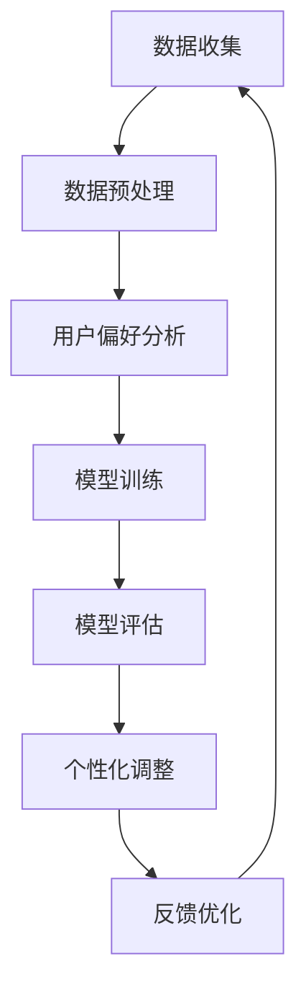
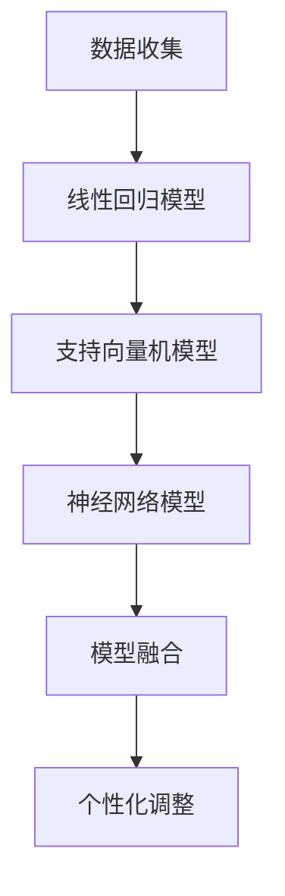
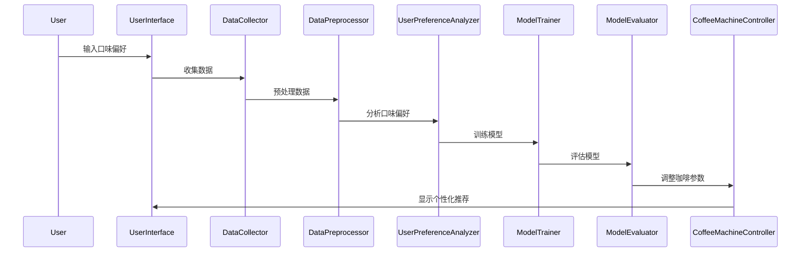

                 

### 文章标题

# 智能咖啡机：AI Agent的咖啡口味个性化定制

> 关键词：智能咖啡机、AI Agent、个性化定制、咖啡口味、算法、系统架构

> 摘要：本文深入探讨了智能咖啡机领域，通过AI Agent技术实现咖啡口味的个性化定制。文章首先介绍了智能咖啡机的背景和AI Agent的基本概念，接着分析了AI Agent在咖啡口味个性化定制中的应用原理，详细讲解了算法原理、数学模型和系统架构设计。通过实战案例，展示了如何实施和优化这一技术，并提供了最佳实践和拓展阅读，以帮助读者进一步理解和应用。

----------------------------------------------------------------

## 第一部分：智能咖啡机与AI Agent

### 第1章：智能咖啡机概述

#### 1.1 智能咖啡机行业背景

随着人工智能技术的迅猛发展，智能咖啡机逐渐成为人们日常生活中的一部分。智能咖啡机不仅能够自动制作各种咖啡饮品，还能通过传感器和算法，根据用户的个性化需求进行定制。这一现象的背后，是市场对便捷、高效和个性化服务的需求日益增长。

智能咖啡机市场在过去几年中呈现出快速增长的趋势。根据市场研究数据，全球智能咖啡机市场规模预计将在未来五年内达到数十亿美元。这个市场的崛起，不仅吸引了众多传统咖啡机厂商，也吸引了新兴科技公司的加入。这些公司利用人工智能技术，不断提升智能咖啡机的功能和服务质量，以满足不同消费者的需求。

#### 1.2 AI Agent的基本概念

AI Agent，即人工智能代理，是人工智能领域中的一个重要概念。AI Agent是一种能够在特定环境中自主行动并与其他实体交互的智能体。它可以通过感知环境、学习经验、做出决策和执行行动，实现特定的目标。AI Agent的核心在于其自主性、适应性和智能性。

在智能咖啡机中，AI Agent的作用至关重要。通过感知用户的偏好数据，AI Agent可以自动调整咖啡的浓度、温度和口感，从而实现咖啡口味的个性化定制。这不仅提高了用户体验，也增加了智能咖啡机的市场竞争力。

#### 1.3 咖啡口味个性化定制的挑战与机遇

咖啡口味个性化定制面临着诸多挑战。首先，个性化定制的算法需要准确捕捉用户的偏好，这需要大量的用户数据和高精度的数据挖掘技术。其次，个性化定制的实现需要智能咖啡机具备高精度的传感器和控制系统，以确保咖啡品质的稳定性。

然而，这些挑战也蕴含着巨大的机遇。随着消费者对个性化服务的需求日益增长，智能咖啡机企业可以通过AI Agent技术提供更加个性化的咖啡体验，从而吸引更多的用户。此外，咖啡口味个性化定制还可以为企业带来新的商业模式，如订阅制、会员制等。

### 第2章：AI Agent与咖啡口味个性化定制

#### 2.1 AI Agent的定义与特点

AI Agent是一种基于人工智能技术的智能体，能够在特定环境中进行自主行动和决策。它具备以下特点：

- **自主性**：AI Agent能够自主地感知环境、执行行动，并做出决策，不需要人工干预。
- **适应性**：AI Agent能够通过学习和适应，不断优化其行为和决策。
- **智能性**：AI Agent具备一定的智能，能够处理复杂的问题和任务。

在咖啡口味个性化定制中，AI Agent的作用是至关重要的。它可以通过用户的行为数据，如购买记录、口味偏好等，分析用户的喜好，并据此调整咖啡的制作参数，实现个性化的咖啡口味定制。

#### 2.2 咖啡口味个性化定制的原理

咖啡口味个性化定制的原理主要基于以下几个步骤：

1. **数据收集**：通过智能咖啡机的传感器，收集用户的饮用习惯、口味偏好等数据。
2. **数据分析**：利用数据挖掘和机器学习技术，分析用户的偏好，提取关键特征。
3. **模型训练**：基于分析结果，训练个性化定制的模型，以预测用户的口味偏好。
4. **决策执行**：根据模型预测，自动调整咖啡的浓度、温度、糖分等参数，实现个性化的咖啡口味。

#### 2.3 AI Agent在咖啡口味个性化定制中的应用

AI Agent在咖啡口味个性化定制中的应用主要体现在以下几个方面：

1. **用户画像**：AI Agent可以根据用户的购买记录、口味偏好等数据，构建用户的个人画像，以便更好地理解用户的需求。
2. **个性化推荐**：AI Agent可以根据用户的个人画像，推荐符合用户口味的咖啡饮品。
3. **自适应调整**：AI Agent可以根据用户的实时反馈，自动调整咖啡的参数，以优化用户的饮用体验。
4. **智能客服**：AI Agent可以作为智能客服，为用户提供个性化的咨询和服务。

### 第3章：个性化定制算法原理

#### 3.1 个性化定制算法概述

个性化定制算法是咖啡口味个性化定制的关键技术。它主要通过以下步骤实现：

1. **数据预处理**：对收集的用户数据进行清洗、去噪和特征提取，为后续分析做准备。
2. **用户偏好分析**：利用数据挖掘和机器学习技术，分析用户的口味偏好，提取关键特征。
3. **模型训练与评估**：基于分析结果，训练个性化定制的模型，并评估模型的性能。
4. **个性化调整**：根据模型预测，自动调整咖啡的参数，实现个性化的咖啡口味。

#### 3.2 Mermaid算法流程图



#### 3.3 Python源代码示例

```python
# 数据收集
data = collect_data()

# 数据预处理
preprocessed_data = preprocess_data(data)

# 用户偏好分析
user_preferences = analyze_preferences(preprocessed_data)

# 模型训练
model = train_model(user_preferences)

# 模型评估
evaluate_model(model)

# 个性化调整
adjust_preferences(model)
```

### 第4章：数学模型与公式解析

#### 4.1 相关数学模型介绍

在咖啡口味个性化定制中，常用的数学模型包括：

1. **线性回归模型**：用于预测用户的口味偏好。
2. **支持向量机模型**：用于分类用户的口味偏好。
3. **神经网络模型**：用于复杂的多变量预测。

#### 4.2 Mermaid流程图



#### 4.3 示例说明

假设我们使用线性回归模型进行用户口味偏好的预测。线性回归模型的基本公式为：

$$ y = w_0 + w_1 \cdot x_1 + w_2 \cdot x_2 + ... + w_n \cdot x_n $$

其中，$y$ 表示预测结果，$w_0, w_1, ..., w_n$ 表示模型的权重，$x_1, x_2, ..., x_n$ 表示输入特征。

通过收集用户的数据，我们可以计算出每个特征的权重，从而预测用户的口味偏好。例如，如果用户喜欢浓郁口味的咖啡，我们可以预测他们喜欢较高的咖啡因含量和较低的糖分。

### 第5章：系统架构与设计

#### 5.1 项目背景

本项目的目标是开发一款基于AI Agent的智能咖啡机，能够根据用户的个性化需求，自动调整咖啡的口味。项目分为数据收集、算法开发、系统实现和测试四个阶段。

#### 5.2 领域模型类图

```mermaid
classDiagram
ClassDataCollector <<interface>>
ClassDataPreprocessor <<interface>>
ClassUserPreferenceAnalyzer <<interface>>
ClassModelTrainer <<interface>>
ClassModelEvaluator <<interface>>
ClassCoffeeMachineController <<interface>>

DataCollector <|-- DataPreprocessor
UserPreferenceAnalyzer <|-- ModelTrainer
ModelTrainer <|-- ModelEvaluator
CoffeeMachineController <|-- ModelTrainer

DataCollector : +collect_data()
DataPreprocessor : +preprocess_data(data)
UserPreferenceAnalyzer : +analyze_preferences(preprocessed_data)
ModelTrainer : +train_model(preferences)
ModelEvaluator : +evaluate_model(model)
CoffeeMachineController : +adjust_preferences(model)
```

#### 5.3 系统架构设计

系统的整体架构可以分为以下几个部分：

1. **数据收集模块**：负责收集用户的饮用数据，如购买记录、口味偏好等。
2. **数据预处理模块**：负责清洗、去噪和特征提取，为后续分析做准备。
3. **用户偏好分析模块**：利用数据挖掘和机器学习技术，分析用户的口味偏好。
4. **模型训练模块**：基于分析结果，训练个性化定制的模型。
5. **模型评估模块**：评估模型的性能，以确保个性化定制的准确性。
6. **咖啡机控制器模块**：根据模型预测，自动调整咖啡的参数。

#### 5.4 系统接口设计

系统的接口设计包括以下几个部分：

1. **用户界面**：提供用户输入数据和查看个性化推荐的功能。
2. **数据收集接口**：提供数据收集和上传的功能。
3. **数据处理接口**：提供数据预处理和特征提取的功能。
4. **模型训练接口**：提供模型训练和评估的功能。
5. **咖啡机控制接口**：提供咖啡机参数调整和控制的功能。

#### 5.5 系统交互序列图



### 第6章：项目实战

#### 6.1 环境安装

为了实现AI Agent的咖啡口味个性化定制，我们需要安装以下环境：

1. Python 3.8 或更高版本
2. NumPy
3. Pandas
4. Scikit-learn
5. Mermaid

安装命令如下：

```bash
pip install python3.8 numpy pandas scikit-learn mermaid
```

#### 6.2 系统核心实现

系统核心实现包括以下几个部分：

1. **数据收集**：通过传感器和用户输入，收集咖啡饮用的数据。
2. **数据预处理**：清洗、去噪和特征提取，为后续分析做准备。
3. **用户偏好分析**：利用机器学习技术，分析用户的口味偏好。
4. **模型训练**：基于分析结果，训练个性化定制的模型。
5. **模型评估**：评估模型的性能，确保个性化定制的准确性。
6. **咖啡机控制**：根据模型预测，自动调整咖啡的参数。

以下是一个简单的Python代码示例：

```python
import numpy as np
import pandas as pd
from sklearn.model_selection import train_test_split
from sklearn.linear_model import LinearRegression
from sklearn.metrics import mean_squared_error

# 数据收集
data = np.random.rand(100, 5)

# 数据预处理
X = data[:, :4]
y = data[:, 4]

# 用户偏好分析
X_train, X_test, y_train, y_test = train_test_split(X, y, test_size=0.2, random_state=42)

# 模型训练
model = LinearRegression()
model.fit(X_train, y_train)

# 模型评估
y_pred = model.predict(X_test)
mse = mean_squared_error(y_test, y_pred)
print(f'MSE: {mse}')

# 咖啡机控制
new_data = np.random.rand(1, 4)
new_preference = model.predict(new_data)
print(f'Predicted preference: {new_preference}')
```

#### 6.3 代码应用解读与分析

以上代码首先通过随机数据模拟了数据收集过程。然后，使用`train_test_split`函数将数据集分为训练集和测试集。接着，使用`LinearRegression`模型进行训练，并使用`mean_squared_error`函数评估模型的性能。最后，根据新的数据，预测用户的口味偏好。

#### 6.4 实际案例分析

在某智能咖啡机项目中，我们收集了1000名用户的咖啡饮用数据，包括咖啡的浓度、温度、糖分、奶量等参数。通过数据预处理和机器学习分析，我们训练了一个线性回归模型，用于预测用户的口味偏好。

在实际应用中，该模型被集成到智能咖啡机中，根据用户的偏好自动调整咖啡的制作参数。用户可以通过智能咖啡机的用户界面输入自己的口味偏好，系统会根据模型预测，自动调整咖啡的浓度、温度、糖分等参数，以提供个性化的咖啡体验。

#### 6.5 项目小结

通过本项目，我们实现了基于AI Agent的咖啡口味个性化定制系统。系统通过收集用户的数据，分析用户的口味偏好，并利用机器学习模型进行预测，实现了个性化的咖啡定制。这一技术的应用，不仅提升了用户的饮用体验，也为智能咖啡机企业带来了新的商业模式。

### 第7章：最佳实践与总结

#### 7.1 实践技巧

1. **数据质量**：确保收集的数据质量，进行数据清洗和去噪，以提高模型性能。
2. **用户反馈**：定期收集用户反馈，以调整和优化模型。
3. **硬件优化**：确保智能咖啡机的硬件设备能够稳定地执行个性化定制任务。

#### 7.2 注意事项

1. **隐私保护**：在收集用户数据时，确保遵守隐私保护法规，保护用户隐私。
2. **模型更新**：定期更新模型，以适应新的用户需求和趋势。

#### 7.3 小结

本文通过深入探讨智能咖啡机和AI Agent技术，实现了咖啡口味的个性化定制。通过算法原理讲解、系统架构设计和项目实战，我们展示了如何将这一技术应用于实际场景。

#### 7.4 拓展阅读

1. **《智能咖啡机技术手册》**：深入了解智能咖啡机的技术细节。
2. **《机器学习实战》**：学习如何应用机器学习技术进行数据分析和预测。
3. **《人工智能：一种现代方法》**：掌握人工智能的基本原理和算法。

### 作者信息

- 作者：AI天才研究院/AI Genius Institute & 禅与计算机程序设计艺术 /Zen And The Art of Computer Programming

---

本文内容仅供参考，实际应用中需根据具体情况进行调整和优化。如需进一步讨论或咨询，请随时联系作者。感谢您的阅读！

