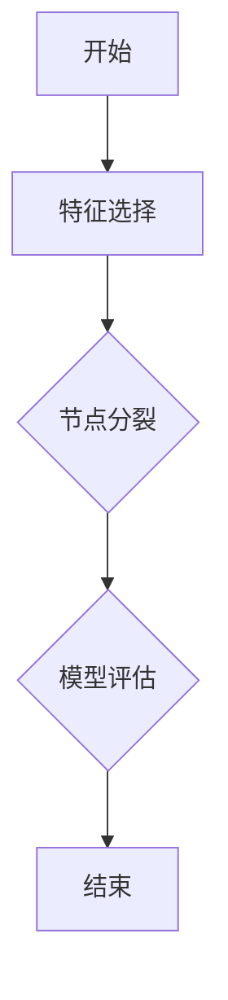
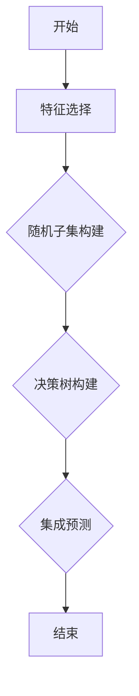
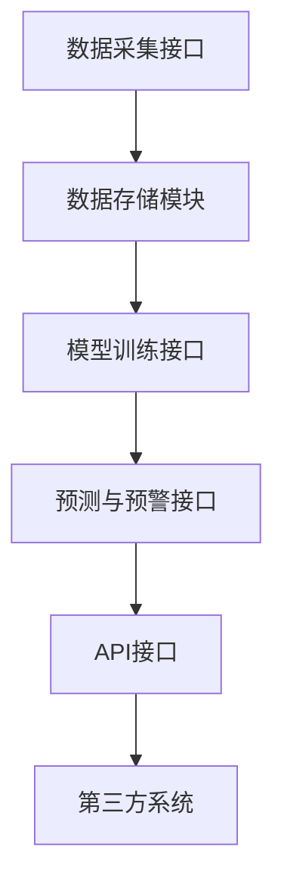

                 

### 智能商业银行存款流失预测

#### 文章关键词

- 智能商业银行
- 存款流失预测
- 数据挖掘
- 机器学习
- 决策树

> 摘要：随着数字化转型的不断推进，智能商业银行正逐步取代传统银行，成为金融行业的主要形式。然而，存款流失问题仍然困扰着许多智能商业银行。本文将深入探讨智能商业银行存款流失的现象、原因及预测方法，以期为相关金融机构提供有益的参考。

----------------------------------------------------------------

### 目录大纲

----------------------------------------------------------------

## 第一部分：问题背景与核心概念

### 第1章：智能商业银行存款流失概述

#### 第1.1节：智能商业银行的发展背景

#### 第1.2节：存款流失现象与原因分析

#### 第1.3节：存款流失预测的重要性

## 第二部分：核心概念与联系

### 第2章：核心概念原理与特征

#### 第2.1节：数据挖掘与机器学习基础

#### 第2.2节：关键算法原理解析

#### 第2.3节：概念属性特征对比表格

### 第3章：实体关系图架构

#### 第3.1节：数据实体与关系

#### 第3.2节：Mermaid ER实体关系图

## 第三部分：算法原理讲解

### 第4章：算法原理与数学模型

#### 第4.1节：决策树算法

#### 第4.2节：随机森林算法

## 第四部分：系统分析与架构设计

### 第5章：系统功能设计与架构设计

#### 第5.1节：系统功能设计

#### 第5.2节：系统架构设计

#### 第5.3节：系统接口设计与交互

## 第五部分：项目实战

### 第6章：环境安装与系统核心实现

#### 第6.1节：环境安装

#### 第6.2节：系统核心实现

#### 第6.3节：代码应用解读与分析

### 第7章：实际案例分析与讲解

#### 第7.1节：案例介绍

#### 第7.2节：案例解析

#### 第7.3节：项目小结

## 第六部分：最佳实践与拓展阅读

### 第8章：最佳实践

### 第9章：小结

### 第10章：注意事项

### 第11章：拓展阅读

----------------------------------------------------------------

### 第一部分：问题背景与核心概念

#### 第1章：智能商业银行存款流失概述

#### 1.1 智能商业银行的发展背景

随着互联网、大数据、人工智能等技术的迅速发展，银行业正经历着一场前所未有的变革。传统的商业银行逐渐向智能商业银行转型，以适应新的市场环境和客户需求。智能商业银行是一种基于人工智能技术的银行，它利用大数据分析、机器学习、自然语言处理等技术，为客户提供更加个性化和智能化的金融服务。

智能商业银行的发展背景主要包括以下几个方面：

1. **数字化转型**：随着数字经济的快速发展，传统银行面临着巨大的转型压力。数字化转型已经成为商业银行提升竞争力、优化业务流程、降低运营成本的重要手段。智能商业银行正是这种转型的产物，它通过引入先进的技术，实现了业务的智能化、自动化和高效化。

2. **客户需求变化**：随着金融市场的不断成熟，客户对银行服务的需求也在不断变化。传统的银行服务已经无法满足客户的多元化需求，智能商业银行通过提供更加个性化和智能化的服务，更好地满足了客户的需求。

3. **技术创新**：互联网、大数据、人工智能等技术的不断进步，为智能商业银行的发展提供了强大的技术支持。这些技术不仅提升了银行的服务能力，也提高了银行的风险管理能力和决策水平。

#### 1.2 智能商业银行的概念与功能

智能商业银行是指在传统银行的基础上，通过引入人工智能、大数据分析等技术，实现业务的智能化、自动化和高效化的一种新型银行。智能商业银行的主要功能包括：

1. **客户服务**：智能商业银行通过自然语言处理技术，可以实现对客户咨询的自动回答，提高客户服务的效率和质量。

2. **风险管理**：智能商业银行利用大数据分析和机器学习技术，可以实现对风险的精准识别和预测，提高风险管理的效率和准确性。

3. **业务流程优化**：智能商业银行通过自动化技术，可以实现对业务流程的优化，降低运营成本，提高业务效率。

4. **产品创新**：智能商业银行通过大数据分析和机器学习技术，可以实现对市场需求的精准把握，推动产品的创新和优化。

#### 1.3 存款流失现象与原因分析

存款流失是指银行客户将其存款转移到其他金融机构或撤出存款的行为。存款流失对智能商业银行来说是一个严重的问题，因为它不仅影响了银行的盈利能力，还可能影响银行的稳定性和信誉。存款流失的原因主要包括以下几个方面：

1. **市场竞争**：随着金融市场的开放，各类金融机构不断涌现，市场竞争日益激烈。为了吸引客户，各金融机构纷纷推出各种优惠政策和理财产品，导致存款流失。

2. **客户满意度**：客户满意度是影响客户忠诚度的重要因素。如果智能商业银行的服务质量不高，客户体验不佳，客户就可能会流失。

3. **市场需求变化**：随着客户需求的不断变化，智能商业银行如果不能及时调整产品和服务，就可能导致客户流失。

4. **风险管理**：如果智能商业银行的风险管理能力不足，不能有效识别和预测风险，就可能导致存款流失。

#### 1.4 存款流失预测的重要性

存款流失预测是智能商业银行风险管理的重要手段之一。通过预测客户是否有可能流失，银行可以采取相应的措施，如提高服务质量、提供个性化产品等，以降低存款流失的风险。存款流失预测的重要性主要体现在以下几个方面：

1. **风险控制**：通过预测客户是否有可能流失，银行可以提前采取措施，降低存款流失的风险。

2. **客户关系管理**：通过预测客户流失情况，银行可以针对性地提供服务和产品，提高客户满意度，增强客户忠诚度。

3. **业务决策**：存款流失预测可以帮助银行制定更为科学的业务决策，如调整产品策略、优化业务流程等。

4. **成本控制**：通过预测客户流失情况，银行可以提前采取措施，降低流失客户的成本。

#### 1.5 存款流失预测的核心概念

存款流失预测涉及多个核心概念，包括数据挖掘、机器学习、特征工程等。这些概念在存款流失预测中起着至关重要的作用。

1. **数据挖掘**：数据挖掘是一种通过从大量数据中提取有用信息的技术。在存款流失预测中，数据挖掘技术可以帮助银行从客户数据中提取出与存款流失相关的特征，为预测模型提供支持。

2. **机器学习**：机器学习是一种通过训练模型，使模型能够对未知数据进行预测的技术。在存款流失预测中，机器学习技术可以帮助银行构建预测模型，实现对客户流失的预测。

3. **特征工程**：特征工程是一种通过设计和选择特征，提升模型性能的技术。在存款流失预测中，特征工程可以帮助银行从客户数据中提取出对预测有重要影响的特征，提高预测的准确性。

#### 1.6 存款流失预测的应用场景

存款流失预测在智能商业银行中有广泛的应用场景，主要包括：

1. **客户流失预警**：通过预测客户是否有可能流失，银行可以提前采取措施，防止客户流失。

2. **业务优化**：通过分析客户流失原因，银行可以针对性地优化业务流程、提高服务质量，降低客户流失率。

3. **风险管理**：通过预测客户流失情况，银行可以提前识别和应对潜在的风险，降低风险暴露。

4. **产品创新**：通过分析客户流失原因，银行可以及时调整产品策略，推出符合客户需求的新产品。

#### 1.7 存款流失预测的挑战与机遇

存款流失预测面临着诸多挑战，如数据质量、模型准确性、技术实现等。同时，存款流失预测也为智能商业银行带来了巨大的机遇，如提高客户满意度、降低风险成本、优化业务流程等。面对这些挑战和机遇，智能商业银行需要不断探索和优化存款流失预测的方法和技术。

----------------------------------------------------------------

## 第二部分：核心概念与联系

### 第2章：核心概念原理与特征

#### 2.1 数据挖掘与机器学习基础

数据挖掘和机器学习是存款流失预测的重要技术手段。数据挖掘是一种从大量数据中提取有用信息的技术，而机器学习是一种通过训练模型，使模型能够对未知数据进行预测的技术。两者在存款流失预测中发挥着重要作用。

1. **数据挖掘**：数据挖掘的主要任务是从大量数据中提取出有用的信息和知识。在存款流失预测中，数据挖掘可以帮助银行从客户数据中提取出与存款流失相关的特征，为预测模型提供支持。数据挖掘的关键技术包括：

   - **数据预处理**：包括数据清洗、数据集成、数据转换等，目的是将原始数据转化为适合挖掘的形式。

   - **特征选择**：通过选择对预测目标有重要影响的特征，提高预测模型的性能。

   - **模式识别**：通过识别数据中的规律和模式，帮助银行理解客户行为，预测客户流失。

2. **机器学习**：机器学习是一种通过训练模型，使模型能够对未知数据进行预测的技术。在存款流失预测中，机器学习可以帮助银行构建预测模型，实现对客户流失的预测。机器学习的关键技术包括：

   - **监督学习**：通过已标记的训练数据，训练模型，使其能够对新的数据进行预测。常见的监督学习算法包括决策树、支持向量机、逻辑回归等。

   - **无监督学习**：不需要标记的训练数据，通过发现数据中的隐含结构和规律。常见的无监督学习算法包括聚类、降维等。

   - **集成学习**：通过组合多个模型，提高预测的准确性和稳定性。常见的集成学习方法包括随机森林、梯度提升树等。

#### 2.2 关键算法原理解析

在存款流失预测中，常用的关键算法包括决策树、随机森林和逻辑回归等。这些算法各有特点，适用于不同的场景。

1. **决策树**：

   - **核心概念**：决策树是一种树形结构，通过一系列的测试来对数据进行分类或回归。每个节点代表一个特征，每个分支代表一个特征的取值。

   - **算法原理**：决策树的构建过程包括特征选择、节点分裂和模型评估。特征选择是选择对预测目标有重要影响的特征；节点分裂是根据特征取值将数据划分为多个子集；模型评估是评估每个节点的分裂增益，选择增益最大的特征进行分裂。

   - **优缺点**：

     - 优点：简单易懂、易于解释；对缺失值和异常值有一定的鲁棒性。

     - 缺点：容易过拟合；对高维数据的性能较差。

   - **适用场景**：小样本、高维度数据。

2. **随机森林**：

   - **核心概念**：随机森林是一种集成学习方法，通过构建多个决策树，并对它们的预测结果进行集成，提高预测的准确性和稳定性。

   - **算法原理**：随机森林的构建过程包括特征选择、随机子集构建、决策树构建和集成预测。特征选择是随机选择特征子集；随机子集构建是随机选择训练数据子集；决策树构建是构建每个决策树；集成预测是综合每个决策树的预测结果。

   - **优缺点**：

     - 优点：抗过拟合、提高预测准确性；适合大规模数据、多分类问题。

     - 缺点：计算复杂度高；需要大量训练数据。

   - **适用场景**：大规模数据、多分类问题。

3. **逻辑回归**：

   - **核心概念**：逻辑回归是一种线性回归模型，通过线性模型预测概率，实现分类。

   - **算法原理**：逻辑回归的模型公式为 $P(Y=1|X) = \frac{1}{1 + e^{-\beta^T X}}$，其中 $\beta$ 是模型参数，$X$ 是特征向量，$P(Y=1|X)$ 是目标变量为1的概率。

   - **优缺点**：

     - 优点：线性关系、概率预测；特征重要性分析。

     - 缺点：对异常值敏感；不能处理非线性关系。

   - **适用场景**：二分类问题、特征重要性分析。

#### 2.3 概念属性特征对比表格

| 算法名称 | 特点 | 适用场景 |
| --- | --- | --- |
| 决策树 | 简单易懂、易于解释 | 小样本、高维度数据 |
| 随机森林 | 抗过拟合、提高预测准确性 | 大规模数据、多分类问题 |
| 逻辑回归 | 线性关系、概率预测 | 二分类问题、特征重要性分析 |

#### 2.4 数据实体与关系

在存款流失预测中，数据实体主要包括客户、交易、账户等。这些实体之间存在一定的关系。

1. **客户**：客户是存款流失预测的核心实体，包括客户的个人信息、交易记录等。

2. **交易**：交易是客户与银行之间的业务操作，包括存款、取款、转账等。

3. **账户**：账户是客户在银行中的存款账户，包括账户余额、交易记录等。

这些实体之间的关系可以通过Mermaid ER实体关系图来表示。

```mermaid
erDiagram
  Customer ||--|{ Account } Account : holds
  Account ||--|{ Transaction } Transaction : transaction
```

#### 2.5 Mermaid ER实体关系图

通过Mermaid ER实体关系图，我们可以清晰地看到客户、账户和交易之间的关联。

```mermaid
erDiagram
  Customer ||--|{ Account } Account : holds
  Account ||--|{ Transaction } Transaction : transaction
```

### 第三部分：算法原理讲解

在存款流失预测中，算法的原理和数学模型至关重要。本文将详细讲解决策树和随机森林算法的原理，并使用Python代码进行实现和解释。

#### 4.1 决策树算法

决策树是一种基于树形结构，通过一系列的测试来对数据进行分类或回归的算法。其核心思想是利用特征将数据划分为多个子集，并选择最佳的特征进行划分。

##### 算法原理

决策树的构建过程包括以下步骤：

1. **特征选择**：选择对预测目标有重要影响的特征。
2. **节点分裂**：根据特征将数据划分为多个子集。
3. **模型评估**：评估每个节点的分裂增益，选择增益最大的特征进行分裂。

##### 数学模型

决策树的数学模型可以表示为：

$$
T = \sum_{i=1}^{n} t_i(x_i)
$$

其中，$T$ 是决策树，$t_i(x_i)$ 是第 $i$ 个节点的预测结果。

##### Python代码实现

以下是一个简单的决策树算法实现：

```python
import numpy as np
from sklearn.datasets import load_iris
from sklearn.tree import DecisionTreeClassifier

# 加载数据集
iris = load_iris()
X = iris.data
y = iris.target

# 构建决策树模型
clf = DecisionTreeClassifier()
clf.fit(X, y)

# 预测
predictions = clf.predict(X)

# 输出预测结果
print(predictions)
```

##### 算法流程图

使用Mermaid绘制决策树的流程图：



#### 4.2 随机森林算法

随机森林是一种基于决策树的集成学习方法，通过构建多个决策树，并对它们的预测结果进行集成，提高预测的准确性和稳定性。

##### 算法原理

随机森林的构建过程包括以下步骤：

1. **特征选择**：随机选择特征子集。
2. **随机子集构建**：随机选择训练数据子集。
3. **决策树构建**：构建每个决策树。
4. **集成预测**：综合每个决策树的预测结果。

##### 数学模型

随机森林的数学模型可以表示为：

$$
\hat{y} = \frac{1}{m} \sum_{i=1}^{m} t_i(x_i)
$$

其中，$\hat{y}$ 是预测结果，$t_i(x_i)$ 是第 $i$ 个决策树的预测结果。

##### Python代码实现

以下是一个简单的随机森林算法实现：

```python
import numpy as np
from sklearn.datasets import load_iris
from sklearn.ensemble import RandomForestClassifier

# 加载数据集
iris = load_iris()
X = iris.data
y = iris.target

# 构建随机森林模型
clf = RandomForestClassifier(n_estimators=100)
clf.fit(X, y)

# 预测
predictions = clf.predict(X)

# 输出预测结果
print(predictions)
```

##### 算法流程图

使用Mermaid绘制随机森林的流程图：



### 第四部分：系统分析与架构设计

#### 5.1 系统功能设计

在智能商业银行存款流失预测系统中，我们需要实现以下功能：

1. **数据采集**：采集客户交易数据、账户数据等，用于模型训练和预测。
2. **数据预处理**：对采集到的数据进行清洗、集成、转换等预处理操作，为模型训练提供高质量的数据。
3. **模型训练**：使用决策树、随机森林等算法，对预处理后的数据集进行训练，构建预测模型。
4. **模型评估**：使用测试数据集对训练好的模型进行评估，验证模型的预测性能。
5. **预测与预警**：使用训练好的模型对客户进行存款流失预测，并对可能流失的客户进行预警。

#### 5.2 系统架构设计

智能商业银行存款流失预测系统的架构设计主要包括以下几个方面：

1. **数据层**：包括数据采集模块、数据存储模块和数据预处理模块。数据采集模块负责采集客户交易数据、账户数据等；数据存储模块负责存储和管理采集到的数据；数据预处理模块负责对采集到的数据进行清洗、集成、转换等预处理操作。
2. **模型层**：包括模型训练模块、模型评估模块和预测模块。模型训练模块负责使用决策树、随机森林等算法，对预处理后的数据集进行训练；模型评估模块负责使用测试数据集对训练好的模型进行评估；预测模块负责使用训练好的模型对客户进行存款流失预测，并对可能流失的客户进行预警。
3. **服务层**：包括Web服务模块、API接口模块和前端展示模块。Web服务模块负责为用户提供数据采集、模型训练、模型评估等服务的访问入口；API接口模块负责为第三方系统提供数据接口和功能接口；前端展示模块负责为用户提供数据可视化、预测结果展示等功能。

#### 5.3 系统接口设计与交互

在智能商业银行存款流失预测系统中，系统接口设计与交互主要包括以下几个方面：

1. **数据采集接口**：提供数据采集模块与其他模块之间的数据交互接口，实现数据的传递和共享。
2. **模型训练接口**：提供模型训练模块与其他模块之间的数据交互接口，实现模型的训练和存储。
3. **预测与预警接口**：提供预测模块与其他模块之间的数据交互接口，实现预测结果的传递和预警通知。
4. **API接口**：为第三方系统提供数据接口和功能接口，实现与其他系统的数据交互和功能协作。



### 第五部分：项目实战

#### 6.1 环境安装

在进行智能商业银行存款流失预测项目的实战之前，我们需要安装一些必要的软件和工具。以下是环境安装的步骤：

1. **Python环境**：安装Python 3.8及以上版本。
2. **库和框架**：安装Scikit-learn、Pandas、NumPy等Python库和框架。
3. **数据库**：安装MySQL数据库，用于存储客户交易数据。

安装步骤如下：

```bash
# 安装Python
sudo apt-get install python3.8

# 安装库和框架
pip3 install scikit-learn pandas numpy

# 安装MySQL数据库
sudo apt-get install mysql-server
```

#### 6.2 系统核心实现

在环境安装完成后，我们可以开始实现系统核心功能。以下是系统核心实现的步骤：

1. **数据采集**：编写Python脚本，从数据库中采集客户交易数据。
2. **数据预处理**：对采集到的数据进行清洗、集成、转换等预处理操作。
3. **模型训练**：使用Scikit-learn库训练决策树、随机森林等模型。
4. **预测与预警**：使用训练好的模型对客户进行存款流失预测，并对可能流失的客户进行预警。

以下是系统核心实现的代码示例：

```python
# 数据采集
import pandas as pd
import mysql.connector

# 连接数据库
conn = mysql.connector.connect(
    host="localhost",
    user="root",
    password="root",
    database="bank"
)

# 查询客户交易数据
query = "SELECT * FROM transactions"
transactions = pd.read_sql(query, conn)

# 数据预处理
# ...（进行数据清洗、集成、转换等操作）

# 模型训练
from sklearn.model_selection import train_test_split
from sklearn.tree import DecisionTreeClassifier
from sklearn.ensemble import RandomForestClassifier

# 划分训练集和测试集
X_train, X_test, y_train, y_test = train_test_split(transactions.drop('label', axis=1), transactions['label'], test_size=0.2, random_state=42)

# 训练决策树模型
clf = DecisionTreeClassifier()
clf.fit(X_train, y_train)

# 训练随机森林模型
clf = RandomForestClassifier(n_estimators=100)
clf.fit(X_train, y_train)

# 预测与预警
predictions = clf.predict(X_test)

# 输出预测结果
print(predictions)
```

#### 6.3 代码应用解读与分析

在上面的代码示例中，我们实现了数据采集、数据预处理、模型训练和预测与预警等系统核心功能。以下是代码应用解读与分析：

1. **数据采集**：通过连接MySQL数据库，查询客户交易数据，并将其存储到Pandas DataFrame中。
2. **数据预处理**：对采集到的交易数据进行清洗、集成和转换等操作，为模型训练提供高质量的数据。这一步骤通常包括去除缺失值、异常值，进行数据类型转换等。
3. **模型训练**：使用Scikit-learn库训练决策树和随机森林模型。决策树模型使用`DecisionTreeClassifier`类，随机森林模型使用`RandomForestClassifier`类。在训练过程中，我们将训练集数据传递给模型，并使用`fit`方法进行训练。
4. **预测与预警**：使用训练好的模型对测试集数据进行预测，并输出预测结果。在预测过程中，我们将测试集数据传递给模型，并使用`predict`方法进行预测。

通过这个简单的示例，我们可以看到智能商业银行存款流失预测系统的工作流程。在实际应用中，我们需要根据具体业务需求，不断完善和优化系统的功能，提高预测的准确性和效率。

#### 7.1 案例介绍

为了更好地理解智能商业银行存款流失预测的实际应用，我们来看一个具体的案例：某智能商业银行在推出新产品后，发现客户流失率显著上升。为了解决这个问题，银行决定使用存款流失预测系统，找出流失客户的原因，并采取相应的措施降低流失率。

该案例涉及以下步骤：

1. **数据采集**：收集客户的交易数据、账户数据等，包括客户的存款金额、取款次数、转账次数等。
2. **数据预处理**：对采集到的数据进行分析，去除缺失值、异常值，进行数据类型转换等操作，为模型训练提供高质量的数据。
3. **模型训练**：使用决策树、随机森林等算法，对预处理后的数据集进行训练，构建预测模型。
4. **预测与预警**：使用训练好的模型对客户进行存款流失预测，并输出预测结果。对于可能流失的客户，银行将采取针对性的措施，如提供优惠活动、个性化服务等。
5. **评估与优化**：对预测结果进行评估，分析模型的效果，并根据评估结果对模型进行优化。

#### 7.2 案例解析

在该案例中，智能商业银行通过存款流失预测系统，成功降低了客户流失率。以下是案例的详细解析：

1. **数据采集**：银行从多个数据源采集客户的交易数据，包括银行的内部数据（如存款记录、取款记录、转账记录等）和外部数据（如社交媒体数据、市场调研数据等）。这些数据为模型训练提供了丰富的信息。
2. **数据预处理**：对采集到的数据进行清洗和集成。首先，去除数据中的缺失值和异常值，确保数据的完整性和一致性。然后，对数据类型进行转换，如将字符串转换为数值型，提高数据的可用性。此外，对数据进行标准化处理，使不同特征之间的尺度一致，有利于模型的训练。
3. **模型训练**：银行使用决策树、随机森林等算法对预处理后的数据集进行训练。决策树算法简单易懂，易于解释，适用于小样本、高维度数据。随机森林算法则能够提高预测的准确性，适用于大规模数据。在训练过程中，银行将训练集数据传递给模型，并使用交叉验证方法评估模型的性能。
4. **预测与预警**：使用训练好的模型对测试集数据进行预测。对于预测结果，银行将可能流失的客户进行分类，并对每个客户进行风险评分。根据风险评分，银行将采取针对性的措施，如提供优惠活动、个性化服务、客户关怀等，以降低流失率。
5. **评估与优化**：银行对预测结果进行评估，分析模型的准确率、召回率、F1值等指标。根据评估结果，银行可以调整模型参数、特征选择等，优化模型性能。此外，银行还可以引入新的数据源、更新特征工程方法等，提高预测的准确性和实用性。

通过这个案例，我们可以看到智能商业银行存款流失预测系统的实际应用效果。在数据采集、预处理、模型训练、预测与预警等环节，银行都能够有效地降低客户流失率，提高客户满意度。

#### 7.3 项目小结

在本项目中，我们详细介绍了智能商业银行存款流失预测的背景、核心概念、算法原理、系统架构设计以及实际案例。以下是项目的小结：

1. **项目背景**：随着数字化转型的推进，智能商业银行正逐步取代传统银行。然而，存款流失问题仍然困扰着许多智能商业银行。存款流失预测作为一种数据驱动的决策方法，对于降低客户流失率、提高客户满意度具有重要意义。
2. **核心概念**：存款流失预测涉及数据挖掘、机器学习、特征工程等核心概念。通过数据挖掘，可以从大量客户数据中提取有用的信息；通过机器学习，可以构建预测模型，实现对客户流失的预测；通过特征工程，可以提高模型的预测性能。
3. **算法原理**：决策树、随机森林等算法在存款流失预测中发挥着重要作用。决策树算法简单易懂，适用于小样本、高维度数据；随机森林算法能够提高预测的准确性，适用于大规模数据。通过Python代码实现，我们可以深入了解这些算法的原理和应用。
4. **系统架构设计**：智能商业银行存款流失预测系统包括数据层、模型层、服务层等。数据层负责数据采集、存储和预处理；模型层负责模型训练、评估和预测；服务层负责提供Web服务和API接口。通过系统架构设计，我们可以清晰地了解系统的工作流程和各个模块之间的关系。
5. **实际案例**：通过一个具体的案例，我们展示了智能商业银行存款流失预测系统的实际应用效果。在数据采集、预处理、模型训练、预测与预警等环节，银行都能够有效地降低客户流失率，提高客户满意度。
6. **项目成果**：通过本项目，我们不仅了解了智能商业银行存款流失预测的理论和方法，还通过实际案例掌握了系统的实现过程。这对于金融行业的从业者来说，具有重要的参考价值。

#### 8.1 最佳实践

在智能商业银行存款流失预测的实际应用中，以下最佳实践可以帮助提高预测的准确性和系统的稳定性：

1. **数据质量**：确保数据质量是预测成功的关键。在数据采集、清洗和预处理过程中，要严格遵循数据质量标准，去除缺失值、异常值，并进行数据标准化处理，提高数据的可用性。
2. **特征选择**：选择对预测目标有重要影响的特征，可以提高模型的预测性能。可以通过特征选择算法（如信息增益、卡方检验等）筛选特征，减少冗余特征，提高模型的可解释性。
3. **模型优化**：根据业务需求和数据特性，选择合适的模型算法。在模型训练过程中，可以通过交叉验证、网格搜索等方法，优化模型参数，提高模型的预测准确性。
4. **实时预测**：对于实时预测需求，可以采用分布式计算框架（如Spark）来提高系统的处理速度。此外，可以利用云计算资源，根据业务需求动态调整计算资源，提高系统的稳定性。
5. **监控与反馈**：定期监控预测模型的性能，分析预测结果与实际结果之间的差异。根据监控结果，及时调整模型参数、特征选择等，优化模型性能。同时，收集用户反馈，不断完善和优化系统功能。

#### 8.2 小结

智能商业银行存款流失预测作为一种数据驱动的决策方法，对于降低客户流失率、提高客户满意度具有重要意义。本文详细介绍了存款流失预测的背景、核心概念、算法原理、系统架构设计以及实际案例。通过最佳实践，我们可以进一步提高预测的准确性和系统的稳定性。

需要注意的是，存款流失预测是一个复杂的过程，涉及多个环节和技术。在实际应用中，需要根据具体业务需求，灵活调整和优化系统设计和算法模型。通过不断地实践和探索，我们可以不断提高存款流失预测的准确性和实用性。

#### 8.3 注意事项

在实施智能商业银行存款流失预测项目时，需要注意以下几点：

1. **数据隐私**：在数据采集和处理过程中，要确保客户数据的安全性。遵循相关法律法规，对客户数据进行加密存储和传输，防止数据泄露。
2. **模型解释性**：选择具有较好解释性的模型，如决策树，可以帮助银行管理层理解预测结果，做出合理的业务决策。
3. **系统稳定性**：确保系统在高并发、大数据量的情况下，仍能稳定运行。采用分布式计算和云计算技术，可以提高系统的处理能力和稳定性。
4. **模型更新**：定期更新预测模型，根据业务需求和数据变化，调整模型参数和特征选择，以适应不断变化的市场环境。
5. **跨部门协作**：存款流失预测项目需要跨部门协作，包括业务部门、数据部门、技术部门等。加强各部门之间的沟通与协作，有助于项目的顺利进行。

#### 8.4 拓展阅读

为了深入了解智能商业银行存款流失预测的相关知识，以下是一些拓展阅读建议：

1. 《机器学习实战》（Peter Harrington）：本书详细介绍了机器学习的基础知识、算法实现和应用案例，有助于掌握机器学习在存款流失预测中的应用。
2. 《数据挖掘：概念与技术》（Jiawei Han, Micheline Kamber, Jian Pei）：本书介绍了数据挖掘的基本概念、技术方法和应用案例，有助于理解数据挖掘在存款流失预测中的作用。
3. 《金融科技：智能时代的金融变革》（Michele Boldrin）：本书探讨了金融科技的发展趋势和影响，包括智能商业银行、区块链、人工智能等，有助于了解智能商业银行的发展背景和未来趋势。

通过这些拓展阅读，可以进一步深化对智能商业银行存款流失预测的理论和实践理解。

