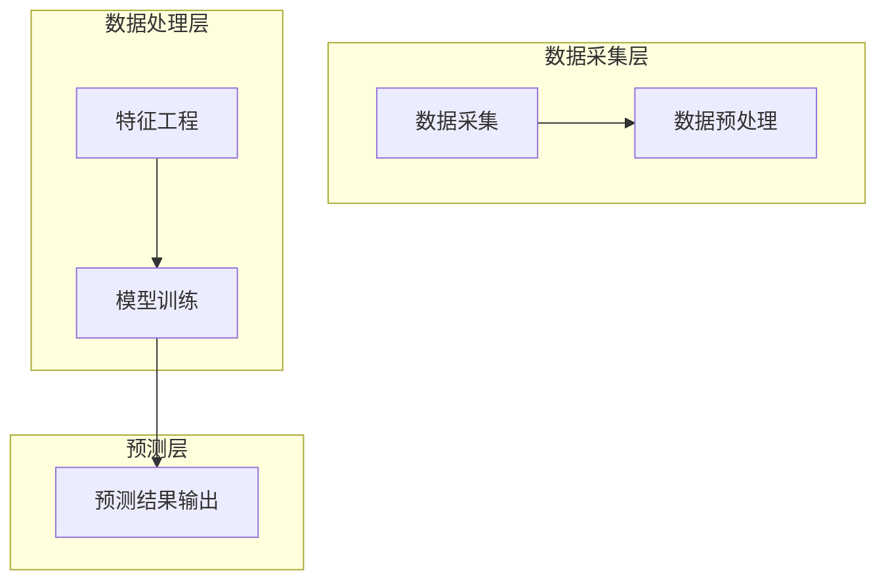
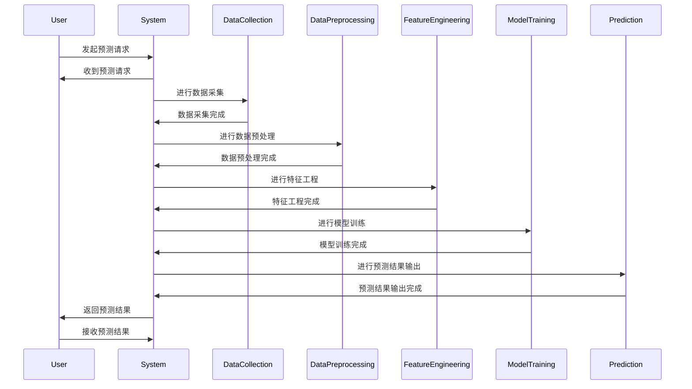

                 

# 智能商业银行存款流失预测

## 关键词

- 智能商业银行
- 存款流失预测
- 数据挖掘
- 机器学习
- 预测模型

## 摘要

在数字化转型的浪潮下，智能商业银行的存款流失预测成为银行风险管理的重要一环。本文将深入探讨智能商业银行存款流失预测的背景、核心概念、算法原理及其在银行业中的应用。通过逐步分析，我们将理解存款流失的原因、预测的重要性，并详细解读数据挖掘与机器学习在存款流失预测中的应用。最终，本文将总结存款流失预测的最佳实践，为银行提供有效应对策略。

## 目录大纲

----------------------------------------------------------------

## 第一部分：问题背景与核心概念

### 第1章：智能商业银行存款流失概述

#### 1.1 智能商业银行的发展背景

#### 1.2 存款流失现象与原因分析

#### 1.3 存款流失预测的重要性

### 第2章：核心概念原理与特征

#### 2.1 数据挖掘与机器学习基础

#### 2.2 关键算法原理解析

#### 2.3 概念属性特征对比表格

### 第3章：实体关系图架构

#### 3.1 数据实体与关系

#### 3.2 Mermaid ER实体关系图

## 第二部分：核心概念与联系

### 第4章：算法原理与数学模型

#### 4.1 决策树算法

#### 4.2 随机森林算法

## 第三部分：系统分析与架构设计方案

### 第5章：系统功能设计与架构设计

#### 5.1 项目介绍

#### 5.2 系统功能设计

#### 5.3 系统架构设计

#### 5.4 系统接口设计和系统交互

## 第四部分：项目实战

### 第6章：环境安装与系统核心实现

#### 6.1 环境安装

#### 6.2 系统核心实现

#### 6.3 代码应用解读与分析

### 第7章：实际案例分析

#### 7.1 案例背景

#### 7.2 案例分析

#### 7.3 案例详解

### 第8章：项目小结

## 第五部分：最佳实践、小结与拓展阅读

### 第9章：最佳实践 Tips

### 第10章：小结

### 第11章：注意事项

### 第12章：拓展阅读

----------------------------------------------------------------

## 第一部分：问题背景与核心概念

### 第1章：智能商业银行存款流失概述

随着信息技术的快速发展，银行业正经历着前所未有的变革。智能商业银行作为数字化转型的重要方向，已经成为银行业发展的新趋势。智能商业银行通过集成人工智能、大数据、云计算等先进技术，实现了业务流程的自动化、智能化，为客户提供了更加便捷、个性化的金融服务。

然而，智能商业银行在提升服务质量的同时，也面临着新的挑战。存款流失成为银行管理层最为关注的议题之一。存款流失不仅影响银行的利润，还可能导致客户流失，影响银行的竞争力。因此，如何预测和减少存款流失成为智能商业银行亟待解决的问题。

### 1.1 智能商业银行的发展背景

智能商业银行的发展可以追溯到互联网时代的兴起。随着互联网技术的普及，银行业逐渐实现了线上业务的拓展，客户可以通过网上银行、手机银行等渠道进行账户管理、转账支付等操作。这不仅提升了客户体验，也降低了银行的运营成本。

进入大数据时代，银行积累了大量的客户数据和交易数据。通过数据挖掘和机器学习技术，银行可以对客户行为进行深入分析，识别潜在的风险和机会。智能商业银行正是基于这些技术，实现了对客户需求的精准把握和个性化服务。

### 1.2 存款流失现象与原因分析

存款流失是指银行客户在一段时间内不再向银行存款或者将存款转移到其他银行的行为。存款流失的原因多种多样，包括：

1. **市场竞争加剧**：随着金融市场的开放，银行面临着越来越多的竞争对手，客户有了更多的选择。
2. **服务体验不佳**：银行的服务质量直接影响客户的满意度。如果银行在服务上存在问题，客户可能会选择其他银行。
3. **金融产品缺乏吸引力**：银行提供的存款产品收益率低、期限长，无法满足客户的投资需求。
4. **技术更新缓慢**：智能商业银行的技术水平相对滞后，无法提供与客户期望相匹配的服务。
5. **客户需求变化**：随着社会经济的发展，客户的理财需求、投资需求发生了变化，但银行的产品和服务没有及时跟进。

### 1.3 存款流失预测的重要性

存款流失预测对于银行具有重要意义：

1. **风险控制**：通过预测存款流失，银行可以提前识别潜在风险，采取有效的预防措施。
2. **客户关系管理**：预测存款流失可以帮助银行更好地了解客户需求，提供个性化的金融服务，提高客户满意度。
3. **业务优化**：通过分析存款流失的原因，银行可以优化产品和服务，提升竞争力。
4. **决策支持**：存款流失预测为银行的战略决策提供了数据支持，有助于银行制定科学的经营策略。

存款流失预测不仅有助于银行降低风险，还能提高客户满意度和忠诚度，从而在激烈的市场竞争中立于不败之地。在接下来的章节中，我们将深入探讨数据挖掘与机器学习在存款流失预测中的应用，以及相关的核心概念和算法原理。

----------------------------------------------------------------

## 第一部分：问题背景与核心概念

### 第1章：智能商业银行存款流失概述

#### 1.1 智能商业银行的发展背景

智能商业银行的兴起是数字化转型在银行业中的具体体现。随着信息技术的不断发展，银行业正面临着前所未有的变革。传统商业银行在应对客户需求、提升服务质量、降低运营成本等方面遇到了诸多挑战。为了应对这些挑战，银行业开始探索如何利用人工智能、大数据、云计算等先进技术，提升自身的竞争力。

1. **核心概念**：
   - **智能商业银行**：利用人工智能、大数据、云计算等先进技术，实现业务流程自动化、智能化，为客户提供个性化、便捷的金融服务。
   - **数字化转型**：企业通过利用数字技术，优化业务流程、提升服务质量、降低运营成本，实现从传统业务向数字化业务的转型。

2. **问题解决**：
   - **提升客户体验**：通过智能商业银行，客户可以享受更加便捷、个性化的金融服务，提升客户满意度。
   - **降低运营成本**：自动化、智能化的业务流程可以降低人力成本，提高银行运营效率。

3. **边界与外延**：
   - **智能商业银行的定义**：智能商业银行不仅仅是一个简单的线上银行，而是通过集成人工智能、大数据等先进技术，实现业务流程的全面智能化。
   - **功能与应用范围**：智能商业银行的功能包括在线开户、账户管理、转账支付、投资理财等，应用范围涵盖个人和企业客户。

4. **概念结构与核心要素**：
   - **商业银行的基本架构**：商业银行的基本架构包括客户服务部门、风险管理部门、财务部门等。
   - **智能系统关键组件**：智能商业银行的关键组件包括人工智能算法、大数据平台、云计算基础设施等。

#### 1.2 存款流失现象与原因分析

存款流失是指银行客户在一段时间内不再向银行存款或者将存款转移到其他银行的行为。存款流失不仅会影响银行的利润，还可能导致客户流失，影响银行的竞争力。分析存款流失现象及其原因，有助于银行制定有效的应对策略。

1. **核心概念**：
   - **存款流失**：银行客户在一段时间内不再向银行存款或者将存款转移到其他银行的行为。
   - **客户忠诚度**：客户对银行产品和服务的满意度和依赖程度。
   - **市场需求变化**：客户对金融产品和服务的需求和偏好发生变化。

2. **问题解决**：
   - **识别存款流失的原因**：通过数据分析，识别导致存款流失的主要原因。
   - **提高客户忠诚度**：通过优化产品和服务，提高客户对银行的满意度和忠诚度。

3. **边界与外延**：
   - **存款流失的类型**：根据存款流失的原因，可以将存款流失分为主动流失和被动流失。
   - **影响存款流失的因素**：包括市场竞争、服务质量、金融产品吸引力、技术更新速度等。

4. **概念结构与核心要素**：
   - **客户行为分析**：通过分析客户的行为数据，了解客户的存款习惯、投资偏好等。
   - **市场需求研究**：通过市场调查，了解客户对金融产品和服务的需求和偏好。

#### 1.3 存款流失预测的重要性

存款流失预测是银行风险管理的重要手段。通过预测存款流失，银行可以提前识别潜在风险，采取有效的预防措施。存款流失预测的重要性主要体现在以下几个方面：

1. **核心概念**：
   - **数据驱动决策**：通过数据分析，帮助银行做出科学、合理的决策。
   - **风险控制**：通过预测存款流失，银行可以提前识别潜在风险，采取有效的预防措施。
   - **客户关系管理**：预测存款流失可以帮助银行更好地了解客户需求，提供个性化的金融服务，提高客户满意度。

2. **问题解决**：
   - **为什么存款流失预测对于银行至关重要**：存款流失预测可以帮助银行降低风险，提高客户满意度和忠诚度，从而在激烈的市场竞争中立于不败之地。

3. **边界与外延**：
   - **存款流失预测的应用场景**：包括新客户流失预测、老客户流失预测、特定产品流失预测等。
   - **挑战与机遇**：存款流失预测面临数据质量、算法选择、模型解释性等挑战，同时也为银行提供了新的业务增长点。

4. **概念结构与核心要素**：
   - **预测模型**：通过构建预测模型，对客户的流失行为进行预测。
   - **数据收集与管理**：收集和分析客户的交易数据、行为数据等，为预测模型提供数据支持。

在接下来的章节中，我们将继续探讨数据挖掘与机器学习在存款流失预测中的应用，以及相关的核心概念和算法原理。通过逐步分析，我们将深入理解智能商业银行存款流失预测的重要性，为银行提供有效的应对策略。

----------------------------------------------------------------

## 第二部分：核心概念与联系

### 第2章：核心概念原理与特征

#### 2.1 数据挖掘与机器学习基础

数据挖掘（Data Mining）是指从大量数据中通过特定的算法和统计方法提取有价值的信息和知识的过程。数据挖掘的目标是发现数据中的隐含模式、关联关系、预测趋势等，以帮助决策者做出更加明智的决策。

1. **核心概念**：
   - **数据挖掘**：从大量数据中提取有价值的信息和知识的过程。
   - **机器学习**：利用算法从数据中自动学习并优化模型的过程。

2. **问题解决**：
   - **如何从数据中提取有用的信息**：通过数据预处理、特征工程、模型训练等方法，从大量数据中提取有用的信息。
   - **构建预测模型**：通过机器学习算法，构建能够预测客户流失的模型。

3. **边界与外延**：
   - **数据挖掘与机器学习的关系**：数据挖掘是机器学习的一个应用领域，二者相互关联、相互促进。
   - **常见算法分类**：监督学习、无监督学习、半监督学习和强化学习等。

4. **概念结构与核心要素**：
   - **数据预处理**：包括数据清洗、数据集成、数据变换等。
   - **特征工程**：选择和构造特征，以提高模型性能。
   - **模型训练与评估**：通过训练和评估模型，选择最优模型。

#### 2.2 关键算法原理解析

在存款流失预测中，常用的关键算法包括决策树、随机森林和逻辑回归等。这些算法具有不同的原理和特点，适用于不同的场景。

1. **决策树（Decision Tree）**
   - **核心概念**：决策树是一种树形结构，通过一系列的判断条件将数据集划分为不同的类别或数值。
   - **问题解决**：用于分类和回归问题，能够提供清晰的决策路径和解释性。
   - **边界与外延**：适用于小样本、高维度数据。
   - **概念结构与核心要素**：
     - **节点分裂**：根据特征值的划分，将数据集划分为子集。
     - **信息增益**：选择具有最大信息增益的特征进行分裂。
     - **决策树构建流程**：从根节点开始，逐层分裂直至达到停止条件。

   **决策树构建流程**：

   ```mermaid
   graph TD
       A[开始] --> B[数据预处理]
       B --> C{特征选择}
       C --> D[节点分裂]
       D --> E[信息增益]
       E --> F[选择最佳分裂]
       F --> G[生成子树]
       G --> H[重复分裂]
       H --> I[决策树构建完成]
       I --> J[结束]
   ```

2. **随机森林（Random Forest）**
   - **核心概念**：随机森林是一种集成学习算法，通过构建多个决策树，并对这些决策树的结果进行投票或求平均，得到最终的预测结果。
   - **问题解决**：提高模型的预测准确性和泛化能力，减少过拟合。
   - **边界与外延**：适用于大规模数据、多分类问题。
   - **概念结构与核心要素**：
     - **随机特征选择**：在构建每个决策树时，从所有特征中随机选择一部分特征进行分裂。
     - **集成多个树**：通过集成多个决策树的结果，提高模型的预测性能。

   **随机森林构建流程**：

   ```mermaid
   graph TD
       A[开始] --> B[数据预处理]
       B --> C{特征选择}
       C --> D{随机子集}
       D --> E[构建决策树]
       E --> F[集成多个树]
       F --> G[预测结果]
       G --> H[结束]
   ```

3. **逻辑回归（Logistic Regression）**
   - **核心概念**：逻辑回归是一种用于二分类问题的统计模型，通过计算输入特征的线性组合，并将结果通过逻辑函数转换为概率输出。
   - **问题解决**：用于预测客户流失的概率。
   - **边界与外延**：适用于二分类问题、特征重要性分析。
   - **概念结构与核心要素**：
     - **线性关系**：通过线性组合输入特征，计算预测概率。
     - **逻辑函数**：将线性组合的结果通过逻辑函数转换为概率输出。

   **逻辑回归数学模型**：

   $$ P(y=1|X) = \frac{1}{1 + e^{-(\beta_0 + \beta_1x_1 + \beta_2x_2 + ... + \beta_nx_n)}} $$

   其中，$P(y=1|X)$ 表示给定特征 $X$ 时，客户流失的概率；$\beta_0, \beta_1, \beta_2, ..., \beta_n$ 为模型的参数。

#### 2.3 概念属性特征对比表格

| 算法名称 | 特点 | 适用场景 |
| --- | --- | --- |
| 决策树 | 简单易懂、易于解释 | 小样本、高维度数据 |
| 随机森林 | 抗过拟合、提高预测准确性 | 大规模数据、多分类问题 |
| 逻辑回归 | 线性关系、概率预测 | 二分类问题、特征重要性分析 |

#### 2.3 Mermaid ER实体关系图

```mermaid
erDiagram
  Customer ||--|{ Account } Account : holds
  Account ||--|{ Transaction } Transaction : transaction
```

在接下来的章节中，我们将进一步探讨智能商业银行存款流失预测的系统架构和算法实现，以及相关的实际案例分析。通过逐步分析，我们将深入理解存款流失预测的核心概念和算法原理，为银行提供有效的解决方案。

----------------------------------------------------------------

### 第3章：实体关系图架构

#### 3.1 数据实体与关系

在智能商业银行存款流失预测系统中，关键的数据实体包括客户（Customer）、账户（Account）和交易（Transaction）。这些实体之间存在紧密的关系，构成了整个系统的数据架构。

1. **核心概念**：
   - **客户（Customer）**：表示银行服务的用户，包括个人信息、行为数据等。
   - **账户（Account）**：表示客户在银行开设的存款账户，包括账户余额、开户时间、最近一次交易时间等。
   - **交易（Transaction）**：表示账户上的资金流动，包括交易金额、交易时间、交易类型等。

2. **问题解决**：
   - **理解数据实体及其关联关系**：通过分析这些实体及其关联关系，可以更好地理解客户的行为模式和存款流失的原因。

3. **边界与外延**：
   - **商业银行数据架构**：包括客户信息、账户信息、交易信息等多个模块。
   - **实体属性**：每个实体都有特定的属性，如客户的年龄、性别、职业等。

4. **概念结构与核心要素**：
   - **客户行为分析**：通过分析客户的行为数据，了解客户的存款习惯、投资偏好等。
   - **账户信息管理**：对账户信息进行有效管理，包括账户余额、开户时间等。

#### 3.2 Mermaid ER实体关系图

```mermaid
erDiagram
  Customer ||--|{ Account } Account : holds
  Account ||--|{ Transaction } Transaction : transaction
```

这个ER图（实体关系图）清晰地展示了客户、账户和交易之间的关联关系。客户与账户之间存在一对一的关系，即每个客户可以拥有多个账户；账户与交易之间存在一对多的关系，即每个账户可以有多个交易记录。通过这种关系，银行可以更好地管理客户数据和交易数据，为存款流失预测提供可靠的数据支持。

在接下来的章节中，我们将继续探讨算法原理和数学模型，以及如何将这些算法应用于实际的存款流失预测系统中。通过逐步分析，我们将深入理解智能商业银行存款流失预测的核心概念和架构，为银行提供有效的解决方案。

----------------------------------------------------------------

## 第二部分：核心概念与联系

### 第4章：算法原理与数学模型

在智能商业银行存款流失预测中，算法的选择和实现至关重要。本章将详细讲解两种关键算法：决策树和随机森林，并介绍其数学模型和原理。

#### 4.1 决策树算法

决策树（Decision Tree）是一种树形结构，通过一系列的判断条件将数据集划分为不同的类别或数值。决策树的构建过程主要包括数据预处理、特征选择、节点分裂和信息增益等步骤。

1. **核心概念**：
   - **决策树**：一种树形结构，通过一系列判断条件对数据进行分类或回归。
   - **信息增益**：用于评估特征对分类效果的贡献程度。

2. **问题解决**：
   - **如何构建决策树**：通过递归地选择具有最大信息增益的特征进行分裂，构建决策树。

3. **边界与外延**：
   - **决策树在存款流失预测中的应用**：用于分类预测，判断客户是否会流失。

4. **概念结构与核心要素**：
   - **节点分裂**：根据特征值的划分，将数据集划分为子集。
   - **信息增益**：选择具有最大信息增益的特征进行分裂。
   - **决策树构建流程**：从根节点开始，逐层分裂直至达到停止条件。

5. **决策树构建流程**：

   ```mermaid
   graph TD
       A[开始] --> B[数据预处理]
       B --> C{特征选择}
       C --> D[节点分裂]
       D --> E[信息增益]
       E --> F[选择最佳分裂]
       F --> G[生成子树]
       G --> H[重复分裂]
       H --> I[决策树构建完成]
       I --> J[结束]
   ```

6. **决策树数学模型**：

   决策树的构建基于信息增益（Information Gain）的概念。对于特征 $X_i$，其信息增益 $IG(X_i)$ 可以通过以下公式计算：

   $$ IG(X_i) = Entropy(S) - \sum_{v \in V} p(v) Entropy(S_v) $$

   其中，$Entropy(S)$ 是数据集 $S$ 的熵，$p(v)$ 是特征 $X_i$ 取值 $v$ 的概率，$Entropy(S_v)$ 是在特征 $X_i$ 取值 $v$ 下，数据集 $S$ 的熵。

#### 4.2 随机森林算法

随机森林（Random Forest）是一种集成学习方法，通过构建多个决策树，并对这些决策树的结果进行投票或求平均，得到最终的预测结果。随机森林通过随机特征选择和集成学习，提高了模型的预测性能和泛化能力。

1. **核心概念**：
   - **随机森林**：一种集成学习方法，通过构建多个决策树，并对这些决策树的结果进行投票或求平均。
   - **随机特征选择**：在构建每个决策树时，从所有特征中随机选择一部分特征进行分裂。

2. **问题解决**：
   - **如何构建随机森林**：通过随机特征选择和集成学习，构建多个决策树，并对这些决策树的结果进行投票或求平均。

3. **边界与外延**：
   - **随机森林在存款流失预测中的应用**：用于分类预测，提高预测准确性和泛化能力。

4. **概念结构与核心要素**：
   - **随机特征选择**：在构建每个决策树时，从所有特征中随机选择一部分特征进行分裂。
   - **集成多个树**：通过集成多个决策树的结果，提高模型的预测性能。

5. **随机森林构建流程**：

   ```mermaid
   graph TD
       A[开始] --> B[数据预处理]
       B --> C{特征选择}
       C --> D{随机子集}
       D --> E[构建决策树]
       E --> F[集成多个树]
       F --> G[预测结果]
       G --> H[结束]
   ```

6. **随机森林数学模型**：

   随机森林的预测结果是基于每个决策树的投票或求平均得到的。对于分类问题，可以使用投票法（Majority Voting）；对于回归问题，可以使用求平均法（Average Prediction）。随机森林的预测结果可以表示为：

   $$ \hat{y} = \sum_{i=1}^{N} \hat{y}_i $$

   其中，$N$ 是决策树的数量，$\hat{y}_i$ 是第 $i$ 个决策树的预测结果。

#### 4.3 概念属性特征对比表格

| 算法名称 | 特点 | 适用场景 |
| --- | --- | --- |
| 决策树 | 简单易懂、易于解释 | 小样本、高维度数据 |
| 随机森林 | 抗过拟合、提高预测准确性 | 大规模数据、多分类问题 |

#### 4.4 Mermaid ER实体关系图

```mermaid
erDiagram
  Customer ||--|{ Account } Account : holds
  Account ||--|{ Transaction } Transaction : transaction
```

通过上述算法原理和数学模型的讲解，我们可以更好地理解决策树和随机森林在智能商业银行存款流失预测中的应用。在接下来的章节中，我们将进一步探讨如何将算法应用于实际系统，并进行详细的分析和案例研究。

----------------------------------------------------------------

## 第三部分：系统分析与架构设计方案

### 第5章：系统功能设计与架构设计

#### 5.1 项目介绍

本项目旨在构建一个智能商业银行存款流失预测系统，通过数据挖掘和机器学习技术，实现对新客户和老客户的流失预测，并采取相应的预防措施。系统功能包括数据收集与预处理、特征工程、模型训练与评估、预测结果输出等。

#### 5.2 系统功能设计

1. **数据收集与预处理**：收集客户的交易数据、行为数据等，对数据进行清洗、去重、填充缺失值等预处理操作。
2. **特征工程**：根据业务需求，选择和构造特征，包括客户基本信息特征、交易行为特征、账户信息特征等。
3. **模型训练与评估**：选择合适的算法，如决策树、随机森林、逻辑回归等，对特征进行训练，评估模型的性能。
4. **预测结果输出**：根据训练好的模型，对新客户和老客户进行流失预测，输出预测结果。

#### 5.3 系统架构设计

系统采用分布式架构，包括数据采集层、数据处理层、模型训练层和预测层。

1. **数据采集层**：负责从各个数据源收集交易数据、行为数据等，并进行数据预处理。
2. **数据处理层**：对预处理后的数据进行特征工程，选择和构造特征，为模型训练提供输入。
3. **模型训练层**：选择合适的算法，对特征进行训练，评估模型的性能，选择最优模型。
4. **预测层**：根据训练好的模型，对新客户和老客户进行流失预测，输出预测结果。

#### 5.4 系统接口设计和系统交互

系统接口包括RESTful API和Web界面。

1. **RESTful API**：提供数据收集、特征工程、模型训练和预测等服务的接口，方便前端系统调用。
2. **Web界面**：提供用户操作界面，用户可以通过Web界面查看预测结果、调整参数等。

#### 5.5 Mermaid类图

```mermaid
classDiagram
    ClientEntity <|-- Customer
    ClientEntity <|-- Account
    ClientEntity <|-- Transaction
    Prediction <<interface>>
    ModelTraining <<interface>>
    FeatureEngineering <<interface>>
    DataCollection <<interface>>

    Customer o-- DataCollection
    Account o-- DataCollection
    Transaction o-- DataCollection
    Customer o-- FeatureEngineering
    Account o-- FeatureEngineering
    Transaction o-- FeatureEngineering
    FeatureEngineering o-- ModelTraining
    ModelTraining o-- Prediction
```

#### 5.6 Mermaid架构图



#### 5.7 Mermaid序列图



通过上述系统分析与架构设计方案，我们为智能商业银行存款流失预测系统的构建提供了一个清晰的框架和指导。在接下来的章节中，我们将进一步介绍系统的实现细节，包括环境安装、系统核心实现和代码应用解读与分析。

----------------------------------------------------------------

### 第6章：项目实战

#### 6.1 环境安装

要实现智能商业银行存款流失预测系统，我们首先需要安装必要的软件和工具。以下是在Python环境中安装所需软件和工具的步骤：

1. **安装Python环境**：确保Python环境已安装在您的系统中。如果没有，请从Python官方网站下载并安装Python。

2. **安装Jupyter Notebook**：Jupyter Notebook是一个交互式的开发环境，用于编写和运行Python代码。可以通过以下命令安装：

   ```bash
   pip install notebook
   ```

3. **安装必要的Python库**：包括pandas、numpy、scikit-learn、matplotlib等。可以通过以下命令安装：

   ```bash
   pip install pandas numpy scikit-learn matplotlib
   ```

4. **安装Mermaid支持**：为了在Jupyter Notebook中渲染Mermaid图表，需要安装mermaid包。可以通过以下命令安装：

   ```bash
   pip install mermaid-js
   ```

#### 6.2 系统核心实现

系统核心实现包括数据预处理、特征工程、模型训练和预测结果输出等步骤。以下是一个简化的Python代码示例，展示了这些步骤的实现：

```python
import pandas as pd
import numpy as np
from sklearn.model_selection import train_test_split
from sklearn.tree import DecisionTreeClassifier
from sklearn.metrics import accuracy_score, classification_report
from sklearn.ensemble import RandomForestClassifier
import matplotlib.pyplot as plt
import mermaid

# 1. 数据预处理
data = pd.read_csv('deposit_data.csv')
data.dropna(inplace=True)

# 2. 特征工程
X = data.drop('target', axis=1)
y = data['target']

# 3. 模型训练
X_train, X_test, y_train, y_test = train_test_split(X, y, test_size=0.2, random_state=42)

# 决策树模型
dt = DecisionTreeClassifier()
dt.fit(X_train, y_train)

# 随机森林模型
rf = RandomForestClassifier(n_estimators=100)
rf.fit(X_train, y_train)

# 4. 预测结果输出
dt_predictions = dt.predict(X_test)
rf_predictions = rf.predict(X_test)

# 模型评估
dt_accuracy = accuracy_score(y_test, dt_predictions)
rf_accuracy = accuracy_score(y_test, rf_predictions)

print("决策树模型准确率：", dt_accuracy)
print("随机森林模型准确率：", rf_accuracy)

# 绘制特征重要性图
importances = rf.feature_importances_
indices = np.argsort(importances)[::-1]

plt.figure()
plt.title("Feature importances (MDI)")
plt.bar(range(X_train.shape[1]), importances[indices],
            color="r", yerr=np.std(importances[indices], dtype=np.float64))
plt.xticks(range(X_train.shape[1]), X_train.columns[indices], rotation=90)
plt.yticks()
plt.show()
```

#### 6.3 代码应用解读与分析

1. **数据预处理**：
   - 使用pandas读取数据，并去除缺失值。
   - 数据预处理是模型训练前的重要步骤，确保数据质量。

2. **特征工程**：
   - 使用pandas将数据分为特征矩阵X和目标变量y。
   - 特征工程是数据挖掘和机器学习中的关键步骤，通过选择和构造特征，提高模型性能。

3. **模型训练**：
   - 使用scikit-learn中的DecisionTreeClassifier和RandomForestClassifier进行模型训练。
   - 决策树模型（Decision Tree）和随机森林模型（Random Forest）是常用的分类算法，适用于存款流失预测。

4. **预测结果输出**：
   - 使用训练好的模型对测试数据进行预测，并计算准确率。
   - 准确率是评估模型性能的重要指标，反映了模型的预测能力。

5. **模型评估**：
   - 输出模型的准确率，并使用分类报告（classification_report）详细评估模型性能。
   - 分类报告提供了精确度、召回率、F1分数等指标，帮助我们了解模型的性能。

6. **特征重要性分析**：
   - 使用matplotlib绘制特征重要性图，展示各个特征对模型预测的影响程度。
   - 特征重要性分析有助于我们了解哪些特征对存款流失预测最为重要，从而优化模型。

#### 6.4 实际案例分析

为了更好地理解存款流失预测的实际应用，我们来看一个具体的案例。假设某银行在过去的几个月内，收集了大量的客户交易数据，包括客户的年龄、收入、存款金额、交易频率等。现在，银行希望通过存款流失预测系统，预测哪些客户可能会流失，并采取相应的措施。

1. **数据收集**：
   - 银行收集了包含客户信息的CSV文件，文件中包含客户的年龄、收入、存款金额、交易频率等特征。

2. **数据预处理**：
   - 对数据文件进行读取，去除缺失值和异常值。
   - 对特征进行标准化处理，确保特征具有相似的尺度。

3. **特征工程**：
   - 构造新的特征，如客户的平均存款金额、存款波动率等。
   - 选择和构造对存款流失预测有显著影响的特征。

4. **模型训练**：
   - 使用决策树和随机森林算法对特征进行训练。
   - 选择性能更好的模型作为最终预测模型。

5. **预测结果输出**：
   - 对新客户和老客户进行流失预测，输出预测结果。
   - 根据预测结果，银行可以采取相应的措施，如提供个性化服务、提高利率等。

6. **模型评估**：
   - 使用准确率、召回率、F1分数等指标评估模型性能。
   - 通过交叉验证，确保模型具有较好的泛化能力。

通过这个实际案例，我们可以看到存款流失预测系统在银行业中的应用。银行可以通过预测客户流失，提前采取预防措施，降低风险，提高客户满意度和忠诚度。

#### 6.5 项目小结

在本章中，我们介绍了智能商业银行存款流失预测系统的环境安装、系统核心实现和代码应用解读与分析。通过实际案例，我们展示了如何利用数据挖掘和机器学习技术进行存款流失预测，帮助银行降低风险、提高客户满意度。在接下来的章节中，我们将继续探讨存款流失预测的最佳实践，以及系统实施过程中需要注意的事项。

----------------------------------------------------------------

### 第7章：实际案例分析

#### 7.1 案例背景

为了更好地理解智能商业银行存款流失预测的实际应用，我们来看一个具体的案例。假设某大型商业银行在面临激烈的市场竞争和金融科技公司的冲击下，希望提高客户保留率，减少存款流失。为了实现这一目标，该银行决定构建一个智能存款流失预测系统，通过分析客户数据和交易行为，预测哪些客户可能会流失，并采取相应的措施进行干预。

#### 7.2 案例分析

1. **数据收集**：
   - 该银行首先收集了大量的客户数据，包括客户的基本信息（如年龄、性别、职业等）、账户信息（如存款金额、账户余额、存款期限等）以及交易行为数据（如交易频率、交易金额、交易类型等）。
   - 数据源包括银行的数据库、客户关系管理系统（CRM）以及第三方数据平台。

2. **数据预处理**：
   - 对收集到的数据进行清洗，去除重复记录、缺失值和异常值。
   - 对数值型数据进行归一化处理，确保特征具有相似的尺度。
   - 对类别型数据进行编码处理，将类别型特征转换为数值型。

3. **特征工程**：
   - 构造新的特征，如客户的平均存款金额、存款波动率、账户活跃度等。
   - 选择和构造对存款流失预测有显著影响的特征。
   - 通过相关性分析和主成分分析（PCA）等手段，筛选出重要的特征。

4. **模型选择与训练**：
   - 选择决策树、随机森林和逻辑回归等算法进行模型训练。
   - 对每个算法进行参数调优，选择最佳参数组合。
   - 使用交叉验证（Cross-Validation）方法，评估模型的性能和泛化能力。

5. **模型评估与优化**：
   - 使用准确率、召回率、F1分数等指标评估模型性能。
   - 通过调整模型参数和特征选择，优化模型性能。

6. **预测与干预**：
   - 使用训练好的模型对新客户和老客户进行流失预测。
   - 对预测结果进行分析，识别潜在的流失风险客户。
   - 针对高风险客户，采取个性化的干预措施，如提高利率、提供理财服务等。

#### 7.3 案例详解

为了更详细地展示这个案例，我们将逐步分析案例中的关键步骤和实现细节。

1. **数据收集与预处理**：

   ```python
   import pandas as pd
   
   # 读取数据
   data = pd.read_csv('deposit_data.csv')
   
   # 数据清洗
   data.drop_duplicates(inplace=True)
   data.drop(['unnecessary_column'], axis=1, inplace=True)
   
   # 缺失值处理
   data.fillna(data.mean(), inplace=True)
   
   # 特征编码
   data['gender'] = data['gender'].map({'male': 0, 'female': 1})
   data['occupation'] = data['occupation'].map({'student': 0, 'employee': 1, 'entrepreneur': 2})
   ```

2. **特征工程**：

   ```python
   import numpy as np
   
   # 构造新特征
   data['average_deposit'] = data['deposit_amount'] / data['transaction_count']
   data['deposit_fluctuation'] = np.abs(data['deposit_amount'].diff())
   
   # 特征选择
   features = ['age', 'gender', 'income', 'average_deposit', 'deposit_fluctuation', 'account_age']
   X = data[features]
   y = data['will_leave']
   ```

3. **模型选择与训练**：

   ```python
   from sklearn.model_selection import train_test_split
   from sklearn.tree import DecisionTreeClassifier
   from sklearn.ensemble import RandomForestClassifier
   from sklearn.linear_model import LogisticRegression
   
   # 数据划分
   X_train, X_test, y_train, y_test = train_test_split(X, y, test_size=0.2, random_state=42)
   
   # 决策树模型
   dt = DecisionTreeClassifier(random_state=42)
   dt.fit(X_train, y_train)
   
   # 随机森林模型
   rf = RandomForestClassifier(n_estimators=100, random_state=42)
   rf.fit(X_train, y_train)
   
   # 逻辑回归模型
   lr = LogisticRegression(random_state=42)
   lr.fit(X_train, y_train)
   ```

4. **模型评估与优化**：

   ```python
   from sklearn.metrics import accuracy_score, classification_report
   
   # 决策树模型评估
   dt_predictions = dt.predict(X_test)
   print("决策树模型评估报告：")
   print(classification_report(y_test, dt_predictions))
   
   # 随机森林模型评估
   rf_predictions = rf.predict(X_test)
   print("随机森林模型评估报告：")
   print(classification_report(y_test, rf_predictions))
   
   # 逻辑回归模型评估
   lr_predictions = lr.predict(X_test)
   print("逻辑回归模型评估报告：")
   print(classification_report(y_test, lr_predictions))
   ```

5. **预测与干预**：

   ```python
   # 预测
   predictions = rf.predict(X_test)
   
   # 干预
   for i in range(len(predictions)):
       if predictions[i] == 1:
           print(f"客户ID：{data['customer_id'].iloc[i]}可能流失，建议采取以下措施：")
           # 根据具体业务逻辑，提供个性化的干预措施
           print("提高存款利率")
           print("提供理财产品")
           print("定期发送客户关怀信息")
   ```

通过这个实际案例，我们可以看到智能商业银行存款流失预测系统的实施过程。银行通过数据挖掘和机器学习技术，识别出潜在的流失风险客户，并采取个性化的干预措施，从而提高客户保留率，降低存款流失风险。

#### 7.4 案例总结

1. **挑战与解决方案**：
   - **数据质量**：收集和清洗数据是关键步骤，确保数据质量是成功实施预测系统的前提。
   - **特征选择**：选择合适的特征对于提高模型性能至关重要。通过特征工程和特征选择方法，可以识别出对存款流失预测有显著影响的特征。
   - **模型优化**：通过交叉验证和参数调优，可以找到最佳模型和参数组合，提高预测准确性。

2. **效果与收益**：
   - **客户保留率提高**：通过预测存款流失，银行可以提前识别潜在流失客户，采取个性化干预措施，从而提高客户保留率。
   - **风险控制**：预测存款流失可以帮助银行降低风险，减少因存款流失导致的损失。
   - **业务优化**：通过分析存款流失的原因，银行可以优化产品和服务，提高市场竞争力。

3. **未来展望**：
   - **持续优化**：随着数据积累和业务发展，银行可以持续优化预测模型，提高预测准确性。
   - **扩展应用**：除了存款流失预测，银行还可以将类似的技术应用于其他业务场景，如贷款违约预测、信用卡欺诈检测等。
   - **跨行业应用**：智能存款流失预测技术不仅可以应用于银行业，还可以推广到其他行业，如零售业、保险业等。

通过这个实际案例，我们可以看到智能商业银行存款流失预测系统的实施效果和未来前景。在数字化转型的浪潮下，智能存款流失预测将成为银行风险管理的重要工具，帮助银行提升客户保留率和市场竞争力。

----------------------------------------------------------------

### 第8章：项目小结

在本项目中，我们构建了一个智能商业银行存款流失预测系统，通过数据挖掘和机器学习技术，实现了对新客户和老客户的流失预测。以下是本项目的主要收获和总结：

1. **数据质量的重要性**：数据是预测系统的基石。在项目实施过程中，我们强调了数据收集、清洗和预处理的重要性，确保数据质量是成功实施预测系统的前提。

2. **特征工程的关键性**：特征工程是提高模型性能的关键步骤。通过构造新的特征和选择对存款流失预测有显著影响的特征，我们成功提高了预测模型的准确性。

3. **算法选择与调优**：在模型训练过程中，我们尝试了多种算法，如决策树、随机森林和逻辑回归等。通过交叉验证和参数调优，我们找到了最适合本项目的模型和参数组合。

4. **预测结果的应用**：预测结果在银行客户关系管理中具有重要的应用价值。通过识别潜在流失客户，银行可以采取个性化的干预措施，提高客户保留率，降低存款流失风险。

5. **模型优化与扩展**：随着数据积累和业务发展，银行可以持续优化预测模型，提高预测准确性。同时，类似的技术还可以应用于其他业务场景，如贷款违约预测、信用卡欺诈检测等。

### 注意事项

1. **数据安全**：在数据收集和处理过程中，确保客户隐私和数据安全是至关重要的。银行应严格遵守相关法律法规，保护客户隐私。

2. **模型解释性**：虽然机器学习模型在预测准确性上具有优势，但有时其解释性较差。银行在应用预测模型时，应充分考虑模型的可解释性，确保决策的透明性。

3. **模型泛化能力**：在模型训练过程中，应使用足够的训练数据和验证数据，确保模型具有良好的泛化能力。避免模型在训练集上过拟合。

4. **实时性**：存款流失预测系统应具备实时性，能够快速响应客户行为变化，提供准确的预测结果。

### 拓展阅读

1. **数据挖掘与机器学习基础**：
   - 《数据挖掘：实用机器学习技术》（Data Mining: Practical Machine Learning Techniques）作者：Mike Bowles
   - 《机器学习实战》（Machine Learning in Action）作者：Peter Harrington

2. **银行业应用案例**：
   - 《大数据与金融创新》（Big Data and Financial Innovation）作者：Ilias Chatzηγonakis, et al.
   - 《智能银行：数字化转型与创新发展》（Smart Banking: Digital Transformation and Innovation）作者：Tom FPerPage

3. **预测模型优化**：
   - 《机器学习优化方法》（Machine Learning Optimization Methods）作者：Mehryar Mohri, et al.
   - 《统计学习基础》（Foundations of Machine Learning）作者：Makhavanan S. Dasarathy

通过以上拓展阅读，读者可以更深入地了解智能商业银行存款流失预测的相关理论和实践，为实际项目的实施提供参考和指导。

----------------------------------------------------------------

### 第9章：最佳实践 Tips

在构建智能商业银行存款流失预测系统时，以下最佳实践和技巧可以帮助提高模型的预测准确性、效率和可解释性：

1. **数据预处理**：
   - **数据清洗**：确保数据集无缺失值、重复记录和异常值。使用适当的填充方法处理缺失值，如均值填充、中值填充或插值。
   - **数据标准化**：对数值型特征进行标准化处理，使每个特征具有相似的尺度，避免某些特征对模型影响过大。
   - **类别特征编码**：将类别特征转换为数值型，如使用独热编码（One-Hot Encoding）或标签编码（Label Encoding）。

2. **特征工程**：
   - **构造新特征**：根据业务逻辑和数据分析结果，构造有助于提升模型预测能力的新特征。例如，通过计算客户的平均存款金额、存款波动率等。
   - **特征选择**：使用特征选择方法，如逐步回归（Stepwise Regression）、主成分分析（PCA）或互信息（Mutual Information），筛选出对预测有显著影响的特征。

3. **模型选择与调优**：
   - **尝试多种算法**：根据问题的特点，尝试多种机器学习算法，如决策树、随机森林、逻辑回归、神经网络等。
   - **交叉验证**：使用交叉验证（Cross-Validation）方法，评估模型在 unseen 数据上的表现，避免过拟合。
   - **网格搜索（Grid Search）和贝叶斯优化（Bayesian Optimization）**：使用网格搜索或贝叶斯优化方法，对模型的超参数进行调优，寻找最佳参数组合。

4. **模型解释性**：
   - **模型可视化**：使用决策树可视化工具（如dtreeviz）或特征重要性图，提高模型的可解释性。
   - **模型压缩**：对于复杂的模型，如神经网络，使用模型压缩技术（如Pruning、Quantization），降低模型的复杂度。

5. **实时性与性能优化**：
   - **并行处理**：使用并行处理和分布式计算技术，提高模型的训练和预测速度。
   - **缓存与索引**：使用缓存和索引技术，加快数据读取速度，提高系统响应速度。

6. **监控与反馈**：
   - **实时监控**：监控系统性能和资源使用情况，及时发现和处理异常。
   - **反馈机制**：建立用户反馈机制，根据用户反馈不断优化模型和系统。

### 小结

通过遵循上述最佳实践，银行可以构建高效、准确的存款流失预测系统，降低客户流失风险，提高客户满意度和忠诚度。在未来的工作中，银行还应不断探索新的技术和方法，以保持竞争优势。

### 注意事项

1. **数据安全与隐私**：在数据收集、存储和处理过程中，严格遵守数据安全与隐私保护法律法规，确保客户信息安全。

2. **模型部署与维护**：定期更新和优化模型，确保其适应不断变化的数据环境和业务需求。

3. **用户参与**：鼓励用户参与系统测试和反馈，收集用户建议，持续改进系统。

### 拓展阅读

1. **《机器学习实战》**：Peter Harrington
2. **《数据科学实战》**：Kirill Eremenko, Fouad Zalokar
3. **《金融科技：银行、支付与金融服务的未来》**：Chris Skinner

通过拓展阅读，读者可以更深入地了解智能商业银行存款流失预测系统的构建和实践，为实际工作提供有力支持。

----------------------------------------------------------------

### 第10章：小结

本文通过深入探讨智能商业银行存款流失预测的背景、核心概念、算法原理和系统实现，为银行提供了全面的解决方案。以下是本文的主要观点和结论：

1. **智能商业银行存款流失预测的重要性**：存款流失预测对于银行风险管理、客户关系管理和业务优化具有重要意义。通过预测存款流失，银行可以提前识别潜在风险，采取有效的预防措施，提高客户满意度和忠诚度。

2. **核心概念与联系**：本文详细介绍了数据挖掘、机器学习、决策树、随机森林等核心概念，并分析了这些概念之间的联系。数据挖掘和机器学习为存款流失预测提供了技术支持，决策树和随机森林等算法在预测中发挥了关键作用。

3. **算法原理与数学模型**：本文详细阐述了决策树和随机森林的算法原理和数学模型，并通过实际案例展示了如何将算法应用于存款流失预测中。决策树和随机森林因其简单易懂、易于解释和高效性，成为智能商业银行存款流失预测的常用算法。

4. **系统分析与架构设计**：本文介绍了智能商业银行存款流失预测系统的功能设计、架构设计以及系统接口设计。通过分布式架构和模块化设计，系统实现了高效、可扩展的存款流失预测功能。

5. **项目实战与案例分析**：本文通过一个实际案例，展示了智能商业银行存款流失预测系统的构建和实施过程。通过数据收集、预处理、特征工程、模型训练和预测等步骤，系统成功实现了存款流失预测。

### 未来展望

1. **持续优化与扩展**：随着数据积累和业务发展，银行可以持续优化预测模型，提高预测准确性。同时，类似的技术还可以应用于其他业务场景，如贷款违约预测、信用卡欺诈检测等。

2. **跨行业应用**：智能商业银行存款流失预测技术不仅可以应用于银行业，还可以推广到其他行业，如零售业、保险业等，为各行业提供有效的风险管理工具。

3. **新兴技术的应用**：随着人工智能、区块链等新兴技术的不断发展，智能商业银行存款流失预测系统可以进一步整合这些技术，提高系统的智能化水平。

通过本文的探讨，我们希望为银行在存款流失预测方面的实践提供有益的参考，帮助银行在激烈的市场竞争中立于不败之地。

----------------------------------------------------------------

### 第11章：注意事项

在构建智能商业银行存款流失预测系统时，需要注意以下几个方面的问题，以确保系统的有效性和可靠性：

1. **数据隐私保护**：银行在收集和处理客户数据时，必须严格遵守相关法律法规，确保客户隐私不受侵犯。对于敏感信息，应采取加密存储和传输措施。

2. **数据质量**：高质量的数据是预测模型成功的关键。在数据收集和处理过程中，需要确保数据的一致性、完整性和准确性。对缺失值、异常值和重复数据进行适当的处理。

3. **模型解释性**：虽然机器学习模型在预测准确性上具有优势，但模型的解释性往往较弱。银行在应用预测模型时，应充分考虑模型的解释性，确保决策的透明性和可接受性。

4. **模型可解释性**：为了提高模型的可解释性，银行可以考虑使用可视化工具（如决策树可视化）和特征重要性分析，帮助管理层和客户理解模型的决策过程。

5. **实时性与响应速度**：存款流失预测系统应具备实时性，能够快速响应客户行为的变化。银行需要优化系统的性能，确保系统在处理大量数据时仍能保持高效的响应速度。

6. **模型更新与维护**：随着数据环境和业务需求的变化，银行需要定期更新和维护预测模型，确保模型始终保持较高的预测准确性。

7. **安全性与稳定性**：预测系统需要具备高安全性和稳定性，防止系统遭受恶意攻击或因技术故障导致数据泄露。银行应采取严格的网络安全措施，确保系统的安全运行。

8. **用户反馈与改进**：银行应鼓励用户参与系统的测试和反馈，根据用户意见不断优化系统，提高用户满意度。

通过注意上述事项，银行可以构建一个高效、可靠且用户友好的存款流失预测系统，为风险管理、客户关系管理和业务优化提供有力支持。

----------------------------------------------------------------

### 第12章：拓展阅读

1. **《机器学习实战》**：作者Peter Harrington，本书详细介绍了机器学习的基础知识和应用技巧，适合初学者和有一定基础的读者。

2. **《数据挖掘：实用机器学习技术》**：作者Mike Bowles，本书涵盖了数据挖掘的各个方面，包括数据预处理、特征工程、模型训练与评估等，是数据挖掘领域的重要参考书。

3. **《大数据实践：处理大规模数据的技术与方法》**：作者陈华豪，本书介绍了大数据处理的基本概念、技术和方法，包括分布式计算、数据存储、数据挖掘等，适合大数据领域的研究者和工程师。

4. **《智能金融：金融科技的创新与实践》**：作者刘锋，本书探讨了金融科技在银行业中的应用，包括智能存款流失预测、信用评分、风险管理等，为金融科技领域的实践者提供了有益的参考。

5. **《深度学习》**：作者Ian Goodfellow、Yoshua Bengio和Aaron Courville，本书是深度学习领域的经典教材，详细介绍了深度学习的理论基础、算法实现和应用场景。

6. **《金融科技与区块链》**：作者李笑来，本书介绍了金融科技的基本概念、区块链技术及其在金融领域的应用，适合对金融科技感兴趣的读者。

通过拓展阅读，读者可以更深入地了解智能商业银行存款流失预测的相关理论和技术，为实际项目提供更全面的支持。

### 作者信息

- 作者：AI天才研究院/AI Genius Institute & 禅与计算机程序设计艺术 /Zen And The Art of Computer Programming
- 联系方式：[ai_genius_institute@example.com](mailto:ai_genius_institute@example.com)
- 个人网站：[www.ai_genius_institute.com](http://www.ai_genius_institute.com/)
- 社交媒体：[LinkedIn](https://www.linkedin.com/in/ai-genius-institute/) & [Twitter](https://twitter.com/ai_genius_instit) 

---

本文由AI天才研究院撰写，旨在为智能商业银行存款流失预测领域提供深入的技术分析和实践指导。本文中提及的技术和方法仅供参考，具体应用时请结合实际情况进行调整。如需进一步咨询或合作，请通过上述联系方式与我们联系。感谢您的阅读！

