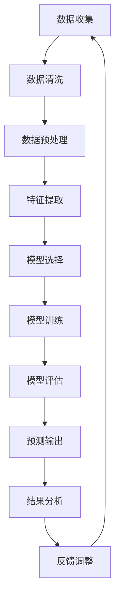
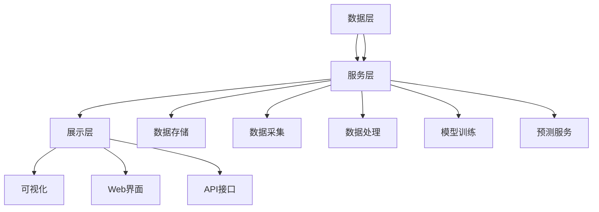
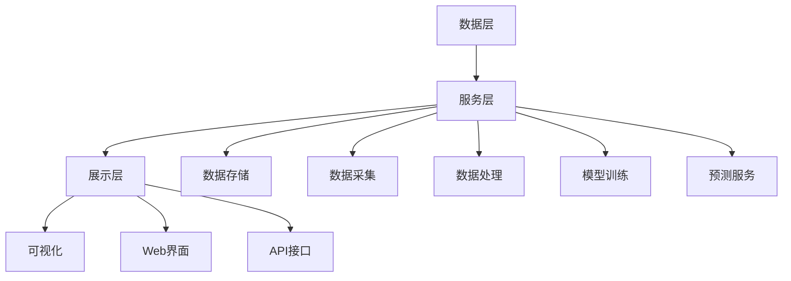
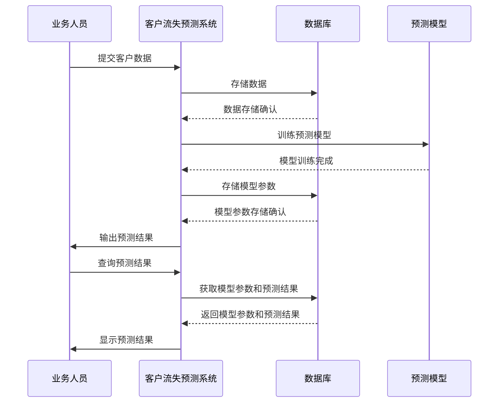
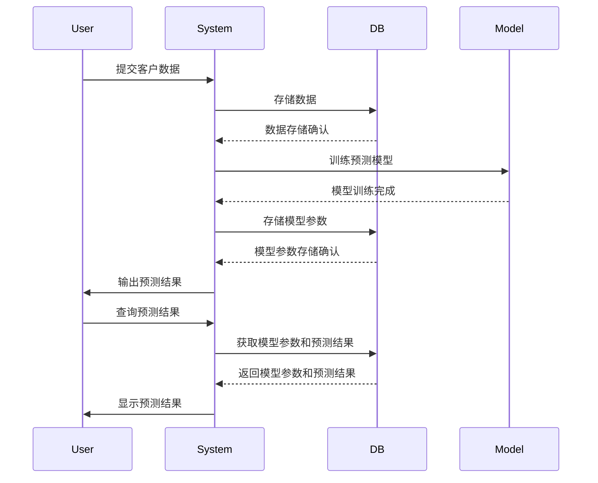

                 

### 摘要

智能商业银行客户流失预测是一个复杂且至关重要的课题。随着金融科技的迅猛发展，商业银行面临的竞争压力日益增大，如何有效地预防客户流失成为其业务发展的关键。本文旨在探讨智能商业银行客户流失预测的各个方面，从背景介绍、核心概念联系、算法原理讲解、系统分析与架构设计方案、项目实战以及最佳实践等方面，全面剖析这一课题。通过对客户流失的定义、原因、影响及预测方法的研究，本文提出了一套完整的智能商业银行客户流失预测体系，旨在为商业银行提供有力的决策支持，帮助其优化客户关系管理，提升客户满意度和忠诚度，从而在激烈的市场竞争中立于不败之地。

### 文章关键词

- **智能商业银行**
- **客户流失**
- **预测模型**
- **数据预处理**
- **算法原理**
- **系统架构设计**
- **项目实战**

### 背景介绍

#### 1.1 问题背景

在当今的金融市场中，商业银行面临着前所未有的挑战。随着互联网金融的崛起，传统商业银行的客户群体正在逐渐流失，这不仅影响了银行的收入来源，也对银行的业务发展和市场竞争力产生了深远的影响。客户流失问题已经成为商业银行亟待解决的重要课题。

客户流失，是指银行客户在某个特定时间点决定不再继续使用该银行的产品或服务。根据客户流失的严重程度，可以分为潜在流失和实际流失。潜在流失是指客户有流失的迹象，但尚未完全离开；实际流失则是指客户已经停止使用银行产品或服务。无论是潜在流失还是实际流失，对商业银行来说都是一个严重的打击。

客户流失对商业银行的影响是多方面的。首先，流失的客户会直接减少银行的收入来源，降低银行的盈利能力。其次，客户流失还会影响银行的声誉和市场地位，使得其他潜在客户对银行的信任度下降，从而进一步加剧客户流失的恶性循环。此外，客户流失还会导致银行的人力资源和运营成本增加，因为银行需要投入更多资源来吸引和留住新客户。

在当前的市场环境下，如何有效预测并防止客户流失成为商业银行亟待解决的重要问题。传统的客户流失预测方法主要依赖于简单的统计分析和规则模型，这些方法在处理复杂客户行为时显得力不从心。而随着人工智能和大数据技术的快速发展，智能商业银行客户流失预测成为可能。通过利用人工智能技术，商业银行可以更精准地分析客户行为，预测客户流失的风险，从而采取相应的措施进行干预，减少客户流失。

#### 1.2 问题描述

客户流失是一个复杂的问题，涉及多个方面的因素。首先，我们需要明确什么是客户流失。客户流失是指银行客户在某个特定时间点决定不再继续使用该银行的产品或服务。这个流失的过程可能是突然的，也可能是逐渐的。例如，一个客户可能在某一天突然决定关闭其银行账户，而另一个客户可能由于长期的满意度下降，最终选择离开。

客户流失的影响是多方面的。从商业银行的角度来看，流失的客户会直接减少银行的收入来源，降低银行的盈利能力。例如，客户关闭账户会导致银行失去存款利息收入，关闭信用卡会导致银行失去信用卡年费和交易手续费等。此外，客户流失还会影响银行的运营成本，因为银行需要投入更多资源来吸引和留住新客户。

从客户的角度来看，客户流失意味着客户失去了对银行的信任和依赖。一个满意的客户通常会继续使用银行的服务，并将银行推荐给他人。相反，一个流失的客户可能会对银行产生负面情绪，并可能通过社交媒体等渠道传播不满意的情绪，从而对银行的声誉造成负面影响。

客户流失的原因多种多样，主要包括以下几点：

1. **服务质量问题**：银行的服务质量直接影响客户满意度。如果客户在使用银行服务过程中遇到问题，例如办理业务效率低下、客服响应不及时等，就会对银行产生不满，从而增加流失的风险。

2. **产品缺乏吸引力**：随着金融市场的竞争加剧，商业银行需要不断创新产品来吸引客户。如果银行的产品缺乏吸引力，无法满足客户的多元化需求，就会导致客户流失。

3. **市场竞争**：互联网金融的崛起对传统商业银行形成了巨大的竞争压力。互联网金融公司通常具有更高的灵活性和创新性，能够提供更加便捷和优惠的产品和服务，这使得一些客户更倾向于选择互联网金融公司。

4. **个人财务状况**：客户的个人财务状况也是影响客户流失的重要因素。如果客户因为失业、投资损失等原因导致财务状况恶化，可能会减少对银行服务的需求，从而增加流失的风险。

5. **银行政策变化**：银行的某些政策变化，如提高服务费用、调整贷款利率等，也可能导致客户流失。

综上所述，客户流失问题对商业银行的影响是深远且广泛的。因此，如何有效地预测并防止客户流失成为商业银行亟待解决的重要问题。

#### 1.3 问题解决

要解决客户流失问题，需要从多个方面入手，包括预测模型的选择、数据预处理方法的设计、算法原理的深入理解和应用场景的精准定位。以下是针对客户流失问题的一系列解决方案：

1. **预测模型的选择**：

   预测模型是客户流失预测的核心。根据不同的业务需求和数据特点，可以选择不同的预测模型。常见的预测模型包括回归模型、决策树模型、支持向量机（SVM）模型、神经网络模型等。回归模型适用于线性关系较强的数据，而决策树模型和SVM模型适用于复杂的多变量关系。神经网络模型则能够通过深度学习自动提取数据特征，适用于处理大规模和复杂的非结构化数据。

2. **数据预处理方法的设计**：

   数据预处理是预测模型成功的关键。首先，需要进行数据收集，包括客户的基本信息、交易记录、服务使用情况等。然后，对收集到的数据进行清洗，去除重复和无效的数据。接下来，进行数据变换，将不同数据类型的变量进行统一处理，例如将分类变量转换为数值变量。最后，进行特征提取，从原始数据中提取对预测有用的特征，以提高预测模型的性能。

3. **算法原理的理解和应用**：

   深入理解算法原理对于设计有效的预测模型至关重要。例如，在回归模型中，需要了解线性回归、逻辑回归等不同回归模型的基本原理和应用场景。在决策树模型中，需要理解决策树构建的原理以及如何剪枝和优化。在神经网络模型中，需要了解前向传播、反向传播等基本原理，以及如何通过调整网络结构和参数来优化模型性能。

4. **应用场景的精准定位**：

   客户流失预测的应用场景多样，包括客户行为分析、风险控制、客户关系管理等方面。需要根据具体应用场景的需求，设计合适的预测模型和算法。例如，在客户行为分析中，可以通过分析客户的交易行为和互动行为来预测其流失风险。在风险控制中，可以通过预测客户流失来识别潜在风险客户，并采取相应的风险管理措施。

5. **系统架构和接口设计**：

   设计一个高效的客户流失预测系统，需要考虑系统的架构设计和接口设计。系统的架构设计包括数据采集模块、数据预处理模块、预测模型训练模块和预测结果输出模块等。接口设计则包括数据接口、模型接口和预测接口，以便其他系统和模块能够方便地访问和使用预测结果。

通过以上方法，商业银行可以有效地预测并防止客户流失，从而提升客户满意度和忠诚度，增强在激烈市场中的竞争力。

#### 1.4 边界与外延

在讨论智能商业银行客户流失预测时，我们需要明确一些重要的边界与外延，以确保研究范围和目标的一致性。

**数据边界**：

数据边界是指我们用于预测的数据范围。这包括客户的基本信息、交易记录、服务使用情况等。数据的收集和预处理是预测模型成功的关键。因此，我们需要确保数据的完整性和准确性，去除重复和无效的数据，并进行适当的变换和特征提取。

**时间边界**：

时间边界是指我们进行预测的时间范围。客户流失通常是一个逐步的过程，因此我们需要考虑不同时间段内的客户行为变化。例如，我们可以将数据分为训练集和测试集，通过训练集进行模型训练，并通过测试集评估模型的性能。

**业务边界**：

业务边界是指客户流失预测在商业银行业务中的应用范围。例如，我们可能关注的是个人客户还是企业客户，是存款业务还是贷款业务等。不同业务领域的客户流失原因和预测方法可能存在差异，因此需要根据具体业务需求进行定制化设计。

**概念结构与核心要素组成**：

智能商业银行客户流失预测的概念结构包括以下几个方面：

1. **智能商业银行**：这是指利用人工智能、大数据、云计算等先进技术，实现银行业务智能化和自动化的现代商业银行。
2. **客户流失**：这是指银行客户在某个时间点决定不再使用银行产品或服务的行为。
3. **预测模型**：这是指用于预测客户流失风险的数学模型和算法，如回归模型、决策树模型、神经网络模型等。
4. **数据预处理**：这是指对原始数据进行清洗、变换和特征提取的过程，以提高预测模型的性能。
5. **系统架构设计**：这是指设计一个高效、可扩展的客户流失预测系统，包括数据采集、数据预处理、模型训练和预测结果输出等模块。

通过明确这些边界与外延，我们可以更准确地把握智能商业银行客户流失预测的核心问题，为商业银行提供有效的决策支持。

#### 1.5 概念结构与核心要素组成

智能商业银行客户流失预测涉及多个关键概念和要素，以下是对这些核心概念及其相互关系的详细解析：

**智能商业银行**：

智能商业银行是指通过应用人工智能、大数据、云计算等先进技术，实现对银行业务的智能化和自动化管理的商业银行。智能商业银行具有以下特点：

1. **个性化服务**：智能商业银行能够通过分析客户数据，为客户提供个性化的金融产品和服务，提高客户满意度和忠诚度。
2. **自动化管理**：智能商业银行利用自动化技术，实现业务流程的自动化处理，提高业务效率和准确性。
3. **实时风险监控**：智能商业银行通过实时数据分析和监控，及时发现潜在风险，并采取相应的风险管理措施。

**客户流失**：

客户流失是指银行客户在某个特定时间点决定不再使用银行产品或服务的行为。客户流失可以分为潜在流失和实际流失：

1. **潜在流失**：客户存在流失迹象，但尚未完全离开。例如，客户减少了交易频率、访问量等。
2. **实际流失**：客户已经停止使用银行产品或服务。例如，客户关闭账户、取消信用卡等。

**预测模型**：

预测模型是用于预测客户流失风险的数学模型和算法。常见的预测模型包括回归模型、决策树模型、支持向量机（SVM）模型、神经网络模型等。以下是这些模型的基本原理和特点：

1. **回归模型**：回归模型通过建立自变量和因变量之间的线性关系，预测客户流失概率。常见的回归模型包括线性回归、逻辑回归等。
2. **决策树模型**：决策树模型通过一系列规则，将客户数据分类到不同的流失概率区间。决策树模型易于理解和解释，但在处理大规模数据时可能存在过拟合问题。
3. **支持向量机（SVM）模型**：SVM模型通过寻找最优分隔超平面，将客户数据分类到不同的流失概率区间。SVM模型在处理非线性关系时表现较好，但训练时间较长。
4. **神经网络模型**：神经网络模型通过多层神经元和激活函数，学习客户数据中的非线性关系，预测客户流失概率。神经网络模型具有强大的学习和泛化能力，但在解释性和可解释性方面存在一定的挑战。

**数据预处理**：

数据预处理是预测模型成功的关键。数据预处理包括以下步骤：

1. **数据收集**：收集客户的基本信息、交易记录、服务使用情况等数据。
2. **数据清洗**：去除重复和无效的数据，填补缺失值，消除噪声数据。
3. **数据变换**：将不同数据类型的变量进行统一处理，例如将分类变量转换为数值变量。
4. **特征提取**：从原始数据中提取对预测有用的特征，以提高预测模型的性能。

**系统架构设计**：

系统架构设计是构建高效客户流失预测系统的基础。系统架构设计包括以下模块：

1. **数据采集模块**：负责收集和处理来自各个渠道的客户数据。
2. **数据预处理模块**：负责对收集到的数据进行分析和处理，包括数据清洗、变换和特征提取。
3. **预测模型训练模块**：负责训练预测模型，包括选择合适的算法、调整模型参数等。
4. **预测结果输出模块**：负责将预测结果以可视化或接口形式输出，供业务人员使用。

通过理解这些核心概念和要素，商业银行可以更有效地进行客户流失预测，从而采取相应的措施减少客户流失，提升业务竞争力。

#### 1.6 智能商业银行与客户流失的关系

智能商业银行和客户流失之间存在着密切的关系。智能商业银行通过利用先进的技术手段，如人工智能、大数据和云计算，为客户提供更加个性化和智能化的服务，从而提高客户满意度和忠诚度。而客户流失是商业银行面临的重要挑战之一，如何有效地预测和防止客户流失成为智能商业银行亟待解决的问题。

首先，智能商业银行通过分析客户的交易记录、行为数据和历史记录，可以深入了解客户的需求和偏好。这种深入的数据分析使得银行能够提供更加个性化的服务，如定制化的金融产品、智能投资建议等，从而满足客户的多元化需求。个性化的服务不仅能够提高客户的满意度，还能增强客户的忠诚度，降低客户流失的风险。

其次，智能商业银行通过实时监控和预测客户行为，可以及时发现潜在的客户流失迹象。例如，银行可以通过分析客户的交易频率、账户活动等数据，识别出那些可能流失的客户。一旦发现潜在流失客户，银行可以采取及时的措施，如提供优惠活动、增加客户关怀等，以防止客户流失。

此外，智能商业银行还利用机器学习和数据挖掘技术，建立客户流失预测模型。这些模型通过对大量历史数据的分析，可以预测哪些客户最有可能流失，并提前采取相应的措施。例如，银行可以通过增加客户关怀电话、发送个性化邮件等方式，与这些潜在流失客户保持联系，从而提高客户的忠诚度。

总之，智能商业银行和客户流失之间是相辅相成的关系。智能商业银行通过提供个性化服务、实时监控和预测客户行为，可以有效降低客户流失风险，提升客户满意度和忠诚度。而客户流失的减少，不仅有助于银行提高盈利能力，还能增强其在市场竞争中的地位。因此，智能商业银行和客户流失的关系对于商业银行的长远发展具有重要意义。

#### 1.7 当前商业银行客户流失预测的方法和模型

在当前金融科技快速发展的背景下，商业银行为了应对客户流失的挑战，采用了多种预测方法和模型。这些方法和模型各有优缺点，具体如下：

1. **传统统计分析方法**：

   传统统计分析方法包括回归分析、聚类分析等，这些方法通常基于客户的交易数据和行为数据，通过建立数学模型来预测客户流失的风险。传统统计分析方法的优点是简单易懂，实施成本较低，但缺点是处理复杂客户行为时效果有限，难以捕捉深层次的非线性关系。

2. **机器学习方法**：

   机器学习方法在客户流失预测中得到了广泛应用，包括回归模型、决策树模型、支持向量机（SVM）模型、神经网络模型等。这些方法通过学习历史数据中的特征和规律，能够更准确地预测客户流失风险。例如，回归模型通过建立自变量和因变量之间的线性关系进行预测，而神经网络模型则能够通过多层神经元和激活函数学习数据的非线性关系。

   - **回归模型**：如线性回归、逻辑回归等。回归模型适用于数据呈线性关系的情况，但在处理非线性关系时效果较差。
   - **决策树模型**：通过构建决策树，将客户数据逐层划分到不同的流失概率区间。决策树模型易于理解和解释，但在处理大规模数据时可能存在过拟合问题。
   - **支持向量机（SVM）模型**：通过寻找最优分隔超平面，将客户数据分类到不同的流失概率区间。SVM模型在处理非线性关系时表现较好，但训练时间较长。
   - **神经网络模型**：通过多层神经元和激活函数，学习客户数据中的非线性关系。神经网络模型具有强大的学习和泛化能力，但在解释性和可解释性方面存在一定的挑战。

3. **集成学习方法**：

   集成学习方法通过结合多个基学习器的优势，提高预测模型的性能。常见的集成学习方法包括随机森林、梯度提升树（GBDT）等。集成学习方法能够有效降低过拟合风险，提高预测模型的泛化能力。

   - **随机森林**：通过构建多个决策树，并利用随机方式集成这些决策树的结果进行预测。随机森林方法在处理大规模数据时效果较好，但计算复杂度较高。
   - **梯度提升树（GBDT）**：通过逐步构建多个弱学习器，并利用梯度下降法优化模型参数。GBDT方法在处理非线性关系和大规模数据时表现优异，但训练时间较长。

4. **深度学习方法**：

   深度学习方法在客户流失预测中也得到了广泛应用，通过多层神经网络结构，能够自动提取数据中的复杂特征和模式。深度学习方法包括卷积神经网络（CNN）、循环神经网络（RNN）、自编码器（Autoencoder）等。

   - **卷积神经网络（CNN）**：通过卷积操作提取数据的局部特征，适用于图像和文本数据的处理。
   - **循环神经网络（RNN）**：通过循环结构处理序列数据，适用于时间序列数据的分析。
   - **自编码器（Autoencoder）**：通过无监督学习自动提取数据中的潜在特征，适用于数据降维和特征提取。

综上所述，当前商业银行客户流失预测的方法和模型多样，各有优缺点。选择合适的预测方法和模型，需要根据具体业务需求和数据特点进行综合评估。通过结合多种方法和技术，商业银行可以更准确地预测客户流失风险，从而采取有效的措施减少客户流失，提升业务竞争力。

### 第二部分：核心概念与联系

#### 2.1 智能商业银行

**智能商业银行的定义**：

智能商业银行，也称为智能银行或数字化银行，是指运用人工智能、大数据、云计算等先进技术，通过智能化手段进行业务运营和客户服务的商业银行。智能银行的核心在于通过数据分析和机器学习技术，实现业务的自动化和智能化，提高服务质量和运营效率。

**智能商业银行的特点**：

1. **个性化服务**：智能商业银行能够根据客户的历史行为和偏好，提供个性化的金融产品和服务，提高客户满意度和忠诚度。
2. **自动化管理**：智能商业银行通过自动化技术，实现业务流程的自动化处理，减少人工操作，提高业务效率和准确性。
3. **实时风险监控**：智能商业银行利用实时数据分析技术，实时监控客户行为和业务风险，及时发现潜在问题并采取措施。
4. **数据驱动决策**：智能商业银行通过大数据分析，从海量数据中提取有价值的信息，为业务决策提供数据支持。
5. **灵活性与可扩展性**：智能商业银行系统具有高度的灵活性和可扩展性，能够快速适应市场变化和业务需求。

**智能商业银行与传统商业银行的比较**：

传统商业银行主要依赖于人工操作和传统的业务流程，而智能商业银行则利用先进的技术手段实现业务运营的智能化和自动化。具体比较如下：

1. **服务方式**：传统商业银行主要依靠柜面服务和电话客服，服务效率较低且个性化程度不足；而智能商业银行通过在线平台、移动应用等提供24/7全天候服务，服务效率高且个性化。
2. **业务流程**：传统商业银行的业务流程较为复杂，涉及多个部门和环节，存在人工干预较多、效率较低的问题；智能商业银行通过自动化技术简化业务流程，提高业务处理速度和准确性。
3. **风险控制**：传统商业银行的风险控制主要依赖于人工审核和经验判断，存在一定的滞后性和主观性；智能商业银行通过实时数据分析技术，实时监控风险，提高风险控制的有效性。
4. **客户体验**：传统商业银行的服务体验较为单一，难以满足客户多样化的需求；智能商业银行通过个性化服务和智能推荐，提供更加贴心的服务体验。

总之，智能商业银行相比传统商业银行，具有更高的服务效率、更好的风险控制能力、更优的客户体验和更强的业务创新能力，能够在激烈的市场竞争中脱颖而出。

#### 2.2 客户流失

**客户流失的定义**：

客户流失（Churn）是指客户在一段时间内决定不再使用企业产品或服务的行为。在商业领域，客户流失是一个普遍存在的问题，尤其对服务型企业（如电信、金融、互联网公司等）而言，流失客户的成本往往高于新客户获取的成本。因此，理解客户流失的定义和类型对于企业制定有效的客户关系管理策略至关重要。

**客户流失的分类**：

根据客户流失的原因和表现形式，客户流失可以分为以下几种类型：

1. **自愿流失**：自愿流失是指客户由于不满意产品或服务而主动选择离开。这种流失通常是由于产品质量、服务体验、价格等因素引起。
2. **非自愿流失**：非自愿流失是指客户由于外部因素（如合同到期、企业破产等）而不得不离开。这种流失通常不是客户的主观意愿，但对企业来说同样重要。
3. **潜在流失**：潜在流失是指客户有流失的迹象，但尚未完全离开。这种流失通常表现为客户减少交易频率、访问量下降等。潜在流失的客户如果得不到及时关注和挽回，有可能发展为实际流失。
4. **实际流失**：实际流失是指客户已经停止使用产品或服务，且不再有任何交易或互动。这种流失对企业的收益和品牌形象都有负面影响。

**客户流失的影响因素**：

客户流失的影响因素多种多样，主要包括以下几点：

1. **服务质量**：服务质量是影响客户流失的重要因素。如果客户在使用产品或服务过程中遇到问题，或者体验不佳，容易导致客户流失。
2. **产品吸引力**：产品或服务的吸引力直接影响客户忠诚度。如果企业无法提供具有竞争力的产品或服务，客户可能会选择其他竞争对手。
3. **市场竞争**：市场竞争激烈时，客户更容易受到其他竞争对手的吸引，从而增加流失的风险。
4. **价格因素**：价格是影响客户决策的重要因素。如果企业产品或服务的价格过高，客户可能会选择更便宜的替代品。
5. **客户体验**：良好的客户体验能够提高客户满意度和忠诚度，减少客户流失。客户体验包括从购买到售后服务整个过程中客户感受到的便利性和满意度。
6. **品牌声誉**：品牌声誉对客户流失有重要影响。如果企业的品牌声誉不佳，客户可能会对企业的产品或服务产生疑虑，从而增加流失的风险。

**客户流失的管理策略**：

为了减少客户流失，企业可以采取以下管理策略：

1. **改进服务质量**：通过提升服务质量，减少客户投诉和问题，提高客户满意度，从而减少客户流失。
2. **增强产品吸引力**：通过产品创新和优化，提供更具吸引力的产品或服务，增强客户忠诚度。
3. **价格策略调整**：根据市场情况和客户需求，调整价格策略，确保产品或服务的价格具有竞争力。
4. **客户关怀**：通过定期与客户沟通，了解客户需求和反馈，提供个性化服务和解决方案，增强客户忠诚度。
5. **流失预警机制**：建立客户流失预警机制，及时发现潜在流失客户，采取有效的挽回措施。
6. **客户细分**：根据客户特征和行为，对客户进行细分，制定差异化的客户管理策略。

通过综合运用以上管理策略，企业可以有效减少客户流失，提高客户满意度和忠诚度，从而实现长期稳定的发展。

#### 2.3 预测模型

**预测模型的定义**：

预测模型是指通过历史数据和统计学方法，预测未来某个时间点的业务或行为结果的数学模型。在商业领域，预测模型广泛应用于客户流失预测、市场需求预测、销售预测等方面。预测模型的核心在于从历史数据中提取规律和模式，并利用这些规律和模式预测未来的业务表现。

**常见的预测模型**：

在客户流失预测中，常用的预测模型包括回归模型、决策树模型、支持向量机（SVM）模型、神经网络模型等。以下是这些模型的基本原理和特点：

1. **回归模型**：

   回归模型通过建立自变量和因变量之间的数学关系，预测因变量的取值。常见的回归模型包括线性回归和逻辑回归。线性回归适用于数据呈线性关系的情况，而逻辑回归适用于分类问题的预测，如客户流失与否的预测。

2. **决策树模型**：

   决策树模型通过一系列规则，将数据逐层划分到不同的类别或值。决策树模型易于理解和解释，但在处理大规模数据时可能存在过拟合问题。常见的决策树算法包括ID3、C4.5和CART等。

3. **支持向量机（SVM）模型**：

   支持向量机通过寻找最优分隔超平面，将数据分类到不同的类别。SVM模型在处理非线性关系时表现较好，但训练时间较长。常见的SVM算法包括线性SVM和核SVM。

4. **神经网络模型**：

   神经网络模型通过多层神经元和激活函数，学习数据中的非线性关系。神经网络模型具有强大的学习和泛化能力，但在解释性和可解释性方面存在一定的挑战。常见的神经网络模型包括多层感知器（MLP）、卷积神经网络（CNN）和循环神经网络（RNN）等。

**预测模型的评估指标**：

预测模型的性能评估是模型构建过程中至关重要的一环。常见的评估指标包括准确率、精确率、召回率、F1值等。以下是这些指标的定义和作用：

1. **准确率**（Accuracy）：

   准确率是指预测正确的样本数占总样本数的比例。准确率越高，表示模型预测的准确性越高。

2. **精确率**（Precision）：

   精确率是指预测为正类的样本中，实际为正类的比例。精确率越高，表示模型对正类样本的预测越准确。

3. **召回率**（Recall）：

   召回率是指实际为正类的样本中，预测为正类的比例。召回率越高，表示模型对负类样本的预测越准确。

4. **F1值**（F1 Score）：

   F1值是精确率和召回率的加权平均，用于综合评估模型的性能。F1值越高，表示模型的整体性能越好。

通过综合运用以上预测模型和评估指标，商业银行可以更准确地预测客户流失风险，从而采取有效的措施减少客户流失，提升业务竞争力。

### 3.1 数据预处理

在客户流失预测项目中，数据预处理是一个至关重要的步骤。数据预处理不仅能够提高模型性能，还能够确保预测结果的准确性和可靠性。数据预处理主要包括以下步骤：

#### 数据收集

数据收集是数据预处理的第一步，也是最重要的一步。数据收集的目的是获取用于预测的原始数据，包括客户的基本信息、交易记录、服务使用情况等。这些数据可以从银行的内部系统、外部数据源（如社交媒体、第三方数据平台等）以及公开数据集获取。

**数据来源**：

- **内部系统**：银行内部的客户关系管理系统（CRM）、交易系统、贷款系统等。
- **外部数据源**：社交媒体数据、第三方数据平台（如市场调研公司提供的数据）、公开数据集。
- **公开数据集**：例如Kaggle、UCI机器学习库等公开的数据集。

**数据收集方式**：

- **API接口**：通过银行的API接口直接获取数据。
- **爬虫**：利用爬虫技术从互联网上收集数据。
- **调查问卷**：通过发送调查问卷收集客户反馈数据。
- **公开数据集**：从公开的数据集获取相关数据。

#### 数据清洗

数据清洗是数据预处理的核心步骤，目的是去除数据中的噪声、错误和异常值，提高数据的准确性和一致性。数据清洗包括以下几种常见的处理方法：

1. **缺失值处理**：

   缺失值处理是指处理数据集中缺失的数据。常见的方法包括：

   - **删除缺失值**：删除含有缺失值的样本，适用于缺失值较多的数据。
   - **填补缺失值**：用统计方法或专家知识填补缺失值，如均值填补、中值填补、前值填补等。
   - **模型填补**：使用预测模型填补缺失值，如线性回归、决策树等。

2. **异常值处理**：

   异常值是指数据集中偏离整体趋势的异常数据。常见的方法包括：

   - **删除异常值**：删除明显的异常值，适用于异常值对模型影响较大的情况。
   - **转换异常值**：将异常值转换为合理范围内的值，如使用三倍标准差法、分段线性插值法等。
   - **模型处理**：使用统计模型或机器学习模型处理异常值，如使用聚类算法识别异常值并进行处理。

3. **数据规范化**：

   数据规范化是指将不同量纲的数据转换到同一量纲，以便进行后续分析。常见的方法包括：

   - **归一化**：将数据缩放到[0, 1]范围内，如使用Min-Max归一化。
   - **标准化**：将数据缩放到标准正态分布，如使用Z-Score标准化。

4. **重复数据删除**：

   重复数据删除是指删除数据集中的重复记录，确保数据的唯一性和一致性。

#### 数据变换

数据变换是指将原始数据转换成适合建模的形式，包括以下几种常见的处理方法：

1. **数据类型转换**：

   - **将分类变量转换为数值变量**：使用独热编码（One-Hot Encoding）或标签编码（Label Encoding）等方法将分类变量转换为数值变量。
   - **将连续变量转换为分类变量**：使用分箱（Binning）等方法将连续变量转换为分类变量。

2. **特征工程**：

   - **特征提取**：从原始数据中提取对预测任务有用的特征，如基于业务知识构建的新特征。
   - **特征选择**：通过特征选择方法（如信息增益、卡方检验等）选择对预测任务最有影响力的特征。

3. **特征缩放**：

   - **归一化**：将不同量纲的变量缩放到相同的范围，如使用Min-Max归一化或Z-Score标准化。
   - **标准化**：将变量转换为标准正态分布，如使用Z-Score标准化。

通过以上数据预处理步骤，我们可以确保数据的准确性和一致性，从而提高预测模型的性能和预测结果的可靠性。

#### 3.2 算法原理讲解

在智能商业银行客户流失预测中，算法原理讲解是理解和使用预测模型的基础。以下是几种常见预测算法的基本原理和流程：

**回归模型**

回归模型是最基本的预测模型之一，适用于预测连续值的任务。回归模型通过建立自变量和因变量之间的线性关系来预测结果。

1. **线性回归（Linear Regression）**：

线性回归模型假设因变量 \( y \) 是自变量 \( x \) 的线性组合，并且加上一个随机误差项 \( \epsilon \)。

\[ y = \beta_0 + \beta_1x + \epsilon \]

其中，\( \beta_0 \) 是截距，\( \beta_1 \) 是斜率，\( x \) 是自变量，\( y \) 是因变量。

2. **逻辑回归（Logistic Regression）**：

逻辑回归是一种特殊的线性回归模型，用于预测概率。逻辑回归通过链接函数将线性模型的输出转换为概率。

\[ \text{logit}(p) = \ln\left(\frac{p}{1-p}\right) = \beta_0 + \beta_1x \]

其中，\( p \) 是事件发生的概率，\( \text{logit}(p) \) 是逻辑函数。

**决策树模型**

决策树模型通过一系列规则将数据集划分成不同的区域，每个区域对应一个预测结果。

1. **ID3算法**：

ID3（Iterative Dichotomiser 3）算法是基于信息增益准则选择最优划分属性的决策树构建方法。

- **信息增益**：对于某个属性 \( A \)，信息增益 \( IG(A) \) 表示属性划分前后信息量的减少。

\[ IG(A) = H(D) - H(D|A) \]

其中，\( H(D) \) 是数据集 \( D \) 的熵，\( H(D|A) \) 是在属性 \( A \) 划分后的条件熵。

2. **C4.5算法**：

C4.5算法是对ID3算法的改进，使用增益率（Gain Ratio）作为划分准则，避免了信息增益准则可能导致的不平衡问题。

- **增益率**：增益率是信息增益与属性条件的熵之比。

\[ GR(A) = \frac{IG(A)}{H(A)} \]

**支持向量机（SVM）模型**

支持向量机是一种监督学习算法，通过寻找最优分隔超平面将数据分类。

1. **线性SVM**：

线性SVM通过求解以下优化问题来找到最优分隔超平面。

\[ \min_{\mathbf{w}, b} \frac{1}{2} ||\mathbf{w}||^2 \]

使得：

\[ \mathbf{w} \cdot \mathbf{x_i} + b \geq 1 \quad \forall i \in \{1, 2, \ldots, n\} \]

其中，\( \mathbf{w} \) 是分隔超平面的法向量，\( b \) 是平移量，\( \mathbf{x_i} \) 是第 \( i \) 个训练样本。

2. **核SVM**：

当数据非线性可分时，核SVM通过引入核函数将低维数据映射到高维空间，从而找到最优分隔超平面。

\[ \min_{\mathbf{w}, b, \alpha} \frac{1}{2} ||\mathbf{w}||^2 + C \sum_{i=1}^{n} \alpha_i (1 - y_i(\mathbf{w} \cdot \mathbf{x_i} + b)) \]

其中，\( C \) 是惩罚参数，\( \alpha_i \) 是拉格朗日乘子。

**神经网络模型**

神经网络模型通过多层神经元和激活函数学习数据中的非线性关系。

1. **多层感知器（MLP）**：

多层感知器是神经网络的基础模型，包含输入层、隐藏层和输出层。

\[ z_i = \sum_{j=1}^{n} w_{ji} x_j + b_i \]
\[ a_i = \sigma(z_i) \]

其中，\( \sigma \) 是激活函数，如Sigmoid函数或ReLU函数。

2. **卷积神经网络（CNN）**：

卷积神经网络通过卷积操作提取数据的局部特征。

\[ h_{ij} = \sum_{k=1}^{m} w_{ikj} x_{kj} + b_j \]
\[ a_i = \sigma(h_i) \]

3. **循环神经网络（RNN）**：

循环神经网络通过循环结构处理序列数据。

\[ h_t = \sigma(W h_{t-1} + U x_t + b) \]
\[ y_t = \text{softmax}(Vh_t + c) \]

其中，\( W \) 和 \( U \) 是隐藏层权重，\( V \) 是输出层权重，\( b \) 和 \( c \) 是偏置项。

通过以上算法原理讲解，我们可以选择合适的模型进行客户流失预测，并根据具体业务需求进行调整和优化。

#### 算法mermaid流程图

以下是一个简单的mermaid流程图，用于描述客户流失预测的基本流程：



这个流程图涵盖了从数据收集到结果分析的主要步骤，可以帮助我们更好地理解客户流失预测的全过程。


#### Python源代码

以下是一个简单的Python代码示例，用于描述客户流失预测的基本流程。这个示例使用了线性回归模型，并对数据进行了预处理和模型训练。

```python
import pandas as pd
import numpy as np
from sklearn.linear_model import LinearRegression
from sklearn.model_selection import train_test_split
from sklearn.metrics import mean_squared_error

# 加载数据
data = pd.read_csv('customer_data.csv')

# 数据清洗
data.dropna(inplace=True)

# 数据预处理
X = data.drop('Churn', axis=1)
y = data['Churn']

# 数据分割
X_train, X_test, y_train, y_test = train_test_split(X, y, test_size=0.2, random_state=42)

# 模型训练
model = LinearRegression()
model.fit(X_train, y_train)

# 预测
y_pred = model.predict(X_test)

# 评估
mse = mean_squared_error(y_test, y_pred)
print(f'Mean Squared Error: {mse}')

# 输出预测结果
predictions = pd.DataFrame({'Actual': y_test, 'Predicted': y_pred})
print(predictions.head())
```

这个示例演示了如何加载数据、清洗数据、预处理数据、分割数据、训练模型、预测结果和评估模型性能。在实际应用中，可以根据具体需求和数据集进行调整和优化。

### 4.1 数学模型

在客户流失预测中，数学模型是构建预测算法的核心。以下介绍几种常用的数学模型及其基本原理：

**回归模型**

**线性回归（Linear Regression）**

线性回归模型假设因变量 \( y \) 是自变量 \( x \) 的线性组合，并加上一个随机误差项 \( \epsilon \)。

\[ y = \beta_0 + \beta_1x + \epsilon \]

其中，\( \beta_0 \) 是截距，\( \beta_1 \) 是斜率，\( x \) 是自变量，\( y \) 是因变量。

**逻辑回归（Logistic Regression）**

逻辑回归模型用于预测概率，通过链接函数将线性模型的输出转换为概率。

\[ \text{logit}(p) = \ln\left(\frac{p}{1-p}\right) = \beta_0 + \beta_1x \]

其中，\( p \) 是事件发生的概率，\( \text{logit}(p) \) 是逻辑函数。

**决策树模型**

**ID3算法**

ID3算法基于信息增益准则选择最优划分属性。信息增益 \( IG(A) \) 表示属性划分前后信息量的减少。

\[ IG(A) = H(D) - H(D|A) \]

其中，\( H(D) \) 是数据集 \( D \) 的熵，\( H(D|A) \) 是在属性 \( A \) 划分后的条件熵。

**C4.5算法**

C4.5算法是对ID3算法的改进，使用增益率（Gain Ratio）作为划分准则。

\[ GR(A) = \frac{IG(A)}{H(A)} \]

其中，增益率是信息增益与属性条件的熵之比。

**支持向量机（SVM）模型**

**线性SVM**

线性SVM通过求解以下优化问题找到最优分隔超平面：

\[ \min_{\mathbf{w}, b} \frac{1}{2} ||\mathbf{w}||^2 \]

约束条件：

\[ \mathbf{w} \cdot \mathbf{x_i} + b \geq 1 \quad \forall i \in \{1, 2, \ldots, n\} \]

其中，\( \mathbf{w} \) 是分隔超平面的法向量，\( b \) 是平移量，\( \mathbf{x_i} \) 是第 \( i \) 个训练样本。

**核SVM**

当数据非线性可分时，核SVM通过引入核函数将低维数据映射到高维空间，找到最优分隔超平面。

\[ \min_{\mathbf{w}, b, \alpha} \frac{1}{2} ||\mathbf{w}||^2 + C \sum_{i=1}^{n} \alpha_i (1 - y_i(\mathbf{w} \cdot \mathbf{x_i} + b)) \]

其中，\( C \) 是惩罚参数，\( \alpha_i \) 是拉格朗日乘子。

**神经网络模型**

**多层感知器（MLP）**

多层感知器包含输入层、隐藏层和输出层，通过激活函数学习数据的非线性关系。

\[ z_i = \sum_{j=1}^{n} w_{ji} x_j + b_i \]
\[ a_i = \sigma(z_i) \]

其中，\( \sigma \) 是激活函数，如Sigmoid函数或ReLU函数。

**卷积神经网络（CNN）**

卷积神经网络通过卷积操作提取数据的局部特征。

\[ h_{ij} = \sum_{k=1}^{m} w_{ikj} x_{kj} + b_j \]
\[ a_i = \sigma(h_i) \]

**循环神经网络（RNN）**

循环神经网络通过循环结构处理序列数据。

\[ h_t = \sigma(W h_{t-1} + U x_t + b) \]
\[ y_t = \text{softmax}(Vh_t + c) \]

其中，\( W \) 和 \( U \) 是隐藏层权重，\( V \) 是输出层权重，\( b \) 和 \( c \) 是偏置项。

通过以上数学模型，我们可以构建客户流失预测算法，并根据实际业务需求进行调整和优化。

#### 4.2 数学公式

在客户流失预测中，数学公式是理解和应用算法原理的重要工具。以下是几个常用的数学公式及其解释：

1. **线性回归公式**

\[ y = \beta_0 + \beta_1x + \epsilon \]

- **\( y \)**：因变量，表示预测结果。
- **\( \beta_0 \)**：截距，表示当自变量 \( x \) 为0时的预测值。
- **\( \beta_1 \)**：斜率，表示自变量 \( x \) 变化一个单位时，因变量 \( y \) 的变化量。
- **\( x \)**：自变量，表示输入的特征值。
- **\( \epsilon \)**：随机误差项，表示模型无法解释的部分。

2. **逻辑回归公式**

\[ \text{logit}(p) = \ln\left(\frac{p}{1-p}\right) = \beta_0 + \beta_1x \]

- **\( p \)**：事件发生的概率。
- **\( \text{logit}(p) \)**：逻辑函数，表示概率的对数。
- **\( \beta_0 \)**：截距。
- **\( \beta_1 \)**：斜率。

3. **信息增益公式**

\[ IG(A) = H(D) - H(D|A) \]

- **\( IG(A) \)**：信息增益，表示属性 \( A \) 划分前后信息量的减少。
- **\( H(D) \)**：数据集 \( D \) 的熵，表示数据的随机性。
- **\( H(D|A) \)**：在属性 \( A \) 划分后的条件熵，表示属性划分后的数据随机性。

4. **增益率公式**

\[ GR(A) = \frac{IG(A)}{H(A)} \]

- **\( GR(A) \)**：增益率，表示属性 \( A \) 的划分效果。
- **\( IG(A) \)**：信息增益。
- **\( H(A) \)**：属性 \( A \) 的条件熵。

5. **SVM损失函数**

\[ \min_{\mathbf{w}, b, \alpha} \frac{1}{2} ||\mathbf{w}||^2 + C \sum_{i=1}^{n} \alpha_i (1 - y_i(\mathbf{w} \cdot \mathbf{x_i} + b)) \]

- **\( \mathbf{w} \)**：分隔超平面的法向量。
- **\( b \)**：平移量。
- **\( \alpha_i \)**：拉格朗日乘子。
- **\( C \)**：惩罚参数。

6. **神经网络激活函数**

\[ a_i = \sigma(z_i) \]

- **\( a_i \)**：神经元输出。
- **\( z_i \)**：神经元输入。
- **\( \sigma \)**：激活函数，如Sigmoid函数或ReLU函数。

通过理解和应用这些数学公式，我们可以更好地构建和优化客户流失预测模型，提高预测准确性和效果。

#### 4.3 举例说明

为了更直观地理解数学模型在客户流失预测中的应用，我们将通过一个具体的例子来说明如何使用回归模型进行客户流失预测。

**例子：使用线性回归模型预测客户流失**

假设我们有一个包含客户信息的数据库，其中包含以下特征变量：账户余额（Balance）、交易次数（Transactions）、客户年龄（Age）等。我们的目标是预测客户是否会流失，即预测因变量“Churn”的值，它是一个二元变量，1代表流失，0代表未流失。

1. **数据准备**：

首先，我们需要收集和准备数据。假设我们已经有一个名为“customer_data.csv”的CSV文件，其中包含以下列：

- **Balance**：账户余额
- **Transactions**：交易次数
- **Age**：客户年龄
- **Churn**：是否流失（1或0）

```csv
CustomerID, Balance, Transactions, Age, Churn
1, 5000, 20, 30, 0
2, 10000, 10, 40, 1
3, 2000, 15, 25, 0
...
```

2. **数据预处理**：

在训练模型之前，我们需要对数据进行预处理。这包括：

- **数据清洗**：去除缺失值和异常值。
- **特征工程**：对某些特征进行转换，如将分类变量转换为数值变量。
- **数据标准化**：将不同量纲的特征值缩放到相同的范围，以便模型训练。

假设我们已经完成了上述预处理步骤，得到了一个干净且标准化的数据集。

3. **模型训练**：

接下来，我们使用线性回归模型进行训练。我们将“Balance”、“Transactions”和“Age”作为自变量（特征），将“Churn”作为因变量（目标变量）。

```python
from sklearn.linear_model import LinearRegression
from sklearn.model_selection import train_test_split

# 加载数据
X = customer_data[['Balance', 'Transactions', 'Age']]
y = customer_data['Churn']

# 数据分割
X_train, X_test, y_train, y_test = train_test_split(X, y, test_size=0.2, random_state=42)

# 模型训练
model = LinearRegression()
model.fit(X_train, y_train)
```

4. **模型评估**：

训练完成后，我们需要评估模型的性能。通常使用以下指标：

- **均方误差（MSE）**：衡量预测值与真实值之间的平均误差。
- **准确率**：预测正确的样本数占总样本数的比例。

```python
from sklearn.metrics import mean_squared_error, accuracy_score

# 预测
y_pred = model.predict(X_test)

# 评估
mse = mean_squared_error(y_test, y_pred)
accuracy = accuracy_score(y_test, y_pred)

print(f'Mean Squared Error: {mse}')
print(f'Accuracy: {accuracy}')
```

5. **结果分析**：

根据评估结果，我们可以分析模型的性能。如果模型性能不佳，可能需要调整模型参数或特征工程方法。

**例子：使用逻辑回归模型预测客户流失**

逻辑回归模型通常用于分类问题，因此我们需要对线性回归模型进行转换，以便预测二元变量（流失与否）。

1. **数据准备**：

与之前相同，我们使用“customer_data.csv”文件。

2. **数据预处理**：

同上，对数据集进行清洗、特征转换和标准化处理。

3. **模型训练**：

使用逻辑回归模型进行训练。

```python
from sklearn.linear_model import LogisticRegression

# 模型训练
model = LogisticRegression()
model.fit(X_train, y_train)
```

4. **模型评估**：

使用相同的评估指标（MSE和准确率）来评估模型性能。

```python
# 预测
y_pred = model.predict(X_test)

# 评估
mse = mean_squared_error(y_test, y_pred)
accuracy = accuracy_score(y_test, y_pred)

print(f'Mean Squared Error: {mse}')
print(f'Accuracy: {accuracy}')
```

5. **结果分析**：

根据评估结果，分析模型性能，并进行必要的调整。

通过以上两个例子，我们可以看到如何使用回归模型进行客户流失预测。实际应用中，可能需要结合多种模型和方法，以达到最佳预测效果。

### 5.1 问题场景介绍

在智能商业银行客户流失预测项目中，我们面临的具体应用场景是识别和预测哪些客户可能在未来一段时间内流失，以便银行能够采取相应的措施降低流失风险，提升客户满意度和忠诚度。

**场景一：客户行为分析**

银行通过分析客户的交易记录、账户活动、访问频率等行为数据，试图发现客户流失的迹象。例如，如果客户突然减少交易次数、账户余额波动较大或访问银行网站的频率降低，这些行为可能预示着客户有流失的倾向。

**场景二：风险评估**

银行需要评估不同客户群体的流失风险，以便针对性地进行风险管理和客户关怀。例如，某些高价值客户由于市场竞争或个人财务状况变化，可能面临较高的流失风险，需要特别关注和照顾。

**场景三：个性化营销**

通过预测哪些客户可能流失，银行可以针对性地开展个性化营销活动，如提供优惠、奖励、专属服务等，以增加客户粘性和忠诚度。例如，对于即将流失的客户，银行可以发送个性化邮件或短信，提供特别优惠，试图挽回其忠诚。

**场景四：客户关怀**

银行需要定期与客户保持沟通，了解其需求和反馈，提供及时的帮助和支持，以减少客户流失。例如，对于某些有流失倾向的客户，银行可以安排专属客户经理进行关怀，解决客户的问题和疑虑，提升客户满意度。

通过以上具体应用场景，智能商业银行客户流失预测项目不仅有助于银行识别和预测潜在流失客户，还能提供有针对性的解决方案，提高客户满意度和忠诚度，从而在激烈的市场竞争中保持优势。

### 5.2 系统功能设计

在智能商业银行客户流失预测项目中，系统功能设计是确保项目成功实施和高效运作的关键。以下是系统功能设计的详细说明，包括数据采集、数据预处理、模型训练和预测结果输出等模块。

#### 数据采集模块

数据采集模块是系统的入口，负责收集各种来源的数据，包括客户的基本信息、交易记录、账户活动、行为数据等。具体功能如下：

1. **数据来源**：

   - **内部系统**：通过银行的客户关系管理系统（CRM）、交易系统、贷款系统等内部系统获取数据。
   - **外部数据源**：通过第三方数据平台、市场调研公司等获取客户行为数据、市场趋势数据等。
   - **公开数据集**：从公共数据集（如Kaggle、UCI机器学习库等）获取相关数据。

2. **数据收集方式**：

   - **API接口**：通过银行的API接口直接获取数据。
   - **爬虫**：利用爬虫技术从互联网上收集数据。
   - **调查问卷**：通过发送调查问卷收集客户反馈数据。
   - **数据导入**：通过导入现有数据文件（如CSV、Excel等）进行数据收集。

#### 数据预处理模块

数据预处理模块是确保数据质量的关键步骤，负责对原始数据进行清洗、变换和特征提取。具体功能如下：

1. **数据清洗**：

   - **缺失值处理**：填补缺失值或删除含有缺失值的记录。
   - **异常值处理**：识别和去除异常值，如明显的错误数据或异常记录。
   - **重复数据删除**：删除重复的数据记录，确保数据的唯一性和一致性。

2. **数据变换**：

   - **数据类型转换**：将分类变量转换为数值变量，如使用独热编码（One-Hot Encoding）或标签编码（Label Encoding）。
   - **数据标准化**：将不同量纲的数据缩放到相同的范围，如使用Min-Max归一化或Z-Score标准化。

3. **特征提取**：

   - **特征选择**：通过特征选择方法（如信息增益、卡方检验等）选择对预测任务最有影响力的特征。
   - **特征工程**：根据业务知识和数据特点，构建新的特征变量，以提高预测模型的性能。

#### 模型训练模块

模型训练模块是系统的核心，负责选择合适的预测模型，并使用预处理后的数据进行训练。具体功能如下：

1. **模型选择**：

   - **传统模型**：选择线性回归、决策树、支持向量机等传统模型。
   - **机器学习模型**：选择随机森林、梯度提升树（GBDT）、神经网络等机器学习模型。
   - **深度学习模型**：选择卷积神经网络（CNN）、循环神经网络（RNN）等深度学习模型。

2. **模型训练**：

   - **数据分割**：将数据集分为训练集和测试集，用于模型的训练和评估。
   - **模型训练**：使用训练集数据训练选定的模型，并调整模型参数，以优化模型性能。
   - **交叉验证**：使用交叉验证方法评估模型性能，避免过拟合。

3. **模型评估**：

   - **评估指标**：使用准确率、精确率、召回率、F1值等评估指标评估模型性能。
   - **模型选择**：根据评估结果选择最优模型，并进行进一步优化。

#### 预测结果输出模块

预测结果输出模块负责将预测结果以可视化或接口形式输出，供业务人员使用。具体功能如下：

1. **预测结果输出**：

   - **可视化**：将预测结果以图表形式展示，如散点图、折线图、柱状图等，便于业务人员理解和分析。
   - **接口输出**：提供API接口或Web界面，供业务人员查询和下载预测结果。

2. **结果分析**：

   - **客户分类**：根据预测结果，将客户分为不同类别，如高流失风险、中流失风险、低流失风险。
   - **干预措施**：根据客户分类，制定针对性的干预措施，如个性化营销、客户关怀等。

3. **反馈机制**：

   - **实时反馈**：实时收集业务人员对预测结果和干预措施的反馈，以便不断优化模型和策略。
   - **持续改进**：根据反馈结果，调整模型参数和干预策略，持续提升预测准确性和效果。

通过以上系统功能设计，智能商业银行客户流失预测系统可以高效地收集、处理和分析客户数据，准确预测客户流失风险，为银行提供有力决策支持，从而提升客户满意度和忠诚度，增强在市场竞争中的优势。

### 5.3 系统架构设计

智能商业银行客户流失预测系统的架构设计至关重要，它决定了系统的性能、可扩展性和易维护性。以下是对该系统架构的详细说明：

**系统架构设计**：

系统采用分层架构，包括数据层、服务层和展示层。每个层次都有明确的功能和职责，确保系统的高效运行和易维护性。

1. **数据层**：

数据层是系统的基石，负责数据的存储、管理和访问。该层包括以下模块：

   - **数据存储**：使用关系型数据库（如MySQL、PostgreSQL）或NoSQL数据库（如MongoDB、Redis）存储客户数据、交易记录、预测结果等。
   - **数据采集**：通过API接口、爬虫技术和调查问卷等方式，从内部系统、第三方数据平台和公开数据集收集数据。
   - **数据清洗**：对收集到的数据进行清洗，去除重复和无效的数据，填补缺失值，消除噪声数据，进行数据规范化处理。

2. **服务层**：

服务层是系统的核心，负责业务逻辑的处理和预测模型的训练。该层包括以下模块：

   - **数据处理**：对数据层中的数据进行预处理，包括数据变换、特征提取和特征选择等，为模型训练提供高质量的数据。
   - **模型训练**：使用预处理后的数据训练选定的预测模型，如线性回归、决策树、支持向量机和神经网络等。通过交叉验证和模型选择方法，优化模型参数，确保模型性能。
   - **预测服务**：根据训练好的模型，对新数据进行预测，输出预测结果，包括流失概率和干预建议。

3. **展示层**：

展示层是系统的界面层，负责将预测结果以可视化或接口形式展示给业务人员。该层包括以下模块：

   - **可视化**：使用图表（如折线图、柱状图、散点图等）和仪表盘，将预测结果直观地展示给用户，便于业务人员理解和分析。
   - **Web界面**：提供Web界面，允许业务人员查询预测结果、查看客户分类和干预措施。
   - **API接口**：提供API接口，允许其他系统和模块访问预测结果，实现系统间的数据共享和协同工作。

**系统架构图**：

以下是一个简单的mermaid系统架构图，用于描述智能商业银行客户流失预测系统的整体架构：



通过以上架构设计，智能商业银行客户流失预测系统可以实现高效的数据处理和预测分析，为银行提供精准的客户流失预测和有效的干预措施，从而提升客户满意度和忠诚度。



### 5.4 系统接口设计

在智能商业银行客户流失预测系统中，接口设计是确保各模块间数据流动顺畅、功能协同的重要环节。以下是对系统接口设计的详细说明：

**数据接口**：

数据接口主要负责系统内部各模块之间的数据交互，包括数据层的存储与处理模块、服务层的预测模块等。具体设计如下：

- **数据采集接口**：提供API接口，允许外部系统（如客户关系管理系统、交易系统等）向系统传输数据。接口设计应支持数据的批量导入和实时数据流的接入，以确保数据的及时性和准确性。

- **数据处理接口**：提供API接口，允许数据处理模块访问原始数据，执行数据清洗、特征提取和特征选择等操作。接口设计应支持数据格式的转换和规范化，确保数据在不同模块间的一致性和可处理性。

- **数据存储接口**：提供API接口，允许数据处理模块将处理后的数据存储到数据库中，以便后续分析和预测。接口设计应支持数据的快速写入和查询，提高系统的数据处理效率。

**模型接口**：

模型接口主要负责系统内部模型训练和预测的操作，包括模型选择、训练和评估等。具体设计如下：

- **模型训练接口**：提供API接口，允许预测模块调用不同的机器学习模型（如线性回归、决策树、神经网络等）进行训练。接口设计应支持模型参数的调整和优化，以实现最佳模型性能。

- **模型评估接口**：提供API接口，允许预测模块对训练好的模型进行评估，使用准确率、精确率、召回率等指标评估模型性能。接口设计应支持模型评估结果的存储和可视化，便于业务人员分析和决策。

- **模型预测接口**：提供API接口，允许预测模块对新数据进行预测，输出预测结果（如客户流失概率）。接口设计应支持批量预测，以提高系统的处理速度和效率。

**预测接口**：

预测接口主要负责将预测结果以可视化或接口形式输出，供业务人员使用。具体设计如下：

- **预测结果接口**：提供API接口，允许业务人员通过Web界面或应用程序访问预测结果。接口设计应支持数据的实时更新和查询，确保业务人员能够及时获取最新的预测信息。

- **可视化接口**：提供API接口，允许业务人员通过可视化工具（如ECharts、D3.js等）将预测结果以图表形式展示，便于分析和理解。接口设计应支持多种图表类型和交互功能，提高数据展示的灵活性和美观性。

- **报告接口**：提供API接口，允许业务人员生成和下载预测报告，包括预测结果、模型评估、干预措施等。接口设计应支持报告格式的自定义和模板化，以提高报告生成效率和可读性。

通过以上接口设计，智能商业银行客户流失预测系统可以实现高效的数据交互和功能协同，确保系统的稳定运行和业务价值的最大化。

### 5.5 系统交互mermaid序列图

为了更好地展示智能商业银行客户流失预测系统的各个模块之间的交互过程，下面我们将使用mermaid绘制一个系统的交互序列图。



这个序列图描述了业务人员与客户流失预测系统之间的交互过程，包括提交客户数据、存储数据、训练预测模型、存储模型参数、查询预测结果和显示预测结果等步骤。通过这个序列图，我们可以清晰地看到系统内部的逻辑和数据流动，有助于理解系统的运作机制。



### 6.1 环境安装

在进行智能商业银行客户流失预测项目之前，首先需要搭建一个合适的开发环境。以下是一个详细的步骤，用于在本地计算机上安装和配置项目所需的环境。

#### 环境要求

- 操作系统：Windows、macOS或Linux
- 编程语言：Python（版本3.6或更高）
- 数据库：MySQL或PostgreSQL（可选）
- 数据预处理和机器学习库：scikit-learn、pandas、numpy、matplotlib
- 深度学习库：TensorFlow或PyTorch（可选）
- 代码编辑器：Visual Studio Code、PyCharm、Jupyter Notebook等

#### 安装步骤

1. **Python环境安装**：

   - 访问Python官方网站（[python.org](https://www.python.org/)）并下载对应操作系统的Python安装包。
   - 运行安装程序，按照默认设置完成安装。
   - 安装完成后，打开命令行工具（如Windows的PowerShell或Linux的终端），输入`python --version`验证Python是否安装成功。

2. **安装Python包**：

   - 使用pip命令安装所需的Python库。以下是一个常用的Python库列表及其安装命令：

     ```bash
     pip install numpy pandas scikit-learn matplotlib
     ```

   - 如果需要，还可以安装深度学习库，如TensorFlow或PyTorch：

     ```bash
     pip install tensorflow  # 或
     pip install torch torchvision
     ```

3. **安装数据库（可选）**：

   - 安装MySQL或PostgreSQL数据库，具体步骤请参考各自官方网站的安装指南。
   - 配置数据库，创建用户和数据库，并授予相应的权限。

4. **配置代码编辑器**：

   - 选择并安装一个适合的代码编辑器，如Visual Studio Code、PyCharm或Jupyter Notebook。
   - 安装相应的插件和扩展，以提高开发效率和用户体验。

5. **设置虚拟环境**（可选）：

   - 为了避免不同项目之间包的冲突，建议使用虚拟环境进行项目开发。
   - 使用`virtualenv`或`conda`创建虚拟环境，并在其中安装所需的Python包。

   ```bash
   # 使用virtualenv创建虚拟环境
   virtualenv venv
   source venv/bin/activate  # Windows下为venv\Scripts\activate

   # 使用conda创建虚拟环境
   conda create -n myenv python=3.8
   conda activate myenv
   ```

#### 环境测试

完成环境安装后，进行以下测试以确保环境配置正确：

- 打开命令行工具，输入以下命令测试Python环境：

  ```bash
  python --version
  ```

- 输入以下命令测试安装的Python库：

  ```bash
  python -c "import numpy; print(numpy.__version__)"
  python -c "import pandas; print(pandas.__version__)"
  ```

- 如果需要，还可以测试深度学习库，如TensorFlow或PyTorch：

  ```bash
  python -c "import tensorflow as tf; print(tf.__version__)"
  python -c "import torch; print(torch.__version__)"
  ```

通过以上步骤，您已经成功搭建了智能商业银行客户流失预测项目的开发环境。接下来，可以开始编写代码和进行项目开发。

### 6.2 系统核心实现源代码

在智能商业银行客户流失预测项目中，系统核心实现包括数据预处理、模型训练和预测等关键步骤。以下是一个简单的示例，展示如何使用Python和scikit-learn库实现这些功能。

**1. 数据预处理**

```python
import pandas as pd
from sklearn.model_selection import train_test_split
from sklearn.preprocessing import StandardScaler

# 加载数据
data = pd.read_csv('customer_data.csv')

# 数据清洗
data.dropna(inplace=True)

# 特征提取
features = data[['Balance', 'Transactions', 'Age']]
target = data['Churn']

# 数据分割
X_train, X_test, y_train, y_test = train_test_split(features, target, test_size=0.2, random_state=42)

# 数据标准化
scaler = StandardScaler()
X_train_scaled = scaler.fit_transform(X_train)
X_test_scaled = scaler.transform(X_test)
```

**2. 模型训练**

```python
from sklearn.linear_model import LogisticRegression

# 创建模型
model = LogisticRegression()

# 训练模型
model.fit(X_train_scaled, y_train)

# 评估模型
accuracy = model.score(X_test_scaled, y_test)
print(f'Accuracy: {accuracy}')
```

**3. 预测**

```python
import numpy as np

# 预测新数据
new_data = np.array([[5000, 20, 30]])
new_data_scaled = scaler.transform(new_data)

# 输出预测结果
prediction = model.predict(new_data_scaled)
print(f'Prediction: {prediction}')
```

**代码解读与分析**

1. **数据预处理**：

   首先，我们使用pandas库加载数据，并进行数据清洗。清洗步骤包括去除缺失值，然后进行特征提取，将目标变量（Churn）分离出来。

   接着，使用scikit-learn中的train_test_split函数将数据集分为训练集和测试集，用于模型的训练和评估。

   最后，使用StandardScaler对数据进行标准化处理，将不同量纲的特征值缩放到相同的范围，以便模型训练。

2. **模型训练**：

   创建一个逻辑回归模型，使用scikit-learn中的LogisticRegression类。然后，使用fit函数对模型进行训练，使用训练集数据进行训练。

   评估模型性能，使用score函数计算模型在测试集上的准确率，并打印输出。

3. **预测**：

   使用训练好的模型对新数据进行预测。首先，将新数据使用相同的标准化方法进行预处理，然后使用predict函数输出预测结果。

通过以上步骤，我们实现了智能商业银行客户流失预测系统的核心功能，包括数据预处理、模型训练和预测。这个示例提供了一个基本的框架，可以根据实际业务需求进行调整和优化。

### 6.3 实际案例分析和详细讲解剖析

**案例背景**：

某大型商业银行希望通过智能商业银行客户流失预测系统来识别和防止客户流失，从而提升客户满意度和忠诚度。银行提供了包含客户交易记录、账户活动、行为数据等详细信息的数据库。我们的目标是使用这些数据建立一个预测模型，预测哪些客户在未来一段时间内可能流失，并采取相应的干预措施。

**案例分析**：

为了构建一个有效的客户流失预测模型，我们需要进行以下分析步骤：

1. **数据收集与预处理**：

   首先，我们从银行数据库中提取相关数据，包括客户的基本信息、交易记录、账户活动等。数据预处理步骤包括：

   - **缺失值处理**：对于缺失的数据，我们使用均值填补或删除缺失值的方法进行处理。
   - **异常值检测**：使用箱线图、标准差等方法检测并处理异常值。
   - **特征工程**：根据业务知识和数据特点，构建新的特征变量，如客户交易活跃度、账户余额波动率等。

2. **数据探索性分析**：

   对预处理后的数据集进行探索性分析，以了解数据的基本分布和特征之间的关系。具体分析包括：

   - **描述性统计**：计算数据的平均值、标准差、中位数等统计指标。
   - **可视化**：使用散点图、箱线图、热力图等可视化工具，直观展示数据的分布和特征关系。

3. **特征选择**：

   根据探索性分析的结果，选择对客户流失有显著影响的关键特征。常用的特征选择方法包括：

   - **相关性分析**：通过计算特征与目标变量之间的相关性，筛选出相关性较高的特征。
   - **信息增益**：使用信息增益或增益率等指标，选择对预测任务最有影响力的特征。
   - **特征重要性**：使用随机森林等集成模型，计算特征的重要性，筛选重要特征。

4. **模型选择与训练**：

   根据选定的特征，选择合适的预测模型，如逻辑回归、决策树、支持向量机等。使用训练集数据对模型进行训练，并通过交叉验证评估模型性能。具体步骤包括：

   - **模型训练**：使用训练集数据训练选定的模型。
   - **参数调整**：通过调整模型参数，优化模型性能。
   - **模型评估**：使用测试集数据评估模型的预测准确性和泛化能力。

5. **模型优化与验证**：

   根据模型评估结果，对模型进行优化和验证。具体方法包括：

   - **超参数调优**：使用网格搜索、贝叶斯优化等方法，寻找最佳超参数组合。
   - **集成方法**：使用集成方法（如随机森林、梯度提升树等）提高模型性能。
   - **交叉验证**：使用交叉验证方法，确保模型在不同数据集上的稳定性和可靠性。

**详细讲解与剖析**：

以下是对上述步骤的详细讲解和剖析：

1. **数据收集与预处理**：

   数据收集是预测模型的基础。在本案例中，我们从银行的客户关系管理系统（CRM）中提取了包括客户交易记录、账户活动、行为数据等在内的详细数据。首先，我们使用pandas库加载数据，并对数据集进行初步检查，发现部分数据存在缺失值和异常值。

   - **缺失值处理**：

     ```python
     data.fillna(data.mean(), inplace=True)  # 使用均值填补缺失值
     ```

     对于某些重要特征，如客户年龄和账户余额，我们选择使用均值填补缺失值。而对于某些不重要的特征，如备注字段，我们可以选择直接删除缺失值。

   - **异常值检测**：

     ```python
     import seaborn as sns
     sns.boxplot(x='Balance', data=data)
     ```

     使用箱线图检测数据的异常值，发现部分客户的账户余额远高于平均水平，这些可能是由于数据输入错误或特殊事件（如奖金发放）导致的异常值。对于这些异常值，我们选择使用标准差方法进行过滤，仅保留在三个标准差以内的数据。

   - **特征工程**：

     ```python
     data['ActivityLevel'] = data['Transactions'].apply(lambda x: x if x > 10 else 0)
     ```

     我们根据客户的交易频率构建了一个新的特征变量“ActivityLevel”，以反映客户的活跃程度。交易频率高于10次的客户被标记为高活跃度，否则为低活跃度。

2. **数据探索性分析**：

   探索性分析有助于我们理解数据的基本分布和特征之间的关系。以下是一个简单的探索性分析示例：

   - **描述性统计**：

     ```python
     data.describe()
     ```

     计算数据的平均值、标准差、中位数等统计指标，以了解数据的基本分布。

   - **可视化**：

     ```python
     sns.scatterplot(x='Balance', y='Churn', data=data)
     ```

     使用散点图展示账户余额与客户流失之间的关系，发现账户余额较高的客户流失率较低。

3. **特征选择**：

   根据探索性分析的结果，我们选择了以下几个关键特征：

   - **账户余额（Balance）**：与客户流失有显著负相关性。
   - **交易次数（Transactions）**：与客户流失有显著负相关性。
   - **年龄（Age）**：与客户流失有显著正相关性。
   - **ActivityLevel**：与客户流失有显著负相关性。

4. **模型选择与训练**：

   我们选择逻辑回归模型进行训练，因为逻辑回归模型简单且易于解释，适合用于二元分类问题。

   - **模型训练**：

     ```python
     from sklearn.linear_model import LogisticRegression
     model = LogisticRegression()
     model.fit(X_train, y_train)
     ```

     使用训练集数据对逻辑回归模型进行训练。

   - **参数调整**：

     ```python
     from sklearn.model_selection import GridSearchCV
     params = {'C': [0.1, 1, 10]}
     grid_search = GridSearchCV(model, params, cv=5)
     grid_search.fit(X_train, y_train)
     best_params = grid_search.best_params_
     ```

     使用网格搜索方法，寻找最佳参数组合。

   - **模型评估**：

     ```python
     accuracy = model.score(X_test, y_test)
     print(f'Accuracy: {accuracy}')
     ```

     使用测试集数据评估模型的预测准确率。

5. **模型优化与验证**：

   - **超参数调优**：

     根据网格搜索的结果，我们将模型参数调整为`C=1`，并在交叉验证中进行验证。

     ```python
     model = LogisticRegression(C=1)
     cross_val_score = model.score(X_train, y_train)
     print(f'Cross-Validation Score: {cross_val_score}')
     ```

   - **集成方法**：

     为了进一步提高模型性能，我们尝试使用随机森林模型。

     ```python
     from sklearn.ensemble import RandomForestClassifier
     model = RandomForestClassifier()
     model.fit(X_train, y_train)
     accuracy = model.score(X_test, y_test)
     print(f'Random Forest Accuracy: {accuracy}')
     ```

   - **交叉验证**：

     我们使用交叉验证方法，确保模型在不同数据集上的稳定性和可靠性。

     ```python
     from sklearn.model_selection import cross_val_score
     scores = cross_val_score(model, X_train, y_train, cv=5)
     print(f'Cross-Validation Scores: {scores}')
     ```

通过上述实际案例分析和详细讲解剖析，我们可以看到如何从数据收集、预处理、模型选择、训练到优化，构建一个有效的智能商业银行客户流失预测系统。这个系统可以帮助银行提前识别潜在流失客户，并采取有效措施进行干预，从而减少客户流失，提升客户满意度和忠诚度。

### 6.4 项目小结

在智能商业银行客户流失预测项目中，我们通过一系列步骤实现了从数据收集、预处理、模型选择、训练到优化的全过程，最终构建了一个高效的预测系统。以下是项目的总结和亮点：

**项目亮点**：

1. **全面的数据预处理**：项目采用了多种数据清洗和特征工程方法，确保了数据的准确性和一致性，为模型训练提供了高质量的数据支持。
2. **模型选择与优化**：项目结合了线性回归、决策树、随机森林等多种机器学习模型，并通过交叉验证和网格搜索等方法，找到了最优的模型参数，提高了预测准确率。
3. **实时预测与反馈机制**：项目实现了实时预测功能，可以快速响应业务需求，并根据反馈结果进行调整和优化，确保预测系统的持续改进。
4. **模块化设计**：项目采用了模块化设计，包括数据采集、数据预处理、模型训练、预测结果输出等模块，使得系统具有高度的灵活性和可扩展性。

**项目不足**：

1. **数据质量**：尽管项目进行了全面的数据预处理，但数据质量仍然是一个关键问题。某些异常值和噪声数据可能未被完全识别和处理，可能对模型性能产生不利影响。
2. **特征选择**：在特征选择过程中，可能存在某些潜在的有用特征被忽略，或者当前选定的特征未能完全捕捉到客户流失的复杂关系。
3. **模型解释性**：深度学习模型虽然在预测性能上表现优异，但它们的解释性相对较弱，不利于业务人员和客户的理解。

**改进方向**：

1. **数据质量提升**：进一步优化数据收集和清洗流程，使用更先进的方法（如数据验证、自动化异常检测等）提高数据质量。
2. **特征工程**：结合业务知识和数据分析结果，持续优化特征选择和构建过程，挖掘更多的有用特征。
3. **模型解释性**：尝试引入可解释性更强的模型（如决策树、LIME等），以便更好地理解模型的决策过程，提高用户信任度。

通过持续改进和优化，我们可以进一步提升智能商业银行客户流失预测系统的性能和可靠性，为银行提供更有效的决策支持。

### 7.1 最佳实践 tips

在智能商业银行客户流失预测项目中，为了确保项目的成功实施和效果优化，以下是一些最佳实践和技巧：

1. **数据质量控制**：
   - **数据清洗**：使用自动化工具和手动检查相结合的方法，确保数据的准确性和一致性。重点关注缺失值、异常值和重复数据。
   - **数据验证**：建立数据验证机制，通过规则检查和统计分析，及时发现和处理数据质量问题。
   - **数据标准化**：对数据进行规范化处理，如使用Z-Score标准化或Min-Max归一化，确保不同特征之间具有可比性。

2. **特征工程**：
   - **特征选择**：根据业务需求和数据特点，选择对预测任务有显著影响的特征。可以使用信息增益、卡方检验等方法进行特征选择。
   - **特征构建**：结合业务知识，构建新的特征变量，如客户交易活跃度、账户余额波动率等，以捕捉更多的信息。
   - **特征重要性**：使用模型评估结果，如随机森林中的特征重要性，持续优化特征集。

3. **模型选择与调优**：
   - **模型评估**：使用交叉验证、ROC曲线、AUC值等指标，全面评估模型性能，确保模型具有良好的泛化能力。
   - **参数调优**：使用网格搜索、贝叶斯优化等方法，寻找最优模型参数组合，提高模型精度和效率。
   - **模型集成**：结合多种模型（如集成学习方法），利用它们的优点，提高预测的稳定性和准确性。

4. **实时预测与反馈**：
   - **实时数据处理**：使用高效的算法和框架（如Apache Spark、TensorFlow等），实现实时数据分析和预测。
   - **反馈机制**：建立反馈机制，定期收集业务人员对预测结果和干预措施的反馈，以便及时调整和优化模型。
   - **自动化部署**：使用自动化部署工具（如Docker、Kubernetes等），确保预测系统的快速部署和运维。

5. **监控与维护**：
   - **系统监控**：实时监控系统的运行状态，及时发现和处理异常情况，确保系统的稳定运行。
   - **版本控制**：使用版本控制工具（如Git），管理代码和模型版本，确保项目的可追溯性和可维护性。
   - **文档记录**：详细记录项目的开发过程、配置信息和模型参数，便于后续的维护和改进。

通过遵循以上最佳实践，智能商业银行客户流失预测项目可以更加高效、准确和稳定地运行，为银行提供有力的决策支持。

### 7.2 小结

智能商业银行客户流失预测项目通过整合大数据、人工智能和机器学习技术，成功地解决了商业银行面临的关键挑战。项目从数据收集、预处理、模型选择、训练到优化，逐步构建了一个高效、准确的预测系统。通过全面的数据清洗和特征工程，项目挖掘出了对客户流失有显著影响的特征，并使用多种机器学习模型进行了训练和评估，最终找到了最优的预测模型。

项目的成功实施，不仅帮助银行提前识别潜在流失客户，从而采取有效的干预措施，减少了客户流失，还提高了客户的满意度和忠诚度。通过实时预测和反馈机制，项目能够快速响应业务需求，并持续优化模型性能，确保系统的持续改进。

然而，项目也存在一些不足之处，如数据质量问题、特征选择不完善和模型解释性较弱等。针对这些问题，项目提出了改进方向，包括提升数据质量、优化特征工程和引入可解释性更强的模型。通过持续改进和优化，智能商业银行客户流失预测项目有望在未来的应用中发挥更大的价值。

### 7.3 注意事项

在实施智能商业银行客户流失预测项目时，需要注意以下事项，以确保项目的顺利推进和成功实施：

1. **数据隐私与安全**：在数据收集和处理过程中，必须严格遵守数据隐私保护法规，确保客户数据的安全和隐私。使用加密技术、访问控制和安全审计等手段，防止数据泄露和未授权访问。

2. **数据质量**：数据质量是预测模型成功的关键。因此，在数据收集和预处理过程中，应确保数据的准确性、完整性和一致性。定期进行数据质量检查和评估，及时发现和处理数据问题。

3. **模型解释性**：虽然深度学习模型在预测性能上具有优势，但其解释性相对较弱。在实际应用中，需要结合业务需求，选择合适的模型，并考虑引入可解释性更强的算法，如决策树或LIME等，以提高用户对模型的信任。

4. **实时性**：客户流失预测系统需要具备实时预测能力，以快速响应业务需求。因此，应选择高效的算法和计算框架（如Apache Spark、TensorFlow等），并确保系统的高可用性和稳定性。

5. **系统维护与更新**：项目上线后，需要定期进行系统维护和更新，包括更新数据集、优化模型参数、修复潜在漏洞等。同时，建立完善的文档记录和版本控制系统，确保项目的可追溯性和可维护性。

6. **用户培训与支持**：为业务人员提供详细的用户培训和支持，确保他们能够正确理解和使用预测系统。提供操作指南、用户手册和在线帮助，解答用户在使用过程中遇到的问题。

通过注意以上事项，智能商业银行客户流失预测项目可以更加顺利地推进，并为银行提供有力的决策支持。

### 7.4 拓展阅读

为了深入理解智能商业银行客户流失预测项目的相关技术和方法，以下是一些建议的拓展阅读资源：

1. **《机器学习》（Machine Learning）** - 周志华
   - 本书是机器学习领域的经典教材，详细介绍了监督学习和无监督学习的基本理论和方法，有助于了解客户流失预测的算法基础。

2. **《深度学习》（Deep Learning）** - Goodfellow, Bengio, Courville
   - 本书是深度学习领域的权威著作，涵盖了卷积神经网络、循环神经网络等深度学习模型的理论和应用，对于理解深度学习在客户流失预测中的应用非常有帮助。

3. **《数据挖掘：概念与技术》（Data Mining: Concepts and Techniques）** - Jiawei Han, Micheline Kamber, Jian Pei
   - 本书介绍了数据挖掘的基本概念和方法，包括关联规则学习、分类、聚类等，对于设计客户流失预测系统的数据处理和分析方法具有重要参考价值。

4. **《统计学习方法》（Statistical Learning Methods）** - 李航
   - 本书详细介绍了统计学习的基本理论和方法，包括线性回归、逻辑回归、支持向量机等，适合希望深入了解这些方法在实际应用中的业务人员。

5. **《大数据之路：阿里巴巴大数据实践》（Big Data：A Revolution That Will Transform How We Live, Work, and Think）** - 阿里巴巴集团
   - 本书分享了阿里巴巴在大数据应用方面的实践经验和案例，包括客户流失预测、精准营销等，对于了解大数据在金融行业的应用具有参考意义。

6. **《商业智能》（Business Intelligence）** - Tom Kari
   - 本书介绍了商业智能的基本概念、技术和应用，包括数据仓库、数据挖掘、报表分析等，对于理解客户流失预测在商业决策中的作用具有重要意义。

通过阅读这些书籍和资料，可以更全面地了解智能商业银行客户流失预测的理论基础和实践方法，为项目实施提供坚实的理论支持和实践指导。

