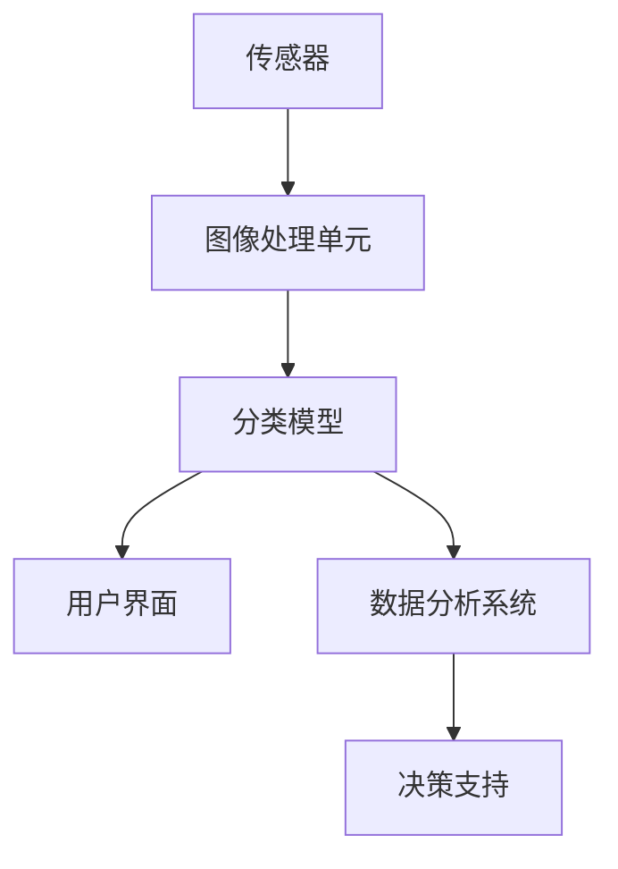
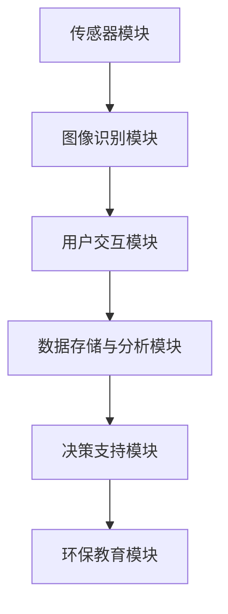
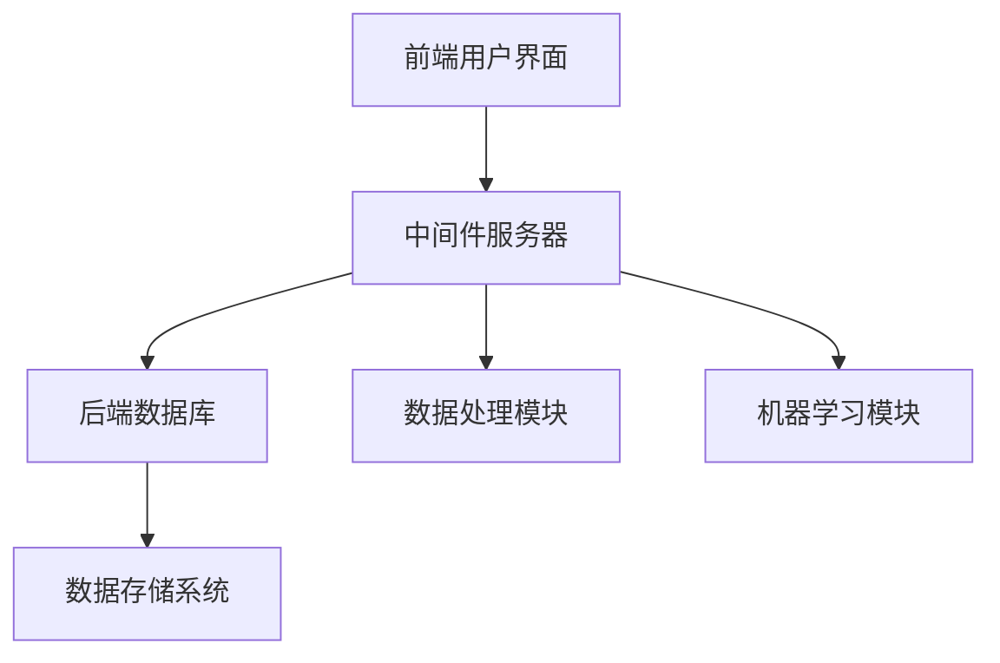

                 

### 设计《智能垃圾分类系统：AI Agent的环保教育助手》的详细目录大纲

为了确保文章内容丰富且结构合理，我们将详细分解每一个章节，并明确每个章节需要包含的核心内容。

#### 引言

**1.1 垃圾分类背景**
- **核心概念术语说明**：明确垃圾分类的定义、意义以及现有分类系统的不足。
- **问题背景**：介绍全球垃圾处理现状，特别是垃圾对环境的影响。
- **问题描述**：阐述智能垃圾分类系统在解决现有问题中的作用。
- **问题解决**：探讨智能垃圾分类系统的技术优势和应用前景。
- **边界与外延**：讨论垃圾分类技术的边界、发展潜力及与其他领域的交叉。
- **概念结构与核心要素组成**：分析垃圾分类系统的核心组成部分及其相互关系。

**1.2 核心概念与联系**
- **AI Agent的概念与特点**：介绍AI Agent的定义、分类和工作原理。
- **智能垃圾分类系统的组成部分**：详细阐述系统的各个模块及其功能。
- **智能垃圾分类系统与环保教育的关系**：分析智能垃圾分类系统如何促进环保教育，提高公众环保意识。

**1.3 智能垃圾分类系统架构概述**
- **系统功能设计**：概述系统的主要功能，如分类识别、用户教育、数据分析等。
- **系统架构设计**：简要介绍系统的整体架构，包括前端、后端、数据存储和数据处理等。

#### 算法原理讲解

**2.1 垃圾分类算法流程图**
- 使用mermaid画出垃圾分类算法的流程图，直观展示数据处理流程。

**2.2 Python源代码与算法原理**
- **算法原理详细阐述**：通过Python源代码解释算法的运行逻辑。
- **算法数学模型和公式**：介绍垃圾分类算法的数学基础，包括公式和原理说明。
- **实际应用举例**：通过具体实例说明算法在实际应用中的效果。

**2.3 算法验证与优化**
- **算法验证**：通过实验结果展示算法的准确性和效率。
- **算法优化**：讨论算法的改进方向，如分类器的优化、模型训练的效率提升等。

#### 系统分析与架构设计方案

**3.1 系统场景介绍**
- **问题场景**：详细描述智能垃圾分类系统应用的具体环境。
- **项目介绍**：介绍智能垃圾分类系统的整体设计和目标。

**3.2 系统功能设计**
- **领域模型设计**：使用mermaid绘制领域模型类图，展示系统各组件的交互关系。
- **功能模块划分**：明确系统的功能模块，如图像识别模块、用户交互模块等。

**3.3 系统架构设计**
- **系统架构图**：使用mermaid绘制系统架构图，展示系统各个组件的层级关系。
- **技术选型**：介绍系统采用的关键技术，如深度学习框架、数据库系统等。

**3.4 系统接口设计**
- **接口设计概述**：说明系统内部各模块之间的接口设计原则。
- **API规范**：定义系统的API规范，包括输入输出参数、错误处理等。

**3.5 系统交互设计**
- **系统交互序列图**：使用mermaid绘制系统交互序列图，展示用户操作与系统响应的过程。

#### 项目实战

**4.1 环境安装**
- **安装准备**：介绍安装前的准备工作，如硬件和软件环境配置。
- **安装过程**：详细描述系统的安装步骤和注意事项。

**4.2 系统核心实现**
- **核心代码解读**：分析系统核心代码的实现细节，包括算法实现和数据结构设计。
- **代码应用解读与分析**：讲解代码在实际应用中的功能和性能。

**4.3 实际案例分析**
- **案例背景**：介绍实际案例的背景信息。
- **案例分析**：深入分析案例中的具体问题和解决方案。
- **案例讲解**：对案例进行详细解读，展示系统在实际应用中的效果。

**4.4 项目小结**
- **项目总结**：总结项目的主要成果和经验教训。
- **改进建议**：提出项目改进的方向和建议。

#### 最佳实践与拓展

**5.1 最佳实践 tips**
- **实际应用建议**：提供在实际环境中使用智能垃圾分类系统的建议。
- **遇到的问题与解决方案**：分享项目中遇到的问题及其解决方案。

**5.2 小结与注意事项**
- **小结**：对文章内容进行总结，强调关键点。
- **注意事项**：提醒读者在应用智能垃圾分类系统时需要注意的问题。

**5.3 拓展阅读**
- **相关书籍推荐**：推荐与文章主题相关的书籍，以供进一步学习。
- **网络资源推荐**：提供在线资源链接，如论文、教程、技术博客等。

通过上述详细的目录大纲，我们可以确保文章内容丰富且有条理，同时每个章节都能满足完整性要求。接下来，我们将按照这个大纲来撰写每一章节的具体内容。

----------------------------------------------------------------

### 引言

**1.1 垃圾分类背景**

**核心概念术语说明**
垃圾分类，是指将垃圾按照其可回收性、有害性、易腐性等特性进行分类处理的过程。垃圾主要包括生活垃圾、工业垃圾、建筑垃圾、医疗垃圾等。垃圾分类的意义在于提高资源的再利用率，减少环境污染，促进可持续发展。

**问题背景**
全球每年产生的生活垃圾量巨大，且数量仍在不断增长。垃圾填埋场和焚烧厂的过度使用已经对环境造成了严重污染，特别是在土地资源紧缺和空气质量问题突出的地区。传统的垃圾分类方式效率低下，分类不准确，导致大量可回收资源被浪费，有害物质得不到妥善处理。

**问题描述**
智能垃圾分类系统旨在解决传统垃圾分类存在的问题，通过先进的人工智能技术，实现垃圾的自动化分类。然而，实现这一目标面临诸多挑战，包括垃圾识别的准确性、系统的鲁棒性、用户体验等。

**问题解决**
智能垃圾分类系统通过AI Agent——一种具有自主学习能力和决策能力的智能体，可以高效识别垃圾种类，并通过用户交互和大数据分析，实现垃圾分类的智能化和个性化。这不仅可以提高垃圾分类的准确性，还能通过教育功能，提升公众的环保意识。

**边界与外延**
垃圾分类技术不仅局限于城市生活垃圾处理，还广泛应用于工业垃圾、医疗垃圾等多个领域。随着人工智能技术的发展，垃圾分类系统将逐渐向智能化、自动化和全面化的方向发展。

**概念结构与核心要素组成**
智能垃圾分类系统由多个核心组件构成，包括传感器、图像识别模块、用户交互界面、数据存储和分析系统等。这些组件相互协作，共同实现垃圾分类的功能。以下是一个简化的系统结构图（使用Mermaid表示）：

**1.2 核心概念与联系**

**AI Agent的概念与特点**
AI Agent，即人工智能代理，是指具备一定自主性和智能性的计算机程序，能够在特定环境中感知外界信息，并基于预定的目标和规则做出决策。AI Agent具有以下几个特点：
- **自主性**：能够独立执行任务，无需人为干预。
- **适应性**：能够根据环境和任务的变化调整自身行为。
- **智能性**：能够通过学习、推理等方式，提高任务执行的效率和质量。

**智能垃圾分类系统的组成部分**
智能垃圾分类系统通常由以下几部分组成：
- **传感器模块**：负责收集垃圾信息，如图像、重量、温度等。
- **图像识别模块**：利用深度学习等技术，对垃圾图像进行分类识别。
- **用户交互模块**：与用户进行互动，提供操作指引和反馈信息。
- **数据存储与分析模块**：收集、存储和处理垃圾分类数据，为系统优化提供支持。
- **决策支持模块**：基于数据分析，为垃圾分类提供决策建议。

**智能垃圾分类系统与环保教育的关系**
智能垃圾分类系统不仅仅是垃圾分类的工具，更是环保教育的助手。通过用户交互模块，系统可以向用户传授垃圾分类知识，提高用户的环保意识。同时，数据分析模块可以记录用户的分类行为，提供个性化的教育内容，帮助用户更好地参与垃圾分类。以下是一个简化的系统功能关系图（使用Mermaid表示）：

**1.3 智能垃圾分类系统架构概述**

**系统功能设计**
智能垃圾分类系统的主要功能包括垃圾识别、用户交互、数据分析和决策支持。具体来说：
- **垃圾识别**：系统能够自动识别各种垃圾，并给出分类结果。
- **用户交互**：系统能够与用户进行互动，提供操作指引和反馈信息。
- **数据分析**：系统收集并分析用户数据，为垃圾分类和环保教育提供支持。
- **决策支持**：系统根据数据分析结果，为用户和相关部门提供垃圾分类的建议。

**系统架构设计**
智能垃圾分类系统的架构设计考虑了系统的可扩展性和灵活性。以下是一个简化的系统架构图（使用Mermaid表示）：

在这个架构中，前端用户界面负责与用户交互，中间件服务器处理业务逻辑，后端数据库存储数据，数据处理模块负责分析数据，机器学习模块用于模型训练和优化。这种分层架构使得系统具有良好的可维护性和可扩展性。

通过以上对智能垃圾分类系统的介绍，我们可以看到，它不仅仅是技术上的创新，更是环保理念的体现。在接下来的章节中，我们将深入探讨垃圾分类算法的原理和实现，以及系统设计与项目实战的细节。这将帮助我们更好地理解智能垃圾分类系统的运作机制和实际应用价值。

