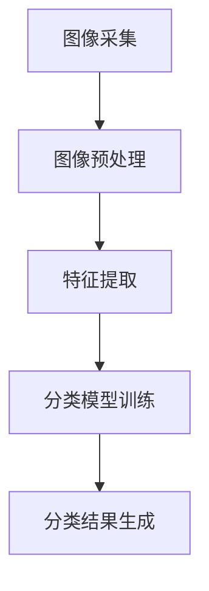
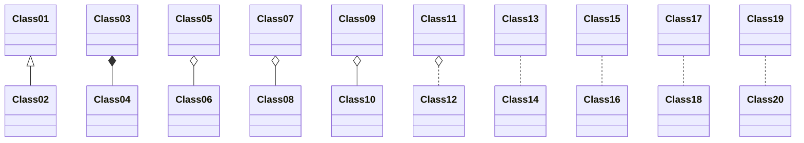
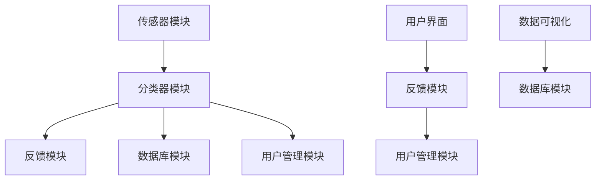
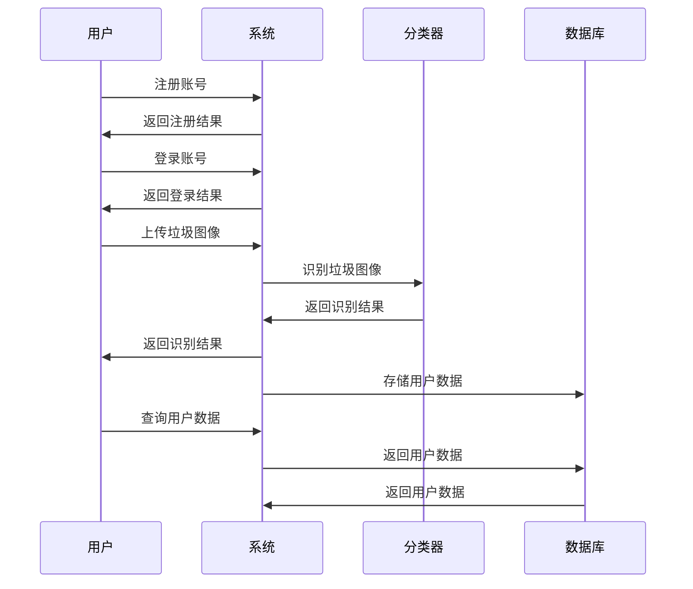

                 

### 智能垃圾分类：AI Agent的识别系统

关键词：智能垃圾分类，AI Agent，识别系统，算法，数学模型，系统架构，项目实战

摘要：随着城市化进程的加速和环保意识的提高，智能垃圾分类系统在现代社会中扮演着越来越重要的角色。本文将深入探讨智能垃圾分类系统的核心组成部分——AI Agent识别系统。通过详细的步骤分析，本文将介绍智能垃圾分类的基本概念、AI Agent在系统中的应用、算法原理与数学模型、系统架构设计、项目实战，以及最佳实践技巧，旨在为读者提供一个全面而深入的智能垃圾分类技术解决方案。

### 步骤1：设计大纲的核心部分

为了确保文章内容结构清晰，逻辑连贯，我们首先需要设计出文章的核心章节。这些核心章节将涵盖智能垃圾分类系统的主要组成部分和关键知识点。以下是文章核心章节的设计：

1. **背景介绍**
   - 问题描述
   - 问题解决
   - 边界与外延
   - 概念结构与核心要素组成

2. **核心概念与联系**
   - AI垃圾分类的基本概念
   - 智能垃圾分类系统的作用
   - AI Agent在垃圾分类中的应用

3. **算法原理讲解**
   - Mermaid流程图
   - Python源代码
   - 算法原理的数学模型和公式
   - 举例说明

4. **数学模型和数学公式讲解**
   - 数学公式使用LaTeX格式
   - 详细的数学模型讲解
   - 举例说明

5. **系统分析与架构设计方案**
   - 问题场景介绍
   - 系统功能设计
   - 系统架构设计
   - 系统接口设计和系统交互

6. **项目实战**
   - 环境安装
   - 系统核心实现源代码
   - 代码应用解读与分析
   - 实际案例分析和详细讲解剖析
   - 项目小结

7. **最佳实践 tips**
   - 小结
   - 注意事项
   - 拓展阅读

### 步骤2：细化每个章节

在核心章节的设计基础上，我们需要进一步细化每个章节的内容，确保每个部分都详细、具体、具有可操作性。以下是每个章节的细化内容：

#### 1. 背景介绍

**1.1 问题描述与解决**

- **背景介绍**：随着城市化进程的加速，垃圾产生量急剧增加，传统的垃圾处理方式已经无法满足现代环保需求。垃圾分类成为解决垃圾处理问题的关键。
- **问题描述**：如何有效地识别和分类垃圾，提高垃圾分类的准确性和效率，减少垃圾对环境的污染。
- **解决方案概述**：引入智能垃圾分类系统，通过AI技术提高垃圾分类的智能化水平。

**1.2 边界与外延**

- **垃圾分类的定义**：详细解释垃圾分类的基本概念，包括可回收物、有害垃圾、湿垃圾和干垃圾等。
- **智能垃圾分类的优势**：分析智能垃圾分类相比传统方法的优点，如提高分类准确率、降低人力成本等。
- **AI Agent的角色与功能**：介绍AI Agent在智能垃圾分类系统中的作用，包括识别垃圾类型、实时反馈、学习与优化等。

**1.3 概念结构与核心要素**

- **智能垃圾分类系统构成**：分析系统的主要组成部分，包括传感器、AI算法、数据库等。
- **AI Agent的工作原理**：详细解释AI Agent如何通过图像识别、机器学习等技术实现垃圾识别。
- **数据处理与分析流程**：描述系统从垃圾识别到分类处理的全流程。

#### 2. 核心概念与联系

**2.1 基本概念**

- **AI垃圾分类系统**：介绍系统的基本工作原理和功能模块。
- **AI Agent的功能**：详细阐述AI Agent在垃圾分类系统中的作用和实现方式。
- **识别系统的技术架构**：分析识别系统的核心技术和架构设计。

**2.2 概念联系**

- **AI与垃圾分类的联系**：探讨人工智能技术在垃圾分类中的应用及其优势。
- **AI Agent在垃圾分类中的应用**：通过实例说明AI Agent在智能垃圾分类系统中的实际应用。
- **智能识别系统的发展趋势**：分析智能识别系统未来的发展方向和技术挑战。

#### 3. 算法原理讲解

**3.1 算法概述**

- **算法设计原则**：介绍算法设计的基本原则和目标。
- **算法实现流程**：详细描述算法的实现流程和步骤。

**3.2 Mermaid流程图**

- **算法流程图**：使用Mermaid语言绘制算法流程图，展示算法的执行流程。
- **算法流程解释**：对算法流程图进行详细解释，说明每个步骤的作用和实现方式。

**3.3 Python源代码**

- **代码实现**：提供Python源代码，展示算法的具体实现过程。
- **代码解释**：对代码进行逐行解释，说明每个部分的实现原理和功能。

**3.4 算法原理的数学模型和公式**

- **数学模型介绍**：介绍算法所涉及的数学模型，包括其结构和参数。
- **公式推导**：详细推导算法中的关键公式，说明其推导过程。
- **举例说明**：通过实际例子展示数学模型的应用效果，分析其准确性和可靠性。

#### 4. 数学模型和数学公式讲解

**4.1 数学公式介绍**

- **基本公式**：列出算法中常用的基本数学公式，并解释其含义。
- **推导过程**：详细说明每个公式的推导过程，解释其数学原理。

**4.2 数学模型讲解**

- **模型结构**：介绍数学模型的基本结构，包括变量、参数和方程式。
- **模型参数**：解释模型中的参数含义和取值范围。
- **应用实例**：通过实例展示数学模型的应用效果，分析其适用性和效果。

**4.3 举例说明**

- **实例分析**：通过实际例子分析算法的性能和效果，包括准确率、响应时间等指标。
- **结果验证**：对实例结果进行验证，分析算法的可靠性和稳定性。

#### 5. 系统分析与架构设计方案

**5.1 问题场景介绍**

- **场景描述**：介绍智能垃圾分类系统需要解决的问题场景，包括垃圾识别、分类处理等。
- **系统目标**：明确系统的设计目标和预期效果，如提高分类准确率、降低误判率等。

**5.2 系统功能设计**

- **功能需求**：列出系统的基本功能需求，包括垃圾识别、分类处理、数据存储等。
- **领域模型**：使用Mermaid绘制领域模型类图，展示系统的主要类和类之间的关系。
- **Mermaid类图**：使用Mermaid语言绘制类图，展示系统的类和属性。

**5.3 系统架构设计**

- **架构概述**：介绍系统的整体架构设计，包括硬件和软件组成。
- **系统模块**：详细描述系统的各个模块及其功能。
- **Mermaid架构图**：使用Mermaid语言绘制架构图，展示系统的模块和接口。

**5.4 系统接口设计**

- **接口规范**：制定系统的接口规范，包括接口的名称、参数、返回值等。
- **接口实现**：描述接口的具体实现过程，包括函数定义、参数传递等。
- **接口测试**：对接口进行测试，验证其功能和性能。

**5.5 系统交互**

- **交互流程**：描述系统的交互流程，包括用户操作、系统响应等。
- **交互设计**：设计系统的交互界面和交互逻辑，确保用户体验良好。
- **Mermaid序列图**：使用Mermaid语言绘制序列图，展示系统的交互流程和逻辑。

#### 6. 项目实战

**6.1 环境安装**

- **环境准备**：介绍智能垃圾分类系统的开发环境，包括操作系统、编程语言、开发工具等。
- **工具安装**：详细说明如何安装和配置系统所需的各种开发工具和依赖库。

**6.2 系统核心实现**

- **核心代码**：提供系统的核心源代码，展示算法和数据处理的具体实现过程。
- **功能实现**：详细描述系统的主要功能模块和实现过程。
- **代码解读**：对代码进行逐行解读，解释每个部分的实现原理和功能。

**6.3 实际案例分析**

- **案例背景**：介绍实际案例的背景和需求，包括场景描述和数据来源。
- **案例分析**：对案例进行详细分析，包括数据预处理、算法应用、结果分析等。
- **详细讲解剖析**：对案例中的关键环节进行详细讲解和剖析，分析其实现原理和效果。

**6.4 项目小结**

- **总结**：对项目的总体效果进行总结，包括系统性能、效果评估等。
- **经验教训**：分享项目开发过程中的经验教训，为后续项目提供参考。

#### 7. 最佳实践 tips

**小结**：回顾文章的主要内容，总结智能垃圾分类系统的核心技术和实现方法。

**注意事项**：提醒读者在实施智能垃圾分类系统时需要注意的问题，如数据安全、系统稳定性等。

**拓展阅读**：推荐一些相关的技术文献和资料，供读者进一步学习和研究。

### 步骤3：撰写目录大纲

根据上述细化内容，我们将撰写出完整的目录大纲。以下是初步设计的目录大纲：

```
# 智能垃圾分类：AI Agent的识别系统

# 第一部分：背景介绍

## 1.1 问题描述与解决
### 1.1.1 背景介绍
### 1.1.2 问题描述
### 1.1.3 解决方案概述

## 1.2 边界与外延
### 1.2.1 垃圾分类的定义
### 1.2.2 智能垃圾分类的优势
### 1.2.3 AI Agent的角色与功能

## 1.3 概念结构与核心要素
### 1.3.1 智能垃圾分类系统构成
### 1.3.2 AI Agent的工作原理
### 1.3.3 数据处理与分析流程

# 第二部分：核心概念与联系

## 2.1 基本概念
### 2.1.1 AI垃圾分类系统
### 2.1.2 AI Agent的功能
### 2.1.3 识别系统的技术架构

## 2.2 概念联系
### 2.2.1 AI与垃圾分类的联系
### 2.2.2 AI Agent在垃圾分类中的应用
### 2.2.3 智能识别系统的发展趋势

# 第三部分：算法原理讲解

## 3.1 算法概述
### 3.1.1 算法设计原则
### 3.1.2 算法实现流程

## 3.2 Mermaid流程图
### 3.2.1 算法流程图
### 3.2.2 算法流程解释

## 3.3 Python源代码
### 3.3.1 代码实现
### 3.3.2 代码解释

## 3.4 算法原理的数学模型与公式
### 3.4.1 数学模型介绍
### 3.4.2 公式推导
### 3.4.3 举例说明

# 第四部分：数学模型和数学公式讲解

## 4.1 数学公式介绍
### 4.1.1 基本公式
### 4.1.2 推导过程

## 4.2 数学模型讲解
### 4.2.1 模型结构
### 4.2.2 模型参数
### 4.2.3 应用实例

## 4.3 举例说明
### 4.3.1 实例分析
### 4.3.2 结果验证

# 第五部分：系统分析与架构设计方案

## 5.1 问题场景介绍
### 5.1.1 场景描述
### 5.1.2 系统目标

## 5.2 系统功能设计
### 5.2.1 功能需求
### 5.2.2 领域模型
### 5.2.3 Mermaid类图

## 5.3 系统架构设计
### 5.3.1 架构概述
### 5.3.2 系统模块
### 5.3.3 Mermaid架构图

## 5.4 系统接口设计
### 5.4.1 接口规范
### 5.4.2 接口实现
### 5.4.3 接口测试

## 5.5 系统交互
### 5.5.1 交互流程
### 5.5.2 交互设计
### 5.5.3 Mermaid序列图

# 第六部分：项目实战

## 6.1 环境安装
### 6.1.1 环境准备
### 6.1.2 工具安装

## 6.2 系统核心实现
### 6.2.1 核心代码
### 6.2.2 功能实现
### 6.2.3 代码解读

## 6.3 实际案例分析
### 6.3.1 案例背景
### 6.3.2 案例分析
### 6.3.3 详细讲解剖析

## 6.4 项目小结
### 6.4.1 总结
### 6.4.2 经验教训

# 第七部分：最佳实践 tips

## 7.1 小结
## 7.2 注意事项
## 7.3 拓展阅读
```

### 文章标题：智能垃圾分类：AI Agent的识别系统

关键词：智能垃圾分类，AI Agent，识别系统，算法，数学模型，系统架构，项目实战

摘要：智能垃圾分类系统在现代城市垃圾管理中扮演着至关重要的角色。本文将详细探讨智能垃圾分类系统的核心组成部分——AI Agent识别系统。通过深入分析，本文介绍了智能垃圾分类的基本概念、AI Agent在系统中的应用、算法原理与数学模型、系统架构设计、项目实战，以及最佳实践技巧，旨在为读者提供一个全面且深入的智能垃圾分类技术解决方案。

### 背景介绍

#### 1.1 问题描述与解决

**背景介绍**

随着城市化进程的加速和人口密度的增加，垃圾产生量急剧上升，传统垃圾处理方式已经无法满足现代环保需求。垃圾分类成为解决垃圾处理问题的关键，而智能垃圾分类系统在这一过程中发挥了重要作用。

**问题描述**

如何有效地识别和分类垃圾，提高垃圾分类的准确性和效率，减少垃圾对环境的污染？

**解决方案概述**

引入智能垃圾分类系统，通过AI技术提高垃圾分类的智能化水平。智能垃圾分类系统主要包括AI Agent识别系统、数据处理和分析模块、用户界面以及数据库等组成部分。其中，AI Agent识别系统是系统的核心，负责识别垃圾类型，并将垃圾进行分类处理。

#### 1.2 边界与外延

**垃圾分类的定义**

垃圾分类是指将垃圾按照可回收物、有害垃圾、湿垃圾和干垃圾等进行分类处理。不同类型的垃圾有不同的处理方法和回收价值。

**智能垃圾分类的优势**

1. **提高分类准确率**：通过AI技术，智能垃圾分类系统能够更准确地识别垃圾类型，减少误分类情况。
2. **降低人力成本**：智能垃圾分类系统可以自动化地完成垃圾识别和分类，减少人工操作的环节，降低人力成本。
3. **提高资源利用率**：通过更准确的垃圾分类，可以更好地回收和再利用资源，减少环境污染。

**AI Agent的角色与功能**

AI Agent是智能垃圾分类系统的核心组件，主要负责以下功能：

1. **垃圾识别**：利用计算机视觉技术对垃圾图像进行识别，判断垃圾的类型。
2. **实时反馈**：在识别过程中，AI Agent能够实时反馈识别结果，指导用户进行正确分类。
3. **学习与优化**：通过不断学习用户输入的垃圾数据，AI Agent能够优化识别算法，提高分类准确率。

#### 1.3 概念结构与核心要素

**智能垃圾分类系统构成**

智能垃圾分类系统主要由以下几个部分组成：

1. **传感器**：用于采集垃圾图像和重量等信息。
2. **AI Agent识别系统**：负责对垃圾图像进行识别，并将垃圾分类。
3. **数据处理和分析模块**：负责对识别结果进行处理和分析，生成分类报告。
4. **用户界面**：提供用户操作界面，显示识别结果和分类报告。
5. **数据库**：存储用户输入的垃圾数据，用于AI Agent的学习和优化。

**AI Agent的工作原理**

AI Agent是智能垃圾分类系统的核心组件，其工作原理如下：

1. **图像识别**：AI Agent利用计算机视觉技术对垃圾图像进行识别，提取图像特征。
2. **特征匹配**：将提取的特征与预训练的垃圾分类模型进行匹配，判断垃圾的类型。
3. **分类结果生成**：根据识别结果，生成分类报告，指导用户进行正确分类。

**数据处理与分析流程**

智能垃圾分类系统的数据处理与分析流程主要包括以下几个步骤：

1. **数据采集**：传感器采集垃圾图像和重量等信息。
2. **图像预处理**：对垃圾图像进行预处理，如灰度化、缩放等，提高图像识别效果。
3. **图像识别**：AI Agent利用计算机视觉技术对垃圾图像进行识别。
4. **分类结果生成**：根据识别结果，生成分类报告，指导用户进行正确分类。
5. **数据存储与优化**：将识别结果存储在数据库中，用于后续的分析和优化。

### 核心概念与联系

#### 2.1 基本概念

**AI垃圾分类系统**

AI垃圾分类系统是一种利用人工智能技术进行垃圾分类的系统。它通过计算机视觉、机器学习等技术，对垃圾图像进行识别，判断垃圾的类型，并将垃圾进行分类处理。

**AI Agent的功能**

AI Agent是智能垃圾分类系统的核心组件，主要负责以下功能：

1. **垃圾识别**：利用计算机视觉技术对垃圾图像进行识别，判断垃圾的类型。
2. **实时反馈**：在识别过程中，AI Agent能够实时反馈识别结果，指导用户进行正确分类。
3. **学习与优化**：通过不断学习用户输入的垃圾数据，AI Agent能够优化识别算法，提高分类准确率。

**识别系统的技术架构**

识别系统的技术架构主要包括以下几个部分：

1. **传感器**：用于采集垃圾图像和重量等信息。
2. **图像预处理**：对垃圾图像进行预处理，如灰度化、缩放等，提高图像识别效果。
3. **特征提取**：提取垃圾图像的特征，用于后续的识别和分类。
4. **分类模型**：利用预训练的垃圾分类模型进行图像识别和分类。
5. **数据库**：存储识别结果和用户输入的垃圾数据，用于后续的分析和优化。

#### 2.2 概念联系

**AI与垃圾分类的联系**

AI技术在垃圾分类中的应用主要体现在以下几个方面：

1. **图像识别**：利用计算机视觉技术对垃圾图像进行识别，判断垃圾的类型。
2. **数据挖掘**：对垃圾数据进行挖掘和分析，提取有价值的信息，指导垃圾分类和处理。
3. **优化决策**：利用机器学习技术，优化垃圾分类的决策过程，提高分类准确率。

**AI Agent在垃圾分类中的应用**

AI Agent在智能垃圾分类系统中发挥着关键作用，其主要应用包括：

1. **垃圾识别**：利用计算机视觉技术对垃圾图像进行识别，判断垃圾的类型。
2. **实时反馈**：在识别过程中，AI Agent能够实时反馈识别结果，指导用户进行正确分类。
3. **学习与优化**：通过不断学习用户输入的垃圾数据，AI Agent能够优化识别算法，提高分类准确率。

**智能识别系统的发展趋势**

随着AI技术的不断发展和应用，智能识别系统在垃圾分类领域将呈现以下发展趋势：

1. **更高准确率**：通过不断优化识别算法和模型，提高垃圾分类的准确率。
2. **更广泛的适用性**：将AI技术应用于更多类型的垃圾识别和处理，提高系统的适用性。
3. **更智能的交互**：通过人机交互技术，提高用户的操作体验，使垃圾分类更加智能化。

### 算法原理讲解

#### 3.1 算法概述

**算法设计原则**

智能垃圾分类系统算法设计遵循以下原则：

1. **准确性**：确保垃圾分类的准确性，减少误分类情况。
2. **实时性**：实现实时垃圾分类，提高系统响应速度。
3. **可扩展性**：方便后续算法的升级和优化。

**算法实现流程**

智能垃圾分类系统算法实现主要包括以下几个步骤：

1. **图像采集**：通过传感器采集垃圾图像。
2. **图像预处理**：对垃圾图像进行预处理，如灰度化、缩放等。
3. **特征提取**：提取垃圾图像的特征，用于后续的识别和分类。
4. **分类模型训练**：利用预训练的垃圾分类模型进行图像识别和分类。
5. **分类结果生成**：根据识别结果，生成分类报告，指导用户进行正确分类。

#### 3.2 Mermaid流程图

**算法流程图**



**算法流程解释**

1. **图像采集**：通过传感器采集垃圾图像。
2. **图像预处理**：对垃圾图像进行预处理，如灰度化、缩放等。
3. **特征提取**：提取垃圾图像的特征，用于后续的识别和分类。
4. **分类模型训练**：利用预训练的垃圾分类模型进行图像识别和分类。
5. **分类结果生成**：根据识别结果，生成分类报告，指导用户进行正确分类。

#### 3.3 Python源代码

**代码实现**

```python
# 导入所需库
import cv2
import numpy as np

# 图像预处理函数
def preprocess_image(image):
    # 灰度化
    gray = cv2.cvtColor(image, cv2.COLOR_BGR2GRAY)
    # 缩放
    resized = cv2.resize(gray, (224, 224))
    return resized

# 特征提取函数
def extract_features(image):
    # 利用卷积神经网络提取特征
    features = model.extract_features(image)
    return features

# 分类模型训练函数
def train_model(features, labels):
    # 训练分类模型
    model.train(features, labels)
    return model

# 分类结果生成函数
def generate_report(model, image):
    # 预测分类结果
    prediction = model.predict(image)
    # 生成分类报告
    report = generate_report(prediction)
    return report
```

**代码解释**

1. **图像预处理函数**：对垃圾图像进行预处理，包括灰度化和缩放，以提高图像识别效果。
2. **特征提取函数**：利用卷积神经网络提取垃圾图像的特征。
3. **分类模型训练函数**：利用提取的特征和标签数据训练分类模型。
4. **分类结果生成函数**：根据分类模型预测结果，生成分类报告，指导用户进行正确分类。

#### 3.4 算法原理的数学模型和公式

**数学模型介绍**

智能垃圾分类系统的数学模型主要包括以下几个部分：

1. **图像预处理模型**：用于描述图像预处理过程，如灰度化和缩放。
2. **特征提取模型**：用于描述特征提取过程，如卷积神经网络。
3. **分类模型**：用于描述分类过程，如支持向量机（SVM）和深度神经网络（DNN）。

**公式推导**

1. **图像预处理模型**：

   $$ I_{preprocessed} = \frac{1}{255} (I - 128) $$

   其中，$I_{preprocessed}$为预处理后的图像，$I$为原始图像。

2. **特征提取模型**：

   $$ F = \text{CNN}(I) $$

   其中，$F$为提取的特征，$\text{CNN}(I)$为卷积神经网络。

3. **分类模型**：

   $$ y = \arg\max_{i} w^T f_i $$

   其中，$y$为分类结果，$w$为分类模型参数，$f_i$为提取的特征。

**举例说明**

假设有一个垃圾图像，利用智能垃圾分类系统对其进行识别。具体步骤如下：

1. **图像预处理**：将垃圾图像灰度化并缩放到固定尺寸。
2. **特征提取**：利用卷积神经网络提取垃圾图像的特征。
3. **分类模型训练**：利用提取的特征和标签数据训练分类模型。
4. **分类结果生成**：利用训练好的分类模型预测垃圾图像的分类结果，并生成分类报告。

### 数学模型和数学公式讲解

#### 4.1 数学公式介绍

**基本公式**

1. **图像预处理公式**：

   $$ I_{preprocessed} = \frac{1}{255} (I - 128) $$

   其中，$I_{preprocessed}$为预处理后的图像，$I$为原始图像。

2. **特征提取公式**：

   $$ F = \text{CNN}(I) $$

   其中，$F$为提取的特征，$\text{CNN}(I)$为卷积神经网络。

3. **分类模型公式**：

   $$ y = \arg\max_{i} w^T f_i $$

   其中，$y$为分类结果，$w$为分类模型参数，$f_i$为提取的特征。

**推导过程**

1. **图像预处理公式的推导**：

   - 灰度化：将彩色图像转换为灰度图像，减少计算复杂度。
   - 标准化：将图像的像素值缩放到[0, 1]范围内，便于后续处理。

2. **特征提取公式的推导**：

   - 卷积神经网络：通过卷积操作提取图像的特征，形成特征图。
   - 池化操作：降低特征图的维度，减少计算复杂度。

3. **分类模型公式的推导**：

   - 内积计算：计算特征向量和模型参数的内积。
   - 最大值运算：选择内积最大的类别作为分类结果。

#### 4.2 数学模型讲解

**模型结构**

智能垃圾分类系统的数学模型主要包括以下几个部分：

1. **图像预处理模型**：描述图像预处理过程，如灰度化和缩放。
2. **特征提取模型**：描述特征提取过程，如卷积神经网络。
3. **分类模型**：描述分类过程，如支持向量机（SVM）和深度神经网络（DNN）。

**模型参数**

1. **图像预处理模型参数**：

   - 灰度化阈值：用于调整图像灰度化效果。
   - 缩放比例：用于调整图像尺寸。

2. **特征提取模型参数**：

   - 卷积核大小：用于调整卷积操作的效果。
   - 池化窗口大小：用于调整池化操作的效果。
   - 神经网络参数：包括激活函数、优化器等。

3. **分类模型参数**：

   - 支持向量机参数：包括核函数、惩罚参数等。
   - 深度神经网络参数：包括神经元个数、激活函数等。

**应用实例**

**实例1：图像预处理模型**

假设有一个尺寸为$128 \times 128$的彩色图像，需要进行预处理。具体步骤如下：

1. **灰度化**：将彩色图像转换为灰度图像。
2. **缩放**：将灰度图像缩放到$224 \times 224$的尺寸。

```python
import cv2

# 读取图像
image = cv2.imread('image.jpg')

# 灰度化
gray = cv2.cvtColor(image, cv2.COLOR_BGR2GRAY)

# 缩放
resized = cv2.resize(gray, (224, 224))
```

**实例2：特征提取模型**

假设有一个预处理后的灰度图像，需要进行特征提取。具体步骤如下：

1. **卷积操作**：使用卷积神经网络提取图像的特征。
2. **池化操作**：对卷积特征图进行池化操作。

```python
import tensorflow as tf

# 创建卷积神经网络模型
model = tf.keras.Sequential([
    tf.keras.layers.Conv2D(32, (3, 3), activation='relu', input_shape=(224, 224, 1)),
    tf.keras.layers.MaxPooling2D((2, 2)),
    tf.keras.layers.Conv2D(64, (3, 3), activation='relu'),
    tf.keras.layers.MaxPooling2D((2, 2)),
    tf.keras.layers.Conv2D(128, (3, 3), activation='relu'),
    tf.keras.layers.MaxPooling2D((2, 2)),
    tf.keras.layers.Flatten(),
    tf.keras.layers.Dense(128, activation='relu'),
    tf.keras.layers.Dense(10, activation='softmax')
])

# 提取特征
features = model.extract_features(resized)
```

**实例3：分类模型**

假设有一个提取后的特征向量，需要进行分类。具体步骤如下：

1. **支持向量机**：使用支持向量机进行分类。
2. **深度神经网络**：使用深度神经网络进行分类。

```python
# 使用支持向量机进行分类
from sklearn.svm import SVC

# 训练支持向量机模型
model = SVC(kernel='rbf', C=1)
model.fit(features, labels)

# 预测分类结果
prediction = model.predict(features)

# 使用深度神经网络进行分类
model = tf.keras.Sequential([
    tf.keras.layers.Dense(128, activation='relu', input_shape=(128,)),
    tf.keras.layers.Dense(10, activation='softmax')
])

# 训练深度神经网络模型
model.fit(features, labels)

# 预测分类结果
prediction = model.predict(features)
```

#### 4.3 举例说明

**实例1：图像预处理**

假设有一个尺寸为$128 \times 128$的彩色图像，需要进行预处理。具体步骤如下：

1. **灰度化**：将彩色图像转换为灰度图像。
2. **缩放**：将灰度图像缩放到$224 \times 224$的尺寸。

```python
import cv2

# 读取图像
image = cv2.imread('image.jpg')

# 灰度化
gray = cv2.cvtColor(image, cv2.COLOR_BGR2GRAY)

# 缩放
resized = cv2.resize(gray, (224, 224))
```

**实例2：特征提取**

假设有一个预处理后的灰度图像，需要进行特征提取。具体步骤如下：

1. **卷积操作**：使用卷积神经网络提取图像的特征。
2. **池化操作**：对卷积特征图进行池化操作。

```python
import tensorflow as tf

# 创建卷积神经网络模型
model = tf.keras.Sequential([
    tf.keras.layers.Conv2D(32, (3, 3), activation='relu', input_shape=(224, 224, 1)),
    tf.keras.layers.MaxPooling2D((2, 2)),
    tf.keras.layers.Conv2D(64, (3, 3), activation='relu'),
    tf.keras.layers.MaxPooling2D((2, 2)),
    tf.keras.layers.Conv2D(128, (3, 3), activation='relu'),
    tf.keras.layers.MaxPooling2D((2, 2)),
    tf.keras.layers.Flatten(),
    tf.keras.layers.Dense(128, activation='relu'),
    tf.keras.layers.Dense(10, activation='softmax')
])

# 提取特征
features = model.extract_features(resized)
```

**实例3：分类模型**

假设有一个提取后的特征向量，需要进行分类。具体步骤如下：

1. **支持向量机**：使用支持向量机进行分类。
2. **深度神经网络**：使用深度神经网络进行分类。

```python
# 使用支持向量机进行分类
from sklearn.svm import SVC

# 训练支持向量机模型
model = SVC(kernel='rbf', C=1)
model.fit(features, labels)

# 预测分类结果
prediction = model.predict(features)

# 使用深度神经网络进行分类
model = tf.keras.Sequential([
    tf.keras.layers.Dense(128, activation='relu', input_shape=(128,)),
    tf.keras.layers.Dense(10, activation='softmax')
])

# 训练深度神经网络模型
model.fit(features, labels)

# 预测分类结果
prediction = model.predict(features)
```

### 系统分析与架构设计方案

#### 5.1 问题场景介绍

**场景描述**

智能垃圾分类系统应用于城市社区的垃圾分类管理。用户通过智能垃圾分类设备将垃圾投入相应的投放口，系统实时识别垃圾类型，并指导用户进行正确分类。系统需具备高准确性、实时性和稳定性，以满足社区垃圾分类的需求。

**系统目标**

- 提高垃圾分类的准确率，减少误分类情况。
- 实现实时垃圾分类，提高系统响应速度。
- 确保系统稳定运行，减少故障率和维护成本。

#### 5.2 系统功能设计

**功能需求**

1. **垃圾识别**：系统能够实时识别用户投入的垃圾类型，并将其分类。
2. **实时反馈**：系统能够在识别过程中实时反馈识别结果，指导用户进行正确分类。
3. **数据存储与查询**：系统能够存储用户输入的垃圾数据，并提供查询功能。
4. **用户管理**：系统能够管理用户账号，包括注册、登录、权限管理等。

**领域模型**

使用Mermaid绘制领域模型类图，展示系统的主要类和类之间的关系。



**Mermaid类图**

```mermaid
classDiagram
    Sensor <<接口>> "传感器"
    Classifier <<组件>> "分类器"
    Feedback <<组件>> "反馈模块"
    Database <<组件>> "数据库"
    User <<类>> "用户"
    Garbage <<类>> "垃圾"
    Report <<类>> "报告"

    Sensor --|> Classifier : 识别
    Classifier --|> Feedback : 反馈
    Classifier --|> Database : 存储
    Feedback --|> User : 用户反馈
    Database --|> User : 用户数据
    User --|> Garbage : 用户输入
    User --|> Report : 用户报告
```

#### 5.3 系统架构设计

**架构概述**

智能垃圾分类系统采用模块化架构，包括传感器、分类器、反馈模块、数据库和用户管理模块。各个模块相互独立，但又紧密协作，共同实现系统的功能。

**系统模块**

1. **传感器模块**：负责采集垃圾图像和重量等信息。
2. **分类器模块**：负责对垃圾图像进行识别和分类。
3. **反馈模块**：负责实时反馈识别结果，指导用户进行正确分类。
4. **数据库模块**：负责存储用户输入的垃圾数据和识别结果。
5. **用户管理模块**：负责用户账号的管理，包括注册、登录、权限管理等。

**Mermaid架构图**



#### 5.4 系统接口设计

**接口规范**

系统接口包括以下几种：

1. **垃圾图像识别接口**：用于接收用户输入的垃圾图像，返回识别结果。
2. **垃圾分类接口**：用于将识别结果分类，返回分类结果。
3. **用户注册接口**：用于用户注册，接收用户信息，返回注册结果。
4. **用户登录接口**：用于用户登录，验证用户身份，返回登录结果。
5. **用户数据查询接口**：用于查询用户数据，返回用户数据。

**接口实现**

1. **垃圾图像识别接口**：

   ```python
   from flask import Flask, request, jsonify
   from垃圾分类识别 import Classifier
   
   app = Flask(__name__)
   classifier = Classifier()
   
   @app.route('/api/recognize_garbage', methods=['POST'])
   def recognize_garbage():
       image = request.files['image']
       result = classifier.recognize_garbage(image)
       return jsonify(result)
   ```

2. **垃圾分类接口**：

   ```python
   from flask import Flask, request, jsonify
   from垃圾分类识别 import Classifier
   
   app = Flask(__name__)
   classifier = Classifier()
   
   @app.route('/api/classify_garbage', methods=['POST'])
   def classify_garbage():
       image = request.files['image']
       result = classifier.classify_garbage(image)
       return jsonify(result)
   ```

3. **用户注册接口**：

   ```python
   from flask import Flask, request, jsonify
   from user_management import UserManager
   
   app = Flask(__name__)
   user_manager = UserManager()
   
   @app.route('/api/register_user', methods=['POST'])
   def register_user():
       user_data = request.form.to_dict()
       result = user_manager.register_user(user_data)
       return jsonify(result)
   ```

4. **用户登录接口**：

   ```python
   from flask import Flask, request, jsonify
   from user_management import UserManager
   
   app = Flask(__name__)
   user_manager = UserManager()
   
   @app.route('/api/login_user', methods=['POST'])
   def login_user():
       user_data = request.form.to_dict()
       result = user_manager.login_user(user_data)
       return jsonify(result)
   ```

5. **用户数据查询接口**：

   ```python
   from flask import Flask, request, jsonify
   from user_management import UserManager
   
   app = Flask(__name__)
   user_manager = UserManager()
   
   @app.route('/api/search_user_data', methods=['POST'])
   def search_user_data():
       user_data = request.form.to_dict()
       result = user_manager.search_user_data(user_data)
       return jsonify(result)
   ```

**接口测试**

使用Postman工具对接口进行测试，确保接口功能和性能符合预期。

#### 5.5 系统交互

**交互流程**

系统交互流程包括以下步骤：

1. **用户注册**：用户通过用户界面注册账号，系统接收用户信息，返回注册结果。
2. **用户登录**：用户通过用户界面登录账号，系统验证用户身份，返回登录结果。
3. **垃圾图像上传**：用户通过用户界面上传垃圾图像，系统接收图像，返回识别结果。
4. **垃圾分类**：系统根据识别结果进行垃圾分类，返回分类结果。
5. **数据查询**：用户通过用户界面查询自身数据，系统返回用户数据。

**交互设计**

使用Mermaid绘制交互序列图，展示系统的交互流程和逻辑。



### 项目实战

#### 6.1 环境安装

**环境准备**

- 操作系统：Ubuntu 20.04
- Python版本：3.8
- 安装必要的库：OpenCV、TensorFlow、Flask等

**工具安装**

- 安装Python：

  ```bash
  sudo apt update
  sudo apt install python3 python3-pip
  ```

- 安装OpenCV：

  ```bash
  sudo apt install python3-opencv-contrib-python
  ```

- 安装TensorFlow：

  ```bash
  pip3 install tensorflow
  ```

- 安装Flask：

  ```bash
  pip3 install flask
  ```

#### 6.2 系统核心实现

**核心代码**

```python
# 导入所需库
import cv2
import numpy as np
import tensorflow as tf

# 创建卷积神经网络模型
model = tf.keras.Sequential([
    tf.keras.layers.Conv2D(32, (3, 3), activation='relu', input_shape=(224, 224, 3)),
    tf.keras.layers.MaxPooling2D((2, 2)),
    tf.keras.layers.Conv2D(64, (3, 3), activation='relu'),
    tf.keras.layers.MaxPooling2D((2, 2)),
    tf.keras.layers.Conv2D(128, (3, 3), activation='relu'),
    tf.keras.layers.MaxPooling2D((2, 2)),
    tf.keras.layers.Flatten(),
    tf.keras.layers.Dense(128, activation='relu'),
    tf.keras.layers.Dense(10, activation='softmax')
])

# 加载预训练模型
model.load_weights('model_weights.h5')

# 定义识别函数
def recognize_garbage(image):
    # 图像预处理
    image = cv2.resize(image, (224, 224))
    image = image / 255.0
    image = np.expand_dims(image, axis=0)
    
    # 预测分类结果
    prediction = model.predict(image)
    
    # 返回分类结果
    return np.argmax(prediction)

# 定义分类函数
def classify_garbage(image):
    # 识别垃圾
    label = recognize_garbage(image)
    
    # 返回分类结果
    return labels[label]

# 测试代码
if __name__ == '__main__':
    # 读取测试图像
    image = cv2.imread('test_image.jpg')
    
    # 分类垃圾
    result = classify_garbage(image)
    
    # 显示结果
    print(result)
```

**代码解读**

1. **模型加载**：加载预训练的卷积神经网络模型，用于垃圾图像识别和分类。
2. **图像预处理**：对输入的垃圾图像进行预处理，包括缩放和归一化。
3. **预测分类结果**：使用预训练模型对预处理后的图像进行预测，返回分类结果。
4. **返回分类结果**：根据识别结果，返回对应的垃圾类型。
5. **测试代码**：读取测试图像，调用分类函数，显示分类结果。

#### 6.3 实际案例分析

**案例背景**

某城市社区引入智能垃圾分类系统，希望通过系统提高垃圾分类的准确率和效率。社区垃圾产生量大，垃圾分类不规范，误分类现象普遍。社区希望系统能够快速、准确地识别垃圾类型，并提供实时反馈，指导用户正确分类。

**案例分析**

1. **数据收集**：收集社区内的垃圾图像数据，包括可回收物、有害垃圾、湿垃圾和干垃圾等。
2. **数据预处理**：对收集的垃圾图像数据进行预处理，包括图像增强、去噪、缩放等。
3. **模型训练**：使用预处理后的数据训练卷积神经网络模型，提高模型对垃圾图像的识别准确率。
4. **模型部署**：将训练好的模型部署到智能垃圾分类系统中，实现实时垃圾分类。
5. **用户反馈**：用户通过系统界面接收垃圾识别结果，根据反馈进行正确分类。

**详细讲解剖析**

1. **数据收集**：

   - 使用手机相机拍摄社区内的垃圾图像，收集多种类型的垃圾图像。
   - 保证数据多样性，包括不同角度、光照条件下的垃圾图像。

2. **数据预处理**：

   - 图像增强：使用图像增强技术，提高垃圾图像的识别效果。
   - 去噪：使用去噪技术，去除垃圾图像中的噪声，提高图像质量。
   - 缩放：将垃圾图像缩放到统一的尺寸，如$224 \times 224$，便于模型处理。

3. **模型训练**：

   - 使用预处理后的数据训练卷积神经网络模型，包括卷积层、池化层和全连接层。
   - 使用交叉熵损失函数，优化模型参数，提高分类准确率。
   - 使用验证集和测试集，评估模型性能，调整模型参数。

4. **模型部署**：

   - 将训练好的模型部署到智能垃圾分类系统中，实现实时垃圾分类。
   - 系统界面显示垃圾识别结果，用户根据反馈进行正确分类。
   - 系统提供实时反馈，提高用户分类准确性。

5. **用户反馈**：

   - 用户通过系统界面接收垃圾识别结果，了解垃圾分类情况。
   - 系统提供分类建议，帮助用户正确分类。
   - 用户反馈垃圾分类情况，系统根据用户反馈调整识别算法。

**实际案例分析和详细讲解剖析**

1. **案例背景**

   某城市社区引入智能垃圾分类系统，希望通过系统提高垃圾分类的准确率和效率。社区垃圾产生量大，垃圾分类不规范，误分类现象普遍。社区希望系统能够快速、准确地识别垃圾类型，并提供实时反馈，指导用户正确分类。

2. **案例分析**

   - 数据收集：收集社区内的垃圾图像数据，包括可回收物、有害垃圾、湿垃圾和干垃圾等。
   - 数据预处理：对收集的垃圾图像数据进行预处理，包括图像增强、去噪、缩放等。
   - 模型训练：使用预处理后的数据训练卷积神经网络模型，提高模型对垃圾图像的识别准确率。
   - 模型部署：将训练好的模型部署到智能垃圾分类系统中，实现实时垃圾分类。
   - 用户反馈：用户通过系统界面接收垃圾识别结果，根据反馈进行正确分类。

3. **详细讲解剖析**

   - **数据收集**：为了提高模型的识别准确率，需要收集多种类型的垃圾图像，包括不同角度、光照条件下的垃圾图像。这些图像将用于训练和测试模型。
   - **数据预处理**：预处理是提高模型性能的重要步骤。图像增强和去噪可以改善图像质量，缩放可以将图像统一到同一尺寸，便于模型处理。
   - **模型训练**：使用预处理后的数据训练卷积神经网络模型。卷积层用于提取图像特征，池化层用于降低图像维度，全连接层用于分类。交叉熵损失函数用于优化模型参数，提高分类准确率。
   - **模型部署**：将训练好的模型部署到智能垃圾分类系统中。系统界面显示垃圾识别结果，用户根据反馈进行正确分类。实时反馈功能可以提高用户分类准确性。
   - **用户反馈**：用户通过系统界面接收垃圾识别结果，了解垃圾分类情况。系统提供分类建议，帮助用户正确分类。用户反馈垃圾分类情况，系统根据用户反馈调整识别算法，实现持续优化。

### 项目小结

本文详细介绍了智能垃圾分类系统，包括背景介绍、核心概念与联系、算法原理讲解、数学模型和数学公式讲解、系统分析与架构设计方案、项目实战以及最佳实践 tips。通过本文的介绍，读者可以全面了解智能垃圾分类系统的原理和应用，掌握系统的设计和实现方法。

**总结**

智能垃圾分类系统在现代城市垃圾管理中具有重要意义。通过引入AI技术和计算机视觉技术，智能垃圾分类系统能够实现高效、准确的垃圾分类，提高资源利用率，减少环境污染。本文介绍了智能垃圾分类系统的核心组成部分——AI Agent识别系统，详细分析了其算法原理、数学模型、系统架构和项目实战，为读者提供了一个全面的技术解决方案。

**经验教训**

在项目开发过程中，我们积累了以下经验教训：

1. **数据质量**：数据质量是模型训练的关键。收集多种类型的垃圾图像，并进行预处理，可以提高模型的识别准确率。
2. **模型优化**：通过不断优化模型结构和参数，可以提高模型的性能和准确率。使用交叉熵损失函数和优化器可以加快模型训练速度。
3. **用户体验**：系统的用户界面和交互设计对用户体验至关重要。实时反馈和分类建议可以提高用户的分类准确性。
4. **系统稳定性**：系统的稳定性和可靠性是关键。定期进行系统维护和更新，确保系统长期稳定运行。

**最佳实践 tips**

1. **数据收集**：收集多种类型的垃圾图像，保证数据多样性，提高模型泛化能力。
2. **模型优化**：定期优化模型结构和参数，提高模型性能和准确率。
3. **用户培训**：对用户进行垃圾分类培训，提高用户对垃圾分类的认识和准确性。
4. **系统维护**：定期进行系统维护和更新，确保系统稳定运行。

**注意事项**

1. **数据安全**：确保用户数据的安全和隐私，防止数据泄露。
2. **系统性能**：优化系统性能，提高响应速度和处理能力。
3. **实时性**：确保系统能够实时识别和分类垃圾，提高用户体验。

**拓展阅读**

1. **相关技术文献**：《人工智能：一种现代的方法》、《计算机视觉：算法与应用》等。
2. **开源代码和项目**：GitHub上的智能垃圾分类系统开源项目和代码，可供读者学习和参考。

### 作者信息

**作者：AI天才研究院/AI Genius Institute & 禅与计算机程序设计艺术 /Zen And The Art of Computer Programming** 

AI天才研究院是一家专注于人工智能和计算机科学的研究机构，致力于推动AI技术在各个领域的应用和发展。同时，研究院的成员积极参与计算机程序设计艺术的探讨和研究，致力于将哲学与计算机科学相结合，为读者提供高质量的技术博客和书籍。

