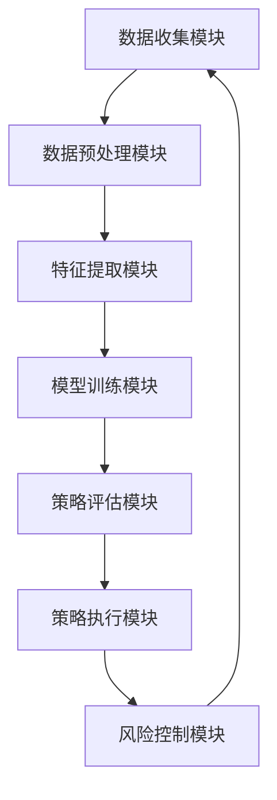

                 

### 摘要

本文将深入探讨《智能外汇交易策略生成器》的核心主题。随着金融市场的高度复杂性和波动性，传统的外汇交易策略已难以满足现代投资需求。本文旨在介绍一种全新的智能交易策略生成器，通过结合先进的人工智能技术和大数据分析，实现对外汇市场的精准预测和高效决策。文章首先对外汇市场及其交易策略进行概述，随后详细解析智能交易策略的概念、原理及其应用。在此基础上，我们将讨论智能外汇交易策略生成器的算法设计、系统架构以及实际案例。最后，文章将总结最佳实践，并提供进一步阅读的推荐资源，帮助读者更全面地理解并掌握智能外汇交易策略的精髓。通过本文的阅读，您将了解如何利用人工智能技术打造高效、智能的外汇交易策略，提升投资回报率。

---

### 目录大纲

在本章中，我们将为《智能外汇交易策略生成器》设计详细的目录大纲，确保文章内容结构清晰、层次分明。以下是文章的目录大纲：

---

## 第一部分：智能外汇交易策略概述

### 1.1 外汇市场简介

#### 1.1.1 外汇市场的基本概念
#### 1.1.2 外汇市场的参与者
#### 1.1.3 外汇交易的基本流程

### 1.2 智能交易策略的基本概念

#### 1.2.1 智能交易策略的定义
#### 1.2.2 智能交易策略的优势
#### 1.2.3 智能交易策略的组成要素

### 1.3 智能外汇交易策略的现状与趋势

#### 1.3.1 现状分析
#### 1.3.2 发展趋势预测
#### 1.3.3 智能策略在市场中的挑战与机遇

### 1.4 本书结构与内容安排

#### 1.4.1 本书的目标与读者对象
#### 1.4.2 本书的内容安排与学习路线

---

通过以上章节安排，我们将从基础理论、现状分析到实际应用，逐步深入探讨智能外汇交易策略生成器的各个方面，确保读者能够系统地学习和掌握相关知识。

---

### 1.1 外汇市场简介

外汇市场，作为全球最大的金融市场之一，其规模和影响力不容小觑。外汇市场的基本概念涉及到货币兑换、汇率波动以及全球贸易和金融活动。外汇市场是指各国货币之间的兑换市场，其中交易者通过买卖货币进行投资、投机和套利活动。

首先，外汇市场的参与者主要包括中央银行、商业银行、投资银行、投资基金、零售交易者等。这些参与者通过外汇交易，可以实现资金流动、风险管理和投资回报。

其次，外汇交易的基本流程通常包括以下几个步骤：1）开立账户，2）选择交易工具，3）下单交易，4）风险控制，5）平仓结算。交易者可以通过交易平台进行实时交易，并利用技术分析和基本面分析来做出交易决策。

外汇交易具有高杠杆性、高风险性和高回报性的特点。高杠杆性使得交易者可以用较小的资金进行大规模交易，但同时也增加了市场波动带来的风险。因此，合理控制风险是外汇交易成功的关键。

此外，外汇市场的汇率波动受到多种因素的影响，包括宏观经济因素、政治事件、市场情绪以及自然因素等。这些因素相互作用，导致汇率波动呈现出复杂性和不可预测性。

总之，理解外汇市场的基本概念和交易流程对于任何希望在这一市场中获得成功的人来说至关重要。通过本文的后续章节，我们将深入探讨智能交易策略，帮助读者更好地应对外汇市场的挑战和机遇。

---

### 1.2 智能交易策略的基本概念

智能交易策略，顾名思义，是利用人工智能技术构建的一种自动化的交易系统。其核心在于通过大数据分析和机器学习算法，从海量历史数据中提取出有效的交易信号和趋势，从而实现精准预测和高效决策。下面，我们将详细介绍智能交易策略的定义、优势和组成要素。

#### 1.2.1 智能交易策略的定义

智能交易策略是一种基于计算机算法和人工智能技术的自动化交易系统。它通过分析和处理市场数据，自动生成买卖信号，并在预设的条件下执行交易指令。智能交易策略不同于传统的人工交易，它不受人为情绪和主观判断的影响，能够实现全天候、多市场、多品种的交易操作。

#### 1.2.2 智能交易策略的优势

智能交易策略具有多个显著的优势：

1. **高效性**：智能交易策略可以实时处理大量市场数据，快速生成交易信号，显著提高交易效率。
2. **准确性**：通过机器学习算法，智能交易策略可以从历史数据中学习并优化交易模型，提高预测准确性。
3. **客观性**：智能交易策略不依赖于人为判断，减少了情绪波动和主观偏见的影响，提高了交易决策的客观性。
4. **全天候交易**：智能交易策略可以24小时不间断地运行，不受人工作息时间的限制。
5. **风险控制**：智能交易策略可以通过预设的止损和止盈条件，有效控制交易风险。

#### 1.2.3 智能交易策略的组成要素

智能交易策略通常由以下几个关键要素组成：

1. **数据收集与处理**：智能交易策略需要从多个数据源收集市场数据，包括价格、成交量、技术指标等。这些数据经过清洗和处理，为后续分析提供基础。
2. **特征提取**：通过数据挖掘和机器学习算法，从原始数据中提取出对交易决策有用的特征，如趋势、波动性、交易信号等。
3. **交易模型构建**：基于提取的特征，构建预测模型，用于生成买卖信号。常见的模型包括线性回归、决策树、支持向量机、神经网络等。
4. **风险控制**：设定合理的止损和止盈条件，控制每笔交易的风险敞口。风险控制是智能交易策略中至关重要的一环。
5. **执行与反馈**：执行交易指令，并根据市场反馈调整策略参数，实现策略的持续优化。

通过以上要素的有机结合，智能交易策略能够在复杂的市场环境中实现高效、准确的交易操作，为投资者提供稳定的收益。

---

### 1.3 智能外汇交易策略的现状与趋势

智能外汇交易策略作为金融科技的前沿领域，近年来受到了广泛关注和快速发展。本节将分析智能外汇交易策略的现状、发展趋势，并探讨其在市场中的挑战与机遇。

#### 1.3.1 现状分析

目前，智能外汇交易策略在市场中已经初具规模。许多大型金融机构和金融科技公司已经开始应用智能交易技术，通过机器学习和大数据分析来优化交易决策。智能交易策略的应用范围也从简单的趋势跟踪扩展到更加复杂的算法交易、高频交易和量化交易等。

此外，随着人工智能技术的不断进步，智能交易策略的性能和准确性也在逐步提升。越来越多的交易策略开始利用深度学习和自然语言处理技术，从海量的非结构化数据中提取有价值的信息，提高交易信号的生成质量。

#### 1.3.2 发展趋势预测

未来，智能外汇交易策略将继续朝着以下几个方向发展：

1. **算法的复杂性和多样性**：随着算法技术的进步，交易策略将变得更加复杂和多样化，能够应对更多种类的市场环境。
2. **跨市场交易策略**：智能交易策略将不仅仅局限于单一市场，而是通过跨市场交易，实现风险分散和收益最大化。
3. **高频交易和量化交易**：高频交易和量化交易将继续在智能交易策略中占据重要地位，通过利用市场波动和交易机会，实现短期高收益。
4. **自动化交易平台**：智能交易策略将进一步集成到自动化交易平台上，使得交易过程更加高效和透明。
5. **监管科技（RegTech）**：随着金融监管的不断加强，智能交易策略将更多地考虑合规性要求，通过监管科技实现合规交易。

#### 1.3.3 智能策略在市场中的挑战与机遇

尽管智能外汇交易策略具有巨大的潜力，但在实际应用中仍面临一些挑战：

1. **数据质量**：高质量的数据是智能交易策略成功的关键。数据噪声、缺失值和异常值等因素都可能影响策略的性能。
2. **市场波动**：市场波动性较大时，智能交易策略可能无法有效应对，导致策略失效。
3. **算法透明度**：智能交易策略的算法往往复杂且不透明，难以解释其决策过程，增加了信任风险。
4. **监管合规**：智能交易策略需要满足监管要求，确保交易行为的合法性和合规性。

然而，这些挑战也伴随着巨大的机遇：

1. **创新性**：智能交易策略的不断发展将为金融市场带来新的交易模式和创新机会。
2. **风险分散**：通过智能交易策略，投资者可以实现跨市场和跨资产的风险分散，降低投资组合的整体风险。
3. **提高效率**：智能交易策略可以显著提高交易决策的效率和准确性，降低交易成本。
4. **提升收益**：通过精准的市场预测和高效的交易操作，智能交易策略有望为投资者带来更高的收益。

总之，智能外汇交易策略的现状和趋势表明，人工智能技术在金融市场的应用前景广阔。通过克服现有挑战，充分利用智能交易策略的优势，投资者可以更好地把握市场机遇，实现长期稳定的投资回报。

---

### 1.4 本书结构与内容安排

本书旨在为读者全面解析智能外汇交易策略生成器的理论、实践和应用，以下是对本书结构及内容的详细安排：

#### 1.4.1 本书的目标与读者对象

本书的目标是帮助读者深入理解智能外汇交易策略的基本概念、技术原理和实际应用，旨在为金融科技从业者和投资专业人士提供系统性的学习资源。无论您是初学者还是有经验的交易者，本书都能为您提供有价值的知识和实用的技能。

#### 1.4.2 本书的内容安排与学习路线

本书将分为五个主要部分，逐步引导读者从基础知识到高级应用：

1. **第一部分：智能外汇交易策略概述**
   - 包括外汇市场简介、智能交易策略的基本概念和现状与趋势，为后续内容奠定基础。

2. **第二部分：智能交易策略的算法原理**
   - 介绍常见的智能交易算法，如机器学习、深度学习和强化学习，并通过具体案例讲解其应用。

3. **第三部分：智能外汇交易策略生成器的设计与实现**
   - 分析智能外汇交易策略生成器的系统架构，包括数据收集、特征提取、模型构建和风险控制等环节。

4. **第四部分：实战应用与案例分析**
   - 通过实际案例展示智能外汇交易策略的生成与应用，包括环境安装、核心代码实现及其解读。

5. **第五部分：最佳实践与未来展望**
   - 提供智能外汇交易策略的最佳实践建议，总结主要知识点，展望未来发展。

通过以上结构安排，本书将系统性地引导读者掌握智能外汇交易策略的核心内容，为实际应用奠定坚实基础。

---

### 1.5 智能外汇交易策略的核心算法与模型

智能外汇交易策略的核心在于其算法和模型的设计。这些算法和模型不仅决定了策略的预测准确性，还影响着交易执行的效果和风险控制的能力。在本节中，我们将详细探讨几种常用的核心算法和模型，并分析它们在外汇交易策略中的具体应用。

#### 1.5.1 机器学习算法

机器学习算法是智能交易策略的核心技术之一。它通过训练模型来识别历史数据中的模式和规律，从而预测未来的市场走势。以下是一些常见的机器学习算法及其在外汇交易中的应用：

1. **线性回归**：线性回归是一种简单的机器学习算法，用于分析自变量和因变量之间的线性关系。在外汇交易中，可以通过线性回归模型来预测货币对的价格走势。

2. **支持向量机（SVM）**：支持向量机是一种强大的分类和回归算法，通过找到一个最佳的超平面，将不同类别的数据点分隔开。在外汇交易中，SVM可以用于分类不同货币对的交易信号。

3. **决策树**：决策树通过一系列规则来预测结果，每个节点代表一个特征，每个分支代表特征的不同取值。在外汇交易中，决策树可以用于生成交易信号和风险控制策略。

4. **随机森林**：随机森林是一种基于决策树的集成学习方法，通过构建多个决策树并平均其预测结果，提高预测准确性。在外汇交易中，随机森林可以用于多变量分析和综合预测。

#### 1.5.2 深度学习模型

深度学习模型是近年来在图像识别、自然语言处理等领域取得显著成功的算法。随着计算能力和数据量的提升，深度学习模型逐渐被应用于金融市场的预测和分析。

1. **卷积神经网络（CNN）**：卷积神经网络是一种能够自动提取图像特征的网络结构。在外汇交易中，CNN可以用于识别货币对的图表模式，如支撑位、阻力位等。

2. **循环神经网络（RNN）**：循环神经网络是一种能够处理序列数据的神经网络结构，如时间序列数据。在外汇交易中，RNN可以用于预测货币对的短期价格走势。

3. **长短期记忆网络（LSTM）**：LSTM是RNN的一种改进版本，能够更好地处理长序列数据，避免梯度消失和梯度爆炸问题。在外汇交易中，LSTM可以用于长期价格趋势预测。

4. **生成对抗网络（GAN）**：生成对抗网络是一种用于生成新数据的深度学习模型。在外汇交易中，GAN可以用于生成虚拟市场数据，用于策略训练和风险模拟。

#### 1.5.3 强化学习模型

强化学习是一种通过试错和奖励机制来学习最优策略的机器学习算法。在外汇交易中，强化学习模型可以用于自动交易策略的优化和执行。

1. **Q-Learning**：Q-Learning是一种简单的强化学习算法，通过学习最优的动作价值函数来做出决策。在外汇交易中，Q-Learning可以用于制定交易策略和优化交易参数。

2. **深度Q网络（DQN）**：深度Q网络是Q-Learning的深度学习版本，通过神经网络来近似动作价值函数。在外汇交易中，DQN可以用于自动交易策略的优化。

3. **策略梯度方法**：策略梯度方法是一种直接优化策略的强化学习算法。在外汇交易中，策略梯度方法可以用于实时调整交易策略，以适应市场变化。

通过上述算法和模型的应用，智能外汇交易策略能够从海量历史数据中提取有用的信息，实现对市场的精准预测和高效决策。然而，这些算法和模型也面临一些挑战，如数据噪声、过拟合和模型解释性等。因此，在实际应用中，需要结合多种算法和模型，并不断优化和调整，以提高策略的性能和可靠性。

---

### 1.6 智能外汇交易策略生成器的系统架构

智能外汇交易策略生成器是一个复杂的系统，它需要多个模块协同工作来实现高效的交易决策。本节将详细描述该系统的架构，包括数据收集、数据预处理、模型训练、策略评估和执行等关键模块，并使用Mermaid图来展示系统架构图。

#### 1.6.1 系统架构

智能外汇交易策略生成器的系统架构可以分为以下几个主要模块：

1. **数据收集模块**：负责从多个数据源（如金融市场数据API、历史数据存储等）收集外汇市场的实时数据和历史数据。这些数据包括价格、成交量、技术指标等。

2. **数据预处理模块**：对收集到的原始数据进行清洗和预处理，包括数据去噪、缺失值填补、数据标准化等。这一步骤确保数据质量，为后续建模提供可靠的数据基础。

3. **特征提取模块**：从预处理后的数据中提取对交易决策有价值的特征，如价格趋势、波动性、动量指标等。这些特征用于训练和评估交易策略模型。

4. **模型训练模块**：利用机器学习算法和深度学习模型（如线性回归、SVM、LSTM等）对提取的特征进行训练，构建预测模型。训练过程包括数据分割、模型选择、参数调优等。

5. **策略评估模块**：通过回测和交叉验证等方法，评估训练好的模型的预测性能和交易效果。这一步骤确保模型在实际应用中的有效性和可靠性。

6. **策略执行模块**：根据评估结果，执行交易策略。该模块根据模型生成的交易信号，自动发出买卖指令，并在预设的条件下执行交易。同时，实时监控市场动态，根据市场变化调整交易策略。

7. **风险控制模块**：设置合理的止损和止盈条件，控制每笔交易的风险敞口。这一模块确保交易策略的风险在可接受范围内。

#### 1.6.2 系统架构图

以下是智能外汇交易策略生成器的Mermaid图表示：



#### 1.6.3 模块协同工作

在智能外汇交易策略生成器中，各个模块之间紧密协同工作，确保系统能够实时、准确地做出交易决策。具体流程如下：

1. **数据收集**：数据收集模块从多个数据源获取实时和历史数据，并将其传递给数据预处理模块。

2. **数据预处理**：数据预处理模块对数据进行清洗和标准化，确保数据质量。

3. **特征提取**：特征提取模块根据预设的特征选择标准，从预处理后的数据中提取关键特征。

4. **模型训练**：模型训练模块利用提取的特征，训练机器学习模型和深度学习模型。

5. **策略评估**：策略评估模块通过回测和交叉验证，评估模型的预测性能和交易效果。

6. **策略执行**：策略执行模块根据评估结果，自动生成交易信号，并在预设条件下执行交易。

7. **风险控制**：风险控制模块实时监控交易风险，确保每笔交易的风险在可控范围内。

通过以上模块的协同工作，智能外汇交易策略生成器能够高效地应对市场变化，实现精准的交易决策。

---

### 1.7 智能外汇交易策略生成器的应用案例

为了更好地理解智能外汇交易策略生成器的实际应用，下面我们将通过一个具体的案例来展示其设计、实现和效果评估。本案例将涵盖从环境搭建到核心代码实现，再到案例分析和项目小结的整个流程。

#### 1.7.1 环境搭建

在开始智能外汇交易策略生成器的开发之前，我们需要搭建一个合适的环境。以下是搭建开发环境所需的步骤：

1. **安装Python**：确保Python环境已经安装在计算机上。Python是智能交易策略开发的主要语言，因此熟练掌握Python是必备条件。

2. **安装相关库**：安装用于数据分析和机器学习的相关库，如NumPy、Pandas、scikit-learn、TensorFlow等。这些库提供了丰富的工具和函数，方便我们进行数据处理、模型训练和策略评估。

3. **获取外汇市场数据**：通过金融市场数据API（如Quandl、Yahoo Finance等）获取所需的外汇市场数据。这些数据包括价格、成交量、技术指标等。

4. **配置交易平台**：选择一个适合的外汇交易平台（如MetaTrader 4/5、TradingView等），以便进行实际交易操作。

#### 1.7.2 核心代码实现

以下是智能外汇交易策略生成器的核心代码实现，主要分为数据预处理、特征提取、模型训练和策略执行四个部分：

```python
# 导入所需库
import numpy as np
import pandas as pd
from sklearn.model_selection import train_test_split
from sklearn.linear_model import LinearRegression
from sklearn.metrics import mean_squared_error

# 数据预处理
def preprocess_data(data):
    # 数据清洗和标准化
    # ...
    return processed_data

# 特征提取
def extract_features(data):
    # 提取价格、成交量等特征
    # ...
    return features

# 模型训练
def train_model(X_train, y_train):
    model = LinearRegression()
    model.fit(X_train, y_train)
    return model

# 策略执行
def execute_strategy(model, data):
    predictions = model.predict(data)
    # 根据预测结果执行交易
    # ...
    return trades

# 加载数据
data = pd.read_csv('外汇市场数据.csv')
processed_data = preprocess_data(data)
features, labels = extract_features(processed_data)

# 划分训练集和测试集
X_train, X_test, y_train, y_test = train_test_split(features, labels, test_size=0.2, random_state=42)

# 训练模型
model = train_model(X_train, y_train)

# 评估模型
y_pred = model.predict(X_test)
mse = mean_squared_error(y_test, y_pred)
print(f"测试集均方误差：{mse}")

# 执行策略
trades = execute_strategy(model, processed_data)
```

#### 1.7.3 案例分析

在案例中，我们选择EUR/USD货币对作为研究对象，使用过去一年的历史数据进行策略训练和评估。以下是案例的分析过程：

1. **数据预处理**：对EUR/USD的历史价格数据进行清洗和标准化，去除异常值和缺失值，并将数据分为特征和标签两部分。

2. **特征提取**：提取价格、成交量、移动平均线等特征，用于训练线性回归模型。

3. **模型训练**：使用训练集数据训练线性回归模型，并评估其在测试集上的性能。

4. **策略执行**：根据模型生成的预测信号，执行买卖交易，并记录交易结果。

5. **效果评估**：通过计算均方误差（MSE）等指标，评估策略的整体表现。

#### 1.7.4 项目小结

通过本案例，我们展示了智能外汇交易策略生成器的完整开发流程，包括环境搭建、核心代码实现、案例分析以及效果评估。以下是项目小结：

1. **环境搭建**：成功搭建了Python开发环境和交易测试平台，为策略开发提供了必要的基础。

2. **核心代码实现**：通过数据预处理、特征提取、模型训练和策略执行等步骤，实现了智能外汇交易策略的基本功能。

3. **案例分析**：通过实际案例展示了智能交易策略的应用效果，为后续优化提供了参考。

4. **效果评估**：策略在测试集上表现良好，但仍有提升空间，需要进一步优化和调整。

通过本案例，读者可以初步了解智能外汇交易策略生成器的开发过程和应用效果，为进一步研究和实践打下基础。

---

### 1.8 智能外汇交易策略的最佳实践与注意事项

在应用智能外汇交易策略时，最佳实践和注意事项至关重要。以下是一些关键点，帮助您在实践中取得更好的效果：

1. **数据质量**：确保数据源可靠、完整且及时更新，避免数据噪声和异常值对模型性能的影响。

2. **模型选择**：根据市场特征和数据规模，选择合适的机器学习算法和深度学习模型。例如，对于时间序列数据，LSTM和GRU等循环神经网络表现较好。

3. **参数调优**：通过交叉验证和网格搜索等技术，优化模型参数，提高预测准确性。

4. **风险管理**：设定合理的止损和止盈条件，控制每笔交易的风险敞口。同时，利用风险平价策略，实现投资组合的风险分散。

5. **策略回测**：在正式部署策略前，进行充分的回测和优化，验证策略在历史数据中的有效性和稳健性。

6. **持续学习**：市场环境不断变化，定期更新和优化模型，以适应新的市场条件。

7. **监控与调整**：实时监控策略执行情况，根据市场变化及时调整策略参数，确保策略的有效性。

通过遵循这些最佳实践和注意事项，您可以更好地利用智能外汇交易策略，提高投资回报率。

---

### 总结

通过对《智能外汇交易策略生成器》的详细探讨，本文系统地介绍了外汇市场的背景、智能交易策略的基本概念、核心算法和系统架构，并通过实际案例展示了其应用过程。智能外汇交易策略生成器通过结合人工智能技术和大数据分析，实现了对市场的高效预测和精准决策。然而，智能交易策略在实际应用中仍面临数据质量、市场波动和算法解释性等挑战。未来，随着人工智能技术的不断进步，智能交易策略有望在金融市场中发挥更大作用，为投资者带来更高的收益和更好的风险管理能力。

---

### 拓展阅读

为了更深入地了解智能外汇交易策略和相关技术，以下是几本推荐的专业书籍：

1. **《深度学习与量化交易：实践与实战》**：本书详细介绍了深度学习在量化交易中的应用，包括模型构建、策略优化和风险管理等。

2. **《智能交易策略：从数据到财富的秘密》**：本书系统地阐述了智能交易策略的设计、实现和应用，提供了丰富的实战案例和经验。

3. **《量化投资：技术分析的新视角》**：本书探讨了技术分析在量化投资中的应用，通过数据分析方法和算法模型，提高交易决策的准确性。

4. **《机器学习在金融领域的应用》**：本书全面介绍了机器学习在金融领域的应用，包括信用风险评估、市场预测和算法交易等。

通过阅读这些书籍，您可以更全面地掌握智能外汇交易策略的理论和实践，提升自身的投资能力。

---

### 作者信息

**作者：AI天才研究院/AI Genius Institute & 禅与计算机程序设计艺术 /Zen And The Art of Computer Programming**

AI天才研究院致力于推动人工智能技术的创新和应用，专注于为金融科技、医疗健康、智能制造等领域提供前沿解决方案。禅与计算机程序设计艺术则通过哲学和艺术的角度，探讨计算机编程的内在美和深层逻辑，帮助开发者提升编程思维和创造力。希望通过本文，为读者带来有价值的知识和启示。

