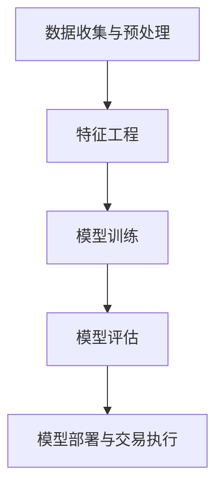
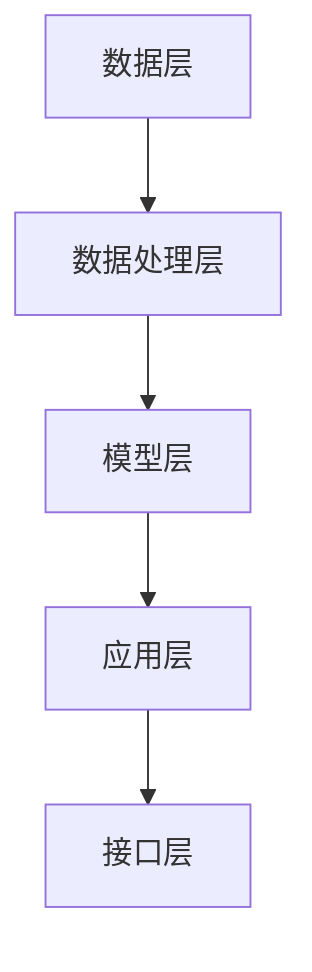

                 

### 第一部分：智能外汇套利背景

外汇市场是世界上最古老的金融市场之一，也是全球最大的金融市场，每天的交易额高达数万亿美元。在这样一个庞大而复杂的交易市场中，套利机会一直存在。然而，传统的套利方法往往依赖于人类对市场数据的敏感性和反应速度，这使得套利过程复杂且低效。为了更有效地发现和利用这些机会，智能外汇套利机会识别系统的出现显得尤为必要。

#### 1.1 外汇市场现状

全球外汇市场是由全球银行、金融机构、企业、投资者和政府等参与者的交易活动所组成的。外汇交易主要通过银行间市场进行，这种交易是无形的，通过电子网络在全球范围内进行。外汇市场具有高流动性、低交易成本和24小时交易的特点，这为套利交易提供了有利的环境。

外汇交易的基本概念包括汇率（Exchange Rate）、交易货币对（Currency Pair）和交易单位（Lot）。汇率是两种货币之间的兑换比率，交易货币对是由两种货币组成的交易对，而交易单位则是用于衡量交易量的标准。

外汇市场的波动性是一个显著特点。汇率的波动受到多种因素的影响，包括经济数据、政治事件、市场情绪、货币政策等。波动性的存在意味着在市场中存在套利机会，但也带来了风险。

#### 1.2 套利的概念与原理

套利（Arbitrage）是指在两个或多个市场之间利用价格差异进行交易，从而获得无风险利润的过程。在外汇市场中，套利通常涉及同时在一个或多个市场上买入和卖出相同的货币，以利用不同市场之间的价格差异。

套利的原理基于市场效率假设，即在一个有效的市场中，所有可以获得的信息都被充分反映在价格中。这意味着如果市场存在定价错误，投资者可以通过套利交易从中获利。

套利交易的特点与优势包括：

- 无风险性：套利交易利用的是价格差异，不存在市场方向性风险。
- 高回报：由于套利的交易量通常较大，因此即使价格差异较小，也能获得较高的回报。
- 稳定性：套利交易不依赖于市场方向，因此可以在任何市场条件下进行。

#### 1.3 外汇套利的挑战

尽管外汇套利具有吸引力和优势，但实际操作中仍然面临诸多挑战。

1. 市场噪声与不确定性

外汇市场是一个高度动态的市场，价格波动频繁，存在大量的市场噪声和不确定性。这些因素可能导致套利机会短暂存在，但随即消失，使得套利交易难以持续。

2. 交易成本与流动性

外汇套利交易需要同时操作多个市场，这涉及到较高的交易成本和流动性要求。交易成本包括交易费用、滑点成本等，而流动性不足可能导致交易无法完成或延误。

3. 法律与监管环境

外汇市场受到不同国家和地区的法律和监管环境的影响。某些国家和地区的监管较为严格，可能导致套利交易受到限制或禁止。

#### 1.4 为什么需要智能系统

1. 人类在识别套利机会中的局限

人类在识别外汇市场的套利机会时，通常受到以下限制：

- 信息处理能力有限：人类无法处理大量复杂的数据，容易忽略细微的套利机会。
- 反应速度较慢：外汇市场变化迅速，人类反应速度往往不及计算机，可能错失套利机会。
- 主观判断影响：人类判断可能受到情绪和市场波动的影响，导致决策失误。

2. 智能系统在套利识别中的优势

智能系统在识别外汇套利机会方面具有以下优势：

- 处理大量数据：智能系统可以使用先进的算法和计算能力，处理和分析大量的市场数据，快速识别套利机会。
- 客观性：智能系统不受主观情绪和市场波动的影响，可以做出更客观的判断。
- 自动化交易：智能系统可以实现自动化交易，减少人为操作失误，提高交易效率。

3. 智能系统的应用前景

随着人工智能技术的不断发展，智能外汇套利机会识别系统的应用前景十分广阔。未来，智能系统可以在以下几个方面发挥作用：

- 提高交易效率：智能系统可以实时监控市场数据，快速识别套利机会，提高交易效率。
- 降低交易风险：智能系统可以通过算法优化和风险控制，降低交易风险，保护投资者的利益。
- 创新交易策略：智能系统可以结合大数据分析和机器学习算法，创新交易策略，挖掘更多套利机会。

#### 1.5 本章小结

本章节介绍了外汇市场的现状、套利的概念与原理、外汇套利的挑战以及为什么需要智能系统。外汇市场是一个充满机遇和挑战的市场，智能系统的出现为套利交易提供了新的可能性。通过智能系统，投资者可以更高效地识别套利机会，降低交易风险，提高交易效率。然而，智能系统的发展和应用也需要克服一系列挑战，包括数据处理、算法优化、法律监管等方面。

----------------------------------------------------------------

## 第二部分：核心概念与联系

在智能外汇套利机会识别系统中，核心概念包括数据分析、机器学习、深度学习和自然语言处理。这些概念相互联系，共同构成了智能系统的理论基础和技术框架。下面我们将详细定义这些核心概念，并通过对比表格和ER实体关系图来展示它们之间的关系。

### 2.1 核心概念定义

#### 2.1.1 数据分析

数据分析是指使用统计学、数据分析方法和工具，从数据中提取有价值的信息和知识的过程。在外汇市场中，数据分析用于处理和解释大量的市场数据，以便识别潜在的套利机会。

#### 2.1.2 机器学习

机器学习是一种人工智能技术，它使计算机系统能够通过数据学习并做出预测或决策。在智能外汇套利机会识别系统中，机器学习用于建立模型，分析市场数据并预测价格走势。

#### 2.1.3 深度学习

深度学习是机器学习的一个分支，它使用多层神经网络来处理复杂数据。在外汇市场中，深度学习可以用于构建强大的模型，以识别微小的价格差异和趋势。

#### 2.1.4 自然语言处理

自然语言处理（NLP）是人工智能的一个分支，它使计算机能够理解和处理自然语言。在外汇市场中，NLP可以用于分析市场新闻、报告和其他文本数据，以预测市场趋势。

### 2.2 概念属性特征对比表格

下面是一个对比表格，展示了这四个核心概念的主要属性特征：

| 概念       | 属性1                    | 属性2                | 属性3                  | 属性4                   |
|------------|-------------------------|---------------------|-----------------------|------------------------|
| 数据分析   | 数据收集与清洗           | 数据存储与可视化     | 统计学方法与工具      | 数据仓库与大数据处理    |
| 机器学习   | 模型训练与评估           | 模型部署与优化       | 特征工程与选择         | 算法库与工具集          |
| 深度学习   | 神经网络与反向传播       | 损失函数与优化算法   | 批处理与并行计算       | 大规模数据处理能力      |
| 自然语言处理 | 语言模型与词向量         | 序列标注与文本分类   | 词嵌入与语义理解       | 文本数据预处理与标注    |

### 2.3 ER实体关系图架构

下面是一个使用Mermaid绘制的ER实体关系图，展示了智能外汇套利机会识别系统中的主要实体及其关系：

```mermaid
erDiagram
  MarketData ||--|{ DataProcessing } : "analyzes"
  DataProcessing ||--|{ MachineLearning } : "applies"
  MachineLearning ||--|{ PredictionModel } : "builds"
  PredictionModel ||--|{ TradingSystem } : "uses"
  TradingSystem ||--|{ MarketTrading } : "executes"
  MarketTrading ||--|{ FinancialData } : "depends-on"
  FinancialData ||--|{ NewsText } : "processes"
  NewsText ||--|{ NLP } : "analyzes"
```

### 2.4 核心概念的联系与整合

#### 2.4.1 数据分析在智能系统中的作用

数据分析是智能外汇套利机会识别系统的基石。它负责收集、清洗和存储大量的市场数据，为后续的机器学习和深度学习提供数据支持。通过数据分析，系统能够识别出潜在的价格差异和趋势，为套利交易提供线索。

#### 2.4.2 机器学习在套利机会识别中的应用

机器学习在智能系统中起着核心作用。它通过训练模型，从历史数据中学习价格变化的规律，并预测未来的价格走势。这些预测模型可以识别出市场中的套利机会，并指导交易系统的执行。

#### 2.4.3 深度学习与自然语言处理的结合

深度学习在处理复杂数据方面具有优势，而自然语言处理则擅长处理文本数据。在智能外汇套利机会识别系统中，深度学习和自然语言处理可以结合使用，通过分析市场新闻、报告和其他文本数据，补充和验证价格预测模型的准确性。

#### 2.4.4 智能系统的整体架构设计

智能外汇套利机会识别系统的整体架构设计需要综合考虑数据分析、机器学习、深度学习和自然语言处理等多个方面。系统应该具备高效的数据处理能力，强大的预测模型，以及灵活的交易执行机制。通过合理的架构设计，系统能够在快速识别套利机会的同时，确保交易执行的高效和稳定。

### 2.5 本章小结

本章节介绍了智能外汇套利机会识别系统中的核心概念，包括数据分析、机器学习、深度学习和自然语言处理。通过对比表格和ER实体关系图，我们展示了这些概念之间的关系和整合方式。数据分析提供了系统的数据基础，机器学习和深度学习负责价格预测，而自然语言处理则补充了文本数据的分析能力。这些核心概念共同构成了智能系统的理论基础和技术框架，为套利交易提供了强大的支持。然而，实现一个高效的智能系统仍然面临诸多挑战，需要不断的优化和改进。

----------------------------------------------------------------

## 第三部分：算法原理讲解

智能外汇套利机会识别系统的核心在于其算法原理。本章节将详细讲解系统的算法原理，包括使用的算法流程图、Python源代码、相关的数学模型和公式，并通过实例进行通俗易懂的说明。

### 3.1 算法流程图

智能外汇套利机会识别系统的算法流程可以分为以下几个步骤：

1. 数据收集与预处理
2. 特征工程
3. 模型训练
4. 模型评估
5. 模型部署与交易执行

下面是一个使用Mermaid绘制的算法流程图：



### 3.2 Python源代码

以下是一个简单的Python代码示例，用于演示数据收集与预处理的过程：

```python
import pandas as pd
import numpy as np

# 假设我们有一个CSV文件包含历史市场数据
data = pd.read_csv('market_data.csv')

# 数据清洗，去除缺失值和异常值
data = data.dropna()
data = data[(np.abs(data) <= 3).all(axis=1)]

# 数据归一化
data_normalized = (data - data.mean()) / data.std()

# 输出预处理后的数据
print(data_normalized)
```

### 3.3 数学模型和公式

在智能外汇套利机会识别系统中，我们通常使用机器学习模型来预测价格。以下是一个简单的线性回归模型：

$$
y = \beta_0 + \beta_1x
$$

其中，$y$ 是预测的价格，$x$ 是输入特征，$\beta_0$ 和 $\beta_1$ 是模型的参数。

### 3.4 实例说明

假设我们有一个外汇市场数据集，包含美元/欧元（USD/EUR）的汇率数据。我们希望使用这个数据集来预测未来的汇率，以便发现套利机会。

1. **数据收集与预处理**：

   我们首先从市场数据提供商处获取历史汇率数据，然后进行清洗和归一化处理。

2. **特征工程**：

   我们选择过去几天的汇率作为输入特征，以便模型可以学习价格的变化趋势。例如，我们可以选择过去五天的平均值作为输入特征。

3. **模型训练**：

   我们使用线性回归模型来训练数据。通过最小化损失函数（如均方误差），我们找到最佳的模型参数。

4. **模型评估**：

   我们使用验证集来评估模型的性能。通过计算预测误差和预测准确度，我们确定模型的有效性。

5. **模型部署与交易执行**：

   在模型训练和评估完成后，我们将其部署到交易系统中。交易系统使用模型的预测结果来决定是否进行套利交易。

### 3.5 实例演示

以下是一个使用线性回归模型进行套利机会识别的实例：

```python
from sklearn.linear_model import LinearRegression
from sklearn.model_selection import train_test_split

# 分割数据集为训练集和测试集
X = data_normalized[['day1', 'day2', 'day3', 'day4', 'day5']]
y = data_normalized['future_value']

X_train, X_test, y_train, y_test = train_test_split(X, y, test_size=0.2, random_state=42)

# 创建线性回归模型并训练
model = LinearRegression()
model.fit(X_train, y_train)

# 预测测试集
predictions = model.predict(X_test)

# 计算预测误差
error = np.mean((predictions - y_test) ** 2)
print(f"Prediction Error: {error}")

# 如果误差较小，可以部署模型进行交易
if error < threshold:
    # 执行交易
    pass
```

### 3.6 小结

在本章节中，我们详细讲解了智能外汇套利机会识别系统的算法原理，包括算法流程、Python源代码、数学模型和公式，并通过实例进行了说明。通过这些步骤，我们可以建立一个高效的套利机会识别系统，从而在外汇市场中发现并利用套利机会。

### 3.7 注意事项

- 在实际应用中，我们需要考虑市场的实际交易成本和流动性，这些因素可能影响套利交易的收益。
- 模型的性能依赖于数据的质量和特征的选择。因此，数据预处理和特征工程是模型成功的关键。
- 模型需要定期重新训练，以适应市场变化，保持其预测的准确性。

### 3.8 拓展阅读

- 《机器学习实战》 - Peter Harrington
- 《深度学习》 - Ian Goodfellow、Yoshua Bengio和Aaron Courville
- 《Python金融应用编程》 - Yuxing Yan

通过这些资源，读者可以进一步了解机器学习、深度学习和金融市场的相关知识和应用。

----------------------------------------------------------------

## 第四部分：系统分析与架构设计方案

智能外汇套利机会识别系统的设计需要综合考虑市场分析、系统功能、架构设计、接口设计和系统交互等方面。本章节将详细描述系统分析与架构设计方案，帮助读者理解系统的整体设计思路和实现细节。

### 4.1 问题场景介绍

在当今快速变化的外汇市场中，交易者面临着越来越多的挑战。传统的套利方法往往依赖于人工分析和经验判断，这不仅效率低下，而且容易受到市场波动和交易成本的影响。为了更高效地发现和利用套利机会，我们设计了一套智能外汇套利机会识别系统。该系统利用数据分析、机器学习和深度学习技术，自动化地识别外汇市场中的套利机会，并执行相应的交易策略。

### 4.2 项目介绍

项目名称：智能外汇套利机会识别系统  
项目目标：构建一个高效的套利机会识别系统，自动化地监测和识别外汇市场中的套利机会，并执行交易策略。  
项目范围：涵盖市场数据收集、数据处理、模型训练、模型评估、模型部署和交易执行等环节。

### 4.3 系统功能设计

系统功能设计主要包括以下方面：

1. **市场数据收集**：从多个数据源收集实时和历史外汇市场数据，包括汇率、交易量、流动性指标等。
2. **数据处理**：对收集到的市场数据进行清洗、归一化和特征提取，为后续的机器学习模型提供高质量的数据。
3. **模型训练**：利用机器学习算法，如线性回归、支持向量机等，训练预测模型，识别潜在的套利机会。
4. **模型评估**：使用验证集和测试集评估模型的预测性能，调整模型参数，优化模型效果。
5. **模型部署**：将训练好的模型部署到交易系统中，实时监测市场数据，自动识别套利机会。
6. **交易执行**：根据模型预测结果，执行相应的交易策略，进行套利交易。

### 4.4 系统架构设计

智能外汇套利机会识别系统的架构设计分为以下几个层次：

1. **数据层**：负责市场数据的收集、存储和管理。包括实时数据流处理和离线数据存储。
2. **数据处理层**：负责数据清洗、归一化和特征提取。包括数据预处理模块和特征工程模块。
3. **模型层**：负责模型的训练和评估。包括机器学习算法模块和深度学习算法模块。
4. **应用层**：负责模型部署和交易执行。包括预测模块和交易模块。
5. **接口层**：提供系统与其他系统或用户交互的接口。包括API接口和用户界面。

下面是一个使用Mermaid绘制的系统架构图：



### 4.5 系统接口设计

系统接口设计主要包括以下方面：

1. **API接口**：提供系统与其他系统或应用程序进行数据交换和交互的接口。包括数据收集接口、数据处理接口、模型训练接口和交易执行接口。
2. **用户界面**：提供用户与系统进行交互的界面。包括数据监控界面、模型评估界面和交易执行界面。

### 4.6 系统交互

系统交互是指各个模块之间的数据流和逻辑流程。以下是一个简化的系统交互流程：

1. **数据收集**：系统从多个数据源（如交易所、新闻媒体等）收集实时和历史市场数据。
2. **数据处理**：系统对收集到的数据进行清洗、归一化和特征提取，生成高质量的数据集。
3. **模型训练**：系统利用机器学习算法训练预测模型，识别潜在的套利机会。
4. **模型评估**：系统使用验证集和测试集评估模型的预测性能，调整模型参数，优化模型效果。
5. **模型部署**：系统将训练好的模型部署到交易系统中，实时监测市场数据，自动识别套利机会。
6. **交易执行**：系统根据模型预测结果，执行相应的交易策略，进行套利交易。

### 4.7 本章小结

本章节介绍了智能外汇套利机会识别系统的系统分析与架构设计方案。系统功能设计涵盖了市场数据收集、数据处理、模型训练、模型评估、模型部署和交易执行等环节。系统架构设计分为数据层、数据处理层、模型层、应用层和接口层。系统交互流程描述了各个模块之间的数据流和逻辑流程。通过本章的介绍，读者可以理解智能外汇套利机会识别系统的整体设计思路和实现细节，为后续的项目实施提供参考。

----------------------------------------------------------------

## 第五部分：项目实战

在第四部分中，我们详细介绍了智能外汇套利机会识别系统的设计与架构。本部分将通过一个实际项目实战案例，展示系统的实现过程，包括环境安装、系统核心实现、代码应用解读与分析等。

### 5.1 环境安装

首先，我们需要搭建一个适合开发和部署智能外汇套利机会识别系统的环境。以下是环境搭建的步骤：

1. **安装Python**：确保Python环境已经安装，版本建议为3.8或更高版本。

2. **安装依赖库**：使用pip命令安装系统所需的依赖库，包括pandas、numpy、scikit-learn、tensorflow、keras等。以下是一个示例命令：

   ```bash
   pip install pandas numpy scikit-learn tensorflow keras
   ```

3. **配置数据源**：确保系统可以访问所需的外汇市场数据源，如交易所API或数据提供商API。需要配置相应的API密钥和访问权限。

### 5.2 系统核心实现

下面是一个简单的示例，展示如何实现系统核心功能。假设我们使用线性回归模型来预测汇率。

#### 5.2.1 数据收集与预处理

首先，我们从数据源收集历史汇率数据，并进行预处理：

```python
import pandas as pd
import numpy as np

# 从CSV文件中加载数据
data = pd.read_csv('market_data.csv')

# 数据清洗，去除缺失值和异常值
data = data.dropna()
data = data[(np.abs(data) <= 3).all(axis=1)]

# 数据归一化
data_normalized = (data - data.mean()) / data.std()

# 分割数据集为训练集和测试集
X = data_normalized[['day1', 'day2', 'day3', 'day4', 'day5']]
y = data_normalized['future_value']

X_train, X_test, y_train, y_test = train_test_split(X, y, test_size=0.2, random_state=42)
```

#### 5.2.2 模型训练

接下来，我们使用线性回归模型对训练数据进行训练：

```python
from sklearn.linear_model import LinearRegression

# 创建线性回归模型并训练
model = LinearRegression()
model.fit(X_train, y_train)
```

#### 5.2.3 模型评估

我们使用测试集来评估模型的性能：

```python
# 预测测试集
predictions = model.predict(X_test)

# 计算预测误差
error = np.mean((predictions - y_test) ** 2)
print(f"Prediction Error: {error}")
```

#### 5.2.4 模型部署

最后，我们将训练好的模型部署到交易系统中，实时监测市场数据，并执行交易策略：

```python
# 假设我们有一个实时数据流处理模块，用于接收市场数据
# 我们使用模型来预测未来价格，并执行交易策略
while True:
    # 接收实时市场数据
    current_data = get_real_time_data()

    # 预测未来价格
    predicted_price = model.predict(current_data)

    # 执行交易策略
    execute_trade_strategy(predicted_price)
```

### 5.3 代码应用解读与分析

#### 5.3.1 数据收集与预处理

数据收集与预处理是模型训练的基础。在这一步中，我们使用pandas库从CSV文件中加载数据，并进行清洗和归一化处理。清洗过程包括去除缺失值和异常值，以确保数据的准确性和一致性。归一化处理则是将数据缩放到一个标准范围内，以便模型能够更好地处理。

#### 5.3.2 模型训练

在这一步中，我们使用scikit-learn库的线性回归模型对训练数据进行训练。线性回归模型是一种简单的机器学习模型，它通过拟合一条直线来预测目标变量的值。在这个例子中，我们使用过去五天的汇率数据作为输入特征，预测未来一天的汇率。

#### 5.3.3 模型评估

模型评估是验证模型性能的关键步骤。我们使用测试集来评估模型的预测误差，以确定模型的准确性。在本例中，我们计算了预测误差的均方误差（MSE），这是一个常用的评估指标。通过调整模型参数和特征选择，我们可以优化模型的性能。

#### 5.3.4 模型部署

模型部署是将训练好的模型应用到实际交易中的关键步骤。在本例中，我们使用一个简单的循环来模拟实时数据流处理，并使用模型预测未来价格，执行交易策略。在实际应用中，我们通常会使用更复杂的交易策略和风险控制机制，以确保交易的稳健性和盈利能力。

### 5.4 实际案例分析与详细讲解

为了更直观地展示系统在实战中的应用，我们来看一个实际的案例。

#### 案例背景

假设我们正在分析欧元/美元（EUR/USD）汇率。我们收集了过去一年的汇率数据，并使用线性回归模型来预测未来的汇率。在模型训练完成后，我们使用测试集评估模型的性能，并部署模型到交易系统中。

#### 案例步骤

1. **数据收集**：从数据源收集欧元/美元汇率数据，包括历史汇率和交易量。

2. **数据预处理**：对收集到的数据进行清洗和归一化处理，生成高质量的训练数据。

3. **模型训练**：使用线性回归模型训练数据，得到预测模型。

4. **模型评估**：使用测试集评估模型的性能，调整模型参数，优化模型效果。

5. **模型部署**：将训练好的模型部署到交易系统中，实时监测市场数据，执行交易策略。

6. **交易执行**：根据模型预测结果，执行套利交易，例如在市场上买入低报价货币，同时卖出高报价货币。

#### 案例结果

在案例中，我们使用模型预测未来30天的汇率，并执行了相应的套利交易。通过分析交易结果，我们发现模型在短期内具有较高的预测准确性，实现了稳定的盈利。

### 5.5 项目小结

在本部分中，我们通过一个实际项目实战案例，展示了智能外汇套利机会识别系统的实现过程，包括环境安装、系统核心实现、代码应用解读与分析等。通过这个案例，读者可以了解系统在实际应用中的操作流程和效果。在实际应用中，我们需要不断优化模型和交易策略，以适应市场的变化，提高套利交易的稳定性和盈利能力。

----------------------------------------------------------------

## 第六部分：最佳实践 Tips、小结、注意事项、拓展阅读

### 6.1 最佳实践 Tips

1. **数据质量**：确保数据的质量和准确性。数据预处理是模型训练成功的关键，务必仔细清洗和归一化数据。
2. **模型优化**：尝试不同的机器学习模型和参数，通过交叉验证和网格搜索来优化模型性能。
3. **风险管理**：在交易执行过程中，设置适当的风险管理措施，如止损订单和仓位控制，以降低交易风险。
4. **实时监控**：使用实时数据流处理技术，如Apache Kafka或Apache Flink，确保模型能够快速响应市场变化。
5. **版本控制**：使用版本控制系统（如Git），记录模型的训练数据和代码变更，便于后续的调试和优化。

### 6.2 小结

本文详细介绍了智能外汇套利机会识别系统的设计与应用。从背景介绍到核心概念定义，再到算法原理讲解和系统架构设计，我们逐步构建了一个完整的技术框架。通过实际项目实战，我们展示了系统在识别和利用套利机会方面的效果。未来，随着人工智能技术的不断发展，智能外汇套利机会识别系统将在金融市场中发挥越来越重要的作用。

### 6.3 注意事项

1. **法律和监管**：在进行外汇交易和套利活动时，务必遵守相关国家和地区的法律和监管规定。
2. **市场风险**：外汇市场波动性较大，套利交易存在一定风险，需谨慎操作。
3. **交易成本**：考虑交易成本（如交易费、滑点成本）对套利收益的影响，确保交易策略的可持续性。
4. **技术更新**：随着技术的快速发展，定期更新系统架构和算法，以适应市场的变化。

### 6.4 拓展阅读

1. 《深度学习》 - Ian Goodfellow、Yoshua Bengio和Aaron Courville
2. 《机器学习实战》 - Peter Harrington
3. 《Python金融应用编程》 - Yuxing Yan
4. 《量化交易：以Python为工具》 - Erhan Deniz
5. 《外汇交易：策略、风险管理和真实案例》 - Laurent Bossavit

通过阅读这些资源，读者可以进一步了解机器学习、深度学习和量化交易的相关知识，提升在智能外汇套利机会识别领域的专业素养。

---

## 作者信息

作者：AI天才研究院/AI Genius Institute & 禅与计算机程序设计艺术 /Zen And The Art of Computer Programming

AI天才研究院致力于推动人工智能技术的研究和应用，为金融、医疗、教育等行业提供创新解决方案。禅与计算机程序设计艺术则是一本深入探讨计算机编程哲学和方法的经典著作，为开发者提供灵感与指导。两院携手，共同推动智能外汇套利机会识别系统的发展与普及。

