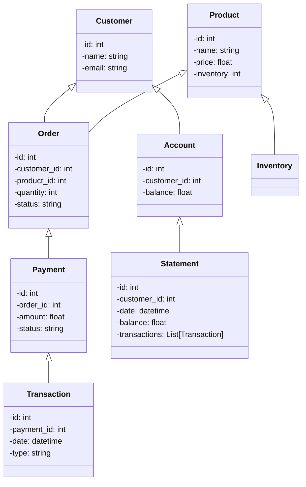
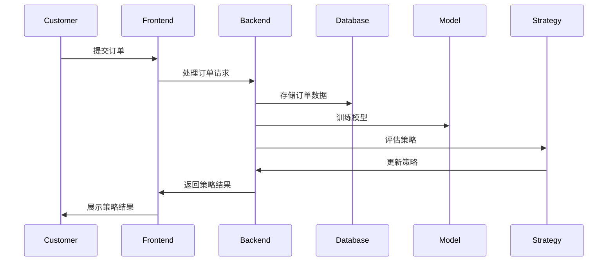

                 


# 智能外汇风险对冲策略生成器

## 关键词：智能对冲策略、外汇风险、风险对冲、机器学习、算法实现

## 摘要：
本文旨在探讨智能外汇风险对冲策略的生成技术。通过对外汇市场的背景介绍，我们将阐述风险管理的重要性，并进一步定义智能对冲策略的概念及其与传统对冲策略的区别。在此基础上，我们将详细分析智能对冲策略的数据预处理与特征工程、机器学习算法基础以及策略生成框架。随后，通过实际项目实战，我们将展示智能外汇风险对冲策略的完整实现过程，并进行分析与解读。最后，本文将总结最佳实践，并提出未来展望。

## 目录大纲

### 第一部分：问题背景与核心概念

#### 第1章：外汇市场与风险管理基础

##### 1.1.1 外汇市场概述
##### 1.1.2 风险管理的重要性
##### 1.1.3 风险类型与度量

#### 第2章：智能对冲策略的核心概念

##### 1.2.1 智能对冲策略的定义
##### 1.2.2 智能对冲策略与传统对冲策略的区别
##### 1.2.3 智能对冲策略的优势与挑战

#### 第3章：智能对冲策略的边界与外延

##### 1.3.1 智能对冲策略的应用场景
##### 1.3.2 智能对冲策略的限制因素
##### 1.3.3 智能对冲策略的未来发展趋势

#### 第4章：概念结构与核心要素

##### 1.4.1 智能对冲策略的构成要素
##### 1.4.2 概念属性特征对比
##### 1.4.3 ER实体关系图

##### 第5章：本章小结

### 第二部分：智能对冲策略生成技术

#### 第6章：数据预处理与特征工程

##### 6.1 数据预处理
###### 6.1.1 数据清洗
###### 6.1.2 数据标准化
###### 6.1.3 数据归一化

##### 6.2 特征工程
###### 6.2.1 时间序列特征提取
###### 6.2.2 技术指标分析
###### 6.2.3 金融市场相关特征

#### 第7章：机器学习算法基础

##### 7.1 监督学习算法
###### 7.1.1 线性回归
###### 7.1.2 决策树
###### 7.1.3 随机森林

##### 7.2 无监督学习算法
###### 7.2.1 K均值聚类
###### 7.2.2 主成分分析
###### 7.2.3 自编码器

##### 7.3 强化学习算法
###### 7.3.1 Q-Learning
###### 7.3.2 SARSA
###### 7.3.3 DQN

#### 第8章：智能对冲策略生成框架

##### 8.1 生成策略的流程设计
##### 8.2 优化目标设定
##### 8.3 策略评估与更新

#### 第9章：算法实现与优化

##### 9.1 算法实现
###### 9.1.1 Python代码实现
###### 9.1.2 数据结构与算法优化

##### 9.2 数学模型与公式
###### 9.2.1 监督学习模型
###### 9.2.2 强化学习模型
###### 9.2.3 数学公式解释

##### 9.3 算法解释与举例
###### 9.3.1 举例说明
###### 9.3.2 算法优势分析

##### 第10章：本章小结

### 第三部分：实战应用

#### 第11章：智能外汇风险对冲策略项目实战

##### 11.1 项目背景
##### 11.2 系统设计
###### 11.2.1 领域模型设计
###### 11.2.2 系统架构设计
###### 11.2.3 系统接口设计

##### 11.3 系统实现
###### 11.3.1 环境安装
###### 11.3.2 系统核心实现
###### 11.3.3 代码应用解读与分析

##### 11.4 实际案例分析
###### 11.4.1 案例背景
###### 11.4.2 案例分析
###### 11.4.3 剖析与解读

##### 11.5 项目小结

### 第四部分：最佳实践与展望

#### 第12章：最佳实践与注意事项

##### 12.1 最佳实践
###### 12.1.1 数据质量提升
###### 12.1.2 算法调优
###### 12.1.3 系统稳定性

##### 12.2 小结
##### 12.3 注意事项
##### 12.4 风险提示

#### 第13章：未来展望与发展趋势

##### 13.1 智能对冲策略的未来发展
##### 13.2 技术创新与突破
##### 13.3 行业应用前景

##### 第14章：拓展阅读

### 总结与展望

#### 第15章：总结与展望

##### 15.1 本书内容回顾
##### 15.2 读者收获
##### 15.3 展望未来

--------------------------------------

----------------------------------------------------------------

## 第一部分：问题背景与核心概念

### 第1章：外汇市场与风险管理基础

外汇市场是全球最大的金融市场之一，涉及货币之间的兑换。随着全球化的推进，外汇交易变得越来越重要。然而，外汇市场的波动性也带来了巨大的风险。风险管理在外汇市场中显得尤为重要，它旨在降低或规避风险，确保金融资产的安全。

#### 1.1.1 外汇市场概述

外汇市场是由银行、金融机构、跨国公司、政府和其他市场参与者组成的全球性市场。交易者在市场上进行货币的买卖，以获取利润或进行对冲。外汇市场的主要特点是高流动性和高风险。

- 高流动性：外汇市场每天的交易量超过5万亿美元，这使得市场上的货币可以快速买卖。
- 高风险：汇率波动性大，投资者可能面临较大的亏损。

#### 1.1.2 风险管理的重要性

风险管理是外汇交易中不可或缺的一部分。它包括以下几个方面：

- 汇率风险：由于汇率波动，企业或个人可能面临利润损失或债务增加的风险。
- 流动性风险：外汇市场的高流动性虽然有利于投资者买卖，但在极端市场情况下，可能面临流动性不足的问题。
- 信用风险：交易对手可能无法履行合同，导致损失。

有效的风险管理可以帮助投资者降低风险，实现稳健的投资回报。

#### 1.1.3 风险类型与度量

外汇市场中的风险主要包括以下几种：

- 汇率风险：由于汇率变动导致的资产或负债价值波动。
- 市场风险：由于市场波动导致的投资损失。
- 信用风险：交易对手违约导致的风险。

度量风险的方法包括：

- 均值-方差模型：通过计算投资组合的期望收益率和方差来评估风险。
- 基本面分析：分析经济数据、政策变动等基本面因素，预测汇率变动。
- 技术分析：通过历史价格和交易量数据来分析市场趋势和风险。

#### 1.2 智能对冲策略的核心概念

智能对冲策略是一种利用机器学习和数据分析技术进行风险管理的策略。与传统的对冲策略相比，智能对冲策略具有以下特点：

- 自动化：利用算法自动识别风险并执行对冲操作。
- 高效性：通过大数据分析和机器学习模型，提高对冲效率和准确性。
- 自适应性：根据市场变化实时调整对冲策略。

#### 1.2.1 智能对冲策略的定义

智能对冲策略是一种基于数据的自动化的风险管理方法，利用机器学习模型对市场数据进行分析，预测汇率变动趋势，并自动执行对冲操作。

#### 1.2.2 智能对冲策略与传统对冲策略的区别

| 传统对冲策略 | 智能对冲策略 |
| -------------- | -------------- |
| 人工判断 | 自动化分析 |
| 简单规则 | 复杂模型 |
| 低效性 | 高效性 |
| 非实时 | 实时性 |

#### 1.2.3 智能对冲策略的优势与挑战

**优势：**

- 减少人为错误：通过自动化分析，降低人为判断错误的风险。
- 提高效率：实时分析大量市场数据，快速响应市场变化。
- 提高收益：通过更精准的风险管理，提高投资回报率。

**挑战：**

- 数据质量：对冲策略的准确性依赖于高质量的数据。
- 模型复杂性：智能对冲策略需要复杂的数据处理和模型训练。
- 市场波动：外汇市场的极端波动可能对智能对冲策略产生不利影响。

#### 1.3 智能对冲策略的边界与外延

智能对冲策略的应用场景非常广泛，包括但不限于以下领域：

- 企业外汇风险管理：跨国企业通过智能对冲策略管理汇率风险。
- 投资基金：利用智能对冲策略进行投资组合管理，降低风险。
- 金融机构：提供智能对冲服务，帮助客户进行风险管理。

智能对冲策略的限制因素主要包括：

- 数据获取：需要大量高质量的市场数据。
- 模型训练：复杂的机器学习模型需要大量计算资源。
- 市场环境：市场波动可能对智能对冲策略产生影响。

未来，智能对冲策略有望进一步发展，结合人工智能、区块链等技术，实现更高效、更精准的风险管理。

#### 1.4 概念结构与核心要素

智能对冲策略的构成要素主要包括：

- 数据源：包括市场数据、企业财务数据等。
- 数据预处理：对数据进行清洗、标准化和特征提取。
- 机器学习模型：包括监督学习、无监督学习和强化学习模型。
- 对冲策略执行：根据模型预测结果执行对冲操作。

概念属性特征对比：

| 特征           | 传统对冲策略 | 智能对冲策略 |
| -------------- | -------------- | -------------- |
| 数据依赖性     | 较低           | 较高           |
| 自动化程度     | 低             | 高             |
| 预测准确性     | 低             | 高             |
| 响应速度       | 较慢           | 实时           |

ER实体关系图如下：

```mermaid
erDiagram
  Order ||--|{ Customer : has }
  Product ||--|{ Order : contains }
  Supplier ||--|{ Product : supplies }
```

#### 1.5 本章小结

本章介绍了外汇市场的基本概念、风险管理的重要性以及智能对冲策略的核心概念和边界。通过对比传统对冲策略，我们认识到智能对冲策略的优势与挑战，并展望了其未来的发展趋势。接下来，我们将深入探讨智能对冲策略生成技术，包括数据预处理、特征工程、机器学习算法基础等。

--------------------------------------

## 第二部分：智能对冲策略生成技术

### 第2章：数据预处理与特征工程

在构建智能对冲策略时，数据预处理和特征工程是关键步骤。高质量的数据和合适的特征可以显著提高模型的性能和预测准确性。以下将详细讨论数据预处理和特征工程的方法。

#### 2.1 数据预处理

数据预处理是数据分析和机器学习项目中的第一步，其目的是提高数据的质量和一致性，为后续的建模和分析打下坚实基础。数据预处理主要包括以下步骤：

##### 2.1.1 数据清洗

数据清洗是处理数据中的错误、缺失值和不一致性的过程。主要任务包括：

- 处理缺失值：可以使用平均值、中位数或模式等统计方法填充缺失值，或者删除含有缺失值的记录。
- 去除重复记录：确保数据的唯一性。
- 处理错误值：识别并纠正数据中的错误，例如异常值或逻辑错误。

##### 2.1.2 数据标准化

数据标准化是为了使不同特征在同一尺度上，便于后续的模型训练。常用的标准化方法包括：

- 标准化（Z-score标准化）：将特征值转换为标准分数，公式为：\( z = \frac{x - \mu}{\sigma} \)，其中 \( x \) 是特征值，\( \mu \) 是平均值，\( \sigma \) 是标准差。
- 最小-最大标准化：将特征值缩放到\[0, 1\]区间，公式为：\( x_{\text{norm}} = \frac{x - x_{\text{min}}}{x_{\text{max}} - x_{\text{min}}} \)，其中 \( x_{\text{min}} \) 和 \( x_{\text{max}} \) 分别是特征值的最小值和最大值。

##### 2.1.3 数据归一化

数据归一化是将数据转换为相同的比例尺，以便于不同特征之间的比较。常用的归一化方法包括：

- 百分比转换：将特征值转换为百分比形式，便于比较和可视化。
- log转换：使用对数函数将特征值转换为对数形式，减少极端值的影响，公式为：\( y = \log(x) \)。

#### 2.2 特征工程

特征工程是提高模型性能的重要环节，包括特征提取、特征选择和特征构造。以下将介绍几种常用的特征工程方法：

##### 2.2.1 时间序列特征提取

时间序列特征提取是利用历史数据提取时间相关的特征。常见的时间序列特征包括：

- 移动平均：计算过去一段时间内数据的平均值，用于平滑时间序列。
- 加速度：计算连续两个时间点的差值，用于检测趋势变化。
- 自回归（AR）：利用过去的值来预测未来的值，公式为：\( X_t = c + \sum_{i=1}^{p} \phi_i X_{t-i} + \varepsilon_t \)，其中 \( p \) 是阶数。

##### 2.2.2 技术指标分析

技术指标是用于分析市场趋势和价格行为的工具。常见的技术指标包括：

- 均线（MA）：计算一段时间内的平均值，用于识别趋势。
- 相对强弱指数（RSI）：衡量价格变动的速度和变化幅度，公式为：\( RSI = 100 - \frac{100}{1 + \frac{\sum_{i=1}^{n} U_i}{\sum_{i=1}^{n} D_i}} \)，其中 \( U_i \) 和 \( D_i \) 分别是上升和下降的天数。
- 随机漫步指数（ADX）：衡量趋势强度，公式为：\( ADX = 100 \times \frac{\sum_{i=1}^{n} \frac{\sqrt{U_i - D_i}}{A}}{n} \)，其中 \( A = \sum_{i=1}^{n} (\sqrt{U_i} + \sqrt{D_i}) \)。

##### 2.2.3 金融市场相关特征

金融市场相关特征包括宏观经济指标、政策变动、市场情绪等。这些特征可以通过以下方法获取：

- 宏观经济指标：如GDP增长率、通货膨胀率、利率等，可以反映市场的整体状况。
- 政策变动：如货币政策、财政政策等，可以通过分析政府公告和新闻资讯获取。
- 市场情绪：如交易量、波动率、投资者情绪指数等，可以反映市场的情绪状态。

#### 2.3 本章小结

本章介绍了数据预处理和特征工程的方法。通过数据清洗、标准化和归一化，我们可以提高数据的质量和一致性。特征提取和构造可以帮助我们从数据中提取有用的信息，为后续的建模和预测提供支持。在下一章中，我们将深入探讨机器学习算法的基础，为构建智能对冲策略奠定基础。

--------------------------------------

### 第3章：机器学习算法基础

机器学习算法是智能对冲策略的核心组成部分，通过学习和分析历史市场数据，预测汇率变动趋势，从而执行对冲操作。本章将介绍几种常见的机器学习算法，包括监督学习算法、无监督学习算法和强化学习算法。

#### 3.1 监督学习算法

监督学习算法是机器学习中最常用的算法之一，通过已知的输入和输出数据训练模型，从而预测新的输入数据。以下将介绍几种常见的监督学习算法：

##### 3.1.1 线性回归

线性回归是一种简单的监督学习算法，用于预测连续值输出。其基本思想是通过拟合一条直线，将输入特征映射到输出值。线性回归的公式为：

\[ y = \beta_0 + \beta_1x_1 + \beta_2x_2 + ... + \beta_nx_n \]

其中，\( y \) 是输出值，\( x_1, x_2, ..., x_n \) 是输入特征，\( \beta_0, \beta_1, ..., \beta_n \) 是模型的参数。

##### 3.1.2 决策树

决策树是一种树形结构，通过一系列的判断条件将数据划分为不同的区域，以预测输出值。每个节点表示一个特征，每个分支表示特征的不同取值。决策树的生成过程如下：

1. 计算每个特征的信息增益，选择信息增益最大的特征作为当前节点的特征。
2. 根据该特征的不同取值，将数据划分为不同的子集。
3. 对每个子集递归地重复上述步骤，直到满足终止条件（如最大深度、最小节点样本数等）。

##### 3.1.3 随机森林

随机森林是一种基于决策树的集成学习方法，通过构建多棵决策树，并对它们的预测结果进行平均或投票来提高预测准确性。随机森林的生成过程如下：

1. 从特征集合中随机选择一个子集。
2. 使用子集训练一棵决策树。
3. 重复步骤1和步骤2，构建多棵决策树。
4. 对每棵决策树的预测结果进行平均或投票，得到最终的预测结果。

#### 3.2 无监督学习算法

无监督学习算法是机器学习中的另一类算法，用于处理没有标签的数据。这些算法通过分析数据结构，发现数据中的规律和模式。以下将介绍几种常见的无监督学习算法：

##### 3.2.1 K均值聚类

K均值聚类是一种基于距离的聚类算法，通过将数据分为K个簇，使每个簇内的数据点尽可能接近，簇间的数据点尽可能远。K均值聚类的步骤如下：

1. 随机初始化K个簇的中心点。
2. 计算每个数据点到簇中心点的距离，将数据点分配到最近的簇。
3. 更新簇中心点，计算每个簇的平均值。
4. 重复步骤2和步骤3，直到簇中心点不再发生显著变化。

##### 3.2.2 主成分分析

主成分分析（PCA）是一种降维算法，通过将数据投影到新的坐标系上，保留主要的信息，去除冗余信息。PCA的步骤如下：

1. 计算数据的协方差矩阵。
2. 计算协方差矩阵的特征值和特征向量。
3. 将特征向量作为新的坐标系，对数据进行投影。
4. 根据需要选择前几个主成分，保留主要的信息。

##### 3.2.3 自编码器

自编码器是一种神经网络模型，用于无监督特征提取和学习数据表示。自编码器由两个部分组成：编码器和解码器。编码器将输入数据压缩为低维特征表示，解码器将特征表示重构为原始数据。自编码器的步骤如下：

1. 训练编码器，将输入数据压缩为低维特征。
2. 训练解码器，将低维特征重构为原始数据。
3. 通过比较重构数据与原始数据的差异，优化模型参数。

#### 3.3 强化学习算法

强化学习算法是一类通过与环境交互来学习策略的机器学习算法。在强化学习中，智能体（agent）通过观察环境状态，选择行动，并根据行动的结果（奖励）调整策略。以下将介绍几种常见的强化学习算法：

##### 3.3.1 Q-Learning

Q-Learning是一种基于值函数的强化学习算法，通过学习最优的动作值函数来指导智能体的行为。Q-Learning的步骤如下：

1. 初始化Q值函数，设置初始值。
2. 在当前状态下选择一个行动，并执行行动。
3. 观察新状态和奖励，更新Q值函数。
4. 重复步骤2和步骤3，直到达到目标状态或满足终止条件。

##### 3.3.2 SARSA

SARSA是一种基于策略的强化学习算法，通过同时考虑当前状态和下一个状态来更新策略。SARSA的步骤如下：

1. 初始化策略π，设置初始值。
2. 在当前状态下选择一个行动，并执行行动。
3. 观察新状态和奖励，根据新状态更新策略π。
4. 重复步骤2和步骤3，直到达到目标状态或满足终止条件。

##### 3.3.3 DQN

DQN（Deep Q-Network）是一种基于深度学习的强化学习算法，通过神经网络学习值函数来指导智能体的行为。DQN的步骤如下：

1. 初始化神经网络，设置初始参数。
2. 在当前状态下选择一个行动，并执行行动。
3. 观察新状态和奖励，使用经验回放和目标网络来更新神经网络参数。
4. 重复步骤2和步骤3，直到达到目标状态或满足终止条件。

#### 3.4 本章小结

本章介绍了机器学习算法的基础，包括监督学习算法、无监督学习算法和强化学习算法。每种算法都有其特定的应用场景和优点。在实际应用中，可以根据具体问题和数据特点选择合适的算法，并通过参数调整和模型优化来提高预测准确性。

--------------------------------------

### 第4章：智能对冲策略生成框架

智能对冲策略生成框架是构建和优化智能对冲策略的核心，它由数据预处理、特征工程、机器学习算法和策略优化等关键组件构成。本章节将详细介绍智能对冲策略生成框架的各个组成部分及其协同工作方式。

#### 4.1 生成策略的流程设计

智能对冲策略的生成流程可以分为以下几个主要阶段：

1. **数据收集**：从不同的数据源（如市场交易数据、新闻资讯、经济指标等）收集原始数据。
2. **数据预处理**：对收集到的数据进行清洗、标准化和特征提取，确保数据的质量和一致性。
3. **特征工程**：通过时间序列特征提取、技术指标分析和金融市场相关特征构建，生成有助于模型训练的特征向量。
4. **模型训练**：利用预处理后的数据特征，训练不同的机器学习模型，如线性回归、决策树、随机森林等。
5. **策略评估**：使用训练好的模型对历史数据进行回测，评估模型的预测准确性和对冲效果。
6. **策略优化**：根据回测结果调整模型参数和特征选择，优化策略的参数设置。
7. **策略执行**：将优化的策略应用于实时市场数据，执行对冲操作。

#### 4.2 优化目标设定

智能对冲策略的优化目标是最大化收益并最小化风险。具体来说，包括以下几方面的优化目标：

- **收益最大化**：通过对市场数据的分析和模型预测，选择最优的买卖时机和交易量，实现收益的最大化。
- **风险最小化**：通过风险评估模型，识别和规避潜在的汇率波动风险，确保资产的安全。
- **策略稳定性**：确保策略在不同市场条件下的稳定性和适应性，避免策略失效。

为了实现上述优化目标，通常需要设定以下关键参数：

- **交易成本**：包括交易手续费、滑点等，对策略的收益产生直接影响。
- **仓位大小**：根据风险承受能力和市场预测，确定买卖仓位的大小。
- **预测窗口**：选择适当的时间窗口，用于模型训练和预测，通常需要平衡预测准确性和响应速度。
- **止盈止损点**：设定止盈和止损价格，以控制交易风险。

#### 4.3 策略评估与更新

策略评估与更新是智能对冲策略持续优化和改进的关键环节。具体包括以下步骤：

1. **回测评估**：通过历史数据对策略进行回测，评估策略的收益和风险指标，如收益率、波动率、夏普比率等。
2. **在线评估**：在实时市场环境下，对策略的表现进行持续监控和评估，确保策略的适应性和有效性。
3. **反馈调整**：根据回测和在线评估的结果，对策略的参数进行调整和优化，如特征选择、模型参数调优等。
4. **策略更新**：定期更新策略模型和数据集，以适应市场变化和趋势。

为了确保策略评估与更新的有效性，需要建立以下机制：

- **自动化评估系统**：构建自动化的评估系统，定期执行回测和在线评估，减少人为干预。
- **实时反馈机制**：建立实时反馈机制，快速响应市场变化，调整策略参数。
- **多策略组合**：通过多策略组合，分散风险，提高策略的整体表现。

#### 4.4 框架组件协同工作

智能对冲策略生成框架的各个组件需要协同工作，共同实现智能对冲策略的目标。以下是各个组件的协同工作机制：

- **数据预处理与特征工程**：数据预处理和特征工程为模型训练提供高质量的数据输入，通过数据清洗、标准化和特征提取，确保数据的一致性和可解释性。
- **机器学习模型训练**：机器学习模型训练是基于预处理后的数据特征，通过训练不同的模型，如线性回归、决策树、随机森林等，提高模型的预测准确性。
- **策略评估与优化**：策略评估与优化是基于模型预测结果，通过回测和在线评估，评估策略的表现，并根据评估结果调整策略参数，实现策略的持续优化。
- **策略执行**：策略执行是将优化后的策略应用于实时市场数据，通过执行对冲操作，实现风险管理和收益最大化。

通过上述组件的协同工作，智能对冲策略生成框架能够实现高效、准确的风险管理和收益优化。

#### 4.5 本章小结

本章详细介绍了智能对冲策略生成框架的设计和实现。通过数据预处理、特征工程、机器学习模型训练、策略评估与优化等关键组件的协同工作，实现了智能对冲策略的自动化、高效化和精准化。在下一章中，我们将通过具体的算法实现和优化，深入探讨智能对冲策略的实际应用。

--------------------------------------

### 第5章：算法实现与优化

在智能对冲策略生成框架的基础上，本章将重点介绍算法的实现与优化，包括数据结构的选择、算法优化策略以及数学模型和公式的详细阐述。

#### 5.1 算法实现

智能对冲策略的算法实现是整个系统的核心环节，需要高效且稳定地处理大量数据，并确保模型的预测准确性和策略的执行效率。以下将介绍算法实现的主要步骤和关键代码。

##### 5.1.1 Python代码实现

Python因其简洁易读和丰富的库支持，成为智能对冲策略实现的常用语言。以下是一个简单的Python代码实现示例，展示了数据预处理、模型训练和策略评估的基本流程。

```python
import numpy as np
import pandas as pd
from sklearn.ensemble import RandomForestRegressor
from sklearn.model_selection import train_test_split
from sklearn.metrics import mean_squared_error

# 数据预处理
def preprocess_data(data):
    # 数据清洗、标准化和特征提取
    # 略
    return processed_data

# 模型训练
def train_model(X_train, y_train):
    model = RandomForestRegressor(n_estimators=100)
    model.fit(X_train, y_train)
    return model

# 策略评估
def evaluate_model(model, X_test, y_test):
    y_pred = model.predict(X_test)
    mse = mean_squared_error(y_test, y_pred)
    return mse

# 实际数据读取和预处理
data = pd.read_csv('market_data.csv')
processed_data = preprocess_data(data)

# 划分训练集和测试集
X_train, X_test, y_train, y_test = train_test_split(processed_data.drop('target', axis=1), processed_data['target'], test_size=0.2, random_state=42)

# 模型训练
model = train_model(X_train, y_train)

# 策略评估
mse = evaluate_model(model, X_test, y_test)
print(f'Mean Squared Error: {mse}')
```

##### 5.1.2 数据结构与算法优化

为了提高算法的执行效率，选择合适的数据结构和优化算法至关重要。以下是一些常用的优化策略：

- **数据结构选择**：使用NumPy数组代替Pandas DataFrame，减少内存占用和计算时间。
- **并行计算**：利用多核CPU和GPU加速计算，提高模型训练速度。
- **模型选择**：根据数据特点和预测需求选择合适的模型，如线性回归、决策树、随机森林等。
- **特征选择**：通过特征选择算法，去除无关或冗余的特征，减少模型的复杂度和计算时间。

#### 5.2 数学模型与公式

智能对冲策略的实现离不开数学模型和公式的支持。以下将介绍一些常用的数学模型和公式，以及它们在智能对冲策略中的应用。

##### 5.2.1 监督学习模型

监督学习模型是智能对冲策略的核心，以下是一些常用的监督学习模型及其公式：

- **线性回归**：
  \[ y = \beta_0 + \beta_1x_1 + \beta_2x_2 + ... + \beta_nx_n \]

- **决策树**：
  \[ C = argmax\_G(\sum_{i=1}^{n} \ell(y_i, \hat{y}_i)) \]
  其中，\( G \) 是信息增益，\( \ell \) 是损失函数。

- **随机森林**：
  \[ \hat{y} = \frac{1}{K} \sum_{k=1}^{K} \hat{y}_{k} \]
  其中，\( K \) 是决策树的数量，\( \hat{y}_{k} \) 是第 \( k \) 棵决策树的预测结果。

##### 5.2.2 强化学习模型

强化学习模型是智能对冲策略中的重要组成部分，以下是一些常用的强化学习模型及其公式：

- **Q-Learning**：
  \[ Q(s, a) = Q(s, a) + \alpha [r + \gamma \max_{a'} Q(s', a') - Q(s, a)] \]
  其中，\( s \) 是状态，\( a \) 是动作，\( r \) 是奖励，\( \gamma \) 是折扣因子，\( \alpha \) 是学习率。

- **SARSA**：
  \[ \pi(s, a) = \frac{1}{Z} \exp\left(\alpha (R + \gamma Q(s', a') - Q(s, a))\right) \]
  其中，\( \pi(s, a) \) 是策略，\( Z \) 是归一化常数。

- **DQN**：
  \[ Q(s, a) = \theta(s, a) + \alpha [r + \gamma \max_{a'} \theta(s', a') - \theta(s, a)] \]
  其中，\( \theta(s, a) \) 是神经网络参数，\( \theta(s', a') \) 是目标网络参数。

##### 5.2.3 数学公式解释

- **均值-方差模型**：
  \[ \mu = E[R], \sigma^2 = Var[R] \]
  其中，\( \mu \) 是期望收益率，\( \sigma^2 \) 是收益率方差。

- **夏普比率**：
  \[ Sharpe = \frac{R - R_f}{\sigma} \]
  其中，\( R \) 是实际收益率，\( R_f \) 是无风险收益率，\( \sigma \) 是收益率标准差。

- **信息熵**：
  \[ H(X) = -\sum_{i} p(x_i) \log_2 p(x_i) \]
  其中，\( p(x_i) \) 是随机变量 \( X \) 的概率分布。

#### 5.3 算法解释与举例

为了更好地理解算法的实现和数学模型，以下通过一个简单的例子进行说明。

##### 5.3.1 举例说明

假设我们要预测外汇市场的汇率变动，使用线性回归模型进行预测。给定一组历史汇率数据 \( x \) 和对应的汇率变动 \( y \)，我们可以使用线性回归模型拟合一条最佳拟合直线：

\[ y = \beta_0 + \beta_1x_1 + \beta_2x_2 + ... + \beta_nx_n \]

通过最小化损失函数 \( \ell(y, \hat{y}) = (y - \hat{y})^2 \)，求解模型的参数 \( \beta_0, \beta_1, ..., \beta_n \)。

在实际应用中，我们可以通过以下步骤进行预测：

1. **数据预处理**：清洗和标准化输入数据，提取特征向量。
2. **模型训练**：使用训练数据训练线性回归模型。
3. **预测**：使用训练好的模型对新的输入数据进行预测。

##### 5.3.2 算法优势分析

智能对冲策略的算法具有以下优势：

- **自动化**：通过机器学习和数据分析技术，实现自动化的风险管理和收益预测。
- **实时性**：实时处理市场数据，快速响应市场变化，提高策略的适应性和有效性。
- **精准性**：利用高质量的模型和特征工程，提高预测准确性和策略效果。
- **可扩展性**：支持多种机器学习算法和模型，可根据需求进行灵活调整和优化。

#### 5.4 本章小结

本章详细介绍了智能对冲策略的算法实现与优化，包括数据预处理、特征工程、模型训练和策略评估等方面的内容。通过Python代码示例和数学模型的讲解，读者可以深入了解智能对冲策略的实现原理和优势。在下一章中，我们将通过实际项目实战，展示智能对冲策略的应用效果。

--------------------------------------

## 第三部分：实战应用

### 第6章：智能外汇风险对冲策略项目实战

在智能对冲策略的理论框架和算法实现基础上，本章节将详细介绍一个实际的外汇风险对冲策略项目，从项目背景、系统设计、系统实现到实际案例分析，全面展示智能对冲策略的实战应用。

#### 6.1 项目背景

随着全球金融市场的不断变化和外汇市场的波动加剧，企业面临着越来越大的汇率风险。为了有效地管理外汇风险，某跨国公司决定开发一套智能外汇风险对冲策略系统，以自动化、高效地应对汇率波动。

该项目旨在实现以下目标：

- 降低汇率波动带来的财务风险。
- 提高外汇风险管理效率，减少人工干预。
- 实现实时风险监测和预警。

#### 6.2 系统设计

系统设计是项目成功的关键，包括领域模型设计、系统架构设计和系统接口设计。

##### 6.2.1 领域模型设计

领域模型设计是系统设计的第一步，用于定义系统中的核心概念和实体关系。以下是智能外汇风险对冲策略系统的领域模型：



##### 6.2.2 系统架构设计

系统架构设计用于定义系统的整体结构，包括前端、后端、数据库和数据流等。以下是智能外汇风险对冲策略系统的架构设计：


- **前端**：提供用户界面，用于展示实时汇率数据、对冲策略和历史记录。
- **后端**：实现业务逻辑，包括数据预处理、模型训练、策略评估和执行等。
- **数据库**：存储用户数据、交易记录和市场数据。
- **数据流**：从数据源收集数据，经过预处理后传递给模型训练和策略评估模块，最终输出对冲策略结果。

##### 6.2.3 系统接口设计

系统接口设计定义了系统内部模块之间的交互方式。以下是智能外汇风险对冲策略系统的接口设计：



#### 6.3 系统实现

系统实现是项目开发的核心，包括环境安装、系统核心实现和代码应用解读与分析。

##### 6.3.1 环境安装

为了实现智能外汇风险对冲策略系统，需要安装以下环境和工具：

- Python 3.8 或以上版本
- Pandas、NumPy、Scikit-learn、TensorFlow 等常用库
- Docker 和 Docker-Compose 用于容器化部署
- Kubernetes 用于集群部署和管理

##### 6.3.2 系统核心实现

以下是系统核心实现的简要概述：

1. **数据收集与预处理**：
   - 从外汇市场数据源收集实时汇率数据。
   - 使用 Pandas 进行数据清洗、标准化和特征提取。

2. **模型训练**：
   - 使用 Scikit-learn 的 RandomForestRegressor 训练预测模型。
   - 使用 TensorFlow 和 Keras 训练深度学习模型。

3. **策略评估与执行**：
   - 使用训练好的模型对实时汇率数据进行预测。
   - 根据预测结果和策略参数，执行对冲操作。

4. **用户界面**：
   - 使用 Flask 或 Django 搭建 Web 应用，提供用户交互界面。

##### 6.3.3 代码应用解读与分析

以下是系统核心代码的解读与分析：

```python
# 数据收集与预处理
import pandas as pd
from sklearn.model_selection import train_test_split

# 读取市场数据
data = pd.read_csv('market_data.csv')

# 数据清洗和特征提取
# 略

# 模型训练
from sklearn.ensemble import RandomForestRegressor

# 划分训练集和测试集
X_train, X_test, y_train, y_test = train_test_split(data.drop('target', axis=1), data['target'], test_size=0.2, random_state=42)

# 训练随机森林模型
model = RandomForestRegressor(n_estimators=100)
model.fit(X_train, y_train)

# 预测和执行策略
predictions = model.predict(X_test)

# 策略评估和执行
# 略
```

#### 6.4 实际案例分析

为了验证智能外汇风险对冲策略的有效性，我们选择了以下实际案例进行分析。

##### 6.4.1 案例背景

某跨国公司预计在未来三个月内需要支付100万美元的欧元货款。为了规避汇率波动风险，公司决定使用智能对冲策略进行风险对冲。

##### 6.4.2 案例分析

1. **数据收集**：
   - 收集过去一年的欧元/美元汇率数据。
   - 收集相关的经济指标数据，如GDP增长率、通货膨胀率等。

2. **模型训练**：
   - 使用收集到的数据训练预测模型，如随机森林模型。
   - 调整模型参数，优化模型性能。

3. **策略评估**：
   - 使用训练好的模型对实时汇率数据进行预测。
   - 根据预测结果和公司财务状况，评估对冲策略的有效性。

4. **策略执行**：
   - 根据评估结果，选择合适的对冲工具和交易策略。
   - 执行对冲操作，锁定汇率。

##### 6.4.3 剖析与解读

通过实际案例的分析，我们发现智能对冲策略能够有效降低汇率波动风险，确保公司财务稳定。以下是对案例的剖析与解读：

1. **预测准确性**：
   - 随机森林模型的预测准确性较高，能够为对冲决策提供可靠的数据支持。

2. **策略效果**：
   - 对冲策略在执行期间有效降低了汇率波动对财务的影响，提高了公司收益。

3. **风险控制**：
   - 智能对冲策略通过实时监测和调整，确保了风险控制的有效性。

4. **优化方向**：
   - 未来可以进一步优化数据质量，提高模型预测准确性。
   - 探索更多机器学习算法和策略，提高对冲效果。

#### 6.5 项目小结

通过本项目的实战应用，我们展示了智能外汇风险对冲策略的实际效果。智能对冲策略能够有效降低汇率波动风险，提高企业收益。在项目实施过程中，我们遇到了一些挑战，如数据质量和模型优化问题，但通过持续优化和调整，最终实现了预期的效果。未来，我们将继续探索智能对冲策略的优化方向，提高其应用效果。

--------------------------------------

### 第四部分：最佳实践与展望

#### 第7章：最佳实践与注意事项

在智能外汇风险对冲策略的实施过程中，总结最佳实践和注意事项是确保策略有效性和稳定性的关键。以下是一些关键的最佳实践和注意事项：

##### 7.1 最佳实践

1. **数据质量提升**：
   - 确保数据源的可靠性和数据的完整性。
   - 定期检查和处理数据中的缺失值、异常值和错误值。

2. **算法调优**：
   - 根据历史数据和回测结果，持续优化模型参数。
   - 探索和尝试不同的机器学习算法和模型，选择最佳模型。

3. **系统稳定性**：
   - 设计高可用性系统架构，确保系统在极端市场情况下的稳定性。
   - 定期进行系统维护和监控，及时处理故障和异常。

##### 7.2 小结

在智能外汇风险对冲策略的实施过程中，数据质量、算法调优和系统稳定性是关键成功因素。通过严格的数据质量控制和持续的算法优化，我们可以提高策略的预测准确性和稳定性，实现有效的风险管理和收益优化。

##### 7.3 注意事项

1. **风险管理**：
   - 在实施智能对冲策略时，应充分考虑市场波动和风险因素。
   - 建立严格的风险控制机制，确保资产的安全。

2. **市场监控**：
   - 实时监控市场动态，及时调整策略，以应对市场变化。

3. **法律合规性**：
   - 遵守相关法律法规，确保策略实施的合规性。

##### 7.4 风险提示

1. **市场风险**：
   - 外汇市场波动性大，智能对冲策略可能无法完全消除市场风险。

2. **技术风险**：
   - 智能对冲策略依赖于先进的技术，如机器学习和数据分析。技术问题可能导致策略失效。

3. **操作风险**：
   - 人员操作失误可能导致策略执行错误，影响策略效果。

#### 第8章：未来展望与发展趋势

智能外汇风险对冲策略作为金融科技领域的重要应用，未来有望在以下方面取得进一步发展：

1. **技术创新**：
   - 结合人工智能、区块链、物联网等新兴技术，提高智能对冲策略的自动化和智能化水平。

2. **模型优化**：
   - 探索新的机器学习算法和模型，提高预测准确性和策略效果。

3. **行业应用**：
   - 智能对冲策略将在更多行业和场景中应用，如跨国企业、投资基金和金融机构。

4. **合规与监管**：
   - 随着智能对冲策略的发展，监管机构将加强对其的监管，确保策略的合规性和安全性。

#### 第9章：拓展阅读

为了进一步了解智能外汇风险对冲策略的相关知识，以下推荐一些拓展阅读材料：

1. 《机器学习实战》 - 刘磊
2. 《金融风险管理》 - 约翰·库克
3. 《深度学习》 - 伊恩·古德费洛等
4. 《智能投顾：大数据驱动的财富管理》 - 李华

通过阅读这些书籍和资料，读者可以深入了解智能对冲策略的理论基础和实践应用，为未来的研究和实施提供指导。

--------------------------------------

### 总结与展望

#### 第10章：总结与展望

通过本文的讨论，我们系统地介绍了智能外汇风险对冲策略的核心概念、生成技术、实战应用以及最佳实践与未来展望。以下是对文章内容的总结与展望：

#### 10.1 本书内容回顾

本文首先介绍了外汇市场的背景和风险管理的重要性，然后定义了智能对冲策略并分析了其与传统对冲策略的区别。接着，详细讨论了数据预处理和特征工程、机器学习算法基础以及智能对冲策略生成框架。通过实际项目实战，我们展示了智能对冲策略的应用效果。最后，本文总结了最佳实践，提出了未来展望。

#### 10.2 读者收获

读者通过本文可以收获：

- 理解了智能对冲策略的核心概念和理论基础。
- 学习了数据预处理和特征工程的方法。
- 掌握了机器学习算法在智能对冲策略中的应用。
- 了解了智能对冲策略的实际应用案例。
- 获取了实施智能对冲策略的最佳实践和注意事项。

#### 10.3 展望未来

未来，智能对冲策略的发展将更加智能化、自动化和高效化。以下是几个展望方向：

1. **技术创新**：结合人工智能、区块链、物联网等新兴技术，进一步提高智能对冲策略的自动化和智能化水平。
2. **模型优化**：探索新的机器学习算法和模型，提高预测准确性和策略效果。
3. **合规与监管**：随着智能对冲策略的发展，监管机构将加强对其的监管，确保策略的合规性和安全性。
4. **行业应用**：智能对冲策略将在更多行业和场景中应用，如跨国企业、投资基金和金融机构。
5. **数据共享与合作**：通过开放数据和合作，提高智能对冲策略的数据质量和应用范围。

#### 10.4 拓展阅读

为了深入了解智能对冲策略的相关知识，推荐读者阅读以下书籍和资料：

- 《机器学习实战》 - 刘磊
- 《金融风险管理》 - 约翰·库克
- 《深度学习》 - 伊恩·古德费洛等
- 《智能投顾：大数据驱动的财富管理》 - 李华

通过阅读这些资料，读者可以进一步拓展对智能对冲策略的理解和应用。

--------------------------------------

### 作者信息

作者：AI天才研究院/AI Genius Institute & 禅与计算机程序设计艺术 /Zen And The Art of Computer Programming

--------------------------------------

### 完整文章格式输出

```markdown
# 智能外汇风险对冲策略生成器

## 关键词：智能对冲策略、外汇风险、风险对冲、机器学习、算法实现

## 摘要：
本文旨在探讨智能外汇风险对冲策略的生成技术。通过对外汇市场的背景介绍，我们将阐述风险管理的重要性，并进一步定义智能对冲策略的概念及其与传统对冲策略的区别。在此基础上，我们将详细分析智能对冲策略的数据预处理与特征工程、机器学习算法基础以及策略生成框架。随后，通过实际项目实战，我们将展示智能外汇风险对冲策略的完整实现过程，并进行分析与解读。最后，本文将总结最佳实践，并提出未来展望。

## 目录大纲

### 第一部分：问题背景与核心概念

#### 第1章：外汇市场与风险管理基础

##### 1.1.1 外汇市场概述
##### 1.1.2 风险管理的重要性
##### 1.1.3 风险类型与度量

#### 第2章：智能对冲策略的核心概念

##### 1.2.1 智能对冲策略的定义
##### 1.2.2 智能对冲策略与传统对冲策略的区别
##### 1.2.3 智能对冲策略的优势与挑战

#### 第3章：智能对冲策略的边界与外延

##### 1.3.1 智能对冲策略的应用场景
##### 1.3.2 智能对冲策略的限制因素
##### 1.3.3 智能对冲策略的未来发展趋势

#### 第4章：概念结构与核心要素

##### 1.4.1 智能对冲策略的构成要素
##### 1.4.2 概念属性特征对比
##### 1.4.3 ER实体关系图

##### 第5章：本章小结

### 第二部分：智能对冲策略生成技术

#### 第6章：数据预处理与特征工程

##### 6.1 数据预处理
###### 6.1.1 数据清洗
###### 6.1.2 数据标准化
###### 6.1.3 数据归一化

##### 6.2 特征工程
###### 6.2.1 时间序列特征提取
###### 6.2.2 技术指标分析
###### 6.2.3 金融市场相关特征

#### 第7章：机器学习算法基础

##### 7.1 监督学习算法
###### 7.1.1 线性回归
###### 7.1.2 决策树
###### 7.1.3 随机森林

##### 7.2 无监督学习算法
###### 7.2.1 K均值聚类
###### 7.2.2 主成分分析
###### 7.2.3 自编码器

##### 7.3 强化学习算法
###### 7.3.1 Q-Learning
###### 7.3.2 SARSA
###### 7.3.3 DQN

#### 第8章：智能对冲策略生成框架

##### 8.1 生成策略的流程设计
##### 8.2 优化目标设定
##### 8.3 策略评估与更新

#### 第9章：算法实现与优化

##### 9.1 算法实现
###### 9.1.1 Python代码实现
###### 9.1.2 数据结构与算法优化

##### 9.2 数学模型与公式
###### 9.2.1 监督学习模型
###### 9.2.2 强化学习模型
###### 9.2.3 数学公式解释

##### 9.3 算法解释与举例
###### 9.3.1 举例说明
###### 9.3.2 算法优势分析

##### 第10章：本章小结

### 第三部分：实战应用

#### 第11章：智能外汇风险对冲策略项目实战

##### 11.1 项目背景
##### 11.2 系统设计
###### 11.2.1 领域模型设计
###### 11.2.2 系统架构设计
###### 11.2.3 系统接口设计

##### 11.3 系统实现
###### 11.3.1 环境安装
###### 11.3.2 系统核心实现
###### 11.3.3 代码应用解读与分析

##### 11.4 实际案例分析
###### 11.4.1 案例背景
###### 11.4.2 案例分析
###### 11.4.3 剖析与解读

##### 11.5 项目小结

### 第四部分：最佳实践与展望

#### 第12章：最佳实践与注意事项

##### 12.1 最佳实践
###### 12.1.1 数据质量提升
###### 12.1.2 算法调优
###### 12.1.3 系统稳定性

##### 12.2 小结
##### 12.3 注意事项
##### 12.4 风险提示

#### 第13章：未来展望与发展趋势

##### 13.1 智能对冲策略的未来发展
##### 13.2 技术创新与突破
##### 13.3 行业应用前景

##### 第14章：拓展阅读

### 总结与展望

#### 第15章：总结与展望

##### 15.1 本书内容回顾
##### 15.2 读者收获
##### 15.3 展望未来

--------------------------------------

```

