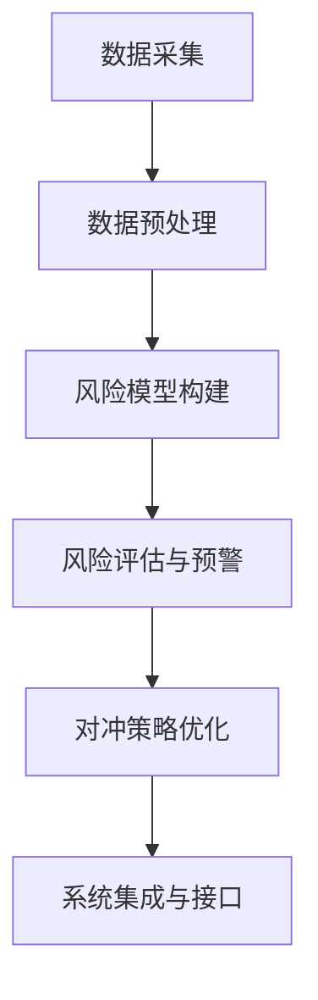
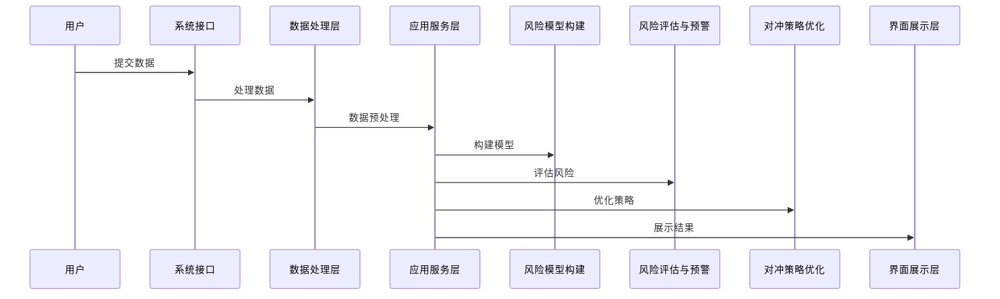
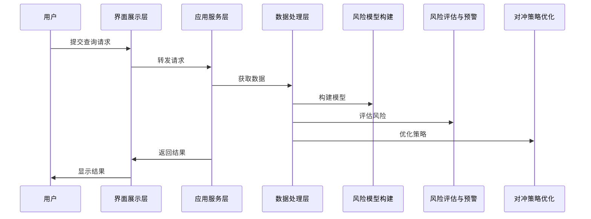

                 

**# 智能外汇风险敞口管理系统**

> 关键词：智能外汇、风险敞口、管理系统、大数据分析、人工智能

> 摘要：随着全球经济一体化的发展，外汇市场的波动性日益加剧，企业面临的外汇风险敞口管理挑战愈发显著。本文将详细介绍一种基于大数据和人工智能技术的智能外汇风险敞口管理系统，通过数据采集、模型构建、风险评估、对冲策略优化等步骤，为企业提供全面的外汇风险管理解决方案。

**Step 1: 背景介绍**

在全球化经济的背景下，外汇市场的波动性已经成为影响企业和金融机构稳健经营的重要因素。尤其是对于跨国企业而言，外汇风险敞口的管理显得尤为重要。外汇风险敞口是指因汇率波动导致的企业财务损失的风险，而风险管理则是指通过识别、评估、监控和应对风险，以减少损失和不确定性。

为了应对这一挑战，越来越多的企业和金融机构开始采用智能化的手段来管理外汇风险敞口。智能外汇风险敞口管理系统通过大数据和人工智能技术，实现了对汇率波动的实时监测和预测，从而为企业提供科学合理的风险控制策略。

系统的边界与外延包括以下几个主要领域：

1. **数据采集与处理**：收集市场数据、企业交易数据等，并进行预处理，为后续的风险管理提供基础数据支持。
2. **风险模型构建**：利用历史数据构建风险预测模型，为风险评估提供算法支持。
3. **风险评估与预警**：实时监测外汇风险敞口，进行风险评估和预警，帮助企业及时应对潜在风险。
4. **对冲策略优化**：根据风险评估结果，制定和优化对冲策略，降低企业面临的外汇风险。
5. **系统集成与接口**：实现与企业现有系统的无缝集成，提供实时数据接口，确保系统的高效运行。

**Step 2: 核心概念与联系**

在智能外汇风险敞口管理系统中，核心概念主要包括外汇风险、风险管理、大数据分析、人工智能等。以下是对这些核心概念的详细解释和对比：

1. **外汇风险**：外汇风险是指由于汇率波动导致的企业财务损失风险。它包括交易风险、汇率波动风险、利率风险等。外汇风险是企业和金融机构面临的主要风险之一，需要通过科学合理的管理方法来降低风险。

2. **风险管理**：风险管理是指通过识别、评估、监控和应对风险，以减少损失和不确定性。在智能外汇风险敞口管理系统中，风险管理是一个核心环节，通过对汇率波动数据的分析，制定相应的风险管理策略，帮助企业降低外汇风险。

3. **大数据分析**：大数据分析是指利用海量数据进行处理和分析，以提取有价值的信息。在智能外汇风险敞口管理系统中，大数据分析是风险预测和评估的基础，通过对历史数据的挖掘和分析，可以更准确地预测未来的汇率走势。

4. **人工智能**：人工智能是指通过模拟人类思维过程的算法和系统，实现自动化决策。在智能外汇风险敞口管理系统中，人工智能技术被广泛应用于风险预测、评估、对冲策略优化等方面，提高了风险管理的效率和准确性。

以下是核心概念属性特征的对比表格：

| 概念         | 描述                                                         | 关系                 |
| ------------ | ------------------------------------------------------------ | -------------------- |
| 外汇风险     | 因汇率波动导致的企业财务损失风险                             | 风险管理的前提和核心 |
| 风险管理     | 通过识别、评估、监控和应对风险，以减少损失和不确定性           | 企业稳健经营的保障   |
| 大数据分析   | 利用海量数据进行处理和分析，以提取有价值的信息                 | 提供决策支持         |
| 人工智能     | 通过模拟人类思维过程的算法和系统，实现自动化决策               | 提高风险管理效率和准确性 |

ER实体关系图架构的 Mermaid 流程图如下：

```mermaid
erDiagram
  企业 ||--|{ 外汇风险 } : "面临"
  企业 ||--|{ 风险管理 } : "实施"
  企业 ||--|{ 大数据分析 } : "应用"
  企业 ||--|{ 人工智能 } : "应用"
```

**Step 3: 算法原理讲解**

智能外汇风险敞口管理系统的核心在于对汇率波动的预测和风险评估。以下是对算法原理的详细讲解：

1. **数据采集**：首先，系统需要从各个渠道收集相关数据，包括市场数据（如汇率波动数据、利率数据等）和企业内部交易数据。这些数据是构建风险模型的基础。

2. **数据预处理**：收集到的数据通常包含噪声和异常值，因此需要进行预处理。预处理步骤包括数据清洗、去噪、归一化等，以确保数据的准确性和一致性。

3. **风险模型构建**：利用预处理后的数据，采用机器学习算法（如回归分析、时间序列分析等）构建风险预测模型。模型的目的是预测未来的汇率走势，为企业提供决策依据。

4. **风险评估与预警**：根据预测模型，系统可以对企业的外汇风险敞口进行实时评估，并生成预警信息。当汇率波动达到一定的阈值时，系统会自动发出预警，提醒企业管理层采取相应的风险控制措施。

5. **对冲策略优化**：系统根据风险评估结果，制定和优化对冲策略。对冲策略包括期货合约、期权等金融工具的使用，目的是降低企业面临的外汇风险。

6. **系统集成与接口**：系统需要与企业现有的财务系统、交易系统等集成，并提供实时的数据接口。这样，企业管理层可以随时查看风险敞口信息，并做出相应的决策。

以下是算法的 mermaid 流程图：



以下是 Python 源代码示例：

```python
# 数据采集
data_collection = collect_data()

# 数据预处理
preprocessed_data = preprocess_data(data_collection)

# 风险模型构建
risk_model = build_risk_model(preprocessed_data)

# 风险评估与预警
risk_assessment = risk_model.evaluate()

# 对冲策略优化
hedge_strategy = optimize_strategy(risk_assessment)

# 系统集成与接口
integrate_system(hedge_strategy)
```

算法原理的数学模型和公式如下：

$$
\text{风险敞口} = \sum_{i=1}^{n} \text{交易额} \times \text{汇率变动}
$$

$$
\text{对冲成本} = \text{风险敞口} \times \text{对冲比例}
$$

**详细讲解和举例说明**

**案例**：某企业预计未来三个月内有100万美元的外汇收入，当前汇率为1美元兑换6.5人民币。预测未来三个月汇率可能上升至1美元兑换7人民币。根据上述数学模型，计算该企业的风险敞口和对冲成本。

**计算过程**：

1. 风险敞口：
$$
\text{风险敞口} = 100万美元 \times (7 - 6.5) = 500,000人民币
$$

2. 对冲成本：
$$
\text{对冲成本} = 500,000人民币 \times 0.1 = 50,000人民币
$$

**Step 4: 系统分析与架构设计方案**

1. **问题场景介绍**：

某跨国企业每年有大量的外汇收入和支出，由于外汇市场的波动性，企业面临巨大的外汇风险敞口。为了降低风险，企业决定开发一个智能外汇风险敞口管理系统，实现实时风险监控、评估和预警。

2. **项目介绍**：

智能外汇风险敞口管理系统项目旨在通过大数据和人工智能技术，为企业提供一套全面的外汇风险管理解决方案。系统包括数据采集、模型构建、风险评估、对冲策略优化等功能，确保企业在外汇市场的稳健经营。

3. **系统功能设计**：

系统功能设计主要包括以下领域：

- **数据采集与处理**：从多个渠道收集市场数据和企业交易数据，并进行预处理，为后续的风险管理提供基础数据支持。
- **风险模型构建**：利用历史数据构建风险预测模型，为风险评估提供算法支持。
- **风险评估与预警**：实时监测外汇风险敞口，进行风险评估和预警，帮助企业及时应对潜在风险。
- **对冲策略优化**：根据风险评估结果，制定和优化对冲策略，降低企业面临的外汇风险。
- **系统集成与接口**：实现与企业现有系统的无缝集成，提供实时数据接口，确保系统的高效运行。

以下是系统功能的 mermaid 类图：

```mermaid
classDiagram
  类1 <|-- 类2
  类1 <|-- 类3
  类1 <|-- 类4
  类1 <|-- 类5
  类2[数据采集与处理]
  类3[风险模型构建]
  类4[风险评估与预警]
  类5[对冲策略优化]
```

4. **系统架构设计**：

系统架构设计主要包括以下方面：

- **数据处理层**：负责数据的采集、存储、处理和分析。
- **应用服务层**：实现系统的核心功能，包括风险模型构建、风险评估、对冲策略优化等。
- **界面展示层**：提供用户交互界面，展示风险敞口信息、预警信息、对冲策略等。

以下是系统的 mermaid 架构图：



5. **系统接口设计和系统交互**：

系统接口设计主要包括以下方面：

- **API 接口**：提供与外部系统（如财务系统、交易系统等）的接口，实现数据的互通。
- **Web 界面**：提供用户操作界面，展示风险敞口信息、预警信息、对冲策略等。

以下是系统接口设计和系统交互的 mermaid 序列图：



**Step 5: 项目实战**

1. **环境安装**：

在开始开发之前，需要安装以下软件和工具：

- Python 3.x 版本
- Jupyter Notebook
- Scikit-learn
- Pandas
- Numpy
- Matplotlib

2. **系统核心实现源代码**：

以下是系统核心实现的 Python 源代码：

```python
# 数据采集
def collect_data():
    # 采集市场数据和企业交易数据
    pass

# 数据预处理
def preprocess_data(data_collection):
    # 数据清洗、去噪、归一化等预处理操作
    pass

# 风险模型构建
def build_risk_model(preprocessed_data):
    # 利用历史数据构建风险预测模型
    pass

# 风险评估与预警
def evaluate_risk(risk_model):
    # 实时评估风险敞口，生成预警信息
    pass

# 对冲策略优化
def optimize_strategy(risk_assessment):
    # 根据风险评估结果，制定和优化对冲策略
    pass

# 系统集成与接口
def integrate_system(hedge_strategy):
    # 实现与企业现有系统的无缝集成，提供实时数据接口
    pass
```

3. **代码应用解读与分析**：

以下是代码应用的解读与分析：

- `collect_data()` 函数用于采集市场数据和企业交易数据。具体实现需要根据企业的实际情况进行。
- `preprocess_data()` 函数用于数据预处理，包括数据清洗、去噪、归一化等操作，以确保数据的准确性和一致性。
- `build_risk_model()` 函数利用历史数据构建风险预测模型。可以选择机器学习算法（如回归分析、时间序列分析等）进行模型构建。
- `evaluate_risk()` 函数用于实时评估风险敞口，生成预警信息。可以根据具体的业务需求，设置预警阈值和预警规则。
- `optimize_strategy()` 函数根据风险评估结果，制定和优化对冲策略。可以选择金融工具（如期货合约、期权等）进行对冲。
- `integrate_system()` 函数实现与企业现有系统的无缝集成，提供实时数据接口。可以通过 API 接口或者数据交换协议实现。

4. **实际案例分析和详细讲解剖析**：

以某跨国企业为例，说明智能外汇风险敞口管理系统的实际应用。

**案例背景**：

某跨国企业预计未来三个月内有1000万美元的外汇收入，当前汇率为1美元兑换6.5人民币。预测未来三个月汇率可能上升至1美元兑换7人民币。企业希望利用智能外汇风险敞口管理系统，降低外汇风险敞口。

**实施步骤**：

1. **数据采集**：系统从市场数据和企业的交易数据中获取相关数据。
2. **数据预处理**：对采集到的数据进行分析和处理，去除噪声和异常值。
3. **风险模型构建**：利用预处理后的数据，构建汇率波动预测模型。
4. **风险评估与预警**：系统实时监测外汇风险敞口，根据预测模型评估风险，并生成预警信息。
5. **对冲策略优化**：根据风险评估结果，制定和优化对冲策略，降低企业面临的外汇风险。
6. **系统集成与接口**：系统与企业现有系统集成，提供实时数据接口，确保系统的有效运行。

**分析结果**：

通过智能外汇风险敞口管理系统，企业可以实时了解外汇风险敞口状况，并根据风险评估结果及时采取对冲策略。例如，当预测未来三个月汇率上升至1美元兑换7.5人民币时，企业可以提前购买期货合约进行对冲，降低汇率上升带来的风险。

**项目小结**：

智能外汇风险敞口管理系统为企业提供了一套全面的外汇风险管理解决方案。通过大数据和人工智能技术，企业可以实时监测和管理外汇风险敞口，降低风险，确保在外汇市场的稳健经营。

**Step 6: 最佳实践 tips**

1. **数据质量**：确保采集到的数据准确、完整和一致，是构建可靠风险模型的基础。对数据进行严格的清洗和处理，去除噪声和异常值，提高数据的可靠性。
2. **模型优化**：定期对风险模型进行优化和调整，以适应市场环境的变化。利用机器学习算法的强大能力，不断提高风险预测的准确性和效率。
3. **风险分散**：在制定对冲策略时，采取多元化的风险分散策略，降低单一市场或单一金融工具的风险。
4. **实时监控**：系统需要具备实时监控功能，及时发现潜在风险，并生成预警信息。确保企业管理层能够迅速应对市场变化。
5. **系统集成**：实现与企业现有系统的无缝集成，确保数据的实时性和准确性。提供灵活的接口设计，方便后续的扩展和升级。

**小结**

智能外汇风险敞口管理系统是现代企业和金融机构不可或缺的风险管理工具。通过大数据和人工智能技术，系统实现了对汇率波动的实时监测和预测，为企业提供科学合理的外汇风险管理策略。未来，随着技术的不断进步，智能外汇风险敞口管理系统将更加智能化、自动化，为企业带来更高的风险控制能力和经营效益。

**注意事项**

1. **数据隐私**：在采集和处理数据时，确保遵守数据隐私法规，保护企业数据和客户隐私。
2. **系统稳定性**：确保系统的高可用性和稳定性，避免因系统故障导致数据丢失或服务中断。
3. **安全防护**：加强对系统的安全防护，防止黑客攻击和数据泄露。

**拓展阅读**

1. 《大数据时代：生活、工作与思维的大变革》
2. 《机器学习实战》
3. 《人工智能：一种现代的方法》
4. 《外汇风险管理：理论与实践》

**作者信息**

作者：AI天才研究院/AI Genius Institute & 禅与计算机程序设计艺术 /Zen And The Art of Computer Programming**

