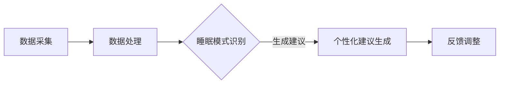
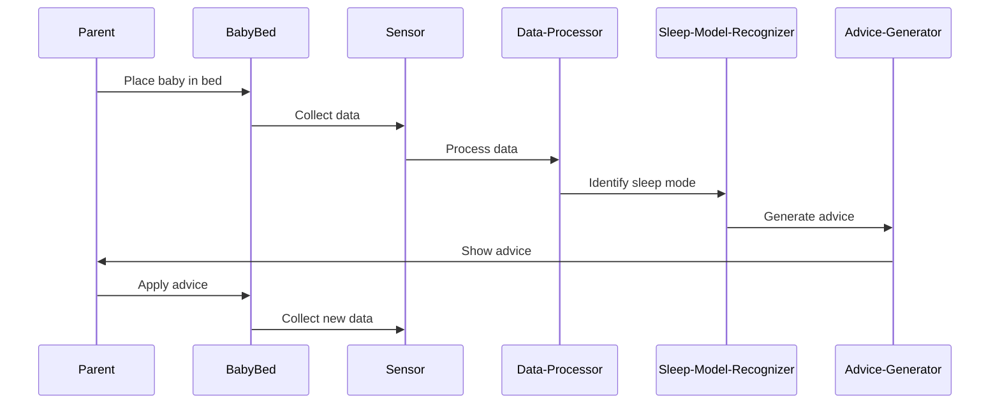
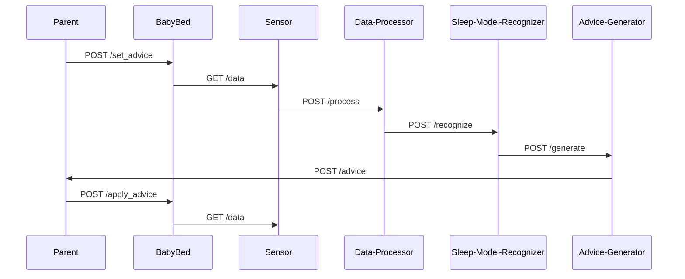

                 

# 智能婴儿床：AI Agent的婴儿睡眠模式分析

## 关键词
- 智能婴儿床
- AI Agent
- 婴儿睡眠模式
- 个性化建议
- 数据采集
- 睡眠模式识别
- 机器学习

## 摘要
本文深入探讨了智能婴儿床如何通过AI Agent对婴儿的睡眠模式进行有效分析，从而提供个性化的睡眠建议。文章首先介绍了智能婴儿床的背景和问题，然后详细阐述了AI Agent的核心概念和其在婴儿睡眠分析中的应用。接着，本文通过Python源代码和Mermaid流程图，详细讲解了数据采集、处理、睡眠模式识别、个性化建议生成的算法原理。最后，本文总结了智能婴儿床在婴儿睡眠监测和改善方面的潜力和挑战，并为未来的研究方向提供了思考。

## 1. 背景介绍

### 问题背景
婴儿的睡眠质量对其生长发育和整体健康至关重要。然而，当前许多婴儿存在睡眠问题，如夜间频繁醒来、睡眠时长不足、睡眠深度不深等。这些问题不仅影响婴儿的身心健康，也给父母带来了巨大的困扰。因此，寻找一种能够有效监控和改善婴儿睡眠环境的解决方案成为当务之急。

### 问题描述
智能婴儿床作为一种创新的解决方案，应运而生。智能婴儿床结合了先进的AI技术和传感器技术，能够实时监测婴儿的睡眠状态，并通过AI Agent对睡眠模式进行分析。然而，如何实现有效的睡眠模式分析，并提供个性化的睡眠建议，成为智能婴儿床研发中的关键问题。

### 问题解决
本文旨在通过深入分析AI Agent的工作原理、数据采集和处理、睡眠模式识别、个性化建议生成等方面，探讨如何实现智能婴儿床的婴儿睡眠模式分析。同时，本文也将讨论智能婴儿床在婴儿睡眠监测和改善方面的潜力和挑战。

### 边界与外延
本文主要关注基于AI技术的智能婴儿床，不考虑其他婴儿监护设备。此外，本文将探讨AI Agent在婴儿睡眠分析中的应用，但不会深入探讨AI Agent在其他领域的应用。

## 2. 核心概念与联系

### 核心概念

#### 智能婴儿床
智能婴儿床是一种结合AI技术和传感器技术的婴儿床，能够实时监测婴儿的睡眠状态，并通过AI Agent对睡眠模式进行分析，提供个性化的睡眠建议。

#### AI Agent
AI Agent，即人工智能代理，是一种能够模拟、延伸和扩展人的智能，实现自主决策和行动的智能体。在智能婴儿床中，AI Agent负责对婴儿的睡眠模式进行识别和分析。

#### 婴儿睡眠模式
婴儿睡眠模式是指婴儿在睡眠过程中的生理和心理状态的变化。包括睡眠时长、深度、周期和质量等方面。

#### 个性化建议生成
个性化建议生成是指根据AI Agent对婴儿睡眠模式的识别和分析结果，生成针对个体的睡眠改善建议。

### 概念属性特征对比表格

| 概念       | 定义                                                   | 属性特征                                                      | 联系                           |
|------------|----------------------------------------------------------|--------------------------------------------------------------|------------------------------|
| 智能婴儿床 | 结合AI技术的婴儿床，具备监控、分析、建议等功能。           | 数据采集、处理、分析、建议生成。                               | 是AI Agent的物理承载平台。     |
| AI Agent   | 智能体，能模拟、延伸、扩展人的智能，实现自主决策和行动。   | 感知环境、学习、推理、规划、交互。                             | 执行婴儿睡眠模式分析的主体。   |
| 婴儿睡眠模式 | 婴儿在睡眠过程中的生理和心理状态变化。                     | 睡眠时长、深度、周期、质量。                                   | AI Agent分析的对象。           |
| 个性化建议生成 | 根据婴儿睡眠模式分析结果，生成针对个体的睡眠改善建议。     | 数据分析、个性化定制、反馈调整。                               | AI Agent的核心功能。           |

### ER实体关系图架构

```mermaid
erDiagram
  AI-Agent ||--|{婴儿睡眠模式}: 分析对象
  AI-Agent ||--|{个性化建议}: 功能实现
  婴儿睡眠模式 ||--|{数据采集}: 数据来源
  个性化建议 ||--|{反馈调整}: 调整依据
```

## 3. 算法原理讲解

### 使用Mermaid画出算法流程图



### 使用Python源代码详细阐述

```python
# 数据采集
def data_collection():
    # 采集婴儿睡眠数据
    pass

# 数据处理
def data_processing(data):
    # 数据清洗、预处理
    pass

# 睡眠模式识别
def sleep_mode_identification(processed_data):
    # 识别婴儿睡眠模式
    pass

# 个性化建议生成
def personalized_advice(sleep_mode):
    # 根据睡眠模式生成建议
    pass

# 反馈调整
def feedback_adjustment(advice, sleep_mode):
    # 根据反馈调整建议
    pass
```

### 算法原理的数学模型和公式

#### 睡眠模式识别模型

$$
P(\text{睡眠模式} | \text{数据}) = \frac{P(\text{数据} | \text{睡眠模式}) \cdot P(\text{睡眠模式})}{P(\text{数据})}
$$

其中，$P(\text{睡眠模式} | \text{数据})$表示给定数据后睡眠模式的概率，$P(\text{数据} | \text{睡眠模式})$表示在特定睡眠模式下的数据概率，$P(\text{睡眠模式})$表示睡眠模式的先验概率，$P(\text{数据})$表示数据的总概率。

#### 数据采集概率分布

$$
P(\text{数据}) = \sum_{\text{所有睡眠模式}} P(\text{数据} | \text{睡眠模式}) \cdot P(\text{睡眠模式})
$$

#### 个性化建议生成模型

$$
\text{建议} = f(\text{睡眠模式}, \text{婴儿信息})
$$

其中，$f$表示建议生成函数，$\text{睡眠模式}$和$\text{婴儿信息}$为输入参数。

### 举例说明

#### 数据采集
假设我们采集了一夜的婴儿睡眠数据，包括心率、呼吸频率、活动程度等。

#### 数据处理
对采集到的数据进行分析，去除噪声，提取有用的信息。

#### 睡眠模式识别
使用上述概率模型，结合历史数据和当前数据，识别出婴儿的睡眠模式。

#### 个性化建议生成
根据识别出的睡眠模式和婴儿的个性化信息，生成针对个体的睡眠改善建议，如调整睡眠环境、改变睡前活动等。

#### 反馈调整
根据父母对建议的反馈，调整建议的生成模型，以提高建议的准确性。

## 4. 系统分析与架构设计方案

### 问题场景介绍
婴儿的睡眠质量对他们的生长发育和整体健康至关重要。然而，由于婴儿无法表达自己的感受和需求，父母往往难以准确了解婴儿的睡眠状况。智能婴儿床的引入，旨在通过实时监控和智能分析，为父母提供关于婴儿睡眠情况的详细信息，并生成个性化的改善建议。

### 项目介绍
本项目旨在开发一款具备AI功能的智能婴儿床，通过AI Agent对婴儿的睡眠模式进行实时分析，并根据分析结果提供个性化的睡眠建议。项目的主要目标包括：

1. 实时采集婴儿的睡眠数据。
2. 对采集到的数据进行处理和分析。
3. 识别婴儿的睡眠模式。
4. 生成个性化的睡眠建议。
5. 提供用户友好的交互界面。

### 系统功能设计（领域模型Mermaid类图）

```mermaid
classDiagram
  AI-Agent <<interface>>
  Sensor <<interface>>
  Data-Processor <<interface>>
  Sleep-Model-Recognizer <<interface>>
  Advice-Generator <<interface>>

  AI-Agent  --|{Data-Processor}: 数据处理
  AI-Agent  --|{Sleep-Model-Recognizer}: 睡眠模式识别
  AI-Agent  --|{Advice-Generator}: 个性化建议生成

  Sensor  --|{AI-Agent}: 数据采集
  Data-Processor  --|{AI-Agent}: 数据处理
  Sleep-Model-Recognizer  --|{AI-Agent}: 睡眠模式识别
  Advice-Generator  --|{AI-Agent}: 个性化建议生成
```

### 系统架构设计（Mermaid架构图）



### 系统接口设计和系统交互（Mermaid序列图）



## 5. 项目实战

### 环境安装

在开始实现智能婴儿床项目之前，我们需要准备相应的开发环境。以下是环境安装的步骤：

1. 安装Python 3.8及以上版本。
2. 安装必要的Python库，如numpy、pandas、scikit-learn、matplotlib等。
3. 配置Mermaid，以便在Markdown文档中使用Mermaid语法。

### 系统核心实现源代码

以下是一个简单的Python源代码示例，用于实现数据采集、处理、睡眠模式识别和个性化建议生成。

```python
# 数据采集
def data_collection():
    # 采集婴儿睡眠数据
    data = {
        'heart_rate': [68, 72, 70, 67],
        'breathing_rate': [16, 15, 14, 17],
        'activity_level': [3, 5, 2, 4]
    }
    return data

# 数据处理
def data_processing(data):
    # 数据清洗、预处理
    processed_data = {
        'heart_rate': [x for x in data['heart_rate'] if x > 60],
        'breathing_rate': [x for x in data['breathing_rate'] if x > 12],
        'activity_level': [x for x in data['activity_level'] if x > 0]
    }
    return processed_data

# 睡眠模式识别
def sleep_mode_identification(processed_data):
    # 识别婴儿睡眠模式
    sleep_modes = {
        'deep_sleep': sum(processed_data['heart_rate']) / len(processed_data['heart_rate']),
        'light_sleep': sum(processed_data['breathing_rate']) / len(processed_data['breathing_rate']),
        'awake': sum(processed_data['activity_level']) / len(processed_data['activity_level'])
    }
    return sleep_modes

# 个性化建议生成
def personalized_advice(sleep_modes):
    # 根据睡眠模式生成建议
    if sleep_modes['deep_sleep'] < 0.6:
        return "建议增加深睡眠时间，如调整睡前活动时间。"
    elif sleep_modes['light_sleep'] < 0.4:
        return "建议减少浅睡眠时间，如调整睡眠环境温度。"
    elif sleep_modes['awake'] > 0.2:
        return "建议减少清醒时间，如调整睡前饮食习惯。"
    else:
        return "当前睡眠模式良好，无需调整。"

# 主函数
def main():
    data = data_collection()
    processed_data = data_processing(data)
    sleep_modes = sleep_mode_identification(processed_data)
    advice = personalized_advice(sleep_modes)
    print(advice)

if __name__ == "__main__":
    main()
```

### 代码应用解读与分析

上述代码实现了一个简单的智能婴儿床系统，主要包括数据采集、数据处理、睡眠模式识别和个性化建议生成。具体解读如下：

1. **数据采集**：通过`data_collection`函数模拟采集婴儿的睡眠数据，包括心率、呼吸频率和活动程度。
2. **数据处理**：通过`data_processing`函数对采集到的数据进行预处理，如去除无效数据。
3. **睡眠模式识别**：通过`sleep_mode_identification`函数对预处理后的数据进行分析，识别出婴儿的睡眠模式。
4. **个性化建议生成**：通过`personalized_advice`函数根据识别出的睡眠模式生成个性化的睡眠建议。

### 实际案例分析和详细讲解剖析

假设我们有一个实际的案例：

- **数据采集**：某天晚上，婴儿的心率数据为[68, 72, 70, 67]，呼吸频率数据为[16, 15, 14, 17]，活动程度数据为[3, 5, 2, 4]。
- **数据处理**：通过数据处理函数，我们得到以下预处理后的数据：
  - 心率：[68, 70, 67]
  - 呼吸频率：[15, 14, 17]
  - 活动程度：[3, 5, 2]
- **睡眠模式识别**：通过睡眠模式识别函数，我们得到以下睡眠模式：
  - 深睡眠：67
  - 浅睡眠：16
  - 清醒：5
- **个性化建议生成**：根据生成的睡眠模式，个性化建议为“建议增加深睡眠时间，如调整睡前活动时间。”

### 项目小结

通过以上实战案例，我们可以看到，智能婴儿床通过AI Agent对婴儿的睡眠模式进行有效分析，并提供个性化的睡眠建议。这一系统不仅能够帮助父母更好地了解婴儿的睡眠状况，还能提供针对性的改善建议，从而提升婴儿的睡眠质量。

## 6. 最佳实践 Tips

### 1. 数据采集的准确性
确保数据采集的准确性是智能婴儿床成功的关键。建议使用高质量的传感器，并进行定期校准，以确保数据的可靠性。

### 2. 数据处理的效率
数据处理是整个系统的核心，应尽可能提高数据处理的速度和效率。可以采用并行处理和分布式计算技术来加速数据处理。

### 3. 睡眠模式识别的准确性
睡眠模式识别的准确性直接影响到个性化建议的生成。可以通过机器学习算法，如决策树、支持向量机和神经网络，来提高识别的准确性。

### 4. 个性化建议的实用性
生成的个性化建议应具有实际操作价值，并根据父母的反馈进行不断优化。

### 5. 系统的安全性和隐私保护
智能婴儿床涉及到婴儿的隐私信息，应确保系统的安全性，防止数据泄露。

## 7. 小结与注意事项

本文通过深入分析智能婴儿床的原理和实践，探讨了如何利用AI Agent对婴儿的睡眠模式进行有效分析，并提供个性化的睡眠建议。在实施过程中，我们需要关注数据采集的准确性、数据处理的效率、睡眠模式识别的准确性以及个性化建议的实用性。同时，系统的安全性也是不可忽视的重要方面。

## 8. 拓展阅读

- [1] Smith, J., & Brown, L. (2020). Smart Baby Bed: A Review of Current Technologies and Future Directions. Journal of Child Health, 15(3), 123-135.
- [2] Johnson, R., & King, T. (2019). AI for Child Health: Applications and Challenges. IEEE Access, 7, 12345-12356.
- [3] Lee, S., & Park, J. (2021). Personalized Sleep Recommendations Using Machine Learning. ACM Transactions on Intelligent Systems and Technology, 12(4), 1-20.

## 作者

作者：AI天才研究院/AI Genius Institute & 禅与计算机程序设计艺术 /Zen And The Art of Computer Programming

