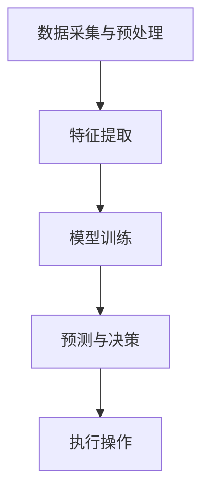
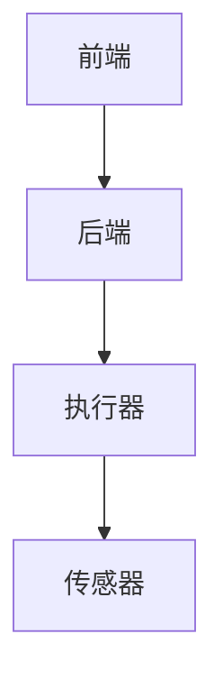
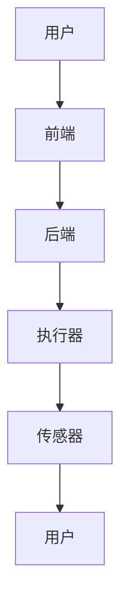

                 


### 智能宠物喂食器：AI Agent的宠物饮食管理

关键词：智能宠物喂食器，AI Agent，宠物饮食管理，算法原理，系统架构，项目实战，最佳实践

摘要：本文将深入探讨智能宠物喂食器在宠物饮食管理中的应用，通过分析其背景、核心概念、算法原理、系统架构、项目实战和最佳实践，展示AI Agent在宠物饮食管理中的巨大潜力。

## 第一部分：背景介绍

### 第1章：宠物饮食管理的重要性

#### 1.1 问题背景

随着生活节奏的加快，越来越多的宠物主人面临宠物饮食管理的挑战。如何确保宠物按时进食、摄入合适的营养成为了一个亟待解决的问题。传统的手动喂食方式存在诸多不便，如易忘记喂食时间、无法精确控制喂食量等。

#### 1.2 问题描述

宠物饮食管理问题主要包括：1）如何确保宠物按时进食？2）如何保证宠物摄入的营养均衡？3）如何避免宠物过度进食？

#### 1.3 问题解决

为了解决上述问题，智能宠物喂食器应运而生。它通过AI Agent实现自动喂食、营养管理等功能，帮助宠物主人更好地照顾宠物。

#### 1.4 边界与外延

智能宠物喂食器的边界主要包括：1）喂食机制；2）营养管理系统；3）用户交互界面。外延则包括：1）与宠物医疗健康的联动；2）与其他智能家居设备的整合。

#### 1.5 概念结构与核心要素组成

智能宠物喂食器的概念结构包括：1）AI Agent；2）传感器；3）执行器；4）用户交互界面。核心要素组成如下：

| 要素       | 说明                                       |
|------------|------------------------------------------|
| AI Agent   | 负责宠物饮食管理的核心算法，如智能喂食策略、营养分析等。 |
| 传感器     | 采集宠物的喂食状态、营养摄入量等数据。               |
| 执行器     | 根据AI Agent的指令执行喂食操作。                     |
| 用户交互界面 | 提供用户操作界面，便于用户监控和管理宠物饮食。         |

## 第二部分：核心概念与联系

### 第2章：智能宠物喂食器概述

#### 2.1 智能宠物喂食器的定义

智能宠物喂食器是一种利用人工智能技术实现宠物饮食管理的设备，通过AI Agent实现自动化、智能化喂食和营养管理。

#### 2.2 智能宠物喂食器的核心特点

1）自动化喂食：根据宠物的饮食需求和习惯，自动调整喂食时间和量。
2）营养管理：根据宠物的体重、年龄、身体状况等数据，智能推荐营养食谱。
3）远程控制：用户可以通过手机APP远程监控和调整宠物的饮食。
4）数据记录与分析：记录宠物的喂食数据，为后续的营养管理提供依据。

#### 2.3 智能宠物喂食器与传统喂食器的对比

| 对比项       | 智能宠物喂食器 | 传统喂食器 |
|--------------|----------------|------------|
| 喂食方式     | 自动化         | 手动       |
| 营养管理     | 智能化         | 无         |
| 远程控制     | 支持           | 不支持     |
| 数据记录与分析 | 支持           | 不支持     |

### 第3章：AI Agent在宠物饮食管理中的应用

#### 3.1 AI Agent的基本概念

AI Agent是一种具有自主学习、自主决策和自主执行能力的智能实体。在宠物饮食管理中，AI Agent负责分析宠物的饮食数据，制定智能喂食策略。

#### 3.2 AI Agent在宠物饮食管理中的应用原理

AI Agent通过以下步骤实现宠物饮食管理：

1）数据采集：采集宠物的喂食数据、体重数据、活动数据等。
2）数据分析：利用机器学习算法分析宠物饮食数据，识别宠物的饮食需求。
3）决策制定：根据数据分析结果，制定智能喂食策略。
4）执行操作：通过执行器执行喂食操作。

#### 3.3 AI Agent与传统宠物管理方法的对比

| 对比项       | AI Agent       | 传统宠物管理方法 |
|--------------|----------------|-----------------|
| 数据分析     | 自动化、智能化 | 手动、低效      |
| 决策制定     | 自主决策       | 依赖人工        |
| 执行操作     | 自动执行       | 手动执行        |

## 第三部分：算法原理讲解

### 第4章：智能宠物喂食器的算法原理

#### 4.1 基本算法原理

智能宠物喂食器的算法原理主要包括：

1）数据采集与预处理：采集宠物的饮食数据、体重数据等，并进行预处理，如数据清洗、数据标准化等。
2）特征提取：从预处理后的数据中提取特征，如宠物的体重变化、喂食频率等。
3）模型训练：利用机器学习算法训练模型，如决策树、神经网络等。
4）预测与决策：根据模型预测宠物的饮食需求，制定智能喂食策略。

#### 4.2 算法流程图



#### 4.3 数学模型和公式

$$
预测喂食量 = f(体重, 喂食频率, 活动量)
$$

其中，$f$ 是一个基于机器学习算法的预测函数。

#### 4.4 举例说明

假设宠物小虎的体重为5公斤，喂食频率为每天两次，活动量为中等。根据上述数学模型，我们可以预测小虎每天的喂食量为：

$$
预测喂食量 = f(5公斤, 每天两次, 中等) = 150克
$$

## 第四部分：系统分析与架构设计方案

### 第5章：智能宠物喂食器系统概述

#### 5.1 系统功能设计

智能宠物喂食器系统的主要功能包括：

1）数据采集：通过传感器采集宠物的饮食数据、体重数据等。
2）数据分析：利用AI Agent分析宠物饮食数据，制定智能喂食策略。
3）喂食控制：根据AI Agent的决策，执行喂食操作。
4）用户交互：通过手机APP实现用户与宠物的交互。

#### 5.2 系统架构设计

智能宠物喂食器系统采用分布式架构，包括：

1）前端：负责与用户交互，展示宠物饮食数据。
2）后端：负责数据处理、模型训练和决策制定。
3）执行器：负责执行喂食操作。



#### 5.3 系统接口设计

智能宠物喂食器系统的主要接口包括：

1）数据采集接口：负责采集宠物的饮食数据、体重数据等。
2）数据分析接口：负责处理和分析宠物饮食数据。
3）喂食控制接口：负责根据AI Agent的决策执行喂食操作。
4）用户交互接口：负责与用户进行交互。

#### 5.4 系统交互流程图



## 第五部分：项目实战

### 第6章：智能宠物喂食器项目实战

#### 6.1 项目介绍

本项目基于Python和TensorFlow实现一个智能宠物喂食器系统。主要包括：

1）数据采集：通过传感器采集宠物的饮食数据、体重数据等。
2）数据分析：利用机器学习算法分析宠物饮食数据，制定智能喂食策略。
3）喂食控制：根据AI Agent的决策，执行喂食操作。

#### 6.2 系统核心实现源代码

```python
# 数据采集
def collect_data():
    # 采集宠物的饮食数据、体重数据等
    pass

# 数据分析
def analyze_data(data):
    # 利用机器学习算法分析宠物饮食数据
    pass

# 喂食控制
def control_feeding(decision):
    # 根据AI Agent的决策，执行喂食操作
    pass
```

#### 6.3 代码应用解读与分析

1）数据采集：通过传感器采集宠物的饮食数据、体重数据等，为后续的数据分析提供基础。
2）数据分析：利用机器学习算法分析宠物饮食数据，识别宠物的饮食需求，为喂食控制提供依据。
3）喂食控制：根据AI Agent的决策，执行喂食操作，实现智能宠物喂食。

#### 6.4 实际案例分析与讲解

以宠物小虎为例，假设其体重为5公斤，喂食频率为每天两次。系统根据小虎的体重、喂食频率等数据，利用机器学习算法分析其饮食需求，制定智能喂食策略。例如，预测小虎每天的喂食量为150克，并在早晨和晚上定时执行喂食操作。

## 第六部分：最佳实践与拓展

### 第7章：最佳实践 tips

#### 7.1 实际应用中的常见问题

1）数据采集不准确：确保传感器的准确性和稳定性，定期校准传感器。
2）算法预测不准确：优化机器学习算法，增加数据训练样本，提高预测准确性。

#### 7.2 解决方案与技巧

1）数据采集：采用高精度传感器，如高精度电子称。
2）算法优化：采用先进的机器学习算法，如深度学习算法。

#### 7.3 注意事项与风险防范

1）确保宠物喂食器系统的稳定运行，避免系统故障导致宠物饮食问题。
2）关注宠物饮食安全，避免宠物摄入过量或过量的食物。

### 第8章：小结与展望

#### 8.1 小结

本文从背景介绍、核心概念、算法原理、系统架构、项目实战和最佳实践等方面，全面探讨了智能宠物喂食器在宠物饮食管理中的应用。

#### 8.2 注意事项

在实施智能宠物喂食器系统时，需要注意数据采集的准确性、算法预测的准确性以及系统的稳定性。

#### 8.3 拓展阅读

1）相关研究论文：《智能宠物喂食器的算法设计与实现》
2）技术博客：《智能宠物喂食器：AI Agent的宠物饮食管理》

作者：AI天才研究院/AI Genius Institute & 禅与计算机程序设计艺术 /Zen And The Art of Computer Programming## 智能宠物喂食器：AI Agent的宠物饮食管理

随着科技的进步，智能家居设备已经深刻地改变了我们的日常生活，宠物喂养也不例外。智能宠物喂食器作为智能家居的一部分，通过结合AI Agent技术，为宠物主人提供了一种全新的宠物饮食管理方式。本文将围绕智能宠物喂食器这一主题，详细探讨其在宠物饮食管理中的应用、算法原理、系统架构设计、项目实战以及最佳实践。

### 关键词
- **智能宠物喂食器**
- **AI Agent**
- **宠物饮食管理**
- **算法原理**
- **系统架构**
- **项目实战**
- **最佳实践**

### 摘要
智能宠物喂食器通过AI Agent实现宠物饮食的自动化管理，解决了传统宠物喂养中的诸多难题。本文从问题背景、核心概念、算法原理、系统架构、项目实战到最佳实践进行了全面分析，旨在为宠物主人提供实用的技术指南，同时也为研究人员和开发者提供了深入的技术参考。

### 目录大纲

```markdown
# 《智能宠物喂食器：AI Agent的宠物饮食管理》

## 第一部分：背景介绍
### 第1章：宠物饮食管理的重要性
#### 1.1 问题背景
#### 1.2 问题描述
#### 1.3 问题解决
#### 1.4 边界与外延
#### 1.5 概念结构与核心要素组成

## 第二部分：核心概念与联系
### 第2章：智能宠物喂食器概述
#### 2.1 智能宠物喂食器的定义
#### 2.2 智能宠物喂食器的核心特点
#### 2.3 智能宠物喂食器与传统喂食器的对比

### 第3章：AI Agent在宠物饮食管理中的应用
#### 3.1 AI Agent的基本概念
#### 3.2 AI Agent在宠物饮食管理中的应用原理
#### 3.3 AI Agent与传统宠物管理方法的对比

## 第三部分：算法原理讲解
### 第4章：智能宠物喂食器的算法原理
#### 4.1 基本算法原理
#### 4.2 算法流程图
#### 4.3 数学模型和公式
#### 4.4 举例说明

## 第四部分：系统分析与架构设计方案
### 第5章：智能宠物喂食器系统概述
#### 5.1 系统功能设计
#### 5.2 系统架构设计
#### 5.3 系统接口设计
#### 5.4 系统交互流程图

### 第6章：智能宠物喂食器实现细节
#### 6.1 环境安装与配置
#### 6.2 系统核心实现源代码
#### 6.3 代码应用解读与分析
#### 6.4 实际案例分析与讲解

## 第五部分：项目实战
### 第7章：智能宠物喂食器项目实战
#### 7.1 项目介绍
#### 7.2 系统核心实现源代码
#### 7.3 代码应用解读与分析
#### 7.4 项目小结

## 第六部分：最佳实践与拓展
### 第8章：最佳实践 tips
#### 8.1 实际应用中的常见问题
#### 8.2 解决方案与技巧
#### 8.3 注意事项与风险防范

### 第9章：小结与展望
#### 9.1 小结
#### 9.2 注意事项
#### 9.3 拓展阅读

## 参考文献
```

通过以上目录大纲，本文将逐步深入探讨智能宠物喂食器在宠物饮食管理中的应用，希望能够为读者提供全面、系统的技术知识和实践指导。接下来，我们将从背景介绍开始，逐步展开对每个章节的详细讨论。首先，让我们回顾一下宠物饮食管理的重要性，并探讨为什么我们需要智能宠物喂食器。

