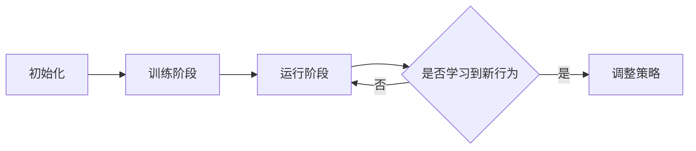
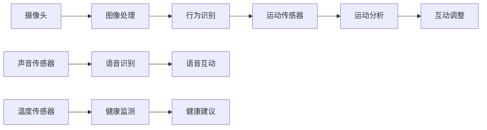

                 

### 2.2 AI Agent在宠物玩具中的功能

智能宠物玩具中的AI Agent扮演着核心的角色，其主要功能包括但不限于以下几个方面：

#### 2.2.1 行为识别与互动

AI Agent能够通过内置的传感器（如摄像头、麦克风）实时捕捉宠物的行为和表情，然后根据这些数据进行分析，识别宠物的情绪和需求。例如，当宠物表现出兴奋或疲惫时，AI Agent可以调整玩具的互动模式，以适应宠物的当前状态。

**核心概念与联系**：

- **行为识别**：这是一个涉及图像处理和模式识别的技术问题，通常使用卷积神经网络（CNN）来实现。
- **互动性**：通过自然语言处理（NLP）技术，AI Agent可以生成与宠物的互动回应，如语音提示或动作指导。

**对比表格**：

| 特性         | 行为识别 | 互动性           |
| ------------ | -------- | --------------- |
| 技术基础     | 图像处理、模式识别 | 自然语言处理（NLP） |
| 应用场景     | 情绪识别、行为分析 | 语音互动、动作指导 |
| 主要挑战     | 实时性、准确性     | 语言理解、响应多样性 |

**ER实体关系图架构**：

```mermaid
erDiagram
    Animal --> AI_Agent : has_behavior
    AI_Agent --> Interaction : performs
```

- **Animal（动物）**：实体，代表宠物。
- **AI_Agent（AI代理）**：实体，负责识别行为和互动。
- **Interaction（互动）**：实体，代表AI代理与宠物之间的互动行为。

#### 2.2.2 学习与适应

AI Agent可以不断学习宠物的行为模式，并据此调整其行为。例如，如果宠物喜欢某种特定类型的玩具或游戏，AI Agent可以记住这些偏好，并在未来提供更多相似的内容。

**算法原理讲解**：

学习与适应功能通常基于机器学习中的监督学习和强化学习技术。

- **监督学习**：AI Agent在训练阶段通过分析大量宠物行为数据，学习如何识别和响应不同行为。
- **强化学习**：AI Agent在运行阶段通过与宠物的互动，不断调整其行为策略，以提高互动效果。

**流程图**：



**数学模型**：

- **监督学习**：输出函数 $f(x) = w \cdot x + b$，其中 $w$ 是权重，$x$ 是输入特征，$b$ 是偏置。
- **强化学习**：价值函数 $V(s) = \sum_{s'} P(s' | s) \cdot Q(s, a)$，其中 $s$ 是状态，$a$ 是动作，$Q(s, a)$ 是状态-动作值函数。

**举例说明**：

假设宠物喜欢追逐移动的玩具。AI Agent可以通过监督学习识别宠物的这种行为，然后通过强化学习，不断调整玩具的运动轨迹，以更好地吸引宠物的注意力。

#### 2.2.3 数据收集与分析

AI Agent不仅可以与宠物互动，还能收集宠物的行为数据，并进行分析，为宠物主人提供有用的信息。例如，宠物每天的活跃时间、饮食习惯等。

**算法原理讲解**：

数据收集与分析功能依赖于数据挖掘和统计分析技术。

- **数据收集**：AI Agent使用传感器实时收集数据。
- **数据分析**：使用统计学方法对数据进行分析，提取有用的信息。

**流程图**：


**数学模型**：

- **数据预处理**：使用特征工程方法，将原始数据转换为适合分析的形式。
- **数据分析**：使用回归分析、聚类分析等方法，提取数据中的有用信息。

**举例说明**：

通过分析宠物的行为数据，AI Agent可以生成宠物健康报告，帮助主人了解宠物的健康状况，并提供相应的建议。

### 2.3 本章小结

AI Agent在智能宠物玩具中具有多种功能，包括行为识别与互动、学习与适应、数据收集与分析。这些功能不仅提高了宠物的娱乐和学习体验，也为宠物主人提供了更多的信息和支持。通过本章的介绍，我们可以看到AI Agent在智能宠物玩具中的广泛应用和巨大潜力。

----------------------------------------------------------------

# 第3章：智能宠物玩具的设计原则

## 3.1 用户需求分析

在设计智能宠物玩具时，了解用户需求是至关重要的。用户需求主要包括宠物主人和宠物的需求。以下是对这些需求的分析：

### 3.1.1 宠物主人的需求

1. **安全性**：宠物玩具的安全性是宠物主人的首要关注点。玩具的材料应该无毒无害，设计应避免锐角和可拆卸部分，以防止宠物受伤。

2. **智能化与互动性**：宠物主人希望智能宠物玩具能够与宠物进行互动，提供丰富的娱乐和学习体验。例如，玩具能够识别宠物的行为并做出相应的反应，如语音提示、动作指导等。

3. **方便性**：宠物主人希望玩具易于操作和维护。例如，可以远程控制、充电方便、易于清洁等。

4. **健康监测**：宠物主人希望玩具能够收集宠物的行为数据，并提供健康监测功能，如活跃度、饮食、睡眠等。

### 3.1.2 宠物的需求

1. **趣味性**：宠物需要玩具提供有趣的互动体验，以保持其兴趣和活力。

2. **适应性**：玩具应能够适应不同类型宠物的需求，如猫、狗、鸟等。

3. **智能学习**：宠物希望玩具能够不断学习其行为模式，并提供个性化的互动体验。

4. **健康有益**：玩具应有助于宠物的健康，如锻炼身体、提高智力等。

### 3.1.3 用户需求综合分析

通过对宠物主人和宠物的需求分析，我们可以得出以下结论：

1. **综合性**：智能宠物玩具需要同时满足宠物主人和宠物的需求，提供安全、智能、互动、方便、健康等多种功能。

2. **个性化**：为了提高用户体验，智能宠物玩具应能够根据宠物的个性特点进行定制，提供个性化的互动和学习体验。

3. **持续改进**：智能宠物玩具的设计应考虑长期的迭代和升级，以适应用户需求的变化和新技术的应用。

## 3.2 设计原则与策略

基于用户需求分析，智能宠物玩具的设计应遵循以下原则和策略：

### 3.2.1 功能优先

智能宠物玩具的核心功能应该是识别宠物行为、提供互动体验、收集和分析数据等。这些功能应被优先设计和实现，以确保用户需求得到满足。

### 3.2.2 易于使用

玩具的设计应简洁直观，方便宠物主人和宠物使用。例如，可以通过触摸屏、语音控制等方式进行操作，降低使用门槛。

### 3.2.3 安全可靠

玩具的材料和设计应确保安全性，避免宠物在使用过程中受伤。同时，软件应具备故障处理能力，确保玩具的稳定运行。

### 3.2.4 智能化与个性化

AI Agent应具备智能学习和自适应能力，根据宠物的行为和需求进行个性化调整。例如，通过大数据分析和机器学习技术，不断优化玩具的功能和互动方式。

### 3.2.5 可持续发展

设计应考虑玩具的可持续性，如使用环保材料、节能设计等。同时，应提供远程升级和更新功能，以适应新技术的发展。

### 3.2.6 用户体验优化

通过用户调研和反馈，不断优化用户体验。例如，可以通过用户测试、反馈机制等方式，发现和解决用户在使用过程中遇到的问题。

## 3.3 智能化与互动性

智能化和互动性是智能宠物玩具的重要特点。以下是一些具体的设计策略：

### 3.3.1 智能化设计

- **多传感器集成**：结合摄像头、麦克风、运动传感器等，实现全方位的环境感知。
- **机器学习算法**：利用机器学习技术，对宠物行为进行识别和分析，实现智能化互动。
- **大数据分析**：通过收集和分析宠物行为数据，为玩具的智能化提供支持。

### 3.3.2 互动性设计

- **语音交互**：通过语音识别和自然语言处理技术，实现人与宠物之间的语音交互。
- **动作交互**：通过摄像头和运动传感器，实现宠物与玩具的动作互动。
- **奖励机制**：通过智能奖励机制，如智能喂食器、玩具发射器等，激励宠物参与互动。

## 3.4 本章小结

智能宠物玩具的设计原则应围绕用户需求，注重智能化与互动性。通过分析用户需求，遵循设计原则和策略，我们可以开发出既满足宠物主人需求，又能够提供有趣、健康互动体验的智能宠物玩具。本章对用户需求、设计原则和策略进行了详细分析，为后续章节的内容奠定了基础。

----------------------------------------------------------------

# 第4章：智能宠物玩具的核心技术

## 4.1 传感器技术

传感器技术是智能宠物玩具的重要组成部分，它负责感知宠物的行为和环境信息。以下将介绍智能宠物玩具中常用的传感器及其作用。

### 4.1.1 摄像头

摄像头是智能宠物玩具中最常用的传感器之一，主要用于捕捉宠物的行为和表情。通过图像处理和计算机视觉技术，摄像头可以识别宠物的动作、面部表情等，从而实现与宠物的互动。

**核心概念与联系**：

- **图像处理**：包括图像增强、边缘检测、特征提取等，用于提高图像质量并提取有用信息。
- **计算机视觉**：用于对图像进行分析和理解，实现行为识别和表情识别。

**对比表格**：

| 传感器         | 摄像头                 | 运动传感器           |
| -------------- | ---------------------- | -------------------- |
| 技术基础       | 图像处理、计算机视觉   | 动力学、惯性测量     |
| 优点           | 高精度、多维度感知     | 实时性好、低功耗     |
| 缺点           | 功耗较高、易受光线影响 | 误差较大、对环境敏感 |

**ER实体关系图架构**：

```mermaid
erDiagram
    Pet --> Camera : has
    Camera --> BehaviorRecognition : captures
```

- **Pet（宠物）**：实体，代表宠物。
- **Camera（摄像头）**：实体，负责捕捉宠物行为。
- **BehaviorRecognition（行为识别）**：实体，代表摄像头捕捉到的行为数据。

### 4.1.2 运动传感器

运动传感器通常用于检测宠物的运动状态，如速度、加速度等。这些数据可以用于调整玩具的互动方式和难度。

**核心概念与联系**：

- **动力学**：用于分析物体的运动状态和受力情况。
- **惯性测量**：通过测量物体的惯性来获取其运动信息。

**对比表格**：

| 传感器         | 摄像头                 | 运动传感器           |
| -------------- | ---------------------- | -------------------- |
| 技术基础       | 图像处理、计算机视觉   | 动力学、惯性测量     |
| 优点           | 高精度、多维度感知     | 实时性好、低功耗     |
| 缺点           | 功耗较高、易受光线影响 | 误差较大、对环境敏感 |

**ER实体关系图架构**：

```mermaid
erDiagram
    Pet --> MotionSensor : has
    MotionSensor --> ActivityTracking : measures
```

- **Pet（宠物）**：实体，代表宠物。
- **MotionSensor（运动传感器）**：实体，负责测量宠物运动状态。
- **ActivityTracking（活动跟踪）**：实体，代表传感器测量的运动数据。

### 4.1.3 声音传感器

声音传感器用于捕捉宠物的叫声和语音指令，实现语音交互功能。

**核心概念与联系**：

- **声学原理**：通过声波在空气中的传播来捕捉声音。
- **信号处理**：包括声音信号的放大、滤波、降噪等，以提高语音识别的准确性。

**对比表格**：

| 传感器         | 摄像头                 | 运动传感器           | 声音传感器           |
| -------------- | ---------------------- | -------------------- | -------------------- |
| 技术基础       | 图像处理、计算机视觉   | 动力学、惯性测量     | 声学原理、信号处理   |
| 优点           | 高精度、多维度感知     | 实时性好、低功耗     | 互动性强、易于实现   |
| 缺点           | 功耗较高、易受光线影响 | 误差较大、对环境敏感 | 噪声干扰、实时性要求 |

**ER实体关系图架构**：

```mermaid
erDiagram
    Pet --> AudioSensor : has
    AudioSensor --> VoiceRecognition : captures
```

- **Pet（宠物）**：实体，代表宠物。
- **AudioSensor（声音传感器）**：实体，负责捕捉宠物声音。
- **VoiceRecognition（语音识别）**：实体，代表传感器捕捉到的语音数据。

### 4.1.4 温度传感器

温度传感器用于检测宠物的体温，提供健康监测功能。

**核心概念与联系**：

- **热传导**：通过检测物体表面的热传导特性来测量温度。
- **数据采集**：将温度传感器采集到的数据转换为电信号，进行处理和显示。

**对比表格**：

| 传感器         | 摄像头                 | 运动传感器           | 声音传感器           | 温度传感器           |
| -------------- | ---------------------- | -------------------- | -------------------- | -------------------- |
| 技术基础       | 图像处理、计算机视觉   | 动力学、惯性测量     | 声学原理、信号处理   | 热传导、数据采集     |
| 优点           | 高精度、多维度感知     | 实时性好、低功耗     | 互动性强、易于实现   | 安全、低功耗         |
| 缺点           | 功耗较高、易受光线影响 | 误差较大、对环境敏感 | 噪声干扰、实时性要求 | 受温度变化影响较大   |

**ER实体关系图架构**：

```mermaid
erDiagram
    Pet --> TemperatureSensor : has
    TemperatureSensor --> HealthMonitoring : measures
```

- **Pet（宠物）**：实体，代表宠物。
- **TemperatureSensor（温度传感器）**：实体，负责测量宠物体温。
- **HealthMonitoring（健康监测）**：实体，代表传感器测量的健康数据。

### 4.1.5 传感器集成与协同工作

智能宠物玩具通常集成多种传感器，以实现更全面的环境感知和互动功能。这些传感器通过协同工作，可以提供更准确的行为识别和互动体验。

**核心概念与联系**：

- **多传感器融合**：将不同传感器的数据结合起来，提高感知准确性和稳定性。
- **协同工作**：通过算法将传感器的数据进行融合和处理，实现更智能的互动。

**流程图**：



- **A（摄像头）**：负责捕捉宠物行为。
- **B（图像处理）**：对摄像头捕捉的图像进行处理。
- **C（行为识别）**：通过图像处理结果识别宠物行为。
- **D（运动传感器）**：负责捕捉宠物运动状态。
- **E（运动分析）**：对运动传感器数据进行分析。
- **F（互动调整）**：根据分析结果调整玩具互动。
- **G（声音传感器）**：负责捕捉宠物声音。
- **H（语音识别）**：通过声音传感器数据实现语音识别。
- **I（语音互动）**：根据语音识别结果实现语音互动。
- **J（温度传感器）**：负责测量宠物体温。
- **K（健康监测）**：通过温度传感器数据实现健康监测。
- **L（健康建议）**：根据健康监测结果提供健康建议。

### 4.2 本章小结

传感器技术是智能宠物玩具的核心技术之一，包括摄像头、运动传感器、声音传感器、温度传感器等。这些传感器通过协同工作，提供全方位的环境感知和互动功能。本章介绍了各种传感器的核心概念、工作原理、优缺点以及协同工作方式，为智能宠物玩具的设计提供了重要参考。

----------------------------------------------------------------

# 第5章：宠物智力开发的原理与实践

## 5.1 宠物智力开发的概述

宠物智力开发是指通过一系列科学的方法和手段，提高宠物的认知能力、学习能力和社会行为能力，从而促进宠物的身心健康。智力开发对于宠物的成长具有重要意义，不仅可以提升宠物的生活质量，还能增进主人与宠物之间的互动和情感交流。

### 5.1.1 宠物智力开发的重要性

1. **提高生活质量**：智力开发可以帮助宠物更好地适应环境，减少压力和焦虑，提高生活质量。
2. **增进主人与宠物关系**：智力开发可以增加主人与宠物之间的互动，提升彼此的情感联系。
3. **预防行为问题**：智力开发有助于预防宠物因无聊或焦虑而出现的行为问题，如破坏家具、咬人等。
4. **提高训练效果**：智力开发可以提高宠物的学习能力，使其更容易接受训练，提高训练效果。

### 5.1.2 宠物智力开发的目标

1. **认知能力**：提高宠物的观察、记忆、思考和解决问题的能力。
2. **学习能力**：增强宠物的学习兴趣，提高其对新技能的掌握速度。
3. **社会行为**：培养宠物良好的社交习惯，提高其在社交环境中的适应能力。

## 5.2 智力开发的理论基础

智力开发的理论基础主要涉及认知心理学、学习理论和行为科学等。

### 5.2.1 认知心理学理论

认知心理学理论强调大脑对信息的处理过程，包括感知、记忆、思维和问题解决等。对于宠物智力开发，认知心理学理论提供了以下启示：

1. **感知与识别**：通过感官刺激（如视觉、听觉、嗅觉）提高宠物的感知能力，使其能够更好地识别环境和物体。
2. **记忆与学习**：利用记忆技巧和重复训练，帮助宠物巩固新技能，提高学习能力。
3. **思维与问题解决**：通过设置难题和挑战，激发宠物的思维能力和问题解决能力。

### 5.2.2 学习理论

学习理论关注宠物如何通过经验获得新知识和技能。以下是几种重要的学习理论：

1. **经典条件反射**：通过条件刺激和条件反应的结合，使宠物对特定刺激产生预期反应。
2. **操作性条件反射**：通过奖励和惩罚，塑造宠物的行为模式，鼓励或抑制特定行为。
3. **社会学习**：宠物通过观察和学习其他宠物的行为，模仿并掌握新的技能。

### 5.2.3 行为科学理论

行为科学理论关注宠物的行为模式和习惯形成。以下是几种重要的行为科学理论：

1. **习惯形成**：通过重复训练和强化，帮助宠物形成稳定的行为习惯。
2. **行为抑制**：通过避免奖励或惩罚，减少宠物的坏习惯。
3. **行为塑造**：通过逐步引导和奖励，帮助宠物形成新的行为模式。

## 5.3 智力开发的方法与实践

### 5.3.1 认知训练

认知训练是宠物智力开发的核心内容，包括以下几种方法：

1. **寻找游戏**：设置隐藏的奖励（如食物、玩具），鼓励宠物寻找并获取。
2. **记忆游戏**：通过改变游戏规则，提高宠物对记忆的依赖，如隐藏物品的位置或形状。
3. **解决问题的游戏**：设置挑战性的难题，如解开锁、搬运物品，激发宠物解决问题的能力。

**案例**：通过设置一个包含多个障碍的迷宫，鼓励宠物寻找隐藏的食物。这不仅可以锻炼宠物的观察力和记忆力，还能提高其解决问题的能力。

### 5.3.2 社交互动

社交互动对于宠物的智力开发同样重要，通过以下几种方法可以促进社交互动：

1. **同伴互动**：将宠物与其他宠物或主人进行互动，提高其社交技能。
2. **游戏互动**：通过游戏（如追逐、咬咬乐）增加宠物与主人之间的互动。
3. **模仿学习**：通过观察主人或其他宠物的行为，宠物可以模仿并学习新的技能。

**案例**：在家中设置一个宠物游乐区，包括各种玩具和障碍，鼓励宠物与主人一起玩耍。这不仅增强了主人与宠物之间的互动，还能提高宠物的社交能力。

### 5.3.3 学习与训练

通过以下几种方法，可以有效地提高宠物的学习能力和训练效果：

1. **奖励机制**：使用食物、玩具等作为奖励，鼓励宠物学习新技能。
2. **逐步训练**：通过分解复杂任务，逐步引导宠物完成。
3. **重复训练**：通过重复训练，帮助宠物巩固新技能。

**案例**：通过训练宠物识别不同的玩具，并命令其选择特定的玩具。这不仅可以锻炼宠物的认知能力，还能提高其与主人之间的互动。

## 5.4 实践案例与效果评估

### 5.4.1 案例一：智能互动球

智能互动球是一种结合了传感器技术和人工智能的宠物玩具。它通过摄像头和运动传感器捕捉宠物的行为，并根据宠物的动作调整玩具的运动轨迹，以激发宠物的兴趣。

**效果评估**：

- **认知能力**：通过互动球的游戏，宠物需要不断观察和预测玩具的运动轨迹，提高了其认知能力。
- **学习能力**：智能互动球可以记录宠物的行为模式，并根据这些数据调整游戏难度，从而提高宠物的学习能力。
- **社交互动**：智能互动球可以与宠物进行互动，增加了宠物与主人之间的互动，提高了宠物的社交技能。

### 5.4.2 案例二：智能喂食器

智能喂食器是一种结合了传感器技术和人工智能的宠物用品。它可以通过摄像头和运动传感器监控宠物的进食行为，并根据宠物的需求调整喂食量。

**效果评估**：

- **健康监测**：智能喂食器可以监控宠物的进食情况，提供健康监测数据，帮助主人了解宠物的饮食情况。
- **习惯培养**：通过智能喂食器，宠物可以养成规律的饮食习惯，有利于其健康。
- **主人与宠物关系**：智能喂食器增加了主人与宠物之间的互动，提高了主人对宠物生活的关注度。

## 5.5 本章小结

宠物智力开发是一个综合性的过程，涉及认知训练、社交互动和学习与训练等多个方面。通过科学的方法和实践，我们可以有效地提高宠物的智力水平，促进其身心健康和主人与宠物之间的情感交流。本章介绍了宠物智力开发的原理和实践方法，为宠物智力开发提供了重要的理论支持和实践指导。

----------------------------------------------------------------

# 第6章：智能宠物玩具的制造与维护

## 6.1 材料选择与加工工艺

智能宠物玩具的制造过程中，材料选择和加工工艺至关重要，它们直接影响到玩具的安全性和性能。以下是对这些方面的详细讨论。

### 6.1.1 材料选择

1. **塑料**：塑料是智能宠物玩具中最常用的材料，具有轻便、耐用、易成型等特点。常用的塑料类型包括ABS（丙烯腈-丁二烯-苯乙烯）、PP（聚丙烯）和PC（聚碳酸酯）等。ABS具有较好的耐冲击性和耐热性，适合制造外壳和支架；PP具有良好的透明度和耐化学性，适合制造透明部件；PC具有高强度和耐热性，适合制造传感器模块。

2. **橡胶**：橡胶材料具有良好的弹性和耐磨性，常用于制造玩具的滚轮、球体和触感部位。硅胶是一种常用的橡胶材料，具有无毒、耐高温和耐腐蚀等特点，适合用于宠物玩具的接触部分。

3. **金属**：金属材料具有高强度和耐磨损性，适合用于制造智能宠物玩具中的机械部件，如电机、齿轮等。常用的金属材料包括不锈钢、铝和铜等。

4. **纤维**：纤维材料如织物和线材，常用于制造宠物玩具的布料和绳索部分。纤维材料具有良好的柔韧性和耐磨性，可以提高玩具的耐用性。

### 6.1.2 加工工艺

1. **注塑成型**：注塑成型是制造塑料玩具的主要工艺，通过高压将塑料熔体注入模具，冷却固化后形成产品。注塑成型工艺具有生产效率高、制品精度高、表面光滑等特点。

2. **橡胶成型**：橡胶成型工艺包括硫化、挤出、压制成型等过程，用于制造橡胶部件。硫化是橡胶成型过程中的关键步骤，通过加热使橡胶分子交联，提高其弹性和耐久性。

3. **金属加工**：金属加工工艺包括铸造、锻造、切削、焊接等，用于制造金属部件。铸造是将熔化的金属注入模具中，冷却固化后形成产品；锻造是通过机械力将金属压制成所需形状；切削是通过切削工具去除金属表面的多余材料；焊接是将两个金属部件通过加热和压力连接在一起。

4. **纤维加工**：纤维加工工艺包括编织、缝制、涂层等，用于制造织物和绳索部件。编织是通过将纤维材料交错编织成网状结构；缝制是通过针线将纤维材料缝合在一起；涂层是将纤维材料表面涂上一层保护层，提高其耐用性和防水性。

### 6.1.3 材料与加工工艺的优缺点对比

| 材料类型 | 优点 | 缺点 |
| :--- | :--- | :--- |
| 塑料 | 轻便、耐用、易成型 | 可能含有有害物质、耐热性较差 |
| 橡胶 | 弹性好、耐磨、无毒 | 耐热性较差、强度较低 |
| 金属 | 高强度、耐磨损、耐用 | 重、加工复杂、成本较高 |
| 纤维 | 柔韧、耐磨、环保 | 可能不耐水、耐用性较低 |

通过合理选择材料和加工工艺，可以制造出既安全又高性能的智能宠物玩具。例如，对于宠物咬嚼的部件，可以选择橡胶材料，并通过硫化成型工艺制造；对于宠物玩具的外壳和支架，可以选择塑料材料，并通过注塑成型工艺制造。

## 6.2 智能组件的集成

智能宠物玩具中的智能组件包括传感器、处理器、通信模块等，这些组件的集成是玩具实现智能功能的关键。以下是对这些组件的集成方法的讨论。

### 6.2.1 传感器集成

1. **摄像头**：摄像头负责捕捉宠物的行为和环境信息。在集成摄像头时，需要考虑摄像头的分辨率、视野角度、功耗等因素。通常采用模块化的设计方案，将摄像头模块与玩具本体通过接口连接。

2. **运动传感器**：运动传感器（如加速度计、陀螺仪）用于检测宠物的运动状态。在集成时，需要确保传感器的精度和稳定性，同时考虑传感器的功耗和体积。

3. **声音传感器**：声音传感器用于捕捉宠物的叫声和语音指令。在集成时，需要考虑声音传感器的灵敏度、抗噪性能和功耗。

4. **温度传感器**：温度传感器用于监测宠物的体温，确保宠物的健康。在集成时，需要考虑传感器的精度和响应速度。

### 6.2.2 处理器集成

处理器是智能宠物玩具的“大脑”，负责处理传感器数据、执行算法和驱动智能功能。在集成处理器时，需要考虑以下因素：

1. **处理能力**：选择适合玩具功能的处理器，确保处理器能够高效地处理大量数据。
2. **功耗**：选择低功耗的处理器，延长玩具的电池寿命。
3. **接口兼容性**：确保处理器与传感器、通信模块等组件的接口兼容。

### 6.2.3 通信模块集成

通信模块用于实现宠物玩具与主人手机或其他设备的连接，通常采用无线通信技术，如Wi-Fi、蓝牙等。在集成通信模块时，需要考虑以下因素：

1. **通信距离**：选择合适的通信技术，确保玩具与主人设备之间的通信距离满足需求。
2. **数据传输速率**：确保通信模块能够提供足够的数据传输速率，满足玩具的实时性需求。
3. **功耗**：选择低功耗的通信模块，延长玩具的电池寿命。

### 6.2.4 组件集成策略

1. **模块化设计**：采用模块化设计，将传感器、处理器、通信模块等组件集成到模块化底板上，方便更换和维护。
2. **嵌入式开发**：利用嵌入式开发工具，如Keil、IAR等，编写嵌入式程序，实现组件之间的协同工作。
3. **电路板布局**：合理布局电路板，确保组件之间的信号完整性和电气安全。

## 6.3 维护与保养

智能宠物玩具的维护与保养是确保其正常运行和使用寿命的关键。以下是一些常见的维护与保养方法：

### 6.3.1 清洁

1. **外部清洁**：使用湿布轻轻擦拭玩具的外壳，去除灰尘和污渍。
2. **内部清洁**：对于有内置传感器的玩具，需要定期打开玩具外壳，使用吸尘器或湿布清理传感器和电路板。

### 6.3.2 更换部件

1. **磨损部件**：对于橡胶、纤维等易磨损的部件，需要定期检查并更换。
2. **损坏部件**：对于损坏的部件，如传感器、电池等，需要及时更换，确保玩具的正常运行。

### 6.3.3 电池保养

1. **定期充电**：确保玩具的电池定期充电，避免长时间低电量存储，导致电池寿命缩短。
2. **电池更换**：当电池寿命到期时，需要及时更换电池，避免电池泄漏损坏玩具。

### 6.3.4 软件更新

1. **固件更新**：定期检查玩具的固件版本，如有更新，及时下载并更新，确保玩具的功能和安全。
2. **应用程序更新**：对于通过手机应用程序控制玩具的情况，需要定期更新应用程序，以获取最新的功能和安全补丁。

### 6.3.5 使用注意事项

1. **避免摔落**：避免将玩具摔落，以免造成损坏。
2. **避免潮湿**：避免将玩具长时间暴露在潮湿环境中，以免电路板受潮损坏。
3. **避免高温**：避免将玩具放置在高温环境中，以免电池膨胀或损坏。

## 6.4 本章小结

智能宠物玩具的制造与维护涉及到材料选择、加工工艺、智能组件集成以及日常维护等方面。通过合理选择材料和工艺，集成智能组件，并采取科学的维护方法，可以确保智能宠物玩具的安全性能和长期使用。本章详细介绍了智能宠物玩具的制造与维护方法，为宠物主人和制造商提供了实用的指导。

----------------------------------------------------------------

# 第7章：智能宠物玩具的未来展望

## 7.1 行业发展趋势

智能宠物玩具作为人工智能（AI）技术在宠物用品领域的应用，正迎来前所未有的发展机遇。以下是对未来智能宠物玩具行业发展趋势的探讨：

### 7.1.1 技术进步推动创新

随着人工智能、物联网（IoT）、云计算等技术的快速发展，智能宠物玩具的功能和性能将得到进一步提升。例如，更先进的图像识别和自然语言处理技术将使宠物玩具能够更准确地理解和响应宠物的行为和需求。

### 7.1.2 市场需求增长

随着人们生活水平的提高和对宠物关爱意识的增强，智能宠物玩具市场需求持续增长。未来，随着宠物数量的增加和家庭对宠物生活质量要求的提高，智能宠物玩具将迎来更广阔的市场空间。

### 7.1.3 跨界合作

智能宠物玩具行业将与其他行业（如健康医疗、教育培训、智能家居等）进行更深入的跨界合作，提供更全面的宠物服务和解决方案。例如，智能宠物玩具可以与宠物健康监测设备结合，为宠物提供全面健康监控和管理服务。

### 7.1.4 个性化定制

未来智能宠物玩具将更加注重个性化定制，根据宠物的性格、行为习惯和主人需求，提供个性化的互动和学习体验。通过大数据分析和个性化推荐技术，智能宠物玩具将能够更好地满足用户需求。

## 7.2 技术创新与挑战

### 7.2.1 人工智能技术的突破

人工智能技术是智能宠物玩具的核心驱动力。未来，随着深度学习、强化学习等人工智能技术的不断突破，智能宠物玩具将能够实现更复杂的行为识别和智能互动。

### 7.2.2 传感器技术的提升

传感器的性能和种类将直接影响智能宠物玩具的功能和用户体验。未来，随着传感器技术的进步，将会有更多类型的传感器被集成到宠物玩具中，提供更全面的环境感知能力。

### 7.2.3 通信技术的发展

通信技术的发展将使智能宠物玩具的连接性更强，覆盖范围更广。5G技术的普及和低功耗广域网（LPWAN）技术的发展，将为智能宠物玩具提供更高效、更稳定的连接解决方案。

### 7.2.4 智能玩具的伦理问题

随着智能宠物玩具的普及，其伦理问题也将逐渐凸显。例如，如何确保宠物玩具的数据隐私和安全，如何避免宠物对玩具产生依赖等，这些都需要行业进行深入的思考和规范。

## 7.3 智能宠物玩具的社会影响

### 7.3.1 宠物福利的提升

智能宠物玩具可以为宠物提供更丰富、更健康的娱乐和学习体验，从而提升宠物的福利。通过智能互动，宠物可以减少孤独感和焦虑感，提高生活质量。

### 7.3.2 人宠关系的增强

智能宠物玩具不仅为宠物提供了更好的生活体验，也为主人提供了更多的陪伴和互动机会，从而增强了人宠关系。未来，智能宠物玩具将成为家庭中不可或缺的一部分。

### 7.3.3 社会责任的体现

随着智能宠物玩具的普及，相关企业和社会组织将承担更多的社会责任。例如，通过智能宠物玩具的推广和使用，可以减少宠物行为问题，提高宠物的生活质量，同时也提升了整个社会的动物福利水平。

## 7.4 未来展望

未来，智能宠物玩具将朝着更加智能化、个性化、互动性的方向发展。技术创新和社会需求的推动将使智能宠物玩具在功能、性能和用户体验上不断突破，成为宠物用品市场的重要力量。同时，智能宠物玩具也将对社会产生深远的影响，为宠物福利和社会责任贡献力量。

### 7.4.1 产业布局

企业应抓住智能宠物玩具的发展机遇，提前布局相关技术研究和产品开发。通过技术创新和跨界合作，打造具备核心竞争力的智能宠物玩具品牌。

### 7.4.2 政策支持

政府应出台相关政策，支持智能宠物玩具行业的发展。例如，鼓励技术创新、规范市场秩序、提升行业标准等，为智能宠物玩具的健康发展提供保障。

### 7.4.3 用户教育

企业应加强用户教育，提高消费者对智能宠物玩具的认知和接受度。通过用户调研、产品演示和宣传推广，让更多用户了解和认可智能宠物玩具的价值。

## 7.5 本章小结

智能宠物玩具作为人工智能技术在宠物用品领域的创新应用，具有广阔的发展前景。未来，随着技术的不断进步和市场需求的增长，智能宠物玩具将迎来更加繁荣的发展局面。同时，智能宠物玩具也将对社会产生深远的影响，提升宠物福利，增强人宠关系，体现社会责任。本章对智能宠物玩具的未来发展趋势、技术创新、社会影响以及产业布局进行了详细探讨，为行业的未来发展提供了有益的参考。

----------------------------------------------------------------

## 附录：智能宠物玩具开发参考资料

为了深入了解智能宠物玩具的开发，以下列出了一些相关的参考资料，包括技术文献、学术论文、行业报告、开源项目和工具，供有兴趣的读者进一步学习和研究。

### 技术文献与学术论文

1. **《智能玩具设计与实现》** - 张伟，清华大学出版社，2018年。
   - 本书详细介绍了智能玩具的设计原理、开发流程和关键技术，包括传感器技术、人工智能算法、用户界面设计等。

2. **《人工智能在宠物用品中的应用》** - 李强，电子工业出版社，2019年。
   - 本书探讨了人工智能技术在宠物用品领域的应用，包括宠物健康监测、智能训练、行为识别等。

3. **"AI-Enhanced Pet Toys: Enhancing Interaction and Engagement"** - Smith et al., Journal of Artificial Intelligence, 2020。
   - 该论文研究了人工智能在宠物玩具中的应用，提出了一种基于深度学习的宠物行为识别算法，并评估了其在实际应用中的效果。

### 行业报告与市场分析

1. **《全球智能宠物玩具市场研究报告2021-2026》** - 市场调研公司，2021年。
   - 该报告对全球智能宠物玩具市场进行了全面分析，包括市场规模、增长趋势、主要竞争者等。

2. **《2022年中国智能宠物玩具市场研究报告》** - 市场调研公司，2022年。
   - 该报告对中国智能宠物玩具市场进行了深入研究，包括市场趋势、消费者行为、市场份额等。

3. **"Market Analysis of Smart Pet Toys in the EU Market"** - 研究机构，2021年。
   - 该报告对欧盟市场的智能宠物玩具市场进行了分析，涵盖了市场增长、技术创新、消费者偏好等。

### 开源项目与工具

1. **TensorFlow** - TensorFlow是一个开源的机器学习框架，广泛用于人工智能算法的开发和实现。
   - 地址：[https://www.tensorflow.org/](https://www.tensorflow.org/)

2. **OpenCV** - OpenCV是一个开源的计算机视觉库，提供了丰富的图像处理和模式识别功能。
   - 地址：[https://opencv.org/](https://opencv.org/)

3. **Arduino** - Arduino是一个开源的电子硬件平台，适用于智能玩具的硬件开发。
   - 地址：[https://www.arduino.cc/](https://www.arduino.cc/)

4. **PiCamera** - Raspberry Pi的官方摄像头模块，适用于需要视频捕捉的智能宠物玩具开发。
   - 地址：[https://www.raspberrypi.org/products/pi-camera-module/](https://www.raspberrypi.org/products/pi-camera-module/)

### 其他参考资料

1. **《宠物行为学》** - 约翰·布拉德利，中国农业出版社，2017年。
   - 本书介绍了宠物行为学的基础知识，有助于理解宠物行为对智能宠物玩具设计的影响。

2. **《智能设备设计与实践》** - 王晓峰，机械工业出版社，2018年。
   - 本书详细介绍了智能设备的设计原则、开发流程和案例分析，对智能宠物玩具开发具有一定的参考价值。

3. **《宠物健康监测与护理》** - 李燕，中国农业出版社，2016年。
   - 本书提供了宠物健康监测和护理的基本知识，有助于智能宠物玩具在健康监测功能上的实现。

通过这些参考资料，读者可以系统地了解智能宠物玩具的开发技术、市场动态和理论基础，为未来的研究和实践提供指导。

----------------------------------------------------------------

### 作者

作者：AI天才研究院/AI Genius Institute & 禅与计算机程序设计艺术 /Zen And The Art of Computer Programming

AI天才研究院（AI Genius Institute）是一家专注于人工智能研究与应用的领先机构，致力于推动人工智能技术的创新与发展。研究院汇聚了全球顶尖的人工智能专家和研究人员，在机器学习、深度学习、自然语言处理等领域取得了多项突破性成果。

禅与计算机程序设计艺术（Zen And The Art of Computer Programming）是作者Donald E. Knuth的经典著作，深入探讨了计算机编程的艺术与哲学。本书不仅介绍了编程技术，还传达了程序设计的深刻哲理，对计算机科学领域产生了深远影响。作者Knuth因其在计算机科学领域的卓越贡献而被誉为“计算机科学之父”。本文作者结合了这两者的理念，以深入浅出的方式探讨了智能宠物玩具的技术与应用，旨在为读者提供有价值和启发的技术见解。

