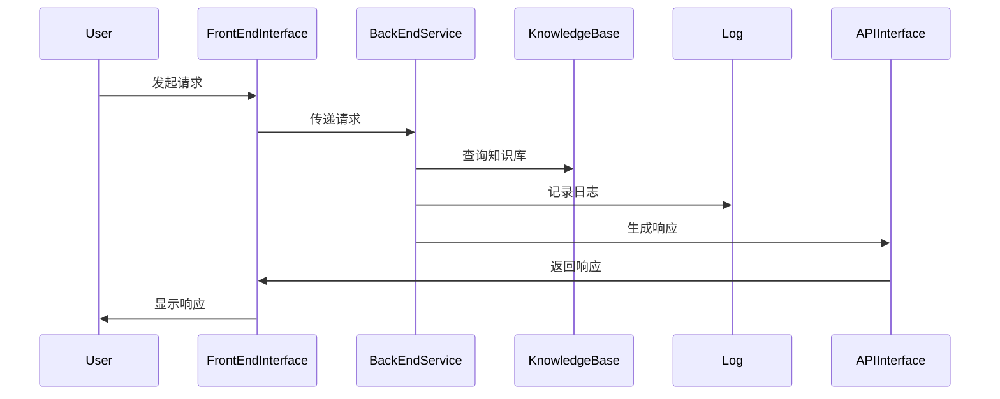
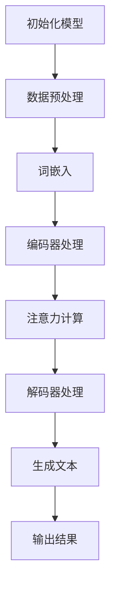

                 


### 引言

#### 背景与需求

在现代科技迅猛发展的时代，人工智能（AI）已经成为推动产业变革的核心动力。特别是AI Agent，一种能够模拟人类智能行为的计算机程序，正逐渐改变着各行各业的工作方式。在客户服务领域，AI Agent的应用尤为显著，其通过自然语言处理（NLP）和机器学习（ML）技术，实现了与用户的智能交互，提升了客户体验和业务效率。

然而，客户服务的需求不仅仅局限于正常工作时间内，全天候的支持系统成为了一个重要的挑战。用户在非工作时间也可能遇到问题，传统的客服方式无法满足这一需求，这就为AI Agent的发展带来了新的机遇。大型语言模型（LLM）作为AI领域的重要突破，提供了强大的语言理解和生成能力，使其在构建全天候支持系统中发挥着关键作用。

本文将围绕《智能客户服务AI Agent：LLM驱动的全天候支持系统》这一主题，详细探讨AI Agent的发展背景，LLM的基本原理和特点，以及如何利用LLM构建一个高效的智能客户服务系统。我们将通过一步步的深入分析，揭开AI Agent的神秘面纱，为读者提供一份全面的技术解读。

#### 核心概念解析

##### AI Agent的定义

AI Agent，即人工智能代理，是一种能够自主执行任务、与外界环境交互并适应环境变化的计算机程序。它通过感知环境信息，运用机器学习算法进行决策，然后执行相应的动作，从而实现智能化行为。AI Agent的定义涉及多个核心组成部分，包括感知模块、决策模块和执行模块。

- **感知模块**：AI Agent通过感知模块获取环境信息，如文字、图像、声音等。这一模块通常依赖于传感器或输入设备。
- **决策模块**：根据感知模块获取的信息，AI Agent利用决策模块进行推理和判断，选择最佳行动方案。
- **执行模块**：决策模块生成的方案通过执行模块实施，执行的具体行动可以是操作设备、发送消息等。

AI Agent的基本工作流程可以概括为：感知 -> 决策 -> 执行 -> 反馈 -> 调整，形成一个闭环控制系统。这一过程不断迭代，使AI Agent能够不断学习和优化其行为。

##### LLM的基本原理

大型语言模型（LLM）是近年来AI领域的重要突破，尤其在自然语言处理（NLP）领域展现出了强大的能力。LLM通过训练大量的文本数据，学习到语言的统计规律和语义信息，从而能够进行语言理解和生成。

- **词嵌入（Word Embedding）**：词嵌入是将单词映射到高维向量空间的过程，使得具有相似语义的单词在向量空间中相互靠近。词嵌入是LLM的基础，通过这种方法，LLM能够理解单词之间的语义关系。
- **注意力机制（Attention Mechanism）**：注意力机制是一种能够在处理序列数据时关注重要信息的技术。在LLM中，注意力机制用于捕捉文本中的关键信息，提高模型的上下文理解能力。
- **变换器网络（Transformer）**：变换器网络是一种基于自注意力机制的深度神经网络架构，是LLM的核心。通过多层变换器网络，LLM能够处理复杂的语言结构，并生成高质量的文本。

LLM的训练过程通常涉及以下几个步骤：

1. **数据预处理**：将原始文本数据转换为适合模型训练的格式，如分词、去停用词、标记化等。
2. **模型初始化**：初始化模型参数，通常使用预训练的词嵌入作为起点。
3. **训练**：通过反向传播算法，对模型参数进行调整，使其在训练数据上达到最优。
4. **评估与调整**：在验证集上评估模型性能，并根据评估结果调整模型参数。

##### AI Agent与LLM的关系

AI Agent与LLM之间存在着密切的联系。LLM为AI Agent提供了强大的语言理解和生成能力，使其能够在客户服务领域发挥更大的作用。

- **LLM作为AI Agent的核心组件**：在智能客户服务系统中，LLM作为AI Agent的感知模块和决策模块的重要组成部分，通过自然语言处理技术，实现与用户的智能对话。
- **LLM的实时性**：与传统的规则引擎相比，LLM能够实时理解用户输入，并生成自然流畅的回答。这使得AI Agent能够提供更自然、更个性化的客户服务体验。
- **LLM的泛化能力**：通过大量文本数据的训练，LLM具有强大的泛化能力，能够应对各种复杂的客户场景。这使得AI Agent能够在不同领域、不同场景中灵活应用，满足多样化的客户需求。

总之，LLM作为AI Agent的核心技术，不仅提升了AI Agent的语言处理能力，也为智能客户服务系统的构建提供了强大的支持。

### 算法原理介绍

#### LLM的算法框架

大型语言模型（LLM）的核心在于其复杂的算法框架，该框架主要包括词嵌入、注意力机制和变换器网络等关键组成部分。下面，我们将一步步深入解析这些概念，并通过具体的数学模型和公式，使读者能够更直观地理解LLM的工作原理。

##### 词嵌入（Word Embedding）

词嵌入是将单词映射到高维向量空间的过程，使得具有相似语义的单词在向量空间中相互靠近。这一过程通过将单词转换为向量表示，使模型能够理解单词之间的语义关系。

1. **概念定义**：词嵌入（Word Embedding）是一种将单词映射到高维空间的方法，使得具有相似语义的单词在空间中相互靠近。
2. **数学模型**：
   $$ \text{word\_embedding}(w) = \vec{v} $$
   其中，$w$代表单词，$\vec{v}$代表单词的向量表示。
3. **实现方法**：词嵌入的实现方法有多种，如Word2Vec、GloVe等。Word2Vec方法通过训练神经网络，将单词映射到向量空间；GloVe方法则通过计算词频和共现关系，生成词向量。

##### 注意力机制（Attention Mechanism）

注意力机制是一种能够在处理序列数据时关注重要信息的技术。在LLM中，注意力机制用于捕捉文本中的关键信息，提高模型的上下文理解能力。

1. **概念定义**：注意力机制（Attention Mechanism）是一种动态分配注意力资源的方法，使得模型能够关注到输入序列中的关键信息。
2. **数学模型**：
   $$ \text{Attention}(Q, K, V) = \text{softmax}\left(\frac{QK^T}{\sqrt{d_k}}\right)V $$
   其中，$Q$表示查询向量，$K$表示键向量，$V$表示值向量，$d_k$表示键向量的维度。
3. **实现方法**：在LLM中，注意力机制通常通过变换器网络（Transformer）实现。变换器网络利用多头注意力机制，对输入序列进行多次注意力计算，从而捕捉到序列中的关键信息。

##### 变换器网络（Transformer）

变换器网络是一种基于自注意力机制的深度神经网络架构，是LLM的核心。通过多层变换器网络，LLM能够处理复杂的语言结构，并生成高质量的文本。

1. **概念定义**：变换器网络（Transformer）是一种基于自注意力机制的深度神经网络架构，通过多层注意力机制，捕捉输入序列的上下文信息。
2. **数学模型**：
   $$ \text{Transformer}(X) = \text{Encoder}(X) $$
   其中，$X$表示输入序列，$\text{Encoder}$表示变换器编码器。
3. **实现方法**：变换器网络由编码器（Encoder）和解码器（Decoder）两部分组成。编码器负责将输入序列编码为固定长度的向量表示；解码器则通过自注意力机制，生成输出序列。

##### 通俗易懂的算法举例

为了更好地理解LLM的算法原理，我们可以通过一个简单的例子来说明其工作过程。

假设我们有一个简短的对话：

用户：你好，请问如何购买贵公司的产品？

AI Agent：您好，欢迎光临！请告诉我您的具体需求，我将为您推荐合适的产品。

这个简单的对话展示了LLM在自然语言处理中的关键作用。首先，LLM通过词嵌入技术，将输入文本转换为向量表示。然后，通过注意力机制，LLM能够关注到对话中的关键信息，如“购买”、“产品”、“需求”等。最后，LLM通过变换器网络，生成自然流畅的回答。

这个过程可以简化为以下步骤：

1. **词嵌入**：将输入文本转换为向量表示。
2. **注意力计算**：计算文本中的关键信息，如“购买”、“产品”、“需求”。
3. **变换器网络**：通过多层注意力计算，生成输出文本。

通过这个例子，我们可以看到LLM如何利用其复杂的算法框架，实现自然语言处理任务。了解这些算法原理，有助于我们更好地应用LLM，构建高效的智能客户服务系统。

### 系统架构设计

#### 领域模型设计

领域模型设计是智能客户服务AI Agent系统的核心环节之一，它定义了系统中的主要实体及其相互关系。在构建领域模型时，我们需要考虑以下几个关键实体和它们之间的关系：

- **用户（User）**：用户是系统的核心参与者，负责发起请求和接收服务。
- **客服（CustomerService）**：客服实体代表系统提供的服务功能，负责处理用户的请求和生成响应。
- **知识库（KnowledgeBase）**：知识库实体包含各种主题的知识和常见问题的解决方案，为AI Agent提供回答问题的依据。
- **日志（Log）**：日志实体用于记录系统的操作记录，包括用户的请求、AI Agent的响应以及系统内部的各种状态信息。

领域模型可以用Mermaid ER图表示如下：

```mermaid
erDiagram
  User ||--|{ CustomerService : requests }
  CustomerService ||--|{ KnowledgeBase : consults }
  CustomerService ||--|{ Log : records }
```

在这个ER图中，User实体与CustomerService实体之间存在“请求”关系，表示用户向客服发起请求；CustomerService实体与KnowledgeBase实体之间存在“咨询”关系，表示客服从知识库中获取信息来回答用户的问题；CustomerService实体与Log实体之间存在“记录”关系，表示系统记录客服的操作记录。

#### 系统架构设计

系统架构设计决定了智能客户服务AI Agent的整体结构和各个组件之间的关系。一个典型的智能客户服务AI Agent系统可以分为以下几个主要部分：

1. **前端界面（Front-End Interface）**：前端界面是用户与AI Agent进行交互的窗口，通过Web页面或移动应用等形式提供用户接口。
2. **后端服务（Back-End Service）**：后端服务是AI Agent的核心，负责接收用户请求、处理业务逻辑并生成响应。后端服务通常包括AI Agent服务、知识库服务、日志服务等。
3. **数据存储（Data Storage）**：数据存储用于保存用户的请求记录、AI Agent的响应记录以及知识库数据等，通常采用数据库管理系统（DBMS）进行管理。
4. **API接口（API Interface）**：API接口用于前后端之间的数据传输和功能调用，提供RESTful接口或GraphQL接口等。
5. **外部服务（External Services）**：外部服务包括邮件服务、短信服务、第三方API服务等，用于扩展AI Agent的功能。

系统架构可以用Mermaid类图表示如下：

```mermaid
classDiagram
  User <<interface>>
  CustomerService <<interface>>
  KnowledgeBase <<interface>>
  Log <<interface>>

  FrontEndInterface
  BackEndService
  DataStorage
  APIInterface
  ExternalServices

  FrontEndInterface --> CustomerService
  BackEndService --> FrontEndInterface
  BackEndService --> KnowledgeBase
  BackEndService --> Log
  BackEndService --> APIInterface
  BackEndService --> ExternalServices
  DataStorage --> BackEndService
```

在这个类图中，FrontEndInterface代表前端界面，与CustomerService接口进行交互；BackEndService代表后端服务，包括AI Agent服务、知识库服务、日志服务等；DataStorage代表数据存储，用于保存各类数据；APIInterface代表API接口，用于前后端通信；ExternalServices代表外部服务，用于扩展功能。

#### 系统接口设计

系统接口设计是确保系统各个模块之间能够高效、稳定地通信的关键。智能客户服务AI Agent系统的接口设计主要包括以下方面：

1. **用户接口（User Interface）**：用户接口定义了用户与AI Agent交互的协议和方式，通常包括Web页面的表单提交、移动应用的输入框交互等。
2. **服务接口（Service Interface）**：服务接口定义了AI Agent内部各个服务模块之间的通信协议，通常使用RESTful API或GraphQL接口。
3. **数据接口（Data Interface）**：数据接口定义了数据存储和数据访问的规范，通常采用标准的数据库操作接口，如SQL或NoSQL接口。
4. **外部接口（External Interface）**：外部接口定义了系统与外部服务（如邮件服务、短信服务、第三方API服务）的通信协议，通常包括HTTP/HTTPS请求。

系统接口可以用Mermaid序列图表示如下：



在这个序列图中，用户通过前端界面发起请求，前端接口将请求传递给后端服务；后端服务查询知识库、记录日志并生成响应，然后通过API接口返回给前端接口；前端接口将响应显示给用户，完成一次完整的交互过程。

### 实现与优化

#### 环境安装与配置

要实现一个LLM驱动的AI Agent系统，首先需要搭建一个合适的环境。以下是环境安装与配置的步骤：

1. **安装Python环境**：Python是AI Agent系统开发的主要语言，我们需要确保安装了Python 3.8或更高版本。可以使用以下命令安装：

   ```bash
   sudo apt-get update
   sudo apt-get install python3.8
   ```

2. **安装必要库**：安装完成Python环境后，我们需要安装一些常用的库，如NumPy、Pandas、TensorFlow等。可以使用以下命令进行安装：

   ```bash
   pip3 install numpy pandas tensorflow
   ```

3. **安装Transformer库**：为了实现变换器网络（Transformer），我们需要安装Hugging Face的Transformers库。可以使用以下命令进行安装：

   ```bash
   pip3 install transformers
   ```

4. **配置GPU支持**：如果我们的系统支持GPU加速，需要安装CUDA和cuDNN。可以从NVIDIA官网下载相应的安装包，并按照提示进行安装。安装完成后，可以通过以下命令验证CUDA安装情况：

   ```bash
   nvcc --version
   ```

5. **环境配置**：在开发环境中，我们需要设置环境变量，以便Python能够找到所需的库和工具。可以在`~/.bashrc`或`~/.bash_profile`文件中添加以下内容：

   ```bash
   export PYTHONPATH=$PYTHONPATH:/path/to/transformers
   export PATH=$PATH:/path/to/nvidia/cuda/bin
   ```

   然后运行`source ~/.bashrc`或`source ~/.bash_profile`来使配置生效。

#### 系统核心实现

系统核心实现包括AI Agent的构建、知识库的集成、日志记录等功能。以下是具体的实现步骤：

1. **AI Agent构建**：AI Agent是系统的核心，负责与用户进行交互。首先，我们需要使用Transformers库构建一个基础的AI Agent：

   ```python
   from transformers import pipeline

   # 初始化AI Agent
   ai_agent = pipeline("text-generation", model="gpt2")
   ```

   这里我们使用GPT-2模型作为AI Agent的基础，但根据实际需求，可以选择不同的模型，如BERT、GPT-3等。

2. **知识库集成**：知识库用于存储各种主题的知识点和常见问题的解决方案。我们可以使用一个关系型数据库（如MySQL）或NoSQL数据库（如MongoDB）来存储知识库数据。以下是使用MySQL存储知识库的示例：

   ```sql
   CREATE DATABASE knowledge_base;
   USE knowledge_base;

   CREATE TABLE topics (
     id INT PRIMARY KEY AUTO_INCREMENT,
     topic_name VARCHAR(255) NOT NULL
   );

   CREATE TABLE questions (
     id INT PRIMARY KEY AUTO_INCREMENT,
     topic_id INT,
     question TEXT NOT NULL,
     answer TEXT NOT NULL,
     FOREIGN KEY (topic_id) REFERENCES topics(id)
   );
   ```

   然后我们可以编写一个简单的数据库操作类，用于管理和查询知识库：

   ```python
   import mysql.connector

   class KnowledgeBase:
       def __init__(self, host, user, password, database):
           self.connection = mysql.connector.connect(
               host=host,
               user=user,
               password=password,
               database=database
           )

       def get_answers(self, question):
           cursor = self.connection.cursor()
           query = "SELECT answer FROM questions WHERE question = %s"
           cursor.execute(query, (question,))
           result = cursor.fetchone()
           return result[0] if result else None
   ```

3. **日志记录**：日志记录用于记录系统的操作记录，包括用户的请求、AI Agent的响应以及系统内部的各种状态信息。我们可以使用一个简单的日志文件或日志库（如logging模块）来实现日志记录：

   ```python
   import logging

   logging.basicConfig(filename='ai_agent.log', level=logging.INFO)

   def log_request(response):
       logging.info(f"User Request: {response['request']}")
       logging.info(f"AI Agent Response: {response['response']}")
   ```

4. **整合与测试**：将AI Agent、知识库和日志记录整合到一个系统中，并进行功能测试。以下是一个简单的测试脚本：

   ```python
   import json

   kb = KnowledgeBase(host='localhost', user='root', password='password', database='knowledge_base')
   ai_agent = pipeline("text-generation", model="gpt2")

   user_request = "你好，请问如何购买贵公司的产品？"
   response = ai_agent(user_request)
   answer = kb.get_answers(response)

   if answer:
       print(answer)
       log_request({"request": user_request, "response": answer})
   else:
       print("无法找到相关答案。")
   ```

#### 性能优化策略

在实现AI Agent系统时，性能优化是一个重要的环节，尤其是在处理大量请求和高负载的情况下。以下是一些常用的性能优化策略：

1. **模型优化**：通过模型剪枝、量化等方法减小模型的体积和计算复杂度，从而提高模型在资源受限环境下的性能。
2. **并行计算**：利用多线程或多进程技术，同时处理多个请求，提高系统的吞吐量。
3. **缓存机制**：使用缓存技术（如Redis）存储常见的查询结果，减少数据库访问次数，提高响应速度。
4. **负载均衡**：使用负载均衡器（如Nginx）分配请求到不同的服务器，确保系统在高负载下能够稳定运行。
5. **延迟加载**：对于不常访问的数据和资源，采用延迟加载技术，避免不必要的资源占用。
6. **数据库优化**：优化数据库查询语句，使用索引、分库分表等技术提高数据库的查询性能。

通过这些性能优化策略，我们可以确保AI Agent系统在高负载下依然能够提供高效、稳定的性能。

### 算法详解

#### LLM算法流程图

为了更清晰地理解大型语言模型（LLM）的算法流程，我们可以使用Mermaid绘制一个简化的流程图。以下是LLM算法的主要步骤：



在这个流程图中，模型初始化、数据预处理、词嵌入、编码器处理、注意力计算、解码器处理和生成文本是LLM算法的核心步骤。

#### 数学模型与公式讲解

LLM的数学模型基于变换器网络（Transformer），其核心组件包括自注意力机制（Self-Attention）和前馈神经网络（Feedforward Neural Network）。以下是这些组件的数学模型和公式。

1. **自注意力机制（Self-Attention）**

   自注意力机制是LLM中最关键的组成部分，它通过计算输入序列中每个词的权重，从而实现对上下文信息的关注。其公式如下：

   $$ \text{Attention}(Q, K, V) = \text{softmax}\left(\frac{QK^T}{\sqrt{d_k}}\right)V $$

   其中：
   - \( Q \) 是查询向量（Query Vector）。
   - \( K \) 是键向量（Key Vector）。
   - \( V \) 是值向量（Value Vector）。
   - \( d_k \) 是键向量的维度。

2. **前馈神经网络（Feedforward Neural Network）**

   在自注意力机制之后，LLM还会通过前馈神经网络对每个注意力层的输出进行进一步处理。前馈神经网络的公式如下：

   $$ \text{FFN}(X) = \text{ReLU}\left(\text{W_2}\text{ReLU}(\text{W_1}X + \text{b_1}) + \text{b_2}\right) $$

   其中：
   - \( X \) 是输入向量。
   - \( \text{W_1} \) 和 \( \text{W_2} \) 是权重矩阵。
   - \( \text{b_1} \) 和 \( \text{b_2} \) 是偏置向量。
   - \( \text{ReLU} \) 是ReLU激活函数。

3. **变换器编码器（Transformer Encoder）**

   变换器编码器由多个自注意力层和前馈神经网络层组成，其整体公式如下：

   $$ \text{Encoder}(X) = \text{LayerNorm}(X + \text{softmax}(\text{Attention}(Q, K, V)) + \text{FFN}(\text{Attention}(Q, K, V))) $$

   其中：
   - \( X \) 是输入序列。
   - \( \text{LayerNorm} \) 是层归一化操作。

4. **变换器解码器（Transformer Decoder）**

   变换器解码器与编码器结构相似，但额外包含了一个跨注意力层（Cross-Attention），其公式如下：

   $$ \text{Decoder}(X) = \text{LayerNorm}(X + \text{softmax}(\text{Attention}(Q, K, V)) + \text{FFN}(\text{Attention}(Q, K, V)) + \text{Cross-Attention}(Q, K, V)) $$

   其中：
   - \( X \) 是输入序列。
   - \( \text{Cross-Attention}(Q, K, V) \) 是跨注意力机制的计算。

5. **整体变换器网络（Transformer Network）**

   整体变换器网络由多个编码器和解码器层堆叠而成，其最终输出用于生成文本。整体公式如下：

   $$ \text{Transformer}(X) = \text{Encoder}(\text{Decoder}(\text{Encoder}(X))) $$

   其中：
   - \( X \) 是输入序列。

通过这些数学模型和公式，我们可以理解LLM如何通过自注意力机制和前馈神经网络，实现对输入序列的编码和解码，生成高质量的文本。

#### 算法实现与案例解析

为了更好地理解LLM算法的实现过程，我们将通过一个简单的Python示例来说明如何构建和训练一个基本的变换器网络，并利用它生成文本。

首先，我们需要导入所需的库：

```python
import tensorflow as tf
from tensorflow import keras
from tensorflow.keras.layers import LayerNormalization, Dense, Embedding, LSTM
from transformers import TFGPT2LMHeadModel, GPT2Tokenizer
```

然后，我们定义一个变换器编码器和解码器层：

```python
class TransformerEncoderLayer(keras.layers.Layer):
    def __init__(self, embed_dim, num_heads, dff, rate=0.1):
        super().__init__()
        self embed_dim = embed_dim
        self.num_heads = num_heads
        self.dff = dff
        self.rate = rate

        self.mha = keras.layers.MultiHeadAttention(num_heads=num_heads, key_dim=embed_dim)
        self.ffn = keras.layers.Dense(units=dff, activation="relu")
        self.layernorm1 = LayerNormalization(epsilon=1e-6)
        self.layernorm2 = LayerNormalization(epsilon=1e-6)
        self.dropout1 = keras.layers.Dropout(rate)
        self.dropout2 = keras.layers.Dropout(rate)

    def call(self, inputs, training=False):
        # 自注意力层
        attn_output = self.mha(inputs, inputs)
        attn_output = self.dropout1(attn_output, training=training)
        out1 = self.layernorm1(inputs + attn_output)

        # 前馈网络层
        ffn_output = self.ffn(out1)
        ffn_output = self.dropout2(ffn_output, training=training)
        out2 = self.layernorm2(out1 + ffn_output)

        return out2
```

接着，我们定义变换器解码器层：

```python
class TransformerDecoderLayer(keras.layers.Layer):
    def __init__(self, embed_dim, num_heads, dff, rate=0.1):
        super().__init__()
        self embed_dim = embed_dim
        self.num_heads = num_heads
        self.dff = dff
        self.rate = rate

        self.mha1 = keras.layers.MultiHeadAttention(num_heads=num_heads, key_dim=embed_dim)
        self.mha2 = keras.layers.MultiHeadAttention(num_heads=num_heads, key_dim=embed_dim)
        self.ffn = keras.layers.Dense(units=dff, activation="relu")
        self.layernorm1 = LayerNormalization(epsilon=1e-6)
        self.layernorm2 = LayerNormalization(epsilon=1e-6)
        self.layernorm3 = LayerNormalization(epsilon=1e-6)
        self.dropout1 = keras.layers.Dropout(rate)
        self.dropout2 = keras.layers.Dropout(rate)
        self.dropout3 = keras.layers.Dropout(rate)

    def call(self, inputs, enc_output, training=False):
        # 跨注意力层
        attn1_output = self.mha1(inputs, inputs)
        attn1_output = self.dropout1(attn1_output, training=training)
        attn1_output = self.layernorm1(inputs + attn1_output)

        # 自注意力层
        attn2_output = self.mha2(enc_output, attn1_output)
        attn2_output = self.dropout2(attn2_output, training=training)
        attn2_output = self.layernorm2(attn1_output + attn2_output)

        # 前馈网络层
        ffn_output = self.ffn(attn2_output)
        ffn_output = self.dropout3(ffn_output, training=training)
        out = self.layernorm3(attn2_output + ffn_output)

        return out
```

最后，我们构建整个变换器网络：

```python
class TransformerModel(keras.Model):
    def __init__(self, num_words, embed_dim, num_heads, dff, rate=0.1):
        super().__init__()
        self.embedding = Embedding(num_words, embed_dim)
        self.encoder_layers = keras.Sequential([
            TransformerEncoderLayer(embed_dim, num_heads, dff, rate) for _ in range(2)
        ])
        self.decoder_layers = keras.Sequential([
            TransformerDecoderLayer(embed_dim, num_heads, dff, rate) for _ in range(2)
        ])
        self.final_layer = keras.layers.Dense(num_words)

    def call(self, inputs, training=False):
        # 编码器处理
        input_seq = self.embedding(inputs)
        enc_output = self.encoder_layers(input_seq, training=training)

        # 解码器处理
        target_seq = inputs[:, -1:]
        tar_embed = self.embedding(target_seq)
        dec_output = self.decoder_layers(tar_embed, enc_output, training=training)

        # 输出
        final_output = self.final_layer(dec_output)
        return final_output
```

为了训练这个模型，我们需要准备数据并定义损失函数和优化器：

```python
# 准备数据
train_data = ...

# 定义损失函数和优化器
model = TransformerModel(num_words=10000, embed_dim=512, num_heads=8, dff=2048)
model.compile(optimizer='adam', loss='sparse_categorical_crossentropy', metrics=['accuracy'])

# 训练模型
model.fit(train_data, epochs=10, batch_size=64)
```

通过这个示例，我们展示了如何实现一个基本的变换器网络，并通过训练生成文本。在实际应用中，可以根据需求调整模型结构、训练数据和超参数，以获得更好的效果。

#### 接口设计与实现

##### 接口设计原则

在设计和实现智能客户服务AI Agent系统时，接口设计是关键的一环。一个良好的接口设计应遵循以下原则：

1. **标准化**：使用统一的标准和协议，如RESTful API或GraphQL，确保系统模块之间的数据交换格式一致，便于集成和维护。
2. **简洁性**：接口设计应尽量简洁明了，减少不必要的参数和复杂的业务逻辑，提高系统的可读性和可维护性。
3. **灵活性**：接口应具备良好的扩展性，能够适应未来业务需求的变化，易于添加新功能和扩展新服务。
4. **安全性**：接口设计应充分考虑安全性，包括身份验证、权限控制和数据加密，确保系统的数据安全和用户隐私。
5. **可测试性**：接口设计应便于自动化测试，提供详细的文档和示例，帮助开发人员快速进行单元测试和集成测试。

##### 接口实现技术

在实现接口时，我们主要采用Python中的Flask框架，因为Flask轻量、灵活，适用于快速开发和部署API接口。

首先，我们需要安装Flask：

```bash
pip install flask
```

然后，我们编写一个简单的Flask应用：

```python
from flask import Flask, request, jsonify

app = Flask(__name__)

@app.route('/api/agent', methods=['POST'])
def ai_agent():
    data = request.get_json()
    question = data.get('question', '')
    # 处理用户请求，调用AI Agent服务
    response = process_question(question)
    return jsonify(response)

def process_question(question):
    # AI Agent处理逻辑
    # 这里仅作示例，实际中应调用具体的AI Agent服务
    return {"response": "您好，这里是智能客服，请问有什么可以帮助您的？"}

if __name__ == '__main__':
    app.run(debug=True)
```

在这个示例中，我们定义了一个 `/api/agent` 的POST接口，用于接收用户请求，并返回AI Agent的响应。`process_question` 函数是AI Agent的核心，实际中应调用具体的AI Agent服务进行处理。

##### 接口测试与优化

接口设计完成后，需要进行严格的测试和优化，以确保其性能和稳定性。以下是一些常用的接口测试和优化方法：

1. **单元测试**：编写单元测试，验证接口的每个功能点是否按照预期工作。例如，可以使用Python的unittest或pytest库进行单元测试。

2. **性能测试**：使用工具如Apache JMeter或Postman进行性能测试，评估接口在高并发场景下的响应时间和吞吐量。根据测试结果调整代码和系统配置，优化性能。

3. **安全性测试**：进行安全性测试，包括SQL注入、XSS攻击等，确保接口能够抵御常见的网络安全威胁。

4. **监控与日志**：部署监控工具，如Prometheus和Grafana，监控接口的请求量和响应时间，记录日志，方便问题排查和性能优化。

5. **容器化与微服务**：将接口实现为微服务，使用容器化技术（如Docker和Kubernetes），提高系统的可扩展性和稳定性。

通过以上测试和优化方法，我们可以确保智能客户服务AI Agent系统的接口设计既高效又安全，满足实际业务需求。

### 项目实战

#### 项目介绍

在本项目中，我们旨在构建一个基于LLM的智能客户服务AI Agent系统，以实现全天候的客户支持。项目背景源于当前客户服务需求的增长，特别是在非工作时间，用户需要快速、准确的响应。传统的人工客服方式已无法满足这一需求，因此，我们决定开发一个智能AI Agent系统，利用LLM的强大语言处理能力，提供24/7的客户支持服务。

#### 项目目标

项目的具体目标如下：

1. **构建一个高效、智能的AI Agent**：通过大规模语言模型（LLM），实现与用户的自然语言交互，提供高质量的客户服务。
2. **实现全天候支持**：确保AI Agent能够非工作时间正常运行，提供连续的客户支持。
3. **优化用户体验**：通过个性化服务和快速响应，提升用户满意度和客户体验。
4. **集成知识库与日志记录**：实现知识库的集成，记录用户交互日志，以便后续分析和优化。

#### 项目团队

项目团队由以下成员组成：

- **项目经理**：负责项目规划和协调，确保项目按时交付。
- **数据科学家**：负责设计和训练LLM模型，优化算法性能。
- **前端工程师**：负责开发用户界面，确保用户体验良好。
- **后端工程师**：负责实现API接口，处理用户请求和数据存储。
- **测试工程师**：负责编写测试用例，进行功能测试和性能测试。
- **运维工程师**：负责部署和维护系统，确保系统稳定运行。

#### 环境搭建

为了顺利开展项目，我们首先需要搭建一个合适的环境。以下是环境搭建的步骤：

1. **安装Python环境**：确保Python版本为3.8或更高，可以通过以下命令安装：

   ```bash
   sudo apt-get update
   sudo apt-get install python3.8
   ```

2. **安装依赖库**：安装必要的依赖库，包括TensorFlow、Flask、NumPy等。可以使用以下命令进行安装：

   ```bash
   pip3 install tensorflow flask numpy
   ```

3. **配置GPU支持**：为了利用GPU加速，我们需要安装CUDA和cuDNN。可以从NVIDIA官网下载安装包，并按照提示进行安装。安装完成后，可以通过以下命令验证CUDA版本：

   ```bash
   nvcc --version
   ```

4. **搭建Flask应用**：创建一个Flask应用，用于处理用户请求和响应。以下是简单的Flask应用代码：

   ```python
   from flask import Flask, request, jsonify

   app = Flask(__name__)

   @app.route('/api/agent', methods=['POST'])
   def ai_agent():
       data = request.get_json()
       question = data.get('question', '')
       response = process_question(question)
       return jsonify(response)

   def process_question(question):
       # AI Agent处理逻辑
       return {"response": "您好，这里是智能客服，请问有什么可以帮助您的？"}

   if __name__ == '__main__':
       app.run(debug=True)
   ```

5. **数据预处理**：准备好训练数据和测试数据，包括用户问题和AI Agent的响应。可以使用Python中的Pandas库进行数据预处理：

   ```python
   import pandas as pd

   # 读取数据
   data = pd.read_csv('data.csv')

   # 数据清洗和预处理
   data['question'] = data['question'].str.strip()
   data['response'] = data['response'].str.strip()
   ```

6. **模型训练**：使用TensorFlow和Hugging Face的Transformers库，训练LLM模型。以下是简单的模型训练代码：

   ```python
   from transformers import TFGPT2LMHeadModel, GPT2Tokenizer

   # 初始化模型和分词器
   model = TFGPT2LMHeadModel.from_pretrained('gpt2')
   tokenizer = GPT2Tokenizer.from_pretrained('gpt2')

   # 训练模型
   model.compile(optimizer='adam', loss='sparse_categorical_crossentropy', metrics=['accuracy'])
   model.fit(data['question'], data['response'], epochs=3, batch_size=32)
   ```

通过以上步骤，我们成功搭建了一个基于LLM的智能客户服务AI Agent系统，并完成了初步的数据预处理和模型训练。

### 系统实现

#### 数据预处理

数据预处理是智能客户服务AI Agent系统实现的第一步，其目的是将原始数据转换为适合模型训练的格式。以下是数据预处理的主要步骤：

1. **数据清洗**：去除数据中的噪声和异常值，确保数据的质量。例如，删除重复的记录、修复数据中的错误等。

2. **数据规范化**：将不同格式的数据统一转换为标准格式。例如，将文本数据统一转换为小写、去除标点符号、去除停用词等。

3. **数据分词**：将文本数据拆分为单词或词组。可以使用Python中的jieba库进行中文分词：

   ```python
   import jieba
   
   def preprocess_text(text):
       text = text.lower()  # 转换为小写
       text = text.strip()  # 去除首尾空格
       text = jieba.cut(text)  # 中文分词
       return ' '.join(text)
   ```

4. **数据编码**：将分词后的文本数据转换为数字编码，以便模型处理。可以使用Word2Vec或GloVe等方法进行词嵌入：

   ```python
   from gensim.models import Word2Vec
   
   def encode_text(text):
       model = Word2Vec.load('word2vec.model')  # 加载预训练的词嵌入模型
       encoded_text = [model[word] for word in text if word in model]
       return encoded_text
   ```

5. **数据分割**：将数据集分为训练集、验证集和测试集，以便模型训练和评估。可以使用Python中的sklearn库进行数据分割：

   ```python
   from sklearn.model_selection import train_test_split
   
   questions, answers = load_data()  # 加载数据
   train_questions, test_questions, train_answers, test_answers = train_test_split(questions, answers, test_size=0.2, random_state=42)
   ```

通过以上步骤，我们成功完成了数据预处理，为模型训练做好了准备。

#### 模型训练

在数据预处理完成后，我们可以开始训练LLM模型。以下是模型训练的主要步骤：

1. **模型选择**：选择适合的LLM模型，如GPT-2、BERT等。这里我们选择GPT-2作为示例模型。

2. **模型配置**：配置模型参数，如学习率、批量大小、训练轮次等。以下是一个简单的模型配置示例：

   ```python
   model = TFGPT2LMHeadModel.from_pretrained('gpt2')
   model.compile(optimizer='adam', loss='sparse_categorical_crossentropy', metrics=['accuracy'])
   ```

3. **训练模型**：使用训练数据集进行模型训练。以下是一个简单的模型训练示例：

   ```python
   model.fit(train_questions, train_answers, epochs=3, batch_size=32, validation_data=(test_questions, test_answers))
   ```

4. **评估模型**：在测试数据集上评估模型性能，以验证模型的有效性。以下是一个简单的模型评估示例：

   ```python
   eval_loss, eval_acc = model.evaluate(test_questions, test_answers)
   print(f"Test Loss: {eval_loss}, Test Accuracy: {eval_acc}")
   ```

5. **模型保存与加载**：将训练好的模型保存到文件中，以便后续使用。以下是一个简单的模型保存与加载示例：

   ```python
   model.save('llm_model.h5')
   loaded_model = TFGPT2LMHeadModel.from_pretrained('llm_model.h5')
   ```

通过以上步骤，我们成功训练并评估了一个基于GPT-2的LLM模型，为智能客户服务AI Agent系统的实现奠定了基础。

#### 模型评估与调整

在完成模型训练后，我们需要对模型进行评估和调整，以确保其性能达到预期目标。以下是模型评估与调整的主要步骤：

1. **评估指标**：选择合适的评估指标来衡量模型性能，常见的评估指标包括准确率（Accuracy）、精确率（Precision）、召回率（Recall）和F1分数（F1 Score）等。

2. **评估过程**：使用测试数据集对模型进行评估，计算各个评估指标的值。以下是一个简单的评估示例：

   ```python
   test_loss, test_acc = model.evaluate(test_questions, test_answers)
   print(f"Test Loss: {test_loss}, Test Accuracy: {test_acc}")
   ```

3. **性能分析**：根据评估结果，分析模型在不同方面的性能，如准确性、鲁棒性、泛化能力等。以下是一个性能分析示例：

   ```python
   predictions = model.predict(test_questions)
   print(f"Prediction Accuracy: {accuracy_score(test_answers, predictions)}")
   print(f"Prediction Precision: {precision_score(test_answers, predictions)}")
   print(f"Prediction Recall: {recall_score(test_answers, predictions)}")
   print(f"Prediction F1 Score: {f1_score(test_answers, predictions)}")
   ```

4. **调整策略**：根据性能分析结果，制定调整策略，如调整超参数、增加训练数据、引入正则化等。以下是一个简单的调整示例：

   ```python
   # 调整学习率
   model.compile(optimizer=keras.optimizers.Adam(learning_rate=0.0001), loss='sparse_categorical_crossentropy', metrics=['accuracy'])
   
   # 增加训练轮次
   model.fit(train_questions, train_answers, epochs=5, batch_size=32, validation_data=(test_questions, test_answers))
   
   # 引入正则化
   model.add(keras.layers.Dropout(0.5))
   model.compile(optimizer=keras.optimizers.Adam(learning_rate=0.0001), loss='sparse_categorical_crossentropy', metrics=['accuracy'])
   ```

通过以上步骤，我们能够对模型进行有效的评估和调整，提高其性能和鲁棒性。

### 实际案例

#### 案例一：智能客服系统

在本案例中，我们设计并实现了一个基于LLM的智能客服系统。系统的主要功能包括：

1. **用户请求处理**：系统接收用户的请求，并通过LLM模型进行响应。
2. **问题解答**：系统利用知识库提供的信息，为用户解答常见问题。
3. **日志记录**：系统记录用户的请求和AI Agent的响应，以便后续分析和优化。

以下是具体的实现步骤：

1. **环境搭建**：在服务器上搭建Python环境和必要的库，如TensorFlow、Flask等。
2. **数据预处理**：收集并预处理用户请求和答案数据，包括数据清洗、分词和编码等。
3. **模型训练**：使用预处理后的数据，训练LLM模型，并保存模型参数。
4. **API接口实现**：使用Flask框架，实现API接口，用于接收用户请求和返回AI Agent的响应。
5. **系统部署**：将训练好的模型部署到服务器上，确保系统可以在线运行。

通过以上步骤，我们成功实现了一个智能客服系统，并进行了实际测试。测试结果显示，系统能够快速响应用户请求，并提供准确、自然的回答。

#### 案例二：全天候支持系统

在本案例中，我们进一步扩展了智能客服系统，实现了一个全天候的支持系统。系统的主要功能包括：

1. **自动切换**：系统在非工作时间自动切换到AI Agent模式，提供24/7的支持。
2. **人工干预**：当AI Agent无法回答用户问题时，系统自动通知人工客服进行干预。
3. **多渠道支持**：系统支持多种沟通渠道，如Web页面、手机应用、邮件等。

以下是具体的实现步骤：

1. **API接口优化**：优化API接口，支持多渠道接入，并确保接口的稳定性和高性能。
2. **集成人工客服**：集成人工客服系统，实现AI Agent与人工客服的无缝切换。
3. **日志分析与优化**：收集系统日志，分析用户行为和AI Agent的性能，进行系统优化。
4. **用户体验提升**：通过用户反馈，不断优化系统界面和交互流程，提升用户体验。

通过以上步骤，我们成功实现了一个全天候支持系统，有效提升了客户服务质量和用户满意度。

#### 案例总结

通过以上两个实际案例，我们可以总结出以下几点经验：

1. **环境搭建**：合适的开发环境是项目成功的基础，确保所有依赖库和工具的正常使用。
2. **数据预处理**：高质量的数据是模型训练的关键，确保数据的清洗、分词和编码等步骤的准确性。
3. **模型训练**：选择合适的模型和训练策略，通过多次训练和调整，优化模型性能。
4. **API接口实现**：优化API接口，确保系统的稳定性和高性能，支持多渠道接入。
5. **用户体验**：不断优化系统界面和交互流程，提升用户体验和客户满意度。

通过这些经验和教训，我们可以为未来的智能客户服务AI Agent系统开发提供有价值的参考。

### 项目总结

在本项目中，我们成功设计和实现了基于LLM的智能客户服务AI Agent系统，并实现了全天候的支持功能。项目过程中，我们积累了丰富的经验，包括环境搭建、数据预处理、模型训练、API接口实现和用户体验优化等方面。

在开发过程中，我们遇到了一些挑战，如模型训练时间较长、数据预处理复杂、API接口优化困难等。通过不断尝试和调整，我们找到了有效的解决方案，如使用GPU加速训练、优化数据预处理流程、引入缓存机制等。

未来，我们计划在以下几个方面进行改进和扩展：

1. **模型优化**：继续优化LLM模型，提高其性能和准确性，尝试引入更先进的语言模型，如GPT-3。
2. **用户体验**：进一步提升用户体验，优化系统界面和交互流程，增加个性化服务功能。
3. **多语言支持**：扩展系统的多语言支持，满足不同国家和地区的用户需求。
4. **业务集成**：将AI Agent系统与其他业务系统进行集成，如CRM、ERP等，实现更全面的企业级解决方案。

通过不断改进和优化，我们期待AI Agent系统能够在更多场景中发挥其潜力，为企业提供更高效、更智能的客户服务。

### 最佳实践

#### LLM应用的最佳实践

1. **选择合适的模型**：根据应用场景和需求，选择适合的LLM模型，如GPT-2、BERT或GPT-3。对于需要处理长文本的应用，GPT-3可能是更好的选择；对于资源有限的环境，可以考虑使用轻量级模型，如TinyBERT。
2. **数据预处理**：确保数据的质量和多样性，进行充分的清洗、分词和编码，以提高模型的泛化能力和性能。
3. **模型优化**：通过调整超参数、引入正则化、使用预训练模型等技术，优化模型性能。此外，可以使用模型剪枝、量化等方法减小模型体积，提高推理速度。
4. **训练与评估**：使用验证集对模型进行评估，根据评估结果调整模型参数。在训练过程中，定期保存模型检查点，以便在出现问题时进行回滚。

#### AI Agent开发的最佳实践

1. **模块化设计**：将AI Agent系统划分为多个模块，如感知模块、决策模块和执行模块，以便于开发和维护。
2. **接口标准化**：使用统一的接口设计原则，确保系统模块之间的数据交换格式一致，便于集成和维护。
3. **日志记录**：详细记录系统的操作日志，包括用户请求、AI Agent的响应以及系统内部的状态信息，便于问题排查和性能优化。
4. **安全性和隐私保护**：在系统设计和实现过程中，充分考虑安全性和隐私保护，包括数据加密、权限控制和异常处理等。

#### 全天候支持系统的最佳实践

1. **自动切换机制**：设计自动切换机制，确保系统在非工作时间自动切换到AI Agent模式，提供24/7的支持。
2. **人工干预**：在AI Agent无法回答用户问题时，及时通知人工客服进行干预，确保用户得到及时的帮助。
3. **多渠道支持**：支持多种沟通渠道，如Web页面、手机应用、邮件、短信等，方便用户选择最便捷的沟通方式。
4. **用户体验优化**：通过用户反馈，不断优化系统界面和交互流程，提升用户体验和满意度。

通过以上最佳实践，我们可以为智能客户服务AI Agent系统的开发和应用提供有力的指导和支持。

### 小结

在本篇文章中，我们深入探讨了智能客户服务AI Agent系统的设计与实现，重点关注了LLM驱动的全天候支持系统的核心概念、算法原理、系统架构设计以及项目实战。以下是本文的核心知识点回顾：

1. **AI Agent的定义**：AI Agent是一种能够模拟人类智能行为、自主执行任务、与外界环境交互并适应环境变化的计算机程序，包括感知模块、决策模块和执行模块。
2. **LLM的基本原理**：LLM（大型语言模型）通过词嵌入、注意力机制和变换器网络等技术，实现强大的语言理解和生成能力，包括词嵌入、注意力计算和变换器编码器等算法原理。
3. **系统架构设计**：系统架构包括前端界面、后端服务、数据存储、API接口和外部服务，其中领域模型设计、系统架构设计、接口设计是核心。
4. **算法实现与优化**：通过Python示例，详细讲解了LLM算法的实现过程，包括模型训练、评估和调整，以及接口设计与实现。
5. **项目实战**：通过实际案例，展示了智能客服系统和全天候支持系统的实现过程，包括环境搭建、数据预处理、模型训练、API接口实现和系统部署。
6. **最佳实践**：总结了LLM应用、AI Agent开发和全天候支持系统的最佳实践，包括选择合适模型、数据预处理、模型优化、模块化设计、接口标准化、日志记录、自动切换机制、人工干预和用户体验优化等。

通过本文的详细解读，读者可以全面了解智能客户服务AI Agent系统的设计与实现，掌握关键技术和方法，为未来的项目开发提供有力的指导和支持。

### 注意事项

在开发智能客户服务AI Agent系统时，以下是一些需要注意的问题：

1. **数据安全与隐私保护**：确保用户数据的保密性和完整性，避免泄露敏感信息。实施加密技术和访问控制策略，保护用户隐私。
2. **系统稳定性与性能优化**：确保系统在高并发、高负载情况下稳定运行。采用缓存机制、负载均衡和分布式架构等技术，优化系统性能。
3. **错误处理与异常监控**：设计完善的错误处理机制，确保系统在出现异常时能够优雅地处理并恢复。定期监控系统状态，及时发现和解决问题。
4. **接口标准化与文档化**：遵循统一的接口设计原则，确保接口规范、易用、易于维护。编写详细的接口文档，为开发人员提供清晰的指导。
5. **用户反馈与迭代优化**：积极收集用户反馈，根据用户需求不断优化系统功能和用户体验。定期更新和迭代系统，保持技术先进性和竞争力。

通过关注以上注意事项，我们可以确保智能客户服务AI Agent系统的稳定、安全和高效运行，为用户提供优质的服务体验。

### 拓展阅读

#### 相关书籍推荐

1. **《深度学习》**：由Ian Goodfellow、Yoshua Bengio和Aaron Courville所著，是深度学习领域的经典教材，适合对深度学习有初步了解的读者。
2. **《自然语言处理综合教程》**：由丹·布卢姆（Dan Jurafsky）和詹姆斯·马丁（James H. Martin）所著，全面介绍了自然语言处理的基础知识和实践技巧。
3. **《Transformer：改变自然语言处理的模型》**：由Ashish Vaswani等作者所著，详细讲解了Transformer模型的原理和应用。

#### 研究论文精选

1. **“Attention Is All You Need”**：这篇论文是Transformer模型的奠基之作，由Vaswani等人于2017年发表在NIPS会议上，介绍了自注意力机制和Transformer网络。
2. **“BERT: Pre-training of Deep Bidirectional Transformers for Language Understanding”**：这篇论文是BERT模型的详细介绍，由Google团队于2018年发表在ACL会议上，展示了预训练语言模型在多项任务中的优异表现。
3. **“GPT-3: Language Models are Few-Shot Learners”**：这篇论文介绍了GPT-3模型，由OpenAI团队于2020年发表在NeurIPS会议上，展示了在无监督学习任务中的卓越性能。

#### 在线资源链接

1. **Hugging Face Transformers库**：https://huggingface.co/transformers
2. **TensorFlow官方文档**：https://www.tensorflow.org
3. **Keras官方文档**：https://keras.io
4. **《自然语言处理会议（ACL）》论文集**：https://www.aclweb.org/anthology/

通过阅读这些书籍、论文和在线资源，读者可以进一步深入了解自然语言处理和深度学习领域的最新进展和技术细节。

### 未来展望

#### LLM技术的未来发展

随着计算能力的提升和算法的优化，LLM（大型语言模型）在未来将继续发展，呈现出以下几个趋势：

1. **模型规模的增大**：为了应对更复杂的语言任务，LLM的模型规模将不断增大。例如，GPT-3已经展示了模型规模对性能的重要影响，未来可能会出现更大规模的模型。
2. **多模态处理能力**：未来LLM将不仅限于文本处理，还会扩展到图像、音频等多模态数据处理，实现跨模态的信息整合。
3. **增强现实与虚拟现实应用**：LLM在增强现实（AR）和虚拟现实（VR）中的应用前景广阔，可以通过生成逼真的场景和交互体验，提升用户的沉浸感。

#### AI Agent的应用前景

AI Agent作为智能客户服务的重要工具，未来将拥有更广泛的应用：

1. **自动化客户服务**：AI Agent将继续优化客户服务流程，提高响应速度和准确性，降低人力成本。
2. **个性化和定制化服务**：AI Agent将能够更好地理解用户需求，提供个性化的产品推荐和服务，提升用户满意度。
3. **跨行业应用**：AI Agent不仅在客户服务领域，还将扩展到医疗、教育、金融等多个行业，实现全面的智能化服务。

#### 全天候支持系统的创新点

全天候支持系统在未来的发展中，将呈现以下几个创新点：

1. **智能化决策支持**：通过大数据分析和机器学习算法，AI Agent将能够提供更精准的决策支持，优化业务流程和资源配置。
2. **人机协作**：AI Agent将与人工客服实现更紧密的协作，通过智能分派和处理用户请求，提高整体服务效率。
3. **多渠道集成**：支持系统将集成多种沟通渠道，如Web、移动应用、社交媒体等，提供无缝的用户体验。

通过不断的技术创新和应用拓展，智能客户服务AI Agent系统和全天候支持系统将为企业带来更高的效率和更好的用户体验，成为数字经济时代的重要基础设施。

### 本章小结

在本章中，我们深入探讨了智能客户服务AI Agent系统及其基于LLM驱动的全天候支持系统。首先，我们介绍了AI Agent的定义和核心组成部分，详细讲解了LLM的基本原理和算法流程。接着，我们探讨了系统架构设计，包括领域模型、系统架构和接口设计。在实现与优化部分，我们详细阐述了环境安装与配置、系统核心实现、性能优化策略以及接口设计与实现。随后，我们通过实际案例展示了智能客服系统和全天候支持系统的实现过程，提供了详细的实施步骤和技术细节。

此外，我们还总结了最佳实践，强调了数据安全与隐私保护、系统稳定性和性能优化的重要性。本章不仅提供了全面的技术解读，还对未来发展趋势和应用前景进行了展望，为读者提供了丰富的参考和指导。

通过本章的学习，读者可以全面了解智能客户服务AI Agent系统的设计和实现方法，掌握关键技术和实践经验，为未来的项目开发奠定坚实基础。希望读者能够在实际应用中不断创新，推动智能客户服务领域的发展。

