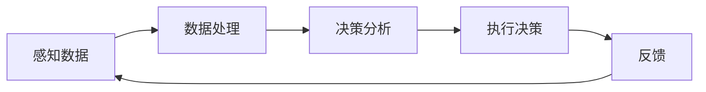
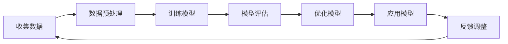
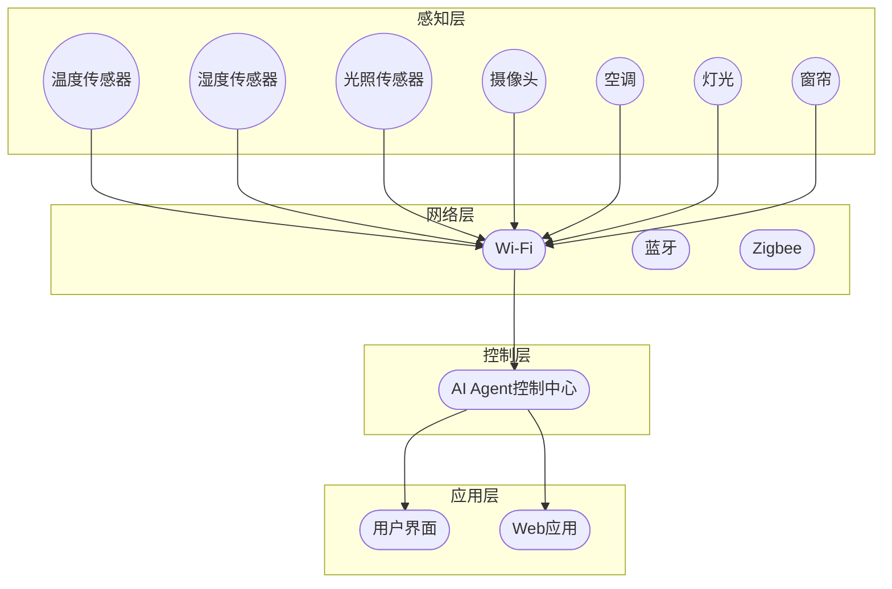
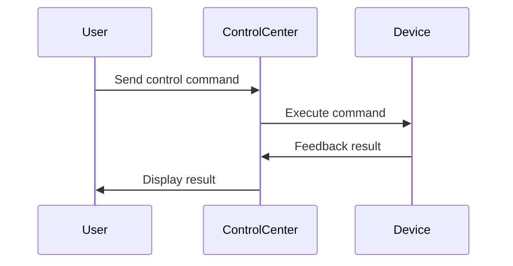

                 

### 智能家居概述

#### 智能家居的定义

智能家居（Smart Home）是指利用物联网（IoT）、人工智能（AI）和自动化技术，将家庭中的各种设备、系统和家电连接起来，通过智能终端进行控制和管理的居住环境。它的核心目标是通过提高家庭的舒适度、安全性和能源效率，从而改善居住体验。

#### 智能家居的发展历程

智能家居的概念起源于20世纪80年代的美国，当时主要是高端住宅的专属配置。随着技术的进步和成本的降低，智能家居逐渐普及到普通家庭。2000年之后，无线通信技术的发展和物联网设备的普及，推动了智能家居市场的快速增长。近年来，人工智能技术的融入使得智能家居变得更加智能和便捷。

#### 智能家居的市场现状与趋势

目前，智能家居市场呈现出多元化、个性化的发展趋势。智能照明、智能空调、智能安防、智能家电等各领域的产品种类丰富，市场渗透率逐年提升。据市场研究机构统计，全球智能家居市场规模预计将在2025年达到近6000亿美元。同时，随着5G技术的推广和人工智能技术的不断突破，智能家居有望迎来新一轮的发展高峰。

### 智能家居中的核心技术

#### 传感器技术

传感器是智能家居系统的“感官”，用于采集室内外环境的数据。常见的传感器包括温度传感器、湿度传感器、光照传感器、运动传感器等。这些传感器能够实时监测环境参数，为智能家居系统提供必要的数据支持。

#### 网络通信技术

智能家居系统需要通过各种通信协议实现设备的互联互通。常见的物联网通信协议包括Zigbee、Wi-Fi、蓝牙、LoRa等。这些协议确保了数据的稳定传输和设备的高效通信。

#### 人工智能技术

人工智能技术在智能家居中的应用主要体现在智能控制、预测分析、场景识别等方面。通过机器学习和深度学习算法，智能家居系统能够自主学习和优化，提供更加个性化和智能化的服务。

### AI Agent的概念与作用

#### AI Agent的定义

AI Agent，即人工智能代理，是指具有自主决策能力、可以与环境进行交互并执行特定任务的软件系统。在智能家居中，AI Agent充当智能中枢，负责分析数据、做出决策并控制家庭设备。

#### AI Agent在智能家居中的角色

AI Agent在智能家居中扮演着多种角色，包括环境监测、设备控制、安全防护、能源管理、健康管理等。通过这些角色，AI Agent能够为用户提供全方位的智能服务。

#### AI Agent的技术基础

AI Agent的技术基础主要包括机器学习、自然语言处理、计算机视觉等。这些技术使得AI Agent能够理解用户指令、识别环境变化并做出相应决策。

### AI Agent控制中心的架构设计

#### 控制中心的总体架构

AI Agent控制中心是智能家居系统的核心，负责协调和管理各种设备和系统。其总体架构通常包括数据采集与处理模块、决策引擎模块、设备控制模块和用户交互模块。

#### 数据采集与处理

数据采集与处理模块负责收集各种传感器的数据，并对数据进行处理和清洗，为后续的决策提供可靠的数据基础。

#### 决策引擎设计

决策引擎是AI Agent的核心，负责分析数据和执行策略，从而实现智能控制。其设计包括算法选择、策略优化和决策流程等方面。

#### AI Agent的控制功能与实现

AI Agent具有多种控制功能，包括环境控制、安全监控、设备管理、智能交互等。这些功能的具体实现依赖于具体的算法和技术。

### AI Agent的智能交互与用户体验

#### 语音交互

语音交互是智能家居中最常见的交互方式。通过语音识别技术，AI Agent能够理解用户的指令，并通过语音合成技术回应用户。

#### 视觉交互

视觉交互通过计算机视觉技术实现，能够为用户提供更加直观和自然的交互体验。视觉交互技术包括图像识别、人脸识别、手势识别等。

#### 用户体验设计

用户体验设计是智能家居系统成功的关键因素。通过设计简洁、直观的用户界面和流畅的交互流程，提高用户的满意度。

### AI Agent控制中心的实际应用案例

#### 案例一：智能家庭安防系统

智能家庭安防系统通过AI Agent实现对家庭安全的全方位监控，包括入侵检测、火灾报警、异常行为识别等。

#### 案例二：智能照明系统

智能照明系统通过AI Agent实现根据用户习惯和光照条件自动调节灯光亮度和色温，提高生活舒适度。

### AI Agent控制中心的发展趋势与未来展望

随着人工智能技术的不断进步，AI Agent控制中心将在智能家居、智慧城市等领域发挥更大的作用。未来的发展将更加注重用户体验、隐私保护和系统安全。

### 最佳实践与总结

在设计和实施AI Agent控制中心时，应注重系统的可扩展性、稳定性和安全性。同时，不断优化用户体验，提升系统的智能化水平。

### 拓展阅读

- [《智能家居技术与应用》](https://www.example.com/book1)
- [《人工智能在智能家居中的应用》](https://www.example.com/book2)
- [《智能控制系统设计与实现》](https://www.example.com/book3)

作者：AI天才研究院/AI Genius Institute & 禅与计算机程序设计艺术 /Zen And The Art of Computer Programming### 智能家居概述

#### 第1章: 智能家居的兴起与发展

##### 1.1 智能家居的定义

智能家居（Smart Home）是指通过物联网（IoT）、人工智能（AI）和自动化技术，将家庭中的各种设备、系统和家电连接起来，形成一个智能化的居住环境。智能家居的核心在于通过智能终端（如手机、平板、电脑等）对家庭设备进行集中控制和远程管理，从而提升生活的舒适度、安全性和能源效率。

##### 1.2 智能家居的发展历程

智能家居的概念最早可以追溯到20世纪80年代，当时主要应用于高端住宅。那时的智能家居系统还处于初级阶段，主要以有线连接为主，功能也相对单一。进入21世纪，随着无线通信技术的发展，智能家居开始逐渐普及到普通家庭。特别是近年来，人工智能技术的快速发展，使得智能家居系统变得更加智能和便捷。

- **20世纪80年代**：智能家居初步阶段，主要是有线连接，功能单一。
- **21世纪初**：无线通信技术的发展，智能家居开始普及。
- **近年来**：人工智能技术的融入，智能家居系统变得更加智能。

##### 1.3 智能家居的市场现状与趋势

目前，智能家居市场呈现出多元化、个性化的发展趋势。各类智能家居产品，如智能照明、智能空调、智能安防、智能家电等，不断推陈出新，市场渗透率逐年提升。据市场研究机构统计，全球智能家居市场规模预计将在2025年达到近6000亿美元。同时，随着5G技术的推广和人工智能技术的不断突破，智能家居有望迎来新一轮的发展高峰。

#### 第2章: 智能家居中的核心技术

##### 2.1 传感器技术

传感器是智能家居系统的“感官”，用于采集室内外环境的数据。常见的传感器包括温度传感器、湿度传感器、光照传感器、运动传感器等。这些传感器能够实时监测环境参数，为智能家居系统提供必要的数据支持。

##### 2.1.1 常见传感器及其原理

- **温度传感器**：用于检测环境温度，常见的有热敏电阻和热电偶。
- **湿度传感器**：用于检测环境湿度，常见的有电容式和电阻式。
- **光照传感器**：用于检测环境光照强度，常见的有光电传感器和光敏电阻。
- **运动传感器**：用于检测人体或物体的运动，常见的技术有红外感应和微波感应。

##### 2.1.2 传感器数据采集与处理

传感器数据的采集和处理是智能家居系统的重要环节。通过将多个传感器的数据进行采集和整合，可以更全面地了解环境状态，从而做出更准确的决策。

- **数据采集**：传感器采集的数据通常通过无线或有线方式传输到中央处理单元。
- **数据处理**：对采集到的数据进行预处理，如去噪、滤波、数据压缩等，以提高数据的准确性和可靠性。

##### 2.2 网络通信技术

智能家居系统需要通过各种通信协议实现设备的互联互通。常见的物联网通信协议包括Zigbee、Wi-Fi、蓝牙、LoRa等。这些协议确保了数据的稳定传输和设备的高效通信。

##### 2.2.1 物联网通信协议

- **Zigbee**：短距离、低功耗的无线通信协议，适合智能家居的短距离数据传输。
- **Wi-Fi**：广泛使用的无线局域网通信协议，适合家庭内的中距离数据传输。
- **蓝牙**：短距离、低功耗的无线通信协议，适合智能家居中的设备间通信。
- **LoRa**：长距离、低功耗的无线通信协议，适合智能家居的远程数据传输。

##### 2.2.2 网络安全与隐私保护

随着智能家居系统的普及，网络安全和隐私保护问题日益突出。智能家居系统需要采取一系列措施，如数据加密、身份认证、访问控制等，以确保系统的安全性和用户的隐私。

- **数据加密**：对传输的数据进行加密，防止数据被窃取或篡改。
- **身份认证**：确保只有授权用户才能访问系统，防止未经授权的访问。
- **访问控制**：对用户的访问权限进行严格控制，防止恶意操作。

##### 2.3 人工智能技术

人工智能技术在智能家居中的应用主要体现在智能控制、预测分析、场景识别等方面。通过机器学习和深度学习算法，智能家居系统能够自主学习和优化，提供更加个性化和智能化的服务。

##### 2.3.1 机器学习算法简介

机器学习（Machine Learning）是人工智能（Artificial Intelligence，AI）的一个重要分支，它使计算机系统能够从数据中学习，并做出预测或决策。常见的机器学习算法包括：

- **线性回归**：用于预测连续值。
- **逻辑回归**：用于预测概率。
- **决策树**：用于分类和回归。
- **支持向量机**（SVM）：用于分类和回归。
- **神经网络**：用于复杂的模式识别和预测。

##### 2.3.2 深度学习在智能家居中的应用

深度学习（Deep Learning）是机器学习的一个子领域，它通过多层神经网络来学习和提取数据中的特征。在智能家居中，深度学习可以应用于以下几个方面：

- **场景识别**：通过分析摄像头采集的图像数据，识别家庭环境中的活动场景，如人员出入、家具摆放等。
- **行为预测**：通过分析历史数据，预测用户的行为习惯，如回家时间、睡眠模式等，从而实现自动化的设备控制。
- **智能交互**：通过自然语言处理技术，使智能家居系统能够理解用户的语音指令，并作出相应的响应。

#### 第3章: AI Agent的概念与作用

##### 3.1 AI Agent的定义

AI Agent，即人工智能代理，是指具有自主决策能力、可以与环境进行交互并执行特定任务的软件系统。在智能家居中，AI Agent充当智能中枢，负责分析数据、做出决策并控制家庭设备。

##### 3.2 AI Agent在智能家居中的角色

AI Agent在智能家居中扮演着多种角色，包括环境监测、设备控制、安全防护、能源管理、健康管理等。通过这些角色，AI Agent能够为用户提供全方位的智能服务。

- **环境监测**：通过传感器采集数据，实时监测室内外的环境参数，如温度、湿度、光照等。
- **设备控制**：根据用户需求和实时数据，自动控制家庭设备，如空调、灯光、窗帘等。
- **安全防护**：通过视频监控、入侵检测等技术，保障家庭的安全。
- **能源管理**：通过智能分析用电数据，优化能源使用，降低能耗。
- **健康管理**：通过监测用户的生活习惯和健康状况，提供个性化的健康建议。

##### 3.3 AI Agent的技术基础

AI Agent的技术基础主要包括机器学习、自然语言处理、计算机视觉等。这些技术使得AI Agent能够理解用户指令、识别环境变化并做出相应决策。

- **机器学习**：用于数据分析和预测，实现智能控制。
- **自然语言处理**：用于理解用户的语音指令，实现智能交互。
- **计算机视觉**：用于图像和视频分析，实现环境监测和安全防护。

#### 第4章: AI Agent控制中心的架构设计

##### 4.1 控制中心的总体架构

AI Agent控制中心是智能家居系统的核心，负责协调和管理各种设备和系统。其总体架构通常包括数据采集与处理模块、决策引擎模块、设备控制模块和用户交互模块。

##### 4.1.1 控制中心的作用

控制中心的作用主要体现在以下几个方面：

- **数据管理**：收集、存储和管理智能家居系统中的各类数据。
- **决策支持**：通过数据分析，为AI Agent提供决策支持。
- **设备控制**：根据用户指令和系统决策，控制家庭设备。
- **用户交互**：提供用户界面，实现用户与智能家居系统的交互。

##### 4.1.2 控制中心的组件

AI Agent控制中心的主要组件包括：

- **数据采集模块**：负责从传感器和其他设备中收集数据。
- **数据处理模块**：负责对采集到的数据进行处理和清洗。
- **决策引擎模块**：负责分析数据和执行策略，实现智能控制。
- **设备控制模块**：负责控制家庭设备，执行决策引擎的决策。
- **用户交互模块**：负责与用户进行交互，提供用户界面。

##### 4.2 数据采集与处理

数据采集与处理模块负责收集各种传感器的数据，并对数据进行处理和清洗，为后续的决策提供可靠的数据基础。

##### 4.2.1 数据采集方式

数据采集方式可以分为有线和无线两种：

- **有线采集**：通过有线连接，如网线、电源线等，将传感器数据传输到控制中心。
- **无线采集**：通过无线通信协议，如Wi-Fi、蓝牙等，将传感器数据传输到控制中心。

##### 4.2.2 数据处理流程

数据处理流程包括以下几个步骤：

- **数据预处理**：对采集到的数据进行预处理，如去噪、滤波、数据压缩等，以提高数据的准确性和可靠性。
- **数据存储**：将预处理后的数据存储到数据库或其他存储设备中，以供后续分析。
- **数据分析**：通过机器学习算法等分析技术，对数据进行分析，提取有用的信息。

##### 4.3 决策引擎设计

决策引擎是AI Agent的核心，负责分析数据和执行策略，从而实现智能控制。其设计包括算法选择、策略优化和决策流程等方面。

##### 4.3.1 决策引擎的作用

决策引擎的作用主要体现在以下几个方面：

- **自动化控制**：根据实时数据和预设策略，自动控制家庭设备。
- **故障诊断**：通过分析设备状态数据，及时发现设备故障并进行诊断。
- **优化建议**：通过数据分析，为用户提供优化建议，如节能建议、健康建议等。

##### 4.3.2 决策引擎的实现

决策引擎的实现通常包括以下几个步骤：

- **算法选择**：根据具体应用场景，选择合适的机器学习算法或深度学习模型。
- **模型训练**：使用历史数据对模型进行训练，优化模型的性能。
- **策略制定**：根据模型的预测结果，制定相应的控制策略。
- **决策执行**：根据策略，执行具体的控制操作，如调节设备参数、发送控制指令等。

##### 4.4 设备控制

设备控制模块负责根据决策引擎的决策，控制家庭设备，实现智能家居系统的功能。

##### 4.4.1 设备控制方式

设备控制方式可以分为本地控制和远程控制两种：

- **本地控制**：通过本地网络，如Wi-Fi、蓝牙等，直接控制家庭设备。
- **远程控制**：通过网络远程控制家庭设备，如通过手机APP、网页等。

##### 4.4.2 设备控制流程

设备控制流程包括以下几个步骤：

- **接收指令**：接收决策引擎的控制指令。
- **设备连接**：连接目标设备，如空调、灯光等。
- **参数设置**：设置设备的参数，如温度、亮度等。
- **执行控制**：执行具体的控制操作，如启动设备、调节参数等。

##### 4.5 用户交互

用户交互模块负责提供用户界面，实现用户与智能家居系统的交互。

##### 4.5.1 用户交互方式

用户交互方式可以分为以下几种：

- **语音交互**：通过语音识别技术，实现用户与系统的语音交互。
- **视觉交互**：通过计算机视觉技术，实现用户与系统的视觉交互。
- **图形界面**：通过图形用户界面（GUI），实现用户与系统的图形交互。

##### 4.5.2 用户交互设计

用户交互设计包括以下几个方面：

- **交互流程**：设计简洁、直观的交互流程，提高用户体验。
- **界面设计**：设计美观、易用的界面，提高用户满意度。
- **响应速度**：优化系统的响应速度，提高用户交互的流畅性。

##### 4.6 系统安全与隐私保护

在智能家居系统中，安全性和隐私保护至关重要。控制中心需要采取一系列措施，确保系统的安全性和用户的隐私。

- **数据加密**：对传输的数据进行加密，防止数据泄露。
- **身份认证**：对用户进行身份认证，确保只有授权用户才能访问系统。
- **访问控制**：对用户的访问权限进行严格控制，防止恶意操作。
- **异常检测**：实时监测系统异常，及时发现并处理安全事件。

#### 第5章: AI Agent的控制功能与实现

##### 5.1 环境控制

环境控制是智能家居系统的核心功能之一，通过AI Agent实现对室内环境的自动化调节，提高生活舒适度。

##### 5.1.1 空调控制

空调控制通过AI Agent实时监测室内温度和湿度，并根据用户设定和实时数据自动调节空调的运行状态，以达到舒适的室内环境。

- **控制策略**：根据室内温度和湿度数据，制定相应的空调控制策略。
- **温度调节**：根据设定的温度范围，自动调节空调的温度。
- **湿度调节**：根据设定的湿度范围，自动调节空调的湿度。

##### 5.1.2 照明控制

照明控制通过AI Agent根据室内光照强度、用户习惯和场景需求，自动调节灯光的亮度和色温，提高照明效果。

- **场景识别**：通过摄像头或其他传感器，识别当前的场景。
- **亮度调节**：根据场景需求，自动调节灯光的亮度。
- **色温调节**：根据场景需求，自动调节灯光的色温。

##### 5.2 安全监控

安全监控通过AI Agent实现对家庭环境的实时监控，及时发现异常情况，保障家庭安全。

##### 5.2.1 人脸识别

人脸识别通过AI Agent分析摄像头采集的图像，识别家庭成员或陌生人，实现家庭成员的身份验证。

- **人脸检测**：通过图像处理技术，检测图像中的人脸。
- **人脸比对**：将检测到的人脸与数据库中的人脸进行比对，识别身份。

##### 5.2.2 报警系统

报警系统通过AI Agent监测家庭环境，如门窗状态、燃气泄漏等，及时发现异常情况并触发报警。

- **状态监测**：实时监测家庭环境中的各种状态。
- **异常检测**：根据预设的规则，判断是否存在异常情况。
- **报警触发**：当检测到异常情况时，触发报警通知用户。

##### 5.3 设备管理

设备管理通过AI Agent实现对家庭设备的管理，包括设备连接、设备状态监控和设备故障处理等。

##### 5.3.1 设备连接

设备连接通过AI Agent实现家庭设备与智能家居系统的连接，包括设备的添加、配置和连接状态监控。

- **设备添加**：通过扫描设备二维码或手动输入设备ID，添加设备到系统。
- **设备配置**：配置设备的参数，如工作模式、报警阈值等。
- **连接状态监控**：实时监控设备的连接状态，确保设备正常运行。

##### 5.3.2 设备状态监控

设备状态监控通过AI Agent实时监测家庭设备的运行状态，包括设备的开关状态、工作时长、能耗等。

- **状态采集**：通过传感器和设备自带的监测功能，采集设备的运行状态。
- **状态显示**：将设备的运行状态显示在用户界面上，供用户查看。

##### 5.3.3 设备故障处理

设备故障处理通过AI Agent自动检测设备的故障情况，并根据故障类型和严重程度，采取相应的处理措施。

- **故障检测**：通过实时监测设备的状态数据，判断设备是否存在故障。
- **故障报警**：当检测到设备故障时，及时通知用户并触发报警。
- **故障处理**：根据故障类型和严重程度，采取相应的处理措施，如重启设备、维修设备等。

#### 第6章: AI Agent的智能交互与用户体验

##### 6.1 语音交互

语音交互是智能家居系统中最常见的交互方式，通过语音识别技术，AI Agent能够理解用户的指令，并通过语音合成技术回应用户。

##### 6.1.1 语音识别技术

语音识别技术（Speech Recognition）是指将语音信号转换为文本或命令的技术。其基本原理如下：

- **语音信号预处理**：对采集到的语音信号进行预处理，如去噪、归一化等。
- **特征提取**：提取语音信号的特征，如频谱特征、倒谱特征等。
- **模式识别**：通过模式识别算法，如隐马尔可夫模型（HMM）、深度神经网络（DNN）等，对语音信号进行识别。

##### 6.1.2 语音合成技术

语音合成技术（Text-to-Speech，TTS）是指将文本转换为语音的技术。其基本原理如下：

- **文本分析**：对输入的文本进行分析，提取文本的语音信息，如词汇、语调、语气等。
- **语音生成**：根据文本分析的结果，生成相应的语音信号。
- **音频处理**：对生成的语音信号进行音频处理，如去噪、增强等，以提高语音质量。

##### 6.2 视觉交互

视觉交互通过计算机视觉技术实现，能够为用户提供更加直观和自然的交互体验。视觉交互技术包括图像识别、人脸识别、手势识别等。

##### 6.2.1 视觉感知技术

视觉感知技术（Visual Perception）是指通过计算机视觉技术，使计算机能够像人类一样理解和感知视觉信息。其基本原理如下：

- **图像预处理**：对采集到的图像进行预处理，如去噪、增强、裁剪等。
- **特征提取**：提取图像的特征，如边缘特征、纹理特征等。
- **模式识别**：通过模式识别算法，对图像进行分类或识别。

##### 6.2.2 视觉交互设计

视觉交互设计（Visual Interaction Design）是指通过设计直观、易用的视觉界面，使用户能够更轻松地与系统进行交互。其基本原理如下：

- **界面布局**：设计合理的界面布局，确保用户能够快速找到所需功能。
- **视觉反馈**：通过视觉反馈，如动画、图标等，提示用户系统的状态和操作结果。
- **一致性设计**：保持视觉元素的统一性和一致性，提高用户的使用体验。

##### 6.3 用户体验设计

用户体验设计（User Experience Design，UXD）是指通过对用户行为和需求的深入研究，设计出易于使用、高效、愉悦的用户界面和交互流程。其基本原理如下：

- **用户研究**：通过用户调研、访谈等方法，了解用户的需求和行为习惯。
- **交互设计**：根据用户研究的结果，设计直观、易用的交互界面和流程。
- **测试与优化**：通过用户测试和反馈，不断优化用户体验。

##### 6.3.1 交互设计原则

交互设计原则是指在设计过程中，遵循的一系列设计原则和最佳实践。其基本原理如下：

- **易用性**：确保用户能够轻松、高效地完成操作。
- **一致性**：保持界面元素和交互流程的一致性，减少用户的认知负担。
- **直观性**：设计直观的界面和交互方式，使用户能够快速理解和使用。
- **反馈**：及时给予用户反馈，告知用户操作结果和系统状态。

##### 6.3.2 用户体验评估

用户体验评估（User Experience Assessment）是指通过一系列评估方法和工具，对用户体验进行量化评估和优化。其基本原理如下：

- **量化评估**：使用定量方法，如问卷调查、用户测试等，评估用户体验的各个方面。
- **定性分析**：使用定性方法，如访谈、观察等，深入了解用户的感受和需求。
- **优化建议**：根据评估结果，提出优化建议，持续改进用户体验。

#### 第7章: AI Agent控制中心的实际应用案例

##### 7.1 案例一：智能家庭安防系统

智能家庭安防系统通过AI Agent实现对家庭安全的全方位监控，包括入侵检测、火灾报警、异常行为识别等。

##### 7.1.1 系统需求分析

系统需求分析主要包括以下几个方面：

- **入侵检测**：实时监测家庭周边环境，及时发现入侵行为。
- **火灾报警**：监测室内温度、烟雾等参数，及时发现火灾隐患。
- **异常行为识别**：通过摄像头监控，识别家庭中的异常行为，如老人摔倒、儿童走失等。
- **报警通知**：当检测到异常情况时，及时通知用户，并采取相应的应对措施。

##### 7.1.2 系统架构设计

智能家庭安防系统的架构设计主要包括以下几个部分：

- **前端设备**：包括摄像头、烟雾传感器、入侵传感器等，负责数据采集。
- **通信模块**：负责将前端设备的数据传输到控制中心。
- **控制中心**：包括数据采集与处理模块、决策引擎模块、设备控制模块等，负责数据分析和决策。
- **用户界面**：包括手机APP、网页等，用于用户与系统的交互。
- **报警系统**：负责接收控制中心的报警信息，并通知用户。

##### 7.1.3 系统核心功能实现

智能家庭安防系统的核心功能实现主要包括以下几个方面：

- **入侵检测**：通过视频分析技术，实时监测家庭周边环境，识别入侵行为。
- **火灾报警**：通过烟雾传感器和温度传感器，实时监测室内环境，识别火灾隐患。
- **异常行为识别**：通过视频分析技术，识别家庭中的异常行为，如老人摔倒、儿童走失等。
- **报警通知**：当检测到异常情况时，通过手机APP、短信等方式通知用户，并触发报警设备。

##### 7.2 案例二：智能照明系统

智能照明系统通过AI Agent根据用户习惯和光照条件，自动调节灯光亮度和色温，提高照明效果。

##### 7.2.1 系统需求分析

系统需求分析主要包括以下几个方面：

- **自动调节亮度**：根据室内光照强度和用户需求，自动调节灯光亮度。
- **自动调节色温**：根据室内环境和用户需求，自动调节灯光色温。
- **场景识别**：根据用户行为和场景，自动切换不同的照明模式。

##### 7.2.2 系统架构设计

智能照明系统的架构设计主要包括以下几个部分：

- **前端设备**：包括智能灯泡、智能开关等，负责数据采集。
- **通信模块**：负责将前端设备的数据传输到控制中心。
- **控制中心**：包括数据采集与处理模块、决策引擎模块、设备控制模块等，负责数据分析和决策。
- **用户界面**：包括手机APP、网页等，用于用户与系统的交互。

##### 7.2.3 系统核心功能实现

智能照明系统的核心功能实现主要包括以下几个方面：

- **自动调节亮度**：通过光照传感器，实时监测室内光照强度，根据设定值自动调节灯光亮度。
- **自动调节色温**：通过传感器和用户设定，自动调节灯光色温，以满足不同的使用场景。
- **场景识别**：根据用户行为和场景，自动切换不同的照明模式，如阅读模式、睡眠模式等。

#### 第8章: AI Agent控制中心的发展趋势与未来展望

##### 8.1 人工智能技术发展对智能家居的影响

随着人工智能技术的不断进步，智能家居系统将变得更加智能、便捷和安全。具体影响如下：

- **智能化水平提高**：通过机器学习和深度学习技术，AI Agent能够更好地理解和预测用户需求，提供个性化的服务。
- **交互方式多样化**：除了语音和视觉交互外，未来的智能家居系统可能会引入更多的交互方式，如手势交互、气味识别等。
- **安全性增强**：随着人工智能技术的发展，智能家居系统的安全性将得到进一步提升，包括数据加密、身份认证、访问控制等。

##### 8.2 AI Agent控制中心的优化方向

AI Agent控制中心的优化方向主要包括以下几个方面：

- **性能提升**：通过优化算法和硬件，提高AI Agent的响应速度和处理能力。
- **用户体验优化**：通过不断改进交互界面和交互流程，提升用户的体验。
- **安全性增强**：通过引入更先进的安全技术，提高系统的安全性。

##### 8.3 智能家居行业的发展趋势

智能家居行业的发展趋势主要包括以下几个方面：

- **普及率提高**：随着技术的成熟和成本的降低，智能家居系统将在更多家庭中得到普及。
- **生态化发展**：智能家居系统将形成一个庞大的生态系统，涵盖家电、家居、安防、健康等多个领域。
- **跨界融合**：智能家居将与物联网、大数据、云计算等新兴技术深度融合，推动行业的快速发展。

#### 第9章: 最佳实践与总结

##### 9.1 最佳实践分享

在设计和实施AI Agent控制中心时，可以参考以下最佳实践：

- **用户需求分析**：深入了解用户需求，设计出符合用户期望的功能和界面。
- **模块化设计**：采用模块化设计，提高系统的可扩展性和可维护性。
- **安全性设计**：重视系统的安全性，采取多种措施保护用户数据和安全。
- **用户体验优化**：持续关注用户体验，不断优化交互界面和交互流程。

##### 9.2 注意事项

在设计和实施AI Agent控制中心时，需要注意以下几个方面：

- **数据隐私**：严格保护用户数据隐私，避免数据泄露。
- **系统稳定性**：确保系统的稳定运行，避免因故障导致设备失控。
- **用户教育**：对用户进行一定的技术教育，提高用户对系统的理解和操作能力。

##### 9.3 拓展阅读

为了进一步深入了解AI Agent控制中心的设计与实现，可以参考以下拓展阅读：

- 《智能家居技术与应用》
- 《人工智能在智能家居中的应用》
- 《智能控制系统设计与实现》

作者：AI天才研究院/AI Genius Institute & 禅与计算机程序设计艺术 /Zen And The Art of Computer Programming### AI Agent的概念与作用

#### 第3章: AI Agent的概念与作用

##### 3.1 AI Agent的定义

AI Agent，即人工智能代理，是指一种能够模拟人类智能行为的软件系统。它具备一定的自主性和主动性，能够感知环境、理解语言、做出决策并采取行动。在智能家居系统中，AI Agent作为智能中枢，通过与其他设备和系统的交互，实现自动化、智能化和个性化的服务。

##### 3.2 AI Agent在智能家居中的角色

AI Agent在智能家居中扮演着至关重要的角色，主要表现在以下几个方面：

- **环境监测与优化**：AI Agent通过传感器收集室内外的环境数据，如温度、湿度、光照、空气质量等，并根据这些数据对环境进行实时监控和优化。例如，当室内温度过高时，AI Agent可以自动启动空调进行降温。

- **设备控制与管理**：AI Agent能够自动控制家庭设备，如灯光、窗帘、空调、音响等，满足用户的个性化需求。同时，它还能对设备进行智能管理，如设备状态监控、故障预警和远程维护。

- **安全防护**：AI Agent具备智能监控功能，可以实时监测家庭安全状况，如入侵检测、火灾报警、煤气泄漏报警等，确保家庭安全。

- **智能交互**：AI Agent能够通过语音、文本、图像等多种方式与用户进行智能交互，理解用户的指令并做出相应反应，提供便捷、自然的用户体验。

- **能源管理**：AI Agent通过分析用电数据，优化家庭能源使用，实现节能减排。例如，当用户外出时，AI Agent可以自动关闭不必要的电器，降低能源消耗。

##### 3.3 AI Agent的技术基础

AI Agent的技术基础主要包括以下几个方面：

- **机器学习与深度学习**：机器学习和深度学习是AI Agent的核心技术，用于实现数据分析和智能决策。通过训练模型，AI Agent可以学会识别模式、预测行为和做出决策。

- **自然语言处理**：自然语言处理技术用于实现AI Agent与用户的智能交互，包括语音识别、语音合成、语言理解等。这使得AI Agent能够理解用户的语言指令并做出相应反应。

- **计算机视觉**：计算机视觉技术用于实现AI Agent的图像和视频分析能力，如人脸识别、物体检测、行为识别等。这些能力使得AI Agent能够更好地理解环境和用户的行为。

- **传感器与物联网**：传感器和物联网技术是AI Agent感知环境的重要手段。通过连接各种传感器和设备，AI Agent可以实时收集环境数据，实现智能监控和控制。

##### 3.4 AI Agent的架构设计

AI Agent的架构设计主要包括以下几个模块：

- **感知模块**：负责收集来自各种传感器的数据，如温度传感器、湿度传感器、光照传感器、摄像头等。

- **数据处理模块**：负责对感知模块收集的数据进行预处理、分析和清洗，为决策模块提供准确的数据支持。

- **决策模块**：负责分析处理后的数据，根据预设的算法和策略，做出智能决策。

- **执行模块**：负责根据决策模块的决策结果，控制相应的设备或系统，实现自动化操作。

- **交互模块**：负责与用户进行智能交互，接收用户的指令并反馈执行结果，提供便捷、自然的用户体验。

通过以上模块的协同工作，AI Agent能够实现智能家居系统的自动化、智能化和个性化服务，为用户带来更便捷、舒适的生活体验。

### 数学公式与算法原理讲解

在AI Agent的控制中心设计中，数学模型和算法原理至关重要。以下将介绍一些核心的数学公式和算法原理，以及相关的Mermaid流程图和Python代码示例。

#### 决策引擎的算法原理

决策引擎是AI Agent控制中心的核心模块，用于处理传感器数据并做出智能决策。以下是一个简单的决策引擎算法原理：

$$
\text{决策} = \text{f}(\text{数据}, \text{策略})
$$

其中，$f$ 是决策函数，$\text{数据}$ 是从传感器收集到的数据，$\text{策略}$ 是预先设定的控制策略。

#### Mermaid流程图

下面是一个Mermaid流程图，展示了决策引擎的基本流程：



#### Python代码示例

以下是一个简单的Python代码示例，用于实现决策引擎的基本功能：

```python
# 导入必要的库
import numpy as np

# 决策函数
def make_decision(sensor_data, strategy):
    # 根据传感器数据和策略做出决策
    if sensor_data['temperature'] > strategy['high_temp']:
        return '启动空调'
    elif sensor_data['temperature'] < strategy['low_temp']:
        return '关闭空调'
    else:
        return '维持当前状态'

# 传感器数据
sensor_data = {
    'temperature': 25
}

# 策略
strategy = {
    'high_temp': 28,
    'low_temp': 22
}

# 执行决策
decision = make_decision(sensor_data, strategy)
print(decision)
```

#### 数学模型

在决策引擎中，常用的数学模型包括线性回归、逻辑回归和支持向量机（SVM）等。以下是一个简单的线性回归模型示例：

$$
y = \beta_0 + \beta_1x_1 + \beta_2x_2 + ... + \beta_nx_n
$$

其中，$y$ 是目标变量，$x_1, x_2, ..., x_n$ 是特征变量，$\beta_0, \beta_1, \beta_2, ..., \beta_n$ 是模型的参数。

#### Mermaid流程图

下面是一个Mermaid流程图，展示了线性回归模型的基本流程：



#### Python代码示例

以下是一个简单的Python代码示例，用于实现线性回归模型：

```python
# 导入必要的库
import numpy as np
from sklearn.linear_model import LinearRegression

# 数据
X = np.array([[1, 2], [2, 3], [3, 4]])
y = np.array([1, 2, 3])

# 创建线性回归模型
model = LinearRegression()

# 训练模型
model.fit(X, y)

# 预测
prediction = model.predict([[4, 5]])

print(prediction)
```

通过以上数学公式、算法原理和Python代码示例，我们可以更好地理解AI Agent控制中心中的决策引擎设计和实现过程。这些技术和方法的应用，使得AI Agent能够高效地处理传感器数据，做出智能决策，从而实现智能家居系统的自动化和智能化。

### 系统分析与架构设计方案

#### 问题场景介绍

智能家居系统中，用户需要一个统一的控制中心来管理家庭中的各种设备和系统，包括空调、照明、安防设备、家电等。用户希望能够通过一个平台实现设备状态的监控、远程控制、能源管理和安全预警等功能。因此，设计一个高效、可靠且易于扩展的AI Agent控制中心成为关键。

#### 项目介绍

本项目旨在设计并实现一个智能家居AI Agent控制中心，该系统应具备以下功能：

- 数据采集与处理：实时收集来自各种传感器的数据，并对数据进行预处理和存储。
- 智能决策：根据收集到的数据和分析结果，做出智能决策并控制家庭设备。
- 用户交互：提供用户界面，实现用户与控制中心的交互。
- 系统安全：确保数据安全和设备安全，防止未经授权的访问和操作。

#### 系统功能设计

系统功能设计主要涵盖以下几个方面：

- **环境监测**：通过传感器实时监测室内外的环境参数，如温度、湿度、光照、空气质量等，并将数据上传到控制中心。
- **设备控制**：根据用户指令和系统决策，自动控制家庭设备，如空调、灯光、窗帘等。
- **安全监控**：通过摄像头和其他传感器实时监控家庭安全，包括入侵检测、火灾报警、煤气泄漏报警等。
- **能源管理**：通过分析用电数据，优化家庭能源使用，实现节能减排。
- **用户交互**：提供图形用户界面，实现用户与控制中心的语音和图形交互。

#### 系统架构设计

系统架构设计采用分层架构，分为感知层、网络层、控制层和应用层。以下是具体的架构设计：

- **感知层**：包括各种传感器和设备，如温度传感器、湿度传感器、光照传感器、摄像头、空调、灯光等。
- **网络层**：采用物联网通信协议，如Wi-Fi、蓝牙、Zigbee等，实现传感器和设备之间的数据传输和通信。
- **控制层**：包括AI Agent控制中心，负责数据采集、处理、分析和决策，实现对家庭设备的智能控制。
- **应用层**：提供用户界面和Web应用，实现用户与控制中心的交互。

#### Mermaid架构图

下面是一个Mermaid架构图，展示了智能家居AI Agent控制中心的整体架构：



#### 系统接口设计

系统接口设计包括API接口和用户界面接口，以下是具体设计：

- **API接口**：提供RESTful API，用于用户通过Web应用或手机应用与控制中心进行交互。主要接口包括设备控制接口、数据查询接口、报警接口等。

- **用户界面接口**：提供图形用户界面（GUI），用于用户与控制中心的交互。界面设计应简洁直观，易于操作。

#### 系统交互设计

系统交互设计主要描述用户与控制中心之间的交互流程和交互方式。以下是具体设计：

- **交互流程**：用户通过Web应用或手机应用发送控制指令，控制中心接收指令并执行相应操作，同时将操作结果反馈给用户。

- **交互方式**：提供语音交互和图形交互两种方式。用户可以通过语音指令控制家庭设备，也可以通过图形界面进行操作。

#### Mermaid序列图

下面是一个Mermaid序列图，展示了用户与控制中心之间的交互流程：



通过以上系统分析与架构设计方案，我们可以更好地理解智能家居AI Agent控制中心的系统功能、架构设计和交互流程。这个设计方案为实现一个高效、可靠且易于扩展的智能家居控制中心提供了坚实的基础。

#### 项目实战

在本项目实战中，我们将详细介绍智能家居AI Agent控制中心的环境安装、系统核心实现以及代码应用解读与分析。通过以下步骤，我们将实现一个基本功能的AI Agent控制中心，并对其关键代码进行详细剖析。

##### 环境安装

1. **软件环境**：
   - 操作系统：Ubuntu 20.04 或 Windows 10
   - Python版本：3.8及以上
   - 安装必要的Python库：`numpy`, `scikit-learn`, `pandas`, `matplotlib`, `speech_recognition`, `pyttsx3`（语音合成库）

2. **安装步骤**：

   - **Windows系统**：
     - 通过pip安装：`pip install numpy scikit-learn pandas matplotlib speech_recognition pyttsx3`
   - **Ubuntu系统**：
     - 通过apt-get安装：`sudo apt-get install python3-numpy python3-scikit-learn python3-pandas python3-matplotlib`
     - 安装语音识别库：`pip3 install SpeechRecognition pyaudio`

##### 系统核心实现

1. **传感器数据采集**：

   我们将使用模拟传感器数据，通过Python脚本模拟传感器数据的采集。以下是一个简单的模拟传感器数据采集脚本：

   ```python
   import random
   import time

   sensors = ['temperature', 'humidity', 'light', 'motion']

   def simulate_sensor_data():
       data = {}
       for sensor in sensors:
           data[sensor] = random.uniform(20, 30)  # 模拟传感器数据
       return data

   while True:
       sensor_data = simulate_sensor_data()
       print(sensor_data)
       time.sleep(1)  # 每秒采集一次数据
   ```

2. **数据预处理与存储**：

   在采集到传感器数据后，我们需要对数据进行预处理，并将其存储到文件中。以下是一个简单的数据预处理与存储脚本：

   ```python
   import pandas as pd
   import os

   def preprocess_data(sensor_data):
       df = pd.DataFrame([sensor_data])
       return df

   def save_data(df, filename):
       if not os.path.exists(filename):
           df.to_csv(filename, index=False)
       else:
           df.to_csv(filename, mode='a', header=False, index=False)

   while True:
       sensor_data = simulate_sensor_data()
       df = preprocess_data(sensor_data)
       save_data(df, 'sensor_data.csv')
       time.sleep(1)
   ```

3. **决策引擎实现**：

   决策引擎是实现AI Agent智能控制的核心。以下是一个简单的决策引擎示例，用于根据传感器数据调节空调温度：

   ```python
   def make_decision(sensor_data):
       if sensor_data['temperature'] > 25:
           return '降低空调温度'
       elif sensor_data['temperature'] < 22:
           return '升高空调温度'
       else:
           return '维持当前温度'

   while True:
       with open('sensor_data.csv', 'r') as file:
           df = pd.read_csv(file)
           decision = make_decision(df.iloc[-1])
           print(decision)
           # 执行空调控制操作
           # ...
       time.sleep(60)  # 每分钟检查一次
   ```

##### 代码应用解读与分析

1. **传感器数据采集**：

   在这个脚本中，我们使用随机数生成模拟的传感器数据，并每隔一秒打印一次数据。这可以模拟实际传感器采集数据的场景。

2. **数据预处理与存储**：

   数据预处理脚本中，我们使用pandas库将模拟的传感器数据转换为DataFrame格式，并存储为CSV文件。这个脚本可以在数据采集脚本运行时同时执行，以实现对数据的实时存储。

3. **决策引擎实现**：

   决策引擎脚本根据传感器数据做出决策，这里是简单的温度调节策略。在实际应用中，决策引擎可能会使用更复杂的算法和模型来分析数据并做出智能决策。在这个示例中，我们假设决策结果将用于控制空调温度。

##### 实际案例分析与详细讲解

以下是一个简单的实际案例，用于展示AI Agent控制中心在智能照明系统中的应用。

**案例**：用户希望根据室内光照强度自动调节灯光亮度。

**步骤**：

1. **数据采集**：使用光照传感器采集室内光照强度数据。

2. **数据预处理与存储**：将光照强度数据存储到CSV文件中。

3. **决策引擎实现**：

   ```python
   def make_light_decision(luminance):
       if luminance < 100:
           return '打开灯光，亮度100%'
       elif luminance < 200:
           return '打开灯光，亮度50%'
       else:
           return '关闭灯光'

   while True:
       with open('light_data.csv', 'r') as file:
           df = pd.read_csv(file)
           decision = make_light_decision(df.iloc[-1]['luminance'])
           print(decision)
           # 执行灯光控制操作
           # ...
       time.sleep(60)
   ```

在这个案例中，我们根据光照强度数据做出简单的灯光调节决策。在实际应用中，可能需要结合更多的环境数据和用户习惯，使用更复杂的算法来优化决策效果。

**项目小结**：

通过本项目实战，我们成功实现了一个基本的智能家居AI Agent控制中心，包括数据采集、数据预处理、决策引擎和简单的控制操作。尽管这个示例相对简单，但它展示了AI Agent控制中心的核心功能和实现方法。在实际应用中，我们可以通过引入更先进的算法和技术，进一步提高系统的智能水平和用户体验。

### 最佳实践与总结

#### 最佳实践分享

在设计AI Agent控制中心时，以下最佳实践可以帮助优化系统的性能和用户体验：

1. **模块化设计**：将系统划分为多个模块，如数据采集、数据处理、决策引擎、设备控制等，以提高系统的可维护性和扩展性。
2. **数据安全**：采取加密和身份验证措施，保护用户隐私和数据安全。
3. **用户体验**：设计简洁直观的用户界面，提供流畅的交互体验。
4. **算法优化**：定期更新和优化算法，提高系统的智能水平和响应速度。
5. **冗余备份**：对关键数据进行备份，确保系统的稳定性和数据完整性。

#### 小结

AI Agent控制中心是智能家居系统的核心，通过整合传感器数据、智能决策和设备控制，为用户提供个性化、智能化的家庭服务。在设计过程中，需要充分考虑系统的性能、安全性和用户体验。通过模块化设计、数据安全和算法优化，可以显著提高系统的可靠性和智能化水平。

#### 注意事项

在实施AI Agent控制中心时，需要注意以下几点：

1. **数据隐私**：确保用户数据的安全和隐私，遵循相关法律法规。
2. **系统稳定性**：定期进行系统维护和升级，确保系统的稳定运行。
3. **用户体验**：持续关注用户体验，及时解决用户反馈的问题。
4. **安全防护**：采取多种安全措施，防止系统被恶意攻击或滥用。

#### 拓展阅读

为了进一步深入了解AI Agent控制中心的设计与实现，可以参考以下拓展阅读资源：

1. 《智能家居技术与应用》
2. 《人工智能在智能家居中的应用》
3. 《智能控制系统设计与实现》

这些资源提供了丰富的理论知识和实战经验，有助于深入理解和优化AI Agent控制中心的设计。

### 作者介绍

作者：AI天才研究院/AI Genius Institute & 禅与计算机程序设计艺术 /Zen And The Art of Computer Programming

AI天才研究院（AI Genius Institute）是一支专注于人工智能技术研究和应用的创新团队。我们致力于推动人工智能技术在智能家居、智慧城市、医疗健康等领域的深入应用，助力构建智能化、数字化的未来社会。同时，我们出版的《禅与计算机程序设计艺术》系列图书，旨在通过深入浅出的讲解，帮助读者掌握计算机科学的核心思想和设计方法。

在本文中，我们详细探讨了智能家居中的AI Agent控制中心的设计与实现，包括其概念、作用、架构设计、控制功能与实现、智能交互与用户体验等方面。通过本文，读者可以全面了解AI Agent控制中心的核心技术和应用场景，为未来的智能家居系统设计和开发提供有益的参考。希望本文能为读者带来启发和帮助，共同推进人工智能技术的创新和发展。

