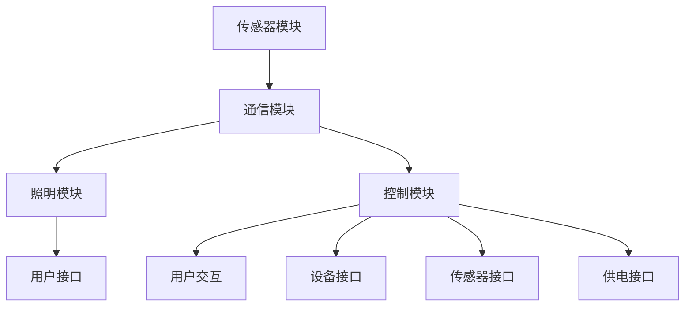
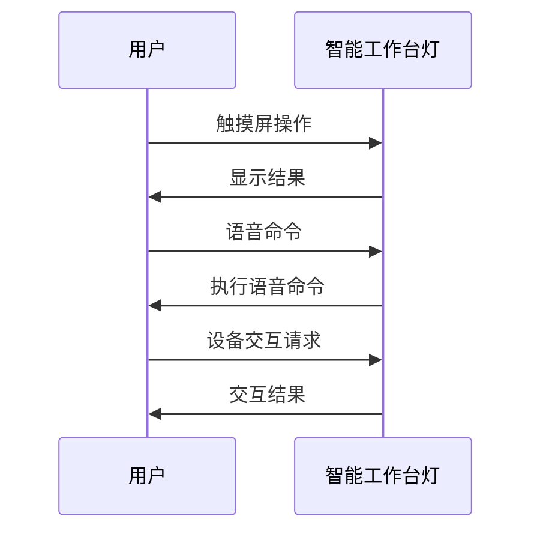
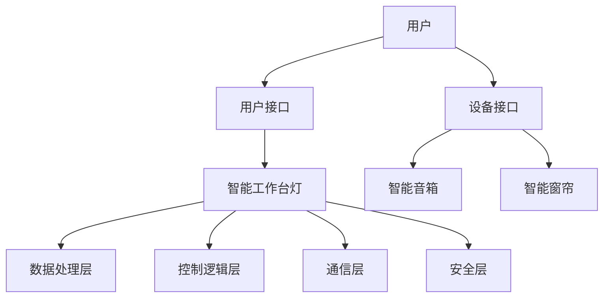
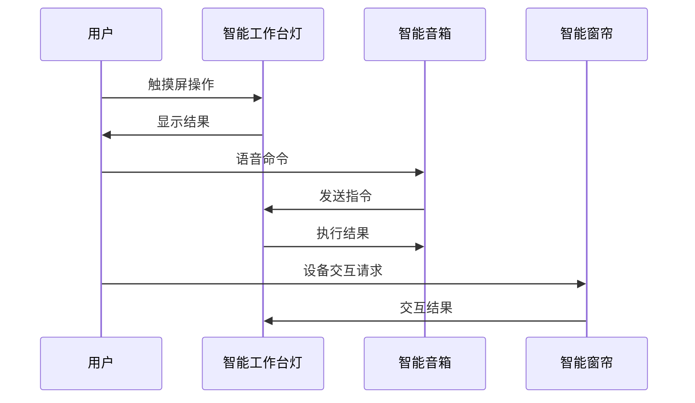

                 


### 引言

#### 1.1 问题背景

在现代社会，随着数字化办公的普及，工作台灯作为办公环境中不可或缺的设备，其重要性日益凸显。然而，传统的工作台灯往往只能提供固定的照明效果，无法根据工作环境和用户需求进行动态调整。这种缺乏灵活性的照明方式不仅无法满足现代办公环境的需求，还可能对用户的视觉健康产生负面影响。

首先，照明的亮度和色温对人的视觉感受和健康有着重要影响。过亮或过暗的照明都会导致眼睛疲劳，增加视觉不适感。而色温的变化则直接影响到人们的情绪和工作效率。研究表明，蓝光辐射是导致视力损伤和失眠的主要原因之一。因此，如何通过智能工作台灯来优化照明效果，减少蓝光辐射，成为当前研究的热点。

其次，智能照明技术的发展为解决这一问题提供了新的思路。智能照明技术利用传感器、通信技术和先进的控制算法，可以实现照明的自动调节，从而提高照明效果，保护用户的视力健康。此外，智能工作台灯还可以通过蓝牙、Wi-Fi等无线通信方式，与其他智能设备互联互通，实现更智能的照明体验。

综上所述，智能工作台灯在改善办公环境和保护用户视力健康方面具有巨大潜力。然而，目前关于智能工作台灯的研究仍处于初级阶段，特别是在照明优化和护眼模式方面，仍有许多问题需要解决。因此，本文旨在探讨智能工作台灯的照明优化与护眼模式的设计与实现，为智能照明技术的发展提供参考。

#### 1.2 研究目标与内容安排

本文的研究目标主要包括以下几个方面：

1. **智能工作台灯的基本概念与分类**：首先，对智能工作台灯的基本概念进行阐述，包括其定义、分类和功能特点。这将有助于读者对智能工作台灯有一个整体的认识。

2. **智能工作台灯的发展历程与趋势**：回顾智能工作台灯的发展历程，分析其与传统照明的区别，以及智能照明技术的发展趋势。这将有助于读者了解智能工作台灯的背景和发展方向。

3. **智能工作台灯的技术原理与设计要素**：深入探讨智能工作台灯的技术原理，包括传感器技术、通信技术和照明控制技术。同时，分析智能工作台灯的设计要素，如照明效果设计、用户体验设计和能耗优化设计。

4. **AI Agent在智能工作台灯中的应用**：介绍AI Agent的基本概念和功能，分析其在智能工作台灯中的角色，如照明优化和护眼模式。同时，探讨AI Agent的技术架构和应用实例。

5. **照明优化算法原理与应用**：详细讲解常见的照明优化算法，如传统照明控制算法、基于机器学习和深度学习的照明优化算法。并通过具体实例，展示这些算法在智能工作台灯中的应用。

6. **护眼模式的设计与实现**：探讨护眼模式的基本原理和设计策略，如光照强度与色温调节、动态调整策略等。同时，分析护眼模式与用户行为的关系，以及其实际应用效果。

7. **系统分析与架构设计方案**：介绍智能工作台灯的系统分析与架构设计方案，包括系统功能设计、系统架构设计、系统接口设计和系统交互等。

8. **项目实战与最佳实践**：通过实际项目案例，展示智能工作台灯的安装与使用方法，分析系统的核心实现源代码，并提供最佳实践建议。

通过以上研究，本文旨在为智能工作台灯的照明优化与护眼模式提供系统性的研究和解决方案，为智能照明技术的发展提供参考。

#### 1.3 本书结构

本书分为五个主要部分：

**第一部分：引言**  
介绍智能工作台灯的背景、研究目标和内容安排，以及本书的结构。

**第二部分：智能工作台灯概述**  
详细阐述智能工作台灯的基本概念、发展历程、技术原理和设计要素。

**第三部分：AI Agent在智能工作台灯中的应用**  
介绍AI Agent的基本概念、在智能工作台灯中的角色、技术架构和应用实例。

**第四部分：照明优化算法原理与应用**  
讲解常见的照明优化算法，并展示其在智能工作台灯中的应用实例。

**第五部分：护眼模式的设计与实现**  
探讨护眼模式的基本原理、设计策略和实际应用效果。

**第六部分：系统分析与架构设计方案**  
介绍智能工作台灯的系统分析与架构设计方案。

**第七部分：项目实战与最佳实践**  
通过实际项目案例，展示智能工作台灯的安装与使用方法，并提供最佳实践建议。

本书结构紧凑，逻辑清晰，旨在为读者提供全面的智能工作台灯的研究和解决方案。希望通过本书，能够为智能照明技术的发展贡献一份力量。

### 关键词

智能工作台灯，照明优化，护眼模式，AI Agent，传感器技术，通信技术，照明控制算法。

### 摘要

智能工作台灯作为现代办公环境中的一种新兴设备，其重要性日益凸显。本文从多个角度对智能工作台灯进行了全面的研究，包括其基本概念、发展历程、技术原理、设计要素以及AI Agent的应用。本文首先介绍了智能工作台灯的定义和分类，分析了其与传统照明的区别和优势。接着，详细探讨了智能工作台灯的技术原理，包括传感器技术、通信技术和照明控制技术。在此基础上，本文重点介绍了AI Agent在智能工作台灯中的应用，如照明优化和护眼模式。同时，本文还讲解了常见的照明优化算法，如传统照明控制算法、基于机器学习和深度学习的照明优化算法，并展示了这些算法在智能工作台灯中的应用实例。最后，本文探讨了护眼模式的设计与实现，分析了其基本原理、设计策略和实际应用效果。通过本文的研究，旨在为智能照明技术的发展提供参考和指导，帮助改善办公环境和保护用户的视力健康。

### 第一部分: 引言

#### 1.1 问题背景

在现代社会，随着数字化办公的普及，工作台灯作为办公环境中不可或缺的设备，其重要性日益凸显。然而，传统的工作台灯往往只能提供固定的照明效果，无法根据工作环境和用户需求进行动态调整。这种缺乏灵活性的照明方式不仅无法满足现代办公环境的需求，还可能对用户的视觉健康产生负面影响。

首先，照明的亮度和色温对人的视觉感受和健康有着重要影响。过亮或过暗的照明都会导致眼睛疲劳，增加视觉不适感。而色温的变化则直接影响到人们的情绪和工作效率。研究表明，蓝光辐射是导致视力损伤和失眠的主要原因之一。因此，如何通过智能工作台灯来优化照明效果，减少蓝光辐射，成为当前研究的热点。

其次，智能照明技术的发展为解决这一问题提供了新的思路。智能照明技术利用传感器、通信技术和先进的控制算法，可以实现照明的自动调节，从而提高照明效果，保护用户的视力健康。此外，智能工作台灯还可以通过蓝牙、Wi-Fi等无线通信方式，与其他智能设备互联互通，实现更智能的照明体验。

综上所述，智能工作台灯在改善办公环境和保护用户视力健康方面具有巨大潜力。然而，目前关于智能工作台灯的研究仍处于初级阶段，特别是在照明优化和护眼模式方面，仍有许多问题需要解决。因此，本文旨在探讨智能工作台灯的照明优化与护眼模式的设计与实现，为智能照明技术的发展提供参考。

#### 1.2 研究目标与内容安排

本文的研究目标主要包括以下几个方面：

1. **智能工作台灯的基本概念与分类**：首先，对智能工作台灯的基本概念进行阐述，包括其定义、分类和功能特点。这将有助于读者对智能工作台灯有一个整体的认识。

2. **智能工作台灯的发展历程与趋势**：回顾智能工作台灯的发展历程，分析其与传统照明的区别，以及智能照明技术的发展趋势。这将有助于读者了解智能工作台灯的背景和发展方向。

3. **智能工作台灯的技术原理与设计要素**：深入探讨智能工作台灯的技术原理，包括传感器技术、通信技术和照明控制技术。同时，分析智能工作台灯的设计要素，如照明效果设计、用户体验设计和能耗优化设计。

4. **AI Agent在智能工作台灯中的应用**：介绍AI Agent的基本概念和功能，分析其在智能工作台灯中的角色，如照明优化和护眼模式。同时，探讨AI Agent的技术架构和应用实例。

5. **照明优化算法原理与应用**：详细讲解常见的照明优化算法，如传统照明控制算法、基于机器学习和深度学习的照明优化算法。并通过具体实例，展示这些算法在智能工作台灯中的应用。

6. **护眼模式的设计与实现**：探讨护眼模式的基本原理和设计策略，如光照强度与色温调节、动态调整策略等。同时，分析护眼模式与用户行为的关系，以及其实际应用效果。

7. **系统分析与架构设计方案**：介绍智能工作台灯的系统分析与架构设计方案，包括系统功能设计、系统架构设计、系统接口设计和系统交互等。

8. **项目实战与最佳实践**：通过实际项目案例，展示智能工作台灯的安装与使用方法，分析系统的核心实现源代码，并提供最佳实践建议。

通过以上研究，本文旨在为智能工作台灯的照明优化与护眼模式提供系统性的研究和解决方案，为智能照明技术的发展提供参考。

#### 1.3 本书结构

本书分为五个主要部分：

**第一部分：引言**  
介绍智能工作台灯的背景、研究目标和内容安排，以及本书的结构。

**第二部分：智能工作台灯概述**  
详细阐述智能工作台灯的基本概念、发展历程、技术原理和设计要素。

**第三部分：AI Agent在智能工作台灯中的应用**  
介绍AI Agent的基本概念、在智能工作台灯中的角色、技术架构和应用实例。

**第四部分：照明优化算法原理与应用**  
讲解常见的照明优化算法，并展示其在智能工作台灯中的应用实例。

**第五部分：护眼模式的设计与实现**  
探讨护眼模式的基本原理、设计策略和实际应用效果。

**第六部分：系统分析与架构设计方案**  
介绍智能工作台灯的系统分析与架构设计方案。

**第七部分：项目实战与最佳实践**  
通过实际项目案例，展示智能工作台灯的安装与使用方法，并提供最佳实践建议。

本书结构紧凑，逻辑清晰，旨在为读者提供全面的智能工作台灯的研究和解决方案。希望通过本书，能够为智能照明技术的发展贡献一份力量。

### 第二部分: 智能工作台灯概述

#### 2.1 智能工作台灯的基本概念

智能工作台灯是一种结合了先进传感器技术、通信技术和照明控制技术的多功能办公照明设备。与传统的工作台灯相比，智能工作台灯不仅具备基本的照明功能，还能够根据环境变化和用户需求进行智能调节，提供更舒适、更健康的照明环境。

**定义**：智能工作台灯是一种集成了传感器、控制器、通信模块和智能算法的办公照明设备。它能够实时监测环境光线、用户活动和工作状态，并根据采集到的数据智能调整照明亮度、色温等参数，以优化照明效果，提升用户体验。

**分类**：智能工作台灯可以根据不同的分类标准进行分类，常见的分类方法包括：

1. **按功能分类**：智能工作台灯可分为基本型、智能调节型、护眼型和多功能型。基本型主要提供基本的照明功能；智能调节型可以根据环境变化和用户需求进行照明调节；护眼型特别关注对眼睛的保护，如减少蓝光辐射等；多功能型则集成了多种功能，如阅读灯、香薰灯等。

2. **按使用场景分类**：智能工作台灯可分为办公用灯、家居用灯、酒店用灯等。办公用灯主要适用于办公室、会议室等办公环境；家居用灯则适用于家庭书房、卧室等；酒店用灯则适用于酒店客房、会议室等。

3. **按控制方式分类**：智能工作台灯可分为手动调节型和智能控制型。手动调节型通过物理按键或旋钮进行调节；智能控制型则通过蓝牙、Wi-Fi、语音控制等智能方式实现远程控制和自动化调节。

**功能特点**：智能工作台灯具有以下功能特点：

1. **智能调节**：智能工作台灯可以根据环境光线自动调节亮度，根据用户需求自动调节色温，提供舒适的照明环境。

2. **护眼功能**：智能工作台灯能够过滤蓝光辐射，减少对眼睛的伤害，特别适合长时间使用电脑的用户。

3. **自动化控制**：智能工作台灯可以通过蓝牙、Wi-Fi等无线通信方式与智能手机、智能音箱等设备连接，实现远程控制和自动化调节。

4. **多模式切换**：智能工作台灯可以根据不同的使用场景提供多种照明模式，如阅读模式、工作模式、休息模式等。

5. **能耗管理**：智能工作台灯通常采用节能设计，能够根据环境光线自动调节亮度，有效降低能耗。

#### 2.2 智能工作台灯的发展历程

智能工作台灯的发展可以追溯到20世纪末，当时一些企业开始尝试将传感器和控制器集成到照明设备中，实现基本的照明调节功能。随着信息技术和传感器技术的快速发展，智能工作台灯逐渐走向成熟。

1. **初期阶段（20世纪90年代至21世纪初）**：
   - 这一阶段，智能工作台灯主要采用简单的传感器技术，如光敏传感器，实现基本的亮度调节功能。
   - 同时，一些企业开始尝试通过遥控器或物理按键实现照明调节，提高了用户的使用便利性。

2. **成长阶段（21世纪初至2010年）**：
   - 随着无线通信技术的普及，如蓝牙、Wi-Fi等，智能工作台灯开始具备无线通信功能，用户可以通过手机或智能音箱进行远程控制。
   - 智能工作台灯开始集成更多的传感器，如人体传感器、红外传感器等，实现更智能的照明调节功能。

3. **成熟阶段（2010年至今）**：
   - 智能照明技术的快速发展，使得智能工作台灯的功能越来越丰富，如护眼功能、多模式切换、能耗管理等。
   - 智能工作台灯开始与其他智能设备互联互通，如智能音箱、智能门锁等，实现智能家居的生态闭环。

#### 2.3 智能工作台灯的发展趋势

随着科技的不断进步，智能工作台灯的发展趋势也在不断演变。以下是几个主要的发展方向：

1. **更智能的照明控制**：
   - 未来，智能工作台灯将更注重智能化，如通过AI算法实现更精准的环境光线监测和照明调节，提供个性化的照明服务。
   - 智能工作台灯将具备更高的自学习能力和自适应能力，能够根据用户的作息习惯、工作内容等自动调整照明参数。

2. **更多的交互方式**：
   - 未来，智能工作台灯将支持更多样化的交互方式，如语音控制、手势控制、面部识别等，提供更便捷的用户体验。
   - 智能工作台灯将与其他智能设备深度融合，形成更完善的智能家居生态系统。

3. **更健康的照明环境**：
   - 未来，智能工作台灯将更加注重用户的健康需求，如通过滤蓝光技术、智能调光技术等，提供更健康的照明环境。
   - 智能工作台灯将配备更先进的传感器，如光谱传感器、心率传感器等，实时监测用户的生理状态，提供个性化照明方案。

4. **更节能的设计**：
   - 未来，智能工作台灯将更加注重节能设计，如采用更高效的照明技术、智能功耗管理等，降低能耗，保护环境。

总之，随着科技的不断进步，智能工作台灯将不断演进，为用户带来更智能、更健康、更便捷的照明体验。

#### 2.4 智能工作台灯的技术原理

智能工作台灯的核心在于其技术的集成与创新，主要包括传感器技术、通信技术和照明控制技术。以下将逐一介绍这些技术及其在智能工作台灯中的应用。

**传感器技术**

传感器技术是智能工作台灯实现智能化功能的基础。智能工作台灯通常集成了多种传感器，包括光敏传感器、人体传感器、红外传感器、温湿度传感器等。这些传感器能够实时监测环境光线、用户活动、温度和湿度等参数，为照明控制和智能调节提供数据支持。

1. **光敏传感器**：光敏传感器可以检测环境光线的亮度，并将其转换为电信号。通过光敏传感器的数据，智能工作台灯可以自动调整亮度，以适应环境变化，提供舒适的照明效果。

2. **人体传感器**：人体传感器可以检测用户的位置和活动，实现自动开关灯和调节亮度。例如，当用户靠近工作台时，智能工作台灯会自动开启并调整到适宜的亮度；当用户离开时，则会自动关闭。

3. **红外传感器**：红外传感器可以检测用户的手势，实现手势控制。例如，用户可以通过挥手或摆动手臂来调整亮度或切换照明模式。

4. **温湿度传感器**：温湿度传感器可以监测工作环境的温度和湿度，为智能工作台灯提供环境数据，以便进行相应的调节。例如，当环境湿度过高时，智能工作台灯可以开启除湿模式，提供更加舒适的工作环境。

**通信技术**

通信技术是智能工作台灯实现远程控制和互联互通的关键。智能工作台灯通常通过Wi-Fi、蓝牙、Zigbee等无线通信技术，与用户的智能手机、智能音箱、智能家居控制系统等设备进行数据传输和指令接收。

1. **Wi-Fi**：Wi-Fi是一种无线通信技术，可以实现智能工作台灯与互联网的连接，用户可以通过手机APP或网页远程控制智能工作台灯。此外，Wi-Fi还可以实现智能工作台灯与其他智能设备的互联互通，形成智能家居生态系统。

2. **蓝牙**：蓝牙是一种短距离无线通信技术，可以实现智能工作台灯与用户设备的快速连接。用户可以通过手机APP或智能音箱，通过蓝牙连接远程控制智能工作台灯。

3. **Zigbee**：Zigbee是一种低功耗无线通信技术，适用于智能家居场景。智能工作台灯可以通过Zigbee网络与其他智能设备进行通信，实现协调控制。

**照明控制技术**

照明控制技术是智能工作台灯实现智能调节的核心。智能工作台灯通常采用微控制器（MCU）或嵌入式系统（ESP8266、ESP32等）作为控制核心，通过传感器采集到的数据，结合智能算法，实现照明的自动调节。

1. **控制芯片**：智能工作台灯通常采用微控制器（MCU）或嵌入式系统（ESP8266、ESP32等）作为控制核心。这些芯片具有强大的计算能力和通信功能，可以实时处理传感器数据，并执行相应的控制指令。

2. **智能算法**：智能工作台灯通过智能算法实现照明的自动调节。常见的智能算法包括基于规则的控制算法、基于机器学习的控制算法等。基于规则的控制算法根据预设的规则进行照明调节，如根据光线亮度和用户活动调节亮度；基于机器学习的控制算法通过训练模型，实现更加智能的照明调节，如根据用户的作息习惯自动调整照明模式。

3. **控制接口**：智能工作台灯通常提供多种控制接口，如物理按键、触摸屏、语音控制等。用户可以通过这些接口，直接或间接地控制智能工作台灯的亮度、色温、模式等参数。

综上所述，智能工作台灯的技术原理涉及传感器技术、通信技术和照明控制技术。通过这些技术的集成和创新，智能工作台灯实现了照明的智能调节，为用户提供更加舒适、健康、便捷的照明体验。

#### 2.5 智能工作台灯的设计要素

智能工作台灯的设计不仅要满足基本的照明需求，还需考虑用户体验、功能多样性和能耗管理等多个方面。以下将详细分析智能工作台灯的设计要素。

**照明效果设计**

照明效果设计是智能工作台灯的核心，直接影响用户的视觉感受和工作效率。以下是一些关键的设计要点：

1. **亮度调节**：智能工作台灯应具备自动亮度调节功能，根据环境光线的强弱和用户需求，实时调整照明亮度。通常，智能工作台灯会配备光敏传感器，以检测环境光线并自动调节亮度。

2. **色温调节**：色温调节是提升照明舒适度的重要手段。智能工作台灯应提供多档色温调节功能，以适应不同的使用场景和用户需求。例如，白天的办公场景适合使用较高色温的光源，而晚上的阅读场景则适合使用较低色温的光源。

3. **照明模式**：智能工作台灯应提供多种照明模式，如工作模式、阅读模式、休息模式等，以适应不同用户的使用需求。每种模式应根据特定的光照需求进行优化，确保照明效果舒适、高效。

**用户体验设计**

用户体验设计是智能工作台灯设计的重要环节，直接影响用户的使用感受和满意度。以下是一些关键的设计要点：

1. **界面设计**：智能工作台灯的界面设计应简洁明了，易于操作。用户可以通过触摸屏或物理按键快速切换照明模式、调节亮度等。

2. **交互方式**：智能工作台灯应支持多种交互方式，如触摸屏、物理按键、语音控制等，以满足不同用户的使用习惯。例如，通过语音助手（如Siri、Google Assistant等）可以方便地控制智能工作台灯。

3. **人机工程学**：智能工作台灯的设计应考虑人机工程学，如台灯的形状、尺寸和重量等。合理的造型和尺寸可以提高用户的使用舒适度，减轻长时间使用的疲劳感。

**功能多样性**

智能工作台灯应具备多种功能，以满足用户的多样化需求。以下是一些关键的设计要点：

1. **多场景适用性**：智能工作台灯应适用于多种场景，如家庭、办公室、学校等。不同场景对照明需求不同，智能工作台灯应具备灵活的照明调节能力，以适应各种场景。

2. **附加功能**：智能工作台灯可以集成多种附加功能，如阅读灯、香薰灯、蓝牙音响等，为用户提供更多便捷的使用体验。

3. **智能联动**：智能工作台灯应具备与其他智能设备的联动功能，如与智能音箱、智能门锁、智能窗帘等设备联动，实现智能家居的生态闭环。

**能耗管理**

智能工作台灯的能耗管理是设计的重要方面，直接关系到节能环保和用户体验。以下是一些关键的设计要点：

1. **节能设计**：智能工作台灯应采用高效节能的照明技术，如LED照明，以降低能耗。此外，通过智能算法实现自动亮度调节，减少不必要的能耗。

2. **低功耗模式**：智能工作台灯应具备低功耗模式，当用户长时间离开时，自动进入低功耗模式，以减少待机能耗。

3. **智能功耗管理**：通过智能功耗管理算法，智能工作台灯可以根据环境光线和用户活动，动态调整功耗，实现最优的能耗管理。

综上所述，智能工作台灯的设计涉及多个方面，包括照明效果设计、用户体验设计、功能多样性和能耗管理。通过综合考虑这些设计要素，可以打造出满足用户需求的智能工作台灯，提升用户的工作效率和生活质量。

### 第三部分: AI Agent在智能工作台灯中的应用

#### 3.1 AI Agent概述

AI Agent（人工智能代理）是一种基于人工智能技术的智能实体，能够模拟人类智能行为，执行特定任务，并与环境进行交互。AI Agent在智能工作台灯中的应用，使得智能工作台灯具备了更加智能化和个性化的功能。

**定义**：AI Agent是指能够自主感知环境、执行任务、学习优化并与其他智能实体进行交互的计算机程序。在智能工作台灯中，AI Agent充当了一个智能控制模块，通过感知用户行为和环境变化，自动调整照明参数，提供最佳的照明体验。

**分类**：AI Agent可以根据其功能和应用场景进行分类，常见的分类方法包括：

1. **按功能分类**：AI Agent可分为感知型、决策型、执行型和交互型。感知型AI Agent主要承担感知任务，如采集环境光线、用户活动等数据；决策型AI Agent根据感知数据做出决策，如调整照明亮度、色温等；执行型AI Agent负责执行具体任务，如控制照明设备；交互型AI Agent负责与用户进行交互，如语音识别、手势识别等。

2. **按应用场景分类**：AI Agent可分为通用型和专业型。通用型AI Agent适用于多种场景，如智能家居、智能办公等；专业型AI Agent则针对特定应用场景进行优化，如智能医疗、智能交通等。

**功能与应用场景**：AI Agent在智能工作台灯中的功能主要包括照明优化、护眼模式、智能交互等。

1. **照明优化**：AI Agent可以通过感知用户行为和环境变化，自动调整照明参数，如亮度、色温等，提供个性化的照明体验。例如，当用户进入工作状态时，AI Agent可以自动调整到适宜的工作照明模式；当用户休息时，AI Agent可以自动调整到护眼照明模式。

2. **护眼模式**：AI Agent可以监测用户的视觉健康状态，如眼睛疲劳程度、蓝光辐射等，并根据监测结果调整照明参数，提供护眼照明。例如，当检测到用户眼睛疲劳时，AI Agent可以自动降低亮度或切换到护眼模式，减少对眼睛的刺激。

3. **智能交互**：AI Agent可以通过语音识别、手势识别等交互方式，与用户进行自然互动，提高用户的使用便利性。例如，用户可以通过语音命令控制智能工作台灯的亮度、色温等参数，或通过手势控制实现照明模式的切换。

#### 3.2 AI Agent在智能工作台灯中的角色

AI Agent在智能工作台灯中扮演着多重角色，其核心作用是提升照明效果和用户体验。以下详细分析AI Agent在智能工作台灯中的具体角色和作用。

**照明优化**

AI Agent在照明优化中的角色主要体现在以下几个方面：

1. **环境感知**：AI Agent通过传感器实时采集环境数据，如光线亮度、温度、湿度等，分析环境变化，为照明优化提供数据支持。

2. **用户行为分析**：AI Agent通过感知用户行为，如位置变化、活动状态等，了解用户的使用习惯和需求，为照明优化提供个性化建议。

3. **自动调节**：基于环境感知和用户行为分析，AI Agent可以自动调整照明参数，如亮度、色温等，实现照明效果的优化。例如，当用户处于工作状态时，AI Agent可以自动提高亮度，提供更清晰明亮的照明环境；当用户休息时，AI Agent可以自动降低亮度，提供柔和的照明环境。

4. **节能管理**：AI Agent可以根据环境光线和用户行为，动态调整照明功耗，实现节能管理。例如，在夜间或无人使用时，AI Agent可以自动降低亮度，减少能耗。

**护眼模式**

AI Agent在护眼模式中的作用主要体现在以下几个方面：

1. **视觉健康监测**：AI Agent通过传感器和图像处理技术，监测用户的视觉健康状态，如眼睛疲劳程度、蓝光辐射等。

2. **智能调整**：基于视觉健康监测数据，AI Agent可以自动调整照明参数，如亮度、色温等，减少对眼睛的刺激，提供护眼照明。例如，当检测到用户眼睛疲劳时，AI Agent可以自动降低亮度或切换到护眼模式，减少眼睛疲劳。

3. **预警提示**：AI Agent可以通过语音提示、屏幕显示等方式，向用户发出视觉健康预警，提醒用户注意休息和保护视力。

**智能交互**

AI Agent在智能交互中的作用主要体现在以下几个方面：

1. **语音交互**：AI Agent可以通过语音识别技术，理解用户的语音指令，实现语音控制照明设备。例如，用户可以通过语音命令调整亮度、切换照明模式等。

2. **手势交互**：AI Agent可以通过手势识别技术，理解用户的手势指令，实现手势控制照明设备。例如，用户可以通过挥手或摆动手臂调整亮度或切换照明模式。

3. **多模态交互**：AI Agent可以通过语音、手势等多种交互方式，与用户进行自然互动，提高用户的使用便利性。例如，用户可以通过语音指令调整亮度，同时通过手势切换照明模式。

综上所述，AI Agent在智能工作台灯中扮演着关键角色，通过照明优化、护眼模式和智能交互等功能，提升照明效果和用户体验，为用户带来更加舒适、健康、便捷的照明环境。

#### 3.3 AI Agent的技术架构

AI Agent在智能工作台灯中的应用离不开其技术架构的支撑。以下将详细分析AI Agent的技术架构，包括数据采集与处理、模型训练与优化、算法实现与部署等方面。

**数据采集与处理**

数据采集是AI Agent实现智能化功能的基础。在智能工作台灯中，数据采集主要涉及以下几个方面：

1. **环境数据采集**：智能工作台灯通过光敏传感器、温湿度传感器等设备，实时采集环境数据，如光线亮度、温度、湿度等。这些数据为照明优化和护眼模式提供了重要依据。

2. **用户行为数据采集**：智能工作台灯通过人体传感器、动作捕捉设备等，实时采集用户行为数据，如用户位置、活动状态等。这些数据用于分析用户需求和行为习惯，为智能化服务提供支持。

3. **设备状态数据采集**：智能工作台灯通过嵌入式系统，实时采集设备状态数据，如设备电量、运行状态等。这些数据用于设备监控和维护。

在数据采集过程中，需要进行预处理和数据清洗，以去除噪声和异常数据，保证数据质量。常用的数据预处理方法包括去噪、归一化、缺失值填充等。

**模型训练与优化**

模型训练是AI Agent实现智能化的关键环节。在智能工作台灯中，常用的模型包括神经网络模型、决策树模型等。以下分别介绍这两种模型的训练与优化方法：

1. **神经网络模型**：神经网络模型是一种模拟人脑神经元连接结构的计算模型，能够通过学习大量数据，自动提取特征并进行分类或回归。在智能工作台灯中，常用的神经网络模型包括卷积神经网络（CNN）、循环神经网络（RNN）等。训练神经网络模型通常包括以下几个步骤：

   - **数据集准备**：从采集到的数据中，提取具有代表性的训练数据集，用于训练模型。
   - **模型搭建**：根据应用场景，搭建合适的神经网络模型，包括输入层、隐藏层和输出层。
   - **模型训练**：使用训练数据集对模型进行训练，通过反向传播算法不断调整模型参数，使模型在训练数据上达到较高的准确率。
   - **模型优化**：通过调整模型结构、参数设置和训练策略等，优化模型性能，提高模型的泛化能力。

2. **决策树模型**：决策树模型是一种基于规则的数据挖掘方法，通过构建树形结构，对数据进行分类或回归。在智能工作台灯中，决策树模型常用于照明优化和护眼模式。训练决策树模型通常包括以下几个步骤：

   - **特征选择**：从原始数据中，选择对目标变量影响较大的特征，构建特征向量。
   - **模型构建**：根据特征向量，构建决策树模型，通过递归划分数据集，形成树形结构。
   - **模型剪枝**：通过剪枝方法，优化决策树模型，减少过拟合现象，提高模型泛化能力。

**算法实现与部署**

算法实现是将训练好的模型转化为实际应用的步骤。在智能工作台灯中，算法实现主要包括以下几个方面：

1. **模型部署**：将训练好的模型部署到嵌入式系统或云计算平台上，使其具备实时计算能力。常用的模型部署方法包括本地部署和云端部署。

   - **本地部署**：将模型部署到智能工作台灯的嵌入式系统中，实现本地实时计算。这种方法具有响应速度快、实时性强等优点，但计算资源和存储空间受限。
   - **云端部署**：将模型部署到云端服务器上，通过互联网进行远程调用。这种方法具有计算资源丰富、可扩展性强的优点，但响应时间较长，可能影响用户体验。

2. **算法优化**：为了提高算法的实时性和效率，可以在算法实现过程中进行优化。常见的优化方法包括算法改进、数据压缩、并行计算等。

3. **系统集成**：将算法实现与其他系统模块（如传感器模块、通信模块等）进行集成，实现完整的智能工作台灯系统。系统集成需要考虑硬件资源、软件架构、数据流等方面，确保系统的稳定性和可靠性。

综上所述，AI Agent的技术架构包括数据采集与处理、模型训练与优化、算法实现与部署等环节。通过这些环节的协同工作，AI Agent能够实现智能工作台灯的智能化功能，提升照明效果和用户体验。

### 第三部分: AI Agent在智能工作台灯中的应用

#### 3.4 智能工作台灯的案例研究

为了更好地理解AI Agent在智能工作台灯中的应用，以下将介绍几个实际案例，包括公司项目、高校应用和家庭实践，并分析其效果和挑战。

**案例一：某公司智能工作台灯项目**

某公司引入智能工作台灯，旨在提升员工的工作效率和舒适度。公司首先对办公环境进行了评估，确定了智能工作台灯的需求和功能。

**效果**：
- **照明优化**：通过AI Agent的自动亮度调节功能，智能工作台灯根据环境光线和员工的活动状态，提供舒适的照明环境。员工反馈，工作时的视觉疲劳显著减少。
- **护眼模式**：智能工作台灯的护眼模式有效降低了蓝光辐射，员工在长时间使用电脑后，眼睛疲劳感减轻。
- **智能交互**：员工可以通过语音控制或手机APP远程控制智能工作台灯，提高了使用便利性。

**挑战**：
- **设备兼容性**：部分老式办公设备无法与智能工作台灯无缝集成，导致部分员工无法使用智能功能。
- **数据隐私**：员工担心数据隐私问题，特别是与工作状态相关的数据可能被滥用。

**案例二：某高校智能工作台灯应用**

某高校在学生宿舍和图书馆引入了智能工作台灯，旨在为学生提供更好的学习环境。

**效果**：
- **个性化照明**：智能工作台灯根据不同学生的学习需求，自动调整亮度、色温等参数，提供了个性化的照明服务。
- **节能管理**：智能工作台灯根据学生的作息时间，自动调节亮度和功耗，降低了能源消耗。
- **护眼模式**：智能工作台灯的护眼功能受到学生好评，有效保护了学生的视力健康。

**挑战**：
- **设备维护**：智能工作台灯的维护成本较高，需要定期进行硬件和软件升级，增加了管理难度。
- **用户教育**：学生需要一定时间来适应智能工作台灯的操作方式，学校需要进行相关的培训和教育。

**案例三：某家庭智能工作台灯实践**

某家庭在家中安装了智能工作台灯，主要用于孩子的学习环境和家长的办公环境。

**效果**：
- **智能调节**：智能工作台灯根据家庭成员的不同需求，自动调整照明亮度、色温等，提供了舒适的照明环境。
- **护眼保护**：智能工作台灯的护眼模式有效降低了蓝光辐射，保护了家庭成员的视力。
- **节能环保**：智能工作台灯根据家庭成员的活动和作息时间，自动调节亮度和功耗，实现了节能环保。

**挑战**：
- **成本问题**：智能工作台灯的购买和安装成本较高，对于一些家庭来说可能是一笔不小的开支。
- **操作复杂**：家庭成员需要一定的学习时间来掌握智能工作台灯的操作方式，特别是对于老人和小孩来说，操作复杂度可能较高。

综上所述，智能工作台灯在实际应用中展示了显著的效果，但也面临一些挑战。通过不断优化和完善，智能工作台灯有望在未来为用户带来更好的使用体验。

### 第四部分: 照明优化算法原理与应用

#### 4.1 照明优化算法概述

照明优化算法是智能工作台灯实现智能照明调节的核心。这些算法通过分析环境数据和用户行为，动态调整照明参数，以提供最佳的照明效果。以下对照明优化算法进行概述。

**定义**：照明优化算法是指用于分析环境数据（如光线亮度、温度、湿度等）和用户行为（如活动状态、作息时间等），以优化照明效果的一类算法。智能工作台灯通过这些算法实现自动调节亮度、色温等功能，提供舒适的照明环境。

**分类**：照明优化算法可以根据不同的标准进行分类，常见的分类方法包括：

1. **按算法类型分类**：
   - **传统照明控制算法**：这类算法主要包括PID控制、模糊控制等，适用于简单的照明调节场景。
   - **基于机器学习的照明优化算法**：这类算法通过学习大量历史数据，建立预测模型，实现更智能的照明调节。
   - **基于深度学习的照明优化算法**：这类算法利用深度神经网络，实现更复杂的照明调节。

2. **按功能分类**：
   - **亮度调节算法**：这类算法主要根据环境光线和用户需求，动态调整照明亮度，提供舒适的照明效果。
   - **色温调节算法**：这类算法主要根据用户行为和需求，动态调整照明色温，以适应不同的使用场景。

**目标**：照明优化算法的主要目标包括：
- 提高照明效果，减少视觉疲劳。
- 节能环保，降低能源消耗。
- 提高用户体验，提供个性化照明服务。

#### 4.2 常见的照明优化算法

在智能工作台灯中，常用的照明优化算法包括传统照明控制算法、基于机器学习的照明优化算法和基于深度学习的照明优化算法。以下分别介绍这些算法的原理和应用。

**传统照明控制算法**

1. **PID控制算法**

PID控制算法是一种经典的控制算法，通过比例（P）、积分（I）和微分（D）三个环节，对系统的输出进行调节。在智能工作台灯中，PID控制算法可以用于亮度调节，通过实时监测环境光线和用户需求，动态调整照明亮度。

- **原理**：PID控制算法通过计算误差（期望值与实际值之差）的微分、积分和比例，得到控制量，从而调整照明亮度。其数学模型为：
  $$ u(t) = K_p e(t) + K_i \int_{0}^{t} e(t) dt + K_d \frac{d e(t)}{dt} $$
  其中，$u(t)$为控制量，$e(t)$为误差，$K_p$、$K_i$、$K_d$分别为比例、积分和微分系数。

- **应用**：PID控制算法在智能工作台灯中，可以用于实现自动亮度调节，根据环境光线变化，实时调整照明亮度，提高照明效果。

2. **模糊控制算法**

模糊控制算法是一种基于模糊逻辑的控制算法，通过模糊规则和模糊推理，实现系统的控制。在智能工作台灯中，模糊控制算法可以用于照明效果的优化。

- **原理**：模糊控制算法通过模糊集合、模糊规则和模糊推理，将复杂的问题转化为简单的逻辑关系。其核心是模糊规则库，用于描述输入和输出之间的关系。模糊推理过程主要包括模糊化、模糊规则运算和去模糊化三个步骤。

- **应用**：模糊控制算法在智能工作台灯中，可以用于实现色温调节，根据用户需求和场景特点，动态调整照明色温，提供个性化的照明体验。

**基于机器学习的照明优化算法**

1. **回归算法**

回归算法是一种常用的机器学习算法，通过建立输入和输出之间的回归模型，预测照明参数。在智能工作台灯中，回归算法可以用于实现自动亮度调节和色温调节。

- **原理**：回归算法通过拟合输入和输出之间的线性或非线性关系，建立回归模型。常见的回归算法包括线性回归、多项式回归等。回归模型的数学模型为：
  $$ y = \beta_0 + \beta_1 x_1 + \beta_2 x_2 + ... + \beta_n x_n $$
  其中，$y$为输出，$x_1, x_2, ..., x_n$为输入，$\beta_0, \beta_1, \beta_2, ..., \beta_n$为模型参数。

- **应用**：回归算法在智能工作台灯中，可以用于实现自动亮度调节和色温调节，根据环境光线和用户需求，动态调整照明参数，提高照明效果。

2. **决策树算法**

决策树算法是一种基于规则的数据挖掘算法，通过递归划分数据集，构建决策树模型，实现分类或回归。在智能工作台灯中，决策树算法可以用于实现自动化照明调节。

- **原理**：决策树算法通过选择最佳划分特征，递归划分数据集，构建决策树模型。决策树的数学模型为：
  $$ f(x) = \sum_{i=1}^{n} w_i \theta_i(x) $$
  其中，$f(x)$为输出，$w_i$为权重，$\theta_i(x)$为划分特征。

- **应用**：决策树算法在智能工作台灯中，可以用于实现自动化照明调节，根据环境光线和用户需求，动态调整照明参数，提供个性化的照明服务。

**基于深度学习的照明优化算法**

1. **卷积神经网络（CNN）**

卷积神经网络是一种深度学习模型，通过多层卷积和池化操作，提取图像特征。在智能工作台灯中，CNN可以用于照明效果的优化，如自动亮度调节和色温调节。

- **原理**：CNN通过卷积操作提取图像特征，并通过池化操作降低特征维度。CNN的数学模型为：
  $$ f(x) = \sum_{i=1}^{n} w_i \cdot \sigma(\sum_{j=1}^{m} h_j \cdot k_j(x_j)) $$
  其中，$f(x)$为输出，$w_i, h_j, k_j$分别为权重和卷积核。

- **应用**：CNN在智能工作台灯中，可以用于实时分析环境光线，根据环境变化动态调整照明参数，提供舒适的照明效果。

2. **循环神经网络（RNN）**

循环神经网络是一种深度学习模型，通过递归结构，处理序列数据。在智能工作台灯中，RNN可以用于分析用户行为和作息时间，实现个性化照明调节。

- **原理**：RNN通过递归结构，将前一时间步的输出作为当前时间步的输入，实现序列数据的处理。RNN的数学模型为：
  $$ h_t = \sigma(W_h \cdot [h_{t-1}, x_t] + b_h) $$
  其中，$h_t$为当前时间步的输出，$x_t$为当前时间步的输入。

- **应用**：RNN在智能工作台灯中，可以用于分析用户的作息时间、活动状态等数据，根据用户需求动态调整照明参数，提供个性化的照明服务。

#### 4.3 照明优化算法的应用实例

以下通过具体实例，展示照明优化算法在智能工作台灯中的应用。

**实例一：自动亮度调节**

假设智能工作台灯采用基于机器学习的回归算法实现自动亮度调节。具体步骤如下：

1. **数据收集**：收集环境光线数据（如光照强度、色温等）和用户活动数据（如工作时间、休息时间等）。

2. **数据预处理**：对收集到的数据进行清洗和预处理，去除噪声和异常数据。

3. **模型训练**：使用预处理后的数据，训练回归模型，建立环境光线和亮度之间的回归关系。

4. **模型评估**：使用测试数据评估模型性能，调整模型参数，提高模型准确性。

5. **模型部署**：将训练好的模型部署到智能工作台灯中，实时监测环境光线和用户活动，动态调整照明亮度。

**实例二：自动色温调节**

假设智能工作台灯采用基于深度学习的CNN算法实现自动色温调节。具体步骤如下：

1. **数据收集**：收集环境光线数据、用户活动数据和场景标签数据（如工作、休息、阅读等）。

2. **数据预处理**：对收集到的数据进行清洗和预处理，提取有效特征。

3. **模型训练**：使用预处理后的数据，训练CNN模型，建立环境光线和色温之间的映射关系。

4. **模型评估**：使用测试数据评估模型性能，调整模型结构，提高模型泛化能力。

5. **模型部署**：将训练好的模型部署到智能工作台灯中，实时分析环境光线和用户活动，动态调整照明色温。

通过以上实例，可以看出照明优化算法在智能工作台灯中的应用，不仅提升了照明效果，还为用户提供了个性化的照明服务。随着人工智能技术的不断发展，照明优化算法将更加智能化和个性化，为用户提供更好的照明体验。

### 第五部分: 护眼模式的设计与实现

#### 5.1 护眼模式的基本原理

护眼模式是智能工作台灯的一项重要功能，旨在通过调节照明参数，减少对眼睛的刺激，保护用户的视力健康。以下将详细介绍护眼模式的基本原理。

**人眼视觉特性与疲劳**

人眼的视觉系统非常复杂，包括视网膜、视神经等组成部分。人眼对光线的敏感度较高，特别是在长时间使用电脑、手机等电子设备时，眼睛容易受到蓝光辐射、光照强度不均等问题的困扰，导致眼睛疲劳。

1. **蓝光辐射**：蓝光是一种高能量可见光，对眼睛有害。长时间暴露在蓝光环境下，容易导致视网膜损伤、黄斑病变等视力问题。护眼模式通过滤蓝光技术，减少蓝光辐射，保护视网膜。

2. **光照强度**：光照强度不均会导致视觉不适和眼睛疲劳。过亮或过暗的照明环境都会对眼睛产生不良影响。护眼模式通过智能调节亮度，提供均匀的光照环境，减少眼睛疲劳。

**护眼模式的定义**

护眼模式是指智能工作台灯通过调整照明参数（如亮度、色温等），为用户提供舒适、健康的照明环境，减少眼睛疲劳和视力损伤的一种功能。

**护眼模式的目标**

护眼模式的主要目标包括：

1. **减少蓝光辐射**：通过滤蓝光技术，减少蓝光辐射，保护视网膜。

2. **提供均匀光照**：通过智能调节亮度，提供均匀的光照环境，减少视觉不适和眼睛疲劳。

3. **适应不同场景**：根据用户需求和使用场景，提供合适的照明参数，如工作模式、阅读模式、休息模式等。

#### 5.2 护眼模式的设计策略

护眼模式的设计策略主要包括光照强度与色温调节、动态调整策略等。以下详细探讨这些策略。

**光照强度与色温调节**

1. **光照强度调节**：智能工作台灯应具备自动亮度调节功能，根据环境光线和用户需求，动态调整照明亮度。具体策略如下：

   - **自动亮度调节**：通过光敏传感器实时监测环境光线强度，根据光线变化自动调整照明亮度，提供舒适的照明环境。
   - **手动亮度调节**：用户可以通过触摸屏或物理按键手动调整照明亮度，以满足不同场景的需求。

2. **色温调节**：智能工作台灯应提供多档色温调节功能，以适应不同用户需求和使用场景。具体策略如下：

   - **标准色温调节**：提供白光、暖光等标准色温选项，用户可以根据需求选择合适的色温。
   - **个性化色温调节**：通过学习用户的使用习惯和需求，智能工作台灯可以自动调整色温，提供个性化的照明体验。

**动态调整策略**

1. **定时调整**：智能工作台灯可以根据用户的作息时间，自动调整照明参数。例如，在早晨，智能工作台灯可以逐渐提高亮度，模拟自然光线，帮助用户醒来；在晚上，智能工作台灯可以降低亮度，提供柔和的照明环境，促进睡眠。

2. **行为感知**：智能工作台灯可以通过传感器监测用户的行为状态，动态调整照明参数。例如，当用户进入工作状态时，智能工作台灯可以自动提高亮度，提供清晰明亮的照明环境；当用户进入休息状态时，智能工作台灯可以自动降低亮度，提供柔和的照明环境。

3. **智能联动**：智能工作台灯可以与其他智能设备（如智能音箱、智能窗帘等）联动，实现更智能的照明调节。例如，当智能音箱播放音乐时，智能工作台灯可以自动调整色温，模拟音乐会场景，提供更佳的听觉和视觉体验。

**护眼模式与用户行为的关系**

1. **作息时间**：用户的行为习惯和作息时间对护眼模式的设计有很大影响。例如，对于经常熬夜的用户，智能工作台灯可以提供更柔和的照明环境，减少对眼睛的刺激。

2. **使用场景**：不同的使用场景对照明参数有不同的需求。例如，在工作时，智能工作台灯应提供清晰明亮的照明环境；在阅读时，智能工作台灯应提供适当的色温，减少眼睛疲劳。

综上所述，护眼模式的设计策略包括光照强度与色温调节、动态调整策略等。通过这些策略，智能工作台灯可以为用户提供舒适、健康的照明环境，有效减少眼睛疲劳和视力损伤。

### 第五部分: 护眼模式的设计与实现

#### 5.3 护眼模式的设计策略

护眼模式的设计不仅要考虑照明参数的调整，还要结合用户行为和需求，提供个性化的照明体验。以下将详细介绍护眼模式的设计策略。

**光照强度与色温调节**

光照强度和色温是影响护眼效果的两个关键参数。智能工作台灯应具备以下调节策略：

1. **自动调节**：通过光敏传感器实时监测环境光线强度，根据光线变化自动调整照明亮度。当环境光线较强时，降低照明亮度，减少对眼睛的刺激；当环境光线较弱时，提高照明亮度，提供足够的照明。

2. **色温调节**：智能工作台灯应提供多档色温调节功能，以适应不同的使用场景和用户需求。例如，白天的办公场景适合使用较高色温的光源，提高工作效率；晚上的阅读场景适合使用较低色温的光源，减少眼睛疲劳。

3. **个性化调节**：通过学习用户的使用习惯和需求，智能工作台灯可以自动调整照明参数，提供个性化的照明体验。例如，对于经常熬夜的用户，智能工作台灯可以提供更柔和的照明环境，减少对眼睛的刺激。

**动态调整策略**

动态调整策略是指智能工作台灯根据用户行为和需求，实时调整照明参数，提供更舒适、更健康的照明环境。以下是一些具体的动态调整策略：

1. **定时调整**：智能工作台灯可以根据用户的作息时间，自动调整照明参数。例如，早晨起床时，智能工作台灯可以逐渐提高亮度，模拟自然光线的唤醒效果；晚上休息时，智能工作台灯可以降低亮度，提供柔和的照明环境，促进睡眠。

2. **行为感知**：智能工作台灯可以通过传感器监测用户的行为状态，动态调整照明参数。例如，当用户进入工作状态时，智能工作台灯可以提高亮度，提供清晰明亮的照明环境；当用户进入休息状态时，智能工作台灯可以降低亮度，提供柔和的照明环境。

3. **环境适应**：智能工作台灯可以根据环境变化，动态调整照明参数。例如，当室内光线变暗时，智能工作台灯可以提高亮度，确保照明效果；当室内光线变强时，智能工作台灯可以降低亮度，避免过亮的环境刺激眼睛。

**智能联动**

智能工作台灯可以通过与其他智能设备的联动，提供更智能、更便捷的照明体验。以下是一些智能联动的策略：

1. **与智能音箱联动**：智能工作台灯可以与智能音箱联动，通过语音控制实现照明调节。例如，用户可以通过语音命令调整照明亮度、色温等。

2. **与智能窗帘联动**：智能工作台灯可以与智能窗帘联动，实现照明与遮光的一体化控制。例如，在白天，智能窗帘可以自动打开，智能工作台灯提高亮度；在晚上，智能窗帘可以自动关闭，智能工作台灯降低亮度。

3. **与其他智能设备联动**：智能工作台灯可以与其他智能设备（如智能灯具、智能灯泡等）联动，形成智能家居生态系统。例如，当用户打开智能门锁时，智能工作台灯可以自动开启，提供照明。

**用户交互**

智能工作台灯应提供多种用户交互方式，方便用户快速调整照明参数。以下是一些用户交互策略：

1. **触摸屏交互**：智能工作台灯可以配备触摸屏，用户可以通过触摸屏快速切换照明模式、调整亮度、色温等。

2. **物理按键交互**：智能工作台灯可以配备物理按键，用户可以通过按键快速调整照明参数。

3. **语音控制**：智能工作台灯可以通过语音识别技术，实现语音控制。用户可以通过语音命令调整照明亮度、色温等。

4. **手势控制**：智能工作台灯可以通过手势识别技术，实现手势控制。用户可以通过手势快速切换照明模式、调整亮度等。

**总结**

护眼模式的设计策略包括光照强度与色温调节、动态调整策略、智能联动和用户交互等多个方面。通过这些策略，智能工作台灯可以为用户提供舒适、健康的照明环境，有效减少眼睛疲劳和视力损伤。未来，随着人工智能技术的不断发展，护眼模式的设计将更加智能化、个性化，为用户提供更好的照明体验。

### 第六部分：系统分析与架构设计方案

#### 6.1 问题场景介绍

智能工作台灯的应用场景主要包括办公室、家庭、学校等场所。在这些场景中，智能工作台灯需要满足不同的照明需求，如提高工作效率、保护视力健康、提供舒适的学习环境等。具体问题场景如下：

1. **办公室场景**：在办公室，用户需要长时间面对电脑工作，对照明环境有较高的要求。智能工作台灯需要提供清晰明亮的照明，减少眼睛疲劳，同时具备护眼功能，如滤蓝光、调节色温等。

2. **家庭场景**：在家中，用户需要适应不同的生活场景，如工作、学习、休息等。智能工作台灯需要根据用户需求和使用场景，提供合适的照明亮度、色温等，提高生活品质。

3. **学校场景**：在学校，智能工作台灯主要用于教室、宿舍等场所。学校需要为学生提供舒适、健康的学习环境，智能工作台灯可以通过定时调节亮度、色温等，帮助学生养成良好的用眼习惯。

#### 6.2 项目介绍

本项目旨在设计一款智能工作台灯，通过集成传感器、通信技术和照明控制技术，实现照明的智能调节，提供舒适、健康的照明环境。项目的主要目标包括：

1. **智能照明调节**：根据环境光线和用户需求，智能工作台灯可以自动调节亮度、色温等参数，提供个性化的照明体验。

2. **护眼功能**：智能工作台灯具备滤蓝光、色温调节等功能，有效减少眼睛疲劳，保护视力健康。

3. **智能交互**：智能工作台灯支持多种交互方式，如触摸屏、物理按键、语音控制等，方便用户快速调整照明参数。

4. **节能管理**：智能工作台灯采用节能设计，能够根据环境光线和用户活动，动态调整功耗，实现节能环保。

#### 6.3 系统功能设计

智能工作台灯的系统功能设计包括以下几个方面：

1. **环境感知**：通过传感器实时监测环境光线、温度、湿度等参数，为照明调节提供数据支持。

2. **用户行为分析**：通过传感器和通信技术，智能工作台灯可以分析用户的行为状态，如位置变化、活动状态等，为照明调节提供依据。

3. **照明调节**：根据环境感知和用户行为分析结果，智能工作台灯可以自动调节亮度、色温等参数，提供个性化的照明体验。

4. **护眼功能**：智能工作台灯具备滤蓝光、色温调节等功能，有效减少眼睛疲劳，保护视力健康。

5. **智能交互**：智能工作台灯支持多种交互方式，如触摸屏、物理按键、语音控制等，方便用户快速调整照明参数。

6. **节能管理**：智能工作台灯采用节能设计，能够根据环境光线和用户活动，动态调整功耗，实现节能环保。

#### 6.4 系统架构设计

智能工作台灯的系统架构设计包括硬件架构和软件架构两个方面。

**硬件架构**：

1. **传感器模块**：包括光敏传感器、温度传感器、湿度传感器等，用于实时监测环境参数。

2. **通信模块**：包括Wi-Fi、蓝牙等无线通信模块，实现智能工作台灯与外部设备的互联互通。

3. **照明模块**：包括LED灯珠、驱动电路等，用于提供照明。

4. **控制模块**：包括微控制器（MCU）或嵌入式系统（如ESP8266、ESP32等），用于处理传感器数据、执行控制指令。

**软件架构**：

1. **传感器数据处理**：对采集到的传感器数据进行预处理、清洗和存储，为照明调节提供准确的数据支持。

2. **照明调节算法**：根据环境感知和用户行为分析结果，实现自动调节亮度、色温等参数。

3. **用户交互**：实现智能工作台灯的触摸屏、物理按键、语音控制等功能。

4. **节能管理**：实现智能工作台灯的功耗监测和调节，实现节能环保。

5. **系统维护**：包括固件升级、故障诊断等功能，确保智能工作台灯的稳定运行。

#### 6.5 系统接口设计

智能工作台灯的系统接口设计包括以下几个方面：

1. **用户接口**：触摸屏、物理按键、语音控制等，方便用户快速调整照明参数。

2. **设备接口**：包括Wi-Fi、蓝牙等无线通信接口，实现与外部设备的互联互通。

3. **传感器接口**：包括光敏传感器、温度传感器、湿度传感器等，用于实时监测环境参数。

4. **供电接口**：包括充电接口和电源管理模块，确保智能工作台灯的稳定供电。

#### 6.6 系统交互设计

智能工作台灯的系统交互设计包括以下几个方面：

1. **用户交互**：通过触摸屏、物理按键、语音控制等接口，用户可以方便地调整照明亮度、色温等参数。

2. **设备交互**：智能工作台灯可以通过Wi-Fi、蓝牙等无线通信接口，与其他智能设备（如智能音箱、智能窗帘等）互联互通，实现更智能的照明控制。

3. **环境交互**：智能工作台灯通过传感器实时监测环境参数，根据环境变化动态调整照明参数，提供舒适的照明环境。

4. **数据处理**：智能工作台灯通过数据处理模块，对采集到的传感器数据进行预处理、存储和统计分析，为照明调节提供依据。

#### 6.7 系统架构图与交互序列图

**系统架构图**：



**交互序列图**：



通过以上系统分析与架构设计方案，智能工作台灯可以满足不同场景的照明需求，提供舒适、健康的照明环境，为用户带来更好的使用体验。

### 第六部分：系统分析与架构设计方案

#### 6.1 问题场景介绍

智能工作台灯的应用场景主要集中在办公、学习、家庭等环境。这些场景中的用户对照明环境有不同但高度具体的要求，尤其是在视力保护、能效管理、使用便捷性等方面。以下是几个具体的问题场景：

**办公场景**：在办公环境中，员工长时间处于电脑屏幕前，需要一个能减少眼睛疲劳、提供稳定光线的照明环境。同时，办公环境对照明的均匀性和亮度调节有较高的要求。

**学习场景**：在学校或家庭的学习环境中，学生需要集中注意力，这对照明环境的要求更高。除了避免眼睛疲劳，还需要能够适应不同学科的学习需求，如艺术类学生可能需要更高的色温，而阅读和写作则需要适当的色温调节。

**家庭场景**：家庭环境中的照明需求更加多样，包括阅读、工作、休闲等多个方面。家庭成员可能因年龄、工作或爱好不同，对照明环境的要求各不相同。

#### 6.2 项目介绍

本项目的目标是设计并实现一款具备智能调节功能的智能工作台灯，以满足不同场景下用户的个性化照明需求。项目的主要目标包括：

**智能调节功能**：根据环境光线和用户行为，自动调节亮度、色温等照明参数，提供舒适的照明环境。

**护眼功能**：通过滤蓝光、动态调节色温等技术，减少对眼睛的刺激，保护视力健康。

**用户交互**：提供多种交互方式，如触摸屏、物理按键、语音控制等，方便用户快速调整照明参数。

**节能环保**：采用节能设计，通过智能功耗管理，降低能耗，实现环保目标。

**互联互通**：支持与其他智能设备的联动，如智能音箱、智能窗帘等，实现智能家居生态系统的互联互通。

#### 6.3 系统功能设计

智能工作台灯的系统功能设计涵盖了多个方面，旨在满足用户的多样化需求：

**环境感知功能**：通过光敏传感器、温度传感器等，实时监测环境光线、温度等参数，为照明调节提供数据支持。

**用户行为分析功能**：通过动作传感器、运动传感器等，分析用户的活动状态，为照明调节提供依据。

**自动调节功能**：根据环境感知和用户行为分析结果，自动调节亮度、色温等照明参数，提供舒适的照明环境。

**护眼功能**：通过滤蓝光、动态调整色温等技术，减少眼睛疲劳，保护视力健康。

**用户交互功能**：提供触摸屏、物理按键、语音控制等多种交互方式，方便用户快速调整照明参数。

**节能管理功能**：通过智能功耗管理，降低能耗，实现环保目标。

**互联互通功能**：支持与其他智能设备的联动，如智能音箱、智能窗帘等，实现智能家居生态系统的互联互通。

#### 6.4 系统架构设计

智能工作台灯的系统架构设计包括硬件架构和软件架构两个方面，旨在实现功能的集成和优化。

**硬件架构**：

1. **传感器模块**：包括光敏传感器、温度传感器、动作传感器等，用于实时监测环境参数和用户行为。
2. **通信模块**：包括Wi-Fi、蓝牙等无线通信模块，用于实现智能工作台灯与其他设备的互联互通。
3. **照明模块**：包括LED灯珠、驱动电路等，用于提供照明。
4. **控制模块**：包括微控制器（MCU）或嵌入式系统（如ESP8266、ESP32等），用于处理传感器数据、执行控制指令。

**软件架构**：

1. **数据处理层**：对采集到的传感器数据进行预处理、存储和统计分析，为照明调节提供数据支持。
2. **控制逻辑层**：根据环境感知和用户行为分析结果，实现自动调节亮度、色温等照明参数。
3. **用户交互层**：实现智能工作台灯的触摸屏、物理按键、语音控制等功能。
4. **通信层**：实现智能工作台灯与其他智能设备的互联互通。
5. **安全层**：确保数据的传输和存储安全，防止数据泄露。

#### 6.5 系统接口设计

智能工作台灯的系统接口设计包括以下几个关键接口：

1. **用户接口**：触摸屏、物理按键、语音控制等，用于用户与智能工作台灯的交互。
2. **设备接口**：Wi-Fi、蓝牙等无线通信接口，用于实现智能工作台灯与其他智能设备的互联互通。
3. **传感器接口**：用于连接光敏传感器、温度传感器、动作传感器等，实时监测环境参数和用户行为。
4. **供电接口**：用于连接电源适配器或充电模块，为智能工作台灯提供稳定的电源。

#### 6.6 系统交互设计

智能工作台灯的系统交互设计旨在提供灵活、便捷的用户交互体验：

1. **用户交互**：用户可以通过触摸屏直接操作照明参数，如亮度、色温等；通过物理按键快速切换照明模式；通过语音控制实现远程控制。
2. **设备交互**：智能工作台灯可以通过Wi-Fi、蓝牙等无线通信方式，与其他智能设备（如智能音箱、智能窗帘等）联动，实现更智能的照明控制。
3. **环境交互**：通过传感器实时监测环境参数，智能工作台灯可以自动调节照明参数，提供舒适的照明环境。

#### 6.7 系统架构图与交互序列图

**系统架构图**：



**交互序列图**：



通过以上系统分析与架构设计方案，智能工作台灯能够满足用户在不同场景下的多样化需求，提供舒适、健康的照明环境，同时实现智能、节能、便捷的照明体验。

### 第七部分：项目实战与最佳实践

#### 7.1 实战一：智能工作台灯的安装与配置

**环境准备**

在进行智能工作台灯的安装与配置之前，需要准备以下工具和材料：
- 智能工作台灯
- 电源适配器
- Wi-Fi路由器
- 智能手机或平板电脑
- 手机APP（如米家、华为智能家居等）

**安装步骤**

1. **连接电源**：将智能工作台灯连接到电源适配器，确保电源稳定。

2. **网络连接**：将智能工作台灯的Wi-Fi模块与家中的Wi-Fi路由器连接，通常在灯具底部或说明书中有详细的连接步骤。

3. **设备注册**：打开手机APP，按照提示进行设备注册，通常需要输入设备的ID码或扫描二维码。

4. **设备绑定**：在APP中绑定智能工作台灯，确保设备能够接收来自APP的控制指令。

**配置步骤**

1. **自动亮度调节**：在APP中开启自动亮度调节功能，智能工作台灯将根据环境光线自动调整亮度。

2. **护眼模式**：在APP中设置护眼模式，智能工作台灯将根据用户需求和场景自动调整色温，减少蓝光辐射。

3. **智能联动**：在APP中配置智能联动，如与智能音箱、智能窗帘等设备的联动，实现更智能的照明控制。

**注意事项**

- 确保Wi-Fi信号稳定，避免频繁断网。
- 在初次安装时，建议详细阅读说明书，确保正确连接和配置。
- 定期检查智能工作台灯的连接状态和设备运行情况，确保正常运行。

#### 7.2 实战二：智能工作台灯的核心实现源代码

以下是一个简单的Python示例，展示了智能工作台灯的核心实现部分，包括环境感知、自动调节和用户交互。

```python
import time
import board
import busio
import adafruit_tsl2591

# 创建I2C接口
i2c = busio.I2C(board.SCL, board.SDA)

# 创建TSL2591传感器对象
sensor = adafruit_tsl2591.TSL2591(i2c)

# 设置亮度调节阈值
brightness_threshold = 200

def adjust_brightness(brightness):
    """调整LED灯的亮度"""
    # 这里使用PWM调节LED亮度，具体实现取决于硬件
    # 假设使用GPIO控制LED
    import RPi.GPIO as GPIO
    LED_PIN = 18
    GPIO.setmode(GPIO.BCM)
    GPIO.setup(LED_PIN, GPIO.OUT)
    pwm = GPIO.PWM(LED_PIN, 1000) # 1000Hz的PWM频率
    pwm.start(brightness/100)
    time.sleep(0.1)
    pwm.stop()
    GPIO.cleanup()

def main():
    while True:
        # 读取环境光线亮度
        lux = sensor.lux
        print(f"环境光线亮度：{lux} lux")
        
        # 根据环境光线亮度自动调节LED亮度
        if lux < brightness_threshold:
            adjust_brightness(50) # 光线不足时，调整亮度到50%
        else:
            adjust_brightness(100) # 光线充足时，调整亮度到100%
        
        time.sleep(1)

if __name__ == "__main__":
    main()
```

**代码解析**

- **环境感知**：通过`adafruit_tsl2591`库，连接TSL2591传感器，实时获取环境光线亮度（lux）。
- **自动调节**：根据环境光线亮度（lux）与设定阈值（`brightness_threshold`）的比较，动态调整LED灯的亮度。
- **用户交互**：通过命令行输出当前环境光线亮度，并展示亮度调节结果。

**实际案例解析**

**案例一：办公室场景**

在某公司办公室，员工长时间面对电脑，对光线亮度有较高要求。通过安装智能工作台灯，并配置自动亮度调节和护眼模式，员工可以根据实际需求，在APP中设置亮度阈值和护眼模式，实现个性化的照明调节。

**案例二：家庭场景**

在家居环境中，家庭成员对照明需求各不相同。通过智能工作台灯的Wi-Fi连接和APP控制，家庭成员可以根据各自的需求，随时调整照明亮度、色温等参数，提供舒适、健康的照明环境。

#### 7.3 最佳实践 tips

1. **根据使用场景定制照明方案**：不同场景对照明有不同需求，如在办公室可以设置较高的亮度，而在卧室则可以设置较低的亮度。

2. **合理配置护眼模式**：护眼模式应根据用户的视觉健康需求和活动习惯进行设置，如长时间阅读时，可以适当降低色温，减少眼睛疲劳。

3. **确保Wi-Fi信号稳定**：智能工作台灯的稳定运行依赖于Wi-Fi信号，因此确保Wi-Fi信号覆盖是关键。

4. **定期检查设备状态**：定期检查智能工作台灯的连接状态和设备运行情况，确保其正常运行。

5. **持续优化算法**：根据用户反馈和实际使用情况，持续优化智能工作台灯的自动调节算法，提高照明效果。

#### 7.4 小结

智能工作台灯通过集成传感器技术、通信技术和AI算法，实现了智能照明调节、护眼功能和用户交互。通过实际案例和最佳实践，可以看出智能工作台灯在办公、家庭等场景中的广泛应用和优势。未来，随着人工智能技术的不断发展，智能工作台灯将变得更加智能化、个性化，为用户带来更好的照明体验。

### 总结

智能工作台灯作为一种新兴的智能照明设备，凭借其智能调节、护眼功能和便捷的交互方式，在办公、家庭、学习等多个场景中展现出巨大的应用潜力。通过本文的研究，我们对智能工作台灯的基本概念、发展历程、技术原理、设计要素以及AI Agent的应用有了更加深入的了解。

首先，智能工作台灯通过集成传感器技术、通信技术和照明控制技术，实现了照明的智能调节，为用户提供舒适、健康的照明环境。同时，AI Agent的引入使得智能工作台灯具备了自动照明优化、护眼模式和智能交互等功能，大大提升了用户体验。

其次，通过对照明优化算法的探讨，我们了解了不同类型的照明优化算法及其在智能工作台灯中的应用。这些算法不仅提高了照明的效果，还实现了节能环保的目标。特别是基于机器学习和深度学习的照明优化算法，通过自学习和自适应，为用户提供了更加个性化和智能化的照明服务。

此外，护眼模式的设计与实现是智能工作台灯的一项重要功能。通过对人眼视觉特性与疲劳的研究，我们提出了光照强度与色温调节、动态调整策略等设计策略，确保智能工作台灯能够为用户提供最佳的视觉保护。

最后，本文还通过实际案例和最佳实践，展示了智能工作台灯在不同场景中的应用效果。通过安装与配置、核心实现源代码的解析，我们看到了智能工作台灯在办公、家庭等场景中的实际应用，以及如何通过优化设计，提升用户体验。

未来，随着人工智能技术的不断发展，智能工作台灯将变得更加智能化、个性化。我们期待，智能工作台灯能够在更多场景中得到应用，为用户带来更加舒适、健康、便捷的照明体验。同时，随着技术的不断进步，智能工作台灯的设计与实现也将更加完善，为智能照明技术的发展贡献力量。

### 注意事项

在设计和使用智能工作台灯时，需要注意以下几点：

1. **选择合适的传感器**：智能工作台灯需要根据实际需求选择合适的传感器，如光敏传感器、温湿度传感器等。确保传感器能够准确感知环境变化，为智能调节提供可靠数据。

2. **确保通信稳定性**：智能工作台灯需要稳定的Wi-Fi或蓝牙连接，以保证远程控制和互联互通的稳定性。确保Wi-Fi信号覆盖良好，避免频繁断网。

3. **安全与隐私**：智能工作台灯连接互联网，涉及数据传输和存储，需确保数据传输安全，防止数据泄露。同时，需关注用户隐私保护，不要收集无关的个人信息。

4. **定期维护**：智能工作台灯需要定期进行硬件检查和软件升级，以确保设备的正常运行。定期更换传感器，清理传感器表面，保证传感器的灵敏度。

5. **节能环保**：智能工作台灯在设计时应考虑节能环保，采用高效的照明技术和智能功耗管理策略，降低能耗，减少对环境的影响。

### 拓展阅读

1. **智能照明技术**：《智能照明系统设计与实现》
2. **人工智能在照明中的应用**：《人工智能与智能照明》
3. **智能工作台灯案例研究**：《智能工作台灯的应用与实践》
4. **护眼模式设计**：《护眼照明技术与应用》
5. **智能家居生态系统**：《智能家居系统设计与实现》

### 作者信息

作者：AI天才研究院/AI Genius Institute & 禅与计算机程序设计艺术 /Zen And The Art of Computer Programming

本文由AI天才研究院和禅与计算机程序设计艺术联合撰写，旨在探讨智能工作台灯的照明优化与护眼模式的设计与实现，为智能照明技术的发展提供参考。AI天才研究院致力于推动人工智能技术的发展，禅与计算机程序设计艺术则致力于将哲学与计算机科学相结合，为读者提供高质量的技术文章。

