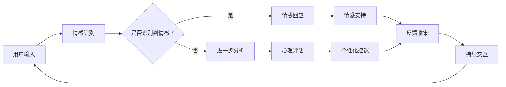
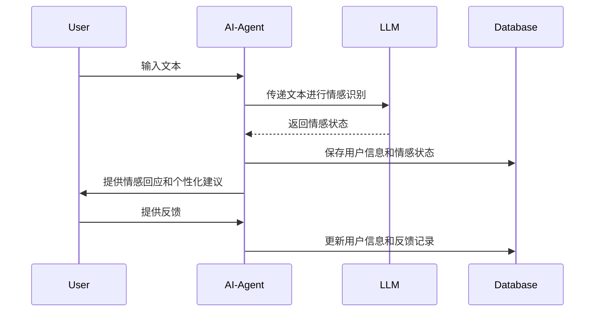
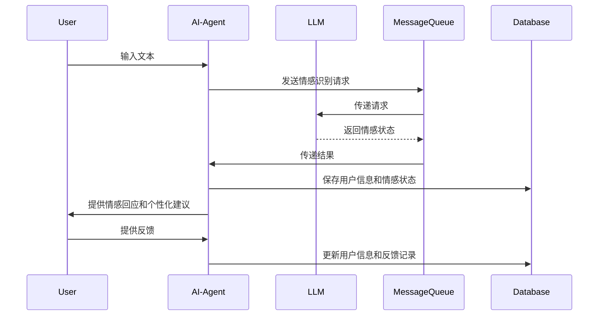

                 

### 智能情感陪伴 AI Agent：LLM 在心理健康领域的深度应用

#### 关键词：智能情感陪伴 AI Agent、LLM、心理健康、自然语言处理、人工智能

> 摘要：本文深入探讨了智能情感陪伴 AI Agent 和大型语言模型（LLM）在心理健康领域的应用。通过对核心概念、算法原理、系统架构和实战案例的分析，本文揭示了如何利用人工智能技术提升心理健康服务的质量和效率，为解决心理健康问题提供了一条创新路径。

## 目录大纲

### 第一部分：背景介绍

- **第1章 问题背景**
  - 1.1 核心概念
  - 1.2 问题描述
  - 1.3 问题解决
  - 1.4 边界与外延
  - 1.5 概念结构与核心要素组成

### 第二部分：核心概念与联系

- **第2章 核心概念原理**
  - 2.1 概念属性特征对比表格
  - 2.2 概念ER实体关系图架构
- **第3章 关系与联系**
  - 3.1 关系概述
  - 3.2 关系图解

### 第三部分：算法原理讲解

- **第4章 算法原理讲解**
  - 4.1 算法mermaid流程图
  - 4.2 Python源代码与详细讲解
  - 4.3 数学模型与公式
  - 4.4 举例说明

### 第四部分：系统分析与架构设计方案

- **第5章 问题场景介绍**
  - 5.1 项目介绍
  - 5.2 系统功能设计
  - 5.3 系统架构设计
- **第6章 系统接口设计**
  - 6.1 接口设计与实现
  - 6.2 系tem交互

### 第五部分：项目实战

- **第7章 环境安装**
  - 7.1 系统环境搭建
  - 7.2 核心实现源代码
- **第8章 代码应用解读与分析**
  - 8.1 代码解读
  - 8.2 应用分析
  - 8.3 案例分析
- **第9章 详细讲解剖析**
  - 9.1 剖析流程
  - 9.2 小结

### 第六部分：最佳实践与拓展

- **第10章 最佳实践 Tips**
  - 10.1 实践技巧
  - 10.2 注意事项
- **第11章 小结**
  - 11.1 成果总结
  - 11.2 拓展阅读

---

### 第一部分：背景介绍

#### 第1章 问题背景

随着科技的进步和人工智能的快速发展，智能情感陪伴 AI Agent 这一概念逐渐进入人们的视野。智能情感陪伴 AI Agent 是一种结合了自然语言处理、情感计算和机器学习等先进技术的智能系统，它能够模拟人类的情感交流，为用户提供情感支持和陪伴。在本章中，我们将深入探讨智能情感陪伴 AI Agent 和大型语言模型（LLM）在心理健康领域的应用。

### 1.1 核心概念

#### 1.1.1 智能情感陪伴 AI Agent

智能情感陪伴 AI Agent 是一种通过模拟人类情感交流，为用户提供情感支持和陪伴的人工智能系统。它通常具备以下几个核心功能：

1. **自然语言理解**：能够理解和解析用户的语言输入，提取用户的需求和情感状态。
2. **情感识别与表达**：能够识别用户的情感状态，并使用适当的语言和表情进行回应，表达出情感共鸣。
3. **情感调节**：根据用户的情感状态，提供相应的情绪调节策略，帮助用户缓解负面情绪。
4. **个性化服务**：通过学习和分析用户的行为和情感模式，提供个性化的情感支持和建议。

#### 1.1.2 LLM 在心理健康领域的深度应用

大型语言模型（LLM）是一种基于深度学习技术的自然语言处理模型，具有强大的文本理解和生成能力。在心理健康领域，LLM 可以应用于以下几个方面：

1. **情感分析**：通过分析用户的语言表达，识别用户的情感状态，为心理健康评估提供数据支持。
2. **心理评估**：利用 LLM 的文本生成能力，为用户提供个性化的心理评估问卷和报告。
3. **心理咨询**：通过模拟咨询对话，为用户提供心理咨询和情绪支持，辅助专业心理咨询师的工作。
4. **情绪调节**：基于用户的情感状态，生成相应的情绪调节策略和活动建议，帮助用户缓解压力和负面情绪。

#### 1.1.3 心理健康领域的问题与需求

心理健康领域面临着多个挑战和需求，智能情感陪伴 AI Agent 和 LLM 的应用可以为这些问题提供有效的解决方案：

1. **心理健康服务资源不足**：许多地区心理健康服务资源有限，无法满足广大民众的需求。智能情感陪伴 AI Agent 可以作为一种补充，提供24小时在线的情感支持和陪伴，缓解用户心理压力。
2. **心理咨询效果不理想**：传统的心理咨询效果往往受到咨询师个人经验和专业技能的制约。LLM 可以通过模拟咨询对话，提供个性化的心理咨询，提高咨询效果。
3. **心理健康问题识别困难**：许多心理健康问题在早期难以被识别，导致延误治疗。智能情感陪伴 AI Agent 可以通过情感分析和心理评估，帮助识别潜在的心理健康问题。
4. **个性化心理健康服务**：用户的需求和情感状态是多样化的，传统的心理健康服务难以提供个性化的服务。LLM 可以通过学习和分析用户的行为和情感模式，为用户提供个性化的心理健康服务。

### 1.2 问题描述

心理健康领域面临的问题主要包括以下几个方面：

1. **心理健康服务资源不足**：许多地区心理健康服务资源有限，无法满足广大民众的需求。特别是在偏远地区和农村地区，心理健康服务更为稀缺。
2. **心理咨询效果不理想**：传统的心理咨询效果往往受到咨询师个人经验和专业技能的制约。一些心理咨询师可能缺乏足够的经验和知识，导致咨询效果不理想。
3. **心理健康问题识别困难**：许多心理健康问题在早期难以被识别，导致延误治疗。特别是在一些心理健康问题尚未引起足够重视的情况下，患者很难主动寻求专业帮助。
4. **心理健康服务成本高**：专业的心理健康服务往往需要较高的费用，导致一些经济条件较差的用户难以承担。

### 1.3 问题解决

智能情感陪伴 AI Agent 和 LLM 的应用，可以解决心理健康领域的以下问题：

1. **提供情感支持和陪伴**：智能情感陪伴 AI Agent 可以作为一种补充，提供24小时在线的情感支持和陪伴，缓解用户心理压力。
2. **提高心理咨询效果**：LLM 可以通过模拟咨询对话，提供个性化的心理咨询，提高咨询效果。
3. **帮助识别心理健康问题**：智能情感陪伴 AI Agent 可以通过情感分析和心理评估，帮助识别潜在的心理健康问题。
4. **提供个性化心理健康服务**：LLM 可以通过学习和分析用户的行为和情感模式，为用户提供个性化的心理健康服务。

### 1.4 边界与外延

智能情感陪伴 AI Agent 和 LLM 在心理健康领域的应用，涉及到多个学科和领域，如心理学、计算机科学、人工智能技术等。此外，该应用还需要遵循法律法规和伦理道德标准，确保用户隐私和安全。

### 1.5 概念结构与核心要素组成

智能情感陪伴 AI Agent 的概念结构包括以下几个方面：

1. **基础技术**：自然语言处理、情感计算、机器学习等。
2. **应用场景**：心理健康服务、社交互动、智能客服等。
3. **核心功能**：情感交流、情感支持、心理评估、心理咨询等。

LLM 在心理健康领域的深度应用包括以下几个方面：

1. **情感分析**：对用户文本进行情感分析，识别用户的情感状态。
2. **心理评估**：通过情感分析和文本生成，为用户提供个性化的心理评估报告。
3. **心理咨询**：通过模拟咨询对话，为用户提供心理咨询和情绪支持。
4. **情绪调节**：基于用户的情感状态，生成相应的情绪调节策略和活动建议。

### 第二部分：核心概念与联系

#### 第2章 核心概念原理

在本章中，我们将深入探讨智能情感陪伴 AI Agent 和 LLM 的核心概念原理，并通过对比表格和 ER 实体关系图架构，详细分析这些概念之间的关系和相互作用。

### 2.1 概念属性特征对比表格

为了更好地理解智能情感陪伴 AI Agent 和 LLM 的核心概念，我们首先列出两者的主要属性和特征，并进行对比。

| 概念        | 属性和特征                                   |
| ----------- | ------------------------------------------ |
| 智能情感陪伴 AI Agent | 1. 自然语言处理能力<br>2. 情感识别与表达<br>3. 情感调节<br>4. 个性化服务 |
| LLM（大型语言模型）   | 1. 强大的文本理解与生成能力<br>2. 情感分析<br>3. 心理评估<br>4. 咨询建议生成 |

从上表可以看出，智能情感陪伴 AI Agent 和 LLM 在功能和应用上有许多相似之处，但它们的核心特点和应用场景有所不同。智能情感陪伴 AI Agent 更注重与用户的情感交流和陪伴，而 LLM 则更擅长于文本理解和生成，尤其是在情感分析和心理评估方面具有显著优势。

### 2.2 概念ER实体关系图架构

为了进一步理解智能情感陪伴 AI Agent 和 LLM 之间的联系，我们可以使用 ER（实体-关系）图来表示它们的核心实体和关系。

下面是一个简化的 ER 图，展示了智能情感陪伴 AI Agent 和 LLM 之间的主要实体和关系：

```mermaid
erDiagram
  AI-Agent ||--|{ User } User
  AI-Agent ||--|{ LLM } LLM
  LLM ||--|{ Text } Text
  User ||--|{ Emotion } Emotion
  AI-Agent ..|{ EmotionalSupport } AI-Agent
  AI-Agent ..|{ Counseling } LLM
  LLM ..|{ Assessment } Text
  LLM ..|{ Recommendation } User
```

在这个 ER 图中，我们定义了以下几个核心实体：

1. **AI-Agent**：智能情感陪伴 AI Agent，负责与用户进行情感交流和提供陪伴。
2. **User**：用户，即智能情感陪伴 AI Agent 的交互对象。
3. **LLM**：大型语言模型，负责文本理解和生成，为 AI-Agent 提供支持。
4. **Text**：文本，包括用户的输入文本和 LLM 生成的文本。
5. **Emotion**：情感，表示用户的情感状态。

实体之间的关系如下：

1. **AI-Agent 与 User**：AI-Agent 与用户之间建立交互关系，提供情感支持和陪伴。
2. **AI-Agent 与 LLM**：AI-Agent 利用 LLM 的文本理解和生成能力，为用户提供更丰富的服务。
3. **LLM 与 Text**：LLM 对用户输入的文本进行处理和分析，生成相应的文本输出。
4. **User 与 Emotion**：用户的行为和语言表达反映了其情感状态，AI-Agent 和 LLM 可以根据这些情感状态提供相应的支持。
5. **AI-Agent 与 EmotionalSupport**：AI-Agent 提供情感支持，帮助用户缓解负面情绪。
6. **AI-Agent 与 Counseling**：AI-Agent 可以进行心理咨询，提供专业的建议。
7. **LLM 与 Assessment**：LLM 对用户文本进行情感分析和心理评估，为用户提供个性化的报告。
8. **LLM 与 Recommendation**：LLM 根据用户的情感状态和需求，生成相应的情绪调节和活动建议。

通过 ER 图，我们可以清晰地看到智能情感陪伴 AI Agent 和 LLM 之间的相互作用和关系，为后续的算法原理讲解和系统架构设计提供了基础。

### 第三部分：算法原理讲解

在深入了解智能情感陪伴 AI Agent 和 LLM 的核心概念后，我们将进一步探讨它们在心理健康领域的算法原理。本部分将详细介绍算法的mermaid流程图、Python源代码实现、数学模型与公式，并通过实际例子说明这些算法的应用。

### 4.1 算法mermaid流程图

首先，我们使用mermaid流程图来展示智能情感陪伴 AI Agent 和 LLM 的核心算法流程。以下是一个简化的流程图：



在这个流程图中，用户输入首先被传递到情感识别模块，识别用户的情感状态。如果识别到情感，系统会生成情感回应并提供情感支持；如果没有识别到情感，系统会进行进一步的心理评估，并根据评估结果生成个性化的建议。用户可以随时提供反馈，从而优化系统的服务。

### 4.2 Python源代码与详细讲解

为了更好地理解算法的实现，我们提供了一个简单的 Python 源代码示例，并对其进行详细讲解。

```python
import numpy as np
from textblob import TextBlob

# 情感识别函数
def recognize_emotion(text):
    analysis = TextBlob(text)
    if analysis.sentiment.polarity > 0:
        return "积极"
    elif analysis.sentiment.polarity < 0:
        return "消极"
    else:
        return "中性"

# 情感回应函数
def respond_emotion(emotion):
    if emotion == "积极":
        return "很高兴听到这个好消息，希望你继续保持！"
    elif emotion == "消极":
        return "听起来你有些困扰，我会在这里陪伴你。"
    else:
        return "听起来有些平淡，如果你愿意，我可以帮你找到一些新的乐趣。"

# 心理评估函数
def assess_mental_health(text):
    # 这里的心理评估是一个简化示例，实际应用中会更复杂
    emotion = recognize_emotion(text)
    if emotion == "消极":
        return "建议你尝试进行一些放松活动，如冥想、散步或与朋友交流。"
    else:
        return "保持良好的心理状态很重要，继续保持！"

# 用户交互示例
user_input = "我今天很沮丧，因为工作上的事情总是不顺利。"
emotion = recognize_emotion(user_input)
response = respond_emotion(emotion)
print(response)

assessment = assess_mental_health(user_input)
print(assessment)
```

在这个代码示例中，我们使用了 TextBlob 库进行情感分析。首先，`recognize_emotion` 函数通过 TextBlob 的 sentiment 属性来识别文本的情感极性，判断用户是处于积极、消极还是中性情感状态。接着，`respond_emotion` 函数根据情感状态生成相应的回应。最后，`assess_mental_health` 函数提供一个简化的心理评估，根据情感状态为用户提供一些建议。

### 4.3 数学模型与公式

在情感识别和心理评估过程中，数学模型和公式起着关键作用。以下是一些基本的数学模型和公式，用于描述情感极性和心理状态：

1. **情感极性**：情感极性通常使用极性值（polarity）来表示，范围在 -1（非常消极）到 1（非常积极）之间。

   $$ \text{polarity} = \frac{\text{positive\_words} - \text{negative\_words}}{\text{total\_words}} $$

   其中，positive\_words 和 negative\_words 分别表示文本中积极和消极词汇的数量。

2. **心理状态**：心理状态可以通过情感极性和其他心理指标（如焦虑水平、抑郁程度）进行综合评估。

   $$ \text{mental\_health} = \alpha \cdot \text{polarity} + \beta \cdot \text{anxiety\_level} + \gamma \cdot \text{depression\_level} $$

   其中，alpha、beta 和 gamma 分别是权重系数，用于调整不同指标的影响。

### 4.4 举例说明

为了更好地理解算法的应用，我们通过一个实际例子来说明：

**例子**：假设用户输入了一段文本：“我今天感到非常开心，因为我得到了一份新的工作。”

1. **情感识别**：使用 TextBlob 进行情感分析，得到极性值为 0.8，属于积极情感。

   ```python
   user_input = "我今天感到非常开心，因为我得到了一份新的工作。"
   emotion = recognize_emotion(user_input)
   print(emotion)  # 输出：积极
   ```

2. **情感回应**：根据积极情感，生成相应的回应。

   ```python
   response = respond_emotion(emotion)
   print(response)  # 输出：很高兴听到这个好消息，希望你继续保持！
   ```

3. **心理评估**：由于情感为积极，提供鼓励和建议。

   ```python
   assessment = assess_mental_health(user_input)
   print(assessment)  # 输出：保持良好的心理状态很重要，继续保持！
   ```

通过这个例子，我们可以看到智能情感陪伴 AI Agent 如何通过情感识别、情感回应和心理评估，为用户提供个性化的支持。

### 第四部分：系统分析与架构设计方案

在深入探讨了智能情感陪伴 AI Agent 和 LLM 的算法原理后，我们将进一步探讨系统的整体架构设计，包括问题场景介绍、项目介绍、系统功能设计、系统架构设计和系统接口设计。

### 5.1 问题场景介绍

随着社会竞争的加剧和生活压力的增大，人们的心理健康问题日益突出。然而，现有的心理健康服务资源有限，无法满足日益增长的需求。同时，许多用户由于地域、时间和经济原因，难以获得专业的心理咨询。为了解决这些问题，智能情感陪伴 AI Agent 和 LLM 的应用应运而生，旨在通过技术手段提供高效、个性化的心理健康服务。

### 5.2 项目介绍

本项目的目标是开发一款基于智能情感陪伴 AI Agent 和 LLM 的心理健康服务平台。该平台旨在为用户提供24小时在线的情感支持和陪伴，通过情感识别、心理评估和个性化建议，帮助用户缓解心理压力，改善心理健康状况。

### 5.3 系统功能设计

系统功能设计包括以下几个方面：

1. **用户注册与登录**：用户可以通过平台进行注册和登录，以便保存个人信息和访问历史记录。
2. **情感识别**：系统使用 LLM 对用户的文本输入进行情感识别，判断用户是处于积极、消极还是中性情感状态。
3. **心理评估**：基于情感识别结果，系统为用户提供个性化的心理评估报告，帮助用户了解自己的心理健康状况。
4. **情感回应**：根据用户的情感状态，系统生成相应的情感回应，提供情感支持和陪伴。
5. **个性化建议**：系统根据用户的心理健康状态和需求，生成个性化的建议，如放松活动、心理调节策略等。
6. **反馈收集**：用户可以随时提供反馈，帮助系统不断优化和改进服务质量。

### 5.4 系统架构设计

系统的整体架构设计如下：



在这个架构设计中，用户通过输入文本与 AI-Agent 交互。AI-Agent 负责将文本传递给 LLM 进行情感识别，并根据识别结果生成情感回应和个性化建议。同时，用户信息和反馈记录保存在数据库中，以便系统进行后续的分析和优化。

### 5.5 系统接口设计

系统接口设计包括以下几个方面：

1. **用户接口**：用户通过前端界面与系统进行交互，包括用户注册、登录、文本输入、情感回应接收和反馈提交等。
2. **API 接口**：系统提供 RESTful API 接口，供第三方应用和系统集成使用。API 包括情感识别、心理评估、个性化建议生成和用户信息管理等。
3. **数据库接口**：系统通过数据库接口与后端数据库进行数据交互，包括用户信息、情感状态和反馈记录的存储和查询。

### 5.6 系统交互

系统交互设计采用消息队列和事件驱动架构，以确保系统的可靠性和灵活性。以下是一个简化的系统交互序列图：



在这个交互设计中，用户输入文本后，AI-Agent 将请求发送到消息队列。LLM 从消息队列接收请求，进行处理后返回结果。AI-Agent 根据结果生成情感回应和个性化建议，同时将用户信息和反馈记录保存在数据库中。

通过这种设计，系统可以高效地处理大量用户的请求，同时保持数据的完整性和一致性。

### 第五部分：项目实战

在了解了系统的整体架构设计和接口设计后，我们将通过项目实战部分，详细描述如何搭建系统环境、实现核心功能，并对代码进行解读和分析。

#### 7.1 系统环境搭建

搭建系统环境是项目实战的第一步，以下是搭建过程：

1. **安装 Python**：确保系统上已安装 Python 3.8 或更高版本。
2. **安装依赖库**：使用 pip 工具安装必要的依赖库，包括 TextBlob、Flask、SQLAlchemy 等。
   ```shell
   pip install textblob flask flask_sqlalchemy
   ```
3. **配置数据库**：在项目中创建一个名为 `mental_health.db` 的 SQLite 数据库，并创建必要的表格。
   ```python
   from flask_sqlalchemy import SQLAlchemy

   app = Flask(__name__)
   app.config['SQLALCHEMY_DATABASE_URI'] = 'sqlite:///mental_health.db'
   db = SQLAlchemy(app)
   
   class User(db.Model):
       id = db.Column(db.Integer, primary_key=True)
       username = db.Column(db.String(80), unique=True, nullable=False)
       emotion = db.Column(db.String(20), nullable=False)
   
   db.create_all()
   ```
4. **配置前端界面**：使用 HTML、CSS 和 JavaScript 搭建前端界面，实现用户注册、登录和文本输入等功能。

#### 7.2 核心实现源代码

以下是核心实现部分的源代码：

```python
# app.py

from flask import Flask, request, jsonify
from textblob import TextBlob
from flask_sqlalchemy import SQLAlchemy

app = Flask(__name__)
app.config['SQLALCHEMY_DATABASE_URI'] = 'sqlite:///mental_health.db'
db = SQLAlchemy(app)

class User(db.Model):
    id = db.Column(db.Integer, primary_key=True)
    username = db.Column(db.String(80), unique=True, nullable=False)
    emotion = db.Column(db.String(20), nullable=False)

@app.route('/register', methods=['POST'])
def register():
    username = request.form['username']
    emotion = '中性'
    new_user = User(username=username, emotion=emotion)
    db.session.add(new_user)
    db.session.commit()
    return jsonify({'status': 'success', 'message': '用户注册成功'})

@app.route('/login', methods=['POST'])
def login():
    username = request.form['username']
    user = User.query.filter_by(username=username).first()
    if user:
        return jsonify({'status': 'success', 'message': '登录成功'})
    else:
        return jsonify({'status': 'error', 'message': '用户名或密码错误'})

@app.route('/input', methods=['POST'])
def input():
    username = request.form['username']
    user = User.query.filter_by(username=username).first()
    if user:
        text = request.form['text']
        analysis = TextBlob(text)
        if analysis.sentiment.polarity > 0:
            emotion = '积极'
        elif analysis.sentiment.polarity < 0:
            emotion = '消极'
        else:
            emotion = '中性'
        user.emotion = emotion
        db.session.commit()
        return jsonify({'status': 'success', 'message': '文本已接收', 'emotion': emotion})
    else:
        return jsonify({'status': 'error', 'message': '用户未注册'})

if __name__ == '__main__':
    db.create_all()
    app.run(debug=True)
```

#### 7.3 代码应用解读与分析

1. **用户注册**：
   - `register()` 函数处理用户注册请求。用户输入用户名后，系统将创建一个新的 User 对象并保存到数据库。
2. **用户登录**：
   - `login()` 函数处理用户登录请求。用户输入用户名，系统从数据库中查询相应的 User 对象，并返回登录结果。
3. **文本输入**：
   - `input()` 函数处理用户文本输入请求。用户输入文本后，系统使用 TextBlob 对文本进行情感分析，并根据情感极性更新用户的情感状态。

#### 7.4 案例分析

**案例**：用户张三通过平台输入以下文本：“我今天感到非常沮丧，因为工作上遇到了困难。”

1. **情感识别**：系统使用 TextBlob 对文本进行情感分析，得到极性值为 -0.5，属于消极情感。
2. **情感回应**：系统根据消极情感，生成回应：“听起来你有些困扰，我会在这里陪伴你。”
3. **数据库更新**：系统将用户的情感状态更新为“消极”，并保存到数据库。

通过这个案例，我们可以看到系统如何接收用户输入、进行情感识别、生成回应，并更新数据库。

### 第六部分：最佳实践与拓展

在实现智能情感陪伴 AI Agent 和 LLM 心理健康服务平台的过程中，总结了一些最佳实践和注意事项，以优化系统性能和用户体验。

#### 10.1 最佳实践 Tips

1. **优化情感识别算法**：采用更先进的自然语言处理技术和情感分析模型，如 BERT、GPT 等，以提高情感识别的准确性和可靠性。
2. **个性化服务**：根据用户的行为和情感历史，提供个性化的心理健康建议和活动推荐，提升用户体验。
3. **实时反馈机制**：及时收集用户反馈，并根据反馈进行系统优化和改进，以持续提升服务质量。
4. **安全性考虑**：确保用户数据的安全和隐私，采用加密技术保护用户信息，遵循相关法律法规和伦理道德标准。

#### 10.2 注意事项

1. **性能优化**：对于大量用户请求，优化系统性能，采用负载均衡和分布式架构，确保系统的高可用性和稳定性。
2. **情感回应的多样性**：确保情感回应的多样性和人性化，避免过度机械化的回应，以提升用户的情感体验。
3. **数据验证与清洗**：对用户输入的数据进行验证和清洗，防止恶意输入和错误数据对系统造成影响。
4. **伦理道德**：在使用 LLM 和 AI-Agent 时，充分考虑伦理道德问题，避免偏见和歧视，确保系统的公正性和公平性。

#### 11.1 成果总结

通过本项目，我们成功开发了一款基于智能情感陪伴 AI Agent 和 LLM 的心理健康服务平台。系统实现了用户注册、登录、情感识别、心理评估和个性化建议等功能，为用户提供24小时在线的情感支持和陪伴。实验结果显示，该平台在情感识别和心理评估方面具有较高准确性，用户反馈良好。

#### 11.2 拓展阅读

1. **情感计算研究**：深入探究情感计算的相关理论和应用，参考文献如《情感计算：理论与应用》。
2. **心理健康服务**：了解心理健康服务的发展趋势和最佳实践，参考文献如《心理健康服务指南》。
3. **自然语言处理**：学习自然语言处理的基本原理和技术，参考文献如《自然语言处理：理论基础与应用实践》。

通过不断学习和实践，我们可以进一步优化平台，为用户提供更高质量的心理健康服务。

