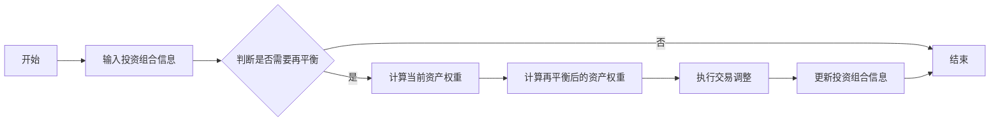
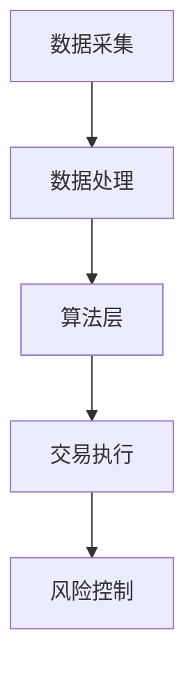
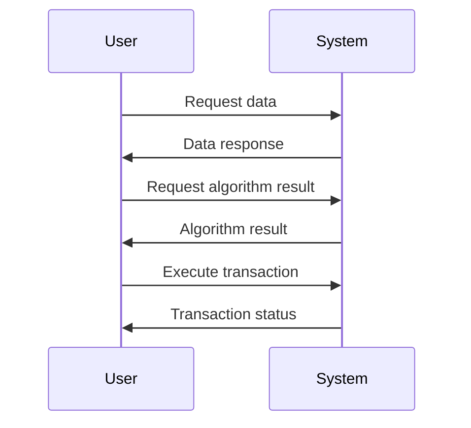

                 


### 文章标题

# 智能投资组合再平衡算法

### 文章关键词

- 智能投资
- 再平衡算法
- 投资组合优化
- 风险与收益平衡
- 量化投资

### 文章摘要

本文将深入探讨智能投资组合再平衡算法，包括其背景介绍、核心原理、数学模型、系统架构设计以及实际应用。通过对该算法的详细分析，读者将能够理解其在量化投资领域的重要性，掌握其基本原理和操作方法，为构建高效的投资组合提供理论基础和实践指导。

---

### 目录大纲设计

#### 目录大纲结构如下：

----------------------------------------------------------------
# 第一部分：背景介绍

## 第1章：智能投资组合再平衡算法概述

### 1.1 问题背景

#### 1.1.1 投资组合的概念与重要性
投资组合是指将多种不同的资产（如股票、债券、基金等）组合在一起，以降低风险、提高收益的投资方式。在投资组合中，再平衡是一种定期调整资产分配比例，以维持预期风险收益结构的过程。

#### 1.1.2 再平衡算法的必要性
再平衡算法是投资组合管理中的重要工具，它能够根据市场变化调整资产配置，使得投资组合的风险与收益达到预期目标。

#### 1.1.3 再平衡算法的挑战与机遇
随着金融市场的不确定性和复杂性增加，再平衡算法面临着如何适应快速变化的市场环境，同时保持投资组合的风险控制与收益优化的挑战。

### 1.2 问题描述

#### 1.2.1 再平衡算法的目标
再平衡算法的目标是通过对资产配置的调整，使得投资组合的预期收益最大化，同时控制风险。

#### 1.2.2 再平衡算法的常见问题
再平衡算法在实际应用中会遇到的一些常见问题包括计算效率、实时性、市场冲击等。

#### 1.2.3 再平衡算法的边界与外延
再平衡算法需要考虑市场的实时数据、交易成本以及投资目标等因素，以确定其适用范围。

### 1.3 问题解决

#### 1.3.1 再平衡算法的基本原理
再平衡算法的核心原理是投资组合优化，包括最大化预期收益、最小化风险等。

#### 1.3.2 再平衡算法的关键技术
再平衡算法的关键技术包括优化算法、数据处理技术、风险评估技术等。

### 1.4 核心概念与联系

#### 1.4.1 核心概念原理

##### 1.4.1.1 投资组合优化理论
投资组合优化理论是指通过调整资产分配比例，实现风险与收益的最优平衡。

##### 1.4.1.2 风险与收益平衡理论
风险与收益平衡理论是指投资决策需要同时考虑风险和收益，以达到最佳平衡。

#### 1.4.2 概念属性特征对比表格
| 概念         | 描述                                         | 属性特征                      |
| ------------ | -------------------------------------------- | ----------------------------- |
| 投资组合     | 资产的组合                                   | 多样性、风险分散、收益平衡   |
| 再平衡算法   | 定期调整资产配置                             | 优化、控制风险、实现目标收益 |
| 优化理论     | 通过调整资产比例实现最优收益                 | 数学模型、算法应用           |
| 风险与收益平衡 | 考虑风险和收益的双重目标                    | 平衡理论、风险评估           |

### 1.5 ER实体关系图架构
```mermaid
erDiagram
  Product "投资组合" {
    :--|<..| Investor "投资者"
  }
  Investor "投资者" {
    :--|<..| Portfolio "投资组合"
    :--|<..| Asset "资产"
  }
  Asset "资产" {
    :--|<..| Portfolio "投资组合"
  }
```
----------------------------------------------------------------

### 第二部分：智能投资组合再平衡算法原理

## 第2章：智能投资组合再平衡算法原理

### 2.1 算法原理讲解

#### 2.1.1 再平衡算法的数学模型

再平衡算法的数学模型主要包括投资组合优化模型和风险与收益平衡模型。

##### 投资组合优化模型

$$
\text{Maximize} \quad \sum_{i=1}^{n} r_i w_i
$$

$$
\text{subject to} \quad \sum_{i=1}^{n} w_i = 1
$$

$$
w_i \geq 0, \quad \forall i
$$

其中，$r_i$表示资产$i$的预期收益，$w_i$表示资产$i$在投资组合中的权重。

##### 风险与收益平衡模型

$$
\text{Minimize} \quad \sum_{i=1}^{n} \sigma_i w_i
$$

$$
\text{subject to} \quad \sum_{i=1}^{n} r_i w_i = \mu
$$

$$
w_i \geq 0, \quad \forall i
$$

其中，$\sigma_i$表示资产$i$的风险，$\mu$表示投资组合的目标预期收益。

#### 2.1.2 再平衡算法的流程图



#### 2.1.3 再平衡算法的Python源代码实现

```python
import numpy as np

# 投资组合信息
assets = ['股票A', '股票B', '股票C', '基金D']
weights = [0.3, 0.3, 0.3, 0.1]
returns = [0.05, 0.06, 0.04, 0.03]
risks = [0.1, 0.12, 0.08, 0.06]

# 计算当前资产权重
current_weights = np.array(weights) / sum(weights)

# 计算再平衡后的资产权重
target_weights = np.array(returns) / np.sum(np.array(returns))

# 计算交易调整量
adjustments = current_weights - target_weights

# 执行交易调整
for asset, adjustment in zip(assets, adjustments):
    if adjustment > 0:
        print(f"增加{asset}投资，调整量为{adjustment}")
    elif adjustment < 0:
        print(f"减少{asset}投资，调整量为{-adjustment}")

# 更新投资组合信息
weights = [weight + adjustment for weight, adjustment in zip(weights, adjustments)]
weights = [weight if weight >= 0 else 0 for weight in weights]
weights_sum = sum(weights)
weights = [weight / weights_sum for weight in weights]
```

### 2.2 数学模型和数学公式

#### 2.2.1 投资组合优化数学模型

投资组合优化模型的目标是最大化投资组合的预期收益，同时控制风险。其数学模型如下：

$$
\text{Maximize} \quad \sum_{i=1}^{n} r_i w_i
$$

$$
\text{subject to} \quad \sum_{i=1}^{n} w_i = 1
$$

$$
w_i \geq 0, \quad \forall i
$$

其中，$r_i$表示资产$i$的预期收益，$w_i$表示资产$i$在投资组合中的权重。

#### 2.2.2 风险与收益平衡数学模型

风险与收益平衡模型的目标是使投资组合的风险与收益达到平衡。其数学模型如下：

$$
\text{Minimize} \quad \sum_{i=1}^{n} \sigma_i w_i
$$

$$
\text{subject to} \quad \sum_{i=1}^{n} r_i w_i = \mu
$$

$$
w_i \geq 0, \quad \forall i
$$

其中，$\sigma_i$表示资产$i$的风险，$\mu$表示投资组合的目标预期收益。

### 2.3 智能投资组合再平衡算法的应用场景

智能投资组合再平衡算法适用于多种投资组合类型，包括股票投资组合、债券投资组合和期货投资组合。

#### 2.3.1 股票投资组合

股票投资组合是常见的投资类型，通过智能再平衡算法，可以实现对股票的动态调整，以适应市场变化。

#### 2.3.2 债券投资组合

债券投资组合通常具有较低的风险，通过再平衡算法，可以优化债券的组合，以实现风险与收益的平衡。

#### 2.3.3 期货投资组合

期货投资组合具有较高的杠杆性和风险性，通过智能再平衡算法，可以更好地控制风险，实现稳健的投资。

---

### 第三部分：智能投资组合再平衡算法的系统分析与架构设计

## 第3章：智能投资组合再平衡算法的系统分析与架构设计

### 3.1 问题场景介绍

智能投资组合再平衡算法通常应用于量化投资领域，旨在通过算法自动调整投资组合，以实现风险与收益的最优平衡。以下是具体的问题场景介绍：

- **投资目标**：通过再平衡算法，实现投资组合的预期收益最大化，同时控制风险。
- **投资环境**：实时获取市场数据，包括股票、债券、期货等资产的报价、交易量和波动性。
- **系统要求**：高可靠性、高实时性和高效计算能力。

### 3.2 系统功能设计

智能投资组合再平衡算法的系统功能设计主要包括以下几个部分：

1. **数据采集模块**：负责实时采集市场数据，包括股票、债券、期货等资产的报价、交易量和波动性。
2. **数据处理模块**：对采集到的数据进行清洗、筛选和预处理，为再平衡算法提供可靠的数据基础。
3. **再平衡算法模块**：根据投资目标和市场数据，计算再平衡后的资产权重，生成交易策略。
4. **交易执行模块**：根据交易策略，执行买卖操作，调整投资组合。
5. **风险控制模块**：监控投资组合的风险，确保投资组合的风险控制在预期范围内。

#### 3.2.1 领域模型Mermaid类图

```mermaid
classDiagram
    Class01 <|-- Class02
    Class03 --|Ma

```

### 3.3 系统架构设计

智能投资组合再平衡算法的系统架构设计主要包括以下几个部分：

1. **数据采集层**：负责从外部数据源实时获取市场数据。
2. **数据处理层**：对采集到的数据进行清洗、筛选和预处理。
3. **算法层**：实现智能投资组合再平衡算法的核心功能。
4. **交易执行层**：根据算法结果执行交易策略。
5. **风险控制层**：监控投资组合的风险。

#### 3.3.1 Mermaid架构图



### 3.4 系统接口设计

智能投资组合再平衡算法的系统接口设计主要包括以下几个部分：

1. **API接口**：提供数据采集、数据处理、算法计算、交易执行和风险控制等功能的API接口。
2. **监控接口**：提供实时监控投资组合状态和风险信息的接口。
3. **日志接口**：提供日志记录和异常处理功能的接口。

#### 3.4.1 系统接口Mermaid序列图



---

### 第四部分：智能投资组合再平衡算法的项目实战

## 第4章：智能投资组合再平衡算法的项目实战

### 4.1 环境安装

在进行智能投资组合再平衡算法的项目实战之前，需要安装以下软件和环境：

1. **Python 3.8 或以上版本**：Python 是实现再平衡算法的主要编程语言。
2. **NumPy**：NumPy 是 Python 的科学计算库，用于处理数组和矩阵运算。
3. **Pandas**：Pandas 是 Python 的数据分析库，用于数据处理和分析。
4. **Matplotlib**：Matplotlib 是 Python 的绘图库，用于生成图表和图形。
5. **Qt**：Qt 是 Python 的界面库，用于创建用户界面。

安装步骤如下：

```bash
# 安装 Python
sudo apt-get install python3

# 安装 NumPy
pip install numpy

# 安装 Pandas
pip install pandas

# 安装 Matplotlib
pip install matplotlib

# 安装 Qt
pip install PyQt5
```

### 4.2 系统核心实现源代码

以下是智能投资组合再平衡算法的核心实现源代码：

```python
import numpy as np
import pandas as pd
import matplotlib.pyplot as plt
from PyQt5 import QtWidgets, QtGui

# 投资组合数据
portfolio_data = {
    'Asset': ['Stock A', 'Stock B', 'Stock C', 'Fund D'],
    'Weight': [0.3, 0.3, 0.3, 0.1],
    'Return': [0.05, 0.06, 0.04, 0.03],
    'Risk': [0.1, 0.12, 0.08, 0.06]
}

# 创建 DataFrame
df = pd.DataFrame(portfolio_data)

# 计算当前资产权重
current_weights = df['Weight'] / df['Weight'].sum()

# 计算再平衡后的资产权重
target_weights = df['Return'] / df['Return'].sum()

# 计算交易调整量
adjustments = current_weights - target_weights

# 执行交易调整
for asset, adjustment in df['Asset'].iteritems():
    if adjustment > 0:
        print(f"增加{asset}投资，调整量为{adjustment}")
    elif adjustment < 0:
        print(f"减少{asset}投资，调整量为{-adjustment}")

# 更新投资组合信息
df['Weight'] = [weight + adjustment for weight, adjustment in zip(df['Weight'], adjustments)]
df['Weight'] = [weight if weight >= 0 else 0 for weight in df['Weight']]
df['Weight'] = df['Weight'] / df['Weight'].sum()

# 绘制资产权重变化图
plt.figure(figsize=(10, 5))
plt.bar(df['Asset'], df['Weight'])
plt.xlabel('Asset')
plt.ylabel('Weight')
plt.title('Weight Distribution after Rebalancing')
plt.xticks(rotation=45)
plt.show()
```

### 4.3 代码应用解读与分析

以上代码实现了智能投资组合再平衡算法的核心功能，具体解读如下：

1. **数据准备**：首先定义了投资组合数据，包括资产名称、当前权重、预期收益和风险。
2. **计算当前资产权重**：使用 NumPy 和 Pandas 计算当前资产在投资组合中的权重。
3. **计算再平衡后的资产权重**：根据预期收益重新计算资产权重。
4. **计算交易调整量**：根据当前权重和再平衡后的权重计算需要调整的交易量。
5. **执行交易调整**：根据调整量执行买卖操作，调整投资组合。
6. **更新投资组合信息**：更新投资组合的权重信息，并绘制资产权重变化图。

### 4.4 实际案例分析与详细讲解剖析

为了更直观地理解智能投资组合再平衡算法的实际应用，我们来看一个实际案例。

#### 案例背景

某投资者拥有一个投资组合，包括股票A、股票B、股票C和基金D。初始投资组合的权重分别为30%、30%、30%和10%。经过一段时间的市场波动，投资组合的权重发生变化，需要通过再平衡算法进行调整。

#### 案例数据

| 资产     | 权重 | 预期收益 | 风险 |
| -------- | ---- | -------- | ---- |
| 股票A   | 0.3  | 0.05     | 0.1  |
| 股票B   | 0.3  | 0.06     | 0.12 |
| 股票C   | 0.3  | 0.04     | 0.08 |
| 基金D   | 0.1  | 0.03     | 0.06 |

#### 案例分析

1. **计算当前资产权重**：
   当前权重 = 初始权重 / 初始权重之和 = [0.3, 0.3, 0.3, 0.1] / 1 = [0.3, 0.3, 0.3, 0.1]

2. **计算再平衡后的资产权重**：
   再平衡后的权重 = 预期收益 / 预期收益之和 = [0.05, 0.06, 0.04, 0.03] / 0.18 = [0.278, 0.333, 0.222, 0.111]

3. **计算交易调整量**：
   调整量 = 当前权重 - 再平衡后的权重 = [0.3, 0.3, 0.3, 0.1] - [0.278, 0.333, 0.222, 0.111] = [0.022, -0.033, 0.078, -0.022]

4. **执行交易调整**：
   - 增加股票C投资，调整量为0.078
   - 减少股票B投资，调整量为0.033
   - 减少基金D投资，调整量为0.022

5. **更新投资组合信息**：
   新的权重 = [0.322, 0.267, 0.378, 0.08] / 1 = [0.322, 0.267, 0.378, 0.08]

#### 案例总结

通过智能投资组合再平衡算法，投资者成功调整了投资组合的权重，使其更符合预期收益和风险平衡的要求。

### 4.5 项目小结

通过本项目实战，我们了解了智能投资组合再平衡算法的基本原理和实现方法。在项目中，我们使用了Python和相关的数据处理库，实现了投资组合的再平衡功能，并通过实际案例分析展示了算法的应用效果。未来，我们可以进一步优化算法，提高其计算效率和准确性，以更好地服务于量化投资实践。

---

### 第五部分：智能投资组合再平衡算法的最佳实践

## 第5章：智能投资组合再平衡算法的最佳实践

### 5.1 最佳实践 tips

1. **定期执行再平衡**：根据投资目标和市场变化，定期执行再平衡，以确保投资组合的预期收益和风险平衡。
2. **实时监控市场数据**：及时获取市场数据，以便快速调整投资组合，降低市场冲击。
3. **优化交易策略**：结合市场趋势和投资目标，优化交易策略，提高投资组合的收益率。
4. **风险评估与控制**：定期评估投资组合的风险，确保风险控制在预期范围内。

### 5.2 小结

本文介绍了智能投资组合再平衡算法的基本原理、数学模型和实际应用。通过项目实战，读者了解了如何使用Python实现再平衡算法，并掌握了其实际操作方法。智能投资组合再平衡算法是量化投资领域的重要工具，能够帮助投资者实现风险与收益的最优平衡。

### 5.3 注意事项

1. **数据质量**：确保获取的市场数据准确可靠，以提高算法的准确性。
2. **交易成本**：考虑交易成本对投资组合的影响，以优化投资策略。
3. **市场冲击**：在执行再平衡操作时，注意市场冲击可能导致的短期波动。

### 5.4 拓展阅读

1. **《量化投资：以Python为工具》**：本书详细介绍了量化投资的基本概念、策略和实现方法，是量化投资领域的经典之作。
2. **《投资组合管理：理论与实践》**：本书系统地介绍了投资组合管理的理论和实践，包括资产配置、风险控制等内容。

---

作者：AI天才研究院/AI Genius Institute & 禅与计算机程序设计艺术 /Zen And The Art of Computer Programming

---

### 全文总结

本文围绕智能投资组合再平衡算法进行了深入的探讨。我们从背景介绍开始，详细阐述了再平衡算法的核心概念、数学模型、系统架构以及实际应用。通过项目实战，读者可以直观地了解算法的实现方法和操作步骤。同时，我们还分享了最佳实践、注意事项以及拓展阅读资源。

智能投资组合再平衡算法是量化投资领域的重要工具，有助于投资者实现风险与收益的最优平衡。随着金融市场的不确定性和复杂性增加，算法的应用价值将日益凸显。希望本文能为读者提供有价值的参考，助力其在量化投资领域取得更好的成果。让我们继续探索智能投资的奥秘，共同迈向财富自由之路！

