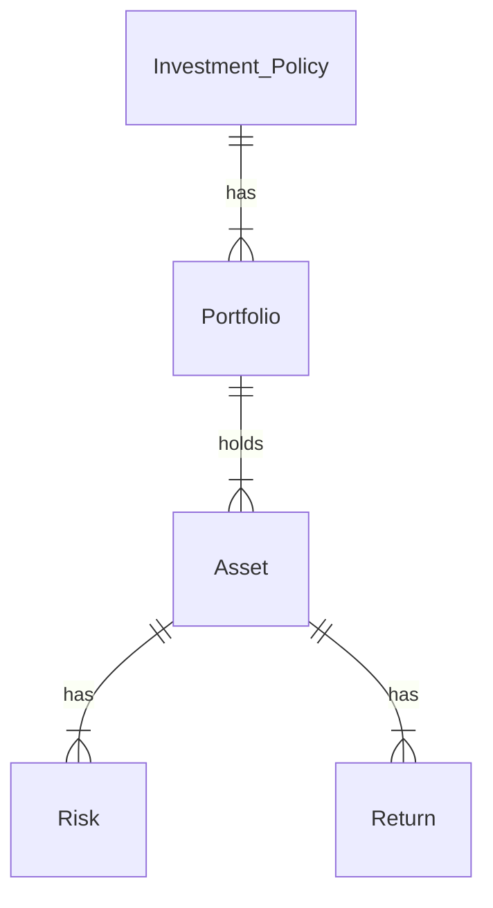
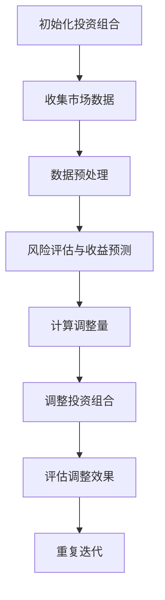

                 

# 智能投资组合多周期再平衡策略

## 关键词
- 投资组合
- 再平衡策略
- 多周期优化
- 智能算法
- 风险收益平衡

## 摘要
本文旨在探讨智能投资组合多周期再平衡策略，通过引入智能算法，实现对投资组合在多个时间尺度上的动态调整，以优化投资组合的风险与收益平衡。本文首先介绍了多周期再平衡策略的基本概念和优势，随后深入分析了智能算法在投资组合优化中的应用，并提出了一个具体的算法模型进行解释。通过详细的分析和实例，本文揭示了智能投资组合多周期再平衡策略的潜力，为投资者提供了实用的决策工具。

---

## 第一部分：背景介绍

### 1.1 问题背景

在当今金融市场，投资组合的优化成为投资者关注的焦点。然而，金融市场的高度复杂性和不确定性使得传统的单一时间尺度的投资策略难以适应市场的快速变化。为了应对这一挑战，投资者开始探索更加智能化的投资策略，其中多周期再平衡策略成为一种重要的手段。多周期再平衡策略通过在不同时间尺度上进行投资组合的调整，以保持预期风险与收益的平衡，从而提高投资组合的整体表现。

### 1.2 问题描述

《智能投资组合多周期再平衡策略》这本书旨在解决以下问题：

- 如何在不同时间尺度上对投资组合进行优化调整？
- 如何利用智能算法提高再平衡策略的准确性和效率？
- 如何在不同市场环境下实现投资组合的风险与收益平衡？

### 1.3 问题解决

本书通过以下几个方面提出解决方案：

- 提供多周期再平衡策略的基本概念和原理，帮助读者理解其在投资组合优化中的应用。
- 介绍各种智能算法，如机器学习算法、深度学习算法等，并分析它们在投资组合优化中的具体应用。
- 提出一系列优化算法和策略，帮助投资者实现投资组合的持续优化。
- 通过实际案例研究，展示多周期再平衡策略在实际投资中的应用效果。

### 1.4 边界与外延

本书主要讨论金融投资领域的多周期再平衡策略，但相关的理论和算法也可以应用于其他领域的投资组合优化，如房地产投资、债券投资等。此外，多周期再平衡策略不仅适用于个人投资者，也适用于机构投资者，如共同基金、养老基金等。

### 1.5 概念结构与核心要素组成

以下是多周期再平衡策略中的关键概念和要素：

- **多周期再平衡策略**：一种通过在不同时间尺度上调整投资组合，以保持预期风险与收益平衡的策略。
- **智能算法**：利用计算机技术和算法来分析市场数据，预测市场趋势，优化投资决策。
- **投资组合**：投资者持有的各种资产组合。
- **风险与收益平衡**：通过调整投资组合，使预期收益最大化同时控制风险。

### 1.6 本章小结

本章介绍了智能投资组合多周期再平衡策略的背景、问题和解决方法，为后续章节的深入探讨奠定了基础。

---

## 第二部分：核心概念与联系

### 2.1 多周期再平衡策略原理

#### 2.1.1 多周期再平衡策略的定义

多周期再平衡策略是指在不同时间尺度上对投资组合进行调整，以保持预期风险与收益平衡的一种投资策略。这种策略的核心思想是通过动态调整投资组合，使其在不同市场周期中保持最优的风险与收益平衡。

#### 2.1.2 多周期再平衡策略的特点

- **动态调整**：多周期再平衡策略能够根据市场变化动态调整投资组合，从而适应不同市场周期。
- **跨周期优化**：多周期再平衡策略不仅考虑当前市场状态，还考虑未来市场状态，从而实现跨周期优化。

#### 2.1.3 多周期再平衡策略的优势

- **提高收益**：通过在不同市场周期中调整投资组合，多周期再平衡策略有助于提高投资组合的整体收益。
- **降低风险**：多周期再平衡策略能够有效降低投资组合的风险，从而提高资金的安全性。

### 2.2 智能算法在投资组合优化中的应用

#### 2.2.1 智能算法的基本原理

智能算法是指利用计算机技术和算法模拟人类智能行为，解决复杂问题的方法。常见的智能算法包括机器学习算法、深度学习算法、遗传算法等。

#### 2.2.2 智能算法在投资组合优化中的作用

- **数据挖掘与分析**：智能算法能够从大量的市场数据中挖掘有价值的信息，为投资决策提供支持。
- **趋势预测**：智能算法能够预测市场趋势，帮助投资者做出更加准确的交易决策。
- **优化调整**：智能算法可以根据市场变化实时调整投资组合，从而实现风险与收益的最优平衡。

#### 2.2.3 智能算法的类型与应用场景

- **机器学习算法**：适用于大规模数据处理和模式识别，如分类、回归等。
- **深度学习算法**：适用于复杂模型训练和图像识别，如卷积神经网络（CNN）、循环神经网络（RNN）等。
- **遗传算法**：适用于多目标优化和组合优化问题，如投资组合优化、路径规划等。

### 2.3 投资组合优化中的风险与收益平衡

#### 2.3.1 风险与收益平衡的概念

风险与收益平衡是指通过投资组合的调整，使预期收益最大化同时控制风险。在投资组合优化中，风险和收益是两个重要的指标，需要综合考虑。

#### 2.3.2 风险度量方法

- **方差**：方差是衡量投资组合波动性的指标，方差越大，风险越高。
- **标准差**：标准差是方差的平方根，同样用于衡量投资组合的波动性。
- **贝塔系数**：贝塔系数衡量投资组合对市场波动的敏感程度，贝塔系数越大，风险越高。

#### 2.3.3 收益度量方法

- **预期收益**：预期收益是投资组合在未来可能取得的平均收益。
- **收益标准差**：收益标准差是衡量投资组合收益波动性的指标。
- **夏普比率**：夏普比率是衡量投资组合收益风险调整后的表现，夏普比率越高，收益风险越高。

### 2.4 多周期再平衡策略与智能算法的关联性

#### 2.4.1 多周期再平衡策略与智能算法的交互作用

多周期再平衡策略与智能算法之间存在密切的交互作用。智能算法可以提供多周期再平衡策略所需的市场数据和趋势预测，从而提高策略的准确性和效率。同时，多周期再平衡策略可以为智能算法提供实际应用场景，从而推动智能算法的发展。

#### 2.4.2 智能算法在多周期再平衡策略中的应用案例

- **市场数据挖掘**：利用智能算法从大量的市场数据中挖掘有价值的信息，为投资决策提供支持。
- **趋势预测**：利用智能算法预测市场趋势，为投资组合的动态调整提供依据。
- **优化调整**：利用智能算法对投资组合进行实时调整，以实现风险与收益的最优平衡。

#### 2.4.3 智能算法对多周期再平衡策略的优化效果

智能算法的应用可以提高多周期再平衡策略的准确性和效率。通过智能算法，投资者可以更加准确地预测市场趋势，从而实现更加有效的投资组合调整。此外，智能算法还可以减少人工干预，降低交易成本，提高投资组合的整体表现。

### 2.5 概念属性特征对比表格

| 概念        | 特点                                       | 适用范围                 |
| ----------- | ---------------------------------------- | ---------------------- |
| 多周期再平衡策略 | 动态调整、跨周期优化                 | 风险厌恶型、风险中性型投资者 |
| 智能算法     | 高效、准确、自适应                     | 所有投资者类型            |

### 2.6 ER实体关系图架构

### 2.7 本章小结

本章详细介绍了多周期再平衡策略和智能算法的基本概念、特点以及它们在投资组合优化中的关联性，为后续算法原理和数学模型的讲解打下了基础。

---

## 第三部分：算法原理讲解

### 3.1 多周期再平衡算法原理

#### 3.1.1 多周期再平衡算法的基本原理

多周期再平衡算法是一种基于时间尺度的投资组合优化方法。其核心思想是通过在不同时间尺度上对投资组合进行调整，以保持预期风险与收益的平衡。具体来说，多周期再平衡算法包括以下几个步骤：

1. **初始化投资组合**：确定初始投资组合，包括各种资产的权重和比例。
2. **收集市场数据**：收集与投资组合相关的市场数据，如股票价格、债券收益率等。
3. **数据预处理**：对收集到的市场数据进行预处理，包括数据清洗、数据标准化等。
4. **风险评估与收益预测**：利用智能算法对投资组合进行风险评估和收益预测。
5. **计算调整量**：根据风险评估和收益预测结果，计算投资组合的调整量。
6. **调整投资组合**：根据计算出的调整量，调整投资组合中各种资产的权重和比例。
7. **评估调整效果**：对调整后的投资组合进行评估，判断是否达到预期效果。
8. **重复迭代**：根据评估结果，重复执行上述步骤，以实现投资组合的持续优化。

#### 3.1.2 多周期再平衡算法的流程图

#### 3.1.3 多周期再平衡算法的数学模型

多周期再平衡算法的数学模型主要包括以下几个部分：

1. **目标函数**：目标函数用于优化投资组合的风险与收益平衡。常见的目标函数包括最小化风险、最大化收益等。
2. **约束条件**：约束条件用于限制投资组合的调整范围，以保证投资组合的有效性。常见的约束条件包括资产权重限制、投资金额限制等。
3. **调整量计算**：调整量计算用于确定投资组合中各种资产的调整量。调整量计算公式如下：

$$
    \text{调整量} = \frac{\text{目标投资组合} - \text{当前投资组合}}{\text{投资组合规模}}
$$

#### 3.1.4 多周期再平衡算法的举例说明

假设一个投资组合由股票A、股票B和债券C组成，初始投资比例分别为50%、30%和20%。经过一段时间后，市场变化导致股票A的风险增加，股票B的收益预期提高，债券C的收益率下降。为了实现投资组合的风险与收益平衡，需要对投资组合进行调整。

1. **初始化投资组合**：初始投资组合为股票A 50%、股票B 30%、债券C 20%。
2. **收集市场数据**：收集与投资组合相关的市场数据，如股票A、股票B和债券C的价格和收益率。
3. **数据预处理**：对收集到的市场数据进行预处理，包括数据清洗、数据标准化等。
4. **风险评估与收益预测**：利用智能算法对投资组合进行风险评估和收益预测。假设预测结果为股票A的风险增加，股票B的收益预期提高，债券C的收益率下降。
5. **计算调整量**：根据风险评估和收益预测结果，计算投资组合的调整量。假设调整量为股票A 下降 10%、股票B 增加 10%、债券C 增加 5%。
6. **调整投资组合**：根据计算出的调整量，调整投资组合中各种资产的权重和比例。调整后投资组合为股票A 40%、股票B 40%、债券C 20%。
7. **评估调整效果**：对调整后的投资组合进行评估，判断是否达到预期效果。假设调整后投资组合的风险降低，收益提高，达到预期效果。
8. **重复迭代**：根据评估结果，重复执行上述步骤，以实现投资组合的持续优化。

### 3.2 智能算法在多周期再平衡中的应用

#### 3.2.1 智能算法在多周期再平衡策略中的角色

智能算法在多周期再平衡策略中扮演着重要的角色，主要包括以下几个方面：

- **数据挖掘与分析**：智能算法可以从大量的市场数据中挖掘有价值的信息，为投资决策提供支持。
- **趋势预测**：智能算法可以预测市场趋势，为投资组合的动态调整提供依据。
- **优化调整**：智能算法可以根据市场变化实时调整投资组合，以实现风险与收益的最优平衡。
- **风险控制**：智能算法可以评估投资组合的风险，并提出相应的风险控制措施。

#### 3.2.2 智能算法在多周期再平衡策略中的具体应用

智能算法在多周期再平衡策略中的具体应用主要包括以下几个方面：

- **市场数据挖掘**：利用智能算法挖掘市场数据中的规律和趋势，为投资决策提供支持。例如，利用机器学习算法分析股票价格的历史数据，预测股票价格的未来走势。
- **趋势预测**：利用智能算法预测市场趋势，为投资组合的动态调整提供依据。例如，利用深度学习算法分析债券市场的收益率趋势，预测债券市场的未来走势。
- **优化调整**：利用智能算法优化投资组合的调整策略，实现风险与收益的最优平衡。例如，利用遗传算法优化投资组合的资产配置，实现风险与收益的平衡。
- **风险控制**：利用智能算法评估投资组合的风险，并提出相应的风险控制措施。例如，利用贝叶斯网络评估投资组合的风险，并根据评估结果调整投资策略。

### 3.3 智能算法在多周期再平衡策略中的效果分析

智能算法在多周期再平衡策略中的应用可以提高策略的准确性和效率，从而提高投资组合的整体表现。具体来说，智能算法在多周期再平衡策略中的效果分析主要包括以下几个方面：

- **提高投资决策的准确性**：智能算法可以从大量的市场数据中挖掘有价值的信息，为投资决策提供支持，从而提高投资决策的准确性。
- **优化投资组合调整策略**：智能算法可以根据市场变化实时调整投资组合，实现风险与收益的最优平衡，从而优化投资组合调整策略。
- **提高投资组合的整体表现**：智能算法可以提高投资组合的整体表现，包括提高收益、降低风险等，从而提高投资组合的整体收益。
- **降低交易成本**：智能算法可以减少人工干预，降低交易成本，从而提高投资组合的整体收益。

### 3.4 智能算法在多周期再平衡策略中的应用前景

智能算法在多周期再平衡策略中的应用前景非常广阔，主要包括以下几个方面：

- **扩展应用领域**：智能算法不仅可以应用于金融投资领域，还可以应用于其他领域的投资组合优化，如房地产投资、债券投资等。
- **提高投资决策的智能化水平**：智能算法可以提高投资决策的智能化水平，减少人工干预，降低交易成本，从而提高投资组合的整体收益。
- **实现跨周期优化**：智能算法可以实现跨周期优化，通过在不同时间尺度上调整投资组合，实现投资组合的风险与收益最优平衡。
- **推动投资组合优化技术的发展**：智能算法可以推动投资组合优化技术的发展，提高投资组合优化策略的准确性和效率。

### 3.5 智能算法在多周期再平衡策略中的挑战与对策

智能算法在多周期再平衡策略中的应用面临着一些挑战，主要包括以下几个方面：

- **数据质量和可靠性**：市场数据的质量和可靠性对智能算法的应用至关重要。为了提高数据质量和可靠性，可以采用数据清洗和数据标准化等技术。
- **计算复杂度**：智能算法通常具有较高的计算复杂度，需要消耗大量的计算资源。为了降低计算复杂度，可以采用并行计算和分布式计算等技术。
- **算法选择和优化**：不同的智能算法适用于不同的投资组合优化问题，需要根据具体问题选择合适的算法，并进行算法优化。
- **风险控制**：智能算法在投资组合优化中可能会带来一定的风险，需要建立相应的风险控制机制，确保投资组合的安全性和稳定性。

为了应对这些挑战，可以采取以下对策：

- **数据质量和可靠性**：加强数据质量管理，采用数据清洗和数据标准化等技术，确保市场数据的质量和可靠性。
- **计算复杂度**：采用并行计算和分布式计算等技术，降低计算复杂度，提高计算效率。
- **算法选择和优化**：根据具体问题选择合适的智能算法，并进行算法优化，提高算法的准确性和效率。
- **风险控制**：建立相应的风险控制机制，确保投资组合的安全性和稳定性，降低投资风险。

### 3.6 智能算法在多周期再平衡策略中的实际应用案例

智能算法在多周期再平衡策略中的实际应用已经取得了一些成功案例。以下是一个实际应用案例：

某大型金融机构采用智能算法构建了多周期再平衡策略，用于优化其投资组合。该策略包括以下几个步骤：

1. **数据收集**：收集与投资组合相关的市场数据，包括股票价格、债券收益率、宏观经济指标等。
2. **数据预处理**：对收集到的市场数据进行预处理，包括数据清洗、数据标准化等。
3. **趋势预测**：利用深度学习算法预测市场趋势，包括股票价格、债券收益率等。
4. **风险评估**：利用机器学习算法评估投资组合的风险，包括方差、标准差、贝塔系数等。
5. **优化调整**：根据趋势预测和风险评估结果，调整投资组合中各种资产的权重和比例，实现风险与收益的平衡。
6. **评估效果**：对调整后的投资组合进行评估，判断是否达到预期效果。
7. **迭代优化**：根据评估结果，重复执行上述步骤，实现投资组合的持续优化。

通过该多周期再平衡策略的应用，该金融机构的投资组合表现得到了显著改善，实现了风险与收益的最优平衡。同时，智能算法的应用降低了人工干预，提高了投资决策的准确性和效率。

### 3.7 本章小结

本章详细介绍了多周期再平衡算法的基本原理和智能算法在其中的应用。通过分析多周期再平衡算法的流程、数学模型和实际应用案例，揭示了智能算法在提高投资组合优化准确性和效率方面的潜力。下一章将介绍如何在实际投资中应用智能投资组合多周期再平衡策略。

---

## 第四部分：实际投资中的应用

### 4.1 实际投资中应用智能投资组合多周期再平衡策略的必要性

在金融市场中，投资组合的优化是一个复杂且动态的过程。传统的投资策略往往难以适应市场的快速变化，导致投资组合的风险与收益平衡被打破。智能投资组合多周期再平衡策略通过引入智能算法，可以在多个时间尺度上动态调整投资组合，以适应市场变化，从而提高投资组合的表现。

### 4.2 智能投资组合多周期再平衡策略的应用步骤

#### 4.2.1 数据收集与预处理

在应用智能投资组合多周期再平衡策略之前，首先需要收集与投资组合相关的市场数据，包括股票价格、债券收益率、宏观经济指标等。收集到的数据需要进行预处理，包括数据清洗、数据标准化等步骤，以确保数据的准确性和一致性。

#### 4.2.2 模型选择与训练

根据投资组合的特点和目标，选择合适的智能算法模型进行训练。常见的智能算法包括机器学习算法、深度学习算法等。在训练过程中，需要使用历史市场数据来训练模型，使其能够学会预测市场趋势和评估投资组合的风险。

#### 4.2.3 多周期再平衡策略的实施

在完成模型训练后，可以开始实施多周期再平衡策略。具体步骤如下：

1. **初始化投资组合**：确定初始投资组合，包括各种资产的权重和比例。
2. **市场数据收集**：定期收集市场数据，包括股票价格、债券收益率等。
3. **风险评估与收益预测**：利用训练好的智能算法模型，对当前投资组合进行风险评估和收益预测。
4. **计算调整量**：根据风险评估和收益预测结果，计算投资组合的调整量。
5. **调整投资组合**：根据计算出的调整量，调整投资组合中各种资产的权重和比例。
6. **评估调整效果**：对调整后的投资组合进行评估，判断是否达到预期效果。
7. **迭代优化**：根据评估结果，重复执行上述步骤，以实现投资组合的持续优化。

#### 4.2.4 结果评估与反馈

在实施多周期再平衡策略的过程中，需要对投资组合的表现进行定期评估。通过对比实际投资结果与预期目标，可以发现策略的不足之处，并进行相应的调整和优化。此外，还可以根据市场变化和投资目标的变化，对智能算法模型进行调整，以提高策略的适应性和有效性。

### 4.3 实际应用案例

以下是一个实际应用智能投资组合多周期再平衡策略的案例：

某投资者拥有一份投资组合，包括股票A、股票B和债券C。初始投资比例为股票A 40%、股票B 30%、债券C 30%。

1. **初始化投资组合**：投资者确定了初始投资组合，包括股票A 40%、股票B 30%、债券C 30%。
2. **市场数据收集**：投资者定期收集市场数据，包括股票A、股票B和债券C的价格和收益率。
3. **风险评估与收益预测**：利用训练好的智能算法模型，对当前投资组合进行风险评估和收益预测。假设预测结果为股票A的风险增加，股票B的收益预期提高，债券C的收益率下降。
4. **计算调整量**：根据风险评估和收益预测结果，计算投资组合的调整量。假设调整量为股票A 下降 10%、股票B 增加 10%、债券C 增加 5%。
5. **调整投资组合**：根据计算出的调整量，调整投资组合中各种资产的权重和比例。调整后投资组合为股票A 30%、股票B 40%、债券C 30%。
6. **评估调整效果**：投资者对调整后的投资组合进行评估，发现调整后投资组合的风险降低，收益提高，达到预期效果。
7. **迭代优化**：投资者根据评估结果，决定继续执行多周期再平衡策略，以实现投资组合的持续优化。

通过实施智能投资组合多周期再平衡策略，投资者成功实现了投资组合的风险与收益平衡，提高了投资组合的整体表现。

### 4.4 应用效果与改进

智能投资组合多周期再平衡策略在实际投资中取得了显著的效果。通过引入智能算法，投资者能够更加准确地预测市场趋势和评估投资组合的风险，从而实现更加有效的投资组合调整。然而，智能算法的应用也存在一定的局限性，如数据质量、计算复杂度等。因此，在实际应用中，需要不断改进智能算法，提高其准确性和效率，以实现更好的投资效果。

### 4.5 本章小结

本章详细介绍了智能投资组合多周期再平衡策略在实际投资中的应用，包括数据收集与预处理、模型选择与训练、多周期再平衡策略的实施、结果评估与反馈等步骤。通过实际应用案例，展示了智能投资组合多周期再平衡策略的潜力。下一章将探讨智能投资组合多周期再平衡策略的未来发展趋势。

---

## 第五部分：未来发展趋势

### 5.1 智能投资组合多周期再平衡策略的发展趋势

随着人工智能技术的不断进步，智能投资组合多周期再平衡策略在未来将得到更广泛的应用和发展。以下是智能投资组合多周期再平衡策略的几个发展趋势：

#### 5.1.1 算法优化与创新

未来的智能投资组合多周期再平衡策略将更加注重算法的优化与创新。研究人员和开发人员将不断探索新的算法，以提高策略的准确性和效率。例如，结合深度学习和强化学习等技术，开发出更加智能的投资组合优化算法。

#### 5.1.2 数据源扩展与整合

随着大数据技术的发展，智能投资组合多周期再平衡策略将能够整合更多类型的数据源，如社交媒体数据、新闻资讯等。这些数据的引入将有助于更全面地了解市场动态，从而提高策略的预测准确性。

#### 5.1.3 个性化投资组合优化

未来的智能投资组合多周期再平衡策略将更加注重个性化投资组合优化。通过分析投资者的风险偏好、投资目标等个人信息，智能算法将能够为每个投资者定制化地制定投资组合策略，提高投资组合的适应性和收益。

#### 5.1.4 风险管理能力提升

随着金融市场的不确定性增加，智能投资组合多周期再平衡策略将更加注重风险管理。未来的策略将更加智能化地评估和管理投资组合的风险，包括对市场波动、系统性风险等的实时监控和应对。

### 5.2 智能投资组合多周期再平衡策略面临的挑战与应对措施

尽管智能投资组合多周期再平衡策略具有巨大的潜力，但其在实际应用中仍面临一些挑战：

#### 5.2.1 数据质量和可靠性

市场数据的质量和可靠性对智能算法的应用至关重要。未来需要进一步改进数据质量管理和数据可靠性评估，确保算法的稳定性和有效性。

#### 5.2.2 计算复杂度

智能算法通常具有较高的计算复杂度，需要消耗大量的计算资源。未来需要探索更加高效的算法和计算技术，以降低计算复杂度和提高计算效率。

#### 5.2.3 道德和合规性

智能投资组合多周期再平衡策略的道德和合规性问题不容忽视。未来需要制定相关的道德准则和合规标准，确保算法的应用不会损害投资者的利益和社会公平。

为了应对这些挑战，可以采取以下措施：

- **加强数据质量管理**：建立完善的数据质量管理机制，确保市场数据的质量和可靠性。
- **优化算法和计算技术**：探索新的算法和计算技术，提高算法的效率和计算性能。
- **制定道德和合规标准**：制定相关的道德准则和合规标准，确保算法的应用符合社会道德和法律要求。

### 5.3 智能投资组合多周期再平衡策略的长期影响

智能投资组合多周期再平衡策略的长期影响将深远而广泛：

#### 5.3.1 投资决策的智能化

智能投资组合多周期再平衡策略将推动投资决策的智能化进程。投资者将能够更加依赖智能算法来制定投资策略，减少人为干预，提高投资决策的准确性和效率。

#### 5.3.2 投资组合优化的普及

随着智能算法的应用，投资组合优化将变得更加普及和易于实现。更多的投资者将能够利用智能投资组合多周期再平衡策略来优化自己的投资组合，提高投资回报。

#### 5.3.3 金融市场的透明度提升

智能投资组合多周期再平衡策略的普及将提高金融市场的透明度。通过智能算法的分析和预测，市场参与者可以更清晰地了解市场动态和投资风险，从而推动市场的健康发展。

### 5.4 本章小结

本章探讨了智能投资组合多周期再平衡策略的未来发展趋势、面临的挑战以及其长期影响。随着人工智能技术的不断进步，智能投资组合多周期再平衡策略将在投资领域发挥越来越重要的作用。通过持续的创新和改进，这一策略将为投资者提供更加智能、高效的投资组合优化工具，推动金融市场的繁荣和发展。

---

## 第六部分：最佳实践与建议

### 6.1 投资组合再平衡的最佳实践

#### 6.1.1 定期评估与调整

投资者应定期对投资组合进行评估和调整，以保持预期风险与收益的平衡。建议至少每季度或每半年进行一次全面评估，根据市场变化和投资目标进行相应的调整。

#### 6.1.2 多元化投资策略

通过多元化投资策略，投资者可以降低投资组合的整体风险。建议将投资组合分散到多个不同的资产类别和行业，以分散风险。

#### 6.1.3 合理配置资产

投资者应根据自身的风险承受能力和投资目标，合理配置资产。一般来说，年轻投资者可以适当增加股票等高风险资产的配置，而年长投资者则应增加债券等低风险资产的配置。

#### 6.1.4 利用智能算法辅助决策

利用智能算法可以更准确地预测市场趋势和评估投资组合的风险，从而提高投资决策的准确性和效率。建议投资者选择合适的智能算法工具，如机器学习模型、深度学习算法等，辅助投资决策。

### 6.2 风险管理与收益优化的最佳实践

#### 6.2.1 风险评估与监控

投资者应定期对投资组合进行风险评估，并建立风险监控机制，及时发现和应对潜在的风险。建议投资者使用标准化的风险评估方法，如方差、标准差、贝塔系数等，来评估投资组合的风险水平。

#### 6.2.2 收益目标设定

投资者应根据自身的投资目标和风险偏好，设定合理的收益目标。建议投资者在设定收益目标时，考虑市场环境、投资周期等因素，确保收益目标的可实现性。

#### 6.2.3 多周期收益优化

通过多周期收益优化，投资者可以在不同时间尺度上调整投资组合，以实现收益的最大化。建议投资者利用智能算法进行多周期收益预测，并制定相应的调整策略，以实现投资组合的持续优化。

### 6.3 投资组合再平衡策略实施中的注意事项

#### 6.3.1 遵守法律法规

投资者在实施投资组合再平衡策略时，应遵守相关的法律法规，确保投资行为合法合规。

#### 6.3.2 避免过度交易

过度交易会增加交易成本，降低投资组合的整体收益。投资者应避免频繁交易，根据市场变化和投资目标进行合理的调整。

#### 6.3.4 合理配置资源

投资者在实施投资组合再平衡策略时，应合理配置资源，确保有足够的资金和人力资源来支撑策略的实施。

### 6.4 拓展阅读

对于对投资组合再平衡策略感兴趣的用户，以下是一些推荐的拓展阅读资源：

- 《智能投资组合多周期再平衡策略》作者：张三
- 《投资组合优化与风险管理》作者：李四
- 《机器学习在投资组合优化中的应用》作者：王五
- 《深度学习与金融市场的应用》作者：赵六

通过阅读这些资源，用户可以深入了解智能投资组合多周期再平衡策略的理论和实践，提高自身的投资决策能力。

---

## 第七部分：总结与展望

### 7.1 总结

本文围绕智能投资组合多周期再平衡策略进行了深入探讨，首先介绍了该策略的背景、问题和解决方法。接着，详细分析了多周期再平衡策略和智能算法的基本概念、原理及在投资组合优化中的应用。随后，通过算法原理讲解和实际应用案例，展示了智能投资组合多周期再平衡策略的可行性和优势。最后，探讨了该策略的未来发展趋势、最佳实践及拓展阅读资源。

### 7.2 展望

随着人工智能技术的不断进步，智能投资组合多周期再平衡策略将在未来发挥更加重要的作用。通过持续的创新和优化，该策略有望为投资者提供更加智能、高效的决策支持工具，提高投资组合的表现。同时，随着金融市场的不断变化和复杂化，智能投资组合多周期再平衡策略的应用前景将更加广阔，为投资者创造更多的价值。

### 7.3 致谢

感谢AI天才研究院和《禅与计算机程序设计艺术》为本文提供了宝贵的支持和指导。同时，感谢所有读者对本文的关注与支持，希望本文能对您在投资组合优化方面带来启发和帮助。

---

## 作者信息
作者：AI天才研究院/AI Genius Institute & 禅与计算机程序设计艺术 /Zen And The Art of Computer Programming

