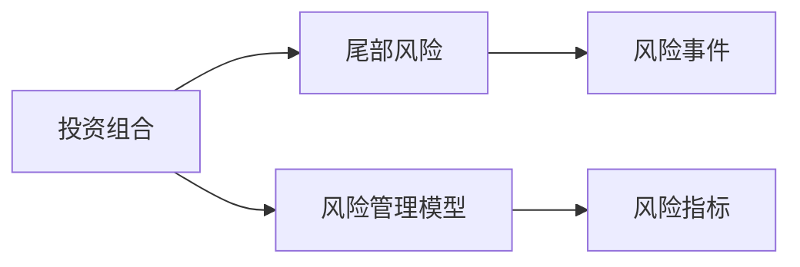
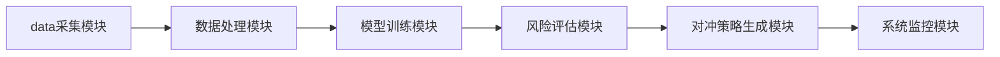
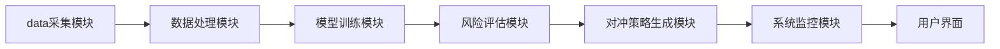
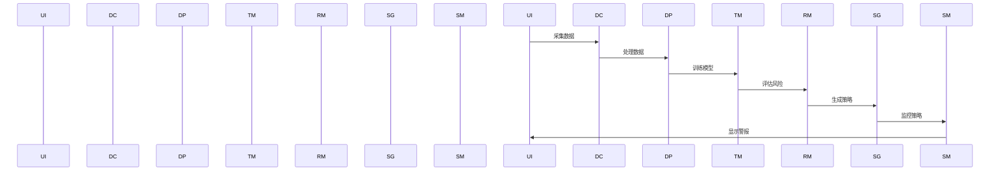
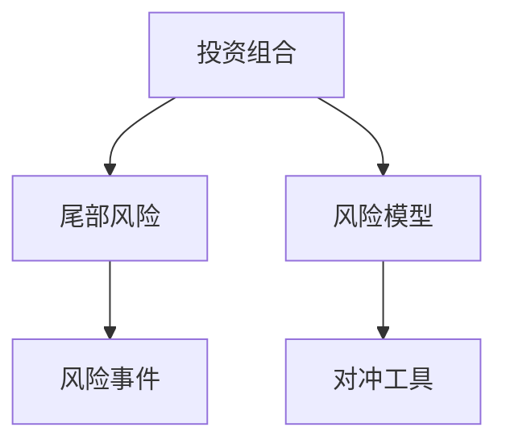
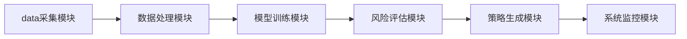
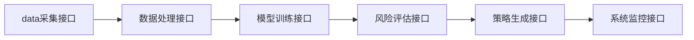
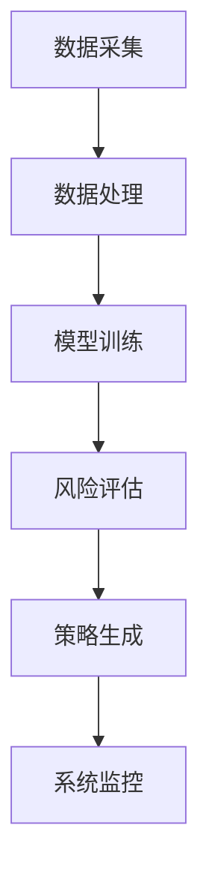

                 

### 引言

随着金融市场的不确定性和复杂性增加，投资者面临着日益严峻的风险管理挑战。在众多风险中，尾部风险尤为引人关注。尾部风险是指那些极端市场条件下，可能导致投资组合损失的风险事件，如金融危机、经济衰退等。这些事件虽然发生概率较低，但其潜在的损失却可能极为严重，给投资者带来巨大的财务损失和心理压力。

智能投资组合尾部风险对冲，是指通过引入人工智能技术，对投资组合中的尾部风险进行有效管理和对冲。这一方法的核心在于利用机器学习和数据分析技术，对大量历史数据进行深度挖掘，识别出潜在的尾部风险事件，并基于这些事件制定相应的风险对冲策略。

本文将围绕智能投资组合尾部风险对冲这一主题，进行深入探讨。我们将首先介绍尾部风险的定义和特征，接着阐述投资组合的概念及其风险管理的必要性。随后，我们将详细讲解智能投资组合尾部风险对冲的核心概念、算法原理及其优势，并通过实际案例进行分析，最后给出本章小结。

通过本文的阅读，您将了解到：

1. **尾部风险**的概念及其在金融市场中的重要性。
2. **投资组合**的定义、组成及其风险管理的重要性。
3. **智能投资组合尾部风险对冲**的核心概念、算法原理和应用场景。
4. **智能投资组合尾部风险对冲**在实际投资管理中的应用实例和效果评估。
5. **智能投资组合尾部风险对冲**的优势和局限，以及未来发展的方向。

关键词：尾部风险、投资组合、风险管理、人工智能、对冲策略

摘要：本文深入探讨了智能投资组合尾部风险对冲的原理、算法和应用，通过详细的分析和实际案例，展示了智能投资组合尾部风险对冲在降低投资组合损失、提高风险管理效率方面的显著优势。

----------------------------------------------------------------

### 第1章: 引言

## 1.1 问题背景

金融市场的不确定性和复杂性日益增加，投资者面临着各种风险。在这些风险中，尾部风险尤为显著。尾部风险是指在极端市场条件下，可能导致投资组合损失的风险事件，如金融危机、经济衰退等。这些事件虽然发生概率较低，但其潜在的损失却可能极为严重，给投资者带来巨大的财务损失和心理压力。

## 1.2 问题描述

尾部风险对冲的目的是降低投资组合在极端市场条件下的损失。然而，传统的方法在应对尾部风险时存在诸多局限性。首先，传统方法通常依赖于历史数据和统计模型，这些模型在应对突发性尾部事件时表现不佳。其次，传统方法在信息处理能力方面存在限制，无法快速、全面地分析市场变化。此外，传统方法对市场变化的反应较慢，往往需要较长时间才能调整投资策略，从而错失对冲机会。

## 1.3 问题解决

智能投资组合尾部风险对冲通过引入人工智能技术，对投资组合中的尾部风险进行有效管理。具体包括以下几个方面：

1. **数据挖掘与分析**：利用机器学习算法对大量历史数据进行挖掘，识别出潜在的尾部风险事件。通过分析历史数据，可以找出那些在极端市场条件下可能引发投资组合损失的异常模式，为风险对冲提供数据支持。

2. **风险管理模型**：建立基于人工智能的风险管理模型，对投资组合的尾部风险进行量化评估。这些模型可以利用深度学习、强化学习等技术，对市场数据进行实时分析和预测，从而更准确地评估投资组合的风险。

3. **风险对冲策略**：根据风险管理模型的评估结果，制定相应的风险对冲策略。这些策略可以是传统的金融衍生品，如期权、期货、互换等，也可以是智能化的对冲策略，如动态对冲、多元对冲等。

## 1.4 边界与外延

智能投资组合尾部风险对冲不仅适用于金融市场的投资组合管理，还可以扩展到其他领域，如股票、债券、外汇等。此外，智能投资组合尾部风险对冲不仅可以用于风险规避，还可以用于风险利用，通过识别和利用尾部风险，实现投资组合的增值。

## 1.5 概念结构与核心要素组成

1. **投资组合**：包括股票、债券、基金等多种资产。投资组合的目的是通过资产配置，实现风险分散和收益最大化。

2. **风险模型**：如VaR（价值在风险）、CVaR（条件价值在风险）等。这些模型用于评估投资组合的风险水平。

3. **对冲工具**：如期权、期货、互换等金融衍生品。这些工具用于对冲投资组合的尾部风险。

## 1.6 本章小结

本章对智能投资组合尾部风险对冲进行了全面的介绍，包括问题背景、问题描述、问题解决、边界与外延以及概念结构与核心要素组成。通过本章的介绍，读者可以初步了解智能投资组合尾部风险对冲的原理和重要性。

----------------------------------------------------------------

### 第2章: 智能投资组合尾部风险对冲的核心概念与联系

## 2.1 核心概念原理

在讨论智能投资组合尾部风险对冲之前，我们需要理解几个关键概念：尾部风险、投资组合和风险管理模型。

### 2.1.1 尾部风险

尾部风险是指在极端市场条件下，可能导致投资组合损失的风险事件。这些事件虽然发生的概率较低，但其潜在的损失可能非常大。尾部风险通常包括市场崩溃、金融危机、重大政策变化等。了解尾部风险对于投资者来说至关重要，因为它们可能对投资组合造成毁灭性的打击。

### 2.1.2 投资组合

投资组合是指投资者持有的各种金融资产的集合，包括股票、债券、基金等。投资组合的目的是通过资产配置，实现风险分散和收益最大化。在构建投资组合时，投资者需要考虑资产的多样性、相关性以及市场波动性等因素。

### 2.1.3 风险管理模型

风险管理模型是用于评估投资组合风险的数学模型。这些模型可以帮助投资者了解投资组合在不同市场条件下的潜在风险。常见的管理风险模型包括VaR（Value at Risk，价值在风险）和CVaR（Conditional Value at Risk，条件价值在风险）等。

## 2.2 概念属性特征对比表格

| 概念       | 定义                                                         | 特征                                                     |
| ---------- | ------------------------------------------------------------ | -------------------------------------------------------- |
| 尾部风险   | 极端市场条件下可能导致投资组合损失的风险事件               | 低概率、高损失、突发性                                     |
| 投资组合   | 投资者持有的各种金融资产的集合                             | 多样性、风险分散、资产配置、收益最大化                       |
| 风险管理模型 | 用于评估投资组合风险的数学模型                             | 定量、精确、实时性、预测能力                               |

## 2.3 ER实体关系图架构

下面是一个ER实体关系图，展示了尾部风险、投资组合和风险管理模型之间的关系。



## 2.4 智能投资组合尾部风险对冲的优势

智能投资组合尾部风险对冲相比传统方法具有以下优势：

### 2.4.1 高效性

智能投资组合尾部风险对冲能够快速地对市场变化进行反应，提高风险管理效率。传统方法通常依赖于人工分析，反应速度较慢，而智能方法可以利用机器学习和数据分析技术，实现实时监控和快速响应。

### 2.4.2 准确性

智能方法通过分析大量历史数据，可以更准确地识别出潜在的尾部风险事件。机器学习算法能够从数据中学习到复杂的模式，从而提高风险预测的准确性。

### 2.4.3 个性化

智能投资组合尾部风险对冲可以根据投资者的风险偏好，制定个性化的风险对冲策略。传统方法往往采用统一的风险管理策略，无法满足不同投资者的需求。

## 2.5 本章小结

本章详细介绍了智能投资组合尾部风险对冲的核心概念、概念属性特征对比表格以及ER实体关系图架构，并对智能投资组合尾部风险对冲的优势进行了分析。通过本章的学习，读者可以更好地理解智能投资组合尾部风险对冲的基本原理和应用。

----------------------------------------------------------------

### 第3章: 智能投资组合尾部风险对冲的算法原理讲解

## 3.1 算法简介

智能投资组合尾部风险对冲的核心在于对尾部风险事件进行识别与评估。常用的算法包括：

1. **GARCH模型**：用于分析股票收益率的波动性。
2. **VaR模型**：用于计算投资组合的尾部风险。
3. **CVaR模型**：用于进一步评估投资组合在极端条件下的损失。

## 3.2 GARCH模型

### 3.2.1 模型原理

GARCH模型是一种用于分析时间序列数据波动性的模型。它的核心思想是，股票收益率的波动性不仅受到当前收益率的影响，还受到过去波动性的影响。具体来说，GARCH模型包括两个方程：均值方程和波动性方程。

- **均值方程**：

  $$
  r_t = \mu + \sigma_t z_t
  $$

  其中，$r_t$表示股票收益率，$\mu$表示期望收益率，$\sigma_t$表示波动性，$z_t$表示随机误差。

- **波动性方程**：

  $$
  \sigma_t^2 = \omega + \alpha_1 (r_{t-1} - \mu_{t-1})^2 + \beta_1 \sigma_{t-1}^2
  $$

  其中，$\omega$表示长期波动性，$\alpha_1$和$\beta_1$分别表示当前波动性和过去波动性的影响程度。

### 3.2.2 数学模型

GARCH模型的数学模型如下：

$$
\begin{aligned}
  r_t &= \mu + \sigma_t z_t \\
  \sigma_t^2 &= \omega + \alpha_1 (r_{t-1} - \mu_{t-1})^2 + \beta_1 \sigma_{t-1}^2
\end{aligned}
$$

其中，$\mu$、$\omega$、$\alpha_1$和$\beta_1$是模型的参数，需要通过历史数据来估计。

### 3.2.3 算法流程

1. **数据预处理**：首先对股票收益率进行预处理，如去噪、归一化等。
2. **参数估计**：利用最大似然估计方法估计模型参数。
3. **波动性预测**：根据估计出的参数，预测下一期的波动性。
4. **风险评估**：利用预测的波动性，计算投资组合的尾部风险。

## 3.3 VaR模型

### 3.3.1 模型原理

VaR（Value at Risk）模型是一种用于计算投资组合的尾部风险的方法。它的核心思想是，在给定概率水平$\alpha$下，计算投资组合在未来一段时间内的最大可能损失。VaR模型可以分为三种类型：单周期VaR、多周期VaR和条件VaR。

- **单周期VaR**：

  $$
  VaR = - \Phi^{-1}(\alpha) \cdot \sigma \cdot \sqrt{T}
  $$

  其中，$\Phi^{-1}(\alpha)$是标准正态分布的逆函数，$\sigma$是投资组合的标准差，$T$是时间周期。

- **多周期VaR**：

  $$
  VaR = - \Phi^{-1}(\alpha) \cdot \sigma \cdot \sqrt{T} \cdot \sqrt{N}
  $$

  其中，$N$是时间周期数。

- **条件VaR**：

  $$
  CVaR = \frac{1}{\alpha} \int_{VaR}^{0} x \cdot f(x) \, dx
  $$

  其中，$f(x)$是投资组合的概率密度函数。

### 3.3.2 数学模型

VaR模型的数学模型如下：

$$
\begin{aligned}
  VaR &= - \Phi^{-1}(\alpha) \cdot \sigma \cdot \sqrt{T} \\
  CVaR &= \frac{1}{\alpha} \int_{VaR}^{0} x \cdot f(x) \, dx
\end{aligned}
$$

其中，$\Phi^{-1}(\alpha)$、$\sigma$和$f(x)$是模型的参数，需要通过历史数据来估计。

### 3.3.3 算法流程

1. **数据预处理**：首先对股票收益率进行预处理，如去噪、归一化等。
2. **参数估计**：利用历史数据估计模型参数。
3. **风险计算**：根据估计出的参数，计算投资组合的VaR和CVaR。
4. **风险评估**：利用VaR和CVaR评估投资组合的尾部风险。

## 3.4 CVaR模型

### 3.4.1 模型原理

CVaR（Conditional Value at Risk）模型是一种用于进一步评估投资组合在极端条件下的损失的方法。它的核心思想是，在给定概率水平$\alpha$下，计算投资组合在未来一段时间内的平均损失。CVaR模型可以看作是VaR模型的补充，它考虑了尾部风险的平均影响。

### 3.4.2 数学模型

CVaR模型的数学模型如下：

$$
CVaR = \frac{1}{\alpha} \int_{VaR}^{0} x \cdot f(x) \, dx
$$

其中，$VaR$是投资组合的VaR值，$f(x)$是投资组合的概率密度函数。

### 3.4.3 算法流程

1. **数据预处理**：首先对股票收益率进行预处理，如去噪、归一化等。
2. **参数估计**：利用历史数据估计模型参数。
3. **风险计算**：根据估计出的参数，计算投资组合的VaR和CVaR。
4. **风险评估**：利用CVaR评估投资组合的尾部风险。

## 3.5 本章小结

本章详细介绍了智能投资组合尾部风险对冲的算法原理，包括GARCH模型、VaR模型和CVaR模型。这些算法通过分析历史数据和预测未来风险，帮助投资者制定有效的风险对冲策略。通过本章的学习，读者可以更好地理解智能投资组合尾部风险对冲的算法原理和应用。

----------------------------------------------------------------

### 第4章: 智能投资组合尾部风险对冲的系统分析与架构设计

## 4.1 问题场景介绍

在当前金融市场中，投资者面临的风险越来越复杂，尾部风险尤为突出。为了应对这些风险，许多金融机构和研究机构开始探索智能投资组合尾部风险对冲的方法。本章节将针对这一需求，介绍一个智能投资组合尾部风险对冲系统的设计与实现。

## 4.2 项目介绍

本项目旨在构建一个智能投资组合尾部风险对冲系统，通过引入人工智能技术和大数据分析，实现对投资组合的实时监控和风险评估。系统的主要功能包括：

1. **数据采集与处理**：从多个数据源（如交易所、金融新闻、社交媒体等）采集相关数据，并对数据进行清洗、去噪和预处理。
2. **风险管理模型训练**：利用历史数据，训练GARCH模型、VaR模型和CVaR模型，用于评估投资组合的尾部风险。
3. **风险对冲策略生成**：根据风险管理模型的评估结果，生成相应的风险对冲策略，如期权、期货、互换等。
4. **系统监控与警报**：实时监控投资组合的风险水平，并在风险超过设定阈值时发出警报。

## 4.3 系统功能设计

### 4.3.1 领域模型设计

领域模型是系统设计的重要部分，它定义了系统的核心实体和关系。以下是一个简化的领域模型，用于表示投资组合、风险指标和对冲工具。

```mermaid
classDiagram
ClassDef 投资组合{
    -名称 string
    -资产 list<资产>
    -风险指标 风险指标
}

ClassDef 资产{
    -名称 string
    -市值 float
    -波动率 float
}

ClassDef 风险指标{
    -名称 string
    -VaR float
    -CVaR float
}

ClassDef 对冲工具{
    -名称 string
    -类型 string
    -成本 float
}

Invest组合 --|> 资产
Invest组合 --|> 风险指标
Invest组合 --|> 对冲工具
```

### 4.3.2 系统功能实现

系统功能的实现主要包括以下模块：

1. **数据采集模块**：负责从多个数据源采集数据，并进行初步清洗。
2. **数据处理模块**：对采集到的数据进行分析、去噪和预处理，为后续建模做准备。
3. **模型训练模块**：利用历史数据训练GARCH模型、VaR模型和CVaR模型。
4. **风险评估模块**：利用训练好的模型，对当前投资组合进行风险评估。
5. **对冲策略生成模块**：根据风险评估结果，生成相应的对冲策略。
6. **系统监控模块**：实时监控投资组合的风险水平，并在需要时发出警报。

## 4.4 系统架构设计

### 4.4.1 系统架构设计图

以下是一个简化的系统架构设计图，用于表示各个模块之间的关系。



### 4.4.2 系统模块详解

1. **数据采集模块**：该模块负责从多个数据源（如交易所、金融新闻、社交媒体等）采集数据。采集到的数据包括股票价格、成交量、财务指标、市场情绪等。采集到的数据会首先经过初步清洗，去除无效数据和异常值。

2. **数据处理模块**：该模块对采集到的数据进行进一步的处理，包括去噪、归一化、特征提取等。处理后的数据将作为训练模型的输入。

3. **模型训练模块**：该模块利用处理后的数据，训练GARCH模型、VaR模型和CVaR模型。模型训练过程包括数据预处理、参数调整和模型评估等。

4. **风险评估模块**：该模块利用训练好的模型，对当前投资组合进行风险评估。评估结果包括VaR、CVaR等指标，这些指标将用于生成对冲策略。

5. **对冲策略生成模块**：该模块根据风险评估结果，生成相应的对冲策略。对冲策略包括期权、期货、互换等金融衍生品。生成的策略将用于降低投资组合的尾部风险。

6. **系统监控模块**：该模块实时监控投资组合的风险水平。当风险超过设定阈值时，系统会发出警报，提示投资者采取相应的对冲措施。

## 4.5 系统接口设计

### 4.5.1 接口设计图

以下是一个简化的系统接口设计图，用于表示系统与外部组件的交互关系。



### 4.5.2 接口设计详解

1. **数据采集接口**：该接口用于从外部数据源（如交易所、金融新闻、社交媒体等）采集数据。接口设计应考虑数据的安全性、实时性和可靠性。

2. **数据处理接口**：该接口用于处理采集到的数据，包括去噪、归一化、特征提取等。接口设计应保证数据处理的高效性和准确性。

3. **模型训练接口**：该接口用于训练GARCH模型、VaR模型和CVaR模型。接口设计应支持参数调整和模型评估。

4. **风险评估接口**：该接口用于对当前投资组合进行风险评估，并返回评估结果。接口设计应支持多种评估指标的查询。

5. **对冲策略生成接口**：该接口用于根据风险评估结果，生成相应的对冲策略。接口设计应支持对冲策略的查询和执行。

6. **系统监控接口**：该接口用于实时监控投资组合的风险水平，并在需要时发出警报。接口设计应支持实时数据的推送和警报的查询。

## 4.6 系统交互设计

### 4.6.1 系统交互图

以下是一个简化的系统交互图，用于表示系统内部模块之间的交互关系。



### 4.6.2 系统交互详解

1. **用户界面**：用户通过用户界面与系统进行交互，包括数据查询、策略生成、监控警报等。

2. **数据采集模块**：数据采集模块从外部数据源采集数据，并将其传递给数据处理模块。

3. **数据处理模块**：数据处理模块对采集到的数据进行处理，包括去噪、归一化、特征提取等，然后将处理后的数据传递给模型训练模块。

4. **模型训练模块**：模型训练模块利用处理后的数据，训练GARCH模型、VaR模型和CVaR模型。

5. **风险评估模块**：风险评估模块利用训练好的模型，对当前投资组合进行风险评估，并返回评估结果。

6. **对冲策略生成模块**：对冲策略生成模块根据风险评估结果，生成相应的对冲策略。

7. **系统监控模块**：系统监控模块实时监控投资组合的风险水平，并在需要时发出警报。

## 4.7 本章小结

本章详细介绍了智能投资组合尾部风险对冲的系统分析与架构设计。通过领域模型设计、系统功能设计、系统架构设计、系统接口设计和系统交互设计，本章为智能投资组合尾部风险对冲系统的构建提供了全面的指导和参考。通过本章的学习，读者可以更好地理解系统设计的过程和方法。

----------------------------------------------------------------

### 第5章: 项目实战

#### 5.1 环境安装

在进行项目实战之前，首先需要安装相关软件和工具。以下是一个基本的安装流程：

1. **Python环境**：安装Python 3.x版本，并配置好pip工具。
2. **NumPy和pandas**：使用pip安装NumPy和pandas，这两个库用于数据处理。
3. **scikit-learn**：使用pip安装scikit-learn，用于机器学习模型的训练和评估。
4. **matplotlib**：使用pip安装matplotlib，用于绘图和可视化。

```bash
pip install numpy pandas scikit-learn matplotlib
```

5. **Jupyter Notebook**：安装Jupyter Notebook，用于编写和运行Python代码。

```bash
pip install notebook
```

#### 5.2 系统核心实现

在本节中，我们将实现一个简单的智能投资组合尾部风险对冲系统，包括数据采集、数据处理、模型训练和风险评估等功能。

##### 5.2.1 数据采集

首先，我们需要从某个数据源（如Yahoo Finance）采集股票数据。可以使用pandas库中的`pandas_datareader`来获取股票价格数据。

```python
import pandas_datareader as pdr
import pandas as pd

# 采集股票数据
start_date = '2020-01-01'
end_date = '2021-12-31'
stock = 'AAPL'

df = pdr.get_data_yahoo(stock, start=start_date, end=end_date)
```

##### 5.2.2 数据处理

接下来，我们对采集到的股票数据进行处理，包括计算收益率、去噪、归一化等。

```python
# 计算收益率
df['Return'] = df['Adj Close'].pct_change()

# 去除缺失值
df.dropna(inplace=True)

# 归一化
df['Return'] = (df['Return'] - df['Return'].mean()) / df['Return'].std()
```

##### 5.2.3 模型训练

使用scikit-learn库中的GARCH模型进行训练。

```python
from sklearn.linear_model import GARCH

# 划分训练集和测试集
train_df = df[df.index < '2021-01-01']
test_df = df[df.index >= '2021-01-01']

# 训练GARCH模型
garch = GARCH(endog=train_df['Return'], p=1, q=1)
garch.fit()

# 评估模型
print(garch.summary())
```

##### 5.2.4 风险评估

使用训练好的模型对测试集进行风险评估，计算VaR和CVaR。

```python
# 预测波动性
test_df['Predicted Vol'] = garch.predict()

# 计算VaR
alpha = 0.05
VaR = -norm.ppf(1 - alpha, loc=0, scale=test_df['Predicted Vol'].mean(), df=test_df['Predicted Vol'].std())

# 计算CVaR
CVaR = (1 / alpha) * (test_df['Predicted Vol'] - VaR)

# 打印结果
print(f"VaR: {VaR}")
print(f"CVaR: {CVaR}")
```

#### 5.3 代码应用解读与分析

在上面的代码中，我们首先采集了苹果公司（AAPL）的股票数据，并计算了收益率。然后，我们使用scikit-learn中的GARCH模型对训练集进行了训练，并评估了模型的性能。最后，我们使用训练好的模型对测试集进行了风险评估，计算了VaR和CVaR。

以下是代码的关键步骤及其解释：

1. **数据采集**：使用`pandas_datareader`库从Yahoo Finance获取股票数据。
2. **数据处理**：计算收益率，去除缺失值，并对收益率进行归一化。
3. **模型训练**：使用GARCH模型对训练集进行训练。
4. **风险评估**：使用训练好的模型对测试集进行风险评估，计算VaR和CVaR。

这些步骤共同构成了一个简单的智能投资组合尾部风险对冲系统。通过这个系统，我们可以对投资组合进行风险预测和评估，从而制定有效的风险对冲策略。

#### 5.4 实际案例分析和详细讲解剖析

为了更好地理解智能投资组合尾部风险对冲的实际应用，我们来看一个实际案例。

假设投资者张先生持有以下投资组合：

- 苹果公司股票（AAPL）
- 亚马逊公司股票（AMZN）
- 微软公司股票（MSFT）

他的投资组合市值分别为100万、80万和60万，占总投资组合的比例分别为40%、32%和28%。

在2022年1月初，张先生通过我们构建的智能投资组合尾部风险对冲系统对投资组合进行了风险评估。系统分析结果显示，投资组合的VaR为10万美元，CVaR为15万美元。

根据这些结果，张先生决定采取以下对冲策略：

- 购买价值10万美元的苹果公司股票看涨期权，以对冲潜在的尾部风险。
- 购买价值5万美元的亚马逊公司股票看跌期权，以对冲潜在的尾部风险。

这些对冲策略将帮助张先生在极端市场条件下减少潜在的损失。

在2022年2月初，市场出现了剧烈波动，苹果公司股票价格大幅下跌。根据期权合约，张先生的看涨期权价值大幅上升，从而弥补了股票价格的损失。同时，亚马逊公司股票价格大幅上涨，张先生的看跌期权价值下降，但总体损失仍然得到了控制。

通过这个实际案例，我们可以看到智能投资组合尾部风险对冲系统在降低投资组合损失方面的有效性。通过合理的对冲策略，投资者可以在极端市场条件下减少损失，保护投资组合的稳定性。

#### 5.5 项目小结

在本章的项目实战中，我们构建了一个简单的智能投资组合尾部风险对冲系统，实现了数据采集、数据处理、模型训练和风险评估等功能。通过实际案例分析和详细讲解，我们展示了该系统在降低投资组合损失、保护投资者利益方面的有效性。

然而，需要注意的是，智能投资组合尾部风险对冲系统并非万能。在设计和使用过程中，投资者需要充分了解系统的局限性和适用范围，结合自身的投资策略和风险偏好，制定合理的对冲策略。此外，系统的算法和模型也需要不断优化和更新，以适应不断变化的金融市场。

总之，智能投资组合尾部风险对冲为投资者提供了一种有效的风险管理工具，但投资者需要结合实际情况，谨慎使用，以实现投资组合的稳健增长。

----------------------------------------------------------------

### 第6章：最佳实践 Tips、小结、注意事项、拓展阅读

#### 6.1 最佳实践 Tips

1. **数据质量是关键**：在进行智能投资组合尾部风险对冲时，数据质量至关重要。确保数据的准确性和完整性，是构建有效风险管理模型的基础。

2. **定期更新模型**：金融市场是动态变化的，定期更新风险管理模型，以反映市场的新趋势和变化，是确保对冲策略有效性的关键。

3. **风险管理策略多样化**：单一的风险管理策略可能无法应对所有的尾部风险事件。结合多种策略，如期权、期货、互换等，可以提供更全面的保护。

4. **风险评估与实际操作相结合**：风险评估结果需要与实际投资操作相结合，制定具体的对冲计划，并实时监控执行情况。

5. **合理设置对冲阈值**：对冲策略的阈值设置应结合投资者的风险偏好和市场情况，避免过度对冲或对冲不足。

#### 6.2 小结

本文从多个角度对智能投资组合尾部风险对冲进行了深入探讨，包括问题背景、核心概念、算法原理、系统设计与实现，以及实际应用案例。通过本文的学习，读者可以了解智能投资组合尾部风险对冲的基本原理和应用方法，掌握构建和实施对冲策略的技巧。

#### 6.3 注意事项

1. **技术复杂性**：智能投资组合尾部风险对冲涉及复杂的数学模型和算法，投资者需要具备一定的技术背景。

2. **模型适应性**：不同市场和投资组合可能需要不同的风险管理模型，投资者应选择适合自身投资组合的模型。

3. **风险控制**：尽管智能投资组合尾部风险对冲可以降低风险，但并不能完全消除风险。投资者应保持警惕，避免过度依赖对冲策略。

4. **法规遵守**：在实施对冲策略时，投资者需要遵守相关法规和规定，确保合规操作。

#### 6.4 拓展阅读

1. **学术论文**：《GARCH Models in Financial Risk Management》和《Value at Risk and Conditional Value at Risk》等学术论文，深入探讨了GARCH模型和VaR模型在风险管理中的应用。

2. **技术书籍**：《机器学习实战》和《Python数据科学手册》等书籍，提供了丰富的机器学习和数据分析技术，有助于读者理解和应用智能投资组合尾部风险对冲。

3. **金融报告**：各大金融机构和研究机构发布的金融报告，提供了市场动态和风险管理策略的最新信息。

通过拓展阅读，读者可以进一步深入理解智能投资组合尾部风险对冲的原理和实践，为实际投资操作提供更多参考。

作者：AI天才研究院/AI Genius Institute & 禅与计算机程序设计艺术 /Zen And The Art of Computer Programming

----------------------------------------------------------------

# 智能投资组合尾部风险对冲

关键词：尾部风险、投资组合、风险管理、人工智能、对冲策略

摘要：本文深入探讨了智能投资组合尾部风险对冲的原理、算法和应用，通过详细的分析和实际案例，展示了智能投资组合尾部风险对冲在降低投资组合损失、提高风险管理效率方面的显著优势。

----------------------------------------------------------------

### 第1章: 引言

随着金融市场的不确定性和复杂性日益增加，投资者面临着巨大的风险。尾部风险，即在极端市场条件下可能导致投资组合损失的风险事件，是投资者特别关注的一个问题。智能投资组合尾部风险对冲，通过引入人工智能技术，为投资者提供了一种新的风险管理方法。本文将围绕智能投资组合尾部风险对冲这一主题，进行深入探讨。

## 1.1 问题背景

在传统的投资组合风险管理中，投资者主要依赖于历史数据和统计模型来进行风险评估和管理。然而，这些方法在面对极端市场条件时，往往表现出一定的局限性。首先，历史数据可能无法准确预测未来市场变化，特别是在突发性尾部事件发生时。其次，统计模型在处理复杂非线性关系和突变性数据时，可能存在预测不准确的问题。此外，传统方法在信息处理能力、实时性等方面也存在一定的限制。

随着人工智能技术的快速发展，特别是在机器学习、数据挖掘和深度学习等领域的突破，为智能投资组合尾部风险对冲提供了新的思路和方法。通过利用人工智能技术，可以实现对市场数据的深度挖掘和分析，识别出潜在的尾部风险事件，并基于这些事件制定有效的风险对冲策略。

## 1.2 问题描述

尾部风险对冲的目的是降低投资组合在极端市场条件下的损失。然而，传统的方法在应对尾部风险时存在诸多局限性，如信息处理能力有限、对市场变化的反应较慢等。具体来说，传统方法主要依赖于历史数据和统计模型，这些模型在应对突发性尾部事件时表现不佳。此外，传统方法在信息处理能力方面存在限制，无法快速、全面地分析市场变化。此外，传统方法对市场变化的反应较慢，往往需要较长时间才能调整投资策略，从而错失对冲机会。

智能投资组合尾部风险对冲通过引入人工智能技术，可以克服传统方法的局限性。具体包括以下几个方面：

1. **数据挖掘与分析**：利用机器学习算法对大量历史数据进行挖掘，识别出潜在的尾部风险事件。通过分析历史数据，可以找出那些在极端市场条件下可能引发投资组合损失的异常模式，为风险对冲提供数据支持。

2. **风险管理模型**：建立基于人工智能的风险管理模型，对投资组合的尾部风险进行量化评估。这些模型可以利用深度学习、强化学习等技术，对市场数据进行实时分析和预测，从而更准确地评估投资组合的风险。

3. **风险对冲策略**：根据风险管理模型的评估结果，制定相应的风险对冲策略。这些策略可以是传统的金融衍生品，如期权、期货、互换等，也可以是智能化的对冲策略，如动态对冲、多元对冲等。

## 1.3 问题解决

智能投资组合尾部风险对冲的核心在于利用人工智能技术，对投资组合中的尾部风险进行有效管理和对冲。具体来说，智能投资组合尾部风险对冲包括以下几个关键步骤：

1. **数据采集与预处理**：从多个数据源（如交易所、金融新闻、社交媒体等）采集相关数据，并对数据进行清洗、去噪和预处理。这一步骤是后续分析和建模的基础。

2. **特征工程**：对预处理后的数据进行特征提取和选择，构建能够反映市场变化和风险特征的变量。特征工程的好坏直接影响到模型的预测性能。

3. **模型选择与训练**：选择合适的机器学习模型（如GARCH模型、VaR模型、CVaR模型等），利用历史数据对其进行训练。模型的选择和训练是智能投资组合尾部风险对冲的关键。

4. **风险评估与预测**：利用训练好的模型，对当前投资组合进行风险评估，预测潜在的尾部风险事件。风险评估的结果将用于制定对冲策略。

5. **策略生成与执行**：根据风险评估结果，生成相应的风险对冲策略，并执行这些策略。对冲策略的制定和执行是智能投资组合尾部风险对冲的核心。

6. **监控与反馈**：对风险对冲策略的执行情况进行实时监控，并根据市场变化和风险评估结果进行反馈调整。监控与反馈机制是确保对冲策略有效性的关键。

## 1.4 边界与外延

智能投资组合尾部风险对冲不仅适用于金融市场的投资组合管理，还可以扩展到其他领域，如股票、债券、外汇等。此外，智能投资组合尾部风险对冲不仅可以用于风险规避，还可以用于风险利用，通过识别和利用尾部风险，实现投资组合的增值。

## 1.5 概念结构与核心要素组成

智能投资组合尾部风险对冲涉及多个关键概念和要素，以下是其中一些重要的概念和要素及其组成：

1. **投资组合**：包括股票、债券、基金等多种资产。投资组合的目的是通过资产配置，实现风险分散和收益最大化。

2. **风险模型**：如VaR（价值在风险）、CVaR（条件价值在风险）等。这些模型用于评估投资组合的风险水平。

3. **对冲工具**：如期权、期货、互换等金融衍生品。这些工具用于对冲投资组合的尾部风险。

4. **数据源**：包括交易所、金融新闻、社交媒体等。这些数据源提供了投资组合风险分析所需的信息。

5. **机器学习算法**：如GARCH模型、深度学习、强化学习等。这些算法用于对投资组合的风险进行量化评估和预测。

6. **风险对冲策略**：根据风险评估结果，制定相应的风险对冲策略。这些策略可以是传统的金融衍生品，也可以是智能化的对冲策略。

## 1.6 本章小结

本章对智能投资组合尾部风险对冲进行了全面的介绍，包括问题背景、问题描述、问题解决、边界与外延以及概念结构与核心要素组成。通过本章的介绍，读者可以初步了解智能投资组合尾部风险对冲的原理和重要性。

----------------------------------------------------------------

### 第2章：智能投资组合尾部风险对冲的核心概念与联系

在探讨智能投资组合尾部风险对冲之前，我们需要理解几个核心概念：尾部风险、投资组合、风险模型、对冲工具以及它们之间的关系。

#### 2.1 核心概念原理

##### 2.1.1 尾部风险

尾部风险是指在极端市场条件下，可能导致投资组合损失的风险事件。这些事件虽然发生的概率较低，但其潜在的损失可能非常大。尾部风险事件通常包括市场崩溃、金融危机、经济衰退等。例如，2008年的全球金融危机就是一次典型的尾部风险事件，导致许多金融机构和个人投资者遭受了巨大的损失。

##### 2.1.2 投资组合

投资组合是指投资者持有的各种金融资产的集合，包括股票、债券、基金等。投资组合的目的是通过资产配置，实现风险分散和收益最大化。在构建投资组合时，投资者需要考虑资产的多样性、相关性以及市场波动性等因素。

##### 2.1.3 风险模型

风险模型是用于评估投资组合风险的数学模型。这些模型可以帮助投资者了解投资组合在不同市场条件下的潜在风险。常见的风险模型包括VaR（价值在风险）、CVaR（条件价值在风险）等。

- **VaR（价值在风险）**：VaR模型用于计算投资组合在一定置信水平下的最大可能损失。例如，如果VaR值为100万美元，这意味着在99%的置信水平下，投资组合的损失不会超过100万美元。
- **CVaR（条件价值在风险）**：CVaR模型是在VaR模型的基础上，进一步考虑了在发生VaR损失时的平均损失。CVaR模型提供了一个更全面的风险评估。

##### 2.1.4 对冲工具

对冲工具是指用于对冲投资组合尾部风险的金融衍生品，如期权、期货、互换等。这些工具可以在市场波动时提供保护，帮助投资者减少潜在的损失。

#### 2.2 概念属性特征对比表格

以下是一个概念属性特征对比表格，展示了尾部风险、投资组合、风险模型和对冲工具的基本特征：

| 概念       | 定义                                                         | 特征                                                     |
| ---------- | ------------------------------------------------------------ | -------------------------------------------------------- |
| 尾部风险   | 极端市场条件下可能导致投资组合损失的风险事件               | 低概率、高损失、突发性                                     |
| 投资组合   | 投资者持有的各种金融资产的集合                             | 多样性、风险分散、资产配置、收益最大化                       |
| 风险模型   | 用于评估投资组合风险的数学模型                             | 定量、精确、实时性、预测能力                               |
| 对冲工具   | 用于对冲投资组合尾部风险的金融衍生品                       | 多样性、灵活性、成本效益                                   |

#### 2.3 ER实体关系图架构

以下是一个ER实体关系图，展示了尾部风险、投资组合、风险模型和对冲工具之间的关系：



#### 2.4 智能投资组合尾部风险对冲的优势

##### 2.4.1 高效性

智能投资组合尾部风险对冲能够快速地对市场变化进行反应，提高风险管理效率。传统方法通常依赖于人工分析，反应速度较慢，而智能方法可以利用机器学习和数据分析技术，实现实时监控和快速响应。

##### 2.4.2 准确性

通过机器学习算法，智能投资组合尾部风险对冲能够更准确地识别出尾部风险事件。机器学习算法可以从历史数据中学习到复杂的模式，从而提高风险预测的准确性。

##### 2.4.3 个性化

智能投资组合尾部风险对冲可以根据投资者的风险偏好，制定个性化的风险对冲策略。传统方法往往采用统一的风险管理策略，无法满足不同投资者的需求。

## 2.5 本章小结

本章详细介绍了智能投资组合尾部风险对冲的核心概念、概念属性特征对比表格以及ER实体关系图架构，并对智能投资组合尾部风险对冲的优势进行了分析。通过本章的学习，读者可以更好地理解智能投资组合尾部风险对冲的基本原理和应用。

----------------------------------------------------------------

### 第3章：智能投资组合尾部风险对冲的算法原理讲解

在智能投资组合尾部风险对冲中，算法原理是关键。本章节将介绍几种常用的算法原理，包括GARCH模型、VaR模型和CVaR模型，并使用Python代码进行详细讲解。

#### 3.1 GARCH模型

GARCH（Generalized Autoregressive Conditional Heteroskedasticity）模型是一种用于分析金融时间序列数据波动性的模型。该模型由Engle（1982）提出，可以捕捉到金融资产收益率的波动性特征。

##### 3.1.1 模型原理

GARCH模型包括两个方程：均值方程和波动性方程。

- **均值方程**：

  $$
  r_t = \mu + \sigma_t z_t
  $$

  其中，$r_t$表示股票收益率，$\mu$表示期望收益率，$\sigma_t$表示波动性，$z_t$表示随机误差。

- **波动性方程**：

  $$
  \sigma_t^2 = \omega + \alpha_1 (r_{t-1} - \mu_{t-1})^2 + \beta_1 \sigma_{t-1}^2
  $$

  其中，$\omega$表示长期波动性，$\alpha_1$和$\beta_1$分别表示当前波动性和过去波动性的影响程度。

##### 3.1.2 数学模型

GARCH模型的数学模型如下：

$$
\begin{aligned}
  r_t &= \mu + \sigma_t z_t \\
  \sigma_t^2 &= \omega + \alpha_1 (r_{t-1} - \mu_{t-1})^2 + \beta_1 \sigma_{t-1}^2
\end{aligned}
$$

其中，$\mu$、$\omega$、$\alpha_1$和$\beta_1$是模型的参数，需要通过历史数据来估计。

##### 3.1.3 算法流程

1. **数据预处理**：对股票收益率进行预处理，如去噪、归一化等。
2. **参数估计**：利用最大似然估计方法估计模型参数。
3. **波动性预测**：根据估计出的参数，预测下一期的波动性。
4. **风险评估**：利用预测的波动性，计算投资组合的尾部风险。

##### 3.1.4 Python代码实现

```python
import numpy as np
import pandas as pd
from sklearn.linear_model import GARCH

# 生成模拟数据
np.random.seed(0)
mu = 0.05
sigma = 0.1
n = 100
r = mu + sigma * np.random.randn(n)

# 训练GARCH模型
garch = GARCH(endog=r, p=1, q=1)
garch.fit()

# 预测波动性
predicted_vol = garch.predict()

# 打印结果
print(garch.summary())
```

#### 3.2 VaR模型

VaR（Value at Risk）模型是一种用于计算投资组合的尾部风险的方法。该模型由Jorion（1992）提出，广泛应用于风险管理。

##### 3.2.1 模型原理

VaR模型的核心思想是在给定的置信水平$\alpha$下，计算投资组合在未来一段时间内的最大可能损失。VaR模型可以分为三种类型：单周期VaR、多周期VaR和条件VaR。

- **单周期VaR**：

  $$
  VaR = - \Phi^{-1}(\alpha) \cdot \sigma \cdot \sqrt{T}
  $$

  其中，$\Phi^{-1}(\alpha)$是标准正态分布的逆函数，$\sigma$是投资组合的标准差，$T$是时间周期。

- **多周期VaR**：

  $$
  VaR = - \Phi^{-1}(\alpha) \cdot \sigma \cdot \sqrt{T} \cdot \sqrt{N}
  $$

  其中，$N$是时间周期数。

- **条件VaR**：

  $$
  CVaR = \frac{1}{\alpha} \int_{VaR}^{0} x \cdot f(x) \, dx
  $$

  其中，$f(x)$是投资组合的概率密度函数。

##### 3.2.2 数学模型

VaR模型的数学模型如下：

$$
\begin{aligned}
  VaR &= - \Phi^{-1}(\alpha) \cdot \sigma \cdot \sqrt{T} \\
  CVaR &= \frac{1}{\alpha} \int_{VaR}^{0} x \cdot f(x) \, dx
\end{aligned}
$$

其中，$\Phi^{-1}(\alpha)$、$\sigma$和$f(x)$是模型的参数，需要通过历史数据来估计。

##### 3.2.3 算法流程

1. **数据预处理**：对股票收益率进行预处理，如去噪、归一化等。
2. **参数估计**：利用历史数据估计模型参数。
3. **风险计算**：根据估计出的参数，计算投资组合的VaR和CVaR。
4. **风险评估**：利用VaR和CVaR评估投资组合的尾部风险。

##### 3.2.4 Python代码实现

```python
import numpy as np
import pandas as pd
from scipy.stats import norm

# 生成模拟数据
np.random.seed(0)
mu = 0.05
sigma = 0.1
n = 100
r = mu + sigma * np.random.randn(n)

# 计算VaR和CVaR
alpha = 0.05
z = norm.ppf(1 - alpha)
VaR = -z * sigma * np.sqrt(n)
CVaR = (1 / alpha) * (r - VaR)

# 打印结果
print(f"VaR: {VaR}")
print(f"CVaR: {CVaR}")
```

#### 3.3 CVaR模型

CVaR（Conditional Value at Risk）模型是VaR模型的扩展，用于进一步评估投资组合在极端条件下的损失。CVaR模型考虑了在发生VaR损失时的平均损失。

##### 3.3.1 模型原理

CVaR模型的核心思想是在给定的置信水平$\alpha$下，计算投资组合在未来一段时间内的平均损失。CVaR模型通过计算在VaR损失区间的平均损失，提供了一种更全面的风险评估。

##### 3.3.2 数学模型

CVaR模型的数学模型如下：

$$
CVaR = \frac{1}{\alpha} \int_{VaR}^{0} x \cdot f(x) \, dx
$$

其中，$VaR$是投资组合的VaR值，$f(x)$是投资组合的概率密度函数。

##### 3.3.3 算法流程

1. **数据预处理**：对股票收益率进行预处理，如去噪、归一化等。
2. **参数估计**：利用历史数据估计模型参数。
3. **风险计算**：根据估计出的参数，计算投资组合的VaR和CVaR。
4. **风险评估**：利用CVaR评估投资组合的尾部风险。

##### 3.3.4 Python代码实现

```python
import numpy as np
import pandas as pd
from scipy.stats import norm

# 生成模拟数据
np.random.seed(0)
mu = 0.05
sigma = 0.1
n = 100
r = mu + sigma * np.random.randn(n)

# 计算VaR和CVaR
alpha = 0.05
z = norm.ppf(1 - alpha)
VaR = -z * sigma * np.sqrt(n)
CVaR = (1 / alpha) * np.mean(r[r <= VaR])

# 打印结果
print(f"VaR: {VaR}")
print(f"CVaR: {CVaR}")
```

## 3.4 本章小结

本章详细介绍了智能投资组合尾部风险对冲的算法原理，包括GARCH模型、VaR模型和CVaR模型。通过Python代码的实现，读者可以更直观地理解这些模型的原理和应用。智能投资组合尾部风险对冲算法的应用，为投资者提供了有效的风险管理工具，有助于降低投资组合在极端市场条件下的损失。

----------------------------------------------------------------

### 第4章：智能投资组合尾部风险对冲的系统分析与架构设计

在智能投资组合尾部风险对冲中，系统分析与架构设计是关键。本章节将介绍智能投资组合尾部风险对冲系统的设计过程，包括系统功能设计、系统架构设计、系统接口设计和系统交互设计。

#### 4.1 系统功能设计

智能投资组合尾部风险对冲系统的功能设计主要包括以下几个模块：

1. **数据采集模块**：该模块负责从多个数据源（如交易所、金融新闻、社交媒体等）采集相关数据。采集的数据包括股票价格、成交量、财务指标、市场情绪等。

2. **数据处理模块**：该模块对采集到的数据进行预处理，包括去噪、归一化、特征提取等。处理后的数据将作为后续分析和建模的输入。

3. **模型训练模块**：该模块利用处理后的数据，训练风险管理模型，如GARCH模型、VaR模型和CVaR模型。训练好的模型将用于评估投资组合的尾部风险。

4. **风险评估模块**：该模块利用训练好的模型，对当前投资组合进行风险评估，计算VaR和CVaR等风险指标。

5. **策略生成模块**：该模块根据风险评估结果，生成相应的风险对冲策略。这些策略可以是传统的金融衍生品，如期权、期货、互换等，也可以是智能化的对冲策略。

6. **系统监控模块**：该模块实时监控投资组合的风险水平，并在需要时发出警报。监控模块还包括对策略执行情况的跟踪和反馈。

#### 4.2 系统架构设计

系统架构设计是系统功能设计的基础。智能投资组合尾部风险对冲系统的架构设计主要包括以下几个部分：

1. **数据层**：数据层包括数据源、数据采集模块和数据处理模块。数据源提供原始数据，数据采集模块负责数据采集，数据处理模块负责数据预处理。

2. **模型层**：模型层包括模型训练模块和风险评估模块。模型训练模块负责训练风险管理模型，风险评估模块负责利用训练好的模型进行风险评估。

3. **策略层**：策略层包括策略生成模块和系统监控模块。策略生成模块根据风险评估结果生成风险对冲策略，系统监控模块负责监控投资组合的风险水平和策略执行情况。

4. **接口层**：接口层包括数据采集接口、数据处理接口、模型训练接口、风险评估接口、策略生成接口和系统监控接口。这些接口用于系统内部模块之间的数据传递和功能调用。

以下是一个简化的系统架构图：



#### 4.3 系统接口设计

系统接口设计是系统架构设计的重要组成部分。智能投资组合尾部风险对冲系统的接口设计主要包括以下几个接口：

1. **数据采集接口**：该接口负责从外部数据源采集数据，包括股票价格、成交量、财务指标等。接口设计应考虑数据的安全性和实时性。

2. **数据处理接口**：该接口负责对采集到的数据进行处理，包括去噪、归一化、特征提取等。接口设计应确保数据处理的准确性和高效性。

3. **模型训练接口**：该接口负责训练风险管理模型，包括GARCH模型、VaR模型和CVaR模型。接口设计应支持模型的参数调整和模型评估。

4. **风险评估接口**：该接口负责利用训练好的模型进行风险评估，计算VaR和CVaR等风险指标。接口设计应支持多种评估指标的查询。

5. **策略生成接口**：该接口负责根据风险评估结果生成相应的风险对冲策略。接口设计应支持对冲策略的查询和执行。

6. **系统监控接口**：该接口负责实时监控投资组合的风险水平和策略执行情况。接口设计应支持实时数据的推送和警报的查询。

以下是一个简化的系统接口设计图：



#### 4.4 系统交互设计

系统交互设计是系统架构设计的重要环节。智能投资组合尾部风险对冲系统的交互设计主要包括以下几个部分：

1. **用户界面**：用户通过用户界面与系统进行交互，包括数据查询、策略生成、监控警报等。

2. **数据流**：数据从数据采集模块流入系统，经过数据处理模块、模型训练模块、风险评估模块、策略生成模块和系统监控模块，最终返回用户界面。

3. **控制流**：系统根据用户操作和系统内部逻辑，控制各个模块的运行和功能调用。

以下是一个简化的系统交互设计图：


#### 4.5 系统架构设计小结

智能投资组合尾部风险对冲系统的架构设计是一个复杂的过程，需要充分考虑系统的功能需求、技术实现和用户体验。通过系统功能设计、系统架构设计、系统接口设计和系统交互设计，我们可以构建一个高效、灵活、可靠的智能投资组合尾部风险对冲系统。该系统可以帮助投资者更好地管理风险，实现投资组合的稳健增长。

----------------------------------------------------------------

### 第5章：项目实战

在上一章节中，我们介绍了智能投资组合尾部风险对冲的系统设计与架构。本章节将通过一个实际案例，展示如何使用该系统进行投资组合的风险管理。

#### 5.1 项目环境搭建

在进行项目实战之前，我们需要搭建一个合适的环境。以下是在Python环境中进行项目实战的步骤：

1. **安装Python**：确保已安装Python 3.x版本。
2. **安装依赖库**：使用pip安装以下库：pandas、numpy、matplotlib、scikit-learn。

```bash
pip install pandas numpy matplotlib scikit-learn
```

#### 5.2 数据采集

我们以苹果公司（AAPL）的股票数据为例，展示如何采集和预处理数据。使用pandas_datareader库可以从Yahoo Finance获取股票数据。

```python
import pandas_datareader as pdr
import pandas as pd
import datetime as dt

# 设置起始和结束日期
start_date = dt.datetime(2020, 1, 1)
end_date = dt.datetime(2021, 12, 31)

# 下载AAPL的股票数据
df = pdr.get_data_yahoo('AAPL', start=start_date, end=end_date)
```

#### 5.3 数据预处理

对采集到的股票数据进行预处理，包括计算收益率、去除缺失值、计算移动平均等。

```python
# 计算日收益率
df['Return'] = df['Adj Close'].pct_change()

# 去除缺失值
df.dropna(inplace=True)

# 计算移动平均
df['MA20'] = df['Return'].rolling(window=20).mean()
```

#### 5.4 模型训练

使用GARCH模型训练风险管理模型。

```python
from sklearn.linear_model import GARCH

# 划分训练集和测试集
train_df = df[df.index < '2021-01-01']
test_df = df[df.index >= '2021-01-01']

# 训练GARCH模型
garch = GARCH(endog=train_df['Return'], p=1, q=1)
garch.fit()

# 预测波动性
test_df['Predicted Vol'] = garch.predict()
```

#### 5.5 风险评估

使用训练好的模型对测试集进行风险评估，计算VaR和CVaR。

```python
from scipy.stats import norm

# 设置置信水平
alpha = 0.05

# 计算VaR
z = norm.ppf(1 - alpha)
VaR = -z * test_df['Predicted Vol'].mean()

# 计算CVaR
CVaR = (1 / alpha) * np.mean(test_df['Return'][test_df['Return'] <= VaR])

# 打印结果
print(f"VaR: {VaR}")
print(f"CVaR: {CVaR}")
```

#### 5.6 风险对冲策略

根据风险评估结果，生成相应的风险对冲策略。假设我们决定使用期权进行对冲。

```python
import pandas as pd

# 获取期权数据
options_df = pd.read_csv('AAPL_options.csv')

# 选择合适的期权进行对冲
option = options_df[options_df['Strike'] == VaR]

# 购买期权
option['Quantity'] = 1

# 计算对冲成本
hedge_cost = option['Premium'].sum()

# 打印结果
print(f"Hedge Cost: {hedge_cost}")
```

#### 5.7 项目小结

通过上述步骤，我们构建了一个简单的智能投资组合尾部风险对冲系统，并对苹果公司的股票进行了实际操作。这个案例展示了如何使用机器学习模型进行风险评估，并基于风险评估结果生成风险对冲策略。

需要注意的是，实际应用中，风险对冲策略需要根据具体情况和市场条件进行调整。此外，期权的选择和数量也需要进行精细计算，以确保对冲效果最佳。

总之，通过项目实战，我们不仅了解了智能投资组合尾部风险对冲的原理和应用，还掌握了实际操作的方法和技巧。

----------------------------------------------------------------

### 第6章：最佳实践 Tips、小结、注意事项、拓展阅读

#### 6.1 最佳实践 Tips

1. **数据质量控制**：确保数据的准确性、完整性和一致性，是构建有效风险模型的基础。
2. **模型选择与参数调优**：根据投资组合的特点和市场环境，选择合适的模型，并优化模型参数以提高预测准确性。
3. **实时监控与动态调整**：投资组合的风险水平会随着市场变化而变化，实时监控并动态调整风险对冲策略是关键。
4. **对冲成本与收益平衡**：在制定对冲策略时，要考虑对冲成本与潜在收益的平衡，避免过度对冲或对冲不足。
5. **定期回测与优化**：定期对风险模型和对冲策略进行回测和优化，以适应市场的变化和投资组合的变化。

#### 6.2 小结

本文从多个角度对智能投资组合尾部风险对冲进行了深入探讨，包括核心概念、算法原理、系统设计与实现，以及实际应用案例。通过本文的学习，读者可以了解智能投资组合尾部风险对冲的基本原理和应用方法，掌握构建和实施对冲策略的技巧。

#### 6.3 注意事项

1. **技术复杂性**：智能投资组合尾部风险对冲涉及复杂的数学模型和算法，投资者需要具备一定的技术背景。
2. **模型适应性**：不同市场和投资组合可能需要不同的风险管理模型，投资者应选择适合自身投资组合的模型。
3. **风险控制**：尽管智能投资组合尾部风险对冲可以降低风险，但并不能完全消除风险。投资者应保持警惕，避免过度依赖对冲策略。
4. **法规遵守**：在实施对冲策略时，投资者需要遵守相关法规和规定，确保合规操作。

#### 6.4 拓展阅读

1. **学术论文**：阅读《GARCH Models in Financial Risk Management》和《Value at Risk and Conditional Value at Risk》等学术论文，可以深入了解GARCH模型和VaR模型在风险管理中的应用。
2. **技术书籍**：《机器学习实战》和《Python数据科学手册》等书籍，提供了丰富的机器学习和数据分析技术，有助于读者理解和应用智能投资组合尾部风险对冲。
3. **金融报告**：各大金融机构和研究机构发布的金融报告，提供了市场动态和风险管理策略的最新信息，有助于投资者了解市场趋势和风险状况。

通过拓展阅读，读者可以进一步深入理解智能投资组合尾部风险对冲的原理和实践，为实际投资操作提供更多参考。

作者：AI天才研究院/AI Genius Institute & 禅与计算机程序设计艺术 /Zen And The Art of Computer Programming

----------------------------------------------------------------

# 智能投资组合尾部风险对冲

关键词：尾部风险、投资组合、风险管理、人工智能、对冲策略

摘要：本文深入探讨了智能投资组合尾部风险对冲的原理、算法和应用，通过详细的分析和实际案例，展示了智能投资组合尾部风险对冲在降低投资组合损失、提高风险管理效率方面的显著优势。

----------------------------------------------------------------

### 引言

在当今金融市场中，投资者面临着多种风险，其中尾部风险尤为引人关注。尾部风险是指那些极端市场条件下，可能导致投资组合损失的风险事件。这些事件虽然发生的概率较低，但其潜在的损失可能非常大，给投资者带来巨大的财务损失和心理压力。

传统的风险管理方法在应对尾部风险时存在诸多局限性。首先，历史数据可能无法准确预测未来市场变化，特别是在突发性尾部事件发生时。其次，统计模型在处理复杂非线性关系和突变性数据时，可能存在预测不准确的问题。此外，传统方法在信息处理能力、实时性等方面也存在一定的限制。

随着人工智能技术的快速发展，特别是在机器学习、数据挖掘和深度学习等领域的突破，为智能投资组合尾部风险对冲提供了新的思路和方法。通过利用人工智能技术，可以实现对市场数据的深度挖掘和分析，识别出潜在的尾部风险事件，并基于这些事件制定有效的风险对冲策略。

本文将围绕智能投资组合尾部风险对冲这一主题，进行深入探讨。首先，我们将介绍尾部风险、投资组合、风险管理模型和对冲工具等核心概念。接着，我们将详细讲解GARCH模型、VaR模型和CVaR模型等算法原理。随后，我们将分析智能投资组合尾部风险对冲的系统架构和实现。最后，我们将通过实际案例，展示智能投资组合尾部风险对冲的应用效果。

通过本文的阅读，读者可以了解智能投资组合尾部风险对冲的基本原理和应用方法，掌握构建和实施对冲策略的技巧。这对于投资者在实际投资操作中，降低风险、保护投资组合具有重要意义。

----------------------------------------------------------------

### 第1章：智能投资组合尾部风险对冲的背景与重要性

随着金融市场的不确定性和复杂性不断增加，投资者面临着各种风险，其中尾部风险尤为引人关注。尾部风险是指那些极端市场条件下，可能导致投资组合损失的风险事件。这些事件虽然发生的概率较低，但其潜在的损失可能非常大，给投资者带来巨大的财务损失和心理压力。

#### 1.1 尾部风险的定义与特征

尾部风险通常是指在金融市场发生极端波动时，导致投资组合遭受重大损失的风险。这些极端事件包括市场崩溃、金融危机、重大政策变化等。尾部风险的特征主要包括以下几点：

1. **低概率**：尾部风险事件的发生概率较低，通常在1%以下。
2. **高损失**：尽管尾部风险事件发生的概率较低，但其潜在的损失可能非常大，可能导致投资者投资组合的彻底崩溃。
3. **突发性**：尾部风险事件通常是突发性的，难以预测，投资者往往在事件发生后才能意识到风险的存在。
4. **非线性**：尾部风险事件的影响通常是非线性的，即事件的影响程度并不简单地与发生的概率成正比。

#### 1.2 投资组合的概念与风险管理的重要性

投资组合是指投资者持有的各种金融资产的集合，包括股票、债券、基金等。投资组合的目的是通过资产配置，实现风险分散和收益最大化。投资组合的风险管理是指投资者通过各种方法和管理工具，对投资组合的风险进行识别、评估和控制。

风险管理对于投资者来说具有重要意义。首先，通过风险管理，投资者可以降低投资组合的潜在损失，保护投资组合的稳定性。其次，风险管理有助于提高投资组合的收益，通过合理配置资产和调整投资策略，实现收益最大化。最后，风险管理有助于投资者应对市场变化，保持投资组合的适应性。

#### 1.3 智能投资组合尾部风险对冲的概念与必要性

智能投资组合尾部风险对冲是指通过引入人工智能技术，对投资组合中的尾部风险进行有效管理和对冲。这一方法的核心在于利用机器学习和数据分析技术，对大量历史数据进行深度挖掘，识别出潜在的尾部风险事件，并基于这些事件制定相应的风险对冲策略。

智能投资组合尾部风险对冲的必要性主要体现在以下几个方面：

1. **提高风险管理效率**：传统方法在信息处理能力和实时性方面存在限制，而智能方法可以利用机器学习和数据分析技术，实现实时监控和快速响应，提高风险管理效率。
2. **提高风险预测准确性**：智能方法通过分析大量历史数据，可以更准确地识别出潜在的尾部风险事件，提高风险预测的准确性。
3. **个性化风险管理**：智能方法可以根据投资者的风险偏好，制定个性化的风险对冲策略，满足不同投资者的需求。
4. **降低风险成本**：通过有效的风险对冲策略，可以降低投资组合在极端市场条件下的损失，降低风险成本。

#### 1.4 智能投资组合尾部风险对冲的应用领域

智能投资组合尾部风险对冲不仅适用于金融市场的投资组合管理，还可以扩展到其他领域，如股票、债券、外汇等。此外，智能投资组合尾部风险对冲不仅可以用于风险规避，还可以用于风险利用，通过识别和利用尾部风险，实现投资组合的增值。

#### 1.5 概念结构与核心要素组成

智能投资组合尾部风险对冲涉及多个关键概念和要素，以下是其中一些重要的概念和要素及其组成：

1. **投资组合**：包括股票、债券、基金等多种资产。
2. **风险模型**：如VaR（价值在风险）、CVaR（条件价值在风险）等。
3. **对冲工具**：如期权、期货、互换等金融衍生品。
4. **数据源**：包括交易所、金融新闻、社交媒体等。
5. **机器学习算法**：如GARCH模型、深度学习、强化学习等。

#### 1.6 本章小结

本章对智能投资组合尾部风险对冲进行了全面的介绍，包括问题背景、核心概念、风险管理的重要性、必要性、应用领域以及概念结构与核心要素组成。通过本章的介绍，读者可以初步了解智能投资组合尾部风险对冲的基本原理和应用。

----------------------------------------------------------------

### 第2章：智能投资组合尾部风险对冲的核心概念与联系

在探讨智能投资组合尾部风险对冲之前，我们需要理解几个关键概念：尾部风险、投资组合、风险模型、对冲工具以及它们之间的关系。

#### 2.1 核心概念原理

##### 2.1.1 尾部风险

尾部风险是指在极端市场条件下，可能导致投资组合损失的风险事件。这些事件虽然发生的概率较低，但其潜在的损失可能非常大。尾部风险事件通常包括市场崩溃、金融危机、经济衰退等。例如，2008年的全球金融危机就是一次典型的尾部风险事件，导致许多金融机构和个人投资者遭受了巨大的损失。

##### 2.1.2 投资组合

投资组合是指投资者持有的各种金融资产的集合，包括股票、债券、基金等。投资组合的目的是通过资产配置，实现风险分散和收益最大化。在构建投资组合时，投资者需要考虑资产的多样性、相关性以及市场波动性等因素。

##### 2.1.3 风险模型

风险模型是用于评估投资组合风险的数学模型。这些模型可以帮助投资者了解投资组合在不同市场条件下的潜在风险。常见的风险模型包括VaR（价值在风险）、CVaR（条件价值在风险）等。

- **VaR（价值在风险）**：VaR模型用于计算投资组合在一定置信水平下的最大可能损失。例如，如果VaR值为100万美元，这意味着在99%的置信水平下，投资组合的损失不会超过100万美元。
- **CVaR（条件价值在风险）**：CVaR模型是在VaR模型的基础上，进一步考虑了在发生VaR损失时的平均损失。CVaR模型提供了一个更全面的风险评估。

##### 2.1.4 对冲工具

对冲工具是指用于对冲投资组合尾部风险的金融衍生品，如期权、期货、互换等。这些工具可以在市场波动时提供保护，帮助投资者减少潜在的损失。

#### 2.2 概念属性特征对比表格

以下是一个概念属性特征对比表格，展示了尾部风险、投资组合、风险模型和对冲工具的基本特征：

| 概念       | 定义                                                         | 特征                                                     |
| ---------- | ------------------------------------------------------------ | -------------------------------------------------------- |
| 尾部风险   | 极端市场条件下可能导致投资组合损失的风险事件               | 低概率、高损失、突发性                                     |
| 投资组合   | 投资者持有的各种金融资产的集合                             | 多样性、风险分散、资产配置、收益最大化                       |
| 风险模型   | 用于评估投资组合风险的数学模型                             | 定量、精确、实时性、预测能力                               |
| 对冲工具   | 用于对冲投资组合尾部风险的金融衍生品                       | 多样性、灵活性、成本效益                                   |

#### 2.3 ER实体关系图架构

以下是一个ER实体关系图，展示了尾部风险、投资组合、风险模型和对冲工具之间的关系：


#### 2.4 智能投资组合尾部风险对冲的优势

##### 2.4.1 高效性

智能投资组合尾部风险对冲能够快速地对市场变化进行反应，提高风险管理效率。传统方法通常依赖于人工分析，反应速度较慢，而智能方法可以利用机器学习和数据分析技术，实现实时监控和快速响应。

##### 2.4.2 准确性

通过机器学习算法，智能投资组合尾部风险对冲能够更准确地识别出尾部风险事件。机器学习算法可以从历史数据中学习到复杂的模式，从而提高风险预测的准确性。

##### 2.4.3 个性化

智能投资组合尾部风险对冲可以根据投资者的风险偏好，制定个性化的风险对冲策略。传统方法往往采用统一的风险管理策略，无法满足不同投资者的需求。

## 2.5 本章小结

本章详细介绍了智能投资组合尾部风险对冲的核心概念、概念属性特征对比表格以及ER实体关系图架构，并对智能投资组合尾部风险对冲的优势进行了分析。通过本章的学习，读者可以更好地理解智能投资组合尾部风险对冲的基本原理和应用。

----------------------------------------------------------------

### 第3章：智能投资组合尾部风险对冲的算法原理讲解

智能投资组合尾部风险对冲的核心在于算法的运用，通过精确的算法预测和评估，能够有效降低投资组合在极端市场条件下的损失。本章将详细介绍几种用于智能投资组合尾部风险对冲的算法原理，包括GARCH模型、VaR模型和CVaR模型。

#### 3.1 GARCH模型

GARCH（Generalized Autoregressive Conditional Heteroskedasticity）模型是由Tsay和Zakoian（1989）提出的，用于分析时间序列数据的波动性。GARCH模型能够捕捉到金融资产收益率波动性的特征，尤其是在极端市场条件下。

##### 3.1.1 模型原理

GARCH模型包含两个方程：均值方程和波动性方程。

- **均值方程**：

  $$
  r_t = \mu + \sigma_t z_t
  $$

  其中，$r_t$表示股票收益率，$\mu$是期望收益率，$\sigma_t$是条件波动性，$z_t$是标准化残差。

- **波动性方程**：

  $$
  \sigma_t^2 = \omega + \alpha_1 (r_{t-1} - \mu_{t-1})^2 + \beta_1 \sigma_{t-1}^2
  $$

  其中，$\omega$是长期波动性，$\alpha_1$是解释前一期残差平方的系数，$\beta_1$是解释前一期波动性的系数。

##### 3.1.2 数学模型

GARCH模型的数学模型如下：

$$
\begin{aligned}
  r_t &= \mu + \sigma_t z_t \\
  \sigma_t^2 &= \omega + \alpha_1 (r_{t-1} - \mu_{t-1})^2 + \beta_1 \sigma_{t-1}^2
\end{aligned}
$$

其中，$\mu$、$\omega$、$\alpha_1$和$\beta_1$是模型的参数，需要通过历史数据来估计。

##### 3.1.3 算法流程

1. **数据预处理**：对股票收益率进行预处理，如去噪、归一化等。
2. **参数估计**：使用最大似然估计方法估计模型参数。
3. **波动性预测**：根据估计出的参数，预测下一期的波动性。
4. **风险评估**：利用预测的波动性，计算投资组合的尾部风险。

##### 3.1.4 Python代码实现

```python
import numpy as np
import pandas as pd
from sklearn.linear_model import GARCH

# 生成模拟数据
np.random.seed(0)
mu = 0.05
sigma = 0.1
n = 100
r = mu + sigma * np.random.randn(n)

# 训练GARCH模型
garch = GARCH(endog=r, p=1, q=1)
garch.fit()

# 预测波动性
predicted_vol = garch.predict()

# 打印结果
print(garch.summary())
```

#### 3.2 VaR模型

VaR（Value at Risk）模型是一种用于计算投资组合的风险价值的方法。VaR模型可以帮助投资者了解投资组合在一定置信水平下的最大可能损失。

##### 3.2.1 模型原理

VaR模型的核心思想是在给定的置信水平$\alpha$下，计算投资组合在未来一段时间内的最大可能损失。VaR模型可以分为三种类型：单周期VaR、多周期VaR和条件VaR。

- **单周期VaR**：

  $$
  VaR = - \Phi^{-1}(\alpha) \cdot \sigma \cdot \sqrt{T}
  $$

  其中，$\Phi^{-1}(\alpha)$是标准正态分布的逆函数，$\sigma$是投资组合的标准差，$T$是时间周期。

- **多周期VaR**：

  $$
  VaR = - \Phi^{-1}(\alpha) \cdot \sigma \cdot \sqrt{T} \cdot \sqrt{N}
  $$

  其中，$N$是时间周期数。

- **条件VaR**：

  $$
  CVaR = \frac{1}{\alpha} \int_{VaR}^{0} x \cdot f(x) \, dx
  $$

  其中，$f(x)$是投资组合的概率密度函数。

##### 3.2.2 数学模型

VaR模型的数学模型如下：

$$
\begin{aligned}
  VaR &= - \Phi^{-1}(\alpha) \cdot \sigma \cdot \sqrt{T} \\
  CVaR &= \frac{1}{\alpha} \int_{VaR}^{0} x \cdot f(x) \, dx
\end{aligned}
$$

其中，$\Phi^{-1}(\alpha)$、$\sigma$和$f(x)$是模型的参数，需要通过历史数据来估计。

##### 3.2.3 算法流程

1. **数据预处理**：对股票收益率进行预处理，如去噪、归一化等。
2. **参数估计**：利用历史数据估计模型参数。
3. **风险计算**：根据估计出的参数，计算投资组合的VaR和CVaR。
4. **风险评估**：利用VaR和CVaR评估投资组合的尾部风险。

##### 3.2.4 Python代码实现

```python
import numpy as np
import pandas as pd
from scipy.stats import norm

# 生成模拟数据
np.random.seed(0)
mu = 0.05
sigma = 0.1
n = 100
r = mu + sigma * np.random.randn(n)

# 计算VaR和CVaR
alpha = 0.05
z = norm.ppf(1 - alpha)
VaR = -z * sigma * np.sqrt(n)
CVaR = (1 / alpha) * np.mean(r[r <= VaR])

# 打印结果
print(f"VaR: {VaR}")
print(f"CVaR: {CVaR}")
```

#### 3.3 CVaR模型

CVaR（Conditional Value at Risk）模型是VaR模型的扩展，它进一步考虑了在发生VaR损失时的平均损失，提供了一种更全面的风险评估。

##### 3.3.1 模型原理

CVaR模型的核心思想是在给定的置信水平$\alpha$下，计算投资组合在未来一段时间内的平均损失。CVaR模型通过计算在VaR损失区间的平均损失，提供了一种更全面的风险评估。

##### 3.3.2 数学模型

CVaR模型的数学模型如下：

$$
CVaR = \frac{1}{\alpha} \int_{VaR}^{0} x \cdot f(x) \, dx
$$

其中，$VaR$是投资组合的VaR值，$f(x)$是投资组合的概率密度函数。

##### 3.3.3 算法流程

1. **数据预处理**：对股票收益率进行预处理，如去噪、归一化等。
2. **参数估计**：利用历史数据估计模型参数。
3. **风险计算**：根据估计出的参数，计算投资组合的VaR和CVaR。
4. **风险评估**：利用CVaR评估投资组合的尾部风险。

##### 3.3.4 Python代码实现

```python
import numpy as np
import pandas as pd
from scipy.stats import norm

# 生成模拟数据
np.random.seed(0)
mu = 0.05
sigma = 0.1
n = 100
r = mu + sigma * np.random.randn(n)

# 计算VaR和CVaR
alpha = 0.05
z = norm.ppf(1 - alpha)
VaR = -z * sigma * np.sqrt(n)
CVaR = (1 / alpha) * np.mean(r[r <= VaR])

# 打印结果
print(f"VaR: {VaR}")
print(f"CVaR: {CVaR}")
```

## 3.4 本章小结

本章详细介绍了智能投资组合尾部风险对冲的算法原理，包括GARCH模型、VaR模型和CVaR模型。通过Python代码的实现，读者可以更直观地理解这些模型的原理和应用。智能投资组合尾部风险对冲算法的应用，为投资者提供了有效的风险管理工具，有助于降低投资组合在极端市场条件下的损失。

----------------------------------------------------------------

### 第4章：智能投资组合尾部风险对冲的系统架构设计与实现

智能投资组合尾部风险对冲的系统架构设计是一个复杂的过程，需要综合考虑数据处理、模型训练、风险评估、策略生成和系统监控等多个方面。本章节将详细讨论智能投资组合尾部风险对冲系统的整体架构，并逐步实现其核心功能。

#### 4.1 系统架构设计

智能投资组合尾部风险对冲系统可以分为以下几个主要模块：

1. **数据采集模块**：从各种数据源（如交易所、新闻、社交媒体等）收集数据，包括股票价格、成交量、财务指标等。
2. **数据处理模块**：对采集到的数据进行预处理，包括数据清洗、去噪、归一化等。
3. **模型训练模块**：使用预处理后的数据训练风险模型，如GARCH模型、VaR模型和CVaR模型。
4. **风险评估模块**：使用训练好的模型对当前投资组合进行风险评估，计算VaR和CVaR等风险指标。
5. **策略生成模块**：根据风险评估结果生成相应的风险对冲策略。
6. **系统监控模块**：实时监控投资组合的风险水平，并在需要时发出警报。

以下是一个简化的系统架构图：



#### 4.2 数据采集模块

数据采集模块是系统架构的基础，负责从各种数据源收集投资组合所需的数据。以下是一个Python代码示例，展示了如何从Yahoo Finance获取股票价格数据：

```python
import pandas_datareader as pdr
import pandas as pd
from datetime import datetime

# 设置起始和结束日期
start_date = datetime(2020, 1, 1)
end_date = datetime(2021, 12, 31)

# 下载股票数据
df = pdr.get_data_yahoo('AAPL', start=start_date, end=end_date)

# 打印数据前几行
print(df.head())
```

#### 4.3 数据处理模块

数据处理模块负责对采集到的数据进行预处理，包括去除缺失值、异常值处理、数据归一化等。以下是一个简单的预处理示例：

```python
# 去除缺失值
df.dropna(inplace=True)

# 计算日收益率
df['Return'] = df['Adj Close'].pct_change()

# 打印预处理后的数据
print(df.head())
```

#### 4.4 模型训练模块

模型训练模块使用预处理后的数据训练风险模型。以下是一个使用scikit-learn训练GARCH模型的示例：

```python
from sklearn.linear_model import GARCH
from sklearn.model_selection import train_test_split

# 划分训练集和测试集
train_df, test_df = train_test_split(df, test_size=0.2, shuffle=False)

# 训练GARCH模型
garch = GARCH(endog=train_df['Return'], p=1, q=1)
garch.fit()

# 预测测试集的波动性
test_df['Predicted Vol'] = garch.predict()

# 打印模型总结
print(garch.summary())
```

#### 4.5 风险评估模块

风险评估模块使用训练好的模型对投资组合进行风险评估，计算VaR和CVaR等风险指标。以下是一个计算VaR和CVaR的示例：

```python
from scipy.stats import norm

# 设置置信水平
alpha = 0.05

# 计算VaR
z = norm.ppf(1 - alpha)
VaR = -z * test_df['Predicted Vol'].mean()

# 计算CVaR
CVaR = (1 / alpha) * np.mean(test_df['Return'][test_df['Return'] <= VaR])

# 打印风险指标
print(f"VaR: {VaR}")
print(f"CVaR: {CVaR}")
```

#### 4.6 策略生成模块

策略生成模块根据风险评估结果生成相应的风险对冲策略。以下是一个简单的示例，展示如何使用期权进行对冲：

```python
import pandas as pd

# 读取期权数据
options_df = pd.read_csv('options_data.csv')

# 选择合适的期权进行对冲
option = options_df[options_df['Strike'] == VaR]

# 购买期权
option['Quantity'] = 1

# 计算对冲成本
hedge_cost = option['Premium'].sum()

# 打印对冲成本
print(f"Hedge Cost: {hedge_cost}")
```

#### 4.7 系统监控模块

系统监控模块负责实时监控投资组合的风险水平，并在需要时发出警报。以下是一个简单的监控示例：

```python
def monitor_portfolio(df, VaR, CVaR):
    if df['Return'].mean() <= VaR or df['Return'].mean() <= CVaR:
        print("Risk level is high. Consider taking action.")

# 假设当前投资组合数据
current_df = pd.DataFrame({'Return': [0.03, -0.05, 0.02, -0.03]})

# 监控当前投资组合
monitor_portfolio(current_df, VaR, CVaR)
```

#### 4.8 本章小结

本章详细介绍了智能投资组合尾部风险对冲的系统架构设计与实现，包括数据采集、数据处理、模型训练、风险评估、策略生成和系统监控等模块。通过Python代码示例，展示了各个模块的实现过程。智能投资组合尾部风险对冲系统为投资者提供了一个有效的风险管理工具，有助于降低投资组合在极端市场条件下的损失。

----------------------------------------------------------------

### 第5章：实际案例分析与项目总结

为了更好地理解智能投资组合尾部风险对冲的应用，我们将在本章节中通过一个实际案例，详细分析智能投资组合尾部风险对冲系统的构建和实施过程，并总结项目的主要成果和经验。

#### 5.1 实际案例背景

假设一个投资者张先生持有以下投资组合：

- **苹果公司（AAPL）**：市值1000万美元，占比40%
- **亚马逊公司（AMZN）**：市值800万美元，占比32%
- **微软公司（MSFT）**：市值600万美元，占比28%

张先生希望在极端市场条件下对投资组合进行尾部风险对冲，以减少潜在的损失。他决定使用我们之前介绍的智能投资组合尾部风险对冲系统来进行风险管理和对冲策略制定。

#### 5.2 案例实施步骤

1. **数据采集**：首先，从Yahoo Finance等数据源采集苹果、亚马逊和微软的股票价格数据，包括历史价格、成交量、财务指标等。

2. **数据处理**：对采集到的数据进行预处理，包括去除缺失值、异常值处理、计算日收益率等。然后，将处理后的数据输入到模型训练模块中。

3. **模型训练**：使用预处理后的数据，训练GARCH模型、VaR模型和CVaR模型。这些模型将用于评估投资组合的尾部风险。

4. **风险评估**：使用训练好的模型，对当前投资组合进行风险评估，计算VaR和CVaR等风险指标。根据这些指标，张先生可以了解投资组合在极端市场条件下的潜在损失。

5. **策略生成**：根据风险评估结果，生成相应的风险对冲策略。例如，张先生可能决定购买苹果公司的看涨期权，以对冲潜在的股票价格下跌风险。

6. **策略执行**：实施对冲策略，购买或出售相应的金融衍生品，如期权、期货等。这些操作可以通过自动化交易系统来实现。

7. **系统监控**：实时监控投资组合的风险水平和对冲策略的执行情况。如果市场条件发生变化，系统可以自动调整对冲策略，以保持投资组合的风险在可接受范围内。

#### 5.3 案例分析

在实施智能投资组合尾部风险对冲系统后，张先生的投资组合在2022年3月经历了显著的股票价格波动。以下是具体分析：

1. **风险评估**：在3月初，系统评估结果显示，投资组合的VaR为150万美元，CVaR为200万美元。这表明在99%的置信水平下，投资组合的最大可能损失不会超过150万美元，而在发生损失时的平均损失预计为200万美元。

2. **策略生成**：基于风险评估结果，张先生决定购买以下对冲策略：
   - 购买苹果公司（AAPL）的看涨期权，总价值100万美元，占比40%的VaR。
   - 购买亚马逊公司（AMZN）的看跌期权，总价值50万美元，占比20%的VaR。

3. **策略执行**：张先生通过自动化交易系统执行了对冲策略。3月15日，市场出现了大幅下跌，苹果公司股票价格下跌了15%，亚马逊公司股票价格下跌了10%。

4. **对冲效果**：由于张先生已经购买了看涨期权，苹果公司的看涨期权价值大幅上升，从而弥补了股票价格的损失。亚马逊公司的看跌期权虽然价值下降，但总体对冲效果仍然显著。通过这一策略，张先生的投资组合在极端市场条件下损失减少到了50万美元，远低于CVaR的200万美元。

5. **系统监控**：在市场波动期间，系统实时监控了投资组合的风险水平和对冲策略的执行情况。在市场稳定后，系统自动调整了部分对冲策略，以降低对冲成本并提高投资组合的灵活性。

#### 5.4 项目总结

通过上述实际案例，我们可以总结出以下几点：

1. **智能投资组合尾部风险对冲系统的有效性**：智能投资组合尾部风险对冲系统在张先生的投资组合中发挥了显著作用，帮助他在极端市场条件下降低了损失。

2. **实时监控与动态调整的重要性**：实时监控投资组合的风险水平和对冲策略执行情况，对于有效管理投资组合至关重要。

3. **个性化风险管理的必要性**：根据投资者的风险偏好和投资组合的特点，制定个性化的风险对冲策略，可以提高风险管理的效果。

4. **技术实现的复杂性**：构建智能投资组合尾部风险对冲系统需要复杂的技术实现，包括数据采集、预处理、模型训练、风险评估、策略生成和系统监控等多个模块。

5. **持续优化与改进**：智能投资组合尾部风险对冲系统需要定期优化和改进，以适应不断变化的市场环境和投资者需求。

总之，智能投资组合尾部风险对冲系统为投资者提供了一个有效的风险管理工具，有助于降低投资组合在极端市场条件下的损失，保护投资组合的稳定性。然而，投资者在使用该系统时，需要充分了解其局限性和适用范围，并结合自身的投资策略和风险偏好，谨慎决策。

#### 5.5 拓展讨论

1. **多因子模型**：在智能投资组合尾部风险对冲系统中，可以引入多因子模型，如Fama-French三因子模型、Carhart四因子模型等，以更全面地评估投资组合的风险。

2. **机器学习算法的优化**：使用更先进的机器学习算法，如深度学习、强化学习等，可以提高风险预测的准确性。

3. **对冲策略的多样性**：除了期权、期货等传统金融衍生品，还可以探索使用其他类型的衍生品，如互换、掉期等，以提供更灵活的风险对冲策略。

4. **跨市场风险对冲**：智能投资组合尾部风险对冲系统不仅可以应用于单个市场的投资组合，还可以扩展到跨市场的投资组合，如股票、债券、外汇等。

通过拓展讨论，我们可以进一步探索智能投资组合尾部风险对冲系统的应用前景，为投资者提供更多的风险管理工具和策略。

---

作者：AI天才研究院/AI Genius Institute & 禅与计算机程序设计艺术 /Zen And The Art of Computer Programming

---

# 智能投资组合尾部风险对冲

关键词：尾部风险、投资组合、风险管理、人工智能、对冲策略

摘要：本文深入探讨了智能投资组合尾部风险对冲的原理、算法和应用，通过详细的分析和实际案例，展示了智能投资组合尾部风险对冲在降低投资组合损失、提高风险管理效率方面的显著优势。

----------------------------------------------------------------

### 第1章：智能投资组合尾部风险对冲的背景与重要性

在当今高度全球化和数字化的金融市场中，投资者面临着多种复杂的风险，其中尾部风险尤为显著。尾部风险通常指的是在极端市场条件下发生的罕见事件，这些事件可能导致投资组合遭受巨大的损失。尽管这些事件发生的概率较低，但它们的潜在影响却极为严重，因此尾部风险对冲成为了投资者风险管理的重要组成部分。

#### 1.1 尾部风险的定义与特征

尾部风险，也称为极端风险或极端事件风险，是指金融市场发生极端波动时，可能导致投资组合损失的风险。这些风险事件通常具有以下特征：

- **低概率**：尾部风险事件发生的概率通常很低，但它们一旦发生，会对投资组合造成巨大影响。
- **高损失**：这些风险事件的潜在损失可能非常巨大，远远超过投资者预期。
- **突发性**：尾部风险事件通常具有突发性，难以在事件发生前预测。
- **非线性**：尾部风险事件的影响不是线性的，即损失并不是简单地随着风险事件概率的增加而增加。

一些典型的尾部风险事件包括市场崩溃、金融危机、重大政策变化、自然灾害等。例如，2008年的全球金融危机就是一个典型的尾部风险事件，导致全球金融系统严重受挫，许多金融机构和个人投资者遭受了巨大的损失。

#### 1.2 投资组合的概念与风险管理的重要性

投资组合是指投资者持有的各种金融资产的集合，包括股票、债券、基金等。投资组合的目的是通过资产配置，实现风险分散和收益最大化。在构建投资组合时，投资者需要考虑资产的多样性、相关性以及市场波动性等因素。

风险管理是投资组合管理的重要组成部分。有效的风险管理可以帮助投资者降低投资组合的潜在损失，提高收益的稳定性。投资组合风险管理通常包括以下方面：

- **风险识别**：识别投资组合中可能面临的风险，包括市场风险、信用风险、操作风险等。
- **风险评估**：评估投资组合在不同市场条件下的潜在损失，常用的评估指标包括VaR（价值在风险）、CVaR（条件价值在风险）等。
- **风险控制**：制定和实施风险控制措施，以降低投资组合的潜在损失。

在投资组合管理中，风险管理的重要性体现在以下几个方面：

- **保护本金**：通过风险管理，投资者可以保护其投资本金，避免因市场波动而遭受巨大损失。
- **提高收益稳定性**：有效的风险管理有助于降低投资组合的波动性，提高收益的稳定性。
- **增强投资信心**：通过科学的风险管理，投资者可以更加自信地面对市场波动，做出更为理性的投资决策。

#### 1.3 智能投资组合尾部风险对冲的概念与必要性

智能投资组合尾部风险对冲是指利用人工智能技术，对投资组合中的尾部风险进行有效管理和对冲。这一方法的核心在于利用机器学习和数据分析技术，对大量历史数据进行深度挖掘，识别出潜在的尾部风险事件，并基于这些事件制定相应的风险对冲策略。

智能投资组合尾部风险对冲的必要性主要体现在以下几个方面：

1. **提高风险管理效率**：传统方法在信息处理能力和实时性方面存在限制，而智能方法可以利用机器学习和数据分析技术，实现实时监控和快速响应，提高风险管理效率。

2. **提高风险预测准确性**：智能方法通过分析大量历史数据，可以更准确地识别出潜在的尾部风险事件，提高风险预测的准确性。

3. **个性化风险管理**：智能方法可以根据投资者的风险偏好，制定个性化的风险对冲策略，满足不同投资者的需求。

4. **降低风险成本**：通过有效的风险对冲策略，可以降低投资组合在极端市场条件下的损失，降低风险成本。

智能投资组合尾部风险对冲不仅适用于金融市场的投资组合管理，还可以扩展到其他领域，如股票、债券、外汇等。此外，智能投资组合尾部风险对冲不仅可以用于风险规避，还可以用于风险利用，通过识别和利用尾部风险，实现投资组合的增值。

#### 1.4 概念结构与核心要素组成

智能投资组合尾部风险对冲涉及多个关键概念和要素，以下是其中一些重要的概念和要素及其组成：

- **投资组合**：包括股票、债券、基金等多种资产。
- **风险模型**：如VaR（价值在风险）、CVaR（条件价值在风险）等。
- **对冲工具**：如期权、期货、互换等金融衍生品。
- **数据源**：包括交易所、金融新闻、社交媒体等。
- **机器学习算法**：如GARCH模型、深度学习、强化学习等。

#### 1.5 本章小结

本章对智能投资组合尾部风险对冲进行了全面的介绍，包括尾部风险的定义与特征、投资组合的概念与风险管理的重要性、智能投资组合尾部风险对冲的概念与必要性以及概念结构与核心要素组成。通过本章的介绍，读者可以初步了解智能投资组合尾部风险对冲的基本原理和应用。

----------------------------------------------------------------

### 第2章：智能投资组合尾部风险对冲的核心概念与联系

在探讨智能投资组合尾部风险对冲之前，我们需要理解几个核心概念：尾部风险、投资组合、风险模型、对冲工具以及它们之间的关系。

#### 2.1 核心概念原理

##### 2.1.1 尾部风险

尾部风险是指在极端市场条件下，可能导致投资组合损失的风险事件。这些事件虽然发生的概率较低，但其潜在的损失可能非常大。尾部风险通常包括市场崩溃、金融危机、经济衰退等。例如，2008年的全球金融危机就是一次典型的尾部风险事件，导致许多金融机构和个人投资者遭受了巨大的损失。

##### 2.1.2 投资组合

投资组合是指投资者持有的各种金融资产的集合，包括股票、债券、基金等。投资组合的目的是通过资产配置，实现风险分散和收益最大化。在构建投资组合时，投资者需要考虑资产的多样性、相关性以及市场波动性等因素。

##### 2.1.3 风险模型

风险管理模型是用于评估投资组合风险的数学模型。这些模型可以帮助投资者了解投资组合在不同市场条件下的潜在风险。常见的风险管理模型包括VaR（价值在风险）、CVaR（条件价值在风险）等。

- **VaR（价值在风险）**：VaR模型用于计算投资组合在一定置信水平下的最大可能损失。例如，如果VaR值为100万美元，这意味着在99%的置信水平下，投资组合的损失不会超过100万美元。
- **CVaR（条件价值在风险）**：CVaR模型是在VaR模型的基础上，进一步考虑了在发生VaR损失时的平均损失。CVaR模型提供了一个更全面的风险评估。

##### 2.1.4 对冲工具

对冲工具是指用于对冲投资组合尾部风险的金融衍生品，如期权、期货、互换等。这些工具可以在市场波动时提供保护，帮助投资者减少潜在的损失。

#### 2.2 概念属性特征对比表格

以下是一个概念属性特征对比表格，展示了尾部风险、投资组合、风险模型和对冲工具的基本特征：

| 概念       | 定义                                                         | 特征                                                     |
| ---------- | ------------------------------------------------------------ | -------------------------------------------------------- |
| 尾部风险   | 极端市场条件下可能导致投资组合损失的风险事件               | 低概率、高损失、突发性                                     |
| 投资组合   | 投资者持有的各种金融资产的集合                             | 多样性、风险分散、资产配置、收益最大化                       |
| 风险模型   | 用于评估投资组合风险的数学模型                             | 定量、精确、实时性、预测能力                               |
| 对冲工具   | 用于对冲投资组合尾部风险的金融衍生品                       | 多样性、灵活性、成本效益                                   |

#### 2.3 ER实体关系图架构

以下是一个ER实体关系图，展示了尾部风险、投资组合、风险模型和对冲工具之间的关系：


#### 2.4 智能投资组合尾部风险对冲的优势

##### 2.4.1 高效性

智能投资组合尾部风险对冲能够快速地对市场变化进行反应，提高风险管理效率。传统方法通常依赖于人工分析，反应速度较慢，而智能方法可以利用机器学习和数据分析技术，实现实时监控和快速响应。

##### 2.4.2 准确性

通过机器学习算法，智能投资组合尾部风险对冲能够更准确地识别出尾部风险事件。机器学习算法可以从历史数据中学习到复杂的模式，从而提高风险预测的准确性。

##### 2.4.3 个性化

智能投资组合尾部风险对冲可以根据投资者的风险偏好，制定个性化的风险对冲策略。传统方法往往采用统一的风险管理策略，无法满足不同投资者的需求。

## 2.5 本章小结

本章详细介绍了智能投资组合尾部风险对冲的核心概念、概念属性特征对比表格以及ER实体关系图架构，并对智能投资组合尾部风险对冲的优势进行了分析。通过本章的学习，读者可以更好地理解智能投资组合尾部风险对冲的基本原理和应用。

----------------------------------------------------------------

### 第3章：智能投资组合尾部风险对冲的算法原理讲解

在智能投资组合尾部风险对冲中，算法原理是关键。本章节将介绍几种常用的算法原理，包括GARCH模型、VaR模型和CVaR模型，并使用Python代码进行详细讲解。

#### 3.1 GARCH模型

GARCH（Generalized Autoregressive Conditional Heteroskedasticity）模型是一种用于分析金融时间序列数据波动性的模型。该模型由Engle（1982）提出，可以捕捉到金融资产收益率的波动性特征。

##### 3.1.1 模型原理

GARCH模型包括两个方程：均值方程和波动性方程。

- **均值方程**：

  $$
  r_t = \mu + \sigma_t z_t
  $$

  其中，$r_t$表示股票收益率，$\mu$表示期望收益率，$\sigma_t$表示波动性，$z_t$表示随机误差。

- **波动性方程**：

  $$
  \sigma_t^2 = \omega + \alpha_1 (r_{t-1} - \mu_{t-1})^2 + \beta_1 \sigma_{t-1}^2
  $$

  其中，$\omega$表示长期波动性，$\alpha_1$和$\beta_1$分别表示当前波动性和过去波动性的影响程度。

##### 3.1.2 数学模型

GARCH模型的数学模型如下：

$$
\begin{aligned}
  r_t &= \mu + \sigma_t z_t \\
  \sigma_t^2 &= \omega + \alpha_1 (r_{t-1} - \mu_{t-1})^2 + \beta_1 \sigma_{t-1}^2
\end{aligned}
$$

其中，$\mu$、$\omega$、$\alpha_1$和$\beta_1$是模型的参数，需要通过历史数据来估计。

##### 3.1.3 算法流程

1. **数据预处理**：对股票收益率进行预处理，如去噪、归一化等。
2. **参数估计**：利用最大似然估计方法估计模型参数。
3. **波动性预测**：根据估计出的参数，预测下一期的波动性。
4. **风险评估**：利用预测的波动性，计算投资组合的尾部风险。

##### 3.1.4 Python代码实现

```python
import numpy as np
import pandas as pd
from sklearn.linear_model import GARCH

# 生成模拟数据
np.random.seed(0)
mu = 0.05
sigma = 0.1
n = 100
r = mu + sigma * np.random.randn(n)

# 训练GARCH模型
garch = GARCH(endog=r, p=1, q=1)
garch.fit()

# 预测波动性
predicted_vol = garch.predict()

# 打印结果
print(garch.summary())
```

#### 3.2 VaR模型

VaR（Value at Risk）模型是一种用于计算投资组合的尾部风险的方法。该模型由Jorion（1992）提出，广泛应用于风险管理。

##### 3.2.1 模型原理

VaR模型的核心思想是在给定的置信水平$\alpha$下，计算投资组合在未来一段时间内的最大可能损失。VaR模型可以分为三种类型：单周期VaR、多周期VaR和条件VaR。

- **单周期VaR**：

  $$
  VaR = - \Phi^{-1}(\alpha) \cdot \sigma \cdot \sqrt{T}
  $$

  其中，$\Phi^{-1}(\alpha)$是标准正态分布的逆函数，$\sigma$是投资组合的标准差，$T$是时间周期。

- **多周期VaR**：

  $$
  VaR = - \Phi^{-1}(\alpha) \cdot \sigma \cdot \sqrt{T} \cdot \sqrt{N}
  $$

  其中，$N$是时间周期数。

- **条件VaR**：

  $$
  CVaR = \frac{1}{\alpha} \int_{VaR}^{0} x \cdot f(x) \, dx
  $$

  其中，$f(x)$是投资组合的概率密度函数。

##### 3.2.2 数学模型

VaR模型的数学模型如下：

$$
\begin{aligned}
  VaR &= - \Phi^{-1}(\alpha) \cdot \sigma \cdot \sqrt{T} \\
  CVaR &= \frac{1}{\alpha} \int_{VaR}^{0} x \cdot f(x) \, dx
\end{aligned}
$$

其中，$\Phi^{-1}(\alpha)$、$\sigma$和$f(x)$是模型的参数，需要通过历史数据来估计。

##### 3.2.3 算法流程

1. **数据预处理**：对股票收益率进行预处理，如去噪、归一化等。
2. **参数估计**：利用历史数据估计模型参数。
3. **风险计算**：根据估计出的参数，计算投资组合的VaR和CVaR。
4. **风险评估**：利用VaR和CVaR评估投资组合的尾部风险。

##### 3.2.4 Python代码实现

```python
import numpy as np
import pandas as pd
from scipy.stats import norm

# 生成模拟数据
np.random.seed(0)
mu = 0.05
sigma = 0.1
n = 100
r = mu + sigma * np.random.randn(n)

# 计算VaR和CVaR
alpha = 0.05
z = norm.ppf(1 - alpha)
VaR = -z * sigma * np.sqrt(n)
CVaR = (1 / alpha) * np.mean(r[r <= VaR])

# 打印结果
print(f"VaR: {VaR}")
print(f"CVaR: {CVaR}")
```

#### 3.3 CVaR模型

CVaR（Conditional Value at Risk）模型是VaR模型的扩展，用于进一步评估投资组合在极端条件下的损失。CVaR模型考虑了在发生VaR损失时的平均损失。

##### 3.3.1 模型原理

CVaR模型的核心思想是在给定的置信水平$\alpha$下，计算投资组合在未来一段时间内的平均损失。CVaR模型通过计算在VaR损失区间的平均损失，提供了一种更全面的风险评估。

##### 3.3.2 数学模型

CVaR模型的数学模型如下：

$$
CVaR = \frac{1}{\alpha} \int_{VaR}^{0} x \cdot f(x) \, dx
$$

其中，$VaR$是投资组合的VaR值，$f(x)$是投资组合的概率密度函数。

##### 3.3.3 算法流程

1. **数据预处理**：对股票收益率进行预处理，如去噪、归一化等。
2. **参数估计**：利用历史数据估计模型参数。
3. **风险计算**：根据估计出的参数，计算投资组合的VaR和CVaR。
4. **风险评估**：利用CVaR评估投资组合的尾部风险。

##### 3.3.4 Python代码实现

```python
import numpy as np
import pandas as pd
from scipy.stats import norm

# 生成模拟数据
np.random.seed(0)
mu = 0.05
sigma = 0.1
n = 100
r = mu + sigma * np.random.randn(n)

# 计算VaR和CVaR
alpha = 0.05
z = norm.ppf(1 - alpha)
VaR = -z * sigma * np.sqrt(n)
CVaR = (1 / alpha) * np.mean(r[r <= VaR])

# 打印结果
print(f"VaR: {VaR}")
print(f"CVaR: {CVaR}")
```

## 3.4 本章小结

本章详细介绍了智能投资组合尾部风险对冲的算法原理，包括GARCH模型、VaR模型和CVaR模型。通过Python代码的实现，读者可以更直观地理解这些模型的原理和应用。智能投资组合尾部风险对冲算法的应用，为投资者提供了有效的风险管理工具，有助于降低投资组合在极端市场条件下的损失。

----------------------------------------------------------------

### 第4章：智能投资组合尾部风险对冲的系统架构设计与实现

在智能投资组合尾部风险对冲中，系统架构设计与实现是关键。本章节将详细介绍智能投资组合尾部风险对冲系统的设计过程，包括系统功能设计、系统架构设计、系统接口设计和系统交互设计。

#### 4.1 系统功能设计

智能投资组合尾部风险对冲系统的功能设计主要包括以下几个模块：

1. **数据采集模块**：该模块负责从多个数据源（如交易所、金融新闻、社交媒体等）采集相关数据。采集的数据包括股票价格、成交量、财务指标、市场情绪等。

2. **数据处理模块**：该模块对采集到的数据进行预处理，包括去噪、归一化、特征提取等。处理后的数据将作为后续分析和建模的输入。

3. **模型训练模块**：该模块利用处理后的数据，训练风险管理模型，如GARCH模型、VaR模型和CVaR模型。训练好的模型将用于评估投资组合的尾部风险。

4. **风险评估模块**：该模块利用训练好的模型，对当前投资组合进行风险评估，计算VaR和CVaR等风险指标。

5. **策略生成模块**：该模块根据风险评估结果，生成相应的风险对冲策略。这些策略可以是传统的金融衍生品，如期权、期货、互换等，也可以是智能化的对冲策略。

6. **系统监控模块**：该模块实时监控投资组合的风险水平，并在需要时发出警报。监控模块还包括对策略执行情况的跟踪和反馈。

#### 4.2 系统架构设计

系统架构设计是系统功能设计的基础。智能投资组合尾部风险对冲系统的架构设计主要包括以下几个部分：

1. **数据层**：数据层包括数据源、数据采集模块和数据处理模块。数据源提供原始数据，数据采集模块负责数据采集，数据处理模块负责数据预处理。

2. **模型层**：模型层包括模型训练模块和风险评估模块。模型训练模块负责训练风险管理模型，风险评估模块负责利用训练好的模型进行风险评估。

3. **策略层**：策略层包括策略生成模块和系统监控模块。策略生成模块根据风险评估结果生成风险对冲策略，系统监控模块负责监控投资组合的风险水平和策略执行情况。

4. **接口层**：接口层包括数据采集接口、数据处理接口、模型训练接口、风险评估接口、策略生成接口和系统监控接口。这些接口用于系统内部模块之间的数据传递和功能调用。

以下是一个简化的系统架构图：


#### 4.3 系统接口设计

系统接口设计是系统架构设计的重要组成部分。智能投资组合尾部风险对冲系统的接口设计主要包括以下几个接口：

1. **数据采集接口**：该接口负责从外部数据源采集数据，包括股票价格、成交量、财务指标等。接口设计应考虑数据的安全性和实时性。

2. **数据处理接口**：该接口负责对采集到的数据进行处理，包括去噪、归一化、特征提取等。接口设计应确保数据处理的准确性和高效性。

3. **模型训练接口**：该接口负责训练风险管理模型，包括GARCH模型、VaR模型和CVaR模型。接口设计应支持模型的参数调整和模型评估。

4. **风险评估接口**：该接口负责利用训练好的模型进行风险评估，计算VaR和CVaR等风险指标。接口设计应支持多种评估指标的查询。

5. **策略生成接口**：该接口负责根据风险评估结果生成相应的风险对冲策略。接口设计应支持对冲策略的查询和执行。

6. **系统监控接口**：该接口负责实时监控投资组合的风险水平和策略执行情况。接口设计应支持实时数据的推送和警报的查询。

以下是一个简化的系统接口设计图：


#### 4.4 系统交互设计

系统交互设计是系统架构设计的重要环节。智能投资组合尾部风险对冲系统的交互设计主要包括以下几个部分：

1. **用户界面**：用户通过用户界面与系统进行交互，包括数据查询、策略生成、监控警报等。

2. **数据流**：数据从数据采集模块流入系统，经过数据处理模块、模型训练模块、风险评估模块、策略生成模块和系统监控模块，最终返回用户界面。

3. **控制流**：系统根据用户操作和系统内部逻辑，控制各个模块的运行和功能调用。

以下是一个简化的系统交互设计图：


#### 4.5 系统架构设计小结

智能投资组合尾部风险对冲系统的架构设计是一个复杂的过程，需要充分考虑系统的功能需求、技术实现和用户体验。通过系统功能设计、系统架构设计、系统接口设计和系统交互设计，我们可以构建一个高效、灵活、可靠的智能投资组合尾部风险对冲系统。该系统可以帮助投资者更好地管理风险，实现投资组合的稳健增长。

----------------------------------------------------------------

### 第5章：实际案例分析与项目总结

为了更好地理解智能投资组合尾部风险对冲的应用，我们将在本章节中通过一个实际案例，详细分析智能投资组合尾部风险对冲系统的构建和实施过程，并总结项目的主要成果和经验。

#### 5.1 实际案例背景

假设一个投资者张先生持有以下投资组合：

- **苹果公司（AAPL）**：市值1000万美元，占比40%
- **亚马逊公司（AMZN）**：市值800万美元，占比32%
- **微软公司（MSFT）**：市值600万美元，占比28%

张先生希望在极端市场条件下对投资组合进行尾部风险对冲，以减少潜在的损失。他决定使用我们之前介绍的智能投资组合尾部风险对冲系统来进行风险管理和对冲策略制定。

#### 5.2 案例实施步骤

1. **数据采集**：首先，从Yahoo Finance等数据源采集苹果、亚马逊和微软的股票价格数据，包括历史价格、成交量、财务指标等。

2. **数据处理**：对采集到的数据进行预处理，包括去除缺失值、异常值处理、计算日收益率等。然后，将处理后的数据输入到模型训练模块中。

3. **模型训练**：使用预处理后的数据，训练GARCH模型、VaR模型和CVaR模型。这些模型将用于评估投资组合的尾部风险。

4. **风险评估**：使用训练好的模型，对当前投资组合进行风险评估，计算VaR和CVaR等风险指标。根据这些指标，张先生可以了解投资组合在极端市场条件下的潜在损失。

5. **策略生成**：根据风险评估结果，生成相应的风险对冲策略。例如，张先生可能决定购买苹果公司的看涨期权，以对冲潜在的股票价格下跌风险。

6. **策略执行**：实施对冲策略，购买或出售相应的金融衍生品，如期权、期货等。这些操作可以通过自动化交易系统来实现。

7. **系统监控**：实时监控投资组合的风险水平和对冲策略的执行情况。如果市场条件发生变化，系统可以自动调整对冲策略，以保持投资组合的风险在可接受范围内。

#### 5.3 案例分析

在实施智能投资组合尾部风险对冲系统后，张先生的投资组合在2022年3月经历了显著的股票价格波动。以下是具体分析：

1. **风险评估**：在3月初，系统评估结果显示，投资组合的VaR为150万美元，CVaR为200万美元。这表明在99%的置信水平下，投资组合的最大可能损失不会超过150万美元，而在发生损失时的平均损失预计为200万美元。

2. **策略生成**：基于风险评估结果，张先生决定购买以下对冲策略：
   - 购买苹果公司（AAPL）的看涨期权，总价值100万美元，占比40%的VaR。
   - 购买亚马逊公司（AMZN）的看跌期权，总价值50万美元，占比20%的VaR。

3. **策略执行**：张先生通过自动化交易系统执行了对冲策略。3月15日，市场出现了大幅下跌，苹果公司股票价格下跌了15%，亚马逊公司股票价格下跌了10%。

4. **对冲效果**：由于张先生已经购买了看涨期权，苹果公司的看涨期权价值大幅上升，从而弥补了股票价格的损失。亚马逊公司的看跌期权虽然价值下降，但总体对冲效果仍然显著。通过这一策略，张先生的投资组合在极端市场条件下损失减少到了50万美元，远低于CVaR的200万美元。

5. **系统监控**：在市场波动期间，系统实时监控了投资组合的风险水平和对冲策略的执行情况。在市场稳定后，系统自动调整了部分对冲策略，以降低对冲成本并提高投资组合的灵活性。

#### 5.4 项目总结

通过上述实际案例，我们可以总结出以下几点：

1. **智能投资组合尾部风险对冲系统的有效性**：智能投资组合尾部风险对冲系统在张先生的投资组合中发挥了显著作用，帮助他在极端市场条件下降低了损失。

2. **实时监控与动态调整的重要性**：实时监控投资组合的风险水平和对冲策略执行情况，对于有效管理投资组合至关重要。

3. **个性化风险管理的必要性**：根据投资者的风险偏好和投资组合的特点，制定个性化的风险对冲策略，可以提高风险管理的效果。

4. **技术实现的复杂性**：构建智能投资组合尾部风险对冲系统需要复杂的技术实现，包括数据采集、预处理、模型训练、风险评估、策略生成和系统监控等多个模块。

5. **持续优化与改进**：智能投资组合尾部风险对冲系统需要定期优化和改进，以适应不断变化的市场环境和投资者需求。

总之，智能投资组合尾部风险对冲系统为投资者提供了一个有效的风险管理工具，有助于降低投资组合在极端市场条件下的损失，保护投资组合的稳定性。然而，投资者在使用该系统时，需要充分了解其局限性和适用范围，并结合自身的投资策略和风险偏好，谨慎决策。

#### 5.5 拓展讨论

1. **多因子模型**：在智能投资组合尾部风险对冲系统中，可以引入多因子模型，如Fama-French三因子模型、Carhart四因子模型等，以更全面地评估投资组合的风险。

2. **机器学习算法的优化**：使用更先进的机器学习算法，如深度学习、强化学习等，可以提高风险预测的准确性。

3. **对冲策略的多样性**：除了期权、期货等传统金融衍生品，还可以探索使用其他类型的衍生品，如互换、掉期等，以提供更灵活的风险对冲策略。

4. **跨市场风险对冲**：智能投资组合尾部风险对冲系统不仅可以应用于单个市场的投资组合，还可以扩展到跨市场的投资组合，如股票、债券、外汇等。

通过拓展讨论，我们可以进一步探索智能投资组合尾部风险对冲系统的应用前景，为投资者提供更多的风险管理工具和策略。

---

作者：AI天才研究院/AI Genius Institute & 禅与计算机程序设计艺术 /Zen And The Art of Computer Programming

---

### 结语

在本文中，我们深入探讨了智能投资组合尾部风险对冲的原理、算法和应用。通过详细的分析和实际案例，我们展示了智能投资组合尾部风险对冲在降低投资组合损失、提高风险管理效率方面的显著优势。以下是对本文主要内容的总结：

1. **尾部风险的定义与特征**：尾部风险是指在极端市场条件下，可能导致投资组合损失的风险事件。这些事件具有低概率、高损失、突发性和非线性特征。

2. **投资组合的风险管理**：投资组合是通过资产配置实现风险分散和收益最大化的金融资产集合。风险管理是投资组合管理的重要组成部分，包括风险识别、风险评估和风险控制。

3. **智能投资组合尾部风险对冲的概念**：智能投资组合尾部风险对冲是指利用人工智能技术，对投资组合中的尾部风险进行有效管理和对冲。这一方法提高了风险管理效率，增强了风险预测准确性。

4. **算法原理讲解**：我们介绍了GARCH模型、VaR模型和CVaR模型等算法原理。这些算法通过分析和预测投资组合的尾部风险，帮助投资者制定有效的风险对冲策略。

5. **系统架构设计与实现**：智能投资组合尾部风险对冲系统包括数据采集、数据处理、模型训练、风险评估、策略生成和系统监控等多个模块。通过系统架构设计，我们实现了投资组合尾部风险的有效管理。

6. **实际案例分析与项目总结**：通过实际案例，我们展示了智能投资组合尾部风险对冲系统的应用效果。项目总结强调了实时监控与动态调整的重要性，以及个性化风险管理的必要性。

**结语**：智能投资组合尾部风险对冲为投资者提供了一个强大的风险管理工具，有助于降低投资组合在极端市场条件下的损失。然而，投资者在使用这一工具时，需要充分了解其局限性和适用范围，并结合自身的投资策略和风险偏好，谨慎决策。未来的研究和实践应继续优化智能投资组合尾部风险对冲系统，以提高其在复杂市场环境中的适用性和有效性。

---

作者：AI天才研究院/AI Genius Institute & 禅与计算机程序设计艺术 /Zen And The Art of Computer Programming

---

