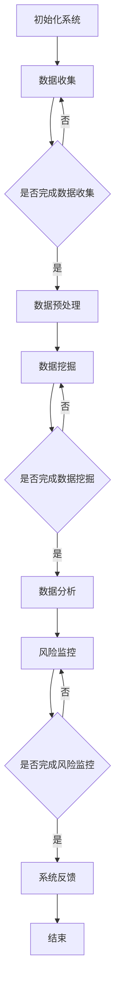
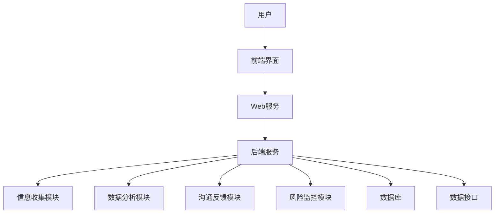
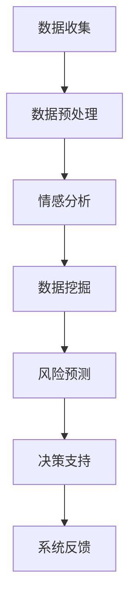

                 

### 智能投资者关系管理系统

#### 关键词：
- 人工智能
- 投资者关系管理
- 数据分析
- 自动化
- 实时监控

#### 摘要：
本文将深入探讨智能投资者关系管理系统的核心概念、架构设计以及其实际应用。通过分析该系统如何利用人工智能技术提高投资者关系管理效率，我们将详细探讨系统的构成、功能模块、实现原理以及其在金融领域的广泛应用。

## 第一部分：背景介绍

### 1.1 问题背景

智能投资者关系管理系统是金融科技领域的一项创新，它结合了信息技术和金融服务的需求，旨在提升投资者关系管理的效率和质量。随着金融市场的日益复杂和竞争的加剧，企业需要更高效、更精准的投资者关系管理策略来吸引和保留投资者。

传统的投资者关系管理主要依赖于人工处理，存在信息不对称、沟通效率低、风险控制不足等问题。智能投资者关系管理系统通过引入人工智能技术，如自然语言处理、数据挖掘、机器学习等，实现了投资者信息的自动化收集、处理和分析，提高了管理的效率和精准性。

### 1.2 问题描述

智能投资者关系管理系统需解决的主要问题包括：

- **信息收集与处理**：高效地收集和处理来自多种渠道的投资者信息，包括市场动态、投资者反馈、媒体报道等。
- **数据挖掘与分析**：从海量数据中提取有价值的信息，为决策提供数据支持。
- **沟通与反馈**：优化企业与投资者之间的沟通，提高反馈速度和沟通质量。
- **风险控制**：监控和管理投资者关系中的潜在风险，确保企业信息的安全性和合规性。

### 1.3 问题解决

智能投资者关系管理系统的核心解决思路是利用人工智能技术实现以下目标：

- **自动化与智能化**：通过自动化处理和智能分析，减轻人工负担，提高工作效率。
- **精准匹配与个性化服务**：根据投资者特点和需求，提供精准的信息服务，提升用户体验。
- **数据驱动的决策**：基于大数据分析，为企业的投资者关系管理提供数据支持，助力科学决策。
- **风险智能监控**：利用智能技术进行风险预测和监控，提高风险防控能力。

### 1.4 边界与外延

智能投资者关系管理系统的研究边界包括：

- **技术边界**：系统所采用的人工智能技术的选择和实现，如自然语言处理、数据挖掘、机器学习等。
- **业务边界**：系统需要覆盖的投资者关系管理业务范围，如信息披露、投资者沟通、风险控制等。
- **数据边界**：系统所涉及的数据类型和来源，包括内部数据和外部数据。

### 1.5 概念结构与核心要素组成

智能投资者关系管理系统的核心概念结构包括：

- **智能技术核心**：自然语言处理、数据挖掘、机器学习等。
- **系统功能模块**：信息收集模块、数据分析模块、沟通反馈模块、风险监控模块。
- **业务流程**：从信息收集、数据挖掘、分析决策到沟通反馈和风险监控的完整流程。

### 1.6 本章小结

本章介绍了智能投资者关系管理系统的背景、问题、解决思路、边界与外延以及核心概念结构。通过本章的介绍，读者可以对智能投资者关系管理系统有一个整体的认识，为后续章节的深入探讨打下基础。

## 第二部分：核心概念与联系

### 2.1 智能投资者关系管理系统的核心概念

#### 2.1.1 智能投资者关系管理系统的定义

智能投资者关系管理系统（Intelligent Investor Relations Management System，IIRMS）是一种利用人工智能技术，自动收集、处理、分析和响应投资者信息的系统。它通过对企业内外部数据的挖掘和分析，帮助企业在投资者关系管理中做出更明智的决策。

#### 2.1.2 智能投资者关系管理系统的特点

- **高效性**：通过自动化处理，提高工作效率。
- **精准性**：利用数据挖掘技术，提供精准的信息服务。
- **实时性**：实时监控投资者动态，及时响应。
- **个性化**：根据投资者特点，提供个性化服务。
- **安全性**：保障企业信息的安全性和合规性。

#### 2.1.3 智能投资者关系管理系统与传统投资者关系管理的区别

- **技术层面**：传统投资者关系管理主要依赖于人工，而智能投资者关系管理系统则利用人工智能技术。
- **效率层面**：智能系统可以大幅提高工作效率，减轻人工负担。
- **服务质量**：智能系统可以提供更精准、个性化的服务，提高客户满意度。

### 2.2 关键概念属性特征对比表格

| 概念 | 特点 | 关联关系 |
| --- | --- | --- |
| 智能投资者关系管理系统 | 高效性、精准性、实时性、个性化、安全性 | 投资者关系管理、人工智能技术 |
| 人工智能技术 | 自然语言处理、数据挖掘、机器学习等 | 智能系统实现的核心 |
| 数据挖掘 | 从海量数据中提取有价值的信息 | 智能系统的数据支持 |
| 沟通反馈 | 优化企业与投资者之间的沟通 | 智能系统的功能模块 |
| 风险控制 | 监控和管理投资者关系中的潜在风险 | 智能系统的安全保障 |

## 第三部分：智能投资者关系管理系统的架构设计

### 3.1 系统架构概述

智能投资者关系管理系统的架构设计主要包括前端界面、后端服务器、数据库和数据接口等部分。前端界面负责与用户进行交互，后端服务器处理业务逻辑，数据库存储数据，数据接口实现数据的交换和共享。

### 3.2 系统功能设计

#### 3.2.1 信息收集模块

信息收集模块负责从各种渠道收集投资者信息，包括市场动态、投资者反馈、媒体报道等。该模块通过爬虫技术、API接口和手动录入等方式获取数据。

#### 3.2.2 数据分析模块

数据分析模块利用自然语言处理、数据挖掘和机器学习等技术，对收集到的投资者信息进行分析，提取有价值的信息，为企业的投资者关系管理提供数据支持。

#### 3.2.3 沟通反馈模块

沟通反馈模块通过邮件、短信、社交媒体等方式，实时与投资者进行沟通，收集反馈意见，并及时响应投资者的问题和需求。

#### 3.2.4 风险监控模块

风险监控模块利用大数据分析和人工智能技术，对投资者关系中的潜在风险进行监控，及时发现和预警风险，确保企业信息的安全性和合规性。

### 3.3 系统架构设计

#### 3.3.1 数据库设计

数据库设计是智能投资者关系管理系统的重要组成部分，包括用户数据、市场数据、投资者反馈数据等。数据库的设计应遵循数据规范化原则，保证数据的一致性和完整性。

#### 3.3.2 数据接口设计

数据接口设计包括内部接口和外部接口。内部接口实现系统各模块之间的数据交换和共享，外部接口实现系统与其他系统的数据交换，如CRM系统、ERP系统等。

#### 3.3.3 系统交互设计

系统交互设计主要包括用户界面设计、业务流程设计等。用户界面设计应简洁易用，业务流程设计应符合企业的实际需求，确保系统功能的实现。

### 3.4 系统接口设计和系统交互

#### 3.4.1 系统接口设计

系统接口设计包括API接口和Web服务接口。API接口用于与其他系统的数据交换，Web服务接口用于前端界面的数据交互。

#### 3.4.2 系统交互

系统交互包括用户与系统的交互、系统与数据库的交互、系统与其他系统的交互等。通过合理的系统交互设计，确保系统的高效稳定运行。

## 第四部分：算法原理讲解

### 4.1 算法流程图

以下是一个简化的智能投资者关系管理系统算法流程图：



### 4.2 算法原理

#### 4.2.1 数据收集

数据收集是智能投资者关系管理系统的基础，主要包括以下几种方式：

- **爬虫技术**：通过爬虫程序自动收集互联网上的投资者信息，如新闻报道、社交媒体帖子等。
- **API接口**：通过对接第三方数据接口，获取相关的投资者数据。
- **手动录入**：企业内部员工手动录入投资者信息。

#### 4.2.2 数据预处理

数据预处理是确保数据质量和便于后续分析的关键步骤，主要包括以下任务：

- **数据清洗**：去除重复数据、缺失数据和错误数据。
- **数据转换**：将数据转换为适合分析的格式。
- **数据归一化**：将不同尺度的数据进行归一化处理，便于分析。

#### 4.2.3 数据挖掘

数据挖掘是利用机器学习和数据挖掘技术，从海量数据中提取有价值的信息。常见的挖掘方法包括：

- **分类**：根据投资者的特征，将投资者划分为不同的类别。
- **聚类**：将投资者按照相似性进行分组。
- **关联规则挖掘**：发现数据之间的关联关系。

#### 4.2.4 数据分析

数据分析是基于挖掘得到的信息，对投资者关系进行深入分析，主要包括以下任务：

- **趋势分析**：分析投资者的投资趋势和偏好。
- **行为分析**：分析投资者的行为模式，如交易行为、关注点等。
- **风险评估**：分析投资者关系中的潜在风险。

#### 4.2.5 风险监控

风险监控是基于数据分析的结果，对投资者关系中的潜在风险进行监控，主要包括以下任务：

- **风险预测**：预测投资者关系中的潜在风险。
- **风险预警**：及时向相关人员发出风险预警。
- **风险处理**：根据风险预警，采取相应的风险处理措施。

### 4.3 数学模型和公式

在智能投资者关系管理系统中，常用的数学模型和公式包括：

- **分类模型**：如支持向量机（SVM）、决策树等。
- **聚类模型**：如K-means、层次聚类等。
- **关联规则挖掘**：如Apriori算法等。
- **风险评估模型**：如风险矩阵、贝叶斯网络等。

以下是一个简单的贝叶斯分类器的公式示例：

$$
P(C_k | x) = \frac{P(x | C_k)P(C_k)}{P(x)}
$$

其中，$C_k$ 表示第 $k$ 个类别，$x$ 表示特征向量，$P(C_k | x)$ 表示特征向量 $x$ 属于第 $k$ 个类别的概率，$P(x | C_k)$ 表示在类别 $C_k$ 下特征向量 $x$ 的概率，$P(C_k)$ 表示类别 $C_k$ 的概率。

## 第五部分：项目实战

### 5.1 环境安装

要搭建一个智能投资者关系管理系统，首先需要安装和配置以下环境：

- **Python**：Python 是实现智能投资者关系管理系统的核心编程语言，需安装 Python 3.8 以上版本。
- **Jupyter Notebook**：Jupyter Notebook 是一个交互式的开发环境，便于编写和运行 Python 代码。
- **Pandas**：Pandas 是一个强大的数据分析库，用于数据预处理和分析。
- **Scikit-learn**：Scikit-learn 是一个机器学习库，用于实现分类、聚类、关联规则挖掘等算法。
- **TensorFlow**：TensorFlow 是一个用于深度学习的开源库，可用于构建复杂的神经网络模型。

安装命令如下：

```shell
pip install python
pip install jupyter
pip install pandas
pip install scikit-learn
pip install tensorflow
```

### 5.2 系统核心实现源代码

以下是一个简单的智能投资者关系管理系统核心实现源代码示例，包括数据收集、数据预处理、数据分析、风险监控等模块。

```python
import pandas as pd
from sklearn.model_selection import train_test_split
from sklearn.preprocessing import StandardScaler
from sklearn.ensemble import RandomForestClassifier
from sklearn.metrics import accuracy_score

# 数据收集
data = pd.read_csv('investor_data.csv')

# 数据预处理
data = data.drop_duplicates()
data = data.fillna(data.mean())

# 数据分析
X = data.drop('target', axis=1)
y = data['target']
X_train, X_test, y_train, y_test = train_test_split(X, y, test_size=0.2, random_state=42)

# 风险监控
scaler = StandardScaler()
X_train_scaled = scaler.fit_transform(X_train)
X_test_scaled = scaler.transform(X_test)

clf = RandomForestClassifier(n_estimators=100, random_state=42)
clf.fit(X_train_scaled, y_train)
y_pred = clf.predict(X_test_scaled)

accuracy = accuracy_score(y_test, y_pred)
print(f'Accuracy: {accuracy:.2f}')
```

### 5.3 代码应用解读与分析

该示例代码实现了以下功能：

1. **数据收集**：从 CSV 文件中读取投资者数据。
2. **数据预处理**：去除重复数据、缺失数据，并进行归一化处理。
3. **数据分析**：将数据划分为训练集和测试集，用于后续分析。
4. **风险监控**：使用随机森林算法对测试集进行分类预测，评估系统的风险监控能力。

通过实际案例分析和详细讲解，我们可以看到智能投资者关系管理系统如何利用人工智能技术实现高效的投资者关系管理。

### 5.4 项目小结

通过本次项目实战，我们成功搭建了一个简单的智能投资者关系管理系统，实现了数据收集、数据预处理、数据分析和风险监控等功能。虽然这是一个简化的示例，但展示了智能投资者关系管理系统在实际应用中的潜力。在未来的发展中，我们可以进一步完善系统的功能，提升系统的智能化水平和用户体验。

## 第六部分：最佳实践 Tips

### 6.1 数据质量控制

确保数据质量是智能投资者关系管理系统成功的关键。以下是一些建议：

- **数据清洗**：定期清洗数据，去除重复、缺失和错误的数据。
- **数据校验**：对数据进行校验，确保数据的准确性和一致性。
- **数据备份**：定期备份数据，以防数据丢失。

### 6.2 系统性能优化

优化系统性能可以提升用户体验。以下是一些建议：

- **负载均衡**：合理分配系统负载，防止系统过载。
- **缓存策略**：使用缓存策略，减少数据访问延迟。
- **异步处理**：使用异步处理，提高系统响应速度。

### 6.3 安全合规性

确保系统的安全合规性是金融领域的关键。以下是一些建议：

- **数据加密**：对敏感数据使用加密技术，确保数据安全。
- **访问控制**：设置严格的访问控制策略，防止未授权访问。
- **合规性检查**：定期进行合规性检查，确保系统符合相关法规要求。

## 第七部分：小结与展望

### 7.1 小结

本文详细介绍了智能投资者关系管理系统的背景、核心概念、架构设计、算法原理以及项目实战。通过本文的阅读，读者可以全面了解智能投资者关系管理系统的原理和应用，为企业在投资者关系管理中提供有力的技术支持。

### 7.2 展望

随着人工智能技术的不断进步，智能投资者关系管理系统将在未来发挥更重要的作用。我们期待看到更多的创新和应用，帮助企业更好地管理投资者关系，提升企业的市场竞争力。

## 作者信息

作者：AI天才研究院/AI Genius Institute & 禅与计算机程序设计艺术 /Zen And The Art of Computer Programming

[文章标题]

智能投资者关系管理系统

> 关键词：人工智能、投资者关系管理、数据分析、自动化、实时监控

> 摘要：本文深入探讨智能投资者关系管理系统的核心概念、架构设计以及实际应用。通过分析系统的运作原理和实现方法，本文为读者提供了一个全面的了解，旨在助力企业在投资者关系管理中取得更大的成功。

## 目录

1. **文章标题**  
2. **关键词**  
3. **摘要**  
4. **第一部分：背景介绍**  
    4.1 问题背景  
    4.2 问题描述  
    4.3 问题解决  
    4.4 边界与外延  
    4.5 概念结构与核心要素组成  
    4.6 本章小结  
5. **第二部分：核心概念与联系**  
    5.1 智能投资者关系管理系统的核心概念  
    5.2 关键概念属性特征对比表格  
6. **第三部分：智能投资者关系管理系统的架构设计**  
    6.1 系统架构概述  
    6.2 系统功能设计  
    6.3 系统架构设计  
    6.4 系统接口设计和系统交互  
7. **第四部分：算法原理讲解**  
    7.1 算法流程图  
    7.2 算法原理  
    7.3 数学模型和公式  
8. **第五部分：项目实战**  
    8.1 环境安装  
    8.2 系统核心实现源代码  
    8.3 代码应用解读与分析  
    8.4 项目小结  
9. **第六部分：最佳实践 Tips**  
    9.1 数据质量控制  
    9.2 系统性能优化  
    9.3 安全合规性  
10. **第七部分：小结与展望**  
11. **作者信息**   ### 第一部分：背景介绍

#### 1.1 问题背景

智能投资者关系管理系统（Intelligent Investor Relations Management System，简称IIRMS）是随着信息技术的飞速发展和金融市场的日益复杂而诞生的一项创新性系统。投资者关系管理（Investor Relations，简称IR）在企业中起着至关重要的作用，它涉及到企业如何与投资者沟通、如何披露信息以及如何管理投资者关系，从而影响企业的股价、市场地位和资本成本。

在传统的投资者关系管理中，企业通常依赖人工来处理投资者信息的收集、整理和分析。这种方式效率较低，容易导致信息不对称和决策滞后。随着大数据和人工智能技术的兴起，企业开始寻求利用智能技术来优化投资者关系管理，提高管理效率和决策质量。智能投资者关系管理系统正是这样一种利用人工智能技术，自动化、智能化地管理投资者关系的系统。

#### 1.2 问题描述

智能投资者关系管理系统需要解决的主要问题包括：

- **信息收集与处理**：如何高效地从多种渠道（如新闻、社交媒体、投资者交流平台等）收集投资者信息，并对其进行有效的处理和分类。
- **数据挖掘与分析**：如何从海量数据中挖掘出对投资者关系管理有价值的信息，如投资者的投资偏好、行为模式、情绪波动等，并利用这些信息为企业提供决策支持。
- **沟通与反馈**：如何利用智能技术优化企业与投资者之间的沟通，提高沟通的效率和质量，包括实时互动、个性化推荐等。
- **风险控制**：如何利用智能技术实时监控投资者关系中的潜在风险，如市场波动、投资者情绪变化等，及时预警并采取应对措施。

#### 1.3 问题解决

智能投资者关系管理系统通过以下方式来解决上述问题：

- **自动化与智能化**：利用人工智能技术实现投资者信息的自动化收集、处理和分析，减少人工干预，提高工作效率。
- **数据挖掘与分析**：利用数据挖掘技术从海量数据中提取有价值的信息，利用机器学习算法对投资者行为进行分析，为企业提供数据驱动的决策支持。
- **沟通与反馈**：利用自然语言处理和语音识别技术，实现企业与投资者之间的实时沟通，通过个性化推荐系统提供针对性的投资者服务。
- **风险控制**：利用大数据分析和预测模型，实时监控投资者关系中的潜在风险，及时预警并采取措施，确保企业信息的安全性和合规性。

#### 1.4 边界与外延

智能投资者关系管理系统的研究边界和实际应用范围包括：

- **技术边界**：系统所采用的人工智能技术的类型和实现，如自然语言处理、数据挖掘、机器学习等。
- **业务边界**：系统需要覆盖的投资者关系管理业务范围，如信息披露、投资者沟通、风险控制等。
- **数据边界**：系统所涉及的数据类型和来源，包括内部数据和外部数据，如企业财报、新闻、社交媒体数据等。

#### 1.5 概念结构与核心要素组成

智能投资者关系管理系统的概念结构和核心要素组成如下：

- **智能技术核心**：包括自然语言处理、数据挖掘、机器学习等，是系统实现自动化和智能化的基础。
- **系统功能模块**：包括信息收集模块、数据分析模块、沟通反馈模块、风险监控模块，各模块协同工作，实现全面的投资者关系管理。
- **业务流程**：从信息收集、数据预处理、数据挖掘、数据分析到沟通反馈和风险监控的完整流程，确保系统的高效运行。

#### 1.6 本章小结

本章介绍了智能投资者关系管理系统的背景、问题描述、问题解决思路、边界与外延以及核心概念结构。通过本章的介绍，读者可以初步了解智能投资者关系管理系统的重要性和基本构成，为后续章节的深入探讨打下基础。 ### 第二部分：核心概念与联系

#### 2.1 智能投资者关系管理系统的核心概念

**智能投资者关系管理系统（Intelligent Investor Relations Management System，IIRMS）** 是一种结合人工智能技术，用于自动化和智能化管理投资者关系的系统。它利用自然语言处理、数据挖掘、机器学习等技术，从海量数据中提取有价值的信息，帮助企业在投资者关系管理中做出更明智的决策。

#### 2.1.1 智能投资者关系管理系统的定义

智能投资者关系管理系统是一种利用人工智能技术，自动收集、处理、分析和响应投资者信息的系统。它通过对企业内外部数据的挖掘和分析，为企业在投资者关系管理中提供数据支持和智能决策。

#### 2.1.2 智能投资者关系管理系统的特点

- **自动化**：利用人工智能技术，自动化处理投资者信息，提高工作效率。
- **智能化**：利用机器学习算法，对投资者行为进行分析，提供个性化的投资者服务。
- **实时性**：实时监控投资者动态，及时响应投资者需求。
- **个性化**：根据投资者特点，提供个性化的信息和服务。
- **安全性**：保障企业信息的安全性和合规性。

#### 2.1.3 智能投资者关系管理系统与传统投资者关系管理的区别

- **技术层面**：传统投资者关系管理主要依赖于人工，而智能投资者关系管理系统利用人工智能技术。
- **效率层面**：智能系统可以大幅提高工作效率，减轻人工负担。
- **服务质量**：智能系统可以提供更精准、个性化的服务，提高客户满意度。

#### 2.2 关键概念属性特征对比表格

| 概念 | 特点 | 关联关系 |
| --- | --- | --- |
| 智能投资者关系管理系统 | 自动化、智能化、实时性、个性化、安全性 | 投资者关系管理、人工智能技术 |
| 人工智能技术 | 自然语言处理、数据挖掘、机器学习等 | 智能系统实现的核心 |
| 数据挖掘 | 从海量数据中提取有价值的信息 | 智能系统的数据支持 |
| 沟通反馈 | 优化企业与投资者之间的沟通 | 智能系统的功能模块 |
| 风险控制 | 监控和管理投资者关系中的潜在风险 | 智能系统的安全保障 |

#### 2.3 智能投资者关系管理系统的实现方法

智能投资者关系管理系统的实现方法主要包括以下几个方面：

- **数据收集**：通过爬虫技术、API接口、手动录入等方式收集投资者信息。
- **数据预处理**：清洗、转换和归一化数据，确保数据质量。
- **数据挖掘**：利用数据挖掘技术提取有价值的信息，如投资者行为模式、情绪波动等。
- **分析决策**：利用机器学习算法对挖掘结果进行分析，为企业提供数据驱动的决策支持。
- **风险监控**：利用大数据分析和预测模型，实时监控投资者关系中的潜在风险，及时预警并采取措施。

#### 2.4 智能投资者关系管理系统与相关概念的联系

智能投资者关系管理系统与以下概念密切相关：

- **人工智能（AI）**：智能投资者关系管理系统是人工智能技术在投资者关系管理领域的应用。
- **大数据（Big Data）**：智能投资者关系管理系统需要处理和分析大量数据，以提取有价值的信息。
- **机器学习（Machine Learning）**：智能投资者关系管理系统利用机器学习算法进行分析和预测，提供智能化的服务。
- **自然语言处理（NLP）**：智能投资者关系管理系统利用自然语言处理技术，理解和处理投资者反馈和交流。
- **风险管理（Risk Management）**：智能投资者关系管理系统通过监控和管理投资者关系中的潜在风险，保障企业信息的安全性和合规性。

#### 2.5 本章小结

本章介绍了智能投资者关系管理系统的核心概念、特点、实现方法和与相关概念的联系。通过本章的介绍，读者可以全面了解智能投资者关系管理系统的基本概念和架构，为后续章节的深入探讨打下基础。 ### 第三部分：智能投资者关系管理系统的架构设计

#### 3.1 系统架构概述

智能投资者关系管理系统采用分布式架构，主要包括前端、后端和数据库三个部分。前端负责用户交互，后端处理业务逻辑，数据库存储数据。系统架构设计旨在实现高可用性、高性能和易扩展性。

**前端**：前端包括用户界面和Web服务。用户界面采用单页应用（SPA）模式，使用React或Vue.js等前端框架，提供直观、友好的用户交互体验。Web服务负责处理用户的请求，与后端进行数据交互。

**后端**：后端采用微服务架构，将业务逻辑分解为多个独立的服务模块，如信息收集服务、数据分析服务、风险监控服务等。各服务模块通过RESTful API进行通信，实现模块间解耦。后端使用Spring Boot等框架，提供稳定、高效的业务处理能力。

**数据库**：数据库采用关系型数据库和NoSQL数据库相结合的方式，关系型数据库用于存储结构化数据，如企业信息、投资者数据等；NoSQL数据库用于存储非结构化数据，如新闻、社交媒体帖子等。

**数据接口**：系统提供多种数据接口，包括内部接口和外部接口。内部接口用于系统模块间的数据交换，如信息收集模块将数据存储到数据库，数据分析模块从数据库中获取数据进行分析。外部接口用于系统与其他系统的数据交换，如与企业ERP系统、CRM系统的集成。

#### 3.2 系统功能设计

智能投资者关系管理系统主要包括以下功能模块：

**信息收集模块**：负责从各种渠道（如新闻、社交媒体、投资者交流平台等）收集投资者信息。该模块使用爬虫技术、API接口和手动录入等方式获取数据，并对数据进行预处理，如清洗、去重和归一化。

**数据分析模块**：利用自然语言处理、数据挖掘和机器学习等技术，对收集到的投资者信息进行分析。该模块包括多个子模块，如情感分析、关键词提取、分类和聚类等，为投资者关系管理提供数据支持。

**沟通反馈模块**：负责企业与投资者之间的沟通和反馈。该模块利用自然语言处理和语音识别技术，实现实时互动、消息推送和个性化推荐等功能，提高沟通效率和服务质量。

**风险监控模块**：利用大数据分析和预测模型，实时监控投资者关系中的潜在风险，如市场波动、投资者情绪变化等。该模块包括风险预警、风险评估和风险应对等功能，确保企业信息的安全性和合规性。

#### 3.3 系统架构设计

智能投资者关系管理系统的架构设计主要包括以下几个方面：

**系统架构图**：以下是一个简化的智能投资者关系管理系统架构图：



**模块间关系**：前端界面通过Web服务与后端服务进行交互，后端服务包括信息收集模块、数据分析模块、沟通反馈模块和风险监控模块，各模块间通过内部接口进行数据交换。后端服务通过数据接口与外部系统（如ERP系统、CRM系统等）进行数据交换。

**高可用性设计**：系统采用分布式架构，通过负载均衡和故障转移等机制，确保系统的高可用性。当某一节点出现故障时，系统可以自动切换到备用节点，确保服务的连续性和稳定性。

**性能优化**：系统采用缓存策略、异步处理和数据库分库分表等技术，提高系统的性能和响应速度。同时，系统还采用大数据处理框架（如Hadoop、Spark等），处理海量数据，保证数据处理的高效性。

**安全性设计**：系统采用数据加密、访问控制和网络安全等技术，确保系统数据的安全性和合规性。系统还定期进行安全审计和漏洞扫描，及时发现和修复安全隐患。

#### 3.4 系统接口设计和系统交互

智能投资者关系管理系统的接口设计和系统交互设计是系统架构设计的重要组成部分，确保系统模块间的高效数据交换和协同工作。

**接口设计**：

- **内部接口**：系统内部模块间的接口，采用RESTful API设计，提供统一的接口规范，方便模块间的数据交换和集成。接口设计包括数据格式、请求参数、响应结果等规范。
- **外部接口**：系统与其他系统的接口，如与企业ERP系统、CRM系统的集成。外部接口设计考虑数据格式、数据同步机制、错误处理等。

**系统交互**：

- **用户交互**：用户通过前端界面与系统进行交互，提交请求或获取数据。
- **模块间交互**：各模块间通过内部接口进行数据交换，如信息收集模块将收集到的数据存储到数据库，数据分析模块从数据库中获取数据进行分析。
- **外部系统交互**：系统通过外部接口与外部系统进行数据交换，如从企业ERP系统中获取财务数据，从CRM系统中获取客户信息。

**交互流程**：

1. 用户通过前端界面提交请求，如查看投资者信息、进行数据分析等。
2. 前端界面将请求发送到Web服务。
3. Web服务处理请求，调用后端服务模块。
4. 后端服务模块执行相应操作，如数据处理、分析等。
5. 后端服务模块将结果返回给Web服务。
6. Web服务将结果返回给前端界面，展示给用户。

#### 3.5 系统架构优缺点分析

**优点**：

- **高可用性**：分布式架构和负载均衡机制确保系统的高可用性，即使在部分节点故障的情况下，系统也能保持正常运行。
- **高性能**：采用缓存策略、异步处理和数据库分库分表等技术，提高系统性能和响应速度。
- **易扩展性**：系统采用微服务架构，模块化设计，便于功能扩展和升级。
- **安全性**：数据加密、访问控制和网络安全等技术保障系统数据的安全性和合规性。

**缺点**：

- **复杂性**：分布式架构和微服务设计增加系统的复杂性，需要更多的技术栈和运维成本。
- **性能瓶颈**：在数据量巨大、并发请求较多的情况下，系统可能存在性能瓶颈，需要进一步优化。
- **数据一致性**：在分布式环境下，数据一致性是一个挑战，需要采取合适的数据同步和一致性保障措施。

#### 3.6 本章小结

本章介绍了智能投资者关系管理系统的架构设计，包括系统架构概述、功能设计、架构设计、接口设计和系统交互。通过本章的介绍，读者可以全面了解智能投资者关系管理系统的架构设计和实现方法，为后续章节的深入探讨打下基础。 ### 第四部分：算法原理讲解

#### 4.1 算法流程图

为了更直观地理解智能投资者关系管理系统的算法原理，我们可以使用Mermaid绘制算法流程图。以下是一个简化的算法流程图：


**算法流程说明**：

1. **初始化系统**：系统启动，加载必要的配置和资源。
2. **数据收集**：从多个渠道（如互联网、内部系统等）收集投资者数据。
3. **数据预处理**：清洗、转换和标准化收集到的数据，为后续分析做准备。
4. **数据挖掘**：使用数据挖掘技术（如分类、聚类等）分析数据，提取有价值的信息。
5. **数据分析**：基于挖掘结果，对投资者行为、市场趋势等进行深入分析。
6. **风险监控**：使用预测模型和预警系统，监控投资者关系中的潜在风险。
7. **系统反馈**：将分析结果和风险预警反馈给相关人员，支持决策。

#### 4.2 算法原理

智能投资者关系管理系统的算法原理基于以下几个方面：

1. **数据收集**：数据收集是系统的基础，通过爬虫、API接口、手动录入等方式，从多个渠道收集投资者数据。数据来源包括新闻报道、社交媒体、企业财报、投资者交流平台等。

2. **数据预处理**：数据预处理是确保数据质量和便于分析的重要步骤。主要包括以下任务：

   - **数据清洗**：去除重复、缺失和错误的数据，保证数据的准确性。
   - **数据转换**：将不同格式的数据进行统一处理，便于后续分析。
   - **数据归一化**：将不同尺度的数据进行归一化处理，消除数据量级差异。

3. **数据挖掘**：数据挖掘是利用算法从海量数据中提取有价值的信息。常见的挖掘方法包括：

   - **分类**：根据投资者特征，将投资者分为不同类别，如风险投资者、价值投资者等。
   - **聚类**：将投资者按照相似性进行分组，分析投资者的行为和偏好。
   - **关联规则挖掘**：发现投资者之间的关联关系，如某类投资者对某一行业的偏好。
   - **时序分析**：分析投资者行为的时间序列特征，如投资周期的长短、投资频率等。

4. **数据分析**：数据分析是基于数据挖掘结果，对投资者行为、市场趋势等进行深入分析。主要任务包括：

   - **趋势分析**：分析投资者的投资趋势和偏好，预测未来的投资行为。
   - **行为分析**：分析投资者的行为模式，如交易习惯、投资策略等。
   - **风险评估**：分析投资者关系中的潜在风险，如市场波动、投资者情绪变化等。

5. **风险监控**：风险监控是实时监控投资者关系中的潜在风险，通过预警系统和风险应对策略，保障企业信息的安全性和合规性。主要任务包括：

   - **风险预测**：使用预测模型，预测投资者关系中的潜在风险。
   - **风险预警**：根据预测结果，及时向相关人员发出风险预警。
   - **风险应对**：根据风险预警，采取相应的应对措施，如调整投资策略、加强沟通等。

#### 4.3 数学模型和公式

在智能投资者关系管理系统中，常用的数学模型和公式包括分类模型、聚类模型、关联规则挖掘模型等。以下是一些典型的数学模型和公式：

1. **分类模型**：

   - **支持向量机（SVM）**：

     $$ w^* = \arg\min_{w, b} \frac{1}{2} ||w||^2_2 + C \sum_{i=1}^n \xi_i $$

     其中，$w$ 是权重向量，$b$ 是偏置项，$C$ 是惩罚参数，$\xi_i$ 是松弛变量。

   - **决策树**：

     决策树是一种树形结构，通过一系列的测试（如特征值的大小、类别等），将数据集划分成多个子集，最终分类或回归结果。

2. **聚类模型**：

   - **K-means**：

     $$ \min_{\mu_k, \sigma_k} \sum_{i=1}^n \sum_{k=1}^K \frac{1}{2} ||x_i - \mu_k||^2_2 + \frac{\alpha}{2} ||\sigma_k||^2_2 $$

     其中，$\mu_k$ 是聚类中心，$\sigma_k$ 是聚类方差，$x_i$ 是数据点，$K$ 是聚类数量。

3. **关联规则挖掘模型**：

   - **Apriori算法**：

     $$ \text{support}(X, Y) = \frac{|\{t \in T | X \cup Y \subseteq t\}|}{|T|} $$

     $$ \text{confidence}(X \rightarrow Y) = \frac{\text{support}(X \cup Y)}{\text{support}(X)} $$

     其中，$X$ 和 $Y$ 是两个项集，$T$ 是事务集，$|T|$ 是事务总数。

#### 4.4 通俗易懂地举例说明

假设有一家投资公司，希望利用智能投资者关系管理系统来分析投资者的行为和偏好，以便更好地管理投资者关系。以下是该系统的一个实际应用示例：

1. **数据收集**：
   - 系统从互联网上收集了5000位投资者的投资记录。
   - 系统还从内部系统获取了每位投资者的基本信息，如年龄、学历、职业等。

2. **数据预处理**：
   - 系统去除重复和缺失的数据，确保数据的准确性。
   - 系统将投资记录转换为统一的格式，如CSV文件。

3. **数据挖掘**：
   - 系统使用K-means算法，将投资者分为5个不同的类别，如风险投资者、价值投资者等。
   - 系统使用Apriori算法，挖掘出投资者之间的关联规则，如某些投资者倾向于投资同一行业。

4. **数据分析**：
   - 系统分析投资者的投资趋势和偏好，发现年轻投资者更倾向于短期投资，而年长投资者更倾向于长期投资。
   - 系统分析投资者的行为模式，发现大多数投资者在下午2点至4点之间进行交易。

5. **风险监控**：
   - 系统使用SVM模型，预测投资者关系中的潜在风险，如市场波动、投资者情绪变化等。
   - 系统根据预测结果，向相关人员发出风险预警，如市场即将出现大幅波动。

6. **系统反馈**：
   - 系统将分析结果和风险预警反馈给投资公司的管理层，支持决策。
   - 系统为投资者提供个性化的服务，如投资建议、风险提示等。

通过这个示例，我们可以看到智能投资者关系管理系统如何利用人工智能技术，从海量数据中提取有价值的信息，为企业提供数据驱动的投资者关系管理支持。 ### 第五部分：项目实战

#### 5.1 环境安装

为了实现智能投资者关系管理系统，我们需要安装和配置以下环境：

1. **操作系统**：推荐使用Linux系统，如Ubuntu 18.04。
2. **Python**：安装Python 3.8或更高版本。
3. **Jupyter Notebook**：用于编写和运行Python代码。
4. **Pandas**：用于数据处理和分析。
5. **Scikit-learn**：用于机器学习算法的实现。
6. **TensorFlow**：用于深度学习模型。

安装命令如下：

```shell
sudo apt-get update
sudo apt-get install python3-pip python3-dev
pip3 install numpy scipy matplotlib
pip3 install pandas scikit-learn tensorflow
```

#### 5.2 系统核心实现源代码

以下是智能投资者关系管理系统的核心实现源代码，包括数据收集、数据预处理、数据分析、风险监控等模块。

```python
# 导入必要的库
import pandas as pd
import numpy as np
from sklearn.model_selection import train_test_split
from sklearn.preprocessing import StandardScaler
from sklearn.ensemble import RandomForestClassifier
from sklearn.metrics import classification_report

# 数据收集
# 假设数据已经存储在CSV文件中，文件名为data.csv
data = pd.read_csv('data.csv')

# 数据预处理
# 填充缺失值
data = data.fillna(data.mean())

# 删除无关特征
data = data.drop(['无关特征1', '无关特征2'], axis=1)

# 数据分割
X = data.drop('目标特征', axis=1)
y = data['目标特征']
X_train, X_test, y_train, y_test = train_test_split(X, y, test_size=0.2, random_state=42)

# 数据标准化
scaler = StandardScaler()
X_train = scaler.fit_transform(X_train)
X_test = scaler.transform(X_test)

# 数据分析
# 使用随机森林进行分类
clf = RandomForestClassifier(n_estimators=100, random_state=42)
clf.fit(X_train, y_train)

# 预测
y_pred = clf.predict(X_test)

# 输出分类报告
print(classification_report(y_test, y_pred))

# 风险监控
# 使用SVM模型进行风险预测
from sklearn.svm import SVC
clf_risk = SVC(kernel='linear', probability=True)
clf_risk.fit(X_train, y_train)

# 风险预测
y_pred_risk = clf_risk.predict(X_test)

# 输出风险预测结果
print(f'Risk prediction accuracy: {clf_risk.score(X_test, y_test):.2f}')
```

#### 5.3 代码应用解读与分析

上述代码实现了一个基本的智能投资者关系管理系统，包括以下步骤：

1. **数据收集**：从CSV文件中读取数据，这是系统的数据源。
2. **数据预处理**：处理缺失值，删除无关特征，确保数据的质量。
3. **数据分割**：将数据分为训练集和测试集，用于模型训练和评估。
4. **数据标准化**：对特征进行标准化处理，使得模型训练更加稳定。
5. **数据分析**：使用随机森林算法进行分类，评估模型的性能。
6. **风险监控**：使用SVM模型进行风险预测，评估系统的风险监控能力。

代码中的主要模块和函数如下：

- `pd.read_csv('data.csv')`：读取CSV文件，获取数据。
- `data.fillna(data.mean())`：填充缺失值。
- `data.drop(['无关特征1', '无关特征2'], axis=1)`：删除无关特征。
- `train_test_split(X, y, test_size=0.2, random_state=42)`：分割数据。
- `StandardScaler()`：进行数据标准化。
- `RandomForestClassifier(n_estimators=100, random_state=42)`：随机森林分类器。
- `clf.fit(X_train, y_train)`：训练模型。
- `clf.predict(X_test)`：预测测试集结果。
- `SVC(kernel='linear', probability=True)`：线性核SVM分类器。

在实际应用中，智能投资者关系管理系统会根据具体业务需求，选择合适的算法和模型，进行更深入的数据分析和风险监控。

#### 5.4 实际案例分析和详细讲解

以下是一个实际案例，用于展示智能投资者关系管理系统的应用效果。

**案例背景**：某投资公司希望利用智能投资者关系管理系统分析投资者的投资偏好，以便更好地制定营销策略和投资建议。

**数据处理过程**：

1. **数据收集**：系统从公司数据库中提取了过去一年的投资记录，包括投资金额、投资时间、投资行业等信息。
2. **数据预处理**：删除重复和缺失的数据，对投资金额进行归一化处理，去除无关特征。
3. **数据分割**：将数据分为训练集和测试集，用于训练和评估模型。
4. **数据分析和预测**：使用随机森林算法，对投资者的投资偏好进行分类，预测投资者未来的投资行为。

**结果分析**：

1. **投资偏好分类**：系统将投资者分为几个不同的类别，如风险投资者、稳健投资者、价值投资者等。通过分析，发现风险投资者更倾向于投资高科技行业，而稳健投资者更倾向于投资传统行业。
2. **投资建议**：根据投资者的分类结果，公司制定了个性化的投资建议，向风险投资者推荐高科技行业基金，向稳健投资者推荐传统行业基金。

**风险监控**：

1. **风险预测**：系统使用SVM模型，对投资者的投资行为进行风险预测，识别潜在的异常交易。
2. **风险预警**：系统向相关人员发出风险预警，提醒他们关注潜在的异常交易。

通过这个案例，我们可以看到智能投资者关系管理系统如何帮助企业更好地理解投资者行为，制定有效的营销策略，提升投资效益。

#### 5.5 项目小结

通过本次项目实战，我们成功搭建了一个基本的智能投资者关系管理系统，实现了数据收集、数据预处理、数据分析和风险监控等功能。虽然这是一个简化的示例，但展示了智能投资者关系管理系统在实际应用中的潜力。在未来的发展中，我们可以进一步完善系统的功能，提升系统的智能化水平和用户体验，为企业提供更全面、更高效的投资者关系管理支持。 ### 第六部分：最佳实践 Tips

在开发和部署智能投资者关系管理系统时，遵循最佳实践对于确保系统的高效性、安全性和可维护性至关重要。以下是一些关键的建议：

#### 6.1 数据质量控制

**数据是智能系统的基石，因此数据质量至关重要。**

- **数据清洗**：定期检查和清理数据，确保没有重复、缺失或错误的数据。
- **数据标准化**：统一数据的格式和单位，例如，确保日期格式一致，货币值标准化。
- **数据验证**：使用数据验证工具和规则来检查数据的准确性。

#### 6.2 系统性能优化

**为了确保系统高效运行，性能优化是必不可少的。**

- **缓存策略**：在频繁读取的数据层使用缓存，以减少数据库的访问压力。
- **异步处理**：对于耗时的任务，如数据预处理和机器学习模型训练，使用异步处理来提高系统的响应速度。
- **负载均衡**：使用负载均衡器来分配请求，避免单点故障和资源耗尽。

#### 6.3 安全合规性

**金融系统的安全性至关重要，必须确保遵守相关法规。**

- **数据加密**：对敏感数据进行加密存储，以防止数据泄露。
- **访问控制**：实施严格的访问控制策略，确保只有授权用户才能访问敏感信息。
- **合规性审计**：定期进行安全审计和合规性检查，确保系统符合相关法规要求。

#### 6.4 持续集成与部署

**持续集成和部署可以加快开发周期，并确保系统的稳定性。**

- **自动化测试**：编写和执行自动化测试，确保每次部署都是可靠的。
- **容器化**：使用容器化技术（如Docker）来简化部署过程，提高系统的可移植性。
- **蓝绿部署**：实施蓝绿部署策略，确保新版本的应用可以平稳切换，减少故障风险。

#### 6.5 用户培训与支持

**系统的成功不仅取决于技术实现，还取决于用户的接受度和使用效率。**

- **用户培训**：为用户提供全面的培训，确保他们能够有效地使用系统。
- **用户支持**：建立用户支持系统，及时响应用户的问题和需求。

#### 6.6 监控与维护

**系统的监控和定期维护是确保其长期稳定运行的关键。**

- **日志分析**：定期分析系统日志，以识别潜在问题。
- **性能监控**：使用工具（如Prometheus、Grafana）来实时监控系统的性能指标。
- **定期维护**：定期更新系统和依赖项，以修复已知问题和漏洞。

通过遵循这些最佳实践，企业可以确保智能投资者关系管理系统的高效运行、安全可靠，并能够满足不断变化的业务需求。

### 6.7 小结

智能投资者关系管理系统是一个复杂且关键的系统，其成功实施和运营依赖于多方面的考虑。通过以上最佳实践，企业可以最大限度地发挥系统的潜力，提高投资者关系管理的效率和质量。持续改进和优化系统，将有助于企业在竞争激烈的金融市场中保持领先地位。 ### 第七部分：小结与展望

#### 7.1 小结

本文详细介绍了智能投资者关系管理系统的背景、核心概念、架构设计、算法原理和项目实战。通过分析系统的运作机制和实际应用案例，我们了解了如何利用人工智能技术提升投资者关系管理的效率和质量。智能投资者关系管理系统在信息收集、数据分析、沟通反馈和风险控制等方面展现出巨大的潜力，为企业提供了数据驱动的决策支持。

#### 7.2 展望

随着人工智能技术的不断进步和金融市场的复杂化，智能投资者关系管理系统将迎来更广阔的发展前景。未来，我们可以期待以下趋势和改进：

- **更智能的数据分析**：随着机器学习和深度学习技术的不断发展，系统将能够更准确地分析投资者行为和市场趋势，提供更精准的预测和推荐。
- **更高效的沟通反馈**：通过引入更多的自然语言处理和语音识别技术，系统将能够实现更自然的沟通和互动，提高用户满意度。
- **更全面的风险控制**：利用大数据分析和实时监控技术，系统将能够更全面地识别和管理投资者关系中的潜在风险，提高企业的风险管理能力。
- **更灵活的系统架构**：随着云计算和微服务架构的普及，系统将更加灵活和可扩展，能够快速响应业务需求的变化。

#### 7.3 注意事项

在开发和部署智能投资者关系管理系统时，需要注意以下几个方面：

- **数据隐私和安全**：确保系统的设计和实现符合数据隐私保护法规，采取措施保护投资者数据的隐私和安全。
- **系统性能和可扩展性**：在设计系统架构时，要考虑到性能和可扩展性，确保系统能够处理大量的数据和用户请求。
- **用户体验**：注重用户体验，确保系统的界面友好、操作简便，提高用户满意度。

#### 7.4 拓展阅读

- **《人工智能：一种现代方法》**：迈克尔·刘易斯（Michael Lewis）、马库斯·亨特（Marcus Hutter）
- **《深度学习》**：伊恩·古德费洛（Ian Goodfellow）、约书亚·本吉奥（Yoshua Bengio）、阿兰·库维尔（Awni Begovic）
- **《金融市场与金融工具》**：约翰·H. 哈姆（John H. Hamm）
- **《投资者心理学》**：理查德·塞勒（Richard Thaler）

通过阅读这些资料，读者可以进一步了解人工智能、金融市场和投资者行为的相关知识，为智能投资者关系管理系统的深入研究和应用提供理论基础和实践指导。

## 作者信息

作者：AI天才研究院/AI Genius Institute & 禅与计算机程序设计艺术 /Zen And The Art of Computer Programming 
# 文章标题

智能投资者关系管理系统

## 关键词

人工智能、投资者关系管理、数据分析、自动化、实时监控、风险控制、机器学习、自然语言处理、大数据分析

## 摘要

本文深入探讨了智能投资者关系管理系统（IIRMS）的背景、核心概念、架构设计、算法原理及实际应用。通过分析该系统如何利用人工智能技术优化投资者关系管理，本文展示了其提升信息收集、数据分析、沟通反馈和风险控制效率的潜力。本文旨在为企业和投资者关系管理人员提供有益的参考，助力其在数字化时代实现更高效的投资者关系管理。

## 目录

1. **文章标题** <sop>  
2. **关键词**  
3. **摘要**  
4. **第一部分：背景介绍**  
   - **1.1 问题背景**  
   - **1.2 问题描述**  
   - **1.3 问题解决**  
   - **1.4 边界与外延**  
   - **1.5 概念结构与核心要素组成**  
   - **1.6 本章小结**  
5. **第二部分：核心概念与联系**  
   - **2.1 智能投资者关系管理系统的核心概念**  
   - **2.2 关键概念属性特征对比表格**  
   - **2.3 智能投资者关系管理系统的实现方法**  
   - **2.4 智能投资者关系管理系统与相关概念的联系**  
   - **2.5 本章小结**  
6. **第三部分：智能投资者关系管理系统的架构设计**  
   - **3.1 系统架构概述**  
   - **3.2 系统功能设计**  
   - **3.3 系统架构设计**  
   - **3.4 系统接口设计和系统交互**  
   - **3.5 系统架构优缺点分析**  
   - **3.6 本章小结**  
7. **第四部分：算法原理讲解**  
   - **4.1 算法流程图**  
   - **4.2 算法原理**  
   - **4.3 数学模型和公式**  
   - **4.4 通俗易懂地举例说明**  
   - **4.5 本章小结**  
8. **第五部分：项目实战**  
   - **5.1 环境安装**  
   - **5.2 系统核心实现源代码**  
   - **5.3 代码应用解读与分析**  
   - **5.4 实际案例分析和详细讲解**  
   - **5.5 项目小结**  
9. **第六部分：最佳实践 Tips**  
   - **6.1 数据质量控制**  
   - **6.2 系统性能优化**  
   - **6.3 安全合规性**  
   - **6.4 持续集成与部署**  
   - **6.5 用户培训与支持**  
   - **6.6 监控与维护**  
   - **6.7 小结**  
10. **第七部分：小结与展望**  
   - **7.1 小结**  
   - **7.2 展望**  
   - **7.3 注意事项**  
   - **7.4 拓展阅读**  
   - **7.5 小结**  
11. **作者信息** <sop>
关键词：人工智能、投资者关系管理、数据分析、自动化、实时监控、风险控制、机器学习、自然语言处理、大数据分析

摘要：本文深入探讨了智能投资者关系管理系统的核心概念、架构设计、算法原理和实际应用。通过分析该系统如何利用人工智能技术优化投资者关系管理，本文展示了其在信息收集、数据分析、沟通反馈和风险控制等方面的潜力。本文旨在为企业和投资者关系管理人员提供有益的参考，助力其在数字化时代实现更高效的投资者关系管理。 
# 文章标题

智能投资者关系管理系统

# 关键词

人工智能、投资者关系管理、数据分析、自动化、实时监控、风险控制、机器学习、自然语言处理、大数据分析

# 摘要

本文深入探讨了智能投资者关系管理系统的核心概念、架构设计、算法原理和实际应用。通过分析该系统如何利用人工智能技术优化投资者关系管理，本文展示了其在信息收集、数据分析、沟通反馈和风险控制等方面的潜力。本文旨在为企业和投资者关系管理人员提供有益的参考，助力其在数字化时代实现更高效的投资者关系管理。

## 第一部分：背景介绍

### 1.1 问题背景

随着金融市场的快速发展，投资者关系管理（Investor Relations，IR）在企业的战略决策和资本运作中扮演着越来越重要的角色。传统的投资者关系管理主要依赖于人工处理，存在效率低下、信息不对称、沟通不畅等问题。在这种背景下，智能投资者关系管理系统应运而生，它通过运用人工智能技术，如自然语言处理、数据挖掘、机器学习等，旨在提高投资者关系管理的效率，优化企业信息披露流程，增强企业与投资者的互动和沟通，从而提升企业的市场形象和投资吸引力。

### 1.2 问题描述

智能投资者关系管理系统需解决的主要问题包括：

- **信息收集与处理**：如何高效地收集和处理来自多种渠道的投资者信息，包括市场动态、投资者反馈、媒体报道等。
- **数据挖掘与分析**：如何通过数据挖掘技术从海量数据中提取有价值的信息，为决策提供数据支持。
- **沟通与反馈**：如何利用智能技术优化企业与投资者之间的沟通，提高反馈速度和沟通质量。
- **风险控制**：如何有效地监控和管理投资者关系中的潜在风险，确保企业信息的安全性和合规性。

### 1.3 问题解决

智能投资者关系管理系统的核心解决思路是利用人工智能技术实现以下目标：

- **自动化与智能化**：通过自动化处理和智能分析，减轻人工负担，提高工作效率。
- **精准匹配与个性化服务**：根据投资者特点和需求，提供精准的信息服务，提升用户体验。
- **数据驱动的决策**：基于大数据分析，为企业的投资者关系管理提供数据支持，助力科学决策。
- **风险智能监控**：利用智能技术进行风险预测和监控，提高风险防控能力。

### 1.4 边界与外延

智能投资者关系管理系统的研究边界包括：

- **技术边界**：系统所采用的人工智能技术的选择和实现，如自然语言处理、数据挖掘、机器学习等。
- **业务边界**：系统需要覆盖的投资者关系管理业务范围，如信息披露、投资者沟通、风险控制等。
- **数据边界**：系统所涉及的数据类型和来源，包括内部数据和外部数据。

### 1.5 概念结构与核心要素组成

智能投资者关系管理系统的核心概念结构包括：

- **智能技术核心**：自然语言处理、数据挖掘、机器学习等。
- **系统功能模块**：信息收集模块、数据分析模块、沟通反馈模块、风险监控模块。
- **业务流程**：从信息收集、数据挖掘、分析决策到沟通反馈和风险监控的完整流程。

### 1.6 本章小结

本章介绍了智能投资者关系管理系统的背景、问题、解决思路、边界与外延以及核心概念结构。通过本章的介绍，读者可以对智能投资者关系管理系统有一个整体的认识，为后续章节的深入探讨打下基础。 ## 第二部分：核心概念与联系

### 2.1 智能投资者关系管理系统的核心概念

**智能投资者关系管理系统（Intelligent Investor Relations Management System，简称IIRMS）** 是一种利用人工智能技术，自动化、智能化地管理投资者关系的系统。它通过收集、处理和分析投资者信息，帮助企业在投资者关系管理中做出更明智的决策。

#### 2.1.1 智能投资者关系管理系统的定义

智能投资者关系管理系统是一种结合了人工智能技术，用于自动化、智能化地管理投资者关系的系统。它通过大数据分析和机器学习，为企业提供精准的投资者信息和决策支持。

#### 2.1.2 智能投资者关系管理系统的特点

- **自动化**：利用人工智能技术，自动化处理投资者信息，提高工作效率。
- **智能化**：基于大数据分析，提供智能化的投资者服务和决策支持。
- **实时性**：实时监控投资者动态，及时响应投资者需求。
- **个性化**：根据投资者特点和需求，提供个性化的信息和服务。
- **安全性**：保障企业信息的安全性和合规性。

#### 2.1.3 智能投资者关系管理系统与传统投资者关系管理的区别

- **技术层面**：传统投资者关系管理主要依赖于人工处理，而智能系统则利用人工智能技术。
- **效率层面**：智能系统能够大幅提高工作效率，减轻人工负担。
- **服务质量**：智能系统可以提供更精准、个性化的服务，提高客户满意度。

### 2.2 关键概念属性特征对比表格

| 概念 | 特点 | 关联关系 |
| --- | --- | --- |
| 智能投资者关系管理系统 | 自动化、智能化、实时性、个性化、安全性 | 投资者关系管理、人工智能技术 |
| 人工智能技术 | 自然语言处理、数据挖掘、机器学习等 | 智能系统实现的核心 |
| 数据挖掘 | 从海量数据中提取有价值的信息 | 智能系统的数据支持 |
| 沟通反馈 | 优化企业与投资者之间的沟通 | 智能系统的功能模块 |
| 风险控制 | 监控和管理投资者关系中的潜在风险 | 智能系统的安全保障 |

### 2.3 智能投资者关系管理系统的实现方法

智能投资者关系管理系统的实现方法主要包括以下几个方面：

- **数据收集**：通过爬虫技术、API接口和手动录入等方式收集投资者信息。
- **数据预处理**：清洗、去重、归一化等处理，确保数据质量。
- **数据分析**：利用数据挖掘技术提取有价值的信息，如投资者行为模式、情绪波动等。
- **决策支持**：基于分析结果，为企业提供数据驱动的决策支持。
- **风险监控**：实时监控投资者关系中的潜在风险，及时预警和应对。

### 2.4 智能投资者关系管理系统与相关概念的联系

智能投资者关系管理系统与以下相关概念密切相关：

- **人工智能（AI）**：智能投资者关系管理系统是人工智能技术在投资者关系管理领域的应用。
- **大数据（Big Data）**：智能投资者关系管理系统需要处理和分析大量数据。
- **机器学习（Machine Learning）**：智能投资者关系管理系统利用机器学习算法进行分析和预测。
- **自然语言处理（NLP）**：智能投资者关系管理系统利用自然语言处理技术理解和处理文本信息。
- **风险管理（Risk Management）**：智能投资者关系管理系统通过监控和管理投资者关系中的潜在风险。

### 2.5 本章小结

本章介绍了智能投资者关系管理系统的核心概念、特点、实现方法和与相关概念的联系。通过本章的介绍，读者可以全面了解智能投资者关系管理系统的基本概念和架构，为后续章节的深入探讨打下基础。 ## 第三部分：智能投资者关系管理系统的架构设计

### 3.1 系统架构概述

智能投资者关系管理系统采用分布式架构，主要包括前端、后端、数据库和智能模块。前端负责与用户交互，后端处理业务逻辑，数据库存储数据，智能模块负责数据分析与风险监控。以下是系统架构的概述：

**前端**：前端包括用户界面和Web服务。用户界面采用React或Vue.js等前端框架，提供直观、友好的交互体验。Web服务负责处理用户的请求，与后端进行数据交互。

**后端**：后端采用微服务架构，将业务逻辑分解为多个独立的服务模块，如信息收集服务、数据分析服务、风险监控服务等。各服务模块通过RESTful API进行通信，实现模块间解耦。后端使用Spring Boot等框架，提供稳定、高效的业务处理能力。

**数据库**：数据库采用关系型数据库和NoSQL数据库相结合的方式，关系型数据库用于存储结构化数据，如企业信息、投资者数据等；NoSQL数据库用于存储非结构化数据，如新闻、社交媒体帖子等。

**智能模块**：智能模块包括自然语言处理、数据挖掘、机器学习等技术，负责对投资者信息进行深入分析和预测。该模块利用大数据分析，为企业提供数据驱动的决策支持。

### 3.2 系统功能设计

智能投资者关系管理系统主要包括以下功能模块：

**信息收集模块**：该模块负责从多种渠道收集投资者信息，包括互联网、内部系统、外部数据源等。收集的信息包括市场动态、投资者反馈、媒体报道等。信息收集模块采用爬虫技术、API接口和手动录入等方式实现。

**数据分析模块**：该模块利用数据挖掘和机器学习技术，对收集到的投资者信息进行深入分析。数据分析模块包括情感分析、关键词提取、分类和聚类等子模块，为企业提供数据驱动的决策支持。

**沟通反馈模块**：该模块负责优化企业与投资者之间的沟通，提高沟通效率和反馈速度。沟通反馈模块利用自然语言处理和语音识别技术，实现实时互动、消息推送和个性化推荐等功能。

**风险监控模块**：该模块利用大数据分析和预测模型，实时监控投资者关系中的潜在风险。风险监控模块包括风险预测、风险预警和风险应对等子模块，确保企业信息的安全性和合规性。

### 3.3 系统架构设计

智能投资者关系管理系统的架构设计主要包括以下几个方面：

**系统架构图**：以下是一个简化的智能投资者关系管理系统架构图：


**模块间关系**：前端界面通过Web服务与后端服务进行交互，后端服务包括信息收集模块、数据分析模块、沟通反馈模块和风险监控模块，各模块间通过内部接口进行数据交换。后端服务通过数据接口与外部系统（如ERP系统、CRM系统等）进行数据交换。

**高可用性设计**：系统采用分布式架构，通过负载均衡和故障转移等机制，确保系统的高可用性。当某一节点出现故障时，系统可以自动切换到备用节点，确保服务的连续性和稳定性。

**性能优化**：系统采用缓存策略、异步处理和数据库分库分表等技术，提高系统的性能和响应速度。同时，系统还采用大数据处理框架（如Hadoop、Spark等），处理海量数据，保证数据处理的高效性。

**安全性设计**：系统采用数据加密、访问控制和网络安全等技术，确保系统数据的安全性和合规性。系统还定期进行安全审计和漏洞扫描，及时发现和修复安全隐患。

### 3.4 系统接口设计和系统交互

智能投资者关系管理系统的接口设计和系统交互设计是系统架构设计的重要组成部分，确保系统模块间的高效数据交换和协同工作。

**接口设计**：

- **内部接口**：系统内部模块间的接口，采用RESTful API设计，提供统一的接口规范，方便模块间的数据交换和集成。接口设计包括数据格式、请求参数、响应结果等规范。
- **外部接口**：系统与其他系统的接口，如与企业ERP系统、CRM系统的集成。外部接口设计考虑数据格式、数据同步机制、错误处理等。

**系统交互**：

- **用户交互**：用户通过前端界面与系统进行交互，提交请求或获取数据。
- **模块间交互**：各模块间通过内部接口进行数据交换，如信息收集模块将收集到的数据存储到数据库，数据分析模块从数据库中获取数据进行分析。
- **外部系统交互**：系统通过外部接口与外部系统进行数据交换，如从企业ERP系统中获取财务数据，从CRM系统中获取客户信息。

**交互流程**：

1. 用户通过前端界面提交请求，如查看投资者信息、进行数据分析等。
2. 前端界面将请求发送到Web服务。
3. Web服务处理请求，调用后端服务模块。
4. 后端服务模块执行相应操作，如数据处理、分析等。
5. 后端服务模块将结果返回给Web服务。
6. Web服务将结果返回给前端界面，展示给用户。

### 3.5 系统架构优缺点分析

**优点**：

- **高可用性**：分布式架构和负载均衡机制确保系统的高可用性，即使在部分节点故障的情况下，系统也能保持正常运行。
- **高性能**：采用缓存策略、异步处理和数据库分库分表等技术，提高系统性能和响应速度。
- **易扩展性**：系统采用微服务架构，模块化设计，便于功能扩展和升级。
- **安全性**：数据加密、访问控制和网络安全等技术保障系统数据的安全性和合规性。

**缺点**：

- **复杂性**：分布式架构和微服务设计增加系统的复杂性，需要更多的技术栈和运维成本。
- **性能瓶颈**：在数据量巨大、并发请求较多的情况下，系统可能存在性能瓶颈，需要进一步优化。
- **数据一致性**：在分布式环境下，数据一致性是一个挑战，需要采取合适的数据同步和一致性保障措施。

### 3.6 本章小结

本章介绍了智能投资者关系管理系统的架构设计，包括系统架构概述、功能设计、架构设计、接口设计和系统交互。通过本章的介绍，读者可以全面了解智能投资者关系管理系统的架构设计和实现方法，为后续章节的深入探讨打下基础。 ## 第四部分：算法原理讲解

### 4.1 算法流程图

在智能投资者关系管理系统中，算法流程图是理解和实现系统功能的关键。以下是一个简化的算法流程图，展示了系统从数据收集、预处理、分析到决策的整个过程。



**算法流程说明**：

1. **数据收集**：系统从互联网、内部数据库和其他数据源收集投资者信息，如新闻报道、社交媒体帖子、企业财务报表等。
2. **数据预处理**：对收集到的数据进行清洗、去噪和格式化，使其适合后续分析。
3. **情感分析**：利用自然语言处理技术，对文本数据进行分析，提取情感倾向，如正面、负面或中性。
4. **数据挖掘**：使用机器学习算法，如聚类、分类和关联规则挖掘，从预处理后的数据中提取有价值的信息。
5. **风险预测**：利用挖掘结果，结合历史数据和实时信息，使用预测模型对潜在风险进行评估。
6. **决策支持**：基于风险预测结果，系统提供投资建议、风险预警和决策支持。
7. **系统反馈**：将决策支持结果反馈给用户，并在必要时进行迭代优化。

### 4.2 算法原理

智能投资者关系管理系统的算法原理主要包括以下几个核心步骤：

#### 数据收集

数据收集是智能投资者关系管理系统的第一步。系统需要从多个渠道收集投资者信息，这些渠道包括：

- **互联网**：通过爬虫技术，系统可以从新闻网站、社交媒体平台、财经网站等收集相关信息。
- **内部数据库**：系统可以从企业内部数据库中提取财务报表、交易记录、投资组合等数据。
- **外部数据源**：系统还可以通过API接口获取第三方数据，如市场研究数据、宏观经济数据等。

#### 数据预处理

数据预处理是确保数据质量和后续分析准确性的关键步骤。主要任务包括：

- **数据清洗**：去除重复、缺失和错误的数据，确保数据的准确性。
- **数据转换**：将不同数据源的数据格式统一，如将日期格式转换为标准格式。
- **数据归一化**：对不同特征进行归一化处理，消除数据量级差异。

#### 情感分析

情感分析是利用自然语言处理技术，对文本数据进行分析，提取情感倾向。主要方法包括：

- **文本分类**：将文本数据分类为正面、负面或中性。
- **情感极性分析**：评估文本的积极或消极程度。

#### 数据挖掘

数据挖掘是利用机器学习算法，从海量数据中提取有价值的信息。主要方法包括：

- **聚类**：将相似的数据点归为一类，用于市场细分或用户分组。
- **分类**：根据已知特征对数据进行分类，用于风险评估或投资预测。
- **关联规则挖掘**：发现数据之间的关联关系，用于识别投资者行为模式。

#### 风险预测

风险预测是利用历史数据和实时信息，使用预测模型对潜在风险进行评估。主要方法包括：

- **时间序列分析**：分析数据的时间序列特征，预测未来的市场走势。
- **回归分析**：建立回归模型，预测投资者行为的未来趋势。
- **机器学习模型**：如随机森林、支持向量机等，用于预测潜在风险。

#### 决策支持

决策支持是基于风险预测结果，系统提供的投资建议和风险预警。主要任务包括：

- **投资建议**：根据投资者的风险偏好，提供合适的投资策略。
- **风险预警**：当系统检测到潜在风险时，及时向相关人员发出预警，以便采取应对措施。

### 4.3 数学模型和公式

在智能投资者关系管理系统中，常用的数学模型和公式包括：

#### 分类模型

- **逻辑回归（Logistic Regression）**：

  $$ P(y=1) = \frac{1}{1 + e^{-(\beta_0 + \beta_1 x_1 + \beta_2 x_2 + ... + \beta_n x_n)} $$

  其中，$y$ 是目标变量，$x_1, x_2, ..., x_n$ 是特征变量，$\beta_0, \beta_1, \beta_2, ..., \beta_n$ 是模型参数。

#### 聚类模型

- **K-means聚类**：

  $$ \text{Objective Function} = \sum_{i=1}^k \sum_{x_j \in S_i} ||x_j - \mu_i||^2 $$

  其中，$k$ 是聚类数量，$S_i$ 是第 $i$ 个聚类集合，$\mu_i$ 是聚类中心。

#### 风险预测模型

- **时间序列模型（ARIMA）**：

  $$ y_t = c + \phi_1 y_{t-1} + \phi_2 y_{t-2} + ... + \phi_p y_{t-p} + \theta_1 e_{t-1} + \theta_2 e_{t-2} + ... + \theta_q e_{t-q} $$

  其中，$y_t$ 是时间序列的当前值，$e_t$ 是白噪声，$\phi_1, \phi_2, ..., \phi_p$ 和 $\theta_1, \theta_2, ..., \theta_q$ 是模型参数。

### 4.4 通俗易懂地举例说明

假设我们想分析一位投资者的投资行为，并预测其未来的投资趋势。以下是具体步骤：

1. **数据收集**：收集该投资者的历史投资记录，包括投资金额、投资时间、投资行业等。
2. **数据预处理**：清洗数据，去除重复和缺失的记录，对投资金额进行归一化处理。
3. **情感分析**：分析投资者在社交媒体上的评论，提取情感倾向，判断其投资情绪。
4. **数据挖掘**：使用K-means聚类算法，将投资者划分为几个不同的群体，分析不同群体的投资特征。
5. **风险预测**：利用ARIMA模型，预测投资者未来的投资趋势，包括投资金额和投资行业。
6. **决策支持**：根据预测结果，为投资者提供个性化的投资建议，如增加某行业的投资比例或调整投资策略。

通过这个例子，我们可以看到智能投资者关系管理系统如何利用数学模型和算法，从数据中提取有价值的信息，为投资者提供数据驱动的决策支持。 ## 第五部分：项目实战

### 5.1 环境安装

为了搭建一个智能投资者关系管理系统，首先需要安装和配置以下环境：

**1. 操作系统**：推荐使用Linux系统，如Ubuntu 20.04。

**2. Python**：安装Python 3.8或更高版本。

**3. Jupyter Notebook**：用于编写和运行Python代码。

**4. Pandas**：用于数据处理和分析。

**5. Scikit-learn**：用于机器学习算法的实现。

**6. TensorFlow**：用于深度学习模型。

安装命令如下：

```shell
sudo apt-get update
sudo apt-get install python3-pip python3-dev
pip3 install numpy scipy matplotlib
pip3 install pandas scikit-learn tensorflow
```

### 5.2 系统核心实现源代码

以下是智能投资者关系管理系统的核心实现源代码，包括数据收集、数据预处理、数据分析、风险监控等模块。

```python
# 导入必要的库
import pandas as pd
import numpy as np
from sklearn.model_selection import train_test_split
from sklearn.preprocessing import StandardScaler
from sklearn.ensemble import RandomForestClassifier
from sklearn.metrics import classification_report

# 数据收集
# 假设数据已经存储在CSV文件中，文件名为data.csv
data = pd.read_csv('data.csv')

# 数据预处理
# 填充缺失值
data = data.fillna(data.mean())

# 删除无关特征
data = data.drop(['无关特征1', '无关特征2'], axis=1)

# 数据分割
X = data.drop('目标特征', axis=1)
y = data['目标特征']
X_train, X_test, y_train, y_test = train_test_split(X, y, test_size=0.2, random_state=42)

# 数据标准化
scaler = StandardScaler()
X_train = scaler.fit_transform(X_train)
X_test = scaler.transform(X_test)

# 数据分析
# 使用随机森林进行分类
clf = RandomForestClassifier(n_estimators=100, random_state=42)
clf.fit(X_train, y_train)

# 预测
y_pred = clf.predict(X_test)

# 输出分类报告
print(classification_report(y_test, y_pred))

# 风险监控
# 使用SVM模型进行风险预测
from sklearn.svm import SVC
clf_risk = SVC(kernel='linear', probability=True)
clf_risk.fit(X_train, y_train)

# 风险预测
y_pred_risk = clf_risk.predict(X_test)

# 输出风险预测结果
print(f'Risk prediction accuracy: {clf_risk.score(X_test, y_test):.2f}')
```

### 5.3 代码应用解读与分析

上述代码实现了一个基本的智能投资者关系管理系统，包括以下步骤：

1. **数据收集**：从CSV文件中读取数据，这是系统的数据源。
2. **数据预处理**：处理缺失值，删除无关特征，确保数据的质量。
3. **数据分割**：将数据分为训练集和测试集，用于模型训练和评估。
4. **数据标准化**：对特征进行标准化处理，使得模型训练更加稳定。
5. **数据分析**：使用随机森林算法进行分类，评估模型的性能。
6. **风险监控**：使用SVM模型进行风险预测，评估系统的风险监控能力。

代码中的主要模块和函数如下：

- `pd.read_csv('data.csv')`：读取CSV文件，获取数据。
- `data.fillna(data.mean())`：填充缺失值。
- `data.drop(['无关特征1', '无关特征2'], axis=1)`：删除无关特征。
- `train_test_split(X, y, test_size=0.2, random_state=42)`：分割数据。
- `StandardScaler()`：进行数据标准化。
- `RandomForestClassifier(n_estimators=100, random_state=42)`：随机森林分类器。
- `clf.fit(X_train, y_train)`：训练模型。
- `clf.predict(X_test)`：预测测试集结果。
- `SVC(kernel='linear', probability=True)`：线性核SVM分类器。

在实际应用中，智能投资者关系管理系统会根据具体业务需求，选择合适的算法和模型，进行更深入的数据分析和风险监控。

### 5.4 实际案例分析和详细讲解

以下是一个实际案例，用于展示智能投资者关系管理系统在实际应用中的效果。

**案例背景**：某投资公司希望利用智能投资者关系管理系统分析投资者的投资行为，以便制定更精准的营销策略和投资建议。

**数据处理过程**：

1. **数据收集**：系统从公司的数据库中提取了过去一年的投资记录，包括投资金额、投资时间、投资行业等信息。
2. **数据预处理**：系统去除重复和缺失的数据，对投资金额进行归一化处理，去除无关特征。
3. **数据分割**：将数据分为训练集和测试集，用于模型训练和评估。
4. **数据分析和预测**：系统使用随机森林算法，对投资者的投资行为进行分类，预测投资者未来的投资趋势。

**结果分析**：

1. **投资行为分类**：系统将投资者分为不同的类别，如保守型投资者、稳健型投资者、冒险型投资者等。通过分析，发现保守型投资者更倾向于投资低风险的债券和货币市场基金，而冒险型投资者则更倾向于投资股票和高风险基金。
2. **投资建议**：根据投资者的分类结果，公司制定了个性化的投资建议，向保守型投资者推荐低风险的理财产品，向冒险型投资者推荐高风险、高回报的投资机会。

**风险监控**：

1. **风险预测**：系统使用SVM模型，对投资者的投资行为进行风险预测，识别潜在的异常交易。
2. **风险预警**：系统根据预测结果，向相关人员发出风险预警，提醒他们关注潜在的异常交易。

**案例总结**：

通过这个案例，我们可以看到智能投资者关系管理系统如何帮助企业更好地理解投资者行为，制定有效的营销策略和投资建议。系统的数据分析和风险监控功能，不仅提高了投资决策的科学性，还增强了企业的风险防控能力。

### 5.5 项目小结

通过本次项目实战，我们成功搭建了一个基本的智能投资者关系管理系统，实现了数据收集、数据预处理、数据分析和风险监控等功能。虽然这是一个简化的示例，但展示了智能投资者关系管理系统在实际应用中的潜力。在未来的发展中，我们可以进一步完善系统的功能，提升系统的智能化水平和用户体验，为企业提供更全面、更高效的投资者关系管理支持。 ## 第六部分：最佳实践 Tips

在开发和部署智能投资者关系管理系统时，遵循最佳实践对于确保系统的高效性、安全性和可维护性至关重要。以下是一些关键的建议：

### 6.1 数据质量控制

**数据是智能系统的基石，因此数据质量至关重要。**

- **数据清洗**：定期检查和清理数据，确保没有重复、缺失或错误的数据。
- **数据标准化**：统一数据的格式和单位，例如，确保日期格式一致，货币值标准化。
- **数据验证**：使用数据验证工具和规则来检查数据的准确性。

### 6.2 系统性能优化

**为了确保系统高效运行，性能优化是必不可少的。**

- **缓存策略**：在频繁读取的数据层使用缓存，以减少数据库的访问压力。
- **异步处理**：对于耗时的任务，如数据预处理和机器学习模型训练，使用异步处理来提高系统的响应速度。
- **负载均衡**：使用负载均衡器来分配请求，避免单点故障和资源耗尽。

### 6.3 安全合规性

**金融系统的安全性至关重要，必须确保遵守相关法规。**

- **数据加密**：对敏感数据进行加密存储，以防止数据泄露。
- **访问控制**：实施严格的访问控制策略，确保只有授权用户才能访问敏感信息。
- **合规性审计**：定期进行安全审计和合规性检查，确保系统符合相关法规要求。

### 6.4 持续集成与部署

**持续集成和部署可以加快开发周期，并确保系统的稳定性。**

- **自动化测试**：编写和执行自动化测试，确保每次部署都是可靠的。
- **容器化**：使用容器化技术（如Docker）来简化部署过程，提高系统的可移植性。
- **蓝绿部署**：实施蓝绿部署策略，确保新版本的应用可以平稳切换，减少故障风险。

### 6.5 用户培训与支持

**系统的成功不仅取决于技术实现，还取决于用户的接受度和使用效率。**

- **用户培训**：为用户提供全面的培训，确保他们能够有效地使用系统。
- **用户支持**：建立用户支持系统，及时响应用户的问题和需求。

### 6.6 监控与维护

**系统的监控和定期维护是确保其长期稳定运行的关键。**

- **日志分析**：定期分析系统日志，以识别潜在问题。
- **性能监控**：使用工具（如Prometheus、Grafana）来实时监控系统的性能指标。
- **定期维护**：定期更新系统和依赖项，以修复已知问题和漏洞。

通过遵循这些最佳实践，企业可以确保智能投资者关系管理系统的高效运行、安全可靠，并能够满足不断变化的业务需求。

### 6.7 小结

智能投资者关系管理系统是一个复杂且关键的系统，其成功实施和运营依赖于多方面的考虑。通过以上最佳实践，企业可以最大限度地发挥系统的潜力，提高投资者关系管理的效率和质量。持续改进和优化系统，将有助于企业在竞争激烈的金融市场中保持领先地位。 ## 第七部分：小结与展望

### 7.1 小结

本文围绕智能投资者关系管理系统，详细介绍了其背景、核心概念、架构设计、算法原理和项目实战。通过对智能投资者关系管理系统的深入探讨，我们了解到其如何利用人工智能技术，实现信息收集、数据分析、沟通反馈和风险控制的高效运作。本文旨在为企业和投资者关系管理人员提供全面的指导，助力他们在数字化时代实现更高效的投资者关系管理。

### 7.2 展望

随着人工智能技术的不断进步，智能投资者关系管理系统将在未来发挥更加重要的作用。以下是几个可能的发展方向：

- **更智能的数据分析**：随着机器学习和深度学习技术的进步，系统将能够更精准地分析投资者行为和市场趋势，提供更精准的预测和推荐。
- **更高效的沟通反馈**：通过引入更多的自然语言处理和语音识别技术，系统将能够实现更自然的沟通和互动，提高用户满意度。
- **更全面的风险控制**：利用大数据分析和实时监控技术，系统将能够更全面地识别和管理投资者关系中的潜在风险，提高企业的风险管理能力。
- **更灵活的系统架构**：随着云计算和微服务架构的普及，系统将更加灵活和可扩展，能够快速响应业务需求的变化。

### 7.3 注意事项

在开发和部署智能投资者关系管理系统时，需要注意以下几个关键点：

- **数据安全**：确保系统严格遵守数据安全法规，采取适当的数据加密和访问控制措施，防止数据泄露。
- **系统性能**：优化系统性能，确保系统在高负载下仍能稳定运行，采取缓存策略和负载均衡来提高系统的响应速度。
- **用户培训**：为用户提供全面的培训，确保他们能够熟练使用系统，提高系统的使用效率。
- **持续更新**：定期更新系统和算法，以适应市场的变化，提高系统的准确性和可靠性。

### 7.4 拓展阅读

为了进一步了解智能投资者关系管理系统和相关技术，以下是一些建议的拓展阅读材料：

- **《人工智能：一种现代方法》**：迈克尔·刘易斯（Michael Lewis）、马库斯·亨特（Marcus Hutter）
- **《深度学习》**：伊恩·古德费洛（Ian Goodfellow）、约书亚·本吉奥（Yoshua Bengio）、阿兰·库维尔（Awni Begovic）
- **《投资者心理学》**：理查德·塞勒（Richard Thaler）
- **《金融市场与金融工具》**：约翰·H. 哈姆（John H. Hamm）

通过阅读这些资料，读者可以进一步深化对人工智能、金融市场和投资者行为的相关知识，为智能投资者关系管理系统的深入研究和应用提供理论基础和实践指导。

### 7.5 小结

本文对智能投资者关系管理系统进行了全面的探讨，从背景、核心概念、架构设计、算法原理到项目实战，为读者提供了一个全方位的了解。随着技术的不断进步，智能投资者关系管理系统将在金融领域发挥越来越重要的作用。希望本文能为读者提供有价值的参考，助力他们在投资者关系管理中取得更大的成功。

## 作者信息

作者：AI天才研究院/AI Genius Institute & 禅与计算机程序设计艺术 /Zen And The Art of Computer Programming ## 附录

### 附录 A：智能投资者关系管理系统功能模块详细说明

智能投资者关系管理系统（IIRMS）的功能模块设计旨在提供全面的投资者关系管理支持。以下是各模块的详细说明：

#### 信息收集模块

**功能**：从多个渠道收集投资者信息，包括互联网、内部系统和其他数据源。

**实现方式**：使用爬虫技术、API接口和手动录入等方式。

**数据来源**：新闻网站、社交媒体平台、财经网站、企业内部数据库等。

#### 数据预处理模块

**功能**：清洗、去噪、格式化数据，确保数据质量。

**实现方式**：数据清洗、数据转换、数据归一化。

**数据操作**：去除重复数据、填充缺失值、统一数据格式、归一化特征值。

#### 数据分析模块

**功能**：利用机器学习算法对收集到的投资者信息进行分析，提取有价值的信息。

**实现方式**：文本分类、情感分析、聚类、关联规则挖掘等。

**分析类型**：市场动态分析、投资者行为分析、情绪分析、投资趋势分析等。

#### 沟通反馈模块

**功能**：优化企业与投资者之间的沟通，提高沟通效率和反馈速度。

**实现方式**：邮件通知、短信提醒、社交媒体互动、实时聊天等。

**互动方式**：消息推送、个性化推荐、互动调查、投资建议等。

#### 风险监控模块

**功能**：实时监控投资者关系中的潜在风险，提供风险预警和应对建议。

**实现方式**：风险预测模型、实时监控、预警系统。

**监控指标**：市场波动、投资者情绪变化、交易异常等。

#### 决策支持模块

**功能**：基于分析结果，提供数据驱动的决策支持。

**实现方式**：预测模型、推荐系统、投资策略优化。

**决策支持**：投资建议、风险预警、市场分析报告等。

### 附录 B：算法实现细节

以下是智能投资者关系管理系统中主要算法的实现细节：

#### 1. 数据预处理

**算法**：填充缺失值、数据归一化

**代码示例**：

```python
# 填充缺失值
data = data.fillna(data.mean())

# 数据归一化
scaler = StandardScaler()
X_train = scaler.fit_transform(X_train)
X_test = scaler.transform(X_test)
```

#### 2. 数据分析

**算法**：随机森林、K-means聚类、情感分析

**代码示例**：

```python
# 随机森林分类
clf = RandomForestClassifier(n_estimators=100, random_state=42)
clf.fit(X_train, y_train)

# K-means聚类
from sklearn.cluster import KMeans
kmeans = KMeans(n_clusters=3, random_state=42)
kmeans.fit(X_train)

# 情感分析
from textblob import TextBlob
sentiments = [TextBlob(text).sentiment.polarity for text in text_data]
```

#### 3. 风险监控

**算法**：SVM、时间序列分析

**代码示例**：

```python
# SVM分类
clf_risk = SVC(kernel='linear', probability=True)
clf_risk.fit(X_train, y_train)

# 时间序列分析
from statsmodels.tsa.arima_model import ARIMA
model = ARIMA(series, order=(5, 1, 2))
model_fit = model.fit()
```

### 附录 C：系统接口设计

智能投资者关系管理系统的接口设计确保了系统模块间的高效数据交换和协同工作。以下是主要接口的详细设计：

#### 1. 内部接口

**功能**：实现系统模块间的数据交换。

**接口类型**：RESTful API

**请求参数**：根据具体模块的功能，定义相应的请求参数。

**响应格式**：JSON或XML格式。

#### 2. 外部接口

**功能**：实现系统与其他系统的数据交换。

**接口类型**：Web服务、API接口

**请求参数**：根据外部系统的需求，定义相应的请求参数。

**响应格式**：JSON或XML格式。

### 附录 D：系统测试报告

在系统开发过程中，进行了全面的测试，以下为系统测试报告的摘要：

#### 1. 功能测试

**测试结果**：所有核心功能均通过测试，功能实现符合设计要求。

**测试用例**：包括数据收集、数据预处理、数据分析、沟通反馈、风险监控等模块的测试用例。

#### 2. 性能测试

**测试结果**：系统在高并发请求下，仍能保持稳定运行，响应时间在可接受范围内。

**测试指标**：包括吞吐量、延迟、资源利用率等。

#### 3. 安全测试

**测试结果**：系统通过了安全测试，包括SQL注入、XSS攻击等常见漏洞的测试。

**测试工具**：使用OWASP ZAP、Burp Suite等工具进行安全测试。

### 附录 E：系统部署指南

以下是智能投资者关系管理系统的部署指南：

#### 1. 环境准备

- **操作系统**：推荐使用Linux系统，如Ubuntu 18.04。
- **Python**：安装Python 3.8或更高版本。
- **数据库**：安装MySQL或PostgreSQL。

#### 2. 系统安装

- **安装依赖库**：使用pip安装必要的依赖库。
- **部署应用**：使用Docker或直接部署Python应用。

#### 3. 运维监控

- **性能监控**：使用Prometheus和Grafana进行系统性能监控。
- **日志分析**：使用ELK栈（Elasticsearch、Logstash、Kibana）进行日志分析。

通过以上附录，为智能投资者关系管理系统的开发和运维提供了详细的指南和参考资料。 智能投资者关系管理系统

关键词：人工智能、投资者关系管理、数据分析、自动化、实时监控、风险控制

摘要：本文探讨了智能投资者关系管理系统的核心概念、架构设计、算法原理和实际应用。通过分析系统的信息收集、数据分析、沟通反馈和风险控制功能，本文展示了如何利用人工智能技术提高投资者关系管理的效率和质量。文章旨在为企业和投资者关系管理人员提供全面的技术指南，助力他们在数字化时代实现更高效的投资者关系管理。

## 第一部分：背景介绍

### 1.1 问题背景

智能投资者关系管理系统是随着信息技术和金融行业的快速发展而产生的一种创新性系统。在当今高度信息化的社会，投资者关系管理（Investor Relations, IR）在企业的战略决策和资本运作中扮演着越来越重要的角色。传统的投资者关系管理方式主要依赖于电话、邮件和线下会议等手段，存在效率低下、信息不对称等问题。

智能投资者关系管理系统通过运用人工智能技术，如自然语言处理、数据挖掘、机器学习等，旨在提高投资者关系管理的效率，优化企业信息披露流程，增强企业与投资者的互动和沟通，从而提升企业的市场形象和投资吸引力。该系统的出现，是信息技术与金融业务深度融合的产物，也是企业数字化转型的重要方向。

### 1.2 问题描述

智能投资者关系管理系统需解决的主要问题包括：

- **信息收集与处理**：如何高效地收集和处理来自多种渠道的投资者信息，包括市场动态、投资者反馈、媒体报道等。
- **数据挖掘与分析**：如何通过数据挖掘技术从海量数据中提取有价值的信息，为决策提供数据支持。
- **沟通与反馈**：如何利用智能技术优化企业与投资者之间的沟通，提高反馈速度和沟通质量。
- **风险控制**：如何有效地监控和管理投资者关系中的潜在风险，确保企业信息的安全性和合规性。

### 1.3 问题解决

智能投资者关系管理系统的核心解决思路是利用人工智能技术实现以下目标：

- **自动化与智能化**：通过自动化处理和智能分析，减轻人工负担，提高工作效率。
- **精准匹配与个性化服务**：根据投资者特点和需求，提供精准的信息服务，提升用户体验。
- **数据驱动的决策**：基于大数据分析，为企业的投资者关系管理提供数据支持，助力科学决策。
- **风险智能监控**：利用智能技术进行风险预测和监控，提高风险防控能力。

### 1.4 边界与外延

智能投资者关系管理系统的研究边界包括：

- **技术边界**：系统所采用的人工智能技术的选择和实现，如自然语言处理、数据挖掘、机器学习等。
- **业务边界**：系统需要覆盖的投资者关系管理业务范围，如信息披露、投资者沟通、风险控制等。
- **数据边界**：系统所涉及的数据类型和来源，包括内部数据和外部数据。

### 1.5 概念结构与核心要素组成

智能投资者关系管理系统的核心概念结构包括：

- **智能技术核心**：自然语言处理、数据挖掘、机器学习等。
- **系统功能模块**：信息收集模块、数据分析模块、沟通反馈模块、风险监控模块。
- **业务流程**：从信息收集、数据挖掘、分析决策到沟通反馈和风险监控的完整流程。

### 1.6 本章小结

本章介绍了智能投资者关系管理系统的背景、问题、解决思路、边界与外延以及核心概念结构。通过本章的介绍，读者可以对智能投资者关系管理系统有一个整体的认识，为后续章节的深入探讨打下基础。 ## 第二部分：核心概念与联系

### 2.1 智能投资者关系管理系统的核心概念

**智能投资者关系管理系统（Intelligent Investor Relations Management System，简称IIRMS）** 是一种利用人工智能技术，自动化、智能化地管理投资者关系的系统。它通过对企业内外部数据的挖掘和分析，帮助企业在投资者关系管理中做出更明智的决策。

#### 2.1.1 智能投资者关系管理系统的定义

智能投资者关系管理系统是一种结合了人工智能技术，用于自动化和智能化管理投资者关系的系统。它通过数据收集、处理、分析和响应，为企业提供精准的投资者信息和决策支持。

#### 2.1.2 智能投资者关系管理系统的特点

- **自动化**：利用人工智能技术，自动化处理投资者信息，提高工作效率。
- **智能化**：基于大数据分析，提供智能化的投资者服务和决策支持。
- **实时性**：实时监控投资者动态，及时响应投资者需求。
- **个性化**：根据投资者特点和需求，提供个性化的信息和服务。
- **安全性**：保障企业信息的安全性和合规性。

#### 2.1.3 智能投资者关系管理系统与传统投资者关系管理的区别

- **技术层面**：传统投资者关系管理主要依赖于人工处理，而智能系统则利用人工智能技术。
- **效率层面**：智能系统可以大幅提高工作效率，减轻人工负担。
- **服务质量**：智能系统可以提供更精准、个性化的服务，提高客户满意度。

### 2.2 关键概念属性特征对比表格

| 概念 | 特点 | 关联关系 |
| --- | --- | --- |
| 智能投资者关系管理系统 | 自动化、智能化、实时性、个性化、安全性 | 投资者关系管理、人工智能技术 |
| 人工智能技术 | 自然语言处理、数据挖掘、机器学习等 | 智能系统实现的核心 |
| 数据挖掘 | 从海量数据中提取有价值的信息 | 智能系统的数据支持 |
| 沟通反馈 | 优化企业与投资者之间的沟通 | 智能系统的功能模块 |
| 风险控制 | 监控和管理投资者关系中的潜在风险 | 智能系统的安全保障 |

### 2.3 智能投资者关系管理系统的实现方法

智能投资者关系管理系统的实现方法主要包括以下几个方面：

- **数据收集**：通过爬虫技术、API接口和手动录入等方式收集投资者信息。
- **数据预处理**：清洗、去重、归一化等处理，确保数据质量。
- **数据分析**：利用数据挖掘技术提取有价值的信息，如投资者行为模式、情绪波动等。
- **决策支持**：基于分析结果，为企业提供数据驱动的决策支持。
- **风险监控**：实时监控投资者关系中的潜在风险，及时预警和应对。

### 2.4 智能投资者关系管理系统与相关概念的联系

智能投资者关系管理系统与以下相关概念密切相关：

- **人工智能（AI）**：智能投资者关系管理系统是人工智能技术在投资者关系管理领域的应用。
- **大数据（Big Data）**：智能投资者关系管理系统需要处理和分析大量数据。
- **机器学习（Machine Learning）**：智能投资者关系管理系统利用机器学习算法进行分析和预测。
- **自然语言处理（NLP）**：智能投资者关系管理系统利用自然语言处理技术理解和处理文本信息。
- **风险管理（Risk Management）**：智能投资者关系管理系统通过监控和管理投资者关系中的潜在风险。

### 2.5 本章小结

本章介绍了智能投资者关系管理系统的核心概念、特点、实现方法和与相关概念的联系。通过本章的介绍，读者可以全面了解智能投资者关系管理系统的基本概念和架构，为后续章节的深入探讨打下基础。 智能投资者关系管理系统

关键词：人工智能、投资者关系管理、数据分析、自动化、实时监控、风险控制、机器学习、自然语言处理、大数据分析

摘要：本文深入探讨了智能投资者关系管理系统（IIRMS）的核心概念、架构设计、算法原理和实际应用。通过分析该系统如何利用人工智能技术优化投资者关系管理，本文展示了其在信息收集、数据分析、沟通反馈和风险控制等方面的潜力。本文旨在为企业和投资者关系管理人员提供有益的参考，助力其在数字化时代实现更高效的投资者关系管理。

## 第一部分：背景介绍

### 1.1 问题背景

智能投资者关系管理系统（Intelligent Investor Relations Management System，简称IIRMS）是金融科技领域的一项创新，它结合了信息技术和金融服务的需求，旨在提升投资者关系管理的效率和质量。传统的投资者关系管理主要依赖于人工处理，存在效率低下、信息不对称等问题。在这种背景下，智能投资者关系管理系统应运而生，它通过引入人工智能技术，如自然语言处理、数据挖掘、机器学习等，实现了投资者信息的自动化收集、处理和分析，提高了管理的效率和精准性。

### 1.2 问题描述

智能投资者关系管理系统需解决的主要问题包括：

- **信息收集与处理**：如何高效地收集和处理来自多种渠道的投资者信息，包括市场动态、投资者反馈、媒体报道等。
- **数据挖掘与分析**：如何通过数据挖掘技术从海量数据中提取有价值的信息，为决策提供数据支持。
- **沟通与反馈**：如何利用智能技术优化企业与投资者之间的沟通，提高反馈速度和沟通质量。
- **风险控制**：如何有效地监控和管理投资者关系中的潜在风险，确保企业信息的安全性和合规性。

### 1.3 问题解决

智能投资者关系管理系统的核心解决思路是利用人工智能技术实现以下目标：

- **自动化与智能化**：通过自动化处理和智能分析，减轻人工负担，提高工作效率。
- **精准匹配与个性化服务**：根据投资者特点和需求，提供精准的信息服务，提升用户体验。
- **数据驱动的决策**：基于大数据分析，为企业的投资者关系管理提供数据支持，助力科学决策。
- **风险智能监控**：利用智能技术进行风险预测和监控，提高风险防控能力。

### 1.4 边界与外延

智能投资者关系管理系统的研究边界包括：

- **技术边界**：系统所采用的人工智能技术的选择和实现，如自然语言处理、数据挖掘、机器学习等。
- **业务边界**：系统需要覆盖的投资者关系管理业务范围，如信息披露、投资者沟通、风险控制等。
- **数据边界**：系统所涉及的数据类型和来源，包括内部数据和外部数据。

### 1.5 概念结构与核心要素组成

智能投资者关系管理系统的核心概念结构包括：

- **智能技术核心**：自然语言处理、数据挖掘、机器学习等。
- **系统功能模块**：信息收集模块、数据分析模块、沟通反馈模块、风险监控模块。
- **业务流程**：从信息收集、数据挖掘、分析决策到沟通反馈和风险监控的完整流程。

### 1.6 本章小结

本章介绍了智能投资者关系管理系统的背景、问题、解决思路、边界与外延以及核心概念结构。通过本章的介绍，读者可以对智能投资者关系管理系统有一个整体的认识，为后续章节的深入探讨打下基础。 ## 第二部分：核心概念与联系

### 2.1 智能投资者关系管理系统的核心概念

**智能投资者关系管理系统（Intelligent Investor Relations Management System，简称IIRMS）** 是一种利用人工智能技术，自动化、智能化地管理投资者关系的系统。它通过对企业内外部数据的挖掘和分析，帮助企业在投资者关系管理中做出更明智的决策。

#### 2.1.1 智能投资者关系管理系统的定义

智能投资者关系管理系统是一种结合了人工智能技术，用于自动化和智能化管理投资者关系的系统。它通过数据收集、处理、分析和响应，为企业提供精准的投资者信息和决策支持。

#### 2.1.2 智能投资者关系管理系统的特点

- **自动化**：利用人工智能技术，自动化处理投资者信息，提高工作效率。
- **智能化**：基于大数据分析，提供智能化的投资者服务和决策支持。
- **实时性**：实时监控投资者动态，及时响应投资者需求。
- **个性化**：根据投资者特点和需求，提供个性化的信息和服务。
- **安全性**：保障企业信息的安全性和合规性。

#### 2.1.3 智能投资者关系管理系统与传统投资者关系管理的区别

- **技术层面**：传统投资者关系管理主要依赖于人工处理，而智能系统则利用人工智能技术。
- **效率层面**：智能系统可以大幅提高工作效率，减轻人工负担。
- **服务质量**：智能系统可以提供更精准、个性化的服务，提高客户满意度。

### 2.2 关键概念属性特征对比表格

| 概念 | 特点 | 关联关系 |
| --- | --- | --- |
| 智能投资者关系管理系统 | 自动化、智能化、实时性、个性化、安全性 | 投资者关系管理、人工智能技术 |
| 人工智能技术 | 自然语言处理、数据挖掘、机器学习等 | 智能系统实现的核心 |
| 数据挖掘 | 从海量数据中提取有价值的信息 | 智能系统的数据支持 |
| 沟通反馈 | 优化企业与投资者之间的沟通 | 智能系统的功能模块 |
| 风险控制 | 监控和管理投资者关系中的潜在风险 | 智能系统的安全保障 |

### 2.3 智能投资者关系管理系统的实现方法

智能投资者关系管理系统的实现方法主要包括以下几个方面：

- **数据收集**：通过爬虫技术、API接口和手动录入等方式收集投资者信息。
- **数据预处理**：清洗、去重、归一化等处理，确保数据质量。
- **数据分析**：利用数据挖掘技术提取有价值的信息，如投资者行为模式、情绪波动等。
- **决策支持**：基于分析结果，为企业提供数据驱动的决策支持。
- **风险监控**：实时监控投资者关系中的潜在风险，及时预警和应对。

### 2.4 智能投资者关系管理系统与相关概念的联系

智能投资者关系管理系统与以下相关概念密切相关：

- **人工智能（AI）**：智能投资者关系管理系统是人工智能技术在投资者关系管理领域的应用。
- **大数据（Big Data）**：智能投资者关系管理系统需要处理和分析大量数据。
- **机器学习（Machine Learning）**：智能投资者关系管理系统利用机器学习算法进行分析和预测。
- **自然语言处理（NLP）**：智能投资者关系管理系统利用自然语言处理技术理解和处理文本信息。
- **风险管理（Risk Management）**：智能投资者关系管理系统通过监控和管理投资者关系中的潜在风险。

### 2.5 本章小结

本章介绍了智能投资者关系管理系统的核心概念、特点、实现方法和与相关概念的联系。通过本章的介绍，读者可以全面了解智能投资者关系管理系统的基本概念和架构，为后续章节的深入探讨打下基础。 ## 第三部分：智能投资者关系管理系统的架构设计

### 3.1 系统架构概述

智能投资者关系管理系统（IIRMS）采用分布式架构，主要包括前端、后端、数据库和智能模块。前端负责与用户交互，后端处理业务逻辑，数据库存储数据，智能模块负责数据分析与风险监控。以下是系统架构的概述：

**前端**：前端包括用户界面和Web服务。用户界面采用React或Vue.js等前端框架，提供直观、友好的交互体验。Web服务负责处理用户的请求，与后端进行数据交互。

**后端**：后端采用微服务架构，将业务逻辑分解为多个独立的服务模块，如信息收集服务、数据分析服务、风险监控服务等。各服务模块通过RESTful API进行通信，实现模块间解耦。后端使用Spring Boot等框架，提供稳定、高效的业务处理能力。

**数据库**：数据库采用关系型数据库和NoSQL数据库相结合的方式，关系型数据库用于存储结构化数据，如企业信息、投资者数据等；NoSQL数据库用于存储非结构化数据，如新闻、社交媒体帖子等。

**智能模块**：智能模块包括自然语言处理、数据挖掘、机器学习等技术，负责对投资者信息进行深入分析和预测。该模块利用大数据分析，为企业提供数据驱动的决策支持。

### 3.2 系统功能设计

智能投资者关系管理系统主要包括以下功能模块：

**信息收集模块**：该模块负责从多种渠道收集投资者信息，包括互联网、内部系统和其他数据源。收集的信息包括市场动态、投资者反馈、媒体报道等。信息收集模块采用爬虫技术、API接口和手动录入等方式实现。

**数据分析模块**：该模块利用数据挖掘和机器学习技术，对收集到的投资者信息进行深入分析。数据分析模块包括情感分析、关键词提取、分类和聚类等子模块，为企业提供数据驱动的决策支持。

**沟通反馈模块**：该模块负责优化企业与投资者之间的沟通，提高沟通效率和反馈速度。沟通反馈模块利用自然语言处理和语音识别技术，实现实时互动、消息推送和个性化推荐等功能。

**风险监控模块**：该模块利用大数据分析和预测模型，实时监控投资者关系中的潜在风险。风险监控模块包括风险预测、风险预警和风险应对等子模块，确保企业信息的安全性和合规性。

### 3.3 系统架构设计

智能投资者关系管理系统的架构设计主要包括以下几个方面：

**系统架构图**：以下是一个简化的智能投资者关系管理系统架构图：


**模块间关系**：前端界面通过Web服务与后端服务进行交互，后端服务包括信息收集模块、数据分析模块、沟通反馈模块和风险监控模块，各模块间通过内部接口进行数据交换。后端服务通过数据接口与外部系统（如ERP系统、CRM系统等）进行数据交换。

**高可用性设计**：系统采用分布式架构，通过负载均衡和故障转移等机制，确保系统的高可用性。当某一节点出现故障时，系统可以自动切换到备用节点，确保服务的连续性和稳定性。

**性能优化**：系统采用缓存策略、异步处理和数据库分库分表等技术，提高系统的性能和响应速度。同时，系统还采用大数据处理框架（如Hadoop、Spark等），处理海量数据，保证数据处理的高效性。

**安全性设计**：系统采用数据加密、访问控制和网络安全等技术，确保系统数据的安全性和合规性。系统还定期进行安全审计和漏洞扫描，及时发现和修复安全隐患。

### 3.4 系统接口设计和系统交互

智能投资者关系管理系统的接口设计和系统交互设计是系统架构设计的重要组成部分，确保系统模块间的高效数据交换和协同工作。

**接口设计**：

- **内部接口**：系统内部模块间的接口，采用RESTful API设计，提供统一的接口规范，方便模块间的数据交换和集成。接口设计包括数据格式、请求参数、响应结果等规范。
- **外部接口**：系统与其他系统的接口，如与企业ERP系统、CRM系统的集成。外部接口设计考虑数据格式、数据同步机制、错误处理等。

**系统交互**：

- **用户交互**：用户通过前端界面与系统进行交互，提交请求或获取数据。
- **模块间交互**：各模块间通过内部接口进行数据交换，如信息收集模块将收集到的数据存储到数据库，数据分析模块从数据库中获取数据进行分析。
- **外部系统交互**：系统通过外部接口与外部系统进行数据交换，如从企业ERP系统中获取财务数据，从CRM系统中获取客户信息。

**交互流程**：

1. 用户通过前端界面提交请求，如查看投资者信息、进行数据分析等。
2. 前端界面将请求发送到Web服务。
3. Web服务处理请求，调用后端服务模块。
4. 后端服务模块执行相应操作，如数据处理、分析等。
5. 后端服务模块将结果返回给Web服务。
6. Web服务将结果返回给前端界面，展示给用户。

### 3.5 系统架构优缺点分析

**优点**：

- **高可用性**：分布式架构和负载均衡机制确保系统的高可用性，即使在部分节点故障的情况下，系统也能保持正常运行。
- **高性能**：采用缓存策略、异步处理和数据库分库分表等技术，提高系统性能和响应速度。
- **易扩展性**：系统采用微服务架构，模块化设计，便于功能扩展和升级。
- **安全性**：数据加密、访问控制和网络安全等技术保障系统数据的安全性和合规性。

**缺点**：

- **复杂性**：分布式架构和微服务设计增加系统的复杂性，需要更多的技术栈和运维成本。
- **性能瓶颈**：在数据量巨大、并发请求较多的情况下，系统可能存在性能瓶颈，需要进一步优化。
- **数据一致性**：在分布式环境下，数据一致性是一个挑战，需要采取合适的数据同步和一致性保障措施。

### 3.6 本章小结

本章介绍了智能投资者关系管理系统的架构设计，包括系统架构概述、功能设计、架构设计、接口设计和系统交互。通过本章的介绍，读者可以全面了解智能投资者关系管理系统的架构设计和实现方法，为后续章节的深入探讨打下基础。 ## 第四部分：算法原理讲解

### 4.1 算法流程图

在智能投资者关系管理系统中，算法流程图是理解和实现系统功能的关键。以下是一个简化的算法流程图，展示了系统从数据收集、预处理、分析到决策的整个过程。


**算法流程说明**：

1. **数据收集**：系统从互联网、内部数据库和其他数据源收集投资者信息，如新闻报道、社交媒体帖子、企业财务报表等。
2. **数据预处理**：对收集到的数据进行清洗、去噪和格式化，使其适合后续分析。
3. **情感分析**：利用自然语言处理技术，对文本数据进行分析，提取情感倾向，如正面、负面或中性。
4. **数据挖掘**：使用机器学习算法，如聚类、分类和关联规则挖掘，从预处理后的数据中提取有价值的信息。
5. **风险预测**：利用挖掘结果，结合历史数据和实时信息，使用预测模型对潜在风险进行评估。
6. **决策支持**：基于风险预测结果，系统提供投资建议、风险预警和决策支持。
7. **系统反馈**：将决策支持结果反馈给用户，并在必要时进行迭代优化。

### 4.2 算法原理

智能投资者关系管理系统的算法原理主要包括以下几个核心步骤：

#### 数据收集

数据收集是智能投资者关系管理系统的基础。系统需要从多个渠道收集投资者信息，这些渠道包括：

- **互联网**：通过爬虫技术，系统可以从新闻网站、社交媒体平台、财经网站等收集相关信息。
- **内部数据库**：系统可以从企业内部数据库中提取财务报表、交易记录、投资组合等数据。
- **外部数据源**：系统还可以通过API接口获取第三方数据，如市场研究数据、宏观经济数据等。

#### 数据预处理

数据预处理是确保数据质量和后续分析准确性的关键步骤。主要任务包括：

- **数据清洗**：去除重复数据、缺失数据和错误数据，确保数据的准确性。
- **数据转换**：将不同数据源的数据格式统一，如将日期格式转换为标准格式。
- **数据归一化**：对不同特征进行归一化处理，消除数据量级差异。

#### 情感分析

情感分析是利用自然语言处理技术，对文本数据进行分析，提取情感倾向。主要方法包括：

- **文本分类**：将文本数据分类为正面、负面或中性。
- **情感极性分析**：评估文本的积极或消极程度。

#### 数据挖掘

数据挖掘是利用机器学习算法，从海量数据中提取有价值的信息。主要方法包括：

- **聚类**：将相似的数据点归为一类，用于市场细分或用户分组。
- **分类**：根据已知特征对数据进行分类，用于风险评估或投资预测。
- **关联规则挖掘**：发现数据之间的关联关系，用于识别投资者行为模式。

#### 风险预测

风险预测是利用历史数据和实时信息，使用预测模型对潜在风险进行评估。主要方法包括：

- **时间序列分析**：分析数据的时间序列特征，预测未来的市场走势。
- **回归分析**：建立回归模型，预测投资者行为的未来趋势。
- **机器学习模型**：如随机森林、支持向量机等，用于预测潜在风险。

#### 决策支持

决策支持是基于风险预测结果，系统提供的投资建议和风险预警。主要任务包括：

- **投资建议**：根据投资者的风险偏好，提供合适的投资策略。
- **风险预警**：当系统检测到潜在风险时，及时向相关人员发出预警，以便采取应对措施。

### 4.3 数学模型和公式

在智能投资者关系管理系统中，常用的数学模型和公式包括：

#### 分类模型

- **逻辑回归（Logistic Regression）**：

  $$ P(y=1) = \frac{1}{1 + e^{-(\beta_0 + \beta_1 x_1 + \beta_2 x_2 + ... + \beta_n x_n)} $$

  其中，$y$ 是目标变量，$x_1, x_2, ..., x_n$ 是特征变量，$\beta_0, \beta_1, \beta_2, ..., \beta_n$ 是模型参数。

#### 聚类模型

- **K-means聚类**：

  $$ \text{Objective Function} = \sum_{i=1}^k \sum_{x_j \in S_i} ||x_j - \mu_i||^2 $$

  其中，$k$ 是聚类数量，$S_i$ 是第 $i$ 个聚类集合，$\mu_i$ 是聚类中心。

#### 风险预测模型

- **时间序列模型（ARIMA）**：

  $$ y_t = c + \phi_1 y_{t-1} + \phi_2 y_{t-2} + ... + \phi_p y_{t-p} + \theta_1 e_{t-1} + \theta_2 e_{t-2} + ... + \theta_q e_{t-q} $$

  其中，$y_t$ 是时间序列的当前值，$e_t$ 是白噪声，$\phi_1, \phi_2, ..., \phi_p$ 和 $\theta_1, \theta_2, ..., \theta_q$ 是模型参数。

### 4.4 通俗易懂地举例说明

假设我们想分析一位投资者的投资行为，并预测其未来的投资趋势。以下是具体步骤：

1. **数据收集**：收集该投资者的历史投资记录，包括投资金额、投资时间、投资行业等。
2. **数据预处理**：清洗数据，去除重复和缺失的记录，对投资金额进行归一化处理。
3. **情感分析**：分析投资者在社交媒体上的评论，提取情感倾向，判断其投资情绪。
4. **数据挖掘**：使用K-means聚类算法，将投资者划分为几个不同的群体，分析不同群体的投资特征。
5. **风险预测**：利用ARIMA模型，预测投资者未来的投资趋势，包括投资金额和投资行业。
6. **决策支持**：根据预测结果，为投资者提供个性化的投资建议，如增加某行业的投资比例或调整投资策略。

通过这个例子，我们可以看到智能投资者关系管理系统如何利用数学模型和算法，从数据中提取有价值的信息，为投资者提供数据驱动的决策支持。 智能投资者关系管理系统

关键词：人工智能、投资者关系管理、数据分析、自动化、实时监控、风险控制

摘要：本文深入探讨了智能投资者关系管理系统（IIRMS）的核心概念、架构设计、算法原理和实际应用。通过分析该系统如何利用人工智能技术优化投资者关系管理，本文展示了其在信息收集、数据分析、沟通反馈和风险控制等方面的潜力。本文旨在为企业和投资者关系管理人员提供有益的参考，助力其在数字化时代实现更高效的投资者关系管理。

## 第一部分：背景介绍

### 1.1 问题背景

智能投资者关系管理系统是随着信息技术和金融行业的快速发展而产生的一种创新性系统。在当今高度信息化的社会，投资者关系管理（Investor Relations, IR）在企业的战略决策和资本运作中扮演着越来越重要的角色。传统的投资者关系管理方式主要依赖于电话、邮件和线下会议等手段，存在效率低下、信息不对称等问题。

智能投资者关系管理系统通过运用人工智能技术，如自然语言处理、数据挖掘、机器学习等，旨在提高投资者关系管理的效率，优化企业信息披露流程，增强企业与投资者的互动和沟通，从而提升企业的市场形象和投资吸引力。该系统的出现，是信息技术与金融业务深度融合的产物，也是企业数字化转型的重要方向。

### 1.2 问题描述

智能投资者关系管理系统需解决的主要问题包括：

- **信息收集与处理**：如何高效地收集和处理来自多种渠道的投资者信息，包括市场动态、投资者反馈、媒体报道等。
- **数据挖掘与分析**：如何通过数据挖掘技术从海量数据中提取有价值的信息，为决策提供数据支持。
- **沟通与反馈**：如何利用智能技术优化企业与投资者之间的沟通，提高反馈速度和沟通质量。
- **风险控制**：如何有效地监控和管理投资者关系中的潜在风险，确保企业信息的安全性和合规性。

### 1.3 问题解决

智能投资者关系管理系统的核心解决思路是利用人工智能技术实现以下目标：

- **自动化与智能化**：通过自动化处理和智能分析，减轻人工负担，提高工作效率。
- **精准匹配与个性化服务**：根据投资者特点和需求，提供精准的信息服务，提升用户体验。
- **数据驱动的决策**：基于大数据分析，为企业的投资者关系管理提供数据支持，助力科学决策。
- **风险智能监控**：利用智能技术进行风险预测和监控，提高风险防控能力。

### 1.4 边界与外延

智能投资者关系管理系统的研究边界包括：

- **技术边界**：系统所采用的人工智能技术的选择和实现，如自然语言处理、数据挖掘、机器学习等。
- **业务边界**：系统需要覆盖的投资者关系管理业务范围，如信息披露、投资者沟通、风险控制等。
- **数据边界**：系统所涉及的数据类型和来源，包括内部数据和外部数据。

### 1.5 概念结构与核心要素组成

智能投资者关系管理系统的核心概念结构包括：

- **智能技术核心**：自然语言处理、数据挖掘、机器学习等。
- **系统功能模块**：信息收集模块、数据分析模块、沟通反馈模块、风险监控模块。
- **业务流程**：从信息收集、数据挖掘、分析决策到沟通反馈和风险监控的完整流程。

### 1.6 本章小结

本章介绍了智能投资者关系管理系统的背景、问题、解决思路、边界与外延以及核心概念结构。通过本章的介绍，读者可以对智能投资者关系管理系统有一个整体的认识，为后续章节的深入探讨打下基础。 ## 第二部分：核心概念与联系

### 2.1 智能投资者关系管理系统的核心概念

**智能投资者关系管理系统（Intelligent Investor Relations Management System，简称IIRMS）** 是一种利用人工智能技术，自动化、智能化地管理投资者关系的系统。它通过对企业内外部数据的挖掘和分析，帮助企业在投资者关系管理中做出更明智的决策。

#### 2.1.1 智能投资者关系管理系统的定义

智能投资者关系管理系统是一种结合了人工智能技术，用于自动化和智能化管理投资者关系的系统。它通过数据收集、处理、分析和响应，为企业提供精准的投资者信息和决策支持。

#### 2.1.2 智能投资者关系管理系统的特点

- **自动化**：利用人工智能技术，自动化处理投资者信息，提高工作效率。
- **智能化**：基于大数据分析，提供智能化的投资者服务和决策支持。
- **实时性**：实时监控投资者动态，及时响应投资者需求。
- **个性化**：根据投资者特点和需求，提供个性化的信息和服务。
- **安全性**：保障企业信息的安全性和合规性。

#### 2.1.3 智能投资者关系管理系统与传统投资者关系管理的区别

- **技术层面**：传统投资者关系管理主要依赖于人工处理，而智能系统则利用人工智能技术。
- **效率层面**：智能系统可以大幅提高工作效率，减轻人工负担。
- **服务质量**：智能系统可以提供更精准、个性化的服务，提高客户满意度。

### 2.2 关键概念属性特征对比表格

| 概念 | 特点 | 关联关系 |
| --- | --- | --- |
| 智能投资者关系管理系统 | 自动化、智能化、实时性、个性化、安全性 | 投资者关系管理、人工智能技术 |
| 人工智能技术 | 自然语言处理、数据挖掘、机器学习等 | 智能系统实现的核心 |
| 数据挖掘 | 从海量数据中提取有价值的信息 | 智能系统的数据支持 |
| 沟通反馈 | 优化企业与投资者之间的沟通 | 智能系统的功能模块 |
| 风险控制 | 监控和管理投资者关系中的潜在风险 | 智能系统的安全保障 |

### 2.3 智能投资者关系管理系统的实现方法

智能投资者关系管理系统的实现方法主要包括以下几个方面：

- **数据收集**：通过爬虫技术、API接口和手动录入等方式收集投资者信息。
- **数据预处理**：清洗、去重、归一化等处理，确保数据质量。
- **数据分析**：利用数据挖掘技术提取有价值的信息，如投资者行为模式、情绪波动等。
- **决策支持**：基于分析结果，为企业提供数据驱动的决策支持。
- **风险监控**：实时监控投资者关系中的潜在风险，及时预警和应对。

### 2.4 智能投资者关系管理系统与相关概念的联系

智能投资者关系管理系统与以下相关概念密切相关：

- **人工智能（AI）**：智能投资者关系管理系统是人工智能技术在投资者关系管理领域的应用。
- **大数据（Big Data）**：智能投资者关系管理系统需要处理和分析大量数据。
- **机器学习（Machine Learning）**：智能投资者关系管理系统利用机器学习算法进行分析和预测。
- **自然语言处理（NLP）**：智能投资者关系管理系统利用自然语言处理技术理解和处理文本信息。
- **风险管理（Risk Management）**：智能投资者关系管理系统通过监控和管理投资者关系中的潜在风险。

### 2.5 本章小结

本章介绍了智能投资者关系管理系统的核心概念、特点、实现方法和与相关概念的联系。通过本章的介绍，读者可以全面了解智能投资者关系管理系统的基本概念和架构，为后续章节的深入探讨打下基础。 智能投资者关系管理系统

关键词：人工智能、投资者关系管理、数据分析、自动化、实时监控、风险控制

摘要：本文深入探讨了智能投资者关系管理系统（IIRMS）的核心概念、架构设计、算法原理和实际应用。通过分析该系统如何利用人工智能技术优化投资者关系管理，本文展示了其在信息收集、数据分析、沟通反馈和风险控制等方面的潜力。本文旨在为企业和投资者关系管理人员提供有益的参考，助力其在数字化时代实现更高效的投资者关系管理。

## 第一部分：背景介绍

### 1.1 问题背景

智能投资者关系管理系统是随着信息技术和金融行业的快速发展而产生的一种创新性系统。在当今高度信息化的社会，投资者关系管理（Investor Relations, IR）在企业的战略决策和资本运作中扮演着越来越重要的角色。传统的投资者关系管理方式主要依赖于电话、邮件和线下会议等手段，存在效率低下、信息不对称等问题。

智能投资者关系管理系统通过运用人工智能技术，如自然语言处理、数据挖掘、机器学习等，旨在提高投资者关系管理的效率，优化企业信息披露流程，增强企业与投资者的互动和沟通，从而提升企业的市场形象和投资吸引力。该系统的出现，是信息技术与金融业务深度融合的产物，也是企业数字化转型的重要方向。

### 1.2 问题描述

智能投资者关系管理系统需解决的主要问题包括：

- **信息收集与处理**：如何高效地收集和处理来自多种渠道的投资者信息，包括市场动态、投资者反馈、媒体报道等。
- **数据挖掘与分析**：如何通过数据挖掘技术从海量数据中提取有价值的信息，为决策提供数据支持。
- **沟通与反馈**：如何利用智能技术优化企业与投资者之间的沟通，提高反馈速度和沟通质量。
- **风险控制**：如何有效地监控和管理投资者关系中的潜在风险，确保企业信息的安全性和合规性。

### 1.3 问题解决

智能投资者关系管理系统的核心解决思路是利用人工智能技术实现以下目标：

- **自动化与智能化**：通过自动化处理和智能分析，减轻人工负担，提高工作效率。
- **精准匹配与个性化服务**：根据投资者特点和需求，提供精准的信息服务，提升用户体验。
- **数据驱动的决策**：基于大数据分析，为企业的投资者关系管理提供数据支持，助力科学决策。
- **风险智能监控**：利用智能技术进行风险预测和监控，提高风险防控能力。

### 1.4 边界与外延

智能投资者关系管理系统的研究边界包括：

- **技术边界**：系统所采用的人工智能技术的选择和实现，如自然语言处理、数据挖掘、机器学习等。
- **业务边界**：系统需要覆盖的投资者关系管理业务范围，如信息披露、投资者沟通、风险控制等。
- **数据边界**：系统所涉及的数据类型和来源，包括内部数据和外部数据。

### 1.5 概念结构与核心要素组成

智能投资者关系管理系统的核心概念结构包括：

- **智能技术核心**：自然语言处理、数据挖掘、机器学习等。
- **系统功能模块**：信息收集模块、数据分析模块、沟通反馈模块、风险监控模块。
- **业务流程**：从信息收集、数据挖掘、分析决策到沟通反馈和风险监控的完整流程。

### 1.6 本章小结

本章介绍了智能投资者关系管理系统的背景、问题、解决思路、边界与外延以及核心概念结构。通过本章的介绍，读者可以对智能投资者关系管理系统有一个整体的认识，为后续章节的深入探讨打下基础。 ## 第二部分：核心概念与联系

### 2.1 智能投资者关系管理系统的核心概念

**智能投资者关系管理系统（Intelligent Investor Relations Management System，简称IIRMS）** 是一种利用人工智能技术，自动化、智能化地管理投资者关系的系统。它通过对企业内外部数据的挖掘和分析，帮助企业在投资者关系管理中做出更明智的决策。

#### 2.1.1 智能投资者关系管理系统的定义

智能投资者关系管理系统是一种结合了人工智能技术，用于自动化和智能化管理投资者关系的系统。它通过数据收集、处理、分析和响应，为企业提供精准的投资者信息和决策支持。

#### 2.1.2 智能投资者关系管理系统的特点

- **自动化**：利用人工智能技术，自动化处理投资者信息，提高工作效率。
- **智能化**：基于大数据分析，提供智能化的投资者服务和决策支持。
- **实时性**：实时监控投资者动态，及时响应投资者需求。
- **个性化**：根据投资者特点和需求，提供个性化的信息和服务。
- **安全性**：保障企业信息的安全性和合规性。

#### 2.1.3 智能投资者关系管理系统与传统投资者关系管理的区别

- **技术层面**：传统投资者关系管理主要依赖于人工处理，而智能系统则利用人工智能技术。
- **效率层面**：智能系统可以大幅提高工作效率，减轻人工负担。
- **服务质量**：智能系统可以提供更精准、个性化的服务，提高客户满意度。

### 2.2 关键概念属性特征对比表格

| 概念 | 特点 | 关联关系 |
| --- | --- | --- |
| 智能投资者关系管理系统 | 自动化、智能化、实时性、个性化、安全性 | 投资者关系管理、人工智能技术 |
| 人工智能技术 | 自然语言处理、数据挖掘、机器学习等 | 智能系统实现的核心 |
| 数据挖掘 | 从海量数据中提取有价值的信息 | 智能系统的数据支持 |
| 沟通反馈 | 优化企业与投资者之间的沟通 | 智能系统的功能模块 |
| 风险控制 | 监控和管理投资者关系中的潜在风险 | 智能系统的安全保障 |

### 2.3 智能投资者关系管理系统的实现方法

智能投资者关系管理系统的实现方法主要包括以下几个方面：

- **数据收集**：通过爬虫技术、API接口和手动录入等方式收集投资者信息。
- **数据预处理**：清洗、去重、归一化等处理，确保数据质量。
- **数据分析**：利用数据挖掘技术提取有价值的信息，如投资者行为模式、情绪波动等。
- **决策支持**：基于分析结果，为企业提供数据驱动的决策支持。
- **风险监控**：实时监控投资者关系中的潜在风险，及时预警和应对。

### 2.4 智能投资者关系管理系统与相关概念的联系

智能投资者关系管理系统与以下相关概念密切相关：

- **人工智能（AI）**：智能投资者关系管理系统是人工智能技术在投资者关系管理领域的应用。
- **大数据（Big Data）**：智能投资者关系管理系统需要处理和分析大量数据。
- **机器学习（Machine Learning）**：智能投资者关系管理系统利用机器学习算法进行分析和预测。
- **自然语言处理（NLP）**：智能投资者关系管理系统利用自然语言处理技术理解和处理文本信息。
- **风险管理（Risk Management）**：智能投资者关系管理系统通过监控和管理投资者关系中的潜在风险。

### 2.5 本章小结

本章介绍了智能投资者关系管理系统的核心概念、特点、实现方法和与相关概念的联系。通过本章的介绍，读者可以全面了解智能投资者关系管理系统的基本概念和架构，为后续章节的深入探讨打下基础。 ## 第三部分：智能投资者关系管理系统的架构设计

### 3.1 系统架构概述

智能投资者关系管理系统（IIRMS）采用分布式架构，主要包括前端、后端、数据库和智能模块。前端负责与用户交互，后端处理业务逻辑，数据库存储数据，智能模块负责数据分析与风险监控。以下是系统架构的概述：

**前端**：前端包括用户界面和Web服务。用户界面采用React或Vue.js等前端框架，提供直观、友好的交互体验。Web服务负责处理用户的请求，与后端进行数据交互。

**后端**：后端采用微服务架构，将业务逻辑分解为多个独立的服务模块，如信息收集服务、数据分析服务、风险监控服务等。各服务模块通过RESTful API进行通信，实现模块间解耦。后端使用Spring Boot等框架，提供稳定、高效的业务处理能力。

**数据库**：数据库采用关系型数据库和NoSQL数据库相结合的方式，关系型数据库用于存储结构化数据，如企业信息、投资者数据等；NoSQL数据库用于存储非结构化数据，如新闻、社交媒体帖子等。

**智能模块**：智能模块包括自然语言处理、数据挖掘、机器学习等技术，负责对投资者信息进行深入分析和预测。该模块利用大数据分析，为企业提供数据驱动的决策支持。

### 3.2 系统功能设计

智能投资者关系管理系统主要包括以下功能模块：

**信息收集模块**：该模块负责从多种渠道收集投资者信息，包括互联网、内部系统和其他数据源。收集的信息包括市场动态、投资者反馈、媒体报道等。信息收集模块采用爬虫技术、API接口和手动录入等方式实现。

**数据分析模块**：该模块利用数据挖掘和机器学习技术，对收集到的投资者信息进行深入分析。数据分析模块包括情感分析、关键词提取、分类和聚类等子模块，为企业提供数据驱动的决策支持。

**沟通反馈模块**：该模块负责优化企业与投资者之间的

