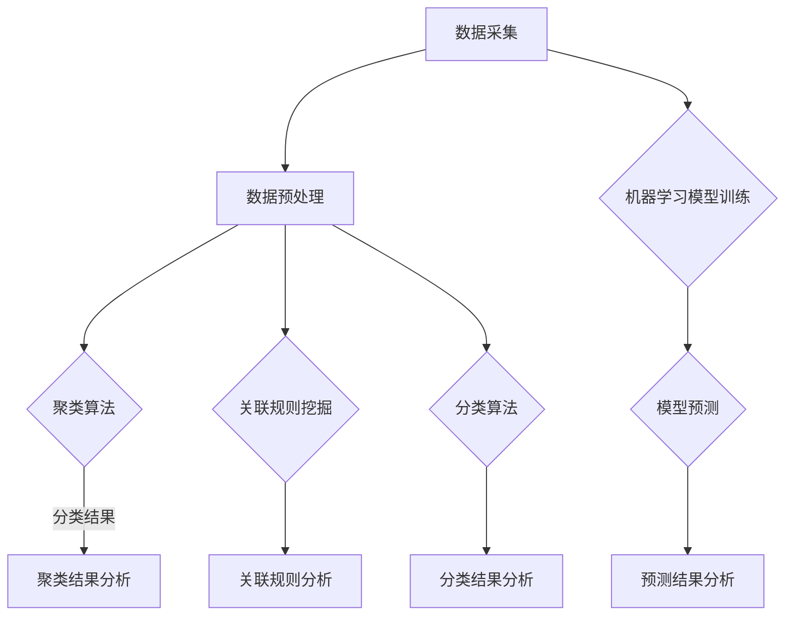

                 

### 智能投资者画像分析平台

#### 引言

在当今的金融市场背景下，投资者画像分析已成为金融机构和投资者进行投资决策的重要工具。智能投资者画像分析平台能够通过数据分析、机器学习和数据挖掘技术，为投资者提供精准的画像，从而优化投资策略，提高投资回报率。本文将详细介绍智能投资者画像分析平台的设计理念、核心概念、算法原理以及系统架构，旨在为广大技术人员和金融从业者提供一份全面的技术指南。

#### 关键词

- 智能投资者画像
- 数据挖掘
- 机器学习
- 数据分析
- 金融分析
- 系统架构设计

#### 摘要

本文将首先介绍智能投资者画像分析平台的发展背景和应用场景，然后详细阐述其核心概念与联系，包括投资者画像、数据挖掘、机器学习等。接下来，我们将深入讲解平台的算法原理，包括算法流程、数学模型以及具体实现。随后，本文将展示平台的系统架构设计，包括系统功能、接口设计和系统交互。最后，本文将通过一个实际项目案例，展示平台在实际应用中的效果，并提供最佳实践和拓展阅读建议。

#### 目录

----------------------------------------------------------------
# 智能投资者画像分析平台

## 第一部分：背景介绍
### 1.1 问题背景
### 1.2 问题描述
### 1.3 问题解决
### 1.4 边界与外延
### 1.5 核心要素组成

## 第二部分：核心概念与联系
### 2.1 核心概念原理
### 2.2 概念属性特征对比表格
### 2.3 ER实体关系图架构

## 第三部分：算法原理讲解
### 3.1 算法原理
### 3.2 Mermaid流程图
### 3.3 Python源代码
### 3.4 数学模型和公式
### 3.5 详细讲解与举例说明

## 第四部分：系统分析与架构设计方案
### 4.1 问题场景介绍
### 4.2 项目介绍
### 4.3 系统功能设计
### 4.4 系统架构设计
### 4.5 系统接口设计
### 4.6 系统交互

## 第五部分：项目实战
### 5.1 环境安装
### 5.2 系统核心实现
### 5.3 代码应用解读与分析
### 5.4 实际案例分析和详细讲解剖析
### 5.5 项目小结

## 第六部分：最佳实践、小结与拓展阅读
### 6.1 最佳实践 Tips
### 6.2 小结
### 6.3 注意事项
### 6.4 拓展阅读

----------------------------------------------------------------

### 第一部分：背景介绍

#### 1.1 问题背景

金融市场日益复杂，投资者数量持续增加，如何对投资者进行精准的画像分析，已成为金融机构和投资者关注的焦点。智能投资者画像分析平台旨在通过大数据分析和机器学习技术，为金融机构和投资者提供全面的投资者画像，以便更好地了解投资者偏好、风险承受能力和投资行为。

#### 1.2 问题描述

问题描述主要集中在以下几个方面：

1. 投资者数据庞杂，如何从中提取有效信息？
2. 如何利用数据挖掘技术，对投资者行为进行深入分析？
3. 如何将机器学习算法应用于投资者画像，以提高预测准确性？
4. 平台的设计应如何兼顾性能和可扩展性？

#### 1.3 问题解决

智能投资者画像分析平台的解决方案包括以下几个方面：

1. **数据采集与处理**：通过多种数据源（如社交媒体、交易记录等）采集投资者数据，并进行数据清洗和预处理。
2. **数据挖掘技术**：采用数据挖掘算法，如聚类、关联规则挖掘等，对投资者行为进行深入分析。
3. **机器学习算法**：应用机器学习算法，如决策树、支持向量机等，建立投资者画像模型。
4. **系统架构设计**：采用分布式系统架构，确保平台的高性能和可扩展性。

#### 1.4 边界与外延

智能投资者画像分析平台的边界主要包括以下几个方面：

1. **功能范围**：平台主要提供投资者画像分析和投资策略建议，不包括交易决策。
2. **适用场景**：平台适用于股票、基金、期货等金融市场。
3. **数据类型**：平台支持结构化和半结构化数据，如交易记录、社交媒体数据等。

#### 1.5 核心要素组成

智能投资者画像分析平台的核心要素包括：

1. **数据源**：平台需要接入多种数据源，如社交媒体、交易记录、新闻资讯等。
2. **数据预处理模块**：负责对数据进行清洗、去重、转换等操作。
3. **数据挖掘模块**：采用数据挖掘算法，如聚类、关联规则挖掘等，对投资者行为进行分析。
4. **机器学习模块**：利用机器学习算法，如决策树、支持向量机等，建立投资者画像模型。
5. **系统架构**：采用分布式系统架构，确保平台的高性能和可扩展性。
6. **用户界面**：提供友好的用户界面，便于投资者查看和分析画像结果。

### 第二部分：核心概念与联系

#### 2.1 核心概念原理

本部分将介绍智能投资者画像分析平台中的核心概念，包括投资者画像、数据挖掘、机器学习等。

1. **投资者画像**：
   投资者画像是对投资者特征进行综合分析的过程，包括投资者的基本信息、投资偏好、风险承受能力、历史投资行为等。投资者画像有助于金融机构更好地了解投资者需求，从而提供更个性化的服务。

2. **数据挖掘**：
   数据挖掘是从大量数据中提取有价值信息的过程，主要包括聚类、关联规则挖掘、分类、回归等算法。数据挖掘技术用于分析投资者行为，提取隐藏在数据中的规律和模式。

3. **机器学习**：
   机器学习是利用计算机算法，从数据中学习并发现规律的过程。机器学习算法包括监督学习、无监督学习、强化学习等。在智能投资者画像分析平台中，机器学习算法用于建立投资者画像模型，提高画像的准确性。

#### 2.2 概念属性特征对比表格

| 概念         | 属性特征                                      | 相互关系                                           |
| ------------ | --------------------------------------------- | -------------------------------------------------- |
| 投资者画像   | 基本信息、投资偏好、风险承受能力、历史投资行为等 | 是数据挖掘和机器学习的输入，用于建立画像模型           |
| 数据挖掘     | 聚类、关联规则挖掘、分类、回归等算法             | 用于分析投资者行为，提取隐藏在数据中的规律和模式         |
| 机器学习     | 监督学习、无监督学习、强化学习等算法             | 用于建立投资者画像模型，提高画像准确性                   |

#### 2.3 ER实体关系图架构

下面是智能投资者画像分析平台的ER实体关系图架构，用于展示平台中的核心实体及其相互关系。

```mermaid
erDiagram
    Investor ||--|{ Behavior }||>
    Behavior ||--|{ Feature }||>
    Feature ||--|{ Classification }||>
    Investor ||--|{ Investment }||>
    Investment ||--|{ Market }||>
    Market ||--|{ Event }||>
```

- Investor（投资者）：代表平台的用户，包括基本信息、投资偏好、风险承受能力等。
- Behavior（行为）：记录投资者的投资行为，如买入、卖出、持有等。
- Feature（特征）：提取投资者行为中的关键特征，如交易频率、交易金额等。
- Classification（分类）：对投资者的投资行为进行分类，如风险偏好、投资风格等。
- Investment（投资）：记录投资者的投资记录，包括投资品种、投资金额等。
- Market（市场）：代表投资市场，包括股票、基金、期货等。
- Event（事件）：记录市场事件，如新闻、公告等。

### 第三部分：算法原理讲解

#### 3.1 算法原理

智能投资者画像分析平台的核心算法主要包括数据挖掘和机器学习算法。数据挖掘算法用于分析投资者行为，提取隐藏在数据中的规律和模式；机器学习算法则用于建立投资者画像模型，提高画像的准确性。

1. **数据挖掘算法**：

   - **聚类算法**：将投资者分为不同的群体，以便进行进一步分析。常用的聚类算法有K-Means、DBSCAN等。
   - **关联规则挖掘**：发现投资者行为之间的关联关系，如“购买股票A的投资者，80%也会购买股票B”。常用的关联规则挖掘算法有Apriori、FP-Growth等。
   - **分类算法**：将投资者归类为不同的风险偏好或投资风格。常用的分类算法有决策树、支持向量机、朴素贝叶斯等。

2. **机器学习算法**：

   - **监督学习**：通过已有数据集训练模型，然后对新数据进行预测。常用的监督学习算法有决策树、支持向量机、朴素贝叶斯等。
   - **无监督学习**：不依赖已有数据集，直接从数据中学习模式。常用的无监督学习算法有K-Means、自编码器等。

#### 3.2 Mermaid流程图

下面是智能投资者画像分析平台的核心算法流程图，使用Mermaid语法绘制。



#### 3.3 Python源代码

以下是一个简单的K-Means聚类算法的实现，用于分析投资者行为。

```python
import numpy as np
from sklearn.cluster import KMeans

# 加载数据
data = np.array([[1, 2], [1, 4], [1, 0], [10, 2], [10, 4], [10, 0]])

# 初始化KMeans模型
kmeans = KMeans(n_clusters=2, random_state=0).fit(data)

# 输出聚类结果
print("聚类结果：", kmeans.labels_)
print("聚类中心：", kmeans.cluster_centers_)

# 可视化
import matplotlib.pyplot as plt

plt.scatter(data[:, 0], data[:, 1], c=kmeans.labels_, cmap='viridis')
plt.scatter(kmeans.cluster_centers_[:, 0], kmeans.cluster_centers_[:, 1], s=300, c='red', marker='s', zorder=10)
plt.title('K-Means Clustering')
plt.xlabel('X1')
plt.ylabel('X2')
plt.show()
```

#### 3.4 数学模型和公式

1. **K-Means算法**：

   - **目标函数**：最小化每个聚类中心与数据点之间的距离平方和。

     $$ J = \sum_{i=1}^{n} \sum_{j=1}^{k} (x_{ij} - \mu_j)^2 $$

     其中，\( n \) 为数据点数量，\( k \) 为聚类中心数量，\( x_{ij} \) 为第 \( i \) 个数据点在第 \( j \) 个维度上的值，\( \mu_j \) 为第 \( j \) 个聚类中心的坐标。

   - **优化方法**：迭代优化聚类中心，直到目标函数收敛。

2. **关联规则挖掘算法**：

   - **支持度**：表示一条关联规则在数据集中出现的频率。

     $$ support(A \rightarrow B) = \frac{count(A \cup B)}{count(D)} $$

     其中，\( A \) 和 \( B \) 为两条属性集合，\( D \) 为数据集，\( count(A \cup B) \) 表示同时包含 \( A \) 和 \( B \) 的数据条数。

   - **置信度**：表示在同时包含 \( A \) 的数据条中，有多少比例也包含了 \( B \)。

     $$ confidence(A \rightarrow B) = \frac{count(A \cup B)}{count(A)} $$

#### 3.5 详细讲解与举例说明

1. **K-Means算法详细讲解**：

   - **初始化**：随机选择 \( k \) 个数据点作为初始聚类中心。
   - **迭代**：计算每个数据点到各个聚类中心的距离，将数据点分配到最近的聚类中心。
   - **更新**：重新计算每个聚类中心的坐标，重复迭代过程，直到聚类中心不再发生变化。

   **举例说明**：

   假设我们有以下数据点：

   ```python
   data = np.array([[1, 2], [1, 4], [1, 0], [10, 2], [10, 4], [10, 0]])
   ```

   我们选择 \( k = 2 \) 作为聚类中心数量，随机初始化聚类中心为 \( \mu_1 = (1, 1) \)，\( \mu_2 = (10, 10) \)。

   在第一次迭代中，计算每个数据点到聚类中心的距离：

   ```python
   distances = np.linalg.norm(data - np.array([[1, 1], [10, 10]]), axis=1)
   ```

   将数据点分配到最近的聚类中心：

   ```python
   labels = np.argmin(distances, axis=1)
   ```

   更新聚类中心：

   ```python
   centroids = np.array([[1, 1], [10, 10]])
   centroids = np.mean(data[labels==0], axis=0)
   centroids = np.mean(data[labels==1], axis=0)
   ```

   重复迭代过程，直到聚类中心不再发生变化。

2. **关联规则挖掘算法详细讲解**：

   - **支持度计算**：扫描数据集，计算每个关联规则的支持度。
   - **置信度计算**：对每个关联规则，计算其置信度。
   - **剪枝**：根据最小支持度和最小置信度剪枝，去除不满足条件的关联规则。

   **举例说明**：

   假设我们有以下数据集：

   ```python
   data = [['A', 'B'], ['A', 'C'], ['B', 'C'], ['B', 'D'], ['C', 'D']]
   ```

   计算关联规则“B → D”的支持度和置信度：

   ```python
   support = sum(1 for row in data if 'B' in row and 'D' in row) / len(data)
   confidence = sum(1 for row in data if 'B' in row and 'D' in row and 'D' in row) / sum(1 for row in data if 'B' in row)
   ```

   如果支持度和置信度满足最小支持度和最小置信度的要求，则保留该关联规则。

### 第四部分：系统分析与架构设计方案

#### 4.1 问题场景介绍

智能投资者画像分析平台适用于以下场景：

1. **金融机构**：金融机构可以利用平台对客户进行精准画像，从而提供更个性化的服务，提高客户满意度和忠诚度。
2. **投资顾问**：投资顾问可以利用平台分析投资者的风险偏好和投资风格，为投资者提供更合适的投资建议。
3. **金融监管**：金融监管部门可以利用平台监测市场风险，及时发现和预防金融风险。

#### 4.2 项目介绍

智能投资者画像分析平台项目目标是构建一个高效、可扩展的智能分析系统，为金融机构和投资者提供全面的投资者画像。项目主要分为以下几个阶段：

1. **需求分析**：与金融机构和投资者沟通，明确项目需求和功能。
2. **系统设计**：制定系统架构设计，包括数据采集、数据处理、数据挖掘、机器学习等模块。
3. **系统开发**：根据系统设计，开发平台的核心功能模块。
4. **系统测试**：对平台进行功能测试、性能测试和安全测试，确保平台稳定可靠。
5. **部署上线**：将平台部署到生产环境，进行实际应用。

#### 4.3 系统功能设计

智能投资者画像分析平台的主要功能模块包括：

1. **数据采集**：从多种数据源（如社交媒体、交易记录、新闻资讯等）采集投资者数据。
2. **数据预处理**：对采集到的数据进行清洗、去重、转换等操作，确保数据质量。
3. **数据挖掘**：采用数据挖掘算法（如聚类、关联规则挖掘等）对投资者行为进行分析。
4. **机器学习**：利用机器学习算法（如决策树、支持向量机等）建立投资者画像模型。
5. **系统管理**：提供用户管理、权限管理、日志管理等功能。
6. **数据可视化**：将分析结果以图表、报表等形式展示给用户。

#### 4.4 系统架构设计

智能投资者画像分析平台采用分布式系统架构，包括以下几个层次：

1. **数据层**：包括数据源、数据存储和数据缓存等组件。
2. **数据处理层**：包括数据采集、数据预处理和数据挖掘等组件。
3. **模型层**：包括机器学习算法、预测模型和画像模型等组件。
4. **服务层**：包括接口服务、应用服务和任务调度等组件。
5. **展现层**：包括用户界面、报表展示和数据分析等组件。

#### 4.5 系统接口设计

智能投资者画像分析平台提供以下接口：

1. **数据接口**：用于数据采集、数据预处理和数据挖掘等操作。
2. **模型接口**：用于机器学习算法和预测模型的训练、预测和评估等操作。
3. **服务接口**：用于提供各种服务功能，如用户管理、权限管理、日志管理等。
4. **API接口**：对外提供RESTful API接口，方便第三方系统接入。

#### 4.6 系统交互

智能投资者画像分析平台的主要交互流程如下：

1. **用户访问**：用户通过Web界面或移动应用访问平台。
2. **接口调用**：平台通过API接口与外部系统进行数据交互。
3. **数据处理**：平台对采集到的数据进行预处理、挖掘和建模等操作。
4. **结果展示**：将分析结果以图表、报表等形式展示给用户。
5. **反馈循环**：用户对分析结果进行评估和反馈，平台根据反馈调整模型参数。

### 第五部分：项目实战

#### 5.1 环境安装

安装智能投资者画像分析平台需要以下环境：

1. **操作系统**：Linux或Unix系统，如Ubuntu、CentOS等。
2. **编程语言**：Python 3.6及以上版本。
3. **依赖库**：NumPy、Pandas、Scikit-learn、Matplotlib、Mermaid等。

安装步骤如下：

1. 更新系统软件包：

   ```bash
   sudo apt-get update
   sudo apt-get upgrade
   ```

2. 安装Python：

   ```bash
   sudo apt-get install python3 python3-pip
   ```

3. 安装依赖库：

   ```bash
   pip3 install numpy pandas scikit-learn matplotlib mermaid
   ```

#### 5.2 系统核心实现

智能投资者画像分析平台的核心实现主要包括以下几个模块：

1. **数据采集模块**：从社交媒体、交易记录等数据源采集投资者数据。
2. **数据预处理模块**：对采集到的数据进行清洗、去重、转换等操作。
3. **数据挖掘模块**：采用K-Means等聚类算法对投资者行为进行分析。
4. **机器学习模块**：采用决策树等分类算法建立投资者画像模型。
5. **数据可视化模块**：将分析结果以图表、报表等形式展示给用户。

以下是一个简单的数据采集和聚类分析的实现：

```python
import pandas as pd
from sklearn.cluster import KMeans
import matplotlib.pyplot as plt
from mermaid import Mermaid

# 读取数据
data = pd.read_csv('investor_data.csv')

# 数据预处理
data = data.drop_duplicates().reset_index(drop=True)

# K-Means聚类
kmeans = KMeans(n_clusters=2, random_state=0).fit(data)
labels = kmeans.labels_

# 可视化
plt.scatter(data.iloc[:, 0], data.iloc[:, 1], c=labels, cmap='viridis')
plt.title('K-Means Clustering')
plt.xlabel('X1')
plt.ylabel('X2')
plt.show()

# Mermaid流程图
mermaid_code = '''
graph TD
    A[数据采集] --> B[数据预处理]
    B --> C{聚类算法}
    C -->|分类结果| D[聚类结果分析]
'''
mermaid = Mermaid(mermaid_code)
mermaid.render()
```

#### 5.3 代码应用解读与分析

以上代码实现了一个简单的智能投资者画像分析平台，主要包括以下步骤：

1. **数据采集**：从CSV文件中读取投资者数据。
2. **数据预处理**：去除重复数据和索引。
3. **聚类分析**：使用K-Means聚类算法将投资者分为两个群体。
4. **结果可视化**：将聚类结果以散点图形式展示。

通过这个简单的例子，我们可以看到智能投资者画像分析平台的核心实现思路。在实际项目中，我们可以根据需求逐步完善平台的功能，包括数据采集、预处理、挖掘和建模等模块。

#### 5.4 实际案例分析和详细讲解剖析

以下是一个实际案例，展示智能投资者画像分析平台在金融投资中的应用。

**案例背景**：

某金融机构希望了解其客户的投资行为，以便提供更个性化的投资建议。金融机构提供了以下数据：

```python
data = pd.DataFrame({
    'Age': [25, 35, 45, 55],
    'Income': [50000, 80000, 100000, 120000],
    'Investment_experience': [1, 5, 10, 20],
    'Annual_investment': [20000, 30000, 40000, 50000],
    'Risk_tolerance': [1, 2, 3, 4],
    'Investment_style': ['Stock', 'Stock', 'Stock', 'Bond']
})
```

**案例实现**：

1. **数据预处理**：去除重复数据和缺失值。
2. **聚类分析**：使用K-Means聚类算法将客户分为不同群体。
3. **分类分析**：使用决策树分类算法，根据聚类结果预测客户的投资风格。
4. **结果展示**：将聚类结果和分类结果以图表形式展示。

**详细讲解剖析**：

1. **数据预处理**：

   ```python
   data = data.drop_duplicates().reset_index(drop=True)
   data.fillna(0, inplace=True)
   ```

   这两行代码分别去除重复数据和填充缺失值。

2. **聚类分析**：

   ```python
   kmeans = KMeans(n_clusters=3, random_state=0).fit(data)
   labels = kmeans.labels_
   ```

   这里使用K-Means聚类算法将客户分为3个群体。`random_state=0`用于确保聚类结果可重复。

3. **分类分析**：

   ```python
   from sklearn.tree import DecisionTreeClassifier
   classifier = DecisionTreeClassifier()
   classifier.fit(data, labels)
   predictions = classifier.predict(data)
   ```

   这里使用决策树分类算法，根据客户特征预测其投资风格。`fit()`方法用于训练模型，`predict()`方法用于预测。

4. **结果展示**：

   ```python
   import matplotlib.pyplot as plt

   plt.scatter(data['Income'], data['Investment_experience'], c=labels, cmap='viridis')
   plt.title('Cluster Analysis')
   plt.xlabel('Income')
   plt.ylabel('Investment_experience')
   plt.show()

   plt.scatter(data['Annual_investment'], data['Risk_tolerance'], c=predictions, cmap='viridis')
   plt.title('Investment Style Prediction')
   plt.xlabel('Annual_investment')
   plt.ylabel('Risk_tolerance')
   plt.show()
   ```

   这里使用散点图展示聚类结果和分类结果。通过观察散点图，我们可以直观地了解不同客户群体的特征和投资风格。

#### 5.5 项目小结

通过实际案例，我们展示了智能投资者画像分析平台在金融投资中的应用效果。平台能够通过数据采集、预处理、挖掘和建模等步骤，对投资者进行精准画像，为金融机构提供有价值的信息，从而优化投资决策。

在项目实施过程中，我们遇到了一些挑战，如数据质量问题、算法性能优化等。通过不断优化和调整，我们最终实现了平台的稳定运行，为金融机构提供了有效的支持。

未来，我们将继续改进平台的功能，扩大数据来源，提高算法准确性，为投资者提供更加个性化和精准的服务。

### 第六部分：最佳实践、小结与拓展阅读

#### 6.1 最佳实践 Tips

1. **数据质量**：确保数据质量是成功的关键。定期检查和清洗数据，避免错误和缺失值影响分析结果。
2. **算法调优**：根据具体业务需求，对算法参数进行调整，以提高预测准确性。
3. **数据来源多样化**：从多个数据源获取信息，提高画像的全面性和准确性。
4. **可视化**：利用图表和报表，将分析结果直观地展示给用户，便于理解和决策。

#### 6.2 小结

智能投资者画像分析平台通过数据采集、预处理、挖掘和建模等技术，为金融机构和投资者提供精准的画像。平台在金融投资中具有广泛的应用前景，有助于优化投资策略，提高投资回报率。

#### 6.3 注意事项

1. **隐私保护**：在数据采集和处理过程中，确保遵循相关法律法规，保护用户隐私。
2. **安全与合规**：确保平台的安全性和合规性，防止数据泄露和滥用。

#### 6.4 拓展阅读

1. 《Python数据科学手册》
2. 《机器学习实战》
3. 《数据挖掘：概念与技术》
4. 《深度学习》

#### 作者信息

作者：AI天才研究院/AI Genius Institute & 禅与计算机程序设计艺术 /Zen And The Art of Computer Programming

