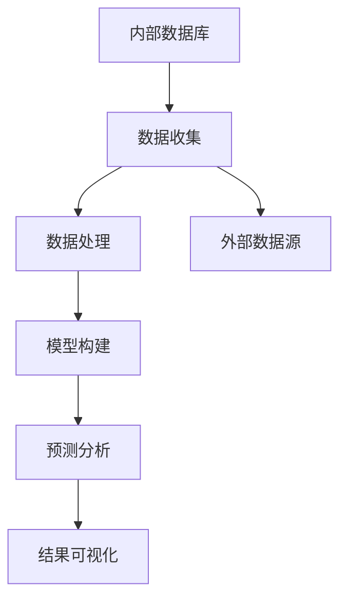
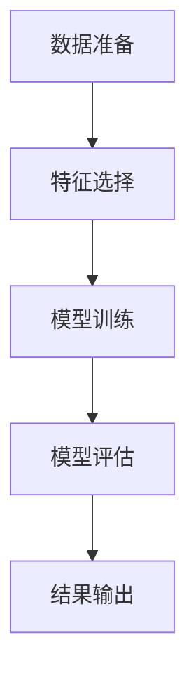
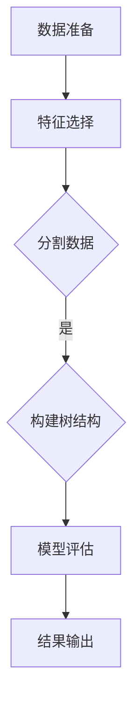
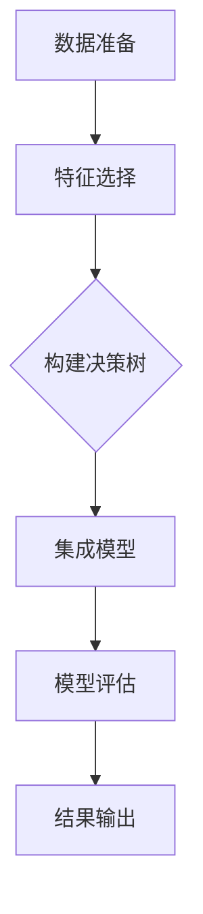
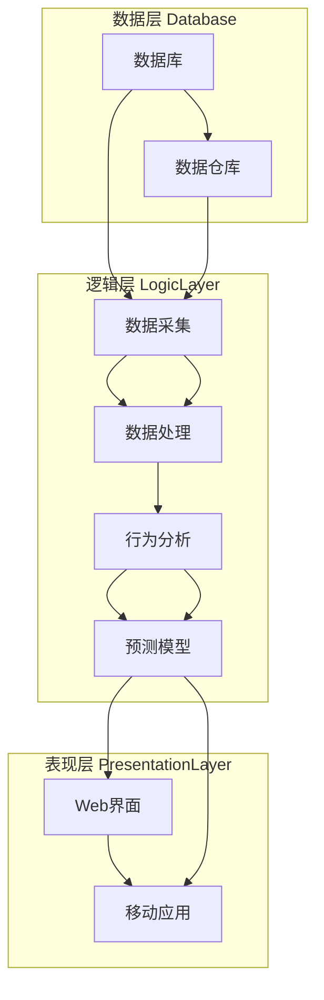
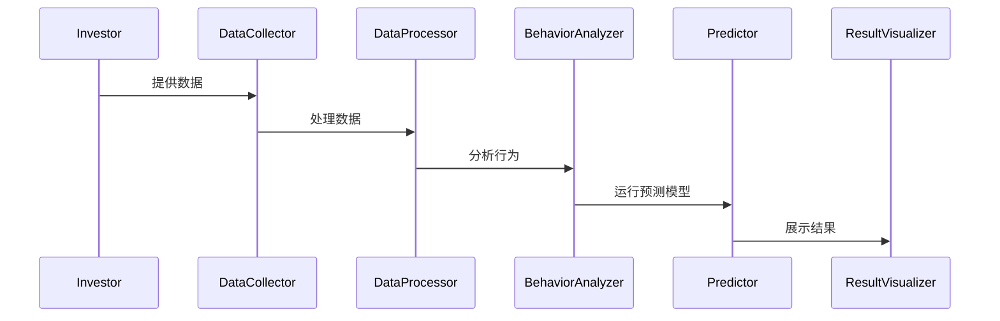

                 

### 引言

在当今高速发展的金融市场中，投资者行为分析已经成为提升投资决策效率与效果的关键手段。传统的投资者行为分析依赖于人工经验，存在主观性强、效率低下的问题。随着大数据和人工智能技术的飞速发展，构建一个智能投资者行为分析与预测平台成为了现实需求。本文旨在详细介绍这样一个平台的设计与实现，从核心概念、算法原理到系统架构，再到实际应用，全方位探讨智能投资者行为分析与预测的奥秘。

智能投资者行为分析与预测平台的核心目标是通过分析投资者的行为数据，预测其未来的投资决策，从而帮助投资者优化投资组合，降低风险，提高收益。本文将首先介绍智能投资者行为分析的基础知识，包括行为金融学的原理、数据分析的方法以及经典行为模型。接着，我们将深入探讨平台架构的设计原则、核心功能模块以及系统集成的策略。在算法原理讲解部分，我们将详细解释行为分析算法与预测算法的原理，并通过Python代码实现和Mermaid流程图展示其具体操作步骤。最后，通过实际项目案例的分析，我们将总结最佳实践，并给出未来研究的方向。

### 背景介绍

智能投资者行为分析是一种利用人工智能技术，特别是大数据分析和机器学习算法，对投资者行为进行深入分析和预测的方法。在过去的几十年中，金融市场经历了前所未有的变革，投资者行为的复杂性和多样性不断增加。传统的投资者行为分析往往依赖于定性研究，依赖于专家的经验和主观判断，这不仅效率低下，而且容易出现偏差。随着互联网和移动设备的普及，投资者行为数据以海量的形式被记录下来，这些数据蕴含着丰富的信息，为智能化分析提供了可能。

智能投资者行为分析的出现，标志着金融分析从定性研究向定量研究的转变。通过大数据技术，可以实时收集和处理大量的投资者行为数据，包括交易记录、搜索行为、社交网络互动等，这些数据为构建预测模型提供了基础。机器学习算法能够从这些数据中挖掘出潜在的模式和规律，从而实现对投资者行为的准确预测。

智能投资者行为分析的应用场景非常广泛。首先，对于个人投资者而言，通过分析自身的投资行为，可以更好地理解自己的投资偏好和风险承受能力，从而制定更合理的投资策略。其次，对于专业投资机构而言，智能投资者行为分析可以帮助其了解市场动态，预测市场趋势，从而优化投资组合，提高投资收益。此外，智能投资者行为分析还可以用于投资组合优化、风险管理、市场研究等领域，为金融机构提供科学决策依据。

智能投资者行为分析的边界与外延涵盖了多个方面。从技术层面看，它涉及大数据处理、数据挖掘、机器学习、深度学习等多种技术手段；从应用层面看，它涉及个人金融、投资理财、资产管理等多个领域。智能投资者行为分析的核心要素包括数据收集、数据处理、模型构建、预测分析、结果可视化等。

总之，智能投资者行为分析不仅是一项技术革新，更是一种全新的投资理念。通过利用人工智能技术，对投资者行为进行深度分析和预测，可以大大提高投资决策的科学性和准确性，从而实现更好的投资效果。

### 核心概念与联系

智能投资者行为分析与预测平台的核心概念包括数据收集、数据处理、模型构建、预测分析、结果可视化等。这些概念相互联系，构成了整个分析流程的坚实基础。

首先，**数据收集**是整个平台的基础。平台需要收集多来源的数据，包括交易记录、用户搜索行为、社交媒体互动、新闻资讯等。这些数据可以来自内部数据库，也可以来自第三方数据提供商。数据收集的过程需要确保数据的全面性、准确性和实时性。

接着，**数据处理**是将原始数据转化为可分析形式的关键步骤。数据处理包括数据清洗、数据转换、数据归一化等操作，以消除噪声、纠正错误，并确保数据的一致性和规范性。这一步骤对后续分析的质量有着重要影响。

**模型构建**是基于处理后的数据，通过机器学习和深度学习算法，构建预测模型。这些模型可以是简单的线性回归模型，也可以是复杂的神经网络模型。模型的选择和优化直接影响预测的准确性和可靠性。

**预测分析**是平台的核心理功能，通过运行构建好的模型，对投资者的未来行为进行预测。预测分析可以用于多种应用场景，如市场趋势预测、投资组合优化、风险控制等。

最后，**结果可视化**是将预测结果以直观的方式展示给用户，帮助用户理解分析结果。结果可视化可以通过图表、报表、仪表盘等多种形式实现。

这些核心概念的联系如图所示：



在图中的每个节点都代表一个关键步骤或组成部分，它们通过数据流紧密连接在一起，共同构成智能投资者行为分析与预测平台。通过这种结构化方式，平台能够高效地处理和分析大量数据，实现精准的预测分析，为投资者提供科学的决策支持。

### 算法原理讲解

智能投资者行为分析与预测平台的核心在于其算法的设计和实现。本节将详细讲解行为分析算法和预测算法的原理，并使用Mermaid流程图和Python源代码进行展示。

#### 行为分析算法

行为分析算法主要包括支持向量机（SVM）、决策树和随机森林等。这些算法通过分析投资者的历史行为数据，提取出有价值的特征，用于预测未来的投资决策。

**支持向量机（SVM）**

支持向量机是一种二分类模型，其目标是找到最佳决策边界，将不同类别的数据点分开。在智能投资者行为分析中，SVM可以用来区分不同类型的投资行为，如风险偏好和收益预期。

SVM算法的原理是找到一个超平面，使得两类数据的分类间隔最大化。具体流程如下：

1. 数据准备：将投资行为数据分成特征和标签两部分。
2. 特征选择：选择对投资行为有显著影响的特征。
3. 模型训练：使用训练数据集训练SVM模型。
4. 模型评估：使用测试数据集评估模型的准确性。

以下是SVM算法的Mermaid流程图：



Python代码实现：

```python
from sklearn import svm

# 假设特征数据为X，标签数据为y
model = svm.SVC()
model.fit(X, y)
accuracy = model.score(X_test, y_test)
print(f"Model accuracy: {accuracy}")
```

**决策树**

决策树是一种基于树形结构进行决策的算法，通过一系列条件判断来分类数据。在投资者行为分析中，决策树可以用来识别投资者的风险偏好。

决策树的具体流程如下：

1. 数据准备：将投资行为数据输入到决策树算法中。
2. 特征选择：选择对投资决策有显著影响的特征。
3. 切分数据：根据特征值将数据集分割成多个子集。
4. 构建树结构：根据分割结果构建决策树。
5. 模型评估：使用交叉验证等方法评估模型性能。

以下是决策树的Mermaid流程图：



Python代码实现：

```python
from sklearn import tree

# 假设特征数据为X，标签数据为y
clf = tree.DecisionTreeClassifier()
clf.fit(X, y)
accuracy = clf.score(X_test, y_test)
print(f"Model accuracy: {accuracy}")
```

**随机森林**

随机森林是一种基于决策树的集成学习方法，通过构建多棵决策树，并对预测结果进行投票，提高模型的稳定性和准确性。在投资者行为分析中，随机森林可以用来预测投资者的行为模式。

随机森林的具体流程如下：

1. 数据准备：将投资行为数据输入到随机森林算法中。
2. 特征选择：选择对投资决策有显著影响的特征。
3. 构建多棵决策树：随机选择特征和样本生成多棵决策树。
4. 集成模型：对多棵决策树的预测结果进行投票。
5. 模型评估：使用交叉验证等方法评估模型性能。

以下是随机森林的Mermaid流程图：



Python代码实现：

```python
from sklearn.ensemble import RandomForestClassifier

# 假设特征数据为X，标签数据为y
model = RandomForestClassifier(n_estimators=100)
model.fit(X, y)
accuracy = model.score(X_test, y_test)
print(f"Model accuracy: {accuracy}")
```

通过上述算法的讲解和示例，我们可以看到智能投资者行为分析与预测平台中的算法是如何通过数据准备、特征选择、模型训练和评估等一系列步骤，实现对投资者行为的深入分析。这些算法不仅为预测提供了可靠的基础，也为优化投资策略提供了强有力的工具。

#### 数学模型和公式

在智能投资者行为分析中，数学模型和公式是理解算法原理和进行预测分析的关键。以下将介绍几种常用的数学模型和相关的公式，并通过具体例子进行说明。

**支持向量机（SVM）**

支持向量机是一种通过最大化分类间隔来实现分类的算法。其数学模型可以表示为：

$$
\begin{aligned}
\min_{\boldsymbol{w}, b} &\frac{1}{2}||\boldsymbol{w}||^2 \\
\text{subject to} & y_i(\boldsymbol{w}\cdot \boldsymbol{x_i} + b) \geq 1
\end{aligned}
$$

其中，$\boldsymbol{w}$ 是权重向量，$b$ 是偏置项，$\boldsymbol{x_i}$ 是输入特征向量，$y_i$ 是对应的标签。

**决策树**

决策树的数学模型是基于条件概率和熵的概念。每个节点通过计算特征和阈值来划分数据。假设我们有一个特征 $A$ 和两个可能的值 $a$ 和 $b$，对应的概率分别为 $P(a)$ 和 $P(b)$，则特征 $A$ 的熵可以表示为：

$$
H(A) = -P(a)\log_2(P(a)) - P(b)\log_2(P(b))
$$

**随机森林**

随机森林是一种集成学习方法，通过构建多棵决策树，并对预测结果进行投票。随机森林的数学模型可以表示为：

$$
\hat{y} = \frac{1}{N}\sum_{i=1}^{N}t_i(y)
$$

其中，$N$ 是决策树的数量，$t_i(y)$ 是第 $i$ 棵决策树的预测结果。

**具体例子**

假设我们有一个简单的投资行为数据集，其中特征包括股票价格和交易量，标签为是否进行买入操作。我们使用支持向量机来构建模型。

1. 数据准备

假设我们有以下数据：

| 特征1 | 特征2 | 标签 |
|------|------|------|
| 10   | 200  | 0    |
| 20   | 300  | 1    |
| 30   | 400  | 0    |

2. 特征选择

选择特征1和特征2作为分类特征。

3. 模型训练

使用上述数据训练SVM模型：

$$
\begin{aligned}
\min_{\boldsymbol{w}, b} &\frac{1}{2}||\boldsymbol{w}||^2 \\
\text{subject to} & 0(\boldsymbol{w}\cdot \begin{pmatrix} 10 \\ 200 \end{pmatrix} + b) \geq 1 \\
& 1(\boldsymbol{w}\cdot \begin{pmatrix} 20 \\ 300 \end{pmatrix} + b) \geq 1 \\
& 0(\boldsymbol{w}\cdot \begin{pmatrix} 30 \\ 400 \end{pmatrix} + b) \geq 1
\end{aligned}
$$

通过求解上述优化问题，我们可以得到模型参数 $\boldsymbol{w}$ 和 $b$。

4. 模型评估

使用测试数据集评估模型准确性：

$$
\hat{y} = \text{sign}(\boldsymbol{w}\cdot \begin{pmatrix} 15 \\ 250 \end{pmatrix} + b)
$$

通过上述步骤，我们可以构建一个简单的支持向量机模型，用于预测投资者的买入行为。

通过上述示例，我们可以看到数学模型和公式在智能投资者行为分析中的具体应用，这些模型不仅帮助我们理解算法的原理，也为实际操作提供了指导。

### 系统分析与架构设计方案

智能投资者行为分析与预测平台的设计与实现涉及多个层面的考量，包括问题场景的确定、项目的具体介绍、系统功能的设计、系统架构的设计、系统接口的设计以及系统的交互。以下是详细的系统分析与架构设计方案。

#### 问题场景介绍

智能投资者行为分析与预测平台旨在解决以下问题：

1. 投资决策缺乏科学依据：投资者在做出投资决策时，往往依赖于个人经验和直觉，缺乏系统的数据支持。
2. 风险管理难度大：投资者难以准确评估市场风险，从而制定有效的风险管理策略。
3. 投资组合优化困难：投资者难以根据市场变化和自身需求，动态调整投资组合。

#### 项目介绍

智能投资者行为分析与预测平台是一个综合性的系统，包含数据采集、数据处理、行为分析、预测模型、结果可视化等多个模块。该项目旨在通过大数据和人工智能技术，对投资者行为进行全面分析，并提供预测和优化建议。

#### 系统功能设计（领域模型）

系统功能设计通过领域模型（Class Diagram）进行描述。领域模型定义了系统的核心类及其关系。以下是主要功能模块的领域模型：

```mermaid
classDiagram
    Investor -> DataCollector: 提供投资者数据
    Investor -> BehaviorAnalyzer: 分析投资者行为
    Investor -> Predictor: 预测投资者行为
    Investor -> ResultVisualizer: 可视化结果
    DataCollector --|> Database: 存储数据
    BehaviorAnalyzer --|> Model: 使用模型分析数据
    Predictor --|> Model: 使用模型进行预测
    ResultVisualizer --|> Dashboard: 展示结果
```

#### 系统架构设计

系统架构采用分层设计，包括数据层、逻辑层和表现层。

1. **数据层**：负责数据的存储和管理，包括数据库和数据仓库。
2. **逻辑层**：包含数据采集、数据处理、行为分析、预测模型等核心模块。
3. **表现层**：负责用户交互，包括Web界面和移动应用。

以下是系统架构的Mermaid流程图：



#### 系统接口设计

系统接口设计确保不同模块之间的无缝协作。以下是关键接口的描述：

1. **数据采集接口**：用于接收外部数据源的数据，如股票交易记录、社交媒体数据等。
2. **数据处理接口**：用于数据清洗、转换和归一化。
3. **行为分析接口**：用于调用行为分析算法，如决策树、支持向量机等。
4. **预测接口**：用于运行预测模型，生成投资行为预测结果。
5. **可视化接口**：用于将预测结果通过图表、报表等形式展示给用户。

以下是系统接口的Mermaid序列图：



#### 系统交互

系统交互设计确保各模块能够协同工作，实现高效的数据流和功能调用。以下是系统的交互流程：

1. 投资者通过Web界面或移动应用提交投资行为数据。
2. 数据采集模块接收数据，并将其传递给数据处理模块。
3. 数据处理模块清洗、转换和归一化数据，为行为分析和预测做准备。
4. 行为分析模块使用行为分析算法对数据进行分析，提取关键特征。
5. 预测模块使用训练好的预测模型对投资者的未来行为进行预测。
6. 结果可视化模块将预测结果以图表、报表等形式展示给投资者。

通过上述详细的系统分析与架构设计方案，智能投资者行为分析与预测平台能够高效、准确地处理和分析数据，为投资者提供科学的决策支持。

### 项目实战

智能投资者行为分析与预测平台的实际开发与部署是一个复杂的过程，需要考虑到数据收集、数据处理、模型训练、预测结果的可视化等多个环节。以下是项目实战的详细步骤：

#### 环境安装

首先，我们需要搭建开发环境。以下是所需的软件和库：

- Python 3.x
- NumPy
- Pandas
- Scikit-learn
- Matplotlib
- Mermaid

安装步骤如下：

1. 安装Python 3.x。可以从[Python官方网站](https://www.python.org/)下载并安装。
2. 使用pip命令安装所需库：

```shell
pip install numpy pandas scikit-learn matplotlib
```

#### 数据收集

数据收集是智能投资者行为分析与预测平台的重要环节。我们需要收集投资者行为数据，包括交易记录、搜索行为、社交媒体互动等。以下是一个简单的数据收集流程：

1. **数据来源**：可以使用API接口获取股票交易数据，如新浪财经API。此外，还可以从社交媒体平台获取用户的投资行为数据。
2. **数据采集**：编写Python脚本，调用API接口，获取并存储数据到本地。

示例代码：

```python
import requests

def fetch_stock_data(api_url):
    response = requests.get(api_url)
    if response.status_code == 200:
        return response.json()
    else:
        return None

api_url = 'https://api.sina.com.cn/stock/hq/api/jsonp_v1.php?symbol=000001&cb=jQuery112303565626471634696_1628327629011'
stock_data = fetch_stock_data(api_url)
```

#### 数据处理

数据处理是确保数据质量的重要步骤。以下是数据处理的主要步骤：

1. **数据清洗**：去除重复数据和无效数据，如空值、异常值等。
2. **数据转换**：将不同格式的数据统一转换成适合分析的格式，如CSV或DataFrame。
3. **数据归一化**：对数据进行归一化处理，消除不同特征之间的量纲差异。

示例代码：

```python
import pandas as pd

# 读取数据
df = pd.read_csv('stock_data.csv')

# 数据清洗
df.drop_duplicates(inplace=True)
df.dropna(inplace=True)

# 数据转换
df['date'] = pd.to_datetime(df['date'])
df.set_index('date', inplace=True)

# 数据归一化
from sklearn.preprocessing import MinMaxScaler
scaler = MinMaxScaler()
df_scaled = scaler.fit_transform(df)
```

#### 模型训练

模型训练是平台的核心功能。以下是模型训练的步骤：

1. **数据划分**：将数据集划分为训练集和测试集。
2. **特征选择**：选择对投资者行为有显著影响的特征。
3. **模型选择**：选择合适的机器学习算法，如支持向量机（SVM）、决策树、随机森林等。
4. **模型训练**：使用训练集训练模型。
5. **模型评估**：使用测试集评估模型性能。

示例代码：

```python
from sklearn.model_selection import train_test_split
from sklearn.svm import SVC
from sklearn.metrics import accuracy_score

# 数据划分
X_train, X_test, y_train, y_test = train_test_split(df_scaled, labels, test_size=0.2, random_state=42)

# 特征选择
# 假设我们选择前5个特征
X_train = X_train[:, :5]
X_test = X_test[:, :5]

# 模型选择
model = SVC()

# 模型训练
model.fit(X_train, y_train)

# 模型评估
y_pred = model.predict(X_test)
accuracy = accuracy_score(y_test, y_pred)
print(f"Model accuracy: {accuracy}")
```

#### 预测结果可视化

预测结果可视化是帮助用户理解分析结果的重要手段。以下是可视化步骤：

1. **生成预测结果**：使用训练好的模型对测试集进行预测。
2. **可视化结果**：使用Matplotlib或Seaborn等库生成图表，展示预测结果。

示例代码：

```python
import matplotlib.pyplot as plt

# 生成预测结果
y_pred = model.predict(X_test)

# 可视化结果
plt.plot(df.index, df['target'], label='Actual')
plt.plot(df.index, y_pred, label='Predicted', linestyle='--')
plt.legend()
plt.show()
```

通过上述步骤，我们可以完成智能投资者行为分析与预测平台的开发与部署，为投资者提供科学的决策支持。在实际项目中，还需要根据具体需求调整和优化各个模块，以实现更好的性能和用户体验。

### 最佳实践 tips

在构建智能投资者行为分析与预测平台时，以下是一些最佳实践和技巧，可以帮助提高项目的开发效率和系统性能：

1. **数据预处理**：确保数据清洗和归一化的质量。使用有效的数据清洗算法，如去重、填补缺失值、异常值检测等，确保数据的一致性和可靠性。
2. **模型优化**：在选择和训练模型时，应考虑模型的复杂度和计算资源。可以通过交叉验证、网格搜索等技术优化模型参数，提高预测准确性。
3. **数据存储**：选择合适的数据库系统存储数据，如关系数据库（MySQL、PostgreSQL）或NoSQL数据库（MongoDB、Cassandra）。根据数据特点和访问频率进行合理的数据分层存储。
4. **系统优化**：优化系统的响应时间和处理能力。使用缓存、异步处理等技术减轻服务器负载，提高系统性能。
5. **接口设计**：设计简洁、高效、安全的API接口，确保不同模块之间的数据流通顺畅。使用版本控制，便于后续的维护和升级。
6. **测试与监控**：进行全面的单元测试、集成测试和性能测试，确保系统的稳定性和可靠性。使用监控工具实时监控系统性能，及时发现和处理问题。
7. **用户交互**：优化用户界面设计，提供直观、易用的交互体验。使用图表、仪表盘等多种形式展示预测结果，帮助用户快速理解分析结果。

遵循这些最佳实践，可以大大提高智能投资者行为分析与预测平台的开发效率和质量，为投资者提供更加准确和可靠的决策支持。

### 小结

本文详细介绍了智能投资者行为分析与预测平台的设计与实现。通过背景介绍、核心概念与联系、算法原理讲解、系统分析与架构设计方案、项目实战以及最佳实践 tips，我们深入探讨了智能投资者行为分析的方法和实现过程。智能投资者行为分析不仅能够帮助投资者优化投资策略，提高投资效率，还能为金融机构提供科学决策依据，具有重要的现实意义。

需要注意的是，在构建智能投资者行为分析与预测平台时，应关注数据质量、模型优化、系统性能和用户体验等方面。通过遵循最佳实践，可以有效提高系统的开发效率和预测准确性。未来，随着人工智能技术的不断进步，智能投资者行为分析与预测平台将有更大的发展空间，为金融市场带来更多创新和机遇。

### 拓展阅读

对于希望进一步深入学习和了解智能投资者行为分析与预测平台的读者，以下是一些建议的阅读资源：

1. **书籍**：
   - 《行为金融学》（Behavioral Finance）- Andrew P. Metrick and J. Maurice Rawls
   - 《机器学习：概率视角》（Machine Learning: A Probabilistic Perspective）- Kevin P. Murphy

2. **在线课程**：
   - Coursera上的《金融科技与大数据》（Financial Technology and Data Science）课程
   - edX上的《人工智能基础》（Introduction to Artificial Intelligence）课程

3. **论文与报告**：
   - 《基于大数据的智能投资策略研究》
   - 《机器学习在金融领域的应用报告》

4. **开源项目**：
   - GitHub上的相关智能投资分析开源项目，如`/username/stock-analytics`

通过阅读这些资源和参与相关的学习项目，您可以更全面地了解智能投资者行为分析与预测平台的技术原理和实践应用。

