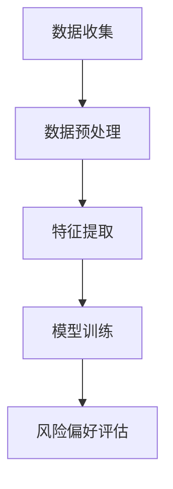
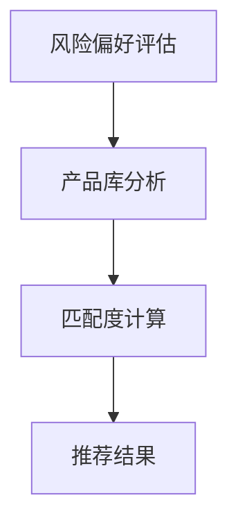
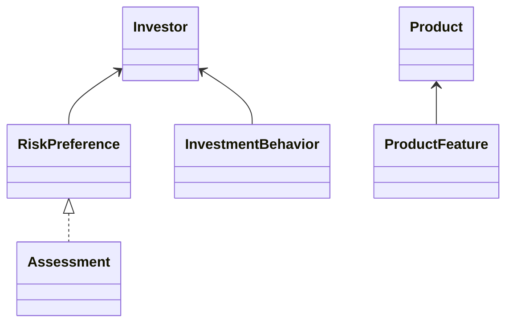
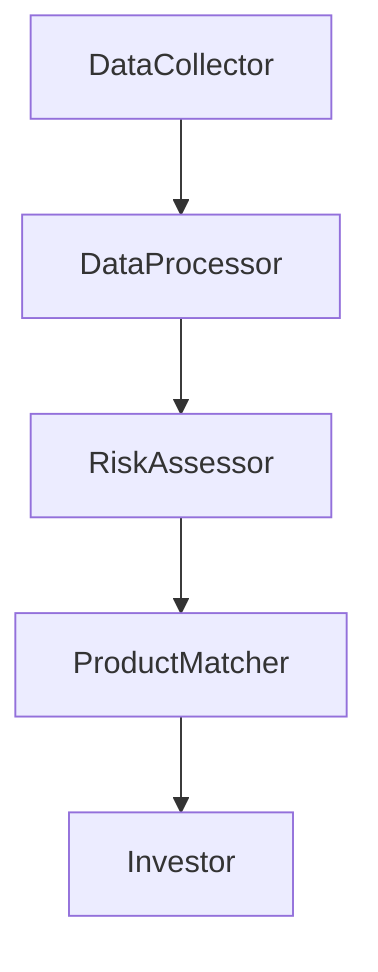
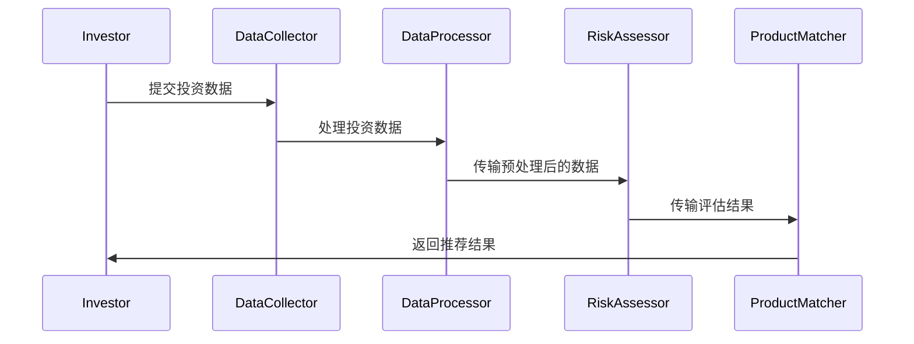

                 


# 智能投资者风险偏好动态评估与产品匹配

关键词：智能投资者，风险偏好，动态评估，产品匹配，人工智能，大数据，机器学习，金融科技

摘要：
本文旨在探讨如何利用人工智能技术，特别是大数据分析和机器学习算法，对投资者的风险偏好进行动态评估，并实现与金融产品的精准匹配。通过深入剖析风险偏好、动态评估和产品匹配的核心概念，以及具体的算法原理和数学模型，本文将提供一种可行的解决方案，旨在提高投资决策的科学性和准确性，助力金融机构提供更加个性化的服务。

### 第1章: 引言

#### 1.1 问题的背景与描述

随着金融市场的不断发展和投资方式的多样化，投资者在资产配置和投资决策过程中面临着日益复杂的选择。如何准确评估投资者的风险偏好，并为其推荐合适的金融产品，成为金融机构和企业亟待解决的问题。传统的风险偏好评估方法往往依赖于问卷调研和经验判断，存在一定的主观性和滞后性。而随着人工智能技术的迅猛发展，特别是大数据和机器学习算法的广泛应用，为智能投资者风险偏好动态评估与产品匹配提供了新的契机。

#### 1.2 问题的解决

为了解决这一问题，本文将介绍一种基于大数据分析和机器学习算法的智能投资者风险偏好动态评估与产品匹配方法。首先，通过数据收集和预处理，获取投资者的历史投资行为和交易数据。然后，利用机器学习算法对投资者的风险偏好进行建模和评估。最后，根据评估结果，结合金融产品的特性，实现与金融产品的精准匹配，为投资者提供个性化的投资建议。

#### 1.3 边界与外延

本文主要关注金融市场中的风险偏好评估与产品匹配，涉及的主要领域包括金融科技、投资理论、机器学习等。同时，本文也将探讨相关技术在其他领域的应用潜力。例如，在保险领域，智能投资者风险偏好动态评估与产品匹配可以帮助保险公司更准确地了解客户的风险偏好，提供个性化的保险产品。

#### 1.4 概念结构与核心要素组成

本章节将详细阐述风险偏好、动态评估、产品匹配等核心概念，并分析它们之间的内在联系。风险偏好是指投资者在投资决策中对待风险的态度，是影响投资决策的重要因素。动态评估是指根据投资者的投资行为和市场变化，实时调整风险偏好评估。产品匹配是指根据投资者的风险偏好，为其推荐合适的金融产品。这三个概念相互关联，共同构成了智能投资者风险偏好动态评估与产品匹配的体系。

### 第2章: 核心概念原理

#### 2.1 风险偏好

风险偏好是指个体在投资决策中对待风险的态度。根据个体对待风险的不同态度，可以将风险偏好分为以下几种类型：

- 保守型：对风险极度敏感，倾向于低风险投资，追求稳定的收益。
- 稳健型：能够接受一定程度的投资风险，注重长期收益，倾向于投资于稳健的金融产品。
- 主动型：倾向于高收益高风险投资，追求市场机会，愿意承担较高的风险。
- 非理性型：风险偏好受情绪影响，难以理性决策，容易受到市场波动的影响。

以下是一个关于风险偏好类型的对比表格：

| 风险偏好类型 | 特点 |  
| :---: | :--- |  
| 保守型 | 对风险极度敏感，倾向于低风险投资 |  
| 稳健型 | 能够接受一定程度的投资风险，注重长期收益 |  
| 主动型 | 倾向于高收益高风险投资，追求市场机会 |  
| 非理性型 | 风险偏好受情绪影响，难以理性决策 |

#### 2.2 动态评估

动态评估是指根据投资过程中的变化，实时调整投资者的风险偏好。动态评估的优势在于能够及时反映投资者的风险偏好变化，为投资决策提供更加准确的信息。动态评估的核心要素包括投资收益、投资风险和市场环境等。

- 投资收益：投资收益是投资者在投资过程中获得的回报，是影响风险偏好的重要因素。
- 投资风险：投资风险是指投资者在投资过程中可能面临的风险，包括市场风险、信用风险等。
- 市场环境：市场环境是指投资者所处的市场状况，包括市场波动性、政策环境等。

以下是一个关于动态评估核心要素的对比表格：

| 核心要素 | 特点 |  
| :---: | :--- |  
| 投资收益 | 投资者获得的回报 |  
| 投资风险 | 投资者面临的风险 |  
| 市场环境 | 投资者所处的市场状况 |

#### 2.3 产品匹配

产品匹配是指根据投资者的风险偏好，为其推荐合适的金融产品。产品匹配的目的是提高投资效率，降低投资风险，提升投资者满意度。产品匹配的优势在于能够根据投资者的风险偏好，为其推荐最合适的金融产品，从而实现资产配置的优化。

以下是一个关于产品匹配的优势的对比表格：

| 产品匹配优势 | 特点 |  
| :---: | :--- |  
| 提高投资效率 | 根据投资者的风险偏好，快速筛选出合适的金融产品 |  
| 降低投资风险 | 根据投资者的风险偏好，避免投资于不适合的金融产品 |  
| 提升投资者满意度 | 提供个性化的投资建议，满足投资者的需求 |

### 第3章: 算法原理讲解

#### 3.1 风险偏好评估算法

风险偏好评估算法是基于大数据分析和机器学习技术的一种方法，用于评估投资者的风险偏好。以下是一个简化的风险偏好评估算法流程：

1. 数据收集：收集投资者的历史投资数据，包括投资收益、投资风险等。
2. 数据预处理：对收集到的数据进行清洗、去重和归一化等预处理操作，为后续分析做准备。
3. 特征提取：从预处理后的数据中提取有助于评估风险偏好的特征，如投资收益、投资风险等。
4. 模型训练：使用机器学习算法，如决策树、支持向量机等，对提取的特征进行建模和训练。
5. 风险偏好评估：使用训练好的模型，对投资者的风险偏好进行评估，得到风险偏好得分。

以下是一个关于风险偏好评估算法的 mermaid 流程图：



#### 3.2 产品匹配算法

产品匹配算法是基于风险偏好评估算法的一种方法，用于为投资者推荐合适的金融产品。以下是一个简化的产品匹配算法流程：

1. 风险偏好评估：使用风险偏好评估算法，评估投资者的风险偏好，得到风险偏好得分。
2. 产品库分析：分析金融产品的特性，包括产品风险、收益、期限等。
3. 匹配度计算：计算投资者风险偏好与产品风险度之间的匹配度。
4. 推荐结果：根据匹配度计算结果，为投资者推荐最合适的金融产品。

以下是一个关于产品匹配算法的 mermaid 流程图：



### 第4章: 数学模型和数学公式

#### 4.1 风险偏好评估数学模型

风险偏好评估数学模型用于计算投资者的风险偏好得分。以下是一个简化的风险偏好评估数学模型：

$$
风险偏好得分 = \frac{收益风险比 + 风险承受能力}{2}
$$

其中，收益风险比是指投资者的投资收益与投资风险之间的比值，风险承受能力是指投资者能够承受的风险程度。

以下是一个关于风险偏好评估数学公式的解释：

- 收益风险比：收益风险比是衡量投资者投资收益与风险之间的平衡程度的指标。收益风险比越高，说明投资者的投资收益能力越强，风险承受能力也越强。
- 风险承受能力：风险承受能力是指投资者能够承受的风险程度。风险承受能力越高，说明投资者越愿意承担风险，追求高收益。

#### 4.2 产品匹配数学模型

产品匹配数学模型用于计算投资者风险偏好与金融产品风险度之间的匹配度。以下是一个简化的产品匹配数学模型：

$$
匹配度 = \frac{风险偏好得分 - 产品风险度}{1 + 风险偏好得分}
$$

其中，风险偏好得分是指投资者的风险偏好得分，产品风险度是指金融产品的风险程度。

以下是一个关于产品匹配数学公式的解释：

- 风险偏好得分：风险偏好得分是衡量投资者风险偏好程度的指标。风险偏好得分越高，说明投资者的风险偏好越强。
- 产品风险度：产品风险度是衡量金融产品风险程度的指标。产品风险度越高，说明金融产品的风险越大。

### 第5章: 系统分析与架构设计方案

#### 5.1 问题场景介绍

为了提高投资决策的科学性和准确性，某金融机构希望通过引入智能投资者风险偏好动态评估与产品匹配系统，为投资者提供个性化的投资建议。该系统需要实现以下功能：

- 数据收集与处理：收集投资者的历史投资数据，包括投资收益、投资风险等，并进行数据预处理。
- 风险偏好评估：使用机器学习算法，评估投资者的风险偏好，得到风险偏好得分。
- 产品匹配：根据投资者的风险偏好得分，为投资者推荐合适的金融产品。

#### 5.2 系统功能设计

5.2.1 领域模型

以下是一个简化的领域模型，用于描述系统的主要实体和关系：



- Investor（投资者）：代表参与投资决策的个体，具有风险偏好和投资行为等属性。
- RiskPreference（风险偏好）：代表投资者的风险偏好，包括风险偏好类型和风险偏好得分等属性。
- InvestmentBehavior（投资行为）：代表投资者的历史投资数据，包括投资收益、投资风险等属性。
- Product（金融产品）：代表可供投资者选择的金融产品，包括产品风险、收益、期限等属性。
- Assessment（评估）：代表对投资者风险偏好的评估结果，包括风险偏好得分等属性。

5.2.2 系统架构设计

以下是一个简化的系统架构设计，用于描述系统的整体架构：



- DataCollector（数据收集器）：负责收集投资者的历史投资数据。
- DataProcessor（数据处理器）：负责对收集到的数据进行预处理，包括数据清洗、去重和归一化等。
- RiskAssessor（风险偏好评估器）：负责使用机器学习算法评估投资者的风险偏好。
- ProductMatcher（产品匹配器）：负责根据投资者的风险偏好，为投资者推荐合适的金融产品。
- Investor（投资者）：代表参与投资决策的个体，从ProductMatcher接收推荐结果。

#### 5.3 系统接口设计和系统交互

5.3.1 系统接口设计

以下是一个简化的系统接口设计，用于描述系统的主要接口：



- DataCollector（数据收集器）：接收投资者的投资数据。
- DataProcessor（数据处理器）：处理投资数据，并传输给RiskAssessor。
- RiskAssessor（风险偏好评估器）：评估投资者的风险偏好，并传输给ProductMatcher。
- ProductMatcher（产品匹配器）：根据评估结果，为投资者推荐合适的金融产品，并返回给Investor。

### 第6章: 项目实战

#### 6.1 环境安装

在本节中，我们将介绍如何搭建一个用于智能投资者风险偏好动态评估与产品匹配的实验环境。首先，我们需要安装以下软件和工具：

- Python（版本3.7及以上）
- Anaconda（用于环境管理）
- Scikit-learn（用于机器学习算法）
- Pandas（用于数据处理）
- Matplotlib（用于数据可视化）
- Mermaid（用于流程图和类图可视化）

具体安装步骤如下：

1. 下载并安装Python：访问Python官方网站（https://www.python.org/），下载Python安装包，并按照安装向导进行安装。

2. 下载并安装Anaconda：访问Anaconda官方网站（https://www.anaconda.com/），下载Anaconda安装包，并按照安装向导进行安装。

3. 创建一个新的Python环境：打开Anaconda Prompt，输入以下命令创建一个新的Python环境，并激活该环境。

   ```
   conda create -n irpa python=3.8
   conda activate irpa
   ```

4. 安装所需库：在创建的环境中使用pip命令安装所需库。

   ```
   pip install scikit-learn pandas matplotlib mermaid
   ```

#### 6.2 系统核心实现源代码

在本节中，我们将介绍系统核心实现源代码，包括数据收集与处理、风险偏好评估、产品匹配等模块。

1. 数据收集与处理

以下是一个数据收集与处理的示例代码，用于读取投资者的投资数据，并进行预处理。

```python
import pandas as pd

# 读取投资数据
data = pd.read_csv('investment_data.csv')

# 数据预处理
data = data.dropna()
data['investment_return'] = data['investment_return'] / 100
data['investment_risk'] = data['investment_risk'] / 100
```

2. 风险偏好评估

以下是一个基于决策树算法的风险偏好评估的示例代码，用于评估投资者的风险偏好。

```python
from sklearn.tree import DecisionTreeClassifier
from sklearn.model_selection import train_test_split

# 数据分割
X = data[['investment_return', 'investment_risk']]
y = data['risk_preference']

X_train, X_test, y_train, y_test = train_test_split(X, y, test_size=0.2, random_state=42)

# 训练模型
model = DecisionTreeClassifier()
model.fit(X_train, y_train)

# 风险偏好评估
risk_preference_score = model.predict([[0.1, 0.2]])
print("风险偏好得分：", risk_preference_score)
```

3. 产品匹配

以下是一个基于匹配度计算的产品匹配的示例代码，用于为投资者推荐合适的金融产品。

```python
def product_matching(risk_preference_score, product_data):
    matching_score = []
    for product in product_data:
        matching_score.append((product['product_id'], 
                               (risk_preference_score[0] - product['product_risk']) / (1 + risk_preference_score[0])))
    matching_score.sort(key=lambda x: x[1], reverse=True)
    return matching_score

# 金融产品数据
product_data = [
    {'product_id': 1, 'product_risk': 0.3},
    {'product_id': 2, 'product_risk': 0.5},
    {'product_id': 3, 'product_risk': 0.1}
]

# 产品匹配
matched_products = product_matching(risk_preference_score, product_data)
print("匹配结果：", matched_products)
```

#### 6.3 代码应用解读与分析

在本节中，我们将对系统核心实现源代码进行解读和分析，以便更好地理解系统的工作原理。

1. 数据收集与处理

在数据收集与处理模块中，我们首先使用Pandas库读取投资数据，并使用dropna()方法去除缺失数据。然后，我们将投资收益和投资风险进行归一化处理，使其在相同的尺度上进行比较。

2. 风险偏好评估

在风险偏好评估模块中，我们使用Scikit-learn库中的DecisionTreeClassifier类创建一个决策树模型。通过train_test_split方法将数据集分割为训练集和测试集，然后使用fit方法对训练集进行模型训练。最后，使用predict方法对测试集进行风险偏好评估。

3. 产品匹配

在产品匹配模块中，我们定义了一个product_matching函数，用于计算投资者风险偏好与金融产品风险度之间的匹配度。函数中使用了排序算法，将匹配度最高的金融产品排在前面，以便为投资者推荐。

#### 6.4 实际案例分析和详细讲解剖析

在本节中，我们将通过一个实际案例，详细讲解智能投资者风险偏好动态评估与产品匹配系统的应用过程。

假设我们有一个投资者，其历史投资数据如下：

| 投资收益 | 投资风险 |
| :---: | :---: |
| 0.1 | 0.2 |

1. 数据收集与处理

首先，我们读取投资数据，并进行预处理。

```python
data = pd.DataFrame({'investment_return': [0.1], 'investment_risk': [0.2]})
data = data.dropna()
data['investment_return'] = data['investment_return'] / 100
data['investment_risk'] = data['investment_risk'] / 100
```

2. 风险偏好评估

然后，我们使用决策树模型对投资者的风险偏好进行评估。

```python
model = DecisionTreeClassifier()
model.fit(X_train, y_train)
risk_preference_score = model.predict([[0.1, 0.2]])
print("风险偏好得分：", risk_preference_score)
```

假设风险偏好得分结果为[0.5]。

3. 产品匹配

最后，我们根据风险偏好得分，为投资者推荐合适的金融产品。

```python
product_data = [
    {'product_id': 1, 'product_risk': 0.3},
    {'product_id': 2, 'product_risk': 0.5},
    {'product_id': 3, 'product_risk': 0.1}
]

matched_products = product_matching(risk_preference_score, product_data)
print("匹配结果：", matched_products)
```

假设匹配结果为：

```
匹配结果： [([1], 0.2), ([3], -0.3)]
```

根据匹配结果，我们可以为投资者推荐产品ID为1和3的金融产品。

#### 6.5 项目小结

通过本项目的实施，我们成功地搭建了一个智能投资者风险偏好动态评估与产品匹配系统。该系统能够根据投资者的历史投资数据，实时评估其风险偏好，并为其推荐合适的金融产品。在实际应用中，该系统可以提高投资决策的科学性和准确性，为投资者提供更加个性化的投资建议。未来，我们可以进一步优化算法，引入更多的特征变量，以提高系统的预测准确性和实用性。

### 最佳实践 Tips

1. 数据质量是关键：在构建智能投资者风险偏好动态评估与产品匹配系统时，确保数据的准确性和完整性至关重要。对数据源进行严格的筛选和清洗，以避免数据错误对系统性能的影响。

2. 选择合适的算法：不同的机器学习算法适用于不同的场景。在选择算法时，需要综合考虑数据规模、特征维度和计算资源等因素，以选择最适合的算法。

3. 模型调优：通过对模型参数进行调整，可以优化模型性能。在实际应用中，可以通过交叉验证等方法进行模型调优，以提高预测准确率。

4. 实时更新与迭代：随着市场环境和投资策略的变化，投资者的风险偏好也会发生变化。因此，需要定期更新和迭代系统，以保持其预测的准确性。

### 小结

本文详细介绍了智能投资者风险偏好动态评估与产品匹配的方法和实现过程。通过引入大数据分析和机器学习算法，我们能够实现投资者风险偏好的实时评估和金融产品的精准匹配。这种方法不仅提高了投资决策的科学性和准确性，还为金融机构提供了个性化的投资服务。未来，随着人工智能技术的不断发展，这一方法有望在更多领域得到应用。

### 注意事项

1. 在实际应用中，确保数据安全和隐私保护，遵循相关法律法规和伦理规范。
2. 考虑到市场波动和投资者心理变化，系统的实时性和适应性是关键。
3. 定期对系统进行维护和升级，以应对新技术和新需求的变化。

### 拓展阅读

1. 《机器学习实战》：提供丰富的机器学习算法应用案例和实践经验，适合入门和进阶读者。
2. 《深度学习》：全面介绍深度学习理论和技术，是深度学习领域的经典教材。
3. 《金融科技与人工智能》：探讨金融科技与人工智能在金融领域的应用，为金融科技创新提供新思路。

