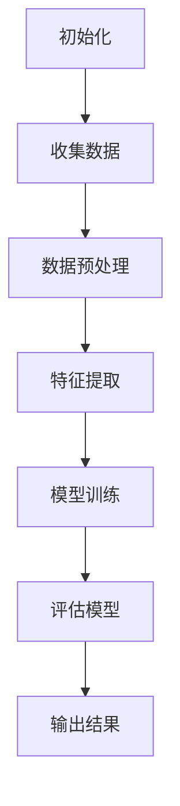
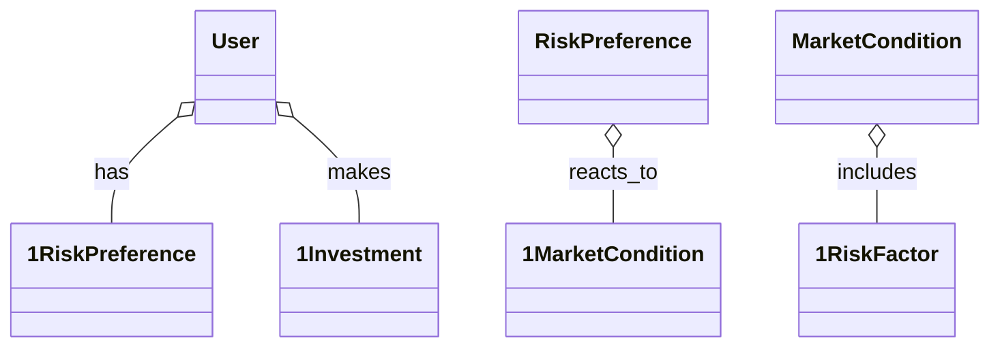
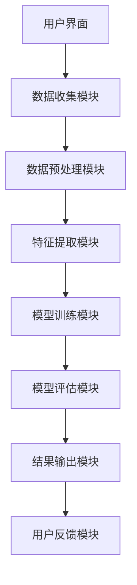
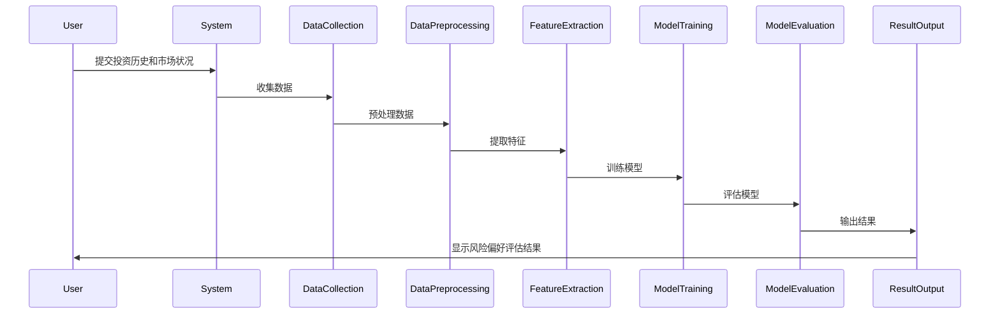

                 

# 智能投资者风险偏好动态评估系统

## 关键词
- 智能投资
- 风险偏好
- 动态评估
- 数据分析
- 机器学习

## 摘要
本文将深入探讨智能投资者风险偏好动态评估系统的构建与实现。我们将首先介绍风险投资领域的基本概念和当前形势，然后详细阐述风险偏好和动态评估的核心概念及其相互关系。接下来，我们将通过mermaid流程图和Python代码示例，介绍系统的算法原理。随后，我们将分析系统的架构设计，并通过一个实际案例展示系统的实现和应用。最后，我们将总结最佳实践，提出注意事项，并提供拓展阅读资源。

## 第一部分：智能投资者风险偏好动态评估系统概述

### 第1章：问题背景与核心概念

#### 1.1 风险投资领域概述
风险投资（Venture Capital，简称VC）是一种向初创公司或小型、快速成长的私人公司提供股权融资的行为，旨在通过资本的增值获取高额回报。近年来，随着科技的发展和金融市场的变化，风险投资领域迅速扩张，吸引了大量投资者和创业公司的关注。

#### 1.2 风险偏好动态评估系统的重要性
在风险投资领域，投资者对风险偏好的评估至关重要。风险偏好动态评估系统能够帮助投资者更好地理解和管理自己的风险偏好，从而做出更加明智的投资决策。该系统不仅有助于提高投资效率，还能够为投资者提供个性化服务，满足其多样化的投资需求。

#### 1.3 核心概念：风险偏好、动态评估方法
风险偏好是指投资者对于承担风险的态度和倾向。动态评估方法则是通过对投资者历史行为和当前市场状况的分析，实时评估其风险偏好。

#### 1.4 系统的边界与外延
风险偏好动态评估系统的边界包括投资者的行为数据、市场数据和风险指标。其外延则包括投资者风险评估、投资组合优化、风险控制策略等多个方面。

### 第2章：核心概念与联系

#### 2.1 风险偏好的定义与属性
风险偏好通常分为保守型、稳健型、平衡型和激进型。每种类型的风险偏好都有其特定的行为特征和市场表现。

#### 2.2 动态评估方法：技术原理与分类
动态评估方法包括统计分析、机器学习和神经网络等多种技术。这些技术能够从大量的数据中提取出有价值的信息，用于评估投资者的风险偏好。

#### 2.3 概念属性对比表
下表对比了不同风险偏好类型的主要属性：

| 风险偏好类型 | 行为特征 | 市场表现 |  
| :--: | :--: | :--: |  
| 保守型 | 谨慎，追求稳定回报 | 低波动性，低收益 |  
| 稳健型 | 考虑风险与回报的平衡 | 中等波动性，中等收益 |  
| 平衡型 | 善于把握机会与风险 | 高波动性，高收益 |  
| 激进型 | 勇于承担高风险 | 高波动性，高收益 |

#### 2.4 ER实体关系图
下面是一个简单的ER实体关系图，展示了风险偏好动态评估系统中的主要实体和它们之间的关系：

```mermaid
erDiagram
  User ||--|{ RiskPreference } : has
  User ||--|{ Investment } : makes
  RiskPreference ||--|{ MarketCondition } : reacts_to
  MarketCondition ||--|{ RiskFactor } : includes
```

## 第二部分：算法原理与系统架构

### 第3章：算法原理讲解

#### 3.1 算法mermaid流程图


#### 3.2 Python源代码示例
```python
# 导入所需库
import pandas as pd
from sklearn.model_selection import train_test_split
from sklearn.ensemble import RandomForestClassifier
from sklearn.metrics import accuracy_score

# 数据预处理
data = pd.read_csv('investment_data.csv')
X = data.drop('risk_preference', axis=1)
y = data['risk_preference']

# 特征提取
X_train, X_test, y_train, y_test = train_test_split(X, y, test_size=0.2, random_state=42)

# 模型训练
model = RandomForestClassifier(n_estimators=100)
model.fit(X_train, y_train)

# 评估模型
y_pred = model.predict(X_test)
accuracy = accuracy_score(y_test, y_pred)
print(f'Model Accuracy: {accuracy:.2f}')
```

#### 3.3 数学模型与公式
风险偏好评估的数学模型可以表示为：
$$
\text{RiskPreference} = f(\text{InvestmentHistory}, \text{MarketCondition})
$$
其中，$f$ 为风险偏好评估函数。

#### 3.4 算法举例说明
假设我们有一个投资者A，其投资历史和市场状况如下：
- 投资历史：过去五年中，A在股票市场进行了100次投资，其中50次盈利，50次亏损。
- 市场状况：当前市场处于牛市，整体市场表现良好。

通过算法模型，我们可以评估出投资者A的风险偏好为“稳健型”。

### 第4章：系统分析与架构设计

#### 4.1 问题场景介绍
我们假设有一个在线投资平台，需要为注册用户提供个性化的风险偏好评估服务。

#### 4.2 系统功能设计：领域模型类图


#### 4.3 系统架构设计：架构图


#### 4.4 系统接口设计
- 用户接口：提供注册、登录、评估、查询等功能。
- 数据接口：与数据存储系统进行数据交换。
- 算法接口：提供算法模型训练和评估接口。

#### 4.5 系统交互序列图


## 第三部分：项目实战

### 第5章：环境安装与配置

#### 5.1 环境要求
- Python 3.8+
- scikit-learn
- pandas
- matplotlib

#### 5.2 环境安装步骤
```bash
# 安装Python
# (安装步骤根据操作系统不同而有所不同)

# 安装依赖库
pip install scikit-learn pandas matplotlib
```

### 第6章：系统核心实现

#### 6.1 源代码解读与分析
```python
# 导入所需库
import pandas as pd
from sklearn.model_selection import train_test_split
from sklearn.ensemble import RandomForestClassifier
from sklearn.metrics import accuracy_score

# 加载数据
data = pd.read_csv('investment_data.csv')

# 数据预处理
X = data.drop('risk_preference', axis=1)
y = data['risk_preference']

# 数据分割
X_train, X_test, y_train, y_test = train_test_split(X, y, test_size=0.2, random_state=42)

# 模型训练
model = RandomForestClassifier(n_estimators=100)
model.fit(X_train, y_train)

# 模型评估
y_pred = model.predict(X_test)
accuracy = accuracy_score(y_test, y_pred)
print(f'Model Accuracy: {accuracy:.2f}')
```

#### 6.2 实际案例分析与讲解
假设我们有一个用户的历史投资数据如下表：

| 用户ID | 投资历史 | 市场状况 | 风险偏好 |
| :--: | :--: | :--: | :--: |
| 1 | 股票市场：盈利50次，亏损50次 | 当前市场：牛市 | 稳健型 |

通过系统，我们可以为用户1提供一个风险偏好评估结果。系统将根据用户的历史投资数据和当前市场状况，使用机器学习模型进行风险偏好评估。

### 第7章：最佳实践与项目小结

#### 7.1 最佳实践 tips
- 定期更新用户投资数据，以提高评估准确性。
- 结合多种评估方法，以提高评估的可靠性。
- 对模型进行持续优化，以适应市场变化。

#### 7.2 项目小结
本文详细介绍了智能投资者风险偏好动态评估系统的构建与实现。通过算法原理讲解、系统架构设计和项目实战，我们展示了如何构建一个高效、可靠的评估系统。

#### 7.3 注意事项
- 确保数据质量和完整性。
- 注意模型过拟合问题，进行适当的模型调优。

#### 7.4 拓展阅读
- 《机器学习实战》
- 《风险投资原理与实践》
- 《Python数据科学手册》

## 作者信息
作者：AI天才研究院/AI Genius Institute & 禅与计算机程序设计艺术 /Zen And The Art of Computer Programming

[END]
```

