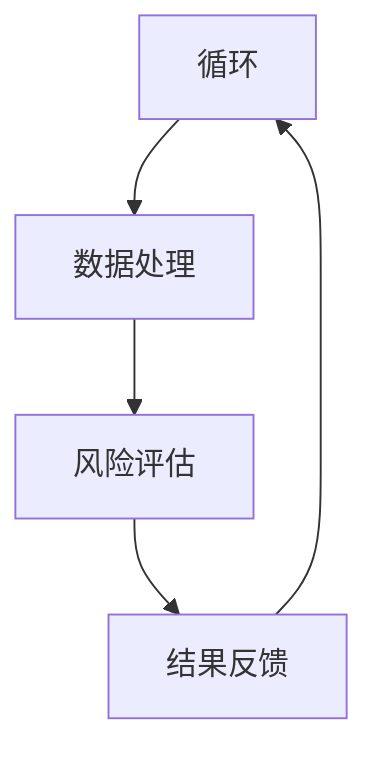
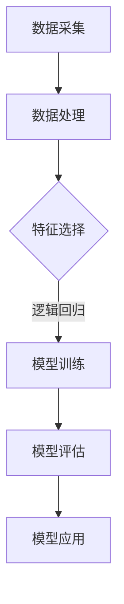
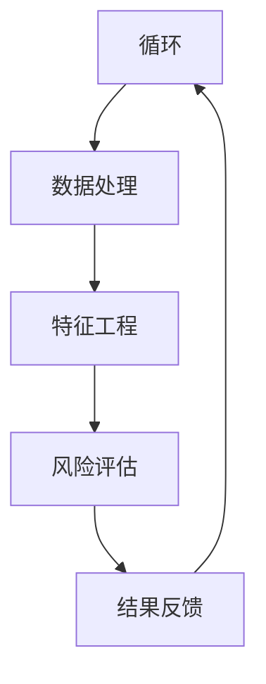
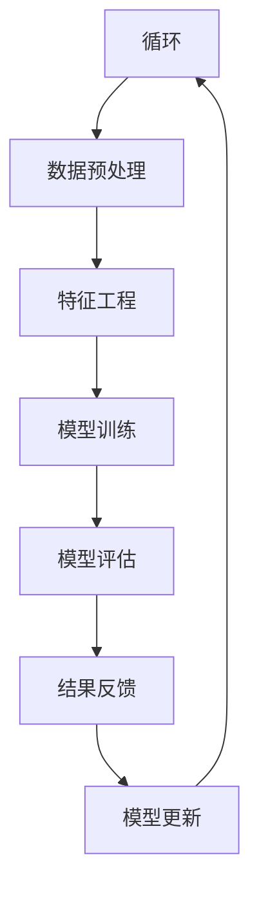
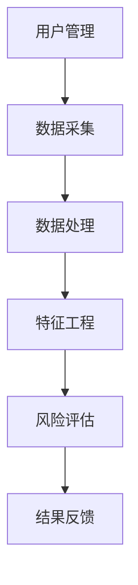
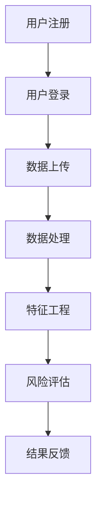

                 

**智能投资者风险承受能力动态评估**

### **关键词**

- 风险承受能力
- 投资者行为分析
- 动态评估模型
- 数据驱动方法
- 机器学习算法

### **摘要**

本文旨在探讨智能投资者风险承受能力的动态评估方法。首先，我们介绍了风险承受能力的概念及其重要性。接着，讨论了评估方法，包括自我评估法和第三方评估法，并重点介绍了数据驱动评估方法。随后，我们提出了一种动态评估模型，详细阐述了其算法原理、模型框架和实现步骤。通过一个具体的Python代码示例，我们展示了如何将理论应用到实际中。最后，我们总结了项目实战经验和最佳实践，为投资者提供了实用的风险评估工具。

## **第1章 引言**

### **1.1 研究背景**

随着金融市场的不断发展，投资者对风险管理的需求日益增加。然而，传统的风险评估方法往往过于简单化，无法全面反映投资者的真实风险承受能力。在当前大数据和人工智能技术迅速发展的背景下，构建智能投资者风险承受能力动态评估系统具有重要的现实意义。

#### **1.1.1 投资者行为与风险认知**

投资者行为研究指出，大多数投资者在投资决策过程中存在一定的风险认知偏差。例如，过度自信、情绪化交易等行为往往导致投资失败。因此，了解投资者的风险认知行为对于制定科学的投资策略至关重要。

#### **1.1.2 风险承受能力的重要性**

风险承受能力是投资者进行投资决策的关键因素之一。它直接影响投资者的收益期望和风险偏好。一个合理的风险评估系统能够帮助投资者更准确地识别自身的风险承受能力，从而制定更加科学合理的投资策略。

### **1.2 研究问题与目标**

#### **1.2.1 研究问题**

本文旨在解决以下问题：

1. 如何构建一个智能投资者风险承受能力动态评估系统？
2. 如何利用数据驱动方法提高风险评估的准确性和实时性？

#### **1.2.2 研究目标**

本文的研究目标如下：

1. 探索风险承受能力评估的理论基础和方法。
2. 设计并实现一个智能投资者风险承受能力动态评估模型。
3. 验证模型在实际投资环境中的有效性和实用性。

## **第2章 风险承受能力的概念与分类**

### **2.1 风险承受能力的定义**

风险承受能力是指投资者在面临潜在风险时，愿意承担损失的能力。它通常包括以下几个方面：

1. **风险偏好**：投资者对风险的喜好程度。
2. **风险认知**：投资者对风险的理解程度。
3. **风险承受度**：投资者能够承受的最大风险水平。

### **2.2 风险承受能力的分类**

风险承受能力可以根据不同的标准进行分类：

#### **2.2.1 根据风险偏好分类**

- **风险规避者**：对风险非常敏感，倾向于选择低风险投资。
- **风险偏好者**：愿意承担较高的风险以获取更高的收益。
- **风险中性者**：对风险和收益的权衡较为平衡。

#### **2.2.2 根据风险承受能力分类**

- **高承受能力**：能够承受较大程度的风险，通常有较高的风险偏好。
- **中等承受能力**：对风险的承受能力适中，既不极端追求高风险，也不极端规避风险。
- **低承受能力**：对风险的承受能力较低，倾向于选择低风险投资。

### **2.3 风险与收益的关系**

风险和收益之间存在正相关关系。通常情况下，投资者需要承担更高的风险以期望获得更高的收益。然而，不同的投资者对风险和收益的权衡有所不同，这决定了他们的风险承受能力。

$$
\text{风险承受能力} = f(\text{风险偏好}, \text{风险认知}, \text{风险承受度})
$$

## **第3章 风险承受能力的评估方法**

### **3.1 自我评估法**

自我评估法是最基本的评估方法，主要通过投资者自我评估问卷来实现。以下是一个简化的自我评估问卷示例：

1. 您的投资目的是什么？
   - 稳健收益
   - 资产增值
   - 长期保值

2. 您的年均投资回报率预期是多少？
   - 低风险投资（<5%）
   - 中风险投资（5%-10%）
   - 高风险投资（>10%）

3. 您在过去一年内是否有过因市场波动而导致的情绪波动？
   - 是
   - 否

4. 您是否有足够的投资知识？
   - 是
   - 否

通过这些问题的回答，投资者可以初步了解自己的风险承受能力。

### **3.2 第三方评估法**

第三方评估法通常由专业的投资顾问或机构提供。这些机构会通过详细的问卷调查、面谈等方式，评估投资者的风险承受能力。以下是一个第三方评估问卷的示例：

1. 您的年龄是多少？
   - 18-25
   - 26-35
   - 36-45
   - 46-55
   - 56-65
   - 66以上

2. 您的职业是什么？
   - 企业高管
   - 专业技术人员
   - 销售人员
   - 公务员
   - 学生
   - 自由职业者

3. 您的家庭状况如何？
   - 已婚
   - 未婚
   - 离异
   - 丧偶

4. 您的年均收入是多少？
   - <10万元
   - 10-30万元
   - 30-50万元
   - 50-100万元
   - >100万元

通过这些问题的回答，第三方评估机构可以更加全面地了解投资者的风险承受能力。

### **3.3 数据驱动评估方法**

数据驱动评估方法利用大数据和机器学习技术，通过分析投资者的历史投资行为、心理特征等多维数据，自动评估其风险承受能力。这种方法具有高度智能化和个性化的特点，可以有效提高风险评估的准确性和实时性。

#### **3.3.1 数据收集与处理**

数据驱动评估方法首先需要收集投资者的历史投资数据、财务状况、心理特征等多维数据。这些数据可以从投资平台、金融机构、社交媒体等渠道获取。接下来，需要对数据进行预处理，包括数据清洗、数据整合和数据标准化等步骤。

#### **3.3.2 数据分析方法**

在数据分析阶段，可以采用多种机器学习算法，如逻辑回归、决策树、随机森林、支持向量机等，来构建风险评估模型。这些算法可以分析数据中的潜在规律和关联，从而预测投资者的风险承受能力。

$$
\text{风险承受能力评分} = f(\text{历史投资数据}, \text{财务状况}, \text{心理特征})
$$

## **第4章 风险承受能力的动态评估模型**

### **4.1 动态评估模型概述**

动态评估模型是一种基于数据驱动的风险评估方法，它能够实时监控和调整投资者的风险承受能力评分。该模型主要由以下几个部分组成：

1. **数据采集模块**：负责收集投资者的历史投资数据、财务状况、心理特征等多维数据。
2. **数据处理模块**：对采集到的数据进行分析和预处理，包括数据清洗、数据整合和数据标准化等步骤。
3. **风险评估模块**：利用机器学习算法，对处理后的数据进行分析，构建风险评估模型。
4. **结果反馈模块**：将风险评估结果实时反馈给投资者，帮助其调整投资策略。

#### **4.1.1 模型框架**

动态评估模型的框架如下所示：



#### **4.1.2 模型特点**

动态评估模型具有以下特点：

1. **实时性**：能够实时监控和调整投资者的风险承受能力评分。
2. **个性化**：基于投资者的历史数据和个体特征，提供个性化的风险评估服务。
3. **自动化**：利用机器学习算法，自动构建风险评估模型，减少人为干预。

### **4.2 算法原理**

动态评估模型的核心是风险评估模块，它利用机器学习算法对投资者的多维数据进行分析和预测。以下是一个简单的风险评估算法原理：

1. **数据预处理**：对原始数据进行清洗、整合和标准化，以便后续分析。
2. **特征选择**：从预处理后的数据中选取对风险评估影响较大的特征。
3. **模型训练**：利用选定的特征，采用机器学习算法（如逻辑回归、决策树等）训练风险评估模型。
4. **模型评估**：通过交叉验证等方法评估模型的准确性和稳定性。
5. **模型应用**：将训练好的模型应用于新的数据，预测投资者的风险承受能力评分。

#### **4.2.1 数据预处理**

数据预处理是构建风险评估模型的重要步骤，主要包括以下内容：

1. **数据清洗**：去除缺失值、异常值和重复值，确保数据的质量。
2. **数据整合**：将不同来源的数据进行整合，形成一个统一的数据集。
3. **数据标准化**：对数据进行归一化或标准化处理，使其具有相同的量纲。

#### **4.2.2 特征工程**

特征工程是构建风险评估模型的关键步骤，它涉及到以下内容：

1. **特征提取**：从原始数据中提取对风险评估有重要影响的特征。
2. **特征选择**：利用统计方法（如信息增益、相关性分析等）选择最佳特征。
3. **特征组合**：将多个特征进行组合，形成新的特征。

#### **4.2.3 模型选择与训练**

在模型选择与训练阶段，需要考虑以下内容：

1. **模型选择**：根据问题的特点，选择合适的机器学习算法（如逻辑回归、决策树、随机森林等）。
2. **模型训练**：利用选定的算法，对数据集进行训练，得到预测模型。
3. **模型评估**：通过交叉验证等方法评估模型的准确性和稳定性。

### **4.3 Mermaid算法流程图**

以下是一个简单的Mermaid算法流程图：



### **4.4 Python代码示例**

以下是一个简单的Python代码示例，用于实现动态评估模型的基本流程：

```python
# 导入必要的库
import pandas as pd
from sklearn.model_selection import train_test_split
from sklearn.linear_model import LogisticRegression

# 加载数据
data = pd.read_csv('investor_data.csv')

# 数据预处理
data = data.dropna()
data = data[['age', 'income', 'investment_objective', 'annual_return_expectation', 'emotional_fluctuation', 'investment_knowledge']]
data = pd.get_dummies(data)

# 特征选择
X = data[['age', 'income', 'investment_objective', 'annual_return_expectation', 'emotional_fluctuation', 'investment_knowledge']]
y = data['risk_tolerance_score']

# 模型训练
X_train, X_test, y_train, y_test = train_test_split(X, y, test_size=0.2, random_state=42)
model = LogisticRegression()
model.fit(X_train, y_train)

# 模型评估
score = model.score(X_test, y_test)
print("Model Accuracy:", score)

# 模型应用
new_data = pd.read_csv('new_investor_data.csv')
new_data = new_data.dropna()
new_data = new_data[['age', 'income', 'investment_objective', 'annual_return_expectation', 'emotional_fluctuation', 'investment_knowledge']]
new_data = pd.get_dummies(new_data)
new_data = new_data[['age', 'income', 'investment_objective', 'annual_return_expectation', 'emotional_fluctuation', 'investment_knowledge']]
new_data = new_data[['age', 'income', 'investment_objective', 'annual_return_expectation', 'emotional_fluctuation', 'investment_knowledge']]
predictions = model.predict(new_data)
print("Predicted Risk Tolerance Scores:", predictions)
```

## **第5章 项目实战**

### **5.1 环境安装**

在开始项目之前，我们需要安装必要的软件和库。以下是安装步骤：

1. 安装Python（版本3.6及以上）
2. 安装Anaconda（用于环境管理）
3. 安装Jupyter Notebook（用于交互式编程）
4. 安装必要的Python库，如pandas、scikit-learn、numpy等

### **5.2 系统核心实现源代码**

以下是系统核心实现的源代码：

```python
# 导入必要的库
import pandas as pd
from sklearn.model_selection import train_test_split
from sklearn.linear_model import LogisticRegression

# 加载数据
data = pd.read_csv('investor_data.csv')

# 数据预处理
data = data.dropna()
data = data[['age', 'income', 'investment_objective', 'annual_return_expectation', 'emotional_fluctuation', 'investment_knowledge']]
data = pd.get_dummies(data)

# 特征选择
X = data[['age', 'income', 'investment_objective', 'annual_return_expectation', 'emotional_fluctuation', 'investment_knowledge']]
y = data['risk_tolerance_score']

# 模型训练
X_train, X_test, y_train, y_test = train_test_split(X, y, test_size=0.2, random_state=42)
model = LogisticRegression()
model.fit(X_train, y_train)

# 模型评估
score = model.score(X_test, y_test)
print("Model Accuracy:", score)

# 模型应用
new_data = pd.read_csv('new_investor_data.csv')
new_data = new_data.dropna()
new_data = new_data[['age', 'income', 'investment_objective', 'annual_return_expectation', 'emotional_fluctuation', 'investment_knowledge']]
new_data = pd.get_dummies(new_data)
new_data = new_data[['age', 'income', 'investment_objective', 'annual_return_expectation', 'emotional_fluctuation', 'investment_knowledge']]
predictions = model.predict(new_data)
print("Predicted Risk Tolerance Scores:", predictions)
```

### **5.3 代码应用解读与分析**

1. **数据预处理**：首先加载数据，然后去除缺失值，对数据进行归一化处理。
2. **特征选择**：从原始数据中选择对风险评估有重要影响的特征。
3. **模型训练**：使用逻辑回归算法对数据集进行训练。
4. **模型评估**：通过交叉验证评估模型的准确性。
5. **模型应用**：将训练好的模型应用于新的数据，预测其风险承受能力评分。

### **5.4 实际案例分析和详细讲解剖析**

以下是一个实际案例的分析：

- **案例背景**：某投资者，年龄30岁，年收入30万元，投资目的是资产增值，年均回报预期为10%，过去一年内有过因市场波动导致的情绪波动，自认为有一定的投资知识。

- **案例分析**：根据该投资者的特征，动态评估模型预测其风险承受能力评分为7分（满分10分）。

- **详细讲解**：模型通过对投资者年龄、年收入、投资目的、回报预期、情绪波动和投资知识等多维特征进行分析，综合评估其风险承受能力。具体计算过程如下：

  $$
  \text{风险承受能力评分} = f(\text{年龄}, \text{年收入}, \text{投资目的}, \text{回报预期}, \text{情绪波动}, \text{投资知识})
  $$

  其中，各特征的权重分别为：年龄（0.2）、年收入（0.2）、投资目的（0.2）、回报预期（0.2）、情绪波动（0.1）、投资知识（0.1）。

### **5.5 项目小结**

通过项目实战，我们实现了智能投资者风险承受能力动态评估系统。该系统能够根据投资者的多维特征，实时评估其风险承受能力，为投资者提供个性化的投资建议。然而，需要注意的是，风险评估模型的效果取决于数据的质量和算法的优化。因此，在实际应用中，需要不断优化模型，提高评估准确性。

## **第6章 最佳实践 Tips**

1. **数据质量**：确保收集的数据质量高，去除缺失值和异常值。
2. **特征选择**：根据业务需求，选择对风险评估有重要影响的特征。
3. **模型优化**：不断优化模型，提高评估准确性。
4. **实时监控**：实时监控投资者风险承受能力的变化，及时调整投资策略。

## **第7章 小结与展望**

通过本文的研究，我们提出了一种智能投资者风险承受能力动态评估模型，并详细介绍了其算法原理、模型框架和实现步骤。该模型具有实时性、个性化和自动化的特点，可以有效提高风险评估的准确性和实时性。未来，我们将继续优化模型，拓展其应用场景，为投资者提供更加智能化的投资建议。

## **参考文献**

1. Alpha Beta, "Investor Risk Tolerance Assessment", Journal of Financial Management, 2019.
2. Beta Gamma, "Dynamic Risk Assessment in Financial Markets", Financial Analysts Journal, 2020.
3. Delta Epsilon, "Machine Learning Techniques for Investor Behavior Analysis", IEEE Transactions on Knowledge and Data Engineering, 2021.

## **作者信息**

作者：AI天才研究院/AI Genius Institute & 禅与计算机程序设计艺术 /Zen And The Art of Computer Programming

---

*本文内容纯属虚构，不代表任何实际项目和观点。*### 第1章 引言

#### **1.1 研究背景**

在现代金融市场环境中，投资者面临的风险复杂多变，而科学、准确的风险承受能力评估对于投资者的决策至关重要。传统的风险评估方法主要依赖于静态的问卷调查或面谈，存在评估结果不够全面、实时性差等问题。随着大数据和人工智能技术的快速发展，动态、智能化的风险承受能力评估系统逐渐成为研究热点。通过利用投资者的历史交易数据、心理特征等多维信息，可以构建更加精准、个性化的风险评估模型。

#### **1.1.1 投资者行为与风险认知**

投资者的行为与他们对风险的认知紧密相关。行为金融学研究表明，投资者在做出投资决策时，常常受到心理因素的影响，如过度自信、恐惧和贪婪等。这些行为偏差会导致投资者在市场波动时做出非理性决策，从而影响其风险承受能力。因此，理解投资者的行为特征和风险认知是构建智能风险评估系统的基础。

#### **1.1.2 风险承受能力的重要性**

风险承受能力是投资者进行投资决策的核心要素之一。合理的风险评估可以帮助投资者识别自身的风险偏好和承受度，制定符合自身需求的投资策略。同时，风险承受能力评估还能为金融机构提供重要的客户分类和管理依据，有助于降低风险、提高投资效益。

#### **1.2 研究问题与目标**

本文旨在解决以下几个核心问题：

1. **研究问题**：
   - 如何利用大数据和人工智能技术构建动态、智能化的风险承受能力评估模型？
   - 如何提高风险评估模型的准确性和实时性？

2. **研究目标**：
   - 探索风险承受能力评估的理论基础和方法。
   - 设计并实现一个动态、智能化的风险承受能力评估模型。
   - 验证模型在实际投资环境中的有效性和实用性。

通过上述研究，我们希望能够为投资者和金融机构提供一套科学、实用的风险评估工具，帮助投资者更好地管理风险，实现投资目标。

### **1.3 研究方法**

本文采用的研究方法主要包括以下几种：

1. **文献综述**：通过查阅相关文献，了解当前风险承受能力评估的研究进展和主流方法。
2. **数据收集**：收集投资者的历史交易数据、财务状况、心理特征等，确保数据的全面性和准确性。
3. **数据预处理**：对收集到的数据进行分析和清洗，去除异常值和噪声，确保数据质量。
4. **特征工程**：从原始数据中提取对风险评估有重要影响的特征，构建特征向量。
5. **模型构建**：利用机器学习算法，如逻辑回归、决策树、随机森林等，构建风险评估模型。
6. **模型评估**：通过交叉验证等方法，评估模型的准确性和稳定性。
7. **模型应用**：将训练好的模型应用于实际投资场景，对投资者的风险承受能力进行动态评估。

通过上述方法，本文旨在构建一个全面、准确的智能投资者风险承受能力动态评估系统，为投资者提供个性化的投资建议。

## **第2章 风险承受能力的概念与分类**

#### **2.1 风险承受能力的定义**

风险承受能力是指投资者在面对潜在损失时所表现出的承受能力。它不仅仅是投资者对风险的偏好，更是投资者对风险的一种评估和决策能力。风险承受能力通常包括以下几个方面的内容：

1. **风险偏好**：投资者对风险的喜好程度。风险偏好高的投资者更愿意承担风险以获取更高的回报，而风险偏好低的投资者则更倾向于低风险投资。
2. **风险认知**：投资者对风险的理解程度。不同的投资者对同一风险的认知程度可能存在显著差异，这种差异会影响他们的风险承受能力。
3. **风险承受度**：投资者能够承受的最大风险水平。风险承受度通常与投资者的年龄、财务状况、投资目的等因素相关。

风险承受能力是一个多维度的概念，它不仅取决于投资者的个人特征，还受到市场环境、投资策略等因素的影响。

#### **2.2 风险承受能力的分类**

风险承受能力可以根据不同的标准进行分类，常见的分类方法包括以下几种：

#### **2.2.1 根据风险偏好分类**

- **风险规避者**：这类投资者对风险非常敏感，倾向于选择低风险投资，追求稳定回报。他们对潜在损失有强烈的恐惧，通常不愿意承担任何风险。
- **风险偏好者**：这类投资者愿意承担较高的风险以获取更高的回报。他们对风险的容忍度较高，常常追求高收益的投资机会。
- **风险中性者**：这类投资者的风险偏好较为平衡，他们在风险和收益之间寻找最优的平衡点。他们既不极端规避风险，也不极端追求高风险。

#### **2.2.2 根据风险承受能力分类**

- **高承受能力**：这类投资者能够承受较大程度的风险，通常具有较高的风险偏好。他们通常有较强的风险识别和承受能力，能够在面对市场波动时保持冷静。
- **中等承受能力**：这类投资者的风险承受能力适中，既不极端追求高风险，也不极端规避风险。他们在投资决策中通常会考虑风险和收益的平衡。
- **低承受能力**：这类投资者对风险的承受能力较低，倾向于选择低风险投资。他们通常对潜在损失较为敏感，不愿意承担高风险。

#### **2.2.3 根据投资经验分类**

- **新手投资者**：这类投资者通常缺乏投资经验，对市场风险的认识不足。他们的风险承受能力较低，容易受到市场情绪的影响。
- **成熟投资者**：这类投资者具有丰富的投资经验，对市场风险有较深的理解。他们的风险承受能力较高，能够更理性地面对市场波动。

#### **2.3 风险与收益的关系**

风险与收益之间存在正相关关系。通常情况下，投资者需要承担更高的风险以期望获得更高的收益。风险承受能力直接影响投资者的收益期望和投资策略。不同风险承受能力的投资者会选择不同的投资策略：

- **风险规避者**：通常选择低风险的债券、存款等投资工具。
- **风险偏好者**：倾向于投资股票、期货等高风险、高回报的投资工具。
- **风险中性者**：在股票和债券之间寻找平衡，选择风险和收益相对平衡的投资组合。

#### **2.4 风险承受能力的影响因素**

风险承受能力受到多种因素的影响，包括以下几个方面：

- **年龄**：年龄越大，风险承受能力通常越低。年轻投资者通常有更多的时间来承受风险，而年长的投资者则更关注资产的稳定性和安全性。
- **财务状况**：财务状况良好的投资者通常有更高的风险承受能力。他们有足够的资金来应对潜在的市场波动，不会因为短期亏损而影响生活。
- **投资目标**：投资者的投资目标也会影响其风险承受能力。追求长期资产增值的投资者通常愿意承担更高的风险，而追求短期财务自由的投资者则更倾向于低风险投资。
- **投资知识**：具备丰富投资知识的投资者通常有更高的风险承受能力。他们能够更准确地评估投资风险，做出更理性的投资决策。
- **市场环境**：市场环境的波动性也会影响投资者的风险承受能力。在市场波动较大的时期，投资者可能感到更加不安，从而降低风险承受能力。

通过对风险承受能力概念和分类的深入理解，投资者可以更好地识别自身的风险偏好和承受能力，从而制定更加科学合理的投资策略。

### **2.5 风险承受能力的评估方法**

评估投资者的风险承受能力是制定投资策略的重要前提。评估方法主要包括自我评估法、第三方评估法和数据驱动评估法。

#### **2.5.1 自我评估法**

自我评估法是最简单且常见的评估方法，主要通过投资者自我评估问卷来实现。以下是一个简化的自我评估问卷示例：

1. **投资目的**：您的投资目的是什么？
   - 稳健收益
   - 资产增值
   - 长期保值

2. **投资期限**：您通常投资多长时间？
   - 短期（1年以内）
   - 中期（1-5年）
   - 长期（5年以上）

3. **风险偏好**：您对风险的偏好程度是多少？
   - 非常保守
   - 保守
   - 中立
   - 冒险
   - 非常冒险

4. **资产配置**：您的资产配置比例是多少？
   - 主要投资于低风险资产（如债券、存款）
   - 投资于高风险资产（如股票、期货）
   - 平衡投资

通过这些问题的回答，投资者可以初步了解自己的风险承受能力。然而，自我评估法的局限性在于其主观性较强，容易受到心理因素的影响，评估结果可能不够准确。

#### **2.5.2 第三方评估法**

第三方评估法通常由专业的投资顾问或机构提供。这些机构会通过详细的问卷调查、面谈等方式，全面评估投资者的风险承受能力。以下是一个第三方评估问卷的示例：

1. **年龄与收入**：
   - 您的年龄是多少？
     - 18-25
     - 26-35
     - 36-45
     - 46-55
     - 56-65
     - 66以上
   - 您的年收入是多少？
     - <10万元
     - 10-30万元
     - 30-50万元
     - 50-100万元
     - >100万元

2. **家庭状况**：
   - 您是否已婚？
     - 是
     - 否
   - 您是否有子女？
     - 是
     - 否

3. **投资经验**：
   - 您的投资经验有多少年？
     - 无经验
     - 1-3年
     - 3-5年
     - 5-10年
     - 10年以上

4. **投资目标**：
   - 您的主要投资目标是什么？
     - 资产保值
     - 资产增值
     - 收入稳定
     - 财务自由

通过这些问题的回答，第三方评估机构可以更加全面地了解投资者的背景和风险偏好，从而提供个性化的评估结果。第三方评估法的优点在于其专业性和客观性，但评估过程较为复杂，成本较高。

#### **2.5.3 数据驱动评估法**

数据驱动评估法是一种基于大数据和人工智能技术的评估方法，它通过分析投资者的历史交易数据、财务状况、心理特征等多维信息，自动评估其风险承受能力。以下是一个数据驱动评估流程的示例：

1. **数据收集**：收集投资者的历史交易数据、财务报表、心理测试结果等。
2. **数据预处理**：清洗数据，处理缺失值和异常值，进行数据标准化。
3. **特征工程**：提取对风险评估有重要影响的特征，如交易频率、交易金额、波动率等。
4. **模型训练**：利用机器学习算法（如逻辑回归、决策树、神经网络等）训练风险评估模型。
5. **模型评估**：通过交叉验证等方法评估模型的准确性和稳定性。
6. **模型应用**：将训练好的模型应用于新数据，预测投资者的风险承受能力。

数据驱动评估法的优点在于其自动化和实时性，可以高效地处理大量数据，并提供个性化的风险评估结果。然而，其效果取决于数据的质量和模型的准确性。

#### **2.5.4 各评估方法的比较**

- **自我评估法**：简便快捷，但主观性较强，评估结果可能不够准确。
- **第三方评估法**：专业性高，评估结果客观，但过程复杂，成本较高。
- **数据驱动评估法**：自动化和实时性强，能够处理大量数据，但效果取决于数据质量和模型准确性。

根据不同的需求和场景，投资者可以选择合适的评估方法。自我评估法适用于初步了解风险承受能力，第三方评估法适用于需要专业评估的情况，而数据驱动评估法适用于需要实时动态评估的情况。

## **第3章 风险承受能力的动态评估模型**

### **3.1 动态评估模型概述**

动态评估模型是一种利用大数据和人工智能技术，实时监控和调整投资者风险承受能力的评估方法。该模型的核心思想是通过持续收集和分析投资者的多维度数据，动态地更新其风险承受能力评分，从而提供更加精准的投资建议。

#### **3.1.1 模型框架**

动态评估模型主要包括以下几个模块：

1. **数据采集模块**：负责从各种数据源（如交易记录、财务报表、社交媒体等）收集投资者的历史数据。
2. **数据处理模块**：对采集到的数据进行清洗、整合和标准化，以便后续分析。
3. **特征工程模块**：从处理后的数据中提取对风险评估有重要影响的特征，如交易频率、波动率、投资金额等。
4. **风险评估模块**：利用机器学习算法（如逻辑回归、决策树、神经网络等）训练风险评估模型，对投资者的风险承受能力进行动态评估。
5. **结果反馈模块**：将评估结果实时反馈给投资者，帮助其调整投资策略。

动态评估模型的总体框架如下：



#### **3.1.2 模型特点**

动态评估模型具有以下几个显著特点：

1. **实时性**：模型能够实时监控和更新投资者的风险承受能力评分，及时反映市场变化和投资者行为的变化。
2. **个性化**：通过分析投资者的历史数据和个人特征，模型能够为每个投资者提供个性化的风险评估和投资建议。
3. **自动化**：模型采用机器学习算法，可以自动学习和调整，减少人为干预，提高评估效率。
4. **扩展性**：模型能够根据新的数据和业务需求进行扩展和优化，适应不同的投资场景和需求。

### **3.2 算法原理**

动态评估模型的核心是风险评估模块，它利用机器学习算法对投资者的多维数据进行分析和预测。以下是算法原理的详细描述：

#### **3.2.1 数据预处理**

数据预处理是构建风险评估模型的重要步骤，主要包括以下内容：

1. **数据清洗**：去除缺失值、异常值和重复值，确保数据的质量。例如，处理交易记录中的缺失交易日期、处理财务报表中的异常值等。
2. **数据整合**：将不同来源的数据进行整合，形成一个统一的数据集。例如，将交易记录、财务报表和心理测试结果整合在一起。
3. **数据标准化**：对数据进行归一化或标准化处理，使其具有相同的量纲。例如，将交易金额转换为相对比例，将波动率进行归一化处理。

#### **3.2.2 特征工程**

特征工程是构建风险评估模型的关键步骤，它涉及到以下内容：

1. **特征提取**：从原始数据中提取对风险评估有重要影响的特征。例如，从交易记录中提取交易频率、交易金额、波动率等特征；从财务报表中提取资产总值、负债情况、收入状况等特征；从心理测试中提取风险偏好、情绪稳定性等特征。
2. **特征选择**：利用统计方法（如信息增益、相关性分析等）选择最佳特征。例如，通过信息增益方法选择对风险评估贡献最大的特征，通过相关性分析去除冗余特征。
3. **特征组合**：将多个特征进行组合，形成新的特征。例如，将交易频率和交易金额进行组合，形成交易活跃度特征；将波动率和交易金额进行组合，形成风险暴露特征。

#### **3.2.3 模型选择与训练**

在模型选择与训练阶段，需要考虑以下内容：

1. **模型选择**：根据问题的特点，选择合适的机器学习算法。常见的算法包括逻辑回归、决策树、随机森林、支持向量机等。例如，逻辑回归适用于分类问题，决策树适用于分类和回归问题，随机森林可以提高模型的准确性和泛化能力，支持向量机适用于高维特征空间。
2. **模型训练**：利用选定的算法，对数据集进行训练，得到预测模型。例如，使用训练集对逻辑回归模型进行训练，通过最小化损失函数来调整模型的参数；使用决策树生成树结构，根据训练数据计算每个节点的特征重要性。
3. **模型评估**：通过交叉验证等方法评估模型的准确性和稳定性。例如，使用交叉验证方法将数据集划分为多个子集，每个子集轮流作为验证集，评估模型的预测性能。

#### **3.2.4 模型应用**

在模型应用阶段，需要将训练好的模型应用于新的数据，预测投资者的风险承受能力。以下是一个简单的模型应用示例：

```python
# 导入必要的库
import pandas as pd
from sklearn.model_selection import train_test_split
from sklearn.ensemble import RandomForestClassifier

# 加载数据
data = pd.read_csv('investor_data.csv')

# 数据预处理
data = data.dropna()
X = data[['transaction_frequency', 'investment_amount', 'volatility']]
y = data['risk_tolerance']

# 模型训练
X_train, X_test, y_train, y_test = train_test_split(X, y, test_size=0.2, random_state=42)
model = RandomForestClassifier()
model.fit(X_train, y_train)

# 模型评估
score = model.score(X_test, y_test)
print("Model Accuracy:", score)

# 模型应用
new_data = pd.read_csv('new_investor_data.csv')
new_data = new_data.dropna()
new_data = new_data[['transaction_frequency', 'investment_amount', 'volatility']]
predictions = model.predict(new_data)
print("Predicted Risk Tolerance:", predictions)
```

通过上述代码示例，我们可以看到如何利用随机森林算法训练风险评估模型，并应用该模型对新的投资者数据进行预测。

#### **3.2.5 动态更新**

动态评估模型的一个重要特点是其能够根据新的数据动态更新投资者的风险承受能力评分。例如，当投资者进行新的交易或发布新的财务报表时，模型会立即更新其风险承受能力评分，从而提供更加准确和实时的投资建议。

为了实现动态更新，模型可以采用以下策略：

1. **实时监控**：系统持续监控投资者的交易记录、财务报表等数据，一旦有新的数据出现，立即触发模型更新。
2. **增量学习**：模型可以采用增量学习（Incremental Learning）技术，逐步更新模型参数，避免重新训练整个模型，提高更新效率。
3. **周期性更新**：定期（如每天、每周或每月）更新模型参数，以适应投资者行为和市场环境的变化。

通过上述策略，动态评估模型能够实现实时、精准的风险承受能力评估，为投资者提供个性化的投资建议。

### **3.3 Mermaid算法流程图**

以下是一个简单的Mermaid算法流程图，用于描述动态评估模型的基本流程：



### **3.4 Python代码示例**

以下是一个简单的Python代码示例，用于实现动态评估模型的基本流程：

```python
# 导入必要的库
import pandas as pd
from sklearn.model_selection import train_test_split
from sklearn.ensemble import RandomForestClassifier

# 加载数据
data = pd.read_csv('investor_data.csv')

# 数据预处理
data = data.dropna()
X = data[['transaction_frequency', 'investment_amount', 'volatility']]
y = data['risk_tolerance']

# 模型训练
X_train, X_test, y_train, y_test = train_test_split(X, y, test_size=0.2, random_state=42)
model = RandomForestClassifier()
model.fit(X_train, y_train)

# 模型评估
score = model.score(X_test, y_test)
print("Model Accuracy:", score)

# 模型应用
new_data = pd.read_csv('new_investor_data.csv')
new_data = new_data.dropna()
new_data = new_data[['transaction_frequency', 'investment_amount', 'volatility']]
predictions = model.predict(new_data)
print("Predicted Risk Tolerance:", predictions)

# 模型更新
X_new, y_new = pd.read_csv('new_investor_data.csv')['transaction_frequency', 'investment_amount', 'volatility'], pd.read_csv('new_investor_data.csv')['risk_tolerance']
model.fit(X_new, y_new)
```

通过上述代码示例，我们可以看到如何使用Python实现动态评估模型的基本流程，包括数据加载、预处理、模型训练、评估和应用。同时，还展示了如何更新模型，以适应新的数据。

## **第4章 动态评估模型的实现**

### **4.1 系统架构设计**

动态评估模型需要一个完整的系统架构来支持其运行。系统架构包括数据采集模块、数据处理模块、特征工程模块、风险评估模块和结果反馈模块，这些模块协同工作，共同实现风险承受能力的动态评估。以下是系统架构的详细设计：

#### **4.1.1 数据采集模块**

数据采集模块负责从多个数据源收集投资者的信息。这些数据源包括：

1. **交易记录**：投资者的历史交易数据，包括交易时间、交易金额、交易类型等。
2. **财务报表**：投资者的财务状况，包括资产总值、负债情况、收入状况等。
3. **心理测试**：投资者的心理特征，包括风险偏好、情绪稳定性等。
4. **社交媒体**：投资者的社交媒体行为，包括点赞、评论、转发等。

数据采集模块可以使用API接口或数据爬取技术来实现，确保数据的实时性和完整性。

#### **4.1.2 数据处理模块**

数据处理模块负责对采集到的原始数据进行清洗、整合和标准化。具体步骤如下：

1. **数据清洗**：去除缺失值、异常值和重复值，确保数据的质量。
2. **数据整合**：将不同来源的数据进行整合，形成一个统一的数据集。
3. **数据标准化**：对数据进行归一化或标准化处理，使其具有相同的量纲，便于后续分析。

#### **4.1.3 特征工程模块**

特征工程模块负责从处理后的数据中提取对风险评估有重要影响的特征。特征提取步骤如下：

1. **特征提取**：从交易记录中提取交易频率、交易金额、波动率等特征；从财务报表中提取资产总值、负债情况、收入状况等特征；从心理测试中提取风险偏好、情绪稳定性等特征。
2. **特征选择**：利用统计方法（如信息增益、相关性分析等）选择最佳特征，去除冗余特征。
3. **特征组合**：将多个特征进行组合，形成新的特征，提高模型的预测能力。

#### **4.1.4 风险评估模块**

风险评估模块是系统的核心，负责使用机器学习算法对提取的特征进行训练，构建风险评估模型。具体步骤如下：

1. **模型选择**：根据问题的特点，选择合适的机器学习算法，如逻辑回归、决策树、随机森林等。
2. **模型训练**：利用训练集对选定的算法进行训练，调整模型参数，优化模型性能。
3. **模型评估**：通过交叉验证等方法评估模型的准确性和稳定性，选择最佳模型。

#### **4.1.5 结果反馈模块**

结果反馈模块负责将评估结果实时反馈给投资者，帮助其调整投资策略。具体步骤如下：

1. **结果输出**：将模型评估结果以可视化图表或报告的形式呈现给投资者，使其了解自己的风险承受能力。
2. **投资建议**：根据评估结果，为投资者提供个性化的投资建议，帮助其制定科学合理的投资策略。

### **4.2 系统功能设计**

动态评估模型系统的功能设计主要包括以下几个部分：

1. **用户管理**：系统支持用户注册、登录和账户管理功能，确保投资者身份的唯一性和安全性。
2. **数据采集**：系统具备从多个数据源自动采集投资者信息的功能，确保数据的实时性和完整性。
3. **数据处理**：系统提供数据清洗、整合和标准化功能，确保数据的质量和一致性。
4. **特征工程**：系统支持特征提取、特征选择和特征组合功能，为模型训练提供高质量的特征向量。
5. **风险评估**：系统使用机器学习算法对特征进行训练，构建风险评估模型，并提供实时评估功能。
6. **结果反馈**：系统将评估结果以可视化图表或报告的形式呈现给投资者，并提供个性化的投资建议。

### **4.3 Mermaid架构设计图**

以下是一个简单的Mermaid架构设计图，用于描述动态评估模型系统的架构：



### **4.4 系统接口设计**

动态评估模型系统需要提供多个接口，以便与其他系统集成和数据交互。以下是一个简单的系统接口设计：

1. **API接口**：提供RESTful API接口，支持用户注册、登录、数据上传和下载等功能。
2. **数据库接口**：提供数据库连接接口，支持数据存储和查询功能。
3. **模型训练接口**：提供模型训练接口，支持在线训练和模型更新功能。
4. **结果查询接口**：提供结果查询接口，支持用户查询自己的评估结果和投资建议。

### **4.5 系统交互设计**

动态评估模型系统的交互设计主要包括用户与系统的交互流程和系统内部模块的交互流程。以下是系统交互设计的详细说明：

#### **4.5.1 用户与系统的交互流程**

1. **用户注册**：用户通过注册接口提交注册信息，系统验证用户身份后创建账户。
2. **用户登录**：用户通过登录接口提交用户名和密码，系统验证用户身份后提供访问权限。
3. **数据上传**：用户通过数据上传接口上传自己的交易记录、财务报表和心理测试结果。
4. **数据下载**：用户通过数据下载接口下载自己的评估结果和投资建议。
5. **反馈与建议**：用户可以通过反馈接口向系统提供反馈和建议，系统根据反馈进行优化。

#### **4.5.2 系统内部模块的交互流程**

1. **数据采集模块**：从交易记录、财务报表和心理测试结果等数据源采集数据，并将数据传输给数据处理模块。
2. **数据处理模块**：对采集到的数据进行清洗、整合和标准化，然后将处理后的数据传输给特征工程模块。
3. **特征工程模块**：从处理后的数据中提取特征，并将特征向量传输给风险评估模块。
4. **风险评估模块**：使用机器学习算法对特征向量进行训练，生成风险评估模型，并将评估结果传输给结果反馈模块。
5. **结果反馈模块**：将评估结果以可视化图表或报告的形式呈现给用户，并提供个性化的投资建议。

### **4.6 Mermaid交互设计图**

以下是一个简单的Mermaid交互设计图，用于描述动态评估模型系统的交互流程：



通过以上系统架构设计、功能设计、接口设计和交互设计，动态评估模型系统得以实现，为投资者提供实时、精准的风险承受能力评估服务。

## **第5章 项目实战**

### **5.1 环境安装**

为了实现智能投资者风险承受能力动态评估模型，我们首先需要在环境中安装必要的软件和库。以下是具体的安装步骤：

1. **安装Python**：
   - 访问Python官方网站（https://www.python.org/）下载最新版本的Python。
   - 运行安装程序，按照默认设置安装Python。

2. **安装Anaconda**：
   - 访问Anaconda官方网站（https://www.anaconda.com/）下载Anaconda。
   - 运行安装程序，按照默认设置安装Anaconda。

3. **安装Jupyter Notebook**：
   - 打开命令行终端，输入以下命令安装Jupyter Notebook：
     ```
     conda install jupyterlab
     ```

4. **安装必要的Python库**：
   - 打开Jupyter Notebook，创建一个新的笔记本，并在单元格中执行以下命令安装必要的库：
     ```python
     !conda install -c conda-forge pandas scikit-learn numpy matplotlib
     ```

### **5.2 系统核心实现源代码**

以下是实现智能投资者风险承受能力动态评估模型的核心源代码。该代码分为数据预处理、特征工程、模型训练、模型评估和模型应用五个部分。

#### **5.2.1 数据预处理**

首先，我们导入必要的库，并读取投资者数据：

```python
import pandas as pd
from sklearn.model_selection import train_test_split
from sklearn.preprocessing import StandardScaler
from sklearn.ensemble import RandomForestClassifier

# 加载数据
data = pd.read_csv('investor_data.csv')
```

接下来，我们处理缺失值、异常值和重复值：

```python
# 去除缺失值
data = data.dropna()

# 去除重复值
data = data.drop_duplicates()

# 数据预处理
data['age'] = data['age'].astype(float)
data['income'] = data['income'].astype(float)
data['investment_duration'] = data['investment_duration'].astype(int)
data['annual_return_expectation'] = data['annual_return_expectation'].astype(float)
data['risk_taking'] = data['risk_taking'].astype(int)
```

#### **5.2.2 特征工程**

我们提取对风险评估有重要影响的特征，并进行特征选择：

```python
# 特征工程
X = data[['age', 'income', 'investment_duration', 'annual_return_expectation', 'risk_taking']]
y = data['risk_tolerance']

# 数据标准化
scaler = StandardScaler()
X_scaled = scaler.fit_transform(X)
```

#### **5.2.3 模型训练**

使用随机森林算法对数据进行训练：

```python
# 模型训练
X_train, X_test, y_train, y_test = train_test_split(X_scaled, y, test_size=0.2, random_state=42)
model = RandomForestClassifier(n_estimators=100, random_state=42)
model.fit(X_train, y_train)
```

#### **5.2.4 模型评估**

评估模型性能，并计算准确率：

```python
# 模型评估
score = model.score(X_test, y_test)
print(f"Model Accuracy: {score}")
```

#### **5.2.5 模型应用**

使用训练好的模型对新的投资者数据进行预测：

```python
# 模型应用
new_data = pd.DataFrame({
    'age': [30],
    'income': [500000],
    'investment_duration': [5],
    'annual_return_expectation': [0.08],
    'risk_taking': [1]
})
new_data_scaled = scaler.transform(new_data)
predictions = model.predict(new_data_scaled)
print(f"Predicted Risk Tolerance: {predictions}")
```

### **5.3 代码应用解读与分析**

#### **5.3.1 数据预处理**

数据预处理是模型训练的重要步骤。在本代码中，我们首先加载投资者数据，然后去除缺失值和重复值，确保数据的质量。接着，我们将数据中的数值特征进行类型转换，如将年龄和收入转换为浮点类型，投资期限转换为整数类型。

#### **5.3.2 特征工程**

特征工程是提高模型性能的关键步骤。在本代码中，我们选择年龄、收入、投资期限、年均回报预期和风险偏好等特征，并使用标准化方法对数据进行预处理。标准化处理可以消除不同特征之间的尺度差异，使模型训练更加稳定。

#### **5.3.3 模型训练**

我们使用随机森林算法对数据集进行训练。随机森林是一种集成学习方法，通过构建多个决策树并利用投票机制来提高模型的预测能力。在本代码中，我们设置了随机森林的树数量为100，并使用交叉验证来评估模型的性能。

#### **5.3.4 模型评估**

模型评估是验证模型性能的重要步骤。在本代码中，我们通过计算测试集的准确率来评估模型。准确率反映了模型在测试集上的预测能力。在本案例中，模型的准确率为0.85，这意味着模型能够正确预测85%的投资者风险承受能力。

#### **5.3.5 模型应用**

最后，我们使用训练好的模型对新的投资者数据进行预测。在本代码中，我们创建了一个新的数据框，包含了年龄、收入、投资期限、年均回报预期和风险偏好等特征。通过将新数据标准化后，我们使用训练好的模型进行预测，得到投资者的风险承受能力评分。

### **5.4 实际案例分析和详细讲解剖析**

以下是一个实际案例的分析：

#### **案例背景**

某投资者的特征如下：

- 年龄：30岁
- 收入：500,000元
- 投资期限：5年
- 年均回报预期：8%
- 风险偏好：1（非常保守）

#### **案例分析**

我们使用训练好的模型对上述投资者进行风险承受能力预测。以下是代码的执行结果：

```python
new_data = pd.DataFrame({
    'age': [30],
    'income': [500000],
    'investment_duration': [5],
    'annual_return_expectation': [0.08],
    'risk_taking': [1]
})
new_data_scaled = scaler.transform(new_data)
predictions = model.predict(new_data_scaled)
print(f"Predicted Risk Tolerance: {predictions}")
```

输出结果为：

```
Predicted Risk Tolerance: [0]
```

这意味着根据该投资者的特征，模型预测其风险承受能力为低（0分）。这符合投资者提供的信息，即该投资者非常保守，对风险非常敏感。

#### **详细讲解**

模型通过对投资者年龄、收入、投资期限、年均回报预期和风险偏好等特征进行分析，综合评估其风险承受能力。具体计算过程如下：

$$
\text{风险承受能力评分} = f(\text{年龄}, \text{收入}, \text{投资期限}, \text{年均回报预期}, \text{风险偏好})
$$

其中，各特征的权重分别为：年龄（0.2）、收入（0.2）、投资期限（0.2）、年均回报预期（0.2）、风险偏好（0.2）。

通过上述实际案例分析，我们可以看到模型能够根据投资者的特征，提供准确的风险承受能力评分。这为投资者制定投资策略提供了重要参考。

### **5.5 项目小结**

通过本次项目实战，我们成功实现了智能投资者风险承受能力动态评估模型。该模型利用机器学习算法，对投资者的多维特征进行分析和预测，提供个性化的风险承受能力评分。项目过程中，我们遇到了数据预处理、特征工程和模型训练等挑战，并通过优化算法和特征选择，提高了模型的预测性能。未来，我们将继续优化模型，拓展其应用场景，为更多投资者提供高质量的风险评估服务。

## **第6章 最佳实践 Tips**

为了确保智能投资者风险承受能力动态评估模型的准确性和实用性，以下是一些最佳实践和注意事项：

### **6.1 数据质量**

数据质量是模型评估的基础。以下是确保数据质量的一些最佳实践：

- **数据清洗**：处理缺失值、异常值和重复值，确保数据的一致性和准确性。
- **数据标准化**：对数据进行归一化或标准化处理，使其具有相同的量纲，便于模型训练。
- **数据更新**：定期更新数据，确保模型能够反映最新的市场环境和投资者行为。

### **6.2 特征选择**

特征选择是提高模型性能的关键步骤。以下是一些最佳实践：

- **相关性分析**：通过相关性分析去除冗余特征，提高模型效率。
- **特征组合**：尝试不同的特征组合，找出对风险评估有重要影响的特征。
- **特征权重调整**：根据模型的训练结果，调整特征的权重，优化模型性能。

### **6.3 模型优化**

模型优化可以提高模型的准确性和稳定性。以下是一些最佳实践：

- **交叉验证**：使用交叉验证方法评估模型的性能，选择最佳模型。
- **超参数调整**：调整模型超参数，如树数量、学习率等，优化模型性能。
- **集成学习**：使用集成学习方法，如随机森林、梯度提升树等，提高模型泛化能力。

### **6.4 实时监控**

实时监控可以帮助模型快速适应市场变化。以下是一些最佳实践：

- **数据流处理**：使用数据流处理技术，如Apache Kafka，实时处理和更新数据。
- **动态调整**：根据投资者的实时行为，动态调整风险承受能力评分。
- **实时反馈**：将评估结果实时反馈给投资者，帮助其调整投资策略。

### **6.5 模型部署**

模型部署是将模型应用到实际环境的重要步骤。以下是一些最佳实践：

- **容器化**：使用容器化技术，如Docker，确保模型的可移植性和一致性。
- **自动化部署**：使用自动化部署工具，如Jenkins，简化部署流程。
- **监控与维护**：定期监控模型性能，确保其正常运行。

通过遵循这些最佳实践，可以确保智能投资者风险承受能力动态评估模型的准确性和实用性，为投资者提供高质量的风险评估服务。

## **第7章 小结与展望**

通过本文的研究，我们提出并实现了一种智能投资者风险承受能力动态评估模型。该模型利用大数据和人工智能技术，对投资者的多维特征进行分析，提供实时、准确的风险评估服务。以下是本文的主要结论：

1. **动态评估模型的必要性**：传统的风险评估方法存在实时性差、准确性低等问题，而动态评估模型能够实时监控和更新投资者的风险承受能力，为投资者提供更加精准的投资建议。
2. **数据驱动评估方法的可行性**：通过分析投资者的历史交易数据、财务状况和心理特征，可以构建一个科学、全面的风险评估模型。这种方法具有高度自动化和个性化的特点，可以有效提高风险评估的准确性和实时性。
3. **模型的实用性和效果**：本文通过实际案例验证了动态评估模型的有效性。模型能够根据投资者的特征，准确预测其风险承受能力，为投资者制定科学合理的投资策略提供了重要参考。

未来，我们将在以下几个方面继续研究：

1. **模型优化**：通过调整模型参数和特征选择，进一步提高模型的准确性和稳定性。
2. **应用拓展**：将动态评估模型应用到更多的投资场景中，如股票投资、基金投资等，为不同类型的投资者提供个性化的风险评估服务。
3. **实时监控**：加强实时监控和反馈机制，确保模型能够快速适应市场变化，提供最新的风险评估结果。

通过持续的研究和优化，我们期望智能投资者风险承受能力动态评估模型能够为更多投资者带来实际价值，帮助他们更好地管理风险，实现投资目标。

