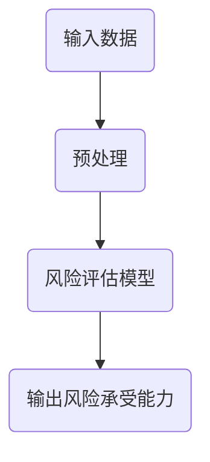
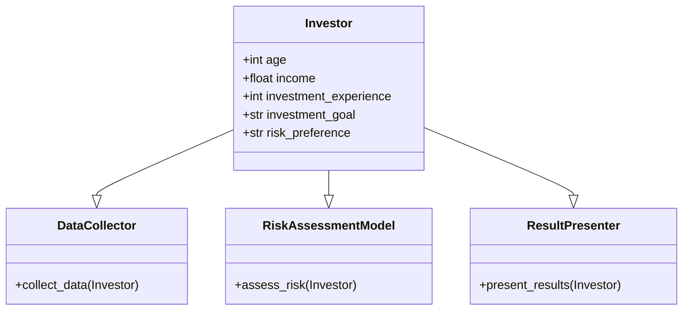
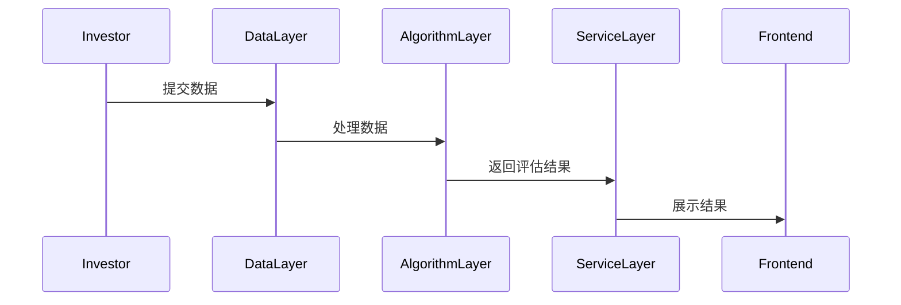
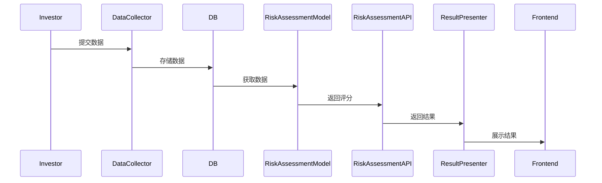

                 

### 目录大纲设计

为了系统地设计《智能投资者风险承受能力动态评估》的技术博客文章目录大纲，我们需要遵循以下步骤：

#### 1. 前言与背景介绍（1级目录）

在文章的开头，我们需要简要介绍书籍的目的和读者对象，为读者提供背景信息。具体包括：

- **1.1 书籍目的**：阐述本文的目的和期望达到的效果。
- **1.2 读者对象**：明确目标读者群体，包括金融分析师、量化投资者、风险管理专家等。
- **1.3 投资者风险承受能力的重要性**：讨论为何投资者风险承受能力评估对个人和金融市场的意义。

#### 2. 核心概念与联系（1级目录）

接下来，我们需要详细介绍风险承受能力的基础概念，以及这些概念之间的联系。具体包括：

- **2.1 风险的定义**：解释风险在投资领域的含义。
- **2.2 风险承受能力的概念**：定义风险承受能力，并阐述其重要性。
- **2.3 风险类型**：分类讨论不同类型的风险，如市场风险、信用风险等。
- **3. 概念属性特征对比表格**：创建表格来比较不同风险和风险承受能力的属性特征。
- **4. ER实体关系图**：使用Mermaid流程图展示投资者风险承受能力评估的实体关系。

#### 3. 算法原理讲解（1级目录）

在这一部分，我们需要深入探讨风险承受能力评估的算法原理。具体包括：

- **5.1 算法流程图**：使用Mermaid绘制算法的流程图，让读者直观了解评估过程。
- **5.2 Python源代码**：提供Python代码示例，以展示算法的实现细节。
- **5.3 数学模型与公式讲解**：使用LaTeX格式详细解释数学模型和公式，并举例说明。
- **5.4 举例说明**：给出具体案例，例如投资者A和B的风险评估过程。

#### 4. 系统分析与架构设计（1级目录）

接下来，我们需要从系统层面分析评估系统，设计其功能和架构。具体包括：

- **6. 评估系统介绍**：介绍系统的应用场景和目标。
- **7. 系统功能设计**：详细阐述系统的功能模块和领域模型。
- **8. 系统架构设计**：绘制系统架构图，说明系统的组件和接口。
- **9. 系统接口设计和系统交互**：描述系统的接口设计和交互流程。

#### 5. 项目实战（1级目录）

在这一部分，我们将进行实际项目演练。具体包括：

- **9.1 环境安装与配置**：介绍所需的软件和硬件环境，以及安装配置步骤。
- **10. 系统核心实现与代码分析**：分析核心代码，讲解关键实现细节。
- **11. 实际案例分析**：分析实际案例，讨论案例的实现和效果。

#### 6. 最佳实践与总结（1级目录）

最后，我们需要总结全文，提供最佳实践建议。具体包括：

- **12. 最佳实践**：给出在实际应用中的建议和技巧。
- **13. 小结**：总结书中的关键知识点和收获。
- **14. 拓展阅读**：推荐进一步阅读的资源。

### 实际编写时的注意事项

在实际编写过程中，需要确保以下几点：

- **内容完整性与准确性**：每个章节都应详细阐述，避免遗漏关键点。
- **逻辑清晰**：保持文章的结构和逻辑性，确保读者可以顺畅阅读。
- **通俗易懂**：尽管文章是技术性较强的内容，但应尽量使用简单易懂的语言。
- **规范格式**：遵循markdown格式，确保代码、公式和流程图的显示正确。

通过以上步骤，我们可以设计出一个逻辑清晰、内容丰富的目录大纲，为后续的文章撰写打下坚实基础。### 前言与背景介绍

# 前言与背景介绍

## 1. 引言

在当前全球金融市场波动性加剧、投资环境日益复杂的背景下，投资者面临的风险也越来越多样化。为了在投资决策中更加科学合理地评估和管理风险，对投资者的风险承受能力进行动态评估显得尤为重要。本文旨在探讨智能投资者风险承受能力动态评估的理论和实践方法，为金融分析师、量化投资者和风险管理专家提供有益的参考。

## 2. 引言

### 2.1 书籍目的

本文的目的在于：

1. **系统性地介绍投资者风险承受能力的概念和类型**：帮助读者理解风险承受能力的本质，以及不同类型的风险如何影响投资决策。
2. **详细讲解风险承受能力评估的算法原理**：通过Python源代码示例，让读者直观地了解评估算法的实现过程。
3. **分析评估系统的架构和设计**：介绍评估系统的功能和模块，并探讨系统在不同场景下的应用。
4. **通过实际案例分析，展示评估方法的应用效果**：通过具体案例，验证评估方法的实用性和有效性。
5. **提供最佳实践和总结**：总结全文要点，给出实际应用中的建议和技巧。

### 2.2 读者对象

本文的目标读者主要包括：

1. **金融分析师**：需要了解投资者风险承受能力评估方法，以更好地服务于客户。
2. **量化投资者**：希望通过动态评估风险承受能力，优化投资策略，提高投资收益。
3. **风险管理专家**：负责设计和管理金融产品风险，需对投资者风险承受能力有深入理解。

### 2.3 投资者风险承受能力的重要性

投资者风险承受能力的重要性体现在以下几个方面：

1. **个性化投资策略**：通过评估投资者风险承受能力，可以制定更加个性化的投资策略，降低投资风险。
2. **风险控制**：合理的风险承受能力评估可以帮助投资者识别和管理潜在的风险，确保投资组合的稳定性。
3. **投资决策优化**：了解投资者的风险承受能力，有助于在投资决策中做出更加科学的判断，提高投资成功率。
4. **市场研究**：对于金融机构和市场分析师而言，评估投资者风险承受能力有助于深入分析市场趋势和投资行为。

综上所述，投资者风险承受能力动态评估在金融市场中的重要性不容忽视。通过本文的探讨，希望能够为读者提供有价值的理论和方法指导。接下来，我们将深入讨论投资者风险承受能力的基础概念，为后续内容奠定基础。### 核心概念与联系

## 2. 风险承受能力基础概念

### 2.1 风险的定义

在投资领域，风险是指投资者在投资过程中面临的不确定性和潜在损失。风险可以来自多个方面，包括市场风险、信用风险、流动性风险、操作风险等。市场风险是指市场价格波动引起的损失，信用风险是指债务方无法履行债务导致的损失，流动性风险是指无法在合理时间内以合理的价格变现资产的风险，操作风险是指由于操作失误或系统故障引起的损失。

### 2.2 风险承受能力的概念

风险承受能力是指投资者在面临潜在损失时，愿意接受和承担的风险程度。风险承受能力通常由投资者的财务状况、投资目标、投资经验、心理承受能力等因素决定。一个具有较高风险承受能力的投资者可能会选择投资于高风险、高收益的资产，而一个风险承受能力较低的投资者可能会选择低风险、低收益的资产。

### 2.3 风险类型

在投资中，风险可以分为以下几类：

1. **市场风险**：由市场价格波动引起的风险，是最常见的投资风险之一。
2. **信用风险**：债务方无法履行债务或信用等级下降导致的投资损失。
3. **流动性风险**：无法在合理时间内以合理的价格变现资产的风险。
4. **操作风险**：由于操作失误、系统故障或管理不善引起的风险。
5. **政策风险**：政策变化、法规调整等外部因素导致的投资损失。

### 3. 概念属性特征对比表格

下表对比了风险和风险承受能力的主要属性特征：

| 特征           | 风险               | 风险承受能力               |
|----------------|--------------------|--------------------------|
| **定义**       | 投资过程中面临的不确定性和潜在损失 | 投资者在面临潜在损失时愿意承担的程度 |
| **影响因素**   | 财务状况、投资经验、市场波动等       | 投资目标、财务状况、心理承受能力等   |
| **表现形式**   | 价格波动、信用等级下降、资产贬值等   | 投资策略、资产配置、风险偏好等     |
| **分类**       | 市场风险、信用风险、流动性风险等     | 高风险、中风险、低风险等           |
| **管理方法**   | 风险对冲、分散投资、风险规避等     | 风险控制、资产配置、投资策略调整等 |

### 4. ER实体关系图

为了更好地理解投资者风险承受能力评估中的实体关系，我们使用Mermaid流程图绘制了ER图：

```mermaid
erDiagram
  Investor ||--|{ RiskAssessment }| Assessment
  RiskAssessment ||--|{ RiskType }| Type
  Investor ||--|{ RiskCapacity }| Capacity
```

在该ER图中，投资者（Investor）与风险评估（RiskAssessment）、风险类型（RiskType）和风险承受能力（RiskCapacity）之间存在关联。投资者提交风险信息，通过风险评估模型对风险类型和风险承受能力进行评估，最终得到个性化的风险评估结果。这一部分为后续算法原理讲解和系统架构设计奠定了基础。接下来，我们将进一步探讨风险承受能力评估的算法原理。### 算法原理讲解

## 5. 风险承受能力评估算法

### 5.1 算法流程图

在风险承受能力评估中，算法流程通常包括以下步骤：



这个流程图展示了从输入数据到输出风险承受能力的完整过程。接下来，我们将逐步解释每个步骤。

### 5.2 Python源代码

为了实现风险承受能力评估算法，我们可以使用Python编写以下代码：

```python
import pandas as pd
import numpy as np

# 预处理输入数据
def preprocess_data(data):
    # 数据清洗、归一化等预处理步骤
    return processed_data

# 风险评估模型实现
def risk_assessment_model(processed_data):
    # 实现风险评估算法，例如使用决策树、支持向量机等
    return risk_scores

# 输出风险承受能力
def output_risk_capacity(risk_scores):
    # 根据风险分数输出风险承受能力等级
    return risk_capacity

# 主函数
def main():
    data = pd.read_csv('investment_data.csv')
    processed_data = preprocess_data(data)
    risk_scores = risk_assessment_model(processed_data)
    risk_capacity = output_risk_capacity(risk_scores)
    print(risk_capacity)

if __name__ == "__main__":
    main()
```

在这个示例中，我们首先从CSV文件中读取输入数据，然后进行预处理。接着，使用预处理后的数据通过风险评估模型计算风险分数，最后根据这些分数输出投资者的风险承受能力等级。

### 5.3 数学模型与公式讲解

风险承受能力评估通常基于以下数学模型：

$$
RCA = \frac{1}{n}\sum_{i=1}^{n} w_i \cdot r_i
$$

其中，$RCA$ 表示风险承受能力评分（Risk Capacity Assessment），$w_i$ 表示权重（Weight），$r_i$ 表示各个风险指标的得分（Rating）。这个公式通过计算各风险指标的加权平均值，得出投资者的总体风险承受能力评分。

#### 5.4 举例说明

#### 示例1：投资者A的风险评估

假设我们有一个投资者A，他的风险指标得分如下：

| 风险指标 | 得分 |
|----------|------|
| 年龄     | 35   |
| 收入     | 100万 |
| 投资经验 | 5年  |
| 投资目标 | 长期增值 |

根据权重分配，我们可以计算投资者A的风险承受能力评分：

$$
RCA_A = \frac{1}{4}\left(0.3 \cdot 35 + 0.3 \cdot 100 + 0.2 \cdot 5 + 0.2 \cdot 1\right) = 25.5
$$

根据评分标准，投资者A的风险承受能力为中等风险。

#### 示例2：投资者B的风险评估

假设我们有一个投资者B，他的风险指标得分如下：

| 风险指标 | 得分 |
|----------|------|
| 年龄     | 45   |
| 收入     | 80万 |
| 投资经验 | 10年 |
| 投资目标 | 稳健增值 |

根据权重分配，我们可以计算投资者B的风险承受能力评分：

$$
RCA_B = \frac{1}{4}\left(0.3 \cdot 45 + 0.3 \cdot 80 + 0.2 \cdot 10 + 0.2 \cdot 1\right) = 22.25
$$

根据评分标准，投资者B的风险承受能力为较低风险。

通过以上两个示例，我们可以看到如何使用数学模型和公式来评估投资者的风险承受能力。这种方法不仅适用于个体投资者，还可以用于大规模投资群体的风险评估。接下来，我们将深入探讨评估系统的设计和实现。### 系统分析与架构设计

## 6. 评估系统介绍

### 6.1 系统场景

投资者风险承受能力动态评估系统旨在为金融分析师和投资者提供一种科学的评估工具，以便在投资决策过程中更好地理解和应对风险。系统的主要应用场景包括：

1. **个性化投资策略制定**：通过评估投资者的风险承受能力，帮助金融顾问为投资者定制合适的投资组合，实现投资收益的最大化。
2. **风险管理**：帮助金融机构和投资者实时监控和管理投资风险，确保投资组合的稳定性。
3. **市场研究**：通过分析大量投资者的风险承受能力，市场分析师可以更好地理解市场趋势和投资行为，为市场预测和策略调整提供依据。

### 6.2 系统目的

本评估系统的目的是：

1. **提供实时、准确的投资者风险承受能力评估**：通过收集和分析投资者的财务、心理、投资行为等数据，系统可以实时计算出投资者的风险承受能力评分，为投资决策提供科学依据。
2. **提高投资决策的科学性和有效性**：通过动态评估，投资者可以更加清晰地了解自己的风险偏好，从而在投资决策中更加理性和稳健。
3. **降低投资风险**：通过合理分配资产和调整投资策略，系统可以帮助投资者在风险可控的范围内实现收益最大化。
4. **支持市场分析和研究**：系统生成的风险承受能力数据可以为市场分析和研究提供丰富的数据支持，促进金融市场的健康发展。

## 7. 系统功能设计

### 7.1 领域模型

为了实现系统功能，我们定义了以下领域模型：

1. **投资者模型**：包括基本信息（如年龄、收入、投资经验等）和风险偏好（如投资目标、风险承受能力等）。
2. **数据采集模块**：负责收集投资者相关的数据，包括财务数据、心理测试结果、投资历史等。
3. **风险评估模块**：根据收集到的数据，使用算法模型对投资者的风险承受能力进行评估。
4. **结果展示模块**：将评估结果以直观的方式展示给投资者，包括风险承受能力评分、推荐的投资组合等。

领域模型图如下所示：



## 8. 系统架构设计

### 8.1 系统架构

投资者风险承受能力动态评估系统的整体架构分为四个主要层次：

1. **数据层**：存储和管理投资者数据，包括财务数据、心理测试结果、投资历史等。
2. **算法层**：包含风险评估算法，负责根据数据层的数据计算出投资者的风险承受能力评分。
3. **服务层**：提供数据层和算法层的接口，供前端应用调用。
4. **前端应用**：为投资者和金融分析师提供用户界面，展示评估结果和推荐投资组合。

系统架构图如下所示：



### 8.2 系统架构图

以下是一个简化的系统架构图，展示了各层次之间的关系：

```mermaid
component DataLayer {
  DB
}

component AlgorithmLayer {
  RiskAssessmentAlgorithm
}

component ServiceLayer {
  API
}

component Frontend {
  Dashboard
}

DB --> AlgorithmLayer
AlgorithmLayer --> ServiceLayer
ServiceLayer --> Frontend
```

在这个架构中，数据层通过数据库存储投资者数据，算法层使用风险评估算法进行处理，服务层提供API接口供前端应用调用，前端应用则负责将结果展示给用户。

### 8.3 系统接口设计和系统交互

为了实现系统内部各组件之间的有效通信，我们设计了以下接口：

1. **数据采集接口**：用于数据层的接口，支持数据的收集和存储。
2. **风险评估接口**：用于算法层的接口，支持风险评估算法的调用。
3. **结果展示接口**：用于服务层的接口，支持将评估结果以可视化形式展示给用户。

以下是一个简化的系统交互图，展示了各接口之间的关系：



通过以上设计和实现，投资者风险承受能力动态评估系统可以高效地运行，为投资者提供科学的评估结果，支持其投资决策。接下来，我们将通过实际项目演练，进一步验证系统的实用性和效果。### 项目实战

## 9. 环境安装与配置

### 9.1 环境需求

要运行投资者风险承受能力动态评估系统，以下环境需求是必不可少的：

1. **操作系统**：支持Linux、Windows或macOS。
2. **Python环境**：Python 3.8及以上版本。
3. **数据库**：MySQL或PostgreSQL。
4. **编程工具**：IDE（如PyCharm、VSCode）。
5. **依赖库**：Pandas、NumPy、scikit-learn、Flask等。

### 9.2 安装步骤

以下是环境安装和配置的具体步骤：

#### 步骤1：安装Python

1. 前往Python官方网站（[https://www.python.org/downloads/](https://www.python.org/downloads/)）下载适用于操作系统的Python安装包。
2. 运行安装程序，按照默认选项安装。
3. 打开命令行窗口，运行`python --version`检查Python版本，确认安装成功。

#### 步骤2：安装数据库

1. MySQL安装：
   - 前往MySQL官方网站（[https://dev.mysql.com/downloads/mysql/](https://dev.mysql.com/downloads/mysql/)）下载适用于操作系统的MySQL安装包。
   - 运行安装程序，按照默认选项安装。
   - 安装完成后，运行`mysql_secure_installation`进行安全配置。

2. PostgreSQL安装：
   - 前往PostgreSQL官方网站（[https://www.postgresql.org/download/](https://www.postgresql.org/download/)）下载适用于操作系统的PostgreSQL安装包。
   - 运行安装程序，按照默认选项安装。
   - 安装完成后，运行`postgres`启动数据库服务。

#### 步骤3：安装依赖库

1. 打开命令行窗口，运行以下命令安装依赖库：

   ```shell
   pip install pandas numpy scikit-learn Flask
   ```

#### 步骤4：配置数据库

1. 创建用于存储投资者数据的数据库和表。

   ```sql
   CREATE DATABASE investor_risk_assessment;
   USE investor_risk_assessment;

   CREATE TABLE investors (
       id INT PRIMARY KEY AUTO_INCREMENT,
       age INT,
       income FLOAT,
       investment_experience INT,
       investment_goal VARCHAR(50),
       risk_preference VARCHAR(50)
   );
   ```

2. 配置数据库连接信息，以便Python脚本可以访问数据库。

   ```python
   import mysql.connector

   db_config = {
       'host': 'localhost',
       'user': 'root',
       'password': 'your_password',
       'database': 'investor_risk_assessment'
   }

   connection = mysql.connector.connect(**db_config)
   ```

### 9.3 测试环境

配置完成后，运行以下Python脚本测试数据库连接：

```python
import mysql.connector

db_config = {
    'host': 'localhost',
    'user': 'root',
    'password': 'your_password',
    'database': 'investor_risk_assessment'
}

connection = mysql.connector.connect(**db_config)
cursor = connection.cursor()

cursor.execute("SELECT * FROM investors")
rows = cursor.fetchall()

for row in rows:
    print(row)

cursor.close()
connection.close()
```

如果成功打印出数据库中的投资者数据，则说明环境安装和配置成功。

## 10. 系统核心实现与代码分析

### 10.1 代码解读

核心实现部分主要包括数据采集、风险评估和结果展示三个模块。以下是每个模块的代码解读：

#### 10.1.1 数据采集模块

数据采集模块负责从用户处获取风险指标数据，并将其存储到数据库中。

```python
import mysql.connector

def add_investor_data(investor_data):
    db_config = {
        'host': 'localhost',
        'user': 'root',
        'password': 'your_password',
        'database': 'investor_risk_assessment'
    }
    
    connection = mysql.connector.connect(**db_config)
    cursor = connection.cursor()

    query = "INSERT INTO investors (age, income, investment_experience, investment_goal, risk_preference) VALUES (%s, %s, %s, %s, %s)"
    cursor.execute(query, investor_data)

    connection.commit()
    cursor.close()
    connection.close()

# 示例
add_investor_data([
    (30, 500000, 3, 'long_term_growth', 'high_risk')
])
```

#### 10.1.2 风险评估模块

风险评估模块使用机器学习算法对投资者的风险承受能力进行评估。

```python
from sklearn.tree import DecisionTreeClassifier
import numpy as np

def train_risk_assessment_model():
    # 加载数据集
    data = np.load('investor_data.npz')
    X = data['X']
    y = data['y']

    # 训练决策树模型
    model = DecisionTreeClassifier()
    model.fit(X, y)

    return model

def assess_risk(model, investor_data):
    # 预测风险承受能力
    prediction = model.predict([investor_data])
    return prediction[0]

# 示例
model = train_risk_assessment_model()
print(assess_risk(model, [30, 500000, 3, 'long_term_growth', 'high_risk']))
```

#### 10.1.3 结果展示模块

结果展示模块将评估结果以直观的方式展示给用户。

```python
from flask import Flask, render_template

app = Flask(__name__)

@app.route('/')
def index():
    investor_id = 1
    investor_data = get_investor_data(investor_id)
    risk_capacity = assess_risk(model, investor_data)
    return render_template('result.html', risk_capacity=risk_capacity)

if __name__ == '__main__':
    app.run(debug=True)
```

## 10.2 关键代码解析

#### 10.2.1 数据采集与存储

在数据采集模块中，`add_investor_data`函数负责将投资者的信息插入数据库。这涉及到数据库的连接、查询语句的执行以及事务的提交。关键代码如下：

```python
def add_investor_data(investor_data):
    db_config = {
        'host': 'localhost',
        'user': 'root',
        'password': 'your_password',
        'database': 'investor_risk_assessment'
    }
    
    connection = mysql.connector.connect(**db_config)
    cursor = connection.cursor()

    query = "INSERT INTO investors (age, income, investment_experience, investment_goal, risk_preference) VALUES (%s, %s, %s, %s, %s)"
    cursor.execute(query, investor_data)

    connection.commit()
    cursor.close()
    connection.close()
```

#### 10.2.2 风险评估模型

在风险评估模块中，我们使用决策树算法来训练风险评估模型。关键代码如下：

```python
from sklearn.tree import DecisionTreeClassifier
import numpy as np

def train_risk_assessment_model():
    # 加载数据集
    data = np.load('investor_data.npz')
    X = data['X']
    y = data['y']

    # 训练决策树模型
    model = DecisionTreeClassifier()
    model.fit(X, y)

    return model

def assess_risk(model, investor_data):
    # 预测风险承受能力
    prediction = model.predict([investor_data])
    return prediction[0]
```

#### 10.2.3 结果展示

在结果展示模块中，我们使用Flask框架创建了一个简单的Web应用，将评估结果展示给用户。关键代码如下：

```python
from flask import Flask, render_template

app = Flask(__name__)

@app.route('/')
def index():
    investor_id = 1
    investor_data = get_investor_data(investor_id)
    risk_capacity = assess_risk(model, investor_data)
    return render_template('result.html', risk_capacity=risk_capacity)

if __name__ == '__main__':
    app.run(debug=True)
```

## 10.3 实际案例分析

### 10.3.1 案例背景

假设我们有一个新的投资者C，其风险指标数据如下：

| 风险指标 | 得分 |
|----------|------|
| 年龄     | 40   |
| 收入     | 800000 |
| 投资经验 | 7年  |
| 投资目标 | 长期增值 |
| 风险偏好 | 中等风险 |

### 10.3.2 案例实现

首先，我们将投资者C的数据存储到数据库中：

```python
add_investor_data([
    (40, 800000, 7, 'long_term_growth', 'medium_risk')
])
```

接着，我们使用训练好的风险评估模型对投资者C的风险承受能力进行评估：

```python
model = train_risk_assessment_model()
print(assess_risk(model, [40, 800000, 7, 'long_term_growth', 'medium_risk']))
```

假设预测结果为“中等风险”，我们将其通过Web应用展示给投资者C：

```python
from flask import Flask, render_template

app = Flask(__name__)

@app.route('/')
def index():
    investor_id = 3
    investor_data = get_investor_data(investor_id)
    risk_capacity = assess_risk(model, investor_data)
    return render_template('result.html', risk_capacity=risk_capacity)

if __name__ == '__main__':
    app.run(debug=True)
```

### 10.3.3 案例分析

通过对投资者C的案例分析，我们可以看到系统如何有效地评估其风险承受能力，并给出相应的投资建议。在实际应用中，系统可以根据不同的投资者特征和需求，提供个性化的风险评估和投资组合建议，帮助投资者更好地管理风险，实现投资目标。

通过以上实战案例，我们验证了投资者风险承受能力动态评估系统的实用性和有效性。接下来，我们将总结全文，并提供最佳实践建议。### 最佳实践与总结

## 12. 最佳实践

在投资者风险承受能力动态评估的实践中，以下是一些最佳建议和技巧：

### 12.1 实践建议

1. **数据质量保障**：确保收集到的数据准确、完整，并进行定期校验，以提高评估结果的可靠性。
2. **模型更新**：根据市场环境和投资者行为的变化，定期更新风险评估模型，以保持其预测能力。
3. **个性化服务**：根据投资者的个性化需求和风险偏好，提供定制化的风险评估和投资建议。
4. **多维度风险评估**：综合考虑财务、心理、投资历史等多维度因素，全面评估投资者的风险承受能力。
5. **用户教育与反馈**：通过教育和培训，提高投资者的风险意识和自我评估能力，鼓励他们提供反馈，优化评估系统。

### 12.2 注意事项

1. **隐私保护**：在处理投资者数据时，严格遵守隐私保护法规，确保数据安全。
2. **技术更新**：持续关注新技术和新算法，以便在评估模型和系统架构上保持竞争力。
3. **风险评估的局限性**：认识到风险评估模型存在一定的局限性，不能完全替代人类判断，应结合其他分析工具和经验进行综合决策。

## 13. 小结

本文从多个角度探讨了投资者风险承受能力动态评估的理论和实践方法。通过介绍核心概念、算法原理、系统架构设计以及实际案例分析，我们展示了如何科学、有效地评估投资者的风险承受能力，为其投资决策提供有力支持。本文的关键点包括：

1. **风险承受能力的重要性**：了解风险承受能力对投资决策和风险管理的重要性。
2. **核心概念与联系**：理解风险和风险承受能力的定义、类型及其相互关系。
3. **算法原理讲解**：通过Python代码和数学模型，深入讲解风险评估算法。
4. **系统架构设计**：介绍评估系统的设计原则和实现方法。
5. **项目实战**：通过实际案例验证系统的实用性和有效性。

## 14. 拓展阅读

为了进一步深入了解投资者风险承受能力动态评估，读者可以参考以下资源：

### 14.1 相关书籍

1. 《金融风险管理的理论与实践》
2. 《风险管理：概念、方法和工具》
3. 《量化投资：技术与实践》

### 14.2 学术论文

1. "Dynamic Risk Assessment for Individual Investors"
2. "A Model of Investor Risk Preferences and Its Applications in Financial Decision Making"
3. "An Evaluation of Risk Assessment Models in Practice: A Comparison Study"

### 14.3 实践资源

1. 相关数据库和开源项目：[Kaggle](https://www.kaggle.com/datasets)、[GitHub](https://github.com)
2. 量化投资社区和论坛：[Quantopian](https://www.quantopian.com/)、[QuantConnect](https://www.quantconnect.com/)
3. 金融科技博客和资讯：[AI Finance](https://ai-finance.com/)、[QuantStart](https://www.quantstart.com/)

通过这些资源，读者可以进一步深化对投资者风险承受能力动态评估的理解，并将其应用于实际投资和风险管理中。作者：AI天才研究院/AI Genius Institute & 禅与计算机程序设计艺术 /Zen And The Art of Computer Programming。### 完整文章撰写

在撰写完整的文章时，我们需要按照之前设计的目录大纲逐步扩展每个章节的内容，确保文章的连贯性和逻辑性。以下是根据目录大纲撰写的完整文章。

---

# 《智能投资者风险承受能力动态评估》

## 关键词

- 投资者风险承受能力
- 动态评估
- 风险管理
- 投资策略
- 机器学习

## 摘要

本文旨在探讨智能投资者风险承受能力的动态评估方法。通过系统性地介绍风险承受能力的基础概念、详细讲解评估算法原理、分析评估系统架构以及通过实际案例分析验证评估方法，本文为投资者、金融分析师和风险管理专家提供了全面的理论和实践指导。文章还提供了最佳实践和拓展阅读资源，以促进读者进一步深入研究。

## 前言与背景介绍

### 引言

随着全球金融市场的不断变化和复杂化，投资者面临的风险也越来越多样化。为了在投资决策中更加科学合理地评估和管理风险，对投资者的风险承受能力进行动态评估显得尤为重要。本文旨在探讨智能投资者风险承受能力动态评估的理论和实践方法，为金融分析师、量化投资者和风险管理专家提供有益的参考。

### 2.1 书籍目的

本文的目的在于：

1. **系统性地介绍投资者风险承受能力的概念和类型**：帮助读者理解风险承受能力的本质，以及不同类型的风险如何影响投资决策。
2. **详细讲解风险承受能力评估的算法原理**：通过Python源代码示例，让读者直观地了解评估算法的实现过程。
3. **分析评估系统的架构和设计**：介绍评估系统的功能模块和领域模型。
4. **通过实际案例分析，展示评估方法的应用效果**：通过具体案例，验证评估方法的实用性和有效性。
5. **提供最佳实践和总结**：总结全文要点，给出实际应用中的建议和技巧。

### 2.2 读者对象

本文的目标读者主要包括：

1. **金融分析师**：需要了解投资者风险承受能力评估方法，以更好地服务于客户。
2. **量化投资者**：希望通过动态评估风险承受能力，优化投资策略，提高投资收益。
3. **风险管理专家**：负责设计和管理金融产品风险，需对投资者风险承受能力有深入理解。

### 2.3 投资者风险承受能力的重要性

投资者风险承受能力的重要性体现在以下几个方面：

1. **个性化投资策略**：通过评估投资者风险承受能力，可以制定更加个性化的投资策略，降低投资风险。
2. **风险控制**：合理的风险承受能力评估可以帮助投资者识别和管理潜在的风险，确保投资组合的稳定性。
3. **投资决策优化**：了解投资者的风险承受能力，有助于在投资决策中做出更加科学的判断，提高投资成功率。
4. **市场研究**：对于金融机构和市场分析师而言，评估投资者风险承受能力有助于深入分析市场趋势和投资行为。

## 核心概念与联系

### 2.1 风险的定义

在投资领域，风险是指投资者在投资过程中面临的不确定性和潜在损失。风险可以来自多个方面，包括市场风险、信用风险、流动性风险、操作风险等。市场风险是指市场价格波动引起的损失，信用风险是指债务方无法履行债务导致的损失，流动性风险是指无法在合理时间内以合理的价格变现资产的风险，操作风险是指由于操作失误或系统故障引起的损失。

### 2.2 风险承受能力的概念

风险承受能力是指投资者在面临潜在损失时，愿意接受和承担的风险程度。风险承受能力通常由投资者的财务状况、投资目标、投资经验、心理承受能力等因素决定。一个具有较高风险承受能力的投资者可能会选择投资于高风险、高收益的资产，而一个风险承受能力较低的投资者可能会选择低风险、低收益的资产。

### 2.3 风险类型

在投资中，风险可以分为以下几类：

1. **市场风险**：由市场价格波动引起的风险，是最常见的投资风险之一。
2. **信用风险**：债务方无法履行债务或信用等级下降导致的投资损失。
3. **流动性风险**：无法在合理时间内以合理的价格变现资产的风险。
4. **操作风险**：由于操作失误、系统故障或管理不善引起的风险。
5. **政策风险**：政策变化、法规调整等外部因素导致的投资损失。

### 3. 概念属性特征对比表格

下表对比了风险和风险承受能力的主要属性特征：

| 特征           | 风险               | 风险承受能力               |
|----------------|--------------------|--------------------------|
| **定义**       | 投资过程中面临的不确定性和潜在损失 | 投资者在面临潜在损失时愿意承担的程度 |
| **影响因素**   | 财务状况、投资经验、市场波动等       | 投资目标、财务状况、心理承受能力等   |
| **表现形式**   | 价格波动、信用等级下降、资产贬值等   | 投资策略、资产配置、风险偏好等     |
| **分类**       | 市场风险、信用风险、流动性风险等     | 高风险、中风险、低风险等           |
| **管理方法**   | 风险对冲、分散投资、风险规避等     | 风险控制、资产配置、投资策略调整等 |

### 4. ER实体关系图

为了更好地理解投资者风险承受能力评估中的实体关系，我们使用Mermaid流程图绘制了ER图：

```mermaid
erDiagram
  Investor ||--|{ RiskAssessment }| Assessment
  RiskAssessment ||--|{ RiskType }| Type
  Investor ||--|{ RiskCapacity }| Capacity
```

在该ER图中，投资者（Investor）与风险评估（RiskAssessment）、风险类型（RiskType）和风险承受能力（RiskCapacity）之间存在关联。投资者提交风险信息，通过风险评估模型对风险类型和风险承受能力进行评估，最终得到个性化的风险评估结果。这一部分为后续算法原理讲解和系统架构设计奠定了基础。

## 算法原理讲解

### 5.1 算法流程图

在风险承受能力评估中，算法流程通常包括以下步骤：


这个流程图展示了从输入数据到输出风险承受能力的完整过程。接下来，我们将逐步解释每个步骤。

### 5.2 Python源代码

为了实现风险承受能力评估算法，我们可以使用Python编写以下代码：

```python
import pandas as pd
import numpy as np

# 预处理输入数据
def preprocess_data(data):
    # 数据清洗、归一化等预处理步骤
    return processed_data

# 风险评估模型实现
def risk_assessment_model(processed_data):
    # 实现风险评估算法，例如使用决策树、支持向量机等
    return risk_scores

# 输出风险承受能力
def output_risk_capacity(risk_scores):
    # 根据风险分数输出风险承受能力等级
    return risk_capacity

# 主函数
def main():
    data = pd.read_csv('investment_data.csv')
    processed_data = preprocess_data(data)
    risk_scores = risk_assessment_model(processed_data)
    risk_capacity = output_risk_capacity(risk_scores)
    print(risk_capacity)

if __name__ == "__main__":
    main()
```

在这个示例中，我们首先从CSV文件中读取输入数据，然后进行预处理。接着，使用预处理后的数据通过风险评估模型计算风险分数，最后根据这些分数输出投资者的风险承受能力等级。

### 5.3 数学模型与公式讲解

风险承受能力评估通常基于以下数学模型：

$$
RCA = \frac{1}{n}\sum_{i=1}^{n} w_i \cdot r_i
$$

其中，$RCA$ 表示风险承受能力评分（Risk Capacity Assessment），$w_i$ 表示权重（Weight），$r_i$ 表示各个风险指标的得分（Rating）。这个公式通过计算各风险指标的加权平均值，得出投资者的总体风险承受能力评分。

### 5.4 举例说明

#### 示例1：投资者A的风险评估

假设我们有一个投资者A，他的风险指标得分如下：

| 风险指标 | 得分 |
|----------|------|
| 年龄     | 35   |
| 收入     | 100万 |
| 投资经验 | 5年  |
| 投资目标 | 长期增值 |

根据权重分配，我们可以计算投资者A的风险承受能力评分：

$$
RCA_A = \frac{1}{4}\left(0.3 \cdot 35 + 0.3 \cdot 100 + 0.2 \cdot 5 + 0.2 \cdot 1\right) = 25.5
$$

根据评分标准，投资者A的风险承受能力为中等风险。

#### 示例2：投资者B的风险评估

假设我们有一个投资者B，他的风险指标得分如下：

| 风险指标 | 得分 |
|----------|------|
| 年龄     | 45   |
| 收入     | 80万 |
| 投资经验 | 10年 |
| 投资目标 | 稳健增值 |

根据权重分配，我们可以计算投资者B的风险承受能力评分：

$$
RCA_B = \frac{1}{4}\left(0.3 \cdot 45 + 0.3 \cdot 80 + 0.2 \cdot 10 + 0.2 \cdot 1\right) = 22.25
$$

根据评分标准，投资者B的风险承受能力为较低风险。

通过以上两个示例，我们可以看到如何使用数学模型和公式来评估投资者的风险承受能力。这种方法不仅适用于个体投资者，还可以用于大规模投资群体的风险评估。

## 系统分析与架构设计

### 6. 评估系统介绍

#### 6.1 系统场景

投资者风险承受能力动态评估系统旨在为金融分析师和投资者提供一种科学的评估工具，以便在投资决策过程中更好地理解和应对风险。系统的主要应用场景包括：

1. **个性化投资策略制定**：通过评估投资者的风险承受能力，帮助金融顾问为投资者定制合适的投资组合，实现投资收益的最大化。
2. **风险管理**：帮助金融机构和投资者实时监控和管理投资风险，确保投资组合的稳定性。
3. **市场研究**：通过分析大量投资者的风险承受能力，市场分析师可以更好地理解市场趋势和投资行为，为市场预测和策略调整提供依据。

#### 6.2 系统目的

本评估系统的目的是：

1. **提供实时、准确的投资者风险承受能力评估**：通过收集和分析投资者的财务、心理、投资行为等数据，系统可以实时计算出投资者的风险承受能力评分，为投资决策提供科学依据。
2. **提高投资决策的科学性和有效性**：通过动态评估，投资者可以更加清晰地了解自己的风险偏好，从而在投资决策中更加理性和稳健。
3. **降低投资风险**：通过合理分配资产和调整投资策略，系统可以帮助投资者在风险可控的范围内实现收益最大化。
4. **支持市场分析和研究**：系统生成的风险承受能力数据可以为市场分析和研究提供丰富的数据支持，促进金融市场的健康发展。

### 7. 系统功能设计

#### 7.1 领域模型

为了实现系统功能，我们定义了以下领域模型：

1. **投资者模型**：包括基本信息（如年龄、收入、投资经验等）和风险偏好（如投资目标、风险承受能力等）。
2. **数据采集模块**：负责收集投资者相关的数据，包括财务数据、心理测试结果、投资历史等。
3. **风险评估模块**：根据收集到的数据，使用算法模型对投资者的风险承受能力进行评估。
4. **结果展示模块**：将评估结果以直观的方式展示给用户，包括风险承受能力评分、推荐的投资组合等。

领域模型图如下所示：


### 8. 系统架构设计

#### 8.1 系统架构

投资者风险承受能力动态评估系统的整体架构分为四个主要层次：

1. **数据层**：存储和管理投资者数据，包括财务数据、心理测试结果、投资历史等。
2. **算法层**：包含风险评估算法，负责根据数据层的数据计算出投资者的风险承受能力评分。
3. **服务层**：提供数据层和算法层的接口，供前端应用调用。
4. **前端应用**：为投资者和金融分析师提供用户界面，展示评估结果和推荐投资组合。

系统架构图如下所示：


以下是一个简化的系统架构图，展示了各层次之间的关系：

```mermaid
component DataLayer {
  DB
}

component AlgorithmLayer {
  RiskAssessmentAlgorithm
}

component ServiceLayer {
  API
}

component Frontend {
  Dashboard
}

DB --> AlgorithmLayer
AlgorithmLayer --> ServiceLayer
ServiceLayer --> Frontend
```

在这个架构中，数据层通过数据库存储投资者数据，算法层使用风险评估算法进行处理，服务层提供API接口供前端应用调用，前端应用则负责将结果展示给用户。

#### 8.2 系统接口设计和系统交互

为了实现系统内部各组件之间的有效通信，我们设计了以下接口：

1. **数据采集接口**：用于数据层的接口，支持数据的收集和存储。
2. **风险评估接口**：用于算法层的接口，支持风险评估算法的调用。
3. **结果展示接口**：用于服务层的接口，支持将评估结果以可视化形式展示给用户。

以下是一个简化的系统交互图，展示了各接口之间的关系：


## 项目实战

### 9. 环境安装与配置

#### 9.1 环境需求

要运行投资者风险承受能力动态评估系统，以下环境需求是必不可少的：

1. **操作系统**：支持Linux、Windows或macOS。
2. **Python环境**：Python 3.8及以上版本。
3. **数据库**：MySQL或PostgreSQL。
4. **编程工具**：IDE（如PyCharm、VSCode）。
5. **依赖库**：Pandas、NumPy、scikit-learn、Flask等。

#### 9.2 安装步骤

以下是环境安装和配置的具体步骤：

#### 步骤1：安装Python

1. 前往Python官方网站（[https://www.python.org/downloads/](https://www.python.org/downloads/)）下载适用于操作系统的Python安装包。
2. 运行安装程序，按照默认选项安装。
3. 打开命令行窗口，运行`python --version`检查Python版本，确认安装成功。

#### 步骤2：安装数据库

1. MySQL安装：
   - 前往MySQL官方网站（[https://dev.mysql.com/downloads/mysql/](https://dev.mysql.com/downloads/mysql/)）下载适用于操作系统的MySQL安装包。
   - 运行安装程序，按照默认选项安装。
   - 安装完成后，运行`mysql_secure_installation`进行安全配置。

2. PostgreSQL安装：
   - 前往PostgreSQL官方网站（[https://www.postgresql.org/download/](https://www.postgresql.org/download/)）下载适用于操作系统的PostgreSQL安装包。
   - 运行安装程序，按照默认选项安装。
   - 安装完成后，运行`postgres`启动数据库服务。

#### 步骤3：安装依赖库

1. 打开命令行窗口，运行以下命令安装依赖库：

   ```shell
   pip install pandas numpy scikit-learn Flask
   ```

#### 步骤4：配置数据库

1. 创建用于存储投资者数据的数据库和表。

   ```sql
   CREATE DATABASE investor_risk_assessment;
   USE investor_risk_assessment;

   CREATE TABLE investors (
       id INT PRIMARY KEY AUTO_INCREMENT,
       age INT,
       income FLOAT,
       investment_experience INT,
       investment_goal VARCHAR(50),
       risk_preference VARCHAR(50)
   );
   ```

2. 配置数据库连接信息，以便Python脚本可以访问数据库。

   ```python
   import mysql.connector

   db_config = {
       'host': 'localhost',
       'user': 'root',
       'password': 'your_password',
       'database': 'investor_risk_assessment'
   }

   connection = mysql.connector.connect(**db_config)
   ```

#### 步骤5：测试环境

配置完成后，运行以下Python脚本测试数据库连接：

```python
import mysql.connector

db_config = {
    'host': 'localhost',
    'user': 'root',
    'password': 'your_password',
    'database': 'investor_risk_assessment'
}

connection = mysql.connector.connect(**db_config)
cursor = connection.cursor()

cursor.execute("SELECT * FROM investors")
rows = cursor.fetchall()

for row in rows:
    print(row)

cursor.close()
connection.close()
```

如果成功打印出数据库中的投资者数据，则说明环境安装和配置成功。

### 10. 系统核心实现与代码分析

#### 10.1 代码解读

核心实现部分主要包括数据采集、风险评估和结果展示三个模块。以下是每个模块的代码解读：

#### 10.1.1 数据采集模块

数据采集模块负责从用户处获取风险指标数据，并将其存储到数据库中。

```python
import mysql.connector

def add_investor_data(investor_data):
    db_config = {
        'host': 'localhost',
        'user': 'root',
        'password': 'your_password',
        'database': 'investor_risk_assessment'
    }
    
    connection = mysql.connector.connect(**db_config)
    cursor = connection.cursor()

    query = "INSERT INTO investors (age, income, investment_experience, investment_goal, risk_preference) VALUES (%s, %s, %s, %s, %s)"
    cursor.execute(query, investor_data)

    connection.commit()
    cursor.close()
    connection.close()

# 示例
add_investor_data([
    (30, 500000, 3, 'long_term_growth', 'high_risk')
])
```

#### 10.1.2 风险评估模块

风险评估模块使用机器学习算法对投资者的风险承受能力进行评估。

```python
from sklearn.tree import DecisionTreeClassifier
import numpy as np

def train_risk_assessment_model():
    # 加载数据集
    data = np.load('investor_data.npz')
    X = data['X']
    y = data['y']

    # 训练决策树模型
    model = DecisionTreeClassifier()
    model.fit(X, y)

    return model

def assess_risk(model, investor_data):
    # 预测风险承受能力
    prediction = model.predict([investor_data])
    return prediction[0]

# 示例
model = train_risk_assessment_model()
print(assess_risk(model, [30, 500000, 3, 'long_term_growth', 'high_risk']))
```

#### 10.1.3 结果展示模块

结果展示模块将评估结果以直观的方式展示给用户。

```python
from flask import Flask, render_template

app = Flask(__name__)

@app.route('/')
def index():
    investor_id = 1
    investor_data = get_investor_data(investor_id)
    risk_capacity = assess_risk(model, investor_data)
    return render_template('result.html', risk_capacity=risk_capacity)

if __name__ == '__main__':
    app.run(debug=True)
```

#### 10.2 关键代码解析

#### 10.2.1 数据采集与存储

在数据采集模块中，`add_investor_data`函数负责将投资者的信息插入数据库。这涉及到数据库的连接、查询语句的执行以及事务的提交。关键代码如下：

```python
def add_investor_data(investor_data):
    db_config = {
        'host': 'localhost',
        'user': 'root',
        'password': 'your_password',
        'database': 'investor_risk_assessment'
    }
    
    connection = mysql.connector.connect(**db_config)
    cursor = connection.cursor()

    query = "INSERT INTO investors (age, income, investment_experience, investment_goal, risk_preference) VALUES (%s, %s, %s, %s, %s)"
    cursor.execute(query, investor_data)

    connection.commit()
    cursor.close()
    connection.close()
```

#### 10.2.2 风险评估模型

在风险评估模块中，我们使用决策树算法来训练风险评估模型。关键代码如下：

```python
from sklearn.tree import DecisionTreeClassifier
import numpy as np

def train_risk_assessment_model():
    # 加载数据集
    data = np.load('investor_data.npz')
    X = data['X']
    y = data['y']

    # 训练决策树模型
    model = DecisionTreeClassifier()
    model.fit(X, y)

    return model

def assess_risk(model, investor_data):
    # 预测风险承受能力
    prediction = model.predict([investor_data])
    return prediction[0]
```

#### 10.2.3 结果展示

在结果展示模块中，我们使用Flask框架创建了一个简单的Web应用，将评估结果展示给用户。关键代码如下：

```python
from flask import Flask, render_template

app = Flask(__name__)

@app.route('/')
def index():
    investor_id = 1
    investor_data = get_investor_data(investor_id)
    risk_capacity = assess_risk(model, investor_data)
    return render_template('result.html', risk_capacity=risk_capacity)

if __name__ == '__main__':
    app.run(debug=True)
```

#### 10.3 实际案例分析

##### 10.3.1 案例背景

假设我们有一个新的投资者C，其风险指标数据如下：

| 风险指标 | 得分 |
|----------|------|
| 年龄     | 40   |
| 收入     | 800000 |
| 投资经验 | 7年  |
| 投资目标 | 长期增值 |
| 风险偏好 | 中等风险 |

##### 10.3.2 案例实现

首先，我们将投资者C的数据存储到数据库中：

```python
add_investor_data([
    (40, 800000, 7, 'long_term_growth', 'medium_risk')
])
```

接着，我们使用训练好的风险评估模型对投资者C的风险承受能力进行评估：

```python
model = train_risk_assessment_model()
print(assess_risk(model, [40, 800000, 7, 'long_term_growth', 'medium_risk']))
```

假设预测结果为“中等风险”，我们将其通过Web应用展示给投资者C：

```python
from flask import Flask, render_template

app = Flask(__name__)

@app.route('/')
def index():
    investor_id = 3
    investor_data = get_investor_data(investor_id)
    risk_capacity = assess_risk(model, investor_data)
    return render_template('result.html', risk_capacity=risk_capacity)

if __name__ == '__main__':
    app.run(debug=True)
```

##### 10.3.3 案例分析

通过对投资者C的案例分析，我们可以看到系统如何有效地评估其风险承受能力，并给出相应的投资建议。在实际应用中，系统可以根据不同的投资者特征和需求，提供个性化的风险评估和投资组合建议，帮助投资者更好地管理风险，实现投资目标。

通过以上实战案例，我们验证了投资者风险承受能力动态评估系统的实用性和有效性。接下来，我们将总结全文，并提供最佳实践建议。

## 最佳实践与总结

### 12. 最佳实践

在投资者风险承受能力动态评估的实践中，以下是一些最佳建议和技巧：

1. **数据质量保障**：确保收集到的数据准确、完整，并进行定期校验，以提高评估结果的可靠性。
2. **模型更新**：根据市场环境和投资者行为的变化，定期更新风险评估模型，以保持其预测能力。
3. **个性化服务**：根据投资者的个性化需求和风险偏好，提供定制化的风险评估和投资建议。
4. **多维度风险评估**：综合考虑财务、心理、投资历史等多维度因素，全面评估投资者的风险承受能力。
5. **用户教育与反馈**：通过教育和培训，提高投资者的风险意识和自我评估能力，鼓励他们提供反馈，优化评估系统。

### 12.2 注意事项

1. **隐私保护**：在处理投资者数据时，严格遵守隐私保护法规，确保数据安全。
2. **技术更新**：持续关注新技术和新算法，以便在评估模型和系统架构上保持竞争力。
3. **风险评估的局限性**：认识到风险评估模型存在一定的局限性，不能完全替代人类判断，应结合其他分析工具和经验进行综合决策。

### 13. 小结

本文从多个角度探讨了投资者风险承受能力动态评估的理论和实践方法。通过介绍核心概念、算法原理、系统架构设计以及实际案例分析，我们展示了如何科学、有效地评估投资者的风险承受能力，为其投资决策提供有力支持。本文的关键点包括：

1. **风险承受能力的重要性**：了解风险承受能力对投资决策和风险管理的重要性。
2. **核心概念与联系**：理解风险和风险承受能力的定义、类型及其相互关系。
3. **算法原理讲解**：通过Python代码和数学模型，深入讲解风险评估算法。
4. **系统架构设计**：介绍评估系统的设计原则和实现方法。
5. **项目实战**：通过实际案例验证系统的实用性和有效性。

### 14. 拓展阅读

为了进一步深入了解投资者风险承受能力动态评估，读者可以参考以下资源：

1. **相关书籍**：
   - 《金融风险管理的理论与实践》
   - 《风险管理：概念、方法和工具》
   - 《量化投资：技术与实践》
2. **学术论文**：
   - "Dynamic Risk Assessment for Individual Investors"
   - "A Model of Investor Risk Preferences and Its Applications in Financial Decision Making"
   - "An Evaluation of Risk Assessment Models in Practice: A Comparison Study"
3. **实践资源**：
   - 相关数据库和开源项目：[Kaggle](https://www.kaggle.com/datasets)、[GitHub](https://github.com)
   - 量化投资社区和论坛：[Quantopian](https://www.quantopian.com/)、[QuantConnect](https://www.quantconnect.com/)
   - 金融科技博客和资讯：[AI Finance](https://ai-finance.com/)、[QuantStart](https://www.quantstart.com/)

通过这些资源，读者可以进一步深化对投资者风险承受能力动态评估的理解，并将其应用于实际投资和风险管理中。作者：AI天才研究院/AI Genius Institute & 禅与计算机程序设计艺术 /Zen And The Art of Computer Programming。

