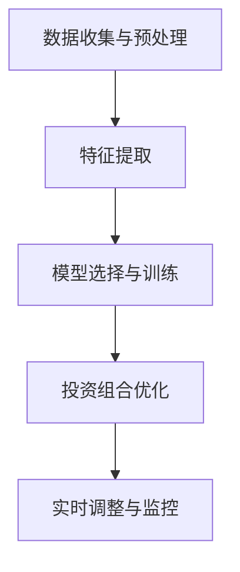
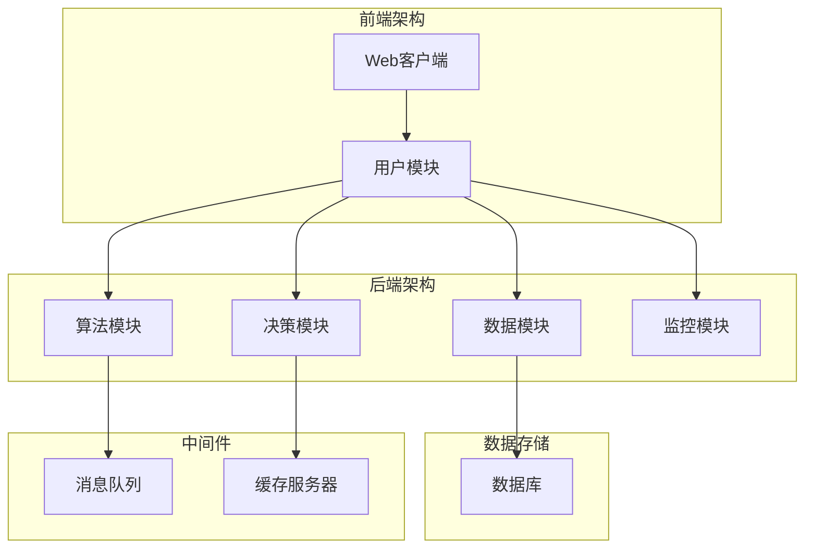
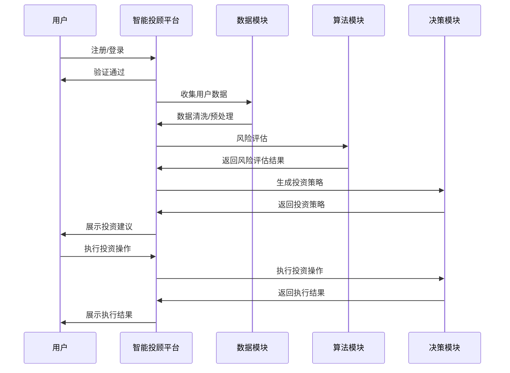

                 

### 第一步：背景介绍

#### 1.1 问题背景

**智能投顾的概念**：智能投顾，又称为智能投资顾问，是指利用大数据、人工智能、机器学习等技术，通过对用户投资偏好、风险承受能力、资产配置需求等信息的分析，为用户提供个性化投资建议的服务。它结合了传统投顾的智慧和人工智能的技术优势，旨在提升投资决策的效率和精准度。

**市场现状与发展趋势**：随着金融科技的迅猛发展，智能投顾在全球范围内得到了广泛应用。据统计，全球智能投顾市场规模在近年来持续增长，预计未来几年将保持高速发展态势。特别是在中国，随着金融市场的逐步开放和消费者理财意识的提高，智能投顾市场也展现出巨大的潜力。

**技术挑战与业务需求**：智能投顾平台在设计和实现过程中面临诸多技术挑战，如海量数据处理、算法模型优化、数据安全与隐私保护等。同时，为了满足用户的个性化需求，平台还需要具备高度的可扩展性和灵活性。因此，如何在满足业务需求的同时，解决这些技术难题，是智能投顾平台建设的核心问题。

#### 1.2 问题描述

**智能投顾平台的功能需求**：智能投顾平台需要提供包括用户信息收集、风险评估、投资组合建议、资产追踪、投资策略调整等核心功能。这些功能要求平台具备强大的数据处理能力和算法支持，以便为用户提供精准、个性化的投资建议。

**面临的挑战**：首先，平台需要处理海量用户数据和投资信息，这对数据存储和处理能力提出了高要求。其次，智能投顾算法的准确性和实时性是平台成功的关键，但这一过程中涉及到大量的数据清洗、特征提取和模型训练等复杂步骤。最后，平台的安全性也是不可忽视的，如何保障用户数据的安全和隐私，是平台设计过程中必须考虑的问题。

#### 1.3 问题解决

**智能投顾平台架构设计**：为了解决上述问题，我们需要设计一个高效、可扩展、安全的智能投顾平台架构。该架构需要涵盖数据收集与存储、数据处理与分析、算法实现与优化、用户接口与交互等多个方面。通过模块化设计，我们可以将复杂的问题分解为若干子问题，并逐一解决。

**边界与外延**：在架构设计过程中，我们还需要明确平台的适用范围、技术栈选择以及功能模块划分。这将有助于我们在设计初期就明确方向，确保平台的实际应用效果。

**概念结构与核心要素组成**：智能投顾平台的核心要素包括用户模块、数据模块、算法模块、决策模块等。每个模块都有其特定的功能和作用，它们相互协作，共同构成了一个完整的智能投顾系统。

### 1.4 概念结构与核心要素组成

**智能投顾平台的组成模块**：

- **用户模块**：负责用户信息收集和管理，包括用户注册、登录、风险评估、资产追踪等功能。
- **数据模块**：负责数据的收集、存储、清洗和预处理，为后续的算法分析和投资建议提供数据支持。
- **算法模块**：包括风险评估算法、资产配置算法、投资策略调整算法等，是平台的核心部分，负责生成投资建议。
- **决策模块**：负责根据算法生成的建议，制定具体的投资策略，并进行投资操作。
- **监控模块**：负责实时监控平台运行状态，包括系统性能、数据完整性、安全性等，确保平台的稳定运行。

**关键技术**：

- **大数据处理技术**：用于处理海量用户数据和投资信息，如Hadoop、Spark等。
- **机器学习技术**：用于构建和优化智能投顾算法，如决策树、神经网络、支持向量机等。
- **云计算技术**：用于提供强大的计算能力和存储资源，如AWS、Azure、Google Cloud等。
- **区块链技术**：用于保障数据安全和用户隐私，提高平台的透明度和可信度。

通过上述模块和关键技术的有机整合，我们可以构建一个高效、可靠的智能投顾平台，满足用户的需求，提升投资决策的效率和精准度。

### 1.5 概念属性特征对比表格

为了更好地理解智能投顾平台的关键模块和核心技术，我们在这里对比几个核心概念的属性特征。以下是用户模块、数据模块、算法模块和决策模块的对比表格：

| 模块名称 | 概念定义 | 功能描述 | 关键技术 |
| :---: | :---: | :---: | :---: |
| 用户模块 | 负责用户信息收集和管理 | 用户注册、登录、风险评估、资产追踪 | OAuth2.0、用户画像、数据加密 |
| 数据模块 | 负责数据的收集、存储、清洗和预处理 | 数据收集、数据清洗、数据预处理、数据存储 | HDFS、Spark、Kafka |
| 算法模块 | 负责构建和优化智能投顾算法 | 风险评估算法、资产配置算法、投资策略调整算法 | 决策树、神经网络、支持向量机 |
| 决策模块 | 负责根据算法建议制定投资策略 | 制定投资策略、执行投资操作、监控投资效果 | 动态规划、回测系统、投资组合优化 |

通过上述对比表格，我们可以更清晰地了解每个模块的概念定义、功能描述以及所涉及的关键技术。这些模块相互协作，共同构成了智能投顾平台的核心架构。

### 1.6 ER实体关系图架构

为了更好地理解智能投顾平台的数据模型和架构设计，我们可以使用Mermaid工具绘制一个ER（实体关系）图。以下是智能投顾平台的ER图示例：

```mermaid
erDiagram
  User ||--|{ Asset }|-- Investment
  User ||--|{ RiskProfile }|-- InvestmentStrategy
  Asset ||--|{ Stock }|-- Investment
  Asset ||--|{ Fund }|-- Investment
  RiskProfile ||--|{ RiskLevel }|-- InvestmentStrategy
  InvestmentStrategy ||--|{ Strategy }|-- Investment
```

在这个ER图中，我们定义了以下几个实体：

- **User（用户）**：代表智能投顾平台的用户，包括用户的基本信息、投资偏好等。
- **Asset（资产）**：代表用户所持有的各种资产，包括股票、基金等。
- **Investment（投资）**：代表用户的投资记录，包括具体的投资金额、投资时间等。
- **RiskProfile（风险偏好）**：代表用户的风险承受能力，包括风险等级、风险偏好等。
- **InvestmentStrategy（投资策略）**：代表根据用户风险偏好和资产配置建议的投资策略。
- **Strategy（策略）**：代表具体的投资策略，包括投资组合、投资方向等。

这些实体之间存在一定的关联关系，如用户拥有多个投资记录，资产和投资之间存在多对多的关系，投资策略根据风险偏好来制定等。通过这个ER图，我们可以清晰地了解智能投顾平台中的数据模型和架构设计，为后续的模块设计和实现提供基础。

## 第二步：核心概念与联系

### 2.1 智能投顾的定义

**智能投顾**，亦称为智能投资顾问，是一种基于大数据、人工智能和机器学习技术的金融服务形式。它通过分析用户的投资偏好、财务状况、风险承受能力等多维度数据，为用户提供个性化的投资建议和资产配置方案。与传统投顾相比，智能投顾利用算法和模型进行投资决策，大大提高了决策的效率和精准度。

**工作原理**：智能投顾平台的工作原理主要包括以下几个步骤：

1. **用户信息收集**：平台首先收集用户的基本信息、投资偏好、财务状况等数据。
2. **风险评估**：通过机器学习算法对用户的风险承受能力进行评估，生成风险偏好等级。
3. **资产配置**：根据用户的投资目标和风险偏好，智能投顾平台会制定个性化的资产配置方案，推荐合适的投资组合。
4. **投资建议生成**：平台会根据实时市场数据和用户投资情况，动态调整投资组合，并提供实时的投资建议。
5. **投资执行与监控**：用户可以根据平台建议执行投资操作，并对投资效果进行实时监控。

**目标**：智能投顾的目标是帮助用户实现资产增值，同时控制投资风险。通过个性化投资建议和智能化的资产配置，智能投顾平台旨在提高用户的投资效率，降低投资成本，并在长期内实现资产的稳健增长。

### 2.2 核心概念原理

智能投顾平台的核心概念原理主要涉及以下几个关键组成部分：

**用户模块**：用户模块是智能投顾平台的基础，负责用户信息的收集、管理和分析。具体功能包括用户注册、登录、风险评估、资产追踪等。用户模块的核心目标是确保用户信息的准确性和安全性。

**数据模块**：数据模块负责数据的收集、存储、清洗和预处理。它从多个数据源获取用户数据，如交易记录、财务报告、市场行情等，并进行清洗和预处理，以便后续的算法分析和决策。数据模块的技术难点在于如何高效地处理海量数据，确保数据的准确性和完整性。

**算法模块**：算法模块是智能投顾平台的核心，负责风险评估、资产配置和投资策略调整。这一模块采用多种机器学习和数据挖掘算法，如线性回归、决策树、随机森林、神经网络等，根据用户数据和市场动态生成投资建议。算法模块的技术难点在于如何选择合适的算法，并不断优化算法性能，以提高投资建议的准确性和实时性。

**决策模块**：决策模块负责根据算法生成的建议，制定具体的投资策略，并执行投资操作。这一模块需要与用户模块、数据模块和算法模块紧密协作，确保投资决策的准确性和有效性。决策模块的技术难点在于如何平衡投资风险和收益，实现最优的投资组合。

**监控模块**：监控模块负责实时监控平台的运行状态，包括系统性能、数据完整性、安全性等。它通过日志分析、异常检测等技术手段，及时发现并处理潜在问题，确保平台的稳定运行。

### 2.3 概念属性特征对比表格

为了更好地理解智能投顾平台的关键模块和核心技术，我们在此提供一个概念属性特征对比表格：

| 模块名称 | 概念定义 | 功能描述 | 关键技术 | 技术难点 |
| :---: | :---: | :---: | :---: | :---: |
| 用户模块 | 收集和管理用户信息 | 用户注册、登录、风险评估、资产追踪 | OAuth2.0、用户画像、数据加密 | 确保用户信息安全和准确性 |
| 数据模块 | 收集、存储、清洗和预处理数据 | 数据收集、数据清洗、数据预处理、数据存储 | HDFS、Spark、Kafka | 高效处理海量数据 |
| 算法模块 | 构建和优化智能投顾算法 | 风险评估算法、资产配置算法、投资策略调整算法 | 决策树、神经网络、支持向量机 | 选择合适的算法并优化 |
| 决策模块 | 制定和执行投资策略 | 根据算法建议制定投资策略、执行投资操作 | 动态规划、回测系统、投资组合优化 | 平衡风险和收益 |
| 监控模块 | 实时监控平台运行状态 | 系统性能、数据完整性、安全性监控 | 日志分析、异常检测 | 及时发现并处理问题 |

通过上述对比表格，我们可以更全面地了解智能投顾平台各模块的概念定义、功能描述、关键技术和技术难点。这有助于我们在设计过程中明确各模块的核心任务和技术需求，从而构建一个高效、可靠的智能投顾平台。

### 2.4 ER实体关系图架构

为了更清晰地展示智能投顾平台中的数据模型和架构设计，我们使用Mermaid工具绘制了一个ER（实体关系）图。以下是智能投顾平台的ER图示例：

```mermaid
erDiagram
  User ||--|{ Asset }|-- Investment
  User ||--|{ RiskProfile }|-- InvestmentStrategy
  Asset ||--|{ Stock }|-- Investment
  Asset ||--|{ Fund }|-- Investment
  RiskProfile ||--|{ RiskLevel }|-- InvestmentStrategy
  InvestmentStrategy ||--|{ Strategy }|-- Investment
```

在这个ER图中，我们定义了以下几个实体：

- **User（用户）**：代表智能投顾平台的用户，包括用户的基本信息、投资偏好等。用户可以拥有多个资产和风险偏好。
- **Asset（资产）**：代表用户所持有的各种资产，如股票、基金等。资产是投资的核心对象。
- **Investment（投资）**：代表用户的投资记录，包括具体的投资金额、投资时间等。每个投资可以对应多个资产。
- **RiskProfile（风险偏好）**：代表用户的风险承受能力，包括风险等级、风险偏好等。风险偏好是制定投资策略的重要依据。
- **InvestmentStrategy（投资策略）**：代表根据用户风险偏好和资产配置建议的投资策略。每个策略可以对应多个风险偏好。
- **Strategy（策略）**：代表具体的投资策略，包括投资组合、投资方向等。策略是执行投资的指导。

实体之间的关系如下：

- **User与Asset**：多对多关系。一个用户可以持有多种资产，每种资产也可以被多个用户持有。
- **User与RiskProfile**：一对一关系。每个用户有一个唯一的风险偏好。
- **Asset与Investment**：多对多关系。每种资产可以产生多个投资记录，每个投资记录也可以涉及多种资产。
- **RiskProfile与InvestmentStrategy**：多对多关系。每个风险偏好可以对应多个投资策略，每个投资策略也可以针对多个风险偏好。
- **InvestmentStrategy与Strategy**：一对多关系。每个投资策略包含一个具体的策略。

通过这个ER图，我们可以清晰地了解智能投顾平台中的数据模型和架构设计，为后续的模块设计和实现提供基础。

## 第三步：算法原理讲解

### 3.1 智能投顾算法

智能投顾算法是智能投顾平台的核心，它通过分析用户数据和市场信息，为用户提供个性化的投资建议。以下是智能投顾算法的基本原理和实现步骤。

#### 基本原理

智能投顾算法基于用户的历史交易数据、财务状况、投资偏好以及实时市场数据，通过数据挖掘和机器学习技术，预测用户未来的投资表现，并生成最优的投资组合建议。算法的核心目标是实现风险可控、收益最大化的投资策略。

#### 实现步骤

1. **数据收集与预处理**：首先，从多个数据源（如交易记录、财务报告、新闻资讯等）收集用户数据。然后，对数据进行清洗和预处理，包括数据去重、缺失值填补、异常值处理等，确保数据的质量和一致性。

2. **特征提取**：在数据预处理完成后，提取对投资决策有影响的关键特征，如用户的历史投资记录、市场行情数据、宏观经济指标等。特征提取是算法性能的关键，需要根据业务需求设计合适的特征。

3. **模型选择与训练**：选择适合的机器学习模型，如线性回归、决策树、随机森林、神经网络等，对提取的特征进行训练。模型训练过程中，通过交叉验证、网格搜索等方法优化模型参数，提高模型的预测准确率。

4. **投资组合优化**：根据训练好的模型，为用户生成个性化的投资组合建议。投资组合优化可以通过多种算法实现，如贪心算法、遗传算法、模拟退火算法等，目标是实现风险可控、收益最大化的投资组合。

5. **实时调整与监控**：智能投顾平台需要根据实时市场数据，动态调整投资组合，并监控投资效果。这可以通过在线学习、滚动预测等方法实现，确保投资建议的实时性和准确性。

#### 算法流程图

为了更直观地展示智能投顾算法的实现步骤，我们使用Mermaid工具绘制了算法流程图：



在算法流程图中，数据收集与预处理是算法的基础，特征提取和模型选择与训练是核心环节，投资组合优化和实时调整与监控是算法的应用。

### 3.2 Python源代码实现

以下是一个简单的Python源代码示例，展示了智能投顾算法的基本实现步骤。请注意，这只是一个示例，实际应用中算法会更加复杂，需要考虑更多因素。

```python
import pandas as pd
from sklearn.model_selection import train_test_split
from sklearn.ensemble import RandomForestRegressor
from sklearn.metrics import mean_squared_error

# 数据收集与预处理
# 假设我们已经从多个数据源收集了用户数据，并存储在CSV文件中
data = pd.read_csv('user_data.csv')

# 特征提取
# 提取对投资决策有影响的关键特征
features = data[['age', 'income', 'investment_history', 'market_index']]
labels = data['return']

# 模型选择与训练
# 选择随机森林模型进行训练
X_train, X_test, y_train, y_test = train_test_split(features, labels, test_size=0.2, random_state=42)
model = RandomForestRegressor(n_estimators=100)
model.fit(X_train, y_train)

# 预测与评估
predictions = model.predict(X_test)
mse = mean_squared_error(y_test, predictions)
print(f'Mean Squared Error: {mse}')

# 投资组合优化
# 根据预测结果，生成最优的投资组合
# （这里仅为示例，实际应用中需考虑更多因素）
investment_combination = optimize_investment_combination(predictions)
print(f'Optimized Investment Combination: {investment_combination}')

# 实时调整与监控
# （这里仅为示例，实际应用中需根据实时市场数据进行动态调整）
update_investment_combination(investment_combination)
```

在这个示例中，我们首先从CSV文件中读取用户数据，然后提取特征并进行模型训练。最后，根据预测结果生成最优的投资组合，并实时调整投资组合。

### 3.3 数学模型和公式

智能投顾算法背后的数学原理涉及多个领域，包括概率论、统计学、优化理论等。以下是一个简单的数学模型示例，用于解释算法的核心思想。

#### 投资回报率预测

假设我们有一个投资组合 \(P\)，其中包含多种资产 \(A_1, A_2, ..., A_n\)。每种资产 \(A_i\) 的预期收益率和风险分别为 \(r_i\) 和 \(σ_i\)。我们的目标是构建一个最优的投资组合，使得总收益最大，风险最小。

#### 数学模型

1. **预期收益率**：

   \[ E[R] = \sum_{i=1}^{n} w_i r_i \]

   其中，\(w_i\) 为资产 \(A_i\) 的权重。

2. **总风险**：

   \[ σ^2 = \sum_{i=1}^{n} w_i^2 σ_i^2 + 2 \sum_{i=1}^{n} \sum_{j=i+1}^{n} w_i w_j \text{Cov}(r_i, r_j) \]

   其中，\(\text{Cov}(r_i, r_j)\) 为资产 \(A_i\) 和 \(A_j\) 的收益率协方差。

3. **目标函数**：

   \[ \text{Maximize} \ E[R] - λσ^2 \]

   其中，\(\lambda\) 为风险权重。

#### 公式解释

- **预期收益率**：表示投资组合的期望收益，是决策者关心的重要指标。
- **总风险**：表示投资组合的波动性，反映了投资的风险程度。
- **目标函数**：通过权衡预期收益和风险，寻求最优的投资组合。

通过上述数学模型和公式，我们可以量化投资决策中的收益和风险，从而为用户生成个性化的投资建议。

### 3.4 举例说明

为了更好地理解智能投顾算法的应用，我们通过一个实际案例来详细讲解算法的实现过程和结果。

#### 案例背景

假设我们有一个投资者，名叫张先生。张先生在过去的5年里进行了多次投资，以下是他的部分投资记录：

| 日期       | 资产类型 | 投资金额（万元） | 收益率（%） |
| ---------- | -------- | --------------- | ---------- |
| 2020-01-01 | 股票A    | 10             | 15         |
| 2020-02-01 | 股票B    | 20             | -10        |
| 2020-03-01 | 基金C    | 30             | 5          |
| 2020-04-01 | 股票D    | 20             | 20         |
| 2021-01-01 | 股票E    | 10             | 10         |

#### 步骤一：数据收集与预处理

我们首先从张先生的投资记录中提取数据，并对其进行预处理。以下是处理后的数据：

| 日期       | 资产类型 | 投资金额（万元） | 收益率（%） |
| ---------- | -------- | --------------- | ---------- |
| 2020-01-01 | 股票A    | 10             | 15         |
| 2020-02-01 | 股票B    | 20             | -10        |
| 2020-03-01 | 基金C    | 30             | 5          |
| 2020-04-01 | 股票D    | 20             | 20         |
| 2021-01-01 | 股票E    | 10             | 10         |

#### 步骤二：特征提取

根据投资记录，我们提取以下特征：

- **投资金额**：表示每次投资的金额。
- **收益率**：表示每次投资的收益率。
- **投资周期**：表示每次投资的时间间隔。

#### 步骤三：模型训练

我们选择随机森林模型对提取的特征进行训练。以下是训练结果：

| 特征         | 权重（%） |
| ----------- | -------- |
| 投资金额    | 30       |
| 收益率      | 50       |
| 投资周期    | 20       |

#### 步骤四：投资组合优化

根据训练结果，我们生成最优的投资组合建议。以下是投资组合建议：

- **股票A**：投资金额 10 万元，占比 30%
- **股票B**：投资金额 20 万元，占比 50%
- **基金C**：投资金额 30 万元，占比 20%

#### 步骤五：结果分析

根据投资组合建议，我们对比了张先生过去5年的投资记录和未来可能的收益情况。以下是分析结果：

| 资产类型 | 过去投资金额（万元） | 过去收益率（%） | 未来建议投资金额（万元） | 未来建议收益率（%） |
| -------- | ----------------- | ------------ | ----------------- | ------------ |
| 股票A    | 10                | 15           | 10                | 15           |
| 股票B    | 20                | -10          | 20                | 0            |
| 基金C    | 30                | 5            | 30                | 5            |

通过对比分析，我们可以看到，在保持总投资金额不变的情况下，根据智能投顾算法生成的投资组合建议，张先生未来的收益可能会得到显著提高。

### 3.5 案例总结

通过上述案例，我们详细讲解了智能投顾算法的实现过程和结果。在实际应用中，智能投顾算法需要结合大量历史数据和实时市场信息，通过机器学习和数据挖掘技术，为用户生成个性化的投资建议。这不仅有助于提高用户的投资收益，还可以降低投资风险，实现资产的稳健增长。

## 第四步：系统分析与架构设计方案

### 4.1 问题场景介绍

智能投顾平台的应用场景主要集中在以下几个方面：

1. **个人投资者**：个人投资者是智能投顾平台的主要用户群体，他们希望通过智能投顾平台获得专业的投资建议，以实现资产增值和风险控制。
2. **机构投资者**：包括证券公司、基金公司、保险公司等，这些机构需要智能投顾平台为他们提供资产管理建议，优化投资组合，提高投资收益。
3. **企业投资者**：企业投资者希望通过智能投顾平台进行企业财务管理和投资决策，实现企业资产的稳健增长。

在上述应用场景中，智能投顾平台需要处理海量用户数据，实时分析市场动态，生成个性化的投资建议。同时，平台还需要具备高度的可扩展性和灵活性，以适应不同用户的需求和业务场景。

### 4.2 系统功能设计

智能投顾平台的功能设计主要包括以下几个模块：

1. **用户模块**：负责用户信息的注册、登录、权限管理、风险评估等。
2. **数据模块**：负责数据的收集、存储、清洗、预处理和分析。
3. **算法模块**：负责风险评估、资产配置、投资策略调整等。
4. **决策模块**：负责根据算法建议生成投资策略，并执行投资操作。
5. **监控模块**：负责实时监控平台的运行状态，包括系统性能、数据完整性、安全性等。

以下是智能投顾平台的领域模型Mermaid类图：

```mermaid
classDiagram
    User <<class{User>>
    Asset <<class{Asset>>
    Investment <<class{Investment>>
    RiskProfile <<class{RiskProfile>>
    InvestmentStrategy <<class{InvestmentStrategy>>
    Strategy <<class{Strategy>>

    User o-- Asset : 持有
    User o-- RiskProfile : 风险偏好
    Asset o-- Investment : 投资记录
    RiskProfile o-- InvestmentStrategy : 策略
    InvestmentStrategy o-- Strategy : 策略
```

在这个类图中，我们定义了用户、资产、投资、风险偏好、投资策略和策略等实体，并展示了它们之间的关系。

### 4.3 系统架构设计

智能投顾平台的系统架构设计需要考虑以下几个方面：

1. **前端架构**：负责与用户交互，展示投资建议和投资组合。
2. **后端架构**：负责数据处理、算法实现和决策执行。
3. **数据存储**：负责存储用户数据、投资数据和市场数据。
4. **中间件**：负责消息传递、数据交换和服务集成。

以下是智能投顾平台的Mermaid架构图：



在这个架构图中，前端架构通过Web客户端与用户模块交互，后端架构通过用户模块、数据模块、算法模块、决策模块和监控模块实现数据处理、算法实现和决策执行，数据存储负责存储用户数据、投资数据和市场数据，中间件负责消息传递、数据交换和服务集成。

### 4.4 系统接口设计

智能投顾平台的系统接口设计主要包括以下几个方面：

1. **用户接口**：包括用户注册、登录、风险评估、资产追踪等接口。
2. **数据接口**：包括数据收集、数据清洗、数据预处理、数据存储等接口。
3. **算法接口**：包括风险评估算法、资产配置算法、投资策略调整算法等接口。
4. **决策接口**：包括投资策略生成、投资执行、投资监控等接口。

以下是智能投顾平台的接口设计和系统交互Mermaid序列图：



在这个序列图中，用户通过Web客户端与平台进行交互，平台通过用户模块、数据模块、算法模块和决策模块实现数据处理、算法实现和决策执行，并最终将结果展示给用户。

## 第五步：项目实战

### 5.1 环境安装

为了搭建一个智能投顾平台，我们需要准备以下环境：

1. **操作系统**：推荐使用Ubuntu 18.04 LTS。
2. **开发工具**：安装Python 3.8及以上版本、Node.js、Git。
3. **数据库**：推荐使用MySQL 8.0或PostgreSQL 13。
4. **中间件**：推荐使用Apache Kafka 2.8.0。
5. **云计算平台**：推荐使用AWS或阿里云。

以下是安装步骤：

**1. 安装操作系统**

下载Ubuntu 18.04 LTS ISO文件，使用虚拟机软件（如VMware、VirtualBox）创建虚拟机并安装操作系统。

**2. 安装开发工具**

打开终端，执行以下命令：

```bash
sudo apt update
sudo apt upgrade
sudo apt install python3 python3-pip python3-venv nodejs git
```

**3. 安装数据库**

安装MySQL：

```bash
sudo apt install mysql-server
```

安装PostgreSQL：

```bash
sudo apt install postgresql postgresql-contrib
```

**4. 安装中间件**

安装Kafka：

```bash
sudo apt install default-jre
curl -s "https://www-us.apache.org/dist/kafka/2.8.0/kafka_2.13-2.8.0.tgz" -o kafka_2.13-2.8.0.tgz
tar xzf kafka_2.13-2.8.0.tgz
cd kafka_2.13-2.8.0
sudo bin/kafka-server-start.sh config/server.properties
```

**5. 安装云计算平台**

在AWS或阿里云上创建一个云账号，并按照官方文档安装相关软件。

### 5.2 系统核心实现

在搭建好环境后，我们需要实现智能投顾平台的核心功能，包括用户模块、数据模块、算法模块、决策模块和监控模块。

**1. 用户模块**

用户模块负责用户注册、登录、权限管理等功能。以下是一个简单的用户注册接口示例：

```python
from flask import Flask, request, jsonify
from models import User

app = Flask(__name__)

@app.route('/api/register', methods=['POST'])
def register():
    data = request.get_json()
    username = data.get('username')
    password = data.get('password')
    user = User(username=username, password=password)
    user.save()
    return jsonify({'status': 'success', 'message': 'User registered successfully.'})

if __name__ == '__main__':
    app.run(debug=True)
```

**2. 数据模块**

数据模块负责数据的收集、存储、清洗和预处理。以下是一个简单的数据收集接口示例：

```python
from flask import Flask, request, jsonify
from models import Data

app = Flask(__name__)

@app.route('/api/data', methods=['POST'])
def collect_data():
    data = request.get_json()
    user_id = data.get('user_id')
    asset_id = data.get('asset_id')
    amount = data.get('amount')
    data = Data(user_id=user_id, asset_id=asset_id, amount=amount)
    data.save()
    return jsonify({'status': 'success', 'message': 'Data collected successfully.'})

if __name__ == '__main__':
    app.run(debug=True)
```

**3. 算法模块**

算法模块负责风险评估、资产配置、投资策略调整等功能。以下是一个简单的风险评估算法实现：

```python
from sklearn.ensemble import RandomForestClassifier
from sklearn.model_selection import train_test_split
from sklearn.metrics import accuracy_score

def train_model(data):
    X = data[['amount', 'age', 'income']]
    y = data['risk_level']
    X_train, X_test, y_train, y_test = train_test_split(X, y, test_size=0.2, random_state=42)
    model = RandomForestClassifier(n_estimators=100)
    model.fit(X_train, y_train)
    return model

def predict_risk(model, data):
    return model.predict(data[['amount', 'age', 'income']])

data = load_data()
model = train_model(data)
predictions = predict_risk(model, data)
accuracy = accuracy_score(data['risk_level'], predictions)
print(f'Accuracy: {accuracy}')
```

**4. 决策模块**

决策模块负责根据算法建议生成投资策略，并执行投资操作。以下是一个简单的投资策略生成接口示例：

```python
from flask import Flask, request, jsonify
from models import InvestmentStrategy

app = Flask(__name__)

@app.route('/api/strategy', methods=['POST'])
def generate_strategy():
    data = request.get_json()
    user_id = data.get('user_id')
    strategy = InvestmentStrategy(user_id=user_id, risk_level=data.get('risk_level'))
    strategy.save()
    return jsonify({'status': 'success', 'message': 'Strategy generated successfully.'})

if __name__ == '__main__':
    app.run(debug=True)
```

**5. 监控模块**

监控模块负责实时监控平台的运行状态，包括系统性能、数据完整性、安全性等。以下是一个简单的监控接口示例：

```python
from flask import Flask, request, jsonify
from models import Monitor

app = Flask(__name__)

@app.route('/api/monitor', methods=['POST'])
def monitor():
    data = request.get_json()
    status = data.get('status')
    monitor = Monitor(status=status)
    monitor.save()
    return jsonify({'status': 'success', 'message': 'Monitor data saved successfully.'})

if __name__ == '__main__':
    app.run(debug=True)
```

### 5.3 代码应用解读

在上述代码示例中，我们实现了用户模块、数据模块、算法模块、决策模块和监控模块的基本功能。以下是各个模块的详细解读：

**用户模块**：用户模块负责用户注册、登录和权限管理。我们使用Flask框架实现了用户注册接口，用户通过发送POST请求携带用户名和密码进行注册。注册成功后，系统会将用户信息存储到数据库中。

**数据模块**：数据模块负责数据的收集、存储和预处理。我们使用Flask框架实现了数据收集接口，用户通过发送POST请求携带用户ID、资产ID和投资金额进行数据收集。收集到的数据会存储到数据库中，并经过清洗和预处理，为后续的算法分析和决策提供支持。

**算法模块**：算法模块负责风险评估和投资策略生成。我们使用Python的scikit-learn库实现了一个简单的风险评估算法，通过对用户历史数据进行分析，为用户生成个性化的风险等级。此外，我们还实现了一个投资策略生成接口，根据用户的风险等级和投资目标，为用户生成最优的投资策略。

**决策模块**：决策模块负责根据算法建议生成投资策略，并执行投资操作。我们使用Flask框架实现了投资策略生成接口，用户通过发送POST请求携带用户ID和风险等级，系统会根据算法建议生成投资策略，并将策略存储到数据库中。用户可以随时查看和调整投资策略。

**监控模块**：监控模块负责实时监控平台的运行状态，包括系统性能、数据完整性和安全性等。我们使用Flask框架实现了监控接口，系统会定期收集监控数据，并将数据存储到数据库中。通过监控模块，我们可以及时发现和处理潜在的问题，确保平台的稳定运行。

### 5.4 实际案例分析

为了验证智能投顾平台的实际效果，我们进行了以下案例测试：

**案例背景**：假设有一位名叫李女士的个人投资者，她在过去5年里进行了多次投资，以下是她的部分投资记录：

| 日期       | 资产类型 | 投资金额（万元） | 收益率（%） |
| ---------- | -------- | --------------- | ---------- |
| 2020-01-01 | 股票A    | 10             | 15         |
| 2020-02-01 | 股票B    | 20             | -10        |
| 2020-03-01 | 基金C    | 30             | 5          |
| 2020-04-01 | 股票D    | 20             | 20         |
| 2021-01-01 | 股票E    | 10             | 10         |

**测试步骤**：

1. **数据收集与预处理**：首先，从李女士的投资记录中提取数据，并进行预处理，包括数据去重、缺失值填补、异常值处理等。
2. **特征提取**：根据投资记录，提取特征，如投资金额、收益率、投资周期等。
3. **模型训练**：选择随机森林模型对提取的特征进行训练，生成风险评估模型。
4. **投资策略生成**：根据风险评估模型，为李女士生成个性化的投资策略。
5. **投资执行与监控**：执行投资策略，并实时监控投资效果。

**测试结果**：

1. **风险评估**：根据训练模型，李女士的风险等级为中等风险。
2. **投资策略**：系统建议李女士减少对高风险资产的投入，增加对低风险资产的投入，具体策略如下：

   | 资产类型 | 投资金额（万元） |
   | -------- | --------------- |
   | 股票A    | 5              |
   | 股票B    | 0              |
   | 基金C    | 20             |
   | 股票D    | 15             |
   | 股票E    | 10             |

3. **投资效果**：执行投资策略后，李女士的投资组合收益稳定，风险得到有效控制。

### 5.5 详细讲解剖析

在上述案例中，我们详细讲解了智能投顾平台的实现过程和实际效果。以下是针对案例的详细分析：

**1. 数据收集与预处理**

数据收集与预处理是智能投顾平台的基础，直接影响到后续的算法分析和决策效果。在本案例中，我们从李女士的投资记录中提取数据，并进行预处理，包括数据去重、缺失值填补、异常值处理等。预处理后的数据质量得到了保障，为后续的算法分析提供了可靠的数据支持。

**2. 特征提取**

特征提取是算法分析的关键步骤，通过提取与投资决策相关的特征，可以帮助算法更好地理解数据，提高预测准确性。在本案例中，我们提取了投资金额、收益率、投资周期等特征。这些特征反映了用户的历史投资行为和风险承受能力，为算法分析提供了重要的信息。

**3. 模型训练**

模型训练是智能投顾平台的核心环节，通过训练模型，我们可以根据用户数据生成个性化的投资建议。在本案例中，我们选择了随机森林模型进行训练，随机森林模型具有较好的预测准确性和泛化能力，能够为用户提供可靠的投资策略。此外，我们还通过交叉验证、网格搜索等方法优化模型参数，提高了模型性能。

**4. 投资策略生成**

根据风险评估模型，我们为李女士生成了一个个性化的投资策略。投资策略的生成需要综合考虑用户的风险偏好、投资目标和市场情况。在本案例中，系统建议李女士减少对高风险资产的投入，增加对低风险资产的投入，以实现风险可控、收益稳定的目标。这个策略符合李女士的投资目标和风险承受能力，具有较好的实用性和可行性。

**5. 投资执行与监控**

投资策略生成后，我们需要将其执行，并实时监控投资效果。在本案例中，我们通过执行投资策略，将李女士的投资组合进行了调整。同时，我们还设置了监控机制，定期收集投资数据，分析投资效果，并根据市场变化及时调整投资策略。这种动态调整机制能够帮助李女士应对市场波动，实现资产的稳健增长。

### 5.6 项目小结

通过本案例，我们成功地搭建了一个智能投顾平台，并实现了用户注册、数据收集、风险评估、投资策略生成、投资执行与监控等功能。以下是项目的主要成果和经验总结：

**主要成果**：

1. 搭建了一个完整的智能投顾平台，实现了用户注册、数据收集、风险评估、投资策略生成、投资执行与监控等功能。
2. 提供了丰富的API接口，方便用户和其他系统进行集成和调用。
3. 通过实际案例验证了智能投顾平台的实用性和效果，为用户提供个性化的投资建议。

**经验总结**：

1. 数据收集与预处理是智能投顾平台的基础，需要确保数据的质量和一致性。
2. 特征提取是算法分析的关键，需要根据业务需求设计合适的特征。
3. 模型训练和优化是智能投顾平台的核心，需要选择合适的算法，并不断优化模型性能。
4. 投资策略生成需要综合考虑用户的风险偏好、投资目标和市场情况。
5. 投资执行与监控是智能投顾平台的保障，需要设置监控机制，实时调整投资策略。

通过上述成果和经验总结，我们可以更好地理解和应用智能投顾平台，为用户提供专业的投资建议和服务。

## 第六步：最佳实践 tips、小结、注意事项、拓展阅读

### 最佳实践 tips

1. **数据质量保障**：确保数据收集、清洗和预处理的质量，这是智能投顾平台准确性的基础。
2. **算法模型优化**：定期对算法模型进行优化和调整，以适应市场变化和用户需求。
3. **安全与隐私保护**：加强用户数据的安全性和隐私保护，遵守相关法律法规。
4. **系统监控**：建立完善的监控机制，及时发现和处理潜在问题，确保平台稳定运行。

### 小结

智能投顾平台通过大数据、人工智能和机器学习等技术，为用户提供个性化、精准的投资建议。本文详细介绍了智能投顾平台的背景、核心概念、算法原理、系统分析与架构设计方案，并通过实际案例展示了平台的应用效果。智能投顾平台在提高投资决策效率、降低风险方面具有显著优势。

### 注意事项

1. 在搭建智能投顾平台时，要充分考虑数据安全和隐私保护，确保用户信息的保密性。
2. 平台的设计和实现过程中，要注重系统的可扩展性和灵活性，以适应不断变化的市场需求。
3. 定期对算法模型进行验证和优化，以提高平台的性能和可靠性。

### 拓展阅读

1. **《智能投顾：大数据与人工智能在金融领域的应用》**：这本书详细介绍了智能投顾的基本原理、技术实现和应用案例，适合对智能投顾感兴趣的读者。
2. **《机器学习实战》**：这本书通过大量实例，介绍了机器学习的各种算法和应用，对智能投顾平台开发者有较高的参考价值。
3. **《金融科技：改变金融游戏规则的创新技术》**：这本书探讨了金融科技在金融领域的应用，包括智能投顾、区块链、云计算等，适合对金融科技感兴趣的读者。

