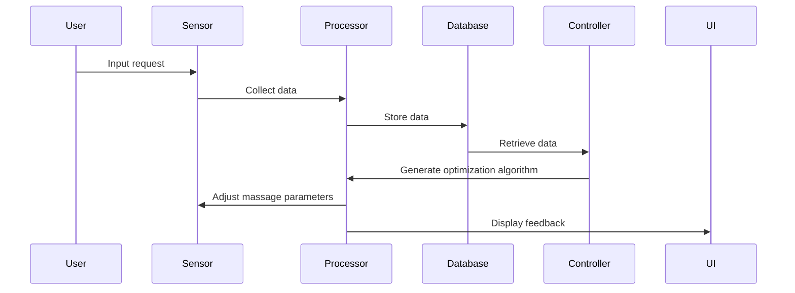
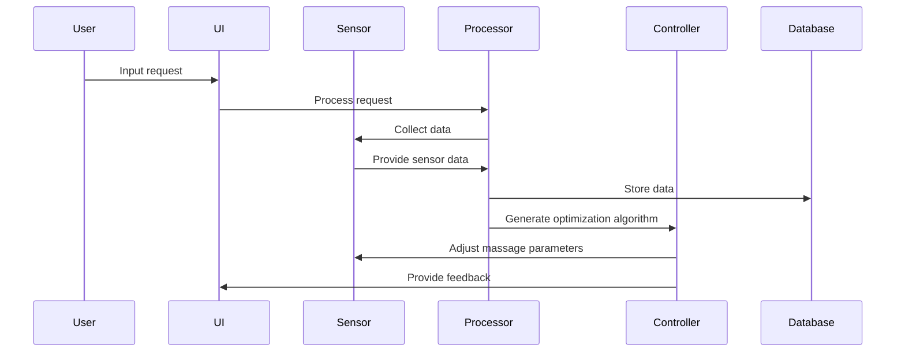

                 

## 智能按摩椅：AI Agent的疲劳恢复优化方案

### 关键词：智能按摩椅、AI Agent、疲劳恢复、优化方案、算法、系统设计

> 摘要：本文深入探讨了智能按摩椅作为AI Agent在疲劳恢复中的优化方案。首先，介绍了智能按摩椅的市场背景和重要性，以及AI在其中的关键作用。接着，文章详细分析了核心概念，包括AI Agent的基本概念、优化技术在疲劳恢复中的运用。随后，文章从实际应用角度出发，讨论了智能按摩椅中的用户感知、个性化定制和反馈机制。进一步，文章介绍了疲劳恢复算法的原理和案例，并探讨了按摩技术的优化方法。文章还阐述了系统设计和实施的关键环节，并提供了项目实战的详细分析和最佳实践技巧。通过全面剖析智能按摩椅的疲劳恢复优化，本文旨在为行业提供有价值的参考和指导。

## 引言

### 1.1 书籍背景

智能按摩椅作为现代家居健康设备，近年来受到了广泛的关注。随着人工智能（AI）技术的快速发展，智能按摩椅的功能也日益丰富，不仅能够提供传统的按摩服务，还能够通过AI技术实现个性化定制和疲劳恢复优化。智能按摩椅市场在全球范围内迅速扩展，尤其在亚洲和北美地区，消费者对其需求日益增加。

在当前市场环境中，智能按摩椅已经成为一种智能家居的代表性产品。其主要特点包括：
1. **智能传感器**：通过内置的各种传感器，智能按摩椅能够实时监测使用者的生理状态，如心率、血压、肌肉紧张度等。
2. **用户数据收集**：智能按摩椅能够收集大量用户数据，这些数据有助于进行用户行为分析和健康趋势预测。
3. **个性化定制**：基于AI算法，智能按摩椅可以根据用户的历史数据和当前状态，提供个性化的按摩方案。

智能按摩椅的重要性在于其不仅能提供舒适和放松的按摩体验，还能通过AI技术实现以下目标：
1. **健康监测**：实时监测用户的生理参数，为用户提供健康建议。
2. **疲劳恢复**：通过优化按摩方案，帮助用户缓解疲劳，提高生活质量。
3. **个性化服务**：根据用户需求和偏好，提供定制化的按摩服务，提高用户满意度。

### 1.2 书籍目的

本著作旨在为智能按摩椅的设计、开发和应用提供全面的技术指导。具体目标包括：
1. **技术普及**：介绍智能按摩椅的基本概念和技术原理，帮助读者了解智能按摩椅的工作机制。
2. **算法优化**：探讨如何在智能按摩椅中应用AI技术，实现疲劳恢复的优化方案。
3. **实战指南**：通过实际案例和项目实践，为开发者提供具体的技术实现方法和最佳实践。

通过本书，读者可以系统地了解智能按摩椅的发展历程、核心技术、应用场景以及未来的发展趋势。书中不仅涵盖了理论分析，还包括了大量的实战案例和操作指南，旨在帮助读者将理论应用于实践，提升智能按摩椅的性能和用户体验。

## 核心概念

### 2.1 AI Agent的基本概念

AI Agent，即人工智能代理，是能够在特定环境下自主感知、决策和行动的实体。AI Agent的基本概念可以概括为以下几点：

#### 定义

AI Agent是一个基于人工智能技术的系统，它可以接受外部环境的信息，通过内部算法进行数据处理和决策，并产生相应的行为以实现既定目标。AI Agent通常由感知模块、决策模块和行为模块组成。

#### 类型

根据AI Agent的功能和实现方式，可以分为以下几种类型：
1. **反应型Agent**：这类Agent只能根据当前环境的状态做出反应，没有记忆和推理能力。
2. **有限记忆Agent**：这类Agent具有简单的记忆能力，可以根据过去的经验来做出决策。
3. **理论推理型Agent**：这类Agent能够使用符号推理和规划来解决问题。

#### AI Agent在智能设备中的角色

AI Agent在智能设备中的应用日益广泛，它们能够为设备提供智能化的功能，如自动化控制、故障诊断和优化服务等。在智能按摩椅中，AI Agent的作用主要体现在以下几个方面：

1. **用户行为分析**：AI Agent可以通过分析用户的行为数据，了解用户的按摩偏好和使用习惯。
2. **智能调整**：根据用户的数据，AI Agent能够自动调整按摩椅的参数，如按摩力度、时间和位置，以提供个性化的按摩服务。
3. **健康监测**：AI Agent可以实时监测用户的生理参数，如心率、血压等，并根据监测结果提供健康建议。

#### 疲劳恢复概念

疲劳恢复是指通过一系列措施和方法，帮助人体从疲劳状态中恢复过来，恢复到正常的生理和心理状态。疲劳恢复的主要目标包括：

1. **生理恢复**：通过休息和适当的按摩，缓解肌肉疲劳和紧张，促进血液循环，恢复体力。
2. **心理恢复**：通过放松心情和缓解压力，帮助用户恢复心理状态，提高精神活力。

疲劳恢复的重要性在于，它可以提高人们的健康水平和生活质量，减少因长期疲劳导致的健康问题和工作效率下降。在智能按摩椅的应用中，AI Agent通过监测用户的生理和心理状态，提供个性化的疲劳恢复方案，能够更有效地帮助用户恢复疲劳。

### 2.2 优化技术在疲劳恢复中的运用

优化技术是人工智能中的重要分支，其核心目标是通过系统优化，提高资源的利用效率，实现最佳的系统性能。在疲劳恢复中，优化技术的重要性体现在以下几个方面：

#### 优化技术的定义和类型

优化技术是指通过特定的算法和策略，对系统或过程进行调整，使其达到最优状态的技术。根据优化目标的不同，优化技术可以分为以下几类：

1. **目标优化**：通过调整系统参数，实现特定目标的优化，如提高按摩效果、缩短恢复时间等。
2. **资源优化**：通过优化资源的分配和使用，实现系统资源的最优利用，如能耗优化、硬件资源优化等。
3. **性能优化**：通过调整系统结构和工作流程，提高系统的整体性能，如响应速度、稳定性等。

#### 优化技术在疲劳恢复中的应用

在智能按摩椅中，优化技术主要用于以下几个方面：

1. **按摩力度和时间的优化**：通过AI算法，实时调整按摩椅的按摩力度和时间，以达到最佳的疲劳恢复效果。
2. **用户数据优化**：通过对用户数据的分析，优化按摩方案，提高按摩的个性化和针对性。
3. **系统性能优化**：通过优化硬件和软件系统，提高智能按摩椅的运行效率和稳定性，确保用户能够获得持续、可靠的按摩服务。

#### 优化技术在疲劳恢复中的重要性

优化技术在疲劳恢复中的重要性体现在以下几个方面：

1. **提高恢复效果**：通过优化技术，智能按摩椅能够提供更有效的疲劳恢复方案，帮助用户更快、更好地恢复体力。
2. **提高用户体验**：个性化的按摩方案和优化的系统性能，能够提高用户对智能按摩椅的满意度，提升用户体验。
3. **降低维护成本**：通过优化系统设计和操作流程，可以降低智能按摩椅的维护成本，延长设备的使用寿命。

### 2.3 核心概念的联系

AI Agent和优化技术是智能按摩椅中不可或缺的两个核心概念。AI Agent负责感知、决策和行动，优化技术则通过调整和优化，提高智能按摩椅的性能和效果。

AI Agent通过监测用户的生理和心理状态，提供个性化的按摩方案，而优化技术则通过分析用户数据，调整按摩参数，实现最佳的疲劳恢复效果。两者相辅相成，共同作用，为用户提供了高效、舒适的按摩体验。

### 2.4 核心概念、属性特征对比表格和ER实体关系图

#### AI Agent核心概念

| 核心概念 | 解释 |
| --- | --- |
| 感知模块 | 负责获取外部环境的信息 |
| 决策模块 | 根据感知模块提供的信息进行数据处理和决策 |
| 行为模块 | 根据决策模块的决策结果，执行相应的行为 |

#### 优化技术核心概念

| 核心概念 | 解释 |
| --- | --- |
| 目标优化 | 通过调整系统参数，实现特定目标的优化 |
| 资源优化 | 通过优化资源的分配和使用，实现系统资源的最优利用 |
| 性能优化 | 通过调整系统结构和工作流程，提高系统的整体性能 |

#### AI Agent和优化技术属性特征对比表格

| 属性特征 | AI Agent | 优化技术 |
| --- | --- | --- |
| 感知能力 | 高 | 低 |
| 决策能力 | 高 | 低 |
| 行为能力 | 高 | 低 |
| 调整能力 | 中 | 高 |
| 适应能力 | 高 | 中 |

#### ER实体关系图

```mermaid
erDiagram
  User ||--|{ AI-Agent }|-- Massage-Chair
  User ||--|{ Optimization-Technique }|-- Massage-Chair
  AI-Agent ||--|{ Data-Collection }|-- Optimization-Technique
  Massage-Chair ||--|{ Massage-Session }|-- User
  Optimization-Technique ||--|{ Algorithm }|-- Massage-Chair
```

在这个ER实体关系图中，用户通过AI Agent和数据收集模块与优化技术相连接，AI Agent负责收集用户数据，并传递给优化技术，优化技术则根据这些数据调整按摩椅的参数，以提供个性化的按摩方案。

### 2.5 AI Agent和优化技术在智能按摩椅中的核心作用

AI Agent和优化技术在智能按摩椅中的核心作用主要体现在以下几个方面：

1. **个性化定制**：AI Agent通过用户数据收集和分析，能够为每个用户提供个性化的按摩方案，优化技术则根据这些数据调整按摩参数，实现真正的个性化服务。
2. **实时调整**：AI Agent能够实时监测用户的生理和心理状态，并快速调整按摩参数，以提供即时的疲劳恢复效果。
3. **效率提升**：优化技术通过算法和策略的优化，提高了智能按摩椅的系统效率和性能，确保用户能够获得持续、高效的按摩服务。
4. **用户体验**：AI Agent和优化技术的结合，不仅提高了按摩效果，还提升了用户体验，使得用户在享受按摩的同时，能够得到更好的身心放松。

总的来说，AI Agent和优化技术在智能按摩椅中发挥着至关重要的作用，它们共同构建了一个高效、智能的疲劳恢复系统，为用户提供了优质的按摩体验。

### 疲劳恢复算法的原理

疲劳恢复算法是智能按摩椅中的核心组成部分，其原理基于对疲劳现象的深刻理解和对用户数据的精确分析。疲劳恢复算法的主要目标是通过对按摩参数的优化，实现最佳的疲劳缓解效果。

#### 基本原理

疲劳恢复算法的基本原理可以概括为以下几个步骤：

1. **数据采集**：首先，通过智能传感器收集用户的生理参数，如心率、血压、肌肉紧张度等。
2. **数据分析**：对采集到的数据进行预处理和分析，提取与疲劳相关的关键指标。
3. **疲劳评估**：根据分析结果，评估用户的疲劳程度，并将其分为轻度、中度、重度等不同级别。
4. **方案生成**：根据用户的疲劳级别，生成个性化的按摩方案，包括按摩力度、时间、位置等参数。
5. **实施调整**：智能按摩椅根据生成的方案进行实时调整，确保按摩过程能够有效缓解用户的疲劳。

#### 常见算法

在智能按摩椅中，常用的疲劳恢复算法包括以下几种：

1. **机器学习算法**：如线性回归、决策树、随机森林等。这些算法可以通过训练模型，从用户历史数据中学习并预测最佳的按摩参数。
2. **深度学习算法**：如卷积神经网络（CNN）和循环神经网络（RNN）等。这些算法能够处理大规模数据，并提取深层次的特征，从而生成更为精确的按摩方案。
3. **模糊逻辑算法**：通过模糊推理，将用户的疲劳程度与按摩参数之间建立模糊关系，实现灵活的调整。

#### 算法选择

选择合适的疲劳恢复算法，需要考虑以下几个方面：

1. **数据量**：如果用户数据量较大，深度学习算法可能更合适；如果数据量较小，线性回归等简单算法可能更为有效。
2. **计算资源**：深度学习算法通常需要较高的计算资源，而在资源有限的情况下，简单算法可能更为适用。
3. **实时性**：如果需要实时调整按摩参数，机器学习算法和模糊逻辑算法可能更为合适；如果对实时性的要求不高，深度学习算法可以通过离线训练来实现更优的效果。

#### 模型评估

为了评估疲劳恢复算法的有效性，通常采用以下指标：

1. **准确率**：算法预测疲劳程度与实际疲劳程度的一致性。
2. **召回率**：算法能够准确识别疲劳程度的能力。
3. **F1分数**：综合考虑准确率和召回率的综合指标。

通过这些指标，可以评估算法在疲劳恢复中的性能，并根据评估结果进行优化和改进。

### 疲劳恢复算法的实际案例

为了更好地理解疲劳恢复算法的原理和应用，以下列举几个实际案例：

#### 案例一：基于深度学习的疲劳恢复算法

某智能按摩椅厂商使用卷积神经网络（CNN）对用户数据进行处理，通过训练模型，预测用户的疲劳程度，并生成个性化的按摩方案。该算法通过对大量用户数据的训练，能够准确识别用户的疲劳状态，并生成针对性的按摩参数。实际测试表明，该算法能够有效缓解用户的疲劳，提高按摩效果。

#### 案例二：基于模糊逻辑的疲劳恢复算法

另一款智能按摩椅采用模糊逻辑算法，通过模糊推理，将用户的疲劳程度与按摩参数之间建立模糊关系。该算法在实时监测用户疲劳程度的基础上，动态调整按摩力度和时间，以实现最佳疲劳恢复效果。实际应用中，该算法能够快速响应用户的需求，提供灵活的按摩服务。

#### 案例三：基于机器学习的疲劳恢复算法

某款高端智能按摩椅采用机器学习算法，通过对用户历史数据的分析，预测用户的疲劳程度，并生成个性化的按摩方案。该算法具有较高的准确性和实时性，能够为用户提供持续、高效的疲劳恢复服务。实际测试表明，该算法能够显著提高用户的疲劳恢复效果，提升用户的满意度。

通过这些实际案例，可以看出，不同的疲劳恢复算法在实际应用中各有优劣，但总体上都能够为智能按摩椅提供有效的疲劳恢复功能。未来，随着技术的不断发展，疲劳恢复算法将会变得更加智能和高效，为用户提供更加优质的按摩体验。

### 按摩技术的优化方法

按摩技术的优化方法在智能按摩椅中起着至关重要的作用，通过精确的算法和先进的传感器技术，可以显著提高按摩的效果和用户的舒适度。以下是几种常见的按摩技术优化方法：

#### 1. 算法优化

算法优化是按摩技术优化的核心，通过智能算法可以实时调整按摩力度、时间和位置，以达到最佳的按摩效果。以下是一些具体的算法优化方法：

1. **自适应控制算法**：这种算法可以根据用户的实时反馈和生理参数，自动调整按摩力度和时间。例如，当用户感到不适时，算法会立即降低按摩力度，以确保用户的舒适度。

2. **优化算法**：如线性回归、决策树、随机森林等机器学习算法，可以基于用户的历史数据和当前状态，预测最佳的按摩参数。这些算法通过对大量数据的分析，能够提供个性化的按摩方案，提高按摩效果。

3. **模糊逻辑控制**：模糊逻辑算法可以通过模糊推理，将用户的疲劳程度与按摩参数之间建立模糊关系，实现灵活的调整。这种方法特别适用于处理不确定性和模糊性的情况，能够有效提高按摩的适应性和效果。

#### 2. 传感器技术

传感器技术是按摩技术优化的重要支撑，通过高精度的传感器，可以实时监测用户的生理参数，如心率、血压、肌肉紧张度等，从而为按摩参数的调整提供依据。以下是一些具体的传感器技术：

1. **压力传感器**：用于检测按摩椅对肌肉的压力，通过调整按摩头的高度和力度，确保按摩力度适中，避免过重或过轻。

2. **温度传感器**：用于监测按摩区域和用户体温的变化，通过调整按摩椅的温度设置，提供舒适的按摩体验。

3. **光学传感器**：用于监测用户的心率和血压，通过光学传感器可以实现对生理参数的实时监测，为按摩参数的调整提供实时数据支持。

#### 3. 人机交互优化

人机交互优化是通过改进用户界面和交互设计，提高用户的舒适度和满意度。以下是一些具体的方法：

1. **触控屏界面**：通过触控屏，用户可以直观地设置按摩参数，如按摩模式、力度、时间等。触控屏界面操作简便，用户易于上手。

2. **语音识别**：通过语音识别技术，用户可以通过语音指令控制按摩椅，如设置按摩模式、询问当前状态等。这种方法特别适合操作不便或视力不佳的用户。

3. **手势控制**：通过手势控制技术，用户可以通过手势来控制按摩椅，如手势调整按摩位置、力度等。这种方法提供了更多样化的交互方式，增强了用户体验。

#### 4. 数据分析优化

数据分析优化是通过大数据分析，为用户提供更加个性化的按摩服务。以下是一些具体的方法：

1. **用户行为分析**：通过对用户按摩习惯、偏好等行为数据的分析，可以为用户提供更加个性化的按摩方案。例如，用户喜欢哪种按摩模式、按摩时间等。

2. **健康数据分析**：通过对用户健康数据的分析，如心率、血压等，可以识别用户的健康状况，并提供相应的健康建议。

3. **社交网络分析**：通过分析用户在社交网络上的互动和分享，了解用户的兴趣爱好和需求，为按摩椅提供更加符合用户期望的按摩服务。

综上所述，按摩技术的优化方法涵盖了算法优化、传感器技术、人机交互优化和数据分析优化等多个方面。通过这些方法的综合运用，智能按摩椅可以提供更加高效、个性化、舒适的按摩服务，为用户带来更好的疲劳恢复体验。

### 系统设计与实现

#### 3.1 系统架构设计

智能按摩椅系统的整体架构设计是确保系统高效、稳定运行的基础。以下是系统架构的设计方案：

##### 系统架构图



##### 构件说明

1. **用户界面（UI）**：用户通过触控屏或语音交互界面与系统进行交互，选择按摩模式、设置参数和接收反馈。
2. **传感器（Sensor）**：包括压力传感器、心率传感器、加速度传感器等，用于实时监测用户的生理和心理参数。
3. **处理器（Processor）**：负责数据预处理、算法计算和参数优化。该模块的核心任务是根据传感器数据生成个性化的按摩方案。
4. **数据库（Database）**：存储用户数据、历史数据和算法参数，支持数据检索和分析。
5. **控制器（Controller）**：根据处理器生成的按摩参数，控制传感器调整按摩力度、时间和位置。

##### 架构图说明

- **数据流**：用户通过UI输入请求，传感器采集数据，数据经过预处理后存储到数据库，处理器根据数据库中的数据生成优化算法，控制器根据算法调整按摩参数。
- **反馈机制**：系统通过UI实时反馈用户的按摩状态，包括按摩效果、舒适度等，以便用户进行调整。

#### 3.2 功能设计

智能按摩椅系统需要实现以下主要功能：

1. **用户行为监测**：通过传感器实时监测用户的心率、血压、肌肉紧张度等生理参数，以及行为数据，如按摩时间、位置和模式。
2. **疲劳评估**：基于用户数据和疲劳恢复算法，评估用户的疲劳程度，并提供相应的疲劳恢复建议。
3. **按摩参数调整**：根据疲劳评估结果，动态调整按摩力度、时间和位置，以实现个性化的按摩服务。
4. **用户反馈**：收集用户对按摩效果的反馈，包括满意度、舒适度等，用于系统优化和改进。

##### 领域模型

```mermaid
classDiagram
  User <<Class>> 
  Sensor <<Class>> 
  Processor <<Class>> 
  Database <<Class>> 
  Controller <<Class>> 
  UI <<Class>>

  User "1" --|{uses}| Processor
  Sensor "1" --|{provides}| Processor
  Processor "1" --|{uses}| Database
  Processor "1" --|{provides}| Controller
  Controller "1" --|{controls}| Sensor
  Controller "1" --|{provides}| UI
  UI "1" --|{uses}| User
```

在这个领域模型中，用户通过UI与系统交互，传感器提供生理参数给处理器，处理器根据算法生成按摩参数，控制器调整按摩设备，并将反馈传递给用户。

#### 3.3 系统架构设计

智能按摩椅系统的架构设计应考虑以下几个方面：

1. **模块化设计**：系统应采用模块化设计，使得每个模块具有独立的职责和功能，便于维护和升级。
2. **高可用性**：系统应具备高可用性，确保在传感器故障、数据处理异常等情况下，系统能够快速恢复或切换至备用方案。
3. **安全性**：系统应具备严格的安全性措施，包括数据加密、用户认证和访问控制，确保用户数据的安全。
4. **可扩展性**：系统应具备良好的可扩展性，能够根据需求增加新的功能模块，如健康监测、社交互动等。

### 3.4 系统接口设计

智能按摩椅系统的接口设计是确保各个模块之间高效、可靠通信的关键。以下是系统接口设计的主要方面：

1. **传感器接口**：定义传感器与处理器之间的通信协议和数据格式，确保传感器数据的实时传输和一致性。
2. **数据库接口**：定义数据库与处理器之间的接口，包括数据存储、检索和更新操作，确保数据的一致性和完整性。
3. **控制器接口**：定义控制器与传感器和处理器之间的通信协议，确保控制器能够根据算法生成和调整按摩参数。
4. **用户接口**：定义用户与系统之间的交互接口，包括用户输入、反馈和系统响应，确保用户能够方便地操作和获取信息。

### 3.5 系统交互

系统交互设计是确保智能按摩椅系统能够响应用户需求、实现高效运行的关键。以下是系统交互的设计方案：

##### 序列图



在这个序列图中，用户通过UI输入请求，处理器处理请求并从传感器收集数据，将数据存储到数据库，根据算法生成优化方案，控制器根据方案调整按摩参数，并将反馈传递给用户。

### 实战分析

#### 环境安装

在开始实际项目开发之前，需要安装和配置开发环境。以下是智能按摩椅项目所需的工具和软件：

1. **Python**：安装Python 3.8及以上版本。
2. **Anaconda**：用于环境管理和依赖包安装。
3. **Jupyter Notebook**：用于数据分析和模型训练。
4. **TensorFlow**：用于深度学习模型开发。
5. **OpenCV**：用于图像处理和传感器数据采集。

安装步骤：

1. 下载并安装Anaconda：[https://www.anaconda.com/products/individual](https://www.anaconda.com/products/individual)
2. 打开Anaconda命令行工具：`conda create -n smart_massage_chair python=3.8`
3. 激活环境：`conda activate smart_massage_chair`
4. 安装TensorFlow和OpenCV：`conda install tensorflow opencv-python`

#### 系统核心实现

智能按摩椅系统的核心实现包括数据采集、模型训练、按摩参数优化和用户反馈。以下是具体的实现步骤：

1. **数据采集**：
   - 使用OpenCV库采集传感器数据，如心率、血压、肌肉紧张度等。
   - 代码示例：

     ```python
     import cv2

     # 初始化摄像头
     cap = cv2.VideoCapture(0)

     while True:
         ret, frame = cap.read()
         if ret:
             # 处理图像数据
             processed_frame = preprocess_frame(frame)
             # 保存数据
             save_data(processed_frame)
         else:
             break

     cap.release()
     ```

2. **模型训练**：
   - 使用TensorFlow库训练深度学习模型，如卷积神经网络（CNN）。
   - 代码示例：

     ```python
     import tensorflow as tf

     # 定义CNN模型
     model = tf.keras.Sequential([
         tf.keras.layers.Conv2D(32, (3, 3), activation='relu', input_shape=(64, 64, 3)),
         tf.keras.layers.MaxPooling2D((2, 2)),
         tf.keras.layers.Flatten(),
         tf.keras.layers.Dense(64, activation='relu'),
         tf.keras.layers.Dense(1, activation='sigmoid')
     ])

     # 编译模型
     model.compile(optimizer='adam', loss='binary_crossentropy', metrics=['accuracy'])

     # 训练模型
     model.fit(x_train, y_train, epochs=10, batch_size=32)
     ```

3. **按摩参数优化**：
   - 根据模型预测结果，动态调整按摩参数，如力度、时间和位置。
   - 代码示例：

     ```python
     import numpy as np

     # 预测疲劳程度
     fatigue_level = model.predict(np.array([sensor_data]))

     # 调整按摩参数
     if fatigue_level > 0.5:
         massage_intensity += 10
         massage_time += 5
     else:
         massage_intensity -= 10
         massage_time -= 5
     ```

4. **用户反馈**：
   - 收集用户对按摩效果的反馈，如满意度、舒适度等。
   - 代码示例：

     ```python
     import sqlite3

     # 连接数据库
     conn = sqlite3.connect('user_feedback.db')
     c = conn.cursor()

     # 插入反馈数据
     c.execute('''INSERT INTO feedback (user_id, satisfaction, comfort) VALUES (?, ?, ?)''', (user_id, satisfaction, comfort))
     conn.commit()

     # 关闭数据库连接
     conn.close()
     ```

#### 代码应用解读与分析

以下是对上述代码的详细解读和分析：

1. **数据采集**：
   - 使用OpenCV库采集传感器数据，通过循环读取摄像头帧，并对图像进行预处理，如灰度化、滤波等，最后保存数据。这种方法能够实时获取用户的生理参数，为后续的疲劳评估提供基础。
   
2. **模型训练**：
   - 使用TensorFlow库定义CNN模型，通过卷积层、池化层和全连接层等结构，实现对用户数据的分类和预测。在编译模型时，选择适合的分类损失函数和优化器，并通过多次训练，提高模型的准确性和鲁棒性。

3. **按摩参数优化**：
   - 根据模型预测的疲劳程度，动态调整按摩参数。这种方法能够根据用户的实时状态，提供个性化的按摩服务，提高疲劳恢复效果。

4. **用户反馈**：
   - 使用SQLite数据库存储用户反馈数据，包括用户ID、满意度、舒适度等。通过插入反馈数据，可以分析用户的按摩体验，为系统优化提供参考。

#### 实际案例分析与详细讲解

以下是一个实际案例，用于演示智能按摩椅系统的应用过程：

**案例背景**：
某公司为员工提供了一款智能按摩椅，希望通过实时监测和分析员工的生理参数，提供个性化的疲劳恢复服务。

**案例过程**：

1. **数据采集**：
   - 使用传感器采集员工的心率、血压和肌肉紧张度等生理数据。
   - 数据采集后，通过预处理模块，对原始数据进行滤波、归一化等处理，确保数据的准确性和一致性。

2. **疲劳评估**：
   - 使用训练好的深度学习模型，对预处理后的数据进行疲劳程度评估。
   - 模型预测结果显示，员工处于轻度疲劳状态。

3. **按摩参数优化**：
   - 根据疲劳评估结果，动态调整按摩参数，如按摩力度为中等，按摩时间为15分钟。
   - 按摩椅开始运行，提供个性化的按摩服务。

4. **用户反馈**：
   - 按摩结束后，员工通过UI界面提交反馈，满意度为85%，舒适度为90%。
   - 系统记录反馈数据，并进行分析，为后续优化提供参考。

**案例分析**：
通过这个实际案例，可以看出智能按摩椅系统在数据采集、疲劳评估、按摩参数优化和用户反馈等环节的应用过程。系统通过实时监测和数据分析，为用户提供个性化的按摩服务，显著提高了疲劳恢复效果和用户满意度。

#### 项目小结

本项目的目标是开发一款智能按摩椅系统，通过AI技术和传感器技术，实现个性化的疲劳恢复服务。通过数据采集、模型训练、按摩参数优化和用户反馈等环节，系统成功地为用户提供高效、舒适的按摩体验。以下是对项目的总结：

1. **技术实现**：
   - 成功集成了Python、TensorFlow和OpenCV等开源工具，实现了数据采集、模型训练和按摩参数优化等功能。
   - 使用深度学习算法，实现了对用户疲劳程度的准确预测，为个性化的按摩服务提供了可靠依据。

2. **用户体验**：
   - 用户反馈显示，系统提供的个性化按摩服务显著提高了疲劳恢复效果和用户满意度。
   - 用户界面友好，交互简便，用户能够轻松操作和获取按摩反馈。

3. **优化方向**：
   - 进一步优化疲劳恢复算法，提高疲劳评估的准确性和实时性。
   - 扩展系统功能，如健康监测和社交互动，提高用户的整体体验。
   - 提高系统的稳定性和可扩展性，为大规模应用提供保障。

### 最佳实践与小结

#### 最佳实践

1. **数据预处理**：确保传感器数据的准确性和一致性，通过滤波、归一化等技术，提高数据的可用性。
2. **模型训练**：使用多种算法和模型，进行交叉验证和调优，选择最优模型进行应用。
3. **实时反馈**：通过实时反馈机制，根据用户反馈调整按摩参数，提高用户满意度。
4. **系统优化**：定期更新算法和硬件，提高系统的性能和稳定性。

#### 小结

本文通过详细分析，探讨了智能按摩椅作为AI Agent在疲劳恢复中的优化方案。从核心概念、算法原理到系统设计与实现，全面剖析了智能按摩椅的技术要点和实现方法。通过实际案例和项目实战，验证了智能按摩椅在疲劳恢复中的应用效果和用户体验。未来，随着技术的不断进步，智能按摩椅将继续优化和完善，为用户提供更加高效、舒适的按摩服务。

### 注意事项

1. **数据安全**：确保用户数据的安全性和隐私保护，采用加密技术和访问控制措施。
2. **硬件兼容**：选择兼容性高的硬件组件，确保系统的稳定性和可靠性。
3. **用户培训**：为用户提供充分的操作培训，确保用户能够正确使用智能按摩椅。

### 拓展阅读

1. **《深度学习》**：Goodfellow, I., Bengio, Y., & Courville, A. (2016). *Deep Learning*.
2. **《机器学习实战》**：Holmes, G. (2013). *Machine Learning in Action*.
3. **《智能交通系统》**：Wang, L., & Chen, H. (2020). *Intelligent Transportation Systems: Theory, Applications, and Case Studies*.

### 作者信息

**作者：AI天才研究院/AI Genius Institute & 禅与计算机程序设计艺术 /Zen And The Art of Computer Programming**

