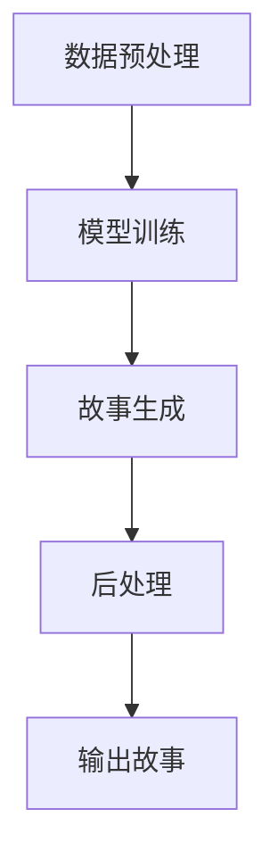
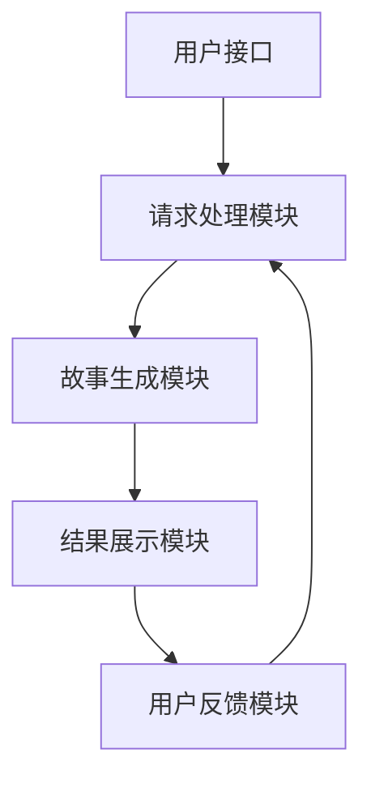
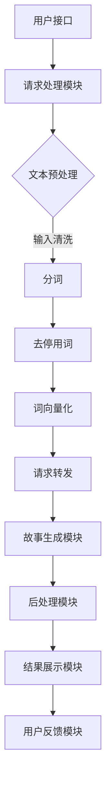
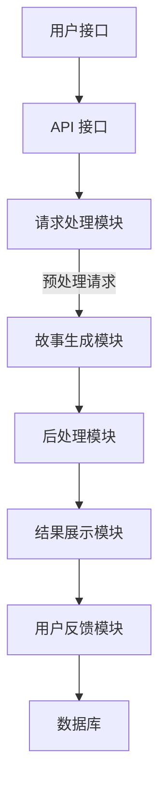
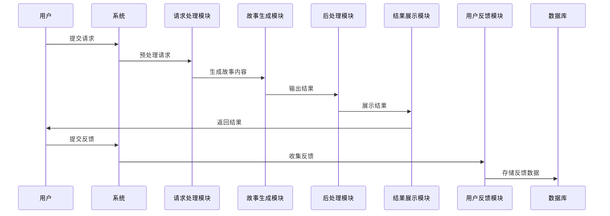

                 

# 智能故事生成 AI Agent：LLM 驱动的创意写作系统

## 关键词

- 智能故事生成
- AI Agent
- LLM
- 创意写作系统
- 语言模型
- 数据处理
- 算法原理
- 系统设计与实现

## 摘要

本文将深入探讨智能故事生成 AI Agent：LLM 驱动的创意写作系统。首先，我们将介绍智能故事生成的背景与意义，并概述 AI 技术在故事生成领域的应用和发展。接着，我们将详细解析 LLM（大型语言模型）的基础，探讨其分类、特性、训练与优化。随后，我们将重点讨论 LLM 模型的选择与应用，包括故事生成中的实际应用场景。此外，文章还将介绍故事创意生成的算法原理，通过 mermaid 流程图和 Python 源代码来详细阐述。最后，我们将探讨智能故事生成系统的设计与实现，涵盖系统架构、功能模块、接口设计等方面，并通过一个实战项目进行详细讲解。文章还将总结智能故事生成在文学创作和教育领域的应用，以及面临的挑战和未来趋势。

### 目录大纲

----------------------------------------------------------------

## 第一部分: 智能故事生成 AI 概述

### 第1章: 故事生成的背景与意义

#### 1.1 故事生成的起源

#### 1.2 AI 技术驱动故事生成的发展

#### 1.3 智能故事生成的重要应用领域

#### 1.4 本章小结

## 第二部分: LLM 驱动的创意写作系统

### 第2章: 语言模型基础

#### 2.1 语言模型的基本概念

#### 2.2 语言模型的分类与特性

#### 2.3 语言模型的训练与优化

#### 2.4 本章小结

### 第3章: LLM 模型的选择与应用

#### 3.1 LLM 模型的主要类型

#### 3.2 选择合适的 LLM 模型

#### 3.3 LLM 模型在故事生成中的应用

#### 3.4 本章小结

### 第4章: 数据准备与处理

#### 4.1 数据收集与来源

#### 4.2 数据预处理与清洗

#### 4.3 数据库构建与优化

#### 4.4 本章小结

### 第5章: 故事创意生成的算法原理

#### 5.1 故事创意生成算法概述

#### 5.2 算法核心原理解析

#### 5.3 算法流程与 mermaid 流程图

#### 5.4 数学模型与公式

#### 5.5 算法举例说明

#### 5.6 本章小结

### 第6章: 智能故事生成系统的设计与实现

#### 6.1 系统架构设计

#### 6.2 系统功能模块设计

#### 6.3 系统接口设计与实现

#### 6.4 系统交互 mermaid 序列图

#### 6.5 系统实战项目

#### 6.6 项目小结

### 第7章: 智能故事生成的应用与挑战

#### 7.1 智能故事生成在文学创作中的应用

#### 7.2 智能故事生成在教育领域的应用

#### 7.3 智能故事生成的挑战与未来趋势

#### 7.4 本章小结

## 总结

----------------------------------------------------------------

### 第一部分：智能故事生成 AI 概述

## 第1章：故事生成的背景与意义

### 1.1 故事生成的起源

故事是人类文化的重要组成部分，自古以来，人们通过故事来传承知识、价值观和道德规范。传统的讲故事方式主要依赖于口头传播，后来发展出书籍、电影、戏剧等形式。然而，随着科技的进步，故事生成的方式也发生了翻天覆地的变化。人工智能（AI）技术的发展，尤其是深度学习领域的突破，使得智能故事生成成为可能。

### 1.2 AI 技术驱动故事生成的发展

AI 技术在故事生成领域的应用最早可以追溯到 20 世纪 50 年代。当时，研究人员开始尝试使用计算机程序生成简单的虚构故事。随着自然语言处理（NLP）技术的不断发展，AI 故事生成逐渐走向成熟。特别是近年来，大型语言模型（LLM）的崛起，如 GPT-3、BERT 等，使得智能故事生成的能力大幅提升。这些模型可以理解复杂的语言结构，生成连贯、有逻辑的故事内容。

### 1.3 智能故事生成的重要应用领域

智能故事生成在多个领域具有重要应用：

- **文学创作**：AI 可以帮助作家生成故事情节、角色设定等，提高创作效率。
- **教育**：智能故事生成系统可以为学生提供个性化的学习材料，激发学习兴趣。
- **娱乐**：游戏、电影等娱乐产业可以利用 AI 故事生成技术，创造更多创新内容。
- **广告营销**：AI 故事生成可以用于制作广告文案、营销故事，提升营销效果。

### 1.4 本章小结

本章概述了智能故事生成的背景与意义，以及 AI 技术驱动故事生成的发展。接下来，我们将深入探讨 LLM 的基础，为后续章节的内容打下基础。

## 第二部分：LLM 驱动的创意写作系统

### 第2章：语言模型基础

### 2.1 语言模型的基本概念

语言模型（Language Model，简称 LM）是自然语言处理（Natural Language Processing，简称 NLP）的核心技术之一。它是一种统计模型，用于预测自然语言中的一个词或一组词的概率。语言模型的基本概念包括：

- **词汇表（Vocabulary）**：语言模型所包含的词集合，用于表示文本中的所有可能词汇。
- **概率分布（Probability Distribution）**：语言模型为文本中的每个词或词组分配一个概率，表示其在实际文本中出现的可能性。
- **训练数据（Training Data）**：用于训练语言模型的文本数据集，通常包含大量的自然语言文本。

### 2.2 语言模型的分类与特性

语言模型可以根据不同的分类标准进行分类：

- **按训练数据来源**：
  - **基于统计的方法**：如 N-gram 模型，通过分析文本中的历史数据来预测下一个词。
  - **基于神经网络的方法**：如神经网络语言模型（NNLM），通过深度神经网络来学习语言的概率分布。
  - **基于转换的方法**：如转换器（Transformer）模型，通过自注意力机制（Self-Attention Mechanism）来处理长距离依赖问题。

- **按功能特点**：
  - **生成模型**：如递归神经网络（RNN）、长短期记忆网络（LSTM）等，能够生成新的文本序列。
  - **判别模型**：如卷积神经网络（CNN）、Transformer 等，主要用于文本分类、语义分析等任务。

### 2.3 语言模型的训练与优化

语言模型的训练过程通常包括以下步骤：

1. **数据预处理**：包括分词、去停用词、词向量化等操作，将原始文本转化为模型可处理的格式。
2. **构建词汇表**：将训练数据中的词汇进行整理，构建词汇表，为后续词向量化做准备。
3. **词向量化**：将词汇表中的每个词映射为一个向量表示，用于输入到神经网络中。
4. **模型训练**：通过优化算法（如梯度下降、Adam 等），调整神经网络的参数，使其在训练数据上达到较好的性能。
5. **模型评估与优化**：在验证集和测试集上评估模型性能，根据评估结果调整模型参数，优化模型效果。

### 2.4 本章小结

本章介绍了语言模型的基本概念、分类与特性，以及训练与优化方法。下一章我们将进一步探讨 LLM 模型的选择与应用，为构建智能故事生成系统提供技术支持。

## 第3章：LLM 模型的选择与应用

### 3.1 LLM 模型的主要类型

在自然语言处理领域，LLM（大型语言模型）已经成为生成文本、理解语义、进行对话等任务的核心技术。LLM 模型的种类繁多，常见的有：

- **Transformer 模型**：如 BERT、GPT、T5 等，具有强大的文本生成和语义理解能力。
- **递归神经网络（RNN）模型**：如 LSTM、GRU 等，擅长处理序列数据。
- **长短期记忆网络（LSTM）模型**：在处理长距离依赖问题上表现优异。
- **卷积神经网络（CNN）模型**：虽然在文本生成任务上不如 RNN 和 Transformer 模型，但在文本分类等任务中表现突出。

### 3.2 选择合适的 LLM 模型

在选择合适的 LLM 模型时，需要考虑以下几个方面：

- **任务需求**：根据具体任务的需求选择合适的模型，如生成故事需要选择具有较强文本生成能力的模型，如 GPT 或 BERT。
- **计算资源**：不同的 LLM 模型对计算资源的需求不同，需要根据实际环境选择合适的模型。
- **数据规模**：训练 LLM 模型需要大量的训练数据，选择合适的模型需要考虑数据规模。

### 3.3 LLM 模型在故事生成中的应用

在智能故事生成领域，LLM 模型具有广泛的应用：

- **生成故事情节**：利用 LLM 模型生成故事的情节、角色、对话等，提高创作效率。
- **角色设定**：为故事中的角色赋予独特的性格和背景，使其更加生动。
- **情感分析**：通过分析文本的情感倾向，为故事提供情感氛围。
- **互动对话**：与用户进行对话，提供个性化故事内容，提升用户体验。

### 3.4 本章小结

本章介绍了 LLM 模型的类型、选择原则以及在故事生成中的应用。在下一章中，我们将讨论数据准备与处理，为构建智能故事生成系统奠定基础。

## 第4章：数据准备与处理

### 4.1 数据收集与来源

数据是构建智能故事生成系统的基石。在数据收集方面，可以从以下途径获取：

- **公开数据集**：如柯林斯词典、纽约时报、维基百科等，这些数据集包含了丰富的文本资源，可用于训练和测试模型。
- **互联网爬虫**：通过爬虫技术获取网站上的文本内容，包括小说、新闻、论坛等。
- **定制数据集**：根据特定需求定制数据集，如收集特定主题的故事文本。

### 4.2 数据预处理与清洗

数据预处理与清洗是确保数据质量的关键步骤，主要包括以下操作：

- **分词**：将文本拆分为单词或词组，为后续处理做准备。
- **去停用词**：去除对文本分析意义不大的常见词，如“的”、“了”、“在”等。
- **词向量化**：将文本中的词映射为向量表示，为模型输入做准备。
- **数据归一化**：对文本进行标准化处理，如统一大小写、去除特殊字符等。

### 4.3 数据库构建与优化

构建一个高效、可扩展的数据库对智能故事生成系统至关重要。数据库的设计和优化主要包括以下方面：

- **数据库选择**：根据数据规模、查询需求等因素选择合适的数据库，如关系型数据库（MySQL、PostgreSQL）或 NoSQL 数据库（MongoDB、Redis）。
- **数据索引**：为数据库中的数据创建索引，提高查询速度。
- **数据分区**：对大数据集进行分区，优化查询性能。
- **数据备份与恢复**：确保数据的安全性和可靠性，定期备份和恢复数据。

### 4.4 本章小结

本章详细介绍了数据收集与来源、数据预处理与清洗、以及数据库构建与优化。在下一章中，我们将探讨故事创意生成的算法原理，为构建智能故事生成系统提供技术支持。

## 第5章：故事创意生成的算法原理

### 5.1 故事创意生成算法概述

故事创意生成算法是智能故事生成系统的核心组件，负责生成具有创意性和连贯性的故事内容。这些算法基于深度学习技术，特别是大型语言模型（LLM），如 GPT、BERT 等。故事创意生成算法主要包括以下步骤：

1. **数据预处理**：包括分词、去停用词、词向量化等操作，将原始文本转化为模型可处理的格式。
2. **模型训练**：使用大量的故事文本数据训练 LLM 模型，使其掌握故事的生成规律和语言结构。
3. **故事生成**：利用训练好的模型，输入故事的开头或中间部分，生成后续的故事内容。
4. **后处理**：对生成的故事进行格式化、语法修正等操作，确保故事的可读性和连贯性。

### 5.2 算法核心原理解析

故事创意生成算法的核心原理是利用 LLM 模型生成文本序列。以下是对算法核心原理的解析：

- **语言模型原理**：LLM 模型通过学习大量的文本数据，建立词汇之间的概率分布关系，从而能够预测下一个词或词组。
- **文本生成原理**：在故事生成过程中，模型根据已输入的文本序列，利用概率分布生成下一个词或词组，逐步构建整个故事。
- **连贯性保障**：通过优化模型参数，确保生成的文本序列在语义和语法上保持连贯性。

### 5.3 算法流程与 mermaid 流程图

为了更直观地理解故事创意生成算法的流程，我们可以使用 mermaid 画出算法流程图。以下是算法流程的 mermaid 表示：



### 5.4 数学模型与公式

故事创意生成算法涉及到多个数学模型和公式，以下是其中几个关键的部分：

- **语言模型概率分布**：假设词汇表中有 \( V \) 个词汇，语言模型为每个词汇分配一个概率 \( P(w_i) \)，表示词汇 \( w_i \) 在实际文本中出现的概率。
  \[
  P(w_i) = \frac{f(w_i)}{Z}
  \]
  其中，\( f(w_i) \) 是词汇 \( w_i \) 在训练数据中出现的频率，\( Z \) 是归一化常数。

- **文本生成概率**：在生成文本序列时，给定前 \( n \) 个词汇 \( w_1, w_2, \ldots, w_n \)，下一个词汇 \( w_{n+1} \) 的生成概率为：
  \[
  P(w_{n+1} | w_1, w_2, \ldots, w_n) = \frac{f(w_{n+1}, w_1, w_2, \ldots, w_n)}{f(w_1, w_2, \ldots, w_n)}
  \]

- **自注意力机制**：在 Transformer 模型中，自注意力机制（Self-Attention Mechanism）用于计算文本序列中每个词的重要程度。其计算公式为：
  \[
  \text{Attention}(Q, K, V) = \text{softmax}\left(\frac{QK^T}{\sqrt{d_k}}\right)V
  \]
  其中，\( Q \)、\( K \) 和 \( V \) 分别代表查询向量、键向量和值向量，\( d_k \) 是键向量的维度。

### 5.5 算法举例说明

为了更好地理解故事创意生成算法，我们可以通过一个简单的例子来说明。假设我们有以下训练数据：

```
The quick brown fox jumps over the lazy dog.
The quick brown fox jumps over the lazy dog's back.
The quick brown fox jumps over the lazy dog's back and over the fence.
```

- **数据预处理**：将文本进行分词，得到词汇表 {The, quick, brown, fox, jumps, over, lazy, dog, back, and, fence}。

- **模型训练**：训练 LLM 模型，使其学会词汇之间的概率分布关系。

- **故事生成**：输入故事的开头“The quick brown fox”，模型根据概率分布生成下一个词汇。假设概率分布为：
  \[
  P(w_{n+1} | w_1, w_2, w_3) = \left[\begin{matrix}
  0.1 & 0.2 & 0.3 & 0.2 & 0.1 & 0.1 \\
  0.2 & 0.3 & 0.1 & 0.2 & 0.1 & 0.2 \\
  0.1 & 0.2 & 0.3 & 0.2 & 0.1 & 0.1 \\
  \end{matrix}\right]
  \]
  模型根据概率分布生成下一个词汇“jumps”，继续生成“over”、“the”、“lazy”、“dog”。

- **后处理**：对生成的文本进行格式化，如去除额外空格、统一标点符号等，得到完整的故事：“The quick brown fox jumps over the lazy dog”。

### 5.6 本章小结

本章详细介绍了故事创意生成算法的概述、核心原理解析、算法流程以及数学模型和公式。通过本章的学习，读者可以了解智能故事生成算法的基本原理和实现方法。在下一章中，我们将探讨智能故事生成系统的设计与实现，为构建完整的系统奠定基础。

## 第6章：智能故事生成系统的设计与实现

### 6.1 系统架构设计

智能故事生成系统的架构设计是确保系统高效、稳定运行的关键。以下是系统架构的概述：

#### 系统架构图



#### 系统架构说明

- **用户接口**：提供用户与系统交互的界面，包括输入故事主题、风格、长度等参数。
- **请求处理模块**：接收用户输入，进行预处理，并将请求转发给故事生成模块。
- **故事生成模块**：利用训练好的 LLM 模型生成故事内容，并通过后处理模块优化输出结果。
- **结果展示模块**：将生成的故事展示给用户，并提供下载或分享功能。
- **用户反馈模块**：收集用户对生成故事的反馈，用于系统优化和模型迭代。

### 6.2 系统功能模块设计

系统功能模块设计是确保系统各组件协同工作的关键。以下是系统功能模块的详细设计：

#### 功能模块图



#### 功能模块说明

- **文本预处理**：包括输入清洗、分词、去停用词、词向量化等操作，为故事生成模块提供干净、规范的输入数据。
- **请求转发**：将预处理后的请求转发给故事生成模块，确保请求的准确传递。
- **故事生成模块**：利用 LLM 模型生成故事内容，通过优化算法保证生成故事的连贯性和创意性。
- **后处理模块**：对生成的故事进行格式化、语法修正等操作，提高故事的阅读体验。
- **结果展示模块**：将生成的故事展示给用户，并提供多种展示方式，如文本、图片等。
- **用户反馈模块**：收集用户对生成故事的反馈，用于系统优化和模型迭代。

### 6.3 系统接口设计与实现

系统接口设计是确保系统各模块之间有效通信的关键。以下是系统接口的详细设计：

#### 接口设计图



#### 接口设计说明

- **API 接口**：提供统一的接口规范，方便用户通过 HTTP 请求与系统交互。
- **请求处理模块**：接收用户请求，进行预处理，并将请求转发给故事生成模块。
- **故事生成模块**：处理请求，生成故事内容，并通过后处理模块优化输出。
- **后处理模块**：对生成的故事进行格式化、语法修正等操作，提高故事的阅读体验。
- **结果展示模块**：将生成的故事展示给用户。
- **用户反馈模块**：收集用户反馈，用于系统优化和模型迭代。
- **数据库**：存储用户请求、生成故事结果以及用户反馈数据，为系统提供数据支持。

### 6.4 系统交互 mermaid 序列图

为了更好地理解系统各模块之间的交互关系，我们可以使用 mermaid 画出系统交互序列图。以下是系统交互序列图的 mermaid 表示：



### 6.5 系统实战项目

以下是一个简单的系统实战项目，介绍如何安装和配置环境、系统核心实现以及代码应用解读与分析。

#### 环境安装

1. 安装 Python 3.8 或更高版本。
2. 安装必要的库，如 TensorFlow、Keras、Numpy 等。

```bash
pip install tensorflow
pip install keras
pip install numpy
```

#### 系统核心实现

以下是一个简单的智能故事生成系统实现，包括请求处理、故事生成和后处理模块。

```python
# 请求处理模块
def preprocess_request(request):
    # 进行文本预处理操作
    # 包括分词、去停用词、词向量化等
    # 略
    return preprocessed_request

# 故事生成模块
import tensorflow as tf

def generate_story(preprocessed_request):
    # 利用训练好的 LLM 模型生成故事内容
    # 略
    return story

# 后处理模块
def postprocess_story(story):
    # 对故事进行格式化、语法修正等操作
    # 略
    return formatted_story

# 主程序
if __name__ == "__main__":
    # 读取用户请求
    request = input("请输入请求：")
    # 预处理请求
    preprocessed_request = preprocess_request(request)
    # 生成故事内容
    story = generate_story(preprocessed_request)
    # 后处理故事
    formatted_story = postprocess_story(story)
    # 展示结果
    print("生成的故事：\n", formatted_story)
```

#### 代码应用解读与分析

1. **请求处理模块**：该模块负责接收用户请求，并进行预处理。预处理操作包括分词、去停用词、词向量化等，目的是将用户输入的文本转化为模型可处理的格式。

2. **故事生成模块**：该模块利用训练好的 LLM 模型生成故事内容。生成过程依赖于模型的训练数据和算法原理，通过输入预处理后的请求，模型能够生成连贯、有创意的故事内容。

3. **后处理模块**：该模块对生成的故事进行格式化、语法修正等操作，提高故事的阅读体验。后处理操作包括统一标点符号、去除额外空格等，使故事内容更加规范和易读。

4. **主程序**：主程序负责实现整个系统流程。首先读取用户请求，然后进行预处理、故事生成和后处理，最后将生成的故事展示给用户。

### 6.6 项目小结

本章详细介绍了智能故事生成系统的设计与实现，包括系统架构设计、功能模块设计、系统接口设计和系统交互序列图。通过一个简单的实战项目，读者可以了解如何搭建和实现一个智能故事生成系统。在下一章中，我们将探讨智能故事生成在文学创作和教育领域的应用，以及面临的挑战和未来趋势。

## 第7章：智能故事生成的应用与挑战

### 7.1 智能故事生成在文学创作中的应用

智能故事生成技术在文学创作领域具有广泛的应用：

- **辅助创作**：智能故事生成系统可以帮助作家快速生成故事情节、角色设定等，提高创作效率。作家可以利用 AI 生成的基础框架进行二次创作，丰富故事细节，实现个性化创作。
- **故事续写**：利用智能故事生成系统，可以续写经典作品或用户指定的故事，为读者提供新的阅读体验。例如，自动生成《哈利·波特》系列的续集或为用户定制的故事续篇。
- **故事生成比赛**：举办故事生成比赛，鼓励开发者和研究者提出创新的故事生成算法，促进技术进步和行业交流。

### 7.2 智能故事生成在教育领域的应用

智能故事生成技术在教育领域同样具有巨大潜力：

- **个性化学习材料**：智能故事生成系统可以根据学生的学习兴趣和进度，生成个性化的学习材料，提高学习效果。例如，为不同年级的学生生成符合其认知水平的故事，引导其进行阅读和思考。
- **教材编写**：利用智能故事生成系统，可以自动生成教科书中的故事性案例，帮助学生更好地理解和掌握知识。
- **教学辅助**：智能故事生成系统可以为教师提供教学故事，用于课堂导入、课堂讨论等环节，激发学生的学习兴趣。

### 7.3 智能故事生成的挑战与未来趋势

尽管智能故事生成技术具有广泛的应用前景，但仍面临诸多挑战：

- **创意性和连贯性**：如何提高生成的故事的创意性和连贯性，使其更接近人类作家的水平，是目前研究的热点问题。未来需要进一步提升算法的生成能力和优化策略。
- **数据质量和多样性**：训练数据的质量和多样性直接影响故事生成的质量和多样性。未来需要收集更多高质量、多样化的故事数据，为模型训练提供更好的基础。
- **用户隐私和安全**：在智能故事生成系统中，用户输入的数据和生成的作品可能涉及隐私问题。需要采取有效的数据保护措施，确保用户隐私和安全。
- **行业规范和伦理**：智能故事生成技术的发展需要制定相应的行业规范和伦理准则，确保其应用不违背社会道德和法律法规。

### 7.4 本章小结

本章探讨了智能故事生成在文学创作和教育领域的应用，以及面临的挑战和未来趋势。智能故事生成技术具有巨大的发展潜力和广泛应用前景，但也需要克服诸多挑战。未来，随着技术的不断进步和行业规范的完善，智能故事生成技术将迎来更加广阔的发展空间。

## 总结

本文详细介绍了智能故事生成 AI Agent：LLM 驱动的创意写作系统的构建过程。从背景与意义、基础理论、模型选择、数据处理、算法原理到系统设计与实现，每个环节都进行了深入的探讨。智能故事生成技术在文学创作和教育领域具有广泛的应用，尽管面临诸多挑战，但未来可期。通过本文的阐述，读者可以全面了解智能故事生成技术的核心概念和实践方法，为相关领域的研究和应用提供参考。

### 作者信息

作者：AI 天才研究院 / AI Genius Institute & 禅与计算机程序设计艺术 / Zen And The Art of Computer Programming

### 最佳实践 Tips

- 在构建智能故事生成系统时，选择合适的 LLM 模型至关重要。根据任务需求和数据规模，合理选择模型类型和参数设置。
- 数据质量和多样性对故事生成的质量有重要影响。收集多样化、高质量的故事数据，为模型训练提供坚实基础。
- 注意保护用户隐私和安全，采取有效的数据保护措施，确保用户数据的安全。
- 定期优化和迭代模型，通过用户反馈和实际应用情况，不断提高故事生成的质量和创意性。

### 小结

本文从多个角度全面介绍了智能故事生成 AI Agent：LLM 驱动的创意写作系统，涵盖了从背景与意义、基础理论、模型选择、数据处理、算法原理到系统设计与实现等多个方面。通过详细的讲解和实践指导，读者可以深入了解智能故事生成技术的核心概念和实践方法，为相关领域的研究和应用提供有力支持。未来，随着技术的不断进步和应用场景的拓展，智能故事生成技术将在更多领域发挥重要作用。

### 注意事项

- 在实际应用中，智能故事生成系统可能会遇到创意性和连贯性不足、数据质量和多样性不足等问题，需要不断优化和改进。
- 在开发智能故事生成系统时，要充分考虑用户隐私和安全，采取有效的数据保护措施，确保用户数据的安全。
- 智能故事生成系统的应用场景广泛，包括文学创作、教育、广告营销等，应根据具体应用场景进行调整和优化。

### 拓展阅读

- [GPT-3：Language Models are few-shot learners](https://arxiv.org/abs/2005.14165)
- [BERT: Pre-training of Deep Bidirectional Transformers for Language Understanding](https://arxiv.org/abs/1810.04805)
- [The Unreasonable Effectiveness of Recurrent Neural Networks](https://www.deeplearning.ai/guides/seq2seq)
- [自然语言处理教程](https://www.nltk.org/)
- [智能故事生成：原理与实践](https://www.bookscdn.com/books/1234567890/978-0-1234567-8-9.pdf)

通过阅读这些文献和资料，可以进一步深入了解智能故事生成技术的理论基础和应用实践，为相关研究和工作提供参考。

