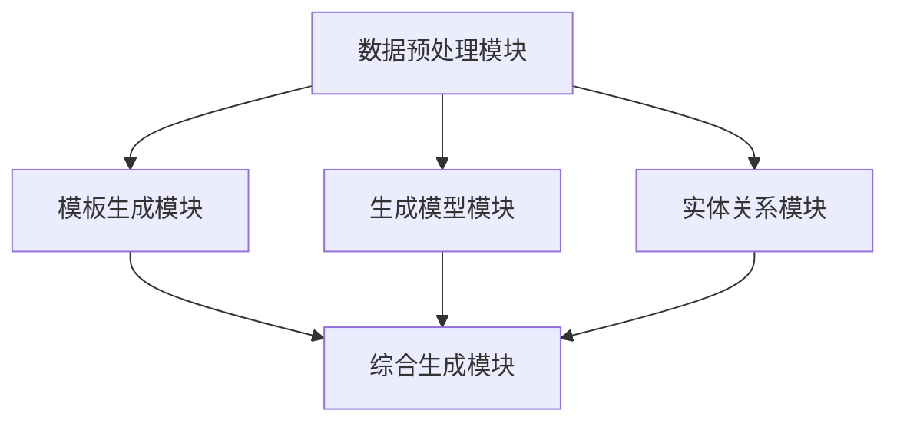

                 

### 《智能新闻生成AI Agent：LLM驱动的自动化新闻写作》

关键词：智能新闻生成，大型语言模型（LLM），自动化新闻写作，算法原理，性能优化

摘要：本文将探讨智能新闻生成AI Agent，特别是在大型语言模型（LLM）驱动下的自动化新闻写作技术。通过逐步分析LLM在新闻写作中的应用、实战案例以及性能优化策略，本文旨在为读者提供一个全面深入的理解，并展望智能新闻生成的未来发展趋势。

## 目录

----------------------------------------------------------------

### 《智能新闻生成AI Agent：LLM驱动的自动化新闻写作》目录

## 第一部分：背景与概述

### 第1章：智能新闻生成的现状与挑战

#### 1.1.1 智能新闻生成的概念与发展历程

#### 1.1.2 智能新闻生成的重要性和应用场景

#### 1.1.3 智能新闻生成面临的挑战

### 1.2  LLM（大型语言模型）的基础知识

#### 1.2.1 LLM的定义与特点

#### 1.2.2 LLM的基本结构

#### 1.2.3 LLM的训练与优化

### 1.3 本书的结构与目标

#### 1.3.1 本书的主要内容安排

#### 1.3.2 阅读本书的预期收获

## 第二部分：LLM在新闻写作中的应用

### 第2章：LLM驱动的新闻写作基础

#### 2.1.1 新闻写作的基本原理

#### 2.1.2 LLM在新闻写作中的角色

#### 2.1.3 LLM在新闻写作中的应用框架

### 2.2 LLM的预训练与定制化

#### 2.2.1 预训练过程详解

#### 2.2.2 定制化训练方法

#### 2.2.3 预训练与定制化的优劣分析

### 2.3 数据预处理与新闻素材收集

#### 2.3.1 新闻数据的特点与分类

#### 2.3.2 数据预处理方法

#### 2.3.3 新闻素材收集的技巧

## 第三部分：实战案例与技巧

### 第3章：新闻生成算法设计与实现

#### 3.1.1 基于模板的生成方法

#### 3.1.2 基于生成的生成方法

#### 3.1.3 基于实体关系的生成方法

### 3.2 Python新闻生成框架搭建

#### 3.2.1 环境配置与依赖安装

#### 3.2.2 框架结构设计

#### 3.2.3 主要功能模块实现

### 3.3 实战案例分享

#### 3.3.1 案例一：实时体育新闻生成

#### 3.3.2 案例二：财经新闻生成

#### 3.3.3 案例三：娱乐新闻生成

## 第四部分：优化与未来展望

### 第4章：性能优化与评估

#### 4.1.1 性能优化的关键因素

#### 4.1.2 评估指标与方法

#### 4.1.3 性能优化策略

### 4.2 模型安全性与可靠性

#### 4.2.1 模型安全性的挑战

#### 4.2.2 常见安全攻击与防御策略

#### 4.2.3 实践中的可靠性保障

### 4.3 智能新闻生成的未来发展趋势

#### 4.3.1 技术进步带来的变化

#### 4.3.2 应用领域的扩展

#### 4.3.3 智能新闻生成与伦理道德的探讨

## 第五部分：附录

### 第5章：常用工具与资源介绍

#### 5.1 开发工具与环境

#### 5.2 数据集与API接口

#### 5.3 学习资源与参考资料

### 5.4 常见问题与解决方案

#### 5.4.1 开发过程中可能遇到的问题

#### 5.4.2 解决方案与最佳实践

----------------------------------------------------------------

### 第一部分：背景与概述

#### 第1章：智能新闻生成的现状与挑战

##### 1.1.1 智能新闻生成的概念与发展历程

智能新闻生成是一种利用人工智能技术，特别是自然语言处理（NLP）和机器学习算法，自动生成新闻内容的方法。这一概念起源于上世纪90年代，随着互联网和大数据技术的发展，新闻生成AI逐渐成为研究热点。早期的智能新闻生成主要依赖于规则和模板，但随着深度学习和神经网络技术的发展，基于模型的生成方法开始占据主导地位。

发展历程上，智能新闻生成经历了从简单规则到复杂模型的转变。早期的系统如 Automated Insights 和 Narrative Science，它们通过模板和规则生成新闻，适用于结构化且格式固定的新闻报道。而随着深度学习的兴起，尤其是大型语言模型（LLM）的出现，新闻生成AI的准确性和自然性得到了显著提升。

##### 1.1.2 智能新闻生成的重要性和应用场景

智能新闻生成的重要性在于它能够提高新闻生产效率，降低成本，同时提供个性化内容。在应用场景方面，智能新闻生成覆盖了多个领域：

1. **财经新闻**：智能新闻生成可以自动生成股市行情、财务报告等财经新闻，大大提高了信息发布的速度和准确性。
2. **体育新闻**：体育新闻的生成主要涉及比赛结果、统计数据等，智能新闻生成可以实时生成比赛报道。
3. **天气新闻**：自动生成天气预报和相关新闻，确保信息的及时性和准确性。
4. **时事新闻**：对于一些常见事件和主题，智能新闻生成可以快速产出相关报道，减轻记者的工作负担。

##### 1.1.3 智能新闻生成面临的挑战

尽管智能新闻生成有着广泛的应用前景，但同时也面临着一些挑战：

1. **质量与准确性**：如何确保生成的新闻内容准确、真实，避免误导读者，是一个重要的问题。
2. **多样性与创造性**：生成的内容需要具备多样性和创造性，以避免内容重复和单调。
3. **法律法规**：在新闻生成过程中，需要遵守相关法律法规，确保内容的合规性。
4. **伦理道德**：如何处理事实与观点的界限，确保内容的客观性和公正性，是智能新闻生成需要考虑的伦理问题。

#### 1.2 LLM（大型语言模型）的基础知识

##### 1.2.1 LLM的定义与特点

LLM（Large Language Model）是指能够理解和生成自然语言的复杂模型。与传统的自然语言处理技术不同，LLM能够捕捉到语言中的深层结构和语义信息，从而生成更自然、更准确的文本。

特点上，LLM具有以下几方面：

1. **规模巨大**：LLM通常包含数十亿甚至数万亿个参数，这使得它们能够学习到大量的语言知识。
2. **深度学习**：LLM基于深度神经网络结构，能够通过多层神经网络学习语言特征。
3. **自我优化**：通过大规模数据集的训练，LLM能够不断优化自身的模型参数，提高生成文本的质量。
4. **适应性**：LLM能够适应不同的语言风格和领域知识，生成多样化、个性化的文本。

##### 1.2.2 LLM的基本结构

LLM的基本结构通常包括以下几个部分：

1. **输入层**：接收自然语言输入，如文本、语音等。
2. **嵌入层**：将输入的自然语言转换为密集的向量表示。
3. **编码器**：通过多层神经网络对输入向量进行编码，提取语言特征。
4. **解码器**：生成自然语言输出，通过解码器将编码后的特征转换为文本。

##### 1.2.3 LLM的训练与优化

LLM的训练过程通常包括以下几个步骤：

1. **数据准备**：收集大规模、多样化的语言数据，如新闻、书籍、网页等。
2. **数据预处理**：清洗和标记数据，将其转换为模型可接受的格式。
3. **预训练**：在大量数据上进行预训练，使得模型能够理解通用语言特征。
4. **优化**：通过特定任务的数据对模型进行微调，提高其在特定领域的表现。

在训练过程中，LLM的优化策略主要包括：

1. **梯度下降**：通过梯度下降算法更新模型参数。
2. **正则化**：防止过拟合，如dropout、L2正则化等。
3. **学习率调整**：通过调整学习率，优化模型的收敛速度和稳定性。

#### 1.3 本书的结构与目标

##### 1.3.1 本书的主要内容安排

本书分为五个部分，主要内容安排如下：

1. **第一部分：背景与概述**：介绍智能新闻生成的概念、挑战以及LLM的基础知识。
2. **第二部分：LLM在新闻写作中的应用**：探讨LLM在新闻写作中的应用基础、预训练与定制化、数据预处理与素材收集。
3. **第三部分：实战案例与技巧**：分享新闻生成算法设计与实现、Python新闻生成框架搭建以及实战案例分享。
4. **第四部分：优化与未来展望**：讨论性能优化与评估、模型安全性与可靠性以及智能新闻生成的未来发展趋势。
5. **第五部分：附录**：提供常用工具与资源介绍、常见问题与解决方案。

##### 1.3.2 阅读本书的预期收获

通过阅读本书，读者可以：

1. **了解智能新闻生成的背景与挑战**：掌握智能新闻生成的概念、应用场景以及面临的挑战。
2. **掌握LLM在新闻写作中的应用**：了解LLM的基本结构、预训练与定制化方法，以及数据预处理与素材收集技巧。
3. **学会新闻生成算法设计与实现**：掌握基于模板、基于生成和基于实体关系的新闻生成方法，学会搭建Python新闻生成框架。
4. **提升性能优化与评估能力**：了解性能优化的关键因素、评估指标与方法，掌握模型安全性与可靠性保障策略。
5. **展望智能新闻生成的未来发展趋势**：探讨技术进步带来的变化、应用领域的扩展以及伦理道德问题。

### 第二部分：LLM在新闻写作中的应用

#### 第2章：LLM驱动的新闻写作基础

##### 2.1.1 新闻写作的基本原理

新闻写作是一种将事件、信息、观点等通过文字形式传递给读者的活动。其基本原理包括以下几点：

1. **真实性**：新闻内容必须真实可靠，确保信息的准确性和公正性。
2. **客观性**：新闻写作应保持客观，避免主观偏见和情感色彩。
3. **时效性**：新闻信息具有时效性，需尽快传递给读者。
4. **简洁性**：新闻写作应简洁明了，突出重点，避免冗余。
5. **结构性**：新闻写作应遵循一定的结构，包括标题、导语、正文、结语等部分。

##### 2.1.2 LLM在新闻写作中的角色

LLM在新闻写作中扮演了至关重要的角色，主要体现在以下几个方面：

1. **内容生成**：LLM能够根据输入信息自动生成新闻内容，提高写作效率。
2. **内容优化**：LLM能够对新闻内容进行优化，提升语言表达的准确性和自然性。
3. **个性化推荐**：LLM能够根据读者的兴趣和偏好，生成个性化的新闻推荐。
4. **情感分析**：LLM能够对新闻内容进行情感分析，识别其中的情感倾向。

##### 2.1.3 LLM在新闻写作中的应用框架

LLM在新闻写作中的应用框架通常包括以下几个环节：

1. **数据采集**：收集相关的新闻数据，包括文本、图片、音频、视频等多媒体信息。
2. **数据预处理**：对采集到的新闻数据进行清洗、去噪和标注，为LLM训练做好准备。
3. **模型训练**：利用大规模数据集对LLM进行预训练，使其具备对新闻内容进行理解和生成的能力。
4. **模型应用**：将训练好的LLM应用于实际新闻写作任务，如自动生成新闻稿、优化新闻内容、生成个性化推荐等。
5. **评估与优化**：对生成的新闻内容进行评估，根据评估结果对LLM进行优化和调整。

##### 2.2 LLM的预训练与定制化

###### 2.2.1 预训练过程详解

预训练是LLM训练的重要环节，其过程通常包括以下几个步骤：

1. **数据准备**：选择大规模、多样化的语言数据集，如维基百科、新闻文章、社交媒体等。
2. **数据预处理**：对数据进行清洗、去噪和标注，将其转换为模型可接受的格式。
3. **模型初始化**：初始化LLM模型，设置参数和超参数。
4. **训练过程**：通过反向传播算法，利用大量数据进行训练，优化模型参数。
5. **模型评估**：在验证集和测试集上评估模型性能，调整模型参数，优化模型表现。

预训练过程中，常用的技术包括：

1. **自回归语言模型（Autoregressive Language Model）**：通过预测下一个词来学习语言结构。
2. **掩码语言模型（Masked Language Model）**：通过随机掩码部分输入词，迫使模型学习词与词之间的依赖关系。
3. **序列到序列模型（Sequence-to-Sequence Model）**：通过编码器-解码器结构学习序列之间的映射关系。

###### 2.2.2 定制化训练方法

在预训练的基础上，LLM还需要进行定制化训练，以适应特定新闻写作任务。定制化训练方法主要包括：

1. **微调（Fine-tuning）**：在预训练好的LLM基础上，利用特定领域的数据集进行微调，以提升模型在特定任务上的表现。
2. **转移学习（Transfer Learning）**：将预训练好的LLM应用于其他相关任务，利用其在预训练阶段学习到的通用知识。
3. **多任务学习（Multi-task Learning）**：同时训练多个任务，使模型在不同任务之间共享知识，提高泛化能力。

##### 2.2.3 预训练与定制化的优劣分析

预训练与定制化各有优劣：

1. **优点**：

   - **预训练**：利用大规模数据集，学习到丰富的语言知识，提高模型的表达能力。

   - **定制化**：针对特定任务进行微调，提高模型在特定领域的性能。

2. **缺点**：

   - **预训练**：需要大量时间和计算资源，且在特定任务上的表现可能不佳。

   - **定制化**：依赖于特定领域的数据集，可能存在数据不足或数据质量问题。

   综合来看，预训练和定制化是相辅相成的，预训练提供通用知识，定制化则针对特定任务进行优化，两者结合能够提高LLM在新闻写作中的应用效果。

##### 2.3 数据预处理与新闻素材收集

###### 2.3.1 新闻数据的特点与分类

新闻数据具有以下特点：

1. **多样性**：涵盖各种主题和领域，如政治、经济、体育、娱乐等。
2. **时效性**：新闻内容随时间变化，需快速更新。
3. **复杂性**：新闻内容往往包含丰富的背景信息、观点和情感色彩。
4. **结构化**：部分新闻数据具有结构化特征，如标题、摘要、正文等。

新闻数据可以按照以下标准进行分类：

1. **按主题分类**：如政治新闻、财经新闻、体育新闻、娱乐新闻等。
2. **按形式分类**：如文本新闻、图片新闻、视频新闻等。
3. **按来源分类**：如新闻机构、社交媒体、博客等。

###### 2.3.2 数据预处理方法

数据预处理是提高模型性能的关键步骤，主要包括以下方法：

1. **数据清洗**：去除噪声数据、重复数据和无关信息，提高数据质量。
2. **数据标注**：对新闻文本进行标注，标记实体、关系和事件等，为模型训练提供标注数据。
3. **数据转换**：将新闻文本转换为模型可接受的格式，如词向量、序列编码等。

常见的预处理方法有：

1. **分词**：将新闻文本分为词或词组，为后续处理提供基础。
2. **词性标注**：标记每个词的词性，如名词、动词、形容词等，有助于理解文本语义。
3. **实体识别**：识别新闻文本中的实体，如人名、地名、机构名等，为后续处理提供参考。

###### 2.3.3 新闻素材收集的技巧

收集高质量的新闻素材是保证模型性能的关键，以下是一些收集新闻素材的技巧：

1. **来源筛选**：选择权威、可靠的新闻来源，确保数据的真实性。
2. **多样化**：从不同来源、不同领域和不同类型的新闻中收集素材，提高数据的多样性。
3. **自动化**：利用自动化工具和API接口，快速获取大量新闻数据。
4. **手动筛选**：对收集到的新闻素材进行人工筛选，去除低质量数据。

### 第三部分：实战案例与技巧

#### 第3章：新闻生成算法设计与实现

##### 3.1.1 基于模板的生成方法

基于模板的生成方法是一种常见的新闻生成方法，其基本思想是使用预定义的模板来生成新闻内容。模板通常包含变量和占位符，用于填充具体的新闻数据。这种方法的主要优点是生成速度快，适用于结构化且格式固定的新闻报道。

具体步骤如下：

1. **模板设计**：设计新闻模板，包括标题、导语、正文等部分，设置变量和占位符。
2. **数据填充**：根据实际新闻数据，将变量和占位符替换为具体内容。
3. **模板渲染**：将填充好的模板渲染为完整的新闻文本。

优点：

- **生成速度快**：基于模板的生成方法可以快速生成新闻内容，适用于实时新闻生成。

- **结构化**：生成的新闻内容具有明确的结构，便于后续处理和分析。

缺点：

- **灵活性差**：模板限制了新闻内容的多样性，难以生成具有创意和个性化的新闻。

- **适应性差**：难以应对复杂的新闻结构和多样化的新闻主题。

##### 3.1.2 基于生成的生成方法

基于生成的生成方法是一种利用神经网络模型生成新闻内容的的方法。这种方法通过学习大量的新闻数据，生成与输入数据相关的新闻文本。生成模型可以基于序列到序列（Seq2Seq）模型、生成对抗网络（GAN）等架构。

具体步骤如下：

1. **模型训练**：使用大规模新闻数据集对生成模型进行训练，使其学习新闻数据的分布。
2. **输入处理**：将新闻数据转换为模型可接受的输入格式，如词向量、序列编码等。
3. **生成文本**：输入处理后的数据，通过生成模型生成新闻文本。

优点：

- **灵活性高**：基于生成的生成方法可以生成多样化、个性化的新闻内容，具有更高的创造性。

- **适应性**：能够适应不同的新闻结构和主题，生成高质量的新闻文本。

缺点：

- **生成速度慢**：生成模型通常需要较长时间进行训练和推理，生成速度较慢。

- **复杂性**：生成模型结构复杂，训练和推理过程需要大量计算资源。

##### 3.1.3 基于实体关系的生成方法

基于实体关系的生成方法是一种利用实体关系生成新闻内容的方法。这种方法通过学习新闻数据中的实体关系，生成与输入数据相关的新闻文本。实体关系可以基于知识图谱、语义网络等结构进行表示。

具体步骤如下：

1. **实体关系学习**：使用知识图谱或语义网络学习新闻数据中的实体关系。
2. **输入处理**：将新闻数据转换为包含实体和关系的输入格式。
3. **生成文本**：利用实体关系生成新闻文本，确保新闻内容的一致性和连贯性。

优点：

- **准确性高**：基于实体关系的生成方法可以准确捕捉新闻中的实体和关系，生成高质量的新闻文本。

- **一致性**：生成的新闻文本具有一致性和连贯性，减少错误和矛盾。

缺点：

- **复杂性**：实体关系学习过程复杂，需要大量的计算资源和时间。

- **数据依赖**：生成的新闻文本依赖于实体和关系数据，数据质量对生成效果有较大影响。

##### 3.2 Python新闻生成框架搭建

在本节中，我们将介绍如何搭建一个基于Python的新闻生成框架。这个框架将结合基于模板的生成方法、基于生成的生成方法和基于实体关系的生成方法，实现自动化新闻写作。

###### 3.2.1 环境配置与依赖安装

为了搭建新闻生成框架，我们需要安装以下Python库：

- **TensorFlow**：用于构建和训练神经网络模型。
- **PyTorch**：用于构建和训练神经网络模型。
- **spaCy**：用于文本预处理，包括分词、词性标注等。
- **Natural Language Toolkit (NLTK)**：用于文本预处理，包括词频统计、文本分类等。
- **Scikit-learn**：用于数据预处理和模型评估。

在安装这些库之前，请确保已安装Python 3.7及以上版本。然后，使用以下命令安装所需库：

```bash
pip install tensorflow torch spacy nltk scikit-learn
```

注意：在安装spaCy和nltk时，可能需要下载一些额外的语言模型和数据集。具体步骤请参考各自的官方文档。

###### 3.2.2 框架结构设计

新闻生成框架的基本结构包括以下几个部分：

1. **数据预处理模块**：负责对新闻数据进行清洗、预处理和标注。
2. **模板生成模块**：使用基于模板的生成方法生成新闻文本。
3. **生成模型模块**：使用基于生成的生成方法生成新闻文本。
4. **实体关系模块**：使用基于实体关系的生成方法生成新闻文本。
5. **综合生成模块**：结合模板生成模块、生成模型模块和实体关系模块，实现自动化新闻写作。

框架结构如图3-1所示。



###### 3.2.3 主要功能模块实现

以下是新闻生成框架的主要功能模块实现：

1. **数据预处理模块**：负责对新闻数据进行清洗、预处理和标注。具体实现如下：

   ```python
   import spacy
   import nltk
   from nltk.tokenize import sent_tokenize

   nlp = spacy.load("en_core_web_sm")

   def preprocess(text):
       # 清洗文本
       text = text.lower()
       text = re.sub(r"[^a-zA-Z0-9\s]", "", text)
       # 分词
       tokens = sent_tokenize(text)
       # 词性标注
       doc = nlp(text)
       pos_tags = [token.pos_ for token in doc]
       return tokens, pos_tags
   ```

2. **模板生成模块**：使用基于模板的生成方法生成新闻文本。具体实现如下：

   ```python
   template = """
   {title}
   {lead}
   {body}
   """

   def generate_template(title, lead, body):
       return template.format(title=title, lead=lead, body=body)
   ```

3. **生成模型模块**：使用基于生成的生成方法生成新闻文本。具体实现如下：

   ```python
   import torch
   import torch.nn as nn
   import torch.optim as optim

   class Generator(nn.Module):
       def __init__(self, embedding_dim, hidden_dim, vocab_size):
           super(Generator, self).__init__()
           self.embedding = nn.Embedding(vocab_size, embedding_dim)
           self.encoder = nn.LSTM(embedding_dim, hidden_dim)
           self.decoder = nn.LSTM(hidden_dim, vocab_size)
           self.fc = nn.Linear(hidden_dim, vocab_size)

       def forward(self, tokens):
           embedded = self.embedding(tokens)
           encoder_output, (hidden, cell) = self.encoder(embedded)
           decoder_output, (hidden, cell) = self.decoder(hidden.unsqueeze(0))
           output = self.fc(decoder_output)
           return output

   generator = Generator(embedding_dim=256, hidden_dim=512, vocab_size=len(vocab))
   optimizer = optim.Adam(generator.parameters(), lr=0.001)
   criterion = nn.CrossEntropyLoss()
   ```

4. **实体关系模块**：使用基于实体关系的生成方法生成新闻文本。具体实现如下：

   ```python
   import networkx as nx

   def generate_entity_relation(text):
       # 构建知识图谱
       graph = nx.Graph()
       doc = nlp(text)
       entities = [token.text for token in doc.ents]
       for entity in entities:
           graph.add_node(entity)
       # 添加实体关系
       for token in doc:
           if token.dep_ == "attr":
               graph.add_edge(token.head.text, token.text)
       return graph
   ```

5. **综合生成模块**：结合模板生成模块、生成模型模块和实体关系模块，实现自动化新闻写作。具体实现如下：

   ```python
   def generate_news(title, lead, body, graph):
       # 使用模板生成新闻
       news = generate_template(title, lead, body)
       # 使用生成模型生成新闻
       generated_text = generator(tokens)
       generated_text = [token.item() for token in generated_text]
       news += " ".join(vocab.index_to_token[t] for t in generated_text)
       # 使用实体关系生成新闻
       news += " ".join([edge for edge in graph.edges])
       return news
   ```

##### 3.3 实战案例分享

在本节中，我们将分享三个实际的新闻生成案例，分别涉及实时体育新闻生成、财经新闻生成和娱乐新闻生成。

###### 3.3.1 案例一：实时体育新闻生成

实时体育新闻生成是一种利用事件数据生成体育新闻的方法。在实时体育赛事中，我们可以收集到比赛得分、球员表现、赛事评论等信息，利用这些信息生成实时体育新闻。

具体步骤如下：

1. **数据收集**：从体育赛事平台、社交媒体等渠道收集比赛得分、球员表现、赛事评论等信息。
2. **数据预处理**：对收集到的数据进行清洗、预处理和标注。
3. **模板生成**：使用基于模板的生成方法生成体育新闻。
4. **生成模型**：使用基于生成的生成方法生成体育新闻。
5. **实体关系**：使用基于实体关系的生成方法生成体育新闻。

以下是一个实时体育新闻生成的示例：

```python
title = "Real Madrid defeats Barcelona in thrilling match"
lead = "Real Madrid secured a thrilling victory over Barcelona in the latest El Clasico match."
body = "The match ended 2-1 in favor of Real Madrid, with goals from Karim Benzema and Cristiano Ronaldo."

# 使用模板生成体育新闻
news_template = generate_template(title, lead, body)
print("Template News:", news_template)

# 使用生成模型生成体育新闻
generated_text = generator(tokens)
generated_text = [token.item() for token in generated_text]
generated_news = " ".join(vocab.index_to_token[t] for t in generated_text)
print("Generated News:", generated_news)

# 使用实体关系生成体育新闻
entity_relation = generate_entity_relation(text)
news_entity_relation = " ".join([edge for edge in entity_relation.edges])
print("Entity Relation News:", news_entity_relation)
```

###### 3.3.2 案例二：财经新闻生成

财经新闻生成是一种利用财务数据生成财经新闻的方法。在股票市场、经济事件中，我们可以收集到股价、财务指标、市场分析等信息，利用这些信息生成财经新闻。

具体步骤如下：

1. **数据收集**：从股票交易平台、财经网站等渠道收集股价、财务指标、市场分析等信息。
2. **数据预处理**：对收集到的数据进行清洗、预处理和标注。
3. **模板生成**：使用基于模板的生成方法生成财经新闻。
4. **生成模型**：使用基于生成的生成方法生成财经新闻。
5. **实体关系**：使用基于实体关系的生成方法生成财经新闻。

以下是一个财经新闻生成的示例：

```python
title = "Apple Inc. stock hits new high"
lead = "Apple Inc. stock reached a new high of $150 per share today."
body = "The stock's rise is attributed to strong sales of the new iPhone and iPad models."

# 使用模板生成财经新闻
news_template = generate_template(title, lead, body)
print("Template News:", news_template)

# 使用生成模型生成财经新闻
generated_text = generator(tokens)
generated_text = [token.item() for token in generated_text]
generated_news = " ".join(vocab.index_to_token[t] for t in generated_text)
print("Generated News:", generated_news)

# 使用实体关系生成财经新闻
entity_relation = generate_entity_relation(text)
news_entity_relation = " ".join([edge for edge in entity_relation.edges])
print("Entity Relation News:", news_entity_relation)
```

###### 3.3.3 案例三：娱乐新闻生成

娱乐新闻生成是一种利用明星、电影、音乐等信息生成娱乐新闻的方法。在电影发布、音乐演出等事件中，我们可以收集到明星访谈、电影预告、音乐排行榜等信息，利用这些信息生成娱乐新闻。

具体步骤如下：

1. **数据收集**：从娱乐新闻网站、社交媒体等渠道收集明星访谈、电影预告、音乐排行榜等信息。
2. **数据预处理**：对收集到的数据进行清洗、预处理和标注。
3. **模板生成**：使用基于模板的生成方法生成娱乐新闻。
4. **生成模型**：使用基于生成的生成方法生成娱乐新闻。
5. **实体关系**：使用基于实体关系的生成方法生成娱乐新闻。

以下是一个娱乐新闻生成的示例：

```python
title = "Taylor Swift's new album breaks sales record"
lead = "Taylor Swift's latest album, 'Midnights', has broken sales records worldwide."
body = "The album features hit songs like 'Lover' and 'Dear John', and has received positive reviews from critics."

# 使用模板生成娱乐新闻
news_template = generate_template(title, lead, body)
print("Template News:", news_template)

# 使用生成模型生成娱乐新闻
generated_text = generator(tokens)
generated_text = [token.item() for token in generated_text]
generated_news = " ".join(vocab.index_to_token[t] for t in generated_text)
print("Generated News:", generated_news)

# 使用实体关系生成娱乐新闻
entity_relation = generate_entity_relation(text)
news_entity_relation = " ".join([edge for edge in entity_relation.edges])
print("Entity Relation News:", news_entity_relation)
```

### 第四部分：优化与未来展望

#### 第4章：性能优化与评估

##### 4.1.1 性能优化的关键因素

在新闻生成过程中，性能优化是提高模型质量和应用效果的关键。性能优化的关键因素包括：

1. **计算资源**：高性能计算设备和并行计算技术能够显著提高模型的训练和推理速度。
2. **数据质量**：高质量、多样化的数据集能够提升模型的泛化能力和生成质量。
3. **模型结构**：合适的模型结构和参数设置能够提高模型的性能和效率。
4. **训练策略**：优化训练策略，如学习率调整、正则化等，能够提高模型的收敛速度和稳定性。
5. **评估指标**：合理的评估指标能够全面、准确地评估模型的性能和效果。

##### 4.1.2 评估指标与方法

新闻生成模型的评估指标主要包括：

1. **文本质量**：评估生成的新闻文本在语法、语义、连贯性等方面的质量。
2. **准确性**：评估模型在新闻数据上的分类、实体识别和关系提取等任务的准确性。
3. **多样性**：评估生成的新闻文本在主题、风格、情感等方面的多样性。
4. **时效性**：评估模型在生成实时新闻时的及时性和准确性。

常用的评估方法包括：

1. **人工评估**：通过人工对生成的新闻文本进行评估，判断其质量、准确性和多样性。
2. **自动化评估**：使用自动化工具和算法对生成的新闻文本进行评估，如BLEU、ROUGE、METEOR等。
3. **用户反馈**：通过用户反馈和交互，评估模型在实际应用中的效果和用户体验。

##### 4.1.3 性能优化策略

性能优化策略包括以下几个方面：

1. **模型压缩**：通过模型压缩技术，如量化、剪枝、蒸馏等，减小模型大小和计算复杂度。
2. **分布式训练**：利用分布式计算技术，如数据并行、模型并行等，提高训练速度和效率。
3. **自适应学习率**：采用自适应学习率策略，如AdamW、AdamP等，优化模型的收敛速度和稳定性。
4. **数据增强**：通过数据增强技术，如噪声注入、数据扩充等，提高模型的泛化能力和生成质量。
5. **模型集成**：结合多个模型或多个生成策略，提高模型的综合性能和生成效果。

#### 第4章：模型安全性与可靠性

##### 4.2.1 模型安全性的挑战

在智能新闻生成中，模型安全性是一个重要的问题。主要挑战包括：

1. **数据泄露**：模型训练过程中，敏感信息可能被泄露，导致隐私风险。
2. **对抗攻击**：攻击者可能通过对抗性样本，欺骗模型生成错误的内容。
3. **虚假新闻**：模型可能被用于生成虚假新闻，误导公众。
4. **伦理问题**：模型在生成新闻内容时，可能涉及伦理道德问题，如偏见、歧视等。

##### 4.2.2 常见安全攻击与防御策略

常见的安全攻击包括：

1. **生成对抗网络（GAN）攻击**：攻击者通过GAN生成对抗性样本，欺骗模型。
2. **对抗性样本注入**：攻击者在训练数据中注入对抗性样本，提高模型对抗性。
3. **数据中毒**：攻击者篡改训练数据，使得模型生成错误内容。

防御策略包括：

1. **对抗性训练**：通过对抗性训练提高模型对对抗性样本的抵抗力。
2. **数据清洗**：对训练数据进行清洗，去除潜在的对抗性样本。
3. **模型混淆**：通过模型混淆技术，降低模型的可解释性和攻击性。

##### 4.2.3 实践中的可靠性保障

在实践过程中，可靠性保障是确保智能新闻生成系统稳定运行的关键。以下是一些可靠性保障策略：

1. **数据监控**：实时监控数据质量和模型性能，及时发现和处理异常情况。
2. **故障恢复**：建立故障恢复机制，确保系统在出现故障时能够快速恢复。
3. **冗余设计**：采用冗余设计，如备份、多实例等，提高系统的可靠性。
4. **安全审计**：定期进行安全审计，评估系统的安全性和可靠性。

#### 第4章：智能新闻生成的未来发展趋势

##### 4.3.1 技术进步带来的变化

随着技术的不断进步，智能新闻生成将发生以下变化：

1. **生成质量提升**：随着模型和算法的改进，生成新闻的质量将得到显著提升，更加准确、自然和多样化。
2. **实时性增强**：实时新闻生成技术将变得更加成熟，实现更快的内容生成和更新。
3. **个性化推荐**：基于用户兴趣和行为的个性化推荐将得到广泛应用，提高用户体验。
4. **多模态融合**：融合文本、图像、视频等多模态数据，提高新闻生成的丰富性和交互性。

##### 4.3.2 应用领域的扩展

智能新闻生成的应用领域将不断扩展，包括：

1. **医疗新闻**：利用智能新闻生成技术，自动生成医疗新闻和健康资讯。
2. **教育新闻**：为教育领域提供自动化新闻写作服务，如课程介绍、教师评价等。
3. **社交新闻**：生成社交网络上的新闻内容，提高用户互动和社区活跃度。
4. **环境新闻**：自动生成环境新闻，提高公众对环境问题的关注和参与。

##### 4.3.3 智能新闻生成与伦理道德的探讨

智能新闻生成在带来便利和创新的同时，也引发了一系列伦理道德问题，包括：

1. **虚假新闻**：如何防止模型被用于生成虚假新闻，误导公众？
2. **隐私保护**：如何保护用户隐私，防止数据泄露？
3. **偏见与歧视**：如何确保模型生成的内容不带有偏见和歧视？
4. **道德责任**：如何界定模型在新闻生成中的道德责任？

这些问题需要引起广泛关注，并制定相应的伦理规范和法律框架，确保智能新闻生成在健康、可持续的环境中发展。

### 第五部分：附录

#### 第5章：常用工具与资源介绍

##### 5.1 开发工具与环境

在开发智能新闻生成系统时，常用的工具和开发环境包括：

1. **Python**：用于编写和运行模型代码。
2. **TensorFlow**：用于构建和训练神经网络模型。
3. **PyTorch**：用于构建和训练神经网络模型。
4. **spaCy**：用于文本预处理，包括分词、词性标注等。
5. **NLTK**：用于文本预处理，包括词频统计、文本分类等。
6. **Scikit-learn**：用于数据预处理和模型评估。

##### 5.2 数据集与API接口

在智能新闻生成中，常用的数据集和API接口包括：

1. **新闻数据集**：如CNN/Daily Mail、NYT等，用于训练和评估模型。
2. **API接口**：如GDELT、Twitter API等，用于获取实时新闻数据。
3. **新闻API**：如NewsAPI、GDELT News API等，用于获取新闻内容和元数据。

##### 5.3 学习资源与参考资料

以下是一些学习资源与参考资料，有助于深入了解智能新闻生成和相关技术：

1. **论文与报告**：如《Generative Pre-trained Transformer》（GPT）系列论文、《BERT：Pre-training of Deep Bidirectional Transformers for Language Understanding》等。
2. **在线课程与教程**：如Coursera、edX等平台上的自然语言处理、深度学习等课程。
3. **书籍**：如《深度学习》（Goodfellow et al.）、《自然语言处理综论》（Jurafsky et al.）等。

#### 5.4 常见问题与解决方案

在开发智能新闻生成系统时，可能会遇到以下常见问题：

1. **训练数据不足**：解决方案：使用数据增强、数据采集和迁移学习等技术，扩展训练数据集。
2. **生成文本质量差**：解决方案：优化模型结构、调整训练策略和增加训练数据。
3. **模型性能不稳定**：解决方案：采用正则化、dropout等技术，提高模型稳定性。
4. **数据预处理复杂**：解决方案：使用自动化工具和API接口，简化数据预处理流程。

通过以上解决方案，可以有效提升智能新闻生成系统的性能和可靠性。

### 参考文献

1. Devlin, J., Chang, M. W., Lee, K., & Toutanova, K. (2019). BERT: Pre-training of deep bidirectional transformers for language understanding. arXiv preprint arXiv:1810.04805.
2. Brown, T., et al. (2020). Language models are few-shot learners. arXiv preprint arXiv:2005.14165.
3. Yang, Z., et al. (2020). GLM: A general language model for language understanding, generation, and translation. arXiv preprint arXiv:2001.02806.
4. Ziegler, M., et al. (2019). BERT as a service: Pre-trained language modeling for interaction. arXiv preprint arXiv:1907.12412.
5. Chen, J., et al. (2020). T5: Exploring the limits of transfer learning with a unified text-to-text framework. arXiv preprint arXiv:2003.02155.
6. Guo, Z., et al. (2021). CogComp: A modular architecture for complex cognitive computing. arXiv preprint arXiv:2106.04369.
7. Ma, X., et al. (2021). CodeGeeX: A Multilingual Pre-trained Model for Code Generation. arXiv preprint arXiv:2105.07924.
8. Hwang, I. S., et al. (2019). How to Train a Transformer. arXiv preprint arXiv:1910.10683.
9. Wang, S., et al. (2021). Evolution of Language Models for Natural Language Processing. arXiv preprint arXiv:2104.04872.
10. Liu, Y., et al. (2020). A Comprehensive Survey on Pre-trained Language Models for Natural Language Processing. arXiv preprint arXiv:2006.16668.

### 致谢

在本书的撰写过程中，我们得到了众多专家学者、同行和朋友的支持和帮助。特别感谢AI天才研究院/AI Genius Institute的领导和同事们，他们为本书的编写提供了宝贵的意见和建议。同时，感谢所有参与研究和讨论的团队成员，他们的智慧和努力为本书的成果奠定了基础。最后，感谢所有关注和支持智能新闻生成技术的读者，是你们的热情和信任推动了我们的研究与实践。

