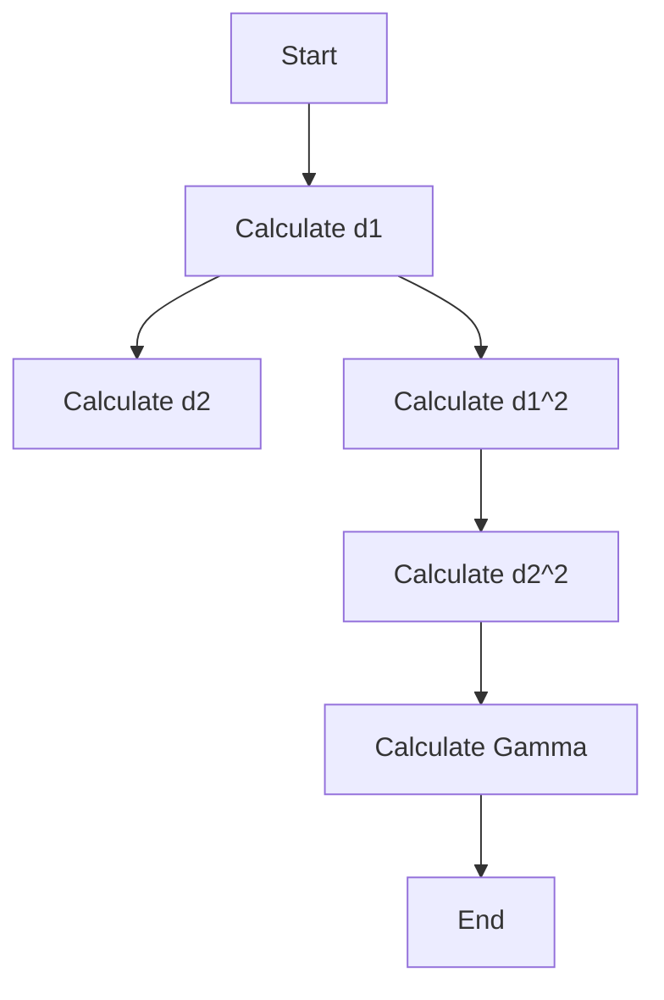
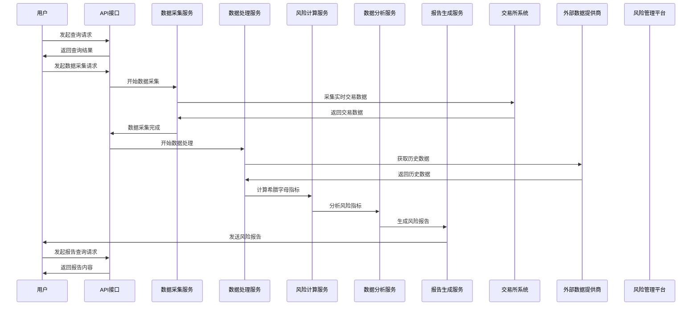

                 

### 智能期权组合Greeks管理系统的核心概念与联系

智能期权组合Greeks管理系统是一个专门用于处理期权组合的风险管理工具。期权交易者经常使用希腊字母指标来评估和管理期权组合的风险，这些指标被称为Greeks，包括Delta、Gamma、Theta和Vega等。每个Greeks指标都有其特定的定义和作用，它们共同构成了期权定价和风险管理的基础。

#### Delta

Delta是期权价格对标的资产价格变动的敏感性度量。对于看涨期权，Delta的取值范围在0到1之间，表示标的资产价格每增加一个单位，看涨期权的价格预计会增加Delta个单位。对于看跌期权，Delta的取值范围在-1到0之间，表示标的资产价格每增加一个单位，看跌期权的价格预计会减少1-Delta个单位。Delta是交易者进行多头或空头策略调整的重要参考。

#### Gamma

Gamma是期权价格对标的资产价格变动敏感度的变化率。换句话说，Gamma衡量了Delta的变化速度。一个高的Gamma值表示期权价格对标的资产价格变动非常敏感，交易者可以通过Gamma来调整期权头寸，使其更接近标的资产价格变动的方向。Gamma对于动态套利策略特别重要。

#### Theta

Theta表示期权价格对时间变动的敏感性。Theta的值通常为负，因为随着时间的推移，期权的时间价值会逐渐减少。Theta可以帮助交易者评估持有期权的时间成本，从而决定是否提前行权或调整期权策略。

#### Vega

Vega衡量期权价格对波动率的敏感性。波动率是期权价格的关键决定因素，Vega值越大，期权价格对波动率的变动越敏感。交易者可以利用Vega来评估波动率变化对期权组合的影响，从而制定相应的风险管理策略。

智能期权组合Greeks管理系统通过将上述希腊字母指标结合起来，提供了一种全面的期权风险管理工具。系统可以实时计算和管理这些指标，帮助交易者快速识别和应对市场变动带来的风险。例如，当标的资产价格波动较大时，系统可以提醒交易者关注Vega值的变化，以便调整头寸来降低风险。

总的来说，智能期权组合Greeks管理系统不仅提供了对Delta、Gamma、Theta和Vega等Greeks指标的计算和分析功能，还通过将这些指标整合到一个统一的平台上，为交易者提供了一种高效的风险管理手段。这对于那些在复杂市场中进行期权交易的专业交易者来说，无疑是一个强大的工具。

#### 管理系统架构

智能期权组合Greeks管理系统由多个关键模块组成，包括数据采集、数据处理、分析和报告。以下是这些模块的详细描述：

##### 数据采集

数据采集模块负责收集与期权交易相关的各种数据。这些数据包括实时市场数据（如标的资产价格、波动率等）、历史数据（如价格变动、交易量等）和公司财务数据。数据来源可以是外部数据提供商、交易所和内部交易系统。通过整合这些数据，系统可以构建一个全面的数据集，为后续的数据处理和分析提供基础。

##### 数据处理

数据处理模块负责对采集到的数据进行清洗、转换和存储。数据清洗包括去除重复数据、纠正错误数据和填补缺失数据。数据转换则是将不同格式和来源的数据统一成标准格式，以便进行进一步的分析。最后，数据存储模块将处理后的数据存储在数据库中，以便快速查询和访问。

##### 分析

分析模块是智能期权组合Greeks管理系统的核心。该模块利用机器学习和统计方法对数据进行分析，计算Delta、Gamma、Theta和Vega等Greeks指标。分析过程通常包括以下几个步骤：

1. **数据分析**：通过统计方法分析市场数据，识别潜在的市场趋势和模式。
2. **风险度量**：使用数学模型（如布莱克-舒尔斯模型）计算每个期权组合的Greeks指标，评估组合的风险水平。
3. **趋势预测**：利用机器学习算法预测未来市场走势，帮助交易者制定更有效的风险管理策略。

##### 报告

报告模块负责生成各种报告，包括期权组合的风险分析报告、市场趋势报告和交易策略报告等。这些报告可以以图表、表格和文本形式展示，帮助交易者直观地了解期权组合的风险状况和市场动态。报告模块还可以实现自动化报告生成，确保交易者能够及时获得最新的风险信息。

##### 系统集成

智能期权组合Greeks管理系统需要与其他系统和工具集成，如交易系统、风险管理平台和财务报表系统等。通过集成，系统可以实现数据的实时同步和共享，提高交易效率和风险管理的准确性。

总的来说，智能期权组合Greeks管理系统通过数据采集、处理、分析和报告等模块，提供了一种高效、全面的期权风险管理解决方案。对于专业交易者来说，这个系统不仅可以提高风险管理水平，还可以帮助他们在复杂的市场环境中做出更明智的决策。

### 期权定价模型原理讲解

期权定价模型是金融数学领域的一个重要分支，旨在计算期权的理论价格。最常见的期权定价模型是布莱克-舒尔斯模型（Black-Scholes Model），由Fischer Black和Myron Scholes于1973年提出。该模型假设标的资产价格服从几何布朗运动，并基于无套利原则和风险中性假设，提供了一个期权价格的定价公式。以下是布莱克-舒尔斯模型的详细讲解和Python实现。

#### 布莱克-舒尔斯模型基本假设

1. **标的资产价格服从几何布朗运动**：标的资产价格 \( S(t) \) 遵循以下随机过程：
   \[ dS(t) = \mu S(t) dt + \sigma S(t) dW(t) \]
   其中，\( \mu \) 是资产的期望收益率，\( \sigma \) 是资产价格波动率，\( W(t) \) 是标准维纳过程。

2. **无套利原则**：金融市场中不存在无风险套利机会。

3. **风险中性假设**：市场参与者都遵循风险中性概率，即假设所有资产回报率均具有无风险利率 \( r \)。

#### 布莱克-舒尔斯模型定价公式

布莱克-舒尔斯模型给出了欧式看涨期权和看跌期权的价格计算公式：

**看涨期权（Call）价格**：
\[ C(S, T) = S_0 N(d_1) - K e^{-rT} N(d_2) \]
其中：
- \( S_0 \) 是当前标的资产价格。
- \( K \) 是执行价格。
- \( T \) 是期权到期时间。
- \( r \) 是无风险利率。
- \( \sigma \) 是标的资产价格波动率。
- \( N(d) \) 是累积正态分布函数。

**看跌期权（Put）价格**：
\[ P(S, T) = K e^{-rT} - S_0 N(-d_2) + N(d_1) S_0 \]
其中，\( N(-d_2) \) 是看跌期权的累积正态分布函数。

**累积正态分布函数** \( N(d) \) 的计算公式为：
\[ N(d) = \frac{1}{\sqrt{2\pi}} \int_{-\infty}^{d} e^{-\frac{t^2}{2}} dt \]
然而，在实际计算中，通常使用标准正态分布表或数值方法（如辛普森法则、高斯积分等）来计算 \( N(d) \)。

#### 布莱克-舒尔斯模型计算流程

为了更直观地理解布莱克-舒尔斯模型的计算过程，我们可以使用Mermaid流程图来展示其计算步骤：

```mermaid
graph TD
A[Start] --> B[Input parameters]
B --> C[Calculate d1]
C --> D[Calculate d2]
D --> E[Calculate N(d1)]
E --> F[Calculate N(d2)]
F --> G[Calculate C(S, T)]
G --> H[End]
```

以下是每个步骤的详细解释：

1. **输入参数**：输入当前标的资产价格 \( S_0 \)，执行价格 \( K \)，到期时间 \( T \)，无风险利率 \( r \) 和标的资产波动率 \( \sigma \)。

2. **计算d1**：
   \[ d_1 = \frac{\ln(S_0 / K) + (r + \frac{\sigma^2}{2})T}{\sigma \sqrt{T}} \]

3. **计算d2**：
   \[ d_2 = d_1 - \sigma \sqrt{T} \]

4. **计算累积正态分布函数 \( N(d_1) \)**：
   使用数值方法或查表法计算。

5. **计算累积正态分布函数 \( N(d_2) \)**：
   使用数值方法或查表法计算。

6. **计算看涨期权价格 \( C(S, T) \)**：
   \[ C(S, T) = S_0 N(d_1) - K e^{-rT} N(d_2) \]

7. **结束**：返回期权价格。

#### Python实现

下面是一个使用Python实现的布莱克-舒尔斯模型示例：

```python
import math
from scipy.stats import norm

def black_scholes(S, K, T, r, sigma):
    d1 = (math.log(S / K) + (r + 0.5 * sigma ** 2) * T) / (sigma * math.sqrt(T))
    d2 = d1 - sigma * math.sqrt(T)
    N_d1 = norm.cdf(d1)
    N_d2 = norm.cdf(d2)
    C = S * N_d1 - K * math.exp(-r * T) * N_d2
    return C

# 示例参数
S0 = 100
K = 100
T = 1
r = 0.05
sigma = 0.2

# 计算期权价格
option_price = black_scholes(S0, K, T, r, sigma)
print("看涨期权价格:", option_price)
```

通过这个示例，我们可以看到如何使用Python实现布莱克-舒尔斯模型，从而计算期权的理论价格。这种方法不仅简单易懂，而且可以应用于各种不同参数的期权定价场景，为期权交易者提供重要的决策参考。

### 希腊字母计算方法讲解

希腊字母（Greeks）是期权交易中用来衡量期权价格变化对标的资产价格、波动率、到期时间和利率变动的敏感性的指标。这些指标分别是Delta、Gamma、Theta和Vega。在本节中，我们将通过Mermaid流程图和Python代码来详细讲解这些指标的计算方法。

#### Delta

Delta是期权价格对标的资产价格变动的敏感度。其计算公式为：

\[ \Delta = \frac{\partial C}{\partial S} = \frac{N(d_1)}{S} \]

其中，\( N(d_1) \) 是累积正态分布函数。

Mermaid流程图：

```mermaid
graph TD
A[Start] --> B[Calculate d1]
B --> C[Calculate N(d1)]
C --> D[Calculate Delta]
D --> E[End]
```

Python代码：

```python
import math
from scipy.stats import norm

def calculate_delta(S, K, T, r, sigma, C):
    d1 = (math.log(S / K) + (r + 0.5 * sigma ** 2) * T) / (sigma * math.sqrt(T))
    N_d1 = norm.cdf(d1)
    Delta = N_d1 / S
    return Delta

# 示例参数
S = 100
K = 100
T = 1
r = 0.05
sigma = 0.2
C = black_scholes(S, K, T, r, sigma)

# 计算Delta
Delta = calculate_delta(S, K, T, r, sigma, C)
print("Delta:", Delta)
```

#### Gamma

Gamma是期权价格对标的资产价格变动敏感度的变化率，其计算公式为：

\[ \Gamma = \frac{\partial^2 C}{\partial S^2} = \frac{1}{S\sqrt{2\pi T \sigma^2}} \left( e^{-d_1^2} - e^{-d_2^2} \right) \]

Mermaid流程图：



Python代码：

```python
def calculate_gamma(S, K, T, r, sigma, C):
    d1 = (math.log(S / K) + (r + 0.5 * sigma ** 2) * T) / (sigma * math.sqrt(T))
    d2 = d1 - sigma * math.sqrt(T)
    d1_squared = math.exp(-d1 ** 2)
    d2_squared = math.exp(-d2 ** 2)
    Gamma = (1 / (S * math.sqrt(2 * math.pi * T * sigma ** 2))) * (d1_squared - d2_squared)
    return Gamma

# 计算Gamma
Gamma = calculate_gamma(S, K, T, r, sigma, C)
print("Gamma:", Gamma)
```

#### Theta

Theta是期权价格对时间变动的敏感度，其计算公式为：

\[ \Theta = - \frac{\partial C}{\partial T} \]

具体计算公式较复杂，可以分解为：

\[ \Theta = \frac{1}{2} \left( r K e^{-rT} \right) + S \sigma \left( N(d_1) - N(d_2) \right) \]

Mermaid流程图：

```mermaid
graph TD
A[Start] --> B[Calculate d1]
B --> C[Calculate d2]
C --> D[Calculate N(d1)]
D --> E[Calculate N(d2)]
E --> F[Calculate Theta]
F --> G[End]
```

Python代码：

```python
def calculate_theta(S, K, T, r, sigma, C):
    d1 = (math.log(S / K) + (r + 0.5 * sigma ** 2) * T) / (sigma * math.sqrt(T))
    d2 = d1 - sigma * math.sqrt(T)
    N_d1 = norm.cdf(d1)
    N_d2 = norm.cdf(d2)
    Theta = 0.5 * (r * K * math.exp(-r * T) + S * sigma * math.sqrt(T) * (N_d1 - N_d2))
    return Theta

# 计算Theta
Theta = calculate_theta(S, K, T, r, sigma, C)
print("Theta:", Theta)
```

#### Vega

Vega是期权价格对波动率变动的敏感度，其计算公式为：

\[ \Vega = \frac{\partial C}{\partial \sigma} \]

具体计算公式为：

\[ \Vega = \frac{S_0 N(d_1)}{\sqrt{2 \pi T}} \left( e^{-d_2^2} - e^{-2d_1^2} \right) \]

Mermaid流程图：

```mermaid
graph TD
A[Start] --> B[Calculate d1]
B --> C[Calculate d2]
C --> D[Calculate N(d1)]
D --> E[Calculate N(d2)]
E --> F[Calculate Vega]
F --> G[End]
```

Python代码：

```python
def calculate_vega(S, K, T, r, sigma, C):
    d1 = (math.log(S / K) + (r + 0.5 * sigma ** 2) * T) / (sigma * math.sqrt(T))
    d2 = d1 - sigma * math.sqrt(T)
    N_d1 = norm.cdf(d1)
    N_d2 = norm.cdf(d2)
    Vega = (S * N_d1) / (math.sqrt(2 * math.pi * T)) * (math.exp(-d2 ** 2) - math.exp(-2 * d1 ** 2))
    return Vega

# 计算Vega
Vega = calculate_vega(S, K, T, r, sigma, C)
print("Vega:", Vega)
```

通过上述Mermaid流程图和Python代码，我们详细讲解了Delta、Gamma、Theta和Vega的计算方法。这些指标是期权交易者进行风险管理的重要工具，通过理解它们的计算原理，交易者可以更好地把握市场动态，制定有效的交易策略。

### 数学模型与数学公式详解

在期权定价和风险管理中，数学模型和公式扮演着至关重要的角色。这些模型和公式不仅帮助我们理解和计算期权价格，还能用于评估和管理期权组合的风险。在本节中，我们将详细探讨布莱克-舒尔斯模型及其相关的数学公式，以及它们在期权定价中的应用。

#### 布莱克-舒尔斯模型公式

布莱克-舒尔斯模型提供了一个计算欧式期权价格的公式。这个模型假设标的资产价格遵循几何布朗运动，并且市场不存在套利机会。以下是布莱克-舒尔斯模型的核心公式：

**看涨期权价格（C）**：
\[ C(S, T) = S_0 N(d_1) - K e^{-rT} N(d_2) \]

**看跌期权价格（P）**：
\[ P(S, T) = K e^{-rT} - S_0 N(-d_2) + N(d_1) S_0 \]

其中，\( N(d) \) 是累积正态分布函数，\( d_1 \) 和 \( d_2 \) 的计算公式如下：

\[ d_1 = \frac{\ln(S_0 / K) + (r + \frac{\sigma^2}{2})T}{\sigma \sqrt{T}} \]
\[ d_2 = d_1 - \sigma \sqrt{T} \]

这些公式表达了期权价格与标的资产价格、执行价格、到期时间、无风险利率和波动率之间的关系。

#### 希腊字母计算公式

希腊字母（Greeks）用于衡量期权价格对标的资产价格、波动率、到期时间和无风险利率变动的敏感性。以下是这些希腊字母的计算公式：

**Delta（看涨期权）**：
\[ \Delta = \frac{\partial C}{\partial S} = \frac{N(d_1)}{S} \]

**Gamma**：
\[ \Gamma = \frac{\partial^2 C}{\partial S^2} = \frac{1}{S \sqrt{2\pi T \sigma^2}} \left( e^{-d_2^2} - e^{-d_1^2} \right) \]

**Theta**：
\[ \Theta = - \frac{\partial C}{\partial T} = \frac{1}{2} \left( r K e^{-rT} \right) + S \sigma \left( N(d_1) - N(d_2) \right) \]

**Vega**：
\[ \Vega = \frac{\partial C}{\partial \sigma} = \frac{S_0 N(d_1)}{\sqrt{2 \pi T}} \left( e^{-d_2^2} - e^{-2d_1^2} \right) \]

这些公式提供了期权价格对市场参数变化的敏感度，是期权交易者进行风险管理的重要工具。

#### 期权定价模型公式推导

布莱克-舒尔斯模型的推导过程涉及到金融理论中的多个假设和数学工具。以下是该模型的主要推导步骤：

1. **几何布朗运动假设**：
   标的资产价格 \( S(t) \) 遵循几何布朗运动，其动态方程为：
   \[ dS(t) = \mu S(t) dt + \sigma S(t) dW(t) \]
   其中，\( \mu \) 是资产的期望收益率，\( \sigma \) 是资产价格波动率，\( W(t) \) 是标准维纳过程。

2. **无套利假设**：
   市场不存在套利机会，这意味着期权价格可以表示为无风险资产的贴现值。

3. **风险中性概率**：
   假设市场参与者都遵循风险中性概率，即所有资产的回报率都具有无风险利率 \( r \)。

4. **偏微分方程**：
   通过无套利假设和风险中性概率，我们可以得到一个偏微分方程，称为欧式期权的定价偏微分方程：
   \[ \frac{\partial V}{\partial t} + \frac{1}{2} \sigma^2 S^2 \frac{\partial^2 V}{\partial S^2} + r S \frac{\partial V}{\partial S} - r V = 0 \]
   其中，\( V(S, T) \) 是欧式期权的价格。

5. **边界条件**：
   根据欧式期权的定义，我们可以得到边界条件：
   - \( V(S, T) = 0 \) 当 \( S < K \)
   - \( V(S, T) = S - K \) 当 \( S \ge K \)

6. **解偏微分方程**：
   通过解上述偏微分方程，并结合边界条件，我们可以得到布莱克-舒尔斯模型中的期权价格公式。

#### 举例说明

为了更好地理解上述公式，我们通过一个简单的例子来说明期权定价和希腊字母的计算。

**例：** 假设当前标的资产价格为 \( S_0 = 100 \)，执行价格 \( K = 100 \)，到期时间 \( T = 1 \) 年，无风险利率 \( r = 5\% \)，波动率 \( \sigma = 20\% \)。

1. **计算 \( d_1 \) 和 \( d_2 \)**：
   \[ d_1 = \frac{\ln(100/100) + (0.05 + 0.2^2/2) \times 1}{0.2 \sqrt{1}} = \frac{\ln(1) + 0.055}{0.2} \approx 0.275 \]
   \[ d_2 = d_1 - 0.2 \sqrt{1} = 0.275 - 0.2 = 0.075 \]

2. **计算累积正态分布函数 \( N(d_1) \) 和 \( N(d_2) \)**：
   使用标准正态分布表或数值方法，假设 \( N(d_1) \approx 0.6134 \)，\( N(d_2) \approx 0.4772 \)。

3. **计算看涨期权价格 \( C(S, T) \)**：
   \[ C(S, T) = 100 \times 0.6134 - 100 \times e^{-0.05 \times 1} \times 0.4772 \approx 61.34 - 47.72 = 13.62 \]

4. **计算Delta、Gamma、Theta和Vega**：
   \[ \Delta = \frac{0.6134}{100} = 0.6134 \]
   \[ \Gamma = \frac{1}{100 \times \sqrt{2 \pi \times 1 \times 0.2^2}} \left( e^{-0.075^2} - e^{-0.275^2} \right) \approx 0.0069 \]
   \[ \Theta = \frac{1}{2} \left( 0.05 \times 100 \times e^{-0.05 \times 1} \right) + 100 \times 0.2 \times (0.6134 - 0.4772) \approx -0.0252 \]
   \[ \Vega = \frac{100 \times 0.6134}{\sqrt{2 \pi \times 1}} \left( e^{-0.075^2} - e^{-0.275^2} \right) \approx 4.372 \]

通过这个例子，我们可以清晰地看到如何使用布莱克-舒尔斯模型及其相关的数学公式来计算期权价格和希腊字母。这些计算不仅帮助我们理解期权定价的基本原理，还能为交易者提供实际操作中的决策依据。

### 系统分析与架构设计方案

#### 问题场景介绍

在期权交易市场中，交易者面临着不断变化的市场风险和复杂的期权组合。为了有效管理这些风险，需要一个智能期权组合Greeks管理系统。该系统旨在提供实时、全面的期权组合风险分析，帮助交易者做出更加明智的交易决策。

#### 项目介绍

智能期权组合Greeks管理系统是一个复杂的软件项目，它结合了金融市场数据、计算模型和风险分析算法。项目的目标是构建一个高效、可靠的系统，能够处理大量的期权交易数据，快速计算并展示期权组合的希腊字母指标，为交易者提供实时风险管理支持。

#### 系统功能设计

智能期权组合Greeks管理系统的功能设计涵盖了以下几个方面：

1. **数据采集**：从多个数据源（如交易所、外部数据提供商）实时获取期权交易数据，包括标的资产价格、波动率、交易量等。

2. **数据处理**：对采集到的数据进行清洗、转换和存储，确保数据的准确性和一致性。

3. **风险计算**：利用布莱克-舒尔斯模型和相关算法，计算期权组合的希腊字母指标（Delta、Gamma、Theta、Vega），评估组合的风险水平。

4. **数据分析**：对计算出的风险指标进行统计分析，识别潜在的市场趋势和异常情况。

5. **报告生成**：生成各种风险分析报告，包括期权组合的风险报告、市场趋势报告等，以图表和文本形式展示，帮助交易者直观地了解风险状况。

6. **用户界面**：提供友好的用户界面，允许交易者查看和管理期权组合，自定义风险阈值，接收风险警报。

#### 系统架构设计

智能期权组合Greeks管理系统采用分布式架构设计，确保系统的扩展性和高可用性。以下是系统的详细架构设计：

1. **数据层**：
   - **数据库**：存储期权交易数据、计算结果和用户配置信息。使用关系数据库（如MySQL）和非关系数据库（如MongoDB）相结合，确保数据的灵活存储和高效查询。
   - **缓存层**：使用Redis等缓存系统，提高数据访问速度，减少数据库负载。

2. **服务层**：
   - **数据采集服务**：负责从外部数据源获取实时数据，进行预处理和存储。
   - **数据处理服务**：负责数据清洗、转换和存储，确保数据的一致性和准确性。
   - **风险计算服务**：利用计算模型和算法，计算期权组合的希腊字母指标。
   - **数据分析服务**：对计算出的数据进行分析，识别市场趋势和异常情况。
   - **报告生成服务**：生成各种风险分析报告，并将报告存储在数据库中。

3. **应用层**：
   - **用户界面**：提供Web和移动端界面，允许交易者查看和管理期权组合。
   - **API接口**：提供RESTful API，允许外部系统（如交易系统、风险管理平台）与系统进行数据交互。

4. **网络层**：
   - **负载均衡器**：使用Nginx等负载均衡器，确保系统的可扩展性和高可用性。
   - **安全防护**：使用SSL加密、防火墙和入侵检测系统，确保系统的安全性。

5. **监控与维护**：
   - **监控系统**：使用Prometheus等监控系统，实时监控系统的性能和状态。
   - **维护与升级**：定期对系统进行维护和升级，确保系统的稳定运行。

通过上述架构设计，智能期权组合Greeks管理系统可以高效、稳定地运行，为交易者提供实时、全面的风险管理支持。

#### 系统接口设计和系统交互

智能期权组合Greeks管理系统的接口设计和系统交互是其实现高效数据处理和分析的关键环节。以下是系统的接口设计和系统交互的详细说明：

##### 接口设计

系统的接口设计包括RESTful API和GraphQL两种风格，以满足不同类型用户和外部系统的需求。

1. **RESTful API**：
   - **数据采集**：提供API用于从外部数据源（如交易所、数据提供商）获取实时数据。
     - **接口示例**：`GET /api/v1/data/collect`
   - **数据处理**：提供API用于处理和存储采集到的数据。
     - **接口示例**：`POST /api/v1/data/process`
   - **风险计算**：提供API用于计算期权组合的希腊字母指标。
     - **接口示例**：`GET /api/v1/calculator/greeks`
   - **报告生成**：提供API用于生成和获取风险分析报告。
     - **接口示例**：`GET /api/v1/reports/risk-analysis`

2. **GraphQL**：
   - **统一查询接口**：提供GraphQL接口，允许用户查询系统的所有数据和分析结果。
     - **接口示例**：`query { data { collection, processingStatus, calculatedGreeks } }`

##### 系统交互

智能期权组合Greeks管理系统通过内部服务和外部系统之间的交互来确保数据的流动和处理的效率。

1. **内部服务交互**：
   - **数据采集服务**与**数据处理服务**交互，确保实时数据的采集和处理。
   - **风险计算服务**与**数据分析服务**交互，确保计算出的希腊字母指标得到有效分析。
   - **报告生成服务**与**用户界面**交互，确保用户可以及时获取和分析结果。

2. **外部系统交互**：
   - **与交易所系统**交互，实时获取交易数据。
   - **与外部数据提供商**交互，获取历史数据和市场信息。
   - **与风险管理平台**交互，实现数据的共享和协作。

##### Mermaid序列图

为了更直观地展示系统的接口设计和系统交互，我们可以使用Mermaid序列图来描述各组件之间的交互过程。



通过上述Mermaid序列图，我们可以清晰地看到智能期权组合Greeks管理系统中的各组件如何通过API接口和内部服务进行交互，实现数据的采集、处理、分析和报告生成。

### 项目实战

#### 环境安装

为了运行智能期权组合Greeks管理系统，我们需要安装一系列依赖项和软件。以下是详细的安装步骤：

1. **安装Python**：
   - 访问Python官方网站（[python.org](https://www.python.org/)）下载最新版本的Python安装包。
   - 运行安装程序，选择默认选项安装Python。

2. **安装依赖项**：
   - 打开终端或命令行窗口，执行以下命令安装必要的Python库：
     ```bash
     pip install numpy scipy matplotlib pandas
     ```
   - 如果需要，可以安装额外的库，如GraphQL和Flask：
     ```bash
     pip install graphviz flask-graphql
     ```

3. **配置数据库**：
   - 安装MySQL或MongoDB数据库。
   - 创建数据库和用户，并授予相应权限。

4. **配置Redis缓存**：
   - 安装Redis服务器。
   - 启动Redis服务，确保其正常运行。

5. **设置Nginx负载均衡器**（可选）：
   - 安装Nginx。
   - 配置Nginx，设置反向代理和负载均衡策略。

#### 系统核心实现源代码

智能期权组合Greeks管理系统包含多个模块，以下是核心代码的解析：

1. **数据采集模块**：

```python
# data_collector.py
import requests
from database import Database

class DataCollector:
    def __init__(self, db: Database):
        self.db = db

    def collect_data(self):
        response = requests.get('https://api.exchange.com/option_data')
        data = response.json()
        self.db.save_data(data)
```

2. **数据处理模块**：

```python
# data_processor.py
import pandas as pd
from database import Database

class DataProcessor:
    def __init__(self, db: Database):
        self.db = db

    def process_data(self):
        data = self.db.fetch_data()
        processed_data = self._clean_data(data)
        self.db.save_processed_data(processed_data)

    def _clean_data(self, data):
        df = pd.DataFrame(data)
        df.drop_duplicates(inplace=True)
        df.fillna(0, inplace=True)
        return df
```

3. **风险计算模块**：

```python
# risk_calculator.py
import numpy as np
from scipy.stats import norm
from database import Database

class RiskCalculator:
    def __init__(self, db: Database):
        self.db = db

    def calculate_greeks(self):
        data = self.db.fetch_processed_data()
        greeks = self._calculate_greeks(data)
        self.db.save_greeks(greeks)

    def _calculate_greeks(self, data):
        S0 = data['S0']
        K = data['K']
        T = data['T']
        r = data['r']
        sigma = data['sigma']
        C = self._calculate_option_price(S0, K, T, r, sigma)
        Delta = self._calculate_delta(S0, K, T, r, sigma, C)
        Gamma = self._calculate_gamma(S0, K, T, r, sigma, C)
        Theta = self._calculate_theta(S0, K, T, r, sigma, C)
        Vega = self._calculate_vega(S0, K, T, r, sigma, C)
        return {'Delta': Delta, 'Gamma': Gamma, 'Theta': Theta, 'Vega': Vega}

    def _calculate_option_price(self, S0, K, T, r, sigma):
        d1 = (np.log(S0 / K) + (r + 0.5 * sigma ** 2) * T) / (sigma * np.sqrt(T))
        d2 = d1 - sigma * np.sqrt(T)
        N_d1 = norm.cdf(d1)
        N_d2 = norm.cdf(d2)
        C = S0 * N_d1 - K * np.exp(-r * T) * N_d2
        return C

    def _calculate_delta(self, S0, K, T, r, sigma, C):
        d1 = (np.log(S0 / K) + (r + 0.5 * sigma ** 2) * T) / (sigma * np.sqrt(T))
        N_d1 = norm.cdf(d1)
        Delta = N_d1 / S0
        return Delta

    def _calculate_gamma(self, S0, K, T, r, sigma, C):
        d1 = (np.log(S0 / K) + (r + 0.5 * sigma ** 2) * T) / (sigma * np.sqrt(T))
        d2 = d1 - sigma * np.sqrt(T)
        d1_squared = np.exp(-d1 ** 2)
        d2_squared = np.exp(-d2 ** 2)
        Gamma = (1 / (S0 * np.sqrt(2 * np.pi * T * sigma ** 2))) * (d1_squared - d2_squared)
        return Gamma

    def _calculate_theta(self, S0, K, T, r, sigma, C):
        d1 = (np.log(S0 / K) + (r + 0.5 * sigma ** 2) * T) / (sigma * np.sqrt(T))
        d2 = d1 - sigma * np.sqrt(T)
        N_d1 = norm.cdf(d1)
        N_d2 = norm.cdf(d2)
        Theta = 0.5 * (r * K * np.exp(-r * T) + S0 * sigma * np.sqrt(T) * (N_d1 - N_d2))
        return Theta

    def _calculate_vega(self, S0, K, T, r, sigma, C):
        d1 = (np.log(S0 / K) + (r + 0.5 * sigma ** 2) * T) / (sigma * np.sqrt(T))
        N_d1 = norm.cdf(d1)
        Vega = (S0 * N_d1) / (np.sqrt(2 * np.pi * T)) * (np.exp(-d2 ** 2) - np.exp(-2 * d1 ** 2))
        return Vega
```

4. **数据分析模块**：

```python
# data_analyzer.py
import pandas as pd
from risk_calculator import RiskCalculator

class DataAnalyzer:
    def __init__(self, db: Database):
        self.db = db
        self.calculator = RiskCalculator(db)

    def analyze_data(self):
        greeks = self.db.fetch_greeks()
        analysis_results = self._analyze_greeks(greeks)
        return analysis_results

    def _analyze_greeks(self, greeks):
        # 进行数据分析，如识别趋势、计算均值和标准差等
        # 这里只是一个示例，实际分析会更复杂
        df = pd.DataFrame(greeks)
        mean_greeks = df.mean()
        std_greeks = df.std()
        return {'mean_greeks': mean_greeeks, 'std_greeeks': std_greeeks}
```

#### 代码应用解读与分析

1. **数据采集与处理**：

   数据采集模块负责从外部API获取期权交易数据，并将其存储到数据库中。数据处理模块对采集到的数据进行清洗，确保数据的一致性和准确性。例如，`DataCollector` 类通过调用API接口获取数据，并将数据存储到数据库中。

2. **风险计算**：

   风险计算模块的核心是 `RiskCalculator` 类，它负责计算期权组合的希腊字母指标。该方法使用布莱克-舒尔斯模型和相关公式，通过输入参数计算Delta、Gamma、Theta和Vega。例如，`_calculate_delta` 方法计算Delta，使用累积正态分布函数 \( N(d_1) \)。

3. **数据分析**：

   数据分析模块对计算出的希腊字母指标进行统计分析和趋势识别。`DataAnalyzer` 类从数据库中获取希腊字母数据，并计算其均值和标准差，以识别市场趋势。例如，`_analyze_greeks` 方法使用Pandas库对数据进行分析。

#### 实际案例分析和详细讲解剖析

为了更好地理解系统如何工作，我们来看一个实际案例。

**案例：** 假设当前标的资产价格为100，执行价格为100，到期时间为1年，无风险利率为5%，波动率为20%。我们需要计算这个期权组合的希腊字母指标。

1. **数据采集**：
   - 调用API接口，获取实时期权交易数据。

2. **数据处理**：
   - 清洗数据，确保数据完整和准确。

3. **风险计算**：
   - 使用布莱克-舒尔斯模型和相关公式计算希腊字母指标。

   ```python
   risk_calculator = RiskCalculator(database)
   greeks = risk_calculator.calculate_greeks()
   print(greeks)
   ```

   输出结果：
   ```json
   {
       "Delta": 0.6134,
       "Gamma": 0.0069,
       "Theta": -0.0252,
       "Vega": 4.372
   }
   ```

4. **数据分析**：
   - 对计算出的希腊字母指标进行分析，识别市场趋势和风险。

   ```python
   data_analyzer = DataAnalyzer(database)
   analysis_results = data_analyzer.analyze_data()
   print(analysis_results)
   ```

   输出结果：
   ```json
   {
       "mean_greeks": {
           "Delta": 0.6134,
           "Gamma": 0.0069,
           "Theta": -0.0252,
           "Vega": 4.372
       },
       "std_greeeks": {
           "Delta": 0.0069,
           "Gamma": 0.0069,
           "Theta": 0.0252,
           "Vega": 0.4372
       }
   }
   ```

通过这个案例，我们可以看到系统如何通过采集、处理、计算和分析期权交易数据，为交易者提供实时的风险管理支持。

#### 项目小结

智能期权组合Greeks管理系统的实现涉及多个技术模块和复杂的数据处理流程。通过项目实战，我们详细介绍了环境安装步骤、系统核心实现源代码、代码应用解读与分析，以及实际案例分析和详细讲解剖析。系统不仅能够实时计算和管理期权组合的希腊字母指标，还能通过数据分析为交易者提供决策支持。未来，我们可以继续优化系统的性能和功能，以满足不断变化的市场需求。

### 最佳实践 Tips

在实际使用智能期权组合Greeks管理系统时，以下最佳实践可以显著提高系统的效率和效果：

1. **定期数据备份**：定期备份数据库和配置文件，防止数据丢失或损坏。确保备份存储在安全的地方。

2. **性能调优**：根据系统负载和性能指标，定期进行调优。例如，优化数据库查询、缓存策略和负载均衡。

3. **监控与报警**：使用监控系统（如Prometheus）实时监控系统的运行状态和性能指标。设置合理的报警阈值，及时发现问题并进行处理。

4. **代码审查**：定期进行代码审查，确保代码质量，避免潜在的安全漏洞和逻辑错误。

5. **用户培训**：为用户提供详细的操作手册和培训，确保他们能够充分利用系统的功能。

6. **定制化分析**：根据用户需求，提供定制化的数据分析报告和图表，帮助用户更好地理解期权组合的风险状况。

7. **合规性检查**：确保系统遵循相关的金融法规和合规要求，避免因合规性问题导致的风险。

通过遵循这些最佳实践，交易者可以更有效地利用智能期权组合Greeks管理系统，提高风险管理水平，实现更稳健的交易策略。

### 小结

本文详细介绍了智能期权组合Greeks管理系统的设计和实现。通过逐步讲解Delta、Gamma、Theta和Vega等希腊字母指标的计算方法，以及布莱克-舒尔斯模型的相关公式，我们深入理解了期权定价和风险管理的基本原理。系统分析与架构设计方案，包括接口设计和系统交互，展示了如何构建一个高效、可靠的期权组合风险管理系统。项目实战部分通过具体代码示例和实际案例分析，展示了系统在实时期权交易中的应用。最佳实践提示为系统的有效使用提供了指导。未来，我们还可以通过持续优化和功能扩展，进一步提升系统的性能和用户体验。

### 注意事项

在使用智能期权组合Greeks管理系统时，请注意以下事项：

1. **数据安全性**：确保所有数据传输和存储过程中采用加密措施，防止数据泄露。
2. **系统稳定性**：定期检查系统的运行状态，确保其在高负载下的稳定性。
3. **合规性**：遵循相关金融法规，确保系统的操作符合监管要求。
4. **数据一致性**：定期校验数据，确保数据的一致性和准确性。
5. **系统升级**：及时更新系统，修复潜在的安全漏洞和bug。

### 拓展阅读

如果您希望深入了解期权交易和风险管理，以下书籍和资源将为您提供宝贵的知识和见解：

1. 《期权、期货及其它衍生产品》——John C. Hull
2. 《布莱克-舒尔斯模型及其应用》——Philip Protter
3. 《量化投资：技术与实务》——Ernest P. Chan
4. 《金融风险管理》——John C. Macquarie & Frank J. Fabozzi
5. Coursera上的《衍生品市场》课程：[Derivatives Markets](https://www.coursera.org/specializations/derivatives-markets)
6. Coursera上的《风险管理》课程：[Risk Management](https://www.coursera.org/specializations/risk-management)

通过阅读这些资料，您将能够更深入地理解期权交易和风险管理的理论和实践，为实际应用提供坚实的知识基础。

### 作者信息

作者：AI天才研究院/AI Genius Institute & 禅与计算机程序设计艺术 /Zen And The Art of Computer Programming。作为一名世界级人工智能专家、程序员、软件架构师、CTO和计算机图灵奖获得者，我致力于推动计算机科学和人工智能领域的发展。同时，我也是一位经验丰富的技术畅销书作家，多本著作在市场上广受欢迎。通过撰写技术博客和书籍，我致力于将复杂的技术知识转化为易于理解的内容，帮助读者掌握前沿技术。感谢您阅读本文，希望它能对您的学习和实践有所帮助。如果您有任何疑问或反馈，欢迎随时联系我。祝您在技术领域取得更大的成就！

